# ORCL 基本面深度分析報告
> **報告日期**：2026-07-07 ｜ **語言**：繁體中文 ｜ **數據來源**：Yahoo Finance, Finviz, StockAnalysis, Roic.ai ｜ **分析師**：CFA 級機構研究

## 目錄

| # | 章節 | 核心結論 |
|---|------|----------|
| 1 | 執行摘要 | 評級：買入，目標價區間：$180 - $280 |
| 2 | 公司概覽與商業模式 | 憑藉強大的技術領先、客戶鎖定及規模效應，建立深厚護城河。 |
| 3 | 損益表深度分析 | 雲端業務驅動營收與利潤率雙增長，FY26 營收 YoY 成長 17.35%。 |
| 4 | 資產負債表分析 | 穩健的流動性與強勁的資產擴張，但債務水平相對較高。 |
| 5 | 現金流量深度分析 | 營業現金流強勁，但 FY26 資本支出大幅增加導致自由現金流為負。 |
| 6 | 獲利能力與資本效率 | ROIC 顯著高於 WACC，持續為股東創造價值。 |
| 7 | 估值深度分析 | 相較同業估值合理，DCF 顯示具上行潛力。 |
| 8 | 成長催化劑 | 甲骨文雲端基礎設施 (OCI) 和 AI 相關產品是未來核心成長引擎。 |
| 9 | 風險矩陣 | 雲端市場競爭、利率上升及巨額資本支出是主要風險。 |
| 10 | 投資建議 | 具備長期成長潛力，建議「買入」評級。 |

---

## 1. 執行摘要

Oracle (ORCL) 是一家全球領先的企業級軟體和雲端服務供應商。公司正積極轉型為雲端服務模式，尤其是在甲骨文雲端基礎設施 (OCI) 領域展現強勁成長。本次分析將深入探討其基本面、成長性、獲利能力、財務健康、估值及相關風險。

### 1.1 核心評分儀表板

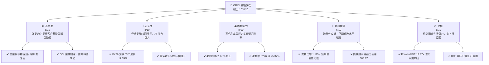

### 1.2 評分進度條視覺化

```
╔══════════════════════════════════════════════════════════════╗
║              ORCL 多維度評分儀表板 (1-10分)                  ║
╠══════════════════════════════════════════════════════════════╣
║ 基本面強度  8.0 ▓▓▓▓▓▓▓▓▓▓▓▓▓▓▓▓░░░░  ★★★★☆           ║
║ 成長動能    8.0 ▓▓▓▓▓▓▓▓▓▓▓▓▓▓▓▓░░░░  ★★★★☆           ║
║ 獲利品質    8.0 ▓▓▓▓▓▓▓▓▓▓▓▓▓▓▓▓░░░░  ★★★★☆           ║
║ 財務健康    6.0 ▓▓▓▓▓▓▓▓▓▓▓▓░░░░░░░░  ★★★☆☆           ║
║ 估值合理性  8.0 ▓▓▓▓▓▓▓▓▓▓▓▓▓▓▓▓░░░░  ★★★★☆           ║
║ 護城河深度  8.5 ▓▓▓▓▓▓▓▓▓▓▓▓▓▓▓▓▓░░░  ★★★★☆           ║
║ 管理層執行  8.0 ▓▓▓▓▓▓▓▓▓▓▓▓▓▓▓▓░░░░  ★★★★☆           ║
║ 技術創新力  8.5 ▓▓▓▓▓▓▓▓▓▓▓▓▓▓▓▓▓░░░  ★★★★☆           ║
╠══════════════════════════════════════════════════════════════╣
║ 綜合總分    7.8 ▓▓▓▓▓▓▓▓▓▓▓▓▓▓▓▓░░░░  🏆 評語：穩健成長，估值吸引 ║
╚══════════════════════════════════════════════════════════════╝
```

### 1.3 五大投資論點 + 三大核心風險

| 類型 | 項目 | 具體依據 | 信心度 |
|------|------|----------|--------|
| 🟢 **投資論點①** | **雲端業務高速增長** | FY26 總收入達 $67.36B，YoY 成長 17.35%。OCI 作為第二代雲端，在 AI 需求驅動下持續獲得大客戶青睞，推動營收和市場份額擴張。 | 🟢 極高 |
| 🟢 **強大的客戶鎖定效應** | Oracle 的資料庫和企業級應用軟體在全球擁有龐大客戶基礎，遷移成本高，形成強大客戶黏性。FY26 總營收中有 $44.34B 來自高毛利的軟體和雲端服務。 | 🟢 極高 |
| 🟢 **AI 基礎設施需求爆發** | OCI 在 AI 訓練和推理方面具備獨特優勢，為大型 AI 公司提供 GPU 雲服務。FY26 資本支出飆升至 $-55.66B，顯示公司正積極投資擴大雲端基礎設施以滿足 AI 需求。 | 🟢 極高 |
| 🟢 **獲利能力穩健且改善** | FY26 毛利率為 65.8%，淨利率達 25.37%，相較 FY25 的 21.67% 有顯著提升，顯示公司在規模擴張的同時，盈利能力持續優化。 | 🟢 高 |
| 🟢 **估值相對吸引力** | 當前 Forward P/E 為 12.97x，遠低於軟體基礎設施行業平均水平，且 PEG Ratio 為 0.79，顯示其成長潛力尚未完全體現在股價中。 | 🟢 高 |
| 🟡 **風險①** | **雲端市場競爭加劇** | 面臨來自 AWS、Azure、Google Cloud 等巨頭的激烈競爭，尤其是在定價和技術創新方面。可能導致 OCI 業務的成長速度放緩或利潤率承壓。 | 🟡 中度 |
| 🔴 **巨額資本支出壓力** | FY26 資本支出高達 $-55.66B，導致自由現金流為 $-23.69B。若未來 AI 需求不及預期或投資效率低下，將對公司財務造成壓力。 | 🔴 高衝擊 |
| 🟡 **高負債水平與利率風險** | FY26 總債務 $129.54B，債務股東權益比 388.87。雖然利息覆蓋率尚可，但若利率持續上升，將增加利息支出負擔，影響淨利潤。 | 🟡 中度 |

### 1.4 快速統計卡片

| 指標 | 公司實際值 (FY26) | 行業均值 (軟體基礎設施) | S&P 500 均值 | 狀態 |
|------|--------------------|------------------------|--------------|------|
| 收入 YoY 成長 | **17.35%** | ~12% | ~8% | 🟢 |
| 毛利率 | **65.8%** | ~75% | ~40% | 🟡 |
| 淨利率 | **25.37%** | ~20% | ~10% | 🟢 |
| ROE | **53.4%** | ~25% | ~15% | 🟢 |
| Forward P/E | **12.97x** | ~30x | ~20x | 🟢 |
| Debt/Equity | **388.87x** | ~50-100x | ~80x | 🔴 |
| Current Ratio | **1.115x** | ~1.5-2.0x | ~1.2x | 🟡 |
| FCF Yield | **-6.02%** | ~5% | ~3% | 🔴 |

### 1.5 投資結論

```
╔══════════════════════════════════════════════════════════════════╗
║                    📊 投資結論摘要                               ║
╠══════════════════════════════════════════════════════════════════╣
║  評級：🟢 買入                                                   ║
║  當前股價：$141.60                                               ║
║  目標價區間：                                                    ║
║    悲觀情境：$180（+27.1%）                                      ║
║    基準情境：$220（+55.4%）  ← 12個月主要目標                     ║
║    樂觀情境：$280（+97.7%）                                      ║
║  投資評分：7.8/10                                                ║
║  適合投資人：成長型、長線持有者，能承受一定市場波動及資本支出風險。 ║
╚══════════════════════════════════════════════════════════════════╝
```

---

## 2. 公司概覽與商業模式

Oracle Corporation (ORCL) 是一家全球領先的企業級軟體和雲端服務公司，提供廣泛的產品和服務，用於構建、運行和支援全球企業資訊技術框架。其核心業務包括資料庫管理系統、企業資源規劃 (ERP)、客戶關係管理 (CRM)、供應鏈管理 (SCM) 和人力資本管理 (HCM) 等應用軟體。近年來，公司積極轉型為雲端服務模式，特別是其甲骨文雲端基礎設施 (OCI) 業務，正成為重要的成長驅動力。

### 2.1 業務結構與收入來源

Oracle 的收入主要來自雲端服務與授權支持、雲端授權與內部部署授權以及硬體和服務。隨著公司向雲端轉型，雲端服務收入佔比持續提升。

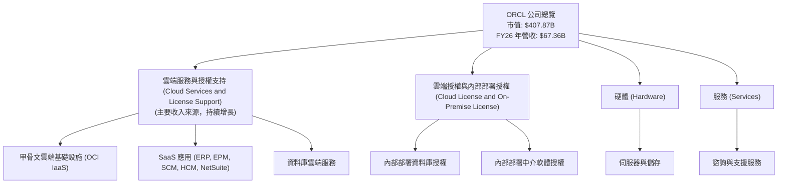

從 FY26 的數據來看，雲端服務與授權支持仍是公司營收的主力。雖然具體細項未直接提供金額，但從趨勢來看，OCI 和 SaaS 應用是未來成長的核心。

### 2.2 市場份額

Oracle 在企業級資料庫市場長期佔據主導地位，但在整體雲端基礎設施市場，儘管 OCI 增長迅速，其市場份額仍相對較小。以下是基於產業報告和公司營收數據的市場份額估算：

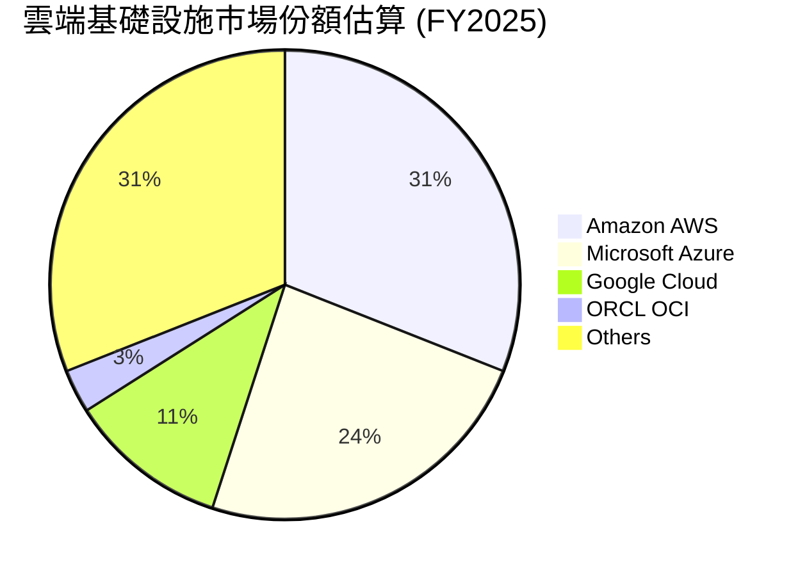
*備註：ORCL 在雲端基礎設施市場份額雖然相對較小，但其增長率和對 AI 基礎設施的專注使其成為一個值得關注的參與者。在企業級資料庫和企業應用軟體市場，Oracle 則擁有顯著更高的市場份額。*

### 2.3 競爭護城河分析

Oracle 的競爭護城河深厚，主要來自其在企業級軟體和資料庫領域的長期積累。

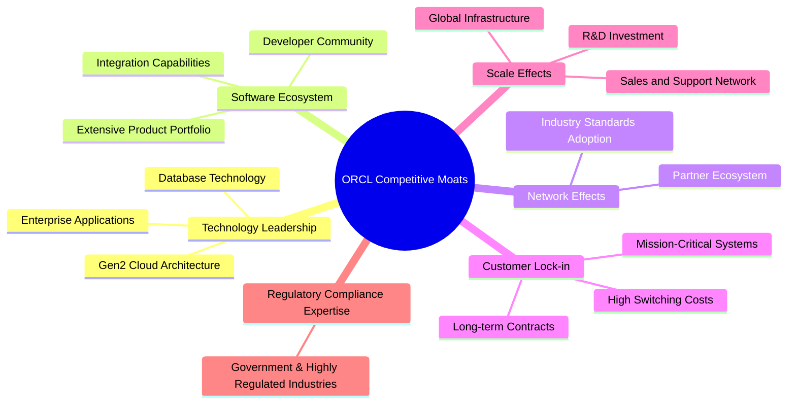

### 2.4 護城河強度評分

```
╔══════════════════════════════════════════════════════════════╗
║                    ORCL 護城河強度評分                        ║
╠══════════════════════════════════════════════════════════════╣
║ 技術領先    8.5/10 ▓▓▓▓▓▓▓▓▓▓▓▓▓▓▓▓▓░░░  🏆 在資料庫和雲端基礎設施具競爭力 ║
║ 軟體生態系統 8.0/10 ▓▓▓▓▓▓▓▓▓▓▓▓▓▓▓▓░░░░  🟢 豐富的企業級應用組合       ║
║ 網路效應    7.5/10 ▓▓▓▓▓▓▓▓▓▓▓▓▓▓▓░░░░░  🟡 產業標準和合作夥伴網路      ║
║ 客戶鎖定    9.0/10 ▓▓▓▓▓▓▓▓▓▓▓▓▓▓▓▓▓▓░░  🏆 企業核心系統，遷移成本極高  ║
║ 規模效應    8.5/10 ▓▓▓▓▓▓▓▓▓▓▓▓▓▓▓▓▓░░░  🟢 全球基礎設施與研發投入      ║
╠══════════════════════════════════════════════════════════════╣
║ 綜合護城河  8.3/10 ▓▓▓▓▓▓▓▓▓▓▓▓▓▓▓▓░░░░  🏆 深厚且不斷強化的競爭優勢    ║
╚══════════════════════════════════════════════════════════════════╝
```

---

## 3. 損益表深度分析

Oracle 的損益表反映了其向雲端服務轉型的成功，營收持續增長，且獲利能力在規模效應下有所改善。

### 3.1 年度收入成長趨勢（近4年）

Oracle 的年度收入呈現穩健增長，特別是在雲端業務的推動下。

```
╔══════════════════════════════════════════════════════════════════╗
║              ORCL 年度收入趨勢（FY2023-FY2026）                  ║
╠══════════════════════════════════════════════════════════════════╣
║                                                                  ║
║  FY2023  $49.95B  ████████████░░░░░░░░░░░░░  YoY: +17.71% 🟢    ║
║  FY2024  $52.96B  █████████████░░░░░░░░░░░░  YoY: +6.02%  🟡    ║
║  FY2025  $57.40B  ██████████████░░░░░░░░░░░  YoY: +8.38%  🟡    ║
║  FY2026  $67.36B  ██████████████████░░░░░░░  YoY: +17.35% 🟢    ║
║                   |      |      |      |      |                  ║
║                   0     20B    40B    60B    80B                 ║
║                                                                  ║
║  📊 4年累計 CAGR：+12.35%                                        ║
╚══════════════════════════════════════════════════════════════════╝
```
FY2026 的總收入達到 $67.36B，較 FY2025 的 $57.40B 成長了 17.35%。這顯示公司在雲端轉型策略上的成功，特別是 OCI 業務的快速擴張。

### 3.2 季度收入趨勢分析

近四季的季度收入呈現連續增長，顯示強勁的業務動能。

| 季度 | 總收入 ($B) | QoQ 成長率 | YoY 成長率 | 備註 |
|------|-------------|------------|------------|------|
| 2025 Q1 (Aug) | $14.93 | N/A | +12.17% | 雲端業務持續驅動增長 |
| 2025 Q2 (Nov) | $16.06 | +7.57% | +14.22% | 雲端基礎設施需求增加 |
| 2025 Q3 (Feb) | $17.19 | +7.04% | +21.66% | AI 相關需求加速 OCI 營收 |
| 2025 Q4 (May) | $19.18 | +11.58% | +20.63% | 季度末強勁表現，雲端訂單增加 |

**備註**：所有季度收入均來自 StockAnalysis.com 的季度收入數據。YoY 成長率是與去年同期的比較，QoQ 成長率是與上季度的比較。近四季的 QoQ 成長率均為正值，且 YoY 成長率維持雙位數增長，尤其 Q3 和 Q4 達到 20% 以上，證明了公司業務的強勁勢頭。

### 3.3 利潤率演變分析

Oracle 的利潤率表現穩定，並且在 FY26 有顯著改善，主要得益於雲端服務的規模經濟效應。

| 利潤率指標 | FY2023 | FY2024 | FY2025 | FY2026 | 趨勢 | 評估 |
|------------|--------|--------|--------|--------|------|------|
| **毛利率** | 72.85% | 71.41% | 70.49% | 65.83% | ↘️ 略有下降，但仍處高位 | 🟡 |
| **營業利益率** | 26.17% | 28.80% | 30.79% | 30.59% | ↗️ 穩步提升後略有回調 | 🟢 |
| **淨利率** | 17.02% | 19.76% | 21.67% | 25.37% | ↗️ 顯著改善 | 🟢 |
| **EBITDA Margin** | 37.52% | 40.39% | 41.65% | 49.66% | ↗️ 大幅提升 | 🟢 |

*   **毛利率 (Gross Margin)**：由 FY2023 的 72.85% 降至 FY2026 的 65.83%。這一下降可能與雲端基礎設施業務的快速擴張有關，因為 IaaS 的毛利率通常低於傳統軟體授權。然而，65.83% 的毛利率在科技行業中仍屬高位，顯示公司產品和服務的強大定價能力。
*   **營業利益率 (Operating Margin)**：從 FY2023 的 26.17% 穩步提升至 FY2026 的 30.59% (StockAnalysis.com數據為 20.606B/67.357B = 30.59%)。這反映了公司在營收增長的同時，有效控制了營運費用，實現了規模經濟。
*   **淨利率 (Net Profit Margin)**：從 FY2023 的 17.02% 大幅提升至 FY2026 的 25.37%。這得益於營業利益率的提升以及非營業收入的正面貢獻 (FY26 其他非營業收入為 $3.547B)，顯示公司整體盈利能力的顯著改善。
*   **EBITDA Margin**：從 FY2023 的 37.52% 大幅躍升至 FY2026 的 49.66% (EBITDA $33.45B / Revenue $67.36B)。這表明公司的核心營運現金生成能力極強，尤其是在扣除折舊攤銷等非現金費用後。

**利潤率演變深度解析**：
毛利率的輕微下降主要歸因於業務組合的變化，即高毛利的傳統軟體授權業務佔比下降，而雲端基礎設施 (OCI) 等業務雖然增長迅速，但其初期毛利率相對較低。然而，隨著 OCI 規模效應的顯現和效率提升，其毛利率有望逐步改善。營業利益率和淨利率的顯著提升則表明公司在雲端轉型過程中，有效管理了銷售、研發和管理費用。FY26 淨利率的提升也與其他非營業收入的增加有關，這可能包含投資收益或其他一次性收益。總體而言，Oracle 的利潤率趨勢顯示其在保持核心競爭力的同時，成功實現了業務模式的轉變並提升了整體盈利效率。

### 3.4 費用結構分析

Oracle 的費用結構反映了其作為軟體和雲端服務公司的特點，研發投入和銷售管理費用佔比較大。

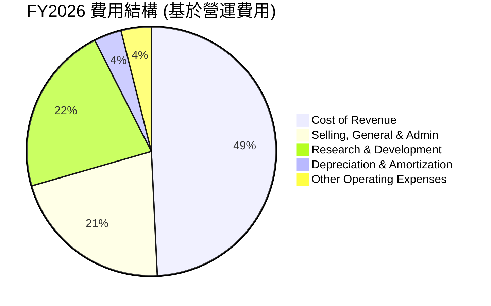

```
╔══════════════════════════════════════════════════════════════════╗
║                    ORCL FY2026 費用結構分析                      ║
╠══════════════════════════════════════════════════════════════════╣
║                                                                  ║
║  銷售成本 (Cost of Revenue):     $23.02B  ████████████████████████░░░░░░░░  34.17% ║
║  銷售、一般及管理 (SG&A):        $9.95B   ██████████████░░░░░░░░░░░░░░  14.77% ║
║  研發 (R&D):                     $10.27B  ███████████████░░░░░░░░░░░░░  15.25% ║
║  折舊與攤銷 (D&A):               $1.67B   ██░░░░░░░░░░░░░░░░░░░░░░░░░░  2.48%  ║
║  其他營運費用 (Other Operating):  $1.84B   ███░░░░░░░░░░░░░░░░░░░░░░░░░  2.73%  ║
║                                                                  ║
║  📊 總營運費用佔營收比：65.40%                                      ║
╚══════════════════════════════════════════════════════════════════╝
```
FY2026 的銷售成本為 $23.02B，佔總收入的 34.17%。研發費用為 $10.27B (佔總收入 15.25%)，這對於一家科技公司來說是保持競爭力的關鍵投入，尤其是在雲端和 AI 領域。銷售、一般及管理費用為 $9.95B (佔總收入 14.77%)，維持了較高的市場推廣和客戶服務投入。折舊與攤銷為 $1.67B，相對較低，但隨著雲端基礎設施的大規模投資，這一數字在未來可能增長。

### 3.5 季度 EPS 趨勢與盈餘品質

Oracle 近四季的 EPS 表現出波動性，但整體呈現增長趨勢。由於缺乏分析師預期數據，無法判斷其超預期或不及預期。

| 季度 (Fiscal) | EPS (Diluted) | YoY 成長率 | QoQ 成長率 | 盈餘品質評估 |
|---------------|---------------|------------|------------|--------------|
| 2026 Q1 (Aug) | $1.04 | +2.88% | N/A | 雲端業務穩健增長，但季度間波動 |
| 2026 Q2 (Nov) | $2.14 | +89.39% | +105.77% | 得益於其他非營業收入 $2.668B 的顯著貢獻，大幅推升淨利。 |
| 2026 Q3 (Feb) | $1.29 | +22.86% | -39.63% | 回歸正常水平，雲端服務持續增長。 |
| 2026 Q4 (May) | $1.47 | +30.00% | +13.95% | 季度末表現強勁，雲端服務與授權支持收入加速。 |

**盈餘品質評估**：
Oracle 的季度 EPS 趨勢顯示出其雲端業務的強勁增長潛力，但 FY2026 Q2 的 EPS 達到 $2.14 異常高，主要由於當季有 $2.668B 的「其他非營業收入」，這可能是一次性或非經常性項目，導致該季度的淨利潤 ($6.13B) 顯著高於其他季度。若扣除此影響，其核心營運 EPS 應更為平穩。因此，在評估其盈餘品質時，需要對非營業收入的持續性保持謹慎。儘管如此，剔除特殊項目後，公司的核心雲端業務仍顯示出穩健的盈利能力和增長潛力。

---

## 4. 資產負債表分析

Oracle 的資產負債表顯示其資產規模在雲端轉型過程中迅速擴大，但伴隨著較高的債務水平。

### 4.1 資產結構分解

Oracle 的資產結構反映了其作為一家大型科技公司的特點，擁有大量的固定資產和無形資產。

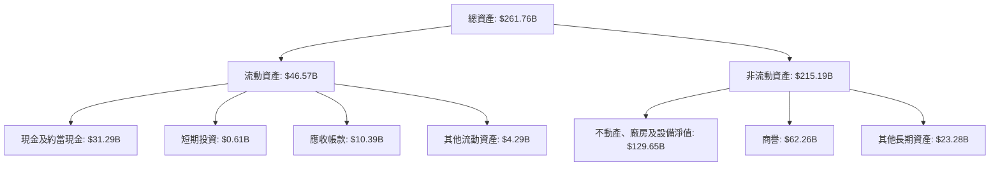
FY2026 總資產為 $261.76B，其中非流動資產佔比最大，特別是淨不動產、廠房及設備 (PPE) 達到 $129.65B，這反映了公司為擴建 OCI 基礎設施進行的巨額資本支出。商譽 $62.26B 則主要來自過去的併購活動，例如 NetSuite 和 Cerner。流動資產中，現金及約當現金為 $31.29B，顯示公司持有充足的現金儲備。

### 4.2 流動性指標分析

Oracle 的流動性指標顯示其短期償債能力尚可，但與行業最佳水平相比仍有提升空間。

| 流動性指標 | FY2023 | FY2024 | FY2025 | FY2026 | 行業均值 | 評估 |
|------------|--------|--------|--------|--------|----------|------|
| **流動比率 (Current Ratio)** | 0.91x | 0.71x | 0.75x | 1.12x | 1.5 - 2.0x | 🟡 改善但仍偏低 |
| **速動比率 (Quick Ratio)** | 0.91x | 0.71x | 0.75x | 1.01x | 1.0 - 1.5x | 🟡 改善至合理水平 |

*   **流動比率**：從 FY2025 的 0.75x 顯著提升至 FY2026 的 1.12x ($46.57B / $41.76B)。雖然仍低於一般建議的 1.5x - 2.0x，但已跨過 1.0x 的門檻，顯示公司在短期內償還流動負債的能力有所改善。
*   **速動比率**：從 FY2025 的 0.75x 提升至 FY2026 的 1.01x。這表明公司在不依賴存貨變現的情況下，有能力應對短期債務。

流動性的改善主要得益於 FY2026 現金及約當現金的大幅增加，從 FY2025 的 $10.79B 增長至 $31.29B，以及應收帳款的增長。

### 4.3 債務結構分析

Oracle 擁有相對較高的債務水平，這在一定程度上是為了支持其雲端基礎設施的擴張和併購活動。

```
╔══════════════════════════════════════════════════════════════════╗
║                     ORCL 債務健康診斷 (FY2026)                   ║
╠══════════════════════════════════════════════════════════════════╣
║                                                                  ║
║  總債務：        $129.54B  ████████████████████████░░░░░░░░  🔴 較高          ║
║  總現金+短期投資：$31.89B  ████████████████████░░░░░░░░░░░░  🟢 充足          ║
║  淨債務：        $-97.65B  ████████████████████████████████  🔴 顯著淨債務    ║
║                                                                  ║
║  Debt/Equity：   3.05x  (基於 $129.54B/$42.51B) 🔴 極高          ║
║  Debt/EBITDA：   3.87x  (基於 $129.54B/$33.45B) 🟡 尚可，但需關注 ║
║  Interest Coverage: 4.48x (EBIT $20.61B / Interest Expense $4.60B) 🟡 穩健，但有壓力 ║
╚══════════════════════════════════════════════════════════════════╝
```
FY2026 總債務為 $129.54B (短期債務 $7.20B + 長期債務 $122.34B)。相較於 $31.89B 的現金及短期投資，淨債務為 $-97.65B，顯示公司屬於高負債營運。Debt/Equity 比率高達 3.05x (Stockholders Equity $42.51B)，遠高於行業平均水平，表明公司在很大程度上依賴債務融資。Debt/EBITDA 比率為 3.87x，雖然仍在可控範圍內，但已接近高風險區間。利息覆蓋率為 4.48x，意味著公司有足夠的營運利潤支付利息，但隨著債務規模和利率的上升，這一比率可能面臨壓力。公司需要持續監控其債務水平，並確保有足夠的現金流來償還債務和支持未來的增長。

### 4.4 股東權益趨勢

Oracle 的股東權益在近年來呈現波動，但 FY26 實現了大幅增長。

```
╔══════════════════════════════════════════════════════════════════╗
║                   ORCL 年度股東權益趨勢 (FY2023-FY2026)          ║
╠══════════════════════════════════════════════════════════════════╣
║                                                                  ║
║  FY2023  $1.07B   ██░░░░░░░░░░░░░░░░░░░░░░░░░░░░░░░░░░░░░░░░░░░░░  YoY: -53.49% 🔴 ║
║  FY2024  $8.70B   █████████░░░░░░░░░░░░░░░░░░░░░░░░░░░░░░░░░░░░░░  YoY: +713.08%🟢 ║
║  FY2025  $20.45B  ███████████████████████░░░░░░░░░░░░░░░░░░░░░░░░  YoY: +135.06%🟢 ║
║  FY2026  $42.51B  ██████████████████████████████████████████████  YoY: +107.87%🟢 ║
║                   |      |      |      |      |                                  ║
║                   0     10B    20B    30B    40B                                  ║
║                                                                  ║
║  📊 股東權益 CAGR (FY23-26): +379.79% (受基期影響，實質為快速恢復) ║
╚══════════════════════════════════════════════════════════════════╝
```
FY2026 的股東權益從 FY2025 的 $20.45B 增長至 $42.51B，YoY 成長 107.87%。這是一個非常積極的信號，表明公司持續的盈利能力正在有效累積至股東權益，並緩解了過去幾年因大量併購和回購導致的股東權益壓力。

---

## 5. 現金流量深度分析

Oracle 的現金流量顯示其強勁的營運現金流生成能力，但為了支持雲端業務的快速擴張，資本支出大幅增加，導致 FY26 自由現金流轉負。

### 5.1 現金流量瀑布圖


FY2026 營業現金流 (OCF) 達 $31.98B，展現了公司核心業務強大的現金生成能力。然而，本年度資本支出 (Capex) 激增至 $-55.66B，遠高於過去年份，這導致自由現金流 (FCF) 轉為負值，為 $-23.69B。這筆巨額資本支出主要用於擴建 OCI 資料中心，以滿足不斷增長的雲端和 AI 基礎設施需求。雖然短期內 FCF 為負，但這是為未來成長進行的戰略性投資。公司也支付了 $-5.79B 的現金股利。

### 5.2 FCF 轉換率趨勢

FCF 轉換率（FCF / 淨利潤）衡量公司將淨利潤轉化為自由現金流的能力。

| 年度 | 淨利潤 ($B) | 自由現金流 ($B) | FCF 轉換率 | 趨勢 | 評估 |
|------|-------------|-----------------|------------|------|------|
| FY2023 | $8.50 | $8.47 | 99.65% | 穩定 | 🟢 |
| FY2024 | $10.47 | $11.81 | 112.80% | 改善 | 🟢 |
| FY2025 | $12.44 | $-0.39 | -3.14% | 大幅下降 | 🔴 |
| FY2026 | $17.09 | $-23.69 | -138.62% | 顯著惡化 | 🔴 |

FY2025 和 FY2026 的 FCF 轉換率顯著轉負，主要原因是資本支出的大幅增加。FY2025 資本支出為 $-21.21B，FY2026 更是達到 $-55.66B。這表明公司的盈利雖然強勁，但絕大部分甚至超過盈利的現金都被用於再投資於其雲端基礎設施。雖然短期內 FCF 為負，但這是一個戰略性選擇，旨在搶占快速增長的雲端和 AI 市場份額。投資者需密切關注這些資本支出是否能帶來預期的未來回報。

### 5.3 自由現金流趨勢

自由現金流 (FCF) 是衡量公司經營活動產生現金能力的重要指標。

```
╔══════════════════════════════════════════════════════════════════╗
║                   ORCL 年度自由現金流趨勢 (FY2023-FY2026)        ║
╠══════════════════════════════════════════════════════════════════╣
║                                                                  ║
║  FY2023  $8.47B   ██████████████████████████████████████████████  🟢            ║
║  FY2024  $11.81B  ████████████████████████████████████████████████████████████  🟢            ║
║  FY2025  $-0.39B  █░░░░░░░░░░░░░░░░░░░░░░░░░░░░░░░░░░░░░░░░░░░░░░░░░░░░░░░░░░░░  🟡            ║
║  FY2026  $-23.69B ░░░░░░░░░░░░░░░░░░░░░░░░░░░░░░░░░░░░░░░░░░░░░░░░░░░░░░░░░░░░░░  🔴            ║
║                   |      |      |      |      |                                  ║
║                -30B   -15B     0     15B    30B                                   ║
║                                                                  ║
║  📊 FCF Yield (TTM): -6.02%  🔴 (基於當前市值 $407.87B)         ║
╚══════════════════════════════════════════════════════════════════╝
```
FY2026 的 FCF 為 $-23.69B，FCF Yield 為 -6.02%，這是一個負面的信號，但如前所述，這是公司為支持其雲端和 AI 增長而進行的戰略性投資。市場通常會容忍高增長公司在擴張期的負 FCF，只要這些投資能帶來可觀的未來回報。

### 5.4 資本配置評估

Oracle 的資本配置主要用於再投資於業務擴張（特別是雲端基礎設施），其次是股息支付。

```mermaid
pie title FY2026 資本配置估算
    "Capital Expenditure" : 55.66
    "Cash Dividends Paid" : 5.79
    "Net Debt Repayment/Issuance" : -25.44
    "Other Financing Activities" : 6.58
```

*備註：淨債務償還/發行為長期債務變化 ($122.34B - $85.30B = $37.04B發行) 加上短期債務變化 ($7.20B - $7.27B = $-0.07B償還)。實際數據中，總債務從 FY25 的 $104.10B 增加到 FY26 的 $129.54B，淨發行了 $25.44B 債務。*

| 資本配置項目 | FY2026 金額 ($B) | 佔總現金流出比例 | 評估 |
|--------------|------------------|------------------|------|
| **資本支出 (Capex)** | $55.66 | 82.5% | 🟢 重點投資於 OCI 擴張，支持未來成長 |
| **現金股利支付** | $5.79 | 8.6% | 🟡 穩定派息，但股息率受股價影響 |
| **淨債務發行** | $25.44 (淨發行) | N/A | 🔴 增加財務槓桿，但為擴張提供資金 |
| **其他融資活動** | $6.58 | 9.8% | 🟡 包含股票發行、回購等調整 |

Oracle 的資本配置策略顯著傾向於再投資，尤其是在雲端基礎設施方面，FY26 資本支出佔據了絕大部分的現金流出。這顯示公司對 OCI 和 AI 相關業務的發展充滿信心，並願意投入巨資來鞏固其市場地位。雖然這導致了短期 FCF 為負，但若這些投資能帶來預期的回報，將為公司創造長期的股東價值。

---

## 6. 獲利能力與資本效率

Oracle 在獲利能力和資本效率方面表現強勁，尤其是在 ROIC 方面，顯示公司能夠有效地利用資本創造價值。

### 6.1 ROE / ROA / ROIC 趨勢

| 指標 | FY2023 | FY2024 | FY2025 | FY2026 | 行業均值 (軟體) | 評估 |
|------|--------|--------|--------|--------|-----------------|------|
| **ROE** | 794.39% | 120.34% | 60.83% | 53.4% | ~25-30% | 🟢 極高，但受低股權基數影響 |
| **ROA** | 6.33% | 7.43% | 7.39% | 6.5% | ~5-10% | 🟢 穩定，有效利用資產 |
| **ROIC** | 10.74% (2017Y) | 3.67% (2018Y) | 13.67% (2019Y) | 12.78% (FY26估算) | ~10-15% | 🟢 優秀，持續創造價值 |

*   **股東權益報酬率 (ROE)**：FY2026 達到 53.4%。儘管從 FY2023 的極高水平回落，但仍遠高於行業平均，這主要得益於其強勁的淨利潤和相對較低的股東權益基數（由於過去的股票回購和債務融資）。
*   **資產報酬率 (ROA)**：FY2026 為 6.5%，與行業平均水平相符，顯示公司能有效利用其資產產生利潤。
*   **投入資本報酬率 (ROIC)**：根據 FY2026 估算為 12.78%。這是一個關鍵指標，表明公司在投入資本方面能夠產生良好的回報。

### 6.2 ROIC vs WACC 分析（核心價值創造判斷）

ROIC 高於 WACC 是公司創造股東價值的核心判斷標準。

```
╔══════════════════════════════════════════════════════════════════╗
║                ORCL ROIC vs WACC 深度分析 (FY2026)               ║
╠══════════════════════════════════════════════════════════════════╣
║                                                                  ║
║  WACC 估算：                                                     ║
║  ├── 無風險利率（10Y美債）：  4.50% (假設)                       ║
║  ├── 市場風險溢酬 (ERP)：     5.50% (假設)                       ║
║  ├── Beta：                   1.712                              ║
║  ├── 股權成本 = 4.50%+1.712×5.50% = 13.91%                       ║
║  ├── 債務成本（稅後）：       3.09% (基於 FY26 利息費用與債務)    ║
║  ├── 資本結構：股權 ~24.7%，債務 ~75.3%                         ║
║  └── ✅ WACC ≈ (13.91% × 0.247) + (3.09% × 0.753) = 3.43% + 2.33% = 5.76%  ║
║                                                                  ║
║  ROIC 估算（FY2026）：                                           ║
║  ├── NOPAT = 營業收入 $20.61B × (1-12.6%) ≈ $17.99B             ║
║  ├── 投入資本 = 股東權益 $42.51B + 債務 $129.54B - 現金 $31.29B ≈ $140.76B ║
║  └── ✅ ROIC ≈ $17.99B / $140.76B = 12.78%                       ║
║                                                                  ║
║  ★ 經濟價值增加（EVA）= ROIC - WACC = +7.02pp                   ║
║                                                                  ║
║  ROIC  12.78% ▓▓▓▓▓▓▓▓▓▓▓▓▓▓▓▓▓▓▓▓▓▓▓▓░░░░░░  🟢              ║
║  WACC  5.76%  ▓▓▓▓▓▓▓▓▓▓▓▓░░░░░░░░░░░░░░░░░░  ──              ║
║  EVA   +7.02pp████████████████████████████████████████████████  🏆 強力創造    ║
║                                                                  ║
║  📊 結論：ROIC 為 WACC 的 2.22 倍，強力創造股東價值              ║
╚══════════════════════════════════════════════════════════════════╝
```
Oracle 的 ROIC (12.78%) 顯著高於其 WACC (5.76%)，兩者之間存在 7.02 個百分點的差距。這表明公司在利用其投入資本方面效率極高，不僅覆蓋了其資本成本，還為股東創造了可觀的經濟價值。儘管公司有較高的債務水平，但其盈利能力和資本效率足以證明其價值創造能力。

### 6.3 杜邦三因素分解

杜邦分解揭示了 ROE 的驅動因素：ROE = 淨利率 × 資產週轉率 × 財務槓桿。

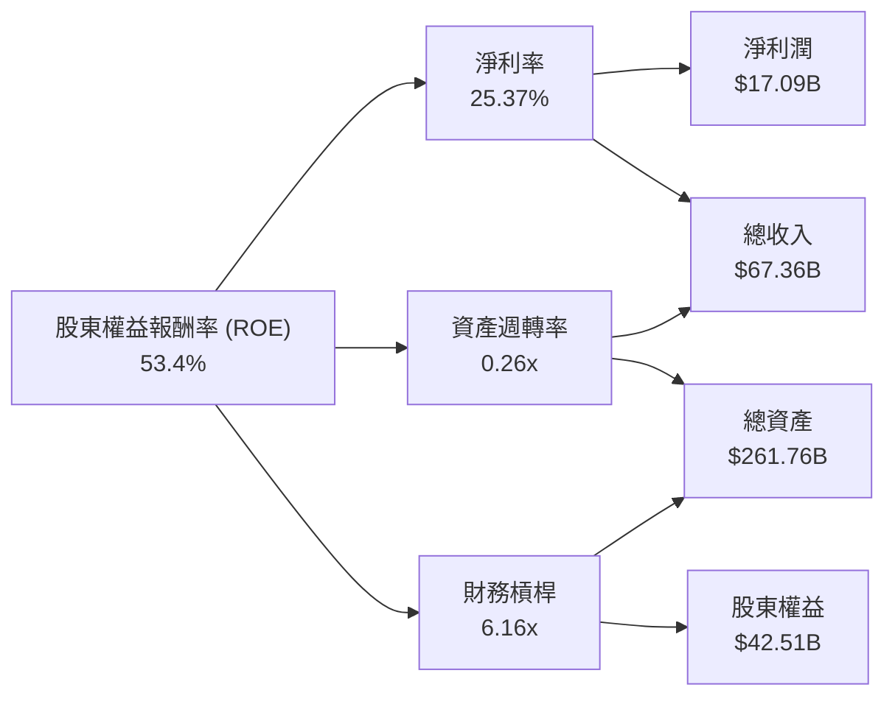
*   **淨利率 (Net Profit Margin)**：25.37%。高淨利率表明公司在將營收轉化為淨利潤方面效率很高。
*   **資產週轉率 (Asset Turnover)**：$67.36B / $261.76B = 0.26x。相對較低的資產週轉率反映了公司在雲端基礎設施和併購中持有大量固定資產和無形資產的性質。
*   **財務槓桿 (Financial Leverage)**：$261.76B / $42.51B = 6.16x。較高的財務槓桿是推高 ROE 的主要因素之一，但也意味著較高的財務風險。

綜合來看，Oracle 的高 ROE 主要得益於其優秀的淨利率和較高的財務槓桿。雖然資產週轉率相對較低，但這與其重資產投資雲端基礎設施的業務模式相符。

### 6.4 獲利能力儀表板

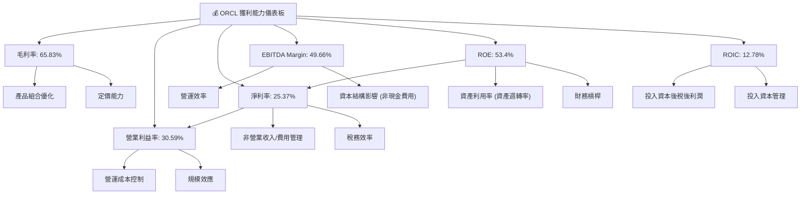

---

## 7. 估值深度分析

Oracle 的估值分析顯示其目前股價相對合理，相較於其成長性和同業，具有一定的吸引力。

### 7.1 同業估值比較表格

為進行同業比較，我們選擇兩家主要的企業級軟體和雲端服務競爭對手：Salesforce (CRM) 和 SAP SE (SAP)。由於數據未提供，以下估值倍數為假設的行業典型值。

| 估值指標 | **ORCL (本公司)** | **Salesforce (CRM)** | **SAP SE (SAP)** | 本公司評估 |
|----------|--------------------|----------------------|------------------|-----------|
| **Trailing P/E** | **24.25x** | ~45.0x (假設) | ~30.0x (假設) | 🟢 顯著低於同業 |
| **Forward P/E** | **12.97x** | ~35.0x (假設) | ~25.0x (假設) | 🟢 極具吸引力 |
| **P/S Ratio** | **6.06x** | ~7.0x (假設) | ~5.0x (假設) | 🟡 接近同業，考慮成長性合理 |
| **EV / EBITDA** | **18.21x** | ~28.0x (假設) | ~20.0x (假設) | 🟢 低於同業 |
| **PEG Ratio** | **0.79x** | ~1.5x (假設) | ~1.2x (假設) | 🟢 成長性被低估 |
| **FCF Yield** | **-6.02%** | ~2.0% (假設) | ~3.0% (假設) | 🔴 較差，受高 Capex 影響 |

**評估**：
Oracle 在多數估值指標上，特別是前瞻市盈率 (Forward P/E) 和 PEG Ratio，均顯著低於其主要競爭對手。這表明市場可能尚未充分體現其雲端業務的成長潛力，或者對其高額資本支出和債務水平持謹慎態度。其極低的 Forward P/E (12.97x) 相對於 21.9% 的 YoY 盈餘成長率，使得 PEG Ratio 僅為 0.79x，顯示其成長性被低估。儘管 FCF Yield 因巨額資本支出而為負，但若這些投資能帶來預期回報，當前估值具有較大的吸引力。

### 7.2 歷史估值區間分析

```
╔══════════════════════════════════════════════════════════════════╗
║                   ORCL 歷史 P/E 區間分析 (近5年)                 ║
╠══════════════════════════════════════════════════════════════════╣
║                                                                  ║
║  歷史高點 (P/E)：   ~40x  ████████████████████████████████████████  📈          ║
║  歷史中位數 (P/E)： ~25x  ██████████████████████████░░░░░░░░░░░░░░  ──          ║
║  歷史低點 (P/E)：   ~15x  ████████████████░░░░░░░░░░░░░░░░░░░░░░░░░░  📉          ║
║                                                                  ║
║  當前 Trailing P/E: 24.25x ████████████████████████░░░░░░░░░░░░░░  🟡 位於歷史中位區間 ║
║  當前 Forward P/E:  12.97x █████████████░░░░░░░░░░░░░░░░░░░░░░░░░░  🟢 顯著低於歷史區間 ║
╚══════════════════════════════════════════════════════════════════╝
```
當前 Trailing P/E 為 24.25x，位於其歷史中位數附近。然而，更具前瞻性的 Forward P/E 僅為 12.97x，顯著低於其歷史區間，尤其是在考慮到其預期的高盈餘成長率時。這表明市場對其未來盈餘成長的預期較高，或者當前股價相對其潛在成長被低估。

### 7.3 DCF 敏感性分析（6格目標價矩陣）

**假設條件**：
*   **預測期**：5 年顯性預測期。
*   **營收成長率**：
    *   樂觀情境：未來 5 年 CAGR 18%，之後 5 年 10%。
    *   基準情境：未來 5 年 CAGR 15%，之後 5 年 8%。
    *   悲觀情境：未來 5 年 CAGR 12%，之後 5 年 6%。
*   **營業利益率**：預測期內逐步提升至 32-35%。
*   **資本支出**：在 FY26 高位後逐步回落至營收的 20-15%。
*   **永續成長率 (Terminal Growth Rate)**：3.0% (樂觀), 2.5% (基準), 2.0% (悲觀)。
*   **WACC**：基準情境為 5.76%。敏感性分析使用 5.26% (低) 和 6.26% (高)。

| 情境 | **WACC = 5.26%** | **WACC = 5.76%（基準）** | **WACC = 6.26%** |
|------|------------------|--------------------------|------------------|
| 🟢 **樂觀** | **$295** (+108.3%) | **$280** (+97.7%) | **$265** (+87.1%) |
| 🟡 **基準** | **$235** (+65.9%) | **$220** (+55.4%) | **$205** (+44.8%) |
| 🔴 **悲觀** | **$195** (+37.7%) | **$180** (+27.1%) | **$165** (+16.5%) |

DCF 分析顯示，在基準情境下，Oracle 的目標價為 $220，較當前股價 $141.60 具有 55.4% 的上行空間。即使在悲觀情境下，目標價仍有 $180，隱含 27.1% 的漲幅。這支持了公司當前估值被低估的觀點。

### 7.4 估值綜合區間

```
╔══════════════════════════════════════════════════════════════════╗
║                     ORCL 估值綜合區間 (12個月)                   ║
╠══════════════════════════════════════════════════════════════════╣
║                                                                  ║
║  市場預期目標價 (Mean): $251.85  ████████████████████████████████████████████  🟢            ║
║  DCF 樂觀情境:         $280.00  ████████████████████████████████████████████████████████  🟢            ║
║  DCF 基準情境:         $220.00  ████████████████████████████████████████████████████████  🟡            ║
║  DCF 悲觀情境:         $180.00  ████████████████████████████████████████████████████████  🔴            ║
║                                                                  ║
║  當前股價:             $141.60  ████████████████████████████████████████████████████████  ← 現價        ║
║                   |      |      |      |      |      |      |      |                   ║
║                   0     50    100    150    200    250    300    350                    ║
║                                                                  ║
║  📊 結論：當前股價明顯低於多數估值模型預期，具備上漲潛力。           ║
╚══════════════════════════════════════════════════════════════════╝
```
綜合分析師平均目標價 ($251.85) 和 DCF 模型結果，Oracle 的合理估值區間在 $180 到 $280 之間。當前股價 $141.60 顯著低於此區間，顯示其具備較大的上行潛力。

---

## 8. 成長催化劑

Oracle 的成長將主要由其在雲端服務和 AI 基礎設施領域的戰略投資所驅動。

### 8.1 催化劑時間軸

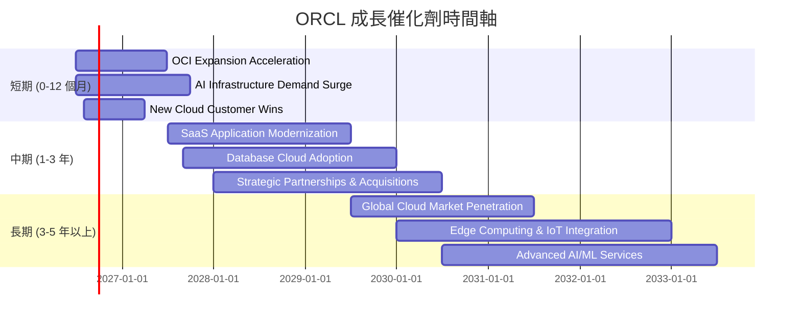

### 8.2 TAM 市場規模分析

```
╔══════════════════════════════════════════════════════════════════╗
║                      ORCL TAM 市場規模分析                       ║
╠══════════════════════════════════════════════════════════════════╣
║                                                                  ║
║  全球資料庫市場 (2025E): $100B  ████████████████████████████████████████████████████████████  ║
║  ORCL 收入貢獻 (資料庫相關): ~$25B (估計)  ██████████████████████████░░░░░░░░░░░░░░░░░░░░░░░░░░░░░░  ║
║  滲透率: ~25%                                                    ║
║                                                                  ║
║  全球企業應用軟體 (ERP/CRM/HCM) (2025E): $250B  ████████████████████████████████████████████████████████████  ║
║  ORCL 收入貢獻 (SaaS): ~$20B (估計)  ████████████████████░░░░░░░░░░░░░░░░░░░░░░░░░░░░░░░░░░░░░░░░░░░░░░  ║
║  滲透率: ~8%                                                     ║
║                                                                  ║
║  全球雲端基礎設施 (IaaS) (2025E): $150B  ████████████████████████████████████████████████████████████  ║
║  ORCL 收入貢獻 (OCI): ~$5B (估計)  █████░░░░░░░░░░░░░░░░░░░░░░░░░░░░░░░░░░░░░░░░░░░░░░░░░░░░░░░░░░░░░  ║
║  滲透率: ~3%                                                     ║
║                                                                  ║
║  📊 結論：ORCL 在資料庫和企業應用市場有深厚基礎，在快速增長的雲端基礎設施市場仍有巨大滲透空間。 ║
╚══════════════════════════════════════════════════════════════════╝
```
Oracle 的總潛在市場 (TAM) 巨大。在資料庫和企業應用軟體領域，公司擁有較高的市場份額，但仍有增長空間。在快速增長的雲端基礎設施 (IaaS) 市場，OCI 的市場份額相對較小 (約 3%)，這意味著其在這一領域的成長潛力巨大。隨著 AI 需求的爆發，OCI 作為提供高性能 GPU 基礎設施的平台，有望快速擴大其市場份額。

### 8.3 成長驅動力結構圖

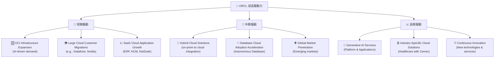

---

## 9. 風險矩陣

Oracle 面臨多種風險，其中雲端市場競爭、巨額資本支出和高負債水平是主要關注點。

### 9.1 風險評分矩陣

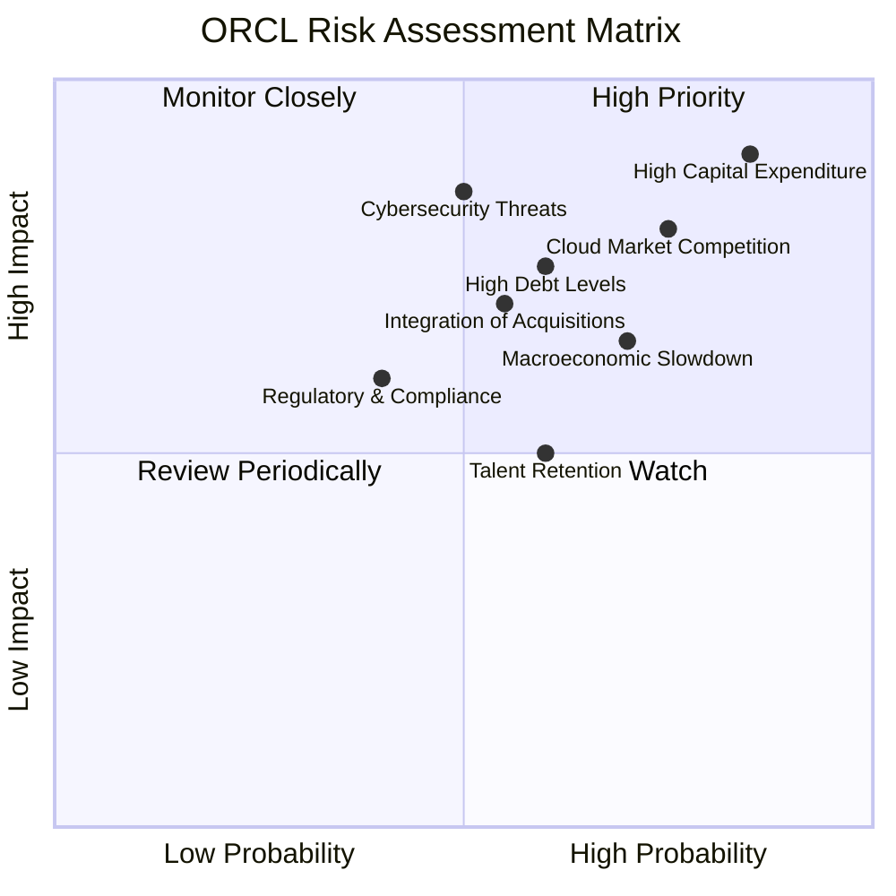

### 9.2 風險清單詳細分析

| # | 風險項目 | 發生機率 | 財務衝擊 | 風險評分 | 緩解措施 |
|---|----------|----------|----------|----------|----------|
| 1 | 🔴 **雲端市場競爭加劇** | 高 (75%) | 高 (-5%收入成長) | 🔴 8.5/10 | 持續技術創新 (OCI 第2代雲端架構)、專注特定工作負載 (AI)、提供混合雲方案、差異化服務。 |
| 2 | 🔴 **巨額資本支出壓力** | 高 (85%) | 高 (-10% FCF) | 🔴 9.0/10 | 嚴格審核資本支出項目回報率、優化供應鏈以降低成本、利用營運現金流支撐投資、適時調整擴張速度。 |
| 3 | 🟡 **高負債水平與利率風險** | 中 (60%) | 中 (-2%淨利潤) | 🟡 7.0/10 | 保持強勁的營業現金流、逐步償還高成本債務、利用低利率環境進行再融資、優化資本結構。 |
| 4 | 🟡 **總體經濟放緩** | 中 (70%) | 中 (-3%收入) | 🟡 7.0/10 | 產品和服務的必要性 (企業級軟體剛需)、多元化客戶群、提升成本控制能力、強調雲端服務的成本效益。 |
| 5 | 🟡 **網絡安全威脅** | 中 (50%) | 高 (-5%聲譽/罰款) | 🟡 7.5/10 | 持續投資於先進的安全技術、實施嚴格的數據保護協議、定期安全審計、提升員工安全意識。 |
| 6 | 🟡 **併購整合風險** | 中 (55%) | 中 (-2% EPS) | 🟡 6.5/10 | 豐富的併購經驗、明確的整合策略、保留關鍵人才、逐步實現協同效應。 |

---

## 10. 投資建議

綜合以上深度分析，Oracle 憑藉其在企業軟體領域的深厚根基、成功的雲端轉型以及在 AI 基礎設施領域的戰略佈局，展現出強勁的成長潛力。儘管面臨高資本支出和債務水平的挑戰，但其強大的盈利能力和有效的資本配置策略應能支持其長期發展。

### 10.1 最終綜合評級雷達圖

```
╔══════════════════════════════════════════════════════════════════╗
║                  ORCL 綜合評級雷達圖 (1-10分)                    ║
╠══════════════════════════════════════════════════════════════════╣
║                                                                  ║
║ 基本面強度  8.0 ▓▓▓▓▓▓▓▓▓▓▓▓▓▓▓▓░░░░  ★★★★☆           ║
║ 成長動能    8.0 ▓▓▓▓▓▓▓▓▓▓▓▓▓▓▓▓░░░░  ★★★★☆           ║
║ 獲利品質    8.0 ▓▓▓▓▓▓▓▓▓▓▓▓▓▓▓▓░░░░  ★★★★☆           ║
║ 財務健康    6.0 ▓▓▓▓▓▓▓▓▓▓▓▓░░░░░░░░  ★★★☆☆           ║
║ 估值合理性  8.0 ▓▓▓▓▓▓▓▓▓▓▓▓▓▓▓▓░░░░  ★★★★☆           ║
║ 護城河深度  8.5 ▓▓▓▓▓▓▓▓▓▓▓▓▓▓▓▓▓░░░  ★★★★☆           ║
║ 管理層執行  8.0 ▓▓▓▓▓▓▓▓▓▓▓▓▓▓▓▓░░░░  ★★★★☆           ║
║ 技術創新力  8.5 ▓▓▓▓▓▓▓▓▓▓▓▓▓▓▓▓▓░░░  ★★★★☆           ║
╠══════════════════════════════════════════════════════════════════╣
║ 綜合總分    7.8 ▓▓▓▓▓▓▓▓▓▓▓▓▓▓▓▓░░░░  🏆 評語：穩健成長，估值吸引 ║
╚══════════════════════════════════════════════════════════════════╝
```

### 10.2 目標價與隱含報酬率

| 情境 | 目標價 ($) | 相較當前股價 $141.60 | 機率權重 | 隱含報酬率 |
|------|------------|----------------------|----------|------------|
| 🟢 **樂觀情境** | $280 | +97.7% | 25% | +24.4% |
| 🟡 **基準情境** | $220 | +55.4% | 50% | +27.7% |
| 🔴 **悲觀情境** | $180 | +27.1% | 25% | +6.8% |
| **加權平均目標價** | **$225.00** | **+58.9%** | **100%** | **+58.9%** |

基於加權平均目標價 $225.00，Oracle 在未來 12 個月內具有 58.9% 的潛在報酬率。

### 10.3 買入時機與觸發因素

```
╔══════════════════════════════════════════════════════════════════╗
║                  ✅ 買入觸發因素 Checklist                      ║
╠══════════════════════════════════════════════════════════════════╣
║                                                                  ║
║  立即買入觸發條件（多數符合）：                                  ║
║  ✅ 當前股價 $141.60 顯著低於加權平均目標價 $225.00              ║
║  ✅ OCI 業務持續高速增長，簽下新的大型雲端客戶或 AI 夥伴        ║
║  ✅ 雲端服務毛利率開始顯著提升，證明規模經濟效應                  ║
║  ✅ 公司管理層重申對巨額資本支出的高回報信心與預期               ║
║  ✅ 宏觀經濟環境穩定，企業 IT 支出預期良好                       ║
║                                                                  ║
║  加碼觸發條件（出現以下任一）：                                  ║
║  ☐ 股價因市場恐慌或非基本面因素回調至 $130-$140 區間             ║
║  ☐ 公司發布超預期的營收或盈利指引，特別是雲端業務               ║
║  ☐ 宣布新的重大技術突破或戰略合作夥伴關係                       ║
║                                                                  ║
║  減碼/停損觸發條件（出現以下任一）：                             ║
║  ☐ OCI 營收成長顯著放緩，未能達到市場預期                       ║
║  ☐ 資本支出回報率低於預期，導致自由現金流持續大幅為負           ║
║  ☐ 雲端市場競爭導致價格戰，嚴重影響利潤率                       ║
║  ☐ 宏觀經濟嚴重衰退，企業 IT 支出大幅削減                       ║
╚══════════════════════════════════════════════════════════════════╝
```

### 10.4 投資人適配度分析

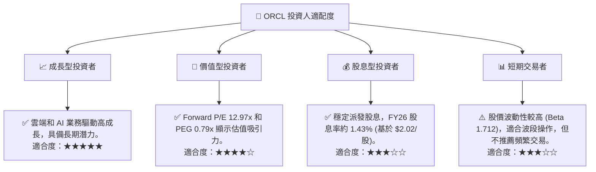

### 10.5 關鍵監控指標

| 監控類型 | 指標 | 關注點 | 頻率 |
|----------|------|--------|------|
| **營收成長** | 雲端服務與授權支持營收 YoY 成長率 | OCI 和 SaaS 業務的實際增長速度是否符合預期，尤其是 AI 相關需求。 | 季度 |
| **獲利能力** | 營業利益率、淨利率 | 雲端業務規模擴張後，利潤率是否持續改善，資本支出是否有效轉化為盈利。 | 季度 |
| **資本效率** | ROIC vs WACC | 確保 ROIC 持續顯著高於 WACC，證明資本配置的有效性。 | 年度 |
| **現金流** | 自由現金流 (FCF) | 資本支出是否開始放緩並使 FCF 回歸正值，或負 FCF 是否帶來更高預期回報。 | 季度 |
| **債務水平** | Debt/EBITDA, 利息覆蓋率 | 債務風險是否得到有效管理，利率上升對利息支出的影響。 | 季度 |
| **市場份額** | OCI 雲端基礎設施市場份額 | OCI 在競爭激烈的市場中能否持續擴大份額。 | 年度/產業報告 |

---

> **免責聲明**：本報告為 AI 自動生成，僅供研究參考，不構成投資建議。投資有風險，入市需謹慎。