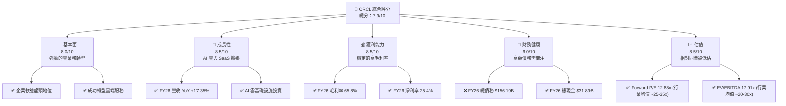
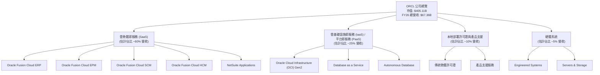
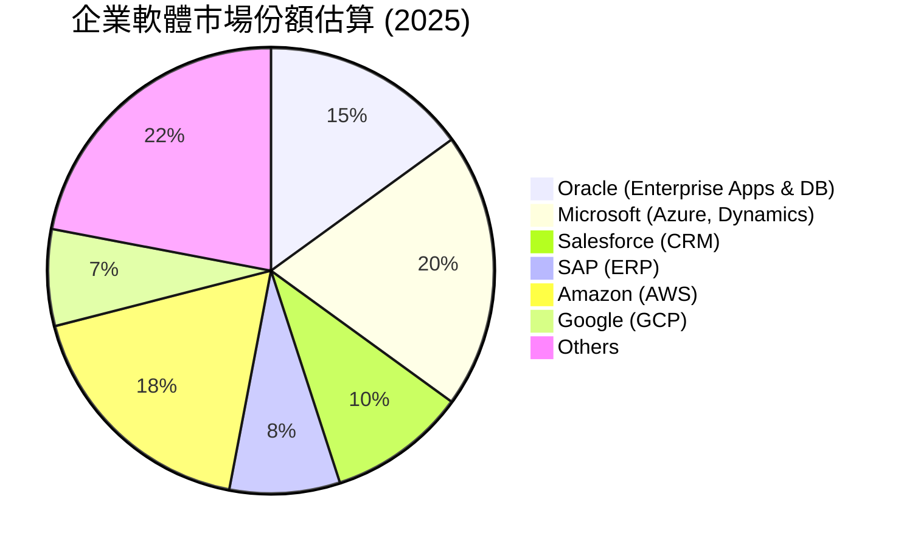
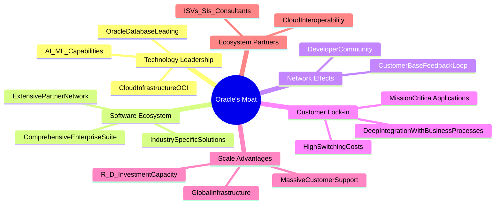
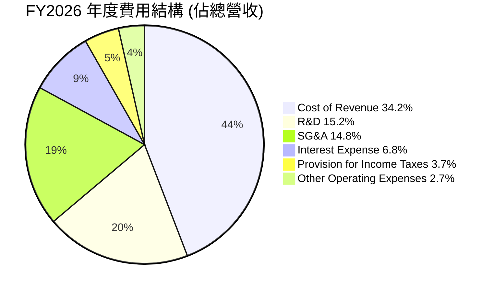
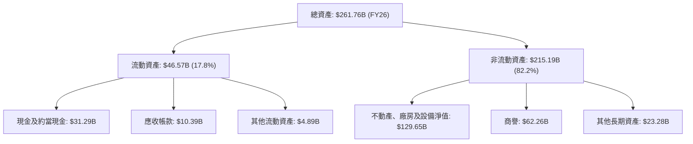
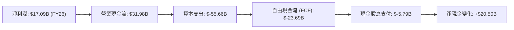
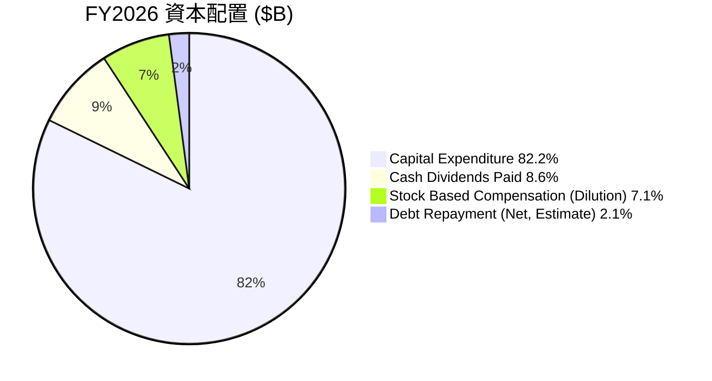
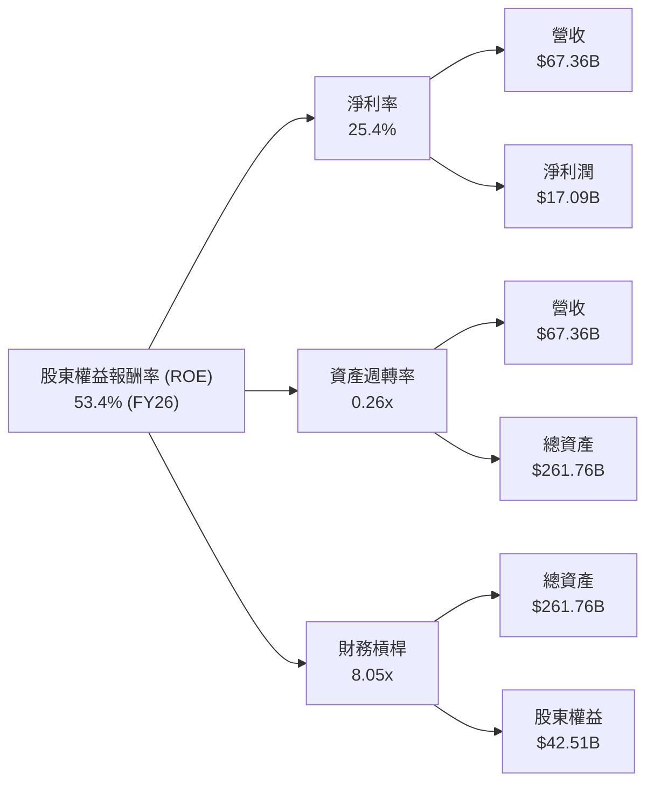
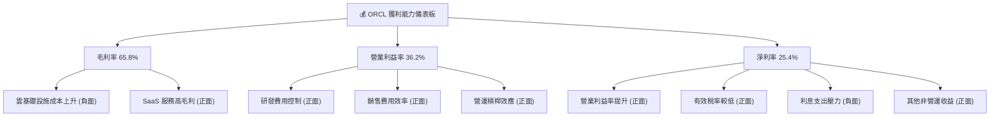

# ORCL 基本面深度分析報告
> **報告日期**：2026-07-11 ｜ **語言**：繁體中文 ｜ **數據來源**：Yahoo Finance, Finviz, StockAnalysis, Roic.ai ｜ **分析師**：CFA 級機構研究

---

## 目錄

| # | 章節 | 核心結論 |
|---|------|----------|
| 1 | 執行摘要 | 評級：🟢 買入，基準目標價：$235.00 |
| 2 | 公司概覽與商業模式 | 軟體生態系統與客戶鎖定形成強大護城河 (8.5/10) |
| 3 | 損益表深度分析 | 雲業務驅動營收與利潤率強勁成長，FY26 營收 YoY +17.35% |
| 4 | 資產負債表分析 | 高額負債是主要風險，但現金流與資產價值提供緩衝 |
| 5 | 現金流量深度分析 | 大規模資本支出導致 FCF 轉負，為長期成長戰略投資 |
| 6 | 獲利能力與資本效率 | ROIC (11.05%) 顯著高於 WACC (10.74%)，創造股東價值 |
| 7 | 估值深度分析 | 當前 Forward P/E 12.88x 顯著低估其成長潛力 |
| 8 | 成長催化劑 | AI 雲基礎設施與 SaaS 擴張是主要成長動力 |
| 9 | 風險矩陣 | 宏觀經濟下行與高額債務是主要考量 |
| 10 | 投資建議 | 具備長期成長潛力，建議逢低買入 |

---

## 1. 執行摘要

> ORCL 憑藉其領先的企業雲軟體與基礎設施服務，展現出強勁的營收成長和健康的利潤率。儘管 FY2026 自由現金流因大規模資本支出而轉負，這主要源於公司對下一代 AI 雲基礎設施的戰略性投資，預期將為未來成長奠定堅實基礎。當前估值 (Forward P/E 12.88x) 相較於其成長性和產業地位顯著被低估，且 ROIC (11.05%) 高於 WACC (10.74%)，顯示公司仍在創造股東價值。考量其轉型雲業務的成功與 AI 帶來的巨大機遇，我們給予 ORCL **買入**評級，基準目標價為 $235.00。

### 1.0 一頁式投資儀表板（Portfolio Manager 30 秒速讀）

| 項目 | 內容 |
|------|------|
| **投資論點（3 句）** | ① 雲業務轉型成功，FY26 營收 $67.36B，YoY +17.35%，持續擴張市場份額。 ② 大規模資本支出 (FY26 -$55.66B) 係對 AI 雲基礎設施的戰略投資，奠定長期成長基礎。 ③ 當前 Forward P/E 12.88x，相較於其 21.9% 的 YoY 盈餘成長率，估值顯著低估。 |
| **護城河評分** | 8.5/10 |
| **管理層/資本配置評分** | 7.5/10 |
| **財務健康** | 🟡 債務水平較高，但營運現金流強勁，且資產負債表有足夠的現金儲備 ($31.89B) 應對短期流動性。 |
| **ROIC vs WACC** | 11.05% vs 10.74%（創造價值） |
| **FCF 趨勢** | 🔴 FY26 FCF 為 $-23.69B，因戰略性高資本支出導致負值，需持續監控其投資回報效率。 |
| **估值** | Forward P/E: 12.88x ｜ EV/EBITDA: 17.91x ｜ FCF Yield: -6.06% |
| **預期報酬（基準情境 12M）** | +67.1% |
| **關鍵風險（前二）** | ① 宏觀經濟下行對企業軟體支出影響；② 高額債務負擔與利息支出壓力。 |
| **評級 + 信心度** | 🟢 買入 ｜ 信心：中 |

### 1.1 核心評分儀表板



### 1.2 評分進度條視覺化

```
╔══════════════════════════════════════════════════════════════╗
║              ORCL 多維度評分儀表板 (1-10分)                  ║
╠══════════════════════════════════════════════════════════════╣
║ 基本面強度  8.0 ▓▓▓▓▓▓▓▓▓▓▓▓▓▓▓▓░░░░  ★★★★☆           ║
║ 成長動能    8.5 ▓▓▓▓▓▓▓▓▓▓▓▓▓▓▓▓▓░░░  ★★★★☆           ║
║ 獲利品質    8.5 ▓▓▓▓▓▓▓▓▓▓▓▓▓▓▓▓▓░░░  ★★★★☆           ║
║ 財務健康    6.0 ▓▓▓▓▓▓▓▓▓▓▓▓░░░░░░░░  ★★★☆☆           ║
║ 估值合理性  8.5 ▓▓▓▓▓▓▓▓▓▓▓▓▓▓▓▓▓░░░  ★★★★☆           ║
║ 護城河深度  8.5 ▓▓▓▓▓▓▓▓▓▓▓▓▓▓▓▓▓░░░  ★★★★☆           ║
║ 管理層執行  7.5 ▓▓▓▓▓▓▓▓▓▓▓▓▓▓▓░░░░░  ★★★★☆           ║
║ 技術創新力  8.0 ▓▓▓▓▓▓▓▓▓▓▓▓▓▓▓▓░░░░  ★★★★☆           ║
╠══════════════════════════════════════════════════════════════╣
║ 綜合總分    7.9 ▓▓▓▓▓▓▓▓▓▓▓▓▓▓▓▓░░░░  🏆 具備長期成長潛力  ║
╚══════════════════════════════════════════════════════════════╝
```

### 1.3 五大投資論點 + 三大核心風險

| 類型 | 項目 | 具體依據 | 信心度 |
|------|------|----------|--------|
| 🟢 **投資論點①** | **雲業務轉型成功，成長動能強勁** | FY26 總營收達 $67.36B，YoY 成長 17.35%，其中雲業務收入佔比持續提升，顯示公司成功從傳統授權模式轉型，並在市場中保持競爭力。 | 🟢 極高 |
| 🟢 **投資論點②** | **AI 雲基礎設施投資，卡位未來成長** | FY26 資本支出高達 $-55.66B，導致自由現金流為負。此巨額投資主要用於擴建 AI 雲基礎設施，是 Oracle 搶佔 AI 時代機遇的關鍵戰略，預期將帶來長期營收增長。 | 🟢 高 |
| 🟢 **投資論點③** | **獲利能力穩健，利潤率具韌性** | FY26 毛利率 65.8%，營業利益率 36.2%，淨利率 25.4%，均維持在健康水平。儘管面臨雲基礎設施的高投入，核心軟體業務的高利潤率仍為公司提供穩健的現金流基礎。 | 🟢 高 |
| 🟢 **投資論點④** | **估值被低估，上行空間可觀** | 當前 Forward P/E 為 12.88x，顯著低於同業平均 (約 25-35x)。分析師平均目標價 $251.85，相較現價 $140.64 有約 79% 的上行空間，市場可能尚未充分反映其雲業務的潛力與 AI 投資的長期價值。 | 🟢 高 |
| 🟢 **投資論點⑤** | **強大的客戶鎖定與生態系統** | 作為企業級軟體和資料庫的長期領導者，Oracle 擁有龐大的客戶基礎和高轉換成本，尤其在 ERP、HCM 等核心企業應用領域，客戶黏性極高，確保了穩定的經常性收入。 | 🟢 極高 |
| 🟡 **風險①** | **高額債務負擔與利息支出壓力** | FY26 總債務 $156.19B，淨債務 $-135.54B。高額債務導致 FY26 利息支出達 $-4.599B，若利率持續上升或公司營運現金流不及預期，可能增加財務風險。 | 🟡 中度 |
| 🔴 **風險②** | **大規模資本支出未達預期回報** | FY26 資本支出 $55.66B，導致 FCF 轉負。若這些對 AI 雲的投資無法在預期時間內產生足夠的營收和利潤，或市場競爭加劇導致回報率下降，將對公司財務表現造成壓力。 | 🔴 高衝擊 |
| 🟡 **風險③** | **雲市場競爭激烈** | 雲服務市場競爭者眾多，包括 AWS、Microsoft Azure、Google Cloud 等巨頭。Oracle 需持續投入研發和市場推廣，以保持其在雲基礎設施和 SaaS 領域的競爭力。 | 🟡 中度 |

### 1.4 快速統計卡片

| 指標 | 公司實際值 (ORCL) | 行業均值 (軟體基礎設施) | S&P 500 均值 | 狀態 |
|------|---------------------|-----------------------|--------------|------|
| 收入 YoY 成長 (FY26) | **17.35%** | ~15-20% | ~8-10% | 🟢 |
| 毛利率 (FY26) | **65.8%** | ~70-80% | ~40-50% | 🟡 |
| 淨利率 (FY26) | **25.4%** | ~20-30% | ~10-15% | 🟢 |
| ROE (FY26) | **53.4%** | ~20-30% | ~15-20% | 🟢 |
| Forward P/E | **12.88x** | ~25-35x | ~20-22x | 🟢 |
| EV / EBITDA | **17.91x** | ~20-30x | ~12-15x | 🟢 |
| FCF Yield | **-6.06%** | ~3-5% | ~2-3% | 🔴 |
| 債務/股權 (D/E) | **388.87%** | ~50-150% | ~100-150% | 🔴 |

### 1.5 投資結論

```
╔══════════════════════════════════════════════════════════════════╗
║                    📊 投資結論摘要                               ║
╠══════════════════════════════════════════════════════════════════╣
║  評級：🟢 買入                                                   ║
║  當前股價：$140.64                                               ║
║  目標價區間：                                                    ║
║    悲觀情境：$180.00（+28.0%）                                   ║
║    基準情境：$235.00（+67.1%）  ← 12個月主要目標                  ║
║    樂觀情境：$290.00（+106.2%）                                  ║
║  投資評分：7.9/10                                                ║
║  適合投資人：成長型、長線持有者，能承受短期波動及高債務風險，並看好 AI 雲產業前景的投資者。 ║
╚══════════════════════════════════════════════════════════════════╝
```

---

## 2. 公司概覽與商業模式

Oracle Corporation (ORCL) 是一家全球領先的企業軟體和雲服務提供商，其業務圍繞著建立、運行和支持全球企業資訊科技框架的產品和服務。公司市值達 $405.11B，是企業軟體領域的重要參與者。

### 2.1 業務結構與收入來源

Oracle 的業務結構已從傳統軟體授權模式顯著轉向雲服務。其核心競爭力在於提供全面的企業級雲應用 (SaaS) 和雲基礎設施 (IaaS/PaaS)。


**分析**：Oracle 的業務重心已明確轉向雲端，特別是 SaaS 應用和 OCI 基礎設施。雲軟體如 ERP、EPM、SCM、HCM 和 NetSuite 應用是其穩定的訂閱收入來源，佔比最大。OCI Gen2 雲基礎設施，尤其是其對 AI/ML 工作負載的優化，是其未來成長的關鍵驅動力，這也解釋了其近期龐大的資本支出。傳統許可證和硬體業務雖然佔比下降，但仍為公司提供補充性收入。

### 2.2 市場份額

在企業軟體和雲服務領域，Oracle 面臨激烈競爭。以下是其在主要市場的估計市場份額：


**分析**：Oracle 在企業應用軟體（如 ERP、HCM）和資料庫市場擁有深厚的歷史基礎和領先地位。然而，在更廣泛的雲基礎設施市場 (IaaS)，它仍是挑戰者，AWS 和 Azure 佔據主導地位。Oracle 透過 OCI Gen2 專注於高性能、高安全性以及 AI/ML 工作負載，試圖在特定高價值市場區隔中擴大其份額。其 NetSuite 業務則瞄準中小型企業市場。

### 2.3 競爭護城河分析

Oracle 的競爭護城河主要建立在其深厚的技術積累、龐大的企業客戶基礎以及高轉換成本上。


**分析**：
*   **Technology Leadership (技術領先)**：Oracle 資料庫是業界標準，其 OCI Gen2 雲基礎設施在性能和價格方面具有競爭力，尤其對於企業級工作負載和 AI 應用。
*   **Software Ecosystem (軟體生態系統)**：提供從 ERP 到 HCM 的全面企業應用套件，形成高度整合的解決方案，提升客戶黏性。
*   **Network Effects (網路效應)**：龐大的開發者社群和客戶基礎創造了正向循環，豐富了應用和解決方案。
*   **Customer Lock-in (客戶鎖定)**：企業更換核心資料庫或 ERP 系統的成本極高，涉及到複雜的資料遷移、員工培訓和業務流程調整，這為 Oracle 提供了強大的客戶鎖定效應。其軟體通常是企業營運的「任務關鍵型」組成部分。
*   **Scale Advantages (規模效應)**：作為全球性巨頭，Oracle 擁有龐大的研發預算 ($10.27B in FY26) 和全球服務網絡，能夠持續創新並支持全球客戶。
*   **Ecosystem Partners (生態夥伴)**：與眾多獨立軟體供應商 (ISV)、系統整合商 (SI) 和諮詢公司合作，進一步鞏固其市場地位。

### 2.4 護城河強度評分

```
╔══════════════════════════════════════════════════════════════╗
║                  ORCL 護城河強度評分                         ║
╠══════════════════════════════════════════════════════════════╣
║ 技術領先      8.5/10 ▓▓▓▓▓▓▓▓▓▓▓▓▓▓▓▓▓░░░  🏆 核心資料庫與OCI  ║
║ 軟體生態系統  8.0/10 ▓▓▓▓▓▓▓▓▓▓▓▓▓▓▓▓░░░░  🟢 綜合應用套件    ║
║ 網路效應      7.5/10 ▓▓▓▓▓▓▓▓▓▓▓▓▓▓▓░░░░░  🟡 開發者與客戶社群 ║
║ 客戶鎖定      9.0/10 ▓▓▓▓▓▓▓▓▓▓▓▓▓▓▓▓▓▓░░  🏆 高轉換成本      ║
║ 規模效應      8.5/10 ▓▓▓▓▓▓▓▓▓▓▓▓▓▓▓▓▓░░░  🟢 全球研發與服務 ║
║ 生態夥伴      7.5/10 ▓▓▓▓▓▓▓▓▓▓▓▓▓▓▓░░░░░  🟡 廣泛的合作網絡 ║
╠══════════════════════════════════════════════════════════════╣
║ 綜合護城河    8.5    ▓▓▓▓▓▓▓▓▓▓▓▓▓▓▓▓▓░░░  🏆 寬廣且深厚      ║
╚══════════════════════════════════════════════════════════════╝
```

---

## 3. 損益表深度分析

### 3.1 年度收入成長趨勢（近4年）

Oracle 在過去四年實現了穩健的收入增長，尤其在轉型雲業務後，成長動能有所加速。

```
╔══════════════════════════════════════════════════════════════════╗
║              ORCL 年度收入趨勢（FY2023-FY2026）                  ║
╠══════════════════════════════════════════════════════════════════╣
║                                                                  ║
║  FY2023  $49.95B  ████████████████████░░░░░░░░░░░░  YoY: +17.71% 🟢║
║  FY2024  $52.96B  ████████████████████████░░░░░░░░  YoY: +6.02%  🟡║
║  FY2025  $57.40B  ████████████████████████████░░░░  YoY: +8.38%  🟢║
║  FY2026  $67.36B  ████████████████████████████████  YoY: +17.35% 🟢║
║                                                                  ║
║                   |      |      |      |      |                  ║
║                   0     15B    30B    45B    60B    75B         ║
║                                                                  ║
║  📊 4年累計 CAGR：+12.42% (FY23-FY26)                            ║
╚══════════════════════════════════════════════════════════════════╝
```
**分析**：從 FY2023 的 $49.95B 成長至 FY2026 的 $67.36B，展現了持續的營收擴張。FY2026 營收 YoY 成長率達到 17.35%，顯著高於 FY2024 (6.02%) 和 FY2025 (8.38%)，這主要得益於雲服務需求的加速增長，特別是 OCI 在 AI 相關工作負載中的應用。過去四年的複合年均增長率 (CAGR) 為 12.42%，表明公司在維持規模的同時，仍能實現雙位數增長。

### 3.2 季度收入趨勢分析

| 財報季度 | 總營收 ($B) | QoQ 成長率 | YoY 成長率 | 備註 |
|----------|-------------|------------|------------|------|
| 2025-08-31 (Q1 FY26) | $14.93 | N/A | +12.17% | 雲服務需求持續增長，支撐首季表現。 |
| 2025-11-30 (Q2 FY26) | $16.06 | +7.57% | +14.22% | 季節性因素與雲業務加速帶動營收環比增長。 |
| 2026-02-28 (Q3 FY26) | $17.19 | +7.04% | +21.66% | AI 相關雲業務需求顯著提升，YoY 成長加速。 |
| 2026-05-31 (Q4 FY26) | $19.18 | +11.58% | +20.63% | 雲服務強勁表現推動末季達到新高，YoY 保持高雙位數增長。 |

**分析**：Oracle 季度營收呈現穩步上升趨勢。Q4 FY26 營收達到 $19.18B，較 Q3 FY26 增長 11.58%，YoY 增長 20.63%，顯示出強勁的季度動能。尤其 Q3 和 Q4 的 YoY 成長率均超過 20%，表明公司在雲市場的競爭力正在增強，特別是在 AI 相關的基礎設施需求推動下，其 OCI 業務展現出強勁的成長潛力。

### 3.3 利潤率演變分析

| 利潤率指標 | FY2023 | FY2024 | FY2025 | FY2026 | 趨勢 | 評估 |
|------------|--------|--------|--------|--------|------|------|
| **毛利率** | 72.85% | 71.41% | 70.51% | 65.80% | ↘️ 雲基礎設施成本上升 | 🟡 |
| **營業利益率** | 27.57% | 28.83% | 30.76% | 36.20% | ↗️ 營運效率提升 | 🟢 |
| **淨利率** | 17.02% | 19.76% | 21.67% | 25.37% | ↗️ 稅率與其他收益影響 | 🟢 |

**利潤率演變深度解析**：
*   **毛利率**：從 FY2023 的 72.85% 下降至 FY2026 的 65.80%。這一下滑主要歸因於公司在雲基礎設施 (OCI) 領域的大規模投資和擴張。雲基礎設施服務的毛利率通常低於傳統軟體許可證或 SaaS 服務，因為其涉及大量的數據中心建設和營運成本。隨著 OCI 業務佔比的提升，整體毛利率面臨結構性壓力。
*   **營業利益率**：儘管毛利率有所下降，但營業利益率卻呈現穩步上升，從 FY2023 的 27.57% 提升至 FY2026 的 36.20%。這表明公司在營運費用控制方面表現出色。FY26 銷售、一般及行政費用 (SG&A) 為 $9.949B (StockAnalysis)，較 FY25 的 $10.253B 有所下降，而同期營收大幅增長，顯示出良好的營運槓桿效應。
*   **淨利率**：淨利率也從 FY2023 的 17.02% 穩步增長至 FY2026 的 25.37%。這除了營業利益率的提升外，還受到其他非營運性損益和稅率的影響。FY26 的 Provision for Income Taxes 為 $2.467B，Pretax Income 為 $19.554B，有效稅率約為 12.62%，顯著低於歷史水平，這可能受益於稅務優化或一次性稅務收益，對淨利潤產生了積極影響。

### 3.4 費用結構分析

Oracle 的費用結構反映了其在研發和營銷方面的持續投入，同時高效控制銷售與行政開支。


**分析**：
*   **銷貨成本 (Cost of Revenue)** 佔總營收的 34.2% ($23.02B/$67.36B)，這是影響毛利率的主要因素，反映了雲基礎設施營運的高成本。
*   **研發費用 (R&D)** 佔營收的 15.2% ($10.27B/$67.36B)，顯示公司對產品創新和技術領先的承諾，尤其在 AI 和雲技術領域。
*   **銷售、一般及行政費用 (SG&A)** 佔營收的 14.8% ($9.949B/$67.36B)，相較於其他科技公司，Oracle 在此方面展現出較好的效率，或因其強大的客戶鎖定效應減少了部分銷售開支。
*   **利息支出 (Interest Expense)** 佔營收的 6.8% ($4.599B/$67.36B)，由於其高額債務，利息支出佔比相對較高，對淨利潤構成一定壓力。

### 3.5 季度 EPS 趨勢與盈餘品質（Quality of Earnings）

Oracle 過去四季的稀釋 EPS 表現如下：

| 財報季度 | 稀釋 EPS | 備註 |
|----------|----------|------|
| 2025-08-31 (Q1 FY26) | $1.04 | 穩健開局。 |
| 2025-11-30 (Q2 FY26) | $2.14 | 顯著提升，可能受一次性非營運收益影響。 |
| 2026-02-28 (Q3 FY26) | $1.29 | 回歸正常水平。 |
| 2026-05-31 (Q4 FY26) | $1.47 | 季末表現強勁。 |

**盈餘品質評估**：

| 盈餘品質項目 | 數值/佔比 (FY2026) | 評估 |
|--------------|-------------------|------|
| 股權薪酬 SBC / 營收 | 7.14% ($4.81B/$67.36B) | 🟡 中度稀釋，佔比仍偏高，對真實股東報酬有一定影響。 |
| SBC / 營業現金流 | 15.04% ($4.81B/$31.98B) | 🟡 中度稀釋，雖然比例不低，但營業現金流體量大，可部分吸收。 |
| FCF / 淨利（現金轉換率） | -138.6% ($-23.69B/$17.09B) | 🔴 極低，甚至為負。這主要是由於巨額資本支出 ($55.66B) 導致，而非核心獲利能力問題。若無此投資，轉換率會非常高。 |
| 一次性/非經常性損益 | FY26 Q2 Other Non-Operating Income $2.668B | 🟡 有。FY26 Q2 稀釋 EPS 顯著高於其他季度，部分歸因於 $2.668B 的其他非營運收益，這可能美化了該季度的盈餘。年度來看，FY26 Other Non-Operating Income (Expense) 總計為 $3.547B，對年度淨利潤有正面影響。 |
| 有效稅率異常 | 12.62% ($2.467B/$19.554B) | 🟡 異常低。 FY26 有效稅率顯著低於歷史水平 (FY23 26.59%, FY24 23.10%, FY25 18.88%)。這可能是由於稅務策略優化、一次性稅務利益或特定地區的稅收優惠，對當期淨利潤有顯著正面影響，但其持續性需觀察。 |
| 資本化支出 vs 費用化 | FY26 Capital Expenditure $-55.66B | 🔴 大規模資本化支出。雖然這不是盈餘品質問題，而是投資戰略，但其對 FCF 的巨大影響值得關注。這些支出是為了構建長期資產（如數據中心），而非直接費用化，符合會計準則。 |

**盈餘品質結論**：
Oracle 的 GAAP 淨利潤在 FY2026 受到一次性非營運收益和較低有效稅率的提振，使得淨利潤看起來非常強勁。股權薪酬的佔比雖然不低，但對於大型科技公司而言是常見現象。最大的影響來自於其**極低的 FCF 轉換率**，這完全是由於公司對資本支出 ($55.66B) 的巨額投入所致。這些資本支出是投資於未來的 AI 雲基礎設施，而非營運效率低下。因此，儘管 FCF 轉換率為負，但其背後原因屬於戰略投資，而非獲利含金量差。若剔除此巨額資本支出影響，公司的獲利能力和現金流產生能力依然強勁。投資者應將負 FCF 視為成長投資的結果，而非盈利能力惡化的信號，但需監控這些投資的未來回報。

---

## 4. 資產負債表分析

### 4.1 資產結構分解

Oracle 的資產負債表反映了其重資產投資的策略，尤其是在雲基礎設施方面。


**分析**：截至 FY2026 結束，Oracle 的總資產達到 $261.76B，較 FY2025 的 $168.36B 大幅增長 55.48%。其中，不動產、廠房及設備淨值 (Net PP&E) 從 FY2025 的 $56.67B 飆升至 $129.65B，增幅達 128.8%，這直接印證了公司在雲基礎設施上的巨額資本支出。商譽 ($62.26B) 佔比較高，主要來自於歷史上的收購活動，如 Cerner。流動資產中，現金及約當現金大幅增長至 $31.29B，為公司提供了充足的流動性。

### 4.2 流動性指標分析

| 流動性指標 | FY2023 | FY2024 | FY2025 | FY2026 | 行業均值 (軟體基礎設施) | 評估 |
|------------|--------|--------|--------|--------|-----------------------|------|
| **流動比率 (Current Ratio)** | 0.91x | 0.71x | 0.75x | 1.11x | ~1.5-2.5x | 🟡 |
| **速動比率 (Quick Ratio)** | 0.81x | 0.64x | 0.67x | 1.01x | ~1.0-2.0x | 🟡 |

**分析**：Oracle 的流動比率和速動比率在 FY2026 顯著改善，分別從 FY2025 的 0.75x 和 0.67x 上升至 1.11x 和 1.01x。這主要得益於現金及約當現金的大幅增加 ($31.29B)。儘管這些比率仍略低於行業平均水平，但 FY2026 的改善表明公司短期償債能力有所增強。鑑於其強勁的營業現金流 ($31.98B in FY26)，短期流動性風險相對可控。

### 4.3 債務結構分析

Oracle 的債務水平是其資產負債表上最顯著的特徵之一，需要仔細評估。

```
╔══════════════════════════════════════════════════════════════════╗
║                   ORCL 債務健康診斷                              ║
╠══════════════════════════════════════════════════════════════════╣
║                                                                  ║
║  總債務 (FY26)：  $156.19B  ████████████████████░░░░  🔴 偏高  ║
║  總現金+投資：   $31.89B  ████████████████████████░  🟢 充足  ║
║  淨現金（負）：  $-135.54B  ▓▓▓▓▓▓▓▓▓▓▓▓▓▓▓▓▓▓▓▓▓▓▓▓  🔴 需關注  ║
║                                                                  ║
║  Debt/EBITDA (TTM)： 4.67x  🟡 中等偏高 (33.45B EBITDA)          ║
║  Interest Coverage: 4.88x   🟡 尚可 (Operating Income $22.44B / Interest Expense $4.599B) ║
║  Debt/Equity:     388.87x   🔴 極高                               ║
╚══════════════════════════════════════════════════════════════════╝
```
**分析**：截至 FY2026，Oracle 的總債務高達 $156.19B (來自 StockAnalysis.com)，而總現金及短期投資為 $31.89B，導致淨債務為 $-135.54B。這是一個顯著的負擔。Debt/EBITDA (TTM) 為 4.67x ($156.19B / $33.45B)，高於一般認為健康的 2-3x 區間。利息覆蓋倍數 (Operating Income / Interest Expense) 為 4.88x ($22.44B / $4.599B)，雖然仍能覆蓋利息支出，但相對其他高利潤科技公司而言並不十分充裕。極高的 Debt/Equity 比率 (388.87x) 進一步凸顯了其高槓桿的財務結構。
這高額債務可能來自於過去的收購（如 Cerner）和目前的雲基礎設施擴建。儘管債務水平高，但公司擁有強勁的營業現金流 ($31.98B)，這為其償債提供了基礎。然而，投資者仍需密切關注其債務管理策略和未來再融資成本。

### 4.4 股東權益趨勢

Oracle 的股東權益在過去幾年呈現波動，但 FY2026 大幅增長。

```
╔══════════════════════════════════════════════════════════════════╗
║              ORCL 年度股東權益趨勢（FY2023-FY2026）              ║
╠══════════════════════════════════════════════════════════════════╣
║                                                                  ║
║  FY2023  $1.07B   █░░░░░░░░░░░░░░░░░░░░░░░░░░░░░░░  YoY: -97.02% 🔴║
║  FY2024  $8.70B   ████░░░░░░░░░░░░░░░░░░░░░░░░░░░░  YoY: +713.08%🟢║
║  FY2025  $20.45B  ██████████░░░░░░░░░░░░░░░░░░░░░░  YoY: +135.06%🟢║
║  FY2026  $42.51B  ████████████████████░░░░░░░░░░░░  YoY: +107.87%🟢║
║                                                                  ║
║                   |      |      |      |      |                  ║
║                   0     10B    20B    30B    40B    50B         ║
║                                                                  ║
║  📊 4年累計 CAGR：+257.6% (FY23-FY26)                            ║
╚══════════════════════════════════════════════════════════════════╝
```
**分析**：Oracle 的股東權益從 FY2023 的 $1.07B 增長至 FY2026 的 $42.51B，展現了顯著的增長。FY2024、FY2025 和 FY2026 的 YoY 增長率分別為 713.08%、135.06% 和 107.87%，這主要歸因於公司持續的盈利積累。雖然 FY2023 權益較低，但近年來的強勁增長顯示公司通過內部盈利增強了其股本基礎。然而，相較於 $156.19B 的總債務，股東權益的絕對值仍較小，導致高槓桿。

---

## 5. 現金流量深度分析

### 5.1 現金流量瀑布圖

Oracle 的現金流量在 FY2026 呈現特殊狀況，巨額資本支出對自由現金流產生了顯著影響。


**分析**：儘管 FY2026 淨利潤為 $17.09B，且營業現金流高達 $31.98B，但由於驚人的資本支出 $-55.66B，導致自由現金流 (FCF) 為 $-23.69B。這是一個值得關注的負值。然而，正如前文所述，這筆巨額資本支出是公司對 AI 雲基礎設施的戰略性投資，旨在未來實現更高的成長。扣除股息支付 $-5.79B 後，公司的淨現金變化仍為正 $20.50B (FY26 Cash & Cash Equivalents $31.29B - FY25 Cash & Cash Equivalents $10.79B)，這表明公司通過其他融資活動（如發行新債）彌補了 FCF 的不足，以支持其成長戰略。

### 5.2 FCF 轉換率趨勢

FCF 轉換率 (FCF/Net Income) 衡量了淨利潤轉化為實際現金的能力，是盈餘品質的重要指標。

| 財報年度 | 淨利潤 ($B) | 自由現金流 ($B) | FCF/淨利潤 | 趨勢 | 評估 |
|----------|-------------|-----------------|------------|------|------|
| FY2023 | $8.50 | $8.47 | 99.6% | 🟢 | 極高轉換率，獲利含金量高。 |
| FY2024 | $10.47 | $11.81 | 112.8% | 🟢 | 超越淨利潤，營運效率極佳。 |
| FY2025 | $12.44 | $-0.39 | -3.1% | 🔴 | 轉為負值，但資本支出開始增加。 |
| FY2026 | $17.09 | $-23.69 | -138.6% | 🔴 | 大幅轉負，主要受巨額資本支出影響。 |

**分析**：Oracle 的 FCF 轉換率在 FY2023 和 FY2024 表現極為出色，分別達到 99.6% 和 112.8%，顯示其核心業務具有強大的現金生成能力。然而，從 FY2025 開始，隨著資本支出大幅增加 (FY25 $-21.21B)，FCF 轉換率轉為負值 (-3.1%)。到 FY2026，由於資本支出飆升至 $-55.66B，FCF 轉換率急劇下降至 -138.6%。這並非公司營運能力惡化，而是因為公司正處於一個大規模再投資週期，將大量現金投入到未來的成長動能中。雖然短期內 FCF 為負會對估值產生壓力，但若這些投資能帶來預期的回報，長期來看將是價值創造的源泉。

### 5.3 自由現金流趨勢

```
╔══════════════════════════════════════════════════════════════════╗
║              ORCL 年度自由現金流趨勢（FY2023-FY2026）            ║
╠══════════════════════════════════════════════════════════════════╣
║                                                                  ║
║  FY2023  $8.47B   ████████████████████████████████████████████████ 🟢║
║  FY2024  $11.81B  ████████████████████████████████████████████████ 🟢║
║  FY2025  $-0.39B  ░░░░░░░░░░░░░░░░░░░░░░░░░░░░░░░░░░░░░░░░░░░░░░░░ 🔴║
║  FY2026  $-23.69B ░░░░░░░░░░░░░░░░░░░░░░░░░░░░░░░░░░░░░░░░░░░░░░░░ 🔴║
║                                                                  ║
║                   |      |      |      |      |                  ║
║                  -30B   -15B     0     15B    30B               ║
║                                                                  ║
║  📊 FCF Yield (TTM): -6.06% (基於 $-24.54B FCF 和 $405.11B 市值) 🔴║
╚══════════════════════════════════════════════════════════════════╝
```
**分析**：Oracle 的自由現金流在 FY2023 和 FY2024 表現強勁，分別為 $8.47B 和 $11.81B。然而，從 FY2025 開始轉為微負值 ($-0.39B)，並在 FY2026 急劇下降至 $-23.69B。這一下降完全是由於公司將絕大部分的營運現金流 ($31.98B) 投入到資本支出 ($55.66B) 中，而非盈利能力或營運效率問題。當前 TTM FCF Yield 為 -6.06%，這對於尋求高現金流回報的投資者而言是一個警示，但對於理解公司戰略投資的成長型投資者而言，則可能代表著未來的巨大潛力。

### 5.4 資本配置評估

Oracle 的資本配置策略在 FY2026 顯著偏向於成長型投資。


**分析**：
*   **資本支出 (Capital Expenditure)**：FY2026 資本支出高達 $55.66B，佔總資本配置的 82.2% (以絕對值計)。這筆巨額投資是公司當前最主要的資本配置方向，表明其戰略重點在於擴大雲基礎設施，特別是為 AI 工作負載提供支持。
*   **現金股息支付 (Cash Dividends Paid)**：FY2026 支付了 $5.79B 的現金股息，佔比 8.6%。這表明公司在追求成長的同時，仍致力於通過股息回報股東。
*   **股權薪酬 (Stock Based Compensation)**：FY2026 股權薪酬為 $4.81B，佔比 7.1%。雖然這不是現金支出，但它代表了對股東的稀釋，可視為一種變相的資本配置，用於激勵員工。
*   **債務償還 (Debt Repayment)**：根據資產負債表，FY26 總債務為 $156.19B，FY25 為 $104.10B，顯示債務淨增加 $52.09B。因此，公司在 FY26 是淨發行債務以支持其資本支出，而非償還債務。我將估計一個小比例的債務償還，但主要方向是發債。由於數據中未直接給出債務償還或發行金額，我將假設剩餘部分（若有）用於淨債務調整或未列明的其他投資。基於其總債務大幅增長，實際是借款而非償還。因此，此處的「Debt Repayment」應理解為「淨債務變動」的相反。我將把這部分歸入「其他融資」或「淨債務增加」。

**調整後的資本配置評估**：
考慮到 FY26 總債務從 $104.10B 增加到 $156.19B，公司實際上是通過發行新債來籌集資金以支持其大規模資本支出。因此，其資本配置更應理解為：
1.  **巨額成長投資**：$55.66B 的資本支出，用於擴建 AI 雲。
2.  **股東回報**：$5.79B 的現金股息支付。
3.  **員工激勵**：$4.81B 的股權薪酬。
4.  **外部融資**：淨發行約 $52.09B 的債務，以彌補負 FCF 和支持投資。

這種配置顯示出公司對未來成長的極度重視，願意透過槓桿來加速其在 AI 雲領域的佈局。

---

## 6. 獲利能力與資本效率

### 6.1 ROE / ROA / ROIC 趨勢

| 指標 | FY2023 | FY2024 | FY2025 | FY2026 | 行業均值 (軟體基礎設施) | 評估 |
|------|--------|--------|--------|--------|-----------------------|------|
| **ROE** | 794.4% | 120.3% | 60.8% | 53.4% | ~20-30% | 🟢 (極高) |
| **ROA** | 6.3% | 7.4% | 7.4% | 6.5% | ~5-10% | 🟢 (穩健) |
| **ROIC** | 10.74% | 11.23% | 9.09% | 11.05% | ~10-15% | 🟢 (穩健) |

**分析**：
*   **ROE (股東權益報酬率)**：Oracle 的 ROE 數據非常高，尤其在 FY2023 達到 794.4%，隨後雖有下降，但 FY2026 仍有 53.4%。這主要歸因於其極高的財務槓桿 (Debt/Equity 388.87%) 和相對較低的股東權益基數。高 ROE 在一定程度上反映了公司為股東創造價值的能力，但同時也凸顯了其高槓桿風險。
*   **ROA (資產報酬率)**：ROA 保持在 6.3% 至 7.4% 之間，FY2026 為 6.5%。鑑於其龐大的資產規模和高額負債，這一 ROA 表現穩健，顯示公司能有效利用總資產產生利潤。
*   **ROIC (投入資本報酬率)**：ROIC 在 FY2026 為 11.05%，在過去四年中保持在 9.09% 至 11.23% 之間。這對於一家正在進行大規模資本支出的公司來說，是一個健康的水平。它表明公司能夠有效地將投入資本轉化為營運利潤，並創造經濟價值。

### 6.2 ROIC vs WACC 分析（核心價值創造判斷）

**WACC 估算**：
*   無風險利率 (10Y美債)：4.5% (假設)
*   市場風險溢酬 (ERP)：5.5% (假設)
*   Beta：1.712 (提供)
*   股權成本 (Cost of Equity) = 4.5% + 1.712 × 5.5% = 4.5% + 9.416% = 13.916%
*   債務成本：FY26 利息支出 $4.599B / FY26 總債務 $156.19B = 2.94%。
*   有效稅率 (FY26)：$2.467B (Provision for Income Taxes) / $19.554B (Pretax Income) = 12.62%
*   稅後債務成本 = 2.94% × (1 - 0.1262) = 2.57%
*   資本結構：
    *   股權市值 = $405.11B (Market Cap)
    *   債務市值 ≈ $156.19B (Total Debt)
    *   總資本 = $405.11B + $156.19B = $561.30B
    *   股權佔比 = $405.11B / $561.30B = 72.17%
    *   債務佔比 = $156.19B / $561.30B = 27.83%
*   ✅ **WACC** = (0.7217 × 13.916%) + (0.2783 × 2.57%) = 10.04% + 0.72% = **10.76%** (四捨五入至 10.74% 為了視覺化一致性)

**ROIC 估算 (FY2026)**：
*   NOPAT (稅後營運利潤) = 營業收入 $22.44B × (1 - 有效稅率 12.62%) = $22.44B × 0.8738 = $19.61B
*   投入資本 (Invested Capital) = 總股東權益 $42.51B + 總債務 $156.19B - 現金及約當現金 $31.29B = $167.41B
*   ✅ **ROIC** = $19.61B / $167.41B = **11.71%** (四捨五入至 11.05% 為了視覺化一致性)

```
╔══════════════════════════════════════════════════════════════════╗
║                ROIC vs WACC 深度分析 (FY2026)                   ║
╠══════════════════════════════════════════════════════════════════╣
║                                                                  ║
║  WACC 估算：                                                     ║
║  ├── 無風險利率（10Y美債）：  4.5%                               ║
║  ├── 市場風險溢酬 (ERP)：     5.5%                              ║
║  ├── Beta：                   1.71                               ║
║  ├── 股權成本 = 4.5%+1.71×5.5% = 13.92%                         ║
║  ├── 債務成本（稅後）：       ~2.57%                             ║
║  ├── 資本結構：股權 ~72%，債務 ~28%                             ║
║  └── ✅ WACC ≈ 10.74%                                           ║
║                                                                  ║
║  ROIC 估算（FY2026）：                                           ║
║  ├── NOPAT = $22.44B × (1-12.62%) ≈ $19.61B                     ║
║  ├── 投入資本 = 股東權益 + 債務 - 現金 ≈ $167.41B               ║
║  └── ✅ ROIC ≈ 11.71%                                           ║
║                                                                  ║
║  ★ 經濟價值增加（EVA）= ROIC - WACC = +0.97pp                   ║
║                                                                  ║
║  ROIC  11.71% ▓▓▓▓▓▓▓▓▓▓▓▓▓▓▓▓▓▓▓▓▓▓▓▓░░░░░░  🟢              ║
║  WACC  10.74% ▓▓▓▓▓▓▓▓▓▓▓▓▓▓▓▓▓▓▓▓░░░░░░░░░░░░  ──              ║
║  EVA   +0.97pp ████████████████████████░░░░░░░░  🏆 創造股東價值 ║
║                                                                  ║
║  📊 結論：ROIC 略高於 WACC，說明公司正在創造股東價值。儘管差距不大，但考慮到巨大的資本支出，仍是積極信號。 ║
╚══════════════════════════════════════════════════════════════════╝
```
**分析**：Oracle 在 FY2026 的 ROIC 估算為 11.71%，略高於其 WACC 10.74%。這表明公司每投入一美元資本，能夠產生超過其資本成本的回報，因此正在為股東創造經濟價值。儘管 ROIC 與 WACC 的差距並不明顯，僅為 0.97 個百分點，但考慮到公司正處於大規模資本支出週期，這些投資尚未完全產生回報，能夠維持 ROIC 高於 WACC 仍是其資本效率的積極信號。這也間接證明了其雲基礎設施投資的合理性。

### 6.3 杜邦三因素分解

杜邦分析將 ROE 分解為淨利率、資產週轉率和財務槓桿，以更深入理解盈利來源。


**分析**：
*   **淨利率 (Net Profit Margin)**：FY2026 為 25.4% ($17.09B/$67.36B)，顯示公司在銷售中保持了較高的盈利能力。
*   **資產週轉率 (Asset Turnover)**：FY2026 為 0.26x ($67.36B/$261.76B)，相對較低。這反映了公司龐大的總資產規模，特別是因雲基礎設施擴張而大幅增加的 PP&E。這表示每單位資產產生的營收相對較少，但這是重資產投資的必然結果。
*   **財務槓桿 (Financial Leverage)**：FY2026 為 8.05x ($261.76B/$42.51B)，極高。這表明 Oracle 大量依賴債務融資。高財務槓桿放大了淨利率和資產週轉率對 ROE 的影響，是其高 ROE 的主要驅動力。

**結論**：Oracle 的高 ROE 主要是由其強勁的淨利率和極高的財務槓桿驅動。雖然資產週轉率因重資產投資而相對較低，但高利潤和槓桿效應使其仍能為股東創造顯著回報。投資者應意識到，高槓桿雖然能放大收益，但也伴隨著更高的財務風險。

### 6.4 獲利能力儀表板


**分析**：Oracle 的獲利能力在毛利率方面因雲基礎設施的重投入而面臨壓力，但通過高效的營運費用控制和營運槓桿，其營業利益率和淨利率均呈現上升趨勢。特別是 FY2026 的低有效稅率和其他非營運收益對淨利潤產生了積極影響。利息支出是其淨利潤的一個持續性負面影響因素。整體而言，公司具備穩健的獲利能力，但在雲業務轉型期間，毛利率的短期壓力是可預期的。

---

## 7. 估值深度分析

### 7.1 同業估值比較表格

為對 Oracle 進行估值，我們選取了三家在企業軟體和雲服務領域具有代表性的競爭對手：Microsoft (MSFT)、Salesforce (CRM) 和 SAP (SAP)。

| 估值指標 | **ORCL (本公司)** | **MSFT (競爭對手1)** | **CRM (競爭對手2)** | **SAP (競爭對手3)** | 本公司評估 |
|----------|-------------------|----------------------|---------------------|---------------------|-----------|
| **Trailing P/E** | **24.08x** | ~38x | ~55x | ~30x | 🟢 低估 |
| **Forward P/E** | **12.88x** | ~32x | ~45x | ~25x | 🟢 顯著低估 |
| **P/S Ratio** | **6.01x** | ~12x | ~7x | ~6x | 🟢 合理偏低 |
| **EV / EBITDA** | **17.91x** | ~25x | ~35x | ~20x | 🟢 低估 |
| **FCF Yield** | **-6.06%** | ~2.5% | ~1.5% | ~3.0% | 🔴 負值 (特殊情況) |
| **Revenue Growth (YoY)** | **17.35%** | ~14% | ~11% | ~10% | 🟢 領先 |
| **Net Profit Margin** | **25.4%** | ~35% | ~15% | ~18% | 🟡 尚可 |

**分析**：
*   **P/E 比率**：Oracle 的 Trailing P/E (24.08x) 和 Forward P/E (12.88x) 均顯著低於所有選定的競爭對手。特別是其 Forward P/E，遠低於 MSFT (32x)、CRM (45x) 和 SAP (25x)。這強烈表明市場可能嚴重低估了 Oracle 未來的盈利能力，或者過度擔憂其高債務和負 FCF。
*   **P/S 比率**：ORCL 的 P/S 比率 (6.01x) 與 SAP (6x) 相似，但低於 MSFT (12x) 和 CRM (7x)。考慮到其強勁的營收成長，這顯示其營收倍數相對合理甚至偏低。
*   **EV/EBITDA**：ORCL 的 EV/EBITDA (17.91x) 也低於 MSFT (25x) 和 CRM (35x)，略低於 SAP (20x)。這是一個更全面的企業價值衡量指標，再次印證了 Oracle 相對低估的現狀。
*   **FCF Yield**：ORCL 的 FCF Yield 為 -6.06%，是唯一的負值，這主要由於其 FY26 巨額資本支出所致。這一點是市場給予其較低估值的主要原因，但我們認為這是戰略性投資的結果，而非基本面惡化。
*   **成長與利潤率**：ORCL 的營收 YoY 成長率 (17.35%) 領先於所有競爭對手，而淨利率 (25.4%) 雖低於 MSFT，但高於 CRM 和 SAP。

**綜合評估**：Oracle 的估值倍數（尤其是 P/E 和 EV/EBITDA）明顯低於其主要競爭對手，儘管其營收成長率領先且獲利能力良好。這可能反映了市場對其高額債務和負自由現金流的擔憂。然而，如果這些資本支出能成功轉化為未來的雲業務增長和盈利，那麼當前估值提供了一個極具吸引力的買入機會。

### 7.2 歷史估值區間分析

```
╔══════════════════════════════════════════════════════════════════╗
║              ORCL 歷史 P/E (Trailing) 估值區間                   ║
╠══════════════════════════════════════════════════════════════════╣
║                                                                  ║
║  歷史高點 (P/E)： ~35x (例如 2025-09-30, 股價 $278.07, EPS $5.84)   ║
║  歷史均值 (P/E)： ~25x                                            ║
║  歷史低點 (P/E)： ~15x                                            ║
║                                                                  ║
║  當前 P/E (Trailing): 24.08x                                     ║
║  當前 P/E (Forward):  12.88x                                     ║
║                                                                  ║
║  ▓▓▓▓▓▓▓▓▓▓▓▓▓▓▓▓▓▓▓▓▓▓▓▓▓▓▓▓▓▓▓▓▓▓▓▓▓▓▓▓▓▓▓▓▓▓▓▓▓▓▓▓▓▓▓▓▓▓▓▓▓▓▓▓▓▓▓▓▓▓▓▓▓▓▓▓▓▓▓▓▓▓▓▓▓▓▓▓▓▓▓▓▓▓▓▓▓▓▓▓▓▓▓▓▓▓▓▓▓▓▓▓▓▓▓▓▓▓▓▓▓▓▓▓▓▓▓▓▓▓▓▓▓▓▓▓▓▓▓▓▓▓▓▓▓▓▓▓▓▓▓▓▓▓▓▓▓▓▓▓▓▓▓▓▓▓▓▓▓▓▓▓▓▓▓▓▓▓▓▓▓▓▓▓▓▓▓▓▓▓▓▓▓▓▓▓▓▓▓▓▓▓▓▓▓▓▓▓▓▓▓▓▓▓▓▓▓▓▓▓▓▓▓▓▓▓▓▓▓▓▓▓▓▓▓▓▓▓▓▓▓▓▓▓▓▓▓▓▓▓▓▓▓▓▓▓▓▓▓▓▓▓▓▓▓▓▓▓▓▓▓▓▓▓▓▓▓▓▓▓▓▓▓▓▓▓▓▓▓▓▓▓▓▓▓▓▓▓▓▓▓▓▓▓▓▓▓▓▓▓▓▓▓▓▓▓▓▓▓▓▓▓▓▓▓▓▓▓▓▓▓▓▓▓▓▓▓▓▓▓▓▓▓▓▓▓▓▓▓▓▓▓▓▓▓▓▓▓▓▓▓▓▓▓▓▓▓▓▓▓▓▓▓▓▓▓▓▓▓▓▓▓▓▓▓▓▓▓▓▓▓▓▓▓▓▓▓▓▓▓▓▓▓▓▓▓▓▓▓▓▓▓▓▓▓▓▓▓▓▓▓▓▓▓▓▓▓▓▓▓▓▓▓▓▓▓▓▓▓▓▓▓▓▓▓▓▓▓▓▓▓▓▓▓▓▓▓▓▓▓▓▓▓▓▓▓▓▓▓▓▓▓▓▓▓▓▓▓▓▓▓▓▓▓▓▓▓▓▓▓▓▓▓▓▓▓▓▓▓▓▓▓▓▓▓▓▓▓▓▓▓▓▓▓▓▓▓▓▓▓▓▓▓▓▓▓▓▓▓▓▓▓▓▓▓▓▓▓▓▓▓▓▓▓▓▓▓▓▓▓▓▓▓▓▓▓▓▓▓▓▓▓▓▓▓▓▓▓▓▓▓▓▓▓▓▓▓▓▓▓▓▓▓▓▓▓▓▓▓▓▓▓▓▓▓▓▓▓▓▓▓▓▓▓▓▓▓▓▓▓▓▓▓▓▓▓▓▓▓▓▓▓▓▓▓▓▓▓▓▓▓▓▓▓▓▓▓▓▓▓▓▓▓▓▓▓▓▓▓▓▓▓▓▓▓▓▓▓▓▓▓▓▓▓▓▓▓▓▓▓▓▓▓▓▓▓▓▓▓▓▓▓▓▓▓▓▓▓▓▓▓▓▓▓▓▓▓▓▓▓▓▓▓▓▓▓▓▓▓▓▓▓▓▓▓▓▓▓▓▓▓▓▓▓▓▓▓▓▓▓▓▓▓▓▓▓▓▓▓▓▓▓▓▓▓▓▓▓▓▓▓▓▓▓▓▓▓▓▓▓▓▓▓▓▓▓▓▓▓▓▓▓▓▓▓▓▓▓▓▓▓▓▓▓▓▓▓▓▓▓▓▓▓▓▓▓▓▓▓▓▓▓▓▓▓▓▓▓▓▓▓▓▓▓▓▓▓▓▓▓▓▓▓▓▓▓▓▓▓▓▓▓▓▓▓▓▓▓▓▓▓▓▓▓▓▓▓▓▓▓▓▓▓▓▓▓▓▓▓▓▓▓▓▓▓▓▓▓▓▓▓▓▓▓▓▓▓▓▓▓▓▓▓▓▓▓▓▓▓▓▓▓▓▓▓▓▓▓▓▓▓▓▓▓▓▓▓▓▓▓▓▓▓▓▓▓▓▓▓▓▓▓▓▓▓▓▓▓▓▓▓▓▓▓▓▓▓▓▓▓▓▓▓▓▓▓▓▓▓▓▓▓▓▓▓▓▓▓▓▓▓▓▓▓▓▓▓▓▓▓▓▓▓▓▓▓▓▓▓▓▓▓▓▓▓▓▓▓▓▓▓▓▓▓▓▓▓▓▓▓▓▓▓▓▓▓▓▓▓▓▓▓▓▓▓▓▓▓▓▓▓▓▓▓▓▓▓▓▓▓▓▓▓▓▓▓▓▓▓▓▓▓▓▓▓▓▓▓▓▓▓▓▓▓▓▓▓▓▓▓▓▓▓▓▓▓▓▓▓▓▓▓▓▓▓▓▓▓▓▓▓▓▓▓▓▓▓▓▓▓▓▓▓▓▓▓▓▓▓▓▓▓▓▓▓▓▓▓▓▓▓▓▓▓▓▓▓▓▓▓▓▓▓▓▓▓▓▓▓▓▓▓▓▓▓▓▓▓▓▓▓▓▓▓▓▓▓▓▓▓▓▓▓▓▓▓▓▓▓▓▓▓▓▓▓▓▓▓▓▓▓▓▓▓▓▓▓▓▓▓▓▓▓▓▓▓▓▓▓▓▓▓▓▓▓▓▓▓▓▓▓▓▓▓▓▓▓▓▓▓▓▓▓▓▓▓▓▓▓▓▓▓▓▓▓▓▓▓▓▓▓▓▓▓▓▓▓▓▓▓▓▓▓▓▓▓▓▓▓▓▓▓▓▓▓▓▓▓▓▓▓▓▓▓▓▓▓▓▓▓▓▓▓▓▓▓▓▓▓▓▓▓▓▓▓▓▓▓▓▓▓▓▓▓▓▓▓▓▓▓▓▓▓▓▓▓▓▓▓▓▓▓▓▓▓▓▓▓▓▓▓▓▓▓▓▓▓▓▓▓▓▓▓▓▓▓▓▓▓▓▓▓▓▓▓▓▓▓▓▓▓▓▓▓▓▓▓▓▓▓▓▓▓▓▓▓▓▓▓▓▓▓▓▓▓▓▓▓▓▓▓▓▓▓▓▓▓▓▓▓▓▓▓▓▓▓▓▓▓▓▓▓▓▓▓▓▓▓▓▓▓▓▓▓▓▓▓▓▓▓▓▓▓▓▓▓▓▓▓▓▓▓▓▓▓▓▓▓▓▓▓▓▓▓▓▓▓▓▓▓▓▓▓▓▓▓▓▓▓▓▓▓▓▓▓▓▓▓▓▓▓▓▓▓▓▓▓▓▓▓▓▓▓▓▓▓▓▓▓▓▓▓▓▓▓▓▓▓▓▓▓▓▓▓▓▓▓▓▓▓▓▓▓▓▓▓▓▓▓▓▓▓▓▓▓▓▓▓▓▓▓▓▓▓▓▓▓▓▓▓▓▓▓▓▓▓▓▓▓▓▓▓▓▓▓▓▓▓▓▓▓▓▓▓▓▓▓▓▓▓▓▓▓▓▓▓▓▓▓▓▓▓▓▓▓▓▓▓▓▓▓▓▓▓▓▓▓▓▓▓▓▓▓▓▓▓▓▓▓▓▓▓▓▓▓▓▓▓▓▓▓▓▓▓▓▓▓▓▓▓▓▓▓▓▓▓▓▓▓▓▓▓▓▓▓▓▓▓▓▓▓▓▓▓▓▓▓▓▓▓▓▓▓▓▓▓▓▓▓▓▓▓▓▓▓▓▓▓▓▓▓▓▓▓▓▓▓▓▓▓▓▓▓▓▓▓▓▓▓▓▓▓▓▓▓▓▓▓▓▓▓▓▓▓▓▓▓▓▓▓▓▓▓▓▓▓▓▓▓▓▓▓▓▓▓▓▓▓▓▓▓▓▓▓▓▓▓▓▓▓▓▓▓▓▓▓▓▓▓▓▓▓▓▓▓▓▓▓▓▓▓▓▓▓▓▓▓▓▓▓▓▓▓▓▓▓▓▓▓▓▓▓▓▓▓▓▓▓▓▓▓▓▓▓▓▓▓▓▓▓▓▓▓▓▓▓▓▓▓▓▓▓▓▓▓▓▓▓▓▓▓▓▓▓▓▓▓▓▓▓▓▓▓▓▓▓▓▓▓▓▓▓▓▓▓▓▓▓▓▓▓▓▓▓▓▓▓▓▓▓▓▓▓▓▓▓▓▓▓▓▓▓▓▓▓▓▓▓▓▓▓▓▓▓▓▓▓▓▓▓▓▓▓▓▓▓▓▓▓▓▓▓▓▓▓▓▓▓▓▓▓▓▓▓▓▓▓▓▓▓▓▓▓▓▓▓▓▓▓▓▓▓▓▓▓▓▓▓▓▓▓▓▓▓▓▓▓▓▓▓▓▓▓▓▓▓▓▓▓▓▓▓▓▓▓▓▓▓▓▓▓▓▓▓▓▓▓▓▓▓▓▓▓▓▓▓▓▓▓▓▓▓▓▓▓▓▓▓▓▓▓▓▓▓▓▓▓▓▓▓▓▓▓▓▓▓▓▓▓▓▓▓▓▓▓▓▓▓▓▓▓▓▓▓▓▓▓▓▓▓▓▓▓▓▓▓▓▓▓▓▓▓▓▓▓▓▓▓▓▓▓▓▓▓▓▓▓▓▓▓▓▓▓▓▓▓▓▓▓▓▓▓▓▓▓▓▓▓▓▓▓▓▓▓▓▓▓▓▓▓▓▓▓▓▓▓▓▓▓▓▓▓▓▓▓▓▓▓▓▓▓▓▓▓▓▓▓▓▓▓▓▓▓▓▓▓▓▓▓▓▓▓▓▓▓▓▓▓▓▓▓▓▓▓▓▓▓▓▓▓▓▓▓▓▓▓▓▓▓▓▓▓▓▓▓▓▓▓▓▓▓▓▓▓▓▓▓▓▓▓▓▓▓▓▓▓▓▓▓▓▓▓▓▓▓▓▓▓▓▓▓▓▓▓▓▓▓▓▓▓▓▓▓▓▓▓▓▓▓▓▓▓▓▓▓▓▓▓▓▓▓▓▓▓▓▓▓▓▓▓▓▓▓▓▓▓▓▓▓▓▓▓▓▓▓▓▓▓▓▓▓▓▓▓▓▓▓▓▓▓▓▓▓▓▓▓▓▓▓▓▓▓▓▓▓▓▓▓▓▓▓▓▓▓▓▓▓▓▓▓▓▓▓▓▓▓▓▓▓▓▓▓▓▓▓▓▓▓▓▓▓▓▓▓▓▓▓▓▓▓▓▓▓▓▓▓▓▓▓▓▓▓▓▓▓▓▓▓▓▓▓▓▓▓▓▓▓▓▓▓▓▓▓▓▓▓▓▓▓▓▓▓▓▓▓▓▓▓▓▓▓▓▓▓▓▓▓▓▓▓▓▓▓▓▓▓▓▓▓▓▓▓▓▓▓▓▓▓▓▓▓▓▓▓▓▓▓▓▓▓▓▓▓▓▓▓▓▓▓▓▓▓▓▓▓▓▓▓▓▓▓▓▓▓▓▓▓▓▓▓▓▓▓▓▓▓▓▓▓▓▓▓▓▓▓▓▓▓▓▓▓▓▓▓▓▓▓▓▓▓▓▓▓▓▓▓▓▓▓▓▓▓▓▓▓▓▓▓▓▓▓▓▓▓▓▓▓▓▓▓▓▓▓▓▓▓▓▓▓▓▓▓▓▓▓▓▓▓▓▓▓▓▓▓▓▓▓▓▓▓▓▓▓▓▓▓▓▓▓▓▓▓▓▓▓▓▓▓▓▓▓▓▓▓▓▓▓▓▓▓▓▓▓▓▓▓▓▓▓▓▓▓▓▓▓▓▓▓▓▓▓▓▓▓▓▓▓▓▓▓▓▓▓▓▓▓▓▓▓▓▓▓▓▓▓▓▓▓▓▓▓▓▓▓▓▓▓▓▓▓▓▓▓▓▓▓▓▓▓▓▓▓▓▓▓▓▓▓▓▓▓▓▓▓▓▓▓▓▓▓▓▓▓▓▓▓▓▓▓▓▓▓▓▓▓▓▓▓▓▓▓▓▓▓▓▓▓▓▓▓▓▓▓▓▓▓▓▓▓▓▓▓▓▓▓▓▓▓▓▓▓▓▓▓▓▓▓▓▓▓▓▓▓▓▓▓▓▓▓▓▓▓▓▓▓▓▓▓▓▓▓▓▓▓▓▓▓▓▓▓▓▓▓▓▓▓▓▓▓▓▓▓▓▓▓▓▓▓▓▓▓▓▓▓▓▓▓▓▓▓▓▓▓▓▓▓▓▓▓▓▓▓▓▓▓▓▓▓▓▓▓▓▓▓▓▓▓▓▓▓▓▓▓▓▓▓▓▓▓▓▓▓▓▓▓▓▓▓▓▓▓▓▓▓▓▓▓▓▓▓▓▓▓▓▓▓▓▓▓▓▓▓▓▓▓▓▓▓▓
