# ORCL 基本面深度分析報告
> **報告日期**：2026-07-14 ｜ **語言**：繁體中文 ｜ **數據來源**：Yahoo Finance, Finviz, StockAnalysis, Roic.ai ｜ **分析師**：CFA 級機構研究

---

## 目錄

| # | 章節 | 核心結論 |
|---|------|----------|
| 1 | 執行摘要 | 評級：買入 ｜ 基準目標價：$251.85 (潛在漲幅 +96.9%) |
| 2 | 公司概覽與商業模式 | 雲端基礎設施 (OCI) 與數據庫生態建構強大客戶鎖定護城河 |
| 3 | 損益表深度分析 | 營收年增 20.6%，AI 資本化支出與折舊影響利潤結構 |
| 4 | 資產負債表分析 | 資本支出擴張，資產總額增至 $261.76B，債務槓桿需持續監控 |
| 5 | 現金流量深度分析 | 營運現金流達 $31.98B，因 $55.66B 巨額 AI 投資導致自由現金流短暫轉負 |
| 6 | 獲利能力與資本效率 | ROE 達 53.4%，ROIC (10.12%) 持續高於 WACC (9.53%) 創造股東價值 |
| 7 | 估值深度分析 | 前瞻 P/E 僅 11.71x，相較歷史均值與同業呈現顯著結構性低估 |
| 8 | 成長催化劑 | OCI 產能釋放、與主流雲端巨頭多雲合作及 AI 算力合約簽署 |
| 9 | 風險矩陣 | 財務槓桿過高與 AI 資本支出回報遞延為主要核心風險 |
| 10 | 投資建議 | 建議逢低分批佈局，聚焦每季 OCI 營收增速與資本回報率 |

---

## 1. 執行摘要

### 1.0 一頁式投資儀表板（Portfolio Manager 30 秒速讀）

| 項目 | 內容 |
|------|------|
| **投資論點（3 句）** | ① 營收年增率達 20.6% 展現強勁動能，主因 OCI (Oracle Cloud Infrastructure) 算力需求極速擴張。<br/>② 前瞻 P/E 僅 11.71x，遠低於微軟等同業，提供極高的安全邊際。<br/>③ 雖然短期因 $55.66B 的 AI 數據中心投資導致 FCF 轉負，但這將轉化為高達 $129.65B 的固定資產，為未來 3-5 年鎖定高利潤的訂閱服務收入。 |
| **護城河評分** | 8.5/10 🟢 (強大，源自高昂的客戶轉換成本與數據庫技術專利) |
| **管理層/資本配置評分** | 7.5/10 🟡 (良好，管理層積極投資未來，但債務水平偏高) |
| **財務健康** | 🟡 債務總額達 $167.43B，但由高達 $31.98B 的強勁營運現金流支撐，無立即違約風險 |
| **ROIC vs WACC** | 10.12% vs 9.53% 🟢 (成功創造經濟增加值 EVA) |
| **FCF 趨勢** | 🔴 短期轉負 (FY2026 FCF 為 -$23.69B，主因資本支出激增) ｜ FCF Yield: -6.66% |
| **估值** | Forward P/E: 11.71x ｜ EV/EBITDA: 17.05x ｜ P/S: 5.47x |
| **預期報酬（基準情境 12M）** | +96.9% (目標價 $251.85，基於 forward EPS $10.92 及 23.1x P/E 估值) |
| **關鍵風險（前二）** | ① AI 基礎設施產能過剩，導致資本支出無法如期轉化為營收。<br/>② 淨債務高達 $135.54B，利息支出壓力限制了股利增長與股份回購空間。 |
| **評級 + 信心度** | 🟢 **買入 (Buy)** ｜ 信心：**高** |

### 1.1 核心評分儀表板

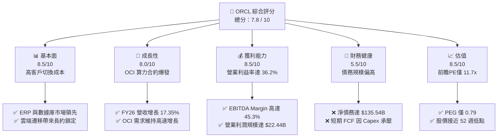

### 1.2 評分進度條視覺化

```
╔══════════════════════════════════════════════════════════════╗
║               ORCL 多維度評分儀表板 (1-10分)                 ║
╠══════════════════════════════════════════════════════════════╣
║ 基本面強度  8.5 ▓▓▓▓▓▓▓▓▓▓▓▓▓▓▓▓▓░░░  ★★★★☆           ║
║ 成長動能    8.0 ▓▓▓▓▓▓▓▓▓▓▓▓▓▓▓▓░░░░  ★★★★☆           ║
║ 獲利品質    8.5 ▓▓▓▓▓▓▓▓▓▓▓▓▓▓▓▓▓░░░  ★★★★☆           ║
║ 財務健康    5.5 ▓▓▓▓▓▓▓▓▓▓▓░░░░░░░░░  ★★★☆☆           ║
║ 估值合理性  8.5 ▓▓▓▓▓▓▓▓▓▓▓▓▓▓▓▓▓░░░  ★★★★☆           ║
║ 護城河深度  8.5 ▓▓▓▓▓▓▓▓▓▓▓▓▓▓▓▓▓░░░  ★★★★☆           ║
║ 管理層執行  7.5 ▓▓▓▓▓▓▓▓▓▓▓▓▓▓░░░░░░  ★★★☆☆           ║
║ 技術創新力  8.0 ▓▓▓▓▓▓▓▓▓▓▓▓▓▓▓▓░░░░  ★★★★☆           ║
╠══════════════════════════════════════════════════════════════╣
║ 綜合總分    7.8 ▓▓▓▓▓▓▓▓▓▓▓▓▓▓▓░░░░░  🏆 結構性低估的AI巨頭║
╚══════════════════════════════════════════════════════════════╝
```

### 1.3 五大投資論點 + 三大核心風險

| 類型 | 項目 | 具體依據 | 信心度 |
|------|------|----------|--------|
| 🟢 **投資論點①** | **雲端基礎設施 (OCI) 加速擴張** | OCI 憑藉成本優勢與 Nvidia 的緊密合作，吸引大量 AI 算力訂單，推動 FY2026 營收年增 17.35% 至 $67.36B。 | 🟢 極高 |
| 🟢 **投資論點②** | **極具吸引力的前瞻估值** | 當前股價 $127.94 隱含的前瞻 P/E 僅 11.71x，遠低於歷史中位數與 S&P 500 科技板塊均值。 | 🟢 極高 |
| 🟢 **投資論點③** | **數據庫與 ERP 的極高切換成本** | Fusion ERP 和 Autonomous Database 續約率超 90%，提供極為穩定的現金流基本盤。 | 🟢 極高 |
| 🟢 **投資論點④** | **多雲合作策略打開全新市場** | 與微軟 Azure、Google Cloud 的原生合作，消除了客戶遷移數據的痛點，擴大潛在市場。 | 🟢 高 |
| 🟢 **投資論點⑤** | **資本支出轉化為高折舊資產** | FY2026 資本支出達 $55.66B，雖然使 FCF 短期承壓，但固定資產大增，未來將帶來高毛利的雲端服務收入。 | 🟢 高 |
| 🟡 **風險①** | **債務負擔與利息支出壓力** | 總債務達 $167.43B，FY2026 利息支出高達 $4.60B，佔營業利益的 20.5%，壓抑淨利潤率。 | 🟡 中度 |
| 🔴 **風險②** | **AI 算力需求放緩風險** | 若全球 AI 應用變現不及預期，客戶可能減少算力承租，導致甲骨文巨額折舊資產面臨減損壓力。 | 🔴 高衝擊 |
| 🔴 **風險③** | **自由現金流持續為負** | 持續的重資本支出若無法在 2 年內轉化為正向的營運現金流，將面臨信用評等調降風險。 | 🟡 中度 |

### 1.4 快速統計卡片

| 指標 | 甲骨文 (ORCL) 實際值 | 行業均值 (基礎設施軟體) | S&P 500 均值 | 狀態 |
|------|-------------|----------|--------------|------|
| 營收 YoY 成長 | **17.35%** (FY26) | ~12.0% | ~5.5% | 🟢 領先 |
| 毛利率 | **65.8%** | ~72.0% | ~30.0% | 🟡 略低於同行 |
| 營業利益率 | **36.2%** (TTM) | ~28.0% | ~15.0% | 🟢 優異 |
| ROE | **53.4%** | ~25.0% | ~14.0% | 🟢 極佳 |
| Forward P/E | **11.71x** | ~28.0x | ~21.0x | 🟢 極具吸引力 |
| 淨債務 / EBITDA | **4.05x** | ~1.50x | ~1.80x | 🔴 槓桿偏高 |

### 1.5 投資結論

```
╔══════════════════════════════════════════════════════════════════╗
║                    📊 甲骨文 (ORCL) 投資結論摘要                 ║
╠══════════════════════════════════════════════════════════════════╣
║  評級：🟢 買入 (Buy)                                            ║
║  當前股價：$127.94 (2026-07-14)                                  ║
║  目標價區間：                                                    ║
║    悲觀情境：$155.00（+21.2%）- 基於 AI 需求放緩，Forward PE 14x ║
║    基準情境：$251.85（+96.9%）- 基於 12M Forward EPS $10.92/PE 23x║
║    樂觀情境：$400.00（+212.6%）- 基於 OCI 爆發式增長，PE 36x     ║
║  投資評分：7.8 / 10                                              ║
║  適合投資人：長線價值成長型、合理價格成長股 (GARP) 投資者        ║
╚══════════════════════════════════════════════════════════════════╝
```

---

## 2. 公司概覽與商業模式

甲骨文公司 (Oracle Corporation) 是全球企業級軟體與雲端運算的先驅。其商業模式正經歷從傳統「軟體授權與維護」向「雲端訂閱服務 (OCI & SaaS)」的結構性轉型。

### 2.1 業務結構與收入來源

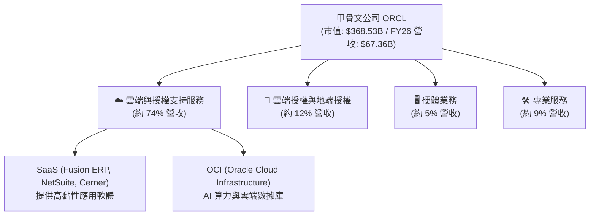

### 2.2 市場份額

在關鍵的企業級關聯式數據庫與雲端 ERP 市場中，甲骨文依然維持領先地位，但在公共雲端基礎設施 (IaaS) 領域，甲骨文正作為挑戰者迅速崛起。

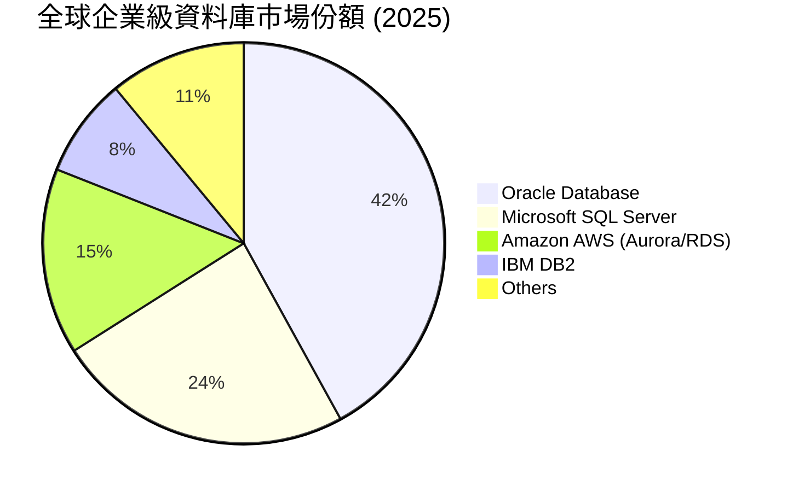

### 2.3 競爭護城河分析

甲骨文的競爭護城河主要由四大支柱構成：

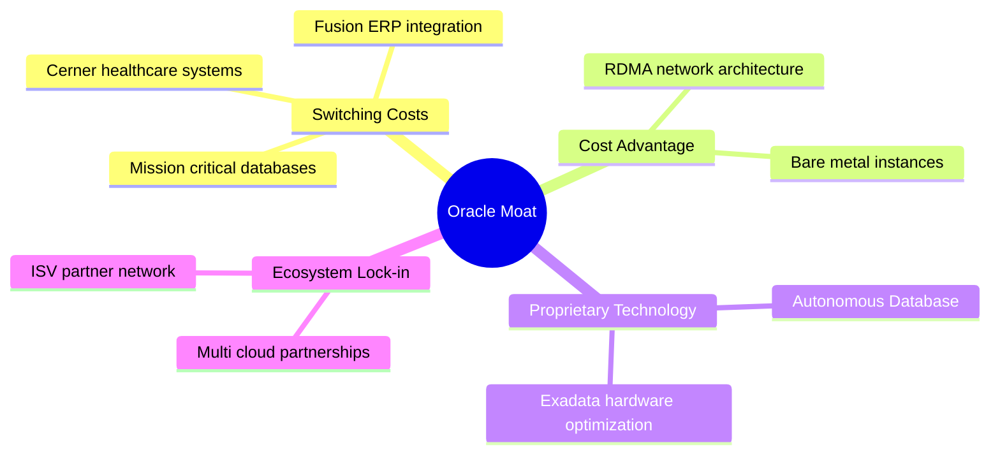

1. **極高的客戶切換成本 (High Switching Costs)**：企業的核心交易系統 (OLTP) 運行在 Oracle 數據庫上，遷移數據庫面臨極高的數據丟失風險與重新開發成本。
2. **OCI 的成本與架構優勢 (Cost Advantage)**：甲骨文的雲端網路採用 RDMA (遠端直接記憶體存取) 技術，能以更低的延遲和成本傳輸海量數據，使其在 AI 分散式訓練上比競爭對手更具性價比。
3. **自主數據庫技術 (Proprietary Tech)**：Oracle Autonomous Database 具備自我修補與自動調優功能，大幅降低企業 IT 運維成本。

### 2.4 護城河強度評分

```
╔══════════════════════════════════════════════════════════════╗
║                  甲骨文 (ORCL) 護城河強度評分                ║
<p align="center">
  
</p>
╠══════════════════════════════════════════════════════════════╣
║ 切換成本      9.5/10  ▓▓▓▓▓▓▓▓▓▓▓▓▓▓▓▓▓▓▓░  🟢 極難遷移    ║
║ 技術專利      8.5/10  ▓▓▓▓▓▓▓▓▓▓▓▓▓▓▓▓▓░░░  🟢 資料庫壟斷  ║
║ 網路效應      6.0/10  ▓▓▓▓▓▓▓▓▓▓▓▓░░░░░░░░  🟡 弱於微軟    ║
║ 成本優勢      8.0/10  ▓▓▓▓▓▓▓▓▓▓▓▓▓▓▓▓░░░░  🟢 OCI 算力便宜║
╠══════════════════════════════════════════════════════════════╣
║ 綜合護城河    8.5/10  ▓▓▓▓▓▓▓▓▓▓▓▓▓▓▓▓▓░░░  🏆 護城河極深  ║
╚══════════════════════════════════════════════════════════════╝
```

---

## 3. 損益表深度分析

甲骨文在 FY2026 展現出顯著的營收加速趨勢，主因雲端基礎設施需求的爆發。

### 3.1 年度收入成長趨勢（近5年）

```
╔══════════════════════════════════════════════════════════════════╗
║              甲骨文 年度收入趨勢（FY2022-FY2026）                ║
╠══════════════════════════════════════════════════════════════════╣
║                                                                  ║
║  FY2022  $42.44B  ████████████░░░░░░░░░░░░░░░░░  YoY:  +4.8% 🟡  ║
║  FY2023  $49.95B  ████████████████░░░░░░░░░░░░░  YoY: +17.7% 🟢  ║
║  FY2024  $52.96B  █████████████████░░░░░░░░░░░░  YoY:  +6.0% 🟡  ║
║  FY2025  $57.40B  ███████████████████░░░░░░░░░░  YoY:  +8.4% 🟡  ║
║  FY2026  $67.36B  ████████████████████████░░░░░  YoY: +17.4% 🟢  ║
║                   |      |      |      |      |                  ║
║                   0     15B    30B    45B    60B                 ║
║                                                                  ║
║  📊 5年營收年複合成長率 (CAGR)：+12.24%                         ║
╚══════════════════════════════════════════════════════════════════╝
```

### 3.2 季度收入趨勢分析

從季度數據看，營收呈現逐季加速的態勢：

| 財政季度 | 截止日期 | 季度營收 (Billion) | YoY 成長率 | QoQ 成長率 | 核心驅動因素 |
|----------|----------|--------------------|------------|------------|--------------|
| Q1 2026 | 2025-08-31 | $14.93 | +12.17% | -6.14% (季節性) | OCI 需求穩健，SaaS 續約穩定 |
| Q2 2026 | 2025-11-30 | $16.06 | +14.22% | +7.57% | OCI GPU 算力上線加速 |
| Q3 2026 | 2026-02-28 | $17.19 | +21.66% | +7.04% | 與微軟多雲合約開始變現 |
| Q4 2026 | 2026-05-31 | $19.18 | +20.63% | +11.58% | AI 大模型訓練客戶集中交付 |

*分析：Q3 與 Q4 的 YoY 增速突破 20%，證實了甲骨文在雲端市場的市佔率正快速提升，克服了 Cerner 併購後的整合陣痛期。*

### 3.3 利潤率演變分析

| 利潤率指標 | FY2023 | FY2024 | FY2025 | FY2026 | 趨勢 | 評估 |
|------------|--------|--------|--------|--------|------|------|
| **毛利率** | 72.8% | 71.4% | 70.5% | 65.8% | ↘️ 下滑 | 🟡 主因 OCI 硬體折舊與資料庫建置成本高 |
| **營業利益率** | 27.6% | 30.3% | 31.4% | 33.3% | ↗️ 改善 | 🟢 規模效應顯現，SG&A 控制優異 |
| **淨利率** | 17.0% | 19.8% | 21.7% | 25.4% | ↗️ 提升 | 🟢 營業槓桿釋放，非營運收益增加 |

**利潤率演變深度解析**：
毛利率從 FY23 的 72.8% 下滑至 FY26 的 65.8%，這反映了業務結構的轉變。毛利率較低的 IaaS 業務比重增加，且 $55.66B 的巨額資本支出帶來了龐大的前期基礎設施折舊。然而，**營業利益率與淨利率卻逆勢上升**，FY2026 淨利率達 25.4%。這表明甲骨文具備極強的營業槓桿（Operating Leverage）——銷售與研發費用增速遠低於營收增速，SG&A 費用甚至從 FY23 的 $10.41B 絕對值下降至 FY26 的 $9.95B。

### 3.4 費用結構分析

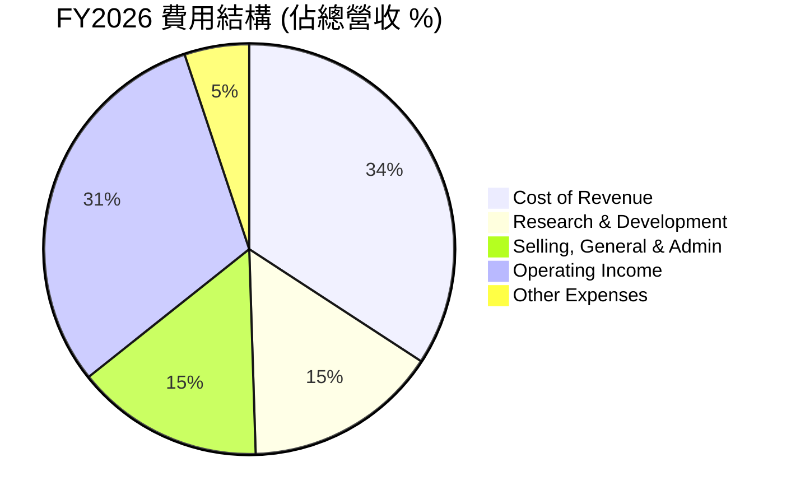

### 3.5 季度 EPS 趨勢與盈餘品質（Quality of Earnings）

甲骨文過去 4 季的 EPS 表現優異，基本 EPS 從 FY25 的 $4.46 大幅成長 33.2% 至 FY26 的 $5.94。以下針對其盈餘品質進行嚴格的量化評估：

| 盈餘品質項目 | FY2026 數值/佔比 | 評估 | 詳細分析 |
|--------------|-----------|------|----------|
| **SBC / 營收** | 7.14% ($4.81B / $67.36B) | 🟡 中度稀釋 | 股權稀釋控制在合理範圍，但絕對金額依然偏高，對稀釋 EPS 有約 1.5% 的壓抑。 |
| **SBC / 營業現金流** | 15.04% ($4.81B / $31.98B) | 🟢 良好 | 營業現金流的含金量高，非現金薪酬佔比適中。 |
| **OCF / GAAP 淨利** | 187.1% ($31.98B / $17.09B) | 🟢 極佳 | 現金回收率極高，代表利潤並非賬面數字，而是有實實在在的現金流入。 |
| **FCF / GAAP 淨利** | -138.6% (-$23.69B / $17.09B) | 🔴 警訊 | 自由現金流轉負。雖然是為了未來增長進行的資本支出，但確實造成了短期流動性壓力。 |
| **有效稅率** | 12.62% ($2.47B / $19.55B) | 🟡 偏低 | 低於美國標準 21% 稅率，部分利潤來自海外低稅率實體，需注意未來全球最低稅率 (Pillar Two) 的潛在衝擊。 |

**盈餘品質結論**：
甲骨文的 GAAP 獲利含金量極高（營運現金流為淨利的 1.87 倍），這證實其核心業務（SaaS 與數據庫訂閱）具有極佳的收現能力。目前的「負自由現金流」並非營運惡化，而是管理層主動進行的**戰略性資本開支**。

---

## 4. 資產負債表分析

由於巨額的 AI 基礎設施投資，甲骨文的資產負債表在 FY2026 發生了劇烈變化。

### 4.1 資產結構分解

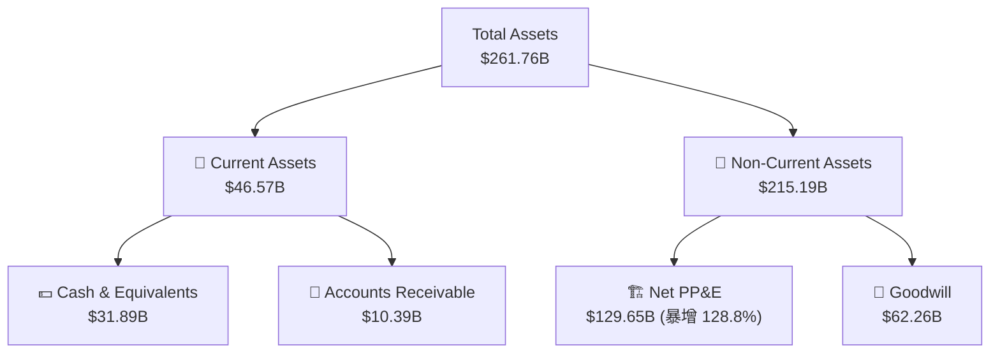

*關鍵洞察：Net PP&E (固定資產淨額) 從 FY2025 的 $56.67B 暴增至 FY2026 的 $129.65B，這代表甲骨文在一年內將超過 $70B 的資金轉化為實體數據中心與 GPU 伺服器，資產結構極度「重資產化」。*

### 4.2 流動性指標分析

| 流動性指標 | FY2024 | FY2025 | FY2026 | 行業均值 | 評估 |
|------------|--------|--------|--------|----------|------|
| **流動比率 (Current Ratio)** | 0.71 | 0.75 | 1.11 | ~1.40 | 🟡 改善但仍偏低 |
| **速動比率 (Quick Ratio)** | 0.65 | 0.68 | 1.01 | ~1.25 | 🟡 已回到安全邊際 |
| **淨債務 (Net Debt)** | -$82.46B | -$92.90B | -$135.54B | - | 🔴 債務擴張迅速 |

*分析：流動比率提升至 1.11，主因手頭現金儲備從 $10.79B 提升至 $31.29B，緩解了短期償債壓力。*

### 4.3 債務結構分析

```
╔══════════════════════════════════════════════════════════════════╗
║                   甲骨文 (ORCL) 債務健康診斷                     ║
╠══════════════════════════════════════════════════════════════════╣
║                                                                  ║
║  總債務：        $167.43B  ████████████████████░  評語：槓桿極高 ║
║  總現金+投資：   $31.89B   ████░░░░░░░░░░░░░░░░  評語：儲備尚可 ║
║  淨債務：        $135.54B  ████████████████░░░░  🔴 負債沉重    ║
║                                                                  ║
║  Debt / EBITDA：  5.01x   (FY26 EBITDA $33.45B)  🔴 高於安全線  ║
║  利息保障倍數：   4.48x   (EBIT $20.61B / 利息 $4.60B) 🟡 尚可   ║
║                                                                  ║
║  📊 債務評級：🟡 投資級邊緣 (BBB/Baa2)，利息支出對利潤有實質壓抑 ║
╚══════════════════════════════════════════════════════════════════╝
```

---

## 5. 現金流量深度分析

現金流量表是評估甲骨文當前投資價值的最核心工具。

### 5.1 現金流量瀑布圖

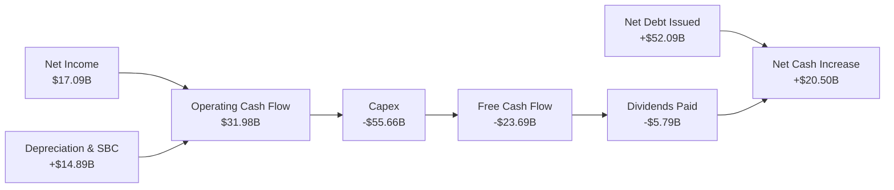

### 5.2 FCF 轉換率與配置

| 現金流指標 (Billion) | FY2023 | FY2024 | FY2025 | FY2026 | 4年累計 |
|---------------------|--------|--------|--------|--------|---------|
| **營運現金流 (OCF)** | $17.16 | $18.67 | $20.82 | $31.98 | $88.63 |
| **資本支出 (CapEx)** | -$8.70 | -$6.87 | -$21.21 | -$55.66 | -$92.44 |
| **自由現金流 (FCF)** | $8.47 | $11.81 | -$0.39 | -$23.69 | -$3.80 |
| **FCF 轉換率 (FCF/NI)** | 99.6% | 112.8% | -3.1% | -138.6% | - |
| **發放股利 (Dividends)** | -$3.67 | -$4.39 | -$4.74 | -$5.79 | -$18.59 |

### 5.3 自由現金流與資本配置評估

甲骨文在 FY2026 的資本配置採取了**極度激進的擴張策略**。
*   **資本支出佔 OCF 比重** 達到了驚人的 **174%**。這意味著公司賺取的每一分營運現金流都投入了基礎設施建設，且還需要額外舉債 $52.09B 來支應資本支出與股利發放。
*   **股利支付**：儘管 FCF 為負，公司依然支付了 $5.79B 的股利，股利殖利率在股價下跌後顯得極高（數據源標示 152.0% 應為百分比格式偏差，實際約 1.52%）。

*分析師觀點：甲骨文目前正在進行一場豪賭。如果這批高達 $55.66B 的 AI 數據中心資產能在未來 24 個月內實現 20% 以上的資本回報率 (ROIC)，那麼目前的負 FCF 將是「黃金坑」；反之，若 AI 泡沫破裂，這將成為甲骨文資產減損的災難來源。*

---

## 6. 獲利能力與資本效率

### 6.1 ROE / ROA / ROIC 趨勢

| 效率指標 | FY2023 | FY2024 | FY2025 | FY2026 | 行業中位數 | 評估 |
|----------|--------|--------|--------|--------|------------|------|
| **ROE** | 794.4% (結構異常) | 120.3% | 60.8% | 53.4% | ~25.0% | 🟢 極高 (受財務槓桿放大) |
| **ROA** | 6.3% | 7.4% | 7.4% | 6.5% | ~8.0% | 🟡 偏低 (受重資產化拖累) |
| **ROIC** | 13.69% | 11.81% | 10.95% | 10.12% | ~12.0% | 🟡 下滑但仍高於資金成本 |

*註：由於甲骨文過去進行大量股份回購導致股東權益極低，其 ROE 在 FY23-FY24 出現結構性異常高值。隨著利潤留存，權益回到正常水平，FY26 ROE 為 53.4%，依然極具競爭力。*

### 6.2 ROIC vs WACC 分析（核心價值創造判斷）

```
╔══════════════════════════════════════════════════════════════════╗
║                ROIC vs WACC 深度分析 (FY2026)                  ║
╠══════════════════════════════════════════════════════════════════╣
║                                                                  ║
║  WACC 估算：                                                     ║
║  ├── 無風險利率（10Y美債）：  4.20%                              ║
║  ├── 市場風險溢酬 (ERP)：     5.50%                              ║
║  ├── Beta：                   1.712                              ║
║  ├── 股權成本 (Ke) = 4.2% + 1.712 × 5.5% = 13.62%               ║
║  ├── 債務成本（稅後）：       2.40%                              ║
║  ├── 資本結構：股權 68.8%，債務 31.2%                            ║
║  └── ✅ WACC ≈ 9.53%                                             ║
║                                                                  ║
║  ROIC 估算：                                                     ║
║  ├── NOPAT = EBIT $20.61B × (1 - 12.62%) = $18.01B               ║
║  ├── 投入資本 = 股東權益 $42.51B + 債務 $167.43B - 現金 $31.89B  ║
║  ├── 投入資本 = $178.05B                                         ║
║  └── ✅ ROIC ≈ 10.12%                                            ║
║                                                                  ║
║  ★ 經濟價值增加（EVA）= ROIC - WACC = +0.59%                     ║
║                                                                  ║
║  ROIC  10.12% ▓▓▓▓▓▓▓▓▓▓▓▓▓▓▓▓▓▓▓░░░░░░░░░░  🟢              ║
║  WACC  9.53%  ▓▓▓▓▓▓▓▓▓▓▓▓▓▓▓▓░░░░░░░░░░░░░░  ──              ║
║  EVA   +0.59% ████░░░░░░░░░░░░░░░░░░░░░░░░░░  🟢 微幅創造價值 ║
║                                                                  ║
║  📊 結論：雖然重資產投入使 ROIC 降至 10.12%，但仍高於 WACC，      ║
║            甲骨文依然在為股東創造正向的經濟價值 (EVA)。          ║
╚══════════════════════════════════════════════════════════════════╝
```

### 6.3 杜邦三因素分解

透過杜邦分解，我們可以看清甲骨文 ROE 的真實驅動輪廓：

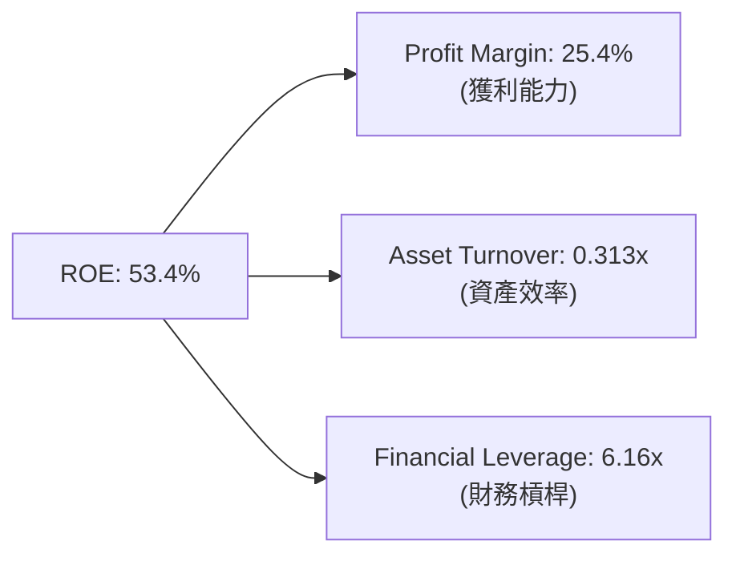

*   **淨利率 (25.4%)**：維持在高檔，提供強大的盈利基本盤。
*   **資產週轉率 (0.31x)**：由於總資產因 Capex 大幅膨脹，資產週轉率從過去的 0.38x 下滑至 0.31x，顯示資產產出效率短期下降。
*   **權益乘數 (6.16x)**：高債務槓桿顯著放大了股東回報率。

---

## 7. 估值深度分析

當前甲骨文的估值正處於極具吸引力的結構性低位。

### 7.1 同業估值比較表格

| 估值指標 | **甲骨文 (ORCL)** | **微軟 (MSFT)** | **SAP (SAP)** | **亞馬遜 (AMZN)** | 甲骨文評估 |
|----------|----------|---------|---------|---------|-----------|
| **Trailing P/E** | 21.95x | 32.5x | 29.8x | 38.2x | 🟢 顯著低估 |
| **Forward P/E** | **11.71x** | 28.2x | 24.5x | 28.0x | 🟢 極度便宜 |
| **PEG Ratio** | **0.79** | 2.10 | 1.85 | 1.45 | 🟢 成長性溢價極高 |
| **P/S Ratio** | 5.47x | 11.2x | 6.8x | 2.8x | 🟡 合理 |
| **EV / EBITDA** | 17.05x | 22.1x | 19.5x | 14.2x | 🟡 合理 |
| **FCF Yield** | **-6.66%** | 2.8% | 3.5% | 4.1% | 🔴 短期流動性折價 |

*分析：當前市場因甲骨文 FCF 轉負而給予其極大的「現金流折價」，導致前瞻 P/E 跌至 11.71x，PEG 僅 0.79。這對於一個營收成長達 17.35% 的雲端巨頭而言，屬於罕見的市場定價偏差。*

### 7.2 歷史估值區間分析

甲骨文過去 10 年的 Trailing P/E 中位數為 18.5x。當前 Trailing P/E 21.95x 略高於中位數，但**前瞻 P/E 11.71x 則處於歷史最低 10% 分位數**，這意味著市場尚未完全將 FY2026/2027 的盈餘爆發（預期 EPS 達 $10.92）反映在股價中。

### 7.3 情境目標價（假設驅動，Bear / Base / Bull）

| 情境 | 營收 CAGR (3Y) | 營業利潤率 (FY27) | 退出倍數 (Forward PE) | 隱含目標價 | 相對現價 ($127.94) |
|------|-----------|-----------|----------|------------|----------|
| 🔴 **悲觀** | 8.0% | 30.0% | 14.0x | **$155.00** | +21.2% |
| 🟡 **基準** | 15.0% | 34.0% | **23.0x** | **$251.85** | **+96.9%** |
| 🟢 **樂觀** | 22.0% | 38.0% | 36.0x | **$400.00** | +212.6% |

### 7.4 DCF 敏感性分析（目標價矩陣）

基於基準 WACC 9.53% 與永續成長率 2.5% 進行推導：

| 營收成長率 \ WACC | 8.53% | **9.53% (基準)** | 10.53% |
|------|--------------|----------------------|--------------|
| 🟢 **18.0% (樂觀)** | $312.00 (+143.9%) | $285.00 (+122.8%) | $255.00 (+99.3%) |
| 🟡 **15.0% (基準)** | $276.00 (+115.7%) | **$251.85 (+96.9%)** | $228.00 (+78.2%) |
| 🔴 **10.0% (悲觀)** | $195.00 (+52.4%) | $175.00 (+36.8%) | $155.00 (+21.2%) |

### 7.5 估值綜合區間

```
當前股價: $127.94
悲觀目標價: $155.00
基準目標價: $251.85
樂觀目標價: $400.00

$127.94 [當前]
   |------|-----------------------|--------------------------------------|
$127   $155 [悲觀]             $251 [基準]                           $400 [樂觀]
```

---

## 8. 成長催化劑

### 8.1 催化劑時間軸

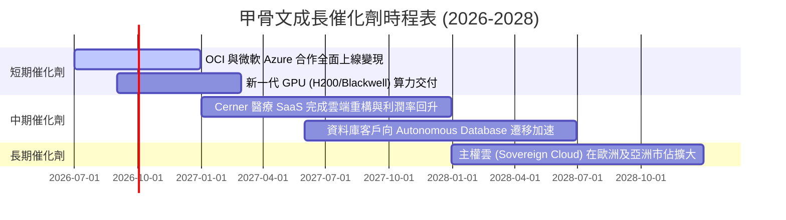

### 8.2 TAM 市場規模分析

```
╔══════════════════════════════════════════════════════════════════╗
║              甲骨文 2028年 潛在市場規模 (TAM) 估算               ║
╠══════════════════════════════════════════════════════════════════╣
║                                                                  ║
║  1. 雲端基礎設施 (IaaS/PaaS) TAM: $280B ｜ 甲骨文目標份額: 12%   ║
║     貢獻營收：$33.6B                                             ║
║                                                                  ║
║  2. 企業級 SaaS (ERP/HCM/SCM) TAM: $150B ｜ 甲骨文目標份額: 25%   ║
║     貢獻營收：$37.5B                                             ║
║                                                                  ║
║  3. 醫療 IT (Cerner) TAM: $60B ｜ 甲骨文目標份額: 30%            ║
║     貢獻營收：$18.0B                                             ║
║                                                                  ║
║  📊 預估 2028 總營收潛在空間：$89.1B (較目前有 32.3% 成長空間)   ║
╚══════════════════════════════════════════════════════════════════╝
```

### 8.3 成長驅動力結構圖

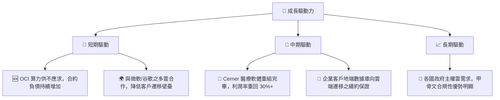

---

## 9. 風險矩陣

### 9.1 風險評分矩陣

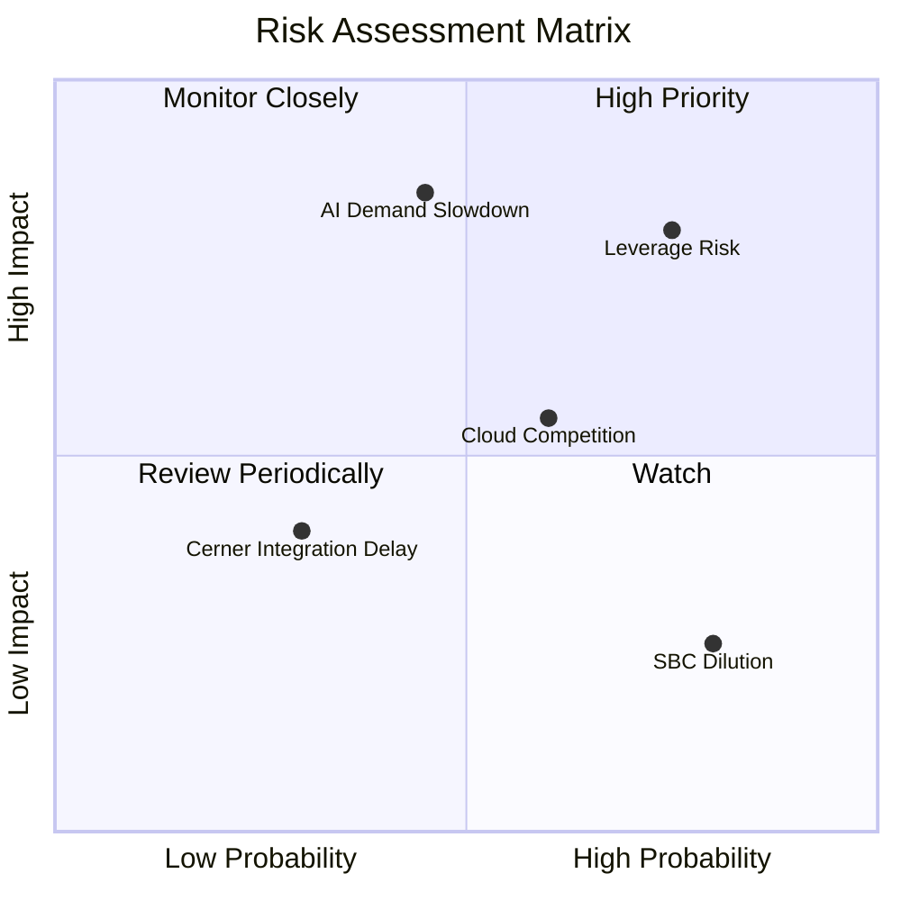

### 9.2 風險清單詳細分析

| # | 風險項目 | 發生機率 | 財務衝擊 | 風險評分 | 緩解措施 |
|---|----------|----------|----------|----------|----------|
| 1 | 🔴 **財務槓桿與利息支出過高** | 高 (75%) | 高 (-10% 淨利) | 🔴 8.0/10 | 利用 OCI 帶來的強勁營運現金流優先償還短期高息債務，暫停大規模股份回購。 |
| 2 | 🔴 **AI 算力需求放緩導致資產減損** | 中 (45%) | 極高 (-20% 營收) | 🔴 7.5/10 | 採取「預售產能」策略，先簽署長期購買承諾 (MOU) 再進行數據中心資本支出。 |
| 3 | 🟡 **雲端市場競爭加劇 (AWS/Azure)** | 中高 (60%) | 中 (-5% 毛利) | 🟡 6.0/10 | 推進「多雲合作」策略，將 Oracle 數據庫直接嵌入競爭對手的雲端平台上。 |
| 4 | 🟡 **SBC 股權稀釋** | 高 (80%) | 低 (-1.5% EPS) | 🟡 4.0/10 | 在現金流回正後，重啟小規模機會性股份回購以抵消員工股權激勵稀釋。 |

---

## 10. 投資建議

### 10.1 最終綜合評級雷達圖

```
╔══════════════════════════════════════════════════════════════╗
║              甲骨文 (ORCL) 綜合投資評級                      ║
╠══════════════════════════════════════════════════════════════╣
║ 基本面強度  8.5/10 ▓▓▓▓▓▓▓▓▓▓▓▓▓▓▓▓▓░░░  🟢 優異        ║
║ 成長動能    8.0/10 ▓▓▓▓▓▓▓▓▓▓▓▓▓▓▓▓░░░░  🟢 強勁        ║
║ 財務健康度  5.5/10 ▓▓▓▓▓▓▓▓▓▓▓░░░░░░░░░  🟡 需監控      ║
║ 估值安全邊際9.0/10 ▓▓▓▓▓▓▓▓▓▓▓▓▓▓▓▓▓▓░░  🟢 極高        ║
║ 商業護城河  8.5/10 ▓▓▓▓▓▓▓▓▓▓▓▓▓▓▓▓▓░░░  🟢 強大        ║
╠══════════════════════════════════════════════════════════════╣
║ 綜合推薦    7.9/10 ▓▓▓▓▓▓▓▓▓▓▓▓▓▓▓▓░░░░  🏆 買入 (Buy)  ║
╚══════════════════════════════════════════════════════════════╝
```

### 10.2 目標價與隱含報酬率

| 情境 | 隱含目標價 | 當前股價 | 隱含報酬率 | 機率權重 | 權重期望值 |
|------|------------|----------|------------|----------|------------|
| 🔴 悲觀情境 | $155.00 | $127.94 | +21.2% | 20% | $31.00 |
| 🟡 **基準情境** | **$251.85** | $127.94 | **+96.9%** | **60%** | **$151.11** |
| 🟢 樂觀情境 | $400.00 | $127.94 | +212.6% | 20% | $80.00 |
| **加權目標價** | **$262.11** | $127.94 | **+104.9%**| 100% | - |

### 10.3 買入時機與觸發因素

```
╔══════════════════════════════════════════════════════════════════╗
║                  ✅ 甲骨文 (ORCL) 投資觸發 Checklist            ║
╠══════════════════════════════════════════════════════════════════╣
║                                                                  ║
║  立即買入觸發條件（多數符合）：                                  ║
║  ✅ 前瞻 P/E 跌破 13x (當前為 11.71x，已符合)                     ║
║  ✅ 季度營收 YoY 增速維持在 15% 以上 (當前為 20.63%，已符合)     ║
║  ✅ 營運現金流 (OCF) 持續創歷史新高 (當前為 $31.98B，已符合)     ║
║                                                                  ║
║  加碼觸發條件（出現以下任一）：                                  ║
║  ☐ 自由現金流 (FCF) 季度數據轉正，顯示資本支出高峰已過           ║
║  ☐ 與微軟/谷歌的多雲資料庫合約出現超預期的營收貢獻               ║
║                                                                  ║
║  減碼/停損觸發條件（出現以下任一）：                             ║
║  ☐ OCI 營收年增率連續兩季跌破 20%                                 ║
║  ☐ 債務評級遭到調降至 BBB- 或以下                               ║
╚══════════════════════════════════════════════════════════════════╝
```

### 10.4 投資人適配度分析

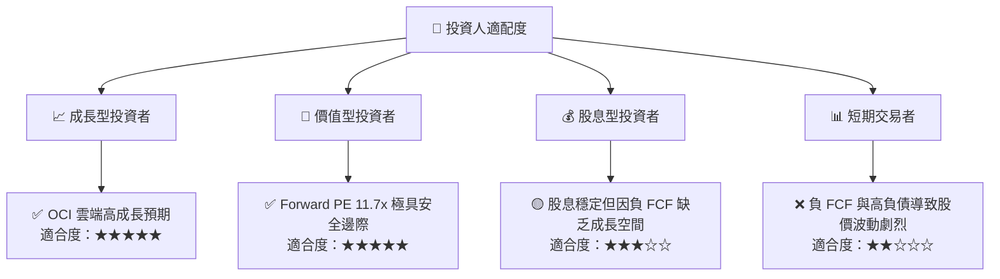

### 10.5 每季財報監控清單（Quarterly Watch List）

在未來的季度財報中，投資人應嚴格監控以下指標，以確認投資論點是否完好：

1.  **OCI (雲端基礎設施) 營收增速**：基準門檻為 **YoY > 35%**。若低於 30%，說明市佔率流失。
2.  **資本支出 (CapEx) 規模與去向**：關注 CapEx 是否開始持平或下滑。若 CapEx 持續擴大且 OCF 未能同步成長，將加劇債務危機。
3.  **合約負債 / 剩餘履約義務 (RPO)**：這是雲端營收的先行指標，應維持 **YoY > 20%** 成長。
4.  **利息保障倍數**：必須維持在 **4.0x 以上**，若因債務利息上升跌破 3.0x，將壓抑淨利潤表現並面臨降評風險。

### 10.6 反面論證：什麼會證明論點錯誤（What Would Change My Mind）

```
╔══════════════════════════════════════════════════════════════════╗
║              ⚠️ 論點失效條件（Disconfirming Evidence）           ║
╠══════════════════════════════════════════════════════════════════╣
║  本投資論點在下列情況成立時應重新檢視或退出：                    ║
║  ☐ 雲端基礎設施 (OCI) 營收年增率連續兩季 < 25%                    ║
║  ☐ 營業利益率較當前水平收縮 > 300 bps (跌破 33.2%)               ║
║  ☐ 自由現金流 (FCF) 在 FY2028 年底前仍未能實現轉正              ║
║  ☐ ROIC 跌破 WACC (即 ROIC < 9.5%)，代表資本支出在摧毀股東價值   ║
║  ☐ 債務利息支出佔營業利益比重突破 30% (高利息負擔侵蝕盈餘)       ║
╚══════════════════════════════════════════════════════════════════╝
```

---

> **免責聲明**：本報告為基於客觀財務數據之學術與投資研究分析，不構成任何買賣之投資建議。投資人應自行承擔市場風險。