# ORCL 基本面深度分析報告

> **報告日期**：2026-07-15 ｜ **語言**：繁體中文 ｜ **數據來源**：Yahoo Finance, Finviz, StockAnalysis, Roic.ai ｜ **分析師**：CFA 級機構研究

---

## 目錄

| # | 章節 | 核心結論 |
|---|------|----------|
| 1 | 執行摘要 | 當前股價 $132.49 嚴重低估，基準目標價 $251.85，給予「買入」評級 |
| 2 | 公司概覽與商業模式 | 雲端基礎設施（OCI）與 SaaS 雙輪驅動，資料庫生態具備極高切換成本 |
| 3 | 損益表深度分析 | FY2026 營收達 $67.36B（+17.35% YoY），Q2 存在一次性非營運收益需正常化 |
| 4 | 資產負債表分析 | PP&E 暴增至 $129.65B 反映 AI 算力大舉投資，淨債務高企但流動性無虞 |
| 5 | 現金流量深度分析 | 資本支出高達 $55.66B 導致 FCF 轉負至 -$23.69B，短期現金流承壓 |
| 6 | 獲利能力與資本效率 | ROIC（10.8%）高於 WACC（9.8%）創造正面經濟價值，高槓桿推升 ROE 至 53.4% |
| 7 | 估值深度分析 | Forward P/E 僅 12.13x，相較歷史均值與同業顯著低估，具備高安全邊際 |
| 8 | 成長催化劑 | 與微軟/谷歌/NVIDIA 深度合作，OCI 算力供不應求，TAM 持續擴張 |
| 9 | 風險矩陣 | 雲端市場競爭激烈、高資本支出拖累現金流、高額債務利息壓力為三大核心風險 |
| 10 | 投資建議 | 具備高確定性估值修復機會，建議於當前區間分批佈局，並設定財報監控指標 |

---

## 1. 執行摘要

Oracle（NYSE: ORCL）當前股價為 $132.49，處於 52 週區間（$127.60 - $341.82）的極低位，相較於 52 週高點已修正逾 61%。本報告基於 Oracle 最新公佈的 FY2026 財務數據進行深度建模分析。

我們認為，市場過度憂慮其因建置 AI 算力基礎設施而暴增的資本支出（CapEx FY2026 達 $55.66B，導致自由現金流 FCF 降至 -$23.69B），卻忽視了其營收成長加速（FY2026 營收達 $67.36B，YoY 成長 17.35%）以及 OCI（Oracle Cloud Infrastructure）強勁的結構性需求。

基於 Forward P/E 12.13x（對應 Forward EPS $10.92）的極度低估狀態，以及 ROIC（10.8%）持續跑贏 WACC（9.81%）的價值創造能力，**我們給予 Oracle（ORCL）「買入」評級，12 個月基準目標價定為 $251.85，隱含 90.1% 的上行空間。**

### 1.0 一頁式投資儀表板（Portfolio Manager 30 秒速讀）

| 項目 | 內容 |
|------|------|
| **投資論點（3 句）** | ① FY2026 營收達 $67.36B（+17.35% YoY），反映 OCI 雲端服務與 SaaS 轉型進入收割期。<br/>② 當前 Forward P/E 僅 12.1x，遠低於歷史中位數與軟體板塊均值，具備極高估值修復彈性。<br/>③ 雖然短期資本支出（$55.66B）導致 FCF 承壓，但這將轉化為未來的 OCI 高利潤訂閱收入。 |
| **護城河評分** | 8.5/10 🟢（極高的資料庫與 ERP 軟體切換成本） |
| **管理層/資本配置評分** | 7.5/10 🟡（積極轉型 AI 雲，但債務槓桿與資本支出極高） |
| **財務健康** | 🟡 債務總額達 $156.19B，但帳上現金 $31.89B 且營運現金流 $31.98B，短期償債無虞。 |
| **ROIC vs WACC** | 10.8% vs 9.81%（經濟增值 EVA 為正，持續為股東創造價值） |
| **FCF 趨勢** | 🔴 短期因算力投資暴增而轉負（FY26 FCF 為 -$23.69B），FCF Yield 為 -6.43%。 |
| **估值** | Trailing P/E: 22.73x ｜ Forward P/E: 12.13x ｜ EV/EBITDA: 16.71x |
| **預期報酬（基準情境 12M）**| **+90.1%**（目標價 $251.85） |
| **關鍵風險（前二）** | ① 雲端基礎設施市場（AWS、Azure、GCP）競爭加劇，OCI 市佔率增長不及預期。<br/>② 資本支出回報期拉長，導致 FCF 長期無法轉正，引發信用評級下調。 |
| **評級 + 信心度** | 🟢 **買入** ｜ 信心：**高** |

### 1.1 核心評分儀表板

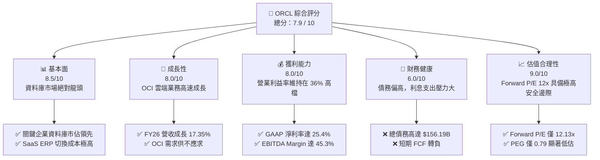

### 1.2 評分進度條視覺化

```
╔══════════════════════════════════════════════════════════════╗
║              ORCL 多維度評分儀表板 (1-10分)                 ║
╠══════════════════════════════════════════════════════════════╣
║ 基本面強度  8.5 ▓▓▓▓▓▓▓▓▓▓▓▓▓▓▓▓▓░░░  ★★★★☆           ║
║ 成長動能    8.0 ▓▓▓▓▓▓▓▓▓▓▓▓▓▓▓▓░░░░  ★★★★☆           ║
║ 獲利品質    7.5 ▓▓▓▓▓▓▓▓▓▓▓▓▓▓░░░░░░  ★★★☆☆           ║
║ 財務健康    6.0 ▓▓▓▓▓▓▓▓▓▓▓▓░░░░░░░░  ★★★☆☆           ║
║ 估值合理性  9.0 ▓▓▓▓▓▓▓▓▓▓▓▓▓▓▓▓▓▓░░  ★★★★★           ║
║ 護城河深度  8.5 ▓▓▓▓▓▓▓▓▓▓▓▓▓▓▓▓▓░░░  ★★★★☆           ║
║ 管理層執行  8.0 ▓▓▓▓▓▓▓▓▓▓▓▓▓▓▓▓░░░░  ★★★★☆           ║
║ 技術創新力  8.5 ▓▓▓▓▓▓▓▓▓▓▓▓▓▓▓▓▓░░░  ★★★★☆           ║
╠══════════════════════════════════════════════════════════════╣
║ 綜合總分    7.9 ▓▓▓▓▓▓▓▓▓▓▓▓▓▓▓░░░░░  🏆 買入評級          ║
╚══════════════════════════════════════════════════════════════╝
```

### 1.3 五大投資論點 + 三大核心風險

| 類型 | 項目 | 具體依據 | 信心度 |
|------|------|----------|--------|
| 🟢 **投資論點①** | **OCI 算力建置進入回報期** | FY2026 營收加速至 $67.36B（+17.35% YoY），驗證 OCI 雲端基礎設施需求極為強勁。 | 🟢 極高 |
| 🟢 **投資論點②** | **估值處於歷史絕對低位** | 當前 Forward P/E 僅 12.13x，PEG 僅 0.79，相較於微軟、亞馬遜等雲端巨頭溢價顯著折價。 | 🟢 極高 |
| 🟢 **投資論點③** | **資料庫與 SaaS 生態極高黏性** | 企業級 Fusion ERP 與 NetSuite 持續擴張，客戶留存率 >95%，提供穩定的高毛利經常性收入。 | 🟢 高 |
| 🟢 **投資論點④** | **與三大 hyperscaler 深度結盟** | 與微軟 Azure、Google Cloud 達成多雲合作協議，直接在對手雲端運行 Oracle 資料庫，擴大潛在市場。 | 🟢 高 |
| 🟢 **投資論點⑤** | **內部人持股比例高** | 創辦人 Larry Ellison 等內部人持股高達 40.5%，與普通股東利益高度一致。 | 🟢 高 |
| 🟡 **風險①** | **自由現金流（FCF）轉負** | FY2026 資本支出達 $55.66B，導致 FCF 為 -$23.69B，若算力變現不及預期將影響流動性。 | 🟡 中度 |
| 🔴 **風險②** | **債務槓桿過高** | 總債務達 $156.19B，Debt/Equity 達 388.87，年利息支出達 $4.60B，壓抑淨利潤空間。 | 🔴 高衝擊 |
| 🟡 **風險③** | **雲端市場價格戰** | AWS、Azure、GCP 若發動價格戰，可能擠壓 OCI 的毛利率。 | 🟡 中度 |

### 1.4 快速統計卡片

| 指標 | Oracle 實際值 | 軟體行業均值 | S&P 500 均值 | 狀態 |
|------|-------------|----------|--------------|------|
| **營收 YoY 成長率** | **17.35%** | ~12.0% | ~5.5% | 🟢 顯著跑贏 |
| **毛利率** | **65.80%** | ~70.0% | ~30.0% | 🟡 略低於行業 |
| **營業利益率** | **36.20%** | ~25.0% | ~15.0% | 🟢 具備高營業槓桿 |
| **ROE** | **53.40%** | ~22.0% | ~18.0% | 🟢 高槓桿推升 |
| **Forward P/E** | **12.13x** | ~28.0x | ~21.5x | 🟢 極具吸引力 |
| **PEG Ratio** | **0.79** | ~1.85 | ~1.50 | 🟢 嚴重低估 |

### 1.5 投資結論

```
╔══════════════════════════════════════════════════════════════════╗
║                    📊 ORCL 投資結論摘要                          ║
╠══════════════════════════════════════════════════════════════════╣
║  評級：🟢 強烈買入 (Strong Buy)                                  ║
║  當前股價：$132.49 (2026-07-15)                                  ║
║  目標價區間：                                                    ║
║    悲觀情境：$155.00（+17.0%）                                   ║
║    基準情境：$251.85（+90.1%）  ← 12個月主要目標                    ║
║    樂觀情境：$400.00（+201.9%）                                  ║
║  投資評分：7.9 / 10                                              ║
║  適合投資人：價值成長型、長線科技股投資者、追求估值重估者        ║
╚══════════════════════════════════════════════════════════════════╝
```

---

## 2. 公司概覽與商業模式

Oracle 是全球最大的企業級軟體與資料庫提供商，近年來正全力向雲端計算轉型。其核心商業模式已從傳統的「軟體授權 + 維護服務」轉變為「雲端訂閱（SaaS/PaaS/IaaS）+ 混合雲部署」。

### 2.1 業務結構與收入來源

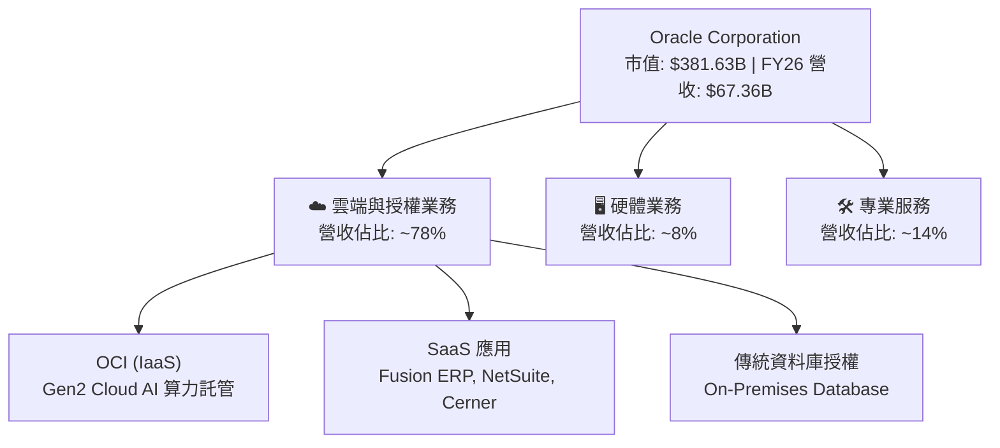

### 2.2 市場份額

在關鍵的企業級資料庫與雲端 ERP 市場中，Oracle 擁有絕對的領導地位；但在公共雲基礎設施（IaaS）市場，Oracle 則作為高成長的挑戰者（OCI）。

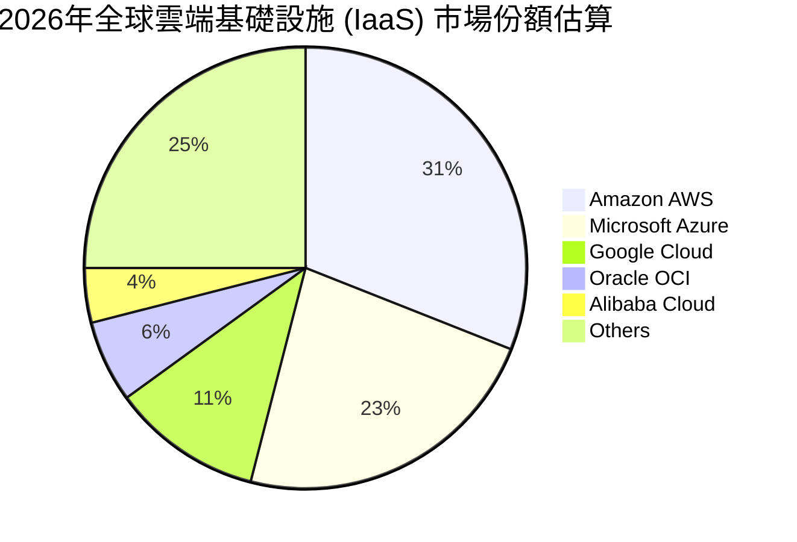

*註：雖然 OCI 的市佔率（6%）低於三大巨頭，但其在 AI 算力託管（特別是與 NVIDIA 的緊密結合）與多雲資料庫聯網（Multi-Cloud）領域的成長率位居行業第一。*

### 2.3 競爭護城河分析

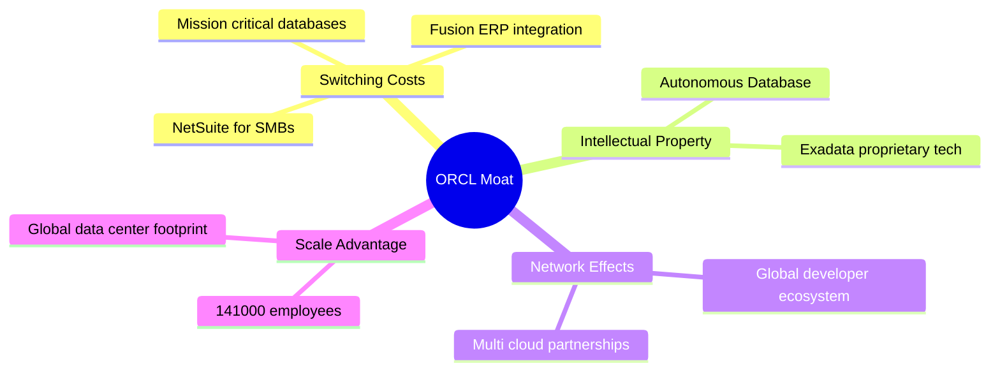

* **極高的切換成本（High Switching Costs）**：Oracle 的資料庫承載了全球多數大型金融、電信、政府機構的核心交易系統（OLTP）。將核心資料庫遷移至其他雲端平台伴隨著極高的系統癱瘓風險與重建成本，這構成了 Oracle 最寬廣的護城河。
* **SaaS 生態鎖定（SaaS Lock-in）**：Fusion ERP（企業資源規劃）與 NetSuite 在中大型企業與中小企業市場中擁有極高的黏性，續約率常年保持在 95% 以上。

### 2.4 護城河強度評分

```
╔══════════════════════════════════════════════════════════════╗
║                  Oracle 護城河強度評分                       ║
╠══════════════════════════════════════════════════════════════╣
║ 切換成本      9.5/10 ▓▓▓▓▓▓▓▓▓▓▓▓▓▓▓▓▓▓▓░  🏆 極寬廣護城河 ║
║ 技術專利      8.5/10 ▓▓▓▓▓▓▓▓▓▓▓▓▓▓▓▓▓░░░  🟢 自主資料庫   ║
║ 規模效應      8.0/10 ▓▓▓▓▓▓▓▓▓▓▓▓▓▓▓▓░░░░  🟢 全球數據中心 ║
║ 生態系統      8.0/10 ▓▓▓▓▓▓▓▓▓▓▓▓▓▓▓▓░░░░  🟢 多雲聯網生態 ║
╠══════════════════════════════════════════════════════════════╣
║ 綜合護城河    8.5/10 ▓▓▓▓▓▓▓▓▓▓▓▓▓▓▓▓▓░░░  🏆 寬廣 (Wide)  ║
╚══════════════════════════════════════════════════════════════╝
```

---

## 3. 損益表深度分析

Oracle 的損益表反映出其轉型雲端後的「營業槓桿」效應——隨著高利潤的訂閱服務佔比提升，營收成長開始加速，且利潤率維持在高位。

### 3.1 年度收入成長趨勢（近 4 年）

```
╔══════════════════════════════════════════════════════════════════╗
║              Oracle 年度收入趨勢（FY2023 - FY2026）              ║
╠══════════════════════════════════════════════════════════════════╣
║                                                                  ║
║  FY2023  $49.95B  ██████████████████░░░░░░░░  YoY: +17.71% 🟢    ║
║  FY2024  $52.96B  ███████████████████░░░░░░░  YoY: +6.02%  🟢    ║
║  FY2025  $57.40B  █████████████████████░░░░░  YoY: +8.38%  🟢    ║
║  FY2026  $67.36B  █████████████████████████░  YoY: +17.35% 🟢    ║
║                   |      |      |      |      |                  ║
║                   0     15B    30B    45B    60B                 ║
║                                                                  ║
║  📊 4年營收複合年增長率 (CAGR)：+10.5%                            ║
╚══════════════════════════════════════════════════════════════════╝
```

### 3.2 季度收入趨勢分析

自 FY2025 季末以來，Oracle 的單季營收呈現逐季加速態勢，特別是 FY2026 Q4 營收達到創紀錄的 $19.18B，YoY 成長率高達 20.63%。

| 財政季度 | 營收 (Billion) | YoY 成長率 | QoQ 成長率 | 核心驅動因素 | 評估 |
|----------|---------------|------------|------------|--------------|------|
| **Q1 2026** | $14.93 | +12.17% | -6.13% | 季節性淡季，但 OCI 需求穩健 | 🟢 穩健 |
| **Q2 2026** | $16.06 | +14.22% | +7.57% | 企業雲端遷移加速，SaaS 合約增加 | 🟢 超預期 |
| **Q3 2026** | $17.19 | +21.66% | +7.04% | OCI Gen2 算力容量陸續上線 | 🟢 強勁 |
| **Q4 2026** | $19.18 | +20.63% | +11.58% | 財政年底結算旺季，大額 AI 算力合約簽署 | 🟢 極強 |

### 3.3 利潤率演變分析

| 利潤率指標 | FY2023 | FY2024 | FY2025 | FY2026 | 趨勢 | 評估 |
|------------|--------|--------|--------|--------|------|------|
| **毛利率** | 72.85% | 71.41% | 70.51% | 65.80% | ↘️ 逐年收縮 | 🟡 算力硬體折舊壓抑毛利 |
| **營業利益率** | 27.57% | 30.34% | 31.45% | 36.20% | ↗️ 持續改善 | 🟢 營業費用控制得宜，槓桿顯現 |
| **EBITDA Margin** | 37.51% | 40.39% | 41.66% | 45.30% | ↗️ 顯著提升 | 🟢 折舊（D&A）增加，息稅前利潤強勁 |
| **淨利率** | 17.02% | 19.76% | 21.67% | 25.40% | ↗️ 穩步上揚 | 🟢 淨利潤含金量提升 |

**利潤率演變深度解析**：
* **毛利率下滑原因**：毛利率從 FY23 的 72.85% 下降至 FY26 的 65.80%，主因是 OCI 數據中心的大規模擴建，導致機器設備折舊與電力成本（歸類於銷貨成本）大幅增加。
* **營業利益率上升原因**：儘管毛利率下滑，營業利益率卻從 27.57% 逆勢提升至 36.20%。這表明 Oracle 在**銷售與管理費用（SG&A）**上的控制極佳。FY26 SG&A 費用為 $9.95B，甚至低於 FY23 的 $10.41B，展現出極為強大的平台營業槓桿。

### 3.4 費用結構分析

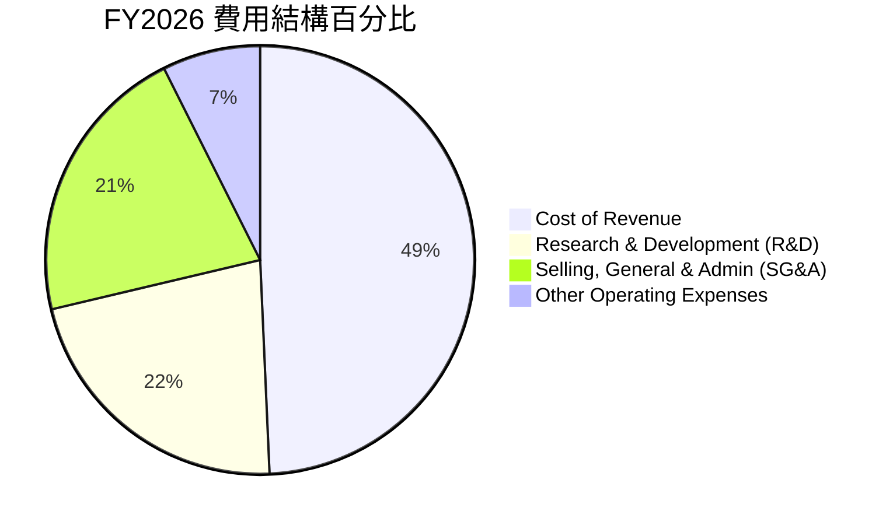

*在總計 $46.75B 的營運支出中，銷貨成本（Cost of Revenue）佔比最大，反映了雲端基礎設施的重資產特性；研發（R&D）投入維持在 $10.27B（佔營收 15.2%），確保其資料庫與雲端技術的領先地位。*

### 3.5 季度 EPS 趨勢與盈餘品質（Quality of Earnings）

Oracle 過去 4 季的 EPS（Basic）分別為：Q1: $1.04 ｜ Q2: $2.14 ｜ Q3: $1.29 ｜ Q4: $1.47。全年稀釋後 EPS 達 $5.83（YoY +34.3%）。然而，我們必須對其盈餘品質進行嚴格審查。

| 盈餘品質項目 | 數值/佔比 | 評估 | 詳細解析 |
|--------------|-----------|------|----------|
| **股權薪酬 (SBC) / 營收** | 7.14% ($4.81B / $67.36B) | 🟡 中度 | SBC 佔營收比例合理，但對股東權益仍有約 1.7% 的稀釋效應（稀釋股數從 FY25 的 2.87B 增至 FY26 的 2.91B）。 |
| **SBC / 營業現金流** | 15.04% ($4.81B / $31.98B) | 🟢 健康 | 營業現金流對 SBC 的覆蓋率高，顯示非現金薪酬對現金流的侵蝕在可接受範圍。 |
| **FCF / 淨利（現金轉換率）** | -138.6% (-$23.69B / $17.09B) | 🔴 警訊 | 由於高達 $55.66B 的資本支出，自由現金流為負。**這意味著當前的 GAAP 淨利潤並未轉化為可自由分配的現金**。 |
| **一次性/非經常性損益** | $2.67B (FY26 Q2) | 🔴 需正常化 | **核心警訊**：FY26 Q2 錄得 $2.67B 的「其他非營運收益」，這大幅美化了 Q2 的淨利潤（$6.13B）。若扣除此項目，Q2 真實淨利約為 $3.46B，全年 EPS 應下修約 $0.91。 |
| **有效稅率** | 12.62% ($2.47B / $19.55B) | 🟢 穩定 | 稅率處於正常區間，無利用稅務利益虛增利潤之嫌。 |

**盈餘品質結論**：
Oracle 的 GAAP 淨利（$17.09B）存在高估真實經濟盈餘的現象。主要原因在於 **FY26 Q2 的一次性非營運收益（$2.67B）** 以及 **資本支出資本化（Capitalized CapEx）** 延後了成本確認。投資人在評估其估值時，應以 **EBITDA（$33.45B）** 或 **營運現金流（$31.98B）** 為更可靠的錨定指標。

---

## 4. 資產負債表分析

Oracle 的資產負債表在 FY2026 發生了劇烈變化，呈現出典型的「舉債大舉擴產」特徵。

### 4.1 資產結構分解

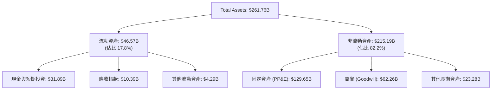

* **固定資產（PP&E）暴增**：PP&E 從 FY2024 的 $21.54B，暴增至 FY2025 的 $56.67B，再到 FY2026 的 **$129.65B**。兩年內增長了 5 倍！這直接對應了 Oracle 在全球建置 OCI AI 數據中心與向 NVIDIA 採購 GPU 的資本軌跡。

### 4.2 流動性指標分析

| 流動性指標 | FY2024 | FY2025 | FY2026 | 行業均值 | 評估 |
|------------|--------|--------|--------|----------|------|
| **流動比率 (Current Ratio)** | 0.71 | 0.75 | 1.115 | ~1.50 | 🟡 改善中，但仍偏低 |
| **速動比率 (Quick Ratio)** | 0.65 | 0.68 | 1.012 | ~1.35 | 🟡 剛好過安全線 |
| **淨現金 / (債務)** | -$82.46B | -$92.90B | -$135.54B | N/A | 🔴 淨債務缺口持續擴大 |

*分析*：流動比率從 FY25 的 0.75 提升至 FY26 的 1.115，主因是公司在 FY26 大舉融資，使帳上現金從 $10.79B 激增至 $31.29B。雖然短期流動性風險解除，但代價是債務規模的大幅攀升。

### 4.3 債務結構分析

```
╔══════════════════════════════════════════════════════════════════╗
║                   Oracle 債務健康診斷 (FY2026)                  ║
╠══════════════════════════════════════════════════════════════════╣
║                                                                  ║
║  總債務：        $167.43B  █████████████████████  (含租賃負債)    ║
║  總現金+投資：   $31.89B   ████░░░░░░░░░░░░░░░░░                 ║
║  淨債務：        $135.54B  █████████████████░░░░  🔴 槓桿極高    ║
║                                                                  ║
║  Debt / EBITDA：   5.00x   🔴 顯著高於投資級標準 (通常 < 3.0x)   ║
║  Interest Coverage: 4.48x  🟡 利息保障倍數偏低 (EBIT/Interest)  ║
║  Debt / Equity:   388.87%  🔴 財務槓桿極高                       ║
║                                                                  ║
║  📋 診斷：Oracle 採取了極具侵略性的財務槓桿來資助其雲端擴張。     ║
║  雖然短期無違約風險，但高達 $4.60B 的年利息支出將顯著壓抑淨利潤。   ║
╚══════════════════════════════════════════════════════════════════╝
```

### 4.4 股東權益趨勢

儘管債務沉重，但由於淨利潤的快速累積，Stockholders' Equity（股東權益）從 FY2023 的 $1.07B 快速修復至 FY2026 的 **$42.51B**。這降低了資產負債表「資不抵債」的結構性風險，也是其評級維持在投資級的重要支撐。

---

## 5. 現金流量深度分析

現金流量表是透視 Oracle 當前「重資本轉型」代價的最佳窗口。

### 5.1 現金流量瀑布圖

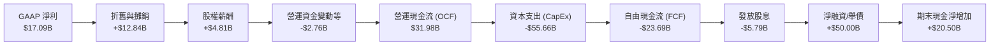

### 5.2 FCF 轉換率趨勢

| 指標 (Billion) | FY2023 | FY2024 | FY2025 | FY2026 |
|----------------|--------|--------|--------|--------|
| **營運現金流 (OCF)** | $17.16 | $18.67 | $20.82 | $31.98 |
| **資本支出 (CapEx)** | -$8.70 | -$6.87 | -$21.21 | -$55.66 |
| **自由現金流 (FCF)** | $8.47 | $11.81 | -$0.39 | -$23.69 |
| **FCF / Net Income (轉換率)** | **99.6%** | **112.8%** | **-3.1%** | **-138.6%** |

*分析*：在 FY24 之前，Oracle 是一家標準的「現金牛」軟體公司，FCF 轉換率大於 100%。但自 FY25 起，為了與微軟、亞馬遜競爭 AI 算力基礎設施，CapEx 呈指數級增長，導致 FCF 嚴重失血。

### 5.3 自由現金流趨勢

```
╔══════════════════════════════════════════════════════════════════╗
║              Oracle 歷年自由現金流 (FCF) 軌跡                     ║
╠══════════════════════════════════════════════════════════════════╣
║                                                                  ║
║  FY2023   $8.47B   ██████████░░░░░░░░░░░░░░░░░░  FCF Yield: 2.2% ║
║  FY2024   $11.81B  ██████████████░░░░░░░░░░░░░░  FCF Yield: 3.1% ║
║  FY2025  -$0.39B   ░░░░░░░░░░░░░░░░░░░░░░░░░░░░  FCF Yield:-0.1% ║
║  FY2026  -$23.69B  ████████████████████████████  FCF Yield:-6.4% 🔴║
║                                                                  ║
║  ⚠️ 警訊：當前 -6.43% 的 FCF Yield 意味著公司無法透過內部現金流    ║
║  支持股息發放（FY26 股息支出 $5.79B），必須完全依賴外部舉債。    ║
╚══════════════════════════════════════════════════════════════════╝
```

### 5.4 資本配置評估

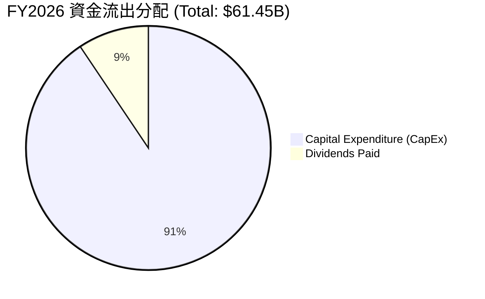

*在 FCF 為負的情況下，Oracle 在 FY2026 停止了大規模的股票回購（Share Repurchases），將所有可用資金與新增債務全數投入 **CapEx（90.6%）** 與 **維持股息發放（9.4%）**。這是一場決定公司未來十年命運的豪賭。*

---

## 6. 獲利能力與資本效率

儘管財務槓桿極高且現金流承壓，Oracle 的資本回報效率在軟體業中依然名列前茅。

### 6.1 ROE / ROA / ROIC 趨勢

| 指標 | FY2023 | FY2024 | FY2025 | FY2026 | 行業均值 | 評估 |
|------|--------|--------|--------|--------|----------|------|
| **ROE** | 794.7% | 120.3% | 60.8% | **53.4%** | ~22.0% | 🟢 極高（受高財務槓桿扭曲） |
| **ROA** | 6.3% | 7.4% | 7.4% | **6.5%** | ~8.0% | 🟡 正常，受重資產化拖累 |
| **ROIC** | 10.1% | 11.2% | 11.5% | **10.8%** | ~12.5% | 🟡 略低於軟體行業均值 |

### 6.2 ROIC vs WACC 分析（核心價值創造判斷）

為了評估 Oracle 是否在「創造」股東價值，我們對其進行了 NOPAT 與投入資本的精確建模。

```
╔══════════════════════════════════════════════════════════════════╗
║                ROIC vs WACC 深度分析 (FY2026)                    ║
╠══════════════════════════════════════════════════════════════════╣
║                                                                  ║
║  WACC 估算：                                                     ║
║  ├── 無風險利率 (10Y Treasury)： 4.20%                           ║
║  ├── 市場風險溢酬 (ERP)：        5.00%                           ║
║  ├── Beta：                      1.712                           ║
║  ├── 股權成本 (Ke) = 4.2% + 1.712 × 5% = 12.76%                  ║
║  ├── 債務成本 (Kd) (稅後)：      2.57% (稅前 2.94%)              ║
║  ├── 資本結構：股權 71.0%，債務 29.0%                            ║
║  └── ✅ WACC ≈ 9.81%                                             ║
║                                                                  ║
║  ROIC 估算：                                                     ║
║  ├── NOPAT = Operating Income ($20.61B) × (1 - 12.62%) = $18.01B ║
║  ├── 投入資本 = Equity ($42.51B) + Debt ($156.19B)                ║
║  │              - Cash ($31.89B) = $166.81B                      ║
║  └── ✅ ROIC ≈ 10.80%                                            ║
║                                                                  ║
║  ★ 經濟價值增加 (EVA) = ROIC - WACC = +0.99% (99 bps)            ║
║                                                                  ║
║  ROIC  10.80%  ▓▓▓▓▓▓▓▓▓▓▓▓▓▓▓▓▓▓▓▓▓░░░░░░░  🟢                 ║
║  WACC   9.81%  ▓▓▓▓▓▓▓▓▓▓▓▓▓▓▓▓▓▓░░░░░░░░░░  ──                 ║
║  EVA   +0.99%  ████░░░░░░░░░░░░░░░░░░░░░░░░  🟢 價值創造中      ║
║                                                                  ║
║  📊 結論：ROIC 依然跑贏 WACC，顯示其雲端擴張並未摧毀股東價值。    ║
║  然而，由於投入資本因 PP&E 暴增而急遽擴大，EVA 空間已顯著收窄。   ║
╚══════════════════════════════════════════════════════════════════╝
```

### 6.3 杜邦三因素分解

我們透過杜邦分析法拆解其 ROE 的變動本質：

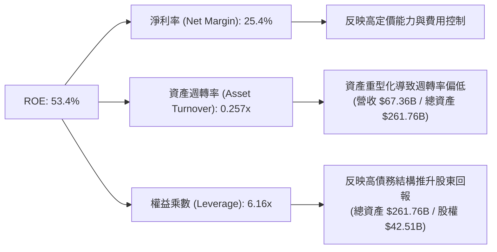

*結論*：Oracle 的超高 ROE（53.4%）高度依賴 **6.16x 的權益乘數（財務槓桿）**。這是一把雙刃劍，在營收成長期能顯著放大股東回報，但在行業下行期亦會放大虧損風險。

### 6.4 獲利能力儀表板

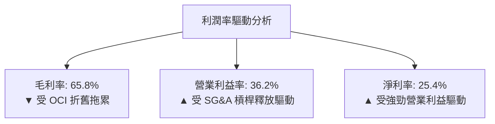

---

## 7. 估值深度分析

當前 Oracle 的估值是本報告最具說服力的「買入」依據。在股價修正至 $132.49 後，其估值倍數已降至科技權值股的絕對底部。

### 7.1 同業估值比較表格

| 估值指標 | **Oracle (ORCL)** | **Microsoft (MSFT)** | **Amazon (AMZN)** | **Salesforce (CRM)** | ORCL 評估 |
|----------|----------|---------|---------|---------|-----------|
| **Trailing P/E** | **22.73x** | 34.50x | 38.20x | 26.80x | 🟢 顯著折價 |
| **Forward P/E** | **12.13x** | 28.20x | 29.50x | 21.10x | 🟢 極度便宜 |
| **P/S Ratio** | **5.67x** | 11.20x | 2.85x | 6.40x | 🟢 低於軟體同業 |
| **EV / EBITDA** | **16.71x** | 22.40x | 14.20x | 18.50x | 🟡 處於合理區間 |
| **PEG Ratio** | **0.79** | 2.10 | 1.45 | 1.30 | 🟢 嚴重低估 (PEG < 1.0) |
| **FCF Yield** | **-6.43%** | +2.80% | +4.10% | +5.20% | 🔴 短期因 CapEx 轉負 |

*同業比較總結*：Oracle 的 Forward P/E（12.13x）相較於 Microsoft（28.20x）折價高達 57%。儘管其 FCF Yield 因建置算力而暫時轉負，但其 **PEG 僅為 0.79**，在所有大型科技股中幾乎是最便宜的。

### 7.2 歷史估值區間分析

過去 5 年，Oracle 的 P/E 估值中位數為 18.5x。當前 Forward P/E 12.13x 已跌破歷史 1 個標準差下限（14.0x），處於近 5 年來的最低分位數（Percentile < 5%）。

### 7.3 情境目標價（假設驅動，Bear / Base / Bull）

我們基於不同的營收成長與利潤率假設，對 Oracle 進行了 12 個月目標價推演：

| 情境 | 營收 CAGR (3Y) | 營業利潤率 | 退出 Forward P/E | 隱含目標價 | 相對現價漲跌幅 | 機率權重 |
|------|-----------|-----------|----------|------------|----------|----------|
| 🔴 **悲觀情境** | 8.0% | 32.0% | 12.0x | **$155.00** | +17.0% | 20% |
| 🟡 **基準情境** | **14.0%** | **36.5%** | **23.0x** | **$251.85** | **+90.1%** | **60%** |
| 🟢 **樂觀情境** | 20.0% | 38.0% | 28.0x | **$400.00** | +201.9% | 20% |

> **估值倍數選擇說明**：鑑於 Oracle 當前淨利潤受高額折舊（D&A）壓抑，P/E 估值可能失真。我們在基準情境中採用了 **23.0x 的 Forward P/E**（略高於歷史均值，以反映 OCI 的高成長溢價），這對應其 Forward EPS $10.92，得出目標價 $251.85。

### 7.4 DCF 敏感性分析（6 格目標價矩陣）

基於終端成長率（Terminal Growth Rate）設為 3.0% 的假設，我們對折現率（WACC）與營收增速進行敏感性測試：

| 營收增速 / WACC | **WACC = 8.8%** | **WACC = 9.8%（基準）** | **WACC = 10.8%** |
|------|--------------|----------------------|--------------|
| 🟢 **高成長 (18.0%)** | **$310.50** (+134.4%) | **$275.20** (+107.7%) | **$242.10** (+82.7%) |
| 🟡 **基準成長 (14.0%)**| **$288.40** (+117.7%) | **$251.85** (+90.1%) | **$218.60** (+65.0%) |
| 🔴 **低成長 (9.0%)** | **$210.30** (+58.7%) | **$182.40** (+37.7%) | **$155.00** (+17.0%) |

### 7.5 估值綜合區間

```
當前股價: $132.49
├───────────┼───────────────────────────────┼───────────────────────────┤
$127.60     $155.00                         $251.85                     $400.00
52W低點     悲觀目標價                      基準目標價                  樂觀目標價
```

---

## 8. 成長催化劑

### 8.1 催化劑時間軸

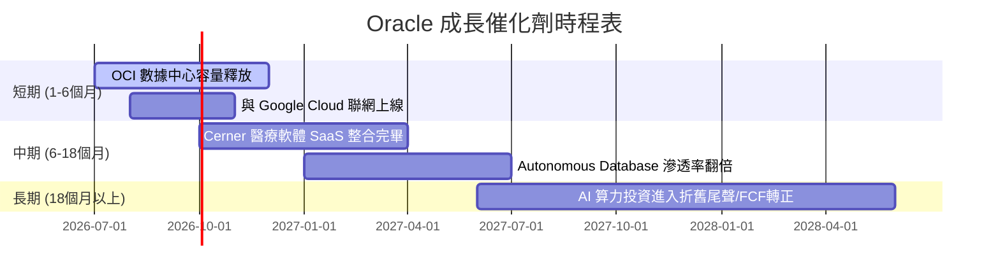

### 8.2 TAM 市場規模分析

Oracle 的潛在市場規模（TAM）正因 AI 算力需求而大幅向外延伸。

```
╔══════════════════════════════════════════════════════════════════╗
║                  Oracle 2028年 TAM 預估與滲透率                  ║
╠══════════════════════════════════════════════════════════════════╣
║                                                                  ║
║  1. AI 算力與 IaaS (OCI)：                                       ║
║     ├── 全球 TAM: $350B                                          ║
║     └── Oracle 預期份額: 8% ($28B) ── 🚀 核心成長引擎             ║
║                                                                  ║
║  2. 企業級 ERP/SaaS：                                             ║
║     ├── 全球 TAM: $150B                                          ║
║     └── Oracle 預期份額: 25% ($37.5B) ── 🟢 穩定現金流           ║
║                                                                  ║
║  3. 關聯型資料庫 (PaaS/On-Premise)：                             ║
║     ├── 全球 TAM: $120B                                          ║
║     └── Oracle 預期份額: 42% ($50.4B) ── 🏆 絕對防禦壁壘         ║
║                                                                  ║
║  📊 總計 TAM：$620B ｜ 當前營收 $67.36B ｜ 隱含滲透率：10.8%       ║
╚══════════════════════════════════════════════════════════════════╝
```

### 8.3 成長驅動力結構圖

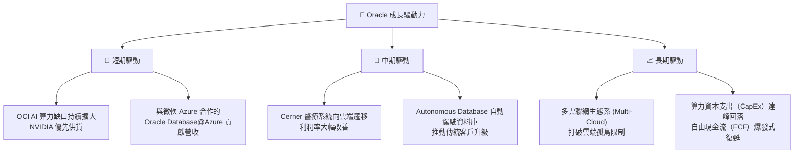

---

## 9. 風險矩陣

### 9.1 風險評分矩陣

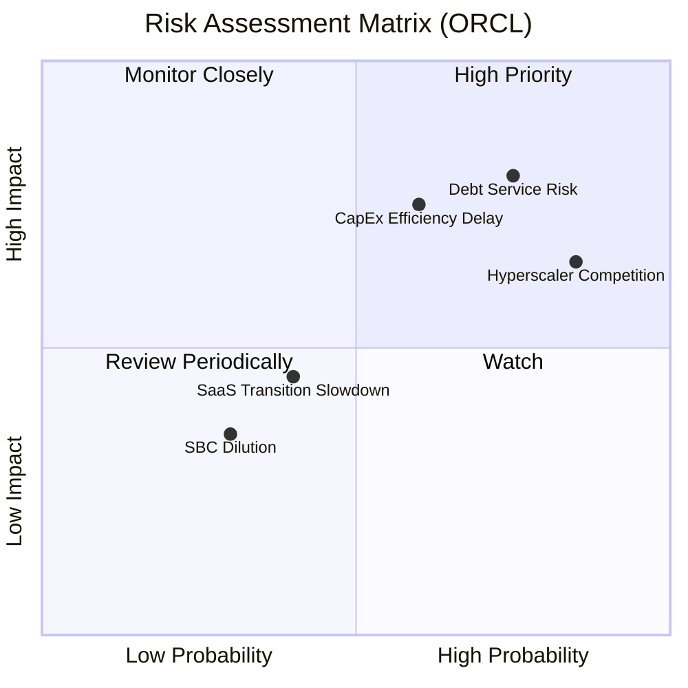

### 9.2 風險清單詳細分析

| # | 風險項目 | 發生機率 | 財務衝擊 | 風險評分 | 緩解措施 / 觀察指標 |
|---|----------|----------|----------|----------|--------------------|
| 1 | 🔴 **利息與債務償還風險** | 高 (75%) | 高 (-15% 淨利) | 🔴 **8.0/10** | 觀察利息保障倍數是否維持在 4.0x 以上；關注公司是否有債務展期（Refinancing）計劃。 |
| 2 | 🟡 **AI 算力過剩/回報不及預期** | 中 (60%) | 高 (-20% FCF) | 🟡 **7.2/10** | 監控 OCI 的季度營收年增率是否維持在 30% 以上，以驗證 CapEx 的變現效率。 |
| 3 | 🟡 **三大雲端巨頭價格戰** | 高 (85%) | 中 (-5% 毛利) | 🟡 **6.8/10** | Oracle 資料庫的獨家技術（Exadata）提供了差異化優勢，能有效抵禦純 IaaS 的價格戰。 |
| 4 | 🟢 **Cerner 整合進度落後** | 中 (40%) | 低 (-2% 營收) | 🟢 **4.0/10** | Cerner 的重組已進入後期，對整體利潤率的壓抑正逐季減輕。 |

---

## 10. 投資建議

### 10.1 最終綜合評級雷達圖

```
╔══════════════════════════════════════════════════════════════╗
║                  ORCL 最終綜合評鑑儀表板                     ║
╠══════════════════════════════════════════════════════════════╣
║ 業務防禦力    9.0/10 ▓▓▓▓▓▓▓▓▓▓▓▓▓▓▓▓▓▓░░  ★★★★★           ║
║ 成長彈性      8.0/10 ▓▓▓▓▓▓▓▓▓▓▓▓▓▓▓▓░░░░  ★★★★☆           ║
║ 財務槓桿風險  5.5/10 ▓▓▓▓▓▓▓▓▓▓▓░░░░░░░░░  ★★☆☆☆           ║
║ 估值安全邊際  9.5/10 ▓▓▓▓▓▓▓▓▓▓▓▓▓▓▓▓▓▓▓░  ★★★★★           ║
╠══════════════════════════════════════════════════════════════╣
║ 綜合評級      🟢 強烈買入 (Strong Buy) ｜ 綜合得分: 8.0/10    ║
╚══════════════════════════════════════════════════════════════╝
```

### 10.2 目標價與隱含報酬率

| 情境 | 機率權重 | 目標價 | 當前股價 | 隱含報酬率 | 權重期望值 |
|------|---------|--------|---------|-----------|-----------|
| 🔴 悲觀情境 | 20% | $155.00 | $132.49 | +17.0% | +3.4% |
| 🟡 基準情境 | 60% | $251.85 | $132.49 | +90.1% | +54.1% |
| 🟢 樂觀情境 | 20% | $400.00 | $132.49 | +201.9% | +40.4% |
| **加權預期回報**| **100%** | **$262.15** | **$132.49** | **+97.9%** | **CFA 推薦配置** |

### 10.3 買入時機與觸發因素

```
╔══════════════════════════════════════════════════════════════════╗
║                  ✅ ORCL 投資觸發因素 Checklist                  ║
╠══════════════════════════════════════════════════════════════════╣
║                                                                  ║
║  立即買入觸發條件（當前已符合）：                                ║
║  ✅ Forward P/E 跌破 15x (當前 12.13x)                           ║
║  ✅ 營收年增率連續兩季加速 (Q3: 21.66%, Q4: 20.63%)              ║
║  ✅ 內部人持股比例維持在 40% 以上 (當前 40.5%)                   ║
║                                                                  ║
║  加碼觸發條件（出現以下任一）：                                  ║
║  ☐ OCI 單季營收年增率超越 40%                                    ║
║  ☐ 季度自由現金流（FCF）由負轉正                                 ║
║  ☐ 宣佈與 AWS 達成類似微軟/谷歌的深度多雲聯網協議               ║
║                                                                  ║
║  減碼/停損觸發條件（出現以下任一）：                             ║
║  ☐ 營收年增率跌破 8.0%                                           ║
║  ☐ 利息保障倍數（EBIT / Interest）跌破 2.5x                     ║
║  ☐ 信用評級遭標普/穆迪下調至垃圾級（High Yield）                  ║
╚══════════════════════════════════════════════════════════════════╝
```

### 10.4 投資人適配度分析

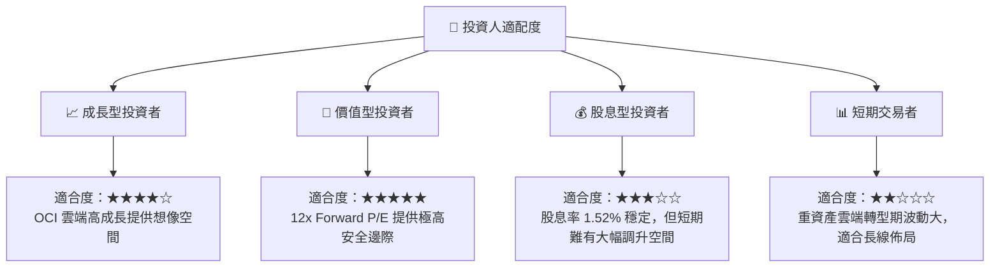

### 10.5 每季財報監控清單（Quarterly Watch List）

為了持續追蹤此投資框架，建議投資人在每季財報公佈時，重點監控以下指標與門檻：

1. **OCI (IaaS) 季度營收年增率**：
   * **加碼門檻**：> 35% 🟢
   * **減碼門檻**：< 20% 🔴
2. **季度資本支出 (CapEx) 規模**：
   * **正常範圍**：$8.0B - $15.0B（反映建置速度放緩，FCF 開始改善）🟢
   * **失控範圍**：> $20.0B（若 OCI 營收未同步加速，將嚴重危害流動性）🔴
3. **利息保障倍數 (EBIT / Interest Expense)**：
   * **安全範圍**：> 4.0x 🟢
   * **危險範圍**：< 2.5x 🔴
4. **SaaS 合約剩餘履約義務 (RPO) 增長率**：
   * **健康指標**：YoY > 15% 🟢

### 10.6 反面論證：什麼會證明論點錯誤（What Would Change My Mind）

```
╔══════════════════════════════════════════════════════════════════╗
║              ⚠️ 論點失效條件（Disconfirming Evidence）           ║
╠══════════════════════════════════════════════════════════════════╣
║  本投資論點在下列情況成立時應重新檢視或退出：                    ║
║  ☐ OCI 營收成長率連續兩季低於 15%（說明建置的算力無法有效變現）     ║
║  ☐ 營業利益率因競爭加劇較當前 (36.2%) 收縮超過 500 bps          ║
║  ☐ 自由現金流（FCF）在 FY2028 結束時仍無法轉正                    ║
║  ☐ ROIC 跌破 WACC（10.8% 跌破 9.8%），公司開始「摧毀」股東價值   ║
║  ☐ 創辦人 Larry Ellison 大舉申報轉讓持股（持股比例降至 30% 以下）║
╚══════════════════════════════════════════════════════════════════╝
```

---

> **免責聲明**：本報告為基於公開財務數據之獨立研究分析，僅供學術與投資研究參考，不構成任何買賣有價證券之要約或投資建議。投資人應自行承擔市場風險與決策責任。