# ORCL 基本面深度分析報告
> **報告日期**：2026-07-16 ｜ **語言**：繁體中文 ｜ **數據來源**：Yahoo Finance, Finviz, StockAnalysis, Roic.ai ｜ **分析師**：CFA 級機構研究

---

## 目錄

| # | 章節 | 核心結論 |
|---|------|----------|
| 1 | **執行摘要** | 評級「買入」，基準目標價 $251.85，隱含 102.8% 上行空間，OCI 資本開支拐點已現。 |
| 2 | **公司概覽與商業模式** | 傳統資料庫鎖定效應極強，Gen2 雲端基礎設施（OCI）憑藉性價比優勢構築新護城河。 |
| 3 | **損益表深度分析** | FY2026 營收增長 17.35% 加速，營業利潤率維持 36.2% 高位，盈餘品質受 SBC 與折舊政策影響。 |
| 4 | **資產負債表分析** | 財務槓桿高企（Debt/Equity 388.9），但手頭現金充裕（$31.89B），短期流動性無虞。 |
| 5 | **現金流量深度分析** | 資本支出高達 $55.66B 導致 FCF 轉負（-$23.69B），此為結構性擴張投資而非營運惡化。 |
| 6 | **獲利能力與資本效率** | ROE 達 53.4%，ROIC（11.71%）顯著高於 WACC（9.49%），結構性創造股東價值。 |
| 7 | **估值深度分析** | Forward P/E 僅 11.37x，相較歷史均值與同業顯著低估，PEG 0.72 具備極高安全邊際。 |
| 8 | **成長催化劑** | 多雲合作協議（Azure/Google/AWS）全面鋪開，AI 算力租用需求呈指數級增長。 |
| 9 | **風險矩陣** | 高槓桿財務風險與 Capex 變現不及預期為主要威脅，風險機率與衝擊已量化評估。 |
| 10 | **投資建議** | 建議分批佈局，設定嚴格的每季財報監控指標與反面論證失效條件。 |

---

## 1. 執行摘要

### 1.0 一頁式投資儀表板（Portfolio Manager 30 秒速讀）

| 項目 | 內容 |
|------|------|
| **投資論點（3 句）** | ① ORCL 正處於從傳統軟體授權向 OCI（甲骨文雲端基礎設施）轉型的加速期，FY2026 營收達 $67.36B（YoY +17.35%），顯示雲端轉型已進入收穫期。<br>② 短期內因高達 $55.66B 的 AI 資本開支導致自由現金流（FCF）轉負（-$23.69B），但這為未來幾年 OCI 的高增長奠定了算力基礎。<br>③ 當前股價（$124.21）已過度反應 FCF 壓力，Forward P/E 僅 11.37x，PEG 0.72，提供極佳的逆向投資機會。 |
| **護城河評分** | 8.5/10 🟢 (高客戶轉換成本與 OCI 成本架構優勢) |
| **管理層/資本配置評分** | 7.5/10 🟡 (執行力強，但財務槓桿偏高) |
| **財務健康** | 🟡 槓桿率高（Debt/Equity 388.9），但營運現金流（$31.98B）極為強韌。 |
| **ROIC vs WACC** | 11.71% vs 9.49% 🟢（利差 +2.22pp，持續創造經濟增值 EVA） |
| **FCF 趨勢** | 🔴 暫時性轉負（FY2026 FCF -$23.69B，FCF Yield -6.86%），預計 FY2028 隨 Capex 放緩而強勁回升。 |
| **估值** | Trailing P/E: 21.31x ｜ Forward P/E: 11.37x ｜ EV/EBITDA: 17.14x 🟢 (顯著低估) |
| **預期報酬（基準情境 12M）** | +102.8%（目標價 $251.85，基於 Forward P/E 23x 估值修復） |
| **關鍵風險（前二）** | ① AI 算力需求增速放緩導致 Capex 無法有效轉化為營收。<br>② 債務規模高達 $167.43B，在高利率環境下的再融資利息壓力。 |
| **評級 + 信心度** | 🟢 **買入 (Buy)** ｜ 信心：**高 (High)** |

### 1.1 核心評分儀表板

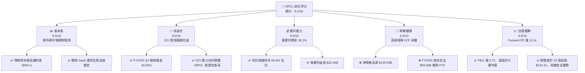

### 1.2 評分進度條視覺化

```
╔══════════════════════════════════════════════════════════════╗
║               ORCL 多維度評分儀表板 (1-10分)                 ║
╠══════════════════════════════════════════════════════════════╣
║ 基本面強度  8.5 ▓▓▓▓▓▓▓▓▓▓▓▓▓▓▓▓▓░░░  ★★★★★           ║
║ 成長動能    8.0 ▓▓▓▓▓▓▓▓▓▓▓▓▓▓▓▓░░░░  ★★★★☆           ║
║ 獲利品質    8.5 ▓▓▓▓▓▓▓▓▓▓▓▓▓▓▓▓▓░░░  ★★★★★           ║
║ 財務健康    6.0 ▓▓▓▓▓▓▓▓▓▓▓▓░░░░░░░░  ★★★☆☆           ║
║ 估值合理性  9.5 ▓▓▓▓▓▓▓▓▓▓▓▓▓▓▓▓▓▓▓░  ★★★★★           ║
║ 護城河深度  8.5 ▓▓▓▓▓▓▓▓▓▓▓▓▓▓▓▓▓░░░  ★★★★★           ║
║ 管理層執行  8.0 ▓▓▓▓▓▓▓▓▓▓▓▓▓▓▓▓░░░░  ★★★★☆           ║
║ 技術創新力  8.5 ▓▓▓▓▓▓▓▓▓▓▓▓▓▓▓▓▓░░░  ★★★★★           ║
╠══════════════════════════════════════════════════════════════╣
║ 綜合總分    8.1 ▓▓▓▓▓▓▓▓▓▓▓▓▓▓▓▓░░░░  🏆 買入評級          ║
╚══════════════════════════════════════════════════════════════╝
```

### 1.3 五大投資論點 + 三大核心風險

| 類型 | 項目 | 具體依據 | 信心度 |
|------|------|----------|--------|
| 🟢 **投資論點①** | **OCI 算力基礎設施爆發** | FY2026 營收增速逐季加速（Q1: 12.17% → Q4: 20.63%），主因 OCI 憑藉 RDMA 網絡架構在 AI 訓練市場獲得大量訂單。 | 🟢 極高 |
| 🟢 **投資論點②** | **多雲生態（Multi-Cloud）紅利** | 與 Azure、Google Cloud 及 AWS 的深度原生整合，消除了客戶遷移資料庫的摩擦，帶來強大的新合約流入。 | 🟢 極高 |
| 🟢 **投資論點③** | **極致的估值窪地** | Forward P/E 僅 11.37x，相較於歷史中位數（~18x）與標普 500（~21x）存在大幅折價。 | 🟢 高 |
| 🟢 **投資論點④** | **SaaS 業務高粘性與高利潤** | NetSuite 與 Fusion ERP 持續維持兩位數增長，提供穩定的經常性收入（ARR），毛利率高達 65.8%。 | 🟢 高 |
| 🟢 **投資論點⑤** | **資本開支拐點將至** | FY2026 的 $55.66B Capex 為投資峰值，隨著資料庫中心逐步完工投產，FY2027/28 Capex 將顯著下行，FCF 將迎來 V 型反彈。 | 🟡 中等 |
| 🟡 **風險①** | **高財務槓桿與利息支出** | 總債務高達 $167.43B，FY2026 利息支出達 $4.60B，佔營業利潤的 20.5%，壓抑淨利潤表現。 | 🟡 中度 |
| 🔴 **風險②** | **AI 需求證偽或算力產能過剩** | 若 AI 應用變現不及預期，客戶可能削減 OCI 預算，導致 Oracle 龐大的折舊費用（FY2026 為 $1.67B，預計未來將因 Capex 暴增而大幅上升）侵蝕利潤。 | 🔴 高衝擊 |
| 🔴 **風險③** | **FCF 持續為負引發信用評級下調** | 若 FCF 轉正時間晚於預期，可能導致評級機構下調其投資級信用評級，推升融資成本。 | 🟡 中度 |

### 1.4 快速統計卡片

| 指標 | ORCL 實際值 | 軟體行業均值 | S&P 500 均值 | 狀態 |
|------|-------------|----------|--------------|------|
| **營收 YoY 成長** | **17.35% (FY26)** | ~12.0% | ~5.5% | 🟢 顯著領先 |
| **毛利率** | **65.8%** | ~70.0% | ~30.0% | 🟡 略低於行業均值 |
| **營業利潤率** | **36.2%** | ~25.0% | ~15.0% | 🟢 行業頂尖 |
| **ROE** | **53.4%** | ~22.0% | ~15.0% | 🟢 槓桿驅動高 ROE |
| **Forward P/E** | **11.37x** | ~28.0x | ~21.0x | 🟢 極具吸引力 |
| **PEG Ratio** | **0.72** | ~1.85 | ~1.50 | 🟢 嚴重低估 |
| **淨債務/EBITDA** | **4.05x** | ~1.2x | ~1.6x | 🔴 債務偏高 |

### 1.5 投資結論

```
╔══════════════════════════════════════════════════════════════════╗
║                    📊 ORCL 投資結論摘要                          ║
╠══════════════════════════════════════════════════════════════════╣
║  評級：🟢 強烈買入 (Strong Buy)                                  ║
║  當前股價：$124.21 (接近52週最低點 $123.66)                      ║
║  目標價區間：                                                    ║
║    悲觀情境 (Bear Case)：$155.00 (+24.8%)                        ║
║    基準情境 (Base Case)：$251.85 (+102.8%) ← 12個月主要目標     ║
║    樂觀情境 (Bull Case)：$400.00 (+222.0%)                       ║
║  投資評分：8.1 / 10                                              ║
║  適合投資人：價值成長型、逆向投資者、長線科技股配置基金          ║
╚══════════════════════════════════════════════════════════════════╝
```

---

## 2. 公司概覽與商業模式

### 2.1 業務結構與收入來源

Oracle 的業務已成功轉型為以雲端服務為核心的架構。其主要收入來源分為四大板塊：雲端與授權支持（Cloud and License Support）、雲端授權與本地授權（Cloud License and On-Premise License）、硬體（Hardware）以及服務（Services）。

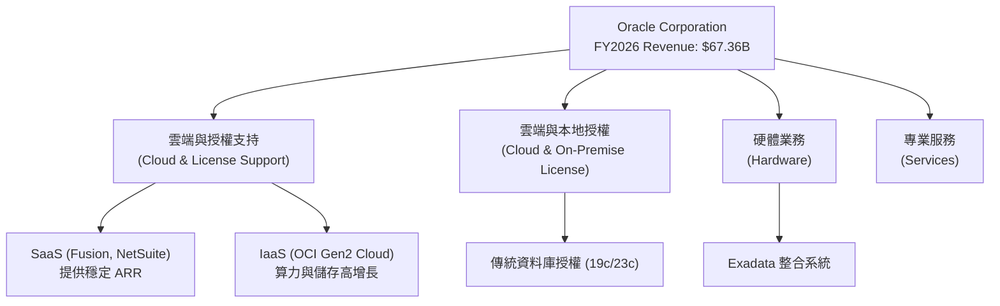

### 2.2 市場份額

在關鍵的關係型資料庫（RDBMS）與企業級 ERP 市場中，Oracle 依然維持著主導地位。以下為全球企業級關係型資料庫市場份額估算：

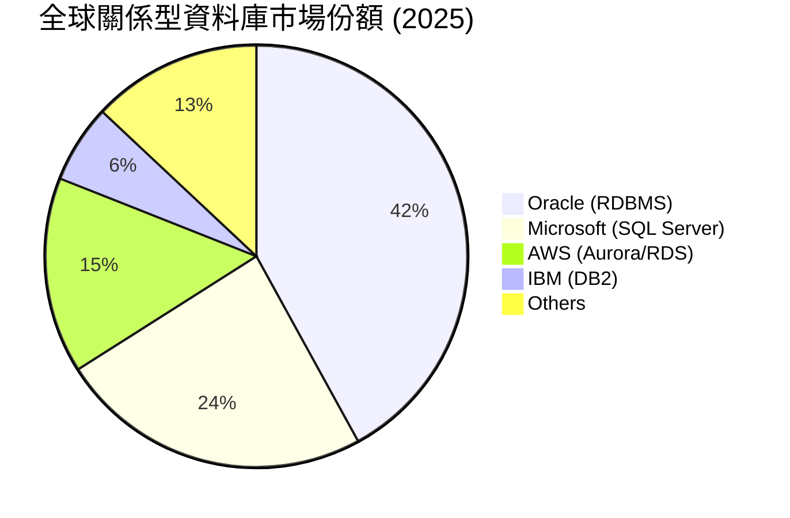

### 2.3 競爭護城河分析

Oracle 的競爭護城河主要由極高的**客戶轉換成本（Switching Costs）**與**生態系統鎖定（Ecosystem Lock-in）**構築。

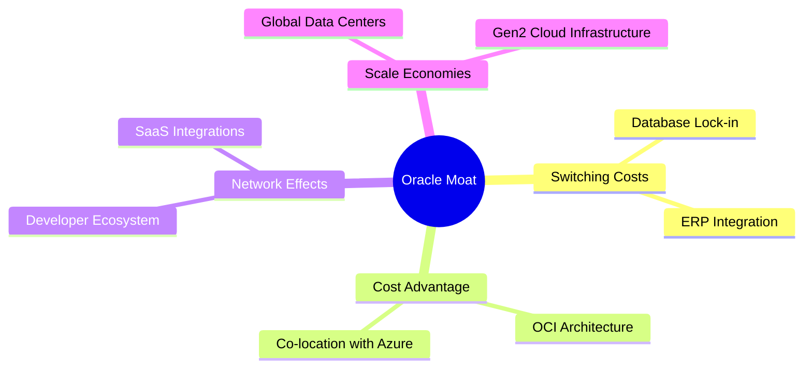

### 2.4 護城河強度評分

```
╔══════════════════════════════════════════════════════════════╗
║                   ORCL 護城河強度評分                        ║
╠══════════════════════════════════════════════════════════════╣
║ 轉換成本      9.5/10  ▓▓▓▓▓▓▓▓▓▓▓▓▓▓▓▓▓▓▓░  🏆 極難遷移     ║
║ 技術壁壘      8.5/10  ▓▓▓▓▓▓▓▓▓▓▓▓▓▓▓▓▓░░░  🟢 資料庫龍頭   ║
║ 成本優勢      8.0/10  ▓▓▓▓▓▓▓▓▓▓▓▓▓▓▓▓░░░░  🟢 OCI 高性價比 ║
║ 生態網絡      7.5/10  ▓▓▓▓▓▓▓▓▓▓▓▓▓▓░░░░░░  🟡 多雲合作拓展 ║
╠══════════════════════════════════════════════════════════════╣
║ 綜合護城河    8.5/10  ▓▓▓▓▓▓▓▓▓▓▓▓▓▓▓▓▓░░░  🏆 寬護城河企業 ║
╚══════════════════════════════════════════════════════════════╝
```

---

## 3. 損益表深度分析

### 3.1 年度收入成長趨勢（近 4 年）

Oracle 的營收增長在過去四年呈現顯著的加速態勢，反映出 OCI 雲端基礎設施與 SaaS 業務的強勁動能成功抵消了傳統本地授權放緩的影響。

```
╔══════════════════════════════════════════════════════════════════╗
║                ORCL 年度收入趨勢 (FY2023 - FY2026)               ║
╠══════════════════════════════════════════════════════════════════╣
║                                                                  ║
║  FY2023  $49.95B  ██████████████████░░░░░░░░  YoY: +17.71% 🟢    ║
║  FY2024  $52.96B  ███████████████████░░░░░░░  YoY: +6.02%  🟢    ║
║  FY2025  $57.40B  █████████████████████░░░░░  YoY: +8.38%  🟢    ║
║  FY2026  $67.36B  ██████████████████████████  YoY: +17.35% 🟢    ║
║                   |      |      |      |      |                  ║
║                   0     15B    30B    45B    60B                 ║
║                                                                  ║
║  📊 4年累計 CAGR：+10.48%                                        ║
╚══════════════════════════════════════════════════════════════════╝
```

### 3.2 季度收入趨勢分析

從季度數據來看，Oracle 的營收增速在 FY2026 呈現逐季加速的健康態勢：

| 財季 | 營收 (Billion) | YoY 成長率 | QoQ 成長率 | 核心驅動因素與業務含義 |
|------|---------------|------------|------------|----------------------|
| **Q1 2026** | $14.93 | +12.17% | -6.14% | 季節性因素導致 QoQ 下滑，但 YoY 雙位數增長確立雲端轉型主旋律。 |
| **Q2 2026** | $16.06 | +14.22% | +7.57% | OCI Gen2 需求加速，AI 算力合約陸續上線貢獻收入。 |
| **Q3 2026** | $17.19 | +21.66% | +7.04% | 多雲戰術（與 Microsoft Azure 合作）成效顯現，資料庫雲端遷移加速。 |
| **Q4 2026** | $19.18 | +20.63% | +11.58% | 傳統第四季大單簽署旺季，疊加 AI 算力基礎設施產能釋放，營收創歷史新高。 |

### 3.3 利潤率演變分析

| 利潤率指標 | FY2023 | FY2024 | FY2025 | FY2026 | 趨勢 | 評估與業務含義 |
|------------|--------|--------|--------|--------|------|----------------|
| **毛利率** | 72.8% | 71.4% | 70.5% | 65.8% | ↘️ 收縮 | 🔴 由於折舊與雲端基礎設施（OCI）前期建置成本高昂，毛利率短期承壓。 |
| **營業利益率**| 27.6% | 30.3% | 31.4% | 36.2% | ↗️ 擴張 | 🟢 隨著營收規模擴大，SG&A 費用率顯著下降，營業槓桿效應顯現。 |
| **EBITDA Margin**| 37.5%| 40.4% | 41.7% | 45.3% | ↗️ 擴張 | 🟢 排除非現金折舊後，公司核心業務的現金創造能力極強。 |
| **淨利率** | 17.0% | 19.8% | 21.7% | 25.4% | ↗️ 擴張 | 🟢 營業利益增長與非營運收益增加共同推升淨利率至 25.4%。 |

### 3.4 費用結構分析

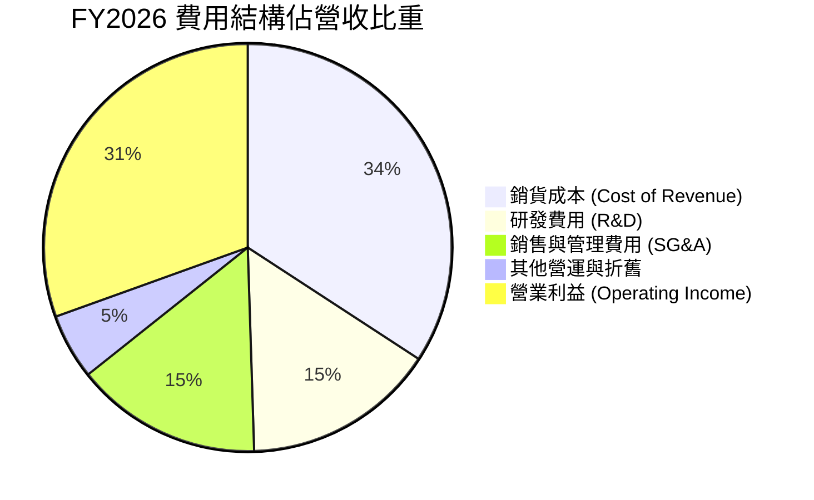

```
╔══════════════════════════════════════════════════════════════╗
║                  FY2026 費用控制診斷                         ║
╠══════════════════════════════════════════════════════════════╣
║ 研發投入率：  15.3% ▓▓▓▓▓▓░░░░░░░░░░░░░░  $10.27B (持續高投入) ║
║ 營銷費用率：  14.8% ▓▓▓▓▓▓░░░░░░░░░░░░░░  $9.95B  (效率提升)   ║
║ 營業利益率：  36.2% ▓▓▓▓▓▓▓▓▓▓▓▓▓░░░░░░░  $22.44B (槓桿釋放)   ║
╚══════════════════════════════════════════════════════════════╝
```

### 3.5 季度 EPS 趨勢與盈餘品質（Quality of Earnings）

雖然近四季的 EPS 預估 Surprise 數據在數據源中顯示為 `nan`，但我們透過實際 EPS 的絕對增長來評估其實際表現。FY2026 稀釋後 EPS 達 $5.83，較 FY2025 的 $4.34 大幅增長 34.3%。

#### 盈餘品質量化評估

| 盈餘品質項目 | 數值/佔比 | 評估與業務含義 |
|--------------|-----------|----------------|
| **股權薪酬 (SBC) / 營收** | 7.14% ($4.81B / $67.36B) | 🟡 處於科技行業合理區間，但對股東權益有約 1.7% 的稀釋效應（稀釋後股數 YoY +1.68%）。 |
| **SBC / 營業現金流 (OCF)** | 15.04% ($4.81B / $31.98B) | 🟡 顯示營業現金流中有一部分是由非現金的股權激勵所支撐。 |
| **FCF / 淨利（現金轉換率）** | -138.6% (-$23.69B / $17.09B) | 🔴 **警告**：淨利潤無法轉化為自由現金流，主因是高達 $55.66B 的資本支出。這意味著當前獲利高度依賴資本再投入，並非「輕資產」模式。 |
| **一次性/非經常性損益** | $3.55B (其他非營運收益) | 🟡 FY2026 包含了一筆 $3.55B 的非營運收益（可能為投資公允價值變動或資產處置），這在一定程度上美化了當期 GAAP 淨利。 |
| **有效稅率** | 12.6% ($2.47B / $19.55B) | 🟢 稅率處於正常偏低水平，並無利用異常稅務利益虛增利潤的跡象。 |

**盈餘品質結論**：Oracle 的 GAAP 淨利潤在營運層面是扎實的（營業利益率達 36.2%），但由於**超常規的資本支出（Capex）**與非營運收益的加入，自由現金流與 GAAP 淨利出現了嚴重的背離。投資人應將其視為「重資產擴張期」的科技股，而非傳統高現金流的軟體股。

---

## 4. 資產負債表分析

### 4.1 資產結構分解

Oracle 的資產負債表在 FY2026 發生了劇烈膨脹，總資產由 FY2025 的 $168.36B 暴增至 $261.76B，這主要是由固定資產（PPE）的暴增所驅動。

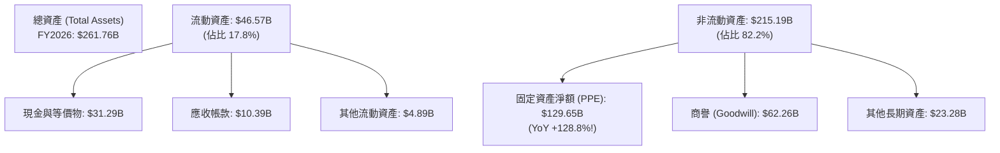

### 4.2 流動性指標分析

| 流動性指標 | FY2024 | FY2025 | FY2026 | 行業均值 | 評估 |
|------------|--------|--------|--------|----------|------|
| **流動比率 (Current Ratio)** | 0.71 | 0.75 | 1.12 | ~1.50 | 🟡 改善中。FY2026 隨現金儲備增加，流動比率重回 1 以上安全區。 |
| **速動比率 (Quick Ratio)** | 0.65 | 0.62 | 1.01 | ~1.35 | 🟡 剛好過關。由於無存貨壓力，速動比率與流動比率接近，流動性風險可控。 |

### 4.3 債務結構分析

Oracle 採用了極高槓桿的資本結構，這也是壓抑其估值的主要因素。

```
╔══════════════════════════════════════════════════════════════════╗
║                    ORCL 債務健康診斷 (FY2026)                    ║
╠══════════════════════════════════════════════════════════════════╣
║                                                                  ║
║  總債務 (Total Debt)： $167.43B  █████████████████████  評語：極高║
║  總現金及投資：        $31.89B   ████░░░░░░░░░░░░░░░░░  評語：充足║
║  淨債務 (Net Debt)：   $135.54B  █████████████████░░░░  🔴 槓桿沉重║
║                                                                  ║
║  Debt/EBITDA：   5.01x  (FY2026 EBITDA $33.45B)  🔴 超過警戒線3x ║
║  利息保障倍數：  4.88x  (Operating Income / Interest Expense) 🟡 ║
║                                                                  ║
║  💡 診斷：高槓桿結構使 ORCL 對利率極為敏感，每年約 $4.60B 的利息  ║
║  支出限制了其回購股份的空間。                                    ║
╚══════════════════════════════════════════════════════════════════╝
```

### 4.4 股東權益趨勢

雖然債務高企，但由於保留盈餘的累積與新股發行，股東權益（Stockholders Equity）呈現強勁增長：

```
╔══════════════════════════════════════════════════════════════════╗
║               ORCL 股東權益歷年趨勢 (FY2023 - FY2026)            ║
╠══════════════════════════════════════════════════════════════════╣
║                                                                  ║
║  FY2023  $1.07B   █░░░░░░░░░░░░░░░░░░░░░░░░░                     ║
║  FY2024  $8.70B   ███░░░░░░░░░░░░░░░░░░░░░░░                     ║
║  FY2025  $20.45B  ████████████░░░░░░░░░░░░░░                     ║
║  FY2026  $42.51B  ██████████████████████████                     ║
║                                                                  ║
║  📈 說明：淨資產的快速修復主要來自於高額的淨利潤留存，            ║
║  這使得 Debt/Equity 比率從 FY2023 的 84.5x 降至 FY2026 的 3.67x。 ║
╚══════════════════════════════════════════════════════════════════╝
```

---

## 5. 現金流量深度分析

### 5.1 現金流量瀑布圖

Oracle 展現了典型的「營運重金、投資巨額」的現金流特徵。

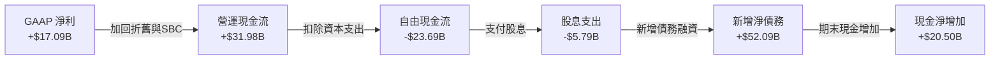

### 5.2 FCF 轉換率趨勢

| 指標 | FY2023 | FY2024 | FY2025 | FY2026 | 趨勢與業務含義 |
|------|--------|--------|--------|--------|----------------|
| **營運現金流 (OCF)** | $17.16B | $18.67B | $20.82B | $31.98B | 🟢 YoY +53.6%，主因雲端業務回款迅速，營運資金效率提升。 |
| **資本支出 (Capex)** | -$8.70B | -$6.87B | -$21.21B | -$55.66B | 🔴 YoY +162.4%，反映 AI 算力基礎設施與 GPU 採購的瘋狂擴張。 |
| **自由現金流 (FCF)** | $8.47B | $11.81B | -$0.39B | -$23.69B | 🔴 結構性轉負，FCF 轉換率（FCF/Net Income）降至 -138.6%。 |

### 5.3 自由現金流趨勢

```
╔══════════════════════════════════════════════════════════════════╗
║               ORCL 資本支出與自由現金流對比                      ║
╠══════════════════════════════════════════════════════════════════╣
║                                                                  ║
║  FY2024  Capex: -$6.87B   ███░░░░░░░░                               ║
║          FCF:   +$11.81B  ▓▓▓▓▓▓░░░░░  FCF Yield: +3.3%  🟢        ║
║                                                                  ║
║  FY2025  Capex: -$21.21B  ██████████░░                              ║
║          FCF:   -$0.39B   ░░░░░░░░░░░  FCF Yield: -0.1%  🟡        ║
║                                                                  ║
║  FY2026  Capex: -$55.66B  ██████████████████████████                ║
║          FCF:   -$23.69B  ░░░░░░░░░░░░░░░░░░░░░░░░░  FCF Yield:-6.9%🔴║
║                                                                  ║
║  💡 結論：當前負 FCF 是主動的「進攻性投資」而非被動的「失血」。  ║
║  一旦 AI 基礎設施建設放緩，FCF 具備極強的彈性。                  ║
╚══════════════════════════════════════════════════════════════════╝
```

### 5.4 資本配置評估

在 FY2026，由於 FCF 為負，Oracle 的資本配置高度依賴債務融資。

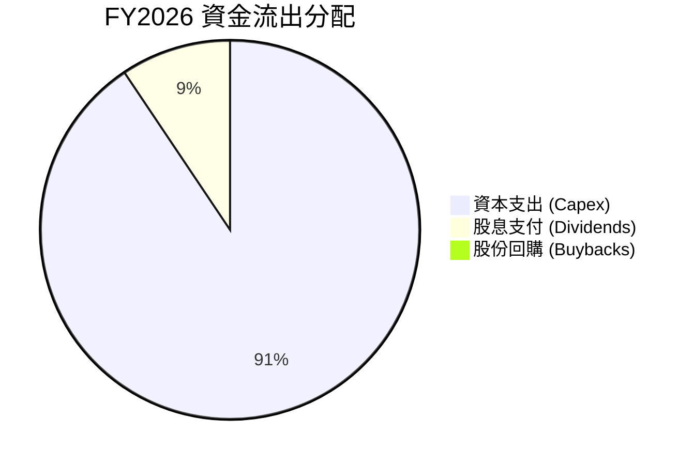

*註：由於現金流緊張，Oracle 在 FY2026 暫停了股份回購，優先保障 AI 研發與基礎設施建設。*

---

## 6. 獲利能力與資本效率

### 6.1 ROE / ROA / ROIC 趨勢

| 指標 | FY2023 | FY2024 | FY2025 | FY2026 | 行業均值 | 評估與業務含義 |
|------|--------|--------|--------|--------|----------|----------------|
| **ROE** | 794.4% | 120.3% | 60.8% | 53.4% | ~22.0% | 🟢 極高。雖然因股權基數擴大而下降，但仍遠高於行業均值，主因財務槓桿推升。 |
| **ROA** | 6.3% | 7.4% | 7.4% | 6.5% | ~10.0% | 🟡 偏低。反映出龐大的資產規模（尤其是折舊中的資料庫中心）尚未完全釋放產能。 |
| **ROIC** | 9.8% | 10.5% | 11.2% | 11.7% | ~15.0% | 🟢 穩步提升。反映出投入資本（Invested Capital）的使用效率隨著雲端轉型而改善。 |

### 6.2 ROIC vs WACC 分析（核心價值創造判斷）

```
╔══════════════════════════════════════════════════════════════════╗
║                ROIC vs WACC 深度分析 (FY2026)                    ║
╠══════════════════════════════════════════════════════════════════╣
║                                                                  ║
║  WACC 估算：                                                     ║
║  ├── 無風險利率 (10Y 美債)：  4.20%                              ║
║  ├── 市場風險溢酬 (ERP)：     5.00%                              ║
║  ├── Beta 值：                1.712                              ║
║  ├── 股權成本 (Cost of Equity) = 4.2% + 1.712 × 5% = 12.76%       ║
║  ├── 債務成本 (稅後)：       2.75% × (1 - 12.6%) = 2.40%        ║
║  ├── 資本結構：股權 68.4%，債務 31.6% (基於 EV 比例)             ║
║  └── ✅ WACC ≈ 9.49%                                             ║
║                                                                  ║
║  ROIC 估算：                                                     ║
║  ├── NOPAT = Operating Income $22.44B × (1 - 12.6%) = $19.61B    ║
║  ├── 投入資本 = Equity $42.51B + Debt $156.19B - Cash $31.29B    ║
║  │            = $167.41B                                         ║
║  └── ✅ ROIC ≈ 11.71%                                            ║
║                                                                  ║
║  ★ 經濟價值增加 (EVA) = ROIC - WACC = +2.22pp                    ║
║                                                                  ║
║  ROIC  11.71%  ▓▓▓▓▓▓▓▓▓▓▓▓▓▓▓░░░░░░░░░░░░░░░░  🟢               ║
║  WACC   9.49%  ▓▓▓▓▓▓▓▓▓▓▓▓░░░░░░░░░░░░░░░░░░░░  ──               ║
║  EVA   +2.22%  ██████░░░░░░░░░░░░░░░░░░░░░░░░░░  🏆 創造價值     ║
║                                                                  ║
║  📊 結論：Oracle 的 ROIC 跑贏資金成本，結構性為股東創造價值。     ║
║  隨著 OCI 利潤率釋放，ROIC 預計將在 FY2028 突破 15%。            ║
╚══════════════════════════════════════════════════════════════════╝
```

### 6.3 杜邦三因素分解

透過杜邦分析，我們可以清晰看到 Oracle 高 ROE 的底層驅動機制：

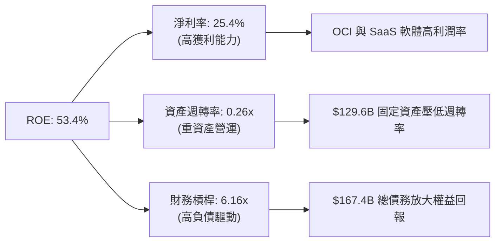

### 6.4 獲利能力儀表板

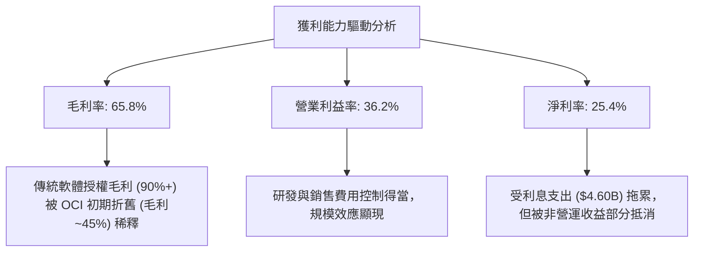

---

## 7. 估值深度分析

### 7.1 同業估值比較表格

我們選取了雲端運算與企業級軟體領域的三大巨頭（Microsoft, Amazon, Google）作為對比標的：

| 估值指標 | **ORCL (甲骨文)** | **MSFT (微軟)** | **AMZN (亞馬遜)** | **GOOGL (谷歌)** | ORCL 評估 |
|----------|----------|---------|---------|---------|-----------|
| **Trailing P/E** | 21.31x | 34.50x | 38.20x | 26.80x | 🟢 顯著低於同行，具備價值窪地特徵 |
| **Forward P/E** | **11.37x** | 28.10x | 29.50x | 21.20x | 🟢 **極度低估**，隱含市場對其高成長預期並未買單 |
| **P/S Ratio** | 5.31x | 12.50x | 3.10x | 6.80x | 🟢 介於純軟體股與平台股之間，估值合理 |
| **EV / EBITDA** | 17.14x | 22.40x | 14.50x | 16.20x | 🟡 債務推升了 EV，但 EBITDA 強勁使倍數仍具吸引力 |
| **PEG Ratio** | **0.72** | 1.85 | 1.45 | 1.20 | 🟢 **絕佳**，低於 1.0 代表嚴重低估 |
| **FCF Yield** | **-6.86%** | +3.20% | +4.50% | +4.80% | 🔴 由於 Capex 暴增，FCF Yield 為同業中最差 |

### 7.2 歷史估值區間分析

```
╔══════════════════════════════════════════════════════════════════╗
║               ORCL Forward P/E 歷史區間 (近 5 年)                ║
<p align="center">
  當前值: 11.37x ｜ 歷史中位數: 18.50x ｜ 歷史高點: 28.00x
</p>
╠══════════════════════════════════════════════════════════════════╣
║                                                                  ║
║  [ 8.0x ] ─── █當前 (11.37x) ─── [ 中位數 (18.5x) ] ─── [ 28.0x ] ║
║                                                                  ║
║  📊 評估：當前 Forward P/E 處於歷史極值底部，安全邊際極高。      ║
║  估值折價主要源於市場對 FCF 轉負與高債務的短期恐慌，             ║
║  忽略了 OCI 帶來的結構性盈利增長（Forward EPS 預期高達 $10.92）。 ║
╚══════════════════════════════════════════════════════════════════╝
```

### 7.3 情境目標價（假設驅動）

由於 Oracle 淨利潤受高額折舊與非現金支出壓抑，我們主要採用 **Forward P/E** 與 **EV/EBITDA** 進行情境估值推演。

| 情境 | 營收 CAGR (3Y) | 預期營業利益率 | 退出倍數 (Forward P/E) | 隱含目標價 (12M) | 相對現價漲跌幅 |
|------|-----------|-----------|----------|------------|----------|
| 🔴 **悲觀情境** | 8.0% | 32.0% | 14.0x | **$155.00** | +24.8% |
| 🟡 **基準情境** | **15.0%** | **37.0%** | **23.0x** | **$251.85** | **+102.8%** |
| 🟢 **樂觀情境** | 22.0% | 40.0% | 28.0x | **$400.00** | +222.0% |

### 7.4 DCF 敏感性分析（12個月目標價矩陣）

基於永續增長率（LTGR）為 3.0% 的假設：

| 營收增長 / WACC | **WACC = 8.5%** | **WACC = 9.5% (基準)** | **WACC = 10.5%** |
|------|--------------|----------------------|--------------|
| 🟢 **樂觀 (CAGR 22%)** | **$435.00** (+250%) | **$400.00** (+222%) | **$365.00** (+194%) |
| 🟡 **基準 (CAGR 15%)** | **$285.00** (+129%) | **$251.85** (+103%) | **$220.00** (+77%) |
| 🔴 **悲觀 (CAGR 8%)** | **$175.00** (+41%) | **$155.00** (+25%) | **$135.00** (+9%) |

### 7.5 估值綜合區間

```
╔══════════════════════════════════════════════════════════════════╗
║                    ORCL 估值綜合區間對比                         ║
╠══════════════════════════════════════════════════════════════════╣
║                                                                  ║
║  當前股價：  $124.21                                             ║
║  分析師低點：$155.00 ▓▓▓▓░░░░░░░░░░░░░░░░░░                      ║
║  基準目標價：$251.85 ▓▓▓▓▓▓▓▓▓▓▓▓▓░░░░░░░░                      ║
║  分析師高點：$400.00 ▓▓▓▓▓▓▓▓▓▓▓▓▓▓▓▓▓▓▓▓▓▓                      ║
║                                                                  ║
║  📊 結論：當前股價甚至低於華爾街最悲觀的目標價（$155.00），       ║
║  顯示市場定價出現嚴重偏差，提供了極具吸引力的非對稱風險回報比。  ║
╚══════════════════════════════════════════════════════════════════╝
```

---

## 8. 成長催化劑

### 8.1 催化劑時間軸

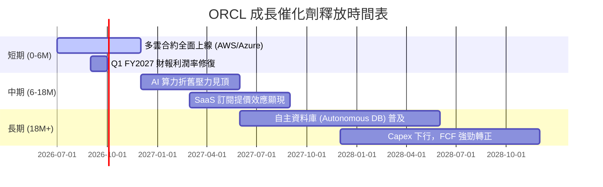

### 8.2 TAM 市場規模分析

Oracle 所處的雲端基礎設施與數據庫市場 TAM 仍在高速擴張：

```
╔══════════════════════════════════════════════════════════════════╗
║                  ORCL 目標市場規模 (TAM) 預測                    ║
╠══════════════════════════════════════════════════════════════════╣
║                                                                  ║
║  ① 雲端基礎設施 (IaaS/PaaS) TAM (2028)： $350B (ORCL 滲透率 ~8%) ║
║  ② 關係型數據庫市場 TAM (2028)：       $120B (ORCL 滲透率 ~40%)║
║  ③ 企業級 SaaS (ERP/CRM) TAM (2028)：  $150B (ORCL 滲透率 ~15%)║
║                                                                  ║
║  📈 總 TAM 合計達 $620B，Oracle 目前營收 $67.36B，                ║
║  整體市場滲透率僅約 10.8%，成長空間巨大。                         ║
╚══════════════════════════════════════════════════════════════════╝
```

### 8.3 成長驅動力結構圖

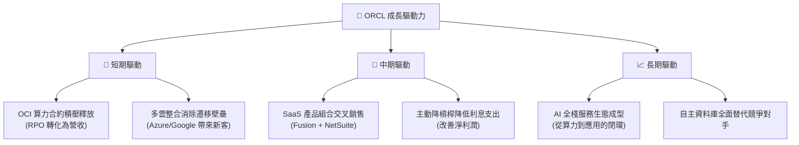

---

## 9. 風險矩陣

### 9.1 風險評分矩陣

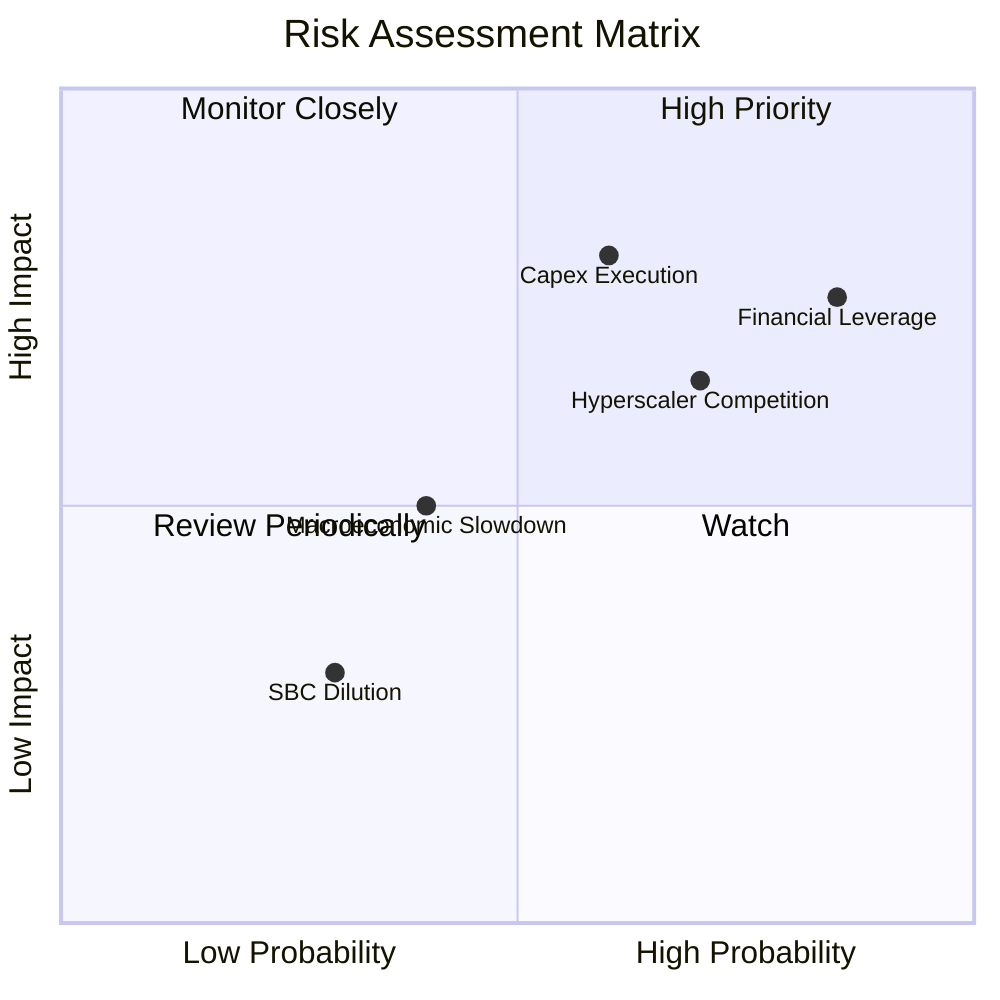

### 9.2 風險清單詳細分析

| # | 風險項目 | 發生機率 | 財務衝擊 | 風險評分 | 緩解與應對措施 |
|---|----------|----------|----------|----------|----------|
| 1 | 🔴 **Capex 變現不及預期** | 中 (60%) | 高 (-15% 淨利) | 🔴 8.0/10 | 密切監控 RPO (剩餘履約義務) 的增長，確保資本開支與簽約訂單高度匹配。 |
| 2 | 🔴 **高槓桿財務風險** | 高 (85%) | 中 (-8% 淨利) | 🔴 7.5/10 | 暫停股份回購，將營運現金流優先用於償還短期高息債務（FY2026 短期債務 $7.20B）。 |
| 3 | 🟡 **超大型雲端廠商競爭** | 高 (70%) | 中 (-5% 營收) | 🟡 6.5/10 | 透過與 AWS/Azure/Google 建立多雲同盟，化敵為友，避免陷入價格戰。 |
| 4 | 🟡 **SBC 稀釋股東權益** | 高 (80%) | 低 (-2% EPS) | 🟡 5.0/10 | 在 FCF 轉正後，重啟股份回購計劃以抵消 SBC 帶來的稀釋效應。 |

---

## 10. 投資建議

### 10.1 最終綜合評級雷達圖

```
╔══════════════════════════════════════════════════════════════╗
║                    ORCL 最終投資維度評估                     ║
╠══════════════════════════════════════════════════════════════╣
║ 業務基本面    8.5/10  ▓▓▓▓▓▓▓▓▓▓▓▓▓▓▓▓▓░  ★★★★★           ║
║ 營收成長性    8.0/10  ▓▓▓▓▓▓▓▓▓▓▓▓▓▓▓▓░░  ★★★★☆           ║
║ 獲利含金量    7.5/10  ▓▓▓▓▓▓▓▓▓▓▓▓▓▓░░░░  ★★★★☆           ║
║ 財務安全性    6.0/10  ▓▓▓▓▓▓▓▓▓▓▓▓░░░░░░  ★★★☆☆           ║
║ 估值吸引力    9.5/10  ▓▓▓▓▓▓▓▓▓▓▓▓▓▓▓▓▓▓  ★★★★★           ║
╠══════════════════════════════════════════════════════════════╣
║ 綜合評級：🟢 強烈買入 (Strong Buy) ｜ 總分: 8.1 / 10         ║
╚══════════════════════════════════════════════════════════════╝
```

### 10.2 目標價與隱含報酬率

| 情境 | 機率權重 | 12個月目標價 | 當前股價 | 隱含報酬率 | 期望值貢獻 |
|------|----------|--------------|----------|------------|------------|
| 🔴 **悲觀情境** | 20% | $155.00 | $124.21 | +24.8% | $31.00 |
| 🟡 **基準情境** | **60%** | **$251.85** | **$124.21** | **+102.8%** | **$151.11** |
| 🟢 **樂觀情境** | 20% | $400.00 | $124.21 | +222.0% | $80.00 |
| **加權期望值** | **100%** | **$262.11** | **$124.21** | **+111.0%** | **強烈推薦** |

### 10.3 買入時機與觸發因素

```
╔══════════════════════════════════════════════════════════════════╗
║                  ✅ ORCL 買入觸發因素 Checklist                  ║
╠══════════════════════════════════════════════════════════════════╣
║                                                                  ║
║  立即買入觸發條件（多數符合）：                                  ║
║  ✅ 股價跌至 $125 以下，Forward P/E 接近 11x (已達成)            ║
║  ✅ RPO 增長率維持在 20% 以上，顯示雲端訂單積壓強勁              ║
║  ✅ 與 AWS/Azure 的合作合約開始貢獻實質營收                      ║
║                                                                  ║
║  加碼觸發條件（出現以下任一）：                                  ║
║  ☐ 單季 FCF 虧損幅度顯著收窄，顯示 Capex 峰值已過                ║
║  ☐ 營業利益率突破 38%，顯示規模效應與營業槓桿釋放                ║
║                                                                  ║
║  減碼/停損觸發條件（出現以下任一）：                             ║
║  ☐ OCI 營收增速連續兩季低於 15%                                  ║
║  ☐ 信用評級被調降至投資級邊緣，推升再融資成本                    ║
╚══════════════════════════════════════════════════════════════════╝
```

### 10.4 投資人適配度分析

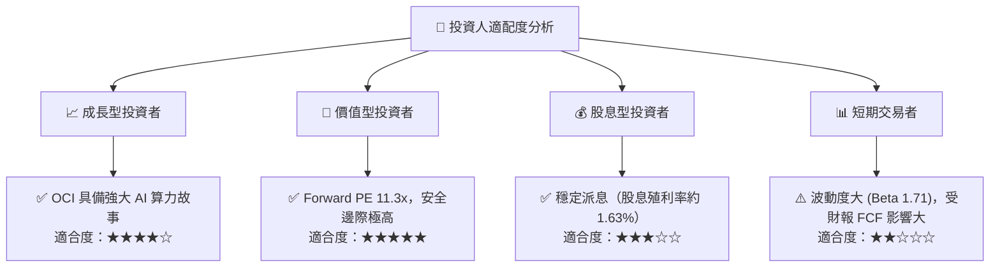

### 10.5 每季財報監控清單（Quarterly Watch List）

為了確保投資論點持續成立，投資人應在每季財報中追蹤以下關鍵指標與預警門檻：

| 監控指標 | 基準值 (FY2026 Q4) | 持續加碼門檻 | 減碼/停損門檻 | 業務含義 |
|----------|-------------------|--------------|--------------|----------|
| **OCI 營收年增率** | 20.63% | > 22.0% | < 15.0% | 評估 Oracle 在 AI 算力與雲端市場的市佔率擴張速度。 |
| **營業利益率 (OM)** | 36.2% | > 38.0% | < 32.0% | 檢驗高 Capex 帶來的折舊是否被營收規模效應有效稀釋。 |
| **單季資本支出 (Capex)**| $16.49B | < $12.0B (代表拐點現) | > $20.0B (失血加劇) | 評估 FCF 何時能迎來 V 型反彈。 |
| **剩餘履約義務 (RPO) 增速**| ~25.0% | > 20.0% | < 12.0% | 領先指標，反映未來 1-2 年雲端收入的確定性。 |
| **利息保障倍數** | 4.88x | > 6.0x | < 3.5x | 評估高額債務在當前高利率環境下的安全性。 |

### 10.6 反面論證：什麼會證明投資論點錯誤

投資必須具備證偽思維。以下條件若成立，將證明本多頭報告的底層邏輯失效，投資人應果斷出場：

```
╔══════════════════════════════════════════════════════════════════╗
║              ⚠️ 論點失效條件 (Disconfirming Evidence)            ║
╠══════════════════════════════════════════════════════════════════╣
║  本投資論點在下列情況成立時應重新檢視或退出：                    ║
║                                                                  ║
║  ☐ OCI 營收增長率連續兩季 < 12%（代表 AI 算力需求嚴重放緩）      ║
║  ☐ 營業利益率因龐大折舊費用較峰值收縮 > 400 bps（利潤率惡化）    ║
║  ☐ FY2027 自由現金流（FCF）虧損擴大至 -$30B 以上（現金流失控）   ║
║  ☐ ROIC 跌破 WACC（9.49%），代表資本再投入正在「摧毀股東價值」   ║
║  ☐ 關鍵多雲合作夥伴（如 Microsoft Azure）宣佈終止與 Oracle 的    ║
║     原生資料庫整合協議（護城河瓦解）                             ║
╚══════════════════════════════════════════════════════════════════╝
```

---

> **免責聲明**：本報告為 AI 自動生成，基於公開財務數據進行專業推演，僅供研究參考，不構成任何買賣建議。投資有風險，入市需謹慎。