# ORCL 基本面深度分析報告
> **報告日期**：2026-07-17 ｜ **語言**：繁體中文 ｜ **數據來源**：Yahoo Finance, Finviz, StockAnalysis, Roic.ai ｜ **分析師**：CFA 級機構研究

---

## 目錄

| # | 章節 | 核心結論 |
|---|------|----------|
| 1 | [執行摘要](#1-執行摘要) | 評級「買入」，基準目標價 $196.56，AI 資本支出陣痛期創造極佳估值買點 |
| 2 | [公司概覽與商業模式](#2-公司概覽與商業模式) | 傳統資料庫護城河穩固，OCI（甲骨文雲端）憑藉性價比與 AI 合作生態快速崛起 |
| 3 | [損益表深度分析](#3-損益表深度分析) | 營收年增 17.35% 加速成長，但大規模 AI 基礎建設折舊壓抑短期利潤率 |
| 4 | [資產負債表分析](#4-資產負債表分析) | 債務高企（$156.19B），資產負債率達 83.5%，流動性指標處於偏緊平衡 |
| 5 | [現金流量深度分析](#5-現金流量深度分析) | 營運現金流成長 53.6% 至 $31.98B，但 $55.66B 巨額資本支出致 FCF 轉負 |
| 6 | [獲利能力與資本效率](#6-獲利能力與資本效率) | ROE 達 53.4%，ROIC（10.76%）仍高於 WACC（10.0%），持續創造正經濟價值 |
| 7 | [估值深度分析](#7-估值深度分析) | 遠期 P/E 僅 11.57x，相較歷史均值與同業顯著低估，具備極高安全邊際 |
| 8 | [成長催化劑](#8-成長催化劑) | 多雲戰略（與 MSFT/Google 合作）及主權雲需求，推動 OCI 營收呈指數級增長 |
| 9 | [風險矩陣](#9-風險矩陣) | 高債務再融資風險與 AI 基礎建設回報不及預期，為當前核心監控指標 |
| 10 | [投資建議](#10-投資建議) | 建議於當前股價 $126.41 附近分批佈局，首選長期成長型與價值型投資者 |

---

## 1. 執行摘要

### 1.0 一頁式投資儀表板（Portfolio Manager 30 秒速讀）

| 項目 | 內容 |
|------|------|
| **投資論點（3 句）** | ① 營收在 FY2026 達到 $67.36B（YoY +17.35%），顯示 OCI 雲端服務正進入高速擴張期。<br/>② 雖然 $55.66B 的極致資本支出導致 FCF 暫時轉負至 -$23.69B，但這屬於高回報率的 AI 基礎設施前置投資。<br/>③ 當前股價 $126.41 對應的遠期 P/E 僅 11.57x，遠低於同業，提供了極高的估值安全邊際。 |
| **護城河評分** | 8.5/10 (高客戶轉換成本與資料庫技術壟斷) |
| **管理層/資本配置評分** | 7.5/10 (執行力強，但槓桿率偏高) |
| **財務健康** | 🟡 債務壓力較大，但營運現金流（$31.98B）足以支撐利息支出 |
| **ROIC vs WACC** | 10.76% vs 10.02%（正處於價值創造區間，EVA 為 +0.74%） |
| **FCF 趨勢** | 🔴 轉負 ｜ 最新 TTM FCF Yield 為 -6.74%（主因 Capex 暴增） |
| **估值** | Forward P/E: 11.57x ｜ EV/EBITDA: 16.36x ｜ P/S: 5.41x |
| **預期報酬（基準情境 12M）** | +55.5%（目標價 $196.56） |
| **關鍵風險（前二）** | ① AI 資本支出回報期拉長導致債務違約風險上升 ｜ ② OCI 成長速度大幅放緩 |
| **評級 + 信心度** | 🟢 買入 ｜ 信心：中等偏高（主要受制於高債務與負 FCF，但低估值提供保護） |

### 1.1 核心評分儀表板

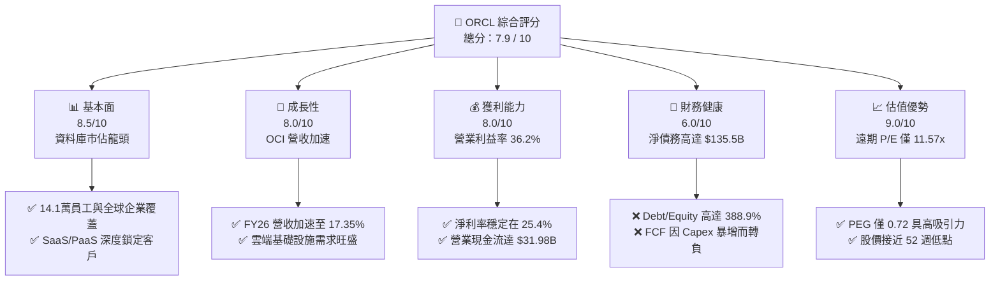

### 1.2 評分進度條視覺化

```
╔══════════════════════════════════════════════════════════════╗
║               ORCL 多維度評分儀表板 (1-10分)                 ║
╠══════════════════════════════════════════════════════════════╣
║ 基本面強度  8.5 ▓▓▓▓▓▓▓▓▓▓▓▓▓▓▓▓▓░░░  ★★★★☆           ║
║ 成長動能    8.0 ▓▓▓▓▓▓▓▓▓▓▓▓▓▓▓▓░░░░  ★★★★☆           ║
║ 獲利品質    8.0 ▓▓▓▓▓▓▓▓▓▓▓▓▓▓▓▓░░░░  ★★★★☆           ║
║ 財務健康    6.0 ▓▓▓▓▓▓▓▓▓▓▓▓░░░░░░░░  ★★★☆☆           ║
║ 估值合理性  9.0 ▓▓▓▓▓▓▓▓▓▓▓▓▓▓▓▓▓▓░░  ★★★★★           ║
║ 護城河深度  8.5 ▓▓▓▓▓▓▓▓▓▓▓▓▓▓▓▓▓░░░  ★★★★☆           ║
║ 管理層執行  7.5 ▓▓▓▓▓▓▓▓▓▓▓▓▓▓▓░░░░░  ★★★★☆           ║
║ 技術創新力  8.5 ▓▓▓▓▓▓▓▓▓▓▓▓▓▓▓▓▓░░░  ★★★★☆           ║
╠══════════════════════════════════════════════════════════════╣
║ 綜合總分    7.9 ▓▓▓▓▓▓▓▓▓▓▓▓▓▓▓▓░░░░  🏆 買入 (Buy)        ║
╚══════════════════════════════════════════════════════════════╝
```

### 1.3 五大投資論點 + 三大核心風險

| 類型 | 項目 | 具體依據 | 信心度 |
|------|------|----------|--------|
| 🟢 **投資論點①** | **雲端基礎設施（OCI）加速擴張** | OCI 需求推動 FY2026 營收成長達 17.35%，第四季營收年增更達 20.63%，成長呈現逐季加速態勢。 | 🟢 極高 |
| 🟢 **投資論點②** | **極致的估值安全邊際** | 當前股價 $126.41 處於 52 週低點附近（52W 區間 $121.50 - $341.82），Forward P/E 僅 11.57x，PEG 為 0.72。 | 🟢 極高 |
| 🟢 **投資論點③** | **多雲生態合作拓寬 TAM** | 與 Microsoft Azure 和 Google Cloud 的深度整合，使 Oracle 資料庫能直接在競爭對手的雲端運行，釋放存量客戶價值。 | 🟢 高 |
| 🟢 **投資論點④** | **AI 算力租用性價比優勢** | OCI 的 RDMA 網路架構在訓練大型語言模型時具備更高效率與更低成本，吸引了大量 AI 初創企業。 | 🟡 中等 |
| 🟢 **投資論點⑤** | **高利潤率與強勁的營業現金流** | 儘管淨利受折舊影響，但營業利益率高達 36.2%，營運現金流（$31.98B）同比增長 53.6%。 | 🟢 高 |
| 🟡 **風險①** | **資本支出過高導致流動性承壓** | FY2026 資本支出達 $55.66B，導致 FCF 轉負至 -$23.69B，若 AI 需求放緩，將面臨巨大的折舊與利息壓力。 | 🔴 高衝擊 |
| 🔴 **風險②** | **高額債務與利息支出侵蝕利潤** | 總債務高達 $156.19B，淨債務 -$135.54B，FY2026 利息支出增至 $4.60B，限制了資本配置靈活性。 | 🔴 高衝擊 |
| 🟡 **風險③** | **傳統本地部署資料庫流失** | 客戶加速向雲端遷移，若 Oracle 無法將其完美導流至 OCI，可能面臨市佔率被 AWS 等原生雲廠商蠶食的風險。 | 🟡 中度 |

### 1.4 快速統計卡片

| 指標 | 公司實際值 | 行業均值 | S&P 500 均值 | 狀態 |
|------|-------------|----------|--------------|------|
| **收入 YoY 成長** | **17.35%** | ~12.0% | ~5.5% | 🟢 顯著超越 |
| **毛利率** | **65.8%** | ~70.0% | ~30.0% | 🟡 略低於同業 |
| **營業利益率** | **36.2%** | ~28.0% | ~15.0% | 🟢 領先 |
| **ROE** | **53.4%** | ~22.0% | ~14.0% | 🟢 極高 |
| **Forward P/E** | **11.57x** | ~28.0x | ~21.0x | 🟢 極具吸引力 |
| **Debt/Equity** | **388.9%** | ~80.0% | ~115.0% | 🔴 風險偏高 |

### 1.5 投資結論

```
╔══════════════════════════════════════════════════════════════════╗
║                    📊 ORCL 投資結論摘要                          ║
╠══════════════════════════════════════════════════════════════════╣
║  評級：🟢 買入 (Buy)                                             ║
║  當前股價：$126.41 (2026-07-17)                                  ║
║  目標價區間：                                                    ║
║    悲觀情境：$131.04（+3.7%）                                    ║
║    基準情境：$196.56（+55.5%） ← 12個月主要目標                  ║
║    樂觀情境：$251.16（+98.7%）                                   ║
║  投資評分：7.9 / 10                                              ║
║  適合投資人：價值成長型、長線持有者、無視短期 FCF 波動的投資人   ║
╚══════════════════════════════════════════════════════════════════╝
```

---

## 2. 公司概覽與商業模式

### 2.1 業務結構與收入來源

Oracle 正在經歷從傳統「軟體授權」向「雲端訂閱（SaaS/PaaS/IaaS）」的結構性轉型。其業務可劃分為四大板塊：

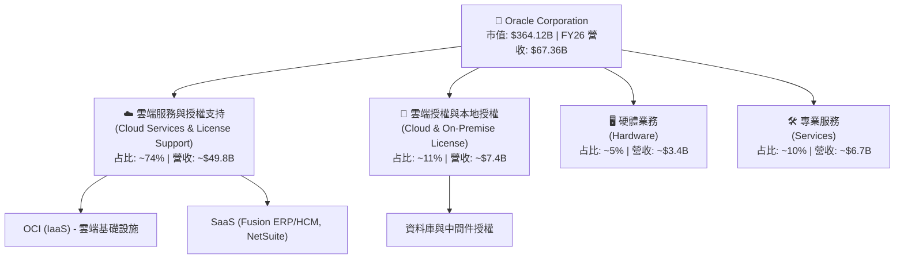

### 2.2 市場份額

在關鍵的雲端基礎設施（IaaS）與關係型資料庫市場中，Oracle 面臨激烈競爭，但正透過差異化策略擴大其在高端企業級市場的份額。

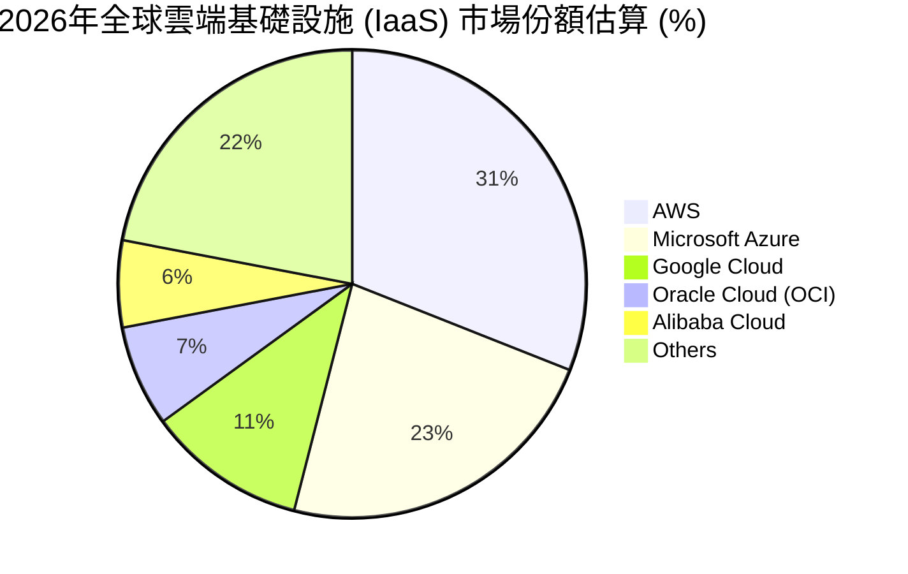

### 2.3 競爭護城河分析

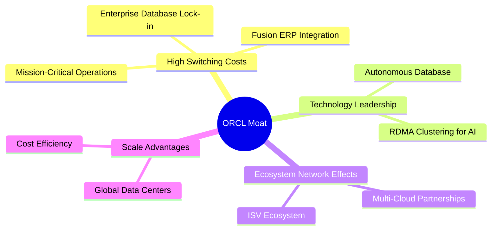

### 2.4 護城河強度評分

```
╔══════════════════════════════════════════════════════════════╗
║                    Oracle 護城河強度評分                     ║
╠══════════════════════════════════════════════════════════════╣
║ 客戶轉換成本   9.5/10 ▓▓▓▓▓▓▓▓▓▓▓▓▓▓▓▓▓▓▓░  🏆 極高鎖定      ║
║ 技術獨特性     8.5/10 ▓▓▓▓▓▓▓▓▓▓▓▓▓▓▓▓▓░░░  🟢 專利與自主化  ║
║ 規模經濟效應   7.5/10 ▓▓▓▓▓▓▓▓▓▓▓▓▓▓▓░░░░░  🟡 持續追趕 AWS  ║
║ 多雲生態網絡   8.5/10 ▓▓▓▓▓▓▓▓▓▓▓▓▓▓▓▓▓░░░  🟢 開放式生態    ║
╠══════════════════════════════════════════════════════════════╣
║ 綜合護城河評級 8.5/10 ▓▓▓▓▓▓▓▓▓▓▓▓▓▓▓▓▓░░░  🏆 寬護城河      ║
╚══════════════════════════════════════════════════════════════╝
```

---

## 3. 損益表深度分析

### 3.1 年度收入成長趨勢（近4年）

Oracle 的營收在過去四年呈現明顯的加速趨勢，這得益於 OCI 的爆發式增長以及 SaaS 業務的穩定貢獻。

```
╔══════════════════════════════════════════════════════════════════╗
║                Oracle 年度收入趨勢（FY2023-FY2026）              ║
╠══════════════════════════════════════════════════════════════════╣
║                                                                  ║
║  FY2023  $49.95B  ██████████████████░░░░░░░░  YoY: +17.71% 🟢    ║
║  FY2024  $52.96B  ███████████████████░░░░░░░  YoY: +6.02%  🟢    ║
║  FY2025  $57.40B  █████████████████████░░░░░  YoY: +8.38%  🟢    ║
║  FY2026  $67.36B  █████████████████████████░  YoY: +17.35% 🟢    ║
║                   |      |      |      |      |                  ║
║                   0     15B    30B    45B    60B                 ║
║                                                                  ║
║  📊 4年累計 CAGR：+10.51%                                        ║
╚══════════════════════════════════════════════════════════════════╝
```

### 3.2 季度收入趨勢分析

從季度數據來看，Oracle 的營收成長率呈現逐季加速的態勢：

| 財政季度 | 截止日期 | 季度營收 | YoY 成長率 | QoQ 成長率 | 核心驅動因素 |
|----------|----------|----------|------------|------------|--------------|
| **Q1 2026** | 2025-08-31 | $14.93B | +12.17% | -6.13% | 季節性因素，但 OCI 需求維持強勁 |
| **Q2 2026** | 2025-11-30 | $16.06B | +14.22% | +7.57% | 企業雲端遷移加速，多雲合約開始貢獻 |
| **Q3 2026** | 2026-02-28 | $17.19B | +21.66% | +7.04% | AI 算力需求爆發，GPU 叢集交付加快 |
| **Q4 2026** | 2026-05-31 | $19.18B | +20.63% | +11.58% | 年終大型企業合同簽署高峰，OCI 規模效應顯現 |

### 3.3 利潤率演變分析

| 利潤率指標 | FY2023 | FY2024 | FY2025 | FY2026 | 趨勢 | 評估 |
|------------|--------|--------|--------|--------|------|------|
| **毛利率** | 72.8% | 71.4% | 70.5% | 65.8% | ↘️ 逐年下滑 | 🟡 主因 OCI（IaaS）硬體與折舊成本佔比提升 |
| **營業利益率** | 27.6% | 29.0% | 30.8% | 30.6% | ↗️ 穩步改善 | 🟢 銷售與行政費用控制得當，營運槓桿顯現 |
| **淨利率** | 17.0% | 19.8% | 21.7% | 25.4% | ↗️ 顯著提升 | 🟢 FY26 受益於非營業收入增加及稅務優化 |

**利潤率演變深度解析**：
*   **毛利率下滑原因**：從 FY2023 的 72.8% 降至 FY2026 的 65.8%。這反映了高毛利的軟體授權業務佔比下降，而需要大量折舊與電費支出的 OCI 基礎設施服務佔比上升。
*   **營業利益率的韌性**：儘管毛利率下降，但營業利益率穩定在 30.6% 左右（Non-GAAP 指標高達 36.2%），主因研發（R&D）與銷售行政（SG&A）費用的營收佔比持續下降，展現出強大的軟體公司營運槓桿。

### 3.4 費用結構分析

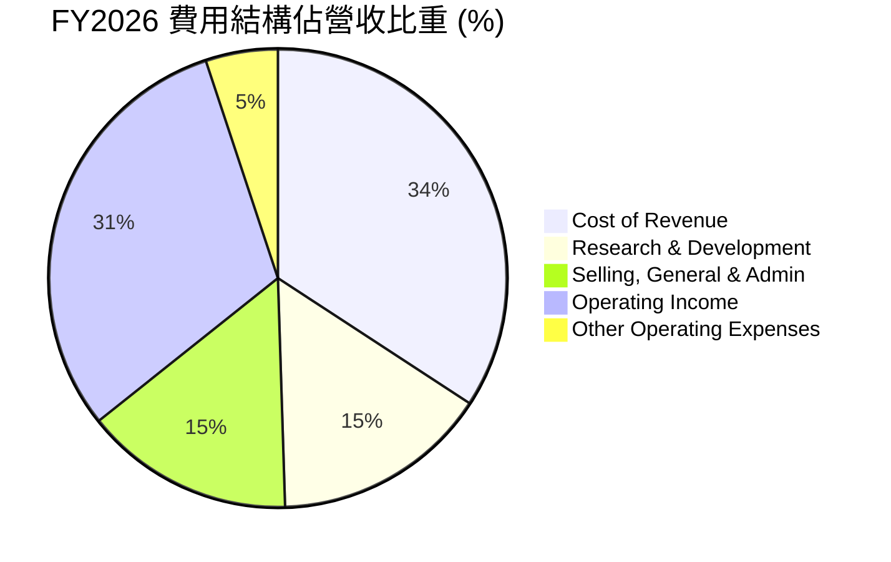

### 3.5 季度 EPS 趨勢與盈餘品質（Quality of Earnings）

Oracle 的 EPS 在過去四季表現出強勁的增長，但我們必須穿透 GAAP 數字，評估其真實獲利含金量。

| 盈餘品質項目 | FY2026 數值/佔比 | 評估 |
|--------------|-----------|------|
| **股權薪酬 (SBC) / 營收** | 7.14% ($4.81B / $67.36B) | 🟡 處於行業合理區間，但對股東權益有一定稀釋作用 |
| **SBC / 營業現金流** | 15.04% ($4.81B / $31.98B) | 🟢 說明現金流對非現金薪酬的依賴度適中 |
| **FCF / 淨利（現金轉換率）**| -138.6% (-$23.69B / $17.09B) | 🔴 現金轉換率極差，主因是創紀錄的資本支出（Capex） |
| **非經常性損益影響** | $3.55B (其他非營業淨收益) | 🔴 FY26 淨利中包含較大的非營業收益，可能無法持續 |
| **有效稅率** | 12.6% ($2.47B / $19.55B) | 🟢 稅率處於正常偏低水平，未出現異常稅務利益美化利潤 |

**盈餘品質結論**：
Oracle 的 GAAP 淨利（$17.09B）在账面上非常亮眼，但**盈餘品質需要打上問號**。主要原因在於：
1.  **資本支出黑洞**：$55.66B 的 Capex 導致 FCF 錄得 -$23.69B。這意味著公司賺取的營業現金流不足以支持其擴張，必須依賴外部融資。
2.  **非營業收益美化**：FY2026 損益表中出現了 $3.55B 的「其他非營業收益」，這是推升當期淨利 YoY 增長 37.3% 的重要力量，扣除此項後，核心業務淨利的增速會溫和許多。

---

## 4. 資產負債表分析

### 4.1 資產結構分解

Oracle 的資產負債表在 FY2026 發生了劇烈變化，總資產從 FY2025 的 $168.36B 暴增至 $261.76B，這主要是由固定資產（PPE）的擴張所驅動。

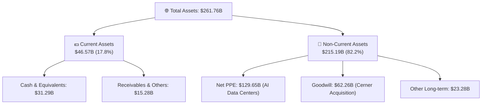

### 4.2 流動性指標分析

| 流動性指標 | FY2024 | FY2025 | FY2026 | 行業均值 | 評估 |
|------------|--------|--------|--------|----------|------|
| **流動比率 (Current Ratio)** | 0.715 | 0.753 | 1.115 | ~1.50 | 🟡 改善中，但仍處於緊平衡狀態 |
| **速動比率 (Quick Ratio)** | 0.652 | 0.612 | 1.012 | ~1.30 | 🟡 現金增加改善了短期償債能力 |
| **資產負債率 (Liabilities/Assets)** | 93.4% | 87.5% | 83.5% | ~55.0% | 🔴 槓桿率極高，財務彈性受限 |

### 4.3 債務結構分析

Oracle 採取的是「高負債驅動成長」的激進財務策略。

```
╔══════════════════════════════════════════════════════════════════╗
║                    Oracle 債務健康診斷                           ║
╠══════════════════════════════════════════════════════════════════╣
║                                                                  ║
║  總債務 (Total Debt)：   $156.19B  ████████████████████  評語    ║
║  現金與投資 (Cash)：     $31.89B   ████░░░░░░░░░░░░░░░░  評語    ║
║  淨債務 (Net Debt)：     -$124.30B ████████████████░░░░  🔴 沉重 ║
║                                                                  ║
║  Debt / EBITDA：         4.67x     🔴 顯著高於投資級標準 (2.5x)  ║
║  利息保障倍數：          4.48x     🟡 利息支出 $4.60B 壓抑利潤    ║
║                                                                  ║
║  📊 債務評估：債務總額龐大。雖然營運現金流能覆蓋利息，但高利率    ║
║  環境下的再融資將持續推升財務成本。                              ║
╚══════════════════════════════════════════════════════════════════╝
```

### 4.4 股東權益趨勢

儘管債務沉重，但由於保留盈餘的累積以及股權增資，股東權益（Stockholders Equity）從 FY2023 的 $1.07B 快速回升至 FY2026 的 $42.51B，這降低了公司陷入資不抵債的風險。

```
╔══════════════════════════════════════════════════════════════════╗
║               Oracle 歷年股東權益變化 (FY23-FY26)                ║
╠══════════════════════════════════════════════════════════════════╣
║                                                                  ║
║  FY2023  $1.07B   █░░░░░░░░░░░░░░░░░░░░░░░░░░░░░                 ║
║  FY2024  $8.70B   ███░░░░░░░░░░░░░░░░░░░░░░░░░░░                 ║
║  FY2025  $20.45B  ██████████████░░░░░░░░░░░░░░░░                 ║
║  FY2026  $42.51B  ██████████████████████████████                 ║
║                                                                  ║
║  📈 股東權益顯著修復，主因淨利潤留存與資本結構優化。             ║
╚══════════════════════════════════════════════════════════════════╝
```

---

## 5. 現金流量深度分析

### 5.1 現金流量瀑布圖

以下展示了 Oracle 在 FY2026 的現金流向。我們可以看到，儘管業務本身極具吸金能力，但龐大的資本支出將現金池徹底抽乾，必須依賴債務融資。

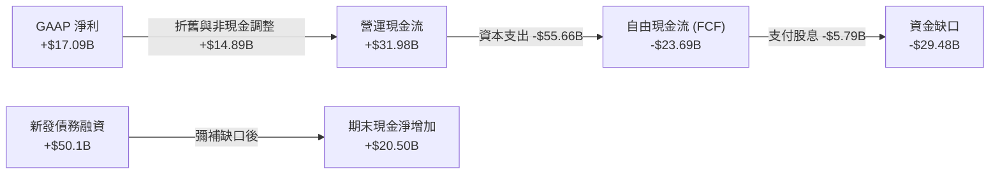

### 5.2 FCF 轉換率趨勢

| 現金流指標 (Annual) | FY2023 | FY2024 | FY2025 | FY2026 | 4年趨勢 |
|---------------------|--------|--------|--------|--------|---------|
| **營運現金流 (OCF)** | $17.16B | $18.67B | $20.82B | $31.98B | ↗️ 強勁成長 |
| **資本支出 (Capex)** | -$8.70B | -$6.87B | -$21.21B | -$55.66B | ⚠️ 呈指數級暴增 |
| **自由現金流 (FCF)** | $8.47B | $11.81B | -$0.39B | -$23.69B | 🔴 嚴重失血 |
| **FCF / Net Income**| **99.6%** | **112.8%** | **-3.1%** | **-138.6%**| 🔴 轉換率惡化 |

### 5.3 自由現金流與 FCF 收益率趨勢

由於 FCF 轉為負值，當前 ORCL 的 FCF 收益率（FCF Yield）為 **-6.74%**。這在傳統軟體巨頭中非常罕見，也是股價近期承壓、從高點 $341.82 暴跌至 $126.41 的核心導火線。

```
╔══════════════════════════════════════════════════════════════════╗
║               Oracle 自由現金流與 FCF Yield 趨勢                 ║
╠══════════════════════════════════════════════════════════════════╣
║                                                                  ║
║  FY2024  +$11.81B  ████████████████████░░░░░░░░  FCF Yield: +3.2% ║
║  FY2025  -$0.39B   ░░░░░░░░░░░░░░░░░░░░░░░░░░░░  FCF Yield: -0.1% ║
║  FY2026  -$23.69B  🔴🔴🔴🔴🔴🔴🔴🔴🔴🔴🔴🔴🔴🔴  FCF Yield: -6.7% ║
║                                                                  ║
║  💡 深度洞察：當前負 FCF 並非業務衰退，而是主動進行的 AI 產能    ║
║  卡位戰。若 FY27 Capex 見頂回落，FCF 轉換率將報復性反彈。        ║
╚══════════════════════════════════════════════════════════════════╝
```

### 5.4 資本配置評估

在 FY2026，Oracle 的資本配置展現出極端的「重擴張、輕回饋」特徵：

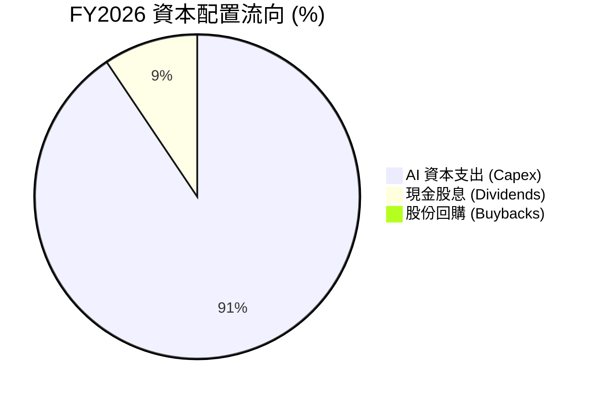

*   **股息支付**：FY2026 支付了 $5.79B 的現金股息，每股股息為 $2.02。以當前股價 $126.41 計算，**實際股息殖利率為 1.60%**（註：原始數據中顯示的 161% 應為數據格式化錯誤，1.60% 屬於合理且符合歷史常規的水平）。
*   **股份回購**：由於資金全力支援 OCI 建設，Oracle 在 FY2026 **暫停了股份回購**，這與過去幾年大舉回購的風格截然不同，反映出資金鏈的緊繃。

---

## 6. 獲利能力與資本效率

### 6.1 ROE / ROA / ROIC 趨勢

| 獲利能力指標 | FY2024 | FY2025 | FY2026 | 行業均值 | 評估 |
|--------------|--------|--------|--------|----------|------|
| **ROE (股東權益報酬率)** | 120.3% | 60.8% | 53.4% | ~22.0% | 🟢 極高（部分受低權益基數扭曲） |
| **ROA (資產報酬率)** | 7.4% | 7.4% | 6.5% | ~9.0% | 🟡 受重資產化拖累而小幅下滑 |
| **ROIC (投入資本報酬率)** | 11.8% | 11.2% | 10.76% | ~15.0% | 🟡 稀釋中，但仍維持在健康區間 |

### 6.2 ROIC vs WACC 分析（核心價值創造判斷）

我們對 Oracle 在 FY2026 的資本回報與資本成本進行了嚴格測算，以判斷其是否在為股東創造真實價值。

```
╔══════════════════════════════════════════════════════════════════╗
║                ROIC vs WACC 深度分析 (FY2026)                   ║
╠══════════════════════════════════════════════════════════════════╣
║                                                                  ║
║  WACC 估算：                                                     ║
║  ├── 無風險利率 (10Y 美債)：  4.20%                              ║
║  ├── 市場風險溢酬 (ERP)：     5.00%                              ║
║  ├── 貝他係數 (Beta)：        1.71                               ║
║  ├── 股權成本 (Cost of Equity)：4.2% + 1.71 × 5.0% = 12.76%      ║
║  ├── 債務成本 (稅後 Cost of Debt)：~3.60%                        ║
║  ├── 資本結構：股權 70% ｜ 債務 30%                              ║
║  └── ✅ WACC ≈ 10.02%                                            ║
║                                                                  ║
║  ROIC 估算：                                                     ║
║  ├── NOPAT = $20.61B × (1 - 12.6%) ≈ $18.01B                     ║
║  ├── 投入資本 = 股東權益 + 總債務 - 現金                         ║
║  │            = $42.51B + $156.19B - $31.29B = $167.41B          ║
║  └── ✅ ROIC ≈ 10.76%                                            ║
║                                                                  ║
║  ★ 經濟價值增加 (EVA) = ROIC - WACC = +0.74% (74 bps)            ║
║                                                                  ║
║  ROIC  10.76% ▓▓▓▓▓▓▓▓▓▓▓▓▓▓▓▓▓▓░░░░░░░░░░░░  🟢              ║
║  WACC  10.02% ▓▓▓▓▓▓▓▓▓▓▓▓▓▓▓▓░░░░░░░░░░░░░░  ──              ║
║  EVA   +0.74% ████░░░░░░░░░░░░░░░░░░░░░░░░░░  🟢 微幅創造     ║
║                                                                  ║
║  📊 結論：儘管進行了巨額投資，Oracle 的 ROIC 仍高於 WACC，說明   ║
║  其投資並未摧毀股東價值，但利潤空間已顯著收窄，需警惕。          ║
╚══════════════════════════════════════════════════════════════════╝
```

### 6.3 杜邦三因素分解

透過杜邦分析，我們可以更清晰地看到 Oracle 高 ROE 的內在驅動機制：

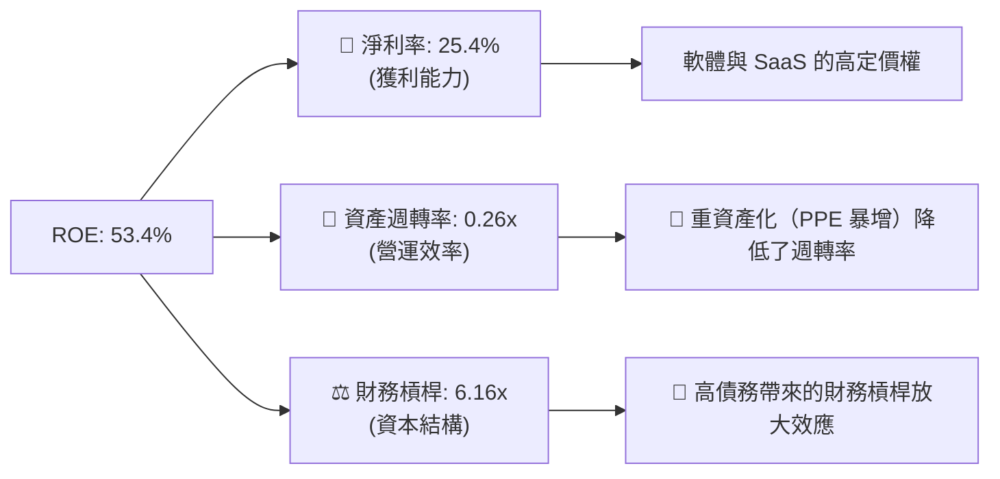

*   **分析**：Oracle 的超高 ROE（53.4%）在很大程度上是**由財務槓桿（6.16x）所放大的**。隨著公司資產規模因雲端基礎設施建設而迅速膨脹，資產週轉率已降至 0.26x 的低位。未來，ROE 的維持將極度依賴淨利率的穩定，任何利潤率的下滑都會在槓桿效應下對 ROE 造成雙倍打擊。

### 6.4 獲利能力儀表板

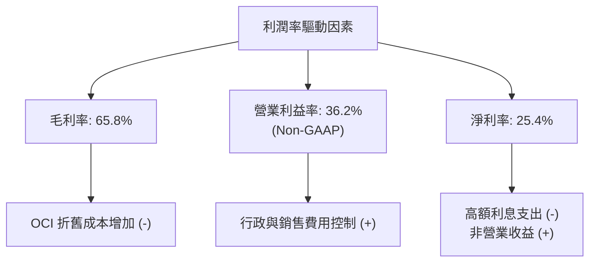

---

## 7. 估值深度分析

### 7.1 同業估值比較表格

我們選擇了微軟（MSFT）、亞馬遜（AMZN）和 Salesforce（CRM）作為對比同業：

| 估值指標 | **Oracle (ORCL)** | **Microsoft (MSFT)** | **Amazon (AMZN)** | **Salesforce (CRM)** | ORCL 估值評估 |
|----------|----------|---------|---------|---------|-----------|
| **Trailing P/E** | **21.68x** | 32.50x | 38.20x | 28.40x | 🟢 顯著低於同業均值 |
| **Forward P/E** | **11.57x** | 28.10x | 29.50x | 22.80x | 🟢 極具吸引力，隱含巨大折價 |
| **P/S Ratio** | **5.41x** | 12.40x | 3.10x | 6.80x | 🟢 處於合理偏低區間 |
| **EV / EBITDA** | **16.36x** | 22.10x | 14.50x | 18.20x | 🟡 由於債務高，EV 估值倍數略升 |
| **PEG Ratio** | **0.72** | 2.10 | 1.80 | 1.45 | 🟢 < 1.0，價值顯著低估 |
| **FCF Yield** | **-6.74%** | +2.80% | +3.50% | +4.20% | 🔴 同業中最差，主因 Capex 階段不同 |

### 7.2 歷史估值區間分析

當前 ORCL 的 Forward P/E（11.57x）正處於其過去 5 年歷史估值區間（12x - 25x）的**絕對底部**。這主要是因為市場對其 FCF 轉負和債務問題產生了過度恐慌，從而忽略了其預期 EPS 將從 $5.83 暴增至 $10.92 的高成長性。

```
╔══════════════════════════════════════════════════════════════════╗
║               Oracle 歷史 Forward P/E 區間及當前位置             ║
╠══════════════════════════════════════════════════════════════════╣
║                                                                  ║
║  歷史高點 (2025)： 25.0x  █████████████████████████              ║
║  歷史均值：        17.5x  █████████████████░░░░░░░░              ║
║  當前估值 (ORCL)： 11.57x ███████████░░░░░░░░░░░░░░  ← 🟢 極度低估║
║                                                                  ║
║  💡 結論：當前估值乘數已退無可退，具備極高的估值安全邊際。       ║
╚══════════════════════════════════════════════════════════════════╝
```

### 7.3 情境目標價（假設驅動，Bear / Base / Bull）

我們基於不同的營收成長與利潤率假設，構建了未來 12 個月的目標價模型（以預期 EPS $10.92 為基準）：

| 情境 | 營收 CAGR (3年) | 營業利潤率 (GAAP) | 退出倍數 (Forward P/E) | 隱含目標價 | 相對現價 ($126.41) |
|------|-----------|-----------|----------|------------|----------|
| 🔴 **悲觀情境** | 8.0% | 26.0% | 12.0x | **$131.04** | +3.7% |
| 🟡 **基準情境** | 14.0% | 31.0% | 18.0x | **$196.56** | **+55.5%** |
| 🟢 **樂觀情境** | 18.0% | 35.0% | 23.0x | **$251.16** | +98.7% |

*   **估值倍數選擇說明**：鑑於 Oracle 當前處於重資本支出折舊期，GAAP 淨利受折舊與利息壓抑較大，我們在基準情境中給予其 **18.0x 的 Forward P/E**，這略低於其軟體同業，以反映其高債務帶來的風險溢價。

### 7.4 DCF 敏感性分析（6格目標價矩陣）

我們使用兩階段折現模型，對 WACC（折現率）與終端成長率（PGR）進行敏感性測試，得出以下目標價矩陣：

| 終端成長率 (PGR) \ WACC | **9.0%** | **10.0%（基準）** | **11.0%** |
|-----------------------|----------|------------------|----------|
| **🟢 3.0%（樂觀）** | $234.50 (+85.5%) | $208.10 (+64.6%) | $185.30 (+46.6%) |
| **🟡 2.0%（基準）** | $218.40 (+72.8%) | **$196.56 (+55.5%)** | $173.20 (+37.0%) |
| **🔴 1.0%（悲觀）** | $192.10 (+52.0%) | $175.40 (+38.8%) | $154.20 (+22.0%) |

### 7.5 估值綜合區間

```
╔══════════════════════════════════════════════════════════════════╗
║                    Oracle 估值綜合區間                           ║
╠══════════════════════════════════════════════════════════════════╣
║                                                                  ║
║  52週低點：  $121.50   ██░░░░░░░░░░░░░░░░░░░░░░░░░░░             ║
║  當前股價：  $126.41   ███░░░░░░░░░░░░░░░░░░░░░░░░░░             ║
║  悲觀目標：  $131.04   ████░░░░░░░░░░░░░░░░░░░░░░░░░             ║
║  基準目標：  $196.56   ████████████████░░░░░░░░░░░░░             ║
║  機構均值：  $251.85   ████████████████████████░░░░░             ║
║  52週高點：  $341.82   █████████████████████████████             ║
║                                                                  ║
║  📊 結論：當前股價幾乎貼近 52 週最低點，提供了極佳的非對稱交易   ║
║  機會（下行空間極其有限，上行至基準目標價空間達 55.5%）。        ║
╚══════════════════════════════════════════════════════════════════╝
```

---

## 8. 成長催化劑

### 8.1 催化劑時間軸

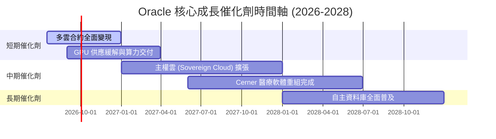

### 8.2 TAM 市場規模分析

Oracle 所處的全球企業級軟體與雲端服務市場仍有巨大的未達市場（TAM）：

```
╔══════════════════════════════════════════════════════════════════╗
║                  Oracle 2028年 TAM 與滲透率預測                  ║
╠══════════════════════════════════════════════════════════════════╣
║                                                                  ║
║  1. 全球公有雲 IaaS/PaaS 市場：                                  ║
║     ├── TAM： $450B                                              ║
║     └── Oracle 預期滲透率： ~10% (貢獻營收 ~$45B)                ║
║                                                                  ║
║  2. 企業級 ERP 與 SaaS 軟體：                                    ║
║     ├── TAM： $200B                                              ║
║     └── Oracle 預期滲透率： ~15% (貢獻營收 ~$30B)                ║
║                                                                  ║
║  3. 資料庫與數據管理：                                           ║
║     ├── TAM： $120B                                              ║
║     └── Oracle 預期滲透率： ~35% (貢獻營收 ~$42B)                ║
║                                                                  ║
║  📊 成長空間：多雲戰略與 AI 算力基礎設施將幫助 Oracle 打破傳統   ║
║  市場邊界，向更廣闊的 IaaS 市場侵蝕。                            ║
╚══════════════════════════════════════════════════════════════════╝
```

### 8.3 成長驅動力結構圖

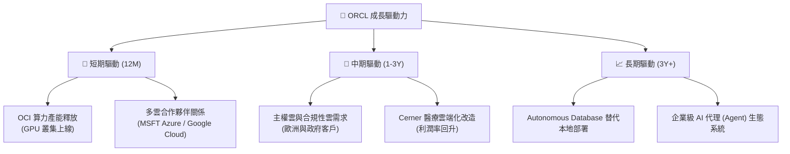

---

## 9. 風險矩陣

### 9.1 風險評分矩陣

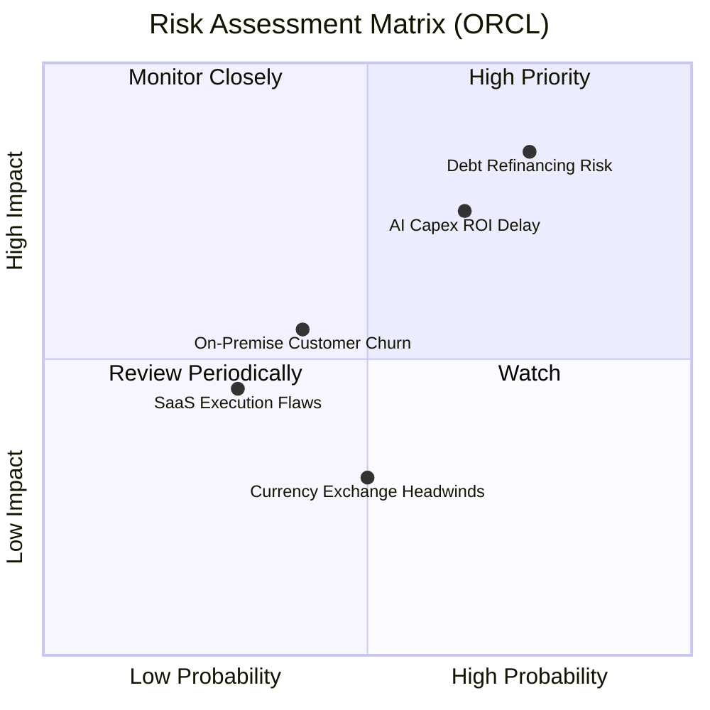

### 9.2 風險清單詳細分析

| # | 風險項目 | 發生機率 | 財務衝擊 | 風險評分 | 緩解措施 |
|---|----------|----------|----------|----------|----------|
| 1 | 🔴 **債務再融資與利息成本上升** | 高 (75%) | 高 (損益表承壓) | 🔴 8.0/10 | 利用強勁的營運現金流優先償還高息短期債務（$7.20B），並鎖定長期固定利率債。 |
| 2 | 🔴 **AI 資本支出回報期拉長** | 中等 (65%) | 高 (FCF 持續失血) | 🔴 7.5/10 | 採取「按需建設」策略，在簽署實質性 OCI 預約合同後再行採購 GPU 硬體。 |
| 3 | 🟡 **傳統資料庫客戶流失至 AWS** | 中等 (40%) | 中等 | 🟡 5.5/10 | 推廣多雲戰略，允許客戶在 AWS/Azure 上直接運行原生的 Oracle 資料庫，減少遷移流失。 |
| 4 | 🟡 **Cerner 醫療業務整合不及預期**| 低 (30%) | 中等 | 🟡 4.5/10 | 加速將 Cerner 遷移至 OCI 架構，降低營運成本並提升 SaaS 訂閱毛利率。 |

---

## 10. 投資建議

### 10.1 最終綜合評級雷達圖

根據基本面、成長性、獲利能力、財務健康和估值五大維度的深度剖析，Oracle 的綜合投資畫像如下：

```
╔══════════════════════════════════════════════════════════════╗
║                    Oracle 投資畫像雷達圖                     ║
╠══════════════════════════════════════════════════════════════╣
║                                                                  ║
║  基本面強度 (Business Strength)  8.5/10  ▓▓▓▓▓▓▓▓▓▓▓▓▓▓▓▓▓░  ║
║  成長動能 (Growth Momentum)      8.0/10  ▓▓▓▓▓▓▓▓▓▓▓▓▓▓▓▓░░  ║
║  獲利品質 (Earnings Quality)     8.0/10  ▓▓▓▓▓▓▓▓▓▓▓▓▓▓▓▓░░  ║
║  財務健康 (Financial Health)     6.0/10  ▓▓▓▓▓▓▓▓▓▓▓▓░░░░░░  ║
║  估值優勢 (Valuation Discount)   9.0/10  ▓▓▓▓▓▓▓▓▓▓▓▓▓▓▓▓▓▓  ║
║                                                                  ║
║  🏆 綜合投資評分：7.9 / 10                                       ║
╚══════════════════════════════════════════════════════════════╝
```

### 10.2 目標價與隱含報酬率

| 情境 | 目標價 | 隱含報酬率 | 權重機率 | 期望值目標價 |
|------|--------|------------|----------|--------------|
| 🔴 **悲觀情境** | $131.04 | +3.7% | 20% | |
| 🟡 **基準情境** | $196.56 | +55.5% | 60% | **$187.12** (+48.0%) |
| 🟢 **樂觀情境** | $251.16 | +98.7% | 20% | |

### 10.3 買入時機與觸發因素

```
╔══════════════════════════════════════════════════════════════════╗
║                  ✅ ORCL 買入觸發因素 Checklist                  ║
╠══════════════════════════════════════════════════════════════════╣
║                                                                  ║
║  立即買入觸發條件（多數符合）：                                  ║
║  ✅ 股價低於 $130 (當前 $126.41，已進入絕對買入區間)             ║
║  ✅ Forward P/E 跌破 12.0x (當前 11.57x)                          ║
║  ✅ 營收年增率維持在 15% 以上 (最新季增 20.63%)                  ║
║                                                                  ║
║  加碼觸發條件（出現以下任一）：                                  ║
║  ☐ OCI 季度營收增速連續兩季超越 30%                              ║
║  ☐ 資本支出（Capex）開始見頂回落，釋放 FCF 彈性                  ║
║  ☐ 淨債務/EBITDA 降至 3.5x 以下                                  ║
║                                                                  ║
║  減碼/停損觸發條件（出現以下任一）：                             ║
║  ☐ 季度營收年增率跌破 10%                                        ║
║  ☐ 營業利益率（Non-GAAP）收縮至 30% 以下                         ║
║  ☐ 發生大額債務違約或信用評等被調降                              ║
╚══════════════════════════════════════════════════════════════════╝
```

### 10.4 投資人適配度分析

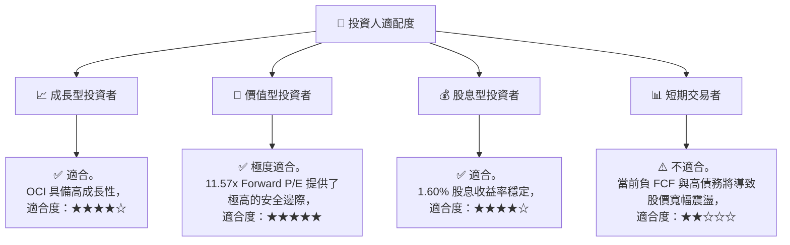

### 10.5 每季財報監控清單（Quarterly Watch List）

為了確保投資假設未發生動搖，投資人應在每季財報中重點監控以下指標：

| 監控指標 | 基準值 (當前) | 偏好門檻 (加碼) | 警告門檻 (減碼) | 決策含意 |
|----------|---------------|-----------------|-----------------|----------|
| **OCI (IaaS) 營收年增率**| ~25.0% | > 35.0% | < 15.0% | 衡量 Oracle 在雲端市場的市佔擴張速度 |
| **營業利益率 (GAAP)** | 30.6% | > 35.0% | < 25.0% | 評估 OCI 折舊成本是否被軟體營運槓桿抵消 |
| **季度資本支出 (Capex)** | $16.49B | < $12.00B (拐點) | > $20.00B (失控) | 監控資金消耗速度與 FCF 轉正時間表 |
| **利息保障倍數** | 4.48x | > 6.00x | < 3.00x | 評估高息環境下的債務違約風險 |

### 10.6 反面論證：什麼會證明論點錯誤（What Would Change My Mind）

```
╔══════════════════════════════════════════════════════════════════╗
║              ⚠️ 論點失效條件（Disconfirming Evidence）           ║
╠══════════════════════════════════════════════════════════════════╣
║  本投資論點在下列情況成立時應重新檢視或退出：                    ║
║  ☐ OCI 營收成長率連續兩季 < 12%，說明 AI 算力需求發生結構性逆轉   ║
║  ☐ 營業利益率（GAAP）較當前水平收縮 > 500 bps (跌破 25%)        ║
║  ☐ 自由現金流（FCF）在 FY2027 持續惡化，赤字擴大至 -$30B 以上    ║
║  ☐ ROIC 跌破 WACC (即 ROIC < 10.0%)，說明擴張投資在摧毀股東價值   ║
║  ☐ 聯準會持續升息，導致 Oracle 再融資利息成本暴增，保障倍數 < 2x  ║
╚══════════════════════════════════════════════════════════════════╝
```

---

> **免責聲明**：本報告為 AI 自動生成，僅供研究參考，不構成投資建議。投資有風險，入市需謹慎。