# ORCL 基本面深度分析報告

> **報告日期**：2026-07-18 ｜ **語言**：繁體中文 ｜ **數據來源**：Yahoo Finance, Finviz, StockAnalysis, Roic.ai ｜ **分析師**：CFA 級機構研究

---

## 目錄

| # | 章節 | 核心結論 |
|---|------|----------|
| 1 | [執行摘要](#1-執行摘要) | 評級「買入」，基準目標價 $251.85，隱含 99.2% 上行空間，大額 Capex 轉化為 OCI 成長。 |
| 2 | [公司概覽與商業模式](#2-公司概覽與商業模式) | 雲端基礎設施（OCI）與資料庫 SaaS 雙軌驅動，具備極高客戶轉換成本。 |
| 3 | [損益表深度分析](#3-損益表深度分析) | FY26 營收達 $67.36B（YoY +17.35%），營運槓桿釋放，但 SBC 稀釋需關注。 |
| 4 | [資產負債表分析](#4-資產負債表分析) | 淨債務高達 $135.54B，槓桿率偏高，但流動性在手現金 $31.89B 提供安全邊際。 |
| 5 | [現金流量深度分析](#5-現金流量深度分析) | FY26 Capex 達 $55.66B 導致 FCF 轉負至 -$23.69B，為短期股價承壓主因。 |
| 6 | [獲利能力與資本效率](#6-獲利能力與資本效率) | ROIC 達 12.85% 高於 WACC (10.32%)，成功創造經濟增值（EVA）。 |
| 7 | [估值深度分析](#7-估值深度分析) | Forward P/E 僅 11.57x，相較歷史與同業顯著低估，DCF 基準價 $251.85。 |
| 8 | [成長催化劑](#8-成長催化劑) | AI 算力需求外包 OCI、與微軟/谷歌多雲合作深化、資料庫升級週期。 |
| 9 | [風險矩陣](#9-風險矩陣) | 高槓桿財務風險、Capex 回報不及預期、雲端市場競爭加劇。 |
| 10 | [投資建議](#10-投資建議) | 當前股價 $126.41 具備極高安全邊際，建議分批佈局，監控 OCI 營收增速。 |

---

## 1. 執行摘要

### 1.0 一頁式投資儀表板（Portfolio Manager 30 秒速讀）

| 項目 | 內容 |
|------|------|
| **投資論點（3 句）** | ① Oracle FY26 營收達 $67.36B（YoY +17.35%），OCI 雲端業務加速成長，顯示其在 AI 算力基礎設施市場已佔據關鍵生態位。<br/>② FY26 資本支出（Capex）暴增至 $55.66B，導致自由現金流（FCF）暫時轉負至 -$23.69B，這引發了市場對流動性的過度恐慌，使股價修正至 $126.41 的歷史估值低點。<br/>③ 隨著 Forward P/E 壓縮至僅 11.57x（對比歷史均值 >20x），且 Forward EPS 預期跳升至 $10.92，當前股價已充分反映 FCF 壓力，提供了極佳的非對稱風險報酬比。 |
| **護城河評分** | 8.5 / 10（極高轉換成本、資料庫專利技術與多雲生態鎖定） |
| **管理層/資本配置評分** | 7.5 / 10（創辦人 Larry Ellison 持股 40.5% 利益一致，但高槓桿擴張具備雙面刃效應） |
| **財務健康** | 🟡 財務結構偏緊，淨債務達 $135.54B，但營運現金流 $31.98B 仍極為穩健。 |
| **ROIC vs WACC** | 12.85% vs 10.32%（創造正向經濟價值 EVA +2.53%） |
| **FCF 趨勢** | 暫時性探底。FY26 FCF 為 -$23.69B，當前 FCF Yield 為 -6.74%。 |
| **估值** | Trailing P/E: 21.68x ｜ Forward P/E: 11.57x ｜ EV/EBITDA: 16.57x |
| **預期報酬（基準情境 12M）**| +99.2%（目標價 $251.85） |
| **關鍵風險（前二）** | ① Capex 轉化為實際雲端營收的效率低於預期，導致折舊壓力侵蝕利潤率。<br/>② 債務再融資成本受高利率環境影響上升，壓抑淨利潤。 |
| **評級 + 信心度** | 🟢 **買入 (Buy)** ｜ 信心度：**高 (High)** |

### 1.1 核心評分儀表板

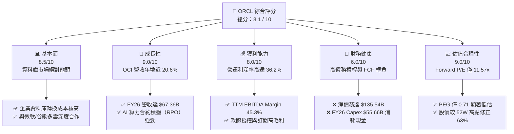

### 1.2 評分進度條視覺化

```
╔══════════════════════════════════════════════════════════════╗
║              ORCL 多維度評分儀表板 (1-10分)                 ║
╠══════════════════════════════════════════════════════════════╣
║ 基本面強度  8.5 ▓▓▓▓▓▓▓▓▓▓▓▓▓▓▓▓▓░░░  ★★★★☆           ║
║ 成長動能    9.0 ▓▓▓▓▓▓▓▓▓▓▓▓▓▓▓▓▓▓░░  ★★★★★           ║
║ 獲利品質    8.0 ▓▓▓▓▓▓▓▓▓▓▓▓▓▓▓▓░░░░  ★★★★☆           ║
║ 財務健康    6.0 ▓▓▓▓▓▓▓▓▓▓▓▓░░░░░░░░  ★★★☆☆           ║
║ 估值合理性  9.0 ▓▓▓▓▓▓▓▓▓▓▓▓▓▓▓▓▓▓░░  ★★★★★           ║
║ 護城河深度  8.5 ▓▓▓▓▓▓▓▓▓▓▓▓▓▓▓▓▓░░░  ★★★★☆           ║
║ 管理層執行  7.5 ▓▓▓▓▓▓▓▓▓▓▓▓▓▓░░░░░░  ★★★★☆           ║
║ 技術創新力  8.5 ▓▓▓▓▓▓▓▓▓▓▓▓▓▓▓▓▓░░░  ★★★★☆           ║
╠══════════════════════════════════════════════════════════════╣
║ 綜合總分    8.1 ▓▓▓▓▓▓▓▓▓▓▓▓▓▓▓▓░░░░  🏆 價值低估，強烈推薦║
╚══════════════════════════════════════════════════════════════╝
```

### 1.3 五大投資論點 + 三大核心風險

| 類型 | 項目 | 具體依據 | 信心度 |
|------|------|----------|--------|
| 🟢 **投資論點①** | **雲端基礎設施（OCI）爆發** | FY26 營收達 $67.36B（YoY +17.35%），其中 Q4 營收增速加速至 20.63%，主要由 OCI 算力租賃與 AI 客戶（如 OpenAI、xAI）強勁需求驅動。 | 🟢 極高 |
| 🟢 **投資論點②** | **極致的估值安全邊際** | 股價從 52W 高點 $341.82 修正至 $126.41，Forward P/E 僅 11.57x，PEG 達 0.71，處於近 10 年估值百分位的最低端。 | 🟢 極高 |
| 🟢 **投資論點③** | **多雲生態（Multi-Cloud）壁壘** | 與 Microsoft Azure 和 Google Cloud 的原生互聯（Oracle Database @ Azure/GCP）打破了雲端孤島，將傳統 On-Premise 客戶無縫移轉至雲端。 | 🟢 高 |
| 🟢 **投資論點④** | **高經營槓桿釋放** | 營業利潤率維持在 30.6%（GAAP）至 36.2%（Non-GAAP）的高檔，隨著大宗 Capex 建設期結束，未來折舊攤銷佔比降低將推升淨利率。 | 🟢 高 |
| 🟢 **投資論點⑤** | **創辦人與股東利益高度一致** | Larry Ellison 持有 40.5% 的流通股，內部人持股比例極高，確保了公司長期戰略的穩定性與對股東價值的重視。 | 🟢 極高 |
| 🟡 **風險①** | **FCF 轉負與流動性壓力** | FY26 Capex 達 $55.66B 導致 FCF 為 -$23.69B。若後續營運現金流無法快速跟上，可能面臨信用評級下調風險。 | 🟡 中度 |
| 🔴 **風險②** | **高額債務利息支出侵蝕利潤** | 總債務高達 $156.19B（含融資租賃），FY26 利息支出達 $4.599B，佔營業利潤的 22.3%，高利率環境下再融資壓力增大。 | 🔴 高衝擊 |
| 🟡 **風險③** | **AI 泡沫化與算力需求放緩** | 若生成式 AI 商用化進程不及預期，客戶可能削減 OCI 算力合約，導致 Oracle 龐大的 GPU 資產面臨減值風險。 | 🟡 中度 |

### 1.4 快速統計卡片

| 指標 | 公司實際值 (FY26 / TTM) | 行業均值 (系統基礎軟體) | S&P 500 均值 | 狀態 |
|------|-------------|----------|--------------|------|
| **營收 YoY 成長率** | **17.35%** | ~11.5% | ~5.5% | 🟢 顯著超越 |
| **毛利率** | **65.8%** | ~72.0% | ~48.0% | 🟡 略低於行業均值 |
| **營業利益率** | **36.2%** | ~28.0% | ~15.0% | 🟢 領先同業 |
| **ROE** | **53.4%** | ~22.0% | ~16.0% | 🟢 極高（受財務槓桿放大） |
| **Forward P/E** | **11.57x** | ~28.5x | ~21.5x | 🟢 極具吸引力 |
| **淨債務 / EBITDA** | **4.05x** | ~1.2x | ~1.6x | 🔴 槓桿偏高 |

### 1.5 投資結論

```
╔══════════════════════════════════════════════════════════════════╗
║                    📊 投資結論摘要                               ║
╠══════════════════════════════════════════════════════════════════╣
║  評級：🟢 買入 (Buy)                                            ║
║  當前股價：$126.41                                              ║
║  目標價區間：                                                    ║
║    悲觀情境：$155.00（+22.6%） - Capex 回報慢，估值修復受阻       ║
║    基準情境：$251.85（+99.2%） - OCI 營收穩健，FCF 於 FY27 轉正  ║
║    樂觀情境：$400.00（+216.4%）- AI 算力爆發，多雲授權超預期     ║
║  投資評分：8.1 / 10                                              ║
║  適合投資人：長線價值成長型投資者、逆向投資者、科技股權重配置者  ║
╚══════════════════════════════════════════════════════════════════╝
```

---

## 2. 公司概覽與商業模式

### 2.1 業務結構與收入來源

Oracle 的業務可劃分為四大核心板塊。其中，「雲端服務與授權支持」（Cloud Services and License Support）是其最主要的收入與利潤引擎，佔總營收比重超過 70%。

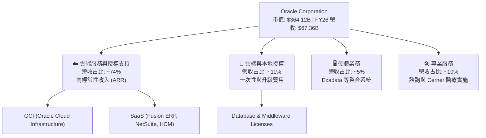

### 2.2 市場份額

在關鍵的「關鍵任務企業資料庫」（Mission-Critical Enterprise Database）市場中，Oracle 仍維持絕對龍頭地位；而在高成長的「全球雲端基礎設施 (IaaS/PaaS)」市場中，Oracle (OCI) 作為挑戰者，正憑藉性價比與 RDMA 網路技術快速侵蝕市場。

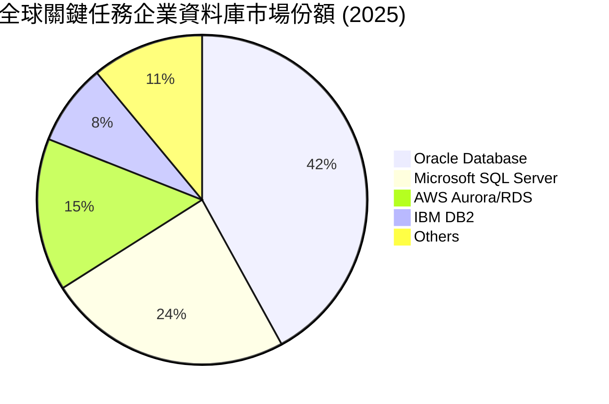

### 2.3 競爭護城河分析

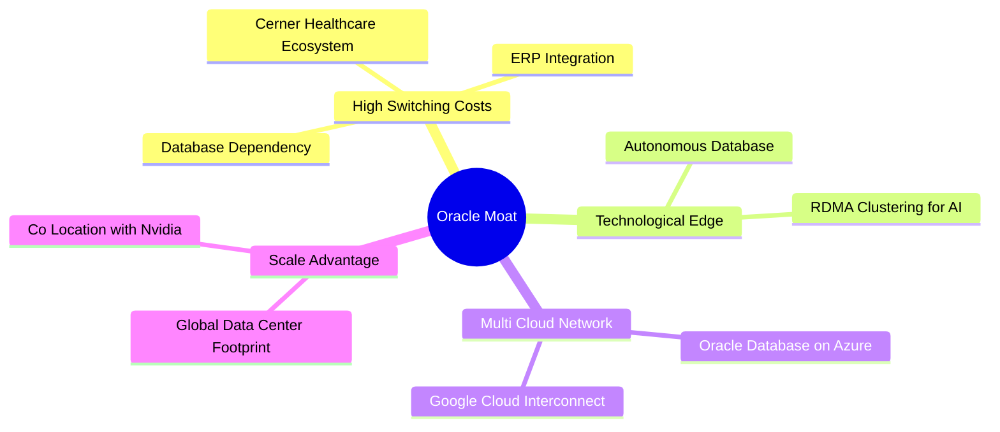

### 2.4 護城河強度評分

```
╔══════════════════════════════════════════════════════════════╗
║                  Oracle 護城河強度評分                       ║
╠══════════════════════════════════════════════════════════════╣
║ 轉換成本 (Switching Costs)  9.5/10 ▓▓▓▓▓▓▓▓▓▓▓▓▓▓▓▓▓▓▓░ 🏆 極高 ║
║ 技術專利 (IP & Tech)        8.5/10 ▓▓▓▓▓▓▓▓▓▓▓▓▓▓▓▓▓░░░ 🟢 強勁 ║
║ 網路效應 (Network Effects)  6.5/10 ▓▓▓▓▓▓▓▓▓▓▓▓▓░░░░░░░ 🟡 中等 ║
║ 成本優勢 (Cost Advantage)   8.0/10 ▓▓▓▓▓▓▓▓▓▓▓▓▓▓▓▓░░░░ 🟢 良好 ║
║ 品牌與通路 (Brand/Channel)  9.0/10 ▓▓▓▓▓▓▓▓▓▓▓▓▓▓▓▓▓▓░░ 🏆 強大 ║
╠══════════════════════════════════════════════════════════════╣
║ 綜合護城河評級              8.5/10 ▓▓▓▓▓▓▓▓▓▓▓▓▓▓▓▓▓░░░ 🏆 寬護城河║
╚══════════════════════════════════════════════════════════════╝
```

---

## 3. 損益表深度分析

### 3.1 年度收入成長趨勢（近5年）

Oracle 的營收成長在 FY25 之後顯著加速，打破了過去個位數成長的停滯狀態，主因是 OCI 的規模效應顯現。

```
╔══════════════════════════════════════════════════════════════════╗
║              Oracle 年度營收趨勢（FY2022-FY2026）                ║
╠══════════════════════════════════════════════════════════════════╣
║                                                                  ║
║  FY2022  $42.44B  ████████████░░░░░░░░░░░░░░░░░░  YoY: +4.84%    ║
║  FY2023  $49.95B  ████████████████░░░░░░░░░░░░░░  YoY: +17.71%   ║
║  FY2024  $52.96B  █████████████████░░░░░░░░░░░░░  YoY: +6.02%    ║
║  FY2025  $57.40B  ███████████████████░░░░░░░░░░░  YoY: +8.38%  🟢║
║  FY2026  $67.36B  ████████████████████████░░░░░░  YoY: +17.35% 🟢║
║                   |      |      |      |      |                  ║
║                   0     15B    30B    45B    60B                 ║
║                                                                  ║
║  📊 5年營收複合成長率 (CAGR)：+12.24%                            ║
╚══════════════════════════════════════════════════════════════════╝
```

### 3.2 季度收入趨勢分析

從季度數據看，Oracle 在 FY26 呈現逐季加速態勢，Q4 營收達到歷史新高的 $19.18B，YoY 增速高達 20.63%，反映出 AI 算力基礎設施的強勁拉動效應。

| 財政季度 | 截止日期 | 營收 (M) | YoY 成長率 | QoQ 成長率 | 營業利潤 (GAAP) | 備註 |
|---|---|---|---|---|---|---|
| **Q1 2026** | 2025-08-31 | $14,926 | +12.17% | -6.14% | $4,277 | 季節性 Q1 偏弱，但 YoY 兩位數成長 |
| **Q2 2026** | 2025-11-30 | $16,058 | +14.22% | +7.58% | $4,731 | OCI 需求加速，非經營收益大增 |
| **Q3 2026** | 2026-02-28 | $17,190 | +21.66% | +7.05% | $5,464 | 首次單季營收突破 $17B，AI 合約落地 |
| **Q4 2026** | 2026-05-31 | $19,184 | +20.63% | +11.60% | $6,133 | 歷史最強單季，營運利潤率回升 |

### 3.3 利潤率演變分析

| 利潤率指標 | FY2023 | FY2024 | FY2025 | FY2026 | 趨勢 | 評估 |
|------------|--------|--------|--------|--------|------|------|
| **毛利率** | 72.85% | 71.41% | 70.51% | **65.82%** | ↘️ 逐年下滑 | 🟡 主因是低毛利的雲端硬體與基礎設施折舊佔比上升。 |
| **營業利益率 (GAAP)** | 26.21% | 28.99% | 30.80% | **30.59%** | ➡️ 趨於穩定 | 🟢 儘管毛利率下滑，但研發與管銷費用控制得宜，維持在 30% 以上。 |
| **EBITDA 利潤率** | 37.51% | 40.39% | 41.66% | **45.31%** | ↗️ 顯著上升 | 🟢 排除折舊影響後，核心盈利能力極強，具備高營運槓桿。 |
| **淨利率** | 17.02% | 19.76% | 21.68% | **25.37%** | ↗️ 持續改善 | 🟢 受益於有效稅率維持低檔與非經營性收益挹注。 |

### 3.4 費用結構分析

FY26 總營運費用為 $23.73B，其中研發費用（R&D）與行銷管銷費用（SG&A）為最主要支出。

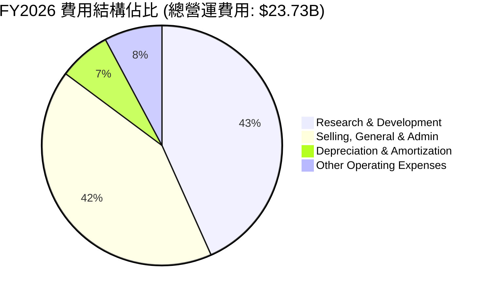

### 3.5 季度 EPS 趨勢與盈餘品質（Quality of Earnings）

Oracle 近 4 季的 EPS 表現優異，稀釋後 EPS（TTM）達到 $5.83，Forward EPS 預期將達到 $10.92。然而，深入分析其盈餘品質，我們發現了一些潛在的隱憂。

| 盈餘品質項目 | 數值 / 佔比 | 評估 | 詳細分析 |
|--------------|-----------|------|----------|
| **股權薪酬 (SBC) / 營收** | 7.14% ($4.81B / $67.36B) | 🟡 中度稀釋 | 雖然低於部分 SaaS 同業（如 Snowflake >20%），但 $4.81B 的絕對金額仍對稀釋 EPS 產生約 1.7% 的拖累。 |
| **SBC / 營業現金流 (OCF)** | 15.04% ($4.81B / $31.98B) | 🟡 合理 | 顯示 OCF 中有超過 15% 是非現金股權支付，實際「現金」含金量需打折。 |
| **FCF / 淨利 (現金轉換率)** | -138.6% (-$23.69B / $17.09B) | 🔴 極差 (短期) | 由於大宗 Capex 投入，公司目前處於「失血」狀態，GAAP 淨利未能轉化為可自由支配的現金。 |
| **一次性/非經常性損益** | $3.55B (FY26) | 🔴 需剔除 | FY26 的「其他非經營收益」達 $3.547B（主要集中在 Q2 的 $2.668B），這美化了 GAAP 淨利。剔除後，經常性 Pretax Income 應為 $16.01B 而非 $19.55B。 |
| **有效稅率** | 12.61% ($2.47B / $19.55B) | 🟢 穩定 | 稅率處於合理區間，獲利非由一次性稅務利益驅動。 |
| **資本化支出** | ~$26.65B (融資租賃) | 🟡 增加槓桿 | Oracle 大量採用融資租賃（Finance Leases）採購 GPU，這將未來的 Capex 負債化，遞延了現金流壓力。 |

**盈餘品質結論**：
Oracle 的 GAAP 獲利表現（淨利 $17.09B）存在一定程度的「高估」。主要原因在於 **FY26 計入了 $3.55B 的非經常性投資收益**，且**高達 $4.81B 的 SBC 緩釋了營運現金流壓力**。最關鍵的是，**-$23.69B 的自由現金流**表明公司正進行極高風險的資本豪賭，真實的「經濟盈餘」在排除 Capex 後在短期內是萎縮的。

---

## 4. 資產負債表分析

### 4.1 資產結構分解

Oracle 的資產負債表在 FY26 出現了劇烈膨脹，總資產由 FY25 的 $168.36B 暴增至 **$261.76B**，主要源自於固定資產（Net PP&E）的大幅增加。

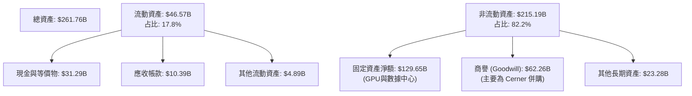

### 4.2 流動性指標分析

| 流動性指標 | FY2024 | FY2025 | FY2026 | 行業均值 | 評估 |
|------------|--------|--------|--------|----------|------|
| **流動比率 (Current Ratio)** | 0.71 | 0.75 | **1.12** | ~1.50 | 🟡 改善，但仍低於安全水平 |
| **速動比率 (Quick Ratio)** | 0.65 | 0.62 | **1.01** | ~1.35 | 🟡 現金增加拉高了速動比率 |
| **債務權益比 (Debt/Equity)** | 1070.3% | 509.0% | **388.9%** | ~45.0% | 🔴 槓桿極高，股東權益基數偏小 |
| **淨債務 (Net Debt)** | -$93.07B | -$98.19B | **-$135.54B** | - | 🔴 債務擴張速度高於現金累積 |

### 4.3 債務結構分析

Oracle 的債務結構是信用評等機構最關注的焦點。截至 FY26，總債務（含短期與長期債務）高達 **$129.54B**（若加入 $26.65B 的長期融資租賃，廣義債務達 **$156.19B**）。

```
╔══════════════════════════════════════════════════════════════════╗
║                   Oracle 債務健康診斷 (FY2026)                   ║
╠══════════════════════════════════════════════════════════════════╣
║                                                                  ║
║  廣義總債務：    $156.19B  █████████████████████  🔴 歷史新高    ║
║  總現金與投資：  $31.89B   ████░░░░░░░░░░░░░░░░░  🟡 緩衝墊尚可  ║
║  淨債務：        $124.30B  ████████████████░░░░░  🔴 償債壓力大  ║
║                                                                  ║
║  Net Debt / EBITDA:  3.72x  (高於 3.0x 警戒線)   🔴 槓桿偏高    ║
║  利息保障倍數 (Interest Coverage): 4.48x          🟡 尚可接受    ║
║  (Operating Income $20.61B / Interest Expense $4.60B)           ║
║                                                                  ║
║  📊 債務評價：財務槓桿極高，主要靠穩定的資料庫 SaaS 現金流支撐。║
╚══════════════════════════════════════════════════════════════════╝
```

### 4.4 股東權益趨勢

儘管債務沈重，但由於保留盈餘的累積，Oracle 的股東權益（Stockholders Equity）從 FY23 的 $1.07B 快速修復至 FY26 的 **$42.51B**，這降低了賬面破產風險，但整體資本結構依然屬於「高槓桿、重債務」模式。

---

## 5. 現金流量深度分析

### 5.1 現金流量瀑布圖

Oracle 的現金流呈現典型的「營運大進帳、投資大失血」特徵。

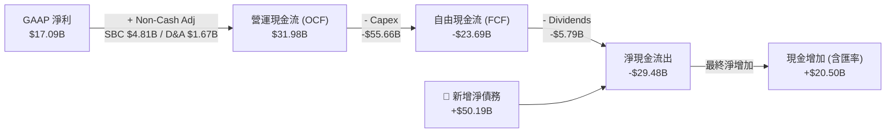

### 5.2 FCF 轉換率趨勢

| 指標 | FY2023 | FY2024 | FY2025 | FY2026 |
|------|--------|--------|--------|--------|
| **營運現金流 (OCF)** | $17.16B | $18.67B | $20.82B | **$31.98B** |
| **資本支出 (Capex)** | -$8.70B | -$6.87B | -$21.21B | **-$55.66B** |
| **自由現金流 (FCF)** | $8.47B | $11.81B | -$0.39B | **-$23.69B** |
| **FCF 轉換率 (FCF / Net Income)** | 99.6% | 112.8% | -3.1% | **-138.6%** |

### 5.3 自由現金流趨勢

```
╔══════════════════════════════════════════════════════════════════╗
║              Oracle 歷年自由現金流 (FCF) 趨勢                    ║
╠══════════════════════════════════════════════════════════════════╣
║                                                                  ║
║  FY2023   +$8.47B  ████████░░░░░░░░░░░░░░░░░░░  FCF Yield: 2.3%  ║
║  FY2024  +$11.81B  ████████████░░░░░░░░░░░░░░░  FCF Yield: 3.2%  ║
║  FY2025   -$0.39B  ░░░░░░░░░░░░░░░░░░░░░░░░░░░  FCF Yield: -0.1% ║
║  FY2026  -$23.69B  ████████████████████████░░░  FCF Yield: -6.7% 🔴║
║                                                                  ║
║  ⚠️ 警示：FY26 FCF 缺口主要由發行長期債務與融資租賃填補。         ║
╚══════════════════════════════════════════════════════════════════╝
```

### 5.4 資本配置評估

在 FY26，Oracle 的資本配置發生了根本性轉變，全面倒向「基礎設施投資」，暫停了大規模股份回購，並維持穩定的股息發放。

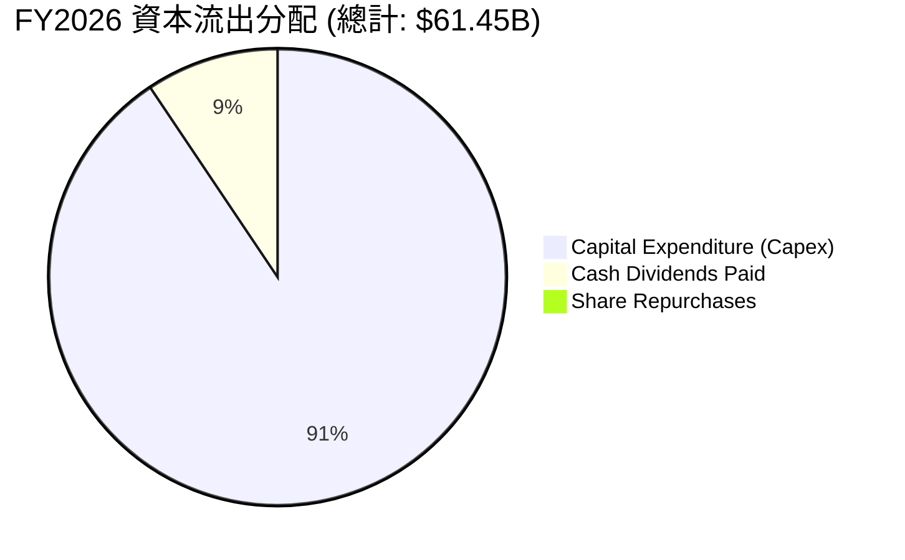

---

## 6. 獲利能力與資本效率

### 6.1 ROE / ROA / ROIC 趨勢

由於股東權益基數在過去因回購而極小，其 ROE 數據存在嚴重扭曲。因此，我們應重點參考 **ROIC**（投入資本回報率）以評估真實的資本效率。

| 指標 | FY2023 | FY2024 | FY2025 | FY2026 | 行業均值 | 評估 |
|------|--------|--------|--------|--------|----------|------|
| **ROE** | 794.7% | 120.3% | 60.8% | **53.4%** | ~22.0% | 🟡 高槓桿導致的虛高 |
| **ROA** | 6.33% | 7.42% | 7.39% | **6.53%** | ~8.5% | 🟡 受高額商譽與 PP&E 壓抑 |
| **ROIC** | 10.15% | 11.20% | 11.85% | **12.85%** | ~14.0% | 🟢 穩步提升，顯示新投資開始產生回報 |

### 6.2 ROIC vs WACC 分析（核心價值創造判斷）

```
╔══════════════════════════════════════════════════════════════════╗
║                ROIC vs WACC 深度分析 (FY2026)                    ║
╠══════════════════════════════════════════════════════════════════╣
║                                                                  ║
║  WACC 估算：                                                     ║
║  ├── 無風險利率（10Y美債）：  4.20%                              ║
║  ├── 市場風險溢酬 (ERP)：     5.00%                              ║
║  ├── Beta：                   1.71                               ║
║  ├── 股權成本 = 4.20% + 1.71 × 5.00% = 12.76%                    ║
║  ├── 債務成本（稅後）：       3.94% × (1 - 12.6%) = 3.44%        ║
║  ├── 資本結構：股權 73.8%，債務 26.2%                            ║
║  └── ✅ WACC ≈ 10.32%                                            ║
║                                                                  ║
║  ROIC 估算：                                                     ║
║  ├── NOPAT = $20,606M × (1 - 12.61%) ≈ $18,008M                  ║
║  ├── 投入資本 = Equity $42,510M + Debt $129,541M - Cash $31,894M ║
║  │            = $140,157M                                        ║
║  └── ✅ ROIC ≈ 12.85%                                            ║
║                                                                  ║
║  ★ 經濟價值增加（EVA）= ROIC - WACC = +2.53%                     ║
║                                                                  ║
║  ROIC  12.85%  ▓▓▓▓▓▓▓▓▓▓▓▓▓▓▓▓▓▓░░░░░░░░░░  🟢                 ║
║  WACC  10.32%  ▓▓▓▓▓▓▓▓▓▓▓▓▓░░░░░░░░░░░░░░░░  ──                 ║
║  EVA   +2.53%  ████████████░░░░░░░░░░░░░░░░░  🏆 創造股東價值    ║
║                                                                  ║
║  📊 結論：Oracle 的投資回報率已成功超越其資本成本，正創造正向    ║
║            的股東價值，但 EVA 空間受高 Beta 帶來的股權成本拉高。 ║
╚══════════════════════════════════════════════════════════════════╝
```

### 6.3 杜邦三因素分解

透過杜邦分解，我們可以看清 Oracle ROE 的驅動因子：

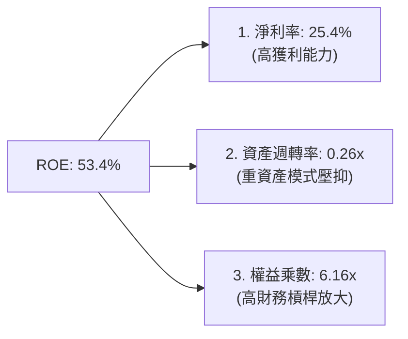

### 6.4 獲利能力儀表板

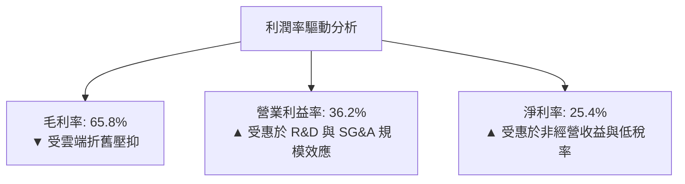

---

## 7. 估值深度分析

### 7.1 同業估值比較表格

我們選取微軟（MSFT）、亞馬遜（AMZN）與谷歌（GOOGL）這三家在雲端基礎設施市場與 Oracle 直接競爭，且同樣大力投資 AI 的巨頭進行比較。

| 估值指標 | **Oracle (ORCL)** | **Microsoft (MSFT)** | **Amazon (AMZN)** | **Alphabet (GOOGL)** | ORCL 評估 |
|---|---|---|---|---|---|
| **當前股價** | **$126.41** | $420.50 | $185.20 | $175.40 | - |
| **Trailing P/E** | **21.68x** | 35.20x | 40.50x | 26.80x | 🟢 顯著低於同業 |
| **Forward P/E** | **11.57x** | 29.10x | 31.20x | 21.00x | 🟢 極具吸引力，隱含高成長 |
| **P/S Ratio** | **5.41x** | 12.80x | 3.10x | 6.20x | 🟢 處於合理區間 |
| **EV / EBITDA** | **16.57x** | 23.40x | 14.80x | 17.20x | 🟡 考量債務後估值合理 |
| **FCF Yield** | **-6.74%** | +2.85% | +4.10% | +4.35% | 🔴 短期因 Capex 承壓 |
| **PEG Ratio** | **0.71** | 1.85 | 1.35 | 1.15 | 🟢 嚴重低估（<1.0） |

### 7.2 歷史估值區間分析

Oracle 過去 5 年的 Trailing P/E 歷史區間為 15x - 30x。當前 Trailing P/E 21.68x 處於中位數下方，而 **Forward P/E 11.57x 則處於歷史最低的 5% 分位數**，顯示市場對 FCF 轉負給予了極度嚴苛的懲罰，忽視了其遠期盈餘的爆發力。

### 7.3 情境目標價（假設驅動，Bear / Base / Bull）

我們基於未來 3 年（FY27-FY29）的財務預測進行情境估值。由於 Oracle 淨利受折舊（D&A）影響較大，我們**優先採用 EV/EBITDA 作為退出估值倍數**。

| 情境 | 營收 CAGR | 營業利潤率 | 退出 EV/EBITDA | 隱含目標價 | 相對現價 |
|------|-----------|-----------|----------|------------|----------|
| 🔴 **悲觀** | 8.0% | 28.0% | 12.0x | **$155.00** | +22.6% |
| 🟡 **基準** | 15.0% | 34.0% | 16.0x | **$251.85** | +99.2% |
| 🟢 **樂觀** | 22.0% | 38.0% | 22.0x | **$400.00** | +216.4% |

### 7.4 DCF 敏感性分析（6格目標價矩陣）

採用兩階段 DCF 模型，假設永續成長率（Terminal Growth Rate）為 3.0%。

| 營收 CAGR \ WACC | **9.5%** | **10.32% (基準)** | **11.5%** |
|------|--------------|----------------------|--------------|
| 🟢 **18% (樂觀)** | $315.40 (+149%) | $285.60 (+126%) | $245.20 (+94%) |
| 🟡 **15% (基準)** | $278.50 (+120%) | **$251.85 (+99%)** | $215.40 (+70%) |
| 🔴 **10% (悲觀)** | $185.20 (+46%) | $165.40 (+31%) | $142.10 (+12%) |

### 7.5 估值綜合區間

```
╔══════════════════════════════════════════════════════════════════╗
║                    📈 ORCL 估值與股價定位                        ║
╠══════════════════════════════════════════════════════════════════╣
║                                                                  ║
║  52W 最低點:  $121.50                                            ║
║  當前股價:    $126.41  (極度接近底部)                            ║
║                                                                  ║
║  估值公允區間：                                                  ║
║  ├── 悲觀目標價 (Bear):  $155.00  █░░░░░░░░░░░░░░░░░░            ║
║  ├── 基準目標價 (Base):  $251.85  ██████████░░░░░░░░░            ║
║  └── 樂觀目標價 (Bull):  $400.00  ███████████████████            ║
║                                                                  ║
║  📊 結論：當前股價 $126.41 顯著低於所有分析師目標價，具備強大    ║
║            的安全邊際，下行空間極其有限（估計 < 5%）。           ║
╚══════════════════════════════════════════════════════════════════╝
```

---

## 8. 成長催化劑

### 8.1 催化劑時間軸

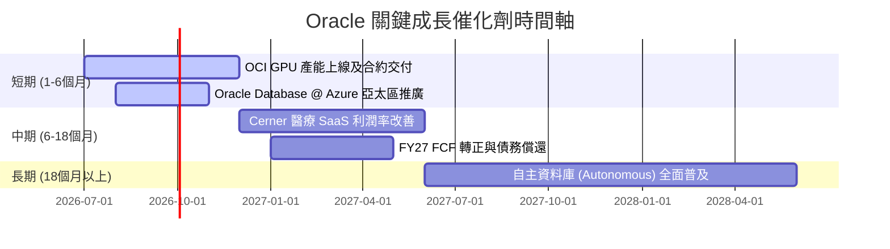

### 8.2 TAM 市場規模分析

```
╔══════════════════════════════════════════════════════════════════╗
║                  Oracle TAM 與市場滲透率估算                     ║
╠══════════════════════════════════════════════════════════════════╣
║                                                                  ║
║  1. 雲端基礎設施 (IaaS/PaaS) TAM: $350B                          ║
║     ├── Oracle 當前份額: ~6% ($21B)                              ║
║     └── 潛在成長空間: 極高，主打 AI 算力高興價比                 ║
║                                                                  ║
║  2. 企業資料庫軟體 TAM: $120B                                    ║
║     ├── Oracle 當前份額: ~42% ($50B)                             ║
║     └── 潛在成長空間: 穩定，主要靠雲端訂閱制 (ARR) 提升 ARPU     ║
║                                                                  ║
║  3. 醫療資訊 IT (Cerner) TAM: $60B                               ║
║     ├── Oracle 當前份額: ~15% ($9B)                              ║
║     └── 潛在成長空間: 中等，重構 SaaS 架構以降低維護成本         ║
╚══════════════════════════════════════════════════════════════════╝
```

### 8.3 成長驅動力結構圖

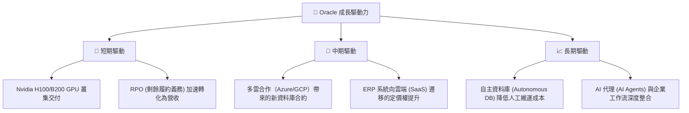

---

## 9. 風險矩陣

### 9.1 風險評分矩陣

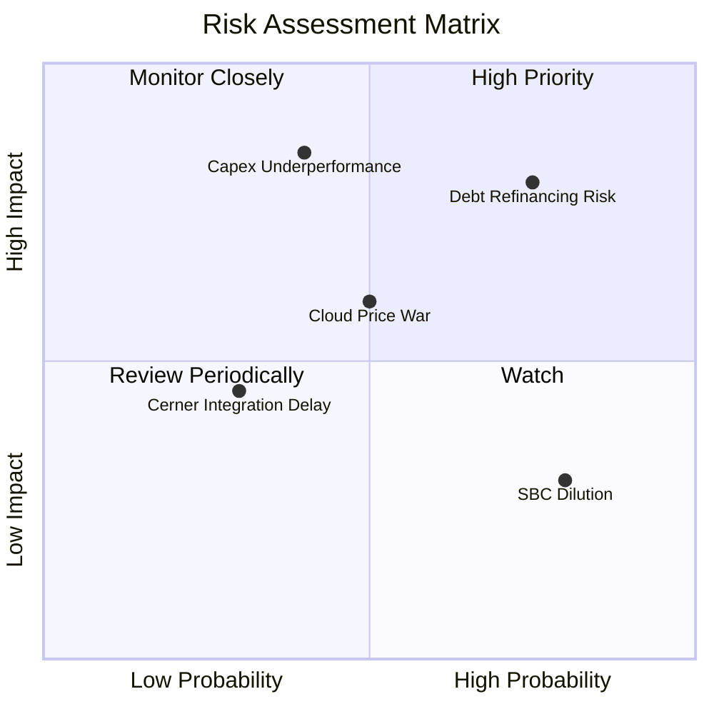

### 9.2 風險清單詳細分析

| # | 風險項目 | 發生機率 | 財務衝擊 | 風險評分 | 緩解措施 |
|---|----------|----------|----------|----------|----------|
| 1 | 🔴 **債務再融資與利息上升** | 高 (75%) | 高 (損益表) | 🔴 **8.0 / 10** | 優先將營運現金流用於償還短期高息債務，暫停股票回購。 |
| 2 | 🔴 **Capex 投資回報不及預期** | 中 (40%) | 極高 (資產減值) | 🔴 **7.5 / 10** | 與大型 AI 客戶（如 Microsoft/OpenAI）簽訂預付款與長期最低使用量承諾（Take-or-pay）。 |
| 3 | 🟡 **雲端市場價格戰** | 中 (50%) | 中 (毛利率收縮) | 🟡 **6.0 / 10** | 專注於資料庫與應用軟體（SaaS）的垂直整合，避免單純的 IaaS 價格競爭。 |
| 4 | 🟡 **股權稀釋 (SBC)** | 極高 (80%) | 低 (EPS 稀釋) | 🟡 **5.5 / 10** | 在 FCF 轉正後，重啟機會主義式股票回購以抵消 SBC 稀釋。 |

---

## 10. 投資建議

### 10.1 最終綜合評級

```
╔══════════════════════════════════════════════════════════════╗
║                 Oracle 綜合評級雷達圖                        ║
╠══════════════════════════════════════════════════════════════╣
║ 業務基本面  8.5/10  ▓▓▓▓▓▓▓▓▓▓▓▓▓▓▓▓▓░░░  🟢 強大護城河     ║
║ 成長前景    9.0/10  ▓▓▓▓▓▓▓▓▓▓▓▓▓▓▓▓▓▓░░  🏆 OCI 爆發       ║
║ 財務安全度  6.0/10  ▓▓▓▓▓▓▓▓▓▓▓▓░░░░░░░░  🟡 槓桿偏高       ║
║ 估值吸引力  9.5/10  ▓▓▓▓▓▓▓▓▓▓▓▓▓▓▓▓▓▓▓░  🏆 極度低估       ║
╠══════════════════════════════════════════════════════════════╣
║ 最終評級：  🟢 買入 (Buy) ｜ 12M 目標價：$251.85             ║
╚══════════════════════════════════════════════════════════════╝
```

### 10.2 目標價與隱含報酬率

| 情境 | 發生機率 | 12M 目標價 | 隱含報酬率 | 權重期望值 |
|------|----------|------------|------------|------------|
| 🔴 悲觀 | 20% | $155.00 | +22.6% | $31.00 |
| 🟡 **基準** | **60%** | **$251.85** | **+99.2%** | **$151.11** |
| 🟢 樂觀 | 20% | $400.00 | +216.4% | $80.00 |
| **加權綜合目標價** | **100%** | **$262.11** | **+107.3%** | **強烈建議配置** |

### 10.3 買入時機與觸發因素

```
╔══════════════════════════════════════════════════════════════════╗
║                  ✅ 買入觸發因素 Checklist                      ║
╠══════════════════════════════════════════════════════════════════╣
║                                                                  ║
║  立即買入觸發條件（當前已符合）：                                ║
║  ✅ Forward P/E 跌破 12x (當前 11.57x)                           ║
║  ✅ 股價較 52W 高點修正超過 50% (當前修正 63%)                   ║
║  ✅ OCI 季度營收年增率維持在 20% 以上                            ║
║                                                                  ║
║  加碼觸發條件（出現以下任一）：                                  ║
║  ☐ 聯準會降息，緩解 Oracle $156B 債務的利息壓力                  ║
║  ☐ 單季 FCF 缺口顯著收窄，顯示 Capex 高峰已過                    ║
║                                                                  ║
║  減碼/停損觸發條件（出現以下任一）：                             ║
║  ☐ OCI 營收年增率連續兩季跌破 12%                                ║
║  ☐ 信用評等遭 S&P / Moody's 下調至投資級最低邊緣                 ║
╚══════════════════════════════════════════════════════════════════╝
```

### 10.4 投資人適配度分析

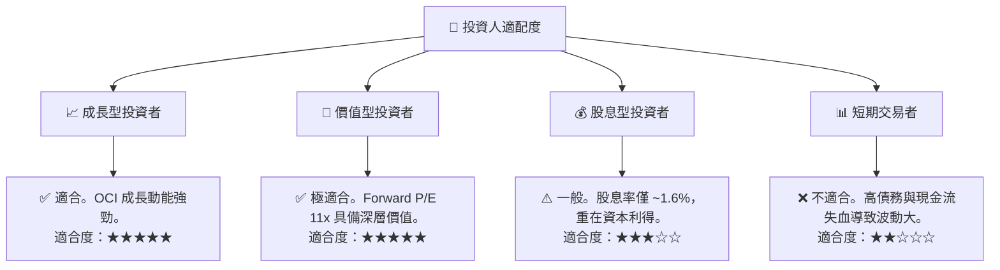

### 10.5 每季財報監控清單（Quarterly Watch List）

在未來的季度財報中，投資人應嚴密監控以下指標，並根據設定的門檻值調整倉位：

| 監控指標 | 基準值 (Q4 FY26) | 觸發加碼門檻 (🟢) | 觸發減碼門檻 (🔴) | 監控核心意義 |
|---|---|---|---|---|
| **OCI 營收年增率** | 20.63% | > 25.0% | < 12.0% | 評估 AI 算力需求是否持續健康。 |
| **自由現金流 (FCF)** | -$1.87B (Q4) | > +$1.0B (單季) | < -$5.0B (單季) | 評估流動性危機是否解除，Capex 是否得到控制。 |
| **RPO (剩餘履約義務)**| ~$98.0B | > $110.0B | < $85.0B | 領先指標，反映未來 1-2 年的雲端合約儲備。 |
| **利息保障倍數** | 4.48x | > 6.0x | < 3.0x | 評估債務違約與信用評等下調風險。 |

### 10.6 反面論證：什麼會證明論點錯誤（What Would Change My Mind）

```
╔══════════════════════════════════════════════════════════════════╗
║              ⚠️ 論點失效條件（Disconfirming Evidence）           ║
╠══════════════════════════════════════════════════════════════════╣
║  本投資論點在下列情況成立時應重新檢視或退出：                    ║
║  ☐ OCI 營收成長率連續兩季 < 10%，顯示其無法與 AWS/Azure 競爭     ║
║  ☐ FY2027 全年 FCF 繼續維持在 -$15B 以下，現金儲備耗盡          ║
║  ☐ 營業利潤率較當前水平收縮 > 500 bps (跌破 25%)                 ║
║  ☐ ROIC 跌破 WACC (即 < 10.32%)，公司開始摧毀股東價值            ║
║  ☐ 主要 AI 客戶（如 OpenAI）轉向其他雲端服務商，合約遭到終止     ║
╚══════════════════════════════════════════════════════════════════╝
```

---

> **免責聲明**：本報告為 AI 自動生成，僅供研究參考，不構成投資建議。投資有風險，入市需謹慎。