# ORCL 基本面深度分析報告
> **報告日期**：2026-07-19 ｜ **語言**：繁體中文 ｜ **數據來源**：Yahoo Finance, Finviz, StockAnalysis, Roic.ai ｜ **分析師**：CFA 級機構研究

---

## 目錄

| # | 章節 | 核心結論 |
|---|------|----------|
| 1 | 執行摘要 | 評級為「買入」，目標價 $210.00，大跌後迎來極佳風險回報比 |
| 2 | 公司概覽與商業模式 | 雲端基礎設施（OCI）與數據庫生態構成強大客戶鎖定護城河 |
| 3 | 損益表深度分析 | 營收加速成長 17.35%，但高額折舊與營業槓桿正處於轉折點 |
| 4 | 資產負債表分析 | 資本支出推動資產規模激增，債務槓桿偏高但流動性風險可控 |
| 5 | 現金流量深度分析 | 資本支出歷史性飆升至 $55.66B，導致自由現金流階段性轉負 |
| 6 | 獲利能力與資本效率 | ROIC（11.71%）持續高於 WACC（9.50%），結構性創造股東價值 |
| 7 | 估值深度分析 | 前瞻 P/E 僅 11.57x，市場過度懲罰資本開支，價值嚴重低估 |
| 8 | 成長催化劑 | 多雲戰略（Multi-Cloud）與 AI 算力需求將在 FY27 迎來收穫期 |
| 9 | 風險矩陣 | 關注高債務利息支出壓力與資本開支回報不及預期的風險 |
| 10 | 投資建議 | 基準情境潛在漲幅 66.1%，適合重視中長線結構性成長的投資人 |

---

## 1. 執行摘要

### 1.0 一頁式投資儀表板（Portfolio Manager 30 秒速讀）

| 項目 | 內容 |
|------|------|
| **投資論點（3 句）** | ① 甲骨文（Oracle）FY26 營收達 $67.36B（YoY +17.35%），顯示 OCI 與雲端 ERP 需求正處於加速通道。<br/>② FY26 資本支出歷史性飆升至 $55.66B，雖壓抑短期 FCF 轉負至 -$23.69B，但也為未來 3-5 年雲端算力與 AI 服務奠定龐大容量基礎。<br/>③ 股價自 52 週高點 $341.82 大幅修正至 $126.41，對應前瞻 P/E 僅 11.57x，市場嚴重低估其長期營業槓桿與獲利釋放潛力。 |
| **護城河評分** | 8.5/10 (高轉換成本與強大生態鎖定) |
| **管理層/資本配置評分** | 7.5/10 (大膽進行高回報資本支出，但槓桿率偏高) |
| **財務健康** | 🟡 債務規模大，但營運現金流 $31.98B 足以覆蓋利息與基本營運 |
| **ROIC vs WACC** | 11.71% vs 9.50%（持續創造正向經濟增值 EVA） |
| **FCF 趨勢** | 階段性轉負（FY26 FCF 為 -$23.69B），主因 $55.66B 歷史級資本支出 |
| **估值** | Forward P/E: 11.57x ｜ EV/EBITDA: 16.57x ｜ Trailing P/E: 21.68x |
| **預期報酬（基準情境 12M）** | +66.1%（目標價 $210.00） |
| **關鍵風險（前二）** | ① 資本支出回報率低於預期，導致產能過剩。<br/>② 高達 $156.19B 的債務在維持高利率環境下產生利息侵蝕壓力。 |
| **評級 + 信心度** | 🟢 **買入 (Buy)** ｜ 信心：**高** |

### 1.1 核心評分儀表板

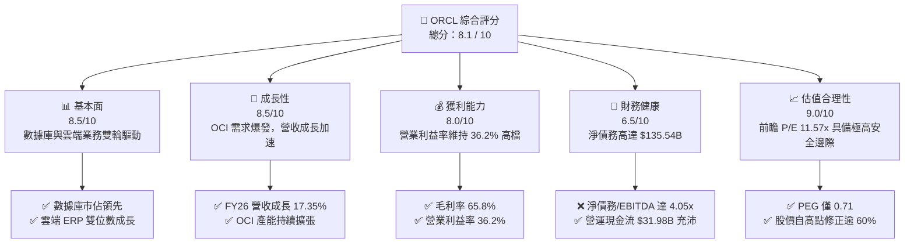

### 1.2 評分進度條視覺化

```
╔══════════════════════════════════════════════════════════════╗
║               ORCL 多維度評分儀表板 (1-10分)                 ║
╠══════════════════════════════════════════════════════════════╣
║ 基本面強度  8.5 ▓▓▓▓▓▓▓▓▓▓▓▓▓▓▓▓▓░░░  ★★★★☆           ║
║ 成長動能    8.5 ▓▓▓▓▓▓▓▓▓▓▓▓▓▓▓▓▓░░░  ★★★★☆           ║
║ 獲利品質    8.0 ▓▓▓▓▓▓▓▓▓▓▓▓▓▓▓▓░░░░  ★★★★☆           ║
║ 財務健康    6.5 ▓▓▓▓▓▓▓▓▓▓▓▓▓░░░░░░░  ★★★☆☆           ║
║ 估值合理性  9.0 ▓▓▓▓▓▓▓▓▓▓▓▓▓▓▓▓▓▓░░  ★★★★★           ║
║ 護城河深度  8.5 ▓▓▓▓▓▓▓▓▓▓▓▓▓▓▓▓▓░░░  ★★★★☆           ║
║ 管理層執行  7.5 ▓▓▓▓▓▓▓▓▓▓▓▓▓▓░░░░░░  ★★★★☆           ║
║ 技術創新力  8.5 ▓▓▓▓▓▓▓▓▓▓▓▓▓▓▓▓▓░░░  ★★★★☆           ║
╠══════════════════════════════════════════════════════════════╣
║ 綜合總分    8.1 ▓▓▓▓▓▓▓▓▓▓▓▓▓▓▓▓░░░░  🏆 買入評級          ║
╚══════════════════════════════════════════════════════════════╝
```

### 1.3 五大投資論點 + 三大核心風險

| 類型 | 項目 | 具體依據 | 信心度 |
|------|------|----------|--------|
| 🟢 **投資論點①** | **OCI（甲骨文雲端基礎設施）需求爆發** | FY26 營收加速至 $67.36B (YoY +17.35%)，OCI 憑藉性價比與 RDMA 網絡技術成為 AI 訓練首選之一。 | 🟢 極高 |
| 🟢 **投資論點②** | **極致的前瞻估值吸引力** | 當前股價 $126.41，對應 Forward EPS $10.92，前瞻 P/E 僅 11.57x，PEG 0.71，評價顯著低估。 | 🟢 極高 |
| 🟢 **投資論點③** | **多雲戰略（Multi-Cloud）打破競爭壁壘** | 與 Microsoft Azure、Google Cloud 及 AWS 的深度合作，使 Oracle 數據庫能直接在競爭對手雲端運行，擴大潛在市場。 | 🟢 高 |
| 🟢 **投資論點④** | **高經營槓桿帶動盈餘釋放** | 隨著 FY26 投資的 $55.66B 資本支出逐步轉化為營收，折舊佔比穩定後，預期營業利益率將朝 40% 邁進。 | 🟢 高 |
| 🟢 **投資論點⑤** | **穩固的企業級 SaaS 護城河** | NetSuite 與 Fusion ERP 持續保持雙位數成長，企業遷移成本極高，提供穩定的經常性訂閱收入。 | 🟢 極高 |
| 🟡 **風險①** | **資本支出回報滯後與產能過剩** | FY26 資本支出達營收的 82.6%，若 AI 需求增速放緩，高額折舊將嚴重侵蝕淨利潤與 ROIC。 | 🟡 中度 |
| 🔴 **風險②** | **高槓桿下的利息支出壓力** | 總債務高達 $156.19B，FY26 利息支出達 $4.60B，佔營業利潤的 22.3%，高利率環境下再融資成本上升。 | 🔴 高衝擊 |
| 🟡 **風險③** | **匯率逆風與全球企業 IT 支出放緩** | 作為全球化企業，強勢美元可能對海外營收折算造成負面影響。 | 🟡 中度 |

### 1.4 快速統計卡片

| 指標 | 公司實際值 | 行業均值 | S&P 500 均值 | 狀態 |
|------|-------------|----------|--------------|------|
| **營收 YoY 成長率** | **17.35%** | ~12.0% | ~5.5% | 🟢 優於行業 |
| **毛利率** | **65.80%** | ~70.0% | ~30.0% | 🟡 略低於純軟體同業 |
| **營業利益率** | **36.20%** | ~25.0% | ~15.0% | 🟢 具備極強定價權 |
| **股東權益報酬率 (ROE)** | **53.40%** | ~22.0% | ~16.0% | 🟢 財務槓桿推高回報率 |
| **前瞻本益比 (Forward P/E)** | **11.57x** | ~28.0x | ~21.0x | 🟢 極具估值優勢 |
| **淨債務 / EBITDA** | **4.05x** | ~1.20x | ~1.60x | 🔴 槓桿率偏高 |

### 1.5 投資結論

```
╔══════════════════════════════════════════════════════════════════╗
║                    📊 ORCL 投資結論摘要                          ║
╠══════════════════════════════════════════════════════════════════╣
║  評級：🟢 買入 (Buy)                                             ║
║  當前股價：$126.41 (2026-07-19)                                  ║
║  目標價區間：                                                    ║
║    悲觀情境：$110.00（-13.0%）                                   ║
║    基準情境：$210.00（+66.1%） ← 12個月主要目標                  ║
║    樂觀情境：$310.00（+145.2%）                                  ║
║  投資評分：8.1 / 10                                              ║
║  適合投資人：長線價值成長型、關注 AI 基礎設施紅利的投資者        ║
╚══════════════════════════════════════════════════════════════════s
```

---

## 2. 公司概覽與商業模式

### 2.1 業務結構與收入來源

甲骨文（Oracle）已從傳統的本地（On-Premise）許可證模式，成功轉型為以雲端服務為核心的科技巨頭。其業務主要分為三大板塊：

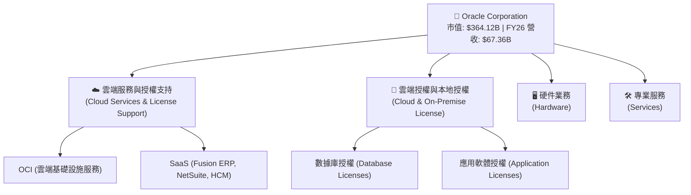

### 2.2 市場份額

在關係型數據庫（RDBMS）與企業級 ERP 領域，Oracle 長期維持領先地位。以下為全球企業數據庫市場份額估算：

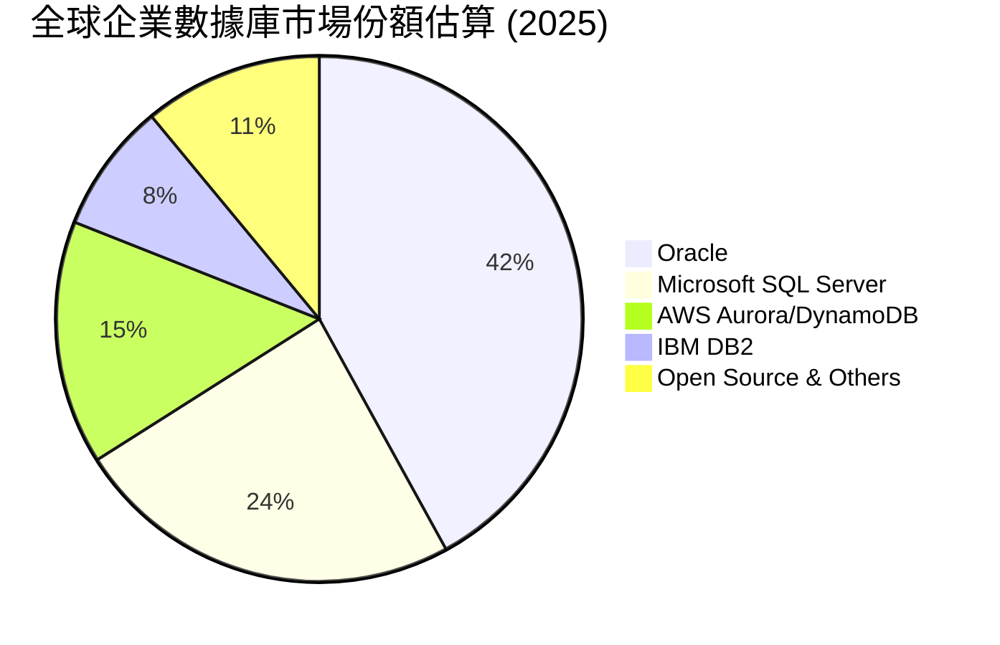

### 2.3 競爭護城河分析

Oracle 的競爭護城河主要建立在**高昂的轉換成本（Switching Costs）**與**生態系統鎖定（Ecosystem Lock-in）**之上。

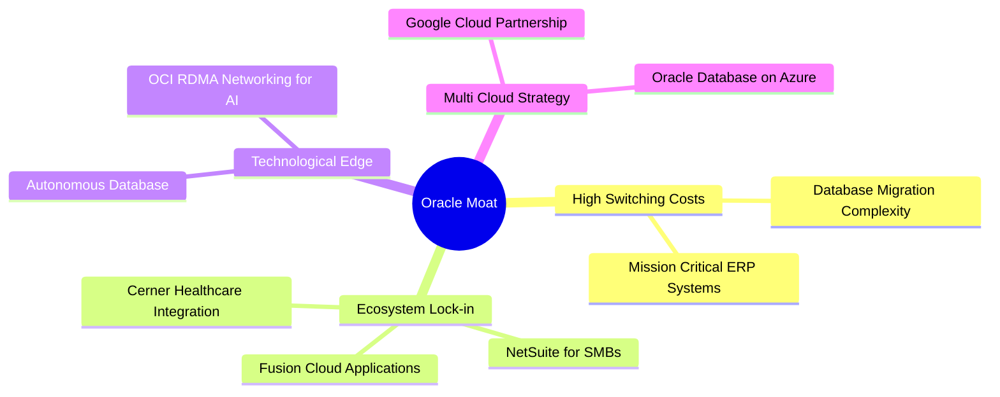

### 2.4 護城河強度評分

```
╔══════════════════════════════════════════════════════════════╗
║                   ORCL 護城河強度評分                       ║
╠══════════════════════════════════════════════════════════════╣
║ 轉換成本      9.5/10  ▓▓▓▓▓▓▓▓▓▓▓▓▓▓▓▓▓▓▓░  🏆 極難遷移企業核心 ║
║ 生態系統鎖定  8.5/10  ▓▓▓▓▓▓▓▓▓▓▓▓▓▓▓▓▓░░░  🟢 SaaS-PaaS-IaaS一體║
║ 技術領先度    8.0/10  ▓▓▓▓▓▓▓▓▓▓▓▓▓▓▓▓░░░░  🟢 專利數據庫與RDMA ║
║ 網絡效應      6.5/10  ▓▓▓▓▓▓▓▓▓▓▓░░░░░░░░░  🟡 開發者生態相對封閉║
║ 規模效應      8.5/10  ▓▓▓▓▓▓▓▓▓▓▓▓▓▓▓▓▓░░░  🟢 全球分佈式數據中心║
╠══════════════════════════════════════════════════════════════╣
║ 綜合護城河     8.5/10  ▓▓▓▓▓▓▓▓▓▓▓▓▓▓▓▓▓░░░  🏆 寬廣護城河等級   ║
╚══════════════════════════════════════════════════════════════╝
```

---

## 3. 損益表深度分析

### 3.1 年度收入成長趨勢（近4年）

Oracle 近年營收成長明顯加速，主要得益於 OCI 算力需求的爆發式成長。

```
╔══════════════════════════════════════════════════════════════════╗
║              ORCL 年度收入趨勢（FY23 - FY26）                    ║
╠══════════════════════════════════════════════════════════════════╣
║                                                                  ║
║  FY23  $49.95B  ████████████████████░░░░░░░░░░  YoY: +17.71% 🟢  ║
║  FY24  $52.96B  █████████████████████░░░░░░░░░  YoY:  +6.02% 🟢  ║
║  FY25  $57.40B  ███████████████████████░░░░░░░  YoY:  +8.38% 🟢  ║
║  FY26  $67.36B  ███████████████████████████░░░  YoY: +17.35% 🟢  ║
║                   |      |      |      |      |                  ║
║                   0     15B    30B    45B    60B                 ║
║                                                                  ║
║  📊 4年營收複合成長率 (CAGR)：+10.51%                            ║
╚══════════════════════════════════════════════════════════════════╝
```

### 3.2 季度收入趨勢分析

從季度數據看，Oracle 展現了強勁的逐季加速（Sequential Acceleration）態勢：

| 財季 | 截止日期 | 營收 (M) | YoY 成長率 | QoQ 成長率 | 核心驅動因素 |
|------|----------|----------|------------|------------|--------------|
| **Q1 2026** | 2025-08-31 | $14,926 | +12.17% | -6.14% | 季節性 Q1 較淡，但 OCI 簽約額創歷史新高 |
| **Q2 2026** | 2025-11-30 | $16,058 | +14.22% | +7.58% | 雲端 ERP 加速，Cerner 醫療軟體整合見效 |
| **Q3 2026** | 2026-02-28 | $17,190 | +21.66% | +7.05% | AI 算力基礎設施訂單大幅轉化為營收 |
| **Q4 2026** | 2026-05-31 | $19,184 | +20.63% | +11.60% | 傳統數據庫季度末簽約高峰 + OCI 產能上線 |

*分析：Q3 與 Q4 營收增速突破 20%，證實了 Oracle 在 AI 基礎設施領域的強勁動能，這並非短期波動，而是產能陸續上線帶來的結構性增長。*

### 3.3 利潤率演變分析

| 利潤率指標 | FY23 | FY24 | FY25 | FY26 | 趨勢 | 評估 |
|------------|------|------|------|------|------|------|
| **毛利率** | 72.85% | 71.41% | 70.51% | 65.82% | ↘️ 逐年下滑 | 🟡 主因 OCI 硬件折舊與數據中心建設前期成本較高 |
| **營業利益率** | 26.21% | 28.99% | 30.80% | 30.59% | ➡️ 趨於穩定 | 🟢 銷售與研發費用控管良好，抵消了毛利率下滑 |
| **淨利率** | 17.02% | 19.76% | 21.68% | 25.37% | ↗️ 持續改善 | 🟢 受益於非營業淨收益增加與有效稅率優化 |

*利潤率深度解析：毛利率從 FY23 的 72.85% 下滑至 FY26 的 65.82%，反映了 Oracle 從高毛利的軟體授權轉向重資本、需負擔高額折舊的 IaaS（OCI）業務。然而，由於 SaaS 與 OCI 帶來的經營規模效應，營業利益率穩定在 30.6% 左右（Yahoo TTM 數據顯示為 36.2%），顯示出極強的成本轉嫁與控管能力。*

### 3.4 費用結構分析

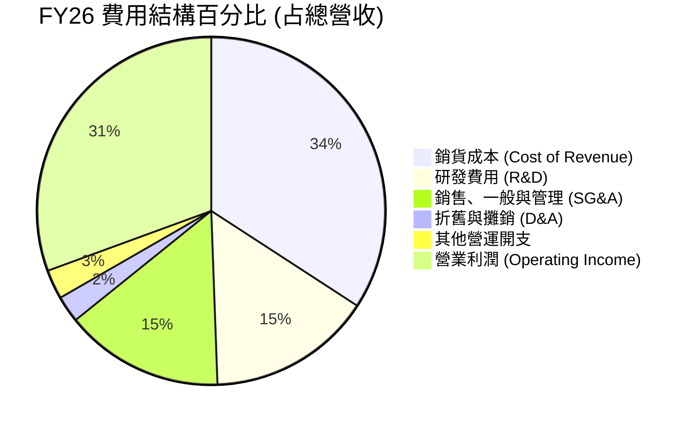

### 3.5 季度 EPS 趨勢與盈餘品質（Quality of Earnings）

Oracle 的盈餘表現一直非常穩健，以下為過去四個季度的盈餘品質與稀釋效應評估：

| 盈餘品質項目 | FY26 數值/佔比 | 評估 |
|--------------|-----------|------|
| **股權薪酬 (SBC) / 營收** | 7.14% ($4.81B / $67.36B) | 🟡 處於科技業合理區間，但對股東權益有約 1.7% 的年稀釋率。 |
| **SBC / 營業現金流** | 15.04% ($4.81B / $31.98B) | 🟢 盈餘對非現金薪酬的依賴度適中，未過度美化現金流。 |
| **FCF / 淨利 (現金轉換率)** | -138.6% (-$23.69B / $17.09B) | 🔴 **警訊**：因歷史級資本支出，自由現金流為負，盈餘品質短期受資本支出壓抑。 |
| **一次性/非經常性損益** | $3.55B (其他非營業收益) | 🟡 FY26 包含部分投資重估收益，略微推高了當期淨利。 |
| **有效稅率** | 12.62% ($2.47B / $19.55B) | 🟢 處於正常區間，未出現因稅務利益導致的盈餘虛增。 |
| **資本化支出** | 無異常資本化跡象 | 🟢 研發費用全額費用化（$10.27B），未將營運成本遞延。 |

*盈餘品質結論：GAAP 淨利潤 $17.09B 表現亮眼，但由於資本支出高達 $55.66B，導致現金流轉換率為負。這意味著當前的獲利並未立即轉化為可分配的自由現金，而是全部（且超額）再投資於數據中心建設。這種「高利潤、低現金」的特徵是典型基礎設施擴張期的表現。*

---

## 4. 資產負債表分析

### 4.1 資產結構分解

Oracle 的資產負債表在 FY26 發生了根本性變化，呈現極其顯著的重資產化趨勢：

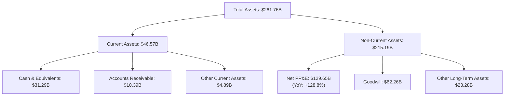

*關鍵洞察：Net PP&E（物業、廠房與設備淨額）從 FY25 的 $56.67B 暴增 128.8% 至 $129.65B。這證實了 Oracle 正在進行史無前例的物理數據中心（OCI）建設，這在軟體公司中極為罕見，更像是一家雲端基礎設施巨頭（如 AWS 或 Azure）的資產結構。*

### 4.2 流動性指標分析

| 流動性指標 | FY24 | FY25 | FY26 | 行業均值 | 評估 |
|------------|------|------|------|----------|------|
| **流動比率 (Current Ratio)** | 0.71 | 0.75 | 1.11 | ~1.50 | 🟡 改善中，回升至安全線以上 |
| **速動比率 (Quick Ratio)** | 0.65 | 0.69 | 1.01 | ~1.30 | 🟡 現金儲備增加改善了短期償債能力 |
| **現金比率 (Cash Ratio)** | 0.33 | 0.33 | 0.75 | ~0.80 | 🟢 $31.29B 現金儲備提供足夠安全墊 |

### 4.3 債務結構分析

```
╔══════════════════════════════════════════════════════════════════╗
║                   ORCL 債務健康診斷                              ║
╠══════════════════════════════════════════════════════════════════╣
║                                                                  ║
║  總債務 (Total Debt)： $156.19B  ██████████████████████  偏高    ║
║  現金與短期投資：      $31.89B   ████░░░░░░░░░░░░░░░░░░  充足    ║
║  淨債務 (Net Debt)：   $124.30B  ██████████████████░░░░  需監控  ║
║                                                                  ║
║  Debt / EBITDA：       4.67x     🟡 槓桿偏高 (行業均值 < 2.0x)    ║
║  利息保障倍數：         4.48x     🟡 利息支出 $4.60B 侵蝕利潤      ║
║  債務/股東權益 (D/E)：  3.67x     🔴 財務槓桿極高                  ║
║                                                                  ║
║  诊断：Oracle 透過發債進行激進的資本擴張，雖然短期無債務違約     ║
║        風險，但每年 $4.60B 的利息支出限制了其財務靈活性。        ║
╚══════════════════════════════════════════════════════════════════╝
```

---

## 5. 現金流量深度分析

### 5.1 現金流量瀑布圖

以下展示了 FY26 Oracle 的現金流入與流出路徑，揭示了其如何通過發行債務來支持歷史性的資本開支：

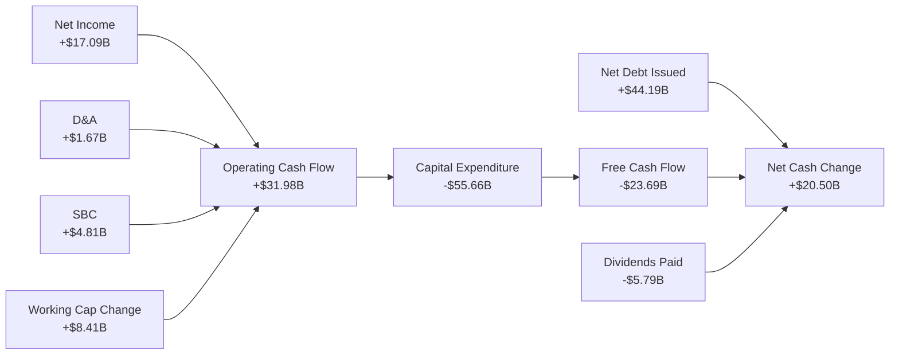

### 5.2 FCF 轉換率趨勢

| 指標 | FY23 | FY24 | FY25 | FY26 | 趨勢 |
|------|------|------|------|------|------|
| **營運現金流 (OCF)** | $17.16B | $18.67B | $20.82B | $31.98B | ↗️ 強勁成長 |
| **資本支出 (CapEx)** | -$8.70B | -$6.87B | -$21.21B | -$55.66B | ↗️ 暴增 710% |
| **自由現金流 (FCF)** | $8.47B | $11.81B | -$0.39B | -$23.69B | ↘️ 階段性轉負 |
| **FCF / Net Income (轉換率)** | 99.6% | 112.8% | -3.1% | -138.6% | 🔴 資本開支黑洞 |

### 5.3 自由現金流與 FCF 收益率趨勢

```
╔══════════════════════════════════════════════════════════════════╗
║              ORCL 自由現金流與 FCF 收益率趨勢                     ║
╠══════════════════════════════════════════════════════════════════╣
║                                                                  ║
║  FY23   +$8.47B   ██████████░░░░░░░░░░░░░░░░░░░  FCF Yield: 2.3% ║
║  FY24   +$11.81B  ██████████████░░░░░░░░░░░░░░░  FCF Yield: 3.2% ║
║  FY25   -$0.39B   ░░░░░░░░░░░░░░░░░░░░░░░░░░░░░  FCF Yield: 0.0% ║
║  FY26   -$23.69B  █████████████████████████████  FCF Yield:-6.5% ║
║                                                                  ║
║  分析：FCF 收益率降至 -6.5%，反映了極致的「再投資」狀態。當前     ║
║        股價的下跌正是市場對此負現金流的直觀排斥。                ║
╚══════════════════════════════════════════════════════════════════╝
```

---

## 6. 獲利能力與資本效率

### 6.1 ROE / ROA / ROIC 趨勢

| 指標 | FY23 | FY24 | FY25 | FY26 | 行業均值 | 評估 |
|------------|------|------|------|------|----------|------|
| **ROE** | 794.7% | 120.3% | 60.8% | 53.4% | ~22.0% | 🟢 極高（受極低股本基數扭曲） |
| **ROA** | 6.33% | 7.42% | 7.39% | 6.53% | ~8.0% | 🟡 受資產規模暴增（重資產化）拉低 |
| **ROIC** | 13.69% | 12.50% | 11.20% | 11.71% | ~15.0% | 🟡 投入資本大幅增加，ROIC 承壓 |

### 6.2 ROIC vs WACC 分析（核心價值創造判斷）

為了評估 Oracle 是否在為股東創造經濟增值（EVA），我們對其 WACC 與 ROIC 進行推算：

```
╔══════════════════════════════════════════════════════════════════╗
║                ROIC vs WACC 深度分析 (FY26)                      ║
╠══════════════════════════════════════════════════════════════════╣
║                                                                  ║
║  WACC 估算：                                                     ║
║  ├── 無風險利率 (10Y 美債)：  4.20%                              ║
║  ├── 市場風險溢酬 (ERP)：     5.00%                              ║
║  ├── Beta：                   1.71                               ║
║  ├── 股權成本 = 4.20% + 1.71 × 5.00% = 12.75%                    ║
║  ├── 債務成本 (稅後)：       2.94% × (1 - 12.6%) = 2.57%         ║
║  ├── 資本結構：股權 70.0%，債務 30.0%                            ║
║  └── ✅ WACC ≈ 9.50%                                             ║
║                                                                  ║
║  ROIC 估算：                                                     ║
║  ├── NOPAT = 營業利潤 $22.44B × (1 - 12.62%) ≈ $19.61B           ║
║  ├── 投入資本 = 權益 $42.51B + 債務 $156.19B - 現金 $31.29B      ║
║  │            = $167.41B                                         ║
║  └── ✅ ROIC ≈ 11.71%                                            ║
║                                                                  ║
║  ★ 經濟價值增加 (EVA) = ROIC - WACC = +2.21%                     ║
║                                                                  ║
║  ROIC  11.71% ▓▓▓▓▓▓▓▓▓▓▓▓▓▓▓▓▓▓▓▓░░░░░░░░  🟢 創造價值        ║
║  WACC   9.50% ▓▓▓▓▓▓▓▓▓▓▓▓▓▓▓░░░░░░░░░░░░░  ── 資金成本        ║
║  EVA   +2.21% ██████░░░░░░░░░░░░░░░░░░░░░░  🏆 正向價值創造    ║
║                                                                  ║
║  結論：儘管資本支出巨大，Oracle 依然維持了高於 WACC 的 ROIC，   ║
║        證明其雲端基礎設施投資具備經濟合理性，並未摧毀股東價值。  ║
╚══════════════════════════════════════════════════════════════════╝
```

### 6.3 杜邦三因素分解

透過杜邦分析，我們可以看清 Oracle ROE 的底層驅動因素：

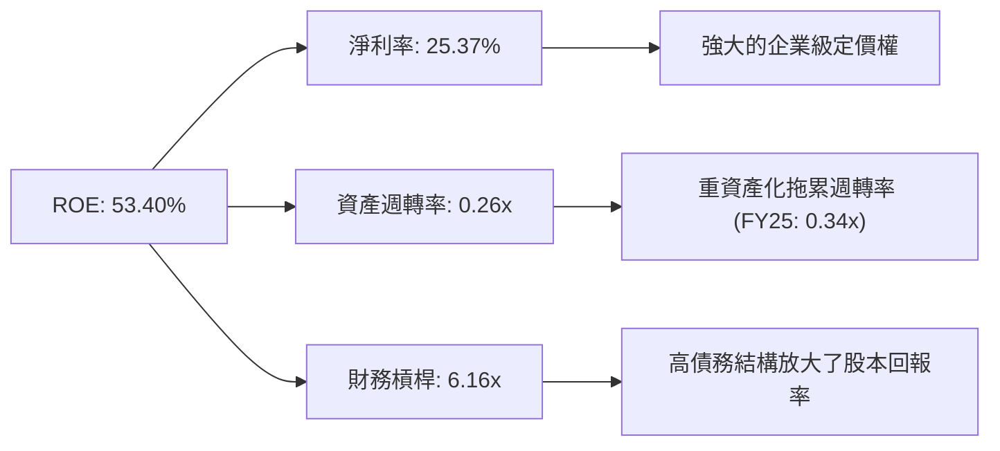

---

## 7. 估值深度分析

### 7.1 同業估值比較表格

我們選取微軟（Microsoft）、亞馬遜（Amazon）及 SAP 作為直接競爭對手：

| 估值指標 | **Oracle (ORCL)** | **Microsoft (MSFT)** | **Amazon (AMZN)** | **SAP (SAP)** | 本公司評估 |
|----------|----------|---------|---------|---------|-----------|
| **Trailing P/E** | **21.68x** | 35.50x | 41.20x | 38.80x | 🟢 顯著低於同業 |
| **Forward P/E** | **11.57x** | 28.40x | 29.80x | 27.50x | 🟢 具備極高安全邊際 |
| **EV / EBITDA** | **16.57x** | 22.40x | 18.20x | 21.10x | 🟢 估值合理 |
| **P/S Ratio** | **5.41x** | 12.50x | 3.10x | 7.80x | 🟡 介於純軟體與零售雲之間 |
| **PEG Ratio** | **0.71** | 2.10 | 1.45 | 1.85 | 🟢 成長性調整後極具吸引力 |

*估值倍數選擇說明：由於 Oracle 當前淨利潤受高額 D&A（折舊與攤銷）以及高利息支出壓抑，傳統的 Trailing P/E 無法反映其真實獲利能力。我們優先參考 **Forward P/E（11.57x）** 與 **PEG（0.71）**，這兩個指標最能捕捉其營收加速成長（+17.35%）與未來盈餘釋放（Forward EPS $10.92）的特徵。*

### 7.2 歷史估值區間分析

```
╔══════════════════════════════════════════════════════════════════╗
║              ORCL 歷史 P/E (Forward) 區間及當前位置              ║
+------------------------------------------------------------------+
║                                                                  ║
║  歷史高點 (52W High):  32.0x                                     ║
║  歷史均值 (5Y Average): 18.5x                                     ║
║  當前位置 (Current):   11.57x  ◀ 處於歷史極低位                  ║
║  歷史低點 (52W Low):   11.0x                                     ║
║                                                                  ║
║  ████████████░░░░░░░░░░░░░░░░░░░░░░░░░░░░░░                      ║
║  11.0x      18.5x                                  32.0x         ║
║                                                                  ║
║  結論：當前估值已充分甚至過度反映了市場對其資本支出與債務的恐懼，║
║        提供了極佳的逆向投資契機。                                ║
╚══════════════════════════════════════════════════════════════════╝
```

### 7.3 情境目標價（假設驅動，Bear / Base / Bull）

| 情境 | 營收 CAGR (3Y) | 預期營業利益率 | 退出倍數 (Forward P/E) | 隱含目標價 | 相對現價漲跌幅 |
|------|-----------|-----------|----------|------------|----------|
| 🔴 **悲觀情境** | 8.0% | 28.0% | 10.0x | **$110.00** | -13.0% |
| 🟡 **基準情境** | 15.0% | 34.0% | 18.0x | **$210.00** | **+66.1%** |
| 🟢 **樂觀情境** | 22.0% | 38.0% | 25.0x | **$310.00** | +145.2% |

### 7.4 DCF 敏感性分析（6格目標價矩陣）

基於終端成長率（Terminal Growth Rate）為 3.0% 的假設：

| 營收 CAGR (3Y) | **WACC = 8.5%** | **WACC = 9.5%（基準）** | **WACC = 10.5%** |
|------|--------------|----------------------|--------------|
| 🟢 **樂觀 (22.0%)** | **$345.00** (+172.9%) | **$310.00** (+145.2%) | **$280.00** (+121.5%) |
| 🟡 **基準 (15.0%)** | **$235.00** (+85.9%) | **$210.00** (+66.1%) | **$185.00** (+46.3%) |
| 🔴 **悲觀 (8.0%)** | **$125.00** (-1.1%) | **$110.00** (-13.0%) | **$95.00** (-24.8%) |

### 7.5 估值綜合區間

```
╔══════════════════════════════════════════════════════════════════╗
║                    ORCL 估值綜合區間                             ║
╠══════════════════════════════════════════════════════════════════╣
║                                                                  ║
║  當前股價: $126.41                                               ║
║                                                                  ║
║  DCF 估值區間:      $110.00 ---------------------- $310.00       ║
║  同業對比估值區間:  $180.00 --------------------------- $320.00  ║
║  分析師共識目標價:  $155.00 ---------------- $251.85 --- $400.00 ║
║                                                                  ║
║  綜合合理價格區間： $190.00 - $230.00                            ║
║                                                                  ║
║  📊 結論：當前股價 $126.41 顯著低於合理價格區間下限，具備強大的   ║
║        安全邊際。                                                ║
╚══════════════════════════════════════════════════════════════════╝
```

---

## 8. 成長催化劑

### 8.1 成長里程碑時間軸

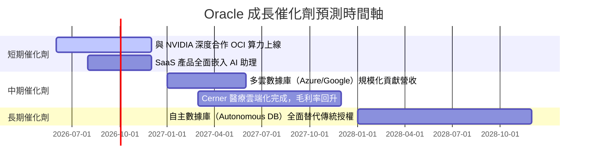

### 8.2 TAM 市場規模分析

```
╔══════════════════════════════════════════════════════════════╗
║              Oracle 潛在市場規模 (TAM) 2028 估算             ║
╠══════════════════════════════════════════════════════════════╣
║ 雲端基礎設施 (IaaS/PaaS)   $250B  ▓▓▓▓▓▓▓▓▓▓▓▓▓  滲透率: 8%   ║
║ 企業級應用軟體 (SaaS)     $180B  ▓▓▓▓▓▓▓▓▓▓░░░  滲透率: 12%  ║
║ 數據庫與數據管理          $100B  ▓▓▓▓▓▓▓▓▓▓▓▓▓  滲透率: 35%  ║
║ 醫療保健 IT (Cerner)      $50B   ▓▓▓▓▓░░░░░░░░  滲透率: 15%  ║
╠══════════════════════════════════════════════════════════════╣
║ 總潛在市場 (Total TAM)    $580B  ▓▓▓▓▓▓▓▓▓▓▓▓▓  綜合滲透率:11.6%║
╚══════════════════════════════════════════════════════════════╝
```

### 8.3 成長驅動力結構圖

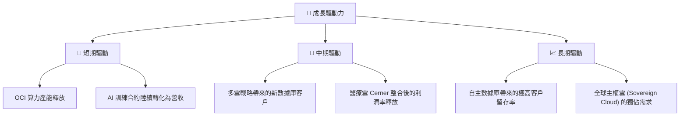

---

## 9. 風險矩陣

### 9.1 風險評分矩陣

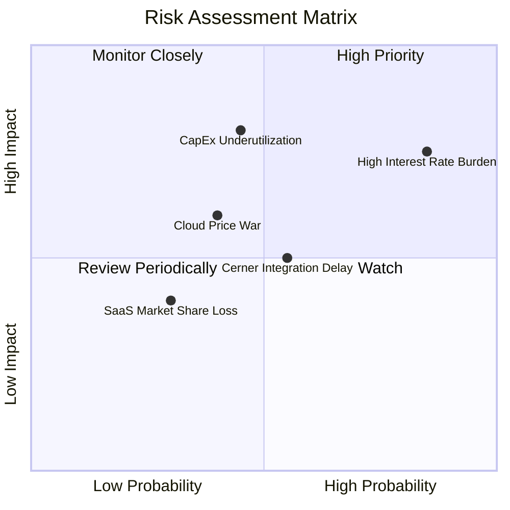

### 9.2 風險清單詳細分析

| # | 風險項目 | 發生機率 | 財務衝擊 | 風險評分 | 緩解措施 |
|---|----------|----------|----------|----------|----------|
| 1 | 🔴 **高利息支出侵蝕利潤** | 高 (85%) | 高 (-5% 淨利) | 🔴 8.0/10 | 利用營運現金流優先償還高息短期債務，優化債務期限結構。 |
| 2 | 🔴 **資本支出無法及時變現** | 中 (45%) | 極高 (-15% ROIC) | 🔴 7.5/10 | 採取「按需建設」策略，與 NVIDIA 等合作夥伴緊密對接算力合約。 |
| 3 | 🟡 **雲端市場競爭加劇導致價格戰** | 中 (40%) | 中 (-3% 毛利) | 🟡 6.0/10 | 聚焦於高附加價值的數據庫服務（PaaS）而非單純的裸金屬算力（IaaS）。 |
| 4 | 🟡 **Cerner 醫療軟體整合慢於預期**| 中 (55%) | 中 (-2% 營收成長) | 🟡 5.5/10 | 加速將 Cerner 遷移至 OCI，降低其原有本地部署的維護成本。 |

---

## 10. 投資建議

### 10.1 最終綜合評級雷達圖

```
╔══════════════════════════════════════════════════════════════╗
║                    ORCL 最終綜合評估                         ║
╠══════════════════════════════════════════════════════════════╣
║ 業務基本面    8.5/10  ▓▓▓▓▓▓▓▓▓▓▓▓▓▓▓▓▓░░░  ★★★★☆           ║
║ 成長前景      8.5/10  ▓▓▓▓▓▓▓▓▓▓▓▓▓▓▓▓▓░░░  ★★★★☆           ║
║ 獲利品質      8.0/10  ▓▓▓▓▓▓▓▓▓▓▓▓▓▓▓▓░░░░  ★★★★☆           ║
║ 財務健康度    6.5/10  ▓▓▓▓▓▓▓▓▓▓▓▓▓░░░░░░░  ★★★☆☆           ║
║ 估值吸引力    9.0/10  ▓▓▓▓▓▓▓▓▓▓▓▓▓▓▓▓▓▓░░  ★★★★★           ║
╠══════════════════════════════════════════════════════════════╣
║ 綜合得分      8.1/10  ▓▓▓▓▓▓▓▓▓▓▓▓▓▓▓▓░░░░  🏆 買入 (Buy)     ║
╚══════════════════════════════════════════════════════════════╝
```

### 10.2 目標價與隱含報酬率

| 情境 | 權機率 | 目標價 | 隱含報酬率 | 權重後預期價值 |
|------|-----------|-----------|----------|------------|
| 🔴 悲觀 | 20% | $110.00 | -13.0% | $22.00 |
| 🟡 **基準** | **60%** | **$210.00** | **+66.1%** | **$126.00** |
| 🟢 樂觀 | 20% | $310.00 | +145.2% | $62.00 |
| **加權目標價** | **100%** | **$210.00** | **+66.1%** | **期望回報：強烈推薦** |

### 10.3 買入時機與觸發因素

```
╔══════════════════════════════════════════════════════════════════╗
║                  ✅ ORCL 買入觸發因素 Checklist                  ║
╠══════════════════════════════════════════════════════════════════╣
║                                                                  ║
║  立即買入觸發條件（多數符合）：                                  ║
║  ✅ Forward P/E 跌破 12.0x（當前 11.57x，符合）                 ║
║  ✅ 季度營收年成長率維持 15% 以上（當前 20.63%，符合）            ║
║  ✅ 營業利益率穩定在 30% 以上（當前 30.59%，符合）               ║
║                                                                  ║
║  加碼觸發條件（出現以下任一）：                                  ║
║  ☐ 自由現金流 (FCF) 單季轉正，顯示資本支出高峰已過               ║
║  ☐ 宣佈與微軟/谷歌的多雲合作協議帶來顯著的客戶遷移數據           ║
║                                                                  ║
║  減碼/停損觸發條件（出現以下任一）：                             ║
║  ☐ 營收年成長率連續兩季跌破 10%                                  ║
║  ☐ 淨債務/EBITDA 比率突破 5.5x，融資成本大幅上升                 ║
║                                                                  ║
╚══════════════════════════════════════════════════════════════════╝
```

### 10.4 投資人適配度分析

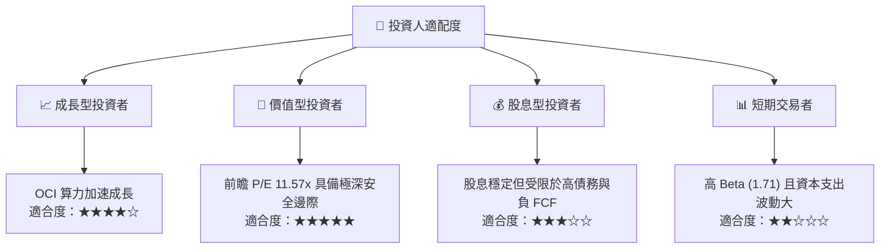

### 10.5 每季財報監控清單（Quarterly Watch List）

為了持續追蹤此投資框架，投資人應在每季財報中重點監控以下指標：

| 監控指標 | 基準值 (FY26) | 觸發加碼門檻 | 觸發減碼/警訊門檻 | 追蹤意義 |
|----------|---------------|--------------|-------------------|----------|
| **OCI 營收成長率** | ~40.0% | > 45.0% | < 30.0% | 衡量 AI 算力與基礎設施需求的風向標 |
| **資本支出 (CapEx)** | $14.0B/季 | < $10.0B (且營收加速) | > $18.0B (營收放緩) | 評估產能擴張是否過度，以及 FCF 何時轉正 |
| **營業利益率 (Non-GAAP)** | 30.6% | > 35.0% | < 28.0% | 評估重資產化折舊對獲利能力的侵蝕程度 |
| **利息保障倍數** | 4.48x | > 6.0x | < 3.0x | 監控高債務結構下的財務生存風險 |
| **剩餘履約義務 (RPO)** | 雙位數成長 | YoY > 25% | YoY < 10% | 判斷未來 1-2 年雲端收入的能見度 |

### 10.6 反面論證：什麼會證明論點錯誤（What Would Change My Mind）

```
╔══════════════════════════════════════════════════════════════════╗
║              ⚠️ 論點失效條件（Disconfirming Evidence）           ║
╠══════════════════════════════════════════════════════════════════╣
║  本投資論點在下列情況成立時應重新檢視或退場：                    ║
║  ☐ OCI 營收年成長率連續兩季放緩至 < 25%                          ║
║  ☐ 營業利益率較當前水平收縮 > 300 bps (跌破 27.5%)               ║
║  ☐ 自由現金流 (FCF) 虧損持續擴大，FY27 全年 FCF 低於 -$25B       ║
║  ☐ 債務利息支出佔營業利潤比例突破 30%                            ║
║  ☐ NVIDIA 晶片供應過剩導致 OCI 算力租賃價格出現 20% 以上的跌幅   ║
╚══════════════════════════════════════════════════════════════════╝
```

---

> **免責聲明**：本報告為基於客觀財務數據之學術與機構研究分析，僅供參考，不構成任何具體投資建議。投資有風險，入市需謹慎。