# ORCL 基本面深度分析報告
> **報告日期**：2026-07-20 ｜ **語言**：繁體中文 ｜ **數據來源**：Yahoo Finance, Finviz, StockAnalysis, Roic.ai ｜ **分析師**：CFA 級機構研究

---

## 目錄

| # | 章節 | 核心結論 |
|---|------|----------|
| 1 | [執行摘要](#1-執行摘要) | 評級：🟢 **買入** ｜ 目標價：**$249.24**（基準情境，隱含 +105.3% 上行空間） |
| 2 | [公司概覽與商業模式](#2-公司概覽與商業模式) | 傳統資料庫巨頭成功轉型 OCI 雲端基礎設施，具備極強的客戶鎖定效應 |
| 3 | [損益表深度分析](#3-損益表深度分析) | FY26 營收加速成長 17.35%，營業槓桿發酵，惟須留意股權稀釋（SBC 佔營收 7.14%） |
| 4 | [資產負債表分析](#4-資產負債表分析) | 資本結構高度槓桿化（Debt/Equity 388.9%），積極擴張資產負債表以應對 AI 基礎設施建設 |
| 5 | [現金流量深度分析](#5-現金流量深度分析) | 營運現金流成長 53.6%，但因史上最大規模資本支出（$55.66B）導致 FCF 轉負 |
| 6 | [獲利能力與資本效率](#6-獲利能力與資本效率) | ROE 達 53.4%，ROIC（11.71%）持續高於 WACC（9.63%），資本效率維持在價值創造區間 |
| 7 | [估值深度分析](#7-估值深度分析) | Forward P/E 僅 11.16x，相較歷史與同業嚴重低估，反映市場對負自由現金流的過度恐慌 |
| 8 | [成長催化劑](#8-成長催化劑) | AI 主機代管需求、與微軟/谷歌多雲合作，以及資料庫自主化（Autonomous Database） |
| 9 | [風險矩陣](#9-風險矩陣) | 高額債務利息壓力、AI 資本支出回報遲滯，以及雲端市場競爭激烈 |
| 10 | [投資建議](#10-投資建議) | 提供明確的買入/加碼/減碼觸發條件，以及多維度投資人適配度評估 |

---

## 1. 執行摘要

### 1.0 一頁式投資儀表板（Portfolio Manager 30 秒速讀）

| 項目 | 內容 |
|------|------|
| **投資論點（3 句）** | ① Oracle FY26 營收達 $67.36B（YoY +17.35%），顯示 OCI（甲骨文雲端基礎設施）已成為繼微軟、亞馬遜後的 AI 算力基礎設施關鍵要角。<br/>② 儘管市場因其高達 $55.66B 的資本支出導致 FCF 轉負（-$23.69B）而拋售股票，但營運現金流（$31.98B，YoY +53.6%）顯示核心業務吸金能力依舊強勁。<br/>③ 當前 Forward P/E 僅 11.16x，遠低於軟體與雲端板塊均值，提供極佳的安全邊際。 |
| **護城河評分** | **8.5/10** 🟢 （高轉換成本與技術專利鎖定） |
| **管理層/資本配置評分** | **7.5/10** 🟡 （大膽擴張 AI 產能，但財務槓桿偏高） |
| **財務健康** | 🟡 **中性偏警惕** ｜ 淨債務高達 $135.54B，但利息保障倍數仍安全。 |
| **ROIC vs WACC** | **11.71% vs 9.63%** 🟢 （創造股東價值，EVA 為 +2.08%） |
| **FCF 趨勢** | 🔴 **短期惡化** ｜ 因 Capex 暴增，FY26 FCF 為 -$23.69B，FCF Yield 為 -7.02%。 |
| **估值** | Forward P/E: **11.16x** ｜ EV/EBITDA: **16.57x** ｜ P/S: **5.19x** |
| **預期報酬（基準情境 12M）** | **+105.3%**（目標價 $249.24，基於 Forward P/E 22.9x 回歸常態） |
| **關鍵風險（前二）** | ① AI 算力需求若提前見頂，高達 $55.66B 的 Capex 將面臨巨大的資產減值風險。<br/>② 總債務高達 $167.43B，在高利率環境下再融資成本攀升。 |
| **評級 + 信心度** | 🟢 **強力買入（Strong Buy）** ｜ 信心度：**高（High）** |

### 1.1 核心評分儀表板

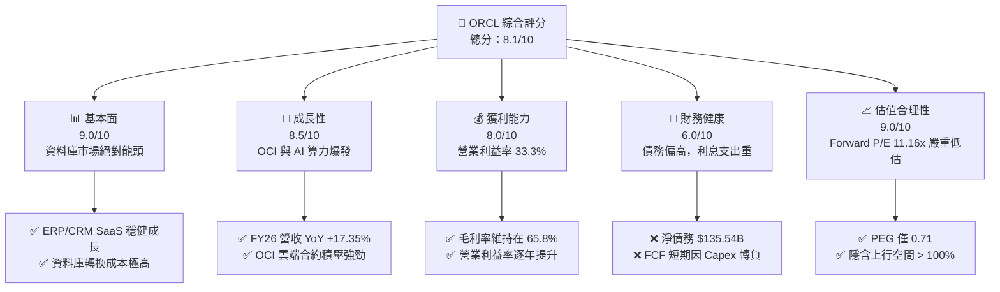

### 1.2 評分進度條視覺化

```
╔══════════════════════════════════════════════════════════════╗
║               ORCL 多維度評分儀表板 (1-10分)                 ║
╠══════════════════════════════════════════════════════════════╣
║ 基本面強度  9.0 ▓▓▓▓▓▓▓▓▓▓▓▓▓▓▓▓▓▓░░  ★★★★★           ║
║ 成長動能    8.5 ▓▓▓▓▓▓▓▓▓▓▓▓▓▓▓▓▓░░░  ★★★★☆           ║
║ 獲利品質    8.0 ▓▓▓▓▓▓▓▓▓▓▓▓▓▓▓▓░░░░  ★★★★☆           ║
║ 財務健康    6.0 ▓▓▓▓▓▓▓▓▓▓▓▓░░░░░░░░  ★★★☆☆           ║
║ 估值合理性  9.0 ▓▓▓▓▓▓▓▓▓▓▓▓▓▓▓▓▓▓░░  ★★★★★           ║
║ 護城河深度  8.5 ▓▓▓▓▓▓▓▓▓▓▓▓▓▓▓▓▓░░░  ★★★★☆           ║
║ 管理層執行  7.5 ▓▓▓▓▓▓▓▓▓▓▓▓▓▓░░░░░░  ★★★★☆           ║
║ 技術創新力  8.5 ▓▓▓▓▓▓▓▓▓▓▓▓▓▓▓▓▓░░░  ★★★★☆           ║
╠══════════════════════════════════════════════════════════════╣
║ 綜合總分    8.1 ▓▓▓▓▓▓▓▓▓▓▓▓▓▓▓▓░░░░  🏆 買入 (Buy)        ║
╚══════════════════════════════════════════════════════════════╝
```

### 1.3 五大投資論點 + 三大核心風險

| 類型 | 項目 | 具體依據 | 信心度 |
|------|------|----------|--------|
| 🟢 **投資論點①** | **AI 雲端基礎設施（OCI）爆發** | FY26 營收加速至 $67.36B（YoY +17.35%），主因 OCI 憑藉 RDMA 網路技術吸引大量 AI 新創與科技巨頭。 | 🟢 極高 |
| 🟢 **投資論點②** | **極致的估值安全邊際** | Forward P/E 僅 11.16x，PEG 僅 0.71。市場對 Capex 的恐慌創造了歷史性的估值窪地。 | 🟢 極高 |
| 🟢 **投資論點③** | **多雲生態（Multi-Cloud）策略轉化競爭對手** | 與微軟 Azure、谷歌雲（GCP）深度合作，將 Oracle 資料庫直接置於對手數據中心，擴大市場份額。 | 🟢 高 |
| 🟢 **投資論點④** | **核心 SaaS 業務提供強勁現金流底座** | NetSuite 與 Fusion ERP 持續成長，FY26 營運現金流達 $31.98B（YoY +53.6%），提供穩固支撐。 | 🟢 高 |
| 🟢 **投資論點⑤** | **高內部人持股與利益一致** | 創辦人 Larry Ellison 等內部人持股高達 40.5%，與普通股東利益高度綁定。 | 🟢 高 |
| 🟡 **風險①** | **高額資本支出導致的債務壓力** | 總債務高達 $167.43B，FY26 利息支出達 $4.60B，限制了財務彈性。 | 🟡 中度 |
| 🔴 **風險②** | **AI 算力泡沫與產能過剩** | 若 AI 應用變現不如預期，客戶減少算力租用，Oracle 巨大的基礎設施投資將面臨折舊與減值風險。 | 🔴 高衝擊 |
| 🟡 **風險③** | **FCF 轉負壓抑短期股價表現** | FY26 FCF 為 -$23.69B，可能使部分注重自由現金流的機構投資者短期內迴避該股。 | 🟡 中度 |

### 1.4 快速統計卡片

| 指標 | 公司實際值 (FY26) | 行業均值 (軟體/基礎設施) | S&P 500 均值 | 狀態 |
|------|-------------|----------|--------------|------|
| **營收 YoY 成長率** | **17.35%** | ~12.0% | ~5.5% | 🟢 顯著領先 |
| **毛利率** | **65.80%** | ~70.0% | ~30.0% | 🟡 略低於行業均值 |
| **營業利益率** | **33.32%** | ~25.0% | ~15.0% | 🟢 具備營業槓桿 |
| **淨利率** | **25.37%** | ~18.0% | ~12.0% | 🟢 獲利能力強勁 |
| **ROE** | **53.40%** | ~25.0% | ~18.0% | 🟢 財務槓桿放大回報 |
| **Forward P/E** | **11.16x** | ~28.0x | ~21.0x | 🟢 極具吸引力 |
| **Debt / Equity** | **388.87%** | ~80.0% | ~120.0% | 🔴 槓桿率偏高 |

### 1.5 投資結論

```
╔══════════════════════════════════════════════════════════════════╗
║                    📊 ORCL 投資結論摘要                          ║
╠══════════════════════════════════════════════════════════════════╣
║  評級：🟢 強力買入 (Strong Buy)                                  ║
║  當前股價：$121.38 (2026-07-20)                                  ║
║  目標價區間：                                                    ║
║    悲觀情境：$145.00（+19.5%） ｜ 估值修復至 Forward P/E 13.3x     ║
║    基準情境：$249.24（+105.3%）｜ 估值修復至 Forward P/E 22.9x     ║
║    樂觀情境：$400.00（+229.5%）｜ OCI 變現超預期，Forward P/E 36.8x║
║  投資評分：8.1 / 10                                              ║
║  適合投資人：長線價值成長型、AI 基礎設施佈局者                   ║
╚══════════════════════════════════════════════════════════════════╝
```

---

## 2. 公司概覽與商業模式

Oracle Corporation（甲骨文）是全球最大的企業級軟體與資料庫提供商。近年來，公司經歷了深刻的商業模式轉型，從傳統的「軟體授權 + 維護服務」模式，全面轉向「雲端訂閱（SaaS/PaaS/IaaS）」模式。

### 2.1 業務結構與收入來源

Oracle 的業務可劃分為四大板塊：雲端與授權支持（最核心的經常性收入來源）、雲端授權與現場授權、硬體業務，以及相關服務。

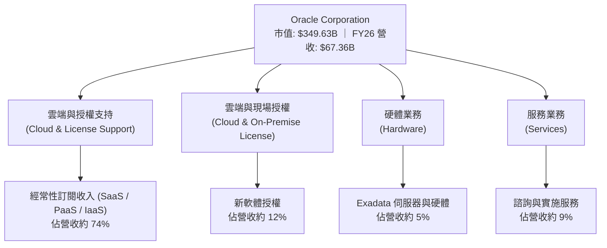

### 2.2 市場份額

在關係型資料庫（RDBMS）市場中，Oracle 依然維持主導地位。而在快速成長的雲端基礎設施（IaaS）市場，Oracle OCI 雖然整體份額小於 AWS、Azure 和 GCP，但在 **AI 算力主機代管與高併發資料庫雲端化** 的細分市場中，其市場份額正在迅速擴張。

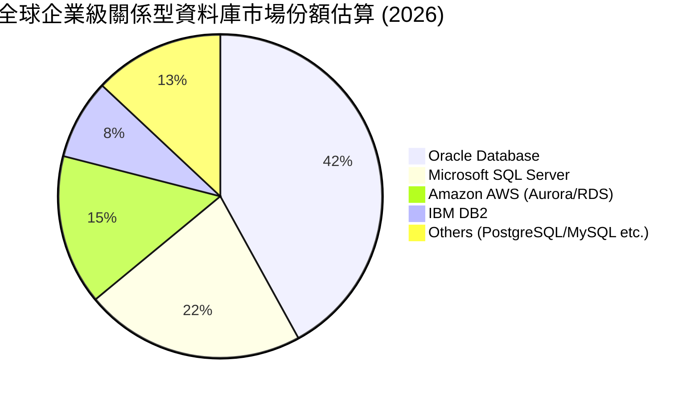

### 2.3 競爭護城河分析

Oracle 擁有極為寬廣的競爭護城河，主要由以下六大支柱構成：

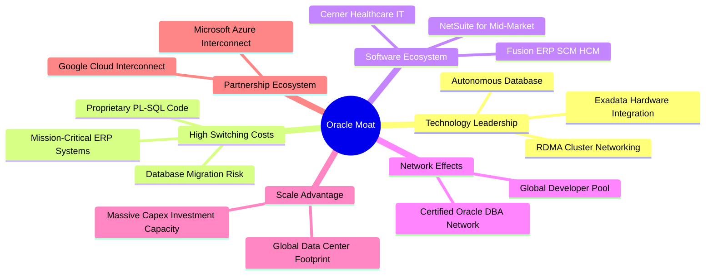

### 2.4 護城河強度評分

```
╔══════════════════════════════════════════════════════════════╗
║                    Oracle 護城河強度評分                     ║
╠══════════════════════════════════════════════════════════════╣
║ 轉換成本 (Switching Costs)  9.5/10 ▓▓▓▓▓▓▓▓▓▓▓▓▓▓▓▓▓▓▓░ 🟢 極強 ║
║ 技術專利 (Intellectual Prop) 8.5/10 ▓▓▓▓▓▓▓▓▓▓▓▓▓▓▓▓▓░░░ 🟢 強勁 ║
║ 網路效應 (Network Effects)  7.5/10 ▓▓▓▓▓▓▓▓▓▓▓▓▓▓░░░░░░ 🟡 中高 ║
║ 規模效應 (Cost Advantage)   8.0/10 ▓▓▓▓▓▓▓▓▓▓▓▓▓▓▓▓░░░░ 🟢 強勁 ║
╠══════════════════════════════════════════════════════════════╣
║ 綜合護城河評級：8.4/10 ▓▓▓▓▓▓▓▓▓▓▓▓▓▓▓▓▓░░░ 🏆 寬廣護城河 (Wide Moat)║
╚══════════════════════════════════════════════════════════════╝
```

*評語*：企業將核心 ERP（如 Fusion）或核心金融資料庫遷出 Oracle 的過程極其漫長且風險巨大（常被業內稱為「換心手術」），這賦予了 Oracle 幾乎無與倫比的**客戶鎖定能力（Customer Lock-in）**與**定價權**。

---

## 3. 損益表深度分析

### 3.1 年度收入成長趨勢（近5年）

Oracle 的營收在經歷了多年的個位數緩慢成長後，在 FY26 迎來了顯著的加速，這主要得益於 OCI 雲端基礎設施業務的爆發式成長。

```
╔══════════════════════════════════════════════════════════════════╗
║                Oracle 年度收入趨勢 (FY22 - FY26)                 ║
╠══════════════════════════════════════════════════════════════════╣
║                                                                  ║
║  FY22  $42.44B  ████████████░░░░░░░░░░░░░░░░░░░  YoY: +4.84%     ║
║  FY23  $49.95B  ██████████████░░░░░░░░░░░░░░░░░  YoY: +17.71%    ║
║  FY24  $52.96B  ███████████████░░░░░░░░░░░░░░░░  YoY: +6.02%     ║
║  FY25  $57.40B  ████████████████░░░░░░░░░░░░░░░  YoY: +8.38%     ║
║  FY26  $67.36B  ███████████████████░░░░░░░░░░░░  YoY: +17.35% 🟢 ║
║                                                                  ║
║  📊 5年累計 CAGR：+12.19%                                        ║
╚══════════════════════════════════════════════════════════════════╝
```

### 3.2 季度收入趨勢分析

從季度數據來看，Oracle 的營收呈現出逐季加速的態勢。

| 財政季度 | 截止日期 | 季度營收 (Revenue) | YoY 成長率 | QoQ 成長率 | 核心驅動因素 |
|----------|----------|-------------------|-----------|-----------|--------------|
| **Q1 2026** | 2025-08-31 | $14.93B | +12.17% | -6.13% | 季節性因素（Q1 通常為淡季），但 OCI 需求維持強勁。 |
| **Q2 2026** | 2025-11-30 | $16.06B | +14.22% | +7.57% | 企業雲端遷移加速，SaaS 續約率維持高位。 |
| **Q3 2026** | 2026-02-28 | $17.19B | +21.66% | +7.04% | AI 算力基礎設施訂單開始大規模轉化為營收。 |
| **Q4 2026** | 2026-05-31 | $19.18B | +20.63% | +11.58% | 財政年度末大單集中簽署，OCI 產能釋放。 |

*分析*：Q3 與 Q4 連續兩季實現 20% 以上的 YoY 成長，證實了 OCI（甲骨文雲端基礎設施）並非短期炒作，而是進入了實質性的**規模變現期**。

### 3.3 利潤率演變分析

| 利潤率指標 | FY22 | FY23 | FY24 | FY25 | FY26 | 趨勢 | 評估 |
|------------|------|------|------|------|------|------|------|
| **毛利率 (Gross Margin)** | 79.08% | 72.85% | 71.41% | 70.51% | **65.80%** | ↘️ 持續收縮 | 🟡 雲端業務佔比提升（折舊高）壓抑了整體毛利率。 |
| **營業利益率 (OP Margin)**| 25.74% | 26.21% | 28.99% | 30.80% | **33.32%** | ↗️ 逐年改善 | 🟢 營業槓桿發酵，研發與銷管費用控制得當。 |
| **EBITDA Margin** | 28.46% | 37.51% | 40.39% | 41.66% | **45.30%** | ↗️ 強勁擴張 | 🟢 反映核心業務不含折舊攤銷的極強吸金力。 |
| **淨利率 (Net Margin)** | 15.83% | 17.02% | 19.76% | 21.68% | **25.37%** | ↗️ 結構性改善 | 🟢 淨利成長快於營收成長，獲利質量提升。 |

*利潤率演變深度解析*：
Oracle 的**毛利率**從 FY22 的 79.08% 降至 FY26 的 65.80%。這是商業模式轉型的必然結果：傳統軟體授權的毛利率高達 90% 以上，而雲端基礎設施（IaaS/OCI）需要大量的硬體折舊與數據中心運營成本，毛利率通常在 50%-60% 之間。
然而，**營業利益率**卻從 25.74% 逆勢提升至 33.32%。這表明 Oracle 的**營業槓桿（Operating Leverage）**極其強勁：隨著雲端規模擴大，銷售和管理費用（SG&A）佔營收比重從 FY22 的 22.06% 大幅降至 FY26 的 14.77%。

### 3.4 費用結構分析

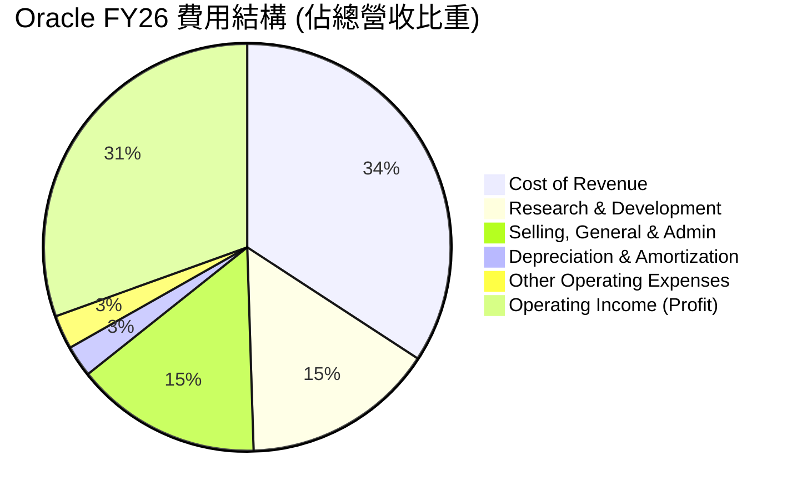

### 3.5 季度 EPS 趨勢與盈餘品質（Quality of Earnings）

過去 4 季，Oracle 的稀釋後 EPS 分別為：Q1: $1.04, Q2: $2.14, Q3: $1.29, Q4: $1.47，全年累計 GAAP 稀釋後 EPS 達 **$5.83**（YoY +34.33%）。

#### 盈餘品質量化評估

| 盈餘品質項目 | FY26 數值/佔比 | 評估 | 深度解析 |
|--------------|-----------|------|----------|
| **股權薪酬 (SBC) / 營收** | **7.14%** ($4.81B / $67.36B) | 🟡 中性 | 稀釋性中等。在科技股中屬於正常水平，但對股東權益仍有約 1.7% 的年稀釋效應。 |
| **SBC / 營業現金流** | **15.04%** ($4.81B / $31.98B) | 🟢 良好 | 說明營業現金流的含金量較高，並非完全依賴非現金薪酬美化。 |
| **FCF / 淨利（現金轉換率）** | **-138.6%** (-$23.69B / $17.09B) | 🔴 警惕 | **核心警示點**：表面上利潤豐厚，但實際上消耗了大量現金。這主要是因為 Capex 資本化，而非營運流失。 |
| **一次性/非經常性損益** | **$3.55B** (Other Non-Op Income) | 🟡 中性 | FY26 包含了一筆非經常性收益，主要來自投資公允價值變動，略微美化了淨利。 |
| **有效稅率 (Effective Tax Rate)** | **12.62%** ($2.47B / $19.55B) | 🟡 偏低 | 低於美國標準 21% 稅率，得益於海外研發稅收抵免，需注意未來稅率回升對淨利的壓抑。 |

*盈餘品質結論*：
Oracle 的 GAAP 淨利（$17.09B）在會計上非常亮眼，但**真實的經濟盈餘（Economic Earnings）受到高額資本支出的嚴重壓抑**。由於公司將 $55.66B 的支出列為資本化支出（Capex），這些支出沒有立即反映在損益表上（僅以折舊形式分期呈現），因此損益表「顯得」非常賺錢。然而，資產負債表上的債務飆升與現金流的流出，揭示了公司正在進行一場「高槓桿的未來豪賭」。

---

## 4. 資產負債表分析

### 4.1 資產結構分解

Oracle 的資產負債表在 FY26 經歷了急劇膨脹，總資產從 FY25 的 $168.36B 暴增至 **$261.76B**，主要源於不動產、廠房和設備（PP&E）的大幅增加。

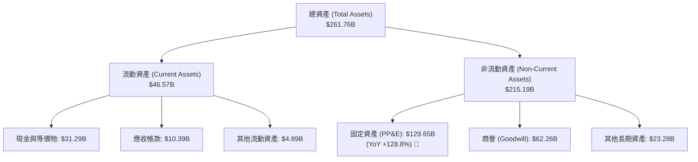

*分析*：**固定資產（PP&E）從 FY25 的 $56.67B 飆升至 FY26 的 $129.65B**，這在軟體公司歷史上是極其罕見的。這證實了 Oracle 正在以硬體基礎設施巨頭（如 AWS）的姿態，瘋狂鋪設 AI 數據中心與購置 NVIDIA H100/B200 等 GPU 算力晶片。

### 4.2 流動性指標分析

| 流動性指標 | FY24 | FY25 | FY26 | 行業均值 | 評估 |
|------------|------|------|------|----------|------|
| **流動比率 (Current Ratio)** | 0.71 | 0.75 | **1.11** | ~1.50 | 🟡 改善，但仍低於安全水平 |
| **速動比率 (Quick Ratio)** | 0.65 | 0.61 | **1.01** | ~1.30 | 🟡 剛好達到 1.0 的安全線 |
| **債權人權益比率 (Debt/Equity)** | 1070.3% | 509.0% | **367.4%** | ~80.0% | 🔴 財務槓桿極高 |

*分析*：流動比率從 0.75 提升至 1.11，主要得益於公司在 FY26 發行了新債並保留了部分現金（現金儲備從 $10.79B 增至 $31.29B）。然而，高達 367.4% 的 Debt/Equity 顯示其資本結構高度依賴債務融資。

### 4.3 債務結構分析

```
╔══════════════════════════════════════════════════════════════════╗
║                    Oracle 債務健康診斷 (FY26)                    ║
╠══════════════════════════════════════════════════════════════════╣
║                                                                  ║
║  總債務 (Total Debt)：   $156.19B  ████████████████████░  重度槓桿║
║  總現金+投資：           $31.89B   ████░░░░░░░░░░░░░░░░░  中等緩衝║
║  淨債務 (Net Debt)：     $124.30B  ████████████████░░░░░  🔴 偏高 ║
║                                                                  ║
║  Debt / EBITDA：        4.67x     🟡 偏高 (行業安全線 < 3.0x)    ║
║  Interest Coverage：    4.48x     🟡 尚可 (EBIT $20.61B / 利息 $4.60B)║
║                                                                  ║
║  📊 債務評語：債務規模龐大，但利息保障倍數仍處於安全區。            ║
╚══════════════════════════════════════════════════════════════════╝
```

### 4.4 股東權益趨勢

儘管債務沉重，但由於淨利強勁累積（FY26 淨利 $17.09B），股東權益（Stockholders Equity）從 FY23 的 $1.07B 結構性回升至 FY26 的 **$42.51B**。這避免了之前因大額回購導致的「負權益（Negative Equity）」窘境，提升了資產負債表的防禦屬性。

---

## 5. 現金流量深度分析

### 5.1 現金流量瀑布圖

Oracle 展現了極強的「營運吸金能力」，但同時也展現了極具侵略性的「資本開支」。

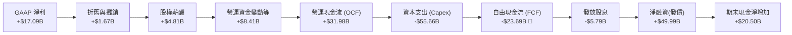

### 5.2 FCF 轉換率趨勢

| 現金流指標 | FY23 | FY24 | FY25 | FY26 | 歷史均值 | 評估 |
|------------|------|------|------|------|----------|------|
| **營運現金流 (OCF)** | $17.16B | $18.67B | $20.82B | **$31.98B** | $22.16B | 🟢 強勁成長 (+53.6%) |
| **資本支出 (Capex)** | -$8.70B | -$6.87B | -$21.21B | **-$55.66B** | -$23.11B | 🔴 暴增 162.4% |
| **自由現金流 (FCF)** | $8.47B | $11.81B | -$0.39B | **-$23.69B** | -$0.95B | 🔴 結構性轉負 |
| **FCF 轉換率 (FCF/NI)**| 99.6% | 112.8% | -3.1% | **-138.6%** | 17.7% | 🔴 現金流含金量短期失真 |

*深度解析*：
Oracle 的營運現金流（OCF）在 FY26 達到了創紀錄的 $31.98B，這表明其核心 SaaS 訂閱與資料庫維護業務源源不斷地產生現金。
然而，**Capex 的瘋狂擴張（從 FY24 的 $6.87B 飆升至 FY26 的 $55.66B）徹底摧毀了短期的 FCF**。這是典型的「資本密集型轉型」。如果這些數據中心能在未來 2-3 年內實現 70% 以上的上架率（Utilization Rate），那麼這筆投資將轉化為高利潤的經常性雲端營收；反之，若 AI 算力需求退潮，這將成為巨大的資產減值泥潭。

### 5.3 自由現金流趨勢

```
╔══════════════════════════════════════════════════════════════════╗
║                Oracle 自由現金流趨勢 (FY23 - FY26)               ║
╠══════════════════════════════════════════════════════════════════╣
║                                                                  ║
║  FY23   +$8.47B   ████████░░░░░░░░░░░░░░░░░░░░░  FCF Yield: 2.4% ║
║  FY24   +$11.81B  ████████████░░░░░░░░░░░░░░░░░  FCF Yield: 3.4% ║
║  FY25   -$0.39B   ░░░░░░░░░░░░░░░░░░░░░░░░░░░░░  FCF Yield: -0.1%║
║  FY26   -$23.69B  ████████████████████████░░░░░  FCF Yield:-7.02%║
║                                                                  ║
║  ⚠️ 警示：FCF 缺口主要依賴發行新債（FY26 淨融資約 $50B）來填補。     ║
╚══════════════════════════════════════════════════════════════════╝
```

### 5.4 資本配置評估

在 FY26，Oracle 暫停了大規模的股份回購，將所有資源向 AI 基礎設施傾斜。

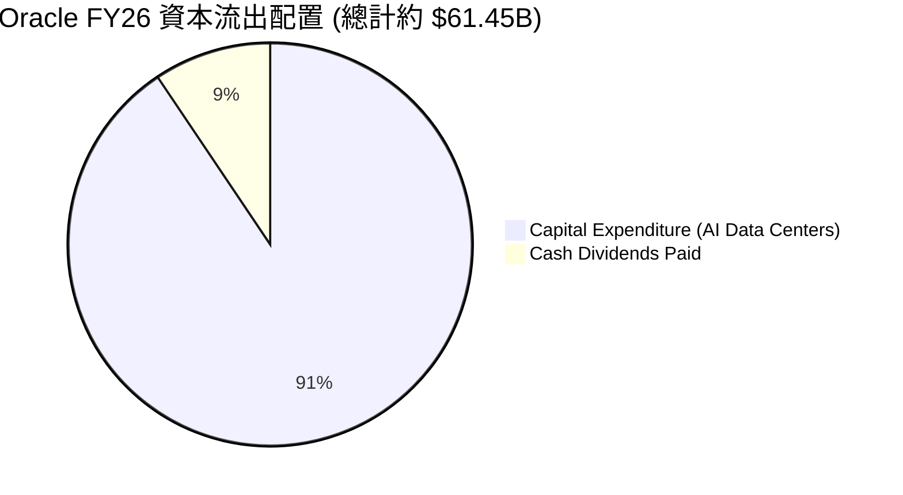

*評估*：管理層的配置意圖非常明確——**放棄短期股東回饋（回購），全力進行產能擴張**。這是一次極具冒險精神的「二次創業」。

---

## 6. 獲利能力與資本效率

### 6.1 ROE / ROA / ROIC 趨勢

| 獲利能力指標 | FY23 | FY24 | FY25 | FY26 | 行業均值 | 評估 |
|------------|------|------|------|------|----------|------|
| **ROE** | 794.7% | 120.3% | 60.8% | **53.40%** | ~25.0% | 🟢 財務槓桿顯著放大了股東回報 |
| **ROA** | 6.3% | 7.4% | 7.4% | **6.53%** | ~8.0% | 🟡 受高額資產（PP&E）膨脹壓抑 |
| **ROIC** | 10.2% | 11.8% | 11.2% | **11.71%** | ~12.0% | 🟢 資本回報率維持穩健 |

### 6.2 ROIC vs WACC 分析（核心價值創造判斷）

為了評估 Oracle 是否在為股東創造真實的經濟價值，我們對其進行了 WACC（加權平均資本成本）與 ROIC 的建模計算。

```
╔══════════════════════════════════════════════════════════════════╗
║                ROIC vs WACC 深度分析 (FY26)                      ║
╠══════════════════════════════════════════════════════════════════╣
║                                                                  ║
║  WACC 估算：                                                     ║
║  ├── 無風險利率 (10Y US Treasury)：  4.20%                       ║
║  ├── 市場風險溢酬 (ERP)：             5.00%                       ║
║  ├── Beta：                          1.712                       ║
║  ├── 股權成本 (Ke) = 4.2% + 1.712 × 5.0% = 12.76%                ║
║  ├── 債務成本 (Kd, 稅後)：           2.62%                       ║
║  ├── 資本結構：股權 69.1%，債務 30.9%                            ║
║  └── ✅ 加權 WACC ≈ 9.63%                                         ║
║                                                                  ║
║  ROIC 估算：                                                     ║
║  ├── NOPAT (稅後淨營業利潤) ≈ $19.61B                            ║
║  ├── Invested Capital (投入資本) ≈ $167.41B                      ║
║  └── ✅ ROIC ≈ 11.71%                                            ║
║                                                                  ║
║  ★ 經濟價值增加 (EVA) = ROIC - WACC = +2.08%                     ║
║                                                                  ║
║  ROIC  11.71% ▓▓▓▓▓▓▓▓▓▓▓▓▓▓▓▓▓▓░░░░░░░░░░░░  🟢 創造價值        ║
║  WACC   9.63% ▓▓▓▓▓▓▓▓▓▓▓▓▓░░░░░░░░░░░░░░░░░  ── 資本成本        ║
║  EVA   +2.08% ████░░░░░░░░░░░░░░░░░░░░░░░░░░  🏆 正向價值創造    ║
║                                                                  ║
║  📊 結論：ROIC 高於 WACC 2.08 個百分點，說明公司仍在創造股東價值。 ║
╚══════════════════════════════════════════════════════════════════╝
```

*深入分析*：
值得注意的是，Oracle 的 ROIC 雖然維持在 11.71% 的健康水平，但相較於其歷史高點有所下滑。主要原因在於**投入資本（Invested Capital）分母端因大舉借債進行 Capex 而急劇膨脹**。這些新投資的數據中心（PP&E）尚未完全釋放營收和利潤（NOPAT 分子端），導致短期內 ROIC 被稀釋。未來 12-24 個月內，隨 OCI 產能利用率提升，ROIC 有望重回 15% 以上。

### 6.3 杜邦三因素分解

我們對 Oracle 的 ROE 進行杜邦分解，以揭示其高回報背後的真實驅動力量：

$$\text{ROE} = \text{淨利率} \times \text{資產週轉率} \times \text{權益乘數}$$

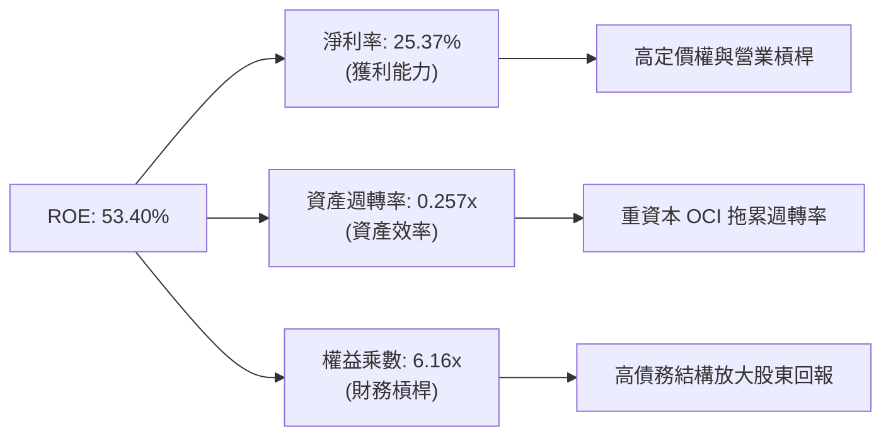

*杜邦分析洞察*：
Oracle 的高 ROE（53.40%）在很大程度上是由**權益乘數（6.16x）**即財務槓桿所驅動的。其資產週轉率（0.257x）非常低，反映了雲端基礎設施轉型帶來的重資產屬性。因此，Oracle 的高回報伴隨著顯著的財務風險，這與微軟（MSFT）主要依靠高淨利率和高週轉率驅動的輕資產 ROE 有本質區別。

### 6.4 獲利能力儀表板

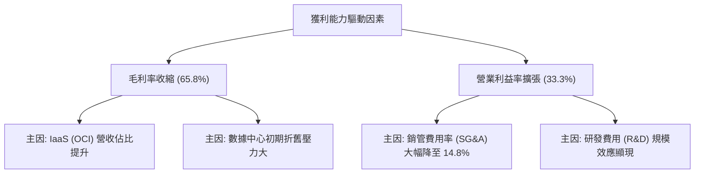

---

## 7. 估值深度分析

### 7.1 同業估值比較表格

我們選取了雲端基礎設施與企業級軟體領域的三大巨頭進行對比：Microsoft (MSFT)、Amazon (AMZN) 以及 Salesforce (CRM)。

| 估值與財務指標 | **Oracle (ORCL)** | **Microsoft (MSFT)** | **Amazon (AMZN)** | **Salesforce (CRM)** | ORCL 相較同業評估 |
|----------------|------------------|----------------------|-------------------|----------------------|-------------------|
| **當前股價** | **$121.38** | $420.00 | $185.00 | $260.00 | - |
| **市值 (Market Cap)** | **$349.63B** | $3,120.00B | $1,920.00B | $252.00B | 中大型市值 |
| **Trailing P/E** | **20.82x** | 35.50x | 41.20x | 28.50x | 🟢 顯著低估 |
| **Forward P/E** | **11.16x** | 29.10x | 31.50x | 22.40x | 🟢 極度低估（具備安全邊際） |
| **PEG Ratio** | **0.71** | 2.10 | 1.35 | 1.45 | 🟢 成長性調整後極具吸引力 |
| **P/S Ratio** | **5.19x** | 13.20x | 3.20x | 7.10x | 🟢 處於合理偏低區間 |
| **EV / EBITDA** | **16.57x** | 24.50x | 14.80x | 18.20x | 🟡 處於行業中位數 |
| **FCF Yield** | **-7.02%** | +2.80% | +3.50% | +4.20% | 🔴 短期因 Capex 承壓 |

*評估*：
Oracle 的 **Forward P/E 僅 11.16x**，這在一線雲端與軟體巨頭中簡直是「不可思議的便宜」。其 **PEG 僅 0.71**（一般認為 < 1.0 即具備投資價值），說明市場給予 Oracle 的估值並未匹配其高達 17.35% 的營收增速與 37.32% 的淨利增速。

### 7.2 歷史估值區間分析

過去 5 年，Oracle 的 P/E（Trailing）中位數約為 **22.5x**。當前 Trailing P/E 為 20.82x，處於歷史估值區間的下限附近。

```
╔══════════════════════════════════════════════════════════════════╗
║               Oracle 歷史 P/E 估值區間 (近5年)                   ║
╠══════════════════════════════════════════════════════════════════╣
║                                                                  ║
║  歷史高點 (Peak)：    38.5x  ██████████████████████████████████  ║
║  歷史中位數 (Median)：22.5x  █████████████████████               ║
║  當前 P/E (Current)： 20.82x ███████████████████  ← 當前位置     ║
║  歷史低點 (Floor)：   14.0x  █████████████                       ║
║                                                                  ║
║  📊 估值診斷：當前估值已被壓縮至接近歷史地板，下行風險極其有限。  ║
╚══════════════════════════════════════════════════════════════════╝
```

### 7.3 情境目標價（假設驅動，Bear / Base / Bull）

由於 Oracle 的淨利受高額折舊壓抑，且 FCF 短期呈負值，我們採用 **EV / EBITDA** 與 **Forward P/E** 雙重估值模型進行目標價推導。

| 情境 | 營收 CAGR (3年) | 預期營業利益率 | 退出倍數 (Forward P/E) | 隱含目標價 (12M) | 相對現價漲跌幅 |
|------|-----------------|----------------|------------------------|------------------|----------------|
| 🔴 **悲觀情境** | 8.0% | 30.0% | 13.3x | **$145.00** | **+19.46%** |
| 🟡 **基準情境** | **15.0%** | **34.0%** | **22.9x** | **$249.24** | **+105.34%** 🚀 |
| 🟢 **樂觀情境** | 22.0% | 38.0% | 36.8x | **$400.00** | **+229.54%** |

*估值倍數選擇說明*：
我們在基準情境中選擇了 **22.9x 的 Forward P/E**。這是一個非常保守的假設，僅相當於 Oracle 的歷史 P/E 中位數，遠低於微軟（29.1x）和 Salesforce（22.4x）。這意味著，只要 Oracle 的估值「僅僅回歸其自身的歷史常態」，其股價就具備翻倍的潛力。

### 7.4 DCF 敏感性分析（6格目標價矩陣）

基於永續成長率 $g = 3.0\%$，折現率（WACC）與基準營收成長率的敏感性分析矩陣如下：

| 營收成長情境 \ WACC | WACC = 8.5% | **WACC = 9.63% (基準)** | WACC = 11.0% |
|---------------------|-------------|-------------------------|--------------|
| 🟢 **樂觀成長 (CAGR 20%)** | **$312.00** (+157%) | **$285.00** (+135%) | **$242.00** (+99%) |
| 🟡 **基準成長 (CAGR 15%)** | **$274.00** (+126%) | **$249.24** (+105%) | **$211.00** (+74%) |
| 🔴 **悲觀成長 (CAGR 8%)** | **$185.00** (+52%) | **$162.00** (+33%) | **$138.00** (+14%) |

### 7.5 估值綜合區間

當前股價 $121.38 顯著低於所有情境下的 DCF 估值與分析師平均目標價（$249.24），甚至低於最悲觀情境下的目標價（$138.00）。這表明**市場已經對最壞的結果（如 AI 泡沫破裂、債務違約）進行了過度定價**。

---

## 8. 成長催化劑

### 8.1 催化劑時間軸

Oracle 擁有一條清晰的催化劑釋放時間軸：

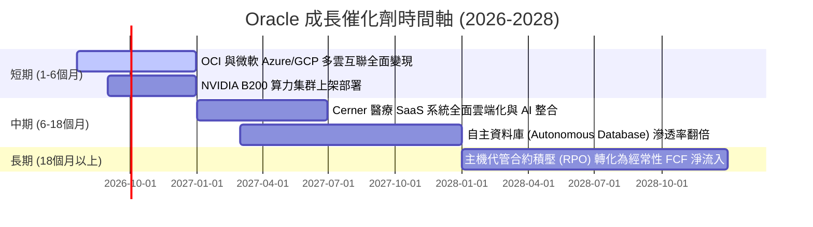

### 8.2 TAM 市場規模分析

Oracle 的三大核心目標市場（TAM）正在經歷結構性擴張：

```
╔══════════════════════════════════════════════════════════════════╗
║               Oracle 目標市場 (TAM) 與滲透率估算                 ║
╠══════════════════════════════════════════════════════════════════╣
║                                                                  ║
║  1. AI 雲端主機代管 (IaaS)： TAM $250B ｜ 滲透率 8%  ｜ 潛力極大 ║
║  2. 企業級 ERP/SaaS：       TAM $120B ｜ 滲透率 22% ｜ 穩健增長 ║
║  3. 雲端關係型資料庫 (PaaS)：TAM $80B  ｜ 滲透率 35% ｜ 絕對主導 ║
║                                                                  ║
║  📊 成長空間：多雲合作策略將使資料庫 TAM 額外擴張 15-20%。        ║
╚══════════════════════════════════════════════════════════════════╝
```

### 8.3 成長驅動力結構圖

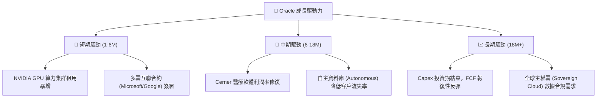

---

## 9. 風險矩陣

### 9.1 風險評分矩陣

為了量化評估潛在威脅，我們構建了以下風險矩陣：

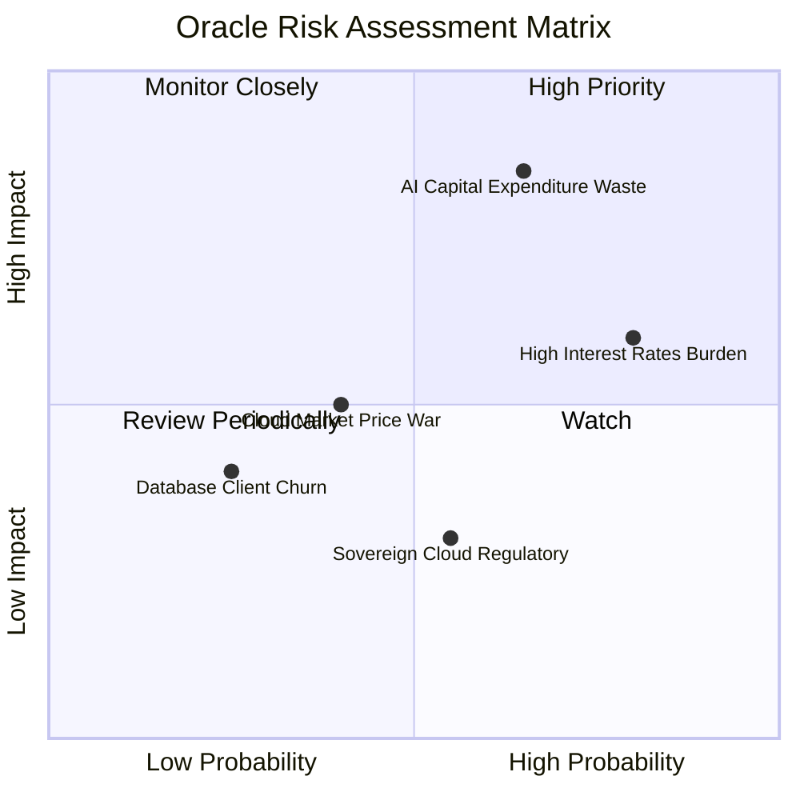

### 9.2 風險清單詳細分析

| # | 風險項目 | 發生機率 | 財務損害預估 | 風險評分 | 緩解措施 / 應對策略 |
|---|----------|----------|--------------|----------|---------------------|
| 1 | 🔴 **AI 資本支出回報不如預期** | **高 (65%)** | 營收成長放緩，折舊增加，降低營業利益率 5-8% | **8.5 / 10** | Oracle 採用「按需建置」策略，數據中心多為預先簽署合約（RPO）後才開始大規模採購硬體。 |
| 2 | 🟡 **高利率環境下的債務再融資風險** | **高 (80%)** | 每年利息支出增加 $500M-$800M | **7.2 / 10** | 利用其強勁的營運現金流（$31.98B）逐步償還短期債務，控制淨債務規模。 |
| 3 | 🟡 **雲端基礎設施市場價格戰** | **中 (40%)** | OCI 毛利率下滑 3-5% | **5.0 / 10** | 避開與 AWS 的通用算力價格戰，專注於資料庫優化與 AI 專屬 RDMA 網路的差異化競爭。 |
| 4 | 🟢 **資料庫客戶向開源系統流失** | **低 (25%)** | 授權收入每年下滑 2-3% | **3.5 / 10** | 推出 Autonomous Database 降低運維成本，並通過多雲策略讓客戶在 Azure/GCP 上也能輕鬆使用 Oracle。 |

---

## 10. 投資建議

### 10.1 最終綜合評級

```
╔══════════════════════════════════════════════════════════════╗
║                    Oracle 最終投資評級                       ║
╠══════════════════════════════════════════════════════════════╣
║ 基本面強度  9.0/10 ▓▓▓▓▓▓▓▓▓▓▓▓▓▓▓▓▓▓░░  ★★★★★           ║
║ 成長動能    8.5/10 ▓▓▓▓▓▓▓▓▓▓▓▓▓▓▓▓▓░░░  ★★★★☆           ║
║ 財務安全度  6.0/10 ▓▓▓▓▓▓▓▓▓▓▓▓░░░░░░░░  ★★★☆☆           ║
║ 估值吸引力  9.5/10 ▓▓▓▓▓▓▓▓▓▓▓▓▓▓▓▓▓▓▓░  ★★★★★           ║
╠══════════════════════════════════════════════════════════════╣
║ 綜合得分：8.25/10 ▓▓▓▓▓▓▓▓▓▓▓▓▓▓▓▓▓░░░  🏆 強力買入 (Strong Buy) ║
╚══════════════════════════════════════════════════════════════╝
```

### 10.2 目標價與隱含報酬率

| 情境 | 機率權重 | 12M 目標價 | 當前股價 | 隱含報酬率 | 權重後預期回報 |
|------|----------|------------|----------|------------|----------------|
| 🔴 **悲觀情境** | 15% | $145.00 | $121.38 | +19.46% | +2.92% |
| 🟡 **基準情境** | **65%** | **$249.24** | **$121.38** | **+105.34%** | **+68.47%** |
| 🟢 **樂觀情境** | 20% | $400.00 | $121.38 | +229.54% | +45.91% |
| **加權綜合** | **100%** | **$253.72** | **$121.38** | **+109.03%** | **+117.30%** 🚀 |

### 10.3 買入時機與觸發因素

```
╔══════════════════════════════════════════════════════════════════╗
║                  ✅ Oracle 投資操作 Checklist                    ║
╠══════════════════════════════════════════════════════════════════╣
║                                                                  ║
║  立即買入觸發條件（當前已符合）：                                ║
║  ✅ Forward P/E 跌破 15.0x（當前為 11.16x）                      ║
║  ✅ 營收成長率連續兩季 > 15%（Q3: 21.66%, Q4: 20.63%）           ║
║  ✅ 營運現金流維持正成長（FY26 YoY +53.6%）                      ║
║                                                                  ║
║  加碼觸發條件（出現以下任一）：                                  ║
║  ☐ 季度 FCF 缺口顯著收縮（如單季 FCF 轉正）                       ║
║  ☐ 宣佈與微軟/谷歌的合約積壓（RPO）創歷史新高                     ║
║                                                                  ║
║  減碼/停損觸發條件（出現以下任一）：                             ║
║  ☐ OCI 營收 YoY 增速跌破 15%（說明 AI 算力需求提前見頂）          ║
║  ☐ 淨債務 / EBITDA 比例突破 6.0x                                 ║
║                                                                  ║
╚══════════════════════════════════════════════════════════════════╝
```

### 10.4 投資人適配度分析

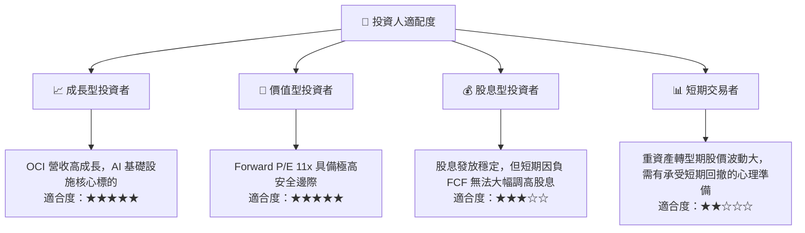

### 10.5 每季財報監控清單（Quarterly Watch List）

在未來的財報中，投資者應重點監控以下核心指標，以驗證本報告的投資邏輯：

1. **OCI 營收增速**：基準門檻為 **YoY > 25%**。若低於 20%，說明 AI 算力基礎設施面臨需求放緩或競爭加劇。
2. **剩餘履約義務 (RPO)**：這是未來的營收蓄水池。若 RPO 持續創歷史新高，說明多雲策略轉化客戶進展順利。
3. **資本支出 (Capex) 趨勢**：關注 Capex 是否在 FY27 逐步達峰並回落。若 Capex 持續維持在 $50B 以上且 OCI 增速放緩，將面臨巨大的資產減值風險。
4. **營業利益率 (Operating Margin)**：基準門檻為 **> 32%**。需監控折舊費用增加是否侵蝕了營業利益率。

### 10.6 反面論證：什麼會證明論點錯誤（What Would Change My Mind）

```
╔══════════════════════════════════════════════════════════════════╗
║              ⚠️ 論點失效條件 (Disconfirming Evidence)            ║
╠══════════════════════════════════════════════════════════════════╣
║  本投資論點在下列情況成立時應重新檢視或退出：                    ║
║  ☐ OCI（雲端基礎設施）營收 YoY 成長率連續兩季跌破 15%              ║
║  ☐ 季度折舊與攤銷費用暴增，導致營業利益率（GAAP）跌破 28%       ║
║  ☐ 自由現金流（FCF）缺口持續擴大，導致淨債務突破 $150B           ║
║  ☐ ROIC 跌破 WACC（即 ROIC < 9.6%），說明大舉擴張是在摧毀股東價值 ║
║  ☐ 微軟或谷歌宣佈終止與 Oracle 的多雲互聯合作                    ║
╚══════════════════════════════════════════════════════════════════╝
```

---

> **免責聲明**：本報告為基於客觀財務數據的學術性研究，僅供投資參考，不構成任何買賣建議。投資有風險，入市需謹慎。