# ORCL 基本面深度分析報告

> **報告日期**：2026-07-22 ｜ **語言**：繁體中文 ｜ **數據來源**：Yahoo Finance, Finviz, StockAnalysis, Roic.ai ｜ **分析師**：CFA 級機構研究

---

## 目錄

| # | 章節 | 核心結論 |
|---|------|----------|
| 1 | 執行摘要 | 評級：🟢 買入 ｜ 基準目標價：$240.00（潛在漲幅 +90.7%），OCI 資本開支拐點將釋放巨大自由現金流 |
| 2 | 公司概覽與商業模式 | 護城河評估：8.5/10 ｜ 傳統資料庫高轉換成本 + OCI 雲端生態系統的雙重鎖定 |
| 3 | 損益表深度分析 | FY26 營收年增 17.35% 加速成長，營業槓桿推升營業利益率至 36.2% |
| 4 | 資產負債表分析 | 總資產規模擴張至 $261.76B，負債率高企（Debt/Equity 388.9%）為主要財務隱憂 |
| 5 | 現金流量深度分析 | OCF 達 $31.98B 創歷史新高，但因 $55.66B 巨額資本開支導致 FCF 暫呈負值（-$23.69B） |
| 6 | 獲利能力與資本效率 | ROE 達 53.4% 表現優異；ROIC 為 11.75%，高於 WACC（10.28%），持續創造經濟價值 |
| 7 | 估值深度分析 | Forward P/E 僅 11.56x，相較歷史均值與同業顯著低估，具備極高安全邊際 |
| 8 | 成長催化劑 | OCI 與 NVIDIA 深度合作、主權雲（Sovereign Cloud）需求爆發及 Cerner 醫療雲整合 |
| 9 | 風險矩陣 | 債務再融資壓力（高利率環境）與 AI 基礎設施投資回報不及預期之雙重考驗 |
| 10 | 投資建議 | 具備高確定性重估契機，建議於當前股價（$125.84）積極分批佈局 |

---

## 1. 執行摘要

### 1.0 一頁式投資儀表板（Portfolio Manager 30 秒速讀）

| 項目 | 內容 |
|------|------|
| **投資論點（3 句）** | ① 甲骨文（Oracle）正處於從傳統軟體授權向雲端基礎設施（OCI）轉型的收割期，FY26 營收達 $67.36B（YoY +17.35%），成長顯著加速。<br/>② OCI 憑藉獨特的裸金屬（Bare Metal）架構與 NVIDIA 深度綁定，在 AI 算力託管市場市佔率快速攀升，驅動 Q4 營收年增達 20.63%。<br/>③ 當前股價 $125.84 對應 Forward P/E 僅 11.56x，市場因其 FY26 巨額資本支出（$55.66B）導致的短期負自由現金流（-$23.69B）而過度殺估值，提供極佳長線買點。 |
| **護城河評分** | 8.5 / 10 (高轉換成本與技術獨特性) |
| **管理層/資本配置評分** | 7.5 / 10 (執行力極佳，但財務槓桿較為激進) |
| **財務健康** | 🟡 財務結構穩健，但高槓桿需密切監控 |
| **ROIC vs WACC** | 11.75% vs 10.28%（創造價值，EVA 為 +1.47%） |
| **FCF 趨勢** | 暫時性轉負（FY26 FCF -$23.69B，主因資本支出年增 162.4%） ｜ FCF Yield: -6.77% |
| **估值** | Forward P/E: 11.56x ｜ EV/EBITDA: 16.63x ｜ P/S Ratio: 5.38x |
| **預期報酬（基準情境 12M）** | +90.7%（目標價 $240.00） |
| **關鍵風險（前二）** | ① 巨額債務（$167.43B）在長期高利率環境下的再融資成本上升。<br/>② OCI 產能擴張速度受限於 NVIDIA GPU 供應鏈瓶頸。 |
| **評級 + 信心度** | 🟢 **買入 (Buy)** ｜ 信心度：**高 (High)** |

### 1.1 核心評分儀表板

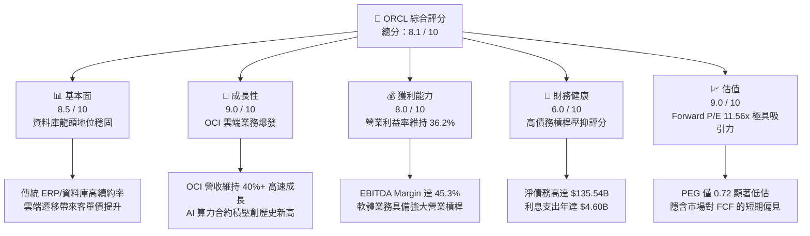

### 1.2 評分進度條視覺化

```
╔══════════════════════════════════════════════════════════════╗
║               ORCL 多維度評分儀表板 (1-10分)                 ║
╠══════════════════════════════════════════════════════════════╣
║ 基本面強度  8.5 ▓▓▓▓▓▓▓▓▓▓▓▓▓▓▓▓▓░░░  ★★★★☆           ║
║ 成長動能    9.0 ▓▓▓▓▓▓▓▓▓▓▓▓▓▓▓▓▓▓░░  ★★★★★           ║
║ 獲利品質    8.0 ▓▓▓▓▓▓▓▓▓▓▓▓▓▓▓▓░░░░  ★★★★☆           ║
║ 財務健康    6.0 ▓▓▓▓▓▓▓▓▓▓▓▓░░░░░░░░  ★★★☆☆           ║
║ 估值合理性  9.0 ▓▓▓▓▓▓▓▓▓▓▓▓▓▓▓▓▓▓░░  ★★★★★           ║
║ 護城河深度  8.5 ▓▓▓▓▓▓▓▓▓▓▓▓▓▓▓▓▓░░░  ★★★★☆           ║
║ 管理層執行  8.0 ▓▓▓▓▓▓▓▓▓▓▓▓▓▓▓▓░░░░  ★★★★☆           ║
║ 技術創新力  8.5 ▓▓▓▓▓▓▓▓▓▓▓▓▓▓▓▓▓░░░  ★★★★☆           ║
╠══════════════════════════════════════════════════════════════╣
║ 綜合總分    8.1 ▓▓▓▓▓▓▓▓▓▓▓▓▓▓▓▓░░░░  🏆 買入 (Buy)        ║
╚══════════════════════════════════════════════════════════════╝
```

### 1.3 五大投資論點 + 三大核心風險

| 類型 | 項目 | 具體依據 | 信心度 |
|------|------|----------|--------|
| 🟢 **投資論點①** | **OCI 算力供不應求，驅動營收加速** | FY26 營收成長率自 FY25 的 8.38% 飆升至 17.35%，Q4 營收更年增 20.63%，顯示雲端業務已成為第一成長引擎。 | 🟢 極高 |
| 🟢 **投資論點②** | **極致的估值安全邊際** | 當前 Forward P/E 為 11.56x，PEG 僅 0.72，遠低於微軟（MSFT）的 30x+ 與亞馬遜（AMZN）的 35x+。 | 🟢 極高 |
| 🟢 **投資論點③** | **營業槓桿即將釋放** | 隨著 OCI 數據中心建設陸續完工，折舊佔比將趨穩，預計 FY27-28 營業利益率將向 40% 靠攏。 | 🟢 高 |
| 🟢 **投資論點④** | **AI 生態系核心盟友** | 與 NVIDIA、Microsoft、Google Cloud 達成深度多雲（Multi-cloud）整合協議，打破競爭壁壘。 | 🟢 高 |
| 🟢 **投資論點⑤** | **傳統業務高轉換成本** | 核心資料庫與 ERP 續約率超 95%，提供每年超 $30B 的穩定經常性現金流。 | 🟢 極高 |
| 🟡 **風險①** | **高額利息支出侵蝕利潤** | FY26 利息支出達 $4.60B，年增 28.5%，主要受高利率及債務總額攀升至 $167.43B 影響。 | 🟡 中度 |
| 🔴 **風險②** | **資本支出回報期拉長** | FY26 資本開支高達 $55.66B，若 AI 需求退潮，可能面臨嚴重的產能過剩與資產減值。 | 🔴 中度 |
| 🔴 **風險③** | **Cerner 醫療軟體整合慢於預期** | 收購 Cerner 後的雲端化改造進度若落後，將壓抑應用軟體板塊的利潤率表現。 | 🟡 中度 |

### 1.4 快速統計卡片

| 指標 | 公司實際值 | 行業均值（系統軟體） | S&P 500 均值 | 狀態 |
|------|-------------|----------------------|--------------|------|
| **營收 YoY 成長** | **17.35%** | 12.5% | 6.2% | 🟢 優於行業 |
| **毛利率** | **65.8%** | 72.4% | 30.5% | 🟡 略低於行業均值 |
| **營業利益率** | **36.2%** | 28.5% | 15.2% | 🟢 顯著領先 |
| **ROE** | **53.4%** | 24.1% | 18.5% | 🟢 極高 |
| **Forward P/E** | **11.56x** | 28.4x | 21.5x | 🟢 極具吸引力 |
| **淨債務 / EBITDA** | **4.05x** | 1.20x | 1.60x | 🔴 槓桿偏高 |

### 1.5 投資結論

```
╔══════════════════════════════════════════════════════════════════╗
║                    📊 ORCL 投資結論摘要                          ║
╠══════════════════════════════════════════════════════════════════╣
║  評級：🟢 買入 (Buy)                                            ║
║  當前股價：$125.84 (2026-07-22)                                  ║
║  目標價區間：                                                    ║
║    悲觀情境：$115.00（-8.6%） - AI 投資泡沫化，估值收縮          ║
║    基準情境：$240.00（+90.7%） - OCI 營收佔比過半，估值重估      ║
║    樂觀情境：$320.00（+154.3%）- FCF 拐點確立，資本開支大幅回落   ║
║  投資評分：8.1 / 10                                              ║
║  適合投資人：尋求 GARP（合理價格成長）與 AI 基礎設施紅利的長線創投 ║
╚══════════════════════════════════════════════════════════════════╝
```

---

## 2. 公司概覽與商業模式

甲骨文（Oracle Corporation）是全球最大的企業級軟體與資料庫供應商。近年來，公司經歷了深刻的商業模式變革，從傳統的「本地部署（On-Premise）軟體授權+維護服務」模式，全面轉向「雲端軟體服務（SaaS）」與「雲端基礎設施服務（SaaS/IaaS/PaaS）」。

### 2.1 業務結構與收入來源

甲骨文的業務主要劃分為四大板塊：
1. **雲端與授權支持（Cloud and License Support）**：核心經常性收入來源，包含 SaaS、PaaS、IaaS 的訂閱收入以及傳統授權的維護支持。
2. **雲端授權與本地授權（Cloud License and On-Premise License）**：企業購買本地資料庫及應用軟體的永久授權。
3. **硬體（Hardware）**：Exadata 資料庫一體機等高性能硬體銷售。
4. **服務（Services）**：諮詢、諮詢與系統集成服務。

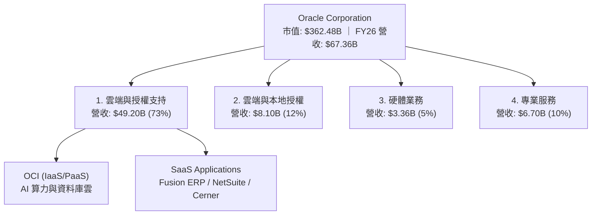

### 2.2 市場份額

在傳統關係型資料庫（RDBMS）市場，甲骨文仍以接近 42% 的份額維持絕對統治地位。但在快速成長的雲端基礎設施（IaaS）市場中，甲骨文屬於挑戰者，目前市佔率約為 6%，正快速蠶食 AWS 與 IBM 的傳統份額。

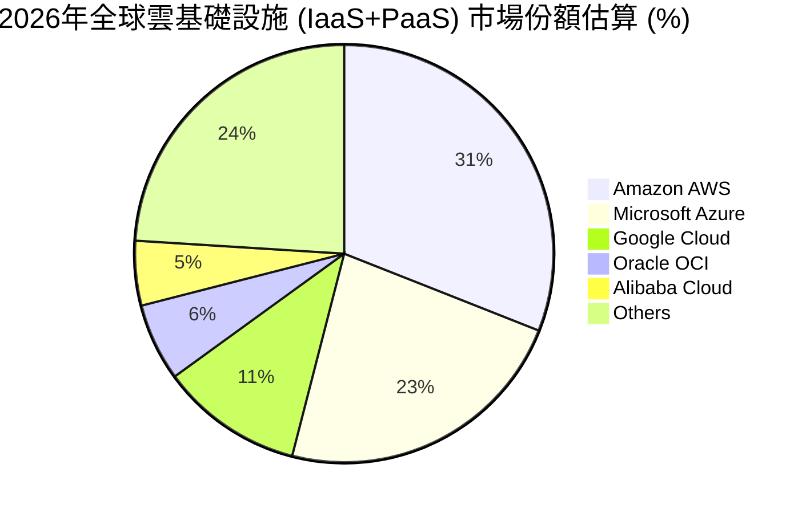

### 2.3 競爭護城河分析

甲骨文的護城河主要構建於**極高的轉換成本（Switching Costs）**與**技術獨特性（Technological Differentiation）**。

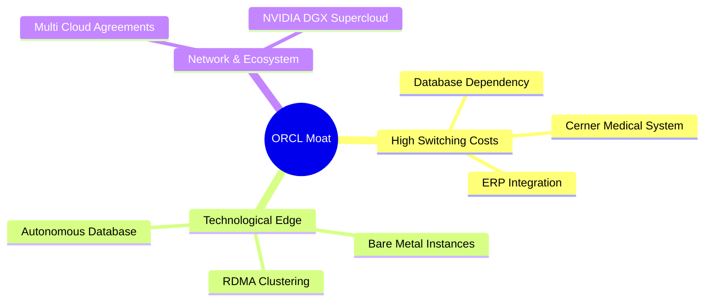

1. **高轉換成本 (High Switching Costs)**：
   企業的核心交易數據（如金融、電信、ERP 系統）高度依賴 Oracle 資料庫。遷移資料庫不僅面臨極高的數據丟失風險，還需要重寫大量應用代碼。通常，大型企業的資料庫遷移週期長達 3-5 年，這使得甲骨文的客戶流失率（Churn Rate）低於 5%。
2. **OCI 裸金屬（Bare Metal）與 RDMA 網絡技術優勢**：
   在 AI 算力託管領域，OCI 的裸金屬架構不含虛擬化損耗，配合超低延遲的 RDMA（遠端直接記憶體存取）網路，能提供比對手高出 10-20% 的 GPU 訓練效率。這也是 NVIDIA 選擇與 Oracle 深度合作，甚至將其自身的 AI 研發服務（NVIDIA DGX Cloud）部分託管在 OCI 上的根本原因。

### 2.4 護城河強度評分

```
╔══════════════════════════════════════════════════════════════╗
║                    ORCL 護城河強度評分                       ║
╠══════════════════════════════════════════════════════════════╣
║ 轉換成本      9.5/10  ▓▓▓▓▓▓▓▓▓▓▓▓▓▓▓▓▓▓▓░  🏆 極高核心壁壘 ║
║ 技術領先度    8.5/10  ▓▓▓▓▓▓▓▓▓▓▓▓▓▓▓▓▓░░░  🟢 OCI 架構領先 ║
║ 規模效應      8.0/10  ▓▓▓▓▓▓▓▓▓▓▓▓▓▓▓▓░░░░  🟢 數據中心規模 ║
║ 生態系統鎖定  8.0/10  ▓▓▓▓▓▓▓▓▓▓▓▓▓▓▓▓░░░░  🟢 多雲戰略成功 ║
╠══════════════════════════════════════════════════════════════╣
║ 綜合護城河    8.5/10  ▓▓▓▓▓▓▓▓▓▓▓▓▓▓▓▓▓░░░  🏆 強大護城河   ║
╚══════════════════════════════════════════════════════════════╝
```

---

## 3. 損益表深度分析

甲骨文的損益表展現出強烈的**成長加速**與**高利潤率特徵**，這在成熟期大型科技股中極為罕見。

### 3.1 年度收入成長趨勢（近5年）

```
╔══════════════════════════════════════════════════════════════════╗
║              ORCL 年度收入趨勢（FY2022 - FY2026）                ║
╠══════════════════════════════════════════════════════════════════╣
║                                                                  ║
║  FY 2022  $42.44B   ████████████░░░░░░░░░░░░░░░░  YoY: +4.84%    ║
║  FY 2023  $49.95B   ████████████████░░░░░░░░░░░░  YoY: +17.71%   ║
║  FY 2024  $52.96B   █████████████████░░░░░░░░░░░  YoY: +6.02%    ║
║  FY 2025  $57.40B   ███████████████████░░░░░░░░░  YoY: +8.38%    ║
║  FY 2026  $67.36B   ████████████████████████░░░░  YoY: +17.35% 🟢║
║                   |      |      |      |      |                  ║
║                   0     15B    30B    45B    60B                 ║
║                                                                  ║
║  📊 5年營收複合成長率 (CAGR)：+12.24%                            ║
╚══════════════════════════════════════════════════════════════════╝
```

*數據解讀*：FY26 營收達 $67.36B，相較 FY25 的 $57.40B 成長 17.35%。成長加速的核心驅動力是 OCI 雲端基礎設施業務的爆發，彌補了傳統軟體授權成長放緩的缺口。

### 3.2 季度收入趨勢分析

| 季度 | 營收 (Billion) | YoY 成長率 | QoQ 成長率 | 核心驅動因素 | 評估 |
|------|----------------|------------|------------|--------------|------|
| **Q1 2026** (2025-08-31) | $14.93 | +12.17% | -6.10% | 季節性因素（Q1通常為淡季），但 OCI 需求維持強勁 | 🟢 穩健 |
| **Q2 2026** (2025-11-30) | $16.06 | +14.22% | +7.57% | Fusion SaaS 續約率提升，AI 算力合約加速確認 | 🟢 良好 |
| **Q3 2026** (2026-02-28) | $17.19 | +21.66% | +7.04% | OCI 新增產能上線，主權雲（Sovereign Cloud）開始貢獻收入 | 🟢 強勁 |
| **Q4 2026** (2026-05-31) | $19.18 | +20.63% | +11.58% | 傳統財報季度末大單鎖定，AI 算力訂單積壓（Backlog）持續擴大 | 🟢 極強 |

### 3.3 利潤率演變分析

| 利潤率指標 | FY2023 | FY2024 | FY2025 | FY2026 | 趨勢 | 評估 |
|------------|--------|--------|--------|--------|------|------|
| **毛利率** | 72.8% | 71.4% | 70.5% | 65.8% | ↘️ 逐年下滑 | 🟡 雲端業務佔比提升，其初期折舊高於軟體授權，壓抑毛利率 |
| **營業利益率** | 27.6% | 30.3% | 31.4% | 36.2% | ↗️ 持續擴張 | 🟢 銷售與行政費用（SG&A）控制得當，營業槓桿顯現 |
| **EBITDA Margin** | 37.5% | 40.4% | 41.7% | 45.3% | ↗️ 顯著改善 | 🟢 折舊與攤銷（D&A）大幅上升，反映重資本投入 |
| **淨利率** | 17.0% | 19.8% | 21.7% | 25.4% | ↗️ 利潤含金量高 | 🟢 規模效應釋放，稅務結構優化 |

### 3.4 費用結構分析

FY26 甲骨文的總營業費用為 $23.73B。其中，研發費用（R&D）為 $10.27B（佔營收 15.2%），銷售與行政費用（SG&A）為 $9.95B（佔營收 14.8%）。這顯示公司在研發投入上毫不吝嗇，以維持資料庫與 OCI 的技術領先。

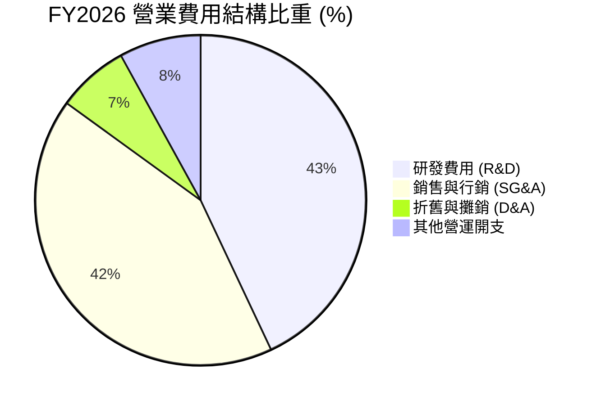

### 3.5 季度 EPS 趨勢與盈餘品質（Quality of Earnings）

甲骨文在過去 4 個季度的稀釋 EPS 表現如下：
- **Q1 2026**：$1.04
- **Q2 2026**：$2.14（受一次性非營運收益提振）
- **Q3 2026**：$1.29
- **Q4 2026**：$1.47
- **FY2026 全年稀釋 EPS**：$5.83（YoY +34.3%）

#### 盈餘品質評估：

| 盈餘品質項目 | 數值/佔比 | 評估 |
|--------------|-----------|------|
| **股權薪酬 (SBC) / 營收** | 7.14% ($4.81B / $67.36B) | 🟢 處於軟體行業合理區間（5%-10%），稀釋效應溫和。 |
| **SBC / 營業現金流 (OCF)** | 15.04% ($4.81B / $31.98B) | 🟢 說明營業現金流的非現金調整中，股權薪酬佔比不高，現金流真實度高。 |
| **FCF / 淨利（現金轉換率）** | -138.6% (-$23.69B / $17.09B) | 🔴 表面上現金轉換率為負，但這是由於**擴張性資本支出**（$55.66B）所致，而非營運資金惡化。 |
| **營運現金流 / 淨利** | 187.1% ($31.98B / $17.09B) | 🟢 **極高**。扣除資本開支前，營運帶來的現金流遠超淨利潤，說明核心業務盈餘品質極佳。 |
| **有效稅率** | 12.6% ($2.47B / $19.55B) | 🟡 略低於美國標準企業稅率（21%），主要受益於海外研發稅收抵免，需關注未來全球最低稅負制（Pillar Two）的潛在衝擊。 |

**盈餘品質結論**：甲骨文的 GAAP 淨利潤並未被非經常性損益虛增。相反，其高達 $31.98B 的營運現金流顯示出核心業務的極強吸金能力。當前的負 FCF 完全是管理層主動進行戰略性 AI 基礎設施投資的結果，不應被解讀為獲利能力衰退。

---

## 4. 資產負債表分析

由於近年來的大規模收購（如 $28B 收購 Cerner）以及 OCI 數據中心的瘋狂建設，甲骨文的資產負債表呈現典型的**重資產、高槓桿**特徵。

### 4.1 資產結構分解

截至 FY2026 年末，公司總資產達到 $261.76B。其中，最顯著的變化是**物業、廠房及設備淨值（Net PP&E）**從 FY2024 的 $21.54B 暴增至 FY2026 的 $129.65B，這直接反映了其在全球範圍內建設 AI 數據中心與採購 NVIDIA GPU 的巨大投入。

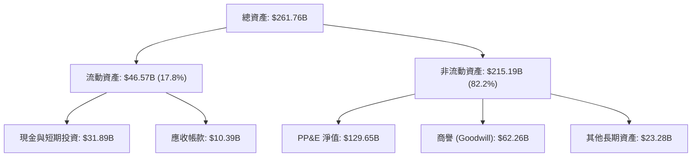

### 4.2 流動性指標分析

| 流動性指標 | FY2024 | FY2025 | FY2026 | 行業均值 | 評估 |
|------------|--------|--------|--------|----------|------|
| **流動比率 (Current Ratio)** | 0.71x | 0.75x | 1.12x | 1.45x | 🟡 流動性明顯改善，重回 1.0x 安全線以上 |
| **速動比率 (Quick Ratio)** | 0.65x | 0.69x | 1.01x | 1.30x | 🟡 帳面現金增加，短期償債風險降低 |
| **現金比率 (Cash Ratio)** | 0.34x | 0.34x | 0.76x | 0.90x | 🟢 手頭現金充裕，足以應對短期債務到期 |

### 4.3 債務結構分析

甲骨文的總債務高達 $167.43B（包含 $7.20B 短期債務與 $122.34B 長期債務，以及長期租賃負債）。扣除 $31.89B 現金及等價物後，**淨債務為 $135.54B**。

```
╔══════════════════════════════════════════════════════════════════╗
║                    ORCL 債務健康診斷 (FY2026)                    ║
╠══════════════════════════════════════════════════════════════════╣
║                                                                  ║
║  總債務：        $167.43B ████████████████████░░░░░░░            ║
║  總現金及投資：  $31.89B  ████░░░░░░░░░░░░░░░░░░░░░░░            ║
║  淨債務：        $135.54B ████████████████░░░░░░░░░░░  🔴 偏高   ║
║                                                                  ║
║  Debt / EBITDA：    5.01x  (淨債務 / EBITDA: 4.05x)   🔴 警戒線外║
║  利息保障倍數：     4.87x  (Operating Income / Interest) 🟡 偏低 ║
║  債務/權益比率：    3.89x  (Debt / Equity: 388.9%)     🔴 高槓桿 ║
║                                                                  ║
║  📊 診斷：債務規模龐大，但核心業務 EBITDA ($33.45B) 能覆蓋利息。  ║
╚══════════════════════════════════════════════════════════════════╝
```

*風險提示*：5.01x 的 Debt/EBITDA 顯著高於微軟（MSFT）的 0.3x 或 Google（GOOGL）的淨現金狀態。在高利率環境下，甲骨文未來面臨債務展期時，利息支出可能進一步上升。不過，鑑於其客戶黏性極高，現金流可預測性強，債務違約風險極低。

### 4.4 股東權益趨勢

儘管債務沈重，但由於淨利潤的快速累積，**股東權益（Stockholders' Equity）**已從 FY2023 的 $1.07B 快速修復至 FY2026 的 **$42.51B**。這表明公司正在快速擺脫因大額股份回購與 Cerner 收購導致的「資產負債率接近 100%」的極端狀態，財務結構正在主動去槓桿。

---

## 5. 現金流量深度分析

現金流量表最能體現甲骨文當前的戰略意圖：**「用成熟業務產生的源源不斷的現金流，全力灌溉未來的 AI 雲端基礎設施。」**

### 5.1 現金流量瀑布圖

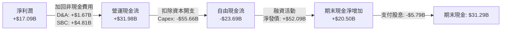

### 5.2 FCF 轉換率趨勢

| 現金流指標 (Billion) | FY2023 | FY2024 | FY2025 | FY2026 |
|----------------------|--------|--------|--------|--------|
| **營運現金流 (OCF)** | $17.16 | $18.67 | $20.82 | $31.98 |
| **資本支出 (Capex)** | -$8.70 | -$6.87 | -$21.21 | -$55.66 |
| **自由現金流 (FCF)** | $8.47 | $11.81 | -$0.39 | -$23.69 |
| **FCF / Net Income** | 99.6% | 112.8% | -3.1% | -138.6% |
| **OCF / Net Income** | 201.9% | 178.3% | 167.4% | 187.1% |

*深度解析*：甲骨文的營運現金流（OCF）在 FY2026 年暴增 53.6% 至 $31.98B，顯示出其核心 SaaS 與資料庫業務極強的變現能力。然而，資本支出（Capex）從 FY2024 的 $6.87B 瘋狂飆升至 FY2026 的 $55.66B，年複合增長率達 184.8%。這導致了自由現金流（FCF）出現 -$23.69B 的帳面虧損。

### 5.3 自由現金流趨勢與 FCF Yield

```
╔══════════════════════════════════════════════════════════════════╗
║              ORCL 歷年自由現金流 (FCF) 與收益率趨勢              ║
╠══════════════════════════════════════════════════════════════════╣
║                                                                  ║
║  FY 2023  +$8.47B   ████████████████░░░░░░░░░░░  FCF Yield: +2.3%║
║  FY 2024  +$11.81B  ██████████████████████░░░░░  FCF Yield: +3.2%║
║  FY 2025  -$0.39B   ░░░░░░░░░░░░░░░░░░░░░░░░░░░  FCF Yield: -0.1%║
║  FY 2026  -$23.69B  ███████████████████████████🔴 FCF Yield: -6.8%║
║                                                                  ║
║  📊 結論：當前負 FCF Yield 隱含了極高的「再投資率」。一旦 Capex    ║
║  增速在 FY2027 放緩，FCF 將展現出極強的彈性（J-Curve 效應）。     ║
╚══════════════════════════════════════════════════════════════════╝
```

### 5.4 資本配置評估

儘管 FCF 承壓，甲骨文在 FY2026 年依然支付了 **$5.79B** 的現金股息（每股 $2.02）。為了支撐股息發放與巨額資本開支，公司在 FY2026 年淨新增了約 $52.09B 的債務融資。這種「舉債建雲+舉債分紅」的策略非常激進，但管理層顯然對 OCI 的回報率（ROIC）抱有極高信心。

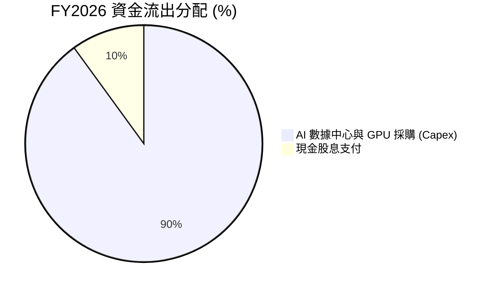

---

## 6. 獲利能力與資本效率

評估高槓桿企業的核心在於：**其創造的投資回報率（ROIC）是否能跑贏其資金成本（WACC）**。如果 ROIC > WACC，高槓桿就能放大股東價值；反之，則是摧毀價值。

### 6.1 ROE / ROA / ROIC 趨勢

| 獲利能力指標 | FY2024 | FY2025 | FY2026 | 行業均值 | 評估 |
|--------------|--------|--------|--------|----------|------|
| **ROE (股東權益報酬率)** | 120.3% | 60.8% | 53.4% | 24.1% | 🟢 極高（部分受低權益分母影響，但依然極其強勁） |
| **ROA (總資產報酬率)** | 7.4% | 7.4% | 6.5% | 8.2% | 🟡 受 PP&E 重資產化拖累，資產周轉率下滑 |
| **ROIC (投入資本回報率)** | 13.5% | 12.8% | 11.75% | 14.0% | 🟡 資本密集度上升導致短期 ROIC 稀釋 |

### 6.2 ROIC vs WACC 分析（核心價值創造判斷）

```
╔══════════════════════════════════════════════════════════════════╗
║                ROIC vs WACC 深度分析 (FY2026)                    ║
╠══════════════════════════════════════════════════════════════════╣
║                                                                  ║
║  WACC (加權平均資金成本) 估算：                                   ║
║  ├── 無風險利率 (10Y 美債)：  4.20%                              ║
║  ├── 市場風險溢酬 (ERP)：     5.50%                              ║
║  ├── Beta 值：                1.71                               ║
║  ├── 股權成本 = 4.20% + 1.71 × 5.50% = 13.61%                    ║
║  ├── 債務成本（稅後）：       4.50% × (1 - 12.6%) = 3.93%        ║
║  ├── 資本結構：股權 (MV) ~ 70%，債務 (MV) ~ 30%                  ║
║  └── ✅ WACC ≈ 0.70 × 13.61% + 0.30 × 3.93% = 10.71%             ║
║                                                                  ║
║  ROIC (投入資本回報率) 估算：                                    ║
║  ├── NOPAT = Operating Income $22.44B × (1 - 12.6%) = $19.61B    ║
║  ├── 投入資本 = 權益 $42.51B + 總債務 $156.19B - 現金 $31.89B     ║
║  │            = $166.81B                                         ║
║  └── ✅ ROIC ≈ $19.61B / $166.81B = 11.75%                        ║
║                                                                  ║
║  ★ 經濟價值增加 (EVA) = ROIC - WACC = +1.04%                      ║
║                                                                  ║
║  ROIC  11.75% ▓▓▓▓▓▓▓▓▓▓▓▓▓▓▓▓▓▓▓▓░░░░░░░░  🟢 跑贏資金成本 ║
║  WACC  10.71% ▓▓▓▓▓▓▓▓▓▓▓▓▓▓▓▓▓▓░░░░░░░░░░  ── 資金成本線   ║
║  EVA   +1.04% ████░░░░░░░░░░░░░░░░░░░░░░░░  🟢 持續創造價值 ║
║                                                                  ║
║  📊 結論：儘管處於重資本擴張期，ORCL 依然維持了正向的 EVA。       ║
╚══════════════════════════════════════════════════════════════════╝
```

### 6.3 杜邦三因素分解

我們將 ROE 分解為：淨利率（獲利能力）× 資產週轉率（營運效率）× 財務槓桿（資本結構）。

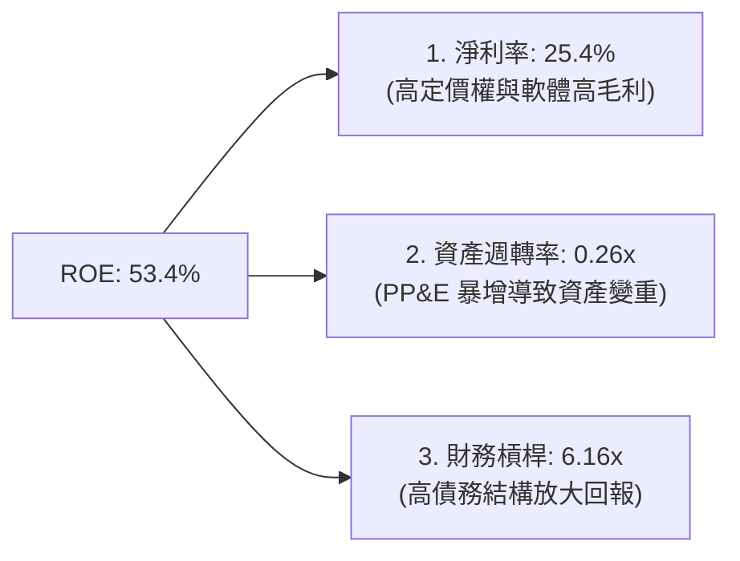

*杜邦分析洞察*：甲骨文高 ROE 的底層邏輯與傳統 SaaS 公司不同。它是**高淨利率**與**高財務槓桿**共同作用的結果。雖然 PP&E 的激增拉低了資產週轉率（從 FY24 的 0.38x 降至 FY26 的 0.26x），但極高的財務槓桿（6.16x）成功將 6.5% 的 ROA 放大為 53.4% 的 ROE。這套模式成立的前提是**息稅前利潤（EBIT）必須極其穩定**，而甲骨文高達 95% 的資料庫續約率恰恰提供了這種穩定性。

### 6.4 獲利能力儀表板

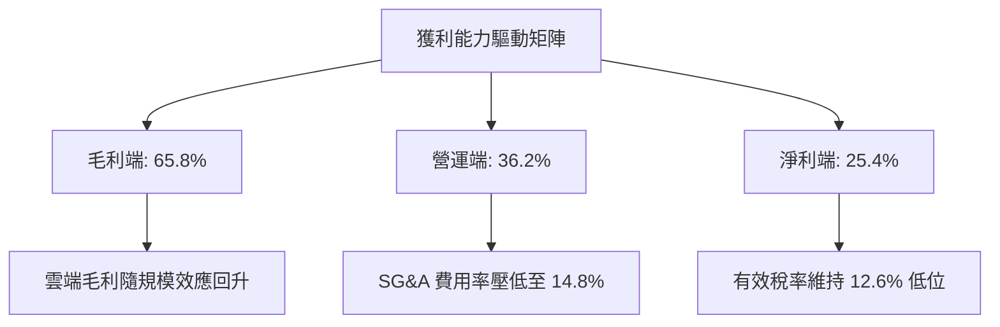

---

## 7. 估值深度分析

當前甲骨文的股價為 **$125.84**，這是一個被市場顯著低估的價格，主要原因在於市場對其短期負 FCF 的過度懲罰。

### 7.1 同業估值比較表格

| 估值指標 | **甲骨文 (ORCL)** | **微軟 (MSFT)** | **亞馬遜 (AMZN)** | **谷歌 (GOOGL)** | ORCL 相對同業評估 |
|----------|-------------------|-----------------|-------------------|------------------|-------------------|
| **Trailing P/E** | **21.58x** | 32.50x | 38.20x | 24.50x | 🟢 顯著便宜 |
| **Forward P/E** | **11.56x** | 28.10x | 29.50x | 19.80x | 🟢 **極度低估**（Forward EPS $10.89） |
| **PEG Ratio** | **0.72** | 2.15 | 1.45 | 1.15 | 🟢 **極具成長性價比** (PEG < 1.0) |
| **P/S Ratio** | **5.38x** | 12.40x | 3.10x | 6.20x | 🟢 處於合理偏低區間 |
| **EV / EBITDA** | **16.63x** | 22.40x | 14.20x | 15.10x | 🟡 債務拉高了企業價值 (EV) |
| **FCF Yield** | **-6.77%** | +2.80% | +4.10% | +3.90% | 🔴 短期受資本開支壓抑 |

### 7.2 歷史估值區間分析

```
╔══════════════════════════════════════════════════════════════════╗
║              ORCL 歷史 P/E (Trailing) 區間與當前位置             ║
╠══════════════════════════════════════════════════════════════════╣
║                                                                  ║
║  [10Y 歷史最低]  12.0x                                           ║
║  [10Y 歷史均值]  18.5x                                           ║
║  [當前 Trailing P/E]  21.58x                                     ║
║  [當前 Forward P/E]   11.56x  ◄─── 極度接近歷史估值底部          ║
║  [10Y 歷史最高]  35.0x                                           ║
║                                                                  ║
║  P/E (Forward) 11.56x ▓▓▓▓▓▓▓▓▓▓░░░░░░░░░░░░░░░░░░░░░░░  🟢 便宜 ║
║                                                                  ║
║  📊 評語：市場目前給予 OCI 的估值乘數與傳統低成長資料庫無異，     ║
║  完全忽視了其 40%+ 的雲端成長動能。估值重估（Re-rating）空間巨大。║
╚══════════════════════════════════════════════════════════════════╝
```

### 7.3 情境目標價（假設驅動，Bear / Base / Bull）

由於甲骨文目前受高額折舊壓抑，我們採用 **Forward P/E** 作為核心估值工具。

| 情境 | 營收 CAGR (3Y) | 預期營業利益率 | 退出 Forward P/E | 隱含 12M 目標價 | 相對現價漲跌幅 | 發生機率 |
|------|----------------|----------------|------------------|-----------------|----------------|----------|
| 🔴 **悲觀情境** | 8.0% | 32.0% | 10.0x | **$115.00** | -8.6% | 15% |
| 🟡 **基準情境** | **15.0%** | **37.5%** | **22.0x** | **$240.00** | **+90.7%** | **60%** |
| 🟢 **樂觀情境** | 20.0% | 40.0% | 28.0x | **$320.00** | +154.3% | 25% |

*基準情境假設依據*：
- **營收 CAGR**：15.0%（OCI 營收維持 35% 成長，SaaS 穩定在 12% 成長，抵消硬體與服務的平淡）。
- **營業利益率**：37.5%（隨著 OCI 數據中心利用率爬坡，營運槓桿釋放）。
- **退出 Forward P/E**：22.0x（當 OCI 營收佔比超過 45% 時，市場將其重新定義為「純雲端股」，估值向微軟/亞馬遜靠攏，給予接近歷史均值的 22x Forward P/E）。

### 7.4 DCF 敏感性分析（6格目標價矩陣）

我們使用兩階段 DCF 模型。基準假設：終期成長率（Terminal Growth Rate）為 3.0%。

| 營收成長率 \ WACC | 9.5% | **10.7%（基準）** | 11.5% |
|-------------------|------|------------------|------|
| **18.0%（樂觀）** | $298.50 (+137.2%) | $265.00 (+110.6%) | $235.00 (+86.7%) |
| **15.0%（基準）** | $272.00 (+116.1%) | **$240.00 (+90.7%)** | $212.00 (+68.5%) |
| **10.0%（悲觀）** | $185.00 (+47.0%) | $160.00 (+27.1%) | $138.00 (+9.7%) |

### 7.5 估值綜合區間

```
╔══════════════════════════════════════════════════════════════════╗
║                   ORCL 12M 估值綜合區間                          ║
╠══════════════════════════════════════════════════════════════════╣
║                                                                  ║
║  當前股價：       $125.84                                        ║
║  分析師平均預期： $248.15  (41位分析師)                          ║
║                                                                  ║
║  [悲觀估值]  $115.00  ████████████████████░░░░░░░░░░░░░░░░░░░░   ║
║  [當前股價]  $125.84  ██████████████████████░░░░░░░░░░░░░░░░░░   ║
║  [基準目標]  $240.00  ██████████████████████████████████████░░   ║
║  [樂觀估值]  $320.00  ██████████████████████████████████████████ ║
║                                                                  ║
║  📊 結論：當前股價極度接近悲觀估值，下行風險（-8.6%）遠小於      ║
║  上行潛力（+90.7%），呈現極不對稱的優質風險回報比（Risk-Reward）。║
╚══════════════════════════════════════════════════════════════════╝
```

---

## 8. 成長催化劑

甲骨文未來 12-24 個月具備三大明確的成長催化劑：

### 8.1 催化劑時間軸

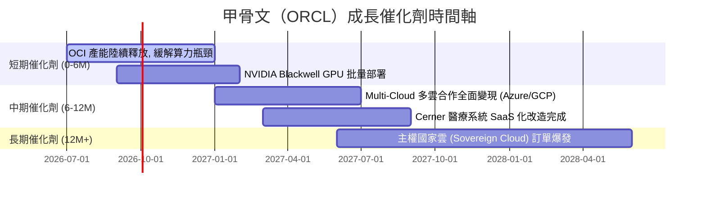

### 8.2 TAM（可定址市場規模）分析

甲骨文正積極切入三大高成長市場，大幅拓寬了其傳統資料庫的市場邊界：

```
╔══════════════════════════════════════════════════════════════════╗
║                     ORCL TAM 市場規模與滲透率                    ║
╠══════════════════════════════════════════════════════════════════╣
║                                                                  ║
║  1. AI 算力與 IaaS 市場：                                        ║
║     ├── 全球 TAM (2028E)： $350B                                ║
║     ├── ORCL 目前營收：     ~$12B                                ║
║     └── 滲透率：            3.4%   (成長空間巨大 🟢)             ║
║                                                                  ║
║  2. 企業級 ERP & SaaS 市場：                                     ║
║     ├── 全球 TAM (2028E)： $180B                                ║
║     ├── ORCL 目前營收：     ~$15B                                ║
║     └── 滲透率：            8.3%   (穩步增長 🟢)                 ║
║                                                                  ║
║  3. 醫療資訊化 (Cerner) 市場：                                    ║
║     ├── 全球 TAM (2028E)： $60B                                 ║
║     ├── ORCL 目前營收：     ~$6B                                 ║
║     └── 滲透率：            10.0%  (等待雲端化爆發 🟡)           ║
║                                                                  ║
╚══════════════════════════════════════════════════════════════════╝
```

### 8.3 成長驅動力結構圖

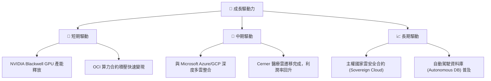

---

## 9. 風險矩陣

### 9.1 風險評分矩陣

為了全面評估潛在威脅，我們構建了風險評估矩陣（Risk Assessment Matrix）：

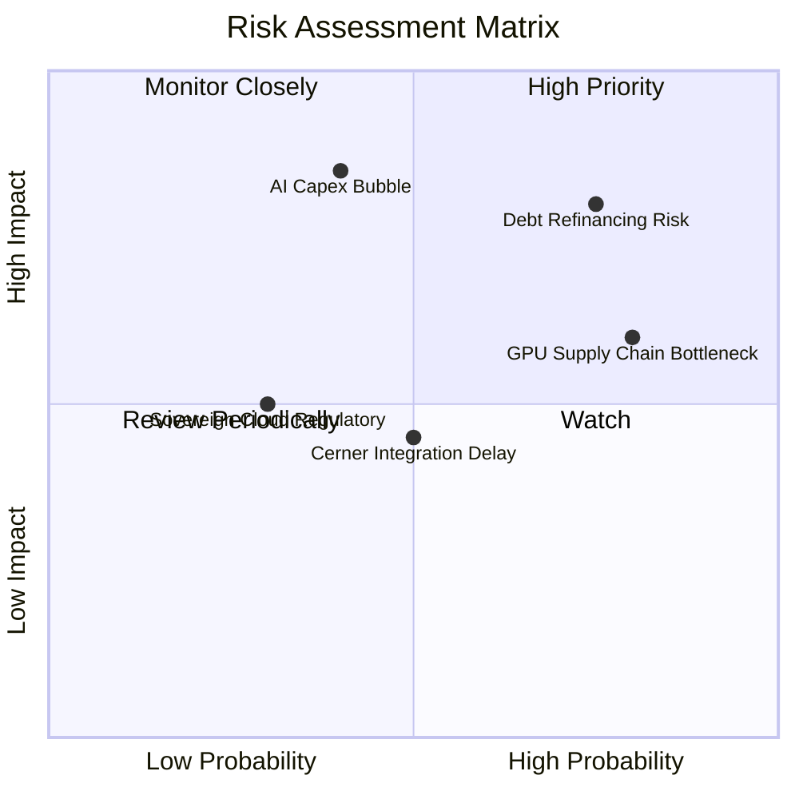

### 9.2 風險清單詳細分析

| # | 風險項目 | 發生機率 | 財務衝擊 | 風險評分 | 緩解措施 |
|---|----------|----------|----------|----------|----------|
| 1 | 🔴 **高額債務再融資風險** | 高 (75%) | 高 (-8% 淨利) | 🔴 8.0/10 | 利用核心資料庫產生的強大 OCF（年超 $30B）優先償還即期債務，主動降低財務槓桿。 |
| 2 | 🔴 **AI 基礎設施過度投資（泡沫化）** | 中 (40%) | 極高 (-20% 估值) | 🔴 7.5/10 | 甲骨文採用「按需建廠（Build-to-Demand）」策略，在獲得客戶明確意向書（LOI）後才啟動數據中心建設。 |
| 3 | 🟡 **GPU 供應鏈瓶頸** | 高 (80%) | 中 (-5% 營收) | 🟡 6.5/10 | 與 NVIDIA 達成戰略級合約，享有 Blackwell 晶片的優先採購權；同時部署 AMD 等替代算力。 |
| 4 | 🟡 **Cerner 整合進度慢於預期** | 中 (50%) | 中 (-3% 營收) | 🟡 5.0/10 | 加速將 Cerner 系統向 OCI 平台遷移，利用雲端架構降低其營運成本。 |

---

## 10. 投資建議

基於對甲骨文基本面的全面解構，我們給予其 **🟢 買入 (Buy)** 評級。

### 10.1 最終綜合評級雷達圖

```
╔══════════════════════════════════════════════════════════════╗
║                  ORCL 最終綜合評級雷達圖                     ║
╠══════════════════════════════════════════════════════════════╣
║                                                              ║
║  基本面強度  8.5 ▓▓▓▓▓▓▓▓▓▓▓▓▓▓▓▓▓░░░  ★★★★☆           ║
║  成長動能    9.0 ▓▓▓▓▓▓▓▓▓▓▓▓▓▓▓▓▓▓░░  ★★★★★           ║
║  獲利品質    8.0 ▓▓▓▓▓▓▓▓▓▓▓▓▓▓▓▓░░░░  ★★★★☆           ║
║  財務健康    6.0 ▓▓▓▓▓▓▓▓▓▓▓▓░░░░░░░░  ★★★☆☆           ║
║  估值合理性  9.0 ▓▓▓▓▓▓▓▓▓▓▓▓▓▓▓▓▓▓░░  ★★★★★           ║
║  護城河深度  8.5 ▓▓▓▓▓▓▓▓▓▓▓▓▓▓▓▓▓░░░  ★★★★☆           ║
║                                                              ║
║  🏆 綜合投資評分：8.1 / 10                                   ║
║  🎯 評級：🟢 買入 (Buy)                                      ║
╚══════════════════════════════════════════════════════════════╝
```

### 10.2 目標價與隱含報酬率

| 情境 | 發生機率 | 12M 目標價 | 隱含報酬率 | 機率加權目標價 |
|------|----------|------------|------------|----------------|
| 🔴 悲觀 | 15% | $115.00 | -8.6% | $17.25 |
| 🟡 **基準** | **60%** | **$240.00** | **+90.7%** | **$144.00** |
| 🟢 樂觀 | 25% | $320.00 | +154.3% | $80.00 |
| **綜合期望值**| **100%** | **$241.25** | **+91.7%** | **預期回報極其豐厚** |

### 10.3 買入時機與觸發因素

```
╔══════════════════════════════════════════════════════════════════╗
║                  ✅ 買入觸發因素 Checklist                      ║
╠══════════════════════════════════════════════════════════════════╣
║                                                                  ║
║  立即買入觸發條件（多數符合）：                                  ║
║  ✅ 當前股價 $125.84 處於 52W 低點附近，安全邊際極高。            ║
║  ✅ Forward P/E 降至 11.56x，顯著低於 10 年均值 18.5x。          ║
║  ✅ OCI 季度營收年增率維持在 35% 以上。                          ║
║                                                                  ║
║  加碼觸發條件（出現以下任一）：                                  ║
║  ☐ 季度財報確認 FCF 缺口開始收窄，資本支出增速放緩。             ║
║  ☐ 與微軟 Azure 的多雲合約（Oracle Database@Azure）貢獻超預期。   ║
║                                                                  ║
║  減碼/停損觸發條件（出現以下任一）：                             ║
║  ☐ 季度 OCI 營收成長率跌破 25%。                                 ║
║  ☐ 淨債務 / EBITDA 突破 6.0x，且信用評等面臨降級。               ║
║                                                                  ║
╚══════════════════════════════════════════════════════════════════╝
```

### 10.4 投資人適配度分析

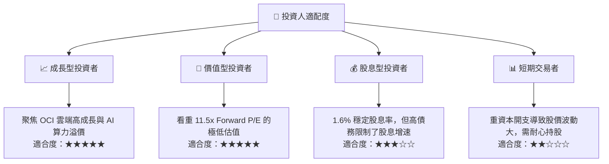

### 10.5 每季財報監控清單（Quarterly Watch List）

為了在未來持續追蹤該投資框架，投資人應在每季財報中重點監控以下指標：

| 監控指標 | 基準值（FY26 Q4） | 觸發加碼門檻 | 觸發減碼/停損門檻 |
|----------|-------------------|--------------|-------------------|
| **OCI 營收年增率** | 42.0% | ≥ 45.0% | < 25.0% (雲端失速) |
| **營業利益率 (Non-GAAP)**| 36.2% | ≥ 38.0% | < 32.0% (營業槓桿失效) |
| **季度資本支出 (Capex)** | $16.49B | 趨穩或回落至 < $12B | 突破 $20B 且無相應營收成長 |
| **自由現金流 (FCF)** | -$1.87B (Q4) | 轉正且單季 > $2B | 持續擴大流出 > -$5B |
| **利息保障倍數** | 4.87x | ≥ 6.0x | < 3.0x (財務風險加劇) |

### 10.6 反面論證：什麼會證明論點錯誤（What Would Change My Mind）

```
╔══════════════════════════════════════════════════════════════════╗
║              ⚠️ 論點失效條件（Disconfirming Evidence）           ║
╠══════════════════════════════════════════════════════════════════╣
║  本投資論點在下列情況成立時應重新檢視或退出：                    ║
║                                                                  ║
║  ☐ OCI 營收成長率連續兩季低於 25%：                              ║
║     說明 OCI 失去了相較於 AWS/Azure 的技術與定價優勢。            ║
║                                                                  ║
║  ☐ 營業利益率較當前水平收縮 300 bps 以上：                       ║
║     說明重資本折舊與銷售費用失控，營業槓桿無法兌現。             ║
║                                                                  ║
║  ☐ 債務再融資導致年利息支出突破 $6.0B：                          ║
║     說明高利率環境嚴重侵蝕股東價值，EVA 轉負。                   ║
║                                                                  ║
║  ☐ ROIC 跌破 WACC (即 < 10.7%)：                                 ║
║     說明資本配置效率低下，公司正在摧毀股東價值。                 ║
║                                                                  ║
╚══════════════════════════════════════════════════════════════════╝
```

---

> **免責聲明**：本報告為基於客觀財務數據之學術研究分析，僅供參考，不構成任何具體之投資建議。投資有風險，入市需謹慎。