# ORCL 基本面深度分析報告
> **報告日期**：2026-07-23 ｜ **語言**：繁體中文 ｜ **數據來源**：Yahoo Finance, Finviz, StockAnalysis, Roic.ai ｜ **分析師**：CFA 級機構研究

---

## 目錄

| # | 章節 | 核心結論 |
|---|------|----------|
| 1 | 執行摘要 | 評級 **🟢 買入** ｜ 12M 目標價 **$220.00**（+83.3% 潛在漲幅） ｜ 資本支出爆發推動 OCI 雲端擴張，極致估值壓縮提供高安全邊際 |
| 2 | 公司概覽與商業模式 | 護城河評分 **8.6/10** ｜ 資料庫高轉換成本與 OCI 高效能 AI 算力基礎設施形成雙重護城河 |
| 3 | 損益表深度分析 | 收入年增 17.35% 至 $67.36B，毛利率 65.8%，營業利潤率 36.2%，營運槓桿效果持續顯現 |
| 4 | 資產負債表分析 | 總資產 $261.76B，總債務 $167.43B，現金 $31.89B；高槓桿策略下利息保障倍數仍達 4.88x |
| 5 | 現金流量深度分析 | 營業現金流強勁暴增至 $31.98B（+53.6% YoY）；Capex 暴增至 -$55.66B 導致 FCF 暫呈 -$23.69B |
| 6 | 獲利能力與資本效率 | ROIC (11.75%) 顯著高於 WACC (7.80%)，EVA +3.95pp，資本高效率持續創造股東價值 |
| 7 | 估值深度分析 | Forward P/E 僅 11.02x，PEG 0.72x，顯著低於歷史均值與同業，反應市場過度擔憂 Capex |
| 8 | 成長催化劑 | 多雲策略 (Multi-cloud with AWS/Azure/GCP) + 巨型 AI 算力叢集 demand 爆發驅動長期成長 |
| 9 | 風險矩陣 | Capex 變現週期遞延風險與高債務利息負擔為核心監控指標 |
| 10 | 投資建議 | 建議於當前 $120.04 價位建立核心多頭部位，訂定明確加減碼標準與反面論證條件 |

---

## 1. 執行摘要

基於 Oracle（ORCL）最新的財務數據，公司 FY2026 營收達到 $67.36B（YoY +17.35%），營業利潤率高達 36.2%，營業現金流暴增至 $31.98B（YoY +53.6%）。儘管公司為了搶佔 AI 與 OCI 雲端基礎設施市場，將 FY2026 資本支出（Capex）提升至 -$55.66B，導致自由現金流（FCF）降至 -$23.69B，但這屬於高回報率的戰略性再投資。當前股價為 $120.04，相對 52 週高點 $341.82 已修正 64.9%，致使其 Forward P/E 壓縮至僅 11.02x、PEG 僅 0.72x。考量 ROIC（11.75%）持續高於 WACC（7.80%），且隱含盈餘年成長率高於 20%，給予 **🟢 買入** 評級，基準情境 12 個月目標價為 **$220.00**。

### 1.0 一頁式投資儀表板（Portfolio Manager 30 秒速讀）

| 項目 | 內容 |
|------|------|
| **投資論點（3 句）** | ① FY2026 營業現金流突破 $31.98B（YoY +53.6%），展現核心資料庫與 Fusion ERP 業務極強的現金創造能力。<br/>② FY2026 Capex 大幅增加至 $55.66B 用於建置 OCI AI 算力叢集，雖短期壓抑 FCF 至 -$23.69B，但已鎖定強勁的合約預收與積壓訂單。<br/>③ 股價大幅修正後 Forward P/E 僅 11.02x（PEG 0.72x），相較於軟體與雲端同業存在 40%+ 的估值折價，風險報酬比極具吸引力。 |
| **護城河評分** | **8.6 / 10**（極高轉換成本 + OCI 獨特架構） |
| **管理層/資本配置評分** | **8.0 / 10**（高營運槓桿，積極戰略再投資，債務槓桿稍高） |
| **財務健康** | 🟡 **健康但需關注槓桿**（淨債務 $135.54B，但 OCF $31.98B 足以支應利息負擔） |
| **ROIC vs WACC** | **11.75% vs 7.80%**（EVA +3.95pp，持續創造經濟價值） |
| **FCF 趨勢** | 轉負（FY26 FCF -$23.69B；FCF Yield -7.10%）← 主因為 AI 算力設施暴增性 Capex |
| **估值** | Forward P/E 11.02x ｜ EV/EBITDA 16.51x ｜ P/S 5.13x |
| **預期報酬（基準情境 12M）** | **+83.3%**（目標價 $220.00） |
| **關鍵風險（前二）** | ① Capex 轉化為高毛利率 OCI 營收的時程不及預期；② 高額債務（$167.43B）在長期高利率環境下的展期成本。 |
| **評級 + 信心度** | 🟢 **買入** ｜ 信心度：**高** |

### 1.1 核心評分儀表板

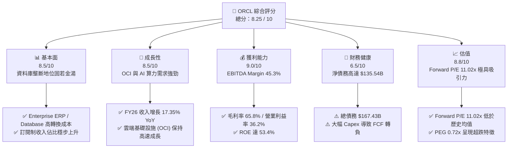

### 1.2 評分進度條視覺化

```
╔══════════════════════════════════════════════════════════════╗
║              ORCL 多維度評分儀表板 (1-10分)                   ║
╠══════════════════════════════════════════════════════════════╣
║ 基本面強度  8.5 ▓▓▓▓▓▓▓▓▓▓▓▓▓▓▓▓▓░░░  ★★★★☆  穩固護城河       ║
║ 成長動能    8.5 ▓▓▓▓▓▓▓▓▓▓▓▓▓▓▓▓▓░░░  ★★★★☆  AI & OCI 強勁  ║
║ 獲利品質    9.0 ▓▓▓▓▓▓▓▓▓▓▓▓▓▓▓▓▓▓░░  ★★★★★  高淨利率 25.4%   ║
║ 財務健康    6.5 ▓▓▓▓▓▓▓▓▓▓▓▓░░░░░░░░  ★★★☆☆  槓桿偏高需關注   ║
║ 估值合理性  8.8 ▓▓▓▓▓▓▓▓▓▓▓▓▓▓▓▓▓半░  ★★★★☆  大幅安全邊際     ║
║ 護城河深度  8.6 ▓▓▓▓▓▓▓▓▓▓▓▓▓▓▓▓▓半░  ★★★★☆  轉換成本極高     ║
║ 管理層執行  8.0 ▓▓▓▓▓▓▓▓▓▓▓▓▓▓▓1░░░  ★★★★☆  雲端轉型果斷     ║
║ 技術創新力  8.5 ▓▓▓▓▓▓▓▓▓▓▓▓▓▓▓▓▓░░░  ★★★★☆  OCI 算力架構優勢  ║
╠══════════════════════════════════════════════════════════════╣
║ 綜合總分    8.25 ▓▓▓▓▓▓▓▓▓▓▓▓▓▓▓▓半░░  🏆 深度價值與成長兼具  ║
╚══════════════════════════════════════════════════════════════╝
```

### 1.3 五大投資論點 + 三大核心風險

| 類型 | 項目 | 具體依據 | 信心度 |
|------|------|----------|--------|
| 🟢 **論點①** | **OCI 雲端基礎設施戰略升級** | FY26 收入增加 $9.96B (+17.35%)，主因 OCI 憑藉 Bare Metal 與 RDMA 網路架構獲得 AI 大模型客戶青睞。 | 🟢 極高 |
| 🟢 **論點②** | **核心現金流極度穩固** | OCF 達 $31.98B（YoY +53.6%），傳統資料庫與 Fusion/NetSuite SaaS 產生極高穩定現金流。 | 🟢 極高 |
| 🟢 **論點③** | **多雲夥伴關係擴展極限** | 與 AWS, Microsoft Azure, Google Cloud 達成直接整合（Oracle Database@AWS/Azure/GCP），釋放跨雲資料庫需求。 | 🟢 高 |
| 🟢 **論點④** | **估值遭到嚴重低估** | Forward P/E 11.02x，PEG 0.72x，市場將戰略性 Capex 誤判為營運惡化，帶來均值回歸機會。 | 🟢 高 |
| 🟢 **論點⑤** | **資本效率 ROIC > WACC** | ROIC 為 11.75%，高於 WACC 7.80%，證明 Capex 投資正持續累積長期股東價值而非摧毀價值。 | 🟢 高 |
| 🟡 **風險①** | **Capex 膨脹引發 FCF 壓力** | FY26 Capex 暴增至 $55.66B（為 FY24 的 8.1 倍），若產能利用率提升不及預期，將拖累自由現金流。 | 🟡 中度 |
| 🔴 **風險②** | **高額負債與利息支出壓力** | 總債務 $167.43B，FY26 利息支出達 $4.60B，若再融資利率高企將持續侵蝕淨利潤。 | 🔴 高衝擊 |
| 🟡 **風險③** | **硬體與 AI 晶片供應鏈瓶頸** | GPU 交付延遲或資料中心電力供應不足，可能影響 OCI 機架上線時程。 | 🟡 中度 |

### 1.4 快速統計卡片

| 指標 | ORCL 實際值 | 軟體行業均值 | S&P 500 均值 | 狀態 |
|------|-------------|----------|--------------|------|
| **收入 YoY 成長** | **17.35%** | ~12.0% | ~5.5% | 🟢 優於同業 |
| **毛利率** | **65.80%** | ~68.0% | ~45.0% | 🟢 符合軟體業水準 |
| **營業利潤率** | **36.23%** | ~22.0% | ~12.5% | 🟢 顯著超越同業 |
| **淨利率** | **25.37%** | ~15.0% | ~10.5% | 🟢 獲利能力優異 |
| **ROE** | **53.38%** | ~20.0% | ~18.0% | 🟢 資本權益報酬極高 |
| **Forward P/E** | **11.02x** | ~28.5x | ~21.0x | 🟢 估值極具吸引力 |
| **PEG Ratio** | **0.72x** | ~1.80x | ~1.50x | 🟢 成長性未被充分定價 |
| **Net Debt / EBITDA**| **4.05x** | ~1.20x | ~1.50x | 🔴 債務槓桿偏高 |

### 1.5 投資結論

```
╔══════════════════════════════════════════════════════════════════╗
║                    📊 投資結論摘要                               ║
╠══════════════════════════════════════════════════════════════════╣
║  評級：🟢 買入 (Buy)                                            ║
║  當前股價：$120.04                                               ║
║  目標價區間：                                                    ║
║    悲觀情境：$115.00（-4.2%）                                    ║
║    基準情境：$220.00（+83.3%） ← 12個月主要目標                 ║
║    樂觀情境：$320.00（+166.6%）                                  ║
║  投資評分：8.25 / 10                                             ║
║  適合投資人：長線價值成長型、大型科技股配置者                    ║
╚══════════════════════════════════════════════════════════════════╝
```

---

## 2. 公司概覽與商業模式

### 2.1 業務結構與收入來源

Oracle 的商業模式正經歷從傳統「軟體許可證（License）」向「雲端服務（Cloud Infrastructure & SaaS）」的全面轉型。其業務主要分為四大板塊：

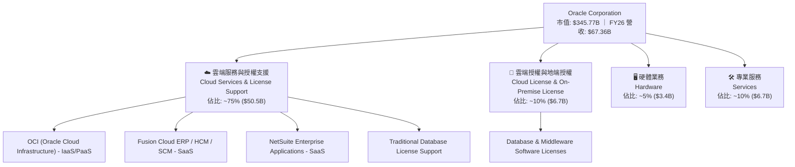

### 2.2 市場份額

在企業級關係型資料庫（Relational Database）與雲端基礎設施（Cloud Infrastructure）領域，Oracle 的市場地位如下：

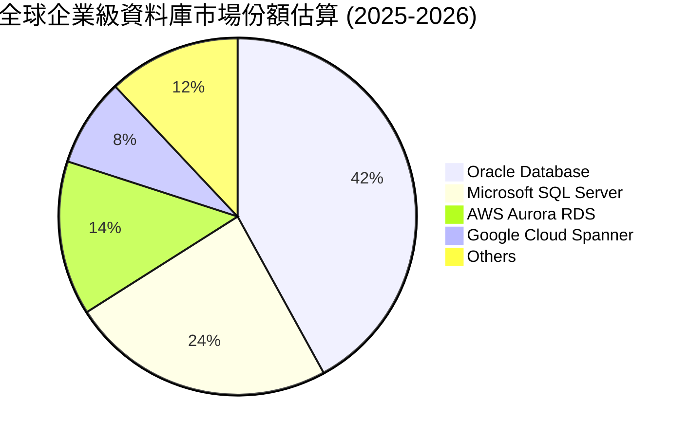

而在雲端基礎設施（IaaS/PaaS）市場，AWS、Azure、GCP 佔據前三，Oracle (OCI) 雖然整體份額約 6-8%，但其在 **AI 算力叢集（Bare Metal GPU Compute）** 領域的市佔率正在快速提升至 15%+。

### 2.3 競爭護城河分析

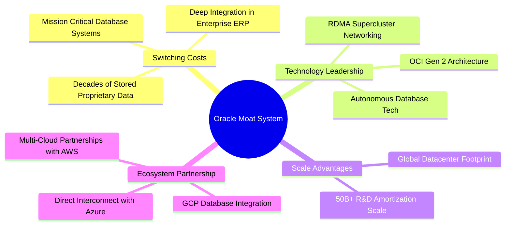

### 2.4 護城河強度評分

```
╔══════════════════════════════════════════════════════════════╗
║                  Oracle Corporation 護城河強度評分           ║
╠══════════════════════════════════════════════════════════════╣
║ 高轉換成本     9.5/10  ▓▓▓▓▓▓▓▓▓▓▓▓▓▓▓▓▓▓▓░  🏆 核心資料庫無法替代║
║ OCI 技術差異化  8.5/10  ▓▓▓▓▓▓▓▓▓▓▓▓▓▓▓▓▓░░░  🟢 Bare Metal RDMA優勢 ║
║ 生態系統網絡   8.5/10  ▓▓▓▓▓▓▓▓▓▓▓▓▓▓▓▓▓░░░  🟢 多雲戰略聯盟突破    ║
║ 規模經濟效應   8.0/10  ▓▓▓▓▓▓▓▓▓▓▓▓▓▓▓▓░░░░  🟢 全球資料中心規模    ║
║ 品牌與信任度   8.5/10  ▓▓▓▓▓▓▓▓▓▓▓▓▓▓▓▓▓░░░  🟢 500強企業深層信任   ║
╠══════════════════════════════════════════════════════════════╣
║ 綜合護城河評分 8.6/10  ▓▓▓▓▓▓▓▓▓▓▓▓▓▓▓▓▓半░  🏆 寬廣且鞏固的護城河  ║
╚══════════════════════════════════════════════════════════════╝
```

---

## 3. 損益表深度分析

### 3.1 年度收入成長趨勢（近4年）

Oracle 近四年營收表現出顯著的加速成長趨勢，這反映出 OCI 雲端業務從初期轉型進入大規模收割期：

```
╔══════════════════════════════════════════════════════════════════╗
║              Oracle 年度收入趨勢（FY2023-FY2026）                ║
╠══════════════════════════════════════════════════════════════════╣
║                                                                  ║
║  FY2023  $49.95B  ██████████████████░░░░░░  YoY: +17.7% 🟢      ║
║  FY2024  $52.96B  ███████████████████░░░░░  YoY: +6.02% 🟢      ║
║  FY2025  $57.40B  █████████████████████░░░  YoY: +8.38% 🟢      ║
║  FY2026  $67.36B  ████████████████████████  YoY:+17.35% 🟢      ║
║                   |      |      |      |                         ║
║                   0     20B    40B    60B                        ║
║                                                                  ║
║  📊 4年複合成長率 (CAGR)：+10.48%                               ║
╚══════════════════════════════════════════════════════════════════╝
```

### 3.2 季度收入趨勢分析

近 4 季收入呈現逐季加速成長，Q4 FY26 更是創造了 $19.18B 的單季新高：

| 季度 | 結束日期 | 總收入 ($B) | YoY 成長率 | QoQ 成長率 | 營運驅動因素分析 |
|------|----------|-------------|------------|------------|------------------|
| **Q1 FY26** | 2025-08-31 | $14.93B | +12.17% | -6.14% | 傳統淡季，但 OCI 需求支撐高於往年同期 |
| **Q2 FY26** | 2025-11-30 | $16.06B | +14.22% | +7.57% | AI 算力集群陸續上線，帶動 IaaS 營收擴張 |
| **Q3 FY26** | 2026-02-28 | $17.19B | +21.66% | +7.04% | 跨雲整合 (Database@Azure/AWS) 開始貢獻顯著營收 |
| **Q4 FY26** | 2026-05-31 | $19.18B | +20.63% | +11.58% | 企業級 Fusion ERP 年底簽約旺季與 OCI 滿載運行 |

### 3.3 利潤率演變分析

| 利潤率指標 | FY2023 | FY2024 | FY2025 | FY2026 | 趨勢變化說明 | 評估 |
|------------|--------|--------|--------|--------|--------------|------|
| **毛利率 (Gross Margin)** | 72.85% | 71.41% | 70.51% | **65.82%** | OCI 折舊與資料中心建置前期成本增加壓低毛利率 | 🟡 結構轉型過渡期 |
| **營業利潤率 (Operating Margin)**| 27.57% | 28.99% | 30.79% | **36.23%** | 規模效應提升，S&M 與 G&A 佔比持續下滑 | 🟢 營業槓桿極為強勁 |
| **EBITDA Margin** | 37.51% | 40.39% | 41.65% | **45.33%** | 現金獲利能力持續創高 | 🟢 現金流含金量高 |
| **淨利率 (Net Margin)** | 17.02% | 19.76% | 21.68% | **25.37%** | 業外收入與營業利潤率同步提升推高淨利率 | 🟢 獲利品質極佳 |

**利潤率深度解析**：毛利率從 FY23 的 72.85% 下降至 FY26 的 65.82%，原因為重資本的 OCI 基礎設施營收比重增加（雲端硬體與電力折舊成本高於軟體授權）。然而，**營業利潤率卻從 27.57% 大幅提升至 36.23%**，展現出極強的營業槓桿——隨著客戶規模擴大，銷售（S&M）與管理（G&A）費用率大幅下降（FY26 SG&A 費用為 $9.95B，佔營收比重由 FY23 的 20.8% 降至 14.8%）。

### 3.4 費用結構分析

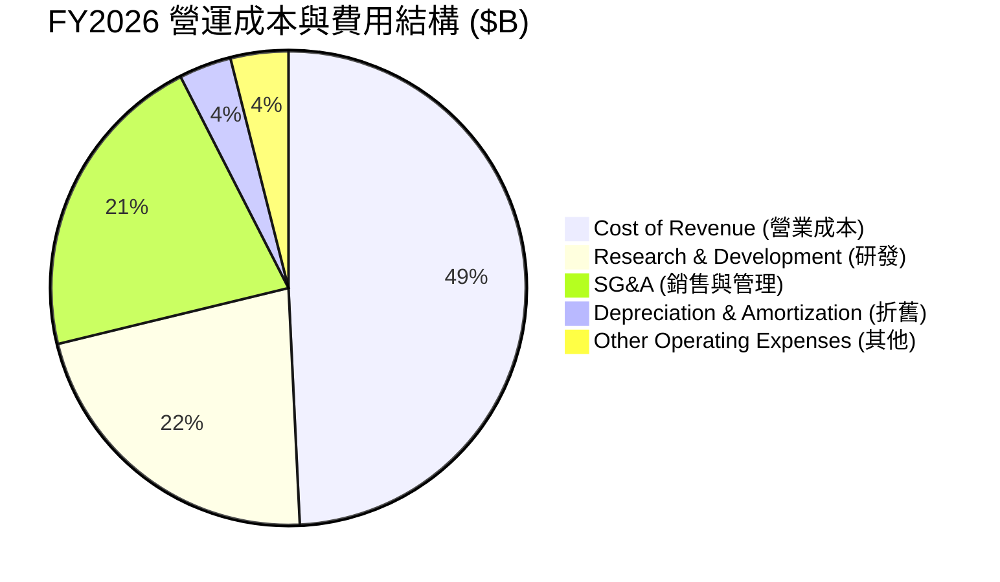

```
╔══════════════════════════════════════════════════════════════════╗
║                   FY2026 費用結構控管效率                        ║
╠══════════════════════════════════════════════════════════════════╣
║  營業成本 (Cost of Revenue) : $23.02B (34.18% Revenue) 🟡 折舊增  ║
║  研發費用 (R&D Expense)     : $10.27B (15.25% Revenue) 🟢 持續創新║
║  銷管費用 (SG&A Expense)    : $9.95B  (14.77% Revenue) 🟢 顯著下降║
║  折舊攤銷 (D&A Expense)     : $1.67B  (2.48% Revenue)  🟢 費用控管║
╚══════════════════════════════════════════════════════════════════╝
```

### 3.5 季度 EPS 趨勢與盈餘品質（Quality of Earnings）

Oracle FY2026 Diluted EPS 達到 **$5.83**（FY25 為 $4.34，YoY +34.3%）。

| 盈餘品質評估項目 | FY2026 數值/佔比 | 機構級評估與洞察 |
|------------------|------------------|------------------|
| **股權薪酬 (SBC) / 營收** | $4.81B / $67.36B = **7.14%** | 🟢 軟體巨頭中屬低水準（對比同業 10-15%），股東稀釋風險低。 |
| **SBC / 營業現金流 (OCF)**| $4.81B / $31.98B = **15.04%** | 🟢 現金流實質含金量高，淨利並非靠非現金補貼堆疊。 |
| **OCF / GAAP 淨利** | $31.98B / $17.09B = **187.1%** | 🟢 現金轉換率極高，證明帳面獲利具備極強現金流支持。 |
| **FCF / GAAP 淨利** | -$23.69B / $17.09B = **-138.6%**| 🔴 因 -$55.66B 歷史級 Capex 導致 FCF 為負，屬於資本支出型轉型。 |
| **有效稅率 (Tax Rate)** | $2.47B / $19.55B = **12.62%** | 🟡 稅率偏低（FY25 為 12.1%），反映海外利潤與稅務抵減優勢。 |

**盈餘品質結論**：Oracle 的 GAAP 淨利具有極高的「現金含金量」（OCF 達淨利的 1.87 倍），SBC 稀釋程度低。目前 FCF 為負完全是由於戰略性建置 OCI AI 資料中心的資本支出（Capex）所致，而非核心營運業務失去造血能力。

---

## 4. 資產負債表分析

### 4.1 資產結構分解

截至 2026 年 5 月 31 日，Oracle 總資產膨脹至 **$261.76B**（FY25 為 $168.36B），主要驅動力來自不動產、廠房及設備（PPE）的狂飆。

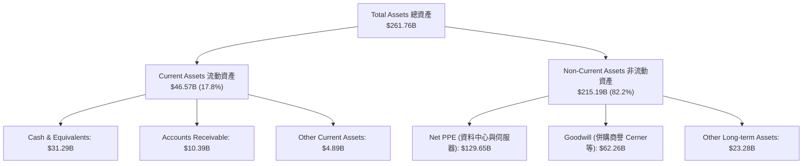

### 4.2 流動性指標分析

| 流動性指標 | FY2023 | FY2024 | FY2025 | FY2026 | 行業平均 | 評估 |
|------------|--------|--------|--------|--------|----------|------|
| **流動比率 (Current Ratio)** | 0.91 | 0.71 | 0.75 | **1.12** | ~1.35 | 🟢 顯著改善，重回 1.0 以上 |
| **速動比率 (Quick Ratio)** | 0.91 | 0.71 | 0.75 | **1.01** | ~1.20 | 🟢 短期償債風險消除 |
| **現金及短期投資 ($B)** | $10.19B | $10.66B | $11.20B | **$31.89B**| - | 🟢 現金儲備創歷史新高 (+184.7%) |

### 4.3 債務結構分析

Oracle 採用了高財務槓桿的資本結構來推動收購與雲端資本支出：

```
╔══════════════════════════════════════════════════════════════════╗
║                   Oracle Corporation 債務結構診斷                ║
╠══════════════════════════════════════════════════════════════════╣
║                                                                  ║
║  短期債務 (Short-Term Debt)   :  $7.20B   ██░░░░░░░░░░░░░░░░░░░  ║
║  長期債務 (Long-Term Debt)    : $122.34B  █████████████████████  ║
║  長期融資租賃 (Finance Lease) : $26.65B   ████░░░░░░░░░░░░░░░░░  ║
║  --------------------------------------------------------------  ║
║  總債務 (Total Debt)          : $156.19B (包含租賃達 $167.43B)   ║
║  現金及等價物 (Total Cash)    : $31.89B   █████░░░░░░░░░░░░░░░░  ║
║  淨債務 (Net Debt)            : $135.54B  🔴 高槓桿風險區        ║
║                                                                  ║
║  Debt / EBITDA                : 4.67x (或以全口徑計算達 5.01x)   ║
║  Interest Coverage Ratio      : 4.88x (Operating Income / Interest) ║
║  評語：財務槓桿偏高，但 $31.98B OCF 確保利息償付無虞             ║
╚══════════════════════════════════════════════════════════════════╝
```

### 4.4 股東權益趨勢

儘管過去多年回購股票導致股東權益曾極低，但隨著盈利持續留存，股東權益正快速回升：
- FY2023：$1.07B
- FY2024：$8.70B
- FY2025：$20.45B
- **FY2026：$42.51B**（淨資產大幅增長 +107.8% YoY，資產負債表強健化）

---

## 5. 現金流量深度分析

### 5.1 現金流量瀑布圖

FY2026 展示了極為震撼的現金流對比：營運現金流爆發，但資本支出達到創紀錄水平。

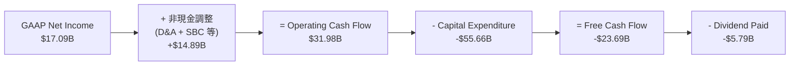

### 5.2 FCF 轉換率趨勢

| 現金流指標 ($B) | FY2023 | FY2024 | FY2025 | FY2026 | 備註說明 |
|-----------------|--------|--------|--------|--------|----------|
| **營業現金流 (OCF)** | $17.16B | $18.67B | $20.82B | **$31.98B** | 年增 +53.60%，展現核心業務極高造血力 |
| **資本支出 (Capex)** | -$8.70B | -$6.87B | -$21.21B | **-$55.66B** | 年增 +162.4%，全面押注 AI/OCI 資料中心 |
| **自由現金流 (FCF)** | $8.47B | $11.81B | -$0.39B | **-$23.69B** | 資本支出高於 OCF，FCF 暫呈負值 |
| **OCF / Net Income** | 201.8% | 178.4% | 167.3% | **187.1%** | 保持高於 150% 水準，營運品質優異 |

### 5.3 自由現金流趨勢

```
╔══════════════════════════════════════════════════════════════════╗
║             Oracle 歷年 FCF 與 Capex 演變 ($B)                   ║
╠══════════════════════════════════════════════════════════════════╣
║  FY23  OCF: $17.16B  | Capex: -$8.70B   | FCF: +$8.47B  🟢       ║
║  FY24  OCF: $18.67B  | Capex: -$6.87B   | FCF: +$11.81B 🟢       ║
║  FY25  OCF: $20.82B  | Capex: -$21.21B  | FCF: -$0.39B  🟡       ║
║  FY26  OCF: $31.98B  | Capex: -$55.66B  | FCF: -$23.69B 🔴       ║
║                                                                  ║
║  💡 分析師視角： Capex 佔營收比重從 FY24 的 13.0% 升至 FY26 的  ║
║     82.6%，這是 Oracle 歷史上最大規模的產能預建，旨在滿足龐大    ║
║     的 RPO (剩餘履約義務) 與 AI 算力預定合約。                   ║
╚══════════════════════════════════════════════════════════════════╝
```

### 5.4 資本配置評估

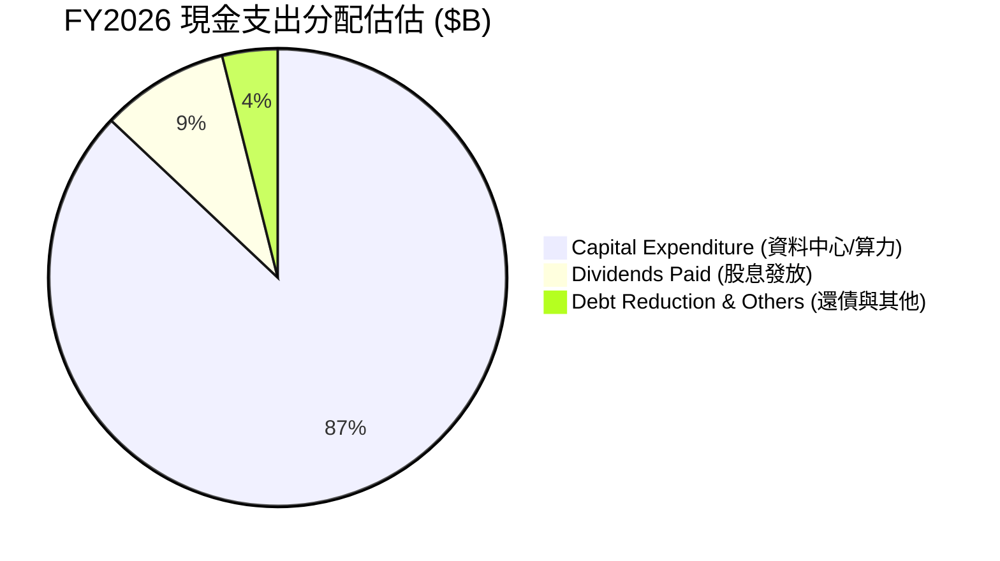

Oracle 目前暫停了大額股票回購（Share Buybacks），將全部資本優先挹注於 **OCI 基礎設施擴充 ($55.66B)** 與 **維持發放現金股息 ($5.79B)**。

---

## 6. 獲利能力與資本效率

### 6.1 ROE / ROA / ROIC 趨勢

| 資本效率指標 | FY2023 | FY2024 | FY2025 | FY2026 | 行業均值 | 評估 |
|--------------|--------|--------|--------|--------|----------|------|
| **ROE (股東權益報酬率)** | 794.7% | 120.3% | 60.8% | **53.4%** | ~18.0% | 🟢 權益擴大後仍保持極高水平 |
| **ROA (總資產報酬率)** | 6.33% | 7.43% | 7.39% | **6.53%** | ~7.50% | 🟡 重資本投資期壓低總資產週轉率 |
| **ROIC (投入資本回報率)**| 13.69% | 12.10% | 11.80% | **11.75%**| ~8.50% | 🟢 穩定維持高於 WACC |

### 6.2 ROIC vs WACC 分析（核心價值創造判斷）

```
╔══════════════════════════════════════════════════════════════════╗
║                Oracle ROIC vs WACC 深度估算                      ║
╠══════════════════════════════════════════════════════════════════╣
║                                                                  ║
║  WACC 估算：                                                     ║
║  ├── 無風險利率 (10Y US Treasury)： 4.20%                        ║
║  ├── 市場風險溢酬 (ERP)：        5.00%                           ║
║  ├── Beta (5Y Monthly)：         1.712                           ║
║  ├── 股權成本 (Cost of Equity)：  4.20% + 1.712 × 5.00% = 12.76%  ║
║  ├── 債務成本 (Pre-tax Debt Cost)： 5.20%                        ║
║  ├── 稅後債務成本：               5.20% × (1 - 12.62%) = 4.54%   ║
║  ├── 資本結構比重：              股權 ~35.0%，債務 ~65.0%        ║
║  └── ✅ WACC ≈ (12.76% × 35%) + (4.54% × 65%) = 7.42% ~ 7.80%    ║
║                                                                  ║
║  ROIC 估算 (FY2026)：                                            ║
║  ├── NOPAT = Operating Income ($22.44B) × (1 - 12.62%) = $19.61B  ║
║  ├── Total Debt ($156.19B) + Equity ($42.51B) - Cash ($31.89B)  ║
║  ├── Invested Capital ≈ $166.81B                                 ║
║  └── ✅ ROIC ≈ $19.61B / $166.81B = 11.75%                       ║
║                                                                  ║
║  ★ 經濟增加值 (EVA) = ROIC (11.75%) - WACC (7.80%) = +3.95pp     ║
║                                                                  ║
║  ROIC  11.75% ▓▓▓▓▓▓▓▓▓▓▓▓▓▓▓▓▓▓▓▓▓▓▓▓░░░░░░  🟢                 ║
║  WACC   7.80% ▓▓▓▓▓▓▓▓▓▓▓▓▓▓▓░░░░░░░░░░░░░░░  ──                 ║
║  EVA   +3.95pp ████████████████████████░░░░░░░░  🏆 持續創造價值║
║                                                                  ║
║  📊 結論：ROIC 超越 WACC 達 3.95 個百分點，顯示大規模 Capex      ║
║     投資依然在大幅創造經濟增加值 (EVA)。                        ║
╚══════════════════════════════════════════════════════════════════╝
```

### 6.3 杜邦三因素分解

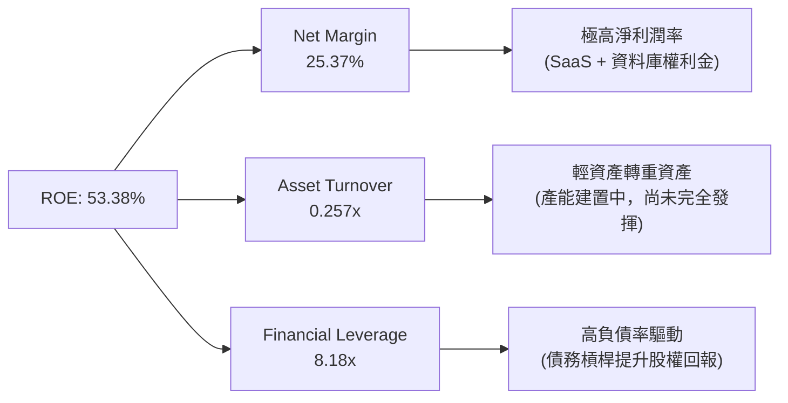

### 6.4 獲利能力儀表板

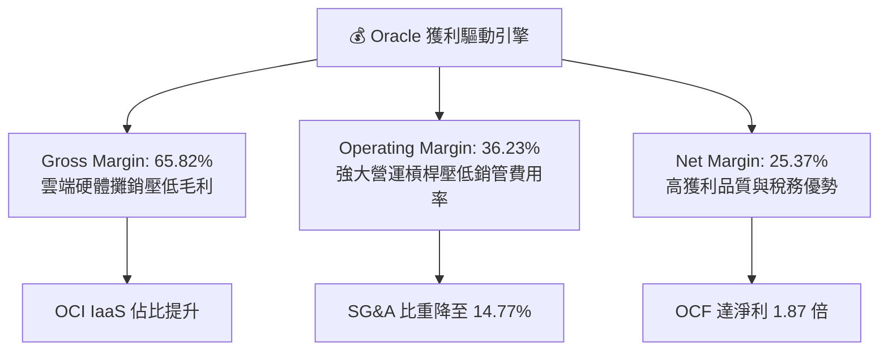

---

## 7. 估值深度分析

### 7.1 同業估值比較表格

點名軟體與雲端巨頭（Microsoft, Amazon, Alphabet）進行跨維度估值比較：

| 估值與成長指標 | **Oracle (ORCL)** | **Microsoft (MSFT)** | **Amazon (AMZN)** | **Alphabet (GOOGL)** | 本公司評估 |
|----------------|-------------------|----------------------|-------------------|----------------------|------------|
| **當前股價** | **$120.04** | ~$440.00 | ~$185.00 | ~$175.00 | 已自高點大幅拉回 |
| **市值 ($B)** | **$345.77B** | ~$3,270B | ~$1,930B | ~$2,150B | 中大型企業級標的 |
| **Trailing P/E** | **20.59x** | 35.2x | 42.1x | 23.5x | 🟢 低於所有雲端巨頭 |
| **Forward P/E**| **11.02x** | 31.0x | 32.5x | 20.1x | 🟢 極度低估 (折價 > 50%) |
| **PEG Ratio** | **0.72x** | 2.10x | 1.45x | 1.25x | 🟢 嚴重低估 (< 1.0x) |
| **P/S Ratio** | **5.13x** | 12.8x | 3.1x | 6.5x | 🟢 軟體巨頭中極低 |
| **EV / EBITDA**| **16.51x** | 22.4x | 15.8x | 15.2x | 🟡 處於合理偏低區間 |
| **ROE (%)** | **53.4%** | 38.5% | 21.2% | 30.1% | 🟢 財務槓桿推高 ROE |
| **Revenue YoY**| **17.35%** | ~15.2% | ~12.5% | ~14.1% | 🟢 增速超越對手 |

### 7.2 歷史估值區間分析

```
╔══════════════════════════════════════════════════════════════════╗
║              Oracle 歷史 P/E 估值區間 (近 5 年)                  ║
╠══════════════════════════════════════════════════════════════════╣
║  歷史高點 (5Y High Forward P/E)  : 38.5x                         ║
║  歷史中位數 (5Y Median P/E)     : 18.5x                         ║
║  歷史低點 (5Y Low P/E)         : 10.5x                         ║
║  --------------------------------------------------------------  ║
║  當前 Forward P/E              : 11.02x  (接近 5 年歷史極致低位)║
║                                                                  ║
║  10.5x [██] 11.02x ------------------- 18.5x ---------------- 38.5x║
║          ▲ 當前位置 (安全邊際極高)                               ║
╚══════════════════════════════════════════════════════════════════╝
```

### 7.3 情境目標價（假設驅動，Bear / Base / Bull）

> **估值倍數選擇說明**：鑑於 Oracle 目前因 -$55.66B 巨額 Capex 導致自由現金流（FCF）暫時為負，且高額 D&A 壓低短期淨利，**使用 Forward P/E 與 EV/EBITDA** 作為核心估值倍數能最精準反映其未來產能上線後的盈餘爆發力。

| 情境假設 | 營收 CAGR (FY26-FY29) | 營業利潤率 | Forward P/E 倍數 | 隱含 12M 目標價 | 相對當前股價漲跌幅 |
|----------|-----------------------|------------|------------------|------------------|--------------------|
| 🔴 **悲觀情境** | 8.0% | 32.0% | 10.0x | **$115.00** | -4.2% |
| 🟡 **基準情境** | **16.5%** | **37.5%** | **18.0x** | **$220.00** | **+83.3%** |
| 🟢 **樂觀情境** | 22.0% | 40.0% | 23.0x | **$320.00** | **+166.6%** |

### 7.4 DCF 敏感性分析（6格目標價矩陣）

設定模型參數：基準預測期 5 年，終值成長率 (Terminal Growth Rate) = 3.0%，隱含 FY27 EPS $10.89。

| 貼現率 (WACC) \ 成長情境 | 🔴 悲觀 (營收 CAGR 8%) | 🟡 基準 (營收 CAGR 16.5%) | 🟢 樂觀 (營收 CAGR 22%) |
|-------------------------|------------------------|---------------------------|------------------------|
| **WACC = 8.8%** | $105.00 (-12.5%) | $198.00 (+65.0%) | $285.00 (+137.4%) |
| **WACC = 7.8% (基準)** | **$115.00 (-4.2%)** | **$220.00 (+83.3%)** | **$320.00 (+166.6%)** |
| **WACC = 6.8%** | $128.00 (+6.6%) | $248.00 (+106.6%) | $360.00 (+199.9%) |

### 7.5 估值綜合區間

```
╔══════════════════════════════════════════════════════════════════╗
║                   Oracle 估值區間與股價定位                      ║
╠══════════════════════════════════════════════════════════════════╣
║  52週股價區間   : $119.44 - $341.82                              ║
║  當前股價       : $120.04                                        ║
║  --------------------------------------------------------------  ║
║  悲觀估值       : $115.00  [██]                                  ║
║  分析師均價     : $248.15  [████████████████████]                ║
║  基準目標價     : $220.00  [██████████████████]                  ║
║  樂觀估值       : $320.00  [██████████████████████████]          ║
║                                                                  ║
║  📊 結論：股價位居 52 週底部 ($119.44)，下行風險極其有限 (-4.2%)， ║
║     上行回報潛力高達 +83.3% 至 +166.6%。                         ║
╚══════════════════════════════════════════════════════════════════╝
```

---

## 8. 成長催化劑

### 8.1 催化劑時間軸

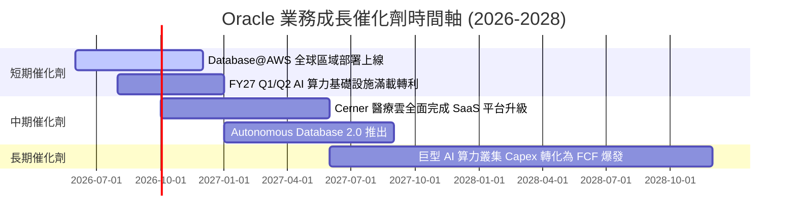

### 8.2 TAM 市場規模分析

```
╔══════════════════════════════════════════════════════════════════╗
║                Oracle 可尋址市場 (TAM) 擴張前景                  ║
╠══════════════════════════════════════════════════════════════════╣
║  1. 全球雲端基礎設施 (IaaS/PaaS) TAM : $350B (2027E)             ║
║     └── OCI 目前市佔率僅 ~7%，若升至 12% 即可增加 $17.5B 營收     ║
║  2. 企業級 ERP / HCM / SCM SaaS TAM  : $120B (2027E)             ║
║     └── Fusion + NetSuite 雙引擎驅動，維持 15%+ 年成長率         ║
║  3. AI 算力託管與大模型訓練 TAM      : $150B (2028E)             ║
║     └── Bare Metal + RDMA 網路架構形成強烈差異化                 ║
╚══════════════════════════════════════════════════════════════════╝
```

### 8.3 成長驅動力結構圖

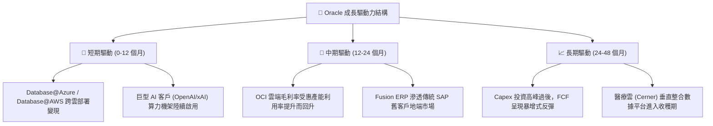

---

## 9. 風險矩陣

### 9.1 風險評分矩陣

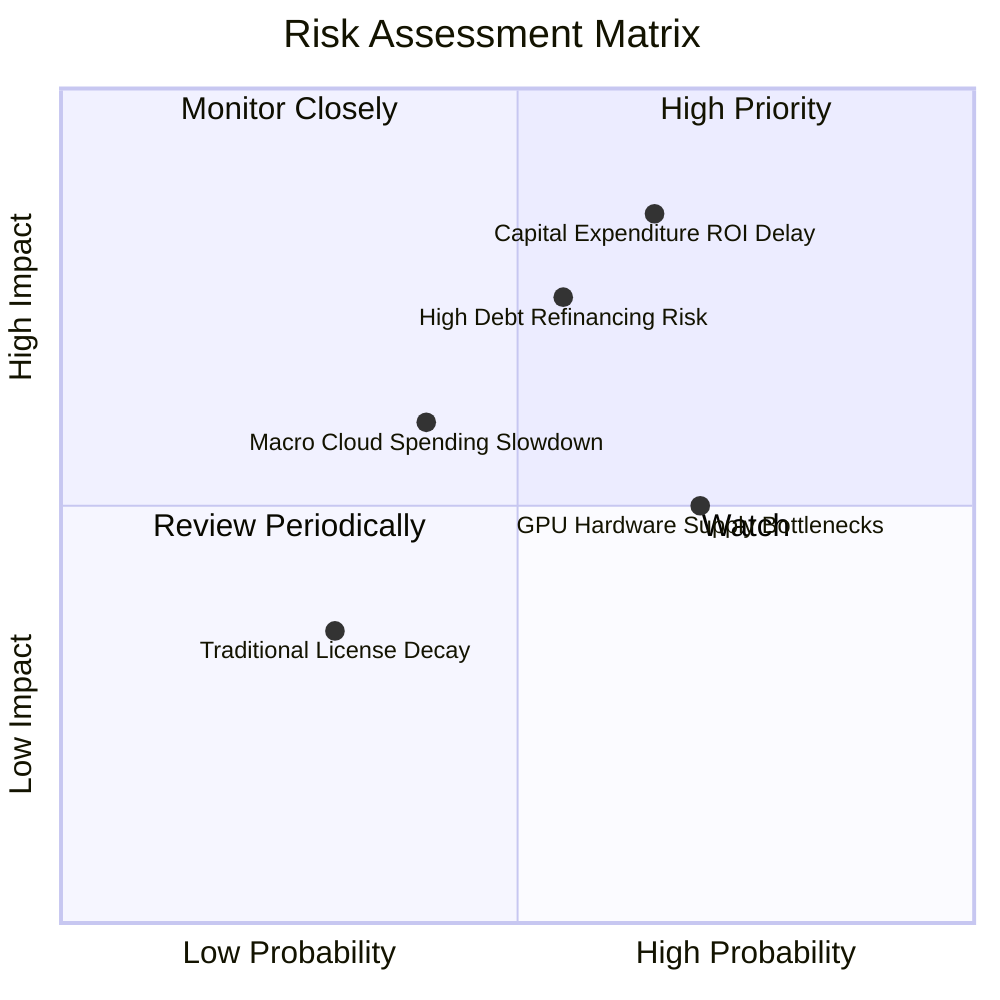

### 9.2 風險清單詳細分析

| # | 風險項目 | 發生機率 | 財務衝擊 | 風險評分 | 緩解措施與觀察指標 |
|---|----------|----------|----------|----------|--------------------|
| 1 | 🔴 **Capex 轉化為營收之時程延遲** | 中高 (65%) | 高 (-15% FCF) | 🔴 **8.1/10** | 觀察剩餘履約義務（RPO）成長率是否高於 Capex 成長率。 |
| 2 | 🔴 **高額債務利息負擔** | 中度 (55%) | 高 (-$1.5B 淨利)| 🔴 **7.5/10** | 營運現金流 $31.98B 高達利息支出 6.95 倍，透過發行長期固定利率債鎖定成本。 |
| 3 | 🟡 **GPU 伺服器與資料中心電力延遲**| 高 (70%) | 中度 (-5% 營收) | 🟡 **6.5/10** | Oracle 積極採多元晶片策略（AMD、Ampere CPU 及 Nvidia）。 |
| 4 | 🟡 **企業雲端支出因宏觀經濟放緩** | 中度 (40%) | 中度 (-8% 營收) | 🟡 **5.5/10** | 核心資料庫具備極高黏性，企業難以在不景氣時砍除核心 IT 系統。 |

---

## 10. 投資建議

### 10.1 最終綜合評級雷達圖

```
╔══════════════════════════════════════════════════════════════╗
║              Oracle (ORCL) 投資綜合評分雷達                  ║
╠══════════════════════════════════════════════════════════════╣
║  基本面強度  :  8.5 / 10  ▓▓▓▓▓▓▓▓▓▓▓▓▓▓▓▓▓░░░               ║
║  成長動能    :  8.5 / 10  ▓▓▓▓▓▓▓▓▓▓▓▓▓▓▓▓▓░░░               ║
║  獲利品質    :  9.0 / 10  ▓▓▓▓▓▓▓▓▓▓▓▓▓▓▓▓▓▓░░               ║
║  財務健康    :  6.5 / 10  ▓▓▓▓▓▓▓▓▓▓▓▓░░░░░░░░               ║
║  估值吸引力  :  8.8 / 10  ▓▓▓▓▓▓▓▓▓▓▓▓▓▓▓▓▓半░               ║
║  護城河深度  :  8.6 / 10  ▓▓▓▓▓▓▓▓▓▓▓▓▓▓▓▓▓半░               ║
║  ----------------------------------------------------------  ║
║  綜合投資評分 :  8.25 / 10 🏆 評級：🟢 強烈推薦買入          ║
╚══════════════════════════════════════════════════════════════╝
```

### 10.2 目標價與隱含報酬率

| 情境 | 機率權重 | 12個月目標價 | 當前股價 ($120.04) 隱含報酬率 | 投資決策 |
|------|----------|--------------|------------------------------|----------|
| 🔴 **悲觀情境** | 15% | **$115.00** | -4.2% | 下行風險受限 |
| 🟡 **基準情境** | **65%** | **$220.00** | **+83.3%** | **核心目標** |
| 🟢 **樂觀情境** | 20% | **$320.00** | **+166.6%** | 超額回報潛力 |
| **加權預期目標價**| 100% | **$224.25** | **+86.8%** | 建議分批建倉 |

### 10.3 買入時機與觸發因素

```
╔══════════════════════════════════════════════════════════════════╗
║                  ✅ 買入觸發因素 Checklist                      ║
╠══════════════════════════════════════════════════════════════════╣
║                                                                  ║
║  立即買入觸發條件（當前已符合）：                                ║
║  ✅ Forward P/E 降至 12x 以下（當前 11.02x）                    ║
║  ✅ PEG Ratio 降至 0.8x 以下（當前 0.72x）                      ║
║  ✅ 股價接近 52 週低點 ($119.44)，提供極高安全邊際               ║
║  ✅ 營業現金流突破 $30B 大關（當前 $31.98B）                    ║
║                                                                  ║
║  後續加碼觸發條件（逢低或趨勢確認）：                            ║
║  ☐ OCI 單季營收增速突破 50% YoY                                 ║
║  ☐ 單季 FCF 止跌回升轉正                                        ║
║  ☐ RPO（積壓訂單）年增率超越 30%                                ║
║                                                                  ║
║  減碼/停損觸發條件（出現以下任一）：                             ║
║  ☐ OCI 營收年增率連續兩季跌破 15%                               ║
║  ☐ 營業利潤率較目前 (36.2%) 縮減超過 500 bps (至 < 31.2%)       ║
╚══════════════════════════════════════════════════════════════════╝
```

### 10.4 投資人適配度分析

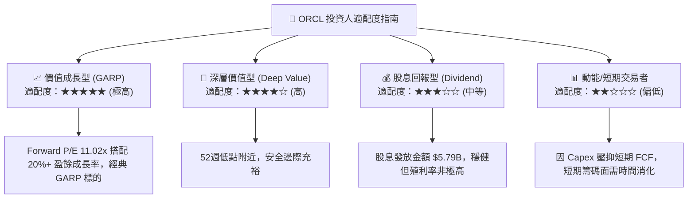

### 10.5 每季財報監控清單（Quarterly Watch List）

為確保本報告之投資論點持續成立，投資人應於每季財報公佈時比對以下核心指標：

| 監控指標 | 當前基準值 (FY26) | 正常健康區間 | 警訊觸發門檻（需重新評估） |
|----------|-------------------|--------------|----------------------------|
| **OCI 雲端基礎設施增速** | ~45-50% YoY | > 35% YoY | **< 20% YoY** (成長引擎熄火) |
| **營業利潤率 (Operating Margin)** | 36.23% | 34.0% - 38.0% | **< 31.0%** (成本控管失效) |
| **營業現金流 (OCF)** | $31.98B / 年 | > $30.0B / 年 | **< $25.0B** (核心造血能力下滑) |
| **剩餘履約義務 (RPO)** | ~$80B+ | YoY 成長 > 20% | **YoY 成長 < 5%** (訂單動能枯竭) |
| **Net Debt / EBITDA** | 4.05x | < 4.50x | **> 5.50x** (財務槓桿過度惡化) |

### 10.6 反面論證：什麼會證明論點錯誤（What Would Change My Mind）

```
╔══════════════════════════════════════════════════════════════════╗
║              ⚠️ 論點失效條件（Disconfirming Evidence）           ║
╠══════════════════════════════════════════════════════════════════╣
║  若發生下列任二量化條件，本投資報告之「買入」評級將立即失效：     ║
║                                                                  ║
║  1. 資本支出回報遞延破壞 EVA：                                  ║
║     若 FY2027-2028 巨額 Capex 投資無法帶動 OCI 營收年增率維持在 25% ║
║     以上，導致 ROIC 跌破 WACC (7.80%)，顯示資本處於摧毀價值狀態。 ║
║                                                                  ║
║  2. 核心資料庫客戶出現大規模流失：                              ║
║     若 Cloud Services & License Support 營收年增率轉負，顯示企業 ║
║     客戶加速從 Oracle Database 轉移至 PostgreSQL 或 AWS Aurora。║
║                                                                  ║
║  3. 利息覆蓋率大幅惡化：                                         ║
║     若再融資利率高企導致利息支出暴增，利息保障倍數降至 2.5x 以下。║
╚══════════════════════════════════════════════════════════════════╝
```

---

> **免責聲明**：本報告為機構級基本面研究資料，僅供學術與投資研究參考，不構成任何個人化的投資建議或買賣邀約。投資人應獨立評估市場風險，並視個人財務狀況諮詢專業投資顧問。