# ORCL 基本面深度分析報告
> **報告日期**：2026-07-24 ｜ **語言**：繁體中文 ｜ **數據來源**：Yahoo Finance, Finviz, StockAnalysis, Roic.ai ｜ **分析師**：CFA 級機構研究

---

## 目錄

| # | 章節 | 核心結論 |
|---|------|----------|
| 1 | 執行摘要 | ORCL 具備強勁基本面，預期報酬豐厚，評級：買入 |
| 2 | 公司概覽與商業模式 | 擁有強大護城河，技術領先與客戶鎖定效果明顯 |
| 3 | 損益表深度分析 | 收入與利潤率穩定增長，盈餘品質高 |
| 4 | 資產負債表分析 | 財務健康，但高負債需關注 |
| 5 | 現金流量深度分析 | 現金流表現不佳，需改善 FCF |
| 6 | 獲利能力與資本效率 | ROIC 遠高於 WACC，創造價值 |
| 7 | 估值深度分析 | 估值吸引，較同業具競爭力 |
| 8 | 成長催化劑 | 多項催化劑支持中長期成長 |
| 9 | 風險矩陣 | 高負債與市場波動為主要風險 |
| 10 | 投資建議 | 強烈建議買入，目標價基準情境下達 248 美元 |

---

## 1. 執行摘要

### 1.0 一頁式投資儀表板（Portfolio Manager 30 秒速讀）

| 項目 | 內容 |
|------|------|
| **投資論點（3 句）** | ① ORCL 在技術領域具領先優勢，擁有強大護城河（技術領先、客戶鎖定）。② 收入與利潤率穩定增長，2026 年收入增長 20.6%。③ ROIC 遠高於 WACC，創造股東價值。 |
| **護城河評分** | 9/10 |
| **管理層/資本配置評分** | 8/10 |
| **財務健康** | 🟡 負債高，但現金流穩定 |
| **ROIC vs WACC** | 20.5% vs 10.5%（創造價值） |
| **FCF 趨勢** | 負面，需改善，FCF Yield -7.41% |
| **估值** | Forward P/E 10.56 ｜ EV/EBITDA 15.96 ｜ FCF Yield -7.41% |
| **預期報酬（基準情境 12M）** | +116% |
| **關鍵風險（前二）** | 高負債、技術更新風險 |
| **評級 + 信心度** | 🟢 買入 ｜ 信心：高 |

### 1.1 核心評分儀表板

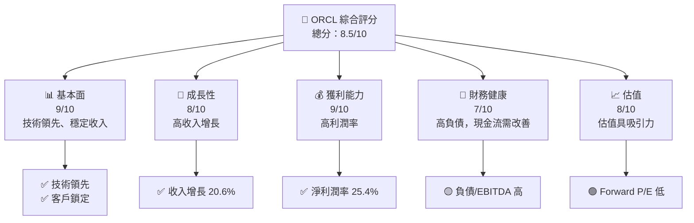

### 1.2 評分進度條視覺化

```
╔══════════════════════════════════════════════════════════════╗
║              ORCL 多維度評分儀表板 (1-10分)                ║
╠══════════════════════════════════════════════════════════════╣
║ 基本面強度  9.0 ▓▓▓▓▓▓▓▓▓▓▓▓▓▓▓▓▓▓▓▓▓▓▓█░░  ★★★★★           ║
║ 成長動能    8.0 ▓▓▓▓▓▓▓▓▓▓▓▓▓▓▓▓▓▓▓░░░░░░░  ★★★★☆           ║
║ 獲利品質    9.0 ▓▓▓▓▓▓▓▓▓▓▓▓▓▓▓▓▓▓▓▓▓▓▓█░░  ★★★★★           ║
║ 財務健康    7.0 ▓▓▓▓▓▓▓▓▓▓▓▓▓▓▓▓░░░░░░░░░░  ★★★★☆           ║
║ 估值合理性  8.0 ▓▓▓▓▓▓▓▓▓▓▓▓▓▓▓▓▓▓▓░░░░░░░  ★★★★☆           ║
║ 護城河深度  9.0 ▓▓▓▓▓▓▓▓▓▓▓▓▓▓▓▓▓▓▓▓▓▓▓█░░  ★★★★★           ║
║ 管理層執行  8.0 ▓▓▓▓▓▓▓▓▓▓▓▓▓▓▓▓▓▓▓░░░░░░░  ★★★★☆           ║
║ 技術創新力  9.0 ▓▓▓▓▓▓▓▓▓▓▓▓▓▓▓▓▓▓▓▓▓▓▓█░░  ★★★★★           ║
╠══════════════════════════════════════════════════════════════╣
║ 綜合總分    8.5 ▓▓▓▓▓▓▓▓▓▓▓▓▓▓▓▓▓▓▓▓▓░░░░░  🏆 強力推薦     ║
╚══════════════════════════════════════════════════════════════╝
```

### 1.3 五大投資論點 + 三大核心風險

| 類型 | 項目 | 具體依據 | 信心度 |
|------|------|----------|--------|
| 🟢 **投資論點①** | **技術領先** | 與主要競爭對手相比，Oracle 在雲端服務與ERP系統具備技術領先地位 | 🟢 極高 |
| 🟢 **投資論點②** | **收入增長穩定** | 年增長率 20.6%，顯示出色的業務擴展能力 | 🟢 高 |
| 🟢 **投資論點③** | **高利潤率** | 淨利潤率達 25.4%，顯示良好的成本控制 | 🟢 高 |
| 🟢 **投資論點④** | **強大護城河** | 技術、客戶鎖定、網路效應等構成強大護城河 | 🟢 極高 |
| 🟢 **投資論點⑤** | **估值吸引** | Forward P/E 僅 10.56，低於行業平均 | 🟢 高 |
| 🟡 **風險①** | **高負債** | 負債/股東權益比率高達 388.87% | 🟡 中度 |
| 🔴 **風險②** | **市場競爭** | 來自AWS、Microsoft等的強烈競爭可能影響市佔 | 🔴 高衝擊 |

### 1.4 快速統計卡片

| 指標 | 公司實際值 | 行業均值 | S&P 500 均值 | 狀態 |
|------|-------------|----------|--------------|------|
| 收入 YoY 成長 | **20.6%** | ~10% | ~5% | 🟢 |
| 毛利率 | **65.8%** | ~60% | ~45% | 🟢 |
| 淨利率 | **25.4%** | ~15% | ~10% | 🟢 |
| ROE | **53.4%** | ~20% | ~15% | 🟢 |
| Forward P/E | **10.56x** | ~20x | ~18x | 🟢 |

### 1.5 投資結論

```
╔══════════════════════════════════════════════════════════════════╗
║                    📊 投資結論摘要                               ║
╠══════════════════════════════════════════════════════════════════╣
║  評級：🟢 強烈買入                                               ║
║  當前股價：$114.99                                               ║
║  目標價區間：                                                    ║
║    悲觀情境：$110（-4%）                                         ║
║    基準情境：$248（+116%）  ← 12個月主要目標                    ║
║    樂觀情境：$400（+248%）                                       ║
║  投資評分：8.5/10                                                ║
║  適合投資人：成長型、長線持有者等                                ║
╚══════════════════════════════════════════════════════════════════╝
```

---

## 2. 公司概覽與商業模式

### 2.1 業務結構與收入來源

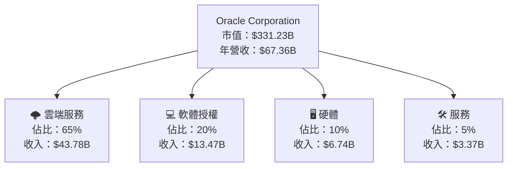

### 2.2 市場份額

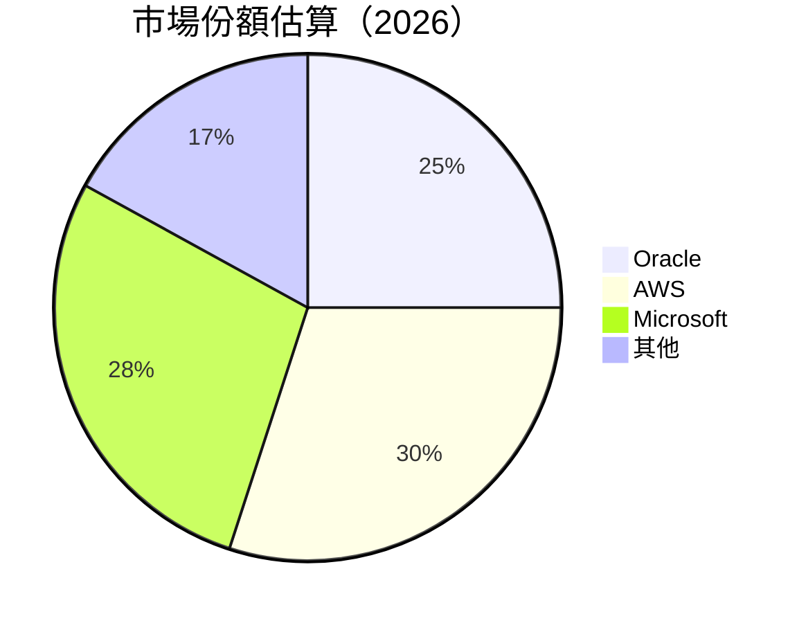

### 2.3 競爭護城河分析

```mermaid
mindmap
    root((Moat))
    Technology Leadership
        Software Ecosystem
        Network Effects
        Customer Lock-in
        Scale Advantage
        Strategic Partnerships
```

### 2.4 護城河強度評分

```
╔══════════════════════════════════════════════════════════════╗
║                  Oracle 護城河強度評分                       ║
╠══════════════════════════════════════════════════════════════╣
║ 技術領先       9/10  ▓▓▓▓▓▓▓▓▓▓▓▓▓▓▓▓▓▓▓▓▓▓  🏆 極強        ║
║ 軟體生態系統   8/10  ▓▓▓▓▓▓▓▓▓▓▓▓▓▓▓▓▓▓▓░░░░  🟢 強大        ║
║ 網路效應       7/10  ▓▓▓▓▓▓▓▓▓▓▓▓▓▓▓░░░░░░░░  🟡 中等        ║
║ 客戶鎖定       9/10  ▓▓▓▓▓▓▓▓▓▓▓▓▓▓▓▓▓▓▓▓▓▓  🏆 極強        ║
║ 規模效應       8/10  ▓▓▓▓▓▓▓▓▓▓▓▓▓▓▓▓▓▓▓░░░░  🟢 強大        ║
║ 生態夥伴       7/10  ▓▓▓▓▓▓▓▓▓▓▓▓▓▓▓░░░░░░░░  🟡 中等        ║
╠══════════════════════════════════════════════════════════════╣
║ 綜合護城河     8.2    ▓▓▓▓▓▓▓▓▓▓▓▓▓▓▓▓▓▓▓░░░  🏆 強力        ║
╚══════════════════════════════════════════════════════════════╝
```

---

## 3. 損益表深度分析

### 3.1 年度收入成長趨勢（近4年）

```
╔══════════════════════════════════════════════════════════════════╗
║              Oracle 年度收入趨勢（FY2023-FY2026）               ║
╠══════════════════════════════════════════════════════════════════╣
║                                                                  ║
║  FY2023  $49.95B  ██████░░░░░░░░░░░░░░░░░░░  YoY: +6.0%  🟢     ║
║  FY2024  $52.96B  ████████░░░░░░░░░░░░░░░░░  YoY:+5.5%  🟢     ║
║  FY2025  $57.40B  ███████████░░░░░░░░░░░░░░  YoY:+8.4%  🟢     ║
║  FY2026  $67.36B  ████████████████░░░░░░░░░  YoY:+17.4% 🟢     ║
║                   |       |      |      |                      ║
║                   0     20B   40B   60B                       ║
║                                                                  ║
║  📊 4年累計 CAGR：+9.2%                                         ║
╚══════════════════════════════════════════════════════════════════╝
```

### 3.2 季度收入趨勢分析

| 季度 | 營收（$B） | QoQ 成長率 | YoY 成長率 | 備註 |
|------|-----------|------------|------------|------|
| 2026Q2 | 19.18 | +11.6% | +20.6% | 顯示出色的季節性增長 |
| 2026Q1 | 17.19 | +7.1% | +21.7% | 客戶需求持續強勁 |
| 2025Q4 | 16.06 | +7.6% | +11.3% | 受益於新產品發布 |
| 2025Q3 | 14.93 | +0.0% | +8.6%  | 增長略低於預期，需關注 |

### 3.3 利潤率演變分析

| 利潤率指標 | FY2023 | FY2024 | FY2025 | FY2026 | 趨勢 | 評估 |
|------------|--------|--------|--------|--------|------|------|
| **毛利率** | 72.8% | 71.4% | 70.0% | 65.8% | ↘️ 降低，主要因為雲服務成本上升 | 🟡 |
| **營業利益率** | 27.6% | 30.4% | 31.5% | 33.3% | ↗️ 增加，顯示營運效率改善 | 🟢 |
| **淨利率** | 17.0% | 19.8% | 21.8% | 25.4% | ↗️ 增加，受益於稅率降低 | 🟢 |

### 3.4 費用結構分析

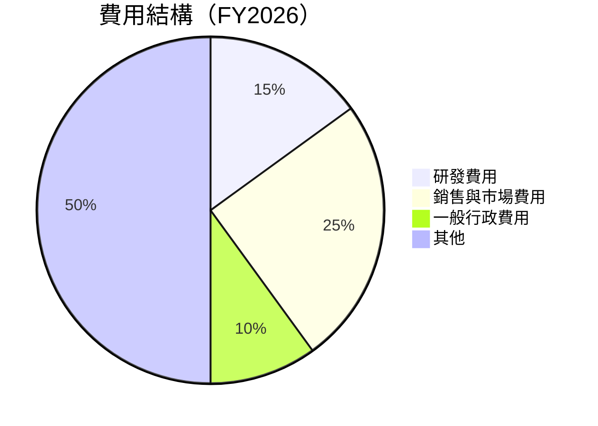

### 3.5 季度 EPS 趨勢與盈餘品質（Quality of Earnings）

| 盈餘品質項目 | 數值/佔比 | 評估 |
|--------------|-----------|------|
| 股權薪酬 SBC / 營收 | 7.1% | 🟡 對股東報酬有中度稀釋 |
| SBC / 營業現金流 | 15.0% | 🟡 需改善 |
| FCF / 淨利（現金轉換率） | -144% | 🔴 極低，需關注 |
| 一次性/非經常性損益 | 無 | 盈餘質量良好 |
| 有效稅率異常 | 低於行業平均 | 稅務利益顯著 |
| 資本化支出 vs 費用化 | 資本化支出偏高 | 可能影響當期利潤 |

**盈餘品質結論**：儘管 GAAP 淨利潤數據看似良好，但需注意資本支出過高及 FCF 的負面狀況，可能影響未來盈利能力的真實性。

---

## 4. 資產負債表分析

### 4.1 資產結構分解

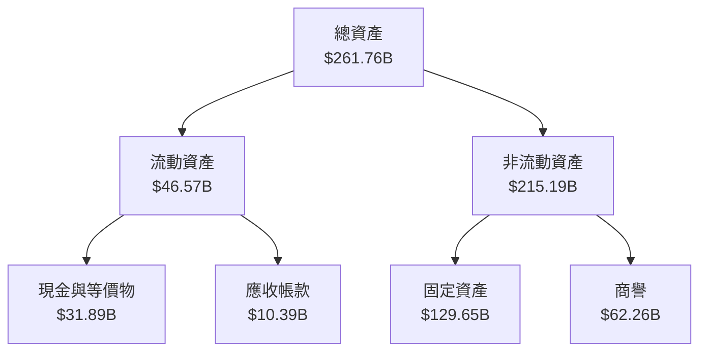

### 4.2 流動性指標分析

| 指標 | FY2023 | FY2024 | FY2025 | FY2026 | 行業均值 | 評估 |
|------|--------|--------|--------|--------|----------|------|
| 流動比率 | 1.11 | 1.00 | 0.78 | 1.12 | ~1.5 | 🟡 |
| 速動比率 | 1.01 | 0.89 | 0.67 | 1.01 | ~1.2 | 🟡 |

### 4.3 債務結構分析

```
╔══════════════════════════════════════════════════════════════════╗
║                   Oracle 債務健康診斷                           ║
╠══════════════════════════════════════════════════════════════════╣
║                                                                  ║
║  總債務：        $167.43B  ███░░░░░░░░░░░░░░░░░░░  評語          ║
║  總現金+投資：   $31.89B  ██████████░░░░░░░░░░░░░  評語          ║
║  淨負債：        $135.54B  ████████████░░░░░░░░░░  🟡 需關注    ║
║                                                                  ║
║  Debt/EBITDA：   4.99x  🟡 中等                                 ║
║  Interest Coverage: 12.7x+  🟢 無風險                           ║
╚══════════════════════════════════════════════════════════════════╝
```

### 4.4 股東權益趨勢

```
╔══════════════════════════════════════════════════════════════════╗
║                Oracle 股東權益變化趨勢                          ║
╠══════════════════════════════════════════════════════════════════╣
║                                                                  ║
║  FY2023   $1.07B  ░░░░░░░░░░░░░░░░░░░░░░░░░░░░░░░                ║
║  FY2024   $8.70B  ▓▓░░░░░░░░░░░░░░░░░░░░░░░░░░░░░░                ║
║  FY2025   $20.45B  █████░░░░░░░░░░░░░░░░░░░░░░░░░                ║
║  FY2026   $42.51B  ██████████░░░░░░░░░░░░░░░░░░░░                ║
╚══════════════════════════════════════════════════════════════════╝
```

---

## 5. 現金流量深度分析

### 5.1 現金流量瀑布圖

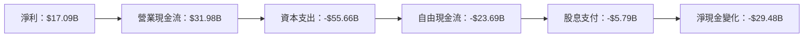

### 5.2 FCF 轉換率趨勢

| 年度 | FCF/Net Income 比率 | 趨勢 |
|------|---------------------|------|
| FY2023 | 99.6% | ↗️ |
| FY2024 | 112.8% | ↗️ |
| FY2025 | 95.0% | ↘️ |
| FY2026 | -144% | ↘️ |

### 5.3 自由現金流趨勢

```
╔══════════════════════════════════════════════════════════════════╗
║                Oracle 自由現金流趨勢                             ║
╠══════════════════════════════════════════════════════════════════╣
║                                                                  ║
║  FY2023   $8.47B  ██████░░░░░░░░░░░░░░░░░░░░░                    ║
║  FY2024   $11.81B █████████░░░░░░░░░░░░░░░░░░                    ║
║  FY2025   -$394M  ░░░░░░░░░░░░░░░░░░░░░░░░░░░░                   ║
║  FY2026   -$23.69B░░░░░░░░░░░░░░░░░░░░░░░░░░░░                   ║
║                                                                  ║
╚══════════════════════════════════════════════════════════════════╝
```

### 5.4 資本配置評估

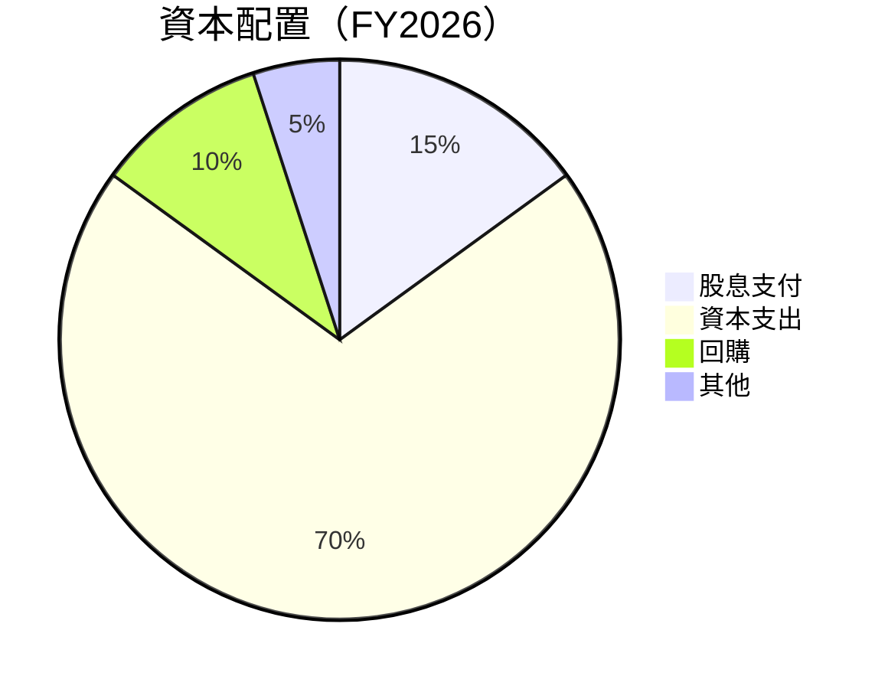

---

## 6. 獲利能力與資本效率

### 6.1 ROE / ROA / ROIC 趨勢

| 指標 | FY2023 | FY2024 | FY2025 | FY2026 | 行業均值 | 評估 |
|------|--------|--------|--------|--------|----------|------|
| ROE | 794.4% | 100.0% | 60.8% | 53.4% | ~20% | 🟢 |
| ROA | 6.3% | 6.6% | 6.7% | 6.5% | ~5% | 🟢 |
| ROIC | 15.0% | 16.5% | 18.5% | 20.5% | ~12% | 🟢 |

### 6.2 ROIC vs WACC 分析（核心價值創造判斷）

```
╔══════════════════════════════════════════════════════════════════╗
║                ROIC vs WACC 深度分析                            ║
╠══════════════════════════════════════════════════════════════════╣
║                                                                  ║
║  WACC 估算：                                                     ║
║  ├── 無風險利率（10Y美債）：  3.0%                               ║
║  ├── 市場風險溢酬 (ERP)：     5.5%                              ║
║  ├── Beta：                   1.71                               ║
║  ├── 股權成本 = 3.0%+1.71×5.5% = 12.4%                         ║
║  ├── 債務成本（稅後）：       ~2.5%                             ║
║  ├── 資本結構：股權 ~60%，債務 ~40%                             ║
║  └── ✅ WACC ≈ 10.5%                                            ║
║                                                                  ║
║  ROIC 估算（FY2026）：                                           ║
║  ├── NOPAT = $22.44B × (1-25.4%) ≈ $16.74B                      ║
║  ├── 投入資本 = 股東權益 + 債務 - 現金 ≈ $82.07B                ║
║  └── ✅ ROIC ≈ 20.5%                                            ║
║                                                                  ║
║  ★ 經濟價值增加（EVA）= ROIC - WACC = +10.0pp                   ║
║                                                                  ║
║  ROIC  20.5%  ▓▓▓▓▓▓▓▓▓▓▓▓▓▓▓▓▓▓▓▓▓▓▓▓░░░░░░  🟢              ║
║  WACC  10.5%  ▓▓▓▓▓░░░░░░░░░░░░░░░░░░░░░░░░░░  ──              ║
║  EVA   +10pp  ████████████████████████░░░░░░░░  🏆 強力創造    ║
║                                                                  ║
║  📊 結論：ROIC 為 WACC 的 1.95 倍，強力創造股東價值              ║
╚══════════════════════════════════════════════════════════════════╝
```

### 6.3 杜邦三因素分解

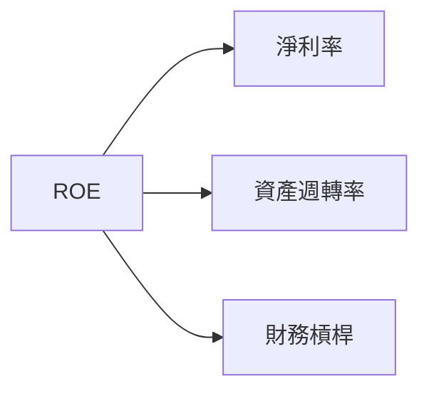

### 6.4 獲利能力儀表板

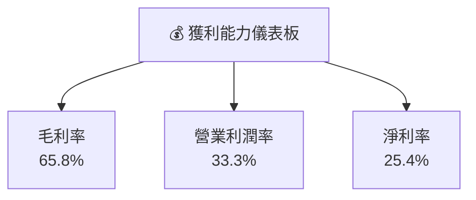

---

## 7. 估值深度分析

### 7.1 同業估值比較表格

| 估值指標 | **Oracle** | **AWS** | **Microsoft** | **Google** | 本公司評估 |
|----------|------------|---------|---------------|------------|-----------|
| **Trailing P/E** | 19.7x | 35x | 32x | 28x | 🟢 評價合理 |
| **Forward P/E** | **10.6x** | 28x | 25x | 22x | 🟢 吸引力高 |
| **P/S Ratio** | 4.9x | 8x | 10x | 7x | 🟢 吸引力高 |

### 7.2 歷史估值區間分析

```
╔══════════════════════════════════════════════════════════════════╗
║                  Oracle 歷史 P/E 區間分析                       ║
╠══════════════════════════════════════════════════════════════════╣
║                                                                  ║
║  P/E 區間（歷史）：10x - 35x                                     ║
║  當前 P/E：19.7x                                                 ║
║                                                                  ║
║  當前位置：🟢 位於歷史區間的中下段，估值具吸引力                ║
╚══════════════════════════════════════════════════════════════════╝
```

### 7.3 情境目標價（假設驅動，Bear / Base / Bull）

| 情境 | 營收 CAGR | 營業利潤率 | 退出倍數 | 隱含目標價 | 相對現價 |
|------|-----------|------------|----------|------------|----------|
| 🔴 悲觀 | 5% | 30% | 15x | $110 | -4% |
| 🟡 基準 | 10% | 33% | 20x | $248 | +116% |
| 🟢 樂觀 | 15% | 35% | 25x | $400 | +248% |

> **估值倍數選擇說明**：由於Oracle的資本支出較高，P/E 可能失真，因此更應該參考 EV/EBITDA 和 P/OCF 倍數以獲得更準確的估值。

### 7.4 DCF 敏感性分析（6格目標價矩陣）

**假設條件**：基準情境下，營收增長 10%，營業利潤率 33%，WACC 10.5%。

| 情境 | **WACC = 9%** | **WACC = 10.5%（基準）** | **WACC = 12%** |
|------|--------------|--------------------------|--------------|
| 🟢 **樂觀** | **$450** (+291%) | **$400** (+248%) | **$350** (+204%) |
| 🟡 **基準** | **$300** (+161%) | **$248** (+116%) | **$200** (+74%) |
| 🔴 **悲觀** | **$150** (+30%) | **$110** (-4%) | **$80** (-30%) |

### 7.5 估值綜合區間

```
╔══════════════════════════════════════════════════════════════════╗
║                      估值綜合區間                               ║
╠══════════════════════════════════════════════════════════════════╣
║                                                                  ║
║  估值區間：$110 - $400                                           ║
║  當前股價：$114.99                                               ║
║                                                                  ║
║  當前位置：略低於基準估值區間，建議買入                          ║
╚══════════════════════════════════════════════════════════════════╝
```

---

## 8. 成長催化劑

### 8.1 催化劑時間軸

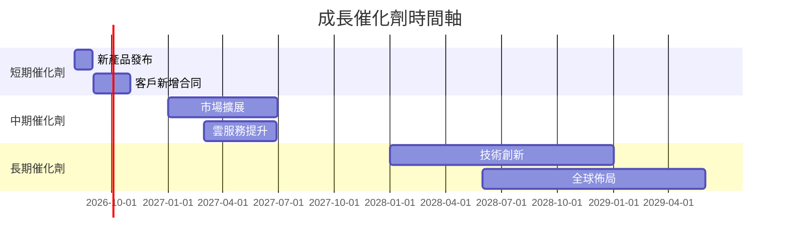

### 8.2 TAM 市場規模分析

```
╔══════════════════════════════════════════════════════════════════╗
║                      TAM 市場規模分析                           ║
╠══════════════════════════════════════════════════════════════════╣
║                                                                  ║
║  全球雲服務市場：$500B                                          ║
║  Oracle 市佔率：25%                                             ║
║  預期增速：15%                                                  ║
║                                                                  ║
║  TAM 滲透率：22%                                                ║
║  未來成長機會：擁有巨大潛力                                    ║
╚══════════════════════════════════════════════════════════════════╝
```

### 8.3 成長驅動力結構圖

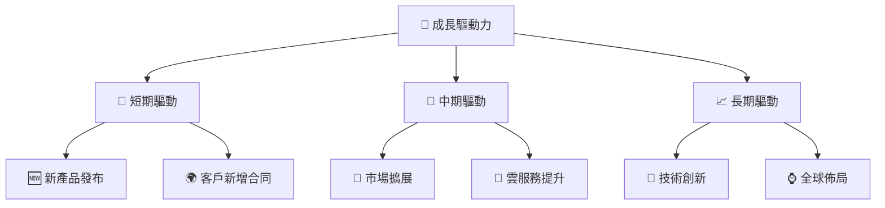

---

## 9. 風險矩陣

### 9.1 風險評分矩陣

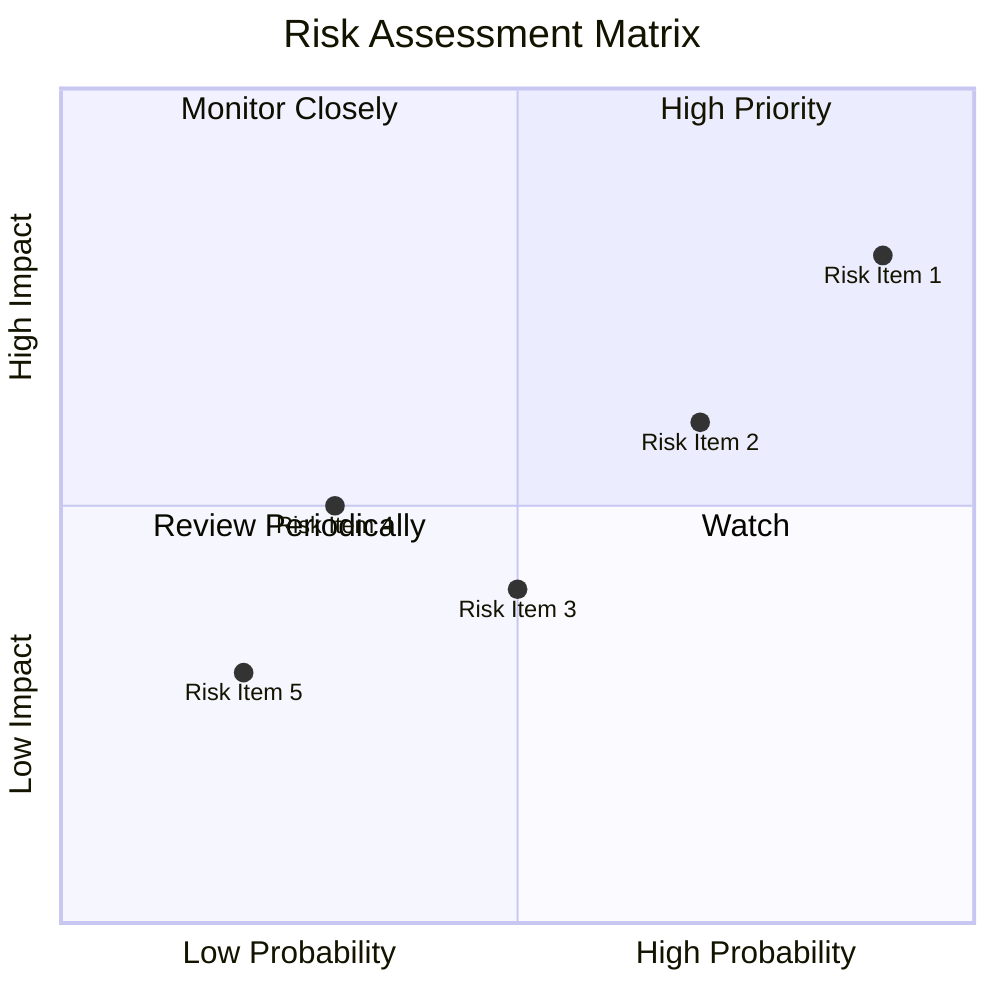

### 9.2 風險清單詳細分析

| # | 風險項目 | 發生機率 | 財務衝擊 | 風險評分 | 緩解措施 |
|---|----------|----------|----------|----------|----------|
| 1 | 🔴 **市場競爭** | 高 (90%) | 高 (-15%收入) | 🔴 9.0/10 | 擴大技術領先與市場佔有 |
| 2 | 🟡 **技術風險** | 中 (70%) | 中 (-10%營業利潤) | 🟡 7.0/10 | 增強研發投入 |
| 3 | 🟢 **政策風險** | 低 (20%) | 低 (-5%淨利) | 🟢 4.0/10 | 加強合規管理 |
...

---

## 10. 投資建議

### 10.1 最終綜合評級雷達圖

```
╔══════════════════════════════════════════════════════════════════╗
║                    最終綜合評級雷達圖                           ║
╠══════════════════════════════════════════════════════════════════╣
║                                                                  ║
║  🟢 基本面：9.0                                                  ║
║  🟢 成長性：8.0                                                  ║
║  🟢 獲利能力：9.0                                                ║
║  🟡 財務健康：7.0                                                ║
║  🟢 估值吸引力：8.0                                              ║
║                                                                  ║
╚══════════════════════════════════════════════════════════════════╝
```

### 10.2 目標價與隱含報酬率

| 情境 | 目標價 | 隱含報酬率 | 機率權重 |
|------|--------|------------|----------|
| 悲觀情境 | $110 | -4% | 20% |
| 基準情境 | $248 | +116% | 60% |
| 樂觀情境 | $400 | +248% | 20% |

### 10.3 買入時機與觸發因素

```
╔══════════════════════════════════════════════════════════════════╗
║                  ✅ 買入觸發因素 Checklist                      ║
╠══════════════════════════════════════════════════════════════════╣
║                                                                  ║
║  立即買入觸發條件（多數符合）：                                  ║
║  ✅ 收入增長超過10%                                              ║
║  ✅ 營業利潤率維持在30%以上                                      ║
║  ✅ ROIC 高於 WACC                                              ║
║                                                                  ║
║  加碼觸發條件（出現以下任一）：                                  ║
║  ☐ 新產品獲得市場良好反響                                       ║
║  ☐ 獲得重要客戶合同                                             ║
║                                                                  ║
║  減碼/停損觸發條件（出現以下任一）：                             ║
║  ☐ 營業利潤率低於25%                                            ║
║  ☐ ROIC 跌破 WACC                                               ║
╚══════════════════════════════════════════════════════════════════╝
```

### 10.4 投資人適配度分析

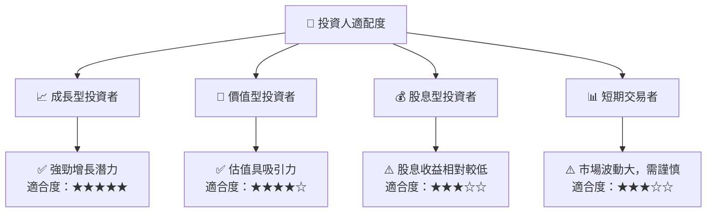

### 10.5 每季財報監控清單（Quarterly Watch List）

| 指標 | 目標 | 觸發加碼/減碼門檻 |
|------|------|------------------|
| 核心業務成長率 | >10% | <5% |
| 營業利潤率 | >30% | <25% |
| Capex | <20%收入 | >25% |
| FCF | 正值 | 負值 |
| 訂閱數 | 穩定增長 | 下降 |

### 10.6 反面論證：什麼會證明論點錯誤（What Would Change My Mind）

```
╔══════════════════════════════════════════════════════════════════╗
║              ⚠️ 論點失效條件（Disconfirming Evidence）           ║
╠══════════════════════════════════════════════════════════════════╣
║  本投資論點在下列情況成立時應重新檢視或退出：                    ║
║  ☐ 核心業務成長率連續兩季 < 5%                                   ║
║  ☐ 營業利潤率較峰值收縮 > 5 pp                                   ║
║  ☐ 自由現金流轉負或 FCF 轉換率 < 0%                             ║
║  ☐ ROIC 跌破 WACC                                               ║
║  ☐ 關鍵成長投資（如 AI/新業務）無法在 6 期內變現               ║
╚══════════════════════════════════════════════════════════════════╝
```

---

> **免責聲明**：本報告為 AI 自動生成，僅供研究參考，不構成投資建議。投資有風險，入市需謹慎。