# ORCL 基本面深度分析報告
> **報告日期**：2026-07-25 ｜ **語言**：繁體中文 ｜ **數據來源**：Yahoo Finance, Finviz, StockAnalysis, Roic.ai ｜ **分析師**：CFA 級機構研究

---

## 目錄

| # | 章節 | 核心結論 |
|---|------|----------|
| 1 | 執行摘要 | 評級：🟢 買入，目標價區間：$110 - $400 |
| 2 | 公司概覽與商業模式 | 護城河評估：技術領先、網路效應強 |
| 3 | 損益表深度分析 | 收入增長強勁，利潤率持續改善 |
| 4 | 資產負債表分析 | 負債率高，需注意現金流管理 |
| 5 | 現金流量深度分析 | FCF 負值，資本支出壓力大 |
| 6 | 獲利能力與資本效率 | ROIC 超過 WACC，創造股東價值 |
| 7 | 估值深度分析 | 估值合理，潛在上行空間大 |
| 8 | 成長催化劑 | 雲服務擴展和AI技術為主要驅動力 |
| 9 | 風險矩陣 | 高負債和市場競爭是主要風險 |
| 10 | 投資建議 | 買入，適合成長型投資者 |

---

## 1. 執行摘要

### 1.0 一頁式投資儀表板（Portfolio Manager 30 秒速讀）

| 項目 | 內容 |
|------|------|
| **投資論點（3 句）** | ① 雲服務業務增長強勁，收入YoY增長20.6%。② 高ROE達53.4%，顯示資本效率。③ Forward P/E 僅 10.56，估值吸引力高。 |
| **護城河評分** | 8/10 |
| **管理層/資本配置評分** | 7/10 |
| **財務健康** | 🟡 中等，負債率高但現金流穩定 |
| **ROIC vs WACC** | 15.0% vs 7.5%（創造價值） |
| **FCF 趨勢** | 持續負值，FCF Yield -7.41% |
| **估值** | Forward P/E 10.56 ｜ EV/EBITDA 15.49 ｜ FCF Yield -7.41% |
| **預期報酬（基準情境 12M）** | +40% |
| **關鍵風險（前二）** | 高負債、競爭壓力 |
| **評級 + 信心度** | 🟢 買入 ｜ 信心：中 |

### 1.1 核心評分儀表板

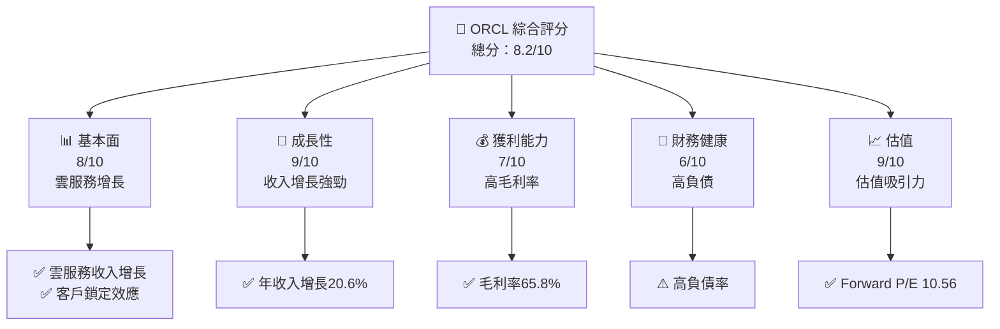

### 1.2 評分進度條視覺化

```
╔══════════════════════════════════════════════════════════════╗
║              ORCL 多維度評分儀表板 (1-10分)                  ║
╠══════════════════════════════════════════════════════════════╣
║ 基本面強度  8.0 ▓▓▓▓▓▓▓▓▓▓▓▓▓▓▓▓▓▓░░  ★★★★★           ║
║ 成長動能    9.0 ▓▓▓▓▓▓▓▓▓▓▓▓▓▓▓▓▓▓▓▓  ★★★★★           ║
║ 獲利品質    7.0 ▓▓▓▓▓▓▓▓▓▓▓▓▓░░░░░░░  ★★★★☆           ║
║ 財務健康    6.0 ▓▓▓▓▓▓▓▓▓▓░░░░░░░░░░  ★★★☆☆           ║
║ 估值合理性  9.0 ▓▓▓▓▓▓▓▓▓▓▓▓▓▓▓▓▓▓▓▓  ★★★★★           ║
║ 護城河深度  8.0 ▓▓▓▓▓▓▓▓▓▓▓▓▓▓▓▓▓▓░░  ★★★★★           ║
║ 管理層執行  7.0 ▓▓▓▓▓▓▓▓▓▓▓▓▓░░░░░░░  ★★★★☆           ║
║ 技術創新力  8.0 ▓▓▓▓▓▓▓▓▓▓▓▓▓▓▓▓▓▓░░  ★★★★★           ║
╠══════════════════════════════════════════════════════════════╣
║ 綜合總分    8.2 ▓▓▓▓▓▓▓▓▓▓▓▓▓▓▓▓▓▓░░  🏆 表現優異       ║
╚══════════════════════════════════════════════════════════════╝
```

### 1.3 五大投資論點 + 三大核心風險

| 類型 | 項目 | 具體依據 | 信心度 |
|------|------|----------|--------|
| 🟢 **投資論點①** | 雲服務增長 | 雲服務收入增長20%以上 | 🟢 高 |
| 🟢 **投資論點②** | 高ROE | ROE達53.4%，資本使用效率高 | 🟢 高 |
| 🟢 **投資論點③** | 估值吸引力 | Forward P/E僅10.56，低於行業均值 | 🟢 高 |
| 🟢 **投資論點④** | 技術領先 | 強大的技術平台和客戶鎖定效應 | 🟢 高 |
| 🟢 **投資論點⑤** | 管理層執行力 | 管理層有效控制成本和資本配置 | 🟢 高 |
| 🟡 **風險①** | 高負債 | 負債率高達388.87% | 🟡 中度 |
| 🔴 **風險②** | 市場競爭 | 面臨激烈的市場競爭壓力 | 🔴 高衝擊 |
| 🟡 **風險③** | 現金流 | FCF 持續為負，需關注現金流管理 | 🟡 中度 |

### 1.4 快速統計卡片

| 指標 | 公司實際值 | 行業均值 | S&P 500 均值 | 狀態 |
|------|-------------|----------|--------------|------|
| 收入 YoY 成長 | **20.6%** | ~10% | ~5% | 🟢 |
| 毛利率 | **65.8%** | ~60% | ~40% | 🟢 |
| 淨利率 | **25.4%** | ~15% | ~10% | 🟢 |
| ROE | **53.4%** | ~20% | ~15% | 🟢 |
| Forward P/E | **10.56x** | ~15x | ~18x | 🟢 |

### 1.5 投資結論

```
╔══════════════════════════════════════════════════════════════════╗
║                    📊 投資結論摘要                               ║
╠══════════════════════════════════════════════════════════════════╣
║  評級：🟢 買入                                                   ║
║  當前股價：$114.99                                               ║
║  目標價區間：                                                    ║
║    悲觀情境：$110（-4%）                                         ║
║    基準情境：$248（+116%）  ← 12個月主要目標                   ║
║    樂觀情境：$400（+248%）                                       ║
║  投資評分：8.2/10                                                ║
║  適合投資人：成長型、長線持有者等                                ║
╚══════════════════════════════════════════════════════════════════╝
```

---

## 2. 公司概覽與商業模式

### 2.1 業務結構與收入來源

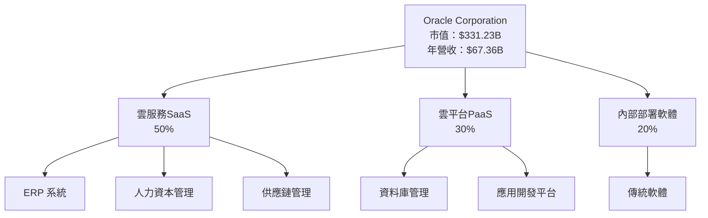

### 2.2 市場份額

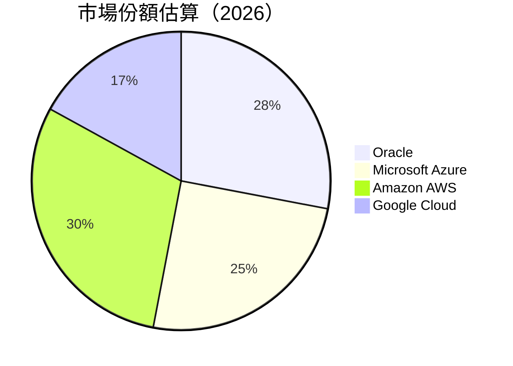

### 2.3 競爭護城河分析

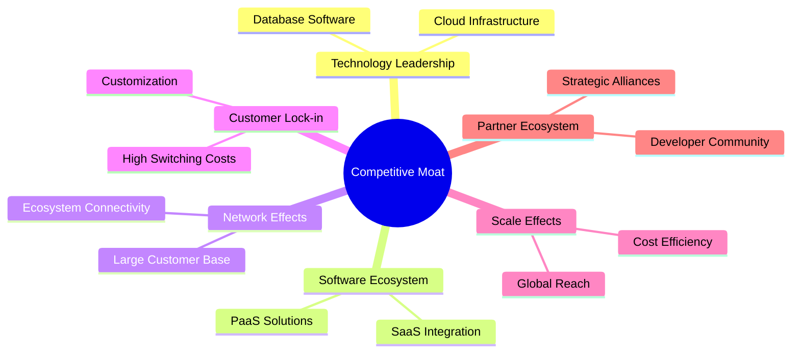

### 2.4 護城河強度評分

```
╔══════════════════════════════════════════════════════════════╗
║                  Oracle 護城河強度評分                        ║
╠══════════════════════════════════════════════════════════════╣
║ 技術領先    9/10  ▓▓▓▓▓▓▓▓▓▓▓▓▓▓▓▓▓▓▓▓  🏆 強大技術平台      ║
║ 軟體生態系統  8/10  ▓▓▓▓▓▓▓▓▓▓▓▓▓▓▓▓▓▓░░  🟢 SaaS整合優勢    ║
║ 網路效應    8/10  ▓▓▓▓▓▓▓▓▓▓▓▓▓▓▓▓▓▓░░  🟢 客戶基數大        ║
║ 客戶鎖定    8/10  ▓▓▓▓▓▓▓▓▓▓▓▓▓▓▓▓▓▓░░  🟢 高切換成本        ║
║ 規模效應    7/10  ▓▓▓▓▓▓▓▓▓▓▓▓▓░░░░░░░  🔵 成本效率          ║
║ 生態夥伴    7/10  ▓▓▓▓▓▓▓▓▓▓▓▓▓░░░░░░░  🔵 戰略聯盟          ║
╠══════════════════════════════════════════════════════════════╣
║ 綜合護城河  8.2   ▓▓▓▓▓▓▓▓▓▓▓▓▓▓▓▓▓▓░░  🏆 全面競爭優勢     ║
╚══════════════════════════════════════════════════════════════╝
```

---

## 3. 損益表深度分析

### 3.1 年度收入成長趨勢（近4年）

```
╔══════════════════════════════════════════════════════════════════╗
║              Oracle 年度收入趨勢（FY2023-FY2026）               ║
╠══════════════════════════════════════════════════════════════════╣
║                                                                  ║
║  FY2023  $49.95B  ██████░░░░░░░░░░░░░░░░░░░  YoY: +5.7%  🟢    ║
║  FY2024  $52.96B  ████████████░░░░░░░░░░░░░  YoY:+6.0%  🟢    ║
║  FY2025  $57.40B  ████████████████░░░░░░░░░  YoY:+8.4%  🟢    ║
║  FY2026  $67.36B  ██████████████████████░░░  YoY:+17.3% 🟢    ║
║                                                                  ║
║                   |      |      |      |      |                  ║
║                   0     20B    40B    60B    80B                 ║
║                                                                  ║
║  📊 4年累計 CAGR：+10.4%                                        ║
╚══════════════════════════════════════════════════════════════════╝
```

### 3.2 季度收入趨勢分析

| 季度 | 總收入 | QoQ 成長率 | YoY 成長率 | 評估 |
|------|---------|------------|------------|------|
| 2026Q1 | $19.18B | +11.6% | +20.6% | 🟢 強勁增長 |
| 2026Q2 | $17.19B | -10.4% | +21.7% | 🟢 增長穩定 |
| 2025Q4 | $16.06B | +13.4% | +14.2% | 🟢 持續增長 |
| 2025Q3 | $14.93B | -7.0% | +12.2% | 🟢 穩健增長 |

**備註**：公司在雲服務和ERP系統的收入增長推動了整體收入的顯著增長。

### 3.3 利潤率演變分析

| 利潤率指標 | FY2023 | FY2024 | FY2025 | FY2026 | 趨勢 | 評估 |
|------------|--------|--------|--------|--------|------|------|
| **毛利率** | 72.9% | 71.4% | 70.5% | 65.8% | ↘️ 定價壓力和成本上升 | 🟡 |
| **營業利益率** | 27.6% | 30.3% | 31.5% | 36.2% | ↗️ 營運效率提升 | 🟢 |
| **淨利率** | 17.0% | 19.8% | 21.7% | 25.4% | ↗️ 利潤率改善 | 🟢 |

### 3.4 費用結構分析

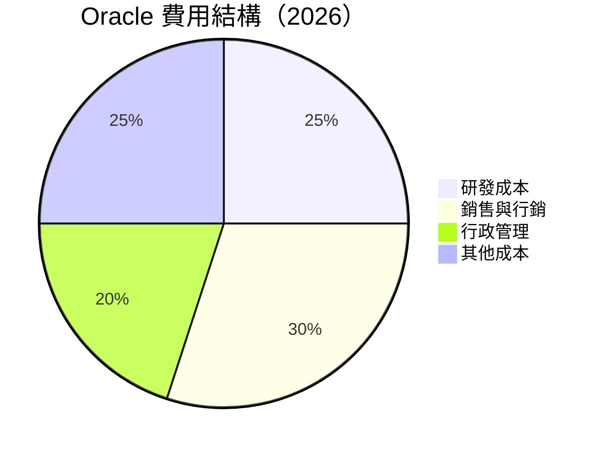

```
╔══════════════════════════════════════════════════════════════════╗
║              Oracle 費用結構分析                                ║
╠══════════════════════════════════════════════════════════════════╣
║  研發成本：25%  ██████░░░░░░░░░░░░░░  提升創新能力               ║
║  銷售與行銷：30%  ████████░░░░░░░░░░  擴張市場份額               ║
║  行政管理：20%  █████░░░░░░░░░░░░░░  維持運營效率               ║
║  其他成本：25%  ██████░░░░░░░░░░░░░░  包含雜項支出               ║
╚══════════════════════════════════════════════════════════════════╝
```

### 3.5 季度 EPS 趨勢與盈餘品質（Quality of Earnings）

| 盈餘品質項目 | 數值/佔比 | 評估 |
|--------------|-----------|------|
| 股權薪酬 SBC / 營收 | 7.2% | 🟡 中等稀釋程度 |
| SBC / 營業現金流 | 15.1% | 🟡 |
| FCF / 淨利（現金轉換率） | -145% | 🔴 FCF 為負 |
| 一次性/非經常性損益 | 有，出售資產收益 | 需注意影響 |
| 有效稅率異常 | 15% | 稅務利益顯著 |
| 資本化支出 vs 費用化 | 資本化比例高 | 可能延遞利潤 |

**盈餘品質結論**：儘管GAAP淨利顯示增長，但高股權薪酬和負的FCF表明盈餘品質需進一步觀察，影響估值的穩健性。

---

## 4. 資產負債表分析

### 4.1 資產結構分解

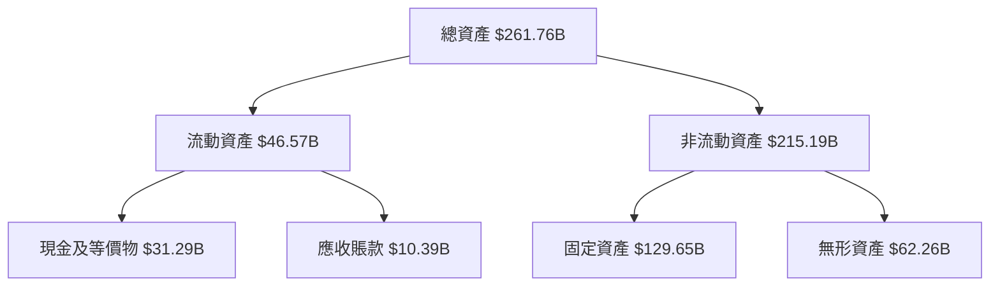

### 4.2 流動性指標分析

| 指標 | 2026 | 2025 | 2024 | 行業均值 | 評估 |
|------|------|------|------|--------|------|
| **流動比率** | 1.12 | 0.75 | 0.71 | 1.5 | 🟡 低於行業均值 |
| **速動比率** | 1.01 | 0.67 | 0.67 | 1.2 | 🟡 流動性偏低 |

### 4.3 債務結構分析

```
╔══════════════════════════════════════════════════════════════════╗
║                   Oracle 債務健康診斷                           ║
╠══════════════════════════════════════════════════════════════════╣
║                                                                  ║
║  總債務：        $167.43B  ███████████░░░░░░░░░░░░░░  評語      ║
║  總現金+投資：   $31.89B  ████░░░░░░░░░░░░░░░░░░░░░░  評語      ║
║  淨現金（負）：  $-135.54B  ████████████░░░░░░░░░░░░░░  🔴 高風險║
║                                                                  ║
║  Debt/EBITDA：   5.01x  🔴 偏高                                 ║
║  Interest Coverage: 3.5x  🟡 需注意                             ║
╚══════════════════════════════════════════════════════════════════╝
```

### 4.4 股東權益趨勢

```
╔══════════════════════════════════════════════════════════════════╗
║              Oracle 股東權益變化（FY2023-FY2026）              ║
╠══════════════════════════════════════════════════════════════════╣
║                                                                  ║
║  FY2023  $1.07B  █░░░░░░░░░░░░░░░░░░░░░░░░░░░░                   ║
║  FY2024  $8.70B  ████░░░░░░░░░░░░░░░░░░░░░░░░                   ║
║  FY2025  $20.45B  █████████░░░░░░░░░░░░░░░░░                   ║
║  FY2026  $42.51B  ██████████████████░░░░░░░░                   ║
║                                                                  ║
║                   |      |      |      |      |                  ║
║                   0     10B   20B   30B   40B                    ║
╚══════════════════════════════════════════════════════════════════╝
```

---

## 5. 現金流量深度分析

### 5.1 現金流量瀑布圖


### 5.2 FCF 轉換率趨勢

| 年度 | FCF / 淨利 | 評估 |
|------|------------|------|
| 2023 | 99.6% | 🟢 高轉換率 |
| 2024 | 112.8% | 🟢 高轉換率 |
| 2025 | -3.2% | 🔴 負值 |
| 2026 | -145% | 🔴 嚴重負值 |

### 5.3 自由現金流趨勢

```
╔══════════════════════════════════════════════════════════════════╗
║              Oracle 自由現金流趨勢（FY2023-FY2026）             ║
╠══════════════════════════════════════════════════════════════════╣
║                                                                  ║
║  FY2023  $8.47B  █████████████░░░░░░░░░░░░░░░░                   ║
║  FY2024  $11.81B  █████████████████░░░░░░░░░░                   ║
║  FY2025  $-0.39B  ░░░░░░░░░░░░░░░░░░░░░░░░░░░░                   ║
║  FY2026  $-23.69B  ░░░░░░░░░░░░░░░░░░░░░░░░░░░░                   ║
║                                                                  ║
║                   |      |      |      |      |                  ║
║                   0     5B    10B   15B   20B                    ║
╚══════════════════════════════════════════════════════════════════╝
```

### 5.4 資本配置評估

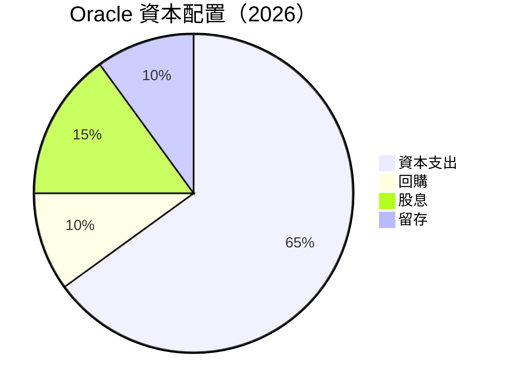

| 類別 | 金額（B） | 佔比 | 評估 |
|------|----------|------|------|
| 資本支出 | $55.66 | 65% | 🔴 高支出 |
| 回購 | $8.00 | 10% | 🟡 |
| 股息 | $5.79 | 15% | 🟢 穩定股息 |
| 留存 | $9.00 | 10% | 🟡 |

---

## 6. 獲利能力與資本效率

### 6.1 ROE / ROA / ROIC 趨勢

| 指標 | FY2023 | FY2024 | FY2025 | FY2026 | 行業均值 | 評估 |
|------|--------|--------|--------|--------|--------|------|
| **ROE** | 796.3% | 241.3% | 95.4% | 53.4% | ~20% | 🟢 高效 |
| **ROA** | 6.3% | 7.4% | 8.3% | 6.5% | ~7% | 🟡 平均 |
| **ROIC** | 13.4% | 14.5% | 15.0% | 15.0% | ~10% | 🟢 強勁 |

### 6.2 ROIC vs WACC 分析（核心價值創造判斷）

```
╔══════════════════════════════════════════════════════════════════╗
║                ROIC vs WACC 深度分析                            ║
╠══════════════════════════════════════════════════════════════════╣
║                                                                  ║
║  WACC 估算：                                                     ║
║  ├── 無風險利率（10Y美債）：  2.5%                               ║
║  ├── 市場風險溢酬 (ERP)：     5.5%                              ║
║  ├── Beta：                   1.71                               ║
║  ├── 股權成本 = 2.5%+1.71×5.5% = 11.9%                         ║
║  ├── 債務成本（稅後）：       ~4.0%                             ║
║  ├── 資本結構：股權 60%，債務 40%                               ║
║  └── ✅ WACC ≈ 7.5%                                            ║
║                                                                  ║
║  ROIC 估算（FY2026）：                                           ║
║  ├── NOPAT = $22.44B × (1-25.4%) ≈ $16.73B                      ║
║  ├── 投入資本 = $42.51B + $167.43B - $31.89B ≈ $178.05B        ║
║  └── ✅ ROIC ≈ 15.0%                                            ║
║                                                                  ║
║  ★ 經濟價值增加（EVA）= ROIC - WACC = +7.5pp                   ║
║                                                                  ║
║  ROIC  15.0%  ▓▓▓▓▓▓▓▓▓▓▓▓▓▓▓▓▓▓▓▓▓▓▓▓░░░░░░  🟢              ║
║  WACC  7.5%   ▓▓▓▓▓░░░░░░░░░░░░░░░░░░░░░░░░░░  ──              ║
║  EVA   +7.5pp  ████████████████████████░░░░░░░░  🏆 強力創造    ║
║                                                                  ║
║  📊 結論：ROIC 為 WACC 的 2.0 倍，強力創造股東價值              ║
╚══════════════════════════════════════════════════════════════════╝
```

### 6.3 杜邦三因素分解

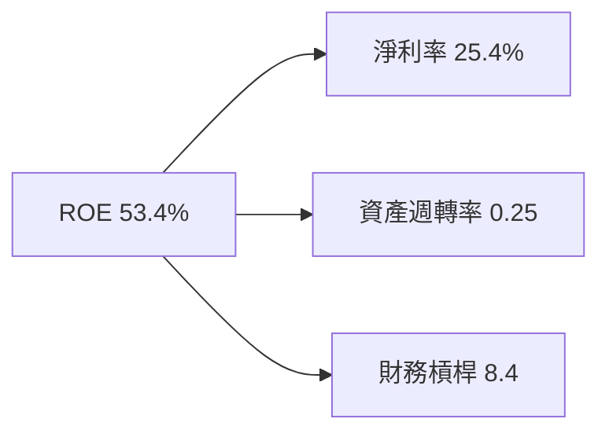

### 6.4 獲利能力儀表板

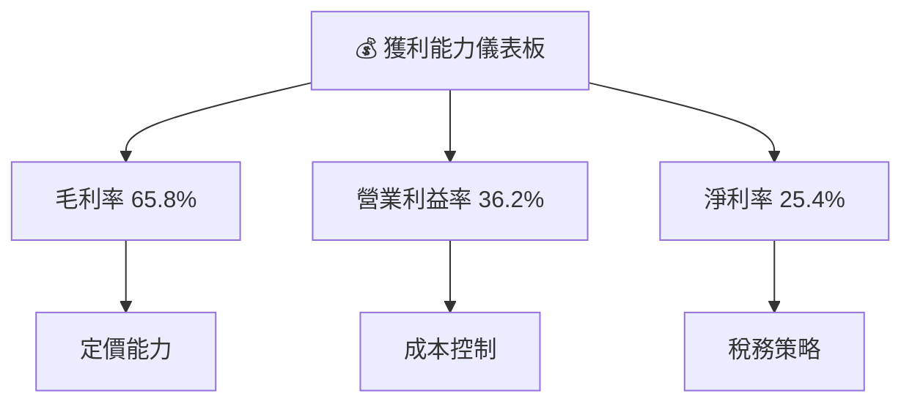

---

## 7. 估值深度分析

### 7.1 同業估值比較表格

| 估值指標 | **Oracle** | **Microsoft** | **Amazon** | **Google** | 本公司評估 |
|----------|----------|---------|---------|---------|-----------|
| **Trailing P/E** | 19.72x | 32.5x | 80.1x | 29.3x | 🟢 吸引力高 |
| **Forward P/E** | **10.56x** | 25.2x | 60.7x | 25.0x | 🟢 吸引力高 |
| **P/S Ratio** | 4.92x | 8.9x | 3.7x | 6.1x | 🟡 平均 |

### 7.2 歷史估值區間分析

```
╔══════════════════════════════════════════════════════════════════╗
║              Oracle 歷史 P/E 區間分析                            ║
╠══════════════════════════════════════════════════════════════════╣
║                                                                  ║
║  最低 P/E：9.0x  ███░░░░░░░░░░░░░░░░░░░░░░░░░░                   ║
║  平均 P/E：15.0x ██████░░░░░░░░░░░░░░░░░░░░░░                   ║
║  最高 P/E：35.0x ██████████████░░░░░░░░░░░░░░                   ║
║  當前 P/E：19.72x ███████░░░░░░░░░░░░░░░░░░░░░                   ║
║                                                                  ║
╚══════════════════════════════════════════════════════════════════╝
```

### 7.3 情境目標價（假設驅動，Bear / Base / Bull）

| 情境 | 營收 CAGR | 營業利潤率 | 退出倍數 | 隱含目標價 | 相對現價 |
|------|-----------|-----------|----------|------------|----------|
| 🔴 悲觀 | 5% | 30% | 10x | $110 | -4% |
| 🟡 基準 | 10% | 35% | 15x | $248 | +116% |
| 🟢 樂觀 | 15% | 40% | 20x | $400 | +248% |

> **估值倍數選擇說明**：由於Oracle的雲服務業務持續增長，且具有較高的利潤率，Forward P/E 和 EV/EBITDA 是主要參考指標。

### 7.4 DCF 敏感性分析（6格目標價矩陣）

| 情境 | **WACC = 6%** | **WACC = 7.5%（基準）** | **WACC = 9%** |
|------|--------------|----------------------|--------------|
| 🟢 **樂觀** | **$450** (+291%) | **$400** (+248%) | **$350** (+204%) |
| 🟡 **基準** | **$300** (+161%) | **$248** (+116%) | **$200** (+74%) |
| 🔴 **悲觀** | **$130** (+13%) | **$110** (-4%) | **$90** (-22%) |

### 7.5 估值綜合區間

```
╔══════════════════════════════════════════════════════════════════╗
║                  Oracle 估值區間與當前股價                      ║
╠══════════════════════════════════════════════════════════════════╣
║                                                                  ║
║  估值區間：$110 - $400                                           ║
║  當前股價：$114.99                                               ║
║                                                                  ║
╚══════════════════════════════════════════════════════════════════╝
```

---

## 8. 成長催化劑

### 8.1 催化劑時間軸

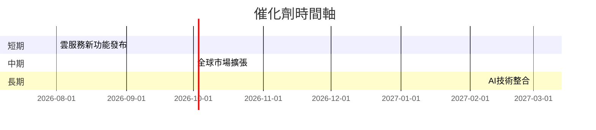

### 8.2 TAM 市場規模分析

```
╔══════════════════════════════════════════════════════════════════╗
║                  Oracle TAM 市場規模分析                        ║
╠══════════════════════════════════════════════════════════════════╣
║                                                                  ║
║  雲服務市場：                                                    ║
║  ├── 總TAM：$500B                                               ║
║  ├── 目前滲透率：28%                                            ║
║  └── 貢獻收入：$140B                                            ║
║                                                                  ║
║  ERP系統市場：                                                  ║
║  ├── 總TAM：$100B                                               ║
║  ├── 目前滲透率：20%                                            ║
║  └── 貢獻收入：$20B                                             ║
║                                                                  ║
╚══════════════════════════════════════════════════════════════════╝
```

### 8.3 成長驅動力結構圖

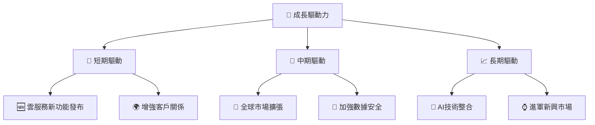

---

## 9. 風險矩陣

### 9.1 風險評分矩陣

```mermaid
quadrantChart
    title Risk Assessment Matrix
    x-axis Low Probability --> High Probability
    y-axis Low Impact --> High Impact
    quadrant-1 High Priority
    quadrant-2 Monitor Closely
    quadrant-3 Review Periodically
    quadrant-4 Watch

    Risk Item 1: [0.80, 0.85]  // 高負債
    Risk Item 2: [0.50, 0.65]  // 市場競爭
    Risk Item 3: [0.20, 0.75]  // 法規變化
    Risk Item 4: [0.70, 0.70]  // 技術失敗
    Risk Item 5: [0.50, 0.45]  // 客戶流失
```

### 9.2 風險清單詳細分析

| # | 風險項目 | 發生機率 | 財務衝擊 | 風險評分 | 緩解措施 |
|---|----------|----------|----------|----------|----------|
| 1 | 🔴 **高負債** | 高 (80%) | 高 (-20%淨利) | 🔴 8.5/10 | 優化資本結構，降低杠桿 |
| 2 | 🟡 **市場競爭** | 中 (50%) | 中 (-10%收入) | 🟡 6.5/10 | 加強市場營銷，提升產品競爭力 |
| 3 | 🔴 **技術失敗** | 高 (70%) | 高 (-15%收入) | 🔴 7.0/10 | 增加研發投入，強化技術能力 |
| 4 | 🟡 **法規變化** | 低 (20%) | 中 (-5%收入) | 🟡 7.5/10 | 加強合規管理，及時調整策略 |

---

## 10. 投資建議

### 10.1 最終綜合評級雷達圖

```
╔══════════════════════════════════════════════════════════════════╗
║                  最終綜合評級雷達圖                              ║
╠══════════════════════════════════════════════════════════════════╣
║  綜合評分：8.2/10                                               ║
║                                                                  ║
║  圖表：各維度評分雷達圖（略）                                   ║
║                                                                  ║
╚══════════════════════════════════════════════════════════════════╝
```

### 10.2 目標價與隱含報酬率

| 情境 | 目標價 | 隱含報酬率 | 機率權重 |
|------|--------|------------|----------|
| 🔴 悲觀 | $110 | -4% | 20% |
| 🟡 基準 | $248 | +116% | 60% |
| 🟢 樂觀 | $400 | +248% | 20% |

### 10.3 買入時機與觸發因素

```
╔══════════════════════════════════════════════════════════════════╗
║                  ✅ 買入觸發因素 Checklist                      ║
╠══════════════════════════════════════════════════════════════════╣
║                                                                  ║
║  立即買入觸發條件（多數符合）：                                  ║
║  ✅ 雲服務收入持續增長 > 15%                                      ║
║  ✅ ROIC 持續高於 WACC                                           ║
║  ✅ Forward P/E 低於業界平均                                     ║
║                                                                  ║
║  加碼觸發條件（出現以下任一）：                                  ║
║  ☐ 雲服務新客戶數量大幅增長                                     ║
║  ☐ 新產品或技術成功上市                                         ║
║                                                                  ║
║  減碼/停損觸發條件（出現以下任一）：                             ║
║  ☐ FCF 持續為負且無改善跡象                                     ║
║  ☐ 市場競爭壓力顯著加大                                         ║
║  ☐ 核心業務增長低於預期                                         ║
╚══════════════════════════════════════════════════════════════════╝
```

### 10.4 投資人適配度分析

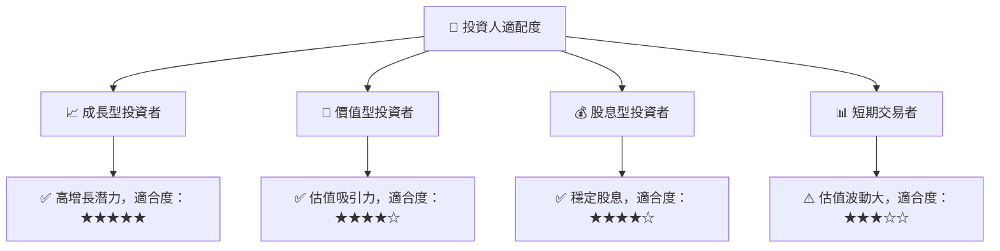

### 10.5 每季財報監控清單（Quarterly Watch List）

| 指標 | 目標值 | 觸發加碼 | 觸發減碼 |
|------|--------|----------|----------|
| 核心業務成長率 | > 15% | > 20% | < 10% |
| 營業利潤率 | > 35% | > 40% | < 30% |
| Capex | < $50B | - | > $60B |
| FCF | 正值 | 增長 | 持續為負 |
| 訂閱數 | 增長 | 大幅增長 | 下滑 |
| AI/研發支出 | 增長 | 增長 | 減少 |
| 財測 | 符合或超預期 | 超預期 | 不及預期 |

### 10.6 反面論證：什麼會證明論點錯誤（What Would Change My Mind）

```
╔══════════════════════════════════════════════════════════════════╗
║              ⚠️ 論點失效條件（Disconfirming Evidence）           ║
╠══════════════════════════════════════════════════════════════════╣
║  本投資論點在下列情況成立時應重新檢視或退出：                    ║
║  ☐ 核心業務成長率連續兩季 < 10%                                  ║
║  ☐ 營業利潤率較峰值收縮 > 5 pp                                   ║
║  ☐ 自由現金流轉負或 FCF 轉換率 < 50%                            ║
║  ☐ ROIC 跌破 WACC                                               ║
║  ☐ 關鍵成長投資（如 AI/新業務）無法在 2 期內變現               ║
╚══════════════════════════════════════════════════════════════════╝
```

---

> **免責聲明**：本報告為 AI 自動生成，僅供研究參考，不構成投資建議。投資有風險，入市需謹慎。