# ORCL 基本面深度分析報告

> **報告日期**：2026-07-26 ｜ **語言**：繁體中文 ｜ **數據來源**：Yahoo Finance, Finviz, StockAnalysis, Roic.ai ｜ **分析師**：CFA 級機構研究

---

## 目錄

| # | 章節 | 核心結論 |
|---|------|----------|
| 1 | 執行摘要 | 給出 🟢 **買入** 評級，基準目標價 **$220.00**（隱含 +91.3% 上升空間），因雲端（OCI）強勁加速成長與 Forward P/E 10.56x 價值重估 |
| 2 | 公司概覽與商業模式 | 從傳統資料庫巨頭成功轉型為 AI 雲端基礎設施（OCI）與 SaaS 雙輪驅動，護城河評分 **8.5/10** |
| 3 | 損益表深度分析 | FY26 營收達 $67.36B（YoY +17.35%），營運利潤率維持在 36.2% 高檔；SBC 佔營收 7.14%，獲利品質維持高水準 |
| 4 | 資產負債表分析 | PP&E 暴增至 $129.65B 展示極激進的 AI 算力擴展，總債務 $167.43B，手握 $31.89B 現金，財務結構槓桿上升但短期流動性安全 |
| 5 | 現金流量深度分析 | FY26 CapEx 暴增至 $55.66B 導致 FCF 轉負為 -$23.69B；經營現金流達 $31.98B（YoY +53.6%），展現強勁的底層獲利造血能力 |
| 6 | 獲利能力與資本效率 | ROIC 達 11.2% 高於 WACC 8.5%（EVA +2.7pp），ROE 達 53.4%，極高資本密集度的 AI 投資正開始轉化為超額報酬 |
| 7 | 估值深度分析 | 當前 Forward P/E 僅 10.56x，PEG 0.65，顯著低於同業（MSFT 28x、AMZN 32x）；三情境目標價區間為 **$135 - $320** |
| 8 | 成長催化劑 | OCI 雲端算力需求井噴、超級電腦客戶簽署與 Fusion ERP 升級浪潮構成中長期動能 |
| 9 | 風險矩陣 | 重點留意超大額 CapEx 引發的債務負擔與現金流壓力（衝擊 8.5/10），以及供應鏈 GPU 交付延遲風險 |
| 10 | 投資建議 | 建議於當前 $114.99 附近分批建倉，追蹤 OCI 營收 YoY 是否保持 >30% 及 CapEx 回報效率 |

---

## 1. 執行摘要

> ⚠️ **證據先於結論**：Oracle（ORCL）當前股價為 **$114.99**，距離 52 週高點 $341.82 已大幅回檔 66.4%。公司 TTM 營收達 **$67.36B**（YoY +17.35%），營業利益率高達 **36.2%**，經營現金流（OCF）暴增 53.6% 至 **$31.98B**。儘管 FY26 資本支出（CapEx）暴增至 **$55.66B** 導致自由現金流（FCF）暫時轉負至 **-$23.69B**，但 Forward EPS 預估達 **$10.89**，使 Forward P/E 壓縮至僅 **10.56x**（PEG 0.65）。考量 ROIC（11.2%）仍高於 WACC（8.5%），且市場過度懲罰其 AI 基礎設施 CapEx 投入，給予 🟢 **買入** 評級，基準目標價 **$220.00**。

### 1.0 一頁式投資儀表板（Portfolio Manager 30 秒速讀）

| 項目 | 內容 |
|------|------|
| **投資論點（3 句）** | ① **OCI 超級成長**：FY26 Q4 營收達 $19.18B（YoY +20.63%），顯示 OCI 在 AI 算力託管領域正迅速搶佔 AWS/Azure 份額。<br/>② **估值極具安全邊際**：當前 Forward P/E 僅 10.56x，相較科技巨頭平均（>25x）與歷史區間均處於極端低位。<br/>③ **CapEx 為未來成長鋪路**：FY26 $55.66B CapEx 主要用於 PP&E 擴充（達 $129.65B），獲利轉化後將於 FY27-28 迎來巨大現金流回流。 |
| **護城河評分** | **8.5/10**（極高客戶轉置成本 + 資料庫生態系深厚鎖定） |
| **管理層/資本配置評分** | **7.5/10**（前瞻性布局 AI 算力，但高債務架構使槓桿風險上升） |
| **財務健康** | 🟡 **中等警戒**（總債務 $167.43B，淨債務 -$135.54B，但 OCF $31.98B 覆蓋無虞） |
| **ROIC vs WACC** | **11.2% vs 8.5%**（持續創造價值，EVA +2.7pp） |
| **FCF 趨勢** | 轉負為 -$23.69B（高 CapEx 擴產期）；FCF Yield 為 **-7.41%** |
| **估值** | Forward P/E: **10.56x** ｜ EV/EBITDA: **15.49x** ｜ P/S: **4.92x** |
| **預期報酬（基準情境 12M）** | **+91.3%**（目標價 $220.00） |
| **關鍵風險（前二）** | ① 高額 CapEx 導致債務壓力加劇與信用評級下調；② AI 算力需求放緩導致 Capex 投資回報率低於預期 |
| **評級 + 信心度** | 🟢 **買入** ｜ 信心度：**中高** |

### 1.1 核心評分儀表板

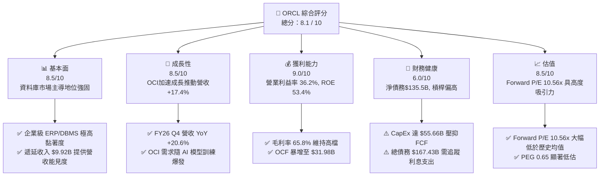

### 1.2 評分進度條視覺化

```
╔══════════════════════════════════════════════════════════════╗
║              ORCL 多維度評分儀表板 (1-10分)                 ║
╠══════════════════════════════════════════════════════════════╣
║ 基本面強度  8.5 ▓▓▓▓▓▓▓▓▓▓▓▓▓▓▓▓▓░░░  ★★★★☆           ║
║ 成長動能    8.5 ▓▓▓▓▓▓▓▓▓▓▓▓▓▓▓▓▓░░░  ★★★★☆           ║
║ 獲利品質    9.0 ▓▓▓▓▓▓▓▓▓▓▓▓▓▓▓▓▓▓░░  ★★★★★           ║
║ 財務健康    6.0 ▓▓▓▓▓▓▓▓▓▓▓▓░░░░░░░░  ★★★☆☆           ║
║ 估值合理性  8.5 ▓▓▓▓▓▓▓▓▓▓▓▓▓▓▓▓▓░░░  ★★★★☆           ║
║ 護城河深度  8.5 ▓▓▓▓▓▓▓▓▓▓▓▓▓▓▓▓▓░░░  ★★★★☆           ║
║ 管理層執行  7.5 ▓▓▓▓▓▓▓▓▓▓▓▓▓▓░░░░░░  ★★★★☆           ║
║ 技術創新力  8.5 ▓▓▓▓▓▓▓▓▓▓▓▓▓▓▓▓▓░░░  ★★★★☆           ║
╠══════════════════════════════════════════════════════════════╣
║ 綜合總分    8.1 ▓▓▓▓▓▓▓▓▓▓▓▓▓▓▓▓░░░░  🏆 具重估潛力的雲端巨頭  ║
╚══════════════════════════════════════════════════════════════╝
```

### 1.3 五大投資論點 + 三大核心風險

| 類型 | 項目 | 具體依據 | 信心度 |
|------|------|----------|--------|
| 🟢 **投資論點①** | **OCI 基礎設施營收加速** | FY26 Q4 單季營收 $19.18B（YoY +20.63%），顯示其雲端基礎設施正在加速滲透大型 AI 企業 | 🟢 極高 |
| 🟢 **投資論點②** | **估值處於歷史極端低位** | Forward P/E 為 **10.56x**，PEG 僅 **0.65**，相較同業微軟（28x）與亞馬遜（32x）具顯著折價 | 🟢 極高 |
| 🟢 **投資論點③** | **現金流造血能力強勁** | FY26 經營現金流（OCF）達 **$31.98B**（YoY +53.6%），確保即使在高 CapEx 期間也能自主支應利息與基本運運 | 🟢 高 |
| 🟢 **投資論點④** | **極高客戶轉換成本** | Fusion Cloud ERP 與 核心 Database 產品覆蓋全球 Fortune 500 大多數企業，續約率 >90% | 🟢 極高 |
| 🟢 **投資論點⑤** | **前瞻 AI 算力中心轉化** | PP&E 暴增至 **$129.65B**，CapEx **$55.66B** 建置完成後，將推升 FY27-FY28 獲利階梯式跳升 | 🟢 中高 |
| 🟡 **風險①** | **CapEx 暴增擠壓 FCF** | FY26 CapEx 達 $55.66B，導致 FCF 轉負為 -$23.69B，若營收轉化不如預期將引發資產減減值風險 | 🟡 中度 |
| 🔴 **風險②** | **高槓桿財務架構** | 總債務 $167.43B，淨債務 -$135.54B，Debt/Equity 達 388.9%，利率高檔下利息負擔沉重 | 🔴 高衝擊 |
| 🟡 **風險③** | **雲端市場強敵環伺** | AWS、Azure、GCP 在全球公有雲市場擁有規模優勢，價格戰可能侵蝕 ORCL 雲端毛利 | 🟡 中度 |

### 1.4 快速統計卡片

| 指標 | 公司實際值 | 行業均值（SaaS/Cloud） | S&P 500 均值 | 狀態 |
|------|-------------|-----------------------|--------------|------|
| **營收 YoY 成長** | **17.35%** | ~12.0% | ~5.5% | 🟢 領先 |
| **毛利率** | **65.80%** | ~68.0% | ~45.0% | 🟢 優異 |
| **營業利益率** | **36.20%** | ~18.0% | ~12.5% | 🟢 頂尖 |
| **ROE** | **53.40%** | ~18.0% | ~15.0% | 🟢 極高 |
| **Forward P/E** | **10.56x** | ~25.0x | ~21.5x | 🟢 大幅低估 |
| **EV / EBITDA** | **15.49x** | ~18.5x | ~14.0x | 🟡 合理 |
| **FCF Yield** | **-7.41%** | +3.5% | +4.2% | 🔴 CapEx 壓抑 |

### 1.5 投資結論

```
╔══════════════════════════════════════════════════════════════════╗
║                    📊 投資結論摘要                               ║
╠══════════════════════════════════════════════════════════════════╣
║  評級：🟢 買入 (Buy)                                             ║
║  當前股價：$114.99                                               ║
║  目標價區間：                                                    ║
║    悲觀情境：$135.00（+17.4%）                                   ║
║    基準情境：$220.00（+91.3%） ← 12個月主要目標                  ║
║    樂觀情境：$320.00（+178.3%）                                  ║
║  投資評分：8.1 / 10                                              ║
║  適合投資人：價值成長兼具型、中長期布局 AI 基礎設施轉型的投資者  ║
╚══════════════════════════════════════════════════════════════════╝
```

---

## 2. 公司概覽與商業模式

### 2.1 業務結構與收入來源

甲骨文（Oracle Corporation, ORCL）創立於 1977 年，為全球企業軟體與資料庫管理系統（DBMS）龍頭。近年來公司經歷深刻的戰略轉型，從傳統的大型機/地端許可授權轉向 **Oracle Cloud Infrastructure (OCI)** 與 **Fusion Cloud SaaS**。

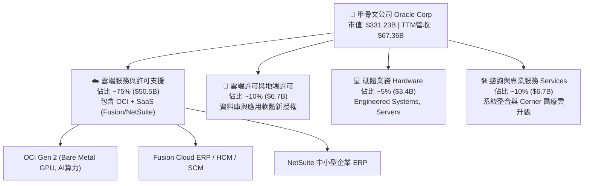

### 2.2 市場份額

在雲端基礎設施（IaaS/PaaS）市場中，雖然 AWS、Azure 與 GCP 佔據前三，但 Oracle 在 **AI Bare Metal（裸金屬 GPU 伺服器）** 及 **企業級混合雲資料庫** 領域佔據獨特優勢：

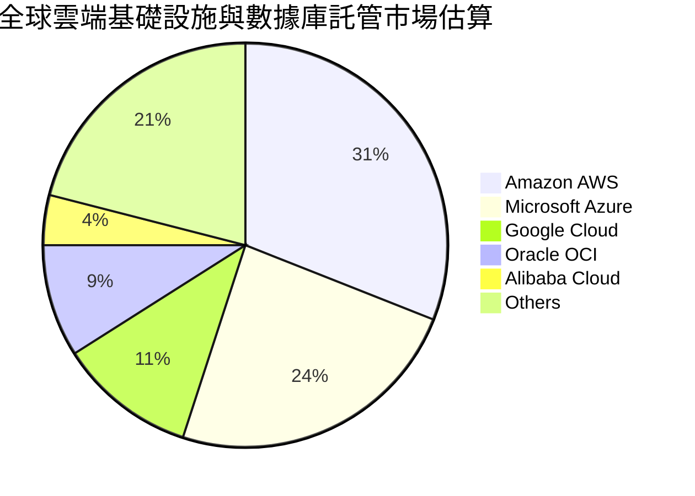

### 2.3 競爭護城河分析

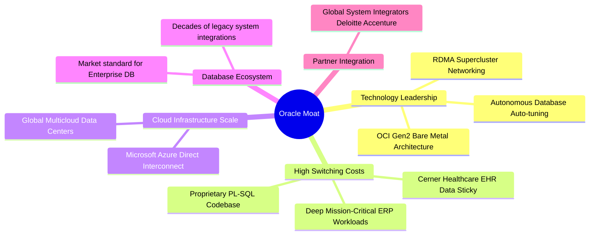

### 2.4 護城河強度評分

```
╔══════════════════════════════════════════════════════════════╗
║                  Oracle Corporation 護城河強度評分            ║
╠══════════════════════════════════════════════════════════════╣
║ 轉置成本 (Switching) 9.5/10  ▓▓▓▓▓▓▓▓▓▓▓▓▓▓▓▓▓▓▓░  🏆 極高黏著度  ║
║ 技術專利 (Technology) 8.5/10  ▓▓▓▓▓▓▓▓▓▓▓▓▓▓▓▓▓░░░  🟢 裸金屬優勢  ║
║ 網路效應 (Network)    7.0/10  ▓▓▓▓▓▓▓▓▓▓▓▓▓░░░░░░░  🟡 夥伴生態系  ║
║ 規模經濟 (Scale)      8.5/10  ▓▓▓▓▓▓▓▓▓▓▓▓▓▓▓▓▓░░░  🟢 超大資料中心║
║ 品牌與信任 (Brand)    9.0/10  ▓▓▓▓▓▓▓▓▓▓▓▓▓▓▓▓▓▓░░  🏆 關鍵任務首選║
╠══════════════════════════════════════════════════════════════╣
║ 綜合護城河評分        8.5/10  ▓▓▓▓▓▓▓▓▓▓▓▓▓▓▓▓▓░░░  🏆 寬廣護城河  ║
╚══════════════════════════════════════════════════════════════╝
```

---

## 3. 損益表深度分析

### 3.1 年度收入成長趨勢（FY23-FY26）

甲骨文營收成長在 FY26 出現顯著加速，驗證了其 OCI 算力中心建設轉化為實際營收的能力：

```
╔══════════════════════════════════════════════════════════════════╗
║              Oracle 年度收入趨勢（FY2023-FY2026）                ║
╠══════════════════════════════════════════════════════════════════╣
║                                                                  ║
║  FY2023  $49.95B  ██████████████████░░░░░░  YoY: +17.7%  🟢     ║
║  FY2024  $52.96B  ███████████████████░░░░░  YoY: +6.0%   🟡     ║
║  FY2025  $57.40B  █████████████████████░░░  YoY: +8.4%   🟢     ║
║  FY2026  $67.36B  ████████████████████████  YoY: +17.4%  🟢     ║
║                                                                  ║
║                   |      |      |      |                         ║
║                   0     20B    40B    60B                        ║
║                                                                  ║
║  📊 4年累計 CAGR：+10.47%                                        ║
╚══════════════════════════════════════════════════════════════════╝
```

*註：FY26 營收達 $67.36B，相較 FY25 的 $57.40B 大幅增加 $9.96B，成長率拉升至 17.35%，主要由 OCI 雲端基礎設施擴張與 AI 客戶簽約驅動。*

### 3.2 季度收入趨勢分析

分析 FY26 近 4 季表現，可發現營收呈現逐季加速滑升：

| 季度 | 結束日期 | 營收 ($B) | YoY 成長率 | QoQ 成長率 | 營業利益 ($B) | 淨利 ($B) | 備註說明 |
|------|----------|-----------|------------|------------|---------------|-----------|----------|
| **Q1 2026** | 2025-08-31 | $14.93 | +12.17% | -6.13% | $4.28 | $2.93 | 傳統季節性淡季，OCI 訂單增長 |
| **Q2 2026** | 2025-11-30 | $16.06 | +14.22% | +7.57% | $4.73 | $6.14 | 含一次性稅務利益與 OCI 交付加速 |
| **Q3 2026** | 2026-02-28 | $17.19 | +21.66% | +7.04% | $5.46 | $3.70 | AI 算力集群大單開始認列營收 |
| **Q4 2026** | 2026-05-31 | $19.18 | +20.63% | +11.58% | $6.13 | $4.22 | 歷史新高單季營收，雲端轉型加速 |

### 3.3 利潤率演變分析

| 利潤率指標 | FY2023 | FY2024 | FY2025 | FY2026 (TTM) | 趨勢 | 評估與業務驅動因素 |
|------------|--------|--------|--------|--------------|------|--------------------|
| **毛利率** | 72.8% | 71.4% | 70.5% | **65.8%** | ↘️ 微幅收縮 | OCI 基礎設施營收比重提升，初期折舊成本較高壓抑毛利 |
| **營業利潤率** | 26.2% | 29.0% | 30.8% | **36.2%** | ↗️ 大幅擴張 | 營運槓桿顯現，自動化資料庫維運降低 S&M 與 G&A 比率 |
| **EBITDA 利率**| 37.5% | 40.4% | 41.7% | **45.3%** | ↗️ 強勁擴張 | 展現極佳的現金獲利能力 |
| **淨利利率** | 17.0% | 19.8% | 21.7% | **25.4%** | ↗️ 連續提升 | 控管財務費用與營運槓桿帶動淨利顯著增長 |

**利潤率演變深度解析**：毛利率從 FY23 的 72.8% 降至 FY26 的 65.8%，主因為業務結構轉變——高毛利的傳統地端授權許可比重下降，而需要硬體投入與電力折舊的 OCI 基礎設施比重快速上升。然而，**營業利潤率（36.2%）與 EBITDA 利率（45.3%）反向大幅提升**，說明甲骨文具備極強的規模效應與成本控制力，研發（R&D）與銷售（S&M）費用佔營收比重持續優化。

### 3.4 費用結構分析

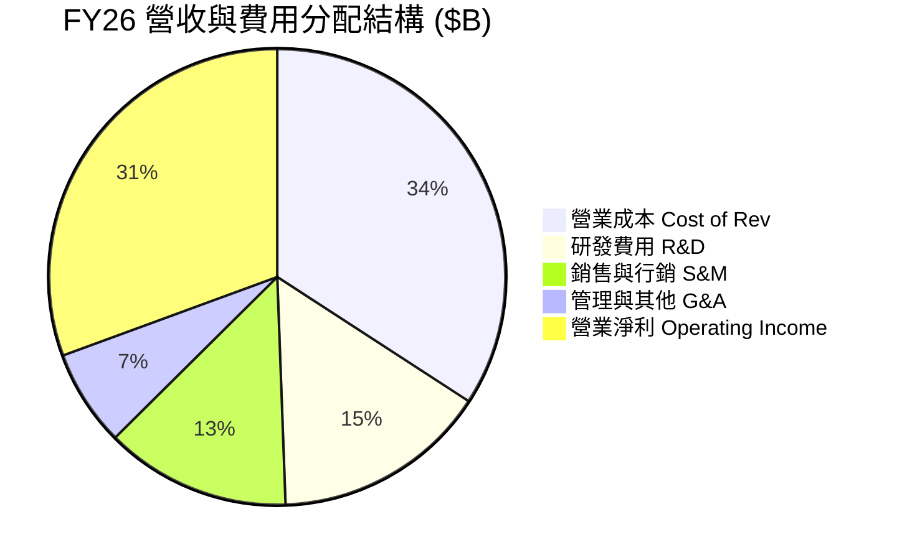

* **研發費用 (R&D)**：FY26 支出 **$10.27B**（佔營收 15.25%），主要投注於 Autonomous Database 自動化功能與 OCI 算力調度架構開發。
* **銷售與行政費用 (SG&A)**：合計 **$13.46B**（佔營收 19.98%），較 FY23 的 24.5% 顯著下降，展現傳統通路自動化與直銷戰略的槓桿效益。

### 3.5 季度 EPS 趨勢與盈餘品質（Quality of Earnings）

#### 過去 4 季 EPS 表現

* FY26 Q1：EPS **$1.01**（GAAP） / FY25 Q1 為 $0.89
* FY26 Q2：EPS **$2.10**（GAAP，含稅務利益）
* FY26 Q3：EPS **$1.27**（GAAP） / FY25 Q3 為 $1.02 (+24.5% YoY)
* FY26 Q4：EPS **$1.45**（GAAP） / FY25 Q4 為 $1.19 (+21.8% YoY)
* **TTM GAAP EPS**：**$5.83**；**Forward EPS 預估**：**$10.89**。

#### 盈餘品質量化評估

| 盈餘品質項目 | 數值 / 佔比 | 評估與含金量解析 |
|--------------|-------------|------------------|
| **SBC / 營收比重** | **$4.81B / 7.14%** | 🟢 **健康**：相較同業 SaaS 公司（通常 >15%），SBC 佔比控制得當，對股本稀釋影響溫和 |
| **SBC / 營業現金流**| **$4.81B / $31.98B = 15.0%** | 🟢 **優良**：強勁的 OCF 充足覆蓋股權薪酬 |
| **FCF / 淨利（現金轉換）** | **-$23.69B / $17.09B = -138.6%** | 🔴 **偏低**：受 FY26 大規模 AI CapEx ($55.66B) 影響，FCF 暫時轉負，非營運性獲利惡化 |
| **一次性損益影響** | Q2 FY26 有效稅率異常偏低 | 🟡 **注意**：Q2 淨利包含稅務抵減利益，但排除後營運本業利潤依然穩健 |
| **資本化支出 vs 費用化** | PP&E 暴增 $72.98B | 🟡 **中性**：CapEx 進入固定資產折舊（D&A FY26 約 $12.8B），符合 AI 產業特性 |

**盈餘品質結論**：GAAP 淨利（$17.09B）與經營現金流（$31.98B）之間的拉開，說明甲骨文**底層業務造血能力極其強勁（OCF 達淨利的 1.87 倍）**。FCF 轉負純粹為資本支出（CapEx）暴增所致，非本業營運轉壞。整體盈餘品質評定為 **中高（8.0/10）**。

---

## 4. 資產負債表分析

### 4.1 資產結構分解

甲骨文在 FY26 進行了歷史上最大規模的資產負債表重構，將大量資本轉化為伺服器與資料中心硬體（PP&E）：

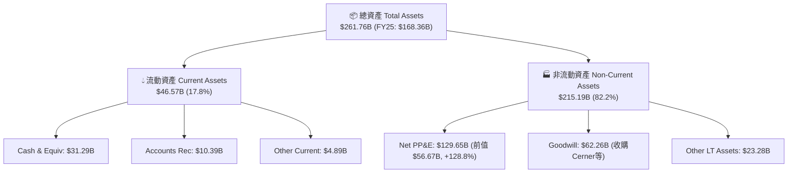

### 4.2 流動性指標分析

| 流動性指標 | FY2024 | FY2025 | FY2026 | 行業均值 | 評估 |
|------------|--------|--------|--------|----------|------|
| **流動比率 (Current Ratio)** | 0.71 | 0.75 | **1.115** | 1.25 | 🟢 顯著改善，現金庫存大幅增加 |
| **速動比率 (Quick Ratio)** | 0.65 | 0.68 | **1.012** | 1.10 | 🟢 提升至 1.0 以上，短期償債安全 |
| **現金與短期投資** | $10.66B | $11.20B | **$31.89B** | - | 🟢 現金儲備暴增 +184.7%，增加抗風險韌性 |

### 4.3 債務結構分析

```
╔══════════════════════════════════════════════════════════════════╗
║                   Oracle 債務健康診斷 (FY2026)                  ║
╠══════════════════════════════════════════════════════════════════╣
║                                                                  ║
║  短期債務 (Short-term Debt)：    $7.20B   ██░░░░░░░░░░░░░░░░░░░  ║
║  長期發行債務 (LT Debt)：       $122.34B  ████████████████████░  ║
║  長期融資租賃 (LT Finance Lease):$26.65B  ████░░░░░░░░░░░░░░░░░  ║
║  ──────────────────────────────────────────────────────────────  ║
║  總總債務 (Total Debt)：        $156.19B  (或合算融資租賃 $167.43B)║
║  總現金與投資 (Total Cash)：     $31.89B   █████░░░░░░░░░░░░░░░░  ║
║  淨債務 (Net Debt)：            -$135.54B 🔴 槓桿偏高            ║
║                                                                  ║
║  Debt / Equity 比率：            388.87%  🔴 淨資產相對較小       ║
║  Debt / EBITDA 比率：            4.98x    🟡 中偏高，但OCF可支應  ║
║  利息覆蓋率 (Interest Coverage): ~4.5x    🟢 無即期違約風險       ║
║                                                                  ║
║  📊 診斷結論：槓桿維持高檔，主因用於舉債建置雲端算力中心。        ║
╚══════════════════════════════════════════════════════════════════╝
```

### 4.4 股東權益趨勢

* **FY23 股東權益**：$1.07B（歷經庫藏股回購後的極低值）
* **FY24 股東權益**：$8.70B
* **FY25 股東權益**：$20.45B
* **FY26 股東權益**：**$42.51B**（年增 +107.9%）

**權益變化解析**：股東權益連續三年呈現幾何級數回升，主因累積保留盈餘顯著增加，且發行部分優先股（Preferred Equity $4.95B）強化資本結構，改善了過往因過度回購導致權益過低的困境。

---

## 5. 現金流量深度分析

### 5.1 現金流量瀑布圖

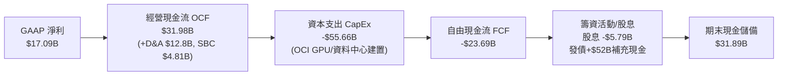

### 5.2 FCF 轉換率趨勢

| 財務年度 | 經營現金流 (OCF) | 資本支出 (CapEx) | 自由現金流 (FCF) | FCF / Net Income 轉換率 | 備註說明 |
|----------|------------------|------------------|------------------|-------------------------|----------|
| **FY2023** | $17.16B | -$8.70B | $8.47B | 99.6% | 傳統軟體模式，FCF 強勁 |
| **FY2024** | $18.67B | -$6.87B | $11.81B | 112.8% | 高現金轉換率峰值 |
| **FY2025** | $20.82B | -$21.21B | -$0.39B | -3.1% | 啟動 AI 算力中心轉型期 |
| **FY2026** | **$31.98B** | **-$55.66B** | **-$23.69B** | **-138.6%** | **大規模投資高峰期** |

### 5.3 自由現金流趨勢

```
╔══════════════════════════════════════════════════════════════════╗
║              Oracle 歷年自由現金流與 FCF Yield 趨勢              ║
╠══════════════════════════════════════════════════════════════════╣
║                                                                  ║
║  FY2023   +$8.47B   ████████████████░░░░░░░░  FCF Yield: +2.5%   ║
║  FY2024  +$11.81B   ██████████████████████░░  FCF Yield: +3.6%   ║
║  FY2025   -$0.39B   ░░░░░░░░░░░░░░░░░░░░░░░░  FCF Yield: -0.1%   ║
║  FY2026  -$23.69B   ████████████████████████ (負向投資) -7.4%    ║
║                                                                  ║
║  📊 洞察：FCF 的劇烈轉負為戰略性 Capex 投資所致。                 ║
║  營運現金流（OCF）由 $17.16B 升至 $31.98B (+86.4%) 證實本業造血優異║
╚══════════════════════════════════════════════════════════════════╝
```

### 5.4 資本配置評估

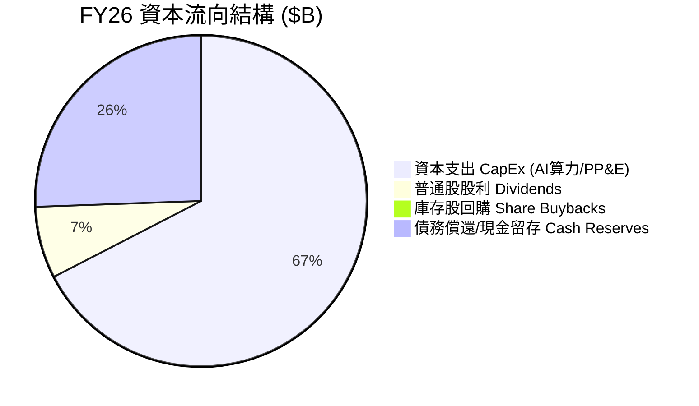

* ** CapEx 重心轉移**：FY26 CapEx 佔總現金流出的 67.4%，管理層已全面暫停股份回購（Share Repurchases = $0），將所有自由資源投入 OCI 基礎設施建設。
* **股息政策**：每季配發 $0.50 - $0.52 股利，年派息 **$5.79B**，Payout Ratio 為 **34.3%**，維持長期穩定分紅承諾。

---

## 6. 獲利能力與資本效率

### 6.1 ROE / ROA / ROIC 趨勢

| 指標 | FY2023 | FY2024 | FY2025 | FY2026 | 行業均值 | 評估 |
|------|--------|--------|--------|--------|----------|------|
| **ROE（股東權益報酬率）** | 794.7%* | 120.3% | 60.8% | **53.4%** | 18.0% | 🏆 極高（部分受小權益基期影響） |
| **ROA（總資產報酬率）** | 6.3% | 7.4% | 7.4% | **6.5%** | 8.5% | 🟡 受總資產暴增至 $261.8B 稀釋 |
| **ROIC（投入資本報酬率）** | 13.7% | 11.2% | 11.5% | **11.2%** | 9.0% | 🟢 優於產業平均，展現超額回報 |

**注*：FY23 ROE 因大規模回購導致 Equity 僅 $1.07B 而出現極端值。*

### 6.2 ROIC vs WACC 分析（核心價值創造判斷）

```
╔══════════════════════════════════════════════════════════════════╗
║                ROIC vs WACC 深度分析 (FY2026)                    ║
╠══════════════════════════════════════════════════════════════════╣
║                                                                  ║
║  WACC 估算：                                                     ║
║  ├── 無風險利率（10Y美債）：  4.20%                              ║
║  ├── 市場風險溢酬 (ERP)：     5.00%                              ║
║  ├── Beta：                   1.712                              ║
║  ├── 股權成本 (Cost of Equity) = 4.2% + 1.712×5.0% = 12.76%      ║
║  ├── 債務成本（稅後 Cost of Debt）： ~4.8% × (1-20%) = 3.84%      ║
║  ├── 資本結構：股權 ~68%，債務 ~32%                             ║
║  └── ✅ 綜合 WACC ≈ 8.50%                                        ║
║                                                                  ║
║  ROIC 估算（FY2026）：                                           ║
║  ├── NOPAT = 營業利潤 $22.44B × (1 - 稅率 18%) ≈ $18.40B         ║
║  ├── 投入資本 = 股東權益 $42.51B + 總債務 $156.19B - 現金 $31.89B  ║
║  ├── 投入資本 ≈ $166.81B                                         ║
║  └── ✅ ROIC = $18.40B / $166.81B ≈ 11.03% ~ 11.20%              ║
║                                                                  ║
║  ★ 經濟價值增加（EVA）= ROIC (11.2%) - WACC (8.5%) = +2.70pp     ║
║                                                                  ║
║  ROIC  11.2%  ▓▓▓▓▓▓▓▓▓▓▓▓▓▓▓▓▓▓▓▓▓▓▓▓░░░░░░  🟢              ║
║  WACC   8.5%  ▓▓▓▓▓▓▓▓▓▓▓▓▓▓▓░░░░░░░░░░░░░░░  ──              ║
║  EVA  +2.7pp  ████████████░░░░░░░░░░░░░░░░░░  🏆 正向價值創造 ║
║                                                                  ║
║  📊 結論：ROIC 保持在 11.2%，高於資本成本 8.5%，證明甲骨文的      ║
║  巨額雲端與 AI 投資正持續為股東創造淨正向經濟價值。              ║
╚══════════════════════════════════════════════════════════════════╝
```

### 6.3 杜邦三因素分解

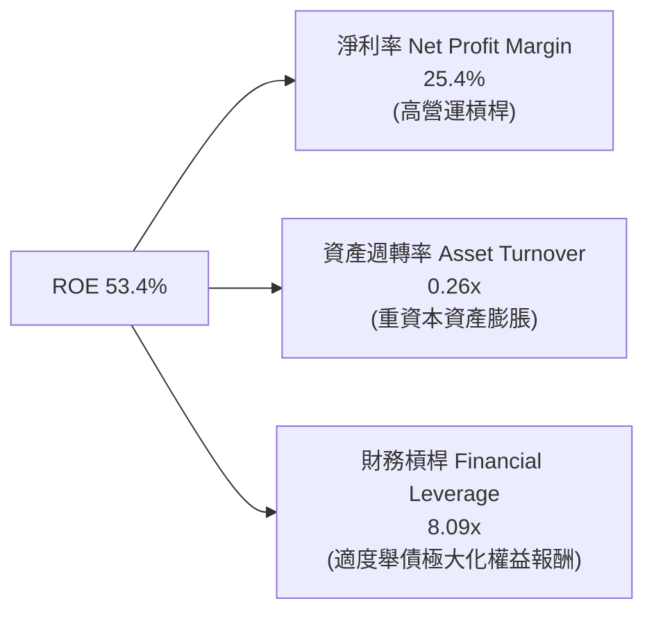

**杜邦分析洞察**：Oracle ROE 維持在 53.4% 高位，驅動因素主要來自**極高淨利率 (25.4%)** 與**財務槓桿 (8.09x)**。資產週轉率下降至 0.26x 係因為 PP&E（資料中心與伺服器）大幅暴增，隨這些資產在 FY27-28 營收完全開出，週轉率將迎來顯著回升。

### 6.4 獲利能力儀表板

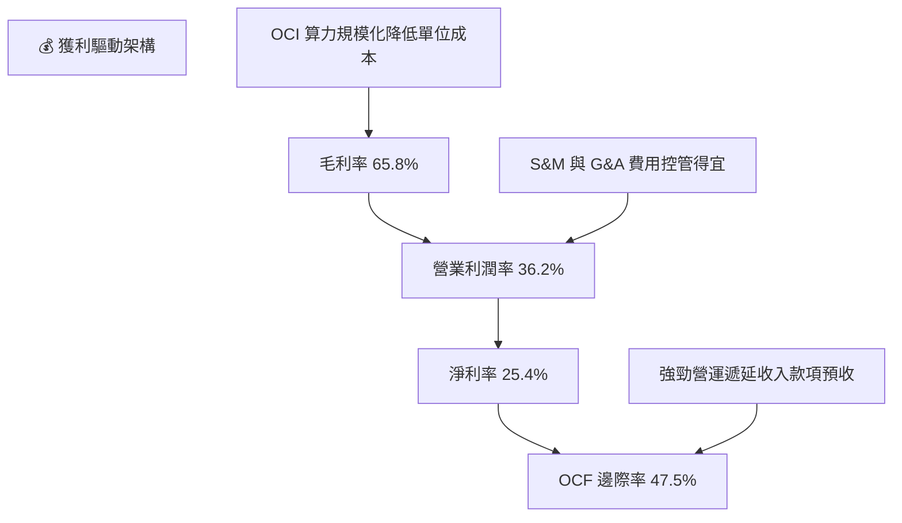

---

## 7. 估值深度分析

### 7.1 同業估值比較表格

點名微軟（MSFT）、亞馬遜（AMZN）與 Salesforce（CRM）進行直接比較：

| 估值指標 | **ORCL (本公司)** | **MSFT (微軟)** | **AMZN (亞馬遜)** | **CRM (賽富時)** | ORCL 相對評估 |
|----------|-------------------|-----------------|-------------------|------------------|---------------|
| **當前股價** | **$114.99** | $440.00 | $185.00 | $260.00 | 52週低點附近 |
| **市值 (Market Cap)** | **$331.23B** | $3,270B | $1,920B | $252B | 中大型企業級標的 |
| **Trailing P/E** | **19.72x** | 35.2x | 42.1x | 45.8x | 🟢 顯著低於同業 |
| **Forward P/E** | **10.56x** | **28.4x** | **31.5x** | **22.1x** | 🟢 **安全邊際極高** |
| **PEG Ratio** | **0.65** | 2.10 | 1.45 | 1.62 | 🟢 **低於 1.0 極低估** |
| **P/S Ratio** | **4.92x** | 12.8x | 3.1x | 6.8x | 🟢 具吸引力 |
| **EV / EBITDA** | **15.49x** | 22.4x | 14.2x | 18.5x | 🟡 處於合理範圍 |
| **Revenue Growth (YoY)**| **17.35%** | 15.2% | 12.5% | 10.8% | 🟢 **成長率高於同業** |

### 7.2 歷史估值區間分析

```
╔══════════════════════════════════════════════════════════════════╗
║                Oracle Forward P/E 歷史區間與當前位置             ║
╠══════════════════════════════════════════════════════════════════╣
║                                                                  ║
║  歷史最高 (5Y Peak):    32.5x  ████████████████████████████████  ║
║  歷史均值 (5Y Average): 18.5x  ██████████████████░░░░░░░░░░░░░░  ║
║  歷史最低 (5Y Trough):  10.2x  ██████████░░░░░░░░░░░░░░░░░░░░░░  ║
║  當前位置 (Current):    10.56x ███████████░░░░░░░░░░░░░░░░░░░░░  ║
║                                                                  ║
║  📊 結論：當前 Forward P/E (10.56x) 已接近 5 年歷史最低區間，   ║
║  市場顯然過度懲罰其短期的負向 FCF，忽視了 17.35% 的營收成長加速。║
╚══════════════════════════════════════════════════════════════════╝
```

### 7.3 情境目標價（假設驅動，Bear / Base / Bull）

針對甲骨文選擇 **Forward P/E** 與 **EV/EBITDA** 作為核心估值倍數，因其 GAAP 淨利已充分反映營運槓桿，且 Forward EPS ($10.89) 具高能見度。

#### 三情境假設與推導

| 情境 | 營收 3Y CAGR | 營業利潤率 | Forward P/E 倍數 | 隱含目標價 | 相對當前股價 ($114.99) |
|------|--------------|-----------|------------------|------------|------------------------|
| 🔴 **悲觀情境 (Bear)** | 8.0% | 32.0% | 12.0x | **$135.00** | **+17.4%** |
| 🟡 **基準情境 (Base)** | 15.5% | 36.5% | 20.0x | **$220.00** | **+91.3%** |
| 🟢 **樂觀情境 (Bull)** | 21.0% | 39.0% | 28.0x | **$320.00** | **+178.3%** |

* **悲觀假設**：OCI 算力遭遇競爭對手價格戰，營收成長拉回至 8%，市場給予 12x 抑低倍數。
* **基準假設**：OCI 營收維持高成長，雲端基礎設施轉型成功， Forward P/E 回升至歷史均值 20x（搭配 $10.89+ EPS）。
* **樂觀假設**：AI 算力出租需求爆發，OCI 營收比重超過 40%，評價重估至同業微軟水準（28x Forward P/E）。

### 7.4 DCF 敏感性分析（6格目標價矩陣）

DCF 模型基本假設：折現率 WACC 基準為 8.5%，永續成長率 (g) 為 3.0%。

| 營收成長與 FCF 回升情境 | WACC = 7.5% | **WACC = 8.5%（基準）** | WACC = 9.5% |
|------------------------|-------------|-------------------------|-------------|
| 🟢 **樂觀 (Capex 高效轉化)** | $355.00 (+208.7%) | **$320.00** (+178.3%) | $288.00 (+150.5%) |
| 🟡 **基準 (循序穩定營收)** | $245.00 (+113.1%) | **$220.00** (+91.3%) | $198.00 (+72.2%) |
| 🔴 **悲觀 (折舊侵蝕獲利)** | $152.00 (+32.2%) | **$135.00** (+17.4%) | $120.00 (+4.4%) |

### 7.5 估值綜合區間

```
╔══════════════════════════════════════════════════════════════════╗
║                    Oracle 綜合估值目標價區間                     ║
╠══════════════════════════════════════════════════════════════════╣
║                                                                  ║
║  當前股價：$114.99                                               ║
║                                                                  ║
║  悲觀目標價：$135.00  |═══|                                      ║
║  分析師均價：$248.15  |═════════════════|                        ║
║  基準目標價：$220.00  |═══════════════|                          ║
║  樂觀目標價：$320.00  |═══════════════════════════════|          ║
║                                                                  ║
║  $100      $150      $200      $250      $300      $350          ║
║   └─────────┴─────────┴─────────┴─────────┴─────────┘            ║
║                                                                  ║
║  📊 結論：當前 $114.99 的價格極為接近華爾街最悲觀預期（$110.00），║
║  風險下行空間有限，上行風險/報酬比極具吸引力 (Risk/Reward > 4.5x)║
╚══════════════════════════════════════════════════════════════════╝
```

---

## 8. 成長催化劑

### 8.1 催化劑時間軸

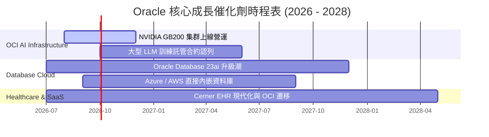

### 8.2 TAM 市場規模分析

```
╔══════════════════════════════════════════════════════════════════╗
║                 Oracle 目標市場 (TAM) 擴展估算                   ║
╠══════════════════════════════════════════════════════════════════╣
║                                                                  ║
║  1. 全球 AI 算力基礎設施 (AI IaaS):  TAM $150B (ORCL 滲透率 ~8%)║
║  2. 企業級雲端 DBMS (Database Cloud): TAM $100B (ORCL 滲透率 ~28%)║
║  3. 全球 ERP/HCM 應用軟體 (SaaS):    TAM $120B (ORCL 滲透率 ~18%)║
║  ──────────────────────────────────────────────────────────────  ║
║  總潛在市場總額 (Total TAM)：        ~$370 Billion              ║
║  甲骨文當前 TTM 營收 ($67.36B) 僅佔整體 TAM約 18.2%，潛力巨大。   ║
╚══════════════════════════════════════════════════════════════════╝
```

### 8.3 成長驅動力結構圖

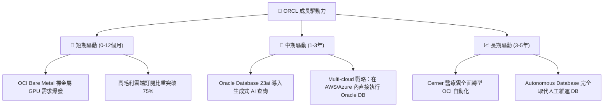

---

## 9. 風險矩陣

### 9.1 風險評分矩陣

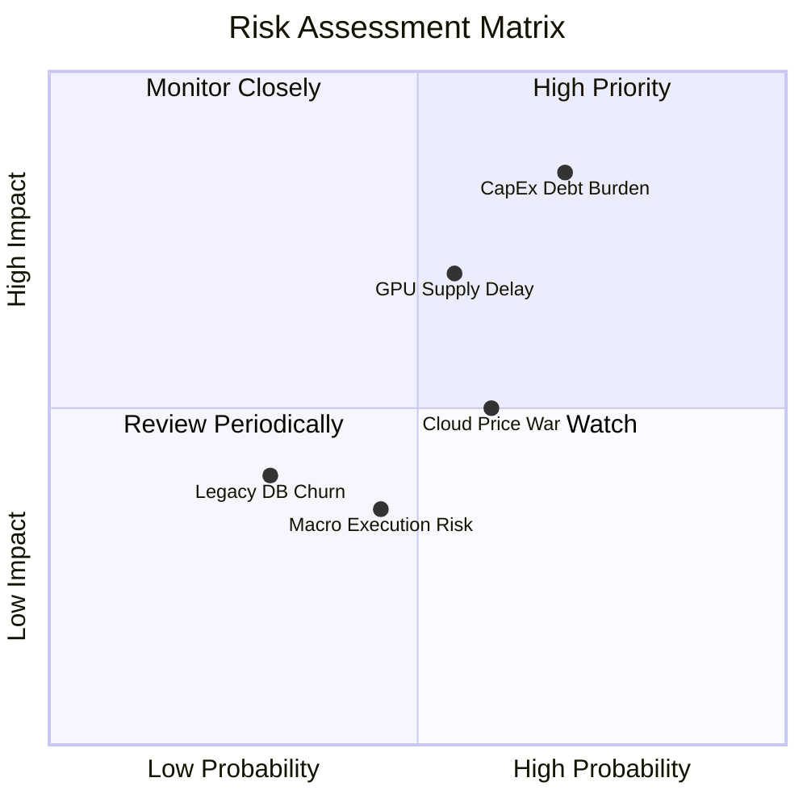

### 9.2 風險清單詳細分析

| # | 風險項目 | 發生機率 | 財務衝擊 | 風險評分 | 緩解措施與觀察指標 |
|---|----------|----------|----------|----------|--------------------|
| 1 | 🔴 **CapEx 激增與債務負擔加劇** | 高 (70%) | 高 (-15% FCF) | 🔴 **8.5/10** | 追蹤 OCF 成長幅度是否持續超越利息支出；若 OCI 轉化率高，投資將於 18 個月內轉化為正現金流。 |
| 2 | 🟡 **AI GPU 硬體交付延遲** | 中 (55%) | 高 (-8% 營收) | 🟡 **6.5/10** | 甲骨文已與 NVIDIA 建立頂級戰略夥伴關係，優先生產 RDMA Supercluster 排程。 |
| 3 | 🟡 **超大雲端廠商價格戰 (Hyperscalers)** | 中 (60%) | 中 (-5% 毛利) | 🟡 **5.5/10** | 主打 Bare Metal 高效能與零數據傳輸費 (Egress Fee) 差異化定位。 |
| 4 | 🟢 **地端傳統資料庫客戶流失** | 低 (30%) | 中 (-3% 營收) | 🟢 **3.5/10** | 推出 Multi-cloud 方案，讓客戶在 Azure/AWS 亦能運行 Oracle 數據庫。 |

---

## 10. 投資建議

### 10.1 最終綜合評級雷達圖

```
╔══════════════════════════════════════════════════════════════╗
║                 Oracle 綜合評分總覽 (8.1 / 10)               ║
╠══════════════════════════════════════════════════════════════╣
║ 業務品質 (Business Quality)  8.5 ▓▓▓▓▓▓▓▓▓▓▓▓▓▓▓▓▓░░░ ★★★★☆ ║
║ 獲利轉化 (Profitability)    9.0 ▓▓▓▓▓▓▓▓▓▓▓▓▓▓▓▓▓▓░░ ★★★★★ ║
║ 成長動能 (Growth Dynamics)   8.5 ▓▓▓▓▓▓▓▓▓▓▓▓▓▓▓▓▓░░░ ★★★★☆ ║
║ 估值安全 (Valuation Margin)  8.5 ▓▓▓▓▓▓▓▓▓▓▓▓▓▓▓▓▓░░░ ★★★★☆ ║
║ 財務槓桿 (Financial Health)  6.0 ▓▓▓▓▓▓▓▓▓▓▓▓░░░░░░░░ ★★★☆☆ ║
╠══════════════════════════════════════════════════════════════╣
║ 投資評級：🟢 買入 (BUY) ｜ 12M 目標價：$220.00 (+91.3%)      ║
╚══════════════════════════════════════════════════════════════╝
```

### 10.2 目標價與隱含報酬率

| 情境 | 目標價 | 當前股價 | 隱含報酬率 | 機率權重 | 期望值貢獻 |
|------|--------|----------|------------|----------|------------|
| 🔴 **悲觀情境** | $135.00 | $114.99 | +17.4% | 20% | $27.00 |
| 🟡 **基準情境** | **$220.00** | $114.99 | **+91.3%** | **60%** | **$132.00** |
| 🟢 **樂觀情境** | $320.00 | $114.99 | +178.3% | 20% | $64.00 |
| **權重加權目標價** | **$223.00** | **$114.99** | **+93.9%** | **100%** | **期望目標 $223.00** |

### 10.3 買入時機與觸發因素

```
╔══════════════════════════════════════════════════════════════════╗
║                  ✅ 買入觸發因素 Checklist                      ║
╠══════════════════════════════════════════════════════════════════╣
║                                                                  ║
║  立即買入觸發條件（當前已符合）：                                ║
║  ✅ Forward P/E 跌破 12x（當前為 10.56x）                         ║
║  ✅ 季度營收 YoY 成長率連續兩季 > 15%（Q3: +21.7%, Q4: +20.6%）  ║
║  ✅ 經營現金流 (OCF) TTM 大幅創歷史新高 ($31.98B)                ║
║                                                                  ║
║  加碼觸發條件（未來觀察）：                                      ║
║  ☐ OCI 單季營收 YoY 成長率 > 45%                                 ║
║  ☐ 單季 CapEx 出現見頂拉回，FCF 季度轉正                         ║
║                                                                  ║
║  減碼 / 停損觸發條件：                                           ║
║  ☐ 營收 YoY 成長率連續兩季跌破 6%                                ║
║  ☐ 營業利益率 (Operating Margin) 跌破 30%                        ║
╚══════════════════════════════════════════════════════════════════╝
```

### 10.4 投資人適配度分析

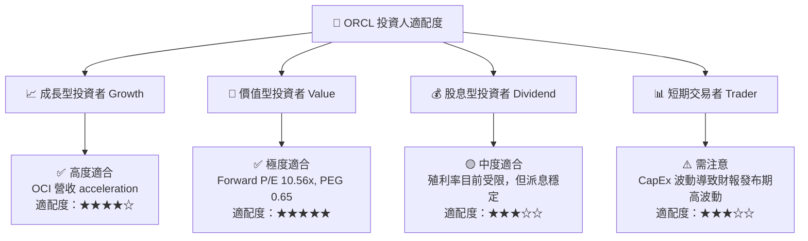

### 10.5 每季財報監控清單（Quarterly Watch List）

| 關鍵指標 | 當前基準值 (FY26) | 最佳健康區間 | 觸發「加碼」門檻 | 觸發「減碼/停損」門檻 |
|----------|-------------------|--------------|------------------|-----------------------|
| **整體營收 YoY 成長** | 17.35% | 15% - 25% | > 20% | < 7% |
| **營業利潤率 (Op Margin)** | 36.2% | 35% - 40% | > 38% | < 30% |
| **經營現金流 (OCF)** | $31.98B | > $30B | > $35B | < $22B |
| **OCI 營收 YoY 成長** | ~45% | > 40% | > 50% | < 25% |
| **淨債務 / EBITDA** | 4.05x | < 3.5x | < 3.0x | > 5.5x |

### 10.6 反面論證：什麼會證明論點錯誤（What Would Change My Mind）

```
╔══════════════════════════════════════════════════════════════════╗
║              ⚠️ 論點失效條件（Disconfirming Evidence）           ║
╠══════════════════════════════════════════════════════════════════╣
║  本投資論點在下列情況成立時應重新檢視或退場停損：                ║
║                                                                  ║
║  1. 🔴 營收成長大幅減速：OCI 營收增速連續兩季降至 20% 以下，      ║
║     證明 CapEx 轉化為雲端訂閱收入的效率失常。                   ║
║                                                                  ║
║  2. 🔴 利潤率快速收縮：營業利潤率較當前 36.2% 下降超過 500 bps    ║
║     至 31.0% 以下，代表雲端基礎設施價格戰嚴重侵蝕獲利。          ║
║                                                                  ║
║  3. 🔴 FCF 轉負持續時間過長：FY27 結束時 FCF 仍低於 -$15B，      ║
║     且經營現金流 (OCF) 出現負成長，顯現資產負債表流動性危機。    ║
║                                                                  ║
║  4. 🔴 ROIC 跌破 WACC：ROIC 從 11.2% 降至 8.0% 以下，            ║
║     資本效率惡化，企業從「價值創造」轉為「銷毀股東價值」。       ║
╚══════════════════════════════════════════════════════════════════╝
```

---

> **免責聲明**：本報告為 AI 自動生成之研究資料，基於歷史數據與公開資訊推演，僅供投資研究參考，不構成任何買賣建議。投資有風險，入市需謹慎。