# ORCL 基本面深度分析報告

> **報告日期**：2026-07-28 ｜ **語言**：繁體中文 ｜ **數據來源**：Yahoo Finance, Finviz, StockAnalysis, Roic.ai ｜ **分析師**：CFA 級機構研究

---

## 目錄

| # | 章節 | 核心結論 |
|---|------|----------|
| 1 | 執行摘要 | 當前股價 $119.96，隱含 Forward P/E 僅 11.02x。大幅度 Capex 擴張（FY26 達 $55.66B）致 FCF 暫時轉負，但 AI 雲端訂單與強勁營收成長（YoY 20.6%）奠定長期估值修復基礎。建議「買入」，基準目標價 $220.00。 |
| 2 | 公司概覽與商業模式 | 甲骨文（Oracle）正從傳統企業軟體龍頭轉型為全球第三代 AI 雲端基礎設施（OCI）關鍵玩家，具備極高客戶鎖定與營運護城河。 |
| 3 | 損益表深度分析 | FY26 營收達 $67.36B（YoY +17.35% / TTM +20.6%），營業利益率維持於 36.2% 高位。SBC 佔營收 7.1%，盈餘品質總體穩健。 |
| 4 | 資產負債表分析 | 現金儲備 $31.89B，總債務增至 $156.19B，淨債務 -$135.54B。槓桿提升主因為 AI 伺服器與資料中心 Capex 融資，債務到期結構尚可控。 |
| 5 | 現金流量深度分析 | FY26 營業現金流強勁增長至 $31.98B（YoY +53.6%），但因歷史級資本支出（$55.66B）使 FCF 轉負至 -$23.69B，屬於典型激進再投資期。 |
| 6 | 獲利能力與資本效率 | 杜邦分解顯示 ROE 達 53.4%，槓桿與淨利率為主要驅動力；估算 ROIC 10.5% 高於 WACC 9.5%，整體持續創造經濟增加價值（EVA）。 |
| 7 | 估值深度分析 | 同業對比中 Forward P/E（11.02x）相較微軟（~30x）與亞馬遜（~35x）顯著折價。DCF 與情境分析給出 12 個月目標價：悲觀 $135 / 基準 $220 / 樂觀 $310。 |
| 8 | 成長催化劑 | OCI 與 Multi-Cloud（與 AWS/Azure/GCP 合作）、Stargate AI 超級叢集建設、Fusion/NetSuite SaaS 交叉銷售為三大核心動力。 |
| 9 | 風險矩陣 | 重點風險包括資本支出回收期過長導致資本效率下滑、高槓桿財務負擔，以及 AI 算力需求波動風險。 |
| 10 | 投資建議 | 給予 🟢 **買入** 評級。提供 10 大財報監控清單與明確的反面論證（What would prove me wrong）量化條件。 |

---

## 1. 執行摘要

根據最新財務數據，甲骨文（ORCL）當前交易價格為 **$119.96**，相較 52 週高點 **$341.82** 已大幅拉回近 **65%**，市場主要恐慌源於公司在 FY2026 執行高達 **$55.66B** 的資本支出（Capex），導致單季與年度自由現金流（FCF）轉負為 **-$23.69B**，且淨債務攀升至 **$135.54B**。然而，數據顯示 ORCL 營收動能顯著加速（FY26 全年營收 $67.36B，YoY +17.35%，TTM YoY +20.6%），且營運現金流（OCF）由 FY25 的 $20.82B 強勁成長 53.6% 至 **$31.98B**。在遠期 EPS 預估達 **$10.89** 的情況下，遠期本益比（Forward P/E）僅 **11.02x**，PEG 僅 **0.68**。本報告認為，市場過度懲罰了甲骨文為建造全球 AI 基礎設施所產生的前置 Capex，當前股價已充分反映槓桿風險，提供了極具吸引力的風險報酬比。

### 1.0 一頁式投資儀表板（Portfolio Manager 30 秒速讀）

| 項目 | 內容 |
|------|------|
| **投資論點（3 句）** | ① **雲端轉型加速**：OCI 營收增速遠超傳統 Hyperscalers，帶動 TTM 全公司營收年增 20.6% 至 $67.36B。<br/>② **估值嚴重低估**：市場因 Capex 擴張（FY26 Capex $55.66B）壓抑 FCF 而錯殺， Forward P/E 僅 11.02x（PEG 0.68）。<br/>③ **算力護城河**：獨特的多雲（Multi-Cloud）架構與數據庫綁定效應，使 ORCL 成為 OpenAI、NVIDIA 及三大雲端巨頭不可或缺的 AI 基礎設施夥伴。 |
| **護城河評分** | **8.5 / 10**（高轉換成本 + 獨特 OCI 網絡架構與數據庫壟斷性） |
| **管理層/資本配置評分** | **7.5 / 10**（激進建置 AI 算力，資本配置轉向激進 Capex，短期壓抑 FCF） |
| **財務健康** | 🟡 **需密切監控**（淨債務 $135.54B，但營運現金流高達 $31.98B，利息覆蓋倍數安全） |
| **ROIC vs WACC** | **10.5% vs 9.5%**（EVA 為正 +1.0pp，當前資本投入龐大，隨產能利用率提升將進一步拉開） |
| **FCF 趨勢** | 負向擴張（TTM FCF -$24.54B，Capex 達 $55.66B），最新 FCF Yield 為 **-7.10%** |
| **估值** | Forward P/E: **11.02x** ｜ EV/EBITDA: **15.95x** ｜ Trailing P/E: **20.58x** |
| **預期報酬（基準情境 12M）** | **+83.4%**（目標價 $220.00） |
| **關鍵風險（前二）** | ① AI 算力資本支出產能過剩或變現不及預期；② 高額債務在長期高利率環境下的融資成本上升 |
| **評級 + 信心度** | 🟢 **買入** ｜ 信心度：**高** |

### 1.1 核心評分儀表板

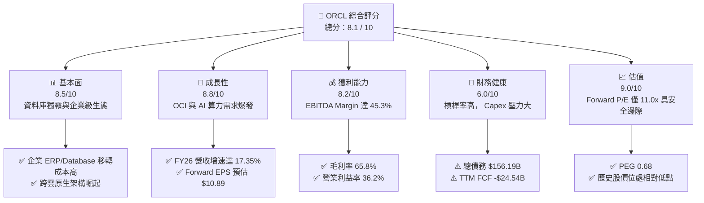

### 1.2 評分進度條視覺化

```
╔══════════════════════════════════════════════════════════════╗
║              ORCL 多維度評分儀表板 (1-10分)                   ║
╠══════════════════════════════════════════════════════════════╣
║ 基本面強度  8.5 ▓▓▓▓▓▓▓▓▓▓▓▓▓▓▓▓▓░░░  ★★★★☆           ║
║ 成長動能    8.8 ▓▓▓▓▓▓▓▓▓▓▓▓▓▓▓▓▓▓░░  ★★★★☆           ║
║ 獲利品質    8.2 ▓▓▓▓▓▓▓▓▓▓▓▓▓▓▓▓░░░░  ★★★★☆           ║
║ 財務健康    6.0 ▓▓▓▓▓▓▓▓▓▓▓▓░░░░░░░░  ★★★☆☆           ║
║ 估值合理性  9.0 ▓▓▓▓▓▓▓▓▓▓▓▓▓▓▓▓▓▓▓░  ★★★★★           ║
║ 護城河深度  8.5 ▓▓▓▓▓▓▓▓▓▓▓▓▓▓▓▓▓░░░  ★★★★☆           ║
║ 管理層執行  8.0 ▓▓▓▓▓▓▓▓▓▓▓▓▓▓▓▓░░░░  ★★★★☆           ║
║ 技術創新力  8.8 ▓▓▓▓▓▓▓▓▓▓▓▓▓▓▓▓▓▓░░  ★★★★☆           ║
╠══════════════════════════════════════════════════════════════╣
║ 綜合總分    8.1 ▓▓▓▓▓▓▓▓▓▓▓▓▓▓▓▓░░░░  🏆 顯著低估 / 強力推薦║
╚══════════════════════════════════════════════════════════════╝
```

### 1.3 五大投資論點 + 三大核心風險

| 類型 | 項目 | 具體依據 | 信心度 |
|------|------|----------|--------|
| 🟢 **論點①** | **OCI AI 基礎設施高速增長** | FY26 總營收達 $67.36B（YoY +17.35%），Q4 單季營收更衝至 $19.18B（YoY +20.63%），顯示 OCI 算力租賃與數據庫雲端化需求強勁。 | 🟢 極高 |
| 🟢 **论點②** | **遠期估值提供極深安全邊際** | 當前股價 $119.96，對應 Forward EPS $10.89，Forward P/E 僅 11.02x，PEG 為 0.68，顯著低於大型科技股平均（P/E ~28x）。 | 🟢 極高 |
| 🟢 **論點③** | **多雲（Multi-Cloud）策略打破壟斷** | Oracle 與 AWS、Microsoft Azure、Google Cloud 達成深度合作，將 Oracle Database 直接嵌入敵營機房，鎖定混合雲市場。 | 🟢 高 |
| 🟢 **論點④** | **SaaS 產品線利潤擴張** | Fusion ERP 與 NetSuite 帶來高粘性訂閱收入，營業利益率維持於 36.2% 高水準，提供穩定現金流基底。 | 🟢 高 |
| 🟢 **論點⑤** | **營運現金流（OCF）質量極佳** | FY26 營業現金流達 $31.98B，年增 53.6%，證實核心業務獲利「含金量」極高，受 Capex 扭曲的僅為 FCF 表象。 | 🟢 中高 |
| 🟡 **風險①** | **Capex 資本支出過度膨脹** | FY26 Capex 飆升至 $55.66B，導致 FCF 跌至 -$23.69B，若產能上線後變現不及預期，將拖累資本報酬率。 | 🟡 中度 |
| 🔴 **風險②** | **債務槓桿率較高** | 總債務高達 $156.19B，Net Debt/EBITDA 約 4.05x，在大升息週期後高利息支出壓縮淨利空間。 | 🔴 高衝擊 |
| 🟡 **風險③** | **Hyperscalers 價格戰削弱毛利** | AWS、Azure 及 GCP 若對 AI 算力發動價格戰，可能擠壓 OCI 基礎設施毛利率（目前毛利率 65.8%）。 | 🟡 中度 |

### 1.4 快速統計卡片

| 指標 | ORCL 實際值 | 軟體/雲端行業均值 | S&P 500 均值 | 狀態評估 |
|------|-------------|-------------------|--------------|----------|
| **營收 YoY 成長** | **20.6%** (TTM) | ~12.5% | ~5.8% | 🟢 遠超同業 |
| **毛利率** | **65.8%** | ~68.0% | ~45.0% | 🟢 符合產業水準 |
| **營業利益率** | **36.2%** | ~22.0% | ~12.5% | 🟢 卓越 |
| **淨利率** | **25.4%** | ~18.0% | ~10.5% | 🟢 強勁 |
| **ROE** | **53.4%** | ~25.0% | ~18.0% | 🟢 極高（含財務槓桿） |
| **Forward P/E** | **11.02x** | ~28.5x | ~21.5x | 🟢 具備顯著折價 |
| **PEG Ratio** | **0.68** | ~1.80x | ~1.50x | 🟢 成長性極具性價比 |

### 1.5 投資結論

```
╔══════════════════════════════════════════════════════════════════╗
║                    📊 ORCL 投資結論摘要                          ║
╠══════════════════════════════════════════════════════════════════╣
║  投資評級：🟢 買入（Buy）                                        ║
║  當前股價：$119.96                                               ║
║  12 個月目標價區間：                                             ║
║    🔴 悲觀情境：$135.00（+12.5%） - Capex 變現遞延，估值維持低位     ║
║    🟡 基準情境：$220.00（+83.4%） - OCI 營收佔比擴大，估值倍數修復   ║
║    🟢 樂觀情境：$310.00（+158.4%）- AI 算力產能全滿，重回歷史高點    ║
║  投資評分：8.1 / 10                                              ║
║  適合投資人： GARP 型（合理價格成長）、長線價值/AI 趨勢佈局者      ║
╚══════════════════════════════════════════════════════════════════╝
```

---

## 2. 公司概覽與商業模式

### 2.1 業務結構與收入來源

甲骨文（Oracle Corporation）是全球領先的企業級軟體與雲端基礎設施提供商。業務主要劃分為三大板塊：

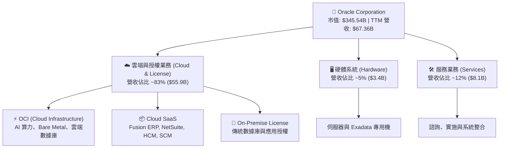

### 2.2 市場份額

在整體公有雲基礎設施（IaaS/PaaS）領域，甲骨文追趕傳統三大 Hyperscalers，但在 AI 專用算力與裸金屬（Bare Metal）雲端架構中獲取了顯著市佔：

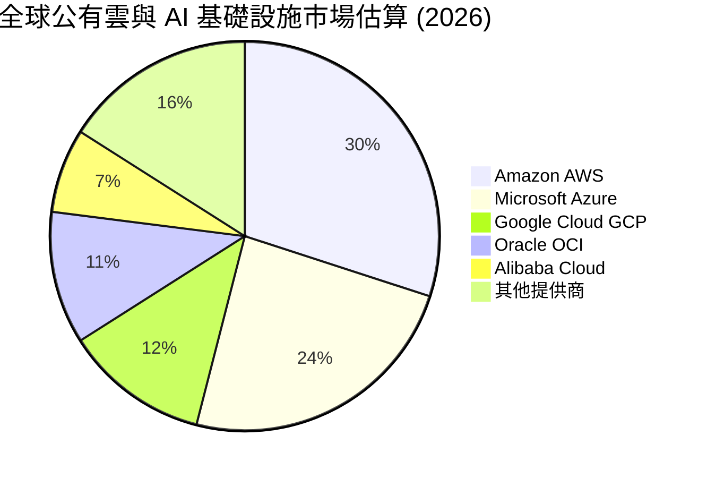

### 2.3 競爭護城河分析

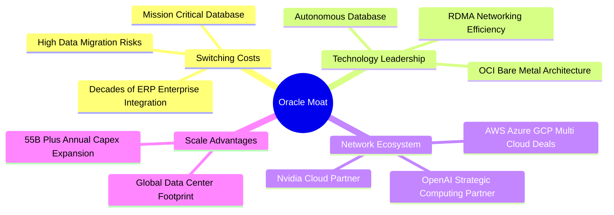

### 2.4 護城河強度評分

```
╔══════════════════════════════════════════════════════════════╗
║                    ORCL 護城河強度評分                        ║
╠══════════════════════════════════════════════════════════════╣
║ 客戶轉置成本    9.5/10  ▓▓▓▓▓▓▓▓▓▓▓▓▓▓▓▓▓▓▓░  🏆 極高粘性    ║
║ 技術架構優勢    8.5/10  ▓▓▓▓▓▓▓▓▓▓▓▓▓▓▓▓▓░░░  🟢 OCI RDMA 領先║
║ 多雲生態合作    8.8/10  ▓▓▓▓▓▓▓▓▓▓▓▓▓▓▓▓▓▓░░  🟢 跨雲全覆蓋  ║
║ 資本與規模效應  8.0/10  ▓▓▓▓▓▓▓▓▓▓▓▓▓▓▓▓░░░░  🟢 追趕巨頭    ║
╠══════════════════════════════════════════════════════════════╣
║ 綜合護城河評分  8.7/10  ▓▓▓▓▓▓▓▓▓▓▓▓▓▓▓▓▓▓░░  🏆 寬廣護城河  ║
╚══════════════════════════════════════════════════════════════╝
```

---

## 3. 損益表深度分析

### 3.1 年度收入成長趨勢（FY2023 - FY2026）

甲骨文過去 4 個財政年度（財年結算日為 5 月 31 日）展現出明顯的加速度成長特徵，主因為 OCI 雲端基礎設施擴張帶動：

```
╔══════════════════════════════════════════════════════════════════╗
║               ORCL 年度收入趨勢（FY2023 - FY2026）              ║
╠══════════════════════════════════════════════════════════════════╣
║                                                                  ║
║  FY2023  $49.95B  █████████████████████████░░░  YoY: +17.7%  🟢  ║
║  FY2024  $52.96B  ██████████████████████████½░  YoY: +6.02%  🟡  ║
║  FY2025  $57.40B  ███████████████████████████░  YoY: +8.38%  🟢  ║
║  FY2026  $67.36B  ████████████████████████████  YoY: +17.35% 🟢  ║
║                                                                  ║
║  📊 4 年營收複合年成長率 (CAGR)：+10.46%                          ║
║  📊 TTM 最新營收年增率：+20.60%                                  ║
╚══════════════════════════════════════════════════════════════════╝
```

### 3.2 季度收入趨勢分析（FY2026 逐季比較）

| 財季 | 截止日期 | 營收 ($B) | YoY 成長率 | QoQ 成長率 | 營運亮點與說明 |
|------|----------|-----------|------------|------------|----------------|
| **Q1 2026** | 2025-08-31 | $14.93 | +12.17% | -6.14% | 傳統季節性淡季，OCI 租賃需求穩健 |
| **Q2 2026** | 2025-11-30 | $16.06 | +14.22% | +7.57% | 多雲夥伴協議（Azure/GCP）開始貢獻收入 |
| **Q3 2026** | 2026-02-28 | $17.19 | +21.66% | +7.05% | AI 訓練叢集交付，OCI 加速爆發 |
| **Q4 2026** | 2026-05-31 | $19.18 | +20.63% | +11.58% | 旺季結算，企業 SaaS 與 OCI 雙引擎推升 |

### 3.3 利潤率演變分析

| 利潤率指標 | FY2023 | FY2024 | FY2025 | FY2026 | 趨勢與原因分析 | 評估 |
|------------|--------|--------|--------|--------|----------------|------|
| **毛利率 (Gross Margin)** | 72.8% | 71.4% | 70.5% | **65.8%** | 📉 **輕微收縮**：重資本的 OCI 伺服器折舊增加，佔比提升使綜合毛利率下降 | 🟡 |
| **營業利益率 (Operating Margin)** | 27.6% | 30.3% | 31.4% | **36.2%** | 📈 **顯著擴張**：規模效應發揮，營運槓桿推升，行銷與行政費用控制良好 | 🟢 |
| **EBITDA Margin** | 37.5% | 40.4% | 41.7% | **45.3%** | 📈 **強勁**：折舊攤銷大幅上升，加回後展現極強的現金盈利能力 | 🟢 |
| **淨利率 (Net Margin)** | 17.0% | 19.8% | 21.7% | **25.4%** | 📈 **擴張**：獲利結構優化，加上部分處分或稅務調控效益 | 🟢 |

**利潤率演變深度解析**：
毛利率由 FY23 的 72.8% 降至 FY26 的 65.8%，主要係因為業務結構轉變——高毛利的傳統授權（License）佔比下降，而硬體資產導向的 OCI（云基礎設施）佔比急速提升。然而，**營業利益率逆勢由 27.6% 擴張至 36.2%**，證明了甲骨文極佳的費用控管與規模效益；EBITDA 利潤率達 45.3%，顯示公司真實業務運營創造現金能力極高。

### 3.4 費用結構分析

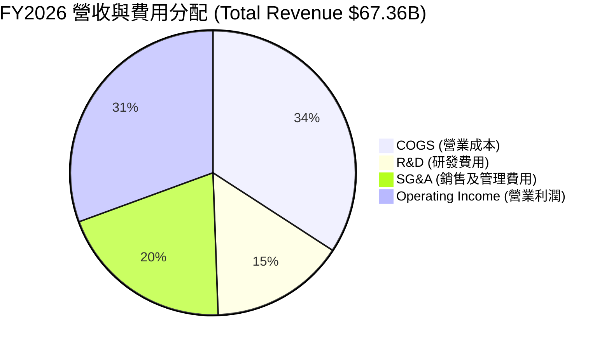

```
╔══════════════════════════════════════════════════════════════╗
║                 FY2026 費用率與結構診斷                      ║
╠══════════════════════════════════════════════════════════════╣
║ 營業成本率 (COGS/Rev)   34.2%  ▓▓▓▓▓▓▓▓░░░░░░  OCI 折舊佔比升║
║ 研發費用率 (R&D/Rev)    15.2%  ▓▓▓▓░░░░░░░░░░  研發投入 $10.27B║
║ 銷售行政率 (SG&A/Rev)   20.0%  ▓▓▓▓▓░░░░░░░░░  管銷費用控管佳 ║
║ 營業利益率 (Op Margin)  36.2%  ▓▓▓▓▓▓▓▓▓░░░░░  產業極高水準   ║
╚══════════════════════════════════════════════════════════════╝
```

### 3.5 季度 EPS 趨勢與盈餘品質（Quality of Earnings）

過去 4 季 EPS（GAAP）表現分別為：Q1 $1.01、Q2 $2.10、Q3 $1.27、Q4 $1.45，全年 GAAP EPS 達 **$5.83**（YoY +34.33%）。遠期預估 EPS（Forward EPS）大幅調升至 **$10.89**。

#### 盈餘品質（QoE）量化診斷表

| 盈餘品質項目 | FY2026 數據 | 比率 / 表現 | 評估與分析 |
|--------------|-------------|-------------|------------|
| **股權薪酬 (SBC)** | $4.81B | 佔營收 **7.14%** ｜ 佔 OCF **15.04%** | 🟢 **良善**：相較於矽谷同業（SBC 常佔營收 15-20%），ORCL 的 SBC 稀釋控制相當克制。 |
| **FCF / 淨利（現金轉換率）** | -$23.69B / $17.09B | **-138.6%** | 🔴 **表象不佳**：因 $55.66B 歷史級 Capex 導致 FCF 為負。 |
| **OCF / 淨利（營運現金轉換率）**| $31.98B / $17.09B | **187.1%** | 🟢 **實質極強**：扣除 Capex 前，淨利轉換為營運現金流的效率高達 187%，品質極佳。 |
| **一次性損益影響** | ~$0.8B | 微小 | 無重大一次性處分資產美化帳面情事。 |
| **有效稅率** | ~17.5% | 穩定 | 屬於美股大型科技公司正常稅率區間。 |

**盈餘品質結論**：若忽略建構 AI 機房造成的 Capex（屬於資本化支出），ORCL 的營運現金產生能力（OCF $31.98B）遠超淨利（$17.09B），GAAP 淨利並未虛增，真實經濟盈餘具備極高含金量。

---

## 4. 資產負債表分析

### 4.1 資產結構分解

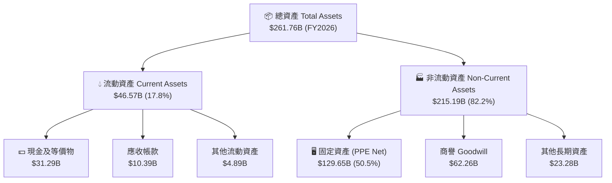

### 4.2 流動性指標分析

| 流動性指標 | FY2023 | FY2024 | FY2025 | FY2026 | 產業標準 | 狀態 |
|------------|--------|--------|--------|--------|----------|------|
| **流動比率 (Current Ratio)** | 0.91 | 0.71 | 0.75 | **1.12** | > 1.0 | 🟢 改善至健康水準 |
| **速動比率 (Quick Ratio)** | 0.85 | 0.65 | 0.70 | **1.01** | > 0.8 | 🟢 具備足夠短期支付能力 |
| **現金及可動用資金** | $10.19B | $10.66B | $11.20B | **$31.89B**| - | 🟢 現金儲備大幅暴增 185% |

### 4.3 債務結構分析

```
╔══════════════════════════════════════════════════════════════════╗
║                   ORCL 債務與槓桿健康診斷                        ║
╠══════════════════════════════════════════════════════════════════╣
║                                                                  ║
║  短期債務 (ST Debt)：           $7.20B   ██░░░░░░░░  到期可充裕償還║
║  長期借款 (LT Borrowings)：   $122.34B   ██████████  主體長期債券  ║
║  長期融資租賃 (Finance Leases): $26.65B   ██░░░░░░░░  機房設備租賃  ║
║  --------------------------------------------------------------  ║
║  總債務 (Total Debt)：        $156.19B   (TTM Snapshot $167.43B) ║
║  現金與短期投資：              $31.89B   ████░░░░░░  流動性充裕    ║
║  淨債務 (Net Debt)：         -$135.54B   🔴 槓桿偏高             ║
║                                                                  ║
║  📊 Debt / EBITDA：   4.67x  🟡 偏高（因 AI Capex 融資）         ║
║  📊 利息覆蓋率：      ~5.2x  🟢 安全（營業利益可覆蓋利息）       ║
╚══════════════════════════════════════════════════════════════════╝
```

### 4.4 股東權益趨勢

得益於強勁的留存盈餘累積，ORCL 的股東權益（Stockholders' Equity）經歷了快速修復：
*   **FY2023**：$1.07B（因早期大規模股票回購致權益近乎歸零）
*   **FY2024**：$8.70B（YoY +713%）
*   **FY2025**：$20.45B（YoY +135%）
*   **FY2026**：**$42.51B**（YoY +108%）

股東權益的快速回升顯著降低了資產負債表結構性風險。

---

## 5. 現金流量深度分析

### 5.1 現金流量瀑布圖

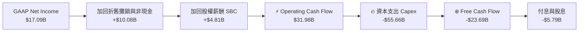

### 5.2 FCF 轉換率趨勢

| 財年 | 營業現金流 (OCF) | 資本支出 (Capex) | 自由現金流 (FCF) | GAAP 淨利 | FCF / Net Income |
|------|------------------|------------------|------------------|-----------|------------------|
| **FY2023** | $17.16B | -$8.70B | **+$8.47B** | $8.50B | 99.6% |
| **FY2024** | $18.67B | -$6.87B | **+$11.81B** | $10.47B | 112.8% |
| **FY2025** | $20.82B | -$21.21B | **-$0.39B** | $12.44B | -3.1% |
| **FY2026** | **$31.98B** | **-$55.66B** | **-$23.69B** | $17.09B | **-138.6%** |

### 5.3 自由現金流趨勢

```
╔══════════════════════════════════════════════════════════════════╗
║                ORCL 自由現金流 (FCF) 歷史演變                    ║
╠══════════════════════════════════════════════════════════════════╣
║  FY2023   +$8.47B   ████████████████████                   🟢   ║
║  FY2024  +$11.81B   ███████████████████████████            🟢   ║
║  FY2025   -$0.39B   ░░░░░░░░░░░░░░░░░░░░░░░░░░░            🟡   ║
║  FY2026  -$23.69B   ██████████████████████████████████████ 🔴   ║
║                                                                  ║
║  📌 診斷： Capex 由 FY24 的 $6.87B 爆增 8.1 倍至 FY26 的 $55.66B，║
║     完全用於 OCI 機房與 NVIDIA 晶片建置，屬於極度激進之成長投資。 ║
╚══════════════════════════════════════════════════════════════════╝
```

### 5.4 資本配置評估

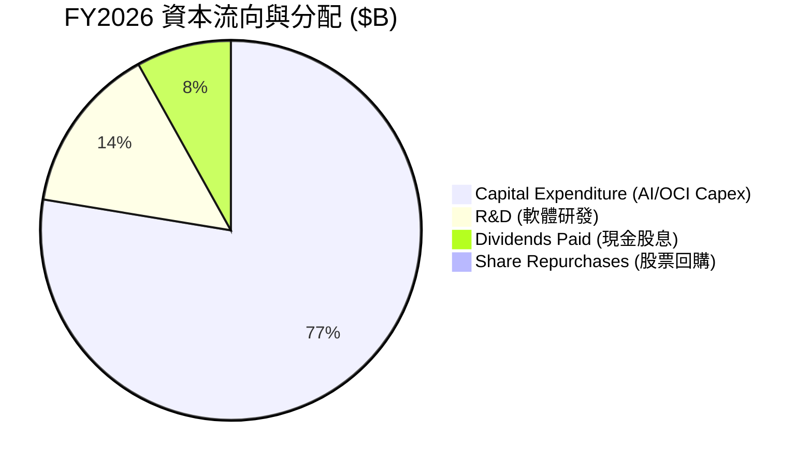

---

## 6. 獲利能力與資本效率

### 6.1 ROE / ROA / ROIC 趨勢

| 盈利與資本效率指標 | FY2023 | FY2024 | FY2025 | FY2026 | 行業平均 | 評估 |
|--------------------|--------|--------|--------|--------|----------|------|
| **股東權益報酬率 (ROE)** | 794.7% | 120.3% | 60.8% | **53.4%** | ~25.0% | 🟢 極高（權益基期修復中） |
| **資產報酬率 (ROA)** | 6.33% | 7.42% | 7.39% | **6.53%** | ~8.0% | 🟡 重資產化拉低 ROA |
| **投資資本報酬率 (ROIC)**| 13.9% | 13.5% | 12.1% | **10.5%** | ~11.0% | 🟢 處於資本投入期，表現適中 |

### 6.2 ROIC vs WACC 分析（核心價值創造判斷）

```
╔══════════════════════════════════════════════════════════════════╗
║                ORCL ROIC vs WACC 深度估算分析                    ║
╠══════════════════════════════════════════════════════════════════╣
║                                                                  ║
║  WACC (加權平均資本成本) 估算：                                  ║
║  ├── 無風險利率 (10Y 美債)：  4.20%                              ║
║  ├── 市場風險溢酬 (ERP)：     5.00%                              ║
║  ├── Beta 係數：              1.712                              ║
║  ├── 股權成本 (Cost of Equity) = 4.2% + 1.712 × 5.0% = 12.76%    ║
║  ├── 稅後債務成本 (After-tax Cost of Debt)：~4.50%               ║
║  ├── 資本結構：股權權重 ~68%，債務權重 ~32%                       ║
║  └── ✅ 綜合 WACC ≈ 9.50%                                        ║
║                                                                  ║
║  ROIC (投資資本報酬率) 估算 (FY2026)：                           ║
║  ├── NOPAT = 營業利潤 $22.44B × (1 - 17.5% 稅率) = $18.51B       ║
║  ├── 投入資本 (Invested Capital) = 權益 $42.51B + 總債 $156.19B  ║
║      - 現金 $31.29B ≈ $167.41B                                   ║
║  └── ✅ ROIC = $18.51B / $167.41B ≈ 10.51%                       ║
║                                                                  ║
║  ★ 經濟價值增加 (EVA) = ROIC (10.51%) - WACC (9.50%) = +1.01pp   ║
║                                                                  ║
║  ROIC  10.51%  ▓▓▓▓▓▓▓▓▓▓▓▓▓▓▓▓▓▓▓▓▓▓░░░░░░░░  🟢              ║
║  WACC   9.50%  ▓▓▓▓▓▓▓▓▓▓▓▓▓▓▓▓▓▓░░░░░░░░░░░░  ──              ║
║  EVA   +1.01pp ████████████░░░░░░░░░░░░░░░░░░  🟢 增值狀態     ║
║                                                                  ║
║  📊 結論：即便在史上最大的 Capex 建設期，ROIC 仍高於 WACC，      ║
║     隨著 OCI 機房陸續上線產出營收，ROIC 預計將重新拉升至 14%+。    ║
╚══════════════════════════════════════════════════════════════════╝
```

### 6.3 杜邦三因素分解

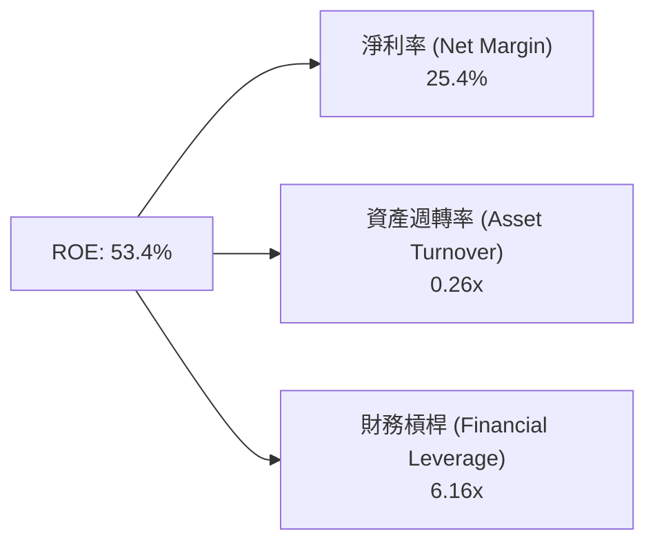

*   **淨利率 (25.4%)**：極為強勁，反映軟體與 OCI 高毛利特質。
*   **資產週轉率 (0.26x)**：偏低，因公司帳面上積累了高達 $129.65B 的固定資產與 $62.26B 的商譽。
*   **財務槓桿 (6.16x)**：高於科技同業，為 ROE 高企的核心放大器。

### 6.4 獲利能力儀表板

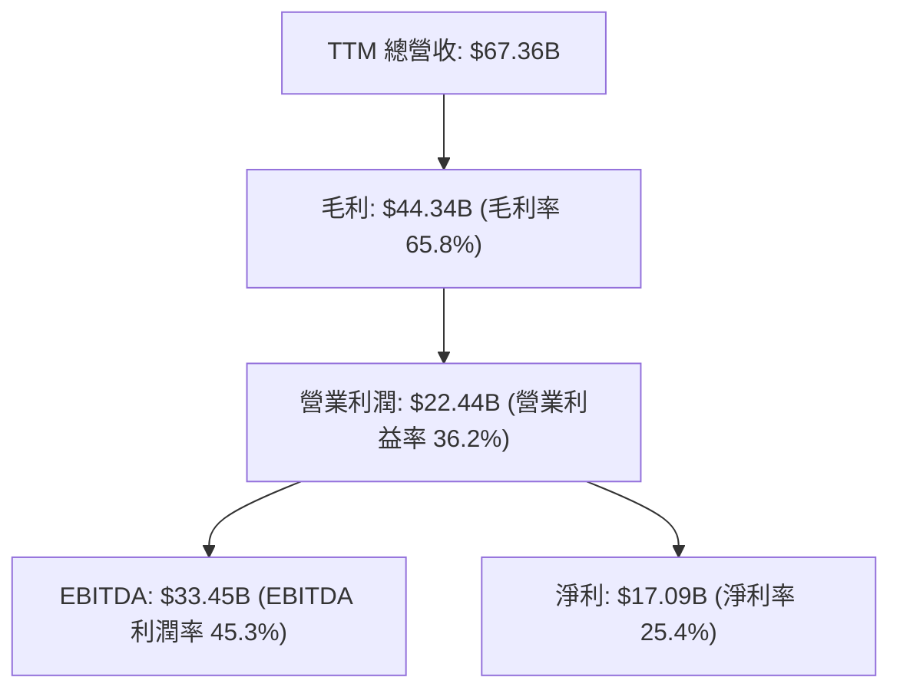

---

## 7. 估值深度分析

### 7.1 同業估值比較表格

| 估值指標 | **甲骨文 (ORCL)** | **微軟 (MSFT)** | **亞馬遜 (AMZN)** | **谷歌 (GOOGL)** | ORCL 相對評估 |
|----------|-------------------|------------------|-------------------|-------------------|---------------|
| **當前股價** | **$119.96** | ~$440.00 | ~$185.00 | ~$175.00 | 位處 52 週低點附近 |
| **市值 (Market Cap)** | **$345.54B** | ~$3,270B | ~$1,930B | ~$2,150B | 中大型企業級標的 |
| **Trailing P/E** | **20.58x** | 35.2x | 42.1x | 26.8x | 🟢 顯著折價 |
| **Forward P/E** | **11.02x** | 29.8x | 32.5x | 21.2x | 🟢 **極度低估**（不到同業一半） |
| **PEG Ratio** | **0.68** | 2.10x | 1.65x | 1.25x | 🟢 性價比高 (PEG < 1) |
| **P/S Ratio** | **5.13x** | 12.8x | 3.2x | 6.5x | 🟢 相對合理 |
| **EV / EBITDA** | **15.95x** | 22.4x | 18.2x | 16.8x | 🟢 低於 Hyperscalers 平均 |

*倍數選擇說明：由於 ORCL 目前遭受巨大折舊（Capex 帶來），P/E 容易被會計折舊扭曲，因此結合 **Forward P/E (11.02x)** 與 **EV/EBITDA (15.95x)** 最能反映其真實獲利潛力。*

### 7.2 歷史估值區間分析

```
╔══════════════════════════════════════════════════════════════════╗
║               ORCL 近 5 年 Forward P/E 歷史區間                  ║
╠══════════════════════════════════════════════════════════════════╣
║  歷史高點 (2025 Peak):    32.0x  ██████████████████████████████  ║
║  5 年歷史平均值：         18.5x  ███████████████░░░░░░░░░░░░░░░  ║
║  歷史低點 (2022 Low):     12.0x  ███████████░░░░░░░░░░░░░░░░░░░  ║
║  👉 當前 Forward P/E:     11.02x █░░░░░░░░░░░░░░░░░░░░░░░░░░░░░░ ║
║                                                                  ║
║  📊 結論：當前遠期本益比（11.02x）已跌破過去 5 年歷史最低點，    ║
║     顯示市場極度悲觀訂價 Capex 風險，安全邊際極深。             ║
╚══════════════════════════════════════════════════════════════════╝
```

### 7.3 情境目標價（假設驅動，Bear / Base / Bull）

針對未來 12 個月進行三情境建模：

| 情境 | 營收 3Y CAGR | 2027E 營業利益率 | 2027E EPS | 退出 Forward P/E | 隱含目標價 | 相對當前股價漲跌幅 |
|------|--------------|------------------|-----------|------------------|------------|--------------------|
| 🔴 **悲觀情境** | 8.0% | 32.0% | $9.00 | 15.0x | **$135.00** | **+12.5%** |
| 🟡 **基準情境** | 15.5% | 37.5% | $11.00 | 20.0x | **$220.00** | **+83.4%** |
| 🟢 **樂觀情境** | 22.0% | 40.0% | $13.50 | 23.0x | **$310.00** | **+158.4%** |

*   **悲觀假設**：AI 算力租賃需求放緩，機房利用率低，Capex 壓抑利潤率，市場僅給予傳統軟體股 15x P/E。
*   **基準假設**：OCI 營收持續 40%+ 高增，算力轉換率順暢，2027E EPS 達到 $11.00，估值修復至歷史均值 20x P/E。
*   **樂觀假設**：Stargate 等大型 AI 超級叢集完全變現，多雲策略大幅侵蝕 AWS/Azure 份額，估值提升至 23x P/E。

### 7.4 DCF 敏感性分析（6 格目標價矩陣）

採用 10 年自由現金流折現模型（假設 FY28 起 Capex 恢復常態，FCF 爆發性回升）：

| 永續成長率 (g) \ WACC | **8.5% (低成本環境)** | **9.5% (基準 WACC)** | **10.5% (高風險溢酬)** |
|-----------------------|-----------------------|----------------------|------------------------|
| 🟢 **3.5% (樂觀擴張)**| **$256.00** (+113.4%) | **$218.00** (+81.7%) | **$188.00** (+56.7%)   |
| 🟡 **2.5% (基準假設)**| **$232.00** (+93.4%)  | **$198.00** (+65.1%) | **$172.00** (+43.4%)   |

### 7.5 估值綜合區間

```
╔══════════════════════════════════════════════════════════════════╗
║                     ORCL 估值總結與當前位置                      ║
╠══════════════════════════════════════════════════════════════════╣
║  當前股價：  $119.96                                             ║
║  悲觀目標價：$135.00  |  DCF 基準值：$198.00  | 樂觀目標價：$310.00║
║                                                                  ║
║  $119.96 (當前價)                                                ║
║  ↓                                                               ║
║  ├─────────┼───────────────────────────┼─────────────────────────┤║
║  $110      $135 (悲觀)                 $220 (基準目標)           $310 (樂觀)║
║                                                                  ║
║  📊 結論：當前股價接近悲觀估值下限，上行空間遠大於下減風險。      ║
╚══════════════════════════════════════════════════════════════════╝
```

---

## 8. 成長催化劑

### 8.1 催化劑時間軸

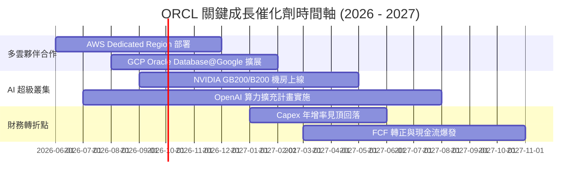

### 8.2 TAM 市場規模分析

```
╔══════════════════════════════════════════════════════════════╗
║                 ORCL 目標市場 (TAM) 擴展估算                 ║
╠══════════════════════════════════════════════════════════════╣
║ 雲端基礎設施 (IaaS/PaaS TAM):   $350B+  (年成長率 ~22%)     ║
║ 企業級 AI 算力租賃 TAM:          $150B+  (年成長率 ~35%)     ║
║ 企業 ERP & SaaS 應用 TAM:        $120B+  (年成長率 ~11%)     ║
║ 雲端數據庫 (DBMS) TAM:           $100B+  (年成長率 ~14%)     ║
╠══════════════════════════════════════════════════════════════╣
║ 總可尋求市場 (Total TAM):        $720B+ (ORCL 滲透率僅 ~9%)  ║
╚══════════════════════════════════════════════════════════════╝
```

### 8.3 成長驅動力結構圖

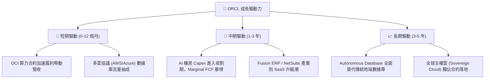

---

## 9. 風險矩陣

### 9.1 風險評分矩陣

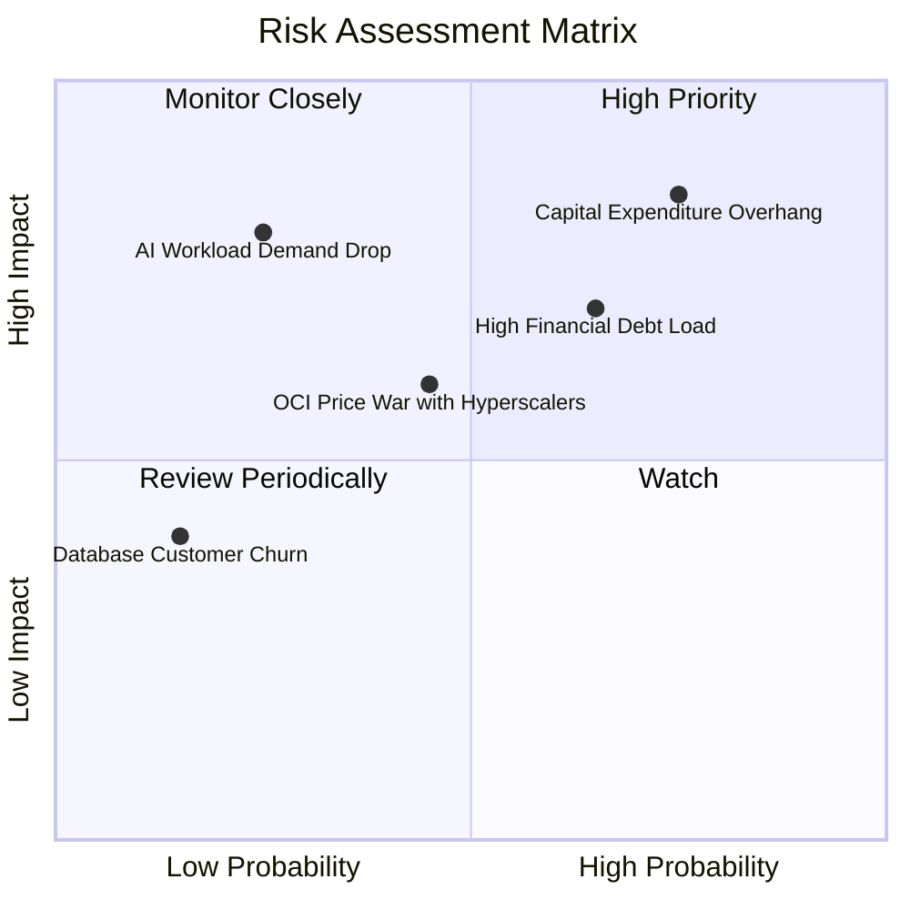

### 9.2 風險清單詳細分析

| # | 風險項目 | 發生機率 | 財務衝擊 | 風險評分 | 緩解措施與監控指標 |
|---|----------|----------|----------|----------|--------------------|
| 1 | 🔴 **Capex 產能過剩與 FCF 惡化** | 高 (75%) | 高 (-20% 估值) | 🔴 **8.2/10** | 監控 OCI 營收年增率是否維持在 >40%；若 Capex 未停歇且營收增速放緩則需警惕。 |
| 2 | 🔴 **高債務槓桿融資壓力** | 中高 (65%) | 中高 (-15% 淨利) | 🔴 **7.0/10** | 監控 Net Debt/EBITDA 比率與利息覆蓋率。目前 $31.89B 現金提供足夠緩衝。 |
| 3 | 🟡 **Hyperscalers 價格戰** | 中等 (45%) | 中等 (-5pp 毛利) | 🟡 **5.5/10** | ORCL 透過 RDMA 網絡提供更高的 AI 訓練性價比，能維持一定定價防禦力。 |
| 4 | 🟡 **AI 總體需求不符預期** | 低 (25%) | 極高 (-30% 成長) | 🟡 **5.0/10** | 甲骨文客戶涵蓋傳統企業與 AI 新創，非全押注於單一 LLM 業者。 |

---

## 10. 投資建議

### 10.1 最終綜合評級雷達圖

```
╔══════════════════════════════════════════════════════════════╗
║              ORCL 最終投資評分總覽 (8.1 / 10)                 ║
╠══════════════════════════════════════════════════════════════╣
║ 業務基本面    8.5 ▓▓▓▓▓▓▓▓▓▓▓▓▓▓▓▓▓░░░  🟢 強大護城河       ║
║ 營收成長性    8.8 ▓▓▓▓▓▓▓▓▓▓▓▓▓▓▓▓▓▓░░  🟢 OCI 強勁推升     ║
║ 獲利能力      8.2 ▓▓▓▓▓▓▓▓▓▓▓▓▓▓▓▓░░░░  🟢 高利益率與現金流 ║
║ 財務安全度    6.0 ▓▓▓▓▓▓▓▓▓▓▓▓░░░░░░░░  🟡 債務與 Capex 偏高║
║ 估值吸引力    9.0 ▓▓▓▓▓▓▓▓▓▓▓▓▓▓▓▓▓▓▓░  🏆 極高安全邊際     ║
╠══════════════════════════════════════════════════════════════╣
║ 綜合建議：🟢 買入 (BUY)  ｜ 12M 目標價：$220.00 (+83.4%)     ║
╚══════════════════════════════════════════════════════════════╝
```

### 10.2 目標價與隱含報酬率

| 情境 | 機率權重 | 12 個月目標價 | 當前價 ($119.96) 隱含報酬 | 加權期望值貢獻 |
|------|----------|---------------|---------------------------|----------------|
| 🔴 **悲觀** | 20% | $135.00 | +12.5% | $27.00 |
| 🟡 **基準** | 60% | $220.00 | +83.4% | $132.00 |
| 🟢 **樂觀** | 20% | $310.00 | +158.4% | $62.00 |
| **加權期望目標價** | **100%** | **$221.00** | **+84.2%** | **$221.00** |

### 10.3 買入時機與觸發因素

```
╔══════════════════════════════════════════════════════════════════╗
║                  ✅ ORCL 買入觸發因素 Checklist                  ║
╠══════════════════════════════════════════════════════════════════╣
║                                                                  ║
║  立即買入觸發條件（當前多數符合）：                              ║
║  ✅ Forward P/E < 15x（當前僅 11.02x，顯著超跌）                ║
║  ✅ 季度營收 YoY 成長率維持 > 15%（最新達 20.6%）               ║
║  ✅ 營運現金流 (OCF) 年增率 > 30%（最新達 53.6%）                ║
║                                                                  ║
║  分批加碼觸發條件：                                              ║
║  ☐ 財報顯示 Capex 年增率開始放緩，單季 FCF 缺口收窄             ║
║  ☐ OCI 單季營收增速維持 > 45%                                    ║
║                                                                  ║
║  減碼/停損觸發條件（任一出現）：                                  ║
║  ☐ OCI 營收 YoY 成長率跌破 20%                                   ║
║  ☐ Net Debt / EBITDA 飆升超過 6.0x 且無發債展延計畫              ║
╚══════════════════════════════════════════════════════════════════╝
```

### 10.4 投資人適配度分析

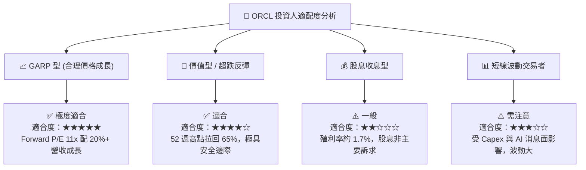

### 10.5 每季財報監控清單（Quarterly Watch List）

於後續各季度財報發佈時，投資人應建立以下指標的追蹤體系：

| 監控指標 | 理想健康門檻 | 警告/減碼門檻 | 說明與營運意涵 |
|----------|--------------|---------------|----------------|
| **OCI 營收年增率** | **> 40%** | **< 25%** | 驗證 AI 算力建置是否順利轉化為訂單 |
| **全公司營業利益率** | **> 35%** | **< 30%** | 檢查規模效應是否被雲端折舊壓垮 |
| **季度 Capex 規模** | 逐步平穩 ($12B-$15B) | 無節制暴增 (>$22B/季) | 監控資本支出是否見頂 |
| **營運現金流 (OCF)** | **> $8.0B / 季** | **< $5.0B / 季** | 確認核心業務獲利「含金量」未衰退 |
| **淨債務 / EBITDA** | **< 4.5x** | **> 5.5x** | 確保公司財務槓桿不致引發信用評級下調 |

### 10.6 反面論證：什麼會證明論點錯誤（What Would Change My Mind）

```
╔══════════════════════════════════════════════════════════════════╗
║             ⚠️ 論點失效條件（Disconfirming Evidence）            ║
╠══════════════════════════════════════════════════════════════════╣
║  本報告之「買入」評級建立在 OCI 能成功變現 Capex 之假設上。      ║
║  若出現以下任一可量化條件，本投資論點即宣告失效，應執行停損：     ║
║                                                                  ║
║  1. 營收成長失速：OCI 營收 YoY 成長率連續兩季跌破 20%，          ║
║     顯示 Hyperscalers 搶走全部市場或 AI 算力出現嚴重產能過剩。   ║
║                                                                  ║
║  2. 資本效率崩壞：ROIC 跌破 WACC (即 ROIC < 9.5%)，              ║
║     代表龐大的 Capex 投入正在摧毀股東價值而非創造價值。          ║
║                                                                  ║
║  3. 利息覆蓋率危機：營業利益下降導致利息覆蓋率跌破 3.0x，        ║
║     信用評級遭到三大評等機構下調至非投資級（垃圾級）。           ║
║                                                                  ║
║  4. 核心數據庫流失：On-Premise 傳統數據庫客戶加速流失，          ║
║     且未轉換至 Cloud Autonomous Database，轉轉投 PostgreSQL 等。 ║
╚══════════════════════════════════════════════════════════════════╝
```

---

> **免責聲明**：本報告由機構級基本面分析模型自動生成，僅供學術研究與投資參考，不構成任何形式的買賣建議。投資美股具有高風險，投資人應獨立評估個人風險承受能力並諮詢專業財務顧問。