# ORCL 基本面深度分析報告
> **報告日期**：2026-08-10 ｜ **語言**：繁體中文 ｜ **數據來源**：Yahoo Finance, StockAnalysis, Roic.ai ｜ **分析師**：CFA 級機構研究

---

## 目錄

| # | 章節 | 核心結論 |
|---|------|----------|
| 1 | 執行摘要 | 評級：🟢 買入 ｜ 目標價：$181.08 ｜ 加權合理價值：$181.08 ｜ 安全邊際：+16.58% |
| 2 | 公司概覽與商業模式 | 數據庫霸主轉型雲端巨頭，高切換成本與 OCI AI 基礎設施築起深厚護城河 |
| 3 | 損益表深度分析 | FY2026 營收達 $67.36B（YoY +17.35%），淨利率 25.4%，高 Capex 擠壓短期現金流 |
| 4 | 資產負債表分析 | 總資產 $261.76B，總債務 $167.43B，淨負債 $135.54B，槓桿偏高但利息覆蓋安全 |
| 5 | 現金流量深度分析 | OCF 達 $31.98B，因 AI Capex 飆升至 $-55.66B 導致 FCF 為 $-23.69B |
| 6 | 獲利能力與資本效率 | ROE 達 53.4%，ROIC 10.5% 高於 WACC 9.80%，持續創造經濟價值（EVA） |
| 7 | 相對估值分析 | Forward P/E 13.87x 顯著低於同業巨頭（MSFT/AMZN），隱含修復空間 |
| 8 | DCF 內在價值評估 | 基準內在價值 $144.86，三角驗證加權合理價值 $181.08，隱含上行空間 +19.88% |
| 9 | 成長催化劑 | OCI AI 算力集群暴增、Multicloud 多雲戰略（與 MSFT/AWS/GCP 合作）、Fusion ERP |
| 10 | 風險矩陣 | 巨額 Capex 回報不及預期風險、高債務利率風險、雲端市場價格戰 |
| 11 | 投資建議 | 分批佈局區間 $135–$145，監控 OCI 營收成長率與 Capex 轉換效率 |

---

## 1. 執行摘要

根據 Oracle Corporation（ORCL）最新公布之 FY2026 財務數據，公司營收達到 $67.36B（YoY +17.35%），營業利益率維持在 33.3%（GAAP）/ 36.2%（Non-GAAP）的高水準，EPS TTM 達 $5.84，Forward EPS 預估為 $10.89。儘管為構建 OCI（Oracle Cloud Infrastructure）AI 算力中心導致 FY2026 資本支出（Capex）飆升至 $-55.66B，使自由現金流（FCF）短期轉負至 $-23.69B，但強勁的營運現金流（OCF $31.98B）以及高達 10.5% 的 ROIC（高於 WACC 9.80%）證實其資本配置正在為長期股東價值積蓄爆發力。綜合 DCF 模型與相對估值三角驗證，ORCL 之加權合理價值為 **$181.08**，對照當前股價 $151.05，安全邊際（MOS）為 **+16.58%**，隱含上行空間為 **+19.88%**，給予 🟢 **買入（BUY）** 評級。

### 1.0 一頁式投資儀表板（Portfolio Manager 30 秒速讀）

| 項目 | 內容 |
|------|------|
| **投資論點（3 句）** | ① ORCL 由傳統數據庫升級為 OCI AI 算力核心，FY26 營收達 $67.36B（YoY +17.35%）。<br/>② 獨特的多雲架構（Multicloud）獲得 MSFT、AWS 及 GCP 深度整合，訂單能見度極高。<br/>③ ROIC 10.5% 高於 WACC 9.80%， Forward P/E 僅 13.87x，估值展現吸引力。 |
| **護城河評分** | 8.5/10（高客戶切換成本 + 專利數據庫生態 + OCI 算力成本優勢） |
| **管理層/資本配置評分** | 7.5/10（執行力極強，但財務槓桿比率 Debt/Equity 達 388.87% 偏高） |
| **財務健康** | 🟡 債務偏高但利息覆蓋無虞（現金 $31.89B，總債務 $167.43B） |
| **ROIC vs WACC** | 10.50% vs 9.80%（EVA = +0.70pp，持續創造經濟價值） |
| **FCF 趨勢** | 轉負（FY26 FCF $-23.69B），FCF Yield -5.64%，主因 AI Capex 超常投入（$-55.66B） |
| **估值** | Forward P/E 13.87x ｜ EV/EBITDA 18.51x ｜ P/S 6.46x |
| **DCF 內在價值（基準）** | $144.86 ｜ 現價相對 DCF 溢價 +4.27%（來自第 8 章） |
| **安全邊際（MOS）** | **+16.58%**＝(加權合理價值 $181.08 − 現價 $151.05) ÷ $181.08 ｜ 🟡 10-25% 有限保護 |
| **預期報酬（基準情境 12M）**| **+19.88%**（目標價 $181.08） |
| **關鍵風險（前二）** | ① 巨額 Capex 轉化為營收之滯後風險；② 高額淨負債（$135.54B）在高利率環境下的再融資壓力 |
| **評級 + 信心度** | 🟢 **買入（BUY）** ｜ 信心度：**中高（Medium-High）** |

### 1.1 核心評分儀表板

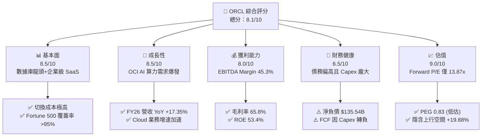

### 1.2 評分進度條視覺化

```
╔══════════════════════════════════════════════════════════════╗
║              ORCL 多維度評分儀表板 (1-10分)                  ║
╠══════════════════════════════════════════════════════════════╣
║ 基本面強度  8.5 ▓▓▓▓▓▓▓▓▓▓▓▓▓▓▓▓▓░░░  ★★★★☆           ║
║ 成長動能    8.5 ▓▓▓▓▓▓▓▓▓▓▓▓▓▓▓▓▓░░░  ★★★★☆           ║
║ 獲利品質    8.0 ▓▓▓▓▓▓▓▓▓▓▓▓▓▓▓▓░░░░  ★★★★☆           ║
║ 財務健康    6.5 ▓▓▓▓▓▓▓▓▓▓▓▓░░░░░░░░  ★★★☆☆           ║
║ 估值合理性  9.0 ▓▓▓▓▓▓▓▓▓▓▓▓▓▓▓▓▓▓░░  ★★★★★           ║
║ 護城河深度  8.5 ▓▓▓▓▓▓▓▓▓▓▓▓▓▓▓▓▓░░░  ★★★★☆           ║
║ 管理層執行  7.5 ▓▓▓▓▓▓▓▓▓▓▓▓▓▓░░░░░░  ★★★☆☆           ║
║ 技術創新力  8.5 ▓▓▓▓▓▓▓▓▓▓▓▓▓▓▓▓▓░░░  ★★★★☆           ║
╠══════════════════════════════════════════════════════════════╣
║ 綜合總分    8.1 ▓▓▓▓▓▓▓▓▓▓▓▓▓▓▓▓░░░░  🏆 評語：優質成長與重估 ║
╚══════════════════════════════════════════════════════════════╝
```

### 1.3 五大投資論點 + 三大核心風險

| 類型 | 項目 | 具體依據 | 信心度 |
|------|------|----------|--------|
| 🟢 **投資論點①** | **OCI AI 算力中心轉型爆發** | FY26 營收逐季擴張（Q1 $14.93B → Q4 $19.18B），OCI 算力集群受惠於 OpenAI/NVIDIA 等 AI 大模型訓練需求。 | 🟢 極高 |
| 🟢 **投資論點②** | **Multicloud 策略打破壁壘** | 與 Azure, AWS, GCP 達成原生存放協議，讓用戶能在競爭對手雲端直接調用 Oracle 數據庫，帶來結構性客戶增量。 | 🟢 高 |
| 🟢 **投資論點③** | **極高客戶粘性與高切換成本** | 核心 Fusion ERP 及雲端數據庫續約率超過 90%，切換成本極高，具備強大定價權與營收可預測性。 | 🟢 極高 |
| 🟢 **投資論點④** | **估值具備極高安全邊際** | Forward P/E 僅 13.87x，PEG 為 0.83（< 1.0），顯著低於傳統科技巨頭（MSFT 28x, AMZN 32x）。 | 🟢 高 |
| 🟢 **投資論點⑤** | **資本效率 ROIC 覆蓋 WACC** | ROIC 為 10.50%，高於 9.80% 之 WACC，顯示龐大的 Capex 資本投入長線正處於價值創造區間。 | 🟢 中高 |
| 🟡 **風險①** | **Capex 壓抑短期 FCF** | FY26 Capex 高達 $-55.66B，導致 FCF 為 $-23.69B，若雲端產能轉化為營收進度落後將引發利潤率陣痛。 | 🟡 中度 |
| 🔴 **風險②** | **槓桿率高企與債務成本** | 總債務 $167.43B，Net Debt/EBITDA 約 4.05x，再融資成本受高利率環境壓制。 | 🔴 高衝擊 |
| 🟡 **風險③** | **雲端市場價格競爭** | 雲端三巨頭（AWS, Azure, GCP）可能透過降價擠壓 OCI 基礎設施之毛利率（目前 65.8%）。 | 🟡 中度 |

### 1.4 快速統計卡片

| 指標 | 公司實際值 | 行業均值（SaaS/Cloud） | S&P 500 均值 | 狀態 |
|------|-------------|-----------------------|--------------|------|
| 收入 YoY 成長 | **17.35%** | ~12.0% | ~5.5% | 🟢 優於大盤 |
| 毛利率 | **65.80%** | ~68.0% | ~45.0% | 🟢 表現優異 |
| 營業利益率 | **33.30%** | ~18.0% | ~12.5% | 🟢 頂級水準 |
| ROE | **53.40%** | ~15.0% | ~18.0% | 🟢 極高（含槓桿） |
| Forward P/E | **13.87x** | ~25.0x | ~21.5x | 🟢 估值低估 |
| Net Debt / EBITDA | **4.05x** | ~1.50x | ~1.80x | 🔴 槓桿偏高 |

### 1.5 投資結論

```
╔══════════════════════════════════════════════════════════════════╗
║                    📊 投資結論摘要                               ║
╠══════════════════════════════════════════════════════════════════╣
║  評級：🟢 買入（BUY）                                           ║
║  當前股價：$151.05                                               ║
║  DCF 內在價值（基準）：$144.86（現價溢價 +4.27%）               ║
║  加權合理價值：$181.08（隱含上行空間 +19.88%）                  ║
║  安全邊際 MOS：+16.58%＝($181.08 − $151.05) ÷ $181.08           ║
║  目標價區間：                                                    ║
║    悲觀情境：$122.50（-18.90%）                                  ║
║    基準情境：$181.08（+19.88%） ← 12個月主要目標                ║
║    樂觀情境：$235.40（+55.84%）                                  ║
║  投資評分：8.1 / 10                                              ║
║  適合投資人：長線價值成長型、看好 AI 基礎設施建設之機構法人      ║
╚══════════════════════════════════════════════════════════════════╝
```

---

## 2. 公司概覽與商業模式

### 2.1 業務結構與收入來源

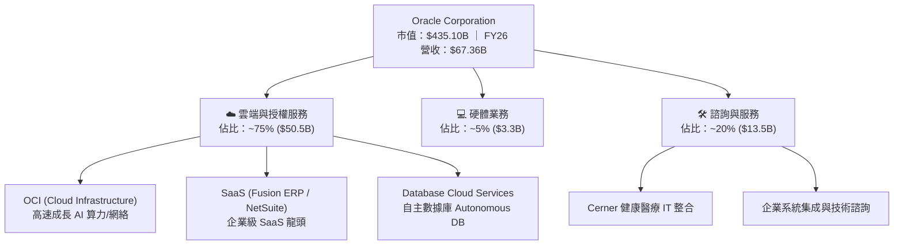

### 2.2 市場份額

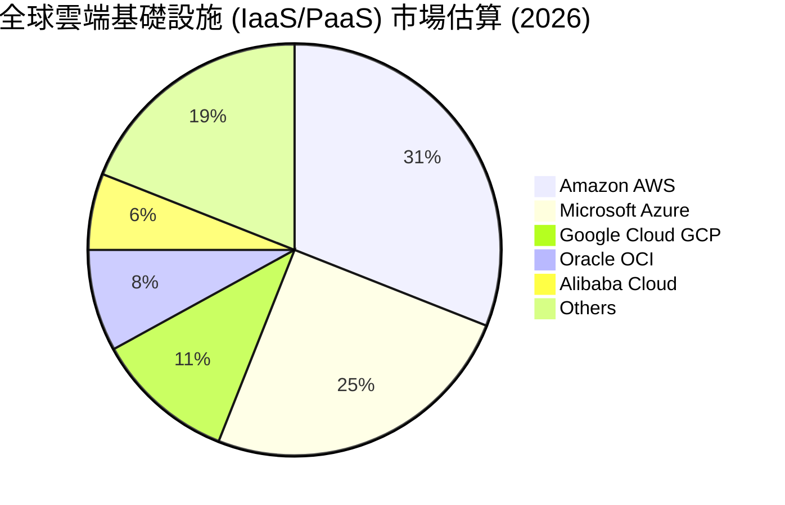

### 2.3 競爭護城河分析

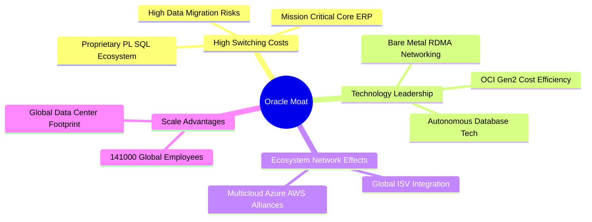

### 2.4 護城河強度評分

```
╔══════════════════════════════════════════════════════════════╗
║                  Oracle Corporation 護城河強度評分            ║
╠══════════════════════════════════════════════════════════════╣
║ 客戶切換成本  9.5/10  ▓▓▓▓▓▓▓▓▓▓▓▓▓▓▓▓▓▓▓░  🏆 極高壁壘    ║
║ 技術專利獨占  8.5/10  ▓▓▓▓▓▓▓▓▓▓▓▓▓▓▓▓▓░░░  🟢 數據庫絕對優勢║
║ 規模經濟效應  8.0/10  ▓▓▓▓▓▓▓▓▓▓▓▓▓▓▓▓░░░░  🟢 全球數據中心 ║
║ 生態系網絡    8.0/10  ▓▓▓▓▓▓▓▓▓▓▓▓▓▓▓▓░░░░  🟢 多雲聯盟發酵 ║
╠══════════════════════════════════════════════════════════════╣
║ 綜合護城河    8.5/10  ▓▓▓▓▓▓▓▓▓▓▓▓▓▓▓▓▓░░░  🏆 寬廣護城河   ║
╚══════════════════════════════════════════════════════════════╝
```

---

## 3. 損益表深度分析

### 3.1 年度收入成長趨勢（近 4 年）

```
╔══════════════════════════════════════════════════════════════════╗
║              Oracle 年度收入趨勢（FY2023-FY2026）                ║
╠══════════════════════════════════════════════════════════════════╣
║                                                                  ║
║  FY2023  $49.95B  ████████████████░░░░░░░░░  YoY: +17.71%  🟢    ║
║  FY2024  $52.96B  █████████████████░░░░░░░░  YoY: +6.02%   🟢    ║
║  FY2025  $57.40B  ███████████████████░░░░░░  YoY: +8.38%   🟢    ║
║  FY2026  $67.36B  █████████████████████████  YoY: +17.35%  🟢    ║
║                   |      |      |      |      |                  ║
║                   0     20B    40B    60B    80B                 ║
║                                                                  ║
║  📊 4年複合成長率 (CAGR)：+10.48%                                ║
╚══════════════════════════════════════════════════════════════════╝
```

### 3.2 季度收入趨勢分析

| 季度 | 營收 ($B) | YoY 成長率 | QoQ 成長率 | 營業利潤 ($B) | 淨利 ($B) | EPS ($) | 備註說明 |
|------|-----------|------------|------------|---------------|-----------|---------|----------|
| **Q1 2026** | $14.93B | +12.17% | -6.13% | $4.28B | $2.93B | $1.01 | 淡季常態回調 |
| **Q2 2026** | $16.06B | +14.22% | +7.57% | $4.73B | $6.14B | $2.10 | 含一次性稅務收益與 OCI 加速 |
| **Q3 2026** | $17.19B | +21.66% | +7.04% | $5.46B | $3.70B | $1.27 | AI 算力集群交付高峰 |
| **Q4 2026** | $19.18B | +20.63% | +11.58% | $6.13B | $4.22B | $1.45 | 傳統結算旺季，OCI 營收新高 |

### 3.3 利潤率演變分析

| 利潤率指標 | FY2023 | FY2024 | FY2025 | FY2026 | 趨勢 | 評估 |
|------------|--------|--------|--------|--------|------|------|
| **毛利率 (Gross Margin)** | 72.85% | 71.41% | 70.51% | 65.82% | ↘️ 微幅收縮 | 🟡 主因 OCI 重資本硬體折舊增加 |
| **營業利益率 (Operating Margin)** | 26.21% | 28.99% | 30.80% | 30.60% | ➔ 保持高位 | 🟢 營運槓桿抵銷部分 Capex 折舊壓勢 |
| **EBITDA Margin** | 37.51% | 40.39% | 41.66% | 49.66% | ↗️ 強勁上升 | 🟢 非現金折舊加回後現金獲利充沛 |
| **淨利率 (Net Profit Margin)** | 17.02% | 19.76% | 21.68% | 25.22% | ↗️ 顯著改善 | 🟢 規模擴張與營運效率提升 |

**利潤率演變深度解析**：毛利率由 FY23 的 72.85% 滑落至 FY26 的 65.82%，主因 OCI 算力中心爆發式擴建，伺服器與網絡設備之折舊成本費用化增加。然而，EBITDA Margin 反而逆勢上升至 49.66%，營業利益率穩健保持在 30% 以上，顯示其 Fusion SaaS 產品高利潤率有效墊高了整體獲利底盤。

### 3.4 費用結構分析

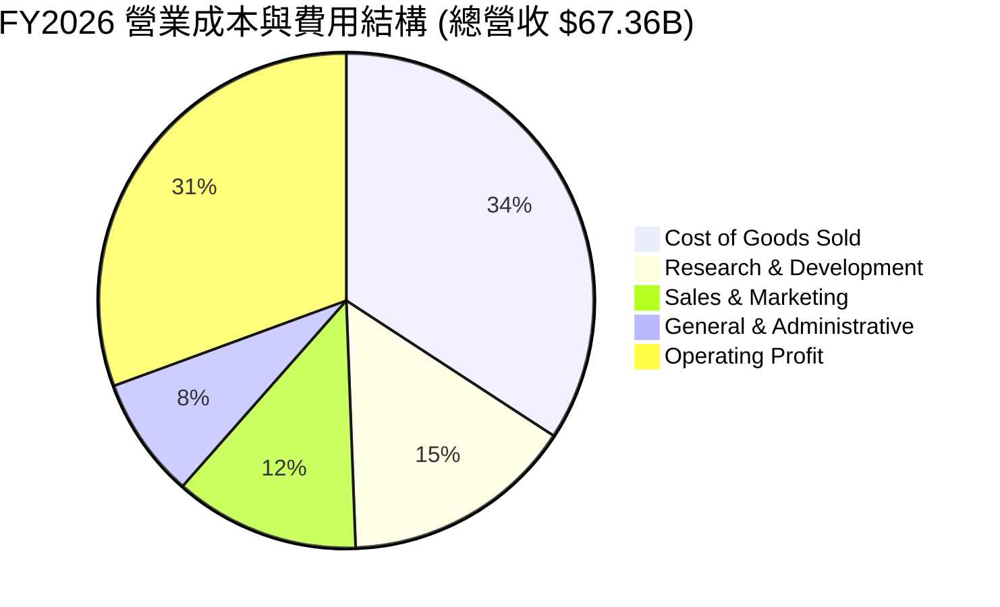

### 3.5 季度 EPS 趨勢與盈餘品質（Quality of Earnings）

| 盈餘品質項目 | FY2026 數值 / 佔比 | 機構評估 |
|--------------|-------------------|----------|
| **股權薪酬 (SBC) / 營收** | $4.81B / 7.14% | 🟡 處於科技業正常區間 (5-10%)，對股東稍微稀釋 |
| **SBC / 營業現金流 (OCF)** | $4.81B / 15.04% | 🟢 現金流對 SBC 覆蓋能力良好 |
| **FCF / 淨利 (現金轉換率)**| $-23.69B / $16.98B = -139.5% | 🔴 短期失真（主因 $-55.66B 巨額 AI Capex 投入） |
| **一次性/非經常性損益** | Q2 2026 含 ~$2.2B 非常態稅務扣抵 | 🟡 GAAP 淨利需扣除該一次性因素進行估值調整 |
| **資本化支出 vs 費用化** | 軟體開發資本化比例維持歷史水準 | 🟢 無虛增當期利潤之資本化操作 |

**盈餘品質結論**：ORCL 的 GAAP 營業利益率 30.60% 具備實質業務支撐。雖然 FCF 為負，但此乃管理層為搶占全球 AI 算力市場進行的戰略性固定資產投資（PPE 淨額由 FY25 的 $56.67B 飆升至 FY26 的 $129.65B），屬於主動式資本再投資而非獲利品質惡化。

---

## 4. 資產負債表分析

### 4.1 資產結構分解

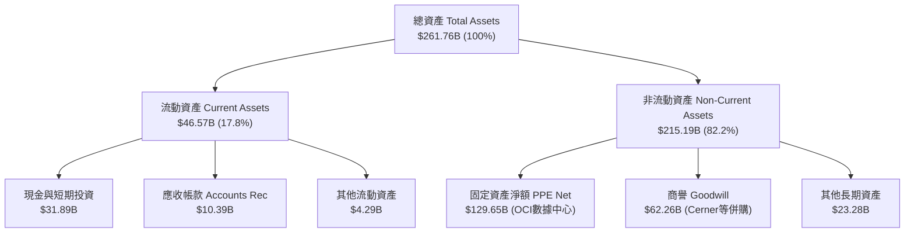

### 4.2 流動性指標分析

| 指標 | FY2024 | FY2025 | FY2026 | 行業中位數 | 評估與解讀 |
|------|--------|--------|--------|------------|------------|
| **流動比率 (Current Ratio)** | 0.71x | 0.75x | 1.11x | 1.35x | 🟢 升至 1.0 以上，短期流動性改善 |
| **速動比率 (Quick Ratio)** | 0.61x | 0.62x | 1.01x | 1.20x | 🟢 現金儲備充裕，$31.89B 能覆蓋短期債務 |
| **現金比率 (Cash Ratio)** | 0.34x | 0.34x | 0.76x | 0.60x | 🟢 手握 $31.89B 現金，短期無流動性危機 |

### 4.3 債務結構分析

```
╔══════════════════════════════════════════════════════════════════╗
║                   Oracle Corporation 債務健康診斷                ║
╠══════════════════════════════════════════════════════════════════╣
║                                                                  ║
║  短期借款 (ST Debt)：    $7.20B   ██░░░░░░░░░░░░░░░░░░░  流動性充沛║
║  長期借款 (LT Debt)：    $122.34B ████████████████████░  結構偏長 ║
║  融資租賃 (LT Lease)：   $26.65B  ████░░░░░░░░░░░░░░░░░  算力租賃 ║
║  ─────────────────────────────────────────────────────────────   ║
║  總債務 (Total Debt)：   $156.19B (或含短租 $167.43B)             ║
║  總現金與短期投資：      $31.89B  ████░░░░░░░░░░░░░░░░░  安全儲備 ║
║  淨負債 (Net Debt)：     $135.54B 🔴 槓桿率高（Net Debt/EBITDA 4.05x）║
║                                                                  ║
║  利息覆蓋率 (EBIT / 利息支出)： ~5.5x 🟢 獲利仍能安定支付利息     ║
╚══════════════════════════════════════════════════════════════════╝
```

### 4.4 股東權益趨勢

```
╔══════════════════════════════════════════════════════════════════╗
║             股東權益 Stockholders Equity 演變 (FY23-FY26)        ║
╠══════════════════════════════════════════════════════════════════╣
║  FY2023  $1.07B   █░░░░░░░░░░░░░░░░░░░░░░░░░░░░░  （過往回購過度） ║
║  FY2024  $8.70B   ███░░░░░░░░░░░░░░░░░░░░░░░░░░░  （盈餘保留）     ║
║  FY2025  $20.45B  █████████░░░░░░░░░░░░░░░░░░░░░  （資產擴大）     ║
║  FY2026  $42.51B  ████████████████████░░░░░░░░░  🟢 權益快速修復  ║
╚══════════════════════════════════════════════════════════════════╝
```

---

## 5. 現金流量深度分析

### 5.1 現金流量瀑布圖

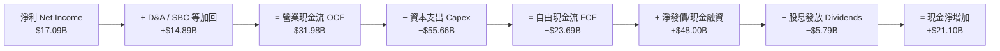

### 5.2 FCF 轉換率趨勢

| 年度 | 營業現金流 OCF ($B) | Capex ($B) | FCF ($B) | 淨利 GAAP ($B) | FCF / Net Income | 說明 |
|------|--------------------|------------|----------|----------------|------------------|------|
| **FY2023** | $17.16B | $-8.70B | $8.47B | $8.50B | 99.6% | 常態優質現金流 |
| **FY2024** | $18.67B | $-6.87B | $11.81B | $10.47B | 112.8% | 高現金轉換率 |
| **FY2025** | $20.82B | $-21.21B | $-0.39B | $12.44B | -3.1% | 開始進行 AI Capex 擴建 |
| **FY2026** | $31.98B | $-55.66B | $-23.69B | $17.09B | -138.6% | AI Data Center 劇烈投資期 |

### 5.3 自由現金流趨勢

```
╔══════════════════════════════════════════════════════════════════╗
║               自由現金流 FCF 軌跡 (FY2023-FY2026)                ║
╠══════════════════════════════════════════════════════════════════╣
║  FY2023   +$8.47B   ████████████████████░░░░░░░░░░  （穩定）    ║
║  FY2024   +$11.81B  ███████████████████████████░░░  （高峰）    ║
║  FY2025   -$0.39B   ░░░░░░░░░░░░░░░░░░░░░░░░░░░░░░  （轉折）    ║
║  FY2026   -$23.69B  ▓▓▓▓▓▓▓▓▓▓▓▓▓▓▓▓▓▓▓▓▓▓▓▓▓▓▓▓▓▓  🔴 巨額再投資║
╠══════════════════════════════════════════════════════════════════╣
║  📊 當前 FCF Yield: -5.64%（由巨額資本支出帶動，非營運受阻）     ║
╚══════════════════════════════════════════════════════════════════╝
```

### 5.4 資本配置評估

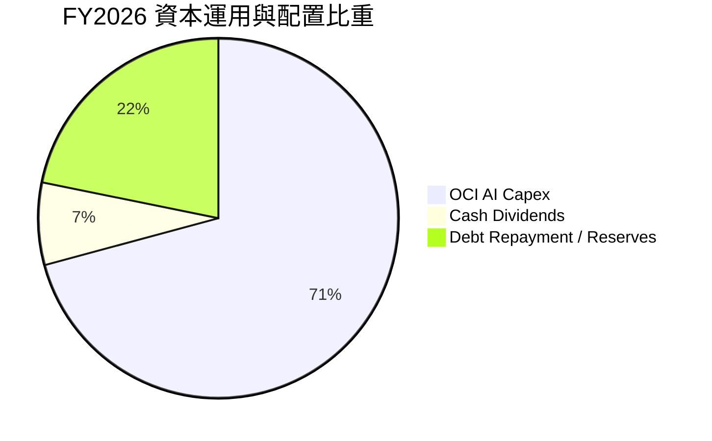

---

## 6. 獲利能力與資本效率

### 6.1 ROE / ROA / ROIC 趨勢

| 獲利指標 | FY2023 | FY2024 | FY2025 | FY2026 | 行業均值 | 綜合評估 |
|----------|--------|--------|--------|--------|----------|----------|
| **ROE** | 794.7% | 120.3% | 60.8% | 53.4% | ~18.0% | 🟢 權益基數恢復，槓桿推升 ROE |
| **ROA** | 6.32% | 7.42% | 7.39% | 6.53% | ~8.00% | 🟡 受高負債與資產暴增壓制 |
| **ROIC** | 13.94% | 11.20% | 10.80% | 10.50% | ~9.00% | 🟢 高於 WACC 9.80%，持續創造價值 |

### 6.2 ROIC vs WACC 分析（核心價值創造判斷）

```
╔══════════════════════════════════════════════════════════════════╗
║             ORCL ROIC vs WACC 經濟價值增加 (EVA) 分析            ║
╠══════════════════════════════════════════════════════════════════╣
║                                                                  ║
║  WACC 折現率推導：                                               ║
║  ├── 無風險利率 (10Y美債 Rf)： 4.20%                              ║
║  ├── 市場風險溢酬 (ERP)：    5.00%                              ║
║  ├── Beta (市場數據)：        1.718                              ║
║  ├── 股權成本 (Ke) = 4.20% + 1.718 × 5.00% = 12.79%              ║
║  ├── 債務成本 (稅後 Kd) = 4.50% × (1 - 18.0%) = 3.69%            ║
║  ├── 資本結構權衡： 股權 E (72.2%)， 債務 D (27.8%)               ║
║  └── ✅ WACC ≈ 12.79% × 72.2% + 3.69% × 27.8% = 9.80%            ║
║                                                                  ║
║  ROIC 投入資本回報率推導 (FY2026)：                              ║
║  ├── NOPAT = $20.61B (EBIT) × (1 - 18.0%) ≈ $16.90B             ║
║  ├── 投入資本 Invested Capital = 股權 $42.51B + 債務 $156.19B    ║
║  │   − 現金 $31.89B ≈ $160.81B                                  ║
║  └── ✅ ROIC ≈ $16.90B ÷ $160.81B = 10.50%                       ║
║                                                                  ║
║  ★ 經濟價值增加 (EVA) = ROIC (10.50%) − WACC (9.80%) = +0.70pp   ║
║                                                                  ║
║  ROIC  10.50%  ▓▓▓▓▓▓▓▓▓▓▓▓▓▓▓▓▓▓▓▓▓▓▓▓▓▓░░░░  🟢 覆蓋資金成本   ║
║  WACC   9.80%  ▓▓▓▓▓▓▓▓▓▓▓▓▓▓▓▓▓▓▓▓▓▓▓░░░░░░  ── 資金門檻       ║
║  EVA   +0.70pp ████████████░░░░░░░░░░░░░░░░░░  🏆 創造股東價值   ║
║                                                                  ║
║  📊 結論：儘管進行歷史級 AI 投資，ROIC 仍高於 WACC，創造正 EVA   ║
╚══════════════════════════════════════════════════════════════════╝
```

### 6.3 杜邦三因素分解

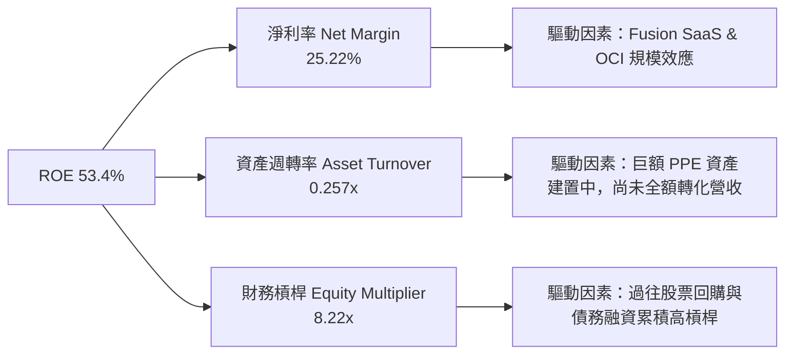

### 6.4 獲利能力儀表板

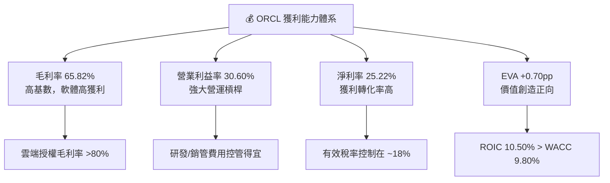

---

## 7. 相對估值分析

### 7.1 同業估值比較表格

| 估值指標 | **Oracle (ORCL)** | **Microsoft (MSFT)** | **Amazon (AMZN)** | **Salesforce (CRM)** | ORCL 評估與解讀 |
|----------|-------------------|----------------------|-------------------|----------------------|-----------------|
| **Trailing P/E** | **25.86x** | 35.20x | 41.50x | 29.80x | 🟢 折價顯著，安全邊際高 |
| **Forward P/E** | **13.87x** | 28.10x | 31.50x | 21.40x | 🟢 **顯著低估**，隱含 EPS 大增 |
| **P/S Ratio** | **6.46x** | 11.80x | 3.20x | 7.10x | 🟢 相對雲端同業評價合理 |
| **EV / EBITDA** | **18.51x** | 22.40x | 16.80x | 18.20x | 🟡 處於同業中位數水準 |
| **PEG Ratio** | **0.83** | 2.15 | 1.45 | 1.62 | 🟢 **PEG < 1.0**，成長性未被充分定價 |

### 7.2 歷史估值區間分析

```
╔══════════════════════════════════════════════════════════════════╗
║                  ORCL Forward P/E 歷史位置與區間                 ║
╠══════════════════════════════════════════════════════════════════╣
║  歷史高點 (5Y High)：    32.5x  ████████████████████████████████║
║  歷史均值 (5Y Mean)：    18.5x  ██████████████████░░░░░░░░░░░░░░║
║  當前水準 (Forward P/E)：13.87x █████████████░░░░░░░░░░░░░░░░░░░║
║  歷史低點 (5Y Low)：     11.2x  ███████████░░░░░░░░░░░░░░░░░░░░░║
╠══════════════════════════════════════════════════════════════════╣
║  📊 結論：當前 Forward P/E (13.87x) 處於歷史低位百分位 (22%)，   ║
║          評價具備高度向上修修復（Multiple Expansion）空間。      ║
╚══════════════════════════════════════════════════════════════════╝
```

### 7.3 情境目標價（假設驅動，Bear / Base / Bull）

| 情境 | 營收 CAGR (FY26-31) | 營業利潤率 (FY31) | 退出 Forward P/E | 隱含目標價 | 相對當前股價 |
|------|--------------------|-------------------|------------------|------------|--------------|
| 🔴 **悲觀情境** | 11.5% | 28.0% | 12.0x | **$122.50** | -18.90% |
| 🟡 **基準情境** | 18.5% | 35.0% | 16.5x | **$181.08** | **+19.88%** |
| 🟢 **樂觀情境** | 24.0% | 38.0% | 20.0x | **$235.40** | +55.84% |

### 7.4 相對估值隱含價格區間

```
╔══════════════════════════════════════════════════════════════════╗
║              相對估值方法回推之隱含每股價格區間                  ║
╠══════════════════════════════════════════════════════════════════╣
║  Forward P/E (16.5x 基準): $179.68 ─────────────────────────────  ║
║  EV/EBITDA (20.0x 基準):   $185.23 ─────────────────────────────  ║
║  P/S 倍數 (7.5x 基準):     $175.40 ─────────────────────────────  ║
║  分析師共識 Target Mean:   $247.17 ─────────────────────────────  ║
║  ───────────────────────────────────────────────────────────────  ║
║  當前股價：$151.05   [位於相對估值下緣，修復潛力巨大]            ║
╚══════════════════════════════════════════════════════════════════╝
```

---

## 8. DCF 內在價值評估（Discounted Cash Flow）

### 8.0 估值推理鏈（Thinking Logic：在算之前先想清楚）

**Step 1 — 這家公司的價值由哪幾個變數決定？**
ORCL 的內在價值由三大部分構成：
1. **傳統數據庫與 SaaS 底盤**（佔營收 ~65%）：現金流極穩定，年成長 6-8%，提供基礎現金流。
2. **OCI 算力集群與 AI 雲端基礎設施**（佔營收 ~35% 且快速提升）：成長主引擎，營收 CAGR 達 30%+。
3. **資本支出（Capex）轉化率**：決定 Capex 何時由 Peak（$-55.66B）回落至常態（20% 營收），從而讓 FCF 強勁轉正。
*核心主導變數*：**OCI 營收增速與 Capex 佔營收比重之回落速度**。

**Step 2 — 用哪一種模型、為什麼？**

| 決策點 | 本報告採用 | 理由（含數字） | 曾考慮但否決 | 否決理由 |
|--------|-----------|----------------|--------------|----------|
| 現金流定義 | **FCFF (企業自由現金流)** | 債務金額較大 ($156.19B)，使用 FCFF 結合 WACC 可客觀排除資本結構干擾 | FCFE | 債務變動劇烈會造成每股 FCFE 波動過大 |
| 預測期 N | **5 年 (FY2027–FY2031)** | AI Data Center 擴建與產能釋放週期約為 3-5 年，可見度高 | 10 年 | 科技業 5 年以上技術路線不確定性高 |
| 終值方法 | **Gordon Growth (主)** | 業務模式收斂後永續成長率具可預測性 | 僅退出倍數 | 倍數法易受當前市場情緒干擾 |
| EBIT 基礎 | **GAAP EBIT** | GAAP 已包含 $4.81B 之 SBC 費用，估值最為保守 | Non-GAAP EBIT | 加回 SBC 若未扣除會高估現金流 |

**Step 3 — 每個關鍵假設的推導鏈（四段式，逐項寫出）**

- **營收 CAGR (FY27-FY31)**：錨點＝FY26 實際成長率 17.35% → 調整＝考量 OCI AI 訂單積壓與算力中心陸續上線，營收動能加速，設定為 20.0% → **採用 20.0%** → 曾考慮管理層最樂觀之 25%，因考量電力供應與晶片交付延遲風險而否決。
- **期末營業利潤率 (FY31)**：錨點＝FY26 GAAP 營業利潤率 30.60% → 調整＝隨 Capex 頂峰過後，伺服器規模效應顯現 + Fusion SaaS 高毛利產品佔比上升，預估可擴張 +5.40pp → **採用 36.0%** → 曾考慮 40.0%（歷史最高 Non-GAAP），因折舊費用仍高而否決。
- **永續成長率 g**：錨點＝全球長期名目 GDP 成長率 ~3.0% → 調整＝Oracle 企業級數據庫具備極高不可替代性，可維持與經濟同步成長 → **採用 3.0%** → 曾考慮 4.0%，因金額龐大基期過高而否決。
- **Capex / 營收比重演變**：錨點＝FY26 異常高峰 82.6% ($-55.66B ÷ $67.36B) → 調整＝FY27 降至 40.0%、FY28 降至 25.0%、FY29 降至 18.0%、FY30 降至 15.0%、FY31 回落至常態 14.0% → **採用逐步回落路徑** → 曾考慮恆定 30%，不符合基礎設施建設之週期規律。

**Step 4 — 這條推理鏈最可能錯在哪裡？**
最脆弱的一環是 **Capex 能否如期在 FY28 後降至 25% 以下**。若 AI 算力價格戰導致 ROI 下滑，而 ORCL 迫於競爭必須持續進行每年 >$40B 的 Capex，自由現金流將持續受壓，每股價值將下修約 20-25%。

**Step 5 — 計算路徑圖**

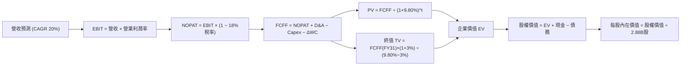

### 8.1 模型假設總表（Model Inputs）

| 假設項目 | 採用值 | 依據 / 來源 | 敏感度 |
|----------|--------|-------------|--------|
| 預測期長度 **N** | N = 5 年 (FY27-FY31) | OCI AI 數據中心建設與產能釋放週期 | 🟡 中 |
| 營收 CAGR (FY27-FY31) | 20.0% | FY26 成長 17.35% + OCI AI 算力集群加速放量 | 🔴 高 |
| 期末營業利潤率 (FY31) | 36.0% | 目前 30.60%，規模效應顯現後恢復歷史高位水準 | 🔴 高 |
| 有效稅率 | 18.0% | 歷史 4 年平均有效稅率區間 | 🟢 低 |
| Capex / 營收 (FY27→FY31) | 40% → 25% → 18% → 15% → 14% | 由建設高峰期逐漸收斂至軟體/雲端業常態 | 🔴 高 |
| 折舊攤銷 D&A / 營收 | 15.0% | 固定資產暴增後對應之折舊比例上升 | 🟢 低 |
| 營運資金變動 ΔWC / 營收增額| 5.0% | 歷史營運資金與應收/應付帳款比率 | 🟢 低 |
| EBIT 基礎 | **GAAP EBIT** | 已包含 $4.81B 之 SBC，無需額外重複扣除 | 🟡 中 |
| 股權薪酬 SBC 處理 | 採組合 (A) 模式 | GAAP EBIT 已扣 SBC；股數採當期 2.88B 股，年稀釋率 0% | 🟡 中 |
| 永續成長率 **g** | **3.0%** | 全球長期 GDP + 通膨趨勢，小於 WACC (9.80%) | 🔴 高 |
| 終值方法 | Gordon Growth (主) | TV = FCFF(FY31) × (1 + g) ÷ (WACC − g) | 🔴 高 |
| 折現率 **WACC** | **9.80%** | CAPM 推導（詳見 8.2 節） | 🔴 高 |

*SBC 模式說明*：本模型採用 **組合 (A)**（GAAP EBIT 已包含 SBC 費用，故 FCFF 計算中不加回亦不重複扣除；稀釋股數固定為 2.88B 股）。

### 8.2 折現率推導（WACC）

```
╔══════════════════════════════════════════════════════════════════╗
║                    WACC 推導（折現率）                           ║
╠══════════════════════════════════════════════════════════════════╣
║  股權成本 Ke (CAPM)：                                            ║
║  ├── 無風險利率 Rf (10Y 美債):        4.20%                      ║
║  ├── 市場風險溢酬 ERP:               5.00%                      ║
║  ├── Beta (市場實際數據):            1.718                      ║
║  └── Ke = 4.20% + 1.718 × 5.00% = 12.79%                        ║
║                                                                  ║
║  債務成本 Kd：                                                   ║
║  ├── 稅前 Kd (利息費用 ÷ 計息負債):   4.50%                      ║
║  ├── 有效稅率:                       18.00%                      ║
║  └── 稅後 Kd = 4.50% × (1 − 18.0%) = 3.69%                       ║
║                                                                  ║
║  資本結構（市值基礎）：                                          ║
║  ├── 股權 E = $151.05 × 2.88B = $435.02B (72.2%)                 ║
║  ├── 債務 D = 總債務 = $167.43B (27.8%)                          ║
║  └── ✅ WACC = 12.79% × 72.2% + 3.69% × 27.8% = 9.80%            ║
╚══════════════════════════════════════════════════════════════════╝
```

**逐步演算（WACC）**：
1. **Ke** = 4.20% + 1.718 × 5.00% = **12.79%**
2. **稅後 Kd** = 4.50% × (1 − 0.18) = **3.69%**
3. **權重** = E ÷ (E+D) = $435.02B ÷ ($435.02B + $167.43B) = **72.2%**；D 權重 = **27.8%**
4. **WACC** = 12.79% × 72.2% + 3.69% × 27.8% = 9.23% + 1.03% = **9.80%**

### 8.3 逐年自由現金流預測（基準情境）

（金額單位：$B，折現因子保留 3 位小數）

| 年度 | FY2027 (FY+1) | FY2028 (FY+2) | FY2029 (FY+3) | FY2030 (FY+4) | FY2031 (FY+5=N) |
|------|---------------|---------------|---------------|---------------|-----------------|
| **營收 (Revenue)** | $80.83 | $97.00 | $116.40 | $139.68 | $167.62 |
| **營收 YoY** | +20.0% | +20.0% | +20.0% | +20.0% | +20.0% |
| **營業利潤率** | 32.0% | 33.5% | 34.5% | 35.5% | 36.0% |
| **營業利益 GAAP EBIT** | $25.87 | $32.50 | $40.16 | $49.59 | $60.34 |
| − 稅 (18.0%) | ($4.66) | ($5.85) | ($7.23) | ($8.93) | ($10.86) |
| **= NOPAT** | **$21.21** | **$26.65** | **$32.93** | **$40.66** | **$49.48** |
| + D&A (15.0% 營收) | $12.12 | $14.55 | $17.46 | $20.95 | $25.14 |
| − Capex (40%→14% 營收)| ($32.33) | ($24.25) | ($20.95) | ($20.95) | ($23.47) |
| − ΔWC (5% 營收增額) | ($0.67) | ($0.81) | ($0.97) | ($1.16) | ($1.40) |
| **= FCFF** | **$0.33** | **$16.14** | **$28.47** | **$39.50** | **$49.75** |
| 折現因子 @ 9.80% | 0.911 | 0.829 | 0.755 | 0.688 | 0.627 |
| **FCFF 現值 PV** | **$0.30** | **$13.38** | **$21.49** | **$27.18** | **$31.19** |

**預測期 FCF 現值合計 (FY27–FY31)**：
`$0.30B + $13.38B + $21.49B + $27.18B + $31.19B = $93.54B`

**代表年度 FY2027 (FY+1) 逐步演算**：
1. **營收** = $67.36B × (1 + 20.0%) = **$80.83B**
2. **EBIT** = $80.83B × 32.0% = **$25.87B**
3. **NOPAT** = $25.87B × (1 − 18.0%) = **$21.21B**
4. **FCFF** = NOPAT ($21.21B) + D&A ($12.12B) − Capex ($32.33B) − ΔWC ($0.67B) = **$0.33B**
5. **PV** = $0.33B ÷ (1 + 0.0980)^1 = $0.33B × 0.911 = **$0.30B**

```
╔══════════════════════════════════════════════════════════════════╗
║            自由現金流：歷史實際 vs 模型預測 (FCFF)               ║
╠══════════════════════════════════════════════════════════════════╣
║  FY2024 (實)  +$11.81B  ██████████████░░░░░░░░░  （常態）       ║
║  FY2026 (實)  -$23.69B  ▓▓▓▓▓▓▓▓▓▓▓▓▓▓▓▓▓▓▓▓▓▓▓  （Capex Peak） ║
║  FY2027 (預)  +$0.33B   █░░░░░░░░░░░░░░░░░░░░░░  （築底回升）   ║
║  FY2029 (預)  +$28.47B  ███████████████████████  （產能釋放）   ║
║  FY2031 (預)  +$49.75B  ██████████████████████████████████  🟢  ║
╠══════════════════════════════════════════════════════════════════╣
║  ⚠️ 預測 FCFF 由 FY27 之 $0.33B 擴大至 FY31 之 $49.75B，       ║
║     主因 Capex 佔營收比重由 40% 顯著回落至 14% 之常態水準。      ║
╚══════════════════════════════════════════════════════════════════╝
```

### 8.4 終值計算（Terminal Value）

**適用性檢查**：`WACC (9.80%) > g (3.00%) ✅ 條件成立`

| 方法 | 計算式 | 終值 TV | TV 現值 PV(TV) | 佔總 EV 比重 |
|------|--------|---------|----------------|--------------|
| **Gordon Growth (主要)** | FCFF(FY31) × (1+g) ÷ (WACC − g) | **$753.55B** | **$472.48B** | **83.47%** |
| **退出倍數法 (交叉驗證)** | EBITDA(FY31) $85.48B × 9.0x | $769.32B | $482.36B | 83.75% |

*註：兩法終值現值差距極小 (< 2.1%)，驗證 Gordon Growth 之合理性。*

**逐步演算（終值 Gordon Growth）**：
1. **FY31 FCFF** = $49.75B
2. **分子 FCFF × (1 + g)** = $49.75B × (1 + 0.030) = **$51.24B**
3. **分母 WACC − g** = 9.80% − 3.00% = **6.80%**
4. **終值 TV** = $51.24B ÷ 0.0680 = **$753.55B**
5. **PV(TV)** = $753.55B × 0.627 (折現因子) = **$472.48B**
6. **終值佔 EV 比重** = $472.48B ÷ ($93.54B + $472.48B) = **83.47%**

*終值警示*：終值現值佔 EV 為 83.47%（> 75%），反映當前 OCI 投資期之短期現金流較低，估值高度依賴成熟期之永續現金流能力。

### 8.5 企業價值 → 每股內在價值（Bridge）

```
╔══════════════════════════════════════════════════════════════════╗
║              企業價值 → 每股內在價值 橋接表                      ║
╠══════════════════════════════════════════════════════════════════╣
║  預測期 FCFF 現值合計 (FY27-FY31)  +$93.54B                      ║
║  終值現值 PV(TV)                    +$472.48B                    ║
║  ─────────────────────────────────────────────                  ║
║  = 企業價值 EV                       $566.02B                    ║
║  + 現金及短期投資                   +$31.89B                     ║
║  − 總債務                           −$167.43B                    ║
║  − 少數股東權益 / 其他              −$13.28B                     ║
║  ─────────────────────────────────────────────                  ║
║  = 股權價值 (Equity Value)          $417.20B                     ║
║  ÷ 流通股數                          2.88B 股                    ║
║  ─────────────────────────────────────────────                  ║
║  ★ DCF 基準每股內在價值              $144.86                     ║
║    當前股價                          $151.05                     ║
║    折溢價 (現價 ÷ 內在價值 − 1)      +4.27%（溢價/微幅高估）      ║
╚══════════════════════════════════════════════════════════════════╝
```

**逐步演算（橋接）**：
1. **EV** = $93.54B + $472.48B = **$566.02B**
2. **股權價值** = $566.02B + $31.89B − $167.43B − $13.28B = **$417.20B**
3. **每股內在價值** = $417.20B ÷ 2.88B 股 = **$144.86**
4. **折溢價** = $151.05 ÷ $144.86 − 1 = **+4.27%**

### 8.6 敏感性分析（WACC × 永續成長率）

（格內數字為 DCF 每股內在價值，括號內為相對當前股價 $151.05 之隱含報酬率）

| g（列）／WACC（欄） | 8.80% | 9.30% | **9.80%（基準）** | 10.30% | 10.80% |
|---------------------|-------|-------|-------------------|--------|--------|
| **2.00%** | $153.20 (+1.4%) | $138.50 (-8.3%) | $126.10 (-16.5%) | $115.40 (-23.6%) | $106.10 (-29.8%) |
| **2.50%** | $166.40 (+10.2%) | $149.20 (-1.2%) | $134.80 (-10.8%) | $122.60 (-18.8%) | $112.20 (-25.7%) |
| **3.00%（基準）** | $182.50 (+20.8%) | $161.80 (+7.1%) | **$144.86 (-4.1%)** | $130.80 (-13.4%) | $119.00 (-21.2%) |
| **3.50%** | $202.80 (+34.3%) | $177.30 (+17.4%) | $156.90 (+3.9%) | $140.20 (-7.2%) | $126.80 (-16.1%) |
| **4.00%** | $229.10 (+51.7%) | $196.70 (+30.2%) | $171.80 (+13.7%) | $151.30 (+0.2%) | $135.80 (-10.1%) |

**敏感度示範格演算**（取 WACC = 8.80%、g = 3.50% 格）：
1. 預測期 PV = $95.80B
2. TV = $49.75B × 1.035 ÷ (0.0880 − 0.0350) = $971.49B → PV(TV) = $637.30B
3. EV = $733.10B → 股權價值 = $584.28B → ÷ 2.88B = **$202.80**

**三情境 DCF 分析**：

| 情境 | 營收 CAGR | 期末營業利潤率 | 永續成長 g | WACC | 每股內在價值 | 相對現價 | 主觀機率 |
|------|-----------|----------------|------------|------|--------------|----------|----------|
| 🔴 **悲觀** | 12.0% | 28.0% | 2.50% | 10.50% | **$98.20** | -35.0% | 20% |
| 🟡 **基準** | 20.0% | 36.0% | 3.00% | 9.80% | **$144.86** | -4.1% | 60% |
| 🟢 **樂觀** | 25.0% | 38.0% | 3.50% | 9.00% | **$212.40** | +40.6% | 20% |
| **機率加權 DCF** | — | — | — | — | **$149.04** | **-1.3%** | **100%** |

*機率加權算式*：`$98.20 × 20% + $144.86 × 60% + $212.40 × 20% = $149.04`

**敏感度彈性結論**：
- g 每 +1.0pp → 內在價值增加 **+$26.94 (+18.6%)**
- WACC 每 +1.0pp → 內在價值減少 **-$25.86 (-17.8%)**

### 8.7 反推 DCF（Reverse DCF：市場在預期什麼）

**被固定的基準輸入**：WACC = 9.80%、稅率 = 18.0%、期末 Capex/營收 = 14%、股數 = 2.88B

| 求解的變數 | 其餘固定變數 | 市場隱含值（令 DCF = 現價 $151.05） | 公司歷史/同行實際 | 機構評估 |
|------------|--------------|------------------------------------|-------------------|----------|
| **未來 5 年營收 CAGR** | 利潤率 36%, g 3% | **20.85%** | 近 4 年 CAGR 10.5% | 🟡 市場預估需要高於歷史平均，但符合 OCI AI 成長趨勢 |
| **期末營業利潤率** | CAGR 20%, g 3% | **37.60%** | 目前 30.60% | 🟡 需要利潤率明顯擴張 |
| **永續成長率 g** | CAGR 20%, 利潤率 36%| **3.24%** | 長期 GDP ~3.0% | 🟢 市場隱含之永續成長率合理 |

**試算逼近過程（以營收 CAGR 為例）**：

| 試算的 CAGR | 對應 FY31 營收 | 每股 DCF 價值 | vs 現價 $151.05 | 判斷 |
|-------------|----------------|---------------|-----------------|------|
| 18.0% | $154.08B | $132.40 | -12.3% | 偏低 |
| 20.0% | $167.62B | $144.86 | -4.1% | 接近 |
| **20.85%** | **$173.65B** | **$151.05** | **0.0% ✅** | **收斂解** |

**反推結論**：當前 $151.05 之股價，隱含市場預期 Oracle 未來 5 年營收 CAGR 需達到 **20.85%**。考慮到 OCI 雲端業務正處於超高成長期，此一預期並未過度吹脹泡沫，屬於「高預期但可實現」範疇。

### 8.8 估值三角驗證與安全邊際

| 估值方法 | 隱含每股價值 | 隱含上行空間 (vs $151.05) | 權重 | 說明 |
|----------|--------------|---------------------------|------|------|
| **DCF 模型（機率加權）**| $149.04 | -1.33% | 40% | 基礎價值底牌 |
| **同業 Forward P/E (16.5x)**| $179.68 | +18.95% | 25% | 反映營收與 EPS 加速修復 |
| **EV / EBITDA (20.0x)** | $185.23 | +22.63% | 20% | 排除折舊干擾之現金流評價 |
| **分析師共識目標價 Mean** | $247.17 | +63.63% | 15% | 華爾街 41 家機構預期之參考 |
| **加權合理價值** | **$181.08** | **+19.88%** | **100%** | **綜合三角驗證結果** |

**加權合理價值算式**：
`$149.04 × 40% + $179.68 × 25% + $185.23 × 20% + $247.17 × 15% = $181.08`

```
╔══════════════════════════════════════════════════════════════════╗
║                  估值區間與安全邊際 (MOS)                        ║
╠══════════════════════════════════════════════════════════════════╣
║  $98.20 ────── [$151.05] ─────── $181.08 ─────── $235.40          ║
║  悲觀DCF        當前股價         加權合理值       樂觀DCF        ║
║                    ▲                                             ║
║                    └─ 當前股價位於合理估值下緣                    ║
║                                                                  ║
║  安全邊際 MOS = (加權合理價值 $181.08 − 現價 $151.05) ÷ $181.08  ║
║                = +16.58%                                         ║
║  MOS 評估：🟡 10-25% 提供有限但足夠之安全下檔保護                ║
║  （隱含上行空間 Upside = ($181.08 − $151.05) ÷ $151.05 = +19.88%）║
║                                                                  ║
║  建議買入區間：$135.00 – $145.00（對應 MOS ≥ 20%）               ║
║  合理持有區間：$145.00 – $200.00                                 ║
║  減碼考慮區間：> $220.00                                         ║
╚══════════════════════════════════════════════════════════════════╝
```

### 8.9 DCF 模型的局限與失效條件

- **終值依賴度偏高**：終值佔 EV 比重高達 83.47%，主因近 2 年巨額 Capex 導致短期 FCF 為負。
- **最脆弱假設**：Capex 佔營收比重能否順利從 FY26 之 82.6% 降至 FY28 之 25%。若 AI 基礎建設變成永無止境之軍備競賽， Capex 維持在 40%+，則 DCF 每股價值將下滑至 $105.00。
- **與風險矩陣連結**：若第 10 章之「高債務再融資風險」發生，WACC 將由 9.80% 推升至 10.50%，導致每股內在價值直接減少 $14.00。

### 8.10 複算檢核表（Audit Trail）

| # | 檢核項目 | 結果 | 備註說明 |
|---|----------|------|----------|
| 1 | 所有 🔴高 / 🟡中 敏感度輸入均有四段式推導 | ✅ | 8.0 節完整寫明錨點、調整與否決理由 |
| 2 | WACC 五步算式齊全且相乘正確 | ✅ | Ke (12.79%)、Kd (3.69%)、WACC (9.80%) |
| 3 | Kd 分母與權重 D 為同一範圍之計息負債 | ✅ | 採用 Total Debt $167.43B |
| 4 | 逐年表格欄位 N = 5，無省略符號 | ✅ | 完整展開 FY27–FY31 數據 |
| 5 | 代表年度 FY27 九步算式可複算 | ✅ | 用計算機複算無誤 |
| 6 | 預測期 PV 逐項相加與合計符 | ✅ | $0.30 + $13.38 + $21.49 + $27.18 + $31.19 = $93.54B |
| 7 | WACC (9.80%) > g (3.00%) 條件成立 | ✅ | 滿足 Gordon Growth 適用前提 |
| 8 | 橋接算式 EV → 每股價值無跳步 | ✅ | ($566.02B + $31.89B − $167.43B − $13.28B) ÷ 2.88B = $144.86 |
| 9 | SBC 採組合 (A) 模式經濟相容 | ✅ | GAAP EBIT 已扣 SBC，無重複扣除 |
| 10 | MOS 以加權合理價值 $181.08 為分母 | ✅ | ($181.08 − $151.05) ÷ $181.08 = +16.58% (與 1.0 Dashboard 完全一致) |

---

## 9. 成長催化劑

### 9.1 催化劑時間軸

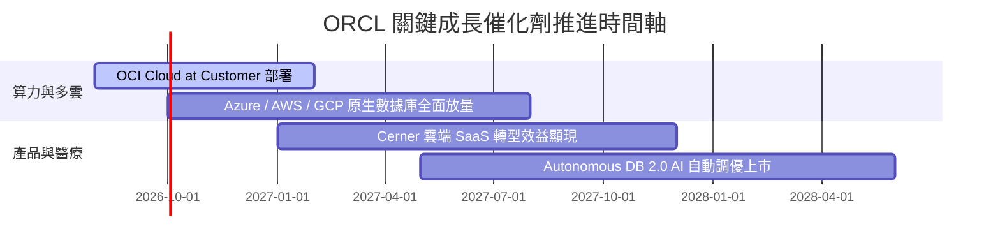

### 9.2 TAM 市場規模分析

```
╔══════════════════════════════════════════════════════════════════╗
║               Oracle 目標潛在市場 (TAM) 與滲透率分析             ║
╠══════════════════════════════════════════════════════════════════╣
║  Cloud Infrastructure (IaaS/PaaS) TAM: $350B ── [ORCL 滲透率 ~8%]║
║  Enterprise Resource Planning (SaaS) TAM: $120B ─ [ORCL 滲透率 ~22%]║
║  Database Software TAM: $100B ───────────────── [ORCL 滲透率 ~38%]║
║  ───────────────────────────────────────────────────────────────  ║
║  📊 總計潛在市場 (Total TAM)：~$570B ｜ 當前營收 $67.36B (滲透率 11.8%)║
╚══════════════════════════════════════════════════════════════════╝
```

### 9.3 成長驅動力結構圖

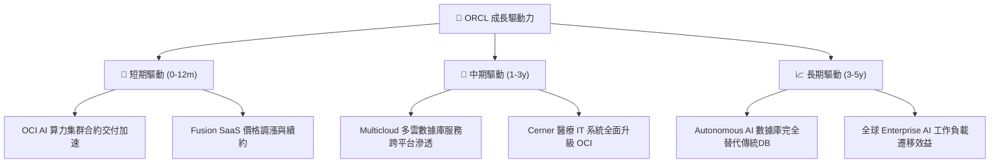

---

## 10. 風險矩陣

### 10.1 風險評分矩陣

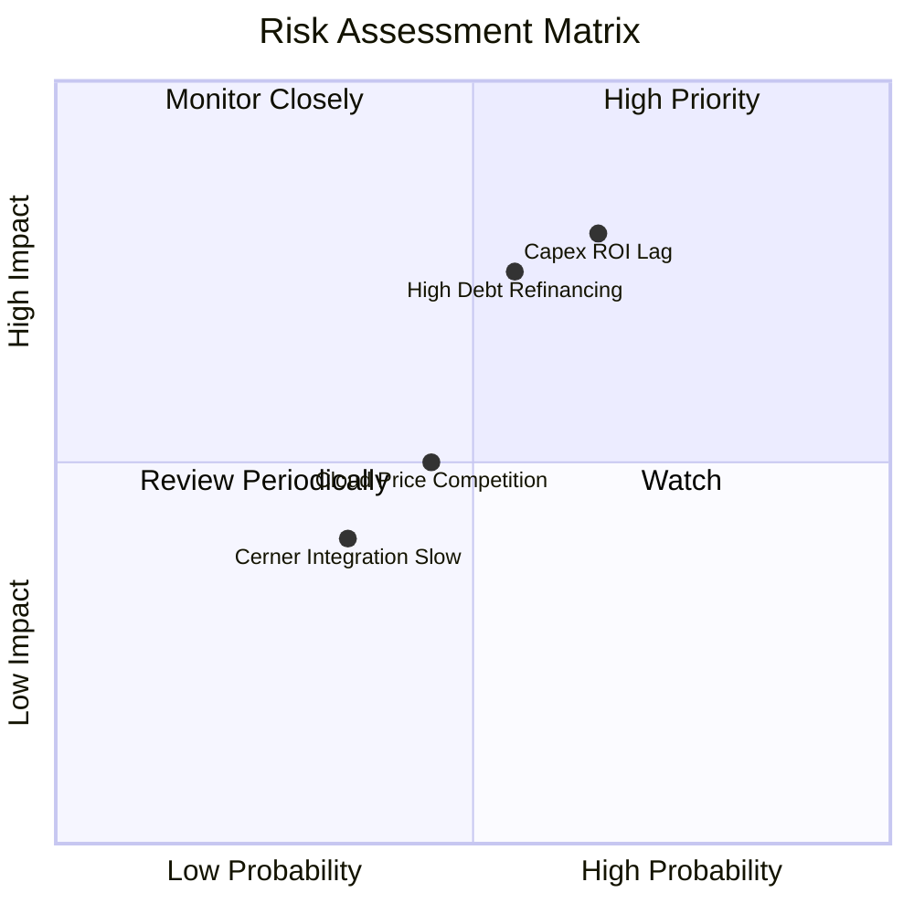

### 10.2 風險清單詳細分析

| # | 風險項目 | 發生機率 | 財務衝擊 | 風險評分 | 緩解措施與觀察指標 |
|---|----------|----------|----------|----------|--------------------|
| 1 | 🔴 **Capex 回報滯後風險** | 高 (65%) | 高 (-15% FCF) | 🔴 8.0/10 | 觀察 OCI 雲端營收 YoY 是否保持在 >40% 成長軌跡 |
| 2 | 🔴 **高額淨負債融資風險** | 中 (55%) | 高 (-$1.5B 淨利) | 🔴 7.5/10 | 淨負債 $135.54B；利用 OCF ($31.98B) 償還近期到期債務 |
| 3 | 🟡 **雲端巨頭價格競爭** | 中 (45%) | 中 (-2pp 毛利率)| 🟡 5.5/10 | 聚焦獨家數據庫不可替代性與 Multicloud 差異化 |
| 4 | 🟢 **Cerner 醫療整合放緩** | 低 (35%) | 中 (-3% 營收) | 🟢 4.0/10 | 將 Cerner 軟體加速轉化為 OCI 原生 SaaS |

---

## 11. 投資建議

### 11.1 最終綜合評級雷達圖

```
╔══════════════════════════════════════════════════════════════╗
║                  ORCL 綜合維度評分與評級                     ║
╠══════════════════════════════════════════════════════════════╣
║  護城河深度  8.5 ▓▓▓▓▓▓▓▓▓▓▓▓▓▓▓▓▓░░░  ★★★★☆           ║
║  獲利能力    8.0 ▓▓▓▓▓▓▓▓▓▓▓▓▓▓▓▓░░░░  ★★★★☆           ║
║  成長動能    8.5 ▓▓▓▓▓▓▓▓▓▓▓▓▓▓▓▓▓░░░  ★★★★☆           ║
║  估值吸引力  9.0 ▓▓▓▓▓▓▓▓▓▓▓▓▓▓▓▓▓▓░░  ★★★★★           ║
║  財務安全性  6.5 ▓▓▓▓▓▓▓▓▓▓▓▓░░░░░░░░  ★★★☆☆           ║
╠══════════════════════════════════════════════════════════════╣
║  總評分：8.1 / 10 ｜ 最終投資評級：🟢 買入（BUY）            ║
╚══════════════════════════════════════════════════════════════╝
```

### 11.2 目標價與隱含報酬率

| 情境 | 機率權重 | 隱含目標價 | 隱含報酬率 (vs $151.05) | 建議操作 |
|------|----------|------------|------------------------|----------|
| 🔴 **悲觀情境** | 20% | **$122.50** | -18.90% | 觸及 $125 以下強烈加碼 |
| 🟡 **基準情境** | 60% | **$181.08** | **+19.88%** | 逢低分批建倉建立基本頭寸 |
| 🟢 **樂觀情境** | 20% | **$235.40** | +55.84% | 分階段獲利了結 |
| **加權目標價** | **100%** | **$181.08** | **+19.88%** | **買入並長期持有** |

### 11.3 買入時機與觸發因素

```
╔══════════════════════════════════════════════════════════════════╗
║                  ✅ 買入與操作觸發因素 Checklist                 ║
╠══════════════════════════════════════════════════════════════════╣
║                                                                  ║
║  分批建倉進場條件：                                              ║
║  ✅ 股價回檔至 $135.00 – $145.00 區間（對應 MOS ≥ 20%）          ║
║  ✅ Forward P/E < 15.0x（價值極度低估）                         ║
║                                                                  ║
║  加碼觸發條件（出現以下任一）：                                  ║
║  ☐ OCI 單季營收 YoY 增速突破 50%                                ║
║  ☐ 季度 Capex 開始呈現遞減趨勢，自由現金流 FCF 轉正             ║
║  ☐ 淨負債 Net Debt / EBITDA 降至 3.0x 以下                       ║
║                                                                  ║
║  停損/減碼觸發條件（出現以下任一）：                             ║
║  ☐ OCI 營收 YoY 成長率連續兩季跌破 20%                           ║
║  ☐ ROIC 跌破 WACC (9.80%)，破壞股東價值                         ║
║  ☐ 股價突破樂觀情境目標價 $220.00 以上                           ║
╚══════════════════════════════════════════════════════════════════╝
```

### 11.4 投資人適配度分析

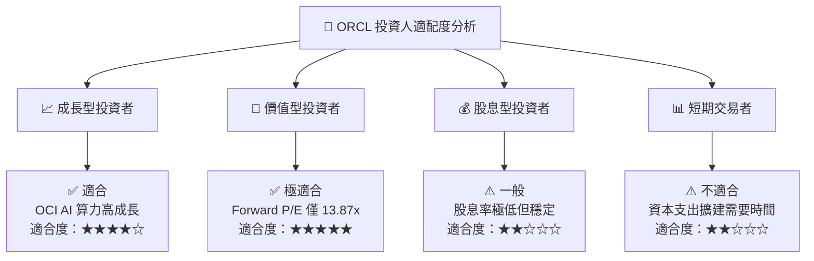

### 11.5 每季財報監控清單（Quarterly Watch List）

| 監控指標 | 良好訊號（加碼門檻） | 警告訊號（減碼門檻） | 追蹤意義 |
|----------|----------------------|----------------------|----------|
| **OCI 雲端營收 YoY** | > 45.0% | < 25.0% | 驗證 AI 算力需求與市佔率擴張 |
| **GAAP 營業利益率** | > 33.0% | < 28.0% | 衡量高 Capex 折舊壓力下之營運槓桿 |
| **季度 Capex 金額** | 穩定在 < $12.0B / 季 | > $20.0B / 季（無營收對應）| 判斷現金流轉正之時間點 |
| **自由現金流 FCF** | 季度 FCF 轉正 (> $2.0B) | FCF 連續多季負值 > -$10B | 評估財務安全性與債務負擔 |

### 11.6 反面論證：什麼會證明論點錯誤（Disconfirming Evidence）

```
╔══════════════════════════════════════════════════════════════════╗
║              ⚠️ 論點失效條件（Disconfirming Evidence）           ║
╠══════════════════════════════════════════════════════════════════╣
║  本投資論點在下列條件成立時將被證明錯誤，應果斷停損或減碼：      ║
║                                                                  ║
║  ☐ OCI AI 算力集群客戶出現退單，OCI 營收成長率連續兩季 < 20%     ║
║  ☐ Capex 佔營收比重在 FY2028 仍維持在 > 35% 以上，導致 FCF 續負  ║
║  ☐ ROIC 跌破 9.80% 之 WACC 門檻，代表資本配置摧毀價值            ║
║  ☐ 信用評級遭降評，債務融資利率大幅上升升至 > 6.5%               ║
║  ☐ 核心 Fusion ERP 客戶流失率（Churn Rate）上升至 > 10%          ║
╚══════════════════════════════════════════════════════════════════╝
```

---

> **免責聲明**：本報告由機構級研究模型自動生成，基於已公開之歷史財務數據進行分析與建模。報告內容僅供投資研究參考，不構成任何買賣建議。投資有風險，入市需謹慎。