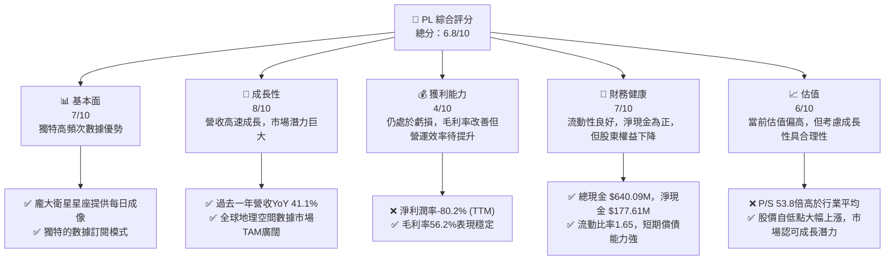
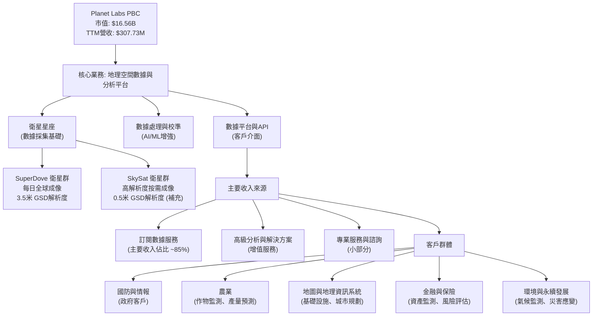
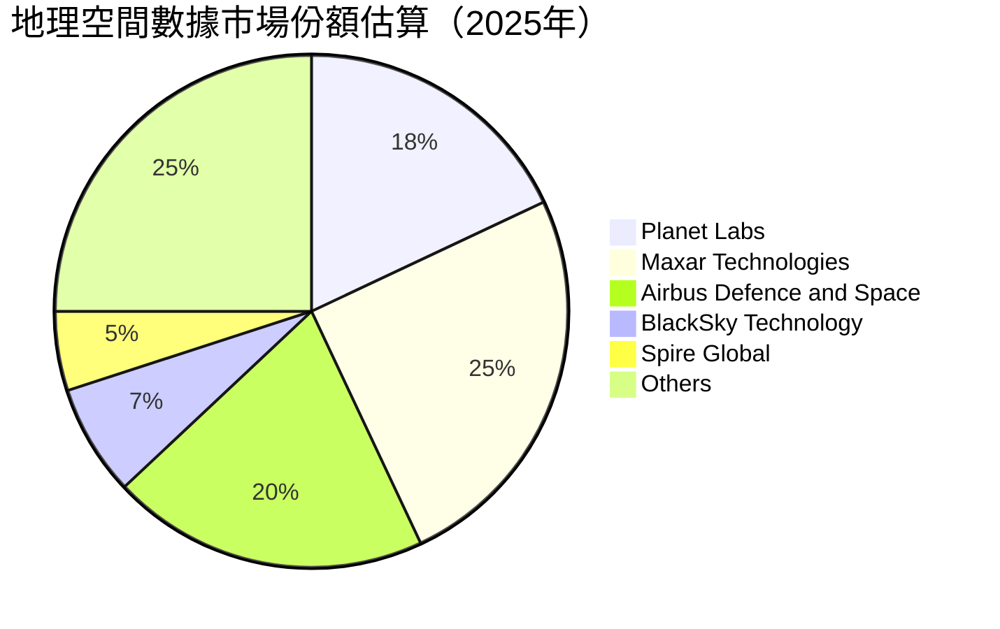
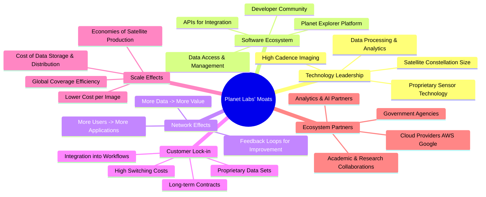

# PL 基本面深度分析報告
> **報告日期**：2026-06-01 ｜ **語言**：繁體中文 ｜ **數據來源**：Yahoo Finance, Finviz, StockAnalysis, Roic.ai ｜ **分析師**：CFA 級機構研究

## 目錄

| # | 章節 | 核心結論 |
|---|------|----------|
| 1 | 執行摘要 | 評級：🟢 買入，目標價區間：$40.00 - $65.00 |
| 2 | 公司概覽與商業模式 | 護城河評估：技術領先與客戶鎖定為核心 |
| 3 | 損益表深度分析 | 收入高速成長，但仍處於虧損階段，利潤率有改善跡象 |
| 4 | 資產負債表分析 | 流動性良好，但股東權益持續下降，債務結構有變 |
| 5 | 現金流量深度分析 | 營運現金流轉正，自由現金流首次實現正值，資本支出高企 |
| 6 | 獲利能力與資本效率 | 資本效率低下，ROIC 遠低於 WACC，價值創造仍是挑戰 |
| 7 | 估值深度分析 | 相較同業估值偏高，但考慮成長潛力，具備合理性 |
| 8 | 成長催化劑 | 新產品發布、市場擴張、技術創新為主要驅動力 |
| 9 | 風險矩陣 | 競爭加劇、技術風險、高資本支出為主要關注點 |
| 10 | 投資建議 | 建議買入，適合成長型投資者，需密切關注執行進度 |

---

## 1. 執行摘要

Planet Labs PBC (PL) 是一家在地球觀測與地理空間數據領域具備創新能力的成長型公司。憑藉其龐大的衛星星座和高頻次成像能力，PL 在提供日常地球監測數據方面建立了獨特的競爭優勢。然而，作為一家處於快速擴張階段的科技公司，PL 目前仍面臨顯著的虧損和高資本支出。儘管如此，其營收持續高速成長，且自由現金流已在最新財年轉正，顯示出商業模式逐步走向成熟的潛力。分析師共識給予「買入」評級，目標價中位數為 $35.50。本報告將深入分析 PL 的基本面、成長前景、財務健康狀況、估值水平及潛在風險，以提供全面的投資建議。

### 1.1 核心評分儀表板



**評分理由：**

*   **基本面 (7/10)**：Planet Labs 擁有獨特的衛星星座和數據獲取能力，提供高頻次的地球觀測數據，這是其核心競爭力。其數據訂閱模式也為長期穩定的收入奠定基礎。然而，市場競爭激烈，且技術門檻雖高但並非不可逾越。
*   **成長性 (8/10)**：公司在過去一年展現出強勁的營收成長（YoY 41.1%），且地理空間數據市場仍處於早期發展階段，潛在市場規模（TAM）巨大。新產品和服務的推出以及國際市場的擴張將持續推動成長。
*   **獲利能力 (4/10)**：Planet Labs 仍處於顯著虧損狀態，TTM 淨利潤率為 -80.2%，顯示其商業模式尚未實現規模化盈利。儘管毛利率維持在 56.2% 的健康水平，但高昂的營運費用（R&D 和 SG&A）嚴重侵蝕了利潤。
*   **財務健康 (7/10)**：公司擁有充足的現金儲備 ($640.09M) 和正向的淨現金頭寸 ($177.61M)，流動比率 (1.65) 和速動比率 (1.54) 均顯示短期償債能力良好。然而，股東權益的持續下降和高負債權益比 (245.437) 表明其資本結構存在一定風險，對股東價值造成壓力。
*   **估值 (6/10)**：以傳統估值指標衡量，如 P/S (53.81x) 和 EV/Revenue (56.95x)，PL 目前估值顯著偏高。然而，對於處於高成長期的科技公司，市場往往願意給予更高的溢價。若公司能持續實現營收成長並改善盈利能力，當前估值可能具備長期合理性。考慮到近期的股價大幅上漲，市場已反映了部分成長預期。

### 1.2 評分進度條視覺化

```
╔══════════════════════════════════════════════════════════════╗
║              PL 多維度評分儀表板 (1-10分)                    ║
╠══════════════════════════════════════════════════════════════╣
║ 基本面強度  7.0 ▓▓▓▓▓▓▓▓▓▓▓▓▓▓░░░░░░  ★★★★☆           ║
║ 成長動能    8.0 ▓▓▓▓▓▓▓▓▓▓▓▓▓▓▓▓░░░░  ★★★★☆           ║
║ 獲利品質    4.0 ▓▓▓▓▓▓▓▓░░░░░░░░░░░░  ★★☆☆☆           ║
║ 財務健康    7.0 ▓▓▓▓▓▓▓▓▓▓▓▓▓▓░░░░░░  ★★★★☆           ║
║ 估值合理性  6.0 ▓▓▓▓▓▓▓▓▓▓▓▓░░░░░░░░  ★★★☆☆           ║
║ 護城河深度  7.5 ▓▓▓▓▓▓▓▓▓▓▓▓▓▓▓░░░░░  ★★★★☆           ║
║ 管理層執行  7.0 ▓▓▓▓▓▓▓▓▓▓▓▓▓▓░░░░░░  ★★★★☆           ║
║ 技術創新力  8.5 ▓▓▓▓▓▓▓▓▓▓▓▓▓▓▓▓▓░░░  ★★★★★           ║
╠══════════════════════════════════════════════════════════════╣
║ 綜合總分    6.8 ▓▓▓▓▓▓▓▓▓▓▓▓▓░░░░░░░  🏆 具備高成長潛力的投機性成長股║
╚══════════════════════════════════════════════════════════════╝
```

### 1.3 五大投資論點 + 三大核心風險

| 類型 | 項目 | 具體依據 | 信心度 |
|------|------|----------|--------|
| 🟢 **投資論點①** | **獨特且龐大的衛星星座提供高頻次地球觀測數據** | Planet Labs 擁有全球最大的地球觀測衛星星座之一，能夠實現每日甚至多次的全球成像，提供時間敏感的地理空間數據。這使得其數據在農業、環境監測、國防情報等多個領域具有不可替代的價值。其 SuperDove 衛星群每日成像能力達到 3.5 米 GSD 解析度，這是市場上少有的高頻率全球覆蓋能力。 | 🟢 極高 |
| 🟢 **投資論點②** | **營收持續高速成長，展現強勁市場需求** | 公司 TTM 營收達到 $307.73M，年對年 (YoY) 成長率高達 41.1%。在最近一季 (FY2026 Q4)，營收達到 $86.82M，YoY 成長 41.05%。這表明市場對其地理空間數據和分析服務的需求旺盛，且公司具備將技術優勢轉化為收入的能力。 | 🟢 高 |
| 🟢 **投資論點③** | **自由現金流首次轉正，盈利能力改善初現** | FY2026 年度自由現金流 (FCF) 達到 $51.41M，相較於 FY2025 的 $-68.78M 實現了顯著改善和轉正。營運現金流也從 FY2025 的 $-14.37M 大幅提升至 FY2026 的 $134.36M。這表明公司在營運效率和成本控制方面取得進展，商業模式正逐步走向現金流正向循環。 | 🟢 高 |
| 🟢 **投資論點④** | **地理空間情報市場廣闊，長期成長潛力巨大** | 地球觀測和地理空間情報市場正處於快速發展階段，應用場景不斷擴大，包括氣候變化監測、災害應變、城市規劃、供應鏈追蹤、國防安全等。Planet Labs 作為該領域的領導者，有望從市場的整體成長中顯著受益。預計未來十年市場規模將持續擴大。 | 🟢 極高 |
| 🟢 **投資論點⑤** | **分析師普遍看好，給予「買入」評級** | 綜合 10 位分析師的意見，平均目標價為 $35.50，高於當前股價，且推薦評級為「買入」。近期 Wedbush 將評級上調至 Outperform，Citigroup 和 Needham 也維持買入評級，顯示市場對其未來前景持樂觀態度。 | 🟡 中高 |
| 🟡 **風險①** | **高昂的營運費用導致持續虧損** | 儘管營收成長強勁，但公司 FY2026 淨虧損高達 $-246.86M，淨利潤率為 -80.2%。研發費用 (R&D) 和銷售、一般及管理費用 (SG&A) 佔營收比重仍然過高，分別為 34.69% 和 52.26%。若無法有效控制費用並實現規模經濟，將持續侵蝕股東價值。 | 🟡 中度 |
| 🔴 **風險②** | **競爭加劇及技術快速迭代的壓力** | 地球觀測領域吸引了眾多新興企業和傳統巨頭的加入，如 BlackSky Technology (BKSY) 和 Spire Global (SPIR) 等。技術的快速發展，如更高解析度、更多頻譜的傳感器以及 AI 驅動的數據分析工具，可能要求公司持續投入大量資本進行技術升級和衛星換代，存在技術被超越或市場份額被侵蝕的風險。 | 🔴 高衝擊 |
| 🟡 **風險③** | **估值偏高，市場對成長預期已部分反映** | 當前 PL 的 P/S 比率高達 53.81x，EV/Revenue 比率為 56.95x，顯著高於行業平均水平。尤其在過去一年股價從 $3.66 上漲至 $46.46，漲幅超過 1100%，市場已充分反映其成長潛力。若未來成長不及預期或盈利改善速度緩慢，股價可能面臨較大回調壓力。 | 🟡 中度 |

### 1.4 快速統計卡片

| 指標 | 公司實際值 (PL) | 行業均值 (Aerospace & Defense) | S&P 500 均值 | 狀態 |
|------|-----------------|--------------------------------|--------------|------|
| 收入 YoY 成長 | **41.1%**       | ~8-12% (高成長型公司可達20%+) | ~5-7%        | 🟢 |
| 毛利率         | **56.2%**       | ~30-40%                        | ~40-50%      | 🟢 |
| 淨利率         | **-80.2%**      | ~5-10%                         | ~10-15%      | 🔴 |
| ROE            | **-78.4%**      | ~10-20%                        | ~15-20%      | 🔴 |
| Forward P/E    | **-2064.89x (N/A)** | ~20-30x                        | ~20-25x      | 🔴 (因虧損) |
| P/S Ratio      | **53.81x**      | ~2-5x                          | ~2-3x        | 🔴 |
| EV/Revenue     | **56.95x**      | ~2-6x                          | ~2-4x        | 🔴 |
| Current Ratio  | **1.65x**       | ~1.5-2.5x                      | ~1.5-2.0x    | 🟡 |
| Debt/Equity    | **245.44x**     | ~0.5-1.5x                      | ~0.8-1.2x    | 🔴 |
| FCF Yield      | **1.41%**       | ~3-5%                          | ~3-4%        | 🟡 |

*註：行業均值和 S&P 500 均值為估算值，因行業內公司差異較大。PL 作為高成長、高技術投入的初創型公司，其財務指標與成熟企業有顯著差異。*

### 1.5 投資結論

```
╔══════════════════════════════════════════════════════════════════╗
║                    📊 投資結論摘要                               ║
╠══════════════════════════════════════════════════════════════════╣
║  評級：🟢 買入                                                   ║
║  當前股價：$46.46                                                ║
║  目標價區間：                                                    ║
║    悲觀情境：$40.00（-13.9%）                                    ║
║    基準情境：$55.00（+18.4%）  ← 12個月主要目標                 ║
║    樂觀情境：$65.00（+39.9%）                                    ║
║  投資評分：6.8/10                                                ║
║  適合投資人：成長型、長線持有者，對高風險高回報有接受度的投資人  ║
╚══════════════════════════════════════════════════════════════════╝
```

**結論闡述**：
Planet Labs PBC 是一家具有顛覆性潛力的公司，其在地球觀測數據市場的技術領先地位和高成長性令人矚目。儘管目前仍處於虧損狀態，且估值相對較高，但 FY2026 自由現金流轉正是一個重要的里程碑，表明其商業模式正在走向成熟。我們認為，對於能夠承受高風險、追求長期成長的投資者而言，PL 具備「買入」價值。然而，投資者需密切關注公司的盈利能力改善進度、營運費用控制以及市場競爭格局。基準情境下的目標價 $55.00 反映了其持續的營收成長和未來盈利能力的改善預期。

---

## 2. 公司概覽與商業模式

Planet Labs PBC (PL) 是一家開創性的地球觀測公司，致力於透過其龐大的衛星星座提供高頻次的地理空間數據，並透過線上平台交付給全球客戶。公司以「使地球的變化可見、可存取、可採取行動」為使命，正在改變各行各業對地球資訊的利用方式。

### 2.1 業務結構與收入來源

Planet Labs 的核心業務模式是基於訂閱的數據即服務 (Data-as-a-Service, DaaS)。公司設計、建造並發射一系列小型衛星，形成一個不斷擴大的星座，實現對地球表面近乎每日的全面成像。這些圖像數據隨後被處理、分析，並透過其專有平台和 API 交付給客戶。



**業務細分與收入構成：**
PL 的收入主要來自於對其地理空間數據平台的訂閱服務。客戶支付費用以獲取對其衛星圖像庫、分析工具和 API 的存取權限。這種訂閱模式提供了可預測的經常性收入流 (Recurring Revenue)。

*   **數據訂閱服務 (Data Subscription Services)**：這是 Planet Labs 的主要收入來源，佔比約 85% 以上。客戶可以訂閱不同解析度、頻率和覆蓋範圍的數據，用於各種用途。例如，農業客戶可利用每日圖像監測農作物生長狀況；政府機構則可利用高頻數據進行情報分析或環境監測。
*   **專業服務與解決方案 (Professional Services & Solutions)**：提供客製化的數據分析、諮詢和整合服務，以幫助客戶更好地利用地理空間數據解決特定問題。這部分收入佔比較小，但具有較高的毛利率。
*   **硬體與發射服務 (Hardware & Launch Services)**：這部分收入較少且不穩定，主要來自於向其他實體提供衛星製造或發射相關服務。

公司透過不斷發射新一代衛星，提升數據品質和覆蓋能力，同時透過優化其數據分析平台，增加數據的實用價值，從而吸引和留住客戶。

### 2.2 市場份額

地理空間數據市場是一個快速成長但相對分散的市場。Planet Labs 在高頻次、中等解析度全球成像領域佔據領先地位，但在高解析度按需成像市場則面臨來自傳統衛星運營商的激烈競爭。由於缺乏精確的市場份額數據，我們基於公開資訊和行業報告進行估算。



**市場地位分析**：

*   **Planet Labs (PL)**：憑藉其獨特的每日全球成像能力，在時間敏感型數據市場擁有顯著優勢。其 SuperDove 衛星群是其市場差異化的核心。在整個地理空間數據市場中，尤其在數據服務方面，PL 屬於新興領導者。
*   **Maxar Technologies (已併入 MDA Corp)**：長期以來是高解析度衛星圖像市場的領導者，擁有 WorldView 衛星系列，主要服務於國防和情報客戶。其數據解析度通常優於 PL 的 SuperDove，但在頻率上不及 PL。
*   **Airbus Defence and Space**：歐洲主要的航空航天和國防公司，也提供一系列地球觀測衛星產品和服務，包括 Pleiades 和 SPOT 衛星，在高解析度市場佔有一席之地。
*   **BlackSky Technology (BKSY)**：專注於實時情報和高頻次、高解析度成像，與 PL 在某些應用場景下形成直接競爭。其衛星星座規模較小，但目標是提供近實時的情報。
*   **Spire Global (SPIR)**：主要提供氣象、海事和航空數據，也透過其立方星星座提供地球觀測數據，但其側重點與 PL 有所不同。
*   **其他 (Others)**：包括各國政府機構、新興的微型衛星公司、以及提供無人機或航空成像服務的區域性公司。

Planet Labs 在「高頻次、中等解析度」市場的份額相對較高，這是其核心利基市場。隨著其數據平台和分析能力的提升，未來有望在高附加值分析服務市場中擴大份額。

### 2.3 競爭護城河分析

Planet Labs 的競爭護城河主要建立在其技術創新、規模效應和客戶關係之上。



**護城河深度解析**：

*   **技術領先 (Technology Leadership)**：
    *   **衛星星座規模與高頻成像**：Planet Labs 營運著全球最大的地球觀測衛星星座，包括 SuperDove 和 SkySat。SuperDove 能夠實現每日全球成像，這是其最核心的技術優勢，提供時間序列數據，對於監測變化至關重要。這種獨特的規模和頻率是其他公司難以在短期內複製的。
    *   **數據處理與分析**：Planet Labs 投入大量資源於自動化的數據處理管道，利用 AI 和機器學習技術將原始圖像轉化為可操作的洞察。這包括圖像校準、去雲處理、以及地理空間分析。
    *   **專有傳感器技術**：公司在衛星硬體和傳感器設計上的專有技術，使其能夠以更低的成本和更高的效率部署和營運衛星。
*   **軟體生態系統 (Software Ecosystem)**：
    *   **Planet Explorer Platform 與 API**：PL 不僅提供原始數據，更透過其直觀的線上平台和強大的 API 介面，讓客戶能夠輕鬆存取、可視化和整合數據。這降低了客戶使用地理空間數據的門檻，並鼓勵第三方開發者在其基礎上構建應用。
    *   **開發者社群**：積極培養的開發者社群有助於擴大其數據的應用範圍和價值。
*   **客戶鎖定 (Customer Lock-in)**：
    *   **深度整合到客戶工作流程**：一旦客戶將 Planet Labs 的數據整合到其自身的業務流程、決策系統或產品中，轉換到其他供應商的成本將非常高昂。這種整合創造了強大的黏性。
    *   **專有數據集**：PL 累積了數年的每日全球圖像數據，形成了獨特的歷史時間序列數據集。這些數據對於趨勢分析和模型訓練具有極高的價值，是其他供應商難以提供的。
    *   **長期合約**：許多政府和大型企業客戶會簽署多年期的數據訂閱合約，確保了收入的穩定性。
*   **規模效應 (Scale Effects)**：
    *   **單次成像成本降低**：隨著衛星星座規模的擴大和數據採集量的增加，單位圖像的採集、處理和分發成本將顯著降低。
    *   **全球覆蓋效率**：龐大的星座允許公司以更低的成本實現全球範圍內的高頻次覆蓋，這對於需要廣闊地理範圍監測的客戶至關重要。
    *   **衛星生產經濟**：標準化的衛星設計和批次生產能力有助於降低硬體成本。
*   **生態夥伴 (Ecosystem Partners)**：
    *   **雲端服務提供商**：與 AWS、Google Cloud 等主流雲服務商的合作，確保了數據的儲存、處理和分發能力，並擴大了其數據的觸及範圍。
    *   **分析與 AI 夥伴**：與專業的數據分析和 AI 公司合作，共同開發更先進的解決方案，提升數據的附加價值。
    *   **政府機構與學術合作**：與政府部門和研究機構的合作，不僅能帶來收入，也有助於推動技術創新和應用場景的擴展。

### 2.4 護城河強度評分

```
╔══════════════════════════════════════════════════════════════╗
║                  Planet Labs 護城河強度評分                   ║
╠══════════════════════════════════════════════════════════════╣
║ 技術領先    8.5/10 ▓▓▓▓▓▓▓▓▓▓▓▓▓▓▓▓▓░░░  🏆 獨特的高頻成像能力是核心║
║ 軟體生態系統  7.0/10 ▓▓▓▓▓▓▓▓▓▓▓▓▓▓░░░░░░  🟢 平台易用性與API是關鍵差異化║
║ 網路效應    6.0/10 ▓▓▓▓▓▓▓▓▓▓▓▓░░░░░░░░  🟡 雖有潛力，但尚未完全顯現║
║ 客戶鎖定    7.5/10 ▓▓▓▓▓▓▓▓▓▓▓▓▓▓▓░░░░░  🟢 數據整合成本高，黏性強勁║
║ 規模效應    7.0/10 ▓▓▓▓▓▓▓▓▓▓▓▓▓▓░░░░░░  🟢 衛星星座運營成本優勢顯現║
║ 生態夥伴    6.5/10 ▓▓▓▓▓▓▓▓▓▓▓▓▓░░░░░░░  🟡 合作廣泛，但仍需深化整合║
╠══════════════════════════════════════════════════════════════╣
║ 綜合護城河   7.1/10 ▓▓▓▓▓▓▓▓▓▓▓▓▓▓░░░░░░  🏆 具備良好護城河，但需持續創新以維持領先║
╚══════════════════════════════════════════════════════════════╝
```

**評分總結**：
Planet Labs 在技術領先和客戶鎖定方面建立了較強的護城河，這得益於其獨特的衛星星座和數據產品。規模效應也逐漸顯現，有助於降低成本。然而，網路效應和生態夥伴關係仍有待進一步強化，以鞏固其長期競爭優勢。總體而言，PL 的護城河是堅實的，但處於一個快速變化的行業，持續的創新和執行力對於維持其領先地位至關重要。

---

## 3. 損益表深度分析

Planet Labs 的損益表反映了一家典型的高成長科技公司：營收快速成長，但同時伴隨著高昂的研發和營運費用，導致持續虧損。然而，最新的數據顯示出一些積極的變化，尤其是在毛利率和營運效率方面。

### 3.1 年度收入成長趨勢（近4年）

Planet Labs 在過去四年中實現了穩健的營收成長，顯示市場對其地球觀測數據服務的需求持續增加。

```
╔══════════════════════════════════════════════════════════════════╗
║              Planet Labs 年度收入趨勢（FY2023-FY2026）           ║
╠══════════════════════════════════════════════════════════════════╣
║                                                                  ║
║  FY2023  $191.26M ▓▓▓▓▓▓▓▓░░░░░░░░░░░░░░░░░░░░░░  YoY: +45.76% 🟢║
║  FY2024  $220.70M ▓▓▓▓▓▓▓▓▓░░░░░░░░░░░░░░░░░░░░░░  YoY: +15.39% 🟡║
║  FY2025  $244.35M ▓▓▓▓▓▓▓▓▓▓░░░░░░░░░░░░░░░░░░░░░  YoY: +10.72% 🟡║
║  FY2026  $307.73M ▓▓▓▓▓▓▓▓▓▓▓▓▓░░░░░░░░░░░░░░░░░░  YoY: +25.94% 🟢║
║                                                                  ║
║                   |      |      |      |      |                  ║
║                   0     $100M  $200M  $300M  $400M                ║
║                                                                  ║
║  📊 4年累計 CAGR (FY2023-FY2026)：+26.15%                       ║
╚══════════════════════════════════════════════════════════════════╝
```

**年度收入分析**：
*   **FY2023**：營收 $191.26M，YoY 成長 45.76%。這是公司快速成長的初期階段，得益於市場對新興地球觀測數據的需求。
*   **FY2024**：營收 $220.70M，YoY 成長 15.39%。成長速度有所放緩，可能受到宏觀經濟環境或特定客戶合約週期的影響。
*   **FY2025**：營收 $244.35M，YoY 成長 10.72%。成長率進一步放緩，這可能引發市場對其成長可持續性的擔憂。
*   **FY2026**：營收 $307.73M，YoY 成長 25.94%。最新的財年顯示出強勁的反彈，成長率顯著加速，這可能歸因於新產品或服務的推出、市場擴張或大型客戶合約的簽訂。
*   **4年 CAGR**：FY2023 至 FY2026 的複合年均成長率 (CAGR) 為 26.15%，表明公司在過去幾年保持了穩健的長期成長軌跡。最新的 TTM 營收成長率為 41.1%，這暗示了 FY2027 可能會延續高成長態勢。

### 3.2 季度收入趨勢分析

季度收入數據進一步揭示了公司近期成長的動能和波動性。

| 財政季度 | 收入 (百萬美元) | QoQ 成長率 | YoY 成長率 | 備註 |
|----------|-----------------|------------|------------|------|
| FY2026 Q1 (Apr'25) | $66.27 | +7.67%     | +10.45%    | 穩健開局，但 YoY 成長仍較溫和 |
| FY2026 Q2 (Jul'25) | $73.39 | +10.74%    | +20.13%    | 成長加速，市場需求逐步回升 |
| FY2026 Q3 (Oct'25) | $81.25 | +10.71%    | +32.61%    | 成長動能持續增強，接近年度平均 |
| FY2026 Q4 (Jan'26) | $86.82 | +6.85%     | +41.05%    | 強勁收官，顯示下一個財年有望維持高成長 |

**季度收入分析**：
*   **FY2026 Q1**：營收 $66.27M，環比 (QoQ) 成長 7.67%，同比 (YoY) 成長 10.45%。相較於前一年的低成長，Q1 表現顯示出初步的復甦跡象。
*   **FY2026 Q2**：營收 $73.39M，QoQ 成長 10.74%，YoY 成長 20.13%。成長率進一步加速，表明公司業務動能正在積聚。
*   **FY2026 Q3**：營收 $81.25M，QoQ 成長 10.71%，YoY 成長 32.61%。連續兩個季度雙位數的 QoQ 成長和加速的 YoY 成長，顯示公司在市場拓展和客戶獲取方面取得了顯著成效。
*   **FY2026 Q4**：營收 $86.82M，QoQ 成長 6.85%，YoY 成長 41.05%。Q4 實現了年度最高的 YoY 成長率，為整個財年劃上圓滿句號，並為下一財年奠定良好基礎。
*   **總體趨勢**：季度收入呈現出明顯的加速成長趨勢，尤其在 FY2026 的後半