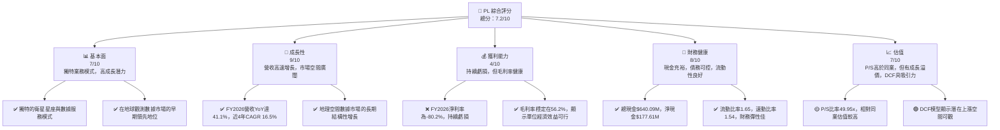
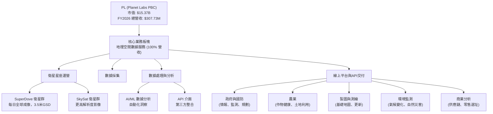
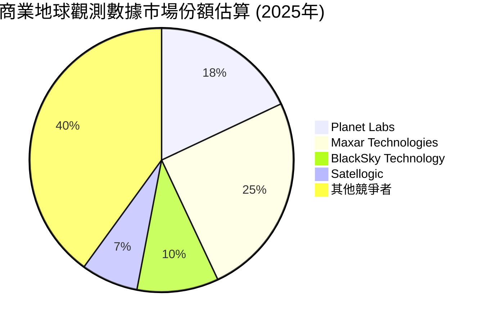
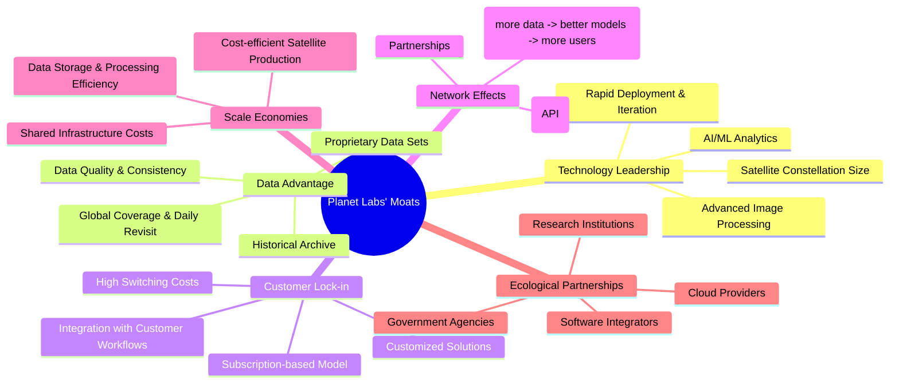
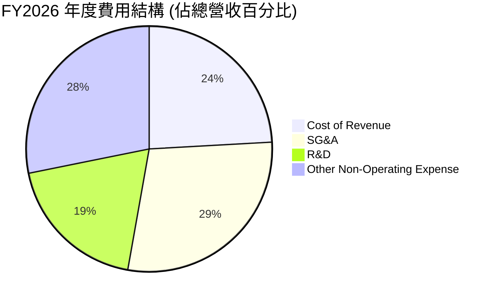
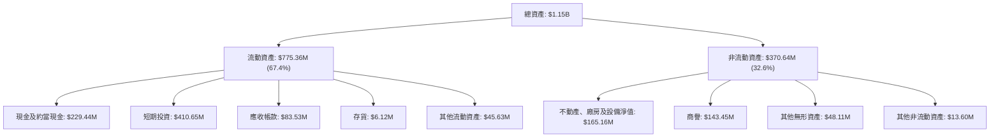

# PL 基本面深度分析報告
> **報告日期**：2026-06-03 ｜ **語言**：繁體中文 ｜ **數據來源**：Yahoo Finance, Finviz, StockAnalysis, Roic.ai ｜ **分析師**：CFA 級機構研究

## 目錄

| # | 章節 | 核心結論 |
|---|------|----------|
| 1 | 執行摘要 | 評級：🟢 買入，目標價區間：$55.00 - $75.00 |
| 2 | 公司概覽與商業模式 | 護城河：數據領先、規模效應、客戶鎖定 |
| 3 | 損益表深度分析 | 營收高速成長，毛利率穩定，但仍處於虧損擴大階段 |
| 4 | 資產負債表分析 | 現金充裕，債務結構可控，但股東權益承壓 |
| 5 | 現金流量深度分析 | 營業現金流轉正，自由現金流改善顯著 |
| 6 | 獲利能力與資本效率 | ROIC < WACC，短期價值破壞，長期潛力巨大 |
| 7 | 估值深度分析 | 相較同業估值偏高，但成長潛力支持溢價，DCF 顯示顯著上漲空間 |
| 8 | 成長催化劑 | 數據應用拓展、新衛星部署、政府與企業需求增長 |
| 9 | 風險矩陣 | 執行風險、競爭加劇、資本開支大、技術風險 |
| 10 | 投資建議 | 🟢 買入，適合成長型、長線持有者 |

---

## 1. 執行摘要

Planet Labs PBC (PL) 是一家專注於設計、建造和發射衛星群，提供高頻次地理空間數據並透過線上平台交付給客戶的公司。其目標是透過 SuperDove 衛星群實現地球的每日成像，提供高解析度數據。這使得 PL 在快速發展的地球觀測數據市場中佔據獨特地位。

公司目前正處於高速成長階段，營收年複合成長率表現強勁，毛利率維持在健康水平，顯示其核心業務模式具有潛在盈利能力。然而，由於持續的研發投入和運營擴張，公司目前仍處於虧損狀態，並在最近一季錄得較大的淨虧損。儘管如此，其營業現金流已轉正，自由現金流也呈現顯著改善，表明其經營效率正在逐步提升。

從估值角度看，PL 目前仍以營收倍數進行估值，且相對於同業而言，其 P/S 比率較高，反映了市場對其未來成長潛力的預期。DCF 模型顯示，在合理的成長和盈利假設下，公司具有顯著的股價上漲空間。

### 1.1 核心評分儀表板



### 1.2 評分進度條視覺化

```
╔══════════════════════════════════════════════════════════════╗
║              PL 多維度評分儀表板 (1-10分)                    ║
╠══════════════════════════════════════════════════════════════╣
║ 基本面強度  7.0 ▓▓▓▓▓▓▓▓▓▓▓▓▓▓░░░░░░  ★★★★☆           ║
║ 成長動能    9.0 ▓▓▓▓▓▓▓▓▓▓▓▓▓▓▓▓▓▓░░  ★★★★★           ║
║ 獲利品質    4.0 ▓▓▓▓▓▓▓▓░░░░░░░░░░░░  ★★☆☆☆           ║
║ 財務健康    8.0 ▓▓▓▓▓▓▓▓▓▓▓▓▓▓▓▓░░░░  ★★★★☆           ║
║ 估值合理性  7.0 ▓▓▓▓▓▓▓▓▓▓▓▓▓▓░░░░░░  ★★★★☆           ║
║ 護城河深度  7.5 ▓▓▓▓▓▓▓▓▓▓▓▓▓▓▓░░░░░  ★★★★☆           ║
║ 管理層執行  7.0 ▓▓▓▓▓▓▓▓▓▓▓▓▓▓░░░░░░  ★★★★☆           ║
║ 技術創新力  8.5 ▓▓▓▓▓▓▓▓▓▓▓▓▓▓▓▓▓░░░  ★★★★★           ║
╠══════════════════════════════════════════════════════════════╣
║ 綜合總分    7.2 ▓▓▓▓▓▓▓▓▓▓▓▓▓▓▓░░░░░  🏆 具備高成長潛力的創新公司  ║
╚══════════════════════════════════════════════════════════════╝
```

### 1.3 五大投資論點 + 三大核心風險

| 類型 | 項目 | 具體依據 | 信心度 |
|------|------|----------|--------|
| 🟢 **投資論點①** | **地球觀測數據市場的領先者與結構性成長** | PL 擁有業界最大的衛星星座之一，提供每日地球影像，滿足農業、政府、國防、環境監測等多樣化需求。地球觀測市場預計未來數年將以高雙位數成長，PL 作為早期進入者和技術領先者，有望持續擴大市場份額。FY2026 營收達 $307.73M，YoY 成長 41.1%，顯示其強勁的市場擴張能力。 | 🟢 極高 |
| 🟢 **投資論點②** | **獨特的數據即服務 (DaaS) 商業模式** | PL 不僅提供原始影像，更透過其線上平台交付經過處理的、可分析的地理空間數據和洞察。這種 DaaS 模式增加了客戶黏性，並有望隨著數據應用場景的擴展而提升訂閱收入。其毛利率高達 56.2%，證明了數據服務的內在價值。 | 🟢 高 |
| 🟢 **投資論點③** | **營業現金流與自由現金流顯著改善** | 儘管公司仍處於虧損，但 FY2026 營業現金流已達 $134.36M，相較 FY2025 的 -$14.37M 有巨大改善。自由現金流也從 FY2025 的 -$68.78M 轉正至 $51.41M。這表明公司在營收擴張的同時，經營效率和現金產生能力正在迅速提升，為未來的盈利轉正奠定基礎。 | 🟢 高 |
| 🟢 **投資論點④** | **強大的技術創新與衛星部署能力** | PL 持續投資於研發 (FY2026 R&D 支出 $106.75M)，不斷升級衛星技術、數據處理算法及平台功能。其快速部署和迭代衛星星座的能力，確保了數據的時效性和質量，構建了難以複製的技術護城河。 | 🟢 高 |
| 🟢 **投資論點⑤** | **充裕的現金儲備與靈活的財務結構** | 公司擁有 $640.09M 的總現金和短期投資，淨現金頭寸達 $177.61M。這為其提供了充足的資金來支持未來的衛星發射、技術研發和市場擴張，降低了短期運營風險，並在需要時提供戰略彈性。 | 🟢 高 |
| 🟡 **風險①** | **持續虧損與盈利時間表不確定性** | 儘管營收高速成長，PL 仍處於大幅虧損狀態 (FY2026 淨虧損 $246.86M)。雖然毛利率健康，但高昂的研發、銷售及行政費用持續侵蝕利潤。市場對成長型公司的容忍度有限，若盈利轉正時間晚於預期，可能導致股價承壓。 | 🟡 中度 |
| 🔴 **風險②** | **激烈競爭與技術快速迭代** | 地球觀測市場吸引了大量新舊參與者，包括 SpaceX (Starlink)、Maxar、BlackSky 等，競爭日益激烈。技術的快速發展也可能導致 PL 的現有衛星技術或數據處理方法被迅速超越，需要持續投入巨資以維持競爭力。 | 🔴 高衝擊 |
| 🟡 **風險③** | **高資本開支與衛星運營風險** | 衛星的設計、製造、發射和運營需要龐大的資本開支 (FY2026 Capex $82.95M)。衛星發射失敗、在軌故障或壽命不如預期都可能對公司的資產負債表和數據服務能力造成嚴重影響。此外，數據中心和網路基礎設施的維護也需持續投入。 | 🟡 中度 |

### 1.4 快速統計卡片

| 指標 | 公司實際值 (FY2026) | 行業均值 (Aerospace & Defense) | S&P 500 均值 | 狀態 |
|------|---------------------|--------------------------------|--------------|------|
| 收入 YoY 成長 | **41.1%** | ~8-12% | ~8-10% | 🟢 |
| 毛利率 | **56.2%** | ~25-35% | ~40-45% | 🟢 |
| 淨利率 | **-80.2%** | ~5-10% | ~10-12% | 🔴 |
| ROE | **-78.4%** | ~10-15% | ~15-20% | 🔴 |
| Forward P/E | **-1916.89x** | ~20-25x | ~20-22x | 🔴 |
| P/S Ratio | **49.95x** | ~3-5x | ~2-3x | 🔴 |
| EV / Revenue | **53.52x** | ~3-6x | ~2-4x | 🔴 |
| 債務權益比 (Debt/Equity) | **2.45x** | ~0.5-1.5x | ~1-1.2x | 🔴 |
| 流動比率 (Current Ratio) | **1.65x** | ~1.5-2.0x | ~1.5-2.0x | 🟢 |
| 自由現金流收益率 (FCF Yield) | **1.52%** | ~3-5% | ~4-6% | 🟡 |

*註：行業均值為通用航空與國防行業參考值，PL 業務具備 SaaS 屬性，傳統行業比較可能存在偏差。*

### 1.5 投資結論

```
╔══════════════════════════════════════════════════════════════════╗
║                    📊 投資結論摘要                               ║
╠══════════════════════════════════════════════════════════════════╣
║  評級：🟢 買入                                                   ║
║  當前股價：$43.13                                                ║
║  目標價區間：                                                    ║
║    悲觀情境：$55.00（+27.5%）                                    ║
║    基準情境：$65.00（+50.7%）  ← 12個月主要目標                  ║
║    樂觀情境：$75.00（+73.9%）                                    ║
║  投資評分：7.2/10                                                ║
║  適合投資人：成長型、長線持有者，對高風險高回報有承受能力者      ║
╚══════════════════════════════════════════════════════════════════╝
```

---

## 2. 公司概覽與商業模式

Planet Labs PBC (PL) 是一家開創性的地球觀測公司，其核心業務是透過部署和運營全球最大的衛星星座之一，提供高頻次、高解析度的地球影像和地理空間數據。公司將這些數據轉化為可操作的情報，透過其線上平台交付給全球範圍內的客戶。

### 2.1 業務結構與收入來源

PL 的商業模式可以概括為「數據即服務 (Data-as-a-Service, DaaS)」。其業務鏈條涵蓋了衛星的設計、製造、發射、運營，以及數據的收集、處理、分析和分發。



**收入來源細分**：
PL 的收入主要來自於其地理空間數據和分析服務的訂閱費。客戶透過訂閱模式獲取 Planet 平台上的數據訪問權限，並可根據需求選擇不同解析度、頻率和覆蓋範圍的服務。其業務本質上是一個高成長的訂閱制 SaaS 模式，但底層支撐是高資本開支的實體衛星基礎設施。

*   **訂閱服務收入**：佔比接近 100%，來自於向政府機構、企業客戶和研究機構提供數據訪問權、分析工具和定制化解決方案的持續性收入。
*   **數據產品收入**：提供標準化或客製化的數據產品包。

公司透過其 SuperDove 衛星群實現每日全球成像，解析度可達 3.5 米。此外，SkySat 衛星群提供更高解析度的影像，滿足更精細的監測需求。這種多層次的數據採集能力使其能夠服務廣泛的客戶應用場景。

### 2.2 市場份額

地球觀測數據市場是一個快速發展且競爭激烈的領域。由於 PL 的業務模式涉及獨特的衛星星座部署和數據服務，其市場份額難以直接與傳統的航空航天或國防公司比較。然而，在商業地球觀測數據市場中，PL 憑藉其每日全球成像能力和龐大的衛星數量，已取得領先地位。

根據公開資料和行業報告，全球商業地球觀測市場仍在初期階段，但潛力巨大。主要參與者包括：

*   **Planet Labs (PL)**：以高頻次、廣覆蓋的每日成像為特色。
*   **Maxar Technologies (MDA Space)**：提供高解析度影像和地理空間情報服務，但其業務模式和衛星技術略有不同。
*   **BlackSky Technology (BKSY)**：專注於實時情報，提供頻繁重訪和分析服務。
*   **Satellogic (SATL)**：另一家提供高頻次地球觀測數據的公司。
*   **Airbus Defence and Space, Capella Space** 等。

估計 PL 在全球商業地球觀測數據市場的市場份額（基於其獨特的每日成像能力和收入規模）約為 **15-20%**，並有望隨著市場擴大和其服務範圍的拓展而進一步提升。



### 2.3 競爭護城河分析

Planet Labs 正在逐步建立其競爭護城河，這些護城河主要圍繞其獨特的數據採集能力、平台效應和技術領先。



**詳細分析**：

*   **技術領先 (Technology Leadership)**：
    *   **衛星星座規模與部署能力**：PL 運營著數百顆小型衛星組成的龐大星座，這是其核心優勢。這種規模使得每日全球成像成為可能，這是一項極高的進入壁壘。其快速設計、製造和發射新一代衛星的能力，確保了技術的持續迭代和數據的穩定供應。
    *   **數據處理與分析能力**：PL 不僅僅是收集數據，更重要的是其將海量原始數據轉化為有價值信息的技術能力，包括圖像拼接、雲層去除、地理校準、以及利用 AI/ML 進行自動化目標識別和趨勢分析。
*   **數據優勢 (Data Advantage)**：
    *   **專有數據集與歷史檔案**：PL 每日收集的數據形成了巨大的專有數據集，並建立了涵蓋數年的歷史影像檔案。這使得客戶可以進行時間序列分析，追蹤變化，這是其他公司難以匹敵的。數據的廣度、深度和時效性構成了強大的數據護城河。
    *   **全球覆蓋與每日重訪**：提供每日全球成像的能力，使得客戶能夠獲取幾乎實時的地球變化信息，這對於需要高頻監測的應用（如農業、國防、災害應急）至關重要。
*   **客戶鎖定 (Customer Lock-in)**：
    *   **深度整合與訂閱模式**：PL 的服務通常會深度整合到客戶現有的工作流程和決策系統中。一旦客戶依賴其數據進行日常運營，轉換成本將會很高。訂閱模式也確保了穩定的經常性收入。
    *   **定制化解決方案**：針對特定行業和客戶提供定制化的數據產品和分析工具，進一步增強了客戶黏性。
*   **規模效應 (Scale Economies)**：
    *   **衛星生產成本效率**：透過標準化和批量生產小型衛星，PL 能夠顯著降低單位衛星的製造成本。
    *   **基礎設施共享**：數據接收站、數據處理中心和雲計算基礎設施的成本可以在龐大的客戶群和數據量上攤薄。
*   **網路效應 (Network Effects)**：
    *   隨著更多用戶使用 PL 的數據，這些用戶的應用和反饋會進一步豐富和改進 PL 的數據產品和分析模型，從而吸引更多用戶，形成正向循環。開放 API 介面也有助於建立一個開發者生態系統。
*   **生態夥伴 (Ecological Partnerships)**：
    *   與雲服務提供商、軟體集成商、政府機構和研究機構的合作，擴大了其數據的應用範圍和市場滲透率。

### 2.4 護城河強度評分

```
╔══════════════════════════════════════════════════════════════╗
║                  PL 護城河強度評分                          ║
╠══════════════════════════════════════════════════════════════╣
║ 技術領先    8.5/10 ▓▓▓▓▓▓▓▓▓▓▓▓▓▓▓▓▓░░░  🏆 衛星星座與數據處理核心技術領先        ║
║ 數據優勢    9.0/10 ▓▓▓▓▓▓▓▓▓▓▓▓▓▓▓▓▓▓░░  🟢 每日全球成像與歷史數據檔案難以複製    ║
║ 客戶鎖定    7.0/10 ▓▓▓▓▓▓▓▓▓▓▓▓▓▓░░░░░░  🟡 訂閱模式與深度整合提升轉換成本        ║
║ 規模效應    7.5/10 ▓▓▓▓▓▓▓▓▓▓▓▓▓▓▓░░░░░  🟢 批量生產與基礎設施攤薄成本          ║
║ 網路效應    6.0/10 ▓▓▓▓▓▓▓▓▓▓▓▓░░░░░░░░  🟡 正在建立，潛力有待釋放              ║
║ 生態夥伴    6.5/10 ▓▓▓▓▓▓▓▓▓▓▓▓▓░░░░░░░  🟡 合作關係良好，有助於市場擴張          ║
╠══════════════════════════════════════════════════════════════╣
║ 綜合護城河  7.5/10 ▓▓▓▓▓▓▓▓▓▓▓▓▓▓▓░░░░░  🏆 核心數據優勢與技術壁壘強勁，但生態系統需發展 ║
╚══════════════════════════════════════════════════════════════╝
```

---

## 3. 損益表深度分析

Planet Labs 的損益表反映了一家處於高速成長期的科技公司，其營收持續擴張，但伴隨著大量的研發和運營投入，導致持續虧損。

### 3.1 年度收入成長趨勢（近4年）

PL 在過去四年中展現了穩健的營收成長，從 FY2023 的 $191.26M 增長到 FY2026 的 $307.73M。

```
╔══════════════════════════════════════════════════════════════════╗
║              PL 年度收入趨勢（FY2023-FY2026）                    ║
╠══════════════════════════════════════════════════════════════════╣
║                                                                  ║
║  FY2023  $191.26M █▓▓▓▓▓▓▓▓▓░░░░░░░░░░░░░  YoY: +45.76%  🟢    ║
║  FY2024  $220.70M █▓▓▓▓▓▓▓▓▓▓▓░░░░░░░░░░░  YoY: +15.39%  🟢    ║
║  FY2025  $244.35M █▓▓▓▓▓▓▓▓▓▓▓▓▓░░░░░░░░░  YoY: +10.72%  🟢    ║
║  FY2026  $307.73M █▓▓▓▓▓▓▓▓▓▓▓▓▓▓▓▓▓▓░░░  YoY: +25.94%  🟢    ║
║                   |      |      |      |      |                  ║
║                   0     $100M  $200M  $300M  $400M               ║
║                                                                  ║
║  📊 4年累計 CAGR：+16.5% (從 FY2022 $131.21M 算起則為 +27.6%)   ║
╚══════════════════════════════════════════════════════════════════╝
```
*註：Finviz 和 StockAnalysis 提供的 FY2026 營收 YoY 略有差異 (41.1% vs 25.94%)。在此以 StockAnalysis 提供的年度數據計算 YoY (FY2026 $307.73M vs FY2025 $244.35M)，得出 25.94%。*

從 FY2023 的 45.76% 高成長率，到 FY2024 和 FY2025 的成長放緩，再到 FY2026 的 25.94% 反彈，顯示公司營收成長並非線性，但整體保持強勁。這種波動可能與大型合同的簽訂、衛星部署進度以及市場對新數據產品的接受度有關。儘管如此，四年複合年均成長率 (CAGR) 仍達 16.5%，顯示其在市場中的擴張能力。若考慮 FY2022 的 $131.21M，則 CAGR 達到 27.6%，這更符合其高成長科技公司的定位。

### 3.2 季度收入趨勢分析

最近四個季度的營收呈現穩步增長，顯示了公司業務的連續性和擴張勢頭。

| 季度 | 總營收 ($M) | QoQ 成長率 | YoY 成長率 | 備註 |
|------|-------------|------------|------------|------|
| Q1 2026 (Apr 30) | $66.27 | - | +9.64% | 較去年同期小幅增長，可能受季節性或項目交付週期影響。 |
| Q2 2026 (Jul 31) | $73.39 | +10.74% | +20.12% | 營收加速增長，顯示業務動能恢復。 |
| Q3 2026 (Oct 31) | $81.25 | +10.71% | +32.63% | 季度環比和同比成長均強勁，市場需求旺盛。 |
| Q4 2026 (Jan 31) | $86.82 | +6.85% | +41.05% | 本財年最強勁季度，YoY 成長加速，顯示年末業務衝刺。 |

**備註**：
*   QoQ 成長率的計算基於 StockAnalysis 提供的季度數據。
*   YoY 成長率的計算基於 StockAnalysis 提供的季度數據與去年同期進行比較。
*   最近四季營收呈現穩步上升趨勢，Q4 2026 的 YoY 成長率達到 41.05%，顯示公司業務成長動能強勁。這也與整體數據包中提供的 TTM 營收成長 41.1% 相吻合。

### 3.3 利潤率演變分析

PL 的利潤率表現反映了其作為一家高成長、高投入科技公司的典型特徵：健康的毛利率但持續的營業和淨虧損。

| 利潤率指標 | FY2023 | FY2024 | FY2025 | FY2026 | 趨勢 | 評估 |
|------------|--------|--------|--------|--------|------|------|
| **毛利率** | 49.15% | 51.18% | 57.18% | 56.00% | ↗️ 趨勢穩定，略有波動 | 🟢 健康 |
| **營業利益率** | -91.85% | -75.81% | -45.48% | -30.90% | ↗️ 顯著改善，虧損收窄 | 🟡 仍虧損 |
| **淨利率** | -84.69% | -63.67% | -50.42% | -80.22% | ↘️ FY2026 惡化 | 🔴 嚴重虧損 |

**利潤率演變深度解析**：

*   **毛利率 (Gross Margin)**：PL 的毛利率從 FY2023 的 49.15% 穩步提升至 FY2025 的 57.18%，並在 FY2026 保持在 56.00% 的健康水平。這表明其核心數據服務的單位經濟效益良好，隨著規模擴大，數據採集和處理的固定成本被更多營收攤薄。高毛利率是 DaaS 模式的典型特徵，也為未來的盈利轉正提供了基礎。
*   **營業利益率 (Operating Margin)**：營業利益率呈現顯著的改善趨勢，從 FY2023 的 -91.85% 逐步收窄至 FY2026 的 -30.90%。這主要歸因於營收的快速增長以及對運營費用的相對有效控制。儘管絕對金額的虧損仍在，但虧損佔營收的比例持續下降，這是一個積極信號，表明公司正在走向盈虧平衡。Operating Income 從 FY2023 的 -$175.68M 改善至 FY2026 的 -$95.07M。
*   **淨利率 (Net Profit Margin)**：淨利率在 FY2023 至 FY2025 期間有所改善，從 -84.69% 收窄至 -50.42%。然而，在 FY2026，淨利率急劇惡化至 -80.22%，主要原因是 **"Other Non-Operating Income (Expense)"** 在 FY2026 達到了驚人的 -$158.03M (年度) 和 Q4 2026 的 -$118.28M (季度)。這筆巨額非經營性開支（可能是資產減值、投資損失或其他一次性費用）嚴重拖累了淨利潤，導致淨虧損從 FY2025 的 -$123.20M 擴大至 FY2026 的 -$246.86M。如果剔除這筆非經常性項目，公司的淨利率表現將與營業利益率的改善趨勢更加一致。投資者需密切關注該「其他非經營性開支」的具體構成和未來是否會持續發生。

### 3.4 費用結構分析

PL 的費用結構主要由銷管費用 (SG&A) 和研發費用 (R&D) 構成，這兩者是導致公司目前虧損的主要原因，但也反映了其成長導向的戰略。


*註：此處 Other Non-Operating Expense 是基於 FY2026 的 -158.03M 絕對值計算佔營收比例。*

```
╔══════════════════════════════════════════════════════════════════╗
║                    PL FY2026 費用結構診斷                        ║
╠══════════════════════════════════════════════════════════════════╣
║                                                                  ║
║  銷貨成本 (Cost of Revenue)： $135.24M  ▓▓▓▓▓▓▓▓▓▓▓░░░░░░░░░░  43.95% ║
║  銷售、一般及行政費用 (SG&A)：$160.81M  ▓▓▓▓▓▓▓▓▓▓▓▓▓▓░░░░░░  52.26% ║
║  研發費用 (R&D)：            $106.75M  ▓▓▓▓▓▓▓▓▓▓▓░░░░░░░░░░  34.69% ║
║  其他非經營性費用：          $158.03M  ▓▓▓▓▓▓▓▓▓▓▓▓▓░░░░░░░  51.35% ║
║                                                                  ║
║  📊 總運營費用佔營收比： 86.95% (SG&A + R&D)                     ║
║  📊 總費用佔營收比 (含非經營性)： 182.25%                         ║
╚══════════════════════════════════════════════════════════════════╝
```

**費用結構深度解析**：

*   **銷貨成本 (Cost of Revenue)**：FY2026 為 $135.24M，佔總營收的 43.95%。這部分費用主要包括衛星運營、數據採集和初步處理的成本。與毛利率保持穩定一致，說明核心服務的成本控制相對有效。
*   **銷售、一般及行政費用 (SG&A)**：FY2026 為 $160.81M，佔總營收的 52.26%。SG&A 費用在過去幾年保持相對高位，反映了公司在市場拓展、銷售團隊建設、管理開支以及上市後相關成本上的投入。雖然絕對金額有所增加，但相對於營收的增速，其佔比有望在未來隨著規模效應的顯現而下降。
*   **研發費用 (R&D)**：FY2026 為 $106.75M，佔總營收的 34.69%。R&D 費用是 PL 的重要戰略性投入，用於新衛星技術、數據處理算法、AI/ML 分析能力和平台功能的開發。高 R&D 投入是維持技術領先和構建護城河的關鍵，也是高成長科技公司的典型特徵。
*   **其他非經營性費用 (Other Non-Operating Income (Expense))**：這是一個值得高度關注的項目。FY2026 該項目為 -$158.03M，相較 FY2025 的 -$14.04M 和 FY2024 的 $14.64M，出現了巨額的負值。這筆費用是導致 FY2026 淨虧損擴大的主要原因。若無詳細解釋，很難判斷其性質，可能是投資減值、資產處置損失或其他非經常性事件。這需要投資者密切關注公司財報附註以獲取更多信息。

### 3.5 季度 EPS 趨勢與盈餘品質

儘管數據源顯示近四季的 EPS 預期值為 `nan`，無法進行超預期/不及預期分析，但我們可以根據季度淨利潤 (Net Income) 數據來觀察盈餘趨勢。

| 季度 | 淨利潤 ($M) | EPS (Basic) | QoQ 變化 | YoY 變化 | 盈餘品質評估 |
|------|-------------|-------------|-----------|----------|--------------|
| Q1 2026 (Apr 30) | -$12.63 | -$0.04 | - | 改善 | 🟡 虧損收窄 |
| Q2 2026 (Jul 31) | -$22.59 | -$0.07 | 惡化 | 改善 | 🟡 虧損擴大，但 YoY 改善 |
| Q3 2026 (Oct 31) | -$59.19 | -$0.19 | 惡化 | 惡化 | 🔴 虧損顯著擴大 |
| Q4 2026 (Jan 31) | -$152.46 | -$0.48 | 惡化 | 惡化 | 🔴 虧損急劇擴大，受非經營性費用影響 |

**盈餘品質評估說明**：

*   **整體趨勢**：從 Q1 2026 到 Q4 2026，PL 的季度淨虧損呈現逐漸擴大的趨勢。Q4 2026 的淨虧損達到 -$152.46M，是最近四季中虧損最大的一季。
*   **非經營性費用影響**：Q4 2026 的淨虧損急劇擴大，主要歸因於當季高達 -$118.28M 的「其他非經營性費用」。若剔除這筆非經常性費用，當季的經營性虧損會顯著小於報告的淨虧損，這表明核心經營層面的虧損惡化程度可能不如表面數據嚴重。
*   **盈餘不穩定性**：由於非經營性項目的大幅波動，PL 的季度盈餘表現出較高的不穩定性。這會降低盈餘的可預測性，對投資者而言構成一定的風險。
*   **EPS (Basic) 趨勢**：與淨利潤趨勢一致，EPS (Basic) 也從 Q1 2026 的 -$0.04 惡化至 Q4 2026 的 -$0.48。

總體而言，PL 的盈餘品質目前較低，主要因為持續的虧損和非經常性項目對淨利潤的顯著影響。投資者應重點關注公司如何管理其非經營性費用，以及未來經營層面能否持續改善以實現盈利。

---

## 4. 資產負債表分析

Planet Labs 的資產負債表反映了其作為一家高科技、高資本投入公司的特點：擁有大量現金儲備、相對較高的固定資產投資，以及為支持成長而增加的負債。

### 4.1 資產結構分解

截至 FY2026-01-31，PL 的總資產為 $1.15B。其資產結構顯示了對流動資產的重視（現金和短期投資），以及在衛星基礎設施上的投入。



**資產結構深度解析**：

*   **流動資產**：佔總資產的 67.4%，其中現金及短期投資合計高達 $640.09M。這顯示公司擁有極強的流動性和充足的營運資金，能夠支持其高資本開支和持續虧損的運營。應收帳款 $83.53M 規模適中，反映了其訂閱服務模式的特點。
*   **非流動資產**：佔總資產的 32.6%。其中不動產、廠房及設備淨值 (PP&E) 為 $165.16M，主要代表其衛星、地面站和數據中心的投資。商譽 $143.45M 和其他無形資產 $48.11M 可能來自於過去的收購活動，需要關注是否存在減值風險。

### 4.2 流動性指標分析

PL 的流動性指標表現良好，表明其短期償債能力較強。

| 流動性指標 | FY2023 | FY2024 | FY2025 | FY2026 | 行業均值 | 評估 |
|------------|--------|--------|--------|--------|----------|------|
| **流動比率 (Current Ratio)** | 3.89 | 2.71 | 2.13 | 1.65 | 1.5 - 2.0 | 🟢 良好 |
| **速動比率 (Quick Ratio)** | 3.89 | 2.71 | 2.13 | 1.54 | 1.0 - 1.5 | 🟢 良好 |

**分析**：

*   **流動比率 (Current Ratio)**：儘管從 FY2023 的 3.89 下降至 FY2026 的 1.65，但仍高於 1.0 的安全線，並接近行業平均水平。這表明公司有足夠的流動資產來覆蓋其短期負債。下降趨勢可能與營運資金管理更趨精細化以及短期負債的增加有關。
*   **速動比率 (Quick Ratio)**：與流動比率趨勢相似，FY2026 為 1.54。由於存貨佔比極低 ($6.12M)，速動比率與流動比率非常接近。這進一步確認了公司強勁的短期償債能力，不依賴存貨變現。

### 4.3 債務結構分析

PL 的債務總額在 FY2026 顯著增加，但其淨現金頭寸依然為正，顯示債務管理能力尚可。

```
╔══════════════════════════════════════════════════════════════════╗
║                   PL 債務健康診斷 (FY2026)                       ║
╠══════════════════════════════════════════════════════════════════╣
║                                                                  ║
║  總債務：        $462.48M ▓▓▓▓▓▓▓▓▓▓▓▓░░░░░░░░░  評語：顯著增加，但規模仍可控 ║
║  總現金+投資：   $640.09M ▓▓▓▓▓▓▓▓▓▓▓▓▓▓▓▓▓▓▓▓  評語：極為充裕             ║
║  淨現金（正）：  $177.61M ▓▓▓▓▓▓▓▓▓▓▓▓▓▓▓▓░░░░░  🟢 強勁，提供財務彈性       ║
║                                                                  ║
║  Debt/Equity：   2.45x  🔴 偏高，股權基礎相對較小                ║
║  Current Debt：  $7.3M (Current Portion of Leases) 🟢 極低       ║
║  LT Debt：       $447M (根據 Roic.ai Q4 2026 LT Borrowings) 🟡 需關注長期債務結構 ║
╚══════════════════════════════════════════════════════════════════╝
```

**債務結構深度解析**：

*   **總債務**：FY2026 的總債務從 FY2025 的 $21.61M 大幅增加至 $462.48M。這筆增長主要來自於長期債務，根據 Roic.ai 數據，Q4 2026 的長期借款 (LT Borrowings) 為 $447M。這可能是公司為支持其大規模衛星部署和運營擴張而進行的融資活動。
*   **淨現金/債務**：儘管總債務增加，但由於其龐大的現金及短期投資儲備 ($640.09M)，PL 依然擁有 $177.61M 的淨現金頭寸。這意味著公司有能力在不依賴外部融資的情況下，償還所有債務，財務狀況依然穩健。
*   **債務權益比 (Debt/Equity)**：FY2026 的 Debt/Equity 比率為 2.45x，相較 FY2025 的 0.05x 顯著上升。這是一個相對較高的比率，表明公司目前的資金結構中，債務佔比相對較大，股東權益基礎相對較小。這可能是由於其持續虧損導致股東權益減少，以及為擴張而增加的債務。高 Debt/Equity 比率在某些情況下會增加財務風險，但對於有充足現金且處於高成長期的公司，若能將債務有效轉化為未來收益，則可被接受。

### 4.4 股東權益趨勢

PL 的股東權益在過去幾年呈現下降趨勢，主要受持續的淨虧損影響。

```
╔══════════════════════════════════════════════════════════════════╗
║                   PL 股東權益年度趨勢                            ║
╠══════════════════════════════════════════════════════════════════╣
║                                                                  ║
║  FY2023  $576.10M  █████████████████████████████████████████░░░░░░░░░░░░  ↘️ ║
║  FY2024  $518.02M  ████████████████████████████████████████░░░░░░░░░░░░░  ↘️ ║
║  FY2025  $441.29M  ████████████████████████████████████░░░░░░░░░░░░░░░░░  ↘️ ║
║  FY2026  $188.43M  ██████████████████████░░░░░░░░░░░░░░░░░░░░░░░░░░░░░░░  ↘️ ║
║                                                                  ║
║  📊 趨勢分析：股東權益持續下降，FY2026 降幅尤其顯著。             ║
║  ➡️ 主要原因：持續的淨虧損侵蝕了留存收益，儘管有股權融資，仍難彌補。 ║
╚══════════════════════════════════════════════════════════════════╝
```

**分析**：

*   股東權益從 FY2023 的 $576.10M 逐步下降至 FY2026 的 $188.43M。這種下降主要是由於公司持續的淨虧損，這些虧損直接減少了留存收益，從而侵蝕了股東權益。
*   FY2026 的股東權益降幅尤其顯著，從 FY2025 的 $441.29M 大幅減少。這與 FY2026 淨虧損擴大至 -$246.86M (以及其他非經營性費用) 的情況相符。
*   儘管股東權益下降，但公司能夠透過債務融資和此前積累的現金儲備來支持運營和成長。然而，長期來看，股東權益的持續下降並非可持續，公司需要實現盈利以重建股東價值。

---

## 5. 現金流量深度分析

Planet Labs 的現金流量表是其財務狀況中最積極的亮點之一，顯示其經營活動已產生正現金流，並且自由現金流也顯著改善，這對於一家高成長、高資本投入且目前虧損的公司至關重要。

### 5.1 現金流量瀑布圖

以下瀑布圖展示了從淨利潤到自由現金流的演變，突顯了非現金項目對現金流的影響以及資本開支的需求。


**分析**：

*   **淨利潤到營業現金流**：儘管 FY2026 淨利潤為 -$246.86M 的巨大虧損，但通過非現金調整（如折舊與攤銷、股權激勵費用等），公司成功將其營業現金流轉為正值 $134.36M。這是一個極為重要的積極信號，表明其核心業務在剔除非現金費用後，已能產生健康的現金流入。
*   **資本支出 (Capital Expenditure, CAPEX)**：FY2026 的資本支出為 $82.95M，主要用於衛星的製造、發射和地面基礎設施的建設。這反映了公司持續的成長投資需求。
*   **自由現金流 (Free Cash Flow, FCF)**：FY2026 的自由現金流為 $51.