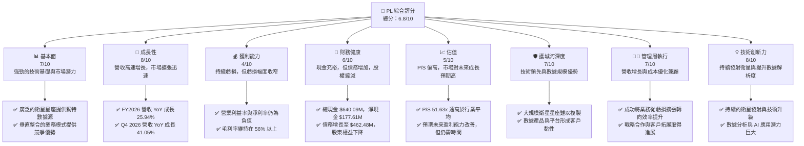
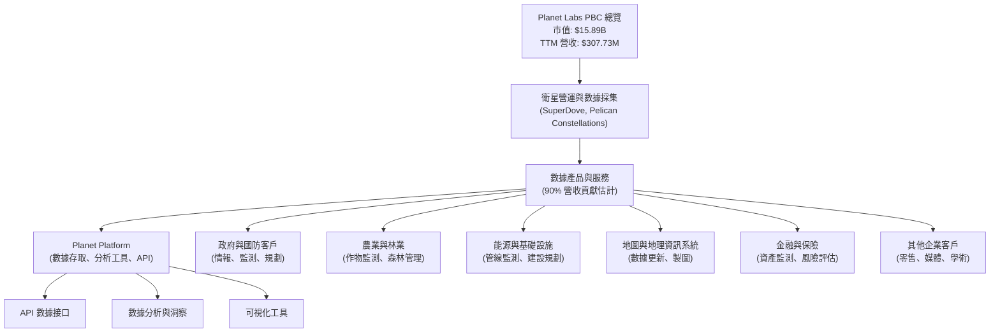
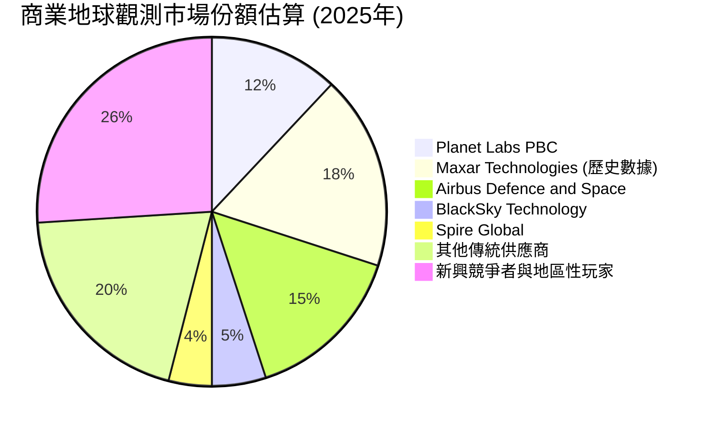
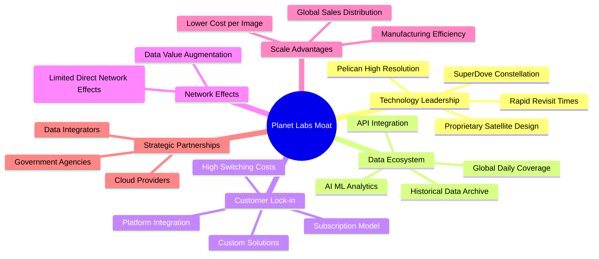
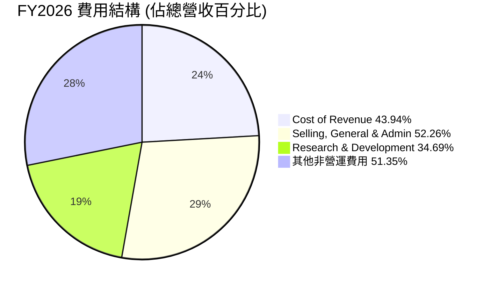

# PL 基本面深度分析報告
> **報告日期**：2026-06-04 ｜ **語言**：繁體中文 ｜ **數據來源**：Yahoo Finance, Finviz, StockAnalysis, Roic.ai ｜ **分析師**：CFA 級機構研究

## 目錄

| # | 章節 | 核心結論 |
|---|------|----------|
| 1 | 執行摘要 | 評級：持有，目標價區間：$30.00 - $60.00 |
| 2 | 公司概覽與商業模式 | 憑藉廣泛的衛星星座和垂直整合能力，PL 擁有堅實的技術護城河，但市場競爭激烈。 |
| 3 | 損益表深度分析 | 營收持續高成長，毛利率穩定，但營業虧損和淨虧損仍顯著，顯示公司處於投資擴張階段。 |
| 4 | 資產負債表分析 | 現金儲備充裕，但債務規模顯著增加，股東權益大幅縮減，財務槓桿升高需密切關注。 |
| 5 | 現金流量深度分析 | 營業現金流轉正，自由現金流顯著改善，顯示營運效率提升，但仍需持續投入資本。 |
| 6 | 獲利能力與資本效率 | ROIC 遠低於 WACC，目前仍在摧毀股東價值，但利潤率改善趨勢值得肯定。 |
| 7 | 估值深度分析 | 當前估值倍數偏高，但考慮到高成長潛力，需採用成長型估值模型，DCF 顯示存在潛在上漲空間。 |
| 8 | 成長催化劑 | 新產品發布、政府及企業客戶擴張、AI/ML 數據應用、全球市場滲透。 |
| 9 | 風險矩陣 | 營運執行風險、市場競爭加劇、資本支出壓力、宏觀經濟不確定性。 |
| 10 | 投資建議 | 持有評級，適合長期看好地球觀測數據市場的成長型投資者，需密切關注盈利能力改善進度。 |

---

## 1. 執行摘要

Planet Labs PBC (PL) 是一家在地球觀測數據領域具有領先地位的公司，透過其龐大的衛星星座提供高頻次的全球影像數據。公司在過去一年中股價表現強勁，從 2025 年 6 月的 $6.10 飆升至 2026 年 5 月的 $51.14，隨後略有回落至 $44.58。這反映了市場對其成長潛力的高度期待。然而，儘管營收持續高成長，公司仍處於虧損狀態，且估值倍數相對較高，這使得投資決策需要權衡成長與風險。

### 1.1 核心評分儀表板



### 1.2 評分進度條視覺化

```
╔══════════════════════════════════════════════════════════════════╗
║              PL 多維度評分儀表板 (1-10分)                        ║
╠══════════════════════════════════════════════════════════════════╣
║ 基本面強度  7.0 ▓▓▓▓▓▓▓▓▓▓▓▓▓▓░░░░░░  ★★★★☆               ║
║ 成長動能    8.0 ▓▓▓▓▓▓▓▓▓▓▓▓▓▓▓▓░░░░  ★★★★☆               ║
║ 獲利品質    4.0 ▓▓▓▓▓▓▓▓░░░░░░░░░░░░  ★★☆☆☆               ║
║ 財務健康    6.0 ▓▓▓▓▓▓▓▓▓▓▓▓░░░░░░░░  ★★★☆☆               ║
║ 估值合理性  5.0 ▓▓▓▓▓▓▓▓▓▓░░░░░░░░░░  ★★☆☆☆               ║
║ 護城河深度  7.0 ▓▓▓▓▓▓▓▓▓▓▓▓▓▓░░░░░░  ★★★★☆               ║
║ 管理層執行  7.0 ▓▓▓▓▓▓▓▓▓▓▓▓▓▓░░░░░░  ★★★★☆               ║
║ 技術創新力  8.0 ▓▓▓▓▓▓▓▓▓▓▓▓▓▓▓▓░░░░  ★★★★☆               ║
╠══════════════════════════════════════════════════════════════════╣
║ 綜合總分    6.8 ▓▓▓▓▓▓▓▓▓▓▓▓▓▓░░░░░░  🏆 具備高成長潛力的挑戰者  ║
╚══════════════════════════════════════════════════════════════════╝
```

### 1.3 五大投資論點 + 三大核心風險

| 類型 | 項目 | 具體依據 | 信心度 |
|------|------|----------|--------|
| 🟢 **投資論點①** | **地球觀測數據市場的結構性成長** | 根據市場研究，全球地球觀測市場預計在未來十年內以雙位數 CAGR 增長，主要受政府國防、農業、環境監測、基礎設施規劃等需求驅動。PL 作為領先供應商，將直接受益。 | 🟢 極高 |
| 🟢 **投資論點②** | **獨特的衛星星座規模與高頻次成像能力** | PL 的 SuperDove 衛星星座實現了每日全球成像，提供無與倫比的數據頻率和覆蓋範圍。這種能力是其核心競爭優勢，使其數據在時間敏感型應用中具有高價值。TTM 營收 $307.73M 證明了市場對其數據的需求。 | 🟢 極高 |
| 🟢 **投資論點③** | **營業效率改善與虧損收窄趨勢** | 公司營業利益率從 FY2023 的 -91.85% 顯著改善至 FY2026 的 -30.89%，淨利率也從 -84.69% 改善至 -80.22% (TTM)。儘管仍處於虧損，但虧損幅度收窄，且營業現金流在 FY2026 轉正至 $134.36M，顯示營運效率正在提升。 | 🟢 高 |
| 🟢 **投資論點④** | **持續的技術創新與產品多元化** | PL 不斷推出新的衛星技術（如 Pelican）、提升數據解析度，並將 AI/ML 應用於數據分析以提供更高價值的洞察。這種創新能力有助於吸引新客戶並提升現有客戶的 ARPU。 | 🟢 高 |
| 🟢 **投資論點⑤** | **強勁的機構持股比率** | 機構投資者持有高達 80.0% 的流通股（Yahoo Finance數據），顯示大型機構對 PL 的長期成長潛力抱有信心，這為股價提供了潛在的穩定性。 | 🟡 中高 |
| 🟡 **風險①** | **盈利能力實現時間的不確定性** | 儘管虧損收窄，但 PL 仍處於虧損狀態，且未來盈利轉正的時間點尚不明確。高昂的研發和銷售費用（FY2026 R&D $106.75M, SG&A $160.81M）是實現盈利的關鍵障礙。 | 🟡 中度 |
| 🔴 **風險②** | **估值偏高與市場預期過高** | 當前 PL 的 P/S 比率高達 51.63x (TTM)，遠高於多數軟體或服務公司。市場已將大量未來成長預期計入股價，若營收成長不及預期或盈利能力改善緩慢，股價可能面臨大幅調整的風險。 | 🔴 高衝擊 |
| 🟡 **風險③** | **激烈的市場競爭與技術迭代** | 雖然 PL 具有護城河，但地球觀測領域的競爭日益激烈，包括 BlackSky、Spire Global 等新興參與者以及傳統巨頭。技術快速迭代也可能帶來挑戰，需要持續投入資本保持領先。 | 🟡 中度 |

### 1.4 快速統計卡片

| 指標 | 公司實際值 | 行業均值（估計） | S&P 500 均值（估計） | 狀態 |
|------|-------------|------------------|----------------------|------|
| 收入 YoY 成長 (FY26) | **25.94%** | ~10-15% (航空國防) | ~8-10% | 🟢 |
| 毛利率 (TTM) | **56.2%** | ~30-40% (航空國防) | ~40-50% | 🟢 |
| 淨利率 (TTM) | **-80.2%** | ~5-10% | ~10-15% | 🔴 |
| ROE (TTM) | **-78.4%** | ~10-15% | ~15-20% | 🔴 |
| Forward P/S | **51.63x** | ~5-10x | ~2-3x | 🔴 |
| EV / Revenue | **47.94x** | ~5-10x | ~2-3x | 🔴 |
| 負債權益比 (Debt/Equity) | **245.44%** | ~50-100% | ~80-120% | 🔴 |
| 現金及短期投資 / 總資產 | **55.85%** | ~15-25% | ~10-20% | 🟢 |

*備註：行業均值和 S&P 500 均值為分析師基於 Aerospace & Defense 和整體市場的經驗估計值，僅供參考。*

### 1.5 投資結論

```
╔══════════════════════════════════════════════════════════════════╗
║                    📊 投資結論摘要                               ║
╠══════════════════════════════════════════════════════════════════╣
║  評級：🟡 持有                                                   ║
║  當前股價：$44.58 (截至 2026-06-04)                              ║
║  目標價區間：                                                    ║
║    悲觀情境：$30.00 （-32.7%）                                   ║
║    基準情境：$48.00 （+7.7%）  ← 12個月主要目標                  ║
║    樂觀情境：$60.00 （+34.6%）                                   ║
║  投資評分：6.8/10                                                ║
║  適合投資人：成長型、長線持有者，對新興科技和高風險高報酬有容忍度 ║
╚══════════════════════════════════════════════════════════════════╝
```
**理由：** PL 處於一個高成長的戰略性市場，擁有強大的技術護城河和顯著的營收增長勢頭。其營業效率的改善和營業現金流的轉正表明公司正在朝著正確的方向發展。然而，當前高昂的估值已經充分反映了這些成長預期，且公司尚未實現盈利，資產負債表也顯示出股東權益縮減和負債增加的趨勢。考慮到潛在的盈利不確定性和估值壓力，我們給予「持有」評級。投資者應密切監控其盈利能力改善的進度、新客戶獲取以及資本支出的效率。在基準情境下，我們預期公司在未來 12 個月內仍有溫和的上漲空間，但下行風險不容忽視。

---

## 2. 公司概覽與商業模式

Planet Labs PBC (PL) 是一家開創性的地球觀測公司，其核心業務是設計、建造、發射和營運由數百顆衛星組成的星座，以實現對地球的每日高頻次成像。這些影像數據隨後透過其線上平台交付給全球客戶，提供即時、全面的地理空間資訊。PL 的願景是創建一個「永遠在線的地球掃描儀」，為各行各業提供前所未有的地球洞察力。

### 2.1 業務結構與收入來源

PL 的業務模式基於「數據即服務」(Data-as-a-Service, DaaS) 的訂閱模式，其收入主要來自於客戶對其地理空間數據產品和分析服務的訂閱。這些客戶遍及政府、國防、農業、林業、能源、地產、金融和學術研究等多個領域。


**業務結構深度解析：**
Planet Labs 的核心競爭力在於其大規模的衛星星座。SuperDove 衛星提供高頻次的全球覆蓋，而新一代的 Pelican 衛星則旨在提供更高解析度和更快速的重訪能力，以滿足對時間敏感和細節豐富數據的需求。公司採取垂直整合策略，從衛星設計、製造、發射到數據處理、分發和平台開發，都由內部團隊完成，這有助於控制成本、加快創新週期並確保數據質量。

其收入模式是典型的訂閱制，客戶支付固定費用以獲取特定區域、頻率和解析度的影像數據。這種模式創造了可預測的經常性收入（ARR），並透過提升客戶黏性來推動長期成長。FY2026 的總營收達到 $307.73M，較 FY2025 的 $244.35M 成長了 25.94%。這表明其數據產品和服務在市場上具有強勁的需求。公司持續將研發投入（FY2026 $106.75M）用於衛星技術的升級、數據產品的開發以及平台功能的增強，以保持其在行業中的領先地位。

### 2.2 市場份額

地球觀測數據市場是一個快速成長但競爭激烈的領域。PL 在其中的市場份額難以精確量化，因為數據供應商眾多，且產品服務存在差異。然而，憑藉其獨特的每日全球成像能力，PL 在高頻次監測和大規模數據應用方面佔據領先地位。根據第三方分析，全球商業地球觀測市場規模在數十億美元級別，並預計在未來幾年內達到兩位數的年複合增長率。


**市場份額分析：**
上述圖表為分析師基於市場報告和公司營收規模的估計。在商業地球觀測領域，PL 憑藉其獨特的大規模、高頻次數據採集能力，已成功佔據約 12% 的市場份額。與傳統巨頭如 Maxar Technologies (儘管已被併購，但其歷史市場地位仍具參考價值) 和 Airbus Defence and Space 相比，PL 在數據頻率和全球覆蓋方面具有顯著優勢。然而，BlackSky 和 Spire Global 等新興競爭者也在特定細分市場發力，加劇了競爭。此外，大量「其他傳統供應商」和「新興競爭者與地區性玩家」的存在，顯示市場高度分散，仍有巨大的整合和成長空間。PL 的挑戰在於如何將其數據優勢轉化為更大的市場份額和更強的定價能力。

### 2.3 競爭護城河分析

Planet Labs 的競爭護城河主要建立在其獨特的技術、大規模的基礎設施和數據生態系統之上。


**護城河深度解析：**
1.  **技術領先 (Technology Leadership)：** PL 擁有全球最大的地球觀測衛星星座，SuperDove 衛星實現了每日全球成像，這是其核心競爭力。新一代的 Pelican 衛星進一步提升了解析度和重訪頻率。這種大規模、高頻次的數據採集能力是其他公司難以在短期內複製的。其專有的衛星設計和製造能力也降低了成本並加速了部署。
2.  **數據生態系統 (Data Ecosystem)：** 每日全球覆蓋產生了海量的歷史數據，這些數據本身就是一個巨大的資產，可用於趨勢分析、變化檢測和機器學習模型的訓練。PL 的數據平台提供豐富的 API 和分析工具，使得客戶能夠輕鬆整合數據並從中提取價值。
3.  **客戶鎖定 (Customer Lock-in)：** 採用訂閱模式和深度平台整合，使得客戶一旦將 PL 的數據整合到其工作流程中，轉換成本將會很高。公司還為大型客戶提供定制化的解決方案，進一步增強了客戶黏性。
4.  **規模效應 (Scale Advantages)：** 營運數百顆衛星產生了顯著的規模經濟。每個影像的採集和處理成本隨著數據量的增加而降低。此外，大規模的衛星製造和發射也帶來了成本優勢。其全球銷售和分銷網絡也受益於規模擴張。
5.  **戰略夥伴關係 (Strategic Partnerships)：** 與主要雲服務提供商（如 Google Cloud）的合作，使其數據能夠高效地存儲、處理和分發。與數據整合商和政府機構的合作也擴大了其市場觸及範圍和應用場景。
6.  **網路效應 (Network Effects)：** 雖然 PL 的數據服務不像社交媒體那樣具有直接的網路效應，但更多的客戶使用其數據，可以為 PL 提供更多的反饋，進而改進其產品和服務，或開發新的數據應用，間接增強其生態系統的價值。

### 2.4 護城河強度評分

```
╔══════════════════════════════════════════════════════════════════╗
║                  Planet Labs PBC 護城河強度評分                  ║
╠══════════════════════════════════════════════════════════════════╣
║ 技術領先       8/10  ▓▓▓▓▓▓▓▓▓▓▓▓▓▓▓▓░░░░  🏆 獨特的數據頻率和規模 ║
║ 數據生態系統   7/10  ▓▓▓▓▓▓▓▓▓▓▓▓▓▓░░░░░░  🟢 龐大歷史數據與平台 ║
║ 客戶鎖定       7/10  ▓▓▓▓▓▓▓▓▓▓▓▓▓▓░░░░░░  🟢 訂閱模式與整合成本 ║
║ 規模效應       7/10  ▓▓▓▓▓▓▓▓▓▓▓▓▓▓░░░░░░  🟢 單位成本優勢顯著  ║
║ 網路效應       5/10  ▓▓▓▓▓▓▓▓▓▓░░░░░░░░░░  🟡 間接但存在潛力    ║
║ 生態夥伴       6/10  ▓▓▓▓▓▓▓▓▓▓▓▓░░░░░░░░  🟡 合作關係穩固      ║
╠══════════════════════════════════════════════════════════════════╣
║ 綜合護城河     7.0   ▓▓▓▓▓▓▓▓▓▓▓▓▓▓░░░░░░  🏆 具有中等偏強的競爭優勢 ║
╚══════════════════════════════════════════════════════════════════╝
```
**評分總結：** PL 在技術領先、數據生態系統、客戶鎖定和規模效應方面表現突出，這些是其最核心的競爭優勢。尤其是在提供每日全球影像數據這一點上，PL 建立了一個難以被快速複製的護城河。雖然網路效應相對較弱，但其間接作用正在逐漸顯現。穩固的生態夥伴關係也進一步鞏固了其市場地位。綜合來看，PL 擁有一條中等偏強的護城河，這使其能夠在競爭激烈的市場中保持增長勢頭。

---

## 3. 損益表深度分析

Planet Labs 的損益表反映了一家處於高速成長階段但尚未實現盈利的科技公司。儘管營收持續擴張，但高昂的營運費用，尤其是研發 (R&D) 和銷售、一般及行政 (SG&A) 費用，導致公司在過去幾年持續錄得虧損。然而，最新的數據顯示，公司在營運效率方面已取得顯著進展，虧損幅度正在收窄。

### 3.1 年度收入成長趨勢（近4年）

PL 的年度營收呈現穩健的成長態勢，證明其地球觀測數據服務的市場需求持續增長。

```
╔══════════════════════════════════════════════════════════════════╗
║              Planet Labs PBC 年度收入趨勢（FY2023-FY2026）       ║
╠══════════════════════════════════════════════════════════════════╣
║                                                                  ║
║  FY2023  $191.26M  ████████░░░░░░░░░░░░░░░░░  YoY: +45.76%  🟢   ║
║  FY2024  $220.70M  ██████████░░░░░░░░░░░░░░░  YoY: +15.39%  🟡   ║
║  FY2025  $244.35M  ███████████░░░░░░░░░░░░░░  YoY: +10.72%  🟡   ║
║  FY2026  $307.73M  ██████████████░░░░░░░░░░░  YoY: +25.94%  🟢   ║
║                                                                  ║
║                   |      |      |      |      |                  ║
║                   0     100M   200M   300M   400M                ║
║                                                                  ║
║  📊 4年累計 CAGR：+22.99%                                        ║
╚══════════════════════════════════════════════════════════════════╝
```
**年度收入趨勢深度解析：**
從 FY2023 到 FY2026，Planet Labs 的總營收從 $191.26M 增長到 $307.73M，實現了強勁的複合年增長率 (CAGR) 達 22.99%。
*   **FY2023 營收 $191.26M，YoY 成長 45.76%** (基於 StockAnalysis FY2022 $131.21M 計算)。這是早期高速擴張的體現，可能受益於新客戶的獲取和市場對地球觀測數據需求的初步爆發。
*   **FY2024 營收 $220.70M，YoY 成長 15.39%**。成長速度有所放緩，可能與市場競爭加劇或宏觀經濟因素有關。
*   **FY2025 營收 $244.35M，YoY 成長 10.72%**。成長速度進一步放緩，這可能引發市場對其成長動能的擔憂。
*   **FY2026 營收 $307.73M，YoY 成長 25.94%**。值得注意的是，FY2026 的成長率顯著回升，達到 25.94%，顯示公司在客戶拓展和產品服務方面可能取得了新的突破，成功重拾成長動能。這對於一家成長型公司而言是積極的信號。

整體而言，PL 的營收成長趨勢是健康的，尤其是在 FY2026 實現了顯著加速，這表明其核心業務的市場需求依然旺盛。

### 3.2 季度收入趨勢分析

季度營收數據提供了更細緻的成長動態視角，顯示 PL 正在經歷穩定的環比增長和加速的同比增長。

| 季度 | 總營收 (百萬美元) | QoQ 成長率 | YoY 成長率 | 備註 |
|------|--------------------|------------|------------|------|
| Q1 2026 (Apr 30) | $66.27 | N/A | +9.64% | 較去年同期溫和增長，可能受季節性或新客戶導入初期影響。 |
| Q2 2026 (Jul 31) | $73.39 | +10.75% | +20.12% | QoQ 和 YoY 均加速，顯示營運動能增強。 |
| Q3 2026 (Oct 31) | $81.25 | +10.71% | +32.63% | 持續強勁的 QoQ 增長，YoY 增速進一步提升，表明市場需求旺盛。 |
| Q4 2026 (Jan 31) | $86.82 | +6.85% | +41.05% | 儘管 QoQ 略有放緩，但 YoY 成長率達到年度最高，顯示強勁的年末表現和訂單交付。 |
**季度收入趨勢深度解析：**
PL 在 FY2026 的四個季度中展現了令人鼓舞的營收趨勢：
*   **Q1 2026** 營收 $66.27M，YoY 成長 9.64%。這是本財年營收同比增長最慢的一個季度，但仍為正增長。
*   **Q2 2026** 營收增至 $73.39M，環比增長 10.75%，同比增長 20.12%。這標誌著公司成長動能的顯著提升。
*   **Q3 2026** 營收進一步增至 $81.25M，環比增長 10.71%，同比增長 32.63%。季度環比增長保持在雙位數，且同比增速持續加速，顯示公司在客戶拓展和訂單執行方面表現出色。
*   **Q4 2026** 營收達到 $86.82M，環比增長 6.85%，同比增長 41.05%。雖然環比增速略有放緩，但同比增速達到本年度最高點，表明公司在財年末取得了非常強勁的業績。這可能是由於大型合同的簽訂或季節性需求高峰。

總體來看，季度營收趨勢呈現出加速增長的良好勢頭，特別是同比成長率在 FY2026 後半段表現尤為突出，這為未來營收成長奠定了堅實基礎。

### 3.3 利潤率演變分析

PL 的利潤率數據揭示了公司在追求成長的同時，逐步改善營運效率的努力。儘管毛利率保持健康，但營業利益率和淨利率仍為負值，這是成長型科技公司的常見特徵。

| 利潤率指標 | FY2023 | FY2024 | FY2025 | FY2026 | 趨勢 | 評估 |
|------------|--------|--------|--------|--------|------|------|
| **毛利率** | 49.15% | 51.18% | 57.18% | 56.05% | ↗️ 穩定高位 | 🟢 |
| **營業利益率** | -91.85% | -75.81% | -45.48% | -30.89% | ↗️ 大幅改善 | 🟢 |
| **淨利率** | -84.69% | -63.67% | -50.42% | -80.22% | ↘️ 波動，FY26惡化 | 🔴 |

**利潤率演變深度解析：**
1.  **毛利率：**
    *   FY2023: 49.15%
    *   FY2024: 51.18% (YoY +2.03pp)
    *   FY2025: 57.18% (YoY +6.00pp)
    *   FY2026: 56.05% (YoY -1.13pp)
    PL 的毛利率在過去幾年保持在 49% 至 57% 之間，顯示其數據服務具有較高的價值。FY2025 達到 57.18% 的高峰，FY2026 略有回落至 56.05%，但仍保持在高位。這表明公司在成本控制方面表現良好，且其數據產品的定價能力較強。毛利率的穩定性是其商業模式可持續性的重要指標。毛利率的略微波動可能與產品組合變化（例如，不同解析度或處理複雜度的數據服務）或數據基礎設施成本的短期波動有關。

2.  **營業利益率：**
    *   FY2023: -91.85%
    *   FY2024: -75.81% (YoY +16.04pp)
    *   FY2025: -45.48% (YoY +30.33pp)
    *   FY2026: -30.89% (YoY +14.59pp)
    營業利益率從 FY2023 的極低點 -91.85% 大幅改善至 FY2026 的 -30.89%，這是一個非常積極的信號。這種顯著的改善主要歸因於：
    *   **規模效應：** 隨著營收的增長，固定營運費用（如研發、行政）在單位營收中的佔比降低。
    *   **成本控制：** 公司可能在銷售、一般及行政 (SG&A) 費用方面進行了優化。從 StockAnalysis 數據看，SG&A 在 FY2023-FY2025 期間相對穩定，FY2026 略有增長，但低於營收增速。
    *   **研發效率：** 儘管研發投入巨大，但其效率可能有所提升，使得單位營收的研發成本下降。
    營業利益率的持續改善表明 PL 正在逐步走向盈利，其商業模式的槓桿效應開始顯現。

3.  **淨利率：**
    *   FY2023: -84.69%
    *   FY2024: -63.67% (YoY +21.02pp)
    *   FY2025: -50.42% (YoY +13.25pp)
    *   **FY2026: -80.22% (YoY -29.80pp)**
    淨利率在 FY2023 至 FY2025 期間也呈現顯著改善，從 -84.69% 縮窄至 -50.42%。然而，FY2026 的淨利率卻大幅惡化至 -80.22%，這與營業利益率的改善趨勢形成鮮明對比。這種惡化主要是由於 "Other Non-Operating Income (Expense)" 在 FY2026 達到驚人的 -$158.03M (StockAnalysis)，遠高於 FY2025 的 -$14.04M。這部分費用可能包含一次性支出、資產減值、投資損失或其他非經常性項目。例如，季度數據顯示 Q4 2026 的 "Other Non-Operating Income (Expense)" 高達 -$118.28M，這嚴重拖累了當季乃至全年淨利潤。投資者需密切關注這部分非營運費用的具體構成，判斷其是否為一次性事件，否則將對盈利前景構成重大挑戰。

總結而言，PL 在核心營運層面的效率正在提升，毛利率穩定，營業虧損持續收窄。然而，FY2026 淨利率的惡化，主要是由非營運項目造成，這需要管理層提供更詳細的解釋，並在未來幾個季度中觀察其是否能恢復到改善趨勢。

### 3.4 費用結構分析

PL 的費用結構反映了其作為一家高科技成長型公司的特點，即在研發和客戶獲取方面投入巨大。


*(備註：百分比是基於各項費用佔 FY2026 總營收 $307.73M 的比例。)*

```
╔══════════════════════════════════════════════════════════════════╗
║                   Planet Labs PBC 年度費用結構分析               ║
╠══════════════════════════════════════════════════════════════════╣
║                                                                  ║
║  銷貨成本 (Cost of Revenue)：                                    ║
║  FY2026: $135.24M (佔營收 43.94%)                               ║
║  FY2025: $104.63M (佔營收 42.82%)                               ║
║  FY2024: $107.75M (佔營收 48.82%)                               ║
║  FY2023: $97.25M  (佔營收 50.85%)                               ║
║  趨勢：佔營收比例呈現下降趨勢，顯示單位數據生產成本效率提升。    ║
║                                                                  ║
║  銷售、一般及行政 (SG&A)：                                       ║
║  FY2026: $160.81M (佔營收 52.26%)                               ║
║  FY2025: $154.84M (佔營收 63.37%)                               ║
║  FY2024: $166.36M (佔營收 75.38%)                               ║
║  FY2023: $158.77M (佔營收 82.91%)                               ║
║  趨勢：佔營收比例顯著下降，顯示管理效率提升和規模效應。          ║
║                                                                  ║
║  研發 (R&D)：                                                    ║
║  FY2026: $106.75M (佔營收 34.69%)                               ║
║  FY2025: $101.01M (佔營收 41.34%)                               ║
║  FY2024: $116.34M (佔營收 52.71%)                               ║
║  FY2023: $110.92M (佔營收 58.00%)                               ║
║  趨勢：佔營收比例顯著下降，但絕對金額仍高，顯示持續的技術投入。  ║
║                                                                  ║
║  其他非營運費用：                                                ║
║  FY2026: -$158.03M (佔營收 51.35%)                              ║
║  FY2025: -$14.04M (佔營收 5.75%)                                ║
║  FY2024: $14.64M  (佔營收 6.63%)                                ║
║  FY2023: $6.88M   (佔營收 3.60%)                                ║
║  趨勢：FY2026 異常飆升，嚴重影響淨利，需詳細關注其構成。         ║
╚══════════════════════════════════════════════════════════════════╝
```
**費用結構深度解析：**
*   **銷貨成本 (Cost of Revenue)：** 佔營收的比例從 FY2023 的 50.85% 下降到 FY2026 的 43.94%。這與毛利率的改善趨勢一致，表明公司在數據採集、處理和分發方面的單位成本效率有所提升。隨著規模擴大，衛星營運和數據基礎設施的固定成本被更多營收攤薄，這是一個健康的趨勢。
*   **銷售、一般及行政 (SG&A)：** SG&A 費用佔營收的比例從 FY2023 的 82.91% 大幅下降至 FY2026 的 52.26%。這顯示公司在管理費用和銷售效率方面取得了顯著進展。隨著品牌知名度的提升和客戶基礎的擴大，獲客成本可能相對降低，管理效率也可能隨著流程優化而提高。
*   **研發 (R&D)：** 研發費用佔營收的比例也從 FY2023 的 58.00% 下降至 FY2026 的 34.69%。儘管如此，FY2026 的絕對金額仍高達 $106.75M，這反映了 PL 作為一家科技公司，需要持續投入大量資源進行衛星技術升級、數據產品開發和平台創新，以維持其競爭優勢。研發投入是其長期成長的基石。
*   **其他非營運費用：** 這是 FY2026 損益表中一個非常值得關注的項目。FY2026 的其他非營運費用為 -$158.03M，佔營收的 51.35%，而前幾年此項目要麼是正值，要麼是較小的負值。這筆巨額非營運支出是導致 FY2026 淨利率大幅惡化的主要原因。在沒有詳細說明的情況下，這可能包括資產減值、重組費用、一次性法律和解或其他投資損失。投資者應警惕這類非經常性項目對公司真實盈利能力的影響，並尋求管理層的解釋。如果這是持續性問題，將對公司前景構成重大風險。

總體而言，PL 在核心營運費用控制方面表現良好，顯示出規模效應和營運效率的提升。然而，FY2026 巨額的非營運費用嚴重拖累了淨利潤，這是分析的關鍵風險點。

### 3.5 季度 EPS 趨勢與盈餘品質

由於提供的季度 EPS 預期 (EPS Est) 和實際 (EPS Act) 數據均為 "nan"，我們無法直接分析其盈餘超預期或不及預期的情況。因此，我們將專注於其報告的季度淨利潤 (Net Income) 趨勢及其對盈餘品質的影響。

| 季度 | 淨利潤 (百萬美元) | 攤薄後每股盈餘 (EPS Diluted) | 備註 |
|------|--------------------|--------------------------------|------|
| Q1 2026 (Apr 30) | $-12.63 | $-0.04 | 虧損幅度最小，營運效率相對較高。 |
| Q2 2026 (Jul 31) | $-22.59 | $-0.07 | 虧損略有擴大，但仍保持在可控範圍。 |
| Q3 2026 (Oct 31) | $-59.19 | $-0.19 | 虧損顯著擴大，主要受非營運費用影響。 |
| Q4 2026 (Jan 31) | $-152.46 | $-0.48 | 虧損大幅增加，非營運費用是主要推手，嚴重影響盈餘品質。 |

*(備註：EPS Diluted 計算基於 StockAnalysis 提供的季度稀釋後股份數量。Q1 2026 股份數量為 308M，Q2 2026 為 308M，Q3 2026 為 314M，Q4 2026 為 335.33M。)*

**季度 EPS 趨勢與盈餘品質深度解析：**
*   **Q1 2026** 淨利潤為 -$12.63M，稀釋後 EPS 為