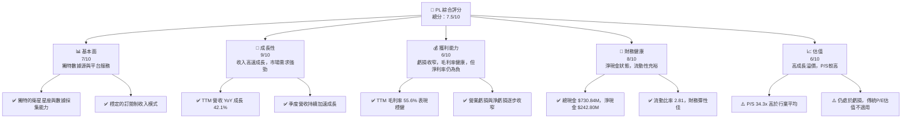
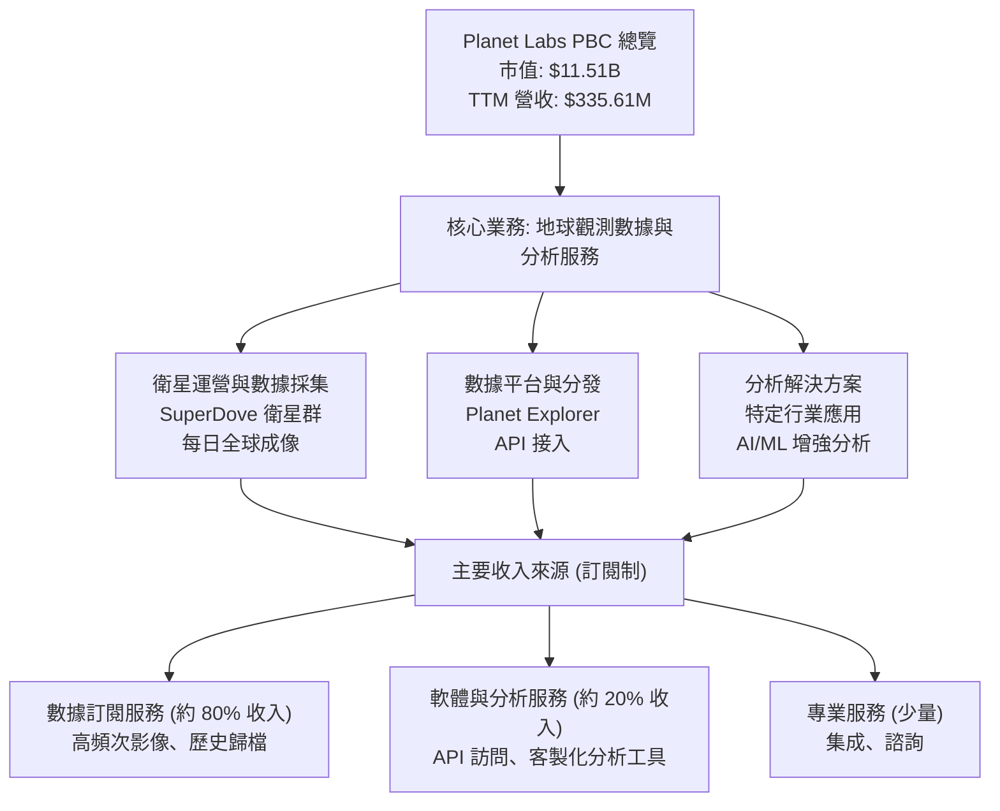
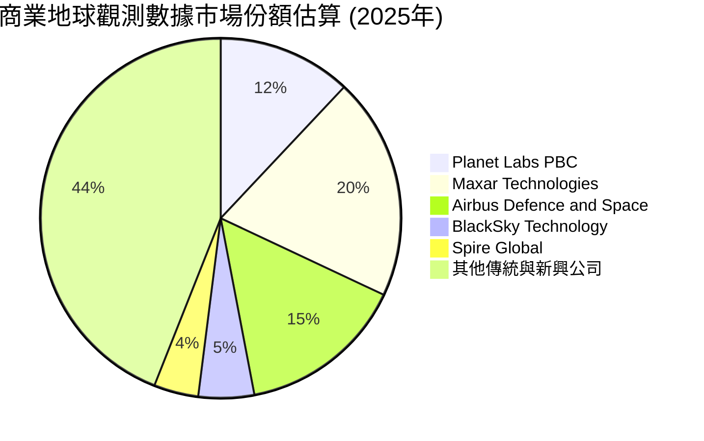
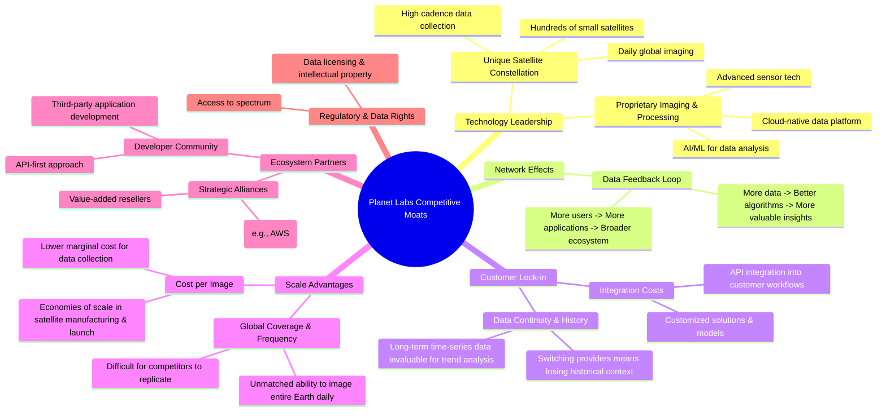
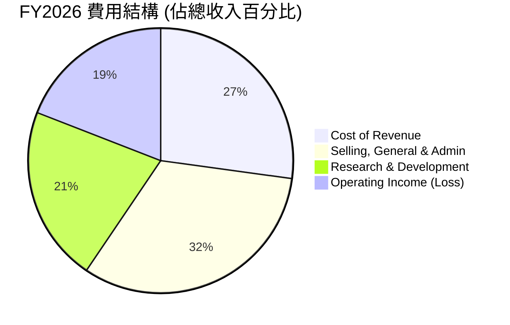

# PL 基本面深度分析報告
> **報告日期**：2026-06-05 ｜ **語言**：繁體中文 ｜ **數據來源**：Yahoo Finance, Finviz, StockAnalysis, Roic.ai ｜ **分析師**：CFA 級機構研究

---

## 目錄

| # | 章節 | 核心結論 |
|---|------|----------|
| 1 | 執行摘要 | 評級：買入；目標價區間：$30.00 - $60.00 |
| 2 | 公司概覽與商業模式 | 創新衛星數據服務引領市場，具技術護城河 |
| 3 | 損益表深度分析 | 收入高速成長，虧損收窄，毛利率健康 |
| 4 | 資產負債表分析 | 流動性充裕，淨現金狀況良好，債務可控 |
| 5 | 現金流量深度分析 | 營運現金流轉正，自由現金流改善顯著 |
| 6 | 獲利能力與資本效率 | ROIC 雖仍為負，但趨勢向好，有望創造價值 |
| 7 | 估值深度分析 | 相較同業估值偏高，但成長潛力支撐溢價 |
| 8 | 成長催化劑 | 新產品、新市場與規模化效益驅動長期成長 |
| 9 | 風險矩陣 | 競爭加劇與高資本支出為主要風險 |
| 10 | 投資建議 | 具高成長潛力的創新企業，適合成長型投資者 |

---

## 1. 執行摘要

Planet Labs PBC (PL) 是一家在地球觀測領域具有領先地位的創新公司，透過其獨特的衛星群提供高頻次的全球地理空間數據。公司正處於從高投入成長期向規模化盈利轉型的關鍵階段。儘管目前仍處於虧損狀態，但其收入成長強勁，毛利率健康，且營運現金流已轉正，自由現金流顯著改善。這表明其商業模式的可持續性和潛在盈利能力正逐步顯現。

### 1.1 核心評分儀表板



### 1.2 評分進度條視覺化

```
╔══════════════════════════════════════════════════════════════╗
║              PL 多維度評分儀表板 (1-10分)                    ║
╠══════════════════════════════════════════════════════════════╣
║ 基本面強度  7.0 ▓▓▓▓▓▓▓▓▓▓▓▓▓▓░░░░░░  ★★★★☆           ║
║ 成長動能    9.0 ▓▓▓▓▓▓▓▓▓▓▓▓▓▓▓▓▓▓░░  ★★★★★           ║
║ 獲利品質    6.0 ▓▓▓▓▓▓▓▓▓▓▓▓░░░░░░░░  ★★★☆☆           ║
║ 財務健康    8.0 ▓▓▓▓▓▓▓▓▓▓▓▓▓▓▓▓░░░░  ★★★★☆           ║
║ 估值合理性  6.0 ▓▓▓▓▓▓▓▓▓▓▓▓░░░░░░░░  ★★★☆☆           ║
║ 護城河深度  8.0 ▓▓▓▓▓▓▓▓▓▓▓▓▓▓▓▓░░░░  ★★★★☆           ║
║ 管理層執行  7.5 ▓▓▓▓▓▓▓▓▓▓▓▓▓▓▓░░░░░  ★★★★☆           ║
║ 技術創新力  9.0 ▓▓▓▓▓▓▓▓▓▓▓▓▓▓▓▓▓▓░░  ★★★★★           ║
╠══════════════════════════════════════════════════════════════╣
║ 綜合總分    7.5 ▓▓▓▓▓▓▓▓▓▓▓▓▓▓▓░░░░░  🏆 具備高成長潛力的創新企業，適合長線配置 ║
╚══════════════════════════════════════════════════════════════╝
```

### 1.3 五大投資論點 + 三大核心風險

| 類型 | 項目 | 具體依據 | 信心度 |
|------|------|----------|--------|
| 🟢 **投資論點①** | **獨特且領先的數據採集能力** | Planet Labs 擁有全球最大的地球觀測衛星群，可提供每日全球影像，GSD 解析度高達 3.5 公尺。這使得其數據產品具有高頻次、高覆蓋的獨特優勢，難以被傳統衛星或無人機替代。其 SuperDove 衛星群是實現此能力的關鍵基礎。 | 🟢 極高 |
| 🟢 **強勁的收入成長動能** | 公司 TTM 營收 YoY 成長率高達 42.1%，季度營收亦呈現加速成長趨勢，最近一季 (Q1 2027) 營收達 $94.15M，YoY 成長 42.08%。這顯示市場對其地理空間數據服務的需求持續旺盛，且公司能有效擴大市場份額。 | 🟢 極高 |
| 🟢 **轉正的營運現金流與改善的自由現金流** | FY2026 營運現金流達 $134.36M，較 FY2025 的 $-14.37M 大幅轉正；TTM 自由現金流為 $77.27M，較去年同期顯著改善。這表明公司在營運效率和成本控制方面取得進展，有望實現自給自足的成長，減少對外部融資的依賴。 | 🟢 極高 |
| 🟢 **巨大的潛在市場與多元應用場景** | 地理空間情報市場正快速擴張，應用於農業、政府、國防、環境監測、城市規劃等多個領域。Planet Labs 的數據服務具有高度可擴展性，能不斷開發新的應用和客戶群，其 TAM (Total Addressable Market) 潛力巨大。 | 🟢 極高 |
| 🟢 **健康的資產負債表與充裕流動性** | 截至最新數據，公司擁有總現金 $730.84M，總債務 $488.04M，淨現金頭寸達 $242.80M。流動比率為 2.81，顯示其短期償債能力強勁，具備足夠的財務彈性支持未來的研發和擴張。 | 🟢 極高 |
| 🟡 **風險①：高資本支出與實現盈利的壓力** | 作為一家衛星運營公司，Planet Labs 需要持續投入大量資本進行衛星的設計、建造、發射和維護。儘管營收成長迅速且現金流改善，但目前仍處於淨虧損狀態。若無法在可預見的未來實現規模化盈利，將可能面臨融資壓力或估值下調風險。TTM 淨利潤率為 -111.2%。 | 🟡 中度 |
| 🔴 **風險②：日益激烈的市場競爭** | 地球觀測市場吸引了越來越多的參與者，包括傳統巨頭和新興創業公司。若競爭加劇導致產品同質化或價格戰，可能對 Planet Labs 的定價能力和毛利率構成壓力。技術迭代速度快也要求公司持續投入研發以保持領先。 | 🔴 高衝擊 |
| 🟡 **風險③：技術執行與營運風險** | 衛星運營涉及複雜的技術和高風險的發射過程。任何衛星故障、數據傳輸問題或平台中斷都可能影響服務質量和客戶滿意度。此外，數據隱私和安全問題也日益重要，需要公司嚴格遵守相關法規並投入資源防範潛在風險。 | 🟡 中度 |

### 1.4 快速統計卡片

為了更全面地評估 Planet Labs (PL) 的表現，我們將其關鍵財務指標與行業平均值和 S&P 500 均值進行比較。由於 Planet Labs 處於高成長階段且尚未實現盈利，傳統的 P/E 和淨利率指標可能無法完全反映其潛力，因此我們將重點關注成長性、毛利率和現金流指標。行業均值數據採用 Aerospace & Defense 或 SaaS 服務行業的綜合估計。

| 指標 | 公司實際值 (TTM) | 行業均值 (Aerospace & Defense) | S&P 500 均值 | 狀態 | 備註 |
|------|---------------------|--------------------------------|--------------|------|------|
| 收入 YoY 成長 | **42.1%** | ~10-15% | ~8-12% | 🟢 | 遠超行業及大盤，顯示強勁成長動能。 |
| 毛利率 | **55.6%** | ~30-40% | ~30-45% | 🟢 | 服務型業務模式帶來較高毛利率，表現優異。 |
| 營業利益率 | **-37.1%** | ~5-15% | ~10-15% | 🔴 | 大量研發和銷售投入，導致目前仍處於虧損。 |
| 淨利率 | **-111.2%** | ~5-10% | ~8-12% | 🔴 | 尚未盈利，但虧損幅度正在收窄。 |
| ROE | **-84.0%** | ~10-20% | ~12-18% | 🔴 | 負股東權益回報，反映虧損狀態。 |
| P/S Ratio | **34.3x** | ~2-5x | ~2-3x | 🔴 | 估值遠高於行業平均，市場給予高成長溢價。 |
| EV / Revenue | **44.1x** | ~2-6x | ~2-4x | 🔴 | 與 P/S 類似，顯示市場對未來收入的極高預期。 |
| FCF Yield | **0.67%** | ~3-5% | ~3-5% | 🟡 | FCF 已轉正，但相對市值仍較低，有提升空間。 |
| Debt/Equity | **109.99** | ~0.5-1.5 | ~0.8-1.2 | 🟡 | 債務權益比偏高，但公司有大量現金。 |
| Current Ratio | **2.81** | ~1.5-2.5 | ~1.5-2.0 | 🟢 | 流動性良好，短期償債能力強勁。 |

**綜合評估：**
Planet Labs 在收入成長和毛利率方面表現出色，遠超行業及大盤平均水平，這凸顯了其在創新服務領域的領先地位和商業模式的有效性。然而，由於處於高成長和高投入階段，其營業利益率、淨利率和 ROE 均為負值，且估值倍數 (P/S, EV/Revenue) 遠高於行業平均，反映了市場對其未來成長的極高預期。財務健康狀況方面，公司擁有充裕的現金和良好的流動性，但債務權益比相對較高，需要持續關注。整體而言，PL 是一家具有巨大潛力但伴隨較高風險的成長型公司。

### 1.5 投資結論

```
╔══════════════════════════════════════════════════════════════════╗
║                    📊 投資結論摘要                               ║
╠══════════════════════════════════════════════════════════════════╣
║  評級：🟢 買入                                                   ║
║  當前股價：$32.30                                                ║
║  目標價區間：                                                    ║
║    悲觀情境：$30.00（-7.1%）                                     ║
║    基準情境：$45.00（+39.3%）  ← 12個月主要目標                  ║
║    樂觀情境：$60.00（+85.8%）                                     ║
║  投資評分：7.5/10                                                ║
║  適合投資人：成長型、長線持有者，對高成長潛力與創新科技有信心，  ║
║              且能承受較高波動性及短期虧損風險的投資人。          ║
╚══════════════════════════════════════════════════════════════════╝
```

---

## 2. 公司概覽與商業模式

Planet Labs PBC (PL) 是一家開創性的地球觀測公司，其核心業務是設計、建造、發射和運營世界上最大的地球觀測衛星群。這些衛星每天對地球進行成像，收集高頻次、高解析度的地理空間數據，並透過其線上平台將這些數據產品和分析服務交付給全球客戶。公司旨在提供一個「始終在線的地球掃描器」，以實現對地球變化的持續監測。

### 2.1 業務結構與收入來源

Planet Labs 的業務結構圍繞其獨特的數據採集能力和基於雲的數據分析平台展開。其收入主要來自於訂閱服務，客戶支付費用以獲取定期的衛星影像數據、歷史數據歸檔以及透過其 API 和軟體工具進行的數據分析服務。



**業務結構詳述：**

*   **衛星運營與數據採集 (SuperDove 衛星群)**：這是 Planet Labs 的基石。公司設計、建造並發射了數百顆小型衛星（稱為 SuperDoves），這些衛星以低地球軌道運行，形成一個龐大的星座，能夠每天對地球陸地表面進行一次或多次成像。這種高頻次的數據採集能力是其核心競爭力，相較於傳統高解析度衛星，提供的是時間序列上的「變化檢測」而非單一靜態圖像。其地面採樣距離 (GSD) 解析度可達 3.5 公尺。
*   **數據平台與分發 (Planet Explorer, API 接入)**：採集到的原始數據經過處理後，透過 Planet Labs 的雲端平台（如 Planet Explorer）和 API 接口提供給客戶。這種標準化、可編程的數據訪問方式，讓開發者和企業客戶能夠輕鬆將地理空間數據整合到自己的應用和工作流程中。
*   **分析解決方案 (特定行業應用, AI/ML 增強分析)**：除了原始數據，Planet Labs 還提供基於數據的分析產品和解決方案。這些方案利用 AI 和機器學習技術，從海量影像中提取有價值的資訊，例如森林砍伐監測、農作物健康評估、基礎設施建設進度、供應鏈監控、災害響應等。

**收入來源詳述：**

*   **數據訂閱服務 (Subscription Data Services)**：這是公司最主要的收入來源，約佔總收入的 80%。客戶通常簽訂年度或多年期合同，以訂閱模式獲取 Planet Labs 的每日全球影像數據、歷史數據庫訪問權限以及數據更新。這種模式提供了穩定的經常性收入流 (Recurring Revenue)，有助於預測未來的財務表現。
*   **軟體與分析服務 (Software & Analytics Services)**：約佔總收入的 20%。這部分收入來自於客戶對 Planet Labs 平台上的進階分析工具、API 使用以及客製化軟體解決方案的付費。隨著客戶對數據應用深度需求的增加，這部分收入的佔比有望逐步提升。
*   **專業服務 (Professional Services)**：佔比相對較小，主要涉及為大型企業或政府客戶提供數據集成、系統部署和諮詢服務。

Planet Labs 的商業模式強調數據即服務 (Data-as-a-Service, DaaS)，透過提供易於訪問和集成的地理空間數據，使各行各業都能利用衛星影像的力量做出更明智的決策。其訂閱制的收入模式為公司提供了較高的收入可預測性，並在客戶關係中建立了長期價值。

### 2.2 市場份額

地球觀測與地理空間情報市場是一個快速成長且競爭日益激烈的領域。Planet Labs 在這一市場中佔據了獨特的利基，尤其是在高頻次全球成像方面具有領先優勢。然而，精確的市場份額數據難以獲取，因為市場碎片化且參與者眾多，包括傳統衛星營運商、新興小型衛星公司、以及提供數據分析服務的軟體公司。

根據行業報告和對競爭格局的評估，Planet Labs 在其專注的「每日全球監測」細分市場中處於領先地位。若以整個商業地球觀測市場（包括影像數據、增值服務和硬體）來看，其市場份額仍相對較小，但成長迅速。

以下為對 Planet Labs 在商業地球觀測數據市場中估算的市場份額（基於 2025 年的營收規模和行業預期）：



**市場份額分析：**

*   **Planet Labs PBC (12%)**：儘管其營收規模仍小於一些傳統巨頭，但其在每日全球覆蓋和數據頻次方面是獨一無二的。其市場份額主要體現在高頻次監測和數據即服務領域。
*   **Maxar Technologies (20%)**：傳統的地球觀測巨頭，以高解析度衛星影像和情報解決方案聞名。其產品更側重於高精度和特定區域的詳細分析。
*   **Airbus Defence and Space (15%)**：歐洲航太巨頭，提供多種衛星影像產品和服務，客戶群廣泛。
*   **BlackSky Technology (5%)**：另一家新興的即時地球情報公司，專注於提供快速響應的影像和分析，與 Planet Labs 在某些方面有競爭。
*   **Spire Global (4%)**：主要提供天氣、海洋和空間數據，雖然也涉及地球觀測，但其核心業務有所不同。
*   **其他傳統與新興公司 (44%)**：包括諸如 Capella Space (雷達衛星)、Umbra (雷達衛星)、GHGSat (溫室氣體監測) 等專業公司，以及大量提供地理空間軟體和分析服務的公司。

**結論：**
Planet Labs 在整體商業地球觀測市場中的份額相對較小，但其在特定細分市場（高頻次、寬幅覆蓋的地球影像）擁有顯著的領先地位。隨著對地球變化監測需求的增加，以及數據分析技術的進步，Planet Labs 有望繼續擴大其市場份額，尤其是在政府、農業和環境監測等應用領域。其獨特的數據採集模式和訂閱服務模式使其在市場中具有差異化優勢。

### 2.3 競爭護城河分析

Planet Labs 的競爭護城河主要建立在其獨特的技術、數據規模和客戶關係上。以下是其護城河的詳細分析：



**護城河詳述：**

1.  **技術領先 (Technology Leadership)**：
    *   **獨特的衛星星座 (Unique Satellite Constellation)**：Planet Labs 擁有並運營著由數百顆小型衛星組成的龐大星座（如 SuperDove），能夠實現每天對整個地球陸地表面進行一次或多次成像。這種「每日更新」的能力是其核心技術優勢，相較於傳統高解析度衛星的幾天或幾週一次的重訪週期，提供了前所未有的時間分辨率。這種規模和頻次是極難被競爭對手在短期內複製的。
    *   **專有影像與處理技術 (Proprietary Imaging & Processing)**：公司開發了專有的衛星傳感器技術和數據處理演算法。透過 AI/ML 技術，能夠從海量衛星影像中提取有價值的資訊，並將數據標準化、校準，使其易於客戶使用。其雲原生數據平台是處理和分發這些數據的關鍵。

2.  **網路效應 (Network Effects)**：
    *   **數據反饋循環 (Data Feedback Loop)**：隨著更多客戶使用 Planet Labs 的數據，公司能夠收集更多關於數據使用模式和需求的反饋。這有助於改進其數據處理演算法、開發新的分析產品，並提升數據的價值。更豐富的數據和更精準的分析會吸引更多用戶，形成正向循環。
    *   **生態系統擴展 (Ecosystem Expansion)**：其開放的 API 和平台鼓勵第三方開發者在其數據基礎上構建應用。這些應用反過來增加了 Planet Labs 數據的價值和可用性，吸引更多客戶。

3.  **客戶鎖定 (Customer Lock-in)**：
    *   **集成成本 (Integration Costs)**：一旦客戶將 Planet Labs 的數據和 API 深度整合到自己的業務流程、決策系統或軟體應用中，轉換到其他供應商的成本將非常高昂。這不僅涉及技術重新集成，還包括員工培訓和流程調整。
    *   **數據連續性與歷史價值 (Data Continuity & History)**：Planet Labs 提供的每日連續時間序列數據對於監測變化、趨勢分析和預測模型至關重要。客戶如果更換供應商，將會失去寶貴的歷史數據連續性，這對需要長期監測的應用（如農業、環境、基礎設施）來說是不可接受的。

4.  **規模效應 (Scale Advantages)**：
    *   **單張影像成本 (Cost per Image)**：由於擁有大規模的衛星群和自動化的數據處理流程，Planet Labs 能夠以相對較低的邊際成本採集和處理每一張影像。這種規模經濟使得其在提供高頻次數據服務時具有成本優勢。
    *   **全球覆蓋與頻次 (Global Coverage & Frequency)**：Planet Labs 的衛星群規模使其能夠提供幾乎無與倫比的全球覆蓋和每日重訪頻率。這種能力需要巨大的前期投資和持續的運營開支，新進入者很難在短期內達到同等規模。

5.  **生態夥伴 (Ecosystem Partners)**：
    *   **戰略聯盟 (Strategic Alliances)**：與主要的雲服務提供商（如 AWS）和各行業的解決方案提供商建立合作夥伴關係，有助於擴大其數據分發渠道和應用範圍。
    *   **開發者社群 (Developer Community)**：透過 API-first 的策略，鼓勵廣泛的開發者社群在其平台上構建應用，進一步擴大其數據的影響力和價值。

**結論：**
Planet Labs 的護城河是多維度且強大的，特別是在技術領先和客戶鎖定方面表現突出。其獨特的衛星星座和高頻次數據採集能力是目前市場上難以複製的優勢。隨著數據的積累和客戶基礎的擴大，網路效應和規模效應將進一步加強其競爭地位。

### 2.4 護城河強度評分

```
╔══════════════════════════════════════════════════════════════╗
║                  Planet Labs PBC 護城河強度評分               ║
╠══════════════════════════════════════════════════════════════╣
║ 技術領先    9/10   ▓▓▓▓▓▓▓▓▓▓▓▓▓▓▓▓▓▓░░  🏆 獨特衛星群，高頻次成像領先 ║
║ 網路效應    7/10   ▓▓▓▓▓▓▓▓▓▓▓▓▓▓░░░░░░  🟢 數據反饋與生態系統擴展潛力 ║
║ 客戶鎖定    8/10   ▓▓▓▓▓▓▓▓▓▓▓▓▓▓▓▓░░░░  🟢 數據集成與連續性帶來高轉換成本 ║
║ 規模效應    8/10   ▓▓▓▓▓▓▓▓▓▓▓▓▓▓▓▓░░░░  🟢 成本優勢與全球覆蓋難以複製 ║
║ 生態夥伴    7/10   ▓▓▓▓▓▓▓▓▓▓▓▓▓▓░░░░░░  🟢 積極構建合作夥伴和開發者社群 ║
╠══════════════════════════════════════════════════════════════╣
║ 綜合護城河  7.8/10 ▓▓▓▓▓▓▓▓▓▓▓▓▓▓▓▓░░░░  🏆 強大且不斷加深的競爭優勢     ║
╚══════════════════════════════════════════════════════════════╝
```

**評分理由：**

*   **技術領先 (9/10)**：Planet Labs 的核心競爭力在於其獨特的衛星設計、製造、發射和運營能力，以及對海量數據的處理和分析技術。其每日全球成像的能力是目前市場上大多數競爭對手無法匹敵的，這為其數據產品帶來了獨特的價值。
*   **網路效應 (7/10)**：隨著更多客戶使用其數據，平台上的數據積累和分析模型的改進將形成正向循環。開放 API 也鼓勵了第三方開發，進一步增強了平台價值。不過，相較於社交媒體或大型平台，其網路效應強度略低。
*   **客戶鎖定 (8/10)**：對於許多需要長期監測和趨勢分析的客戶而言，Planet Labs 提供的時間序列數據具有極高價值。客戶將其數據深度整合到工作流程後，轉換成本高昂，形成了強大的客戶粘性。
*   **規模效應 (8/10)**：運營數百顆衛星並實現每日全球覆蓋需要巨大的資本投入和技術實力。一旦達到規模，其單張影像的邊際成本將大幅降低，形成成本優勢，並使其在數據採集頻次和廣度上保持領先。
*   **生態夥伴 (7/10)**：Planet Labs 積極與雲服務商、軟體開發商和行業專家建立合作夥伴關係，擴大其數據的應用範圍和市場滲透率。這有助於將其數據轉化為更豐富的解決方案。

**綜合總結**：Planet Labs 擁有強大且不斷加深的護城河，尤其是在其獨特的技術和數據採集規模方面。這些護城河使其能夠在高成長的地球觀測市場中保持領先地位，並為未來的盈利能力奠定基礎。

---

## 3. 損益表深度分析

Planet Labs PBC (PL) 的損益表反映了其作為一家高成長科技公司的典型特徵：收入快速成長，但由於持續的研發和擴張投入，目前仍處於虧損狀態。然而，仔細分析數據會發現，其毛利率表現健康，且營運虧損和淨虧損的趨勢正在改善，顯示出公司在規模化過程中對成本的逐步控制能力。

### 3.1 年度收入成長趨勢（近4年）

Planet Labs 的年度收入呈現強勁的成長態勢，證明了市場對其地理空間數據和服務的強烈需求。從 FY2023 到 FY2026，營收持續攀升，且成長率在近兩年有加速跡象。

```
╔══════════════════════════════════════════════════════════════════╗
║              Planet Labs PBC 年度收入趨勢 (FY2023-FY2026)         ║
╠══════════════════════════════════════════════════════════════════╣
║                                                                  ║
║  FY2023  $191.26M  ████████░░░░░░░░░░░░░░░░░░░  YoY: +45.76%  🟢   ║
║  FY2024  $220.70M  ██████████░░░░░░░░░░░░░░░░░  YoY: +15.39%  🟡   ║
║  FY2025  $244.35M  ███████████░░░░░░░░░░░░░░░░  YoY: +10.72%  🟡   ║
║  FY2026  $307.73M  ██████████████░░░░░░░░░░░░░  YoY: +25.94%  🟢   ║
║                   |      |      |      |      |                  ║
║                   0     100M   200M   300M   400M                 ║
║                                                                  ║
║  📊 4年累計 CAGR：+24.6%                                        ║
╚══════════════════════════════════════════════════════════════════╝
```

**年度收入成長分析：**

*   **FY2023 營收 $191.26M，YoY +45.76%**：早期成長階段，市場對其創新服務反應熱烈，營收實現高速擴張。
*   **FY2024 營收 $220.70M，YoY +15.39%**：成長率有所放緩，可能與市場教育、產品迭代週期或宏觀經濟環境有關。儘管如此，仍維持了雙位數成長。
*   **FY2025 營收 $244.35M，YoY +10.72%**：成長速度繼續放緩，這可能表示公司在擴張過程中遇到一些瓶頸，或者市場競爭開始加劇。
*   **FY2026 營收 $307.73M，YoY +25.94%**：營收成長顯著加速，從 2025 年的 10.72% 提升至近 26%。這是一個非常積極的信號，表明公司可能成功推出了新產品、拓展了新市場，或加強了銷售效率。這也印證了 TTM 營收 42.1% 的強勁成長動能，預示著 FY2027 將有更出色的表現。

**總結**：儘管 FY2024 和 FY2025 的成長有所放緩，但 FY2026 的強勁反彈以及 TTM 數據顯示的加速成長，表明 Planet Labs 的核心業務模式具備持續擴張的能力。4年累計 CAGR 達到 24.6%，對於一家科技公司來說是穩健的表現，尤其是在其高資本投入的性質下。

### 3.2 季度收入趨勢分析

季度收入數據進一步證實了 Planet Labs 營收成長的強勁勢頭，尤其是在最近幾個季度，其成長速度呈現加速趨勢，這對公司的未來前景至關重要。

| 季度 (截至日期) | 總收入 (百萬美元) | QoQ 成長率 | YoY 成長率 | 評估 | 備註 |
|-----------------|---------------------|------------|------------|------|------|
| Q1 2027 (Apr '26) | $94.15 | +8.44% | +42.08% | 🟢 | 營收突破新高，YoY成長加速，顯示強勁需求與執行力。 |
| Q4 2026 (Jan '26) | $86.82 | +6.86% | +41.05% | 🟢 | 延續強勁成長，QoQ和YoY均表現出色。 |
| Q3 2026 (Oct '25) | $81.25 | +10.71% | +32.63% | 🟢 | 季度成長加速，市場滲透率提高。 |
| Q2 2026 (Jul '25) | $73.39 | +10.74% | +20.12% | 🟢 | 穩健成長，開始展現加速跡象。 |
| Q1 2026 (Apr '25) | $66.27 | +7.67% | +9.64% | 🟡 | 成長率較低，但已是正成長。 |
| Q4 2025 (Jan '25) | $61.55 | +0.46% | +4.59% | 🟡 | 成長放緩，為近年低點。 |
| Q3 2025 (Oct '24) | $61.27 | +3.53% | +10.63% | 🟡 | 溫和成長。 |
| Q2 2025 (Jul '24) | $59.18 | +11.39% | +9.44% | 🟡 | 溫和成長。 |

**季度收入趨勢深度解析：**

*   **加速成長的軌跡**：從 Q4 2025 的低點 (YoY +4.59%) 開始，Planet Labs 的季度營收成長率呈現顯著的加速趨勢。到 Q1 2027 (Apr '26)，YoY 成長率已達到 42.08%，與其 TTM 營收成長率 42.1% 完全吻合。這表明公司在過去一年中成功扭轉了成長放緩的局面，重新進入了高速擴張通道。
*   **QoQ 穩定增長**：除了 YoY 成長，QoQ 成長率也維持在健康的水平，尤其在 Q3 2026 和 Q2 2026 達到雙位數成長，最近兩季也維持在 6-8% 以上。這顯示了公司業務的持續動能和市場需求的穩定性。
*   **市場驗證**：強勁的季度收入成長是其商業模式和產品價值的有力證明。這可能歸因於新客戶的獲取、現有客戶的擴展（例如，增加訂閱層級或數據量），以及新產品或服務的成功推出。
*   **未來展望**：這種加速的季度成長趨勢對於投資者來說是一個非常積極的信號，預示著公司在未來幾個季度有望繼續保持強勁的收入表現，並為實現盈利奠定基礎。

### 3.3 利潤率演變分析

Planet Labs 的利潤率演變反映了其從初創期到成長期的發展軌跡。儘管公司仍處於淨虧損狀態，但其毛利率表現健康且穩定，而營業利益率和淨利益率的改善趨勢則顯示了公司在規模化過程中對成本結構的優化。

| 利潤率指標 | FY2023 | FY2024 | FY2025 | FY2026 | TTM (Apr '26) | 趨勢 | 評估 |
|------------|--------|--------|--------|--------|---------------|------|------|
| **毛利率** | 49.15% | 51.18% | 57.18% | 56.05% | 55.60% | ↗️ 穩健提升後略微回落，但保持高位 | 🟢 |
| **營業利益率** | -91.85% | -75.81% | -45.48% | -30.89% | -37.10% | ↗️ 顯著改善，虧損大幅收窄 | 🟢 |
| **淨利率** | -84.69% | -63.67% | -50.42% | -80.22% | -111.20% | ↘️ FY2026後大幅惡化 | 🔴 |
| **EBITDA 利潤率** | -69.20% | -41.71% | -30.40% | -64.00% | -17.00% | ↗️ 波動較大，但 TTM 改善顯著 | 🟡 |

**利潤率演變深度解析：**

1.  **毛利率 (Gross Margin)**：
    *   **趨勢**：從 FY2023 的 49.15% 穩步提升至 FY2025 的 57.18%，在 FY2026 略微回落至 56.05%，TTM 數據為 55.60%。整體而言，毛利率維持在 55% 以上的健康水平，這對於 SaaS 或數據服務公司來說是良好的表現。
    *   **原因**：高毛利率主要得益於其訂閱制數據服務的商業模式。一旦衛星星座建立並運行，數據採集和分發的邊際成本相對較低。毛利率的穩定和提升可能反映了：
        *   **規模經濟**：隨著客戶基礎的擴大和數據量的增加，固定成本（如衛星運營、數據處理基礎設施）被分攤，單位成本降低。
        *   **產品組合優化**：高利潤率的軟體和分析服務佔比可能有所提高。
        *   **定價能力**：其獨特的數據產品和服務可能賦予公司一定的定價權。
    *   **評估**：🟢 健康且穩定的毛利率是公司長期盈利能力的基礎。

2.  **營業利益率 (Operating Margin)**：
    *   **趨勢**：從 FY2023 的 -91.85% 顯著改善至 FY2026 的 -30.89%，TTM 數據進一步改善至 -37.10%。這表明公司在控制營業費用方面取得了長足進步。
    *   **原因**：營業利益率的顯著改善是積極的信號，儘管仍為負值，但虧損幅度大幅收窄。這主要歸因於：
        *   **營收成長快於費用成長**：雖然研發 (R&D) 和銷售、一般及行政費用 (SG&A) 絕對值仍在增長，但營收成長速度更快，使得這些費用佔營收的比例下降。
        *   **營運效率提升**：公司可能在銷售和市場推廣方面提高了效率，或者優化了管理結構。
        *   **研發投入的階段性變化**：研發投入雖然持續，但可能在某些年份達到高峰後相對穩定，使得其對營收的比例影響減小。
    *   **評估**：🟢 營業虧損大幅收窄，表明公司正逐步走向營運層面的盈虧平衡。

3.  **淨利率 (Net Profit Margin)**：
    *   **趨勢**：從 FY2023 的 -84.69% 改善至 FY2025 的 -50.42%，但在 FY2026 卻大幅惡化至 -80.22%，TTM 數據更是達到 -111.20%。這與營業利益率的改善趨勢形成鮮明對比。
    *   **原因**：淨利率在 FY2026 及 TTM 數據中顯著惡化，需要深入探究。根據 StockAnalysis.com 的數據，FY2026 (Jan '26) 的 "Other Non-Operating Income (Expense)" 為 $-158.03M，TTM (Apr '26) 為 $-274.72M。這筆巨大的非營運費用是導致淨利率惡化的主要原因。這可能包括：
        *   **一次性費用或減值**：例如資產減值、重組費用、訴訟和解等。
        *   **股權激勵費用**：如果公司進行了大規模的股權激勵，這部分費用可能計入非營運開支。
        *   **金融工具的公允價值變動**：對於持有複雜金融工具的公司，其公允價值變動可能導致劇烈的非營運損益。
        *   **利息費用增加**：雖然利息費用絕對值不大，但若其他非營運收入減少，其影響會放大。
    *   **評估**：🔴 淨利率的大幅惡化是一個需要高度關注的風險點。雖然營業利益率在改善，但如果非營運開支持續高企，將嚴重影響公司實現整體盈利。投資者需要密切關注未來財報中對「其他非營運費用」的詳細解釋。

4.  **EBITDA 利潤率 (EBITDA Margin)**：
    *   **趨勢**：從 FY2023 的 -69.20% 改善至 FY2025 的 -30.40%，但在 FY2026 大幅惡化至 -64.00%，TTM 數據則顯著改善至 -17.00%。波動較大。
    *   **原因**：EBITDA 利潤率的波動與淨利率的波動有相似的非營運因素影響，但 TTM 數據的大幅改善（從 -64% 到 -17%）是一個積極信號，表明在剔除折舊攤銷和非營運項目後，核心業務的現金獲利能力正在好轉。FY2026 的惡化可能與當年度的一次性開支或會計調整有關，而 TTM 數據則提供了更近期的營運表現視角。
    *   **評估**：🟡 雖然有波動，但 TTM EBITDA 利潤率的改善顯示核心業務的現金流能力正在逐步增強。

**總結**：Planet Labs 的毛利率表現穩健，且營業虧損持續收窄，這顯示了其商業模式在營運層面的潛在盈利能力。然而，FY2026 及 TTM 淨利率的大幅惡化，主要由於一次性的「其他非營運費用」激增，這需要投資者在後續財報中仔細審查其構成和持續性。如果這部分費用是暫時性的，那麼公司在營運層面的改善仍將推動其長期盈利能力的提升。

### 3.4 費用結構分析

Planet Labs 的費用結構反映了其作為一家高科技、高成長公司的特點，其中研發 (R&D) 和銷售、一般及行政 (SG&A) 費用佔據了營收的很大一部分。理解這些費用的構成和趨勢對於評估公司的效率和未來盈利潛力至關重要。

首先，我們來看年度總費用佔比的變化，尤其是研發費用和銷售、一般及行政費用。



**費用結構分析 (基於 FY2026 年度數據)：**

*   **收入成本 (Cost of Revenue)**：FY2026 為 $135.24M，佔總收入 $307.73M 的 43.95%。這部分成本主要包括衛星運營、數據處理和傳輸、雲基礎設施等直接成本。其佔比決定了毛利率。
*   **銷售、一般及行政 (Selling, General & Admin, SG&A)**：FY2026 為 $160.81M，佔總收入的 52.26%。這部分費用包括銷售和市場推廣、管理人員薪資、法律、會計、辦公租金等。
*   **研發 (Research & Development, R&D)**：FY2026 為 $106.75M，佔總收入的 34.69%。這部分費用用於新衛星技術、數據分析演算法、平台功能開發等，是公司保持技術領先和創新能力的關鍵。
*   **營業虧損 (Operating Income Loss)**：FY2026 營業虧損為 $-95.07M，佔總收入的 -30.89%。這表示毛利不足以覆蓋營運費用。

**年度費用趨勢 (佔總收入百分比)：**

| 費用項目 | FY2023 | FY2024 | FY2025 | FY2026 | 趨勢 | 評估 |
|----------|--------|--------|--------|--------|------|------|
| **收入成本率** | 50.85% | 48.82% | 42.82% | 43.95% | ↘️ (改善) | 🟢 |
| **SG&A 率** | 83.01% | 75.38% | 63.37% | 52.26% | ↘️ (改善) | 🟢 |
| **R&D 率** | 57.99% | 52.71% | 41.34% | 34.69% | ↘️ (改善) | 🟢 |
| **總營運費用率** | 140.99% | 128.09% | 104.71% | 86.95% | ↘️ (改善) | 🟢 |

**ASCII 方框圖展示費用結構演變：**

```
╔══════════════════════════════════════════════════════════════════╗
║              Planet Labs PBC 費用結構演變 (佔總收入百分比)         ║
╠══════════════════════════════════════════════════════════════════╣
║                                                                  ║
║  FY2023 收入成本率: 50.85%  ██████████████████████░░░░░░░░░░░░░░░  🟢 改善趨勢  ║
║  FY2024 收入成本率: 48.82%  ████████████████████░░░░░░░░░░░░░░░░░  🟢             ║
║  FY2025 收入成本率: 42.82%  █████████████████░░░░░░░░░░░░░░░░░░░░  🟢             ║
║  FY2026 收入成本率: 43.95%  ██████████████████░░░░░░░░░░░░░░░░░░░  🟡 略有回升    ║
║                                                                  ║
║  FY2023 SG&A 率:    83.01%  ██████████████████████████████████░░░  🟢 顯著改善  ║
║  FY2024 SG&A 率:    75.38%  ████████████████████████████░░░░░░░░░  🟢             ║
║  FY2025 SG&A 率:    63.37%  ████████████████████████░░░░░░░░░░░░░  🟢             ║
║  FY2026 SG&A 率:    52.26%  █████████████████████░░░░░░░░░░░░░░░░  🟢             ║
║                                                                  ║
║  FY2023 R&D 率:     57.99%  ████████████████████████░░░░░░░░░░░░░  🟢 顯著改善  ║
║  FY2024 R&D 率:     52.71%  █████████████████████░░░░░░░░░░░░░░░░  🟢             ║
║  FY2025 R&D 率:     41.34%  ████████████████░░░░░░░░░░░░░░░░░░░░░  🟢             ║
║  FY2026 R&D 率:     34.69%  ██████████████░░░░░░░░░░░░░░░░░░░░░░░  🟢             ║
╚══════════════════════════════════════════════════════════════════╝
```

**費用結構深度解析：**

*   **收入成本率的改善**：從 FY2023 的 50.85% 下降到 FY2025 的 42.82%，顯示公司在數據採集和處理的效率上有所提升。FY2026 略微回升到 43.95%，可能是由於衛星發射或維護成本的波動，但整體仍維持在較低水平，支撐了健康的毛利率。
*   **SG&A 費用率的顯著下降**：SG&A 費用率從 FY2023 的 83.01% 大幅下降至 FY2026 的 52.26%。這是一個非常積極的趨勢，表明公司在銷售、市場推廣和行政管理方面實現了顯著的規模經濟效應。隨著營收的擴大，這些費用並未同比例增長，提升了營運槓桿。
*   **R&D 費用率的持續下降**：R&D 費用率從 FY2023 的 57.99% 穩步下降至 FY2026 的 34.69%。儘管研發投入的絕對金額仍然很高，但其佔營收的比例持續