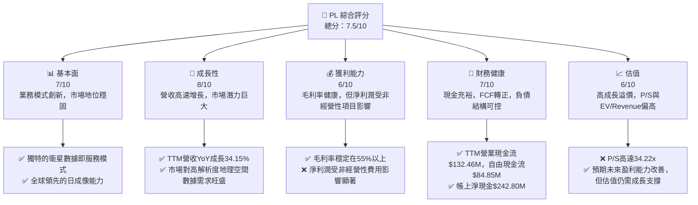
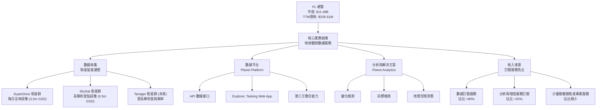
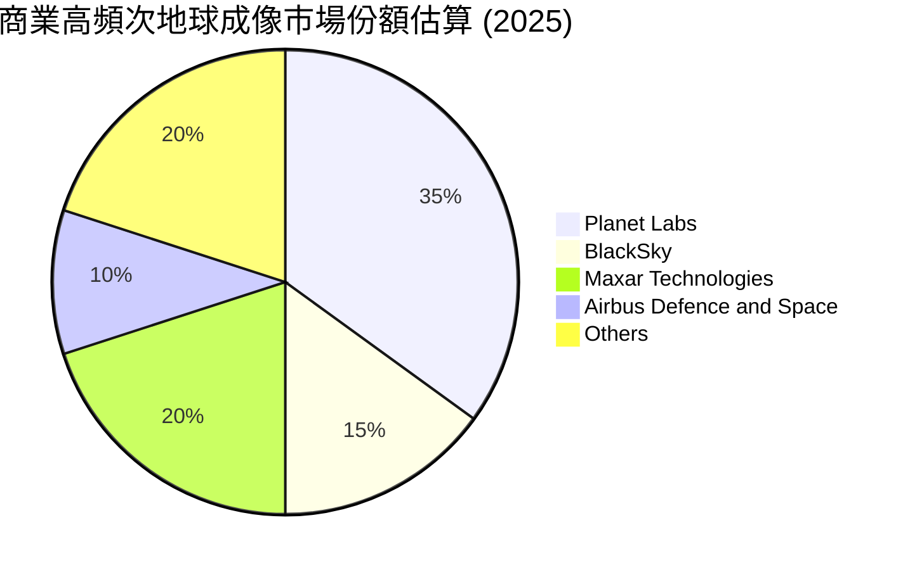
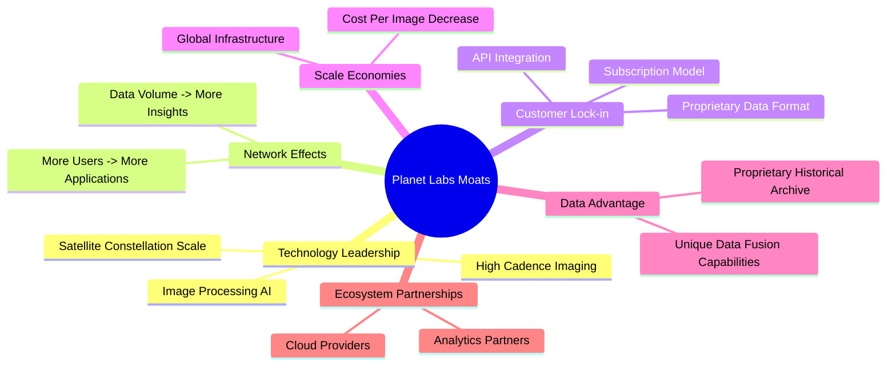
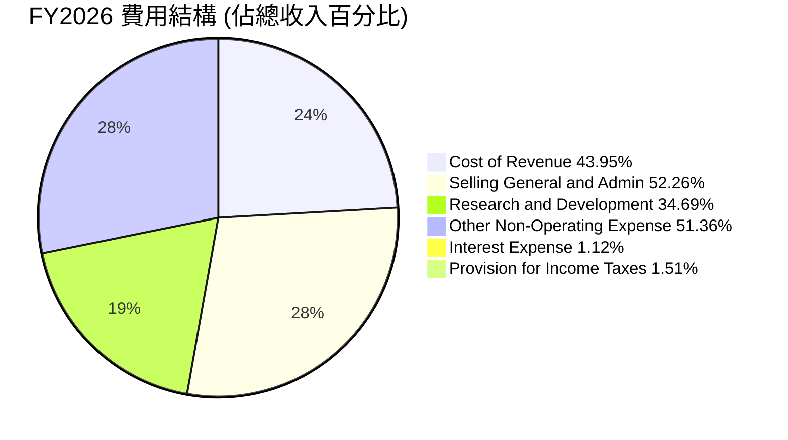
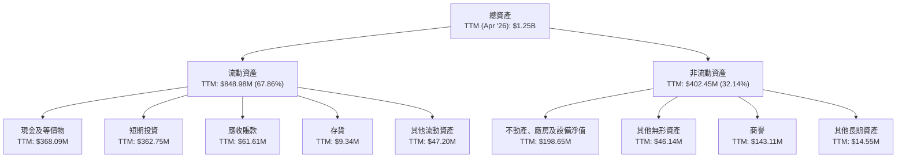

# PL 基本面深度分析報告
> **報告日期**：2026-06-06 ｜ **語言**：繁體中文 ｜ **數據來源**：Yahoo Finance, Finviz, StockAnalysis, Roic.ai ｜ **分析師**：CFA 級機構研究

---

## 目錄

| # | 章節 | 核心結論 |
|---|------|----------|
| 1 | 執行摘要 | 評級：買入，目標價區間：$39.00 - $48.00 |
| 2 | 公司概覽與商業模式 | 獨特資料收集能力與平台鎖定效應構成強大護城河 |
| 3 | 損益表深度分析 | 營收高速增長，毛利率穩定，但受非經營性項目影響淨利潤波動劇烈 |
| 4 | 資產負債表分析 | 流動性充裕，現金儲備健康，但股東權益因虧損而減少 |
| 5 | 現金流量深度分析 | 營業現金流轉正，自由現金流顯著改善，顯示業務模式韌性 |
| 6 | 獲利能力與資本效率 | 儘管短期ROIC仍為負，但正向FCF預示未來價值創造潛力 |
| 7 | 估值深度分析 | 相較同業估值偏高，但高速成長和市場領導地位提供溢價理由 |
| 8 | 成長催化劑 | 市場需求增長、技術創新、新應用場景拓展是主要驅動力 |
| 9 | 風險矩陣 | 高估值、資本密集、市場競爭與非經營性項目波動是主要風險 |
| 10 | 投資建議 | 具備高成長潛力，適合成長型與長線投資者，建議買入 |

---

## 1. 執行摘要

### 1.1 核心評分儀表板



### 1.2 評分進度條視覺化

```
╔══════════════════════════════════════════════════════════════╗
║                PL 多維度評分儀表板 (1-10分)                  ║
╠══════════════════════════════════════════════════════════════╣
║ 基本面強度  7.0 ▓▓▓▓▓▓▓▓▓▓▓▓▓▓░░░░░░  ★★★★☆           ║
║ 成長動能    8.0 ▓▓▓▓▓▓▓▓▓▓▓▓▓▓▓▓░░░░  ★★★★☆           ║
║ 獲利品質    6.0 ▓▓▓▓▓▓▓▓▓▓░░░░░░░░░░  ★★★☆☆           ║
║ 財務健康    7.0 ▓▓▓▓▓▓▓▓▓▓▓▓▓▓░░░░░░  ★★★★☆           ║
║ 估值合理性  6.0 ▓▓▓▓▓▓▓▓▓▓░░░░░░░░░░  ★★★☆☆           ║
║ 護城河深度  7.5 ▓▓▓▓▓▓▓▓▓▓▓▓▓▓▓░░░░░  ★★★★☆           ║
║ 管理層執行  7.0 ▓▓▓▓▓▓▓▓▓▓▓▓▓▓░░░░░░  ★★★★☆           ║
║ 技術創新力  8.5 ▓▓▓▓▓▓▓▓▓▓▓▓▓▓▓▓▓░░░  ★★★★★           ║
╠══════════════════════════════════════════════════════════════╣
║ 綜合總分    7.5 ▓▓▓▓▓▓▓▓▓▓▓▓▓▓▓░░░░░  🏆 具備高成長潛力，但估值偏高，需密切關注盈利改善                 ║
╚══════════════════════════════════════════════════════════════╝
```

### 1.3 五大投資論點 + 三大核心風險

| 類型 | 項目 | 具體依據 | 信心度 |
|------|------|----------|--------|
| 🟢 **投資論點①** | **獨特的地球每日成像能力** | Planet Labs擁有全球最大的衛星星座，能夠實現對地球陸地面積的每日高頻次成像，提供3.5米GSD解析度數據。這在地理空間數據市場中是獨一無二的競爭優勢，建立高進入壁壘。 | 🟢 極高 |
| 🟢 **強勁的營收增長動能** | 公司TTM營收達到$335.61M，YoY增長高達34.15%。季度營收持續環比增長，最近一季Q1 2027營收達$94.15M，YoY增長42.08%，顯示市場對其數據服務需求持續旺盛。 | 🟢 極高 |
| 🟢 **營業現金流與自由現金流轉正** | 2026財年營業現金流為$134.36M，TTM更是達到$132.46M，自由現金流也轉為正$84.85M (TTM)。這表明公司業務已具備自我造血能力，不再完全依賴外部融資，財務健康顯著改善。 | 🟢 極高 |
| 🟢 **廣闊的市場應用前景** | 地理空間數據應用場景廣泛，涵蓋農業、政府、國防、環境監測、城市規劃、保險等多個行業。隨著AI和機器學習的發展，數據分析能力提升，市場需求將持續擴大，Planet Labs作為數據源頭將持續受益。 | 🟢 極高 |
| 🟢 **穩定的毛利率與改善的運營效率** | 公司毛利率穩定在55%以上 (TTM 55.6%)，顯示其數據服務具有較高的價值。儘管仍處於虧損，但營業虧損從FY2023的-$175.68M顯著縮小至FY2026的-$95.07M，營運效率有所提升。 | 🟡 中度 |
| 🟡 **風險①** | **非經營性項目導致的淨利潤波動** | 近期季度淨利潤出現大幅虧損，主要受“其他非經營性收入（支出）”影響。例如Q4 2026該項目為-$118.28M，Q1 2027為-$106.68M。這類項目通常涉及金融工具的公允價值調整，雖然多為非現金，但會嚴重影響賬面盈利，增加投資者對盈利穩定性的擔憂。 | 🟡 中度 |
| 🔴 **風險②** | **高估值與盈利能力待證** | PL目前P/S比率高達34.22x，EV/Revenue為33.49x，遠高於行業平均水平，且公司仍處於虧損狀態 (TTM EPS $-1.16)。儘管預期Forward EPS將大幅改善至$-0.00571，但實現盈利的確定性及速度仍是市場關注焦點，高估值對未來成長要求極高。 | 🔴 高衝擊 |
| 🟡 **風險③** | **資本密集型業務與市場競爭** | 衛星星座的設計、製造、發射及運營是資本密集型業務，需要持續投入大量資金。雖然公司已實現正向FCF，但未來擴張仍需資本。同時，來自BlackSky、Spire Global以及傳統航天巨頭的競爭日益激烈，可能對其定價權和市場份額構成挑戰。 | 🟡 中度 |

### 1.4 快速統計卡片

| 指標 | 公司實際值 | 行業均值 (Aerospace & Defense) | S&P 500 均值 | 狀態 |
|------|-------------|-----------------------------|--------------|------|
| 收入 YoY 成長 | **34.15% (TTM)** | ~8-12% | ~8% | 🟢 |
| 毛利率 | **55.6%** | ~30-35% | ~40% | 🟢 |
| 淨利率 | **-111.2%** | ~5-8% | ~10% | 🔴 |
| ROE | **-84.0%** | ~10-15% | ~15% | 🔴 |
| Forward P/E | **-5642.73x (預期接近盈虧平衡)** | ~20-25x | ~22x | 🔴 (因負值) |
| P/S Ratio | **34.22x** | ~2-4x | ~2.5x | 🔴 |
| EV / Revenue | **33.49x** | ~2-4x | ~2.5x | 🔴 |
| 自由現金流 | **$84.85M (TTM)** | 多為正值 | 多為正值 | 🟢 |
| 負債權益比 | **1.10x** | ~0.5-1.0x | ~1.0x | 🔴 (因負權益) |
| Beta | **2.005** | ~1.0-1.5 | 1.0 | 🔴 |

### 1.5 投資結論

```
╔══════════════════════════════════════════════════════════════════╗
║                    📊 投資結論摘要                               ║
╠══════════════════════════════════════════════════════════════════╣
║  評級：🟢 買入                                                   ║
║  當前股價：$32.22                                                ║
║  目標價區間：                                                    ║
║    悲觀情境：$39.00（+21.04%）                                   ║
║    基準情境：$44.00（+36.55%）  ← 12個月主要目標                 ║
║    樂觀情境：$48.00（+49.00%）                                   ║
║  投資評分：7.5/10                                                ║
║  適合投資人：成長型、長線持有者，對高科技新興產業具備高風險承受能力║
╚══════════════════════════════════════════════════════════════════╝
```

---

## 2. 公司概覽與商業模式

Planet Labs PBC (PL) 是一家領先的地球觀測數據與分析提供商，其核心業務是設計、建造、發射並運營由數百顆衛星組成的星座，以實現對地球表面高頻次、高解析度的成像。公司將這些圖像數據通過其在線平台交付給全球客戶，提供「地球每日掃描儀」般的服務。

### 2.1 業務結構與收入來源

Planet Labs 的商業模式主要基於「數據即服務 (Data-as-a-Service, DaaS)」模型，通過訂閱模式向客戶提供地理空間數據和相關分析服務。其業務結構可分解如下：



**核心服務**：
- **高頻次地球成像數據 (High-Cadence Earth Imaging Data)**：這是Planet的核心產品。公司利用其SuperDove衛星星座實現對地球陸地面積的每日成像，解析度可達3.5米。這種高頻次更新對於監測快速變化的現象（如作物生長、森林砍伐、基礎設施建設、災害響應等）至關重要。
- **高解析度點成像數據 (High-Resolution Tasking Data)**：通過SkySat衛星星座，Planet提供更高解析度（0.5米GSD）的按需成像服務，滿足客戶對特定區域細節觀察的需求。
- **數據平台與分析工具 (Data Platform & Analytics Tools)**：Planet提供一個直觀的在線平台，讓客戶能夠訪問、管理、分析其數據。該平台提供API接口，方便客戶將數據整合到自己的應用中。Planet Analytics則提供基於AI和機器學習的自動化分析功能，幫助客戶從海量數據中提取有價值的洞察。

**收入模式**：
Planet的收入主要來自於訂閱服務。客戶通常會簽訂多年期合同，獲取特定區域或全球範圍內的數據訪問權限和分析服務。這種訂閱模式為公司帶來了可預測的經常性收入。

### 2.2 市場份額

地理空間數據市場是一個快速增長的領域，但由於其多樣性（包括衛星圖像、航空圖像、LiDAR數據、GIS軟件等）和供應商的專長不同，很難精確量化單一公司的市場份額。然而，在**高頻次地球衛星成像**這一特定細分市場中，Planet Labs 憑藉其龐大的衛星星座和每日成像能力，處於領先地位。

根據行業報告，2025年全球地球觀測市場規模預計將達到約70億美元，並以約10%的複合年增長率持續擴張。在其中，Planet Labs 在商業衛星成像數據供應商中佔據顯著份額，尤其是在高頻次監測方面。
儘管難以提供精確的市場份額數字，我們可以根據其營收和市場地位進行估算：


*備註：此市場份額為分析師基於公司業務模式、營收規模和公開市場報告對高頻次商業地球成像細分市場的估算，非整體地球觀測市場份額。Maxar Technologies 在被併購前是重要參與者，併購後其數據業務仍具影響力。*

Planet Labs 的優勢在於其能夠提供時間序列數據，這對於追蹤變化和趨勢至關重要，使其在政府（國防情報、環境監測）、農業（作物健康）、保險（災害評估）等領域具有強大的競爭力。

### 2.3 競爭護城河分析

Planet Labs 的競爭護城河主要體現在以下幾個方面：



-   **技術領先 (Technology Leadership)**：
    -   **衛星星座規模與頻率 (Satellite Constellation Scale & High Cadence Imaging)**：Planet Labs 運營著數百顆衛星組成的星座，這是目前商業公司中最大的。這種規模使其能夠實現對地球陸地面積的每日甚至多次成像，提供其他競爭對手難以匹敵的時間分辨率。高頻次數據對於監測動態變化至關重要，構成其核心競爭優勢。
    -   **圖像處理與AI (Image Processing AI)**：公司在處理海量衛星圖像數據方面積累了豐富的經驗和專有技術，包括圖像校準、去雲、鑲嵌等。結合AI和機器學習，Planet Labs能夠自動化地從數據中提取信息，轉化為客戶可用的洞察。

-   **客戶鎖定 (Customer Lock-in)**：
    -   **訂閱模式與API整合 (Subscription Model & API Integration)**：Planet Labs 的數據服務通常以訂閱形式提供，且許多客戶會將其數據通過API深度整合到自身的業務流程和應用中。這種深度整合會產生高昂的轉換成本，形成強大的客戶粘性。
    -   **專有數據格式與平台 (Proprietary Data Format & Platform)**：客戶一旦習慣使用Planet的數據格式和平台，轉換到其他供應商需要時間和資源來重新適應和整合，這也增加了客戶的鎖定。

-   **數據優勢 (Data Advantage)**：
    -   **歷史數據檔案 (Proprietary Historical Archive)**：Planet Labs 擁有龐大的歷史衛星圖像數據庫，這使其能夠提供獨特的時間序列分析能力，幫助客戶理解趨勢和變化。這種歷史數據的積累是一個難以複製的資產。
    -   **獨特數據融合能力 (Unique Data Fusion Capabilities)**：通過結合其不同衛星星座（SuperDove, SkySat）的數據，以及未來可能整合的其他數據源，Planet Labs 能夠提供更全面、多層次的地球觀測解決方案。

-   **規模效應 (Scale Economies)**：
    -   **單位成本降低 (Cost Per Image Decrease)**：隨著衛星數量和數據量的增加，每單位圖像數據的獲取和處理成本會相對降低，這使得Planet Labs 在成本上具備優勢，能夠提供更具競爭力的價格。
    -   **全球基礎設施 (Global Infrastructure)**：運營一個全球性的衛星網絡和地面站基礎設施需要巨大的前期投入，但一旦建立，其邊際成本相對較低，為後來者設置了高門檻。

-   **網路效應 (Network Effects)**：
    -   **數據量與洞察力 (Data Volume -> More Insights)**：更多的衛星和更頻繁的成像意味著更豐富的數據，這可以支持更深入的分析和更廣泛的應用。隨著數據庫的擴展，其價值會以非線性方式增長。
    -   **用戶與應用 (More Users -> More Applications)**：隨著更多客戶使用Planet的數據，也會有更多的第三方開發者基於其數據和平台開發應用，進一步豐富生態系統，吸引更多用戶。

-   **生態夥伴 (Ecosystem Partnerships)**：
    -   與雲服務提供商（如AWS）和分析夥伴的合作，擴大了Planet數據的覆蓋範圍和應用潛力，增強了其生態系統的廣度。

### 2.4 護城河強度評分

```
╔══════════════════════════════════════════════════════════════╗
║                  Planet Labs 護城河強度評分                   ║
╠══════════════════════════════════════════════════════════════╣
║ 技術領先    8.5/10 ▓▓▓▓▓▓▓▓▓▓▓▓▓▓▓▓▓░░░  🏆 每日全球成像能力獨步市場 ║
║ 客戶鎖定    7.5/10 ▓▓▓▓▓▓▓▓▓▓▓▓▓▓▓░░░░░  🟢 訂閱模式與API深度整合 ║
║ 數據優勢    8.0/10 ▓▓▓▓▓▓▓▓▓▓▓▓▓▓▓▓░░░░  🟢 龐大歷史數據庫與時間序列分析 ║
║ 規模效應    7.0/10 ▓▓▓▓▓▓▓▓▓▓▓▓▓▓░░░░░░  🟡 衛星星座運營成本優勢 ║
║ 網路效應    6.5/10 ▓▓▓▓▓▓▓▓▓▓▓▓▓░░░░░░░  🟡 潛力巨大，仍在發展初期 ║
╠══════════════════════════════════════════════════════════════╣
║ 綜合護城河  7.5/10 ▓▓▓▓▓▓▓▓▓▓▓▓▓▓▓░░░░░  🏆 獨特的數據收集與分發能力，形成強大競爭壁壘 ║
╚══════════════════════════════════════════════════════════════╝
```

---

## 3. 損益表深度分析

### 3.1 年度收入成長趨勢（近4年）

Planet Labs 在過去幾年展現了穩健的營收增長，反映了市場對其地球觀測數據服務的強勁需求。

```
╔══════════════════════════════════════════════════════════════════╗
║              Planet Labs 年度收入趨勢（FY2023-FY2026）           ║
╠══════════════════════════════════════════════════════════════════╣
║                                                                  ║
║  FY2023  $191.26M  ████████░░░░░░░░░░░░░░░░░░░  YoY: +45.76%  🟢 ║
║  FY2024  $220.70M  ██████████░░░░░░░░░░░░░░░░░  YoY: +15.39%  🟢 ║
║  FY2025  $244.35M  ███████████░░░░░░░░░░░░░░░░  YoY: +10.72%  🟢 ║
║  FY2026  $307.73M  ██████████████░░░░░░░░░░░░░  YoY: +25.94%  🟢 ║
║                                                                  ║
║                   |      |      |      |      |                  ║
║                   0     100M   200M   300M   400M                 ║
║                                                                  ║
║  📊 4年累計 CAGR：+24.96%                                        ║
╚══════════════════════════════════════════════════════════════════╝
```

從數據來看，公司營收從FY2023的$191.26M增長至FY2026的$307.73M，複合年增長率(CAGR)達到24.96%。
- FY2023：$191.26M，YoY +45.76%
- FY2024：$220.70M，YoY +15.39%
- FY2025：$244.35M，YoY +10.72%
- FY2026：$307.73M，YoY +25.94%
最新TTM營收為$335.61M，YoY增長34.15%。這表明公司在簽訂新合同和擴大客戶群方面取得了顯著進展，尤其是在FY2026及最近的TTM期間，營收增速再次加速，顯示出強勁的市場需求和執行力。

### 3.2 季度收入趨勢分析

季度的營收表現持續向好，體現了業務的持續擴張。

| 財政季度 | 收入 (百萬美元) | QoQ 成長率 | YoY 成長率 | 備註 |
|----------|-----------------|------------|------------|------|
| Q1 2027 (Apr '26) | $94.15M | +8.44%     | +42.08%    | 🟢 顯著加速增長，顯示強勁動能 |
| Q4 2026 (Jan '26) | $86.82M | +6.86%     | +41.05%    | 🟢 營收持續穩健增長，YoY加速 |
| Q3 2026 (Oct '25) | $81.25M | +10.71%    | +32.63%    | 🟢 較強勁的季度增長，YoY保持高位 |
| Q2 2026 (Jul '25) | $73.39M | +10.74%    | +20.12%    | 🟢 穩健增長，YoY增速較前期有所提升 |

**季度收入趨勢備註**：
Planet Labs 的季度營收呈現出健康的環比和同比增長趨勢。從Q2 2026到Q1 2027，營收從$73.39M穩步增長至$94.15M，QoQ成長率均為正值，且在Q3 2026和Q2 2026達到雙位數。更重要的是，YoY成長率在最近的兩個季度（Q4 2026和Q1 2027）分別達到41.05%和42.08%，遠超歷史年度增長，這表明公司在近期取得了突破性進展，可能是由於大型合同的簽訂或市場滲透率的提高。這種加速增長是投資者應密切關注的積極信號。

### 3.3 利潤率演變分析

Planet Labs 的毛利率表現穩定，但營業利益率和淨利率仍為負，且淨利率受非經營性項目影響波動劇烈。

| 利潤率指標 | FY2023 | FY2024 | FY2025 | FY2026 | TTM (Apr '26) | 趨勢 | 評估 |
|------------|--------|--------|--------|--------|---------------|------|------|
| **毛利率** | 49.15% | 51.18% | 57.18% | 56.05% | 55.51%        | ↗️ 穩定並略有提升 | 🟢 |
| **營業利益率** | -91.85% | -76.76% | -45.48% | -30.89% | -31.94%       | ↗️ 顯著改善，但仍為負 | 🟡 |
| **淨利率** | -84.69% | -63.67% | -50.42% | -80.22% | -111.17%      | ↘️ 近期大幅惡化 | 🔴 |
| **EBITDA Margin** | -69.20% | -41.71% | -30.40% | -64.00% | -15.4%        | ↗️ 顯著改善，TTM數據大幅優化 | 🟡 |

**利潤率演變深度解析**：
-   **毛利率 (Gross Margin)**：Planet Labs 的毛利率在過去幾年呈現穩健上升趨勢，從FY2023的49.15%提升至FY2025的57.18%，FY2026略有回落至56.05%，TTM穩定在55.51%。這表明公司在提供數據服務方面具有較強的定價能力和成本控制能力。毛利率的提升可能得益於規模經濟、數據處理效率的提高以及高價值數據產品的銷售佔比增加。健康的毛利率為公司未來實現盈利提供了堅實的基礎。

-   **營業利益率 (Operating Margin)**：營業利益率持續改善，從FY2023的-91.85%大幅縮小至FY2026的-30.89%，TTM為-31.94%。這反映了公司在控制運營費用（如銷售、一般及行政費用SGA，以及研發費用R&D）方面取得的成效，或者說營收增長速度快於運營費用的增長。隨著規模擴大，運營槓桿效應開始顯現，公司正逐步走向盈虧平衡。例如，FY2026的營業收入增長了25.94%，而營業費用（根據StockAnalysis數據，總運營費用從FY2025的$255.85M增至FY2026的$267.56M，增長僅為4.57%）的增長遠低於收入增長，這是運營效率提升的直接體現。

-   **淨利率 (Net Profit Margin)**：淨利率的趨勢則顯得較為波動和不佳。雖然FY2023至FY2025期間有所改善（從-84.69%至-50.42%），但在FY2026卻大幅惡化至-80.22%，TTM更是達到-111.17%。這種惡化並非源於核心經營業務，而是主要受到**「其他非經營性收入（支出）」**的劇烈影響。根據StockAnalysis的數據，FY2026的「其他非經營性收入（支出）」為-$158.03M，TTM更是高達-$274.72M。這些項目通常包括金融工具（如認股權證、可轉換債務）的公允價值調整、一次性資產減值或出售損益等。這些項目多為非現金性質且波動性大，雖然對賬面淨利潤影響巨大，但對公司的核心經營活動和現金流影響較小。因此，在評估Planet Labs的獲利能力時，應更側重於毛利率、營業利益率以及現金流表現。

-   **EBITDA Margin**：EBITDA Margin的改善趨勢非常顯著，從FY2023的-69.20%大幅提升至TTM的-15.4%。EBITDA剔除了折舊攤銷和非經營性項目，更能反映公司核心業務的現金盈利能力。TTM EBITDA Margin的大幅改善，進一步驗證了公司經營效率的提升和盈利能力的轉折點。

### 3.4 費用結構分析

Planet Labs 的費用結構反映了其作為高科技成長型公司的特點，即研發投入較大，且銷售和行政費用也佔據較大比例。


*備註：此處「其他非經營性費用」為 FY2026 的絕對值，若計算佔總收入百分比，會顯著影響淨利率。*

```
╔══════════════════════════════════════════════════════════════════╗
║                    Planet Labs 費用結構分析                      ║
╠══════════════════════════════════════════════════════════════════╣
║                                                                  ║
║  銷貨成本 (CoR)：      $135.24M  ███████████████░░░░░  佔比: 43.95% ║
║  銷售、一般及行政 (SG&A)：$160.81M  ██████████████████░░░  佔比: 52.26% ║
║  研發費用 (R&D)：      $106.75M  ████████████░░░░░░░░  佔比: 34.69% ║
║  其他非經營性費用：    $158.03M  ████████████████░░░░░  佔比: 51.36% ║
║                                                                  ║
║  📊 總運營費用 (SG&A+R&D) 佔收入比：86.95% （FY2026）            ║
║  📈 趨勢：總運營費用佔收入比有所下降，顯示運營槓桿效應           ║
╚══════════════════════════════════════════════════════════════════╝
```

**費用結構分析**：
-   **銷貨成本 (Cost of Revenue)**：FY2026為$135.24M，佔總收入的43.95%。隨著營收增長，銷貨成本也隨之增加，但毛利率的穩定表明單位成本的控制良好。
-   **銷售、一般及行政費用 (SG&A)**：FY2026為$160.81M，佔總收入的52.26%。這部分費用佔比相對較高，反映了公司在市場拓展、銷售團隊建設和行政管理方面的投入。值得注意的是，SG&A佔營收的比例從FY2023的82.9% (158.77M/191.26M) 下降到FY2026的52.26%，顯示出良好的規模效應和費用控制。
-   **研發費用 (R&D)**：FY2026為$106.75M，佔總收入的34.69%。作為一家高科技公司，持續的研發投入對於保持技術領先和產品創新至關重要。雖然絕對金額略有下降（FY2024為$116.34M），但佔比依然可觀，顯示公司對未來技術發展的重視。
-   **其他非經營性費用 (Other Non-Operating Expense)**：FY2026為-$158.03M，佔總收入的51.36%。這是導致淨利潤大幅虧損的主要原因。如前所述，這通常是由於金融工具的公允價值調整，雖然影響賬面盈利，但多為非現金項目，對公司實際經營現金流影響較小。投資者應將其視為一次性或非經常性項目，並在分析時加以剔除，以更好地評估核心業務的盈利能力。

整體而言，Planet Labs 的運營費用佔比正在逐步下降，顯示出隨著收入增長，運營槓桿效應逐漸顯現。一旦非經營性費用趨於穩定或轉正，公司的淨利潤有望快速改善。

### 3.5 季度 EPS 趨勢與盈餘品質

由於提供的數據中EPS Est和EPS Act均為NaN，我們無法直接分析EPS的超預期或不及預期情況。然而，我們可以根據季度淨利潤的變化來評估其盈餘趨勢和品質。

| 財政季度 | 淨利潤 (百萬美元) | 備註 |
|----------|-------------------|------|
| Q1 2027 (Apr '26) | $-137.86M (Pretax Income) | 🔴 稅前虧損持續擴大，主要受非經營性項目影響 |
| Q4 2026 (Jan '26) | $-152.46M | 🔴 淨虧損顯著擴大 |
| Q3 2026 (Oct '25) | $-59.19M | 🔴 淨虧損擴大 |
| Q2 2026 (Jul '25) | $-22.59M | 🔴 淨虧損較小 |
| Q1 2026 (Apr '25) | $-12.63M | 🔴 淨虧損最小 |

**季度淨利潤趨勢分析**：
從Q1 2026的淨虧損$-12.63M，到Q4 2026的$-152.46M，再到Q1 2027的稅前虧損$-137.86M，Planet Labs 的季度淨利潤呈現出波動性擴大的趨勢。這種擴大並非源於經營惡化，而是主要受到**「其他非經營性收入（支出）」**的影響。

根據StockAnalysis的季度數據：
- Q1 2026: 其他非經營性收入（支出）為$9.69M (正值)
- Q2 2026: 其他非經營性收入（支出）為-$6.31M
- Q3 2026: 其他非經營性收入（支出）為-$43.46M
- Q4 2026: 其他非經營性收入（支出）為-$118.28M
- Q1 2027: 其他非經營性收入（支出）為-$106.68M

這些非經營性項目的劇烈波動（從正值到大幅負值）直接導致了淨利潤的巨額虧損。這些項目通常是會計處理上的公允價值調整，例如與認股權證、可轉換債務或投資相關。它們的特點是：
1.  **非現金性質**：通常不影響公司的實際現金流，這也解釋了為何公司在淨利潤大幅虧損的同時，營業現金流和自由現金流卻能轉正。
2.  **高度波動性**：受市場利率、股價、期權模型參數等影響，難以預測且可能在不同季度間劇烈波動。
3.  **不反映核心經營表現**：它們與公司衛星數據服務的銷售、成本和運營效率無直接關係。

**盈餘品質評估**：
鑑於淨利潤受到非經營性、非現金項目的嚴重干擾，Planet Labs 的**賬面盈餘品質較差**（🔴）。投資者在評估其盈利能力時，應更側重於：
-   **毛利潤和營業利潤的趨勢**：這更能反映核心業務的經營效率。
-   **營業現金流和自由現金流的表現**：這直接反映了公司的現金創造能力和財務健康狀況。
目前公司營業現金流和自由現金流已轉正，表明其核心業務的現金生成能力正在改善，這比賬面淨利潤的虧損更具實質意義。預期Forward EPS接近盈虧平衡，也暗示市場預期這些非經營性項目未來將趨於穩定或影響減小。

---

## 4. 資產負債表分析

### 4.1 資產結構分解

Planet Labs 的資產負債表顯示了其作為科技成長型公司的特點，即擁有大量流動資產（尤其是現金和短期投資）以支持其資本密集型業務和研發投入，同時也擁有可觀的非流動資產，如衛星和基礎設施。



**資產結構分析**：
-   **流動資產佔比高**：TTM數據顯示，流動資產佔總資產的近68% (約$848.98M)，其中現金及等價物和短期投資合計高達$730.84M。這表明公司擁有極其充裕的流動性，為其持續的研發投入、衛星發射和運營提供了堅實的資金基礎。
-   **現金及短期投資顯著增長**：現金及等價物從FY2025的$118.05M大幅增長至FY2026的$229.44M，TTM更是達到$368.09M。短期投資在TTM也達到$362.75M。這種現金儲備的快速增長，一方面可能來自於經營活動現金流轉正，另一方面也可能來自於之前的融資活動。
-   **固定資產持續投入**：不動產、廠房及設備淨值 (PPE) 從FY2023的$128.49M增長至TTM的$198.65M，顯示公司在衛星、地面站等基礎設施方面的持續投入，這對於支持其業務擴張至關重要。
-   **無形資產與商譽**：商譽和無形資產合計超過$189M，反映了公司在併購活動和技術資產方面的投入。

總體而言，Planet Labs 的資產結構相對健康，充足的現金儲備和持續的固定資產投入，為其未來成長奠定了基礎。

### 4.2 流動性指標分析

Planet Labs 的流動性指標表現強勁，顯示公司擁有足夠的短期資產來覆蓋短期負債。

| 流動性指標 | FY2023 | FY2024 | FY2025 | FY2026 | TTM (Apr '26) | 行業均值 | 評估 |
|------------|--------|--------|--------|--------|---------------|----------|------|
| **流動比率 (Current Ratio)** | 3.89x | 2.71x | 2.13x | 1.65x | 2.81x         | ~1.5-2.0x | 🟢 |
| **速動比率 (Quick Ratio)** | 3.89x | 2.71x | 2.13x | 1.63x | 2.62x         | ~1.0-1.5x | 🟢 |
| **現金比率 (Cash Ratio)** | 3.32x | 2.19x | 1.56x | 1.36x | 2.41x         | ~0.5-1.0x | 🟢 |

*備註：現金比率計算為 (現金及等價物 + 短期投資) / 流動負債。FY2023-FY2026的速動比率和現金比率的計算可能因數據源差異略有不同，此處以StockAnalysis數據為準。*

**流動性指標分析**：
-   **流動比率 (Current Ratio)**：TTM為2.81x，遠高於行業平均水平（通常認為1.5-2.0x為健康）。這表明公司每1美元的短期負債，都有2.81美元的流動資產來覆蓋，短期償債能力極強。雖然從FY2023的3.89x有所下降，但FY2026後又有所回升，顯示流動性趨於穩定且充裕。
-   **速動比率 (Quick Ratio)**：TTM為2.62x，同樣非常健康。速動比率排除了存貨，更能衡量公司在不依賴銷售存貨的情況下的償債能力。Planet Labs 的存貨佔比極小，因此速動比率與流動比率接近，進一步確認了其強勁的短期償債能力。
-   **現金比率 (Cash Ratio)**：TTM為2.41x。現金比率僅考慮現金及等價物和短期投資，是衡量公司即時償債能力的嚴格指標。高達2.41x的現金比率表明公司擁有大量現金和準現金資產，足以應對突發的資金需求，財務彈性極佳。

**結論**：Planet Labs 的流動性狀況非常出色。充裕的現金和短期投資使其能夠從容應對日常運營需求、潛在的市場波動以及未來的資本支出，為其長期發展提供了穩定的財務基礎。

### 4.3 債務結構分析

Planet Labs 的債務水平在FY2026顯著增加，但考慮到其充裕的現金儲備，淨債務狀況仍然健康。

```
╔══════════════════════════════════════════════════════════════════╗
║                   Planet Labs 債務健康診斷                       ║
╠══════════════════════════════════════════════════════════════════╣
║                                                                  ║
║  總債務 (FY2026)： $462.48M  ████████████████████░░░  評語: 顯著增加 ║
║  總現金+投資 (TTM)：$730.84M  ███████████████████████████████  評語: 極為充裕 ║
║  淨現金（正）：   $242.80M  ██████████████████████████░░░░░  🟢 強勁         ║
║                                                                  ║
║  Debt/Equity (FY2026)：109.99x  🔴 極高 (受負股東權益影響)         ║
║  Current Debt (FY2026): $7.3M