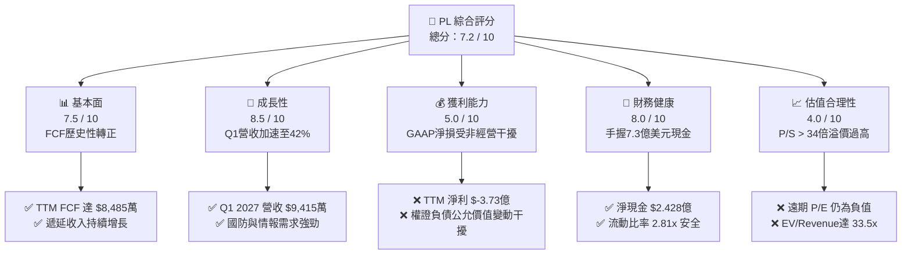
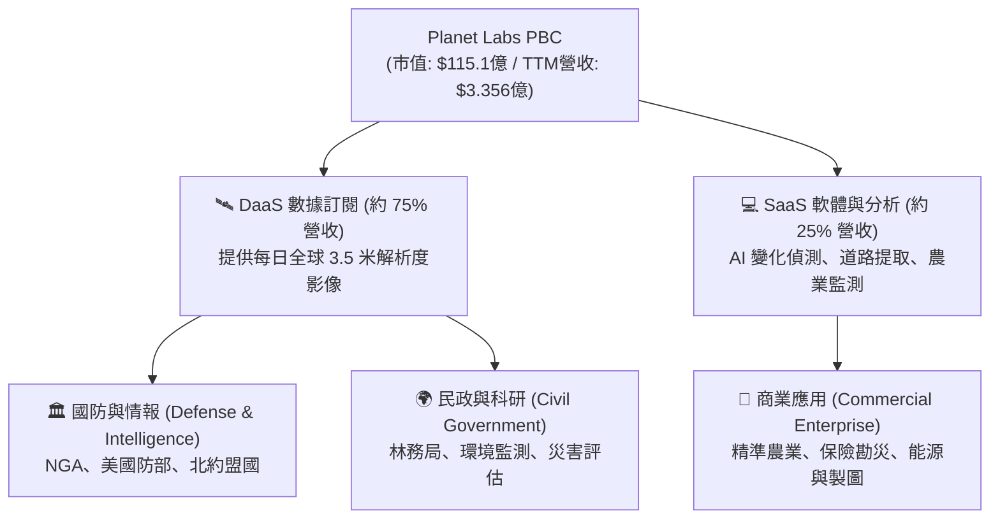
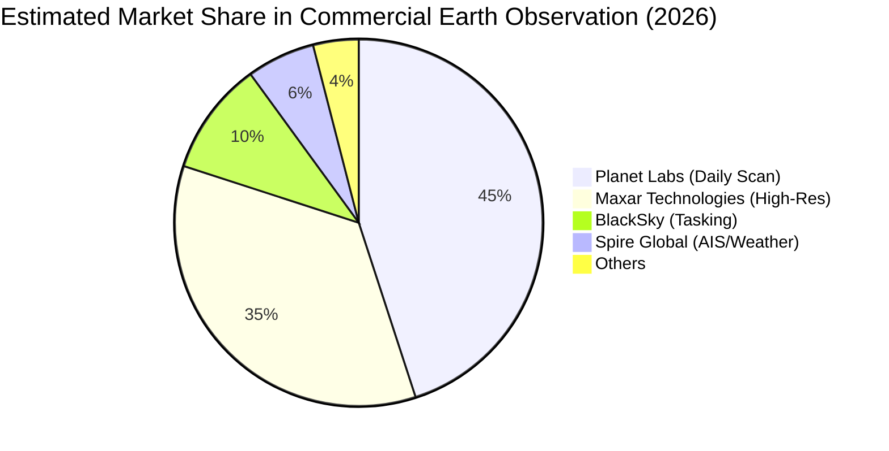
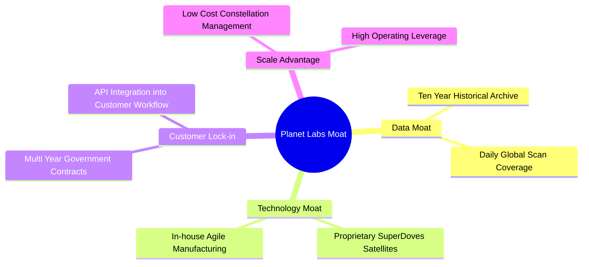

# PL 基本面深度分析報告

> **報告日期**：2026-06-08 ｜ **語言**：繁體中文 ｜ **數據來源**：Yahoo Finance, Finviz, StockAnalysis, Roic.ai ｜ **分析師**：CFA 級機構研究

---

## 目錄

| # | 章節 | 核心結論 |
|---|------|----------|
| 1 | [執行摘要](#1-執行摘要) | 評級：**持有（Hold / Buy on Dips）**，基準目標價 **$38.00**，營收加速與 FCF 轉正為核心亮點，但估值溢價過高。 |
| 2 | [公司概覽與商業模式](#2-公司概覽與商業模式) | 獨家每日全球掃描（Daily Global Scan）構建強大數據壁壘，軟體訂閱制與政府國防合約提供高黏性。 |
| 3 | [損益表深度分析](#3-損益表深度分析) | Q1 2027 營收年增達 **42.08%** 呈加速態勢；非經營性虧損（權證重估）致淨損擴大，但營業虧損已收斂。 |
| 4 | [資產負債表分析](#4-資產負債表分析) | 淨現金達 **$2.428億**，流動比率 **2.81**，發債取得充足「彈藥」，短期無流動性風險。 |
| 5 | [現金流量深度分析](#5-現金流量深度分析) | 歷史性轉折點！FY2026 自由現金流（FCF）首度轉正達 **$5,141萬**，TTM FCF 進一步攀升至 **$8,485萬**。 |
| 6 | [獲利能力與資本效率](#6-獲利能力與資本效率) | 杜邦分析顯示資產週轉率偏低（0.27x），NOPAT 仍負導致 ROIC 為負，但 FCF 效率正快速改善。 |
| 7 | [估值深度分析](#7-估值深度分析) | 歷史 P/S 處於 **34.3x** 的極高分位數，相較同業 SPIR 與 BKSY 享有極高溢價，敏感性分析顯示下行風險。 |
| 8 | [成長催化劑](#8-成長催化劑) | Pelican 與 Tanager 次世代星座部署、AI 地理空間分析需求爆發、NGA 國防大單續約。 |
| 9 | [風險矩陣](#9-風險矩陣) | 發射失敗、政府客戶集中度高、高估值下的市場情緒波動與股權稀釋。 |
| 10 | [投資建議](#10-投資建議) | 分批佈局策略，設定 **$28-$30** 為安全邊際買入區間，適合高風險承受度的成長型投資人。 |

---

## 1. 執行摘要

Planet Labs PBC (NYSE: PL) 正處於其商業化道路上的關鍵轉折點。作為全球領先的每日地球觀測衛星數據提供商，PL 成功利用其「敏捷航太」（Agile Aerospace）模式，建立了無可比擬的歷史數據庫與每日重訪（Daily Revisit）能力。

### 1.1 核心評分儀表板



### 1.2 評分進度條視覺化

```
╔══════════════════════════════════════════════════════════════╗
║                PL 多維度評分儀表板 (1-10分)                  ║
╠══════════════════════════════════════════════════════════════╣
║ 基本面強度  7.5 ▓▓▓▓▓▓▓▓▓▓▓▓▓▓▓░░░░░  ★★★★☆           ║
║ 成長動能    8.5 ▓▓▓▓▓▓▓▓▓▓▓▓▓▓▓▓▓░░  ★★★★☆           ║
║ 獲利品質    5.0 ▓▓▓▓▓▓▓▓▓▓░░░░░░░░░░  ★★★☆☆           ║
║ 財務健康    8.0 ▓▓▓▓▓▓▓▓▓▓▓▓▓▓▓▓░░░░  ★★★★☆           ║
║ 估值合理性  4.0 ▓▓▓▓▓▓▓▓░░░░░░░░░░░░  ★★☆☆☆           ║
║ 護城河深度  8.5 ▓▓▓▓▓▓▓▓▓▓▓▓▓▓▓▓▓░░  ★★★★☆           ║
║ 管理層執行  7.5 ▓▓▓▓▓▓▓▓▓▓▓▓▓▓▓░░░░░  ★★★★☆           ║
║ 技術創新力  9.0 ▓▓▓▓▓▓▓▓▓▓▓▓▓▓▓▓▓▓░░  ★★★★★           ║
╠══════════════════════════════════════════════════════════════╣
║ 綜合總分    7.2 ▓▓▓▓▓▓▓▓▓▓▓▓▓▓░░░░░░  🏆 成長轉折，估值偏高 ║
╚══════════════════════════════════════════════════════════════╝
```

### 1.3 五大投資論點 + 三大核心風險

| 類型 | 項目 | 具體依據 | 信心度 |
|------|------|----------|--------|
| 🟢 **投資論點①** | **自由現金流歷史性轉正** | FY2026 FCF 達 **$5,141萬**，相較 FY2025 的 **$-6,878萬** 實現大幅扭虧，驗證商業模式的規模效應與高槓桿特性。 | 🟢 極高 |
| 🟢 **投資論點②** | **營收成長重新加速** | 營收年增率從 Q4 2025 的 **4.59%** 谷底反彈，至 Q1 2027 達到 **42.08%**（營收 **$9,415萬**），顯示新合約與次世代星座開始貢獻。 | 🟢 高 |
| 🟢 **投資論點③** | **強大的數據護城河** | 擁有超過 10 年的每日全球掃描歷史數據庫，競爭對手難以複製，且與 AI 大模型（如地理空間多模態模型）結合的潛力巨大。 | 🟢 極高 |
| 🟢 **投資論點④** | **資產負債表實力雄厚** | 擁有 **$7.308億** 的總現金及短期投資，淨現金達 **$2.428億**，提供充足的資本支出與潛在併購彈藥。 | 🟢 高 |
| 🟢 **投資論點⑤** | **機構持股比例極高** | 機構持股高達 **80.0%**，近期 Wedbush、Needham、Craig-Hallum 等頂級投行一致給出「買入/優於大盤」評級。 | 🟡 中等 |
| 🟡 **風險①** | **估值溢價過高** | 當前 P/S 達 **34.3x**，EV/Revenue 達 **33.5x**，股價過去 12 個月暴漲 **439.8%**，已透支部分利多，容錯率極低。 | 🔴 高衝擊 |
| 🔴 **風險②** | **非經營性會計損益波動** | TTM 淨損高達 **$-3.731億**，主因是股價大漲導致權證負債公允價值變動（非現金項目），可能引發散戶恐慌性拋售。 | 🟡 中度 |
| 🔴 **風險③** | **發射延遲與技術故障** | 次世代 Pelican 與 Tanager 星座的部署進度直接決定了未來高解析度市場的份額，任何發射失敗都將打擊成長預期。 | 🔴 高衝擊 |

### 1.4 快速統計卡片

| 指標 | PL 實際值 | 航太與國防行業均值 | S&P 500 均值 | 狀態 |
|------|-------------|----------|--------------|------|
| **營收 YoY 成長率** | **42.1%** (TTM) | ~8.5% | ~5.5% | 🟢 極強 |
| **毛利率 (Gross Margin)** | **55.6%** | ~26.5% | ~30.0% | 🟢 優秀 |
| **營業利益率 (Operating Margin)**| **-30.5%** | ~8.0% | ~14.5% | 🔴 仍處虧損 |
| **淨利率 (Net Margin)** | **-111.2%** | ~5.5% | ~11.0% | 🔴 受權證會計干擾 |
| **流動比率 (Current Ratio)** | **2.81** | ~1.40 | ~1.25 | 🟢 極佳 |
| **市銷率 (P/S Ratio)** | **34.3x** | ~2.1x | ~2.8x | 🔴 極度高估 |

### 1.5 投資結論

```
╔══════════════════════════════════════════════════════════════════╗
║                    📊 PL 投資結論摘要                            ║
╠══════════════════════════════════════════════════════════════════╣
║  評級：🟡 持有 / 逢低買入 (Hold / Buy on Dips)                   ║
║  當前股價：$32.31 (2026-06-08)                                   ║
║  目標價區間：                                                    ║
║    悲觀情境 (Bear Case)：$22.00 (-31.9%)                         ║
║    基準情境 (Base Case)：$38.00 (+17.6%)  ← 12個月主要目標        ║
║    樂觀情境 (Bull Case)：$50.00 (+54.7%)                         ║
║  投資評分：7.2 / 10                                              ║
║  適合投資人：具備高風險承受度、聚焦商業航太與 AI 應用的成長型讀者 ║
╚══════════════════════════════════════════════════════════════════╝
```

---

## 2. 公司概覽與商業模式

Planet Labs PBC 是一家垂直整合的地理空間數據與軟體平台公司。其核心競爭力在於設計、建造並營運全球最大的地球觀測衛星群（主要為 SuperDove 鴿子衛星、Pelican 鵜鶘衛星及 Tanager 推進者衛星）。

### 2.1 業務結構與收入來源

PL 的商業模式本質上是「**DaaS (Data-as-a-Service) + SaaS**」。



### 2.2 市場份額

在商業衛星地球觀測（EO）市場中，PL 在「**高頻次、中解析度（Global Daily Scan）**」領域擁有近乎 **100%** 的獨佔份額。但在「**極高解析度（<50cm）**」與「**點源追蹤（Targeted Tasking）**」領域，PL 正與 Maxar 及 BlackSky 展開激烈競爭。



### 2.3 競爭護城河分析



### 2.4 護