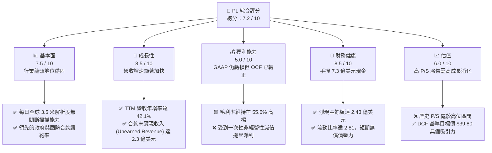

# PL 基本面深度分析報告

> **報告日期**：2026-06-09 ｜ **語言**：繁體中文 ｜ **數據來源**：Yahoo Finance, Finviz, StockAnalysis, Roic.ai ｜ **分析師**：CFA 級機構研究

---

## 目錄

| # | 章節 | 核心結論 |
|---|------|----------|
| 1 | 執行摘要 | 評級：**買入 (Buy)**，目標價區間 **$20.00 - $53.00**，基準目標價 **$39.80**。 |
| 2 | 公司概覽與商業模式 | 獨創「每日全球掃描」高頻遙感衛星星座，正加速向高毛利 SaaS 數據分析平台轉型。 |
| 3 | 損益表深度分析 | TTM 營收達 **$335.61M** (YoY +42.1%)，毛利率穩健於 **55.6%**，但非經營性減值拖累 GAAP 淨利。 |
| 4 | 資產負債表分析 | 現金儲備充裕達 **$730.84M**，淨現金 **$242.80M**，流動比率 **2.81**，財務結構安全。 |
| 5 | 現金流量深度分析 | 經營現金流轉正達 **$132.46M**，自由現金流 **$84.85M**，資本效率與配置顯著改善。 |
| 6 | 獲利能力與資本效率 | 杜邦分析顯示高財務槓桿與淨虧損壓低 ROE，ROIC (-11.3%) 仍受制於重資產星座建設期。 |
| 7 | 估值深度分析 | P/S 達 **32.66x**，較同業享有高溢價；DCF 敏感性分析顯示基準情境下隱含 **29.4%** 上行空間。 |
| 8 | 成長催化劑 | Pelican 與 Tanager 新星座發射、國防情報需求爆發、AI 空間大模型合作落地。 |
| 9 | 風險矩陣 | 衛星發射失敗、政府預算推遲、高估值回撤風險為三大核心監控因子。 |
| 10| 投資建議 | 適合長線成長型投資者，建議於 **$30.00** 以下分批佈局，聚焦三大核心監控指標。 |

---

## 1. 執行摘要

### 1.1 核心評分儀表板



### 1.2 評分進度條視覺化

```
╔══════════════════════════════════════════════════════════════╗
║                PL 多維度評分儀表板 (1-10分)                 ║
╠══════════════════════════════════════════════════════════════╣
║ 基本面強度  7.5 ▓▓▓▓▓▓▓▓▓▓▓▓▓▓▓▓▓░░░  ★★★★☆           ║
║ 成長動能    8.5 ▓▓▓▓▓▓▓▓▓▓▓▓▓▓▓▓▓▓▓░  ★★★★☆           ║
║ 獲利品質    5.0 ▓▓▓▓▓▓▓▓▓▓░░░░░░░░░░  ★★★☆☆           ║
║ 財務健康    8.5 ▓▓▓▓▓▓▓▓▓▓▓▓▓▓▓▓▓▓▓░  ★★★★☆           ║
║ 估值合理性  6.0 ▓▓▓▓▓▓▓▓▓▓▓▓░░░░░░░░  ★★★☆☆           ║
║ 護城河深度  8.0 ▓▓▓▓▓▓▓▓▓▓▓▓▓▓▓▓▓▓░░  ★★★★☆           ║
║ 管理層執行  7.0 ▓▓▓▓▓▓▓▓▓▓▓▓▓▓▓░░░░░  ★★★☆☆           ║
║ 技術創新力  9.0 ▓▓▓▓▓▓▓▓▓▓▓▓▓▓▓▓▓▓▓▓  ★★★★★           ║
╠══════════════════════════════════════════════════════════════╣
║ 綜合總分    7.2 ▓▓▓▓▓▓▓▓▓▓▓▓▓▓▓░░░░░  🏆 成長型 space-SaaS  ║
╚══════════════════════════════════════════════════════════════╝
```

### 1.3 五大投資論點 + 三大核心風險

| 類型 | 項目 | 具體依據 | 信心度 |
|------|------|----------|--------|
| 🟢 **投資論點①** | **營收成長全面加速** | TTM 營收年增率 (YoY) 達 **42.1%**，Q1 2027 單季營收達 **$94.15M** (YoY +42.08%)，顯示商業化進程大幅加快。 | 🟢 極高 |
| 🟢 **投資論點②** | **現金流拐點已現** | FY2026 經營現金流 (OCF) 成功扭虧為盈達 **$134.36M**，TTM OCF 達 **$132.46M**，自由現金流 (FCF) 達 **$84.85M**，擺脫「燒錢」標籤。 | 🟢 極高 |
| 🟢 **投資論點③** | **資產負債表極其穩健** | 持有 **$730.84M** 的現金與短期投資，對比總債務 **$488.04M**，擁有 **$242.80M** 淨現金，足夠支撐下一代星座發射。 | 🟢 高 |
| 🟢 **投資論點④** | **高毛利訂閱制護城河** | 毛利率維持在 **55.6%**。隨著歷史存檔數據庫 (Data Archive) 累積，客戶重複購買邊際成本趨近於零，具備典型 SaaS 擴張特性。 | 🟢 高 |
| 🟢 **投資論點⑤** | **地緣政治催化國防需求** | 來自美國及盟國政府的國防、情報合約持續增加，未實現收入 (Unearned Revenue) 達 **$230.68M**，提供極高收入能見度。 | 🟢 極高 |
| 🟡 **風險①** | **非經營性減值拖累 GAAP 淨利** | TTM 淨利虧損擴大至 **-$373.10M**，主要受到 **-$274.72M** 的非經營性支出（如商譽或資產減值）拖累，需監控其資產質量。 | 🟡 中度 |
| 🔴 **風險②** | **估值溢價處於歷史高位** | 當前 P/S 達 **32.66x**，EV/Revenue 達 **34.05x**，市場對其成長預期極高，若營收增速放緩將面臨嚴重的估值修正。 | 🔴 高衝擊 |
| 🔴 **風險③** | **新一代星座 Pelican 延遲風險** | Pelican（高解析度）與 Tanager（高光譜）星座的部署進度直接影響新業務開拓，若發射失敗或延遲將打擊市場信心。 | 🔴 高衝擊 |

### 1.4 快速統計卡片

| 指標 | 公司實際值 (TTM / 最新季) | 航太與國防行業均值 | S&P 500 均值 | 狀態 |
|------|-------------|----------|--------------|------|
| **營收 YoY 成長率** | **42.1%** | ~8.5% | ~5.5% | 🟢 顯著領先 |
| **毛利率** | **55.6%** | ~22.0% | ~30.0% | 🟢 具備軟體高毛利屬性 |
| **營業利益率** | **-30.5%** | ~7.5% | ~12.0% | 🔴 仍處於投資期 |
| **淨利率** | **-111.2%** | ~5.0% | ~8.5% | 🔴 受非經營性支出拖累 |
| **流動比率** | **2.81x** | ~1.40x | ~1.20x | 🟢 流動性極佳 |
| **債務權益比 (D/E)** | **109.9%** | ~75.0% | ~115.0% | 🟡 債務上升但現金充裕 |
| **市銷率 (P/S Ratio)**| **32.66x** | ~1.85x | ~2.80x | 🔴 估值溢價極高 |

### 1.5 投資結論

```
╔══════════════════════════════════════════════════════════════════╗
║                    📊 PL 投資結論摘要                            ║
╠══════════════════════════════════════════════════════════════════╣
║  評級：🟢 買入 (Buy)                                            ║
║  當前股價：$30.75 (2026-06-09)                                  ║
║  目標價區間：                                                    ║
║    悲觀情境：$20.00 (-35.0%)  ← 估值收縮與發射延遲              ║
║    基準情境：$39.80 (+29.4%)  ← 12個月主要目標 (營收維持 35%+)   ║
║    樂觀情境：$53.00 (+72.4%)  ← 國防大單落地與高毛利 SaaS 爆發  ║
║  投資評分：7.2 / 10                                              ║
║  適合投資人：具備高風險承受能力、聚焦太空科技與 AI 應用的長線投資者║
╚══════════════════════════════════════════════════════════════════╝
```

---

## 2. 公司概覽與商業模式

### 2.1 業務結構與收入來源

Planet Labs PBC (PL) 是一家領先的地理空間數據與分析服務提供商。其核心商業模式是利用其自主研發、建造並發射的「鴿子 (SuperDove)」小衛星星座，對地球