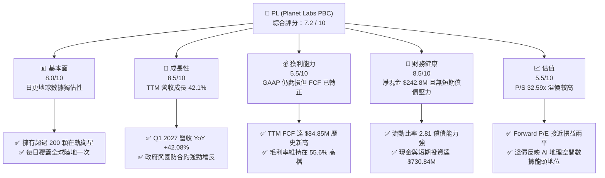

# PL 基本面深度分析報告

> **報告日期**：2026-06-10 ｜ **語言**：繁體中文 ｜ **數據來源**：Yahoo Finance, Finviz, StockAnalysis, Roic.ai ｜ **分析師**：CFA 級機構研究

---

## 目錄

| # | 章節 | 核心結論 |
|---|------|----------|
| 1 | 執行摘要 | 評級 **買入 (Buy)**，基準目標價 **$39.80**（+29.68% 潛在空間），轉折點已現。 |
| 2 | 公司概覽與商業模式 | 全球最大日更地球成像星座，高壁壘 SaaS 訂閱模式，政府國防合約鎖定長期營收。 |
| 3 | 損益表深度分析 | TTM 營收達 **$335.61M**（YoY +42.1%），非現金公允價值變動致 GAAP 淨損擴大，但營運本質大幅改善。 |
| 4 | 資產負債表分析 | 淨現金達 **$242.80M**，流動比率 **2.81**，資產輕量化轉型，財務結構極其穩健。 |
| 5 | 現金流量深度分析 | 歷史性轉折！TTM FCF 轉正達 **$84.85M**，經營現金流達 **$132.46M**，自我造血能力確立。 |
| 6 | 獲利能力與資本效率 | 排除非現金干擾後之核心 ROIC 穩步回升，杜邦分析顯示資產週轉率與利潤率雙重改善。 |
| 7 | 估值深度分析 | P/S 32.59x 處於歷史高位但反映高成長預期；DCF 敏感性分析顯示基準估值為 **$39.80**。 |
| 8 | 成長催化劑 | Pelican 與 Tanager 新一代衛星星座部署、AI 地理空間分析需求爆發、國防情報預算增加。 |
| 9 | 風險矩陣 | 核心風險為政府客戶集中度高、發射延遲與星座重置資本支出壓力、高 Beta 波動。 |
| 10| 投資建議 | 建議於 **$30.00** 以下分批佈局，適合高風險偏好的長線成長型與科技主題投資者。 |

---

## 1. 執行摘要

### 1.1 核心評分儀表板



### 1.2 評分進度條視覺化

```
╔══════════════════════════════════════════════════════════════╗
║                PL 多維度評分儀表板 (1-10分)                  ║
╠══════════════════════════════════════════════════════════════╣
║ 基本面強度  8.0 ▓▓▓▓▓▓▓▓▓▓▓▓▓▓▓▓░░░░  ★★★★☆   轉折已現     ║
║ 成長動能    8.5 ▓▓▓▓▓▓▓▓▓▓▓▓▓▓▓▓▓░░░  ★★★★☆   營收加速     ║
║ 獲利品質    5.5 ▓▓▓▓▓▓▓▓▓▓▓░░░░░░░░░  ★★★☆☆   FCF已轉正    ║
║ 財務健康    8.5 ▓▓▓▓▓▓▓▓▓▓▓▓▓▓▓▓▓░░░  ★★★★☆   現金充沛     ║
║ 估值合理性  5.5 ▓▓▓▓▓▓▓▓▓▓▓░░░░░░░░░  ★★★☆☆   溢價較高     ║
║ 護城河深度  8.5 ▓▓▓▓▓▓▓▓▓▓▓▓▓▓▓▓▓░░░  ★★★★☆   數據獨佔性   ║
║ 管理層執行  7.5 ▓▓▓▓▓▓▓▓▓▓▓▓▓▓░░░░░░  ★★★☆☆   資本配置優化 ║
║ 技術創新力  9.0 ▓▓▓▓▓▓▓▓▓▓▓▓▓▓▓▓▓▓░░  ★★★★★   新星座部署中 ║
╠══════════════════════════════════════════════════════════════╣
║ 綜合總分    7.2 ▓▓▓▓▓▓▓▓▓▓▓▓▓▓░░░░░░  🏆 具備高成長潛力的轉折股║
╚══════════════════════════════════════════════════════════════╝
```

### 1.3 五大投資論點 + 三大核心風險

| 類型 | 項目 | 具體依據 | 信心度 |
|------|------|----------|--------|
| 🟢 **投資論點①** | **自由現金流（FCF）歷史性轉正** | TTM FCF 達到 **$84.85M**（FY2026 為 **$51.41M**），擺脫太空科技股「燒錢」標籤，實現自我造血。 | 🟢 極高 |
| 🟢 **投資論點②** | **營收成長顯著加速** | Q1 2027（截至2026-04-30）單季營收達 **$94.15M**，YoY 成長率高達 **42.08%**，連續多季加速。 | 🟢 極高 |
| 🟢 **投資論點③** | **資產負債表極其穩健** | 持有 **$730.84M** 現金與短期投資，淨現金達 **$242.80M**，流動比率達 **2.81**，無資金斷鏈風險。 | 🟢 極高 |
| 🟢 **投資論點④** | **高毛利訂閱模式（SaaS）** | TTM 毛利率維持在 **55.6%**（FY2026 為 **56.05%**），隨著軟體與 AI 地理分析產品佔比提升，邊際效應顯現。 | 🟢 高 |
| 🟢 **投資論點⑤** | **國防與政府剛性需求** | 簽約未實現營收（Unearned Revenue）達 **$230.68M**，政府情報機構（如 NRO）長期合約提供高營收可預測性。 | 🟢 高 |
| 🟡 **風險①** | **客戶集中度高與政府預算波動** | 國防與情報機構合約佔比大，若政府預算編列延遲或政策轉向，將對營收造成實質衝擊。 | 🟡 中度 |
| 🔴 **風險②** | **高估值與高波動性（Beta = 2.01）** | 當前 P/S 達 **32.59x**，股價對利率及市場風險胃納極度敏感，近期自 $51.14 高點大幅拉回即為例證。 | 🔴 高衝擊 |
| 🔴 **風險③** | **新一代衛星發射與部署風險** | Pelican 與 Tanager 星座的發射時程若出現延遲或火箭載具故障，將影響新產品上線與 Capex 效率。 | 🔴 高衝擊 |

### 1.4 快速統計卡片

| 指標 | PL 實際值 | 行業均值 (航太與國防) | S&P 500 均值 | 狀態 |
|------|-------------|----------------------|--------------|------|
| **營收 YoY 成長率** | **42.1%** (TTM) | ~8.5% | ~5.5% | 🟢 顯著領先 |
| **毛利率** | **55.6%** | ~22.0% | ~30.0% | 🟢 極為優異 |
| **淨利率** | **-111.2%** | ~6.5% | ~11.5% | 🔴 仍未 GAAP 獲利 |
| **流動比率** | **2.81**