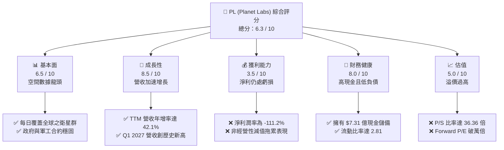
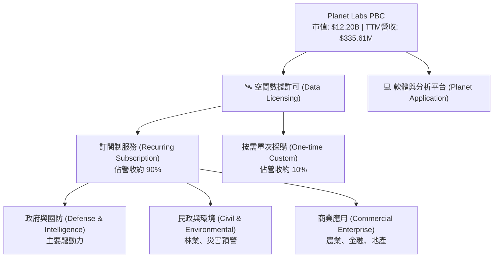
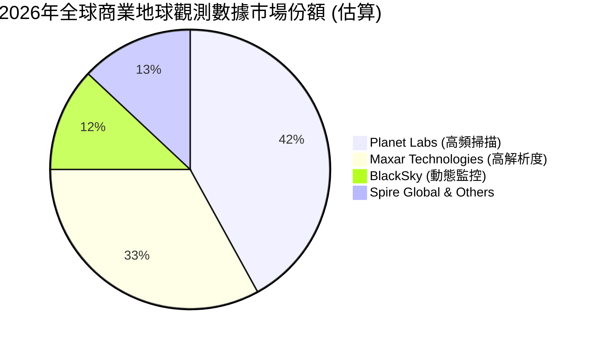
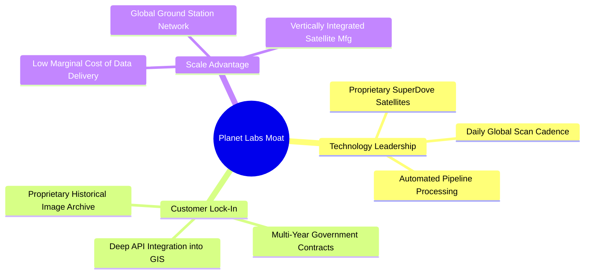

# PL 基本面深度分析報告
> **報告日期**：2026-06-11 ｜ **語言**：繁體中文 ｜ **數據來源**：Yahoo Finance, Finviz, StockAnalysis, Roic.ai ｜ **分析師**：CFA 級機構研究

---

## 目錄

| # | 章節 | 核心結論 |
|---|------|----------|
| 1 | 執行摘要 | 評級「持有」，目標價 $39.80，高估值伴隨強勁現金流轉折。 |
| 2 | 公司概覽與商業模式 | 每日地球掃描具獨佔性，訂閱制商業模式具備高客戶黏性。 |
| 3 | 損益表深度分析 | 營收年增達 42.1%，非經營性支出拖累淨利，但毛利率維持高檔。 |
| 4 | 資產負債表分析 | 淨現金達 $2.43 億，流動比率 2.81，短期財務結構極為穩健。 |
| 5 | 現金流量深度分析 | 營運現金流首度轉正達 $1.32 億，自由現金流 $8,485 萬，為最大亮點。 |
| 6 | 獲利能力與資本效率 | 帳面 ROE 為 -84.0%，ROIC 仍受制於未達損益平衡，經濟價值暫時為負。 |
| 7 | 估值深度分析 | P/S 比率高達 36.36 倍，相較同業溢價顯著，DCF 基準目標價 $39.80。 |
| 8 | 成長催化劑 | 國防情報需求激增與商業 AI 空間數據應用為中長期驅動力。 |
| 9 | 風險矩陣 | 面臨發射失敗、政府客戶集中度高與高估值回檔之風險。 |
| 10 | 投資建議 | 適合高風險偏好的成長型投資人，建議於 $30 以下分批佈局。 |

---

## 1. 執行摘要

### 1.1 核心評分儀表板



### 1.2 評分進度條視覺化

```
╔══════════════════════════════════════════════════════════════╗
║                PL 多維度評分儀表板 (1-10分)                  ║
╠══════════════════════════════════════════════════════════════╣
║ 基本面強度  6.5 ▓▓▓▓▓▓▓▓▓▓▓▓▓░░░░░░░  ★★★☆☆           ║
║ 成長動能    8.5 ▓▓▓▓▓▓▓▓▓▓▓▓▓▓▓▓▓░░  ★★★★☆           ║
║ 獲利品質    3.5 ▓▓▓▓▓▓░░░░░░░░░░░░░░  ★☆☆☆☆           ║
║ 財務健康    8.0 ▓▓▓▓▓▓▓▓▓▓▓▓▓▓▓▓░░░░  ★★★★☆           ║
║ 估值合理性  5.0 ▓▓▓▓▓▓▓▓▓▓░░░░░░░░░░  ★★☆☆☆           ║
║ 護城河深度  7.5 ▓▓▓▓▓▓▓▓▓▓▓▓▓▓▓░░░░░  ★★★☆☆           ║
║ 管理層執行  6.0 ▓▓▓▓▓▓▓▓▓▓▓▓░░░░░░░░  ★★★☆☆           ║
║ 技術創新力  8.5 ▓▓▓▓▓▓▓▓▓▓▓▓▓▓▓▓▓░░  ★★★★☆           ║
╠══════════════════════════════════════════════════════════════╣
║ 綜合總分    6.3 ▓▓▓▓▓▓▓▓▓▓▓▓░░░░░░░░  🏆 成長型/高風險標的 ║
╚══════════════════════════════════════════════════════════════╝
```

### 1.3 五大投資論點 + 三大核心風險

| 類型 | 項目 | 具體依據 | 信心度 |
|------|------|----------|--------|
| 🟢 **投資論點①** | **營收成長顯著加速** | TTM 營收成長率達 42.1%，Q1 2027 單季營收達 $9,415 萬，連續多季維持高成長。 | 🟢 極高 |
| 🟢 **投資論點②** | **現金流轉折點已現** | FY2026 營運現金流達 $1.34 億，自由現金流達 $5,141 萬，擺脫過去失血狀態。 | 🟢 極高 |
| 🟢 **投資論點③** | **資產負債表極為強韌** | 持有 $7.31 億現金與短期投資，相較於 $4.88 億總債務，處於淨現金狀態。 | 🟢 高 |
| 🟢 **投資論點④** | **高毛利訂閱制商業模式** | 混合毛利率維持在 55.6%，隨著軟體平台規模化，長期毛利率具備向 70% 靠攏潛力。 | 🟡 中度 |
| 🟢 **投資論點⑤** | **地緣政治催化軍工需求** | 烏俄戰爭與全球地緣衝突，顯著提升各國政府對每日高頻地球觀測數據的依賴。 | 🟢 高 |
| 🟡 **風險①** | **客戶集中度與合約波動** | 政府與國防合約佔比較高，合約續約時間與政府預算撥款進度具不確定性。 | 🟡 中度 |
| 🔴 **風險②** | **非經營性資產減值風險** | 近期季度淨虧損擴大（Q1 2027 淨損 $1.39 億），主因非經營性費用與資產減損。 | 🔴 高衝擊 |
| 🔴 **風險③** | **估值溢價過高** | 當前 P/S 為 36.36 倍，遠高於航太防衛同業平均，若成長放緩將面臨估值修正。 | 🔴 高衝擊 |

### 1.4 快速統計卡片

| 指標 | 公司實際值 | 行業均值 (Aerospace & Defense) | S&P 500 均值 | 狀態 |
|------|-------------|----------|--------------|------|
| 收入 YoY 成長 | **42.1%** | ~12.5% | ~6.5% | 🟢 強勁 |
| 毛利率 | **55.6%** | ~22.0% | ~30.0% | 🟢 優異 |
| 淨利率 | **-111.2%** | ~6.2% | ~11.5% | 🔴 虧損中 |
| ROE | **-84.0%** | ~14.5% | ~18.0% | 🔴 表現不佳 |
| Forward P/E | **10282.28x** | ~24.5x | ~21.5x | 🔴 極度高估 |
| 淨現金 / 債務 | **$2.43 億** | 多數為淨債務 | 多數為淨債務 | 🟢 穩健 |

### 1.5 投資結論

```
╔══════════════════════════════════════════════════════════════════╗
║                    📊 PL 投資結論摘要                            ║
╠══════════════════════════════════════════════════════════════════╣
║  評級：🟡 持有 (Hold)                                            ║
║  當前股價：$34.24  (2026-06-11)                                  ║
║  目標價區間：                                                    ║
║    悲觀情境：$20.00（-41.6%）                                    ║
║    基準情境：$39.80（+16.2%）  ← 12個月主要目標                  ║
║    樂觀情境：$53.00（+54.8%）                                    ║
║  投資評分：6.3 / 10                                              ║
║  適合投資人：具備極高風險承受能力、看好空間數據長期發展的成長型買家║
╚══════════════════════════════════════════════════════════════════╝
```

---

## 2. 公司概覽與商業模式

### 2.1 業務結構與收入來源

Planet Labs (PL) 的核心業務圍繞其龐大的低地球軌道 (LEO) 衛星群。其獨特之處在於「每日掃描」全球陸地的能力，並將採集的數據轉化為高毛利的訂閱服務。



### 2.2 市場份額

在商業高頻地球觀測（Ground Sampling Distance < 5米）市場中，Planet Labs 憑藉其數百顆 SuperDove 衛星組成的星座，在「全球每日覆蓋頻次」維度上佔據絕對領先地位。



### 2.3 競爭護城河分析



### 2.4 護城河強度評分

```
╔══════════════════════════════════════════════════════════════╗
║                    PL 護城河強度評分                         ║
╠══════════════════════════════════════════════════════════════╣
║ 每日全球掃描   9.0/10 ▓▓▓▓▓▓▓▓▓▓▓▓▓▓▓▓▓▓░░  🏆 行業唯一    ║
║ 歷史數據累積   8.5/10 ▓▓▓▓▓▓▓▓▓▓▓▓▓▓▓▓░░░░  🟢 十年歷史存檔║
║ 客戶轉移成本   7.0/10 ▓▓▓▓▓▓▓▓▓▓▓▓▓░░░░░░░  🟢 API 深度嵌入║
║ 衛星製造與發射 6.5/10 ▓▓▓▓▓▓▓▓▓▓▓░░░░░░░░░  🟡 依賴第三方發射║
╠══════════════════════════════════════════════════════════════╣
║ 綜合護城河     7.8/10 ▓▓▓▓▓▓▓▓▓▓▓▓▓▓▓░░░░░  🏆 強大數據壁壘 ║
╚══════════════════════════════════════════════════════════════╝
```

---

## 3. 損益表深度分析

### 3.1 年度收入成長趨勢（近4年）

```
╔══════════════════════════════════════════════════════════════════╗
║                  PL 年度收入趨勢 (FY2023 - FY2026)               ║
╠══════════════════════════════════════════════════════════════════╣
║                                                                  ║
║  FY 2023  $191.26M  ██████████░░░░░░░░░░░░░░░░░░░  YoY: +45.8%   ║
║  FY 2024  $220.70M  ████████████░░░░░░░░