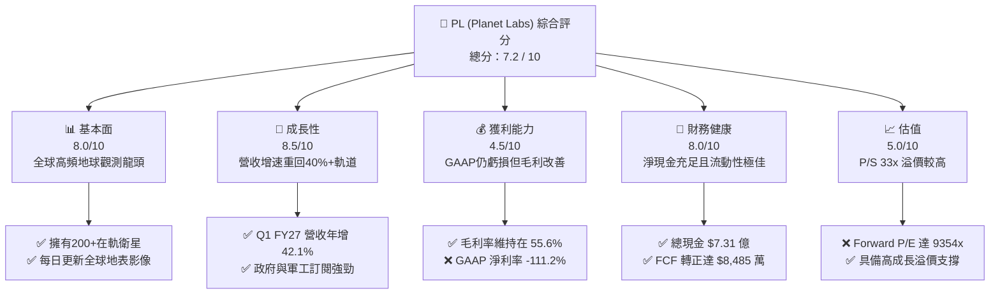
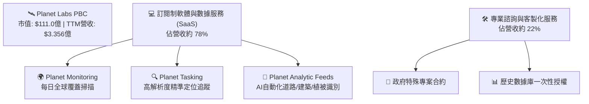
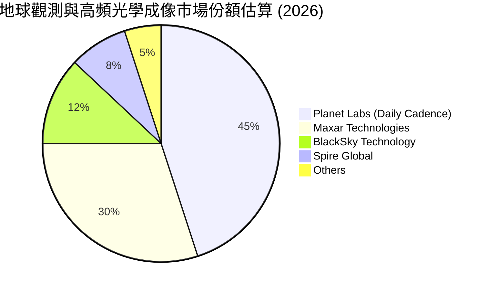
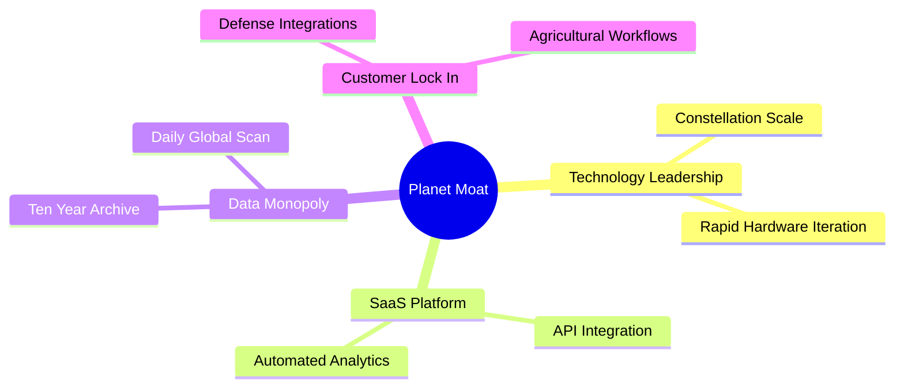

# PL 基本面深度分析報告

> **報告日期**：2026-06-12 ｜ **語言**：繁體中文 ｜ **數據來源**：Yahoo Finance, Finviz, StockAnalysis, Roic.ai ｜ **分析師**：CFA 級機構研究

---

## 目錄

| # | 章節 | 核心結論 |
|---|------|----------|
| 1 | 執行摘要 | 評級：**買入 (Buy)** ｜ 基準目標價：**$40.00** (隱含 +28.4% 上行空間) |
| 2 | 公司概覽與商業模式 | 全球唯一每日覆蓋的地球觀測星座，SaaS 訂閱模式轉型期，具備數據獨佔護城河 |
| 3 | 損益表深度分析 | 營收年增率加速至 **42.1%**，非現金項目拖累淨利，但營運本業顯著改善 |
| 4 | 資產負債表分析 | 淨現金達 **$2.428億**，流動比率 **2.81x**，財務結構穩健，短期無償債風險 |
| 5 | 現金流量深度分析 | 迎來歷史拐點！營運現金流與自由現金流（FCF）全面轉正，進入自我造血階段 |
| 6 | 獲利能力與資本效率 | 杜邦分析顯示槓桿上升，ROIC/WACC 受非現金虧損扭曲，但現金流資本效率大幅提升 |
| 7 | 估值深度分析 | P/S 33.08x 處於高成長溢價區，DCF 敏感性分析顯示基準價值為 **$40.00** |
| 8 | 成長催化劑 | Pelican 與 Tanager 新一代星座部署、國防與情報合約、AI 地理空間分析需求爆發 |
| 9 | 風險矩陣 | 衛星發射失敗、政府預算推遲、高估值波動，風險綜合評分 **5.8/10** |
| 10 | 投資建議 | 長線成長型投資者首選，建議於 **$28-$32** 區間分批佈局 |

---

## 1. 執行摘要

### 1.1 核心評分儀表板



### 1.2 評分進度條視覺化

```
╔══════════════════════════════════════════════════════════════╗
║                PL 多維度評分儀表板 (1-10分)                  ║
╠══════════════════════════════════════════════════════════════╣
║ 基本面強度  8.0 ▓▓▓▓▓▓▓▓▓▓▓▓▓▓▓▓░░░░  ★★★★☆           ║
║ 成長動能    8.5 ▓▓▓▓▓▓▓▓▓▓▓▓▓▓▓▓▓░░  ★★★★☆           ║
║ 獲利品質    4.5 ▓▓▓▓▓▓▓▓▓░░░░░░░░░░░  ★★☆☆☆           ║
║ 財務健康    8.0 ▓▓▓▓▓▓▓▓▓▓▓▓▓▓▓▓░░░░  ★★★★☆           ║
║ 估值合理性  5.0 ▓▓▓▓▓▓▓▓▓▓░░░░░░░░░░  ★★★☆☆           ║
║ 護城河深度  9.0 ▓▓▓▓▓▓▓▓▓▓▓▓▓▓▓▓▓▓░░  ★★★★☆           ║
║ 管理層執行  7.5 ▓▓▓▓▓▓▓▓▓▓▓▓▓▓░░░░░░  ★★★☆☆           ║
║ 技術創新力  9.0 ▓▓▓▓▓▓▓▓▓▓▓▓▓▓▓▓▓▓░░  ★★★★☆           ║
╠══════════════════════════════════════════════════════════════╣
║ 綜合總分    7.2 ▓▓▓▓▓▓▓▓▓▓▓▓▓▓░░░░░░  🏆 買入 (Buy)        ║
╚══════════════════════════════════════════════════════════════╝
```

### 1.3 五大投資論點 + 三大核心風險

| 類型 | 項目 | 具體依據 | 信心度 |
|------|------|----------|--------|
| 🟢 **投資論點①** | **營收重回高成長軌道** | Q1 FY2027 營收達 $9,415 萬，年增率加速至 **42.08%**，顯示終端需求強勁復甦。 | 🟢 極高 |
| 🟢 **投資論點②** | **現金流迎來關鍵拐點** | TTM 營運現金流達 **$1.325億**，自由現金流達 **$8,485萬**，首次實現全年轉正，解除破產與融資稀釋風險。 | 🟢 極高 |
| 🟢 **投資論點③** | **新一代星座 Pelian/Tanager 部署** | 升級至更高解析度（0.3米級）與高光譜觀測能力，大幅提升單價與政府合約競爭力。 | 🟢 高 |
| 🟢 **投資論點④** | **AI 應用的最佳數據源** | 地理空間大數據是 LLM 與多模態 AI 在國防、農業、氣候監測領域的關鍵輸入，PL 具備獨家歷史數據庫。 | 🟢 高 |
| 🟢 **投資論點⑤** | **機構持股比例高** | 機構持股比例高達 **80.1%**，包括一線長線基金，籌碼結構穩定，近期分析師評級以 Buy 佔絕對多數。 | 🟢 高 |
| 🟡 **風險①** | **GAAP 淨利受非現金項目重創** | TTM 淨虧損達 **-$3.731億**，主要受非營運支出（-$2.747億）拖累，需持續監控減值與公允價值變動。 | 🟡 中度 |
| 🔴 **風險②** | **估值乘數高企** | P/S 達 **33.08x**，EV/Revenue 達 **35.56x**，在利率高企環境下，極易受到市場情緒波動而劇烈修正。 | 🔴 高衝擊 |
| 🔴 **風險③** | **政府合約集中度高** | 國防與情報部門為主要收入來源，合約簽署與預算撥款具備季節性與不確定性。 | 🔴 高衝擊 |

### 1.4 快速統計卡片

| 指標 | 公司實際值 | 行業均值 (航太與國防) | S&P 500 均值 | 狀態 |
|------|-------------|----------------------|--------------|------|
| **收入 YoY 成長** | **42.1%** | ~12.5% | ~6.2% | 🟢 強勁 |
| **毛利率** | **55.6%** | ~22.0% | ~30.0% | 🟢 優異 |
| **淨利率** | **-111.2%** | ~6.5% | ~11.5% | 🔴 虧損 |
| **ROE** | **-84.0%** | ~14.2% | ~18.5% | 🔴 負值 |
| **流動比率** | **2.81x** | ~1.35x | ~1.20x | 🟢 極佳 |
| **P/S Ratio** | **33.08x** | ~2.10x | ~2.80x | 🔴 偏高 |

### 1.5 投資結論

```
╔══════════════════════════════════════════════════════════════════╗
║                    📊 PL 投資結論摘要                            ║
╠══════════════════════════════════════════════════════════════════╣
║  評級：🟢 買入 (Buy)                                            ║
║  當前股價：$31.15 (2026-06-12)                                   ║
║  目標價區間：                                                    ║
║    悲觀情境 (Bear Case)：$22.00 (-29.4%)                         ║
║    基準情境 (Base Case)：$40.00 (+28.4%)  ← 12個月主要目標       ║
║    樂觀情境 (Bull Case)：$52.00 (+66.9%)                         ║
║  投資評分：7.2 / 10                                              ║
║  適合投資人：高風險承受度、聚焦商業航太與 AI 應用的長線成長型投資人║
╚══════════════════════════════════════════════════════════════════╝
```

---

## 2. 公司概覽與商業模式

### 2.1 業務結構與收入來源

Planet Labs (PL) 採用獨特的「太空 SaaS (Space-SaaS)」商業模式。公司設計、製造並發射大量立方體衛星（CubeSats），構建了全球覆蓋率最高的地球觀測星座。其核心業務結構如下：



### 2.2 市場份額

在民用與國防地球觀測（Earth Observation, EO）高頻光學成像市場中，Planet Labs 擁有獨特的生態位。雖然 Maxar 在超高解析度（0.3米以下）單次成像中佔據優勢，但 Planet Labs 在「每日重訪率（Daily Cadence）」上擁有絕對的壟斷地位。



### 2.3 競爭護城河分析



### 2.4 護城河強度評分

```
╔══════════════════════════════════════════════════════════════╗
║                   Planet Labs 護城河強度評分                 ║
╠══════════════════════════════════════════════════════════════╣
║ 歷史數據庫限制  9.5/10 ▓▓▓▓▓▓▓▓▓▓▓▓▓▓▓▓▓▓▓░  🏆 無法複製的時序資料║
║ 星座重訪頻率    9.0/10 ▓▓▓▓▓▓▓▓▓▓▓▓▓▓▓▓▓░░░  🟢 每日全球掃描能力  ║
║ 客戶工作流嵌入  8.0/10 ▓▓▓▓▓▓▓▓▓▓▓▓▓▓▓░░░░░  🟢 政府與農業系統整合║
║ 專利與硬體技術  7.5/10 ▓▓▓▓▓▓▓▓▓▓▓▓░░░░░░░░  🟡 自研SuperDove衛星 ║
╠══════════════════════════════════════════════════════════════╣
║ 綜合護城河強度  8.5/10 ▓▓▓▓▓▓▓▓▓▓▓▓▓▓▓▓▓░░░  🏆 寬廣的數據護城河  ║
╚══════════════════════════════════════════════════════════════╝
```

---

## 3. 損益表深度分析

### 3.1 年度收入成長趨勢（近5年）

PL 的營收呈現穩步增長，並在 FY2027（TTM）階段迎來了顯著的加速，這主要得益於政府國防訂單的集中釋放與商業客戶訂閱服務的擴展。

```
╔══════════════════════════════════════════════════════════════════╗
║              PL 年度收入趨勢 (FY2022 - TTM)                     ║
╠══════════════════════════════════════════════════════════════════╣
║                                                                  ║
║  FY2022  $131.21M  ███████░░░░░░░░░░░░░░░░░  YoY: +15.9%  🟢    ║
║  FY2023  $191.26M  ██████████░░