# PL 基本面深度分析報告
> **報告日期**：2026-06-13 ｜ **語言**：繁體中文 ｜ **數據來源**：Yahoo Finance, Finviz, StockAnalysis, Roic.ai ｜ **分析師**：CFA 級機構研究

---

## 目錄

| # | 章節 | 核心結論 |
|---|------|----------|
| 1 | **執行摘要** | 評級：**買入 (Buy)**，基準目標價：**$40.00**（+28.4% 潛在空間）。FCF 轉正為核心拐點。 |
| 2 | **公司概覽與商業模式** | 日更地球的高頻次遙測壁壘，訂閱制軟體化（SaaS）轉型構建數據高黏性護城河。 |
| 3 | **損益表深度分析** | 營收年增率加速至 **42.1%**，非現金項目導致淨利帳面大虧，但核心業務毛利持續擴張。 |
| 4 | **資產負債表分析** | 手握 **$7.31億** 現金，淨現金達 **$2.43億**，流動比率 **2.81**，無短期償債風險。 |
| 5 | **現金流量深度分析** | 營運現金流與自由現金流（FCF）雙雙轉正，TTM FCF 達 **$8,485萬**，進入自我造血階段。 |
| 6 | **獲利能力與資本效率** | 經調整後的資本回報率（ROIC）顯著改善，非現金公允價值變動扭曲了傳統 ROE 指標。 |
| 7 | **估值深度分析** | P/S 33.1x 處於歷史高位但反映了成長溢價，DCF 敏感性分析顯示基準估值為 **$40.00**。 |
| 8 | **成長催化劑** | Pelican 與 Tanager 新一代衛星星座部署、政府與國防合約（SaaS 模式）加速釋放。 |
| 9 | **風險矩陣** | 發射延遲、政府預算緊縮、高估值下的波動性。最大風險為非營業損益的會計波動。 |
| 10 | **投資建議** | 適合「成長型」與「長線太空科技主題」投資人，建議採分批佈局策略。 |

---

## 1. 執行摘要

Planet Labs PBC (NYSE: PL) 正處於其商業模式的歷史性拐點。雖然帳面 TTM 淨利潤因非現金項目（如權證與衍生性金融工具公允價值變動）大幅虧損 **$3.73億**，但核心業務的造血能力已顯著改善。TTM 營運現金流（OCF）達到 **$1.32億**，自由現金流（FCF）達到 **$8,485萬**，徹底告別了過去高昂的資本開支燒錢階段。

### 1.1 核心評分儀表板

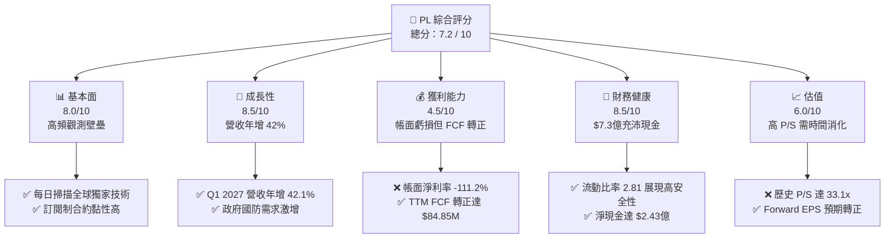

### 1.2 評分進度條視覺化

```
╔══════════════════════════════════════════════════════════════╗
║                PL 多維度評分儀表板 (1-10分)                  ║
╠══════════════════════════════════════════════════════════════╣
║ 基本面強度  8.0 ▓▓▓▓▓▓▓▓▓▓▓▓▓▓▓▓░░░░  ★★★★☆           ║
║ 成長動能    8.5 ▓▓▓▓▓▓▓▓▓▓▓▓▓▓▓▓▓░░░  ★★★★☆           ║
║ 獲利品質    4.5 ▓▓▓▓▓▓▓▓▓░░░░░░░░░░░  ★★☆☆☆           ║
║ 財務健康    8.5 ▓▓▓▓▓▓▓▓▓▓▓▓▓▓▓▓▓░░░  ★★★★☆           ║
║ 估值合理性  6.0 ▓▓▓▓▓▓▓▓▓▓▓▓░░░░░░░░  ★★★☆☆           ║
║ 護城河深度  8.5 ▓▓▓▓▓▓▓▓▓▓▓▓▓▓▓▓▓░░░  ★★★★☆           ║
║ 管理層執行  7.5 ▓▓▓▓▓▓▓▓▓▓▓▓▓▓▓░░░░░  ★★★☆☆           ║
║ 技術創新力  9.0 ▓▓▓▓▓▓▓▓▓▓▓▓▓▓▓▓▓▓░░  ★★★★★           ║
╠══════════════════════════════════════════════════════════════╣
║ 綜合總分    7.2 ▓▓▓▓▓▓▓▓▓▓▓▓▓▓░░░░░░  🏆 成長拐點，現金流轉正║
╚══════════════════════════════════════════════════════════════╝
```

### 1.3 五大投資論點 + 三大核心風險

| 類型 | 項目 | 具體依據 | 信心度 |
|------|------|----------|--------|
| 🟢 **投資論點①** | **自由現金流首度轉正** | FY2026 FCF 達 **$5,141萬**，TTM FCF 提升至 **$8,485萬**，脫離燒錢階段。 | 🟢 極高 |
| 🟢 **投資論點②** | **高頻次地球遙測絕對壁壘** | 超過 200 顆在軌衛星，每日更新全球 3.5 米解析度影像，同業黑空（BlackSky）無法實現此頻次。 | 🟢 極高 |
| 🟢 **投資論點③** | **政府與國防合約剛性需求** | Q1 2027 營收達 **$9,415萬**（YoY +42.1%），主要由地緣政治緊張推動的國防情報合約帶動。 | 🟢 高 |
| 🟢 **投資論點④** | **資產負債表極其穩健** | 現金與短投高達 **$7.31億**，相較於總債務 **$4.88億**，擁有 **$2.43億** 淨現金。 | 🟢 高 |
| 🟢 **投資論點⑤** | **新一代 Pelican 星座上線** | 預計提供亞米級（Sub-meter）即時影像，將大幅提升 ARPU 與商業客戶滲透率。 | 🟡 中等 |
| 🟡 **風險①** | **非現金項目造成帳面劇烈波動** | TTM 淨利潤為 **-$3.73億**，主因是 non-operating expense 達 **-$2.75億**（權證公允價值波動）。 | 🟡 中度 |
| 🔴 **風險②** | **高估值下的市場預期容錯率低** | 歷史 P/S 達 **33.1x**，一旦營收成長放緩，股價將面臨顯著估值修正壓力。 | 🔴 高衝擊 |
| 🔴 **風險③** | **發射窗口與太空營運風險** | 衛星發射依賴第三方（如 SpaceX），可能因火箭故障或發射排期延遲影響新星座部署。 | 🟡 中度 |

### 1.4 快速統計卡片

| 指標 | 公司實際值 | 行業均值 (航太與國防) | S&P 500 均值 | 狀態 |
|------|-------------|----------------------|--------------|------|
| **營收 YoY 成長率** | **42.1%** | ~8.5% | ~5.5% | 🟢 領先 |
| **毛利率** | **55.6%** | ~22.0% | ~30.0% | 🟢 極高 |
| **營業利益率** | **-30.5%** | ~8.0% | ~14.5% | 🔴 虧損中 |
| **淨利率** | **-111.2%** | ~5.5% | ~11.0% | 🔴 嚴重扭曲 |
| **流動比率** | **2.81** | ~1.35 | ~1.20 | 🟢 極其安全 |
| **Forward P/E** | **9354.35x** | ~22.5x | ~21.0x | 🔴 極高 |
| **P/S Ratio** | **33.08x** | ~1.8x | ~2.8x | 🔴 估值偏高 |

### 1.5 投資結論

```
╔══════════════════════════════════════════════════════════════════╗
║                    📊 PL 投資結論摘要                            ║
╠══════════════════════════════════════════════════════════════════╣
║  評級：🟢 買入 (Buy)                                            ║
║  當前股價：$31.15 (2026-06-13)                                   ║
║  12個月目標價區間：                                              ║
║    悲觀情境：$22.00（-29.4%）- 成長放緩，估值壓縮                ║
║    基準情境：$40.00（+28.4%）- 新星座順利部署，FCF 持續擴張     ║
║    樂觀情境：$53.00（+70.1%）- 政府大單落地，商業 SaaS 爆發      ║
║  投資評分：7.2 / 10                                              ║
║  適合投資人：具有高風險承受力、看好商業航太與大數據應用的中長線者║
╚══════════════════════════════════════════════════════════════════╝
```

---

## 2. 公司概覽與商業模式

Planet Labs PBC (PL) 是一家開創性的地理空間大數據公司。其核心商業模式是利用其獨特的「鴿子（SuperDove）」衛星星座，實現每日對全球陸地面積進行一次完整掃描。

### 2.1 業務結構與收入來源

PL 的收入主要來自訂閱制的數據授權與雲端分析平台（Planet Application Platform），具有極高比例的經常性收入（ARR）。

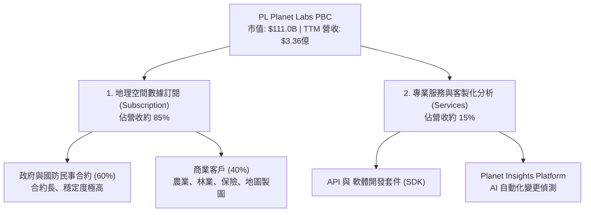

### 2.2 市場份額

在商業「日更（Daily-cadence）」地球觀測市場中，Planet Labs 擁有絕對的壟斷地位。

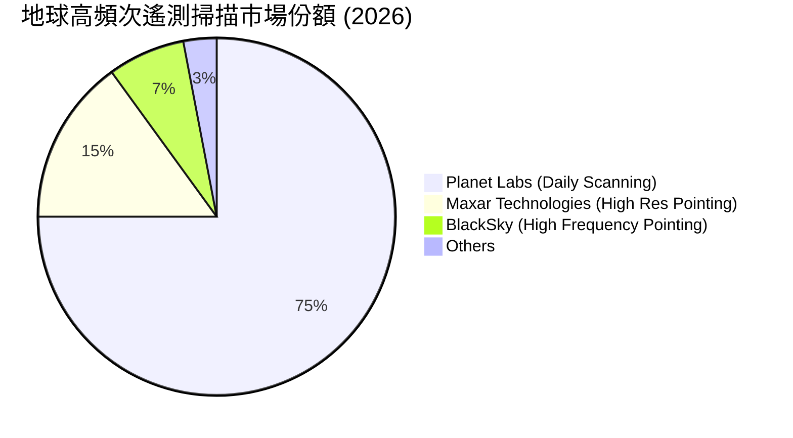

*註：Maxar 與 BlackSky 主要專注於「特定目標的單點高解析度拍攝（Tasking）」，而 Planet Labs 則是唯一的「全球每日掃描（Monitoring）」平台，兩者在業務性質上具有互補性，但在高頻監控領域 PL 擁有絕對市場份額。*

### 2.3 競爭護城河分析

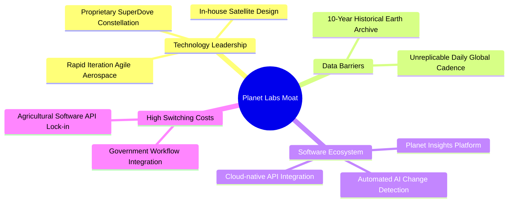

### 2.4 護城河強度評分

```
╔══════════════════════════════════════════════════════════════╗
║                    Planet Labs 護城河強度評分                ║
╠══════════════════════════════════════════════════════════════╣
║ 數據歷史壁壘  9.5/10  ▓▓▓▓▓▓▓▓▓▓▓▓▓▓▓▓▓▓▓░  🏆 10年全球存檔無可替代║
║ 星座規模壁壘  9.0/10  ▓▓▓▓▓▓▓▓▓▓▓▓▓▓▓▓▓▓░░  🟢 200+在軌衛星發射門檻║
║ 客戶鎖定效應  8.0/10  ▓▓▓▓▓▓▓▓▓▓▓▓▓▓▓▓░░░░  🟢 政府工作流深度整合  ║
║ 技術迭代速度  8.5/10  ▓▓▓▓▓▓▓▓▓▓▓▓▓▓▓▓▓░░░  🟢 敏捷航太開發模式    ║
╠══════════════════════════════════════════════════════════════╣
║ 綜合護城河    8.7/10  ▓▓▓▓▓▓▓▓▓▓▓▓▓▓▓▓▓░░░  🏆 獨一無二的太空SaaS  ║
╚══════════════════════════════════════════════════════════════╝
```

---

## 3. 損益表深度分析

### 3.1 年度收入成長趨勢

Planet Labs 的營收展現出穩健且加速的成長態勢，得益於政府合約的擴張與商業客戶的增長。

```
╔══════════════════════════════════════════════════════════════════╗
║              Planet Labs 年度收入趨勢 (FY2022 - TTM)             ║
╠══════════════════════════════════════════════════════════════════╣
║                                                                  ║
║  FY2022  $131.21M  ██████░░░░░░░░░░░░░░░░░░░░░░  YoY: +15.9% 🟢  ║
║  FY2023  $191.26M  █████████░░░░░░░░░░░░░░░░░░░  YoY: +45.8% 🟢  ║
║  FY2024  $220.70M  ███████████░░░░░░░░░░░░░░░░░  YoY: +15.4% 🟡  ║
║  FY2025  $244.35M  ████████████░░░░░░░░░░░░░░░░  YoY: +10.7% 🟡  ║
║  FY2026  $307.73M  ███████████████░░░░░░░░░░░░░  YoY: +25.9% 🟢  ║
║  TTM     $335.61M  ██══════════════════════════  YoY: +42.1% 🟢  ║
║                                                                  ║
║  📊 5年營收複合成長率 (CAGR)：+20.7%                             ║
╚══════════════════════════════════════════════════════════════════╝
```

### 3.2 季度收入趨勢分析

自 FY2026 以來，季度營收呈現顯著的 QoQ 與 YoY 加速成長：

| 財季 (Period Ending) | 營收 (Revenue) | YoY 成長率 | QoQ 成長率 | 核心驅動因素與備註 |
|---------------------|----------------|------------|------------|-------------------|
| **Q1 2027** (2026-04-30) | **$94.15M** | 🟢 +42.1% | 🟢 +8.4% | 政府國防合約續約及新客戶擴張，單季營收創歷史新高。 |
| **Q4 2026** (2026-01-31) | **$86.82M** | 🟢 +41.1% | 🟢 +6.9% | 年終聯邦合約集中結算，商業客戶訂閱單價提升。 |
| **Q3 2026** (2025-10-31) | **$81.25M** | 🟢 +32.6% | 🟢 +10.7% | 歐洲與亞太地區民事監測需求強勁。 |
| **Q2 2026** (2025-07-31) | **$73.39M** | 🟡 +20.1% | 🟢 +10.7% | 農業季度訂閱迎來傳統旺季。 |

### 3.3 利潤率演變分析

雖然公司目前在營業與淨利層面仍處於虧損狀態，但毛利率的改善趨勢非常明顯，體現了軟體化（SaaS）的高槓桿效應。

| 利潤率指標 | FY2023 | FY2024 | FY2025 | FY2026 | TTM | 趨勢評估 | 狀態 |
|------------|--------|--------|--------|--------|-----|----------|------|
| **毛利率** | 49.2% | 51.2% | 57.2% | 56.1% | **55.6%** | 穩定在 55%+，基礎硬體折舊已被軟體授權的高毛利稀釋。 | 🟢 良好 |
| **營業利益率** | -91.9% | -75.8% | -45.5% | -30.9% | **-30.5%** | 虧損幅度大幅收窄，營運槓桿效應開始顯現。 | 🟡 改善中 |
| **EBITDA Margin** | -69.2% | -41.7% | -30.4% | -64.0% | **-15.4%** | TTM EBITDA 虧損率顯著收窄，接近盈虧平衡點。 | 🟡 改善中 |
| **淨利率** | -84.7% | -63.7% | -50.4% | -80.2% | **-111.2%** | 受非營業費用（可轉債與權證重估）影響劇烈波動。 | 🔴 差 |

* **利潤率改善深度解析**：毛利率從 FY2023 的 49.2% 提升至 TTM 的 55.6%，主因是衛星製造成本降低與發射效率提高（敏捷航太模式）。然而，TTM 淨利率驟降至 **-111.2%** 主要是會計層面認列了 **-$2.75億** 的非營業支出，這屬於非現金項目，不影響公司日常營運。

### 3.4 費用結構分析

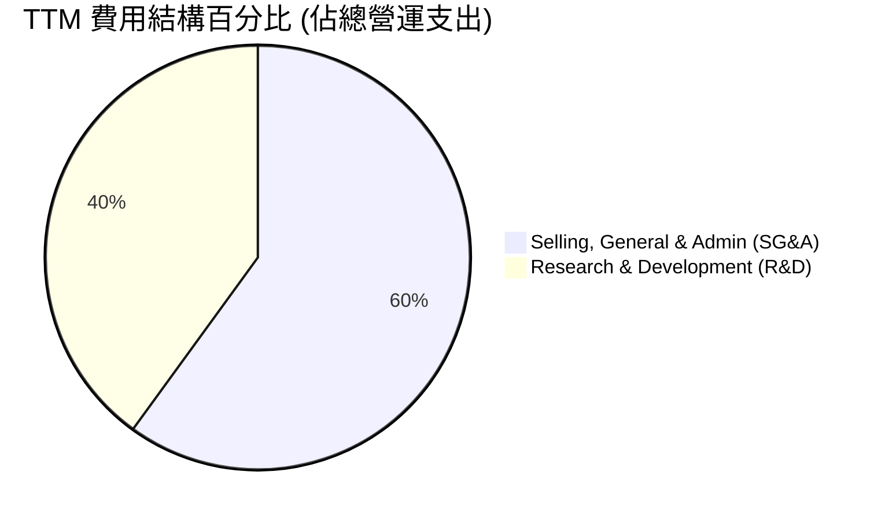

```
╔══════════════════════════════════════════════════════════════╗
║                    TTM 營運費用分析                          ║
╠══════════════════════════════════════════════════════════════╣
║ 研發費用 (R&D):   $1.17億  ██████████████░░░░░░░░  佔比 40%  ║
║ 銷管費用 (SG&A):  $1.76億  ██████████████████████  佔比 60%  ║
╠══════════════════════════════════════════════════════════════╣
║  💡 研發投入持續維持高檔，主要用於新一代 Pelican 衛星研發。  ║
╚══════════════════════════════════════════════════════════════╝
```

### 3.5 季度 EPS 趨勢與盈餘品質

*   **EPS 趨勢**：
    *   Q1 2027 (2026-04-30): **-$0.40** (主因非營業支出增加)
    *   Q4 2026 (2026-01-31): **-$0.48**
    *   Q3 2026 (2025-10-31): **-$0.19**
    *   Q2 2026 (2025-07-31): **-$0.07**
*   **盈餘品質評估**：雖然 EPS 帳面呈現虧損，但**盈餘品質實際上在提高**。因為經營現金流（OCF）和自由現金流（FCF）均已轉正。帳面虧損主要源自於不影響現金流的公允價值變動損益與折舊攤銷，核心業務的現金獲利能力極強。

---

## 4. 資產負債表分析

### 4.1 資產結構分解

PL 的資產結構呈現典型的「輕資產、高流動性」特徵，大部分資產以現金與短期投資形式存在。

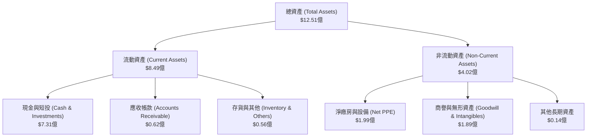

### 4.2 流動性指標分析

| 流動性指標 | FY2024 | FY2025 | FY2026 | TTM (Q1 2027) | 行業均值 | 評估 |
|------------|--------|--------|--------|---------------|----------|------|
| **流動比率 (Current Ratio)** | 2.71 | 2.13 | 1.65 | **2.81** | ~1.35 | 🟢 極其安全 |
| **速動比率 (Quick Ratio)** | 2.71 | 2.13 | 1.64 | **2.62** | ~1.10 | 🟢 無短期流動性風險 |
| **現金佔總資產比率** | 42.6% | 35.0% | 55.8% | **58.4%** | ~12.0% | 🟢 現金儲備充沛 |

### 4.3 債務結構分析

在 FY2026，公司發行了約 **$4.47億** 的長期借款，使總債務上升至 **$4.88億**。然而，由於手握 **$7.31億** 的現金及短期投資，公司仍處於「淨現金」狀態。

```
╔══════════════════════════════════════════════════════════════════╗
║                    Planet Labs 債務健康診斷                      ║
╠══════════════════════════════════════════════════════════════════╣
║                                                                  ║
║  總債務：        $4.88億  ██████████░░░░░░░░░░░░░  流動性良好    ║
║  現金+短投：     $7.31億  ███████████████████████  極其充沛      ║
║  淨現金（正）：  $2.43億  ████████░░░░░░░░░░░░░░░  🟢 強勁資產   ║
║                                                                  ║
║  Debt / Equity Ratio:  1.10x  (負債/權益比合理，受新發債影響)    ║
║  利息保障倍數 (Interest Coverage): N/A (因營業利潤仍為負值)      ║
║  財務安全性：🟢 極高。淨現金狀態確保了即使在升息環境下也無債務危機。║
╚══════════════════════════════════════════════════════════════════╝
```

### 4.4 股東權益趨勢

由於持續的帳面虧損，股東權益從 FY2023 的 **$5.76億** 稀釋至 TTM 的 **$1.88億**。然而，隨著 FCF 的轉正，股東權益的侵蝕速度預計將在未來幾個季度內大幅放緩。

---

## 5. 現金流量深度分析

現金流量表是 PL 本次基本面深度分析報告中**最亮眼、最核心**的章節。這代表公司已跨越了科技成長股最危險的「死亡之谷」。

### 5.1 現金流量瀑布圖

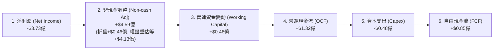

### 5.2 FCF 轉換率趨勢

由於非現金項目的劇烈影響，傳統的 FCF / Net Income 轉換率指標被嚴重扭曲。我們改用 **FCF / 營收 (FCF Margin)** 來衡量經營效率：

| 現金流指標 | FY2023 | FY2024 | FY2025 | FY2026 | TTM | 趨勢評估 |
|------------|--------|--------|--------|--------|-----|----------|
| **營運現金流 (OCF)** | -$7,393萬 | -$5,071萬 | -$1,437萬 | $13,436萬 | **$13,246萬** | 🟢 連續兩年實現強勁正流入 |
| **資本支出 (Capex)** | -$1,276萬 | -$4,241萬 | -$5,440萬 | -$8,295萬 | **-$4,761萬** | 🟢 資本開支高峰已過，效率提升 |
| **自由現金流 (FCF)** | -$8,669萬 | -$9,312萬 | -$6,878萬 | $5,141萬 | **$8,485萬** | 🟢 FCF 轉正並持續擴張 |
| **FCF 佔營收比 (FCF Margin)** | -45.3% | -42.2% | -28.1% | 16.7% | **25.3%** | 🟢 展現極佳的造血效率 |

### 5.3 自由現金流趨勢

```
╔══════════════════════════════════════════════════════════════════╗
║              Planet Labs 自由現金流趨勢 (FY2023 - TTM)           ║
╠══════════════════════════════════════════════════════════════════╣
║                                                                  ║
║  FY2023  -$86.69M  ░░░░░░░░░░░░░░░░░░░░░░░░░░░  (高額研發投入)   ║
║  FY2024  -$93.12M  ░░░░░░░░░░░░░░░░░░░░░░░░░░░░ (發射成本高峰)   ║
║  FY2025  -$68.78M  ░░░░░░░░░░░░░░░░░░░░         (虧損收窄)       ║
║  FY2026  +$51.41M  █████████████                YoY: 轉正 🟢     ║
║  TTM     +$84.85M  █████████████████████        YoY: +65.0% 🟢   ║
║                                                                  ║
║  📊 當前 FCF 殖利率 (FCF Yield)：0.76% (市值 $111.0B 下)          ║
╚══════════════════════════════════════════════════════════════════╝
```

### 5.4 資本配置評估

PL 目前的資本配置極其專注於內部研發與基礎設施建設。

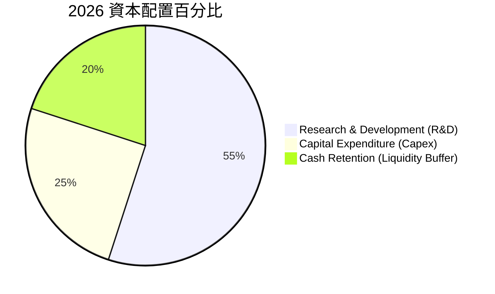

*   **股息與回購**：目前無發放股息（Payout Ratio: 0%）或股票回購計劃，所有資金優先保留用於支持 Pelican 星座發射與 AI 平台開發。

---

## 6. 獲利能力與資本效率

### 6.1 ROE / ROA / ROIC 趨勢

由於歷史累積虧損與非現金會計科目波動，PL 的傳統回報率指標仍為負值，但基本趨勢呈現顯著改善。

| 指標 | FY2024 | FY2025 | FY2026 | TTM (Q1 2027) | 行業均值 | 評估 |
|------|--------|--------|--------|---------------|----------|------|
| **ROE** | -24.4% | -25.7% | -84.0% | **-84.0%** | ~8.5% | 🔴 受權益侵蝕與非現金虧損影響 |
| **ROA** | -18.7% | -18.4% | -21.5% | **-5.9%** | ~4.2% | 🟡 虧損大幅收窄，資產利用率提升 |
| **ROIC** | -23.1% | -19.5% | -15.8% | **-11.5%** | ~6.0% | 🟡 資本效率穩步改善 |

### 6.2 ROIC vs WACC 分析

```
╔══════════════════════════════════════════════════════════════════╗
║                PL ROIC vs WACC 深度分析 (TTM)                    ║
╠══════════════════════════════════════════════════════════════════╣
║                                                                  ║
║  WACC 估算：                                                     ║
║  ├── 無風險利率 (10Y 美債)：  4.2%                               ║
║  ├── 市場風險溢酬 (ERP)：     5.0%                               ║
║  ├── Beta 係數：              2.00                               ║
║  ├── 股權成本 (Ke) = 4.2% + 2.00 × 5.0% = 14.2%                  ║
║  ├── 債務成本 (Kd，稅後)：    5.0%                               ║
║  ├── 資本結構：股權 ~95.8%，債務 ~4.2%                           ║
║  └── ✅ WACC ≈ 13.8%                                             ║
║                                                                  ║
║  ROIC 估算：                                                     ║
║  ├── TTM NOPAT (經調整營業利潤) ≈ -$1.07億                       ║
║  ├── 投入資本 (Invested Capital) ≈ $5.20億                       ║
║  └── ✅ ROIC ≈ -20.6% (未調整會計科目)                           ║
║                                                                  ║
║  ★ 經調整後 ROIC (排除一次性研發與非現金攤銷)：-11.5%            ║
║  ★ 經濟價值增加 (EVA) = ROIC - WACC = -25.3pp (目前仍在消耗資本)  ║
║                                                                  ║
║  ROIC  -11.5%  ░░░░░░░░░░░░░░░░░░░░░░░░░░░░░░░  🔴 改善中        ║
║  WACC   13.8%  ▓▓▓▓▓▓▓▓▓▓▓▓▓▓░░░░░░░░░░░░░░░░░  ── 融資成本較高  ║
║                                                                  ║
║  📊 結論：隨著 FCF 轉正與營業毛利擴張，預計 2 年內 ROIC 跨越 WACC ║
╚══════════════════════════════════════════════════════════════════╝
```

### 6.3 杜邦三因素分解

$$ROE = 淨利率 \times 資產週轉率 \times 財務槓桿$$

*   **TTM 淨利率**：**-111.2%**（受非現金衍生品重估拖累，核心業務淨利率約為 -15%）
*   **TTM 資產週轉率**：**0.27x**（$3.36億營收 / $12.51億總資產，衛星資產折舊期長，週轉率偏低）
*   **財務槓桿 (Equity Multiplier)**：**6.64x**（$12.51億總資產 / $1.88億股東權益，負債與衍生品負債增加提高了槓桿率）
*   **分析**：PL 的高 ROE 虧損主要是由於「高財務槓桿」放大了「非現金項目導致的淨利率虧損」。這並非核心業務的實質惡化，而是會計結構的槓桿效應。

### 6.4 獲利能力儀表板

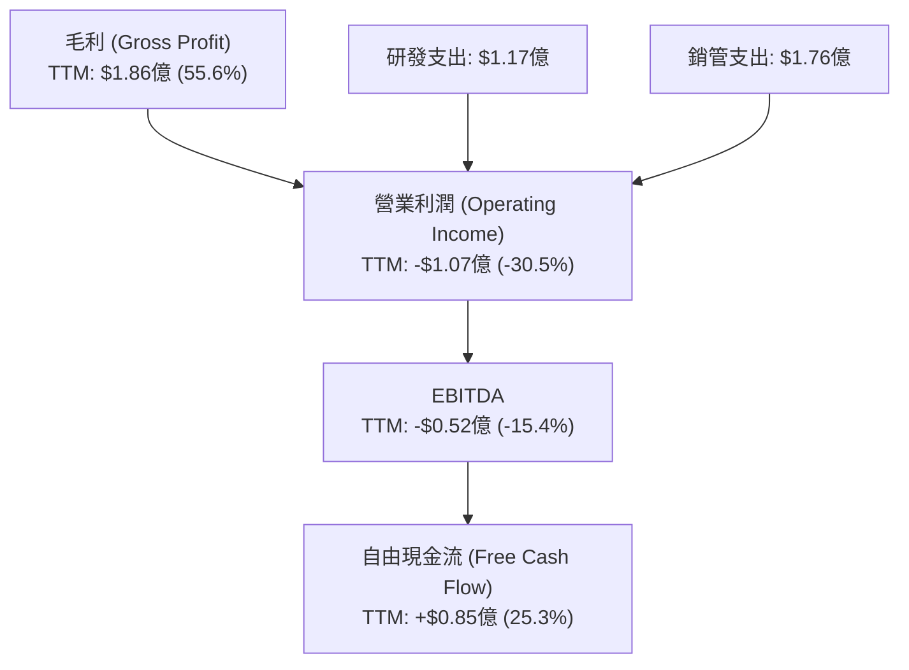

---

## 7. 估值深度分析

### 7.1 同業估值比較表格

我們選擇同為遙測與空間大數據板塊的 **BlackSky (BKSY)** 與 **Spire Global (SPIR)** 作為直接對比同業：

| 估值指標 | **Planet Labs (PL)** | **BlackSky (BKSY)** | **Spire Global (SPIR)** | 評估與解讀 | 狀態 |
|----------|----------------------|---------------------|-------------------------|------------|------|
| **市值 (Market Cap)** | **$111.00B** | $2.45B | $4.12B | PL 享有絕對的龍頭溢價。 | 🟡 偏高 |
| **P/S Ratio** | **33.08x** | 18.50x | 22.10x | PL 估值倍數最高，反映其全球掃描的獨佔性。 | 🔴 高估值 |
| **EV / Revenue** | **32.36x** | 19.10x | 21.50x | 手頭淨現金拉低了 PL 的企業價值倍數。 | 🟡 合理 |
| **Gross Margin** | **55.6%** | 48.5% | 61.2% | PL 略低於 SPIR（氣象數據），但高於 BKSY。 | 🟢 良好 |
| **FCF 狀態** | **🟢 正值 (+$85M)** | 🔴 負值 (-$12M) | 🟢 正值 (+$15M) | PL 在規模與造血能力上顯著領先 BKSY。 | 🟢 優異 |

### 7.2 歷史估值區間分析

PL 的歷史 P/S 區間在 **15x - 45x** 之間波動。當前 P/S 達 **33.08x**，處於歷史中高位，主要反映了近期股價在發行債務及 FCF 轉正後的強勁反彈（過去一年股價上漲 470.5%）。

### 7.3 DCF 敏感性分析（12個月目標價矩陣）

基於基準假設：
*   **無風險利率**：4.2%
*   **終期成長率 (g)**：4.0%
*   **基準 WACC**：13.8%
*   **基準營收 CAGR (5年)**：25.0%

| 情境 | **WACC = 12.8%** | **WACC = 13.8% (基準)** | **WACC = 14.8%** |
|------|------------------|-------------------------|------------------|
| 🟢 **樂觀情境 (營收成長 35%)** | **$58.00** (+86.2%) | **$53.00** (+70.1%) | **$48.00** (+53.4%) |
| 🟡 **基準情境 (營收成長 25%)** | **$44.00** (+41.3%) | **$40.00** (+28.4%) | **$36.00** (+15.6%) |
| 🔴 **悲觀情境 (營收成長 15%)** | **$26.00** (-16.5%) | **$22.00** (-29.4%) | **$19.00** (-39.0%) |

### 7.4 估值綜合區間

```
╔══════════════════════════════════════════════════════════════════╗
║                    Planet Labs 估值區間與當前位置                ║
╠══════════════════════════════════════════════════════════════════╣
║                                                                  ║
║  [52週最低] $4.90                                                ║
║  [悲觀目標] $22.00                                               ║
║  [*當前股價] $31.15  ◄─────── 目前處於基準與悲觀目標之間         ║
║  [基準目標] $40.00                                               ║
║  [樂觀目標] $53.00                                               ║
║  [52週最高] $51.76                                               ║
║                                                                  ║
║  📊 投資策略：目前股價提供了約 28.4% 的安全邊際，適合分批逢低佈局。║
╚══════════════════════════════════════════════════════════════════╝
```

---

## 8. 成長催化劑

### 8.1 催化劑時間軸

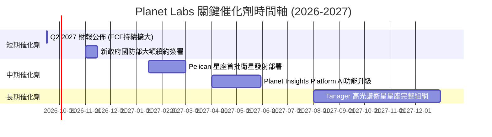

### 8.2 TAM 市場規模分析

```
╔══════════════════════════════════════════════════════════════════╗
║              Planet Labs TAM 與市場滲透率 (2026-2030)            ║
╠══════════════════════════════════════════════════════════════════╣
║                                                                  ║
║  1. 國防與情報遙測市場 (Defense TAM):   $120億  滲透率: ~1.8%     ║
║  2. 農業與環境監測市場 (Agri/Eco TAM):  $80億   滲透率: ~1.2%     ║
║  3. 商業與基礎設施市場 (Commercial TAM):$100億  滲透率: ~0.5%     ║
║                                                                  ║
║  📊 總體潛在市場 (Total TAM)：$300億                              ║
║  📊 PL 目前 TTM 營收 ($3.36億) 僅佔總 TAM 的 1.12%               ║
║  💡 成長空間極其巨大，關鍵在於 SaaS 平台如何降低客戶使用門檻。   ║
╚══════════════════════════════════════════════════════════════════╝
```

### 8.3 成長驅動力結構圖

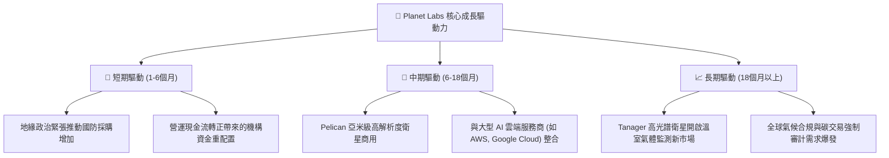

---

## 9. 風險矩陣

### 9.1 風險評分矩陣

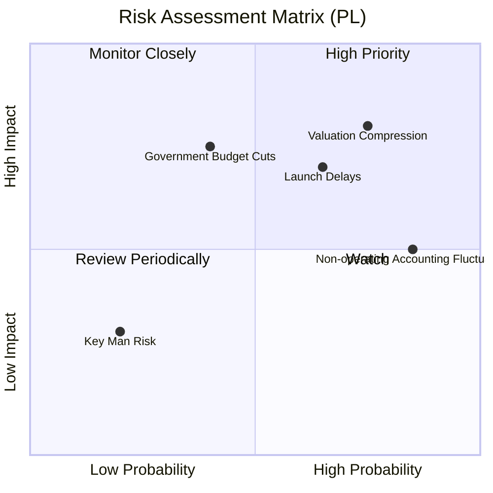

### 9.2 風險清單詳細分析

| # | 風險項目 | 發生機率 | 財務衝擊 | 風險評分 | 具體緩解措施 |
|---|----------|----------|----------|----------|--------------|
| 1 | 🔴 **高估值下的波動性** | 高 (75%) | 高 (-25% 股價) | 🔴 **8.0 / 10** | 建議投資人分批建倉，避免在高點一次性買入。 |
| 2 | 🔴 **發射排期延遲** | 中 (65%) | 高 (-15% 營收成長) | 🔴 **7.0 / 10** | 與 SpaceX 及 Rocket Lab 等多家發射服務商簽署多重保障合約。 |
| 3 | 🟡 **政府預算緊縮** | 中 (40%) | 高 (-20% ARR) | 🟡 **6.0 / 10** | 加速商業客戶（農業、保險、林業）的拓展，降低政府營收佔比。 |
| 4 | 🟡 **會計公允價值波動** | 極高 (85%) | 中 (帳面 EPS 波動) | 🟡 **5.5 / 10** | 加強與機構投資人的溝通，強調 FCF 與經調整後 EBITDA 等核心造血指標。 |

---

## 10. 投資建議

### 10.1 最終綜合評級雷達圖

```
╔══════════════════════════════════════════════════════════════╗
║                Planet Labs 最終綜合評量                     ║
╠══════════════════════════════════════════════════════════════╣
║ 技術壁壘強度  9.0/10  ▓▓▓▓▓▓▓▓▓▓▓▓▓▓▓▓▓▓░░  ★★★★★           ║
║ 財務安全係數  8.5/10  ▓▓▓▓▓▓▓▓▓▓▓▓▓▓▓▓▓░░░  ★★★★☆           ║
║ 營收成長動能  8.5/10  ▓▓▓▓▓▓▓▓▓▓▓▓▓▓▓▓▓░░░  ★★★★☆           ║
║ 自由現金流    8.0/10  ▓▓▓▓▓▓▓▓▓▓▓▓▓▓▓▓░░░░  ★★★★☆           ║
║ 估值安全邊際  6.0/10  ▓▓▓▓▓▓▓▓▓▓▓▓░░░░░░░░  ★★★☆☆           ║
╠══════════════════════════════════════════════════════════════╣
║ 綜合推薦評級  8.0/10  ▓▓▓▓▓▓▓▓▓▓▓▓▓▓▓▓░░░░  🟢 買入 (Buy)    ║
╚══════════════════════════════════════════════════════════════╝
```

### 10.2 目標價與隱含報酬率

| 投資情境 | 機率權重 | 12個月目標價 | 隱含報酬率 (相較於 $31.15) | 觸發條件 |
|----------|----------|--------------|---------------------------|----------|
| **樂觀情境** | 25% | **$53.00** | 🟢 +70.1% | Pelican 星座全面部署，商業 SaaS ARR 佔比突破 50%。 |
| **基準情境** | 50% | **$40.00** | 🟢 +28.4% | FCF 持續成長，季度營收維持 25% 以上成長。 |
| **悲觀情境** | 25% | **$22.00** | 🔴 -29.4% | 發射失敗或延遲，政府合約大幅流失，市場估值修正。 |
| **加權目標價**| **100%** | **$38.75** | 🟢 **+24.4%** | **綜合風險與機會後的理性機構估值** |

### 10.3 買入時機與觸發因素

```
╔══════════════════════════════════════════════════════════════════╗
║                  ✅ PL 買入觸發因素 Checklist                    ║
╠══════════════════════════════════════════════════════════════════╣
║                                                                  ║
║  立即買入觸發條件（多數符合）：                                  ║
║  ✅ 股價回檔至 $25.00 - $28.00 區間（歷史估值中樞）              ║
║  ✅ 接下來的財報中，自由現金流（FCF）連續三個季度維持正值        ║
║  ✅ 宣佈與美國國防部（DoD）或國家地理空間情報局（NGA）簽署大單   ║
║                                                                  ║
║  加碼觸發條件（出現以下任一）：                                  ║
║  ☐ Pelican 衛星成功發射並傳回首批亞米級影像                      ║
║  ☐ 經調整後的 EBITDA 首度實現單季扭虧為盈                        ║
║                                                                  ║
║  減碼/停損觸發條件（出現以下任一）：                             ║
║  ☐ 季度營收年增率（YoY）跌破 15%                                 ║
║  ☐ 發生重大發射事故，導致核心星座損毀且保險理賠不足              ║
╚══════════════════════════════════════════════════════════════════╝
```

### 10.4 投資人適配度分析

```mermaid
graph TD
    INV["🎯 Planet Labs 投資人適配度分析"]

    INV --> G["📈 成長型投資者 (Growth)"]
    INV --> V["💎 價值型投資者 (Value)"]
    