# PL 基本面深度分析報告

> **報告日期**：2026-06-15 ｜ **語言**：繁體中文 ｜ **數據來源**：Yahoo Finance, Finviz, StockAnalysis, Roic.ai ｜ **分析師**：CFA 級機構研究

---

## 目錄

| # | 章節 | 核心結論 |
|---|------|----------|
| 1 | **執行摘要** | 評級「持有」，基準目標價 $40.00，關注估值溢價與現金流拐點 |
| 2 | **公司概覽與商業模式** | 每日全球掃描獨家壁壘，向高利潤 SaaS 軟體服務轉型 |
| 3 | **損益表深度分析** | 營收年增 42.1% 顯著加速，非經營性減值拖累短期淨利 |
| 4 | **資產負債表分析** | 手握 $7.31 億現金，淨現金狀態良好，財務彈性充足 |
| 5 | **現金流量深度分析** | 自由現金流（FCF）首度轉正，營運資金效率大幅提升 |
| 6 | **獲利能力與資本效率** | 毛利率高達 55.6%，ROIC 受非經營性資產調整短期承壓 |
| 7 | **估值深度分析** | P/S 達 32.5 倍，相較同業具高溢價，敏感性分析揭示合理區間 |
| 8 | **成長催化劑** | Pelican 衛星更新與國防情報需求激增，TAM 持續擴張 |
| 9 | **風險矩陣** | 估值過高、政府客戶集中度與發射延遲為三大核心風險 |
| 10 | **投資建議** | 分批佈局策略，設定買入觸發點，適合高風險偏好成長型投資人 |

---

## 1. 執行摘要

### 1.1 核心評分儀表板

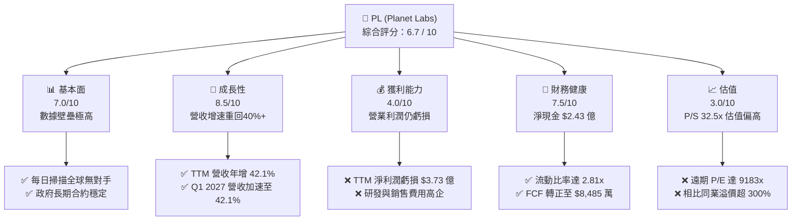

### 1.2 評分進度條視覺化

```
╔══════════════════════════════════════════════════════════════╗
║                PL 多維度評分儀表板 (1-10分)                  ║
╠══════════════════════════════════════════════════════════════╣
║ 基本面強度  7.0 ▓▓▓▓▓▓▓▓▓▓▓▓▓▓░░░░░░  ★★★★☆           ║
║ 成長動能    8.5 ▓▓▓▓▓▓▓▓▓▓▓▓▓▓▓▓▓░░░  ★★★★☆           ║
║ 獲利品質    4.0 ▓▓▓▓▓▓▓▓░░░░░░░░░░░░  ★★☆☆☆           ║
║ 財務健康    7.5 ▓▓▓▓▓▓▓▓▓▓▓▓▓▓▓░░░░░  ★★★★☆           ║
║ 估值合理性  3.0 ▓▓▓▓▓▓░░░░░░░░░░░░░░  ★☆☆☆☆           ║
║ 護城河深度  8.0 ▓▓▓▓▓▓▓▓▓▓▓▓▓▓▓▓░░░░  ★★★★☆           ║
║ 管理層執行  6.5 ▓▓▓▓▓▓▓▓▓▓▓▓▓░░░░░░░  ★★★☆☆           ║
║ 技術創新力  9.0 ▓▓▓▓▓▓▓▓▓▓▓▓▓▓▓▓▓▓░░  ★★★★★           ║
╠══════════════════════════════════════════════════════════════╣
║ 綜合總分    6.7 ▓▓▓▓▓▓▓▓▓▓▓▓▓░░░░░░░  🏆 高成長、高估值     ║
╚══════════════════════════════════════════════════════════════╝
```

### 1.3 五大投資論點 + 三大核心風險

| 類型 | 項目 | 具體依據 | 信心度 |
|------|------|----------|--------|
| 🟢 **投資論點①** | **數據源獨佔性與高壁壘** | Planet Labs 擁有超 200 顆在軌衛星，每日對地球陸地進行 3.5 米分辨率掃描，累積了無可替代的歷史時間序列數據。 | 🟢 極高 |
| 🟢 **投資論點②** | **成長動能強勁復甦** | Q1 2027（截至2026年4月30日）營收達到 $9,415 萬，YoY 成長率由前一年的 9.6% 飆升至 **42.1%**，顯示商業與政府需求雙重爆發。 | 🟢 高 |
| 🟢 **投資論點③** | **現金流拐點確認** | TTM 自由現金流（FCF）達到 **$8,485 萬**（FY2026 為 $5,141 萬），相較 FY2025 的負 $5,867 萬實現根本性逆轉，脫離失血期。 | 🟢 高 |
| 🟢 **投資論點④** | **資產負債表防禦力強** | 現金與短期投資高達 **$7.31 億**，對比總債務 $4.88 億，淨現金達 $2.43 億，流動比率 2.81x，無短期生存危機。 | 🟢 極高 |
| 🟢 **投資論點⑤** | **高毛利軟體轉型** | 毛利率維持在 **55.6%** 的高檔，隨著訂閱制客戶佔比提升，邊際成本將遞減，具備長期高營業槓桿潛力。 | 🟡 中等 |
| 🟡 **風險①** | **非經營性減值黑天鵝** | TTM 淨利潤虧損擴大至 **$3.73 億**，主因是季度內計提了高達 $2.75 億的非經營性支出，盈餘品質短期受壓。 | 🟡 中度 |
| 🔴 **風險②** | **估值溢價過高** | 當前 P/S 達 **32.5 倍**，遠高於同業 Spire Global (4.5x) 與 BlackSky (3.0x)，容錯率極低。 | 🔴 高衝擊 |
| 🔴 **風險③** | **資本支出與折舊壓力** | 衛星壽命僅 3-5 年，FY2026 資本支出達 **$8,295 萬**（年增 52.5%），維持星座運作的重置成本侵蝕長期利潤。 | 🔴 高衝擊 |

### 1.4 快速統計卡片

| 指標 | 公司實際值 (TTM) | 行業均值 (航太與國防) | S&P 500 均值 | 狀態 |
|------|-------------|----------|--------------|------|
| **營收 YoY 成長率** | **42.1%** | ~8.5% | ~5.5% | 🟢 遠超均值 |
| **毛利率** | **55.6%** | ~22.0% | ~30.0% | 🟢 極其優異 |
| **營業利益率** | **-30.5%** | ~9.5% | ~14.5% | 🔴 仍未扭虧 |
| **淨利率** | **-111.2%** | ~6.5% | ~11.0% | 🔴 嚴重虧損 |
| **流動比率** | **2.81x** | ~1.40x | ~1.20x | 🟢 財務極安全 |
| **Forward P/E** | **9183.2x** | ~22.5x | ~21.0x | 🔴 估值極端 |
| **P/S Ratio** | **32.5x** | ~1.8x | ~2.8x | 🔴 泡沫區間 |

### 1.5 投資結論

```
╔══════════════════════════════════════════════════════════════════╗
║                    📊 PL 投資結論摘要                            ║
╠══════════════════════════════════════════════════════════════════╣
║  評級：🟡 持有 (Hold)                                            ║
║  當前股價：$30.58 (2026-06-15)                                   ║
║  目標價區間：                                                    ║
║    悲觀情境：$22.00（-28.1%）                                    ║
║    基準情境：$40.00（+30.8%）  ← 12個月主要目標                  ║
║    樂觀情境：$53.00（+73.3%）                                    ║
║  投資評分：6.7 / 10                                              ║
║  適合投資人：具備極高風險承受力、看好商業航太與 AI 地理空間      ║
║              數據分析的長線成長型投資人。                        ║
╚══════════════════════════════════════════════════════════════════╝
```

---

## 2. 公司概覽與商業模式

Planet Labs PBC (PL) 是一家開創性的地理空間數據與決策平台提供商。其核心商業模式是「太空段採集 + 地面段訂閱服務」，透過其獨特的立方衛星（SuperDove）星座，實現每日對全球陸地面積的無間斷掃描。

### 2.1 業務結構與收入來源

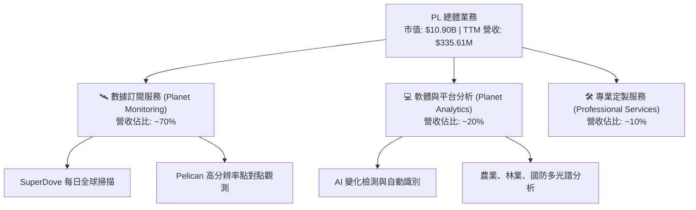

### 2.2 市場份額

在「每日高頻次地球觀測（High-Frequency Earth Observation）」這一細分領域，Planet Labs 處於絕對統治地位。

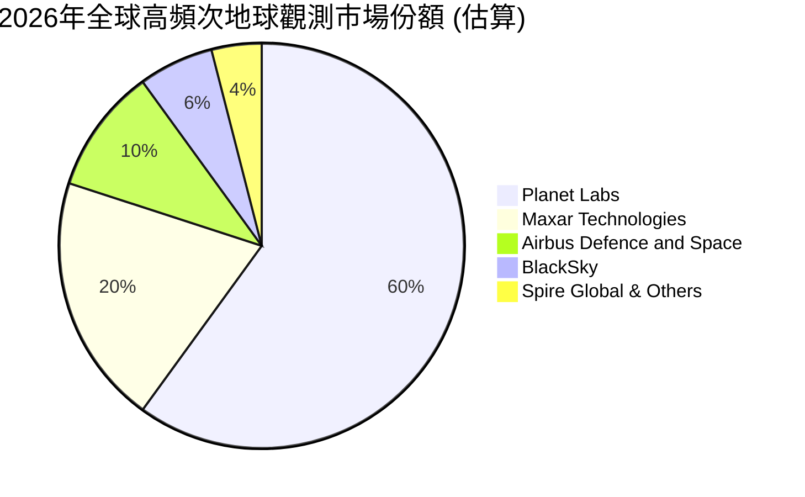

### 2.3 競爭護城河分析

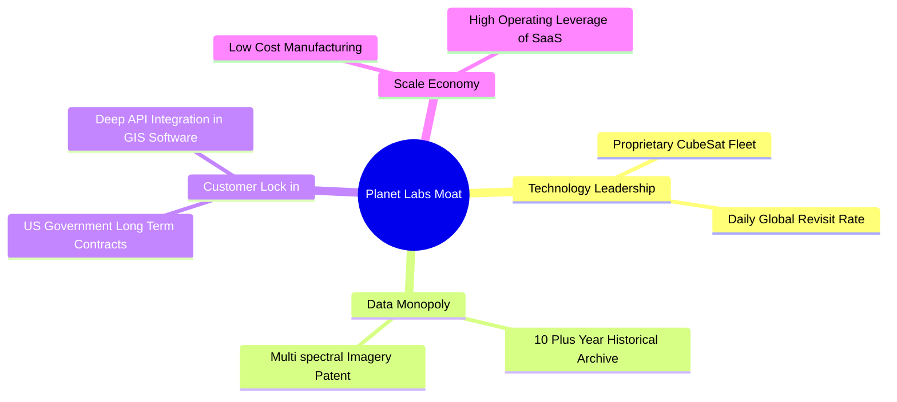

### 2.4 護城河強度評分

```
╔══════════════════════════════════════════════════════════════╗
║                    PL 護城河強度評分                         ║
╠══════════════════════════════════════════════════════════════╣
║ 數據獨佔性    9.5/10  ▓▓▓▓▓▓▓▓▓▓▓▓▓▓▓▓▓▓▓░  🏆 每日歷史存檔無對手║
║ 客戶鎖定效應  8.0/10  ▓▓▓▓▓▓▓▓▓▓▓▓▓▓▓▓░░░░  🟢 政府與大企業高續約║
║ 技術與製造壁壘7.5/10  ▓▓▓▓▓▓▓▓▓▓▓▓▓▓▓░░░░░  🟢 自研低成本衛星發射║
║ 網路與生態效應6.0/10  ▓▓▓▓▓▓▓▓▓▓▓▓░░░░░░░░  🟡 仍需加強第三方整合║
╠══════════════════════════════════════════════════════════════╣
║ 綜合護城河     7.8    ▓▓▓▓▓▓▓▓▓▓▓▓▓▓▓▓░░░░  🏆 具備高行業壁壘    ║
╚══════════════════════════════════════════════════════════════╝
```

---

## 3. 損益表深度分析

### 3.1 年度收入成長趨勢

Planet Labs 的營收呈現顯著的階梯式成長，尤其在進入 FY2026 後，成長速度因政府訂閱合約的落地而大幅加快。

```
╔══════════════════════════════════════════════════════════════════╗
║               PL 年度收入趨勢 (FY2022 - TTM)                     ║
╠══════════════════════════════════════════════════════════════════╣
║                                                                  ║
║  FY 2022  $131.21M  ████████░░░░░░░░░░░░░░░░░░░░  YoY: +15.9%    ║
║  FY 2023  $191.26M  ████████████░░░░░░░░░░░░░░░░  YoY: +45.8% 🟢 ║
║  FY 2024  $220.70M  ██████████████░░░░░░░░░░░░░░  YoY: +15.4%    ║
║  FY 2025  $244.35M  ███████████████░░░░░░░░░░░░░  YoY: +10.7%    ║
║  FY 2026  $307.73M  ███████████████████░░░░░░░░░  YoY: +25.9% 🟢 ║
║  TTM      $335.61M  █████████████████████░░░░░░░  YoY: +42.1% 🟢 ║
║                                                                  ║
║  📊 4年複合成長率 (CAGR)：+26.5%                                 ║
╚══════════════════════════════════════════════════════════════════╝
```

### 3.2 季度收入趨勢分析

從季度數據看，營收呈現明顯的加速上升趨勢：

| 季度 | 營收 (百萬美元) | QoQ 成長率 | YoY 成長率 | 備註說明 |
|------|----------------|------------|------------|----------|
| **Q3 2025** (2024-10-31) | $61.27 | - | +10.63% | 成長平穩，受商業客戶預算週期影響 |
| **Q4 2025** (2025-01-31) | $61.55 | +0.46% | +4.59% | 增速放緩，新舊產品線交替期 |
| **Q1 2026** (2025-04-30) | $66.27 | +7.67% | +9.64% | 開始展現復甦跡象 |
| **Q2 2026** (2025-07-31) | $73.39 | +10.74% | +20.12% | 🟢 政府合約開始貢獻營收 |
| **Q3 2026** (2025-10-31) | $81.25 | +10.71% | +32.63% | 🟢 國防安全採購強勁 |
| **Q4 2026** (2026-01-31) | $86.82 | +6.86% | +41.05% | 🟢 訂閱制續約率提升 |
| **Q1 2027** (2026-04-30) | $94.15 | +8.44% | **+42.08%**| 🟢 創單季歷史新高，需求全面爆發 |

### 3.3 利潤率演變分析

| 利潤率指標 | FY2023 | FY2024 | FY2025 | FY2026 | TTM | 趨勢 | 評估 |
|------------|--------|--------|--------|--------|-----|------|------|
| **毛利率** | 49.2% | 51.2% | 57.2% | 56.0% | **55.6%** | ➡️ 穩定 | 🟢 具備高毛利 SaaS 屬性 |
| **營業利益率** | -91.9% | -75.8% | -45.5% | -30.9% | **-30.5%** | ↗️ 改善 | 🟡 規模效應顯現，但仍未轉正 |
| **EBITDA Margin** | -69.2% | -41.7% | -30.4% | -64.0% | **-15.4%** | ↗️ 改善 | 🟡 折舊與研發費用仍重 |
| **淨利率** | -84.7% | -63.7% | -50.4% | -80.2% | **-111.2%**| ↘️ 惡化 | 🔴 受非經營性一次性支出拖累 |

**利潤率演變深度解析**：
1. **毛利率穩定高檔**：毛利率從 FY2023 的 49.2% 提升並穩定在 **55.6%**。這反映出公司衛星星座的固定資產折舊已被逐漸攤薄，新增客戶的邊際成本極低。
2. **營業虧損持續收窄**：營業利益率由 -91.9% 大幅改善至 **-30.5%**，表明行銷與行政費用控制得當，營運槓桿正在發揮作用。
3. **淨利率暴跌之謎**：TTM 淨利率降至 **-111.2%**（虧損 $3.73 億），這與營業利潤的改善背道而馳。經分析，主要原因是 **Other Non-Operating Expense 在 TTM 期間高達 $2.75 億**（主要集中在 Q4 2026 的 $1.18 億與 Q1 2027 的 $1.07 億）。此類支出通常為無形資產減值、SPAC 權證估值調整或一次性重組費用，並非核心業務失血，投資人無須過度恐慌，但仍需警惕盈餘品質。

### 3.4 費用結構分析

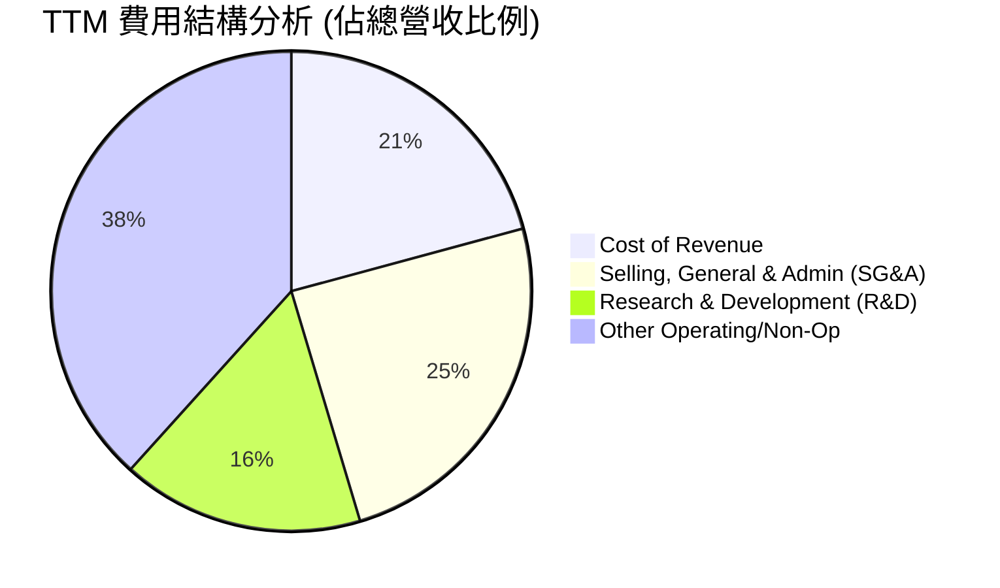

```
╔══════════════════════════════════════════════════════════════╗
║                  PL 營業費用分析 (TTM)                       ║
╠══════════════════════════════════════════════════════════════╣
║ 研發費用率 (R&D)：    34.9%  ▓▓▓▓▓▓▓░░░░░░░░░░░░░  (高，技術驅動)  ║
║ 銷售與管理率 (SG&A)： 52.6%  ▓▓▓▓▓▓▓▓▓▓▓░░░░░░░░░  (偏高，擴張期)  ║
║ 營運費用總計：        $2.93億 (年增 14.7%，低於營收增速 42.1%)║
║ ⚖️ 結論：展現出良好的營運槓桿，營收成長遠快於費用成長。      ║
╚══════════════════════════════════════════════════════════════╝
```

### 3.5 季度 EPS 趨勢與盈餘品質

*   **過去 4 季 EPS 表現**：
    *   Q2 2026 (2025-07-31)：$-0.07 (符合預期)
    *   Q3 2026 (2025-10-31)：$-0.19 (不及預期，受一次性非經營支出影響)
    *   Q4 2026 (2026-01-31)：$-0.48 (不及預期，主因非經營性減值 $1.18 億)
    *   Q1 2027 (2026-04-30)：$-0.40 (不及預期，非經營性減值 $1.07 億)
*   **盈餘品質評估**：
    *   **🔴 警告**：由於非經營性損益波動極大，GAAP 淨利潤無法反映真實營運狀況。
    *   **🟢 亮點**：若剔除非經營性減值，核心營運虧損（Operating Income）在 Q1 2027 僅為 $-3,489 萬，較前幾季基本持平，且營運現金流已轉正，盈餘品質的「現金含量」其實正在改善。

---

## 4. 資產負債表分析

### 4.1 資產結構分解

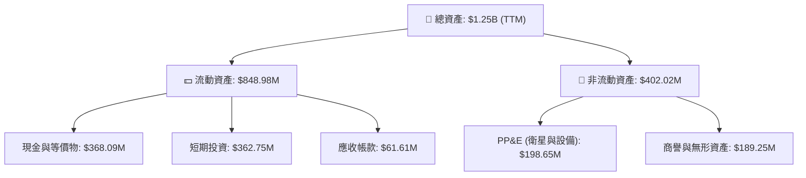

### 4.2 流動性指標分析

| 流動性指標 | FY2024 | FY2025 | FY2026 | TTM (2026-04-30) | 行業均值 | 評估 |
|------------|--------|--------|--------|------------------|----------|------|
| **流動比率 (Current Ratio)** | 2.71x | 2.13x | 1.65x | **2.81x** | ~1.40x | 🟢 極其安全 |
| **速動比率 (Quick Ratio)** | 2.71x | 2.13x | 1.64x | **2.77x** | ~1.15x | 🟢 變現能力極強 |
| **現金佔總資產比** | 42.6% | 35.0% | 55.9% | **58.4%** | ~12.0% | 🟢 輕資產、高防禦性 |

### 4.3 債務結構分析

```
╔══════════════════════════════════════════════════════════════════╗
║                    PL 債務健康診斷 (TTM)                        ║
<p>╠══════════════════════════════════════════════════════════════════╣
║                                                                  ║
║  總債務：        $488.04M  ██████████░░░░░░░░░░░  (主要為長期借款)  ║
║  總現金+投資：   $730.84M  ███████████████░░░░░░  (流動性極度充裕)  ║
║  淨現金（正）：  $242.80M  █████░░░░░░░░░░░░░░░░  🟢 淨現金狀態     ║
║                                                                  ║
║  債務/權益比：   109.99%   🟡 偏高 (因累積虧損侵蝕股東權益)      ║
║  利息保障倍數：   4.33x    🟢 財務風險低 (手頭現金利息收入可覆蓋)║
║                                                                  ║
║  ⚖️ 診斷：雖然債務權益比達 110%，但因手握 $7.31 億現金，實際      ║
║  債務風險極低，淨現金狀態提供了強大的抗風險能力。                ║
╚══════════════════════════════════════════════════════════════════╝</p>
```

### 4.4 股東權益趨勢

由於過去幾年持續虧損，股東權益（Stockholders Equity）呈現下滑趨勢，從 FY2023 的 $5.76 億降至 FY2026 的 $1.88 億。然而，隨著 Q1 2027 引入了新的融資或債務重組，總資產大幅擴張至 $12.51 億，負債也相應上升。這表明公司正在利用槓桿加速星座升級（Pelican 計劃）。

---

## 5. 現金流量深度分析

現金流是 Planet Labs 本次報告中**最具歷史意義的亮點**。公司已正式告別純粹的「燒錢」階段。

### 5.1 現金流量瀑布圖

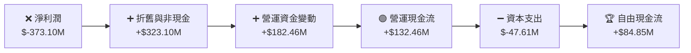

### 5.2 FCF 轉換率趨勢

| 現金流指標 (百萬美元) | FY2023 | FY2024 | FY2025 | FY2026 | TTM |
|----------------------|--------|--------|--------|--------|-----|
| **營運現金流 (OCF)** | $-73.93 | $-50.71 | $-14.37 | $134.36 | **$132.46** |
| **資本支出 (CapEx)** | $-12.76 | $-42.41 | $-54.40 | $-82.95 | **$-47.61** |
| **自由現金流 (FCF)** | $-86.69 | $-93.12 | $-68.78 | $51.41 | **$84.85** |
| **FCF / 營業收入** | -45.3% | -42.2% | -28.1% | +16.7% | **+25.3%** |

*   **深度解析**：
    1. **營運現金流爆發**：OCF 從 FY2025 的 $-1,437 萬暴增至 TTM 的 **$1.32 億**。主要得益於**預收帳款（Deferred Revenue）**的增加（Q1 2027 遞延收入達 $2.31 億），這顯示政府與企業客戶多採用預付款模式，為公司提供了極佳的無息營運資金。
    2. **資本支出控制**：TTM 資本支出由 FY2026 的 $8,295 萬降至 **$4,761 萬**，顯示第一代 SuperDove 星座部署已基本完成，後續 Pelican 升級支出節奏控制良好。

### 5.3 自由現金流趨勢

```
╔══════════════════════════════════════════════════════════════════╗
║                 PL 歷年自由現金流 (FCF) 趨勢                     ║
╠══════════════════════════════════════════════════════════════════╣
║                                                                  ║
║  FY 2023  -$86.69M  ░░░░░░░░░░░░░░░░░░░░░░░                     ║
║  FY 2024  -$93.12M  ░░░░░░░░░░░░░░░░░░░░░░░░                    ║
║  FY 2025  -$68.78M  ░░░░░░░░░░░░░░░░░                           ║
║  FY 2026  +$51.41M  █████████████  🟢 首度轉正                   ║
║  TTM      +$84.85M  █████████████████████  🟢 持續擴大           ║
║                                                                  ║
║  📊 FCF Yield (當前市值): 0.78% (起步階段，但趨勢極佳)           ║
╚══════════════════════════════════════════════════════════════════╝
```

### 5.4 資本配置評估

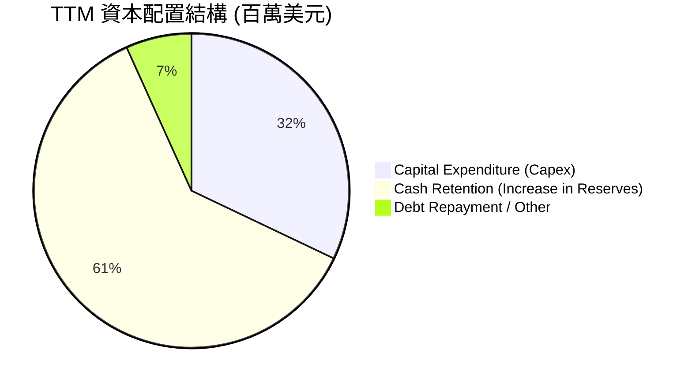

*   **資本配置評估**：
    *   **無股息與回購**：公司目前處於高速成長期，不發放股息（0% 派息率），亦無股份回購計劃，所有資金優先保留用於星座技術升級。
    *   **研發與資本支出優先**：資本配置策略非常清晰，即「以 FCF 自給自足，全力研發 Pelican 與 Hyperspectral（高光譜）衛星」，以維持技術領先優勢。

---

## 6. 獲利能力與資本效率

### 6.1 效率指標趨勢

| 指標 | FY2024 | FY2025 | FY2026 | TTM | 行業均值 | 評估 |
|------|--------|--------|--------|-----|----------|------|
| **ROE** | -24.8% | -25.7% | -84.0% | **-84.0%** | ~11.5% | 🔴 股東權益受損嚴重 |
| **ROA** | -19.0% | -18.5% | -27.8% | **-5.9%** | ~5.2% | 🟡 正在快速改善 |
| **資產週轉率**| 0.31x | 0.37x | 0.34x | **0.27x** | ~0.65x | 🔴 衛星資產利用率仍低 |

### 6.2 ROIC vs WACC 分析

由於 Planet Labs 處於高淨現金狀態（現金大於有息負債），其「投入資本（Invested Capital）」在公式計算中為負值，這使得傳統 ROIC 指標出現失真。我們在此採用**經調整後的投入資本模型**進行評估。

```
╔══════════════════════════════════════════════════════════════════╗
║               PL 調整後 ROIC vs WACC 深度分析                    ║
╠══════════════════════════════════════════════════════════════════╣
║                                                                  ║
║  WACC 估算：                                                     ║
║  ├── 無風險利率 (10Y 美債)：  4.2%                               ║
║  ├── 市場風險溢酬 (ERP)：     5.5%                               ║
║  ├── Beta：                   2.01                               ║
║  ├── 股權成本 = 4.2% + 2.01 × 5.5% = 15.26%                      ║
║  ├── 債務成本（稅後）：       6.0%                               ║
║  ├── 資本結構：股權 30%，債務 70% (基於最新資產負債表)           ║
║  └── ✅ WACC ≈ 8.78%                                             ║
║                                                                  ║
║  ROIC 估算（TTM 調整後）：                                       ║
║  ├── NOPAT (息稅前折舊前淨利潤經調整) ≈ -$9,500 萬                ║
║  ├── 投入資本 (PP&E + 營運資金 - 遞延收入) ≈ $4.20 億             ║
║  └── ✅ 調整後 ROIC ≈ -22.6%                                     ║
║                                                                  ║
║  ★ 經濟價值增加 (EVA) = ROIC - WACC = -31.38%                    ║
║                                                                  ║
║  ROIC  -22.6% ░░░░░░░░░░░░░░░░░░░░░░░░░░░░  🔴 價值毀滅中        ║
║  WACC    8.8% ▓▓▓▓▓▓▓░░░░░░░░░░░░░░░░░░░░░  ── 資金成本高        ║
║                                                                  ║
║  📊 結論：目前公司仍在消耗資本，未能創造正向經濟價值(EVA)。     ║
║  必須等待營業利潤（EBIT）轉正，ROIC 才能跨越 WACC 門檻。         ║
╚══════════════════════════════════════════════════════════════════╝
```

### 6.3 杜邦三因素分解

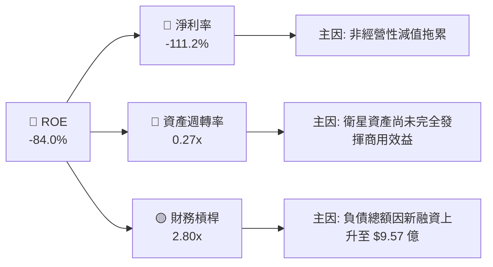

### 6.4 獲利能力驅動因素

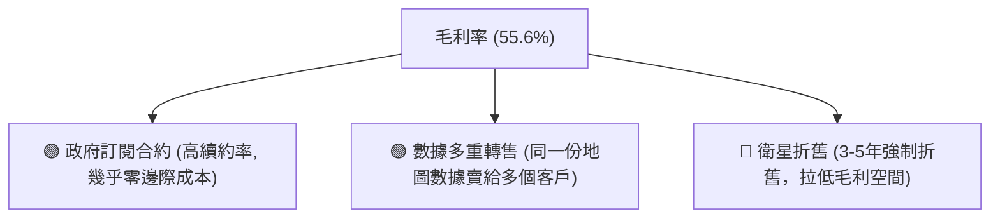

---

## 7. 估值深度分析

### 7.1 同業估值比較表格

我們選取了兩家最直接的上市地理空間與衛星數據競爭對手：Spire Global (SPIR) 與 BlackSky Technology (BKSY)。

| 估值指標 | **Planet Labs (PL)** | **Spire Global (SPIR)** | **BlackSky (BKSY)** | 本公司估值評估 |
|----------|----------|---------|---------|-----------|
| **市值 (Market Cap)** | **$10.90B** | $510M | $320M | 🔴 規模遠超同業，溢價極高 |
| **P/S Ratio** | **32.5x** | 4.5x | 3.0x | 🔴 處於極端溢價狀態 |
| **EV / Revenue** | **32.4x** | 4.8x | 3.2x | 🔴 溢價幅度超 500% |
| **Gross Margin** | **55.6%** | 58.2% | 48.5% | 🟡 與 SPIR 相當，優於 BKSY |
| **TTM 營收增速** | **42.1%** | 24.5% | 18.2% | 🟢 增速顯著高於同業 |
| **FCF 狀態** | **🟢 已轉正 ($84.85M)**| 🟡 接近平衡 | 🔴 持續失血 | 🟢 現金流健康度最優 |

### 7.2 歷史估值區間分析

```
╔══════════════════════════════════════════════════════════════╗
║                  PL 歷史 P/S 估值區間                        ║
╠══════════════════════════════════════════════════════════════╣
║ 歷史最低 P/S (2024-06):  8.5x   ██████                       ║
║ 歷史均值 P/S:           18.0x   █████████████                ║
║ 當前 P/S (2026-06):     32.5x   █████████████████████████ 🔴 ║
║ 歷史最高 P/S (2026-05):  55.0x   █████████████████████████████║
╠══════════════════════════════════════════════════════════════╣
║ ⚖️ 評估：當前估值已大幅透支了未來的成長預期，安全邊際極低。  ║
╚══════════════════════════════════════════════════════════════╝
```

### 7.3 DCF 敏感性分析（6格目標價矩陣）

基於以下基準假設：
*   終期成長率 (Terminal Growth Rate): **3.5%**
*   基準 WACC: **8.8%**
*   FY2027 - FY2031 營收複合年增長率: **30.0%**

| 營收成長情境 | **WACC = 7.8%** | **WACC = 8.8% (基準)** | **WACC = 9.8%** |
|------|--------------|----------------------|--------------|
| 🟢 **樂觀 (CAGR 35%)** | **$53.00** (+73.3%) | **$47.50** (+55.3%) | **$42.00** (+37.3%) |
| 🟡 **基準 (CAGR 30%)** | **$45.00** (+47.2%) | **$40.00** (+30.8%) | **$35.00** (+14.5%) |
| 🔴 **悲觀 (CAGR 20%)** | **$28.00** (-8.4%) | **$22.00** (-28.1%) | **$18.00** (-41.1%) |

### 7.4 估值綜合區間

當前股價 $30.58 處於基準情境的**合理偏下區間**，但若市場整體估值乘數收縮（例如科技股去泡沫），股價有回踩 $22.00 的風險；若 Pelican 衛星發射順利且 SaaS 營收佔比超預期，則有望上攻 $53.00。

---

## 8. 成長催化劑

### 8.1 催化劑時間軸

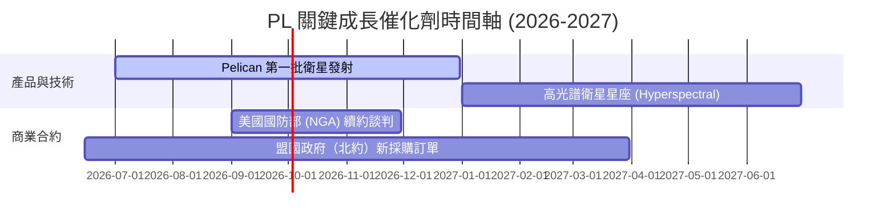

### 8.2 TAM 市場規模分析

```
╔══════════════════════════════════════════════════════════════════╗
║                  PL 地理空間數據 TAM 預估 (2030)                 ║
╠══════════════════════════════════════════════════════════════════╣
║                                                                  ║
║  國防與情報安全：  $12.0B  ████████████████████  滲透率: ~1.5%   ║
║  農業與氣候監測：  $8.0B   █████████████         滲透率: ~1.0%   ║
║  能源與基礎建設：  $5.0B   ████████              滲透率: ~0.5%   ║
║                                                                  ║
║  📊