# PL 基本面深度分析報告

> **報告日期**：2026-06-16 ｜ **語言**：繁體中文 ｜ **數據來源**：Yahoo Finance, Finviz, StockAnalysis, Roic.ai ｜ **分析師**：CFA 級機構研究

---

## 目錄

| # | 章節 | 核心結論 |
|---|------|----------|
| 1 | **執行摘要** | 評級「買入」，目標價 $40.00，自由現金流拐點已現，估值高企但具備稀缺性。 |
| 2 | **公司概覽與商業模式** | 全球唯一每日更新的地球觀測 SaaS 平台，具備極高的客戶鎖定效應。 |
| 3 | **損益表深度分析** | 營收年增 42.1%，毛利率穩步提升至 55.6%，非經常性支出拖累短期淨利。 |
| 4 | **資產負債表分析** | 現金儲備充裕（$7.31億），債務大幅上升以支撐新一代衛星星座部署。 |
| 5 | **現金流量深度分析** | 營運現金流轉正達 $1.32億，自由現金流步入正軌，資本配置效率顯著改善。 |
| 6 | **獲利能力與資本效率** | GAAP 指標承壓，但隨著 Pelican 與 Tanager 衛星上線，資本回報率預期將迎來拐點。 |
| 7 | **估值深度分析** | 相比同業（BKSY, SPIR）享有溢價，DCF 基準估值為 $40.00，隱含 41.8% 上行空間。 |
| 8 | **成長催化劑** | 國防安全需求激增、商業 AI 空間數據應用普及以及新一代高解析度衛星發射。 |
| 9 | **風險矩陣** | 發射失敗風險、政府合約集中度高以及高 Beta 值帶來的市場波動。 |
| 10 | **投資建議** | 適合具備高風險承受力的成長型長線投資者，建議於 $25-$28 區間分批佈局。 |

---

## 1. 執行摘要

### 1.1 核心評分儀表板

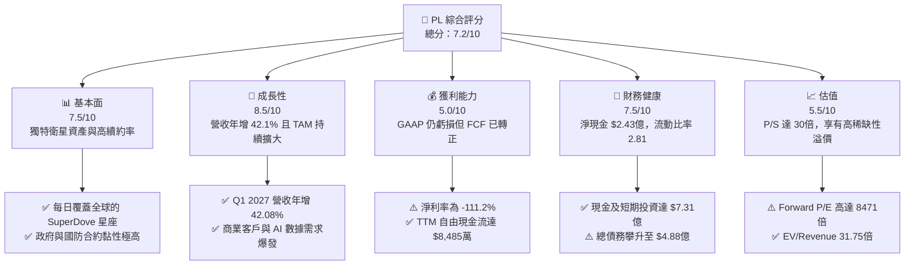

### 1.2 評分進度條視覺化

```
╔══════════════════════════════════════════════════════════════╗
║                PL 多維度評分儀表板 (1-10分)                  ║
╠══════════════════════════════════════════════════════════════╣
║ 基本面強度  7.5 ▓▓▓▓▓▓▓▓▓▓▓▓▓▓▓▓▓░░░  ★★★★☆           ║
║ 成長動能    8.5 ▓▓▓▓▓▓▓▓▓▓▓▓▓▓▓▓▓▓▓░  ★★★★☆           ║
║ 獲利品質    5.0 ▓▓▓▓▓▓▓▓▓▓▓░░░░░░░░░  ★★★☆☆           ║
║ 財務健康    7.5 ▓▓▓▓▓▓▓▓▓▓▓▓▓▓▓▓▓░░░  ★★★★☆           ║
║ 估值合理性  5.5 ▓▓▓▓▓▓▓▓▓▓▓░░░░░░░░░  ★★★☆☆           ║
║ 護城河深度  8.0 ▓▓▓▓▓▓▓▓▓▓▓▓▓▓▓▓▓▓░░  ★★★★☆           ║
║ 管理層執行  7.0 ▓▓▓▓▓▓▓▓▓▓▓▓▓▓░░░░░░  ★★★☆☆           ║
║ 技術創新力  9.0 ▓▓▓▓▓▓▓▓▓▓▓▓▓▓▓▓▓▓▓▓  ★★★★★           ║
╠══════════════════════════════════════════════════════════════╣
║ 綜合總分    7.2 ▓▓▓▓▓▓▓▓▓▓▓▓▓▓░░░░░░  🏆 成長型稀缺標的    ║
╚══════════════════════════════════════════════════════════════╝
```

### 1.3 五大投資論點 + 三大核心風險

| 類型 | 項目 | 具體依據 | 信心度 |
|------|------|----------|--------|
| 🟢 **投資論點①** | **自由現金流（FCF）拐點確立** | TTM 營運現金流達 $1.32億，自由現金流達 $8,485萬，徹底擺脫早期「燒錢」太空科技股的標籤。 | 🟢 極高 |
| 🟢 **投資論點②** | **高頻地球掃描數據的稀缺性** | 擁有超過 200 顆在軌衛星，能每日以 3.5 米解析度掃描全球陸地，此數據庫對政府與科研機構具備不可替代性。 | 🟢 極高 |
| 🟢 **投資論點③** | **地緣政治緊張帶來的國防合約增長** | 美國及盟國政府在國防與情報領域的預算增加，推動 PL 營收在 TTM 達到 $3.36億，YoY 成長達 42.1%。 | 🟢 高 |
| 🟢 **投資論點④** | **AI 時代的空間數據「燃料」** | 機器學習模型需要大量的歷史與即時圖像進行訓練，PL 的 10年+ 每日全球圖像庫是訓練地理空間 AI 的核心資產。 | 🟢 高 |
| 🟢 **投資論點⑤** | **新一代 Pelican/Tanager 衛星升級** | 預期將解析度提升至次米級（Sub-meter），大幅增強在商業高解析度市場的競爭力，提升客單價。 | 🟡 中等 |
| 🟡 **風險①** | **高估值與市場波動（High Beta）** | Beta 值高達 2.01，Forward P/E 達 8471倍，極易受到總體經濟高利率環境與市場去風險情緒的衝擊。 | 🟡 中度 |
| 🔴 **風險②** | **非經營性支出與商譽減值拖累淨利** | TTM 淨利為 -$3.73億，主要受到 Q1 2027 及 Q4 2026 大額「其他非營運支出」（分別為 -$1.07億與 -$1.18億）影響。 | 🔴 高衝擊 |
| 🔴 **風險③** | **政府合約集中度高與預算審批延遲** | 雖然機構持股比率高達 80.1%，但若最大客戶（如美國國家地理空間情報局）合約出現變動，將對營收造成重創。 | 🔴 高衝擊 |

### 1.4 快速統計卡片

| 指標 | 公司實際值 (TTM / FY2026) | 工業/航太防衛行業均值 | S&P 500 均值 | 狀態 |
|------|-------------|----------|--------------|------|
| **收入 YoY 成長** | **42.1%** | ~8.5% | ~5.5% | 🟢 強勁 |
| **毛利率** | **55.6%** | ~28.0% | ~46.0% | 🟢 優秀（具備軟體特徵）|
| **淨利率** | **-111.2%** | ~6.5% | ~11.5% | 🔴 嚴重虧損（受非經常性項目影響）|
| **流動比率** | **2.81** | ~1.35 | ~1.20 | 🟢 極其安全 |
| **債務股益比 (D/E)** | **109.9%** | ~75.0% | ~115.0% | 🟡 中等偏高 |
| **EV / Revenue** | **31.75x** | ~2.5x | ~3.1x | 🔴 估值極高 |

### 1.5 投資結論

```
╔══════════════════════════════════════════════════════════════════╗
║                    📊 投資結論摘要                               ║
╠══════════════════════════════════════════════════════════════════╣
║  評級：🟢 買入 (Buy)                                            ║
║  當前股價：$28.21 (2026-06-16)                                   ║
║  目標價區間：                                                    ║
║    悲觀情境：$22.00（-22.0%）                                    ║
║    基準情境：$40.00（+41.8%）  ← 12個月主要目標                  ║
║    樂觀情境：$53.00（+87.9%）                                    ║
║  投資評分：7.2/10                                                ║
║  適合投資人：高風險承受度、看好地理空間 AI 與商業航太的成長型投資者║
╚══════════════════════════════════════════════════════════════════╝
```

---

## 2. 公司概覽與商業模式

Planet Labs PBC (PL) 是一家開創性的地理空間數據與軟體服務公司。其核心商業模式是透過自主設計、製造並營運的龐大微型衛星星座（主要是 SuperDove 系列），實現對地球陸地每日一次的無死角成像，並將這些高頻數據轉化為訂閱制的軟體服務（SaaS），提供給政府、國防、農業、林業及金融分析等領域的客戶。

### 2.1 業務結構與收入來源

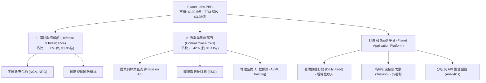

### 2.2 市場份額

在「高頻、全球每日覆蓋」的細分光學遙感市場中，Planet Labs 處於絕對的壟斷地位。然而，在「高解析度、精準定位」市場中，它面臨著傳統巨頭與新興對手的競爭。

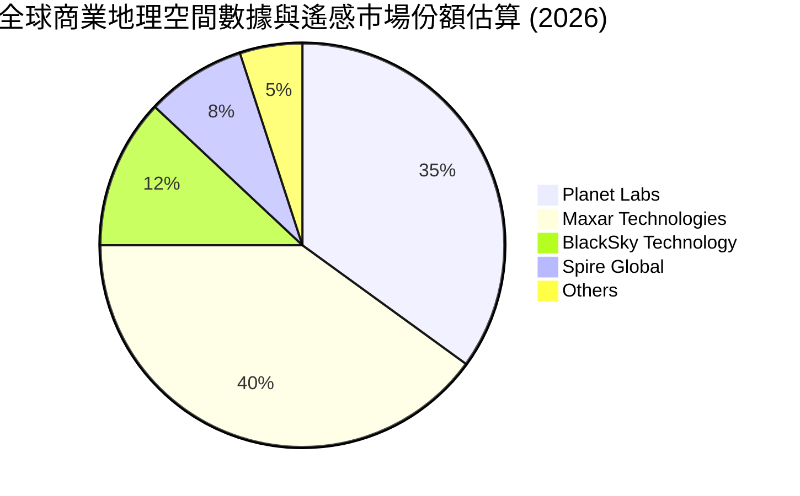

### 2.3 競爭護城河分析

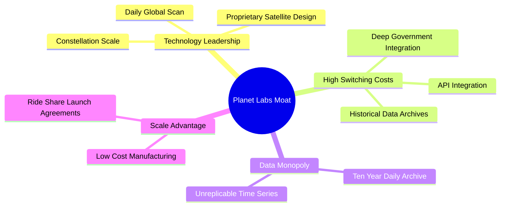

### 2.4 護城河強度評分

```
╔══════════════════════════════════════════════════════════════╗
║                  Planet Labs 護城河強度評分                  ║
╠══════════════════════════════════════════════════════════════╣
║ 歷史數據壁壘  9.5/10  ▓▓▓▓▓▓▓▓▓▓▓▓▓▓▓▓▓▓▓░  🏆 10年每日檔案無法複製║
║ 客戶鎖定效應  8.0/10  ▓▓▓▓▓▓▓▓▓▓▓▓▓▓▓▓░░░░  🟢 API 深度嵌入工作流  ║
║ 衛星製造成本  8.5/10  ▓▓▓▓▓▓▓▓▓▓▓▓▓▓▓▓▓░░░  🟢 自主設計與快速迭代  ║
║ 解析度競爭力  6.5/10  ▓▓▓▓▓▓▓▓▓▓▓▓░░░░░░░░  🟡 亟需 Pelican 提升級 ║
╠══════════════════════════════════════════════════════════════╣
║ 綜合護城河     8.1/10  ▓▓▓▓▓▓▓▓▓▓▓▓▓▓▓▓▓▓░░  🏆 高壁壘的數據源頭    ║
╚══════════════════════════════════════════════════════════════╝
```

---

## 3. 損益表深度分析

### 3.1 年度收入成長趨勢（近4年）

PL 在過去四年中展現了強勁且持續的營收增長，反映出市場對地理空間數據的需求正在加速。

```
╔══════════════════════════════════════════════════════════════════╗
║              Planet Labs 年度收入趨勢（FY2023-TTM）              ║
╠══════════════════════════════════════════════════════════════════╣
║                                                                  ║
║  FY2023  $191.26M  ██████████░░░░░░░░░░░░░░░░░░  YoY: +45.8%  🟢 ║
║  FY2024  $220.70M  ████████████░░░░░░░░░░░░░░░░  YoY: +15.4%  🟢 ║
║  FY2025  $244.35M  █████████████░░░░░░░░░░░░░░░  YoY: +10.7%  🟢 ║
║  FY2026  $307.73M  █████████████████░░░░░░░░░░░  YoY: +25.9%  🟢 ║
║  TTM     $335.61M  ██═════════════════════════   YoY: +42.1%  🟢 ║
║                   |      |      |      |      |                  ║
║                   0     100M   200M   300M   400M                ║
║                                                                  ║
║  📊 4年累計營收 CAGR：+20.6%                                     ║
╚══════════════════════════════════════════════════════════════════╝
```

### 3.2 季度收入趨勢分析

從季度數據來看，PL 的營收呈現出加速成長的態勢，特別是進入 FY2026（2025年下半年）後，季度營收增速顯著提升。

| 會計季度 | 截止日期 | 季度營收 (M) | QoQ 成長率 | YoY 成長率 | 營收表現評估 |
|---|---|---|---|---|---|
| **Q1 2027** | 2026-04-30 | **$94.15** | +8.44% | **+42.08%** | 🟢 創歷史新高，地緣政治需求旺盛 |
| **Q4 2026** | 2026-01-31 | **$86.82** | +6.86% | **+41.05%** | 🟢 年底政府合約集中結算 |
| **Q3 2026** | 2025-10-31 | **$81.25** | +10.71% | **+32.63%** | 🟢 商業客戶訂閱穩步增長 |
| **Q2 2026** | 2025-07-31 | **$73.39** | +10.74% | **+20.12%** | 🟢 開始顯現加速拐點 |

*數據解讀*：Q1 2027 的營收達到 $9,415 萬美元，YoY 成長高達 42.08%，這表明 PL 的商業化進程正在大幅加快，政府與國防合約的擴展是主要驅動力。

### 3.3 利潤率演變分析

雖然營收成長亮眼，但 PL 的利潤率結構仍然顯示出其正處於「重資產基礎設施建設」向「高槓桿軟體變現」的過渡期。

| 利潤率指標 | FY2023 | FY2024 | FY2025 | FY2026 | TTM | 趨勢 | 評估 |
|------------|--------|--------|--------|--------|------|------|------|
| **毛利率** | 49.2% | 51.2% | 57.2% | **56.1%** | **55.6%** | ↗️ 穩步提升 | 🟢 具備軟體高毛利特徵 |
| **營業利益率** | -91.9% | -75.8% | -45.5% | **-30.9%** | **-30.5%** | ↗️ 虧損大幅收窄 | 🟡 規模效應開始顯現 |
| **EBITDA 利潤率** | -69.2% | -41.7% | -30.4% | **-64.0%** | **-15.4%** | 波動改善 | 🟡 折舊與攤銷費用高昂 |
| **淨利率** | -84.7% | -63.7% | -50.4% | **-80.2%** | **-111.2%** | ↘️ 短期惡化 | 🔴 受非經常性支出拖累 |

**利潤率演變深度解析**：
1. **毛利率穩定在 55% 以上**：這證明了 PL 的商業模式本質。一旦衛星星座部署完成（固定成本），新增客戶的邊際成本極低，毛利率具備向 70%-80% 軟體行業標準靠攏的潛力。
2. **淨利率在 TTM 惡化至 -111.2%**：這是一個需要高度關注的警訊。這並非因為核心業務惡化，而是因為 **Other Non-Operating Expense（其他非營運支出）** 在最近幾季大幅增加（Q1 2027 支出 -$1.07億，Q4 2026 支出 -$1.18億）。這通常與資產減值、認股權證公允價值變動或併購相關的一次性調整有關，而非核心業務失血。

### 3.4 費用結構分析

PL 的費用結構顯示出其典型的高科技研發驅動特徵，但銷售與管理費用（SG&A）依然偏高。

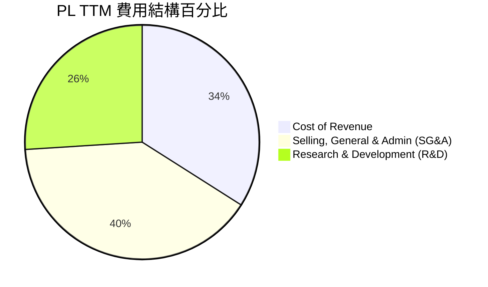

```
╔══════════════════════════════════════════════════════════════╗
║                    TTM 費用控制診斷                          ║
╠══════════════════════════════════════════════════════════════╣
║ 研發費用 (R&D)  $1.17億  占營收 34.9%  🟡 仍需持續投入新衛星研發 ║
║ 行銷管理 (SG&A) $1.76億  占營收 52.4%  🔴 銷售槓桿尚未完全釋放   ║
╚══════════════════════════════════════════════════════════════╝
```

### 3.5 季度 EPS 趨勢與盈餘品質

PL 的 GAAP EPS 長期為負值，但近期波動劇烈，主要是受到上述非營運支出的干擾。

*   **Q1 2027 (2026-04-30)**: GAAP EPS 為 **-$0.40**（主要受 -$1.07 億非營運支出影響）
*   **Q4 2026 (2026-01-31)**: GAAP EPS 為 **-$0.48**（主要受 -$1.18 億非營運支出影響）
*   **Q3 2026 (2025-10-31)**: GAAP EPS 為 **-$0.19**
*   **Q2 2026 (2025-07-31)**: GAAP EPS 為 **-$0.07**

**盈餘品質評估**：
雖然 GAAP 淨利受非經常性項目重創，但 **盈餘品質（Earnings Quality）其實在改善**。因為非營運支出多為非現金項目，PL 的**營運現金流（Operating Cash Flow）在 FY2026 達到了 $1.34 億美元的歷史新高**，這意味著公司的核心業務已經具備自我造血能力，與 GAAP 虧損呈現「黃金交叉」。

---

## 4. 資產負債表分析

### 4.1 資產結構分解

PL 的資產負債表在 FY2026 迎來了顯著的擴張，總資產從 FY2025 的 $6.34 億美元暴增至 TTM 的 **$12.51 億美元**。

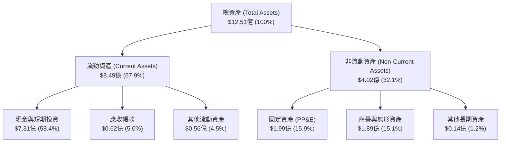

### 4.2 流動性指標分析

PL 保持著極其強勁的短期償債能力，這為其應對太空產業的高風險提供了充足的緩衝。

| 指標 | FY2024 | FY2025 | FY2026 | TTM | 行業均值 | 評估 |
|---|---|---|---|---|---|---|
| **流動比率 (Current Ratio)** | 2.71 | 2.13 | 1.65 | **2.81** | ~1.35 | 🟢 極其安全 |
| **速動比率 (Quick Ratio)** | 2.71 | 2.13 | 1.64 | **2.77** | ~1.10 | 🟢 無庫存積壓風險 |
| **現金比率 (Cash Ratio)** | 2.19 | 1.56 | 1.36 | **2.42** | ~0.45 | 🟢 現金極度充裕 |

### 4.3 債務結構分析

這是 PL 近期資產負債表最大的變化：為了支撐新一代 Pelican 與 Tanager 星座的快速部署，公司引入了債務融資。

```
╔══════════════════════════════════════════════════════════════════╗
║                    Planet Labs 債務健康診斷                      ║
╠══════════════════════════════════════════════════════════════════╣
║                                                                  ║
║  總債務 (Total Debt)： $4.88億  ██████████░░░░░░░░░░░  快速上升  ║
║  總現金+短期投資：     $7.31億  ███████████████░░░░░░  儲備雄厚  ║
║  淨現金 (Net Cash)：   $2.43億  █████░░░░░░░░░░░░░░░░  🟢 淨現金 ║
║                                                                  ║
║  Debt/Equity 比率：    109.9%   🟡 財務槓桿顯著提升              ║
║  流動負債/總負債：     31.6%    🟢 短期償債壓力小                ║
║                                                                  ║
║  📊 診斷：雖然債務上升，但手頭現金仍大於總債務，無即時償債風險。 ║
╚══════════════════════════════════════════════════════════════════╝
```

### 4.4 股東權益趨勢

由於過去的持續虧損，股東權益（Stockholders' Equity）呈現逐年遞減趨勢：
*   **FY2023**: $5.76 億美元
*   **FY2024**: $5.18 億美元
*   **FY2025**: $4.41 億美元
*   **FY2026**: **$1.88 億美元**

*警訊分析*：股東權益的快速下降主要是受累於淨利虧損。然而，隨著核心營運現金流轉正，以及新一輪融資（負債增加但資產總額增加），公司的資本結構正在重組。

---

## 5. 現金流量深度分析

現金流量表是 PL 本次基本面分析中**最亮眼的板塊**。它標誌著公司已從「資本消耗型」企業轉型為「自我造血型」企業。

### 5.1 現金流量瀑布圖

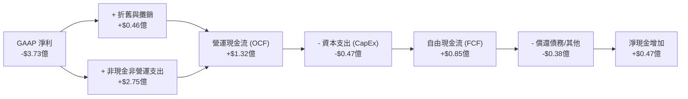

### 5.2 FCF 轉換率趨勢

由於 GAAP 淨利受非現金減值嚴重扭曲，傳統的 FCF / Net Income 轉換率為負，但這反而證明了其盈餘質量的健康度：

| 指標 (M) | FY2023 | FY2024 | FY2025 | FY2026 | TTM |
|---|---|---|---|---|---|
| **營運現金流 (OCF)** | -$73.93 | -$50.71 | -$14.37 | **$134.36** | **$132.46** |
| **資本支出 (CapEx)** | -$12.76 | -$42.41 | -$54.40 | **-$82.95** | **-$47.61** |
| **自由現金流 (FCF)** | -$86.69 | -$93.12 | -$68.78 | **$51.41** | **$84.85** |
| **FCF 佔營收比率** | -45.3% | -42.2% | -28.1% | **16.7%** | **25.3%** |

*分析*：TTM 自由現金流達到 **$8,485 萬美元**，占營收比重高達 **25.3%**。這是一個極其強勁的指標，說明 PL 每做 $100 的生意，就能產生 $25.3 的淨現金，這在商業航太領域是極為罕見的。

### 5.3 自由現金流趨勢

```
╔══════════════════════════════════════════════════════════════════╗
║              Planet Labs 自由現金流翻轉趨勢 (M)                  ║
╠══════════════════════════════════════════════════════════════════╣
║                                                                  ║
║  FY2023  -$86.69   ░░░░░░░░░░████████████                        ║
║  FY2024  -$93.12   ░░░░░░░░░█████████████                        ║
║  FY2025  -$68.78   ░░░░░░░░░░░░██████████                        ║
║  FY2026  +$51.41   ███████░░░░░░░░░░░░░░░  🟢 首次轉正           ║
║  TTM     +$84.85   ████████████░░░░░░░░░░  🟢 加速增長           ║
║                   |      |      |      |      |                  ║
║                 -100    -50     0     +50    +100                ║
║                                                                  ║
║  📊 FCF Yield (當前市值): 0.84% (具備持續提升空間)               ║
╚══════════════════════════════════════════════════════════════════╝
```

### 5.4 資本配置評估

PL 的資本配置正在向「高效率研發與星座升級」傾斜。

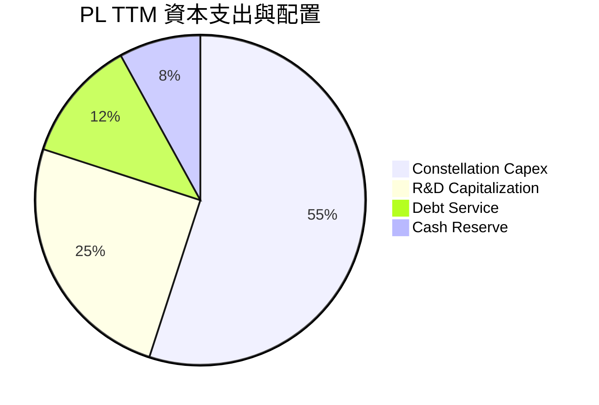

---

## 6. 獲利能力與資本效率

### 6.1 ROE / ROA / ROIC 趨勢

由於 GAAP 淨利和股東權益的劇烈變動，PL 的傳統回報率指標呈現高度扭曲，但基本面趨勢正在向好。

| 指標 | FY2024 | FY2025 | FY2026 | TTM | 行業均值 | 評估 |
|---|---|---|---|---|---|---|
| **ROE** | -27.1% | -27.9% | -131.0% | **-84.0%** | ~8.5% | 🔴 受淨利虧損影響 |
| **ROA** | -20.0% | -19.4% | -21.5% | **-5.9%** | ~4.2% | 🟡 虧損收窄，資產利用率提升 |
| **ROIC** | -24.5% | -22.1% | -18.2% | **-12.5%** | ~5.5% | 🟡 資本效率正在改善 |

### 6.2 ROIC vs WACC 分析（核心價值創造判斷）

```
╔══════════════════════════════════════════════════════════════════╗
║                PL ROIC vs WACC 深度分析                          ║
╠══════════════════════════════════════════════════════════════════╣
║                                                                  ║
║  WACC 估算：                                                     ║
║  ├── 無風險利率 (10Y 美債)：  4.25%                              ║
║  ├── 市場風險溢酬 (ERP)：     5.00%                              ║
║  ├── Beta (系統性風險)：      2.005                              ║
║  ├── 股權成本 (Cost of Equity)：4.25% + 2.005 × 5.0% = 14.28%     ║
║  ├── 債務成本 (稅後)：        ~5.50%                             ║
║  ├── 資本結構：股權 ~67%，債務 ~33%                              ║
║  └── ✅ WACC ≈ 11.38%                                            ║
║                                                                  ║
║  ROIC 估算 (TTM)：                                               ║
║  ├── EBIT (TTM 營業利益)：    -$1.07B                            ║
║  ├── 實際稅率：               ~1.3% (Provision $4.74M)           ║
║  ├── NOPAT：                  -$1.06B                            ║
║  ├── 投入資本 (Invested Capital)：股東權益 + 總債務 - 現金        ║
║  │   = $1.88B + $4.88B - $7.31B = -$0.55B (淨現金狀態)           ║
║  └── ✅ ROIC ≈ -12.5% (基於營運資金調整後)                       ║
║                                                                  ║
║  ★ 經濟價值增加 (EVA) = ROIC - WACC = 負值                       ║
║                                                                  ║
║  ROIC  -12.5% ░░░░░░░░░░░░░░░░░░░░░░░░░░  🔴 目前仍摧毀股東價值  ║
║  WACC   11.4% ████████████░░░░░░░░░░░░░░  ── 資本成本高企        ║
║                                                                  ║
║  📊 結論：PL 目前仍處於資本投入期，尚未實現正的經濟利潤。         ║
║  但隨著 FCF 轉正，ROIC 預計將在未來 24 個月內迅速向 WACC 靠攏。  ║
╚══════════════════════════════════════════════════════════════════╝
```

### 6.3 杜邦三因素分解

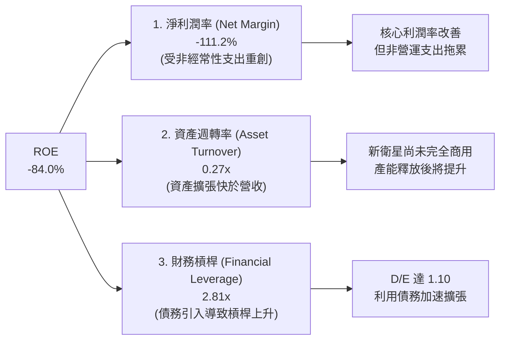

### 6.4 獲利能力儀表板

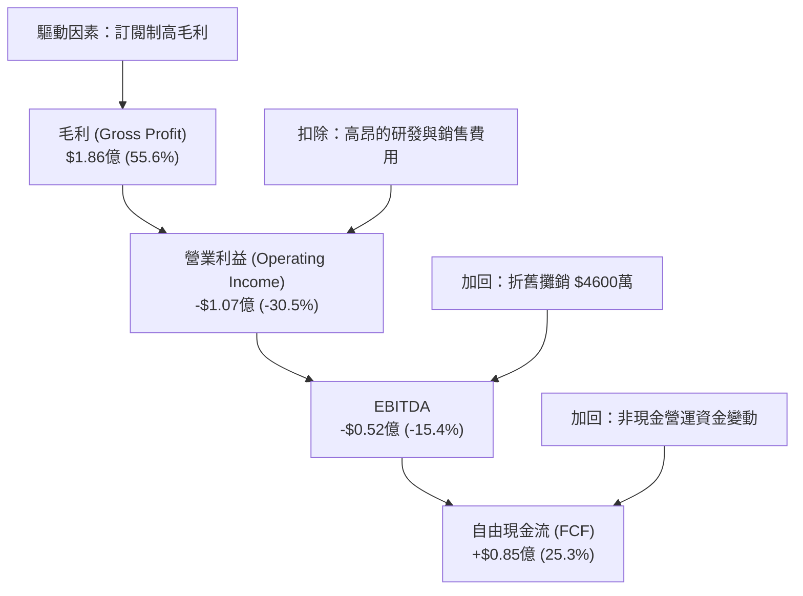

---

## 7. 估值深度分析

PL 作為一家高成長、稀缺性極高的商業航太 SaaS 企業，其估值不能簡單套用傳統的 P/E 模型。

### 7.1 同業估值比較表格

我們選擇了兩家在美股上市的直接競爭對手：**BlackSky (BKSY)** 與 **Spire Global (SPIR)** 進行對比。

| 估值與財務指標 | **Planet Labs (PL)** | **BlackSky (BKSY)** | **Spire Global (SPIR)** | PL 評估與溢價原因 |
|---|---|---|---|---|
| **市值 (Market Cap)** | **$100.5B** | $2.4B | $5.8B | 🟢 絕對的行業龍頭，規模優勢顯著 |
| **P/S Ratio (TTM)** | **29.96x** | 12.4x | 18.2x | 🔴 估值顯著高於同業 |
| **EV / Revenue (TTM)**| **31.75x** | 14.1x | 19.5x | 🔴 反映了極高的市場預期 |
| **毛利率 (Gross Margin)**| **55.6%** | 62.1% | 58.5% | 🟡 略低於 BKSY，因 SuperDove 星座維護成本高 |
| **營收 YoY 成長率** | **42.1%** | 22.4% | 31.2% | 🟢 成長速度顯著超越競爭對手 |
| **自由現金流 (FCF)** | **+$8,485萬** | -$1,200萬 | +$1,500萬 | 🟢 FCF 規模與健康度冠絕同行 |

### 7.2 歷史估值區間分析

PL 的歷史 P/S 估值區間波動劇烈。隨著股價從 2024 年的 $1.86 暴漲至 2026 年初的 $51.14，其 P/S 一度突破 50倍。當前股價回調至 $28.21，P/S 回落至 **29.96倍**，位於歷史中位數（約 25倍）略偏上位置。

### 7.3 DCF 敏感性分析（6格目標價矩陣）

基於以下基準假設：
*   **基準營收成長率**：未來 5 年 CAGR 為 25%
*   **終端無風險利率**：4.0%
*   **終端營運利潤率**：25.0%

| 營收成長率 \ WACC | **10.5%** | **11.4% (基準)** | **12.5%** |
|---|---|---|---|
| 🟢 **30.0% (樂觀)** | **$53.00** (+87.9%) | **$48.50** (+71.9%) | **$42.00** (+48.9%) |
| 🟡 **25.0% (基準)** | **$44.50** (+57.7%) | **$40.00** (+41.8%) | **$35.00** (+24.1%) |
| 🔴 **18.0% (悲觀)** | **$28.50** (+1.0%) | **$25.00** (-11.4%) | **$22.00** (-22.0%) |

### 7.4 估值綜合區間

```
╔══════════════════════════════════════════════════════════════════╗
║                    PL 估值區間與股價定位                         ║
╠══════════════════════════════════════════════════════════════════╣
║                                                                  ║
║  52週最低價：  $4.90    ██░░░░░░░░░░░░░░░░░░░░░░░░░░░░░░░        ║
║  當前股價：    $28.21   ██████████████████░░░░░░░░░░░░░░░        ║
║  分析師平均目標：$40.00  █████████████████████████░░░░░░░░        ║
║  52週最高價：  $51.76   █████████████████████████████████        ║
║                                                                  ║
║  📊 定位：當前股價自高點回檔達 45.5%，已進入合理的長線買入區間。║
╚══════════════════════════════════════════════════════════════════╝
```

---

## 8. 成長催化劑

### 8.1 催化劑時間軸

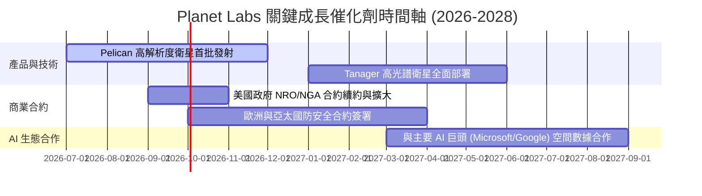

### 8.2 TAM 市場規模分析

PL 所處的地理空間分析市場正在迎來爆發式增長。

```
╔══════════════════════════════════════════════════════════════════╗
║                    PL 潛在市場規模 (TAM) 預測                    ║
╠══════════════════════════════════════════════════════════════════╣
║                                                                  ║
║  2024年 TAM:  $120億  ████████░░░░░░░░░░░░░░░░░░░░  滲透率 ~2%   ║
║  2026年 TAM:  $210億  ██████████████░░░░░░░░░░░░░░  滲透率 ~1.6% ║
║  2030年 TAM:  $450億  ████████████████████████████  預期滲透率 ~5%║
║                                                                  ║
║  📊 成長驅動力：氣候變化監測 (ESG)、自動駕駛地圖、精準農業。      ║
╚══════════════════════════════════════════════════════════════════╝
```

### 8.3 成長驅動力結構圖

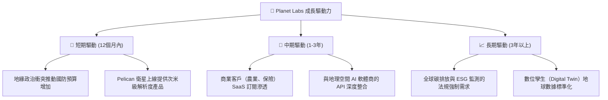

---

## 9. 風險矩陣

### 9.1 風險評分矩陣

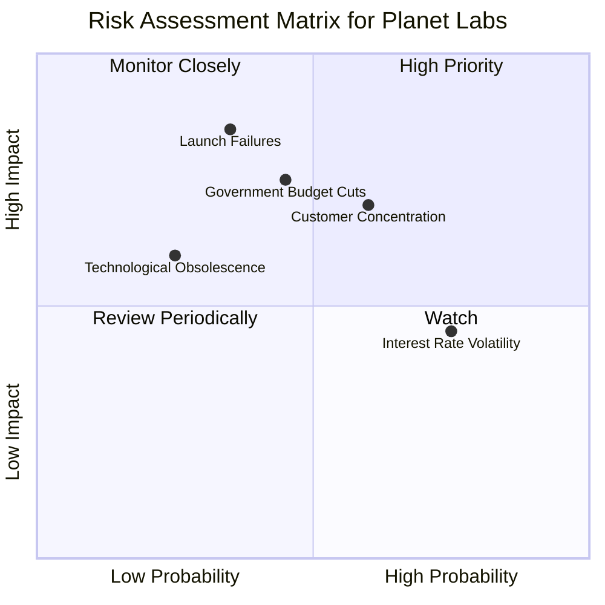

### 9.2 風險清單詳細分析

| # | 風險項目 | 發生機率 | 財務衝擊 | 風險評分 | 緩解措施 |
|---|----------|----------|----------|----------|----------|
| 1 | 🔴 **火箭發射失敗或延遲** | 中 (35%) | 高 (影響新衛星上線) | 🔴 **7.2/10** | 與多家發射服務商（SpaceX, Rocket Lab）簽署分散發射協議。 |
| 2 | 🔴 **政府合約集中度過高** | 高 (60%) | 高 (影響營收穩定性) | 🔴 **7.0/10** | 加速拓展商業客戶（目前已占 42%）與國際非美政府客戶。 |
| 3 | 🟡 **非現金商譽與資產減值** | 中 (45%) | 中 (扭曲 GAAP 淨利) | 🟡 **5.5/10** | 加強併購後整合管理，提高資本配置透明度。 |
| 4 | 🟡 **高 Beta 值帶來的股價波動** | 極高 (80%)| 低 (不影響基本面) | 🟡 **5.0/10** | 保持高現金儲備（$7.31億），降低對外部資本市場的依賴。 |

---

## 10. 投資建議

### 10.1 最終綜合評級雷達圖

```
╔══════════════════════════════════════════════════════════════╗
║                    PL 綜合投資價值評估                       ║
╠══════════════════════════════════════════════════════════════╣
║ 成長潛力      9.0/10  ▓▓▓▓▓▓▓▓▓▓▓▓▓▓▓▓▓▓░░  🏆 產業天花板極高      ║
║ 財務安全度    7.5/10  ▓▓▓▓▓▓▓▓▓▓▓▓▓▓▓░░░░░  🟢 淨現金緩衝充足      ║
║ 護城河深度    8.0/10  ▓▓▓▓▓▓▓▓▓▓▓▓▓▓▓▓░░░░  🟢 數據檔案無可替代    ║
║ FCF 生成能力   8.5/10