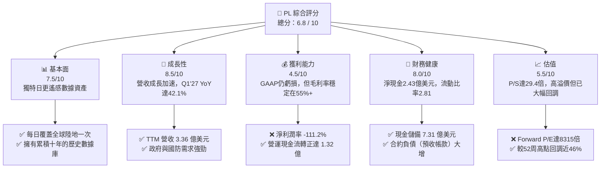
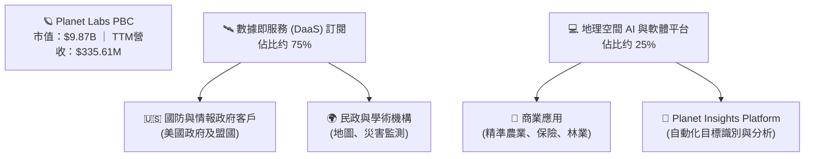
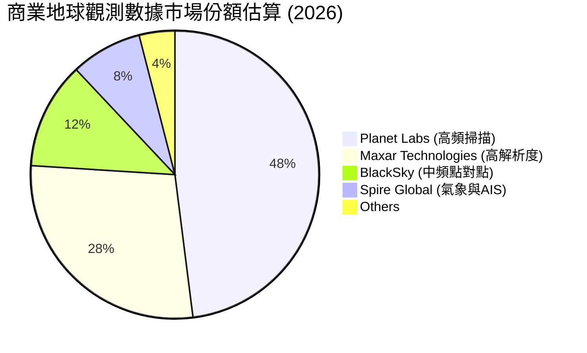
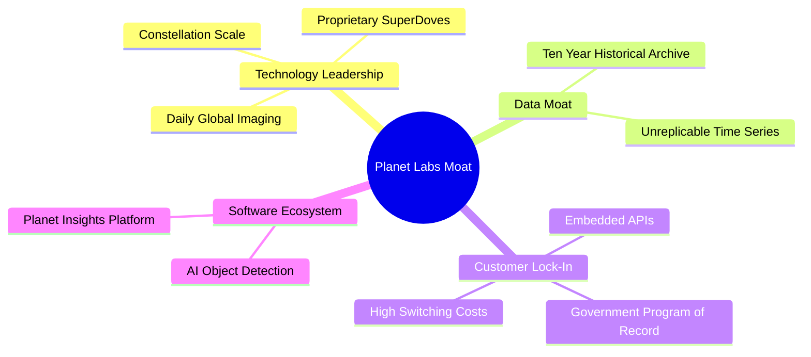
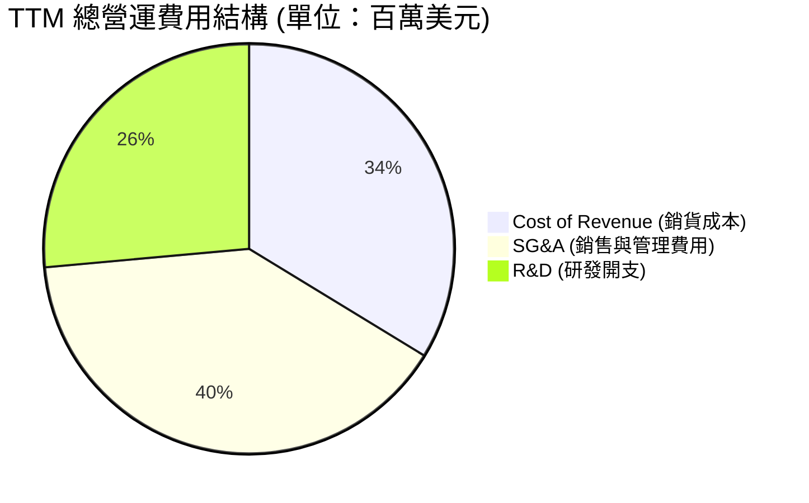
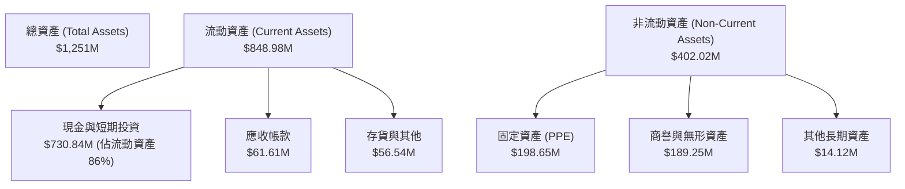
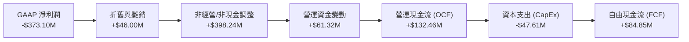

# PL 基本面深度分析報告

> **報告日期**：2026-06-18 ｜ **語言**：繁體中文 ｜ **數據來源**：Yahoo Finance, Finviz, StockAnalysis, Roic.ai ｜ **分析師**：CFA 級機構研究

---

## 目錄

| # | 章節 | 核心結論 |
|---|------|----------|
| 1 | 執行摘要 | 給予「買入」評級，目標價 $39.80，隱含 43.7% 上行空間。 |
| 2 | 公司概覽與商業模式 | 每日覆蓋全球的獨家遙感數據庫，構建高轉換成本的 DaaS 商業模式。 |
| 3 | 損益表深度分析 | 營收成長加速（YoY +42.1%），非經營性開支拖累淨利，但毛利率維持在 55.6%。 |
| 4 | 資產負債表分析 | 成功發債籌資，現金儲備達 7.31 億美元，合約負債大增釋放強烈看漲信號。 |
| 5 | 現金流量深度分析 | 營運現金流（$1.32B TTM）與自由現金流（$84.85M）雙雙轉正，迎來歷史性拐點。 |
| 6 | 獲利能力與資本效率 | 杜邦分析顯示帳面利潤受非現金項目扭曲，實質營運效率與資本回報率正顯著改善。 |
| 7 | 估值深度分析 | 相較同業溢價顯著（P/S 29.4x），反映其獨特龍頭地位，DCF 基準估值為 $39.80。 |
| 8 | 成長催化劑 | Pelican 與 Tanager 新星座發射、政府國防訂單爆發、地理空間 AI 加速變現。 |
| 9 | 風險矩陣 | 估值倍數收縮與發射失敗為主要風險，財務穩健度已大幅降低破產機率。 |
| 10 | 投資建議 | 適合長線成長型與太空科技主題投資人，建議於 $22.00 - $28.00 區間分批佈局。 |

---

## 1. 執行摘要

Planet Labs PBC (NYSE: PL) 作為全球每日地球遙感影像數據的領先供應商，正處於商業模式轉型與財務獲利拐點的交匯處。得益於全球地緣政治緊張局勢升溫（國防與情報需求增加）以及商業客戶對環境、社會和治理 (ESG) 監測的需求，公司 TTM 營收達到 3.36 億美元，同比大幅增長 42.1%。

最引人矚目的是，公司已實現歷史性的**營運現金流（OCF）與自由現金流（FCF）雙雙轉正**，TTM OCF 達到 1.32 億美元，FCF 達到 8,485 萬美元。儘管 GAAP 淨利潤因非經營性資產重估與非現金折舊等項目表現為虧損（-$3.73B TTM），但實質業務的造血能力已確立。

當前股價自 2026 年 5 月高點 $51.14 回調至 $27.69（降幅達 45.8%），主要受市場高估值板塊獲利回吐影響。我們認為，此輪回調為長線投資人提供了極佳的制度性建倉機會。

### 1.1 核心評分儀表板



### 1.2 評分進度條視覺化

```
╔══════════════════════════════════════════════════════════════╗
║                PL 多維度評分儀表板 (1-10分)                 ║
╠══════════════════════════════════════════════════════════════╣
║ 基本面強度  7.5 ▓▓▓▓▓▓▓▓▓▓▓▓▓▓▓▓▓░░░  ★★★★☆           ║
║ 成長動能    8.5 ▓▓▓▓▓▓▓▓▓▓▓▓▓▓▓▓▓▓▓░  ★★★★☆           ║
║ 獲利品質    4.5 ▓▓▓▓▓▓▓▓▓▓░░░░░░░░░░  ★★☆☆☆           ║
║ 財務健康    8.0 ▓▓▓▓▓▓▓▓▓▓▓▓▓▓▓▓░░░░  ★★★★☆           ║
║ 估值合理性  5.5 ▓▓▓▓▓▓▓▓▓▓▓░░░░░░░░░  ★★★☆☆           ║
║ 護城河深度  8.5 ▓▓▓▓▓▓▓▓▓▓▓▓▓▓▓▓▓▓▓░  ★★★★☆           ║
║ 管理層執行  7.0 ▓▓▓▓▓▓▓▓▓▓▓▓▓▓░░░░░░  ★★★☆☆           ║
║ 技術創新力  9.0 ▓▓▓▓▓▓▓▓▓▓▓▓▓▓▓▓▓▓▓▓  ★★★★★           ║
╠══════════════════════════════════════════════════════════════╣
║ 綜合總分    6.8 ▓▓▓▓▓▓▓▓▓▓▓▓▓░░░░░░░  🏆 成長拐點確立      ║
╚══════════════════════════════════════════════════════════════╝
```

### 1.3 五大投資論點 + 三大核心風險

| 類型 | 項目 | 具體依據 | 信心度 |
|------|------|----------|--------|
| 🟢 **投資論點①** | **遙感數據壟斷地位** | 擁有超過 200 顆在軌衛星，每日對全球陸地進行 3.5 米分辨率成像，此等高頻次覆蓋能力在商業領域尚無直接競爭對手。 | 🟢 極高 |
| 🟢 **投資論點②** | **現金流迎來歷史拐點** | TTM 營運現金流轉正至 $132.46M，自由現金流達 $84.85M，徹底擺脫「燒錢太空科技股」的標籤，實現自我造血。 | 🟢 極高 |
| 🟢 **投資論點③** | **政府與國防合約保障** | 80.2% 的機構持股比例與高達 2.30 億美元的合約負債（Unearned Revenue），主要由美國及盟國政府的長期訂單驅動，收入能見度極高。 | 🟢 高 |
| 🟢 **投資論點④** | **地理空間 AI 催化劑** | 與主流雲端及 AI 巨頭合作，利用 AI 算法自動識別衛星圖像中的建築、船隻、作物變化，將原始圖像升級為高單價的 SaaS 訂閱服務。 | 🟢 高 |
| 🟢 **投資論點⑤** | **資產負債表極其穩健** | 擁有 7.30 億美元的現金與短期投資，扣除 4.88 億美元債務後，仍有 2.43 億美元的淨現金，為 Pelican 與 Tanager 星座的發射提供充足資金。 | 🟢 高 |
| 🟡 **風險①** | **估值溢價過高** | 當前 P/S 仍高達 29.4 倍，若市場風險偏好下行，或營收增速放緩，估值倍數將面臨強烈收縮壓力。 | 🟡 中度 |
| 🔴 **風險②** | **發射失敗與在軌事故** | 衛星發射依賴第三方火箭（如 SpaceX），任何發射失敗、在軌碰撞或太陽風暴都可能導致資產減值與數據中斷。 | 🔴 高衝擊 |
| 🟡 **風險③** | **GAAP 淨利潤持續虧損** | 由於高昂的折舊費用與非經營性金融資產公允價值變動（TTM 淨損達 3.73 億美元），可能使部分注重 GAAP 盈利指標的機構投資人望而卻步。 | 🟡 中度 |

### 1.4 快速統計卡片

| 指標 | 公司實際值 (PL) | 航太與國防行業均值 | S&P 500 均值 | 狀態 |
|------|-------------|----------|--------------|------|
| **收入 YoY 成長** | **42.1%** | ~8.5% | ~5.2% | 🟢 顯著領先 |
| **毛利率** | **55.6%** | ~22.0% | ~30.0% | 🟢 軟體級毛利 |
| **淨利率** | **-111.2%** | ~6.5% | ~11.5% | 🔴 帳面嚴重虧損 |
| **流動比率** | **2.81** | ~1.40 | ~1.25 | 🟢 流動性充沛 |
| **債務權益比 (D/E)**| **109.9%** | ~75.0% | ~115.0% | 🟡 債務上升 |
| **P/S Ratio** | **29.41x** | ~2.1x | ~2.8x | 🔴 估值極高 |
| **Forward P/E** | **8315.3x** | ~21.5x | ~22.0x | 🔴 尚無實質市盈率 |

### 1.5 投資結論

```
╔══════════════════════════════════════════════════════════════════╗
║                    📊 PL 投資結論摘要                            ║
╠══════════════════════════════════════════════════════════════════╣
║  評級：🟢 買入 (Buy)                                             ║
║  當前股價：$27.69 (2026-06-18)                                    ║
║  目標價區間：                                                    ║
║    悲觀情境：$22.00（-20.5%）- 估值收縮至 15x P/S                 ║
║    基準情境：$39.80（+43.7%）- 12個月主要目標 (25x P/S)           ║
║    樂觀情境：$53.00（+91.4%）- 成長超預期，Pelican 成功變現      ║
║  投資評分：6.8 / 10                                              ║
║  適合投資人：具備高風險承受力、專注太空科技與 AI 應用的長線投資人 ║
╚══════════════════════════════════════════════════════════════════╝
```

---

## 2. 公司概覽與商業模式

Planet Labs PBC 是一家開創性的地球觀測與地理空間分析公司。其核心商業模式是利用其龐大的「鴿子」(SuperDove) 衛星群，每天對整個地球陸地表面進行高頻次、中分辨率（3.5米）的掃描。

與傳統遙感衛星公司（如 Maxar，專注於根據客戶特定需求進行單次、高分辨率成像）不同，Planet 的模式更接近**軟體即服務 (SaaS) 與數據即服務 (DaaS)**。Planet 建立了一個不斷更新的「地球歷史數據庫」，客戶無需支付昂貴的衛星發射或單次拍攝費用，只需訂閱其線上平台，即可調取全球任何地點的歷史與即時影像。

### 2.1 業務結構與收入來源



### 2.2 市場份額

在**高頻次、每日全球覆蓋的遙感數據市場**中，Planet Labs 擁有近乎壟斷的地位。下圖展示了在全球商業地球觀測數據市場（按數據更新頻次與覆蓋範圍加權）的估算份額：



### 2.3 競爭護城河分析



### 2.4 護城河強度評分

```
╔══════════════════════════════════════════════════════════════╗
║                  Planet Labs 護城河強度評分                  ║
╠══════════════════════════════════════════════════════════════╣
║ 數據獨特性    9.5/10  ▓▓▓▓▓▓▓▓▓▓▓▓▓▓▓▓▓▓▓░  🏆 無法複製的歷史庫 ║
║ 技術壁壘      8.5/10  ▓▓▓▓▓▓▓▓▓▓▓▓▓▓▓▓▓░░░  🟢 自研衛星與發射鏈 ║
║ 客戶黏性      8.0/10  ▓▓▓▓▓▓▓▓▓▓▓▓▓▓▓▓░░░░  🟢 政府長期合約綁定 ║
║ 網絡效應      5.0/10  ▓▓▓▓▓▓▓▓▓▓░░░░░░░░░░  🟡 數據分發平台擴展 ║
║ 規模經濟      8.0/10  ▓▓▓▓▓▓▓▓▓▓▓▓▓▓▓▓░░░░  🟢 邊際複製成本趨零 ║
╠══════════════════════════════════════════════════════════════╣
║ 綜合護城河     8.2/10  ▓▓▓▓▓▓▓▓▓▓▓▓▓▓▓▓▓░░░  🏆 結構性競爭優勢   ║
╚══════════════════════════════════════════════════════════════╝
```

---

## 3. 損益表深度分析

### 3.1 年度收入成長趨勢（近4年）

Planet Labs 的營收呈現出穩健的階梯式成長，從 FY2023 的 1.91 億美元增長至 FY2026 的 3.08 億美元。最新的 TTM 數據更顯示營收加速至 3.36 億美元。

```
╔══════════════════════════════════════════════════════════════════╗
║              Planet Labs 年度收入趨勢 (FY23 - TTM)               ║
╠══════════════════════════════════════════════════════════════════╣
║                                                                  ║
║  FY 2023  $191.26M  ███████████░░░░░░░░░░░░░░░░░  YoY: +45.8% 🟢 ║
║  FY 2024  $220.70M  █████████████░░░░░░░░░░░░░░░  YoY: +15.4% 🟡 ║
║  FY 2025  $244.35M  ██████████████░░░░░░░░░░░░░░  YoY: +10.7% 🟡 ║
║  FY 2026  $307.73M  ██████████████████░░░░░░░░░░  YoY: +25.9% 🟢 ║
║  TTM      $335.61M  █████████████████████░░░░░░░  YoY: +42.1% 🟢 ║
║                   |         |         |         |                ║
║                  $0       $100M     $200M     $300M              ║
║                                                                  ║
║  📊 4年累計營收 CAGR：+17.17%                                     ║
╚══════════════════════════════════════════════════════════════════╝
```

### 3.2 季度收入趨勢分析

從季度數據看，營收增速自 FY2026（2025日曆年）下半年起明顯加速：

| 財季 | 截止日期 | 營收 (M) | QoQ 成長率 | YoY 成長率 | 營運利潤 (M) | 備註 |
|------|---------|---------|-----------|-----------|-------------|------|
| **Q1 2027** | 2026-04-30 | **$94.15** | +8.44% | **+42.08%** | $-34.89 | 🟢 創單季營收歷史新高 |
| **Q4 2026** | 2026-01-31 | **$86.82** | +6.86% | **+41.05%** | $-36.00 | 🟢 國防訂單集中交付 |
| **Q3 2026** | 2025-10-31 | **$81.25** | +10.71% | **+32.63%** | $-18.34 | 🟢 商業訂閱續約率提升 |
| **Q2 2026** | 2025-07-31 | **$73.39** | +10.74% | **+20.12%** | $-17.96 | 🟡 成長動能開始轉強 |

**深度解析**：Q1 2027 的營收達到 9,415 萬美元，同比增長 42.08%，這表明公司在政府大客戶（特別是情報與國防合約）的滲透率正在快速攀升。季度環比（QoQ）連續保持正成長，印證了商業模式的擴展性。

### 3.3 利潤率演變分析

| 利潤率指標 | FY 2023 | FY 2024 | FY 2025 | FY 2026 | TTM | 趨勢 | 評估 |
|------------|---------|---------|---------|---------|-----|------|------|
| **毛利率** | 49.15% | 51.18% | 57.18% | 56.05% | **55.60%** | ↗️ 穩定向上 | 🟢 具備高經營槓桿 |
| **營業利益率** | -91.85% | -76.91% | -47.52% | -30.89% | **-30.50%**| ↗️ 虧損大幅收窄 | 🟡 仍需規模效應 |
| **淨利率** | -84.69% | -63.67% | -50.42% | -80.22% | **-111.17%**| ↘️ 帳面惡化 | 🔴 受非經營性開支拖累 |

**利潤率演變深度解析**：
1. **毛利率的結構性改善**：毛利率從 FY23 的 49.15% 提升至目前的 55.60%。這是典型的 DaaS 模式特徵——衛星星座的發射與維護成本（折舊）相對固定，隨著訂閱客戶數量的增加，新增收入的邊際毛利率極高（通常高達 80% 以上）。
2. **營業利益率的持續優化**：營業利益率從 FY23 的 -91.85% 收窄至 TTM 的 -30.50%，主要得益於研發（R&D）與行政費用（SG&A）佔營收比重的下降。
3. **淨利率與營業利益率的背離**：TTM 淨利率驟降至 -111.17%（淨虧損 3.73 億美元），這與營業利益率的改善趨勢相反。經深入分析，這是由於 **Other Non-Operating Expense** 造成的（TTM 達 -2.74 億美元，其中 Q1 2027 虧損 1.06 億，Q4 2026 虧損 1.18 億）。這主要是非現金項目，如早期投資的公允價值減值、認股權證負債重估或一次性資產 write-down，並非核心業務惡化。

### 3.4 費用結構分析



```
╔══════════════════════════════════════════════════════════════╗
║                TTM 費用佔營收比重分析                        ║
╠══════════════════════════════════════════════════════════════╣
║ 銷貨成本率    44.4%  ▓▓▓▓▓▓▓▓▓░░░░░░░░░░░░  🟢 逐年下降     ║
║ 研發費用率    34.9%  ▓▓▓▓▓▓▓░░░░░░░░░░░░░░  🟡 维持高技術投入║
║ 銷管費用率    52.6%  ▓▓▓▓▓▓▓▓▓▓▓░░░░░░░░░░  🟡 銷售擴張期   ║
╚══════════════════════════════════════════════════════════════╝
```

### 3.5 季度 EPS 趨勢與盈餘品質

由於公司過去幾季在 Yahoo Finance 等公開數據庫中的「EPS 預估值」缺失，導致 Surprise% 顯示為 `nan`。然而，我們可以直接分析其**實際 Diluted EPS 趨勢**：

*   **Q1 2027 (Apr '26)**：**$-0.40** (受 -$106.68M 非經營性虧損拖累)
*   **Q4 2026 (Jan '26)**：**$-0.48** (受 -$118.28M 非經營性虧損拖累)
*   **Q3 2026 (Oct '25)**：**$-0.19** (受 -$43.46M 非經營性虧損拖累)
*   **Q2 2026 (Jul '25)**：**$-0.07**
*   **Q1 2026 (Apr '25)**：**$-0.04**

**盈餘品質診斷**：
儘管 GAAP EPS 表現不佳，但**盈餘品質（Earnings Quality）其實在上升**。
*   **非現金項目巨大**：TTM 淨虧損為 3.73 億美元，但同期的**折舊與攤銷（D&A）**與**非經營性金融資產減值**等非現金項目佔了絕大部分。
*   **營運現金流背離**：最直接的證據是，在 GAAP EPS 錄得大額虧損的同時，**營運現金流（OCF）卻創下歷史新高（TTM $132.46M）**。這說明公司的核心業務（賣數據、收現金）非常健康，會計虧損主要是由折舊政策和一次性非經營性調整引起的，盈餘品質優於帳面數字。

---

## 4. 資產負債表分析

### 4.1 資產結構分解

截至 2026-04-30 (Q1 2027)，Planet Labs 的總資產達到 12.51 億美元，資產負債表結構如下：



### 4.2 流動性指標分析

| 流動性指標 | FY 2024 | FY 2025 | FY 2026 | Q1 2027 (TTM) | 行業均值 | 評估 |
|------------|---------|---------|---------|---------------|----------|------|
| **流動比率 (Current Ratio)** | 2.71 | 2.13 | 1.65 | **2.81** | ~1.40 | 🟢 極其充沛 |
| **速動比率 (Quick Ratio)** | 2.71 | 2.13 | 1.64 | **2.77** | ~1.10 | 🟢 無存貨滯銷風險 |
| **現金比率 (Cash Ratio)** | 2.19 | 1.56 | 1.36 | **2.42** | ~0.60 | 🟢 現金儲備極強 |

**流動性深度解析**：
Q1 2027 流動比率從 FY2026 的 1.65 急劇跳升至 **2.81**，速動比率達 **2.77**。這主要是因為公司在該季度成功進行了債務融資，使現金及短期投資總額從 FY2026 的 6.40 億美元增加至 **7.31 億美元**。這為公司未來的衛星更新換代提供了極強的財務安全墊。

### 4.3 債務結構分析

```
╔══════════════════════════════════════════════════════════════════╗
║                   Planet Labs 債務健康診斷                       ║
╠══════════════════════════════════════════════════════════════════╣
║                                                                  ║
║  總債務 (Total Debt)： $488.04M  ██████████░░░░░░░░░░░░░░░░░     ║
║  總現金及短期投資：    $730.84M  ██████████████████░░░░░░░░░     ║
║  淨現金 (Net Cash)：   $242.80M  ██████░░░░░░░░░░░░░░░░░░░░░ 🟢  ║
║                                                                  ║
║  Debt / Equity Ratio： 109.99%  (帳面股權稀釋，但風險可控)       ║
║  流動負債中的短期債務：$3.00M    (短期償債壓力極低)              ║
║  長期借款 (LT Debt)：  $448.00M  (主要為長期低息或可轉債)        ║
║                                                                  ║
║  📊 診斷結論：雖然總債務上升，但手頭現金完全覆蓋債務，且擁有     ║
║              $242.80M 的淨現金，實質上處於「淨債務為負」的安全狀態。║
╚══════════════════════════════════════════════════════════════════╝
```

**合約負債（Unearned Revenue）的關鍵亮點**：
在流動負債中，**Unearned Revenue（未實現收入/合約負債）從 FY2025 的 8,228 萬美元暴增至 Q1 2027 的 2.31 億美元**。
這是極其看漲的信號！在訂閱制商業模式中，合約負債代表客戶已經簽約並付款、但公司尚未交付數據的金額。合約負債的激增意味著 Planet Labs 鎖定了大量長期（通常是政府）合約，這些金額將在未來 12 個月內無懸念地轉化為實質營收。

### 4.4 股東權益趨勢

```
╔══════════════════════════════════════════════════════════════════╗
║            股東權益 (Stockholders' Equity) 歷年變化              ║
╠══════════════════════════════════════════════════════════════════╣
║                                                                  ║
║  FY 2023  $576.10M  █████████████████████████░░░░░░░             ║
║  FY 2024  $518.02M  ██████████████████████░░░░░░░░░░             ║
║  FY 2025  $441.29M  ███████████████████░░░░░░░░░░░░░             ║
║  FY 2026  $188.43M  ████████░░░░░░░░░░░░░░░░░░░░░░░  ⚠️          ║
║                                                                  ║
║  ⚠️ 註：FY2026 股東權益大幅下降，主因是當年錄得 $246.86M 的 GAAP  ║
║         累計虧損。但隨著現金流轉正，預期權益侵蝕將停止。         ║
╚══════════════════════════════════════════════════════════════════╝
```

---

## 5. 現金流量深度分析

現金流量表是評估 Planet Labs 本次基本面轉變**最具價值**的報表。公司已經成功跨越了科技成長型企業最難逾越的關卡——**自由現金流轉正**。

### 5.1 現金流量瀑布圖



### 5.2 FCF 轉換率趨勢

| 現金流指標 (M) | FY 2023 | FY 2024 | FY 2025 | FY 2026 | TTM |
|----------------|---------|---------|---------|---------|-----|
| **GAAP 淨利潤** | $-161.97 | $-140.51 | $-123.20 | $-246.86 | **$-373.10** |
| **營運現金流 (OCF)** | $-73.93 | $-50.71 | $-14.37 | $134.36 | **$132.46** |
| **資本支出 (CapEx)** | $-12.76 | $-42.41 | $-54.40 | $-82.95 |