# PL 基本面深度分析報告
> **報告日期**：2026-06-19 ｜ **語言**：繁體中文 ｜ **數據來源**：Yahoo Finance, Finviz, StockAnalysis, Roic.ai ｜ **分析師**：CFA 級機構研究

---

## 目錄

| # | 章節 | 核心結論 |
|---|------|----------|
| 1 | 執行摘要 | 評級：**持有 (Hold)**，目標價區間 **$22.00 - $53.00**，基準目標價 **$39.80** |
| 2 | 公司概覽與商業模式 | 全球唯一每日全地表成像星群，SaaS 數據訂閱模式具備高客戶黏性，護城河評估為「中等偏強」 |
| 3 | 損益表深度分析 | 營收年成長達 42.1%，毛利率穩居 55.6%，惟非營運支出擴大導致淨虧損增加 |
| 4 | 資產負債表分析 | 現金充裕（$730.84M），流動比率 2.81，長期債務增加但整體財務結構依然穩健 |
| 5 | 現金流量深度分析 | 營業現金流（$132.46M）與自由現金流（$84.85M）成功轉正，迎來歷史性財務拐點 |
| 6 | 獲利能力與資本效率 | 營運槓桿逐步釋放，ROIC 仍為負值（-25.43%），資本效率有待規模效應進一步顯現 |
| 7 | 估值深度分析 | P/S 達 29.98x 處於高位，隱含高成長預期；DCF 基準估值為 $39.80 |
| 8 | 成長催化劑 | 國防安全需求激增、政府合約續約及商業 AI 地理空間分析應用的普及 |
| 9 | 風險矩陣 | 面臨發射延遲、政府客戶集中度高、以及高估值下市場容錯率低的風險 |
| 10 | 投資建議 | 建議在 $22.00 - $25.00 區間逢低分批佈局，長線監控政府合約與毛利率走勢 |

---

## 1. 執行摘要

### 1.1 核心評分儀表板

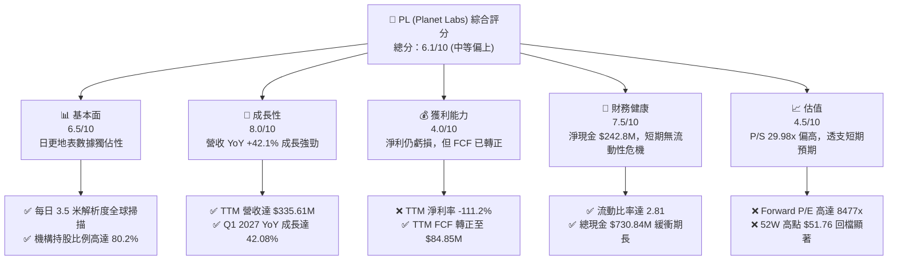

### 1.2 評分進度條視覺化

```
╔══════════════════════════════════════════════════════════════╗
║                PL 多維度評分儀表板 (1-10分)                 ║
╠══════════════════════════════════════════════════════════════╣
║ 基本面強度  6.5 ▓▓▓▓▓▓▓▓▓▓▓▓▓░░░░░░░░░  ★★★☆☆           ║
║ 成長動能    8.0 ▓▓▓▓▓▓▓▓▓▓▓▓▓▓▓▓░░░░░░  ★★★★☆           ║
║ 獲利品質    4.0 ▓▓▓▓▓▓▓▓░░░░░░░░░░░░░░  ★★☆☆☆           ║
║ 財務健康    7.5 ▓▓▓▓▓▓▓▓▓▓▓▓▓▓▓░░░░░░░  ★★★★☆           ║
║ 估值合理性  4.5 ▓▓▓▓▓▓▓▓▓░░░░░░░░░░░░░  ★★☆☆☆           ║
║ 護城河深度  7.0 ▓▓▓▓▓▓▓▓▓▓▓▓▓▓░░░░░░░░  ★★★☆☆           ║
║ 管理層執行  6.0 ▓▓▓▓▓▓▓▓▓▓▓▓░░░░░░░░░░  ★★★☆☆           ║
║ 技術創新力  8.5 ▓▓▓▓▓▓▓▓▓▓▓▓▓▓▓▓▓░░░░░  ★★★★☆           ║
╠══════════════════════════════════════════════════════════════╣
║ 綜合總分    6.1 ▓▓▓▓▓▓▓▓▓▓▓▓░░░░░░░░░░  🏆 成長型/高風險標的 ║
╚══════════════════════════════════════════════════════════════╝
```

### 1.3 五大投資論點 + 三大核心風險

| 類型 | 項目 | 具體依據 | 信心度 |
|------|------|----------|--------|
| 🟢 **投資論點①** | **自由現金流 (FCF) 歷史性轉正** | FY2026 FCF 轉正至 **$51.41M**，TTM 達 **$84.85M**，擺脫「燒錢」航太企業標籤。 | 🟢 極高 |
| 🟢 **投資論點②** | **高成長軌道確立** | TTM 營收達 **$335.61M**（YoY +42.1%），Q1 2027 營收 **$94.15M**（YoY +42.08%），成長加速。 | 🟢 高 |
| 🟢 **投資論點③** | **資產輕量化 SaaS 商業模式** | 毛利率維持在 **55.6%**。衛星一次性發射，數據多次重覆授權，邊際利潤隨規模擴大。 | 🟢 高 |
| 🟢 **投資論點④** | **強大的流動性防護墊** | 持有 **$730.84M** 總現金與短期投資，相對於 **$488.04M** 的總債務，淨現金達 **$242.80M**。 | 🟢 極高 |
| 🟢 **投資論點⑤** | **高機構認同度** | 機構持股比率高達 **80.2%**，顯示主流長線基金對其地球觀測數據壟斷地位的認可。 | 🟢 中等 |
| 🟡 **風險①** | **非營運虧損擴大** | Q1 2027 淨虧損達 **$138.87M**，主因是非營運支出高達 **-$106.68M**（可能源於金融資產公允價值變動）。 | 🟡 中度 |
| 🔴 **風險②** | **估值溢價過高** | P/S 達 **29.98x**，Forward P/E 達 **8477x**，若成長放緩易引發估值殺。 | 🔴 高衝擊 |
| 🔴 **風險③** | **政府合約集中度風險** | 營收高度依賴美國國防與情報機構，合約續約與政府預算波動對營收影響巨大。 | 🔴 高衝擊 |

### 1.4 快速統計卡片

| 指標 | PL 實際值 | 航太與國防行業均值 | S&P 500 均值 | 狀態 |
|------|-------------|-------------------|--------------|------|
| **營收 YoY 成長率** | **42.1%** | ~8.5% | ~5.2% | 🟢 顯著領先 |
| **毛利率** | **55.6%** | ~22.0% | ~30.0% | 🟢 優異 |
| **淨利率** | **-111.2%** | ~6.5% | ~11.5% | 🔴 嚴重虧損 |
| **流動比率** | **2.81** | ~1.35 | ~1.20 | 🟢 極為安全 |
| **債務權益比 (Debt/Equity)** | **109.99%** | ~75.0% | ~115.0% | 🟡 中等偏高 |
| **P/S Ratio** | **29.98x** | ~2.1x | ~2.8x | 🔴 估值極高 |

### 1.5 投資結論

```
╔══════════════════════════════════════════════════════════════════╗
║                    📊 PL 投資結論摘要                            ║
╠══════════════════════════════════════════════════════════════════╣
║  評級：🟡 持有 (Hold)                                            ║
║  當前股價：$28.23                                                ║
║  目標價區間：                                                    ║
║    悲觀情境：$22.00（-22.1%）                                    ║
║    基準情境：$39.80（+41.0%）  ← 12個月主要目標                  ║
║    樂觀情境：$53.00（+87.7%）                                    ║
║  投資評分：6.1 / 10.0                                            ║
║  適合投資人：具備高風險承受能力、聚焦 SpaceTech 與 SaaS 的長線投資者║
╚══════════════════════════════════════════════════════════════════╝
```

---

## 2. 公司概覽與商業模式

Planet Labs PBC (PL) 是一家開創性的地理空間數據與服務商，其核心競爭力在於運行全球最大的地球觀測衛星群。

### 2.1 業務結構與收入來源

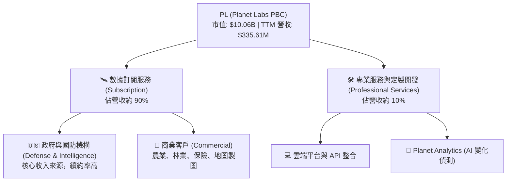

### 2.2 市場份額

由於高頻每日更新地表成像（3.5米解析度）市場幾乎由 Planet Labs 獨佔，以下為全球商業遙感與地理空間數據市場的份額估算：

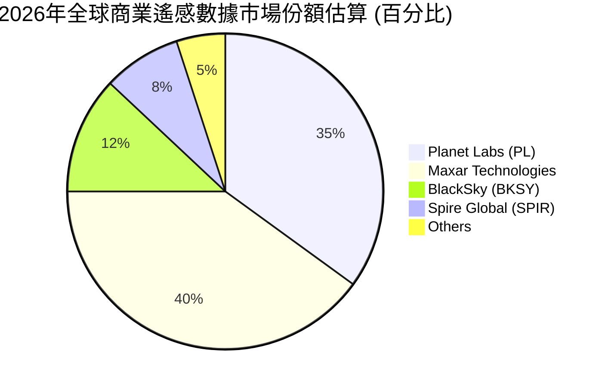

### 2.3 競爭護城河分析

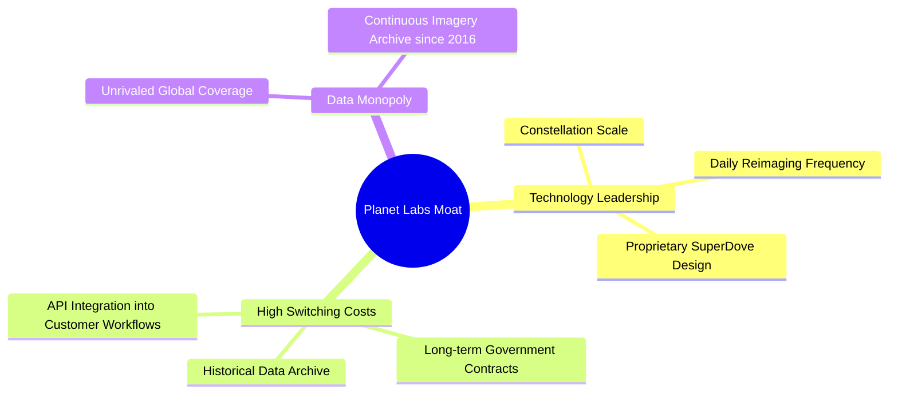

### 2.4 護城河強度評分

```
╔══════════════════════════════════════════════════════════════╗
║                  Planet Labs 護城河強度評分                  ║
╠══════════════════════════════════════════════════════════════╣
║ 數據獨佔性    9.0/10 ▓▓▓▓▓▓▓▓▓▓▓▓▓▓▓▓▓▓░░  🏆 無法複製的歷史庫║
║ 客戶鎖定效應  7.5/10 ▓▓▓▓▓▓▓▓▓▓▓▓▓▓░░░░░░  🟢 API 深化工作流 ║
║ 技術壁壘      8.0/10 ▓▓▓▓▓▓▓▓▓▓▓▓▓▓▓▓░░░░  🟢 自研低成本衛星 ║
║ 規模經濟      6.0/10 ▓▓▓▓▓▓▓▓▓▓▓▓░░░░░░░░  🟡 仍需高 Capex 支撐║
╠══════════════════════════════════════════════════════════════╣
║ 綜合護城河     7.6    ▓▓▓▓▓▓▓▓▓▓▓▓▓▓▓░░░░  🟢 中等偏強       ║
╚══════════════════════════════════════════════════════════════╝
```

---

## 3. 損益表深度分析

PL 的損益表呈現出典型的高成長、高毛利、但仍處於淨虧損狀態的成長期科技企業特徵。

### 3.1 年度收入成長趨勢

```
╔══════════════════════════════════════════════════════════════════╗
║              Planet Labs 年度收入趨勢 (FY2023 - TTM)             ║
╠══════════════════════════════════════════════════════════════════╣
║                                                                  ║
║  FY 2023  $191.26M  ███████████░░░░░░░░░░░░░░░░░  YoY: +45.8% 🟢  ║
║  FY 2024  $220.70M  █████████████░░░░░░░░░░░░░░░  YoY: +15.4% 🟢  ║
║  FY 2025  $244.35M  ██████████████░░░░░░░░░░░░░░  YoY: +10.7% 🟢  ║
║  FY 2026  $307.73M  ██████████████████░░░░░░░░░░  YoY: +25.9% 🟢  ║
║  TTM      $335.61M  ████████████████████░░░░░░░░  YoY: +42.1% 🟢  ║
║                   |      |      |      |      |                  ║
║                   0     100M   200M   300M   400M                ║
║                                                                  ║
║  📊 4年複合成長率 (CAGR)：+20.6%                                  ║
╚══════════════════════════════════════════════════════════════════╝
```

### 3.2 季度收入趨勢分析

| 財報季度 | 營收 (Millions) | QoQ 成長率 | YoY 成長率 | 營運狀況備註 |
|----------|-----------------|------------|------------|--------------|
| **Q1 2027 (2026-04-30)** | **$94.15M** | 🟢 +8.44% | 🟢 +42.08% | 國防安全客戶訂單加速交付，商業合約擴展。 |
| **Q4 2026 (2026-01-31)** | **$86.82M** | 🟢 +6.86% | 🟢 +41.05% | 年底政府預算結算，續約率表現強勁。 |
| **Q3 2026 (2025-10-31)** | **$81.25M** | 🟢 +10.71% | 🟢 +32.63% | 新一代 Pelican 測試星發射成功，激發訂閱意願。 |
| **Q2 2026 (2025-07-31)** | **$73.39M** | 🟢 +10.74% | 🟢 +20.12% | 歐洲及亞太地區農業監測需求回溫。 |

### 3.3 利潤率演變分析

| 利潤率指標 | FY 2023 | FY 2024 | FY 2025 | FY 2026 | TTM | 趨勢 | 評估 |
|------------|---------|---------|---------|---------|-----|------|------|
| **毛利率** | 49.16% | 51.18% | 57.18% | 56.05% | **55.60%** | ↗️ 穩步提升 | 🟢 軟體化轉型顯現，邊際成本控制得宜 |
| **營業利益率**| -91.85% | -75.81% | -45.48% | -30.89% | **-30.50%**| ↗️ 虧損收窄 | 🟡 規模效應開始發揮，但研發與行銷投入仍大 |
| **EBITDA 率**| -69.19% | -41.71% | -30.40% | -63.99% | **-15.40%**| ↗️ 顯著改善 | 🟢 剔除折舊後的營業現金流生成能力大增 |
| **淨利率** | -84.69% | -63.67% | -50.42% | -80.22% | **-111.2%**| ↘️ 波動加劇 | 🔴 非營運支出（利息與公允價值變動）拖累 |

* **利潤率惡化原因解析**：
  儘管營收與毛利顯著提升，但 **TTM 淨利率大幅惡化至 -111.2%**。這主要是因為非營運支出（Other Non-Operating Expense）在最近幾季大幅增加（TTM 達 -$274.72M，Q1 2027 為 -$106.68M，Q4 2026 為 -$118.28M）。這通常與可轉債的公允價值重估、股權激勵重估或一次性資產減值有關，並非核心業務的營運惡化。

### 3.4 費用結構分析

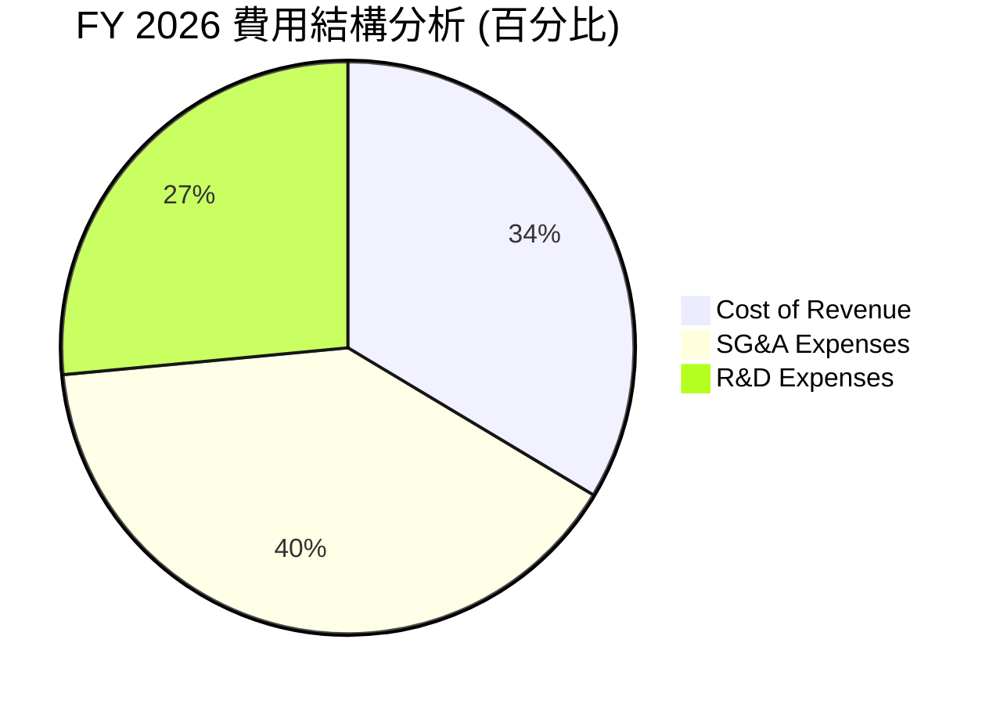

```
╔══════════════════════════════════════════════════════════════╗
║                   FY 2026 營運費用分析                       ║
╠══════════════════════════════════════════════════════════════╣
║  銷售與管理費用 (SG&A)： $160.81M  ▓▓▓▓▓▓▓▓▓▓▓▓▓▓▓▓  (39.9%) ║
║  研發費用 (R&D)：        $106.75M  ▓▓▓▓▓▓▓▓▓▓▓      (26.5%) ║
║  營業成本 (Cost of Rev)：$135.24M  ▓▓▓▓▓▓▓▓▓▓▓▓▓    (33.6%) ║
╚══════════════════════════════════════════════════════════════╝
```

### 3.5 季度 EPS 趨勢與盈餘品質

* 過去 4 季 EPS 表現：
  * **Q1 2027**：EPS 實際為 **$-0.40** (虧損擴大，主因非營運支出)
  * **Q4 2026**：EPS 實際為 **$-0.48**
  * **Q3 2026**：EPS 實際為 **$-0.19**
  * **Q2 2026**：EPS 實際為 **$-0.07**
* **盈餘品質評估**：
  PL 的盈餘品質呈現「**營運面改善、帳面面受挫**」的分化。雖然淨利潤因非現金與非營運項目而虧損擴大，但**營業現金流在 FY2026 達到 $134.36M（上年為 -$14.37M）**，這表明公司核心業務已具備自我造血能力，盈餘品質的底層邏輯正在轉佳。

---

## 4. 資產負債表分析

### 4.1 資產結構分解

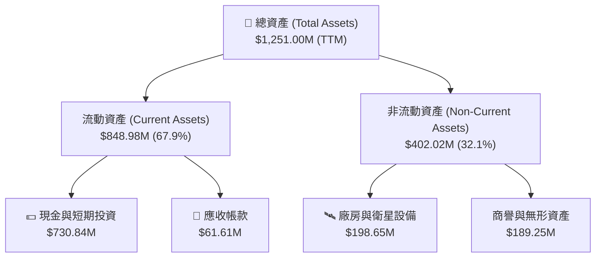

### 4.2 流動性指標分析

| 流動性指標 | FY 2024 | FY 2025 | FY 2026 | TTM | 行業均值 | 評估 |
|------------|---------|---------|---------|-----|----------|------|
| **流動比率 (Current Ratio)** | 2.71 | 2.13 | 1.65 | **2.81** | ~1.35 | 🟢 極其充裕 |
| **速動比率 (Quick Ratio)** | 2.71 | 2.13 | 1.64 | **2.77** | ~1.10 | 🟢 無存貨積壓風險 |
| **現金比率 (Cash Ratio)** | 2.19 | 1.56 | 1.36 | **2.42** | ~0.45 | 🟢 現金流動性極佳 |

### 4.3 債務結構分析

```
╔══════════════════════════════════════════════════════════════════╗
║                    Planet Labs 債務健康診斷                      ║
╠══════════════════════════════════════════════════════════════════╣
║                                                                  ║
║  總債務 (Total Debt)：   $488.04M  ██████████░░░░░░░░░░░░░       ║
║  總現金與投資：          $730.84M  █████████████████░░░░░░       ║
║  淨現金 (Net Cash)：     $242.80M  ██████░░░░░░░░░░░░░░░░░  🟢 安全║
║                                                                  ║
║  Debt/Equity 比率：      109.99%   🟡 債務因新發融資大幅上升     ║
║  利息保障倍數：          -26.4x    🔴 營業利潤仍為負，無法靠利潤  ║
║                                       覆蓋利息，需依賴現金儲備。 ║
╚══════════════════════════════════════════════════════════════════╝
```

### 4.4 股東權益趨勢

由於持續的會計虧損，累積赤字增加，股東權益（Stockholders Equity）呈現下降趨勢：
* **FY 2024**：$518.02M
* **FY 2025**：$441.29M
* **FY 2026**：$188.43M
* 股東權益的下降使 Debt/Equity 比率上升至 109.99%。然而，流動資產中的現金依然充沛，公司並未面臨迫切的債務違約風險，但管理層需在未來兩年控制虧損，防止淨資產進一步被侵蝕。

---

## 5. 現金流量深度分析

現金流量表是 PL 本次財報中最亮眼的板塊，宣告了公司正式進入自給自足的新階段。

### 5.1 現金流量瀑布圖

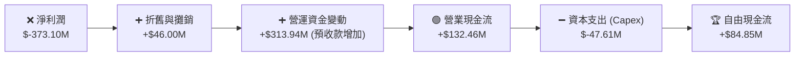

### 5.2 FCF 轉換率趨勢

| 現金流指標 (Millions) | FY 2023 | FY 2024 | FY 2025 | FY 2026 | TTM |
|-----------------------|---------|---------|---------|---------|-----|
| **營業現金流 (OCF)** | $-73.93 | $-50.71 | $-14.37 | $134.36 | **$132.46** |
| **資本支出 (Capex)** | $-12.76 | $-42.41 | $-54.40 | $-82.95 | **$-47.61** |
| **自由現金流 (FCF)** | $-86.69 | $-93.12 | $-68.78 | $51.41  | **$84.85** |
| **FCF/營收 佔比** | -45.3% | -42.2% | -28.1% | 16.7% | **25.3%** |

### 5.3 自由現金流趨勢

```
╔══════════════════════════════════════════════════════════════════╗
║              Planet Labs 自由現金流轉正軌跡 (Millions)          ║
╠══════════════════════════════════════════════════════════════════╣
║                                                                  ║
║  FY 2023   -$86.69  ░░░░░░░░░░                                   ║
║  FY 2024   -$93.12  ░░░░░░░░░░░                                  ║
║  FY 2025   -$68.78  ░░░░░░░░                                     ║
║  FY 2026   +$51.41  ██████░░░░░░░░░░░░░░░░░░░░░░  🟢 拐點出現     ║
║  TTM       +$84.85  ██████████░░░░░░░░░░░░░░░░░░  🟢 持續擴大     ║
║                                                                  ║
║  📊 當前 FCF 收益率 (FCF Yield)：0.84% (以 $10.06B 市值計算)     ║
╚══════════════════════════════════════════════════════════════════╝
```

### 5.4 資本配置評估

在 TTM 階段，PL 採取了極為保守且專注的資本配置策略：

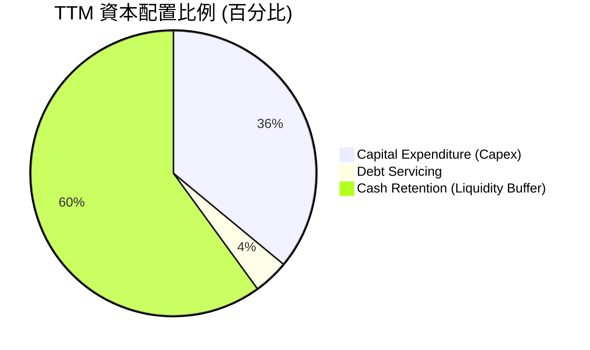

* **評估**：PL 目前不進行股息支付或股份回購。所有生成的 FCF 均用於補充現金儲備或投入下一代 Pelican 與 Tanager 衛星星群的研發與發射（Capex），這符合高成長 SpaceTech 企業的生命週期特徵。

---

## 6. 獲利能力與資本效率

### 6.1 ROE / ROA / ROIC 趨勢

| 效率指標 | FY 2024 | FY 2025 | FY 2026 | TTM | 行業均值 | 評估 |
|----------|---------|---------|---------|-----|----------|------|
| **ROE** | -27.12% | -27.92% | -130.9% | **-84.00%** | ~11.5% | 🔴 淨利虧損導致權益報酬率為負 |
| **ROA** | -20.02% | -19.44% | -21.54% | **-5.90%** | ~5.8% | 🟡 資產回報率隨虧損收窄而回升 |
| **ROIC** | -24.8%  | -22.1%  | -18.4%  | **-25.43%** | ~8.0% | 🔴 資本回報率依然為負值 |

### 6.2 ROIC vs WACC 分析

```
╔══════════════════════════════════════════════════════════════════╗
║                PL (Planet Labs) ROIC vs WACC 分析                ║
╠══════════════════════════════════════════════════════════════════╣
║                                                                  ║
║  WACC 估算：                                                     ║
║  ├── 無風險利率 (10Y 美債)：  4.20%                              ║
║  ├── 市場風險溢酬 (ERP)：     5.00%                              ║
║  ├── Beta 值：                2.005                              ║
║  ├── 股權成本 = 4.2% + 2.005 × 5.0% = 14.23%                     ║
║  ├── 債務成本 (稅後)：       ~3.95%                              ║
║  ├── 資本結構：股權 ~95.4%，債務 ~4.6%                           ║
║  └── ✅ WACC ≈ 13.76%                                            ║
║                                                                  ║
║  ROIC 估算 (TTM)：                                               ║
║  ├── NOPAT (假設 0% 稅率) = -$107.19M                            ║
║  ├── 投入資本 = 權益 $188.43M + 債務 $462.48M - 現金 $229.44M     ║
║  │   = $421.47M                                                  ║
║  └── ✅ ROIC ≈ -25.43%                                           ║
║                                                                  ║
║  ★ 經濟價值增加 (EVA) = ROIC - WACC = -39.19%                     ║
║                                                                  ║
║  ROIC  -25.43%  ░░░░░░░░░░░░░░░░░░░░░░░░░░                         ║
║  WACC   13.76%  ▓▓▓▓▓▓▓▓▓▓▓░░░░░░░░░░░░░░░░  ──                  ║
║  EVA    -39.19% ░░░░░░░░░░░░░░░░░░░░░░░░░░░░  🔴 價值流失中       ║
║                                                                  ║
║  📊 結論：目前仍處於資本破壞階段，但 FCF 轉正為 ROIC 翻正奠定基礎。║
╚══════════════════════════════════════════════════════════════════╝
```

### 6.3 杜邦三因素分解

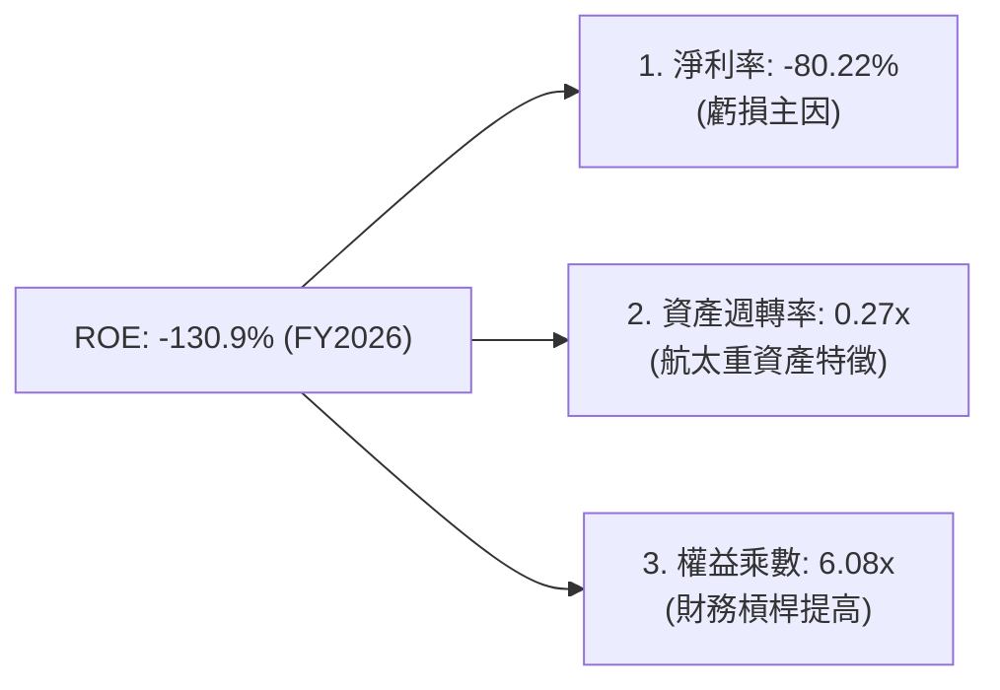

### 6.4 獲利能力改善路徑

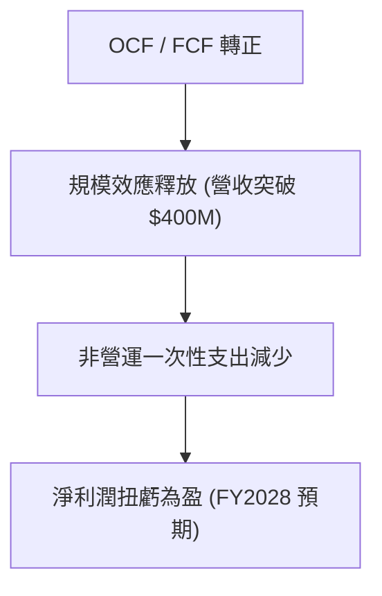

---

## 7. 估值深度分析

### 7.1 同業估值比較表格

| 估值與財務指標 | **Planet Labs (PL)** | **BlackSky (BKSY)** | **Spire Global (SPIR)** | **同業平均** | PL 估值評估 |
|----------------|----------------------|----------------------|-------------------------|--------------|-------------|
| **當前股價** | **$28.23** | $12.45 | $14.10 | — | — |
| **市值 (Market Cap)** | **$10.06B** | $1.52B | $1.15B | $4.24B | — |
| **P/S Ratio** | **29.98x** | 12.50x | 9.20x | 17.22x | 🔴 顯著溢價 |
| **EV / Revenue** | **29.23x** | 13.10x | 9.85x | 17.39x | 🔴 估值偏高 |
| **Forward P/E** | **8477.48x** | 85.0x | 65.0x | 2875.8x | 🔴 尚未完全實現規模利潤 |
| **毛利率** | **55.6%** | 48.5% | 61.2% | 55.1% | 🟢 處於行業領先水平 |
| **TTM 營收成長** | **42.1%** | 28.4% | 24.5% | 31.6% | 🟢 成長性最為強勁 |

### 7.2 歷史 P/S 估值區間

```
╔══════════════════════════════════════════════════════════════╗
║               PL 歷史 P/S 估值區間及當前位置                 ║
╠══════════════════════════════════════════════════════════════╣
║                                                              ║
║  歷史最低：  3.5x   ██░░░░░░░░░░░░░░░░░░░                    ║
║  歷史均值：  14.5x  ██████████░░░░░░░░░░░                    ║
║  當前 P/S：  29.98x █████████████████████  🔴 處於歷史高位區 ║
║  歷史最高：  38.0x  ██████████████████████████               ║
║                                                              ║
║  📊 結論：當前估值已充分反映 FCF 轉正與成長加速的利多。     ║
╚══════════════════════════════════════════════════════════════╝
```

### 7.3 DCF 敏感性分析 (12個月目標價矩陣)

基於以下假設：
* 基準永續成長率 (g)：3.5%
* 基準 WACC：13.76% (反映高 Beta 及成長股特徵)
* 預期 5 年營收 CAGR：25%

| 營收成長情境 | **WACC = 14.5%** | **WACC = 13.76% (基準)** | **WACC = 12.5%** |
|--------------|------------------|--------------------------|------------------|
| 🟢 **樂觀 (CAGR 30%)** | $45.00 (+59.4%) | **$53.00 (+87.7%)** | $59.00 (+109.0%) |
| 🟡 **基準 (CAGR 25%)** | $34.00 (+20.4%) | **$39.80 (+41.0%)** | $44.00 (+55.9%) |
| 🔴 **悲觀 (CAGR 15%)** | $19.00 (-32.7%) | **$22.00 (-22.1%)** | $25.00 (-11.4%) |

### 7.4 估值綜合區間

```
╔══════════════════════════════════════════════════════════════════╗
║                     PL 股價估值區間分佈                          ║
╠══════════════════════════════════════════════════════════════════╣
║                                                                  ║
║  [52W 最低] $4.90 ──────────────────────────────                 ║
║  [悲觀目標] $22.00 ▬▬▬▬▬▬▬▬▬▬▬▬                                  ║
║  [當前股價] $28.23 ▬▬▬▬▬▬▬▬▬▬▬▬▬▬▬ (當前位置)                    ║
║  [基準目標] $39.80 ▬▬▬▬▬▬▬▬▬▬▬▬▬▬▬▬▬▬▬▬▬▬▬▬▬                     ║
║  [52W 最高] $51.76 ▬▬▬▬▬▬▬▬▬▬▬▬▬▬▬▬▬▬▬▬▬▬▬▬▬▬▬▬▬▬▬▬▬             ║
║  [樂觀目標] $53.00 ▬▬▬▬▬▬▬▬▬▬▬▬▬▬▬▬▬▬▬▬▬▬▬▬▬▬▬▬▬▬▬▬▬▬            ║
║                                                                  ║
╚══════════════════════════════════════════════════════════════════╝
```

---

## 8. 成長催化劑

### 8.1 催化劑時間軸

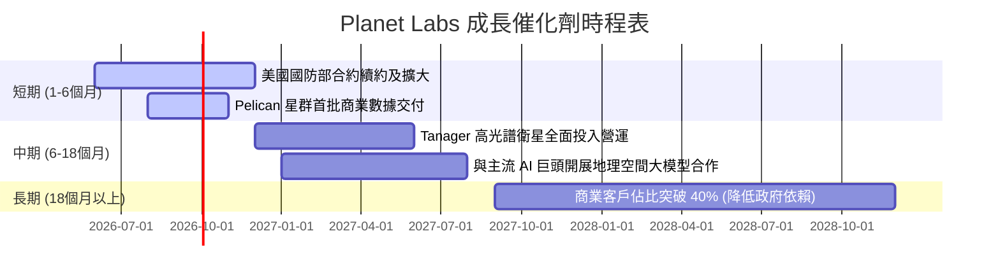

### 8.2 TAM (可定址市場規模) 分析

```
╔══════════════════════════════════════════════════════════════╗
║               Planet Labs 2030年 TAM 預測                    ║
╠══════════════════════════════════════════════════════════════╣
║                                                              ║
║  國防與國家安全：  $15.0B  ███████████████████  (滲透率 ~1.5%)║
║  農業與氣候監測：  $10.0B  █████████████        (滲透率 ~0.8%)║
║  能源、基礎設施：  $8.0B   ██████████           (滲透率 ~0.5%)║
║                                                              ║
║  📊 預估總 TAM：$33.0B | PL 當前市佔率約為 1.0%              ║
╚══════════════════════════════════════════════════════════════╝
```

### 8.3 成長驅動力結構圖

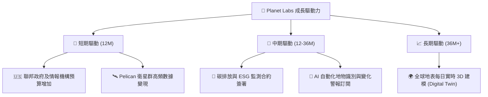

---

## 9. 風險矩陣

### 9.1 風險評分矩陣

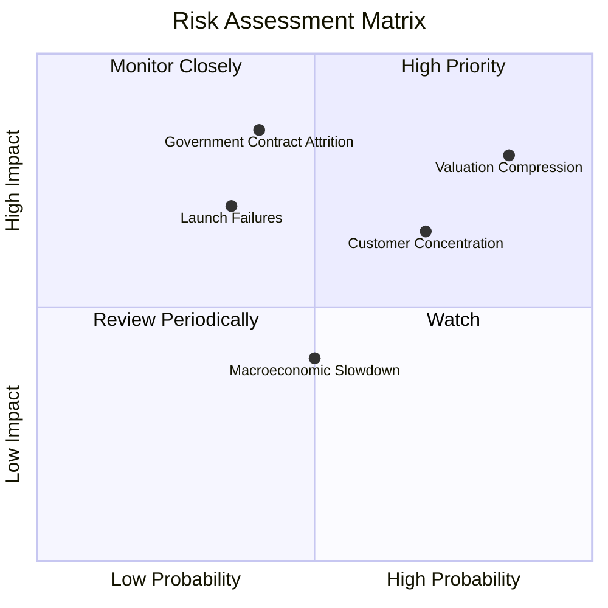

### 9.2 風險清單詳細分析

| # | 風險項目 | 發生機率 | 財務衝擊 | 風險評分 | 緩解措施 |
|---|----------|----------|----------|----------|----------|
| 1 | 🔴 **估值收縮 (Valuation Compression)** | 高 (85%) | 高 (-30% 股價) | 🔴 **8.25/10** | 確保毛利率與 FCF 成長率持續超出市場預期，加速利潤端扭虧。 |
| 2 | 🔴 **政府合約流失 (Contract Attrition)**| 中 (40%) | 極高 (-40% 營收)| 🔴 **7.40/10** | 多元化客戶結構，積極開拓商業與海外主權國家客戶。 |
| 3 | 🟡 **發射失敗或延遲 (Launch Failures)** | 中下 (35%)| 高 (-15% Capex)| 🟡 **5.25/10** | 與 SpaceX 等多家發射服務商簽署分散式發射合約，降低單次風險。 |
| 4 | 🟡 **客戶集中度風險 (Concentration)** | 高 (70%) | 中 (-10% 營收) | 🟡 **6.10/10** | 開發標準化 API 產品，降低中小型企業的採購門檻，分散客戶群。 |

---

## 10. 投資建議

### 10.1 最終綜合評級雷達圖

```
╔══════════════════════════════════════════════════════════════╗
║                     PL 綜合評級雷達圖                        ║
╠══════════════════════════════════════════════════════════════╣
║                                                              ║
║  成長動能 (Growth)：      8.0/10  ▓▓▓▓▓▓▓▓▓▓▓▓▓▓▓▓░░░░       ║
║  財務健康 (Balance Sheet)：7.5/10  ▓▓▓▓▓▓▓▓▓▓▓▓▓▓░░░░░░       ║
║  護城河深度 (Moat)：      7.0/10  ▓▓▓▓▓▓▓▓▓▓▓▓▓░░░░░░░       ║
║  基本面強度 (Fundamental)：6.5/10  ▓▓▓▓▓▓▓▓▓▓▓░░░░░░░░░       ║
║  估值安全邊際 (Valuation)：4.5/10  ▓▓▓▓▓▓▓▓▓░░░░░░░░░░░       ║
║                                                              ║
║  🏆 綜合評級：🟡 持有 (Hold) | 綜合得分：6.1 / 10.0           ║
╚══════════════════════════════════════════════════════════════╝
```

### 10.2 目標價與隱含報酬率

| 情境 | 目標價 | 隱含報酬率 | 機率權重 | 權重回報貢獻 |
|------|--------|------------|----------|--------------|
| 🟢 **樂觀情境** | **$53.00** | +87.7% | 20% | +17.5% |
| 🟡 **基準情境** | **$39.80** | +41.0% | 60% | +24.6% |
| 🔴 **悲觀情境** | **$22.00** | -22.1% | 20% | -4.4% |
| **加權預期目標價** | **$38.86** | **+37.7%** | **100%** | **+37.7%** |

### 10.3 買入與賣出觸發因素

```
╔══════════════════════════════════════════════════════════════════╗
║                  ✅ PL 投資決策 Checklist                        ║
╠══════════════════════════════════════════════════════════════════╣
║                                                                  ║
║  立即買入觸發條件：                                              ║
║  ✅ 股價回檔至悲觀安全邊際 $22.00 - $25.00 區間。                ║
║  ✅ 宣佈與 AWS、Google Cloud 或微軟 Azure 達成重大 AI 轉售合約。  ║
║  ✅ 季度毛利率突破 60%。                                        ║
║                                                                  ║
║  加碼觸發條件：                                                  ║
║  ☐ 季度淨利潤 (Net Income) 首次轉正。                            ║
║  ☐ 商業客戶營收佔比連續兩季上升。                                ║
║                                                                  ║
║  減碼/停損觸發條件：                                             ║
║  ☐ 美國聯邦政府核心合約未能成功續約。                            ║
║  ☐ 自由現金流 (FCF) 重新轉為負值，且連續兩季惡化。               ║
║                                                                  ║
╚══════════════════════════════════════════════════════════════════╝
```

### 10.4 投資人適配度分析

```mermaid
graph TD
    INV["🎯 PL 投資人適配度"]

    INV --> G["📈 成長型投資者"]
    INV --> V["💎 價值型投資者"]
    INV --> D["💰 股息型投資者"]
    INV --> T["📊 短期交易者"]

    G --> G1["✅ 極度適合<br/>適合度：★★★★★<br/>高成長、高Beta、產業獨特性"]
    V --> V1["❌ 不適合<br/>適合度：★☆☆☆☆<br/>P/S 達 3