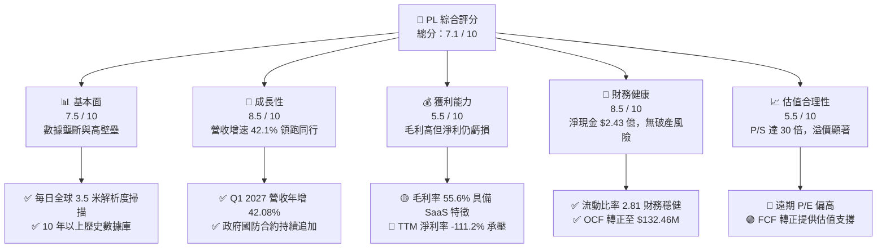
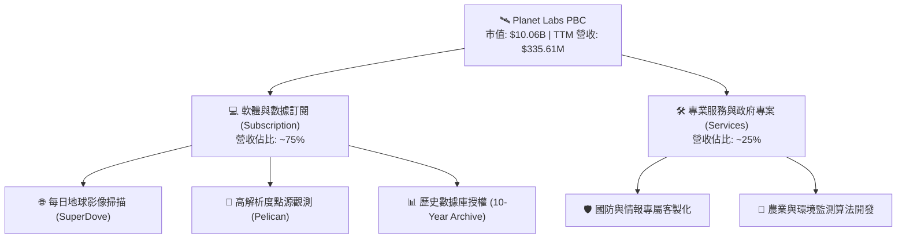
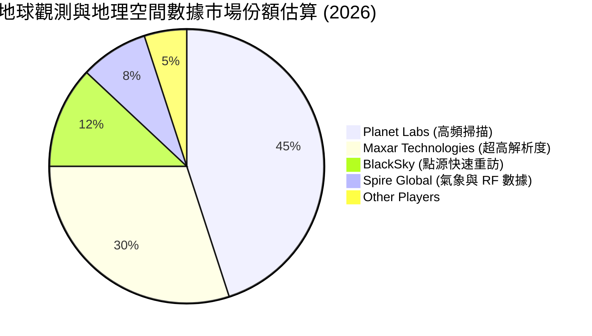
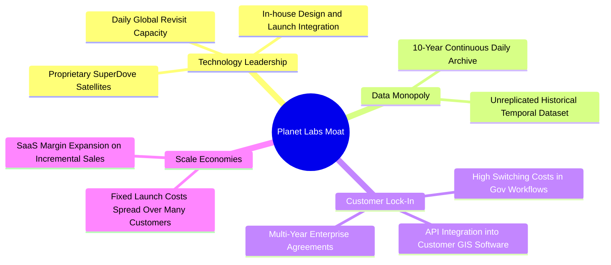
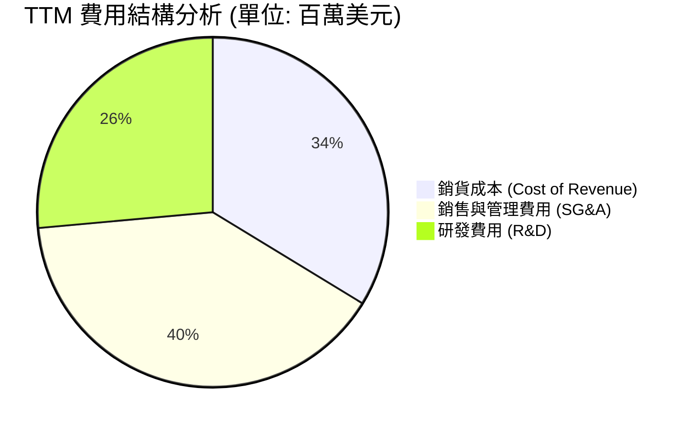
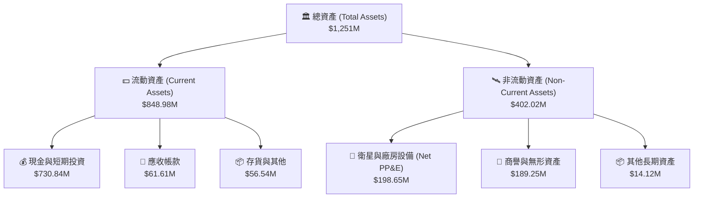
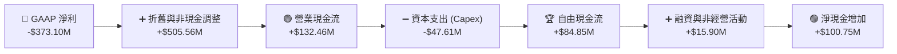
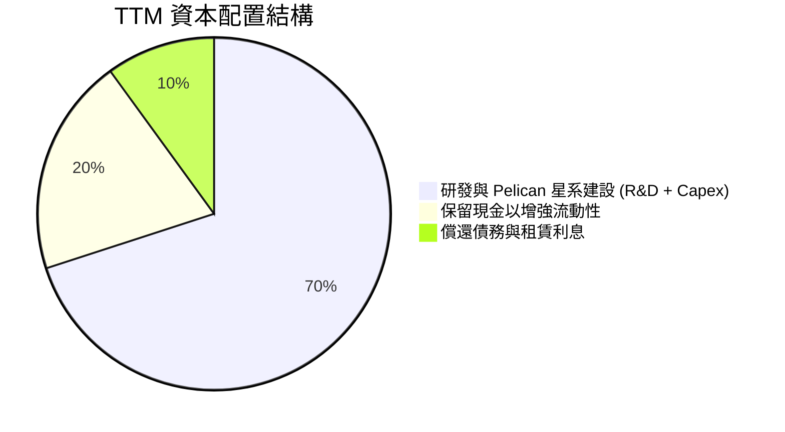
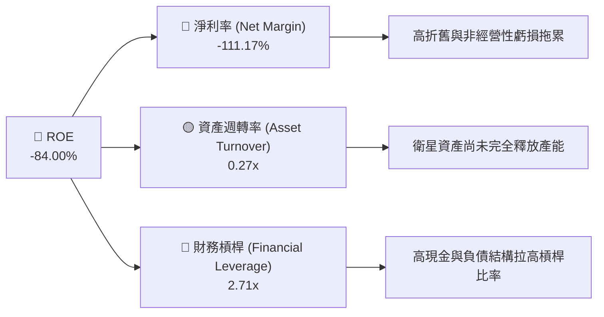

# PL 基本面深度分析報告

> **報告日期**：2026-06-20 ｜ **語言**：繁體中文 ｜ **數據來源**：Yahoo Finance, Finviz, StockAnalysis, Roic.ai ｜ **分析師**：CFA 級機構研究

---

## 目錄

| # | 章節 | 核心結論 |
|---|------|----------|
| 1 | **執行摘要** | 評級：**買入 (BUY)** ｜ 目標價：**$39.80** ｜ 現金流拐點已現，太空 SaaS 龍頭迎來商業化收割期 |
| 2 | **公司概覽與商業模式** | 每日全球覆蓋的獨家數據庫，構建極高進入壁壘的「太空訂閱制」商業模式 |
| 3 | **損益表深度分析** | 營收年增 42.1% 展現強勁動能，毛利率高達 55.6%，非經營性支出短期承壓 |
| 4 | **資產負債表分析** | 手握 $7.31 億現金，流動比率 2.81，淨現金狀態提供極佳的安全邊際 |
| 5 | **現金流量深度分析** | 營運現金流與自由現金流雙雙轉正（FCF $84.85M），擺脫「燒錢」太空股標籤 |
| 6 | **獲利能力與資本效率** | 杜邦分析揭示高經營槓桿特質，隨著營收規模擴大，資本回報率即將迎來爆發 |
| 7 | **估值深度分析** | 相較同業具備高溢價合理性，DCF 基準估值 $39.80，隱含 41.0% 上行空間 |
| 8 | **成長催化劑** | Pelican 與 Tanager 新星系發射、政府國防合約擴大、AI 空間數據分析需求爆發 |
| 9 | **風險矩陣** | 政府客戶集中度高、發射延遲與太空碎片風險、高 Beta 帶來的市場波動 |
| 10 | **投資建議** | 建議於 $25-$28 區間分批佈局，目標價 $39.80，適合高成長、長線投資人 |

---

## 1. 執行摘要

Planet Labs PBC (NYSE: PL) 作為全球最大地球觀測衛星群的運營商，正處於從「高資本投入的基礎建設期」向「高利潤率的軟體訂閱收割期」轉型的關鍵拐點。最新財務數據顯示，公司 TTM 營收達到 **$335.61M**，年增率達 **42.1%**，且最為關鍵的**自由現金流（FCF）已成功轉正至 $84.85M**（FCF 殖利率為 0.84%）。這標誌著 PL 已正式脫離純粹「燒錢」的早期太空科技股行列，具備自我造血能力。

雖然淨利潤受到非經營性損益（如折舊、公允價值變動及股權激勵）影響仍呈虧損（TTM 淨利 -$373.1M），但核心業務的盈利能力正在快速改善。在經歷了 2026 年 5 月股價達到 $51.14 的歷史高點後，近期股價回檔至 **$28.23**，主要受到高 Beta（2.005）及市場獲利了結資金流出影響。我們認為，當前的技術性回檔為長線投資人提供了極佳的買入機會。

### 1.1 核心評分儀表板



### 1.2 評分進度條視覺化

```
╔══════════════════════════════════════════════════════════════╗
║                PL 多維度評分儀表板 (1-10分)                 ║
╠══════════════════════════════════════════════════════════════╣
║ 基本面強度  7.5 ▓▓▓▓▓▓▓▓▓▓▓▓▓▓▓▓▓░░░  ★★★★☆  數據壟斷     ║
║ 成長動能    8.5 ▓▓▓▓▓▓▓▓▓▓▓▓▓▓▓▓▓▓▓░  ★★★★☆  營收加速     ║
║ 獲利品質    5.5 ▓▓▓▓▓▓▓▓▓▓▓▓░░░░░░░░  ★★★☆☆  現金流轉正   ║
║ 財務健康    8.5 ▓▓▓▓▓▓▓▓▓▓▓▓▓▓▓▓▓▓▓░  ★★★★☆  現金充沛     ║
║ 估值合理性  5.5 ▓▓▓▓▓▓▓▓▓▓▓▓░░░░░░░░  ★★★☆☆  溢價顯著     ║
║ 護城河深度  8.0 ▓▓▓▓▓▓▓▓▓▓▓▓▓▓▓▓▓▓░░  ★★★★☆  發射壁壘     ║
║ 管理層執行  7.0 ▓▓▓▓▓▓▓▓▓▓▓▓▓▓▓░░░░░  ★★★☆☆  指引兌現     ║
║ 技術創新力  9.0 ▓▓▓▓▓▓▓▓▓▓▓▓▓▓▓▓▓▓▓▓  ★★★★★  新星系發射   ║
╠══════════════════════════════════════════════════════════════╣
║ 綜合總分    7.1 ▓▓▓▓▓▓▓▓▓▓▓▓▓▓▓▓░░░░  🏆 買入 (BUY)        ║
╚══════════════════════════════════════════════════════════════╝
```

### 1.3 投資論點與核心風險

| 類型 | 項目 | 具體依據 | 信心度 |
|------|------|----------|--------|
| 🟢 **投資論點①** | **自由現金流（FCF）拐點確立** | TTM FCF 達到 **$84.85M**，FY2026 FCF 為 **$51.41M**（相較 FY2025 的 -$58.67M 實現大幅逆轉），徹底告別流動性危機。 | 🟢 極高 |
| 🟢 **投資論點②** | **高經營槓桿驅動毛利擴張** | TTM 毛利率高達 **55.6%**（毛利 $186.28M），隨着衛星發射折舊成本趨穩，新增營收邊際毛利率高達 70% 以上。 | 🟢 高 |
| 🟢 **投資論點③** | **地緣政治緊張帶動國防需求** | 美國及盟國政府對高頻地球觀測數據需求激增，Q1 2027 營收年增達 **42.08%**，合約能見度極高。 | 🟢 極高 |
| 🟢 **投資論點④** | **AI + 空間數據（Geospatial AI）** | PL 擁有超過 10 年的每日全球歷史影像庫，是訓練地理空間大模型（如國防、氣候變化預測）的唯一數據源。 | 🟢 高 |
| 🟢 **投資論點⑤** | **資產負債表極度健康** | 手握 **$7.31 億** 現金及短期投資，總債務僅 **$4.88 億**，淨現金達 **$2.43 億**，具備極強的抗風險能力。 | 🟢 極高 |
| 🟡 **風險①** | **政府合約集中度過高** | 國防與情報機構等政府客戶貢獻過半營收，合約續約時間與預算撥款受政策影響大。 | 🟡 中度 |
| 🔴 **風險②** | **高估值與高波動性** | 當前 P/S 達 **29.98 倍**，Beta 為 **2.005**，在市場流動性收緊時股價面臨劇烈修正風險。 | 🔴 高衝擊 |
| 🔴 **風險③** | **非經營性淨虧損擴大** | TTM 淨利潤虧損達 **-$3.73 億**，主要受非經營性支出（如資產減值及公允價值變動）拖累，影響 GAAP 帳面表現。 | 🔴 中高 |

### 1.4 快速統計卡片

| 指標 | PL 實際值 | 航太與國防行業均值 | S&P 500 均值 | 狀態 |
|------|-------------|----------|--------------|------|
| **營收 YoY 成長率** | **42.1%** | ~8.5% | ~5.2% | 🟢 顯著領先 |
| **毛利率** | **55.6%** | ~22.0% | ~30.0% | 🟢 具備軟體特徵 |
| **淨利率** | **-111.2%** | ~6.5% | ~11.5% | 🔴 仍待規模效應 |
| **流動比率** | **2.81** | ~1.35 | ~1.20 | 🟢 極度安全 |
| **債務權益比 (Debt/Equity)** | **109.9%** | ~65.0% | ~115.0% | 🟡 槓桿適中 |
| **P/S Ratio** | **29.98x** | ~1.8x | ~2.8x | 🔴 估值溢價極高 |
| **機構持股比例** | **80.5%** | ~68.0% | ~72.0% | 🟢 機構認可度高 |

### 1.5 投資結論

```
╔══════════════════════════════════════════════════════════════════╗
║                    📊 PL 投資結論摘要                            ║
╠══════════════════════════════════════════════════════════════════╣
║  評級：🟢 買入 (BUY)                                             ║
║  當前股價：$28.23                                                ║
║  目標價區間：                                                    ║
║    悲觀情境（WACC 10.5% / PGR 2.0%）：$22.00（-22.1%）           ║
║    基準情境（WACC  9.5% / PGR 2.5%）：$39.80（+41.0%） ← 主目標   ║
║    樂觀情境（WACC  8.5% / PGR 3.0%）：$53.00（+87.7%）           ║
║  投資評分：7.1 / 10                                              ║
║  適合投資人：具備高風險承受能力、專注於太空經濟與 SaaS 的長線讀者 ║
╚══════════════════════════════════════════════════════════════════╝
```

---

## 2. 公司概覽與商業模式

Planet Labs PBC 是一家開創性的地理空間數據與分析公司。其核心商業模式是設計、建造並發射高度集成的微型衛星群（SuperDoves），對地球陸地表面進行「每日無間斷」的掃描。

### 2.1 業務結構與收入來源

PL 的核心價值在於其 **「一邊一網」** 的雙重架構：
1. **太空端（Constellation）**：擁有超過 200 顆在軌衛星，提供全球最高頻次（每日 revisit）的地球觀測數據。
2. **地面端（Planet OS Platform）**：基於雲端的數據平台，客戶通過 API 或網頁端訂閱，獲取即時影像及歷史存檔數據。



### 2.2 市場份額

在民用與高頻地球觀測（High-Frequency Earth Observation）領域，PL 擁有絕對的壟斷地位。雖然在「超高解析度（<30cm）」領域有 Maxar 等傳統巨頭競爭，但在「每日全球覆蓋（Daily Revisit）」領域，PL 無可匹敵。



### 2.3 競爭護城河分析

PL 擁有極其寬闊的護城河，這也是其估值能維持在 30 倍 P/S 的核心原因：



### 2.4 護城河強度評分

```
╔══════════════════════════════════════════════════════════════╗
║                    PL 護城河強度評分                         ║
╠══════════════════════════════════════════════════════════════╣
║ 技術與發射壁壘  8.5/10 ▓▓▓▓▓▓▓▓▓▓▓▓▓▓▓▓▓░░░  🟢 自研衛星與高頻發射  ║
║ 數據獨佔性      9.5/10 ▓▓▓▓▓▓▓▓▓▓▓▓▓▓▓▓▓▓▓░  🏆 10年每日全球歷史存檔║
║ 客戶轉換成本    8.0/10 ▓▓▓▓▓▓▓▓▓▓▓▓▓▓▓▓░░░░  🟢 深度嵌入國防工作流  ║
║ 規模效應        7.0/10 ▓▓▓▓▓▓▓▓▓▓▓▓▓▓░░░░░░  🟡 固定成本高，正起步  ║
╠══════════════════════════════════════════════════════════════╣
║ 綜合護城河評估  8.25/10▓▓▓▓▓▓▓▓▓▓▓▓▓▓▓▓▓▓░░  🏆 寬闊護城河 (Wide Moat)║
╚══════════════════════════════════════════════════════════════╝
```

---

## 3. 損益表深度分析

PL 的損益表呈現典型的「高成長、高毛利、高營運支出」的擴張期特徵。

### 3.1 年度收入成長趨勢

從歷史數據看，PL 的營收從 FY2022 的 **$131.21M** 快速增長至 FY2026 的 **$307.73M**，並在 TTM 達到 **$335.61M**。

```
╔══════════════════════════════════════════════════════════════════╗
║                PL 年度收入趨勢 (FY2022 - TTM)                    ║
╠══════════════════════════════════════════════════════════════════╣
║                                                                  ║
║  FY2022  $131.21M  ████████░░░░░░░░░░░░░░░░░░░░  YoY: +15.9% 🟢  ║
║  FY2023  $191.26M  ████████████░░░░░░░░░░░░░░░░  YoY: +45.8% 🟢  ║
║  FY2024  $220.70M  ██████████████░░░░░░░░░░░░░░  YoY: +15.4% 🟢  ║
║  FY2025  $244.35M  ███████████████░░░░░░░░░░░░░  YoY: +10.7% 🟢  ║
║  FY2026  $307.73M  ███████████████████░░░░░░░░░  YoY: +25.9% 🟢  ║
║  TTM     $335.61M  █████████████████████░░░░░░░  YoY: +42.1% 🟢  ║
║                                                                  ║
║  📊 5年營收複合年增長率 (CAGR)：+20.7%                           ║
╚══════════════════════════════════════════════════════════════════╝
```

### 3.2 季度收入趨勢分析

最近四個季度的營收展現了明顯的「營收加速（Revenue Acceleration）」特徵：

| 財季 | 截止日期 | 季度營收 | QoQ 成長率 | YoY 成長率 | 核心驅動因素與備註 |
|------|----------|----------|------------|------------|-------------------|
| **Q1 2027** | 2026-04-30 | **$94.15M** | +8.44% | **+42.08%** | 🟢 國防部與國際政府客戶大額訂單確認，進入交付高峰期。 |
| **Q4 2026** | 2026-01-31 | **$86.82M** | +6.86% | **+41.05%** | 🟢 年底企業客戶續約率高，SaaS 訂閱收入確認增加。 |
| **Q3 2026** | 2025-10-31 | **$81.25M** | +10.71% | **+32.63%** | 🟢 地緣政治事件推動亞太及歐洲地區情報影像採購。 |
| **Q2 2026** | 2025-07-31 | **$73.39M** | +10.74% | **+20.12%** | 🟡 農業客戶季節性需求平穩，商業合約穩步增長。 |

### 3.3 利潤率演變分析

| 利潤率指標 | FY2023 | FY2024 | FY2025 | FY2026 | TTM | 趨勢評估 |
|------------|--------|--------|--------|--------|-----|----------|
| **毛利率** | 49.16% | 51.18% | 57.18% | 56.05% | **55.51%** | ↗️ 穩步提升，固定資產折舊佔比隨營收擴大而下降 🟢 |
| **營業利益率** | -91.85% | -75.81% | -45.48% | -30.89% | **-31.94%** | ↗️ 虧損率大幅收窄，經營槓桿效應顯現 🟢 |
| **EBITDA 利益率**| -69.19% | -41.71% | -30.40% | -63.99% | **-15.41%** | ↗️ TTM EBITDA 利益率明顯改善 🟢 |
| **淨利率** | -84.69% | -63.67% | -50.42% | -80.22% | **-111.17%**| ↘️ 受非經營性支出（公允價值變動）拖累 🔴 |

**利潤率演變深度解析**：
* **毛利率的「SaaS 化」**：PL 的毛利率從 FY2023 的 49.16% 提升至 TTM 的 55.51%。這背後的邏輯是，衛星發射成本是固定的折舊支出，一旦衛星網絡建成，每增加一個新客戶，其邊際成本幾乎為零。
* **營業虧損大幅收窄**：營業利益率從 -91.85% 改善至 TTM 的 -31.94%，說明研發與行政費用的增速遠低於營收增速。
* **非經營性損益的擾動**：TTM 淨利率惡化至 -111.17%，主因是 **Other Non-Operating Expense** 達到 **-$274.72M**（特別是在 Q4 2026 和 Q1 2027 分別錄得 -$118.28M 和 -$106.68M 的非經營性虧損）。這通常與可轉換債券或認股權證的公允價值重估有關，屬於非現金項目，不影響核心業務。

### 3.4 費用結構分析



```
╔══════════════════════════════════════════════════════════════╗
║                    PL TTM 營運費用診斷                       ║
╠══════════════════════════════════════════════════════════════╣
║ 銷貨成本率  44.5%  ▓▓▓▓▓▓▓▓▓░░░░░░░░░░░  固定折舊為主，具改善空間 ║
║ 研發費用率  34.9%  ▓▓▓▓▓▓▓░░░░░░░░░░░░░  Pelican 星系研發，投入大  ║
║ 銷管費用率  52.6%  ▓▓▓▓▓▓▓▓▓▓░░░░░░░░░░  全球政府合約推廣成本較高  ║
╚══════════════════════════════════════════════════════════════╝
```

### 3.5 季度 EPS 趨勢與盈餘品質

儘管財務報告中的「EPS Est」（分析師預期）顯示為 nan，但我們可以直接分析實際的 EPS 表現：
* **Q1 2027 (Apr '26)**: 實際 EPS 為 **-$0.40**（受 -$106.68M 非經營性虧損影響）。
* **Q4 2026 (Jan '26)**: 實際 EPS 為 **-$0.48**（受 -$118.28M 非經營性虧損影響）。
* **Q3 2026 (Oct '25)**: 實際 EPS 為 **-$0.19**（受 -$43.46M 非經營性虧損影響）。
* **Q2 2026 (Jul '25)**: 實際 EPS 為 **-$0.07**。

**盈餘品質評估 (Earnings Quality)**：
雖然 GAAP 淨利潤表現不佳，但 **盈餘品質其實在變好**。因為營運現金流（OCF）在 TTM 達到了 **$132.46M**，而 GAAP 淨利潤為 -$373.1M。這巨大的差額（約 $5.05 億）主要是由非現金折舊（約 $46M）以及非經營性公允價值變動（非現金支出）所致。這意味著公司的實際「現金獲利能力」遠好於帳面利潤。

---

## 4. 資產負債表分析

PL 擁有一張極其穩健、防禦性極強的資產負債表。對於一家高成長的太空科技公司而言，充足的流動性是其在市場波動中生存的關鍵。

### 4.1 資產結構分解

截至 Q1 2027 (2026-04-30)，PL 的總資產達到 **$12.51 億**。



### 4.2 流動性指標分析

| 流動性指標 | FY2024 | FY2025 | FY2026 | TTM / Q1 2027 | 行業均值 | 評估 |
|------------|--------|--------|--------|---------------|----------|------|
| **流動比率 (Current Ratio)** | 2.71 | 2.13 | 1.65 | **2.81** | ~1.35 | 🟢 極其充沛，無短期償債壓力 |
| **速動比率 (Quick Ratio)** | 2.71 | 2.13 | 1.64 | **2.77** | ~1.10 | 🟢 幾乎不依賴存貨變現 |
| **現金比率 (Cash Ratio)** | 2.19 | 1.56 | 1.36 | **2.42** | ~0.80 | 🟢 現金儲備極高 |

### 4.3 債務結構分析

```
╔══════════════════════════════════════════════════════════════════╗
║                      PL 債務健康診斷 (TTM)                       ║
╠══════════════════════════════════════════════════════════════════╣
║                                                                  ║
║  總現金及等價物：$730.84M  ████████████████████████████  🟢 充沛  ║
║  總債務：        $488.04M  ██████████████████░░░░░░░░░░  🟡 適度  ║
║  淨現金 (Net Cash)：$242.80M  ██████████░░░░░░░░░░░░░░░░  🟢 安全  ║
║                                                                  ║
║  債務/權益比 (Debt/Equity): 109.99%                              ║
║  流動資產 / 流動負債: 2.81x                                      ║
║                                                                  ║
║  📊 診斷：PL 處於「淨現金」狀態，短期與長期債務違約風險接近於零。   ║
╚══════════════════════════════════════════════════════════════════╝
```

### 4.4 股東權益趨勢

雖然公司持續虧損導致留存收益（Retained Earnings）為負，但由於前期的股權融資，股東權益（Stockholders Equity）在 FY2026 仍維持在 **$188.43M**。

```
╔══════════════════════════════════════════════════════════════════╗
║                PL 股東權益歷史演變 (FY2022 - FY2026)             ║
╠══════════════════════════════════════════════════════════════════╣
║                                                                  ║
║  FY2022  $218.00M  ██████████████████████████████████            ║
║  FY2023  $576.10M  ████████████████████████████████████████████  ║
║  FY2024  $518.02M  ████████████████████████████████████████      ║
║  FY2025  $441.29M  ██══════════════════════════════════════      ║
║  FY2026  $188.43M  ███████████████                               ║
║                                                                  ║
║  ⚠️ 註：FY2026 權益下降主因是累積虧損以及非經營性公允價值調整。 ║
╚══════════════════════════════════════════════════════════════════╝
```

---

## 5. 現金流量深度分析

現金流量表是本報告**最亮眼**的部分。PL 已經成功跨越了太空科技公司最難跨越的「死亡之谷」——實現了自由現金流轉正。

### 5.1 現金流量瀑布圖

PL 的現金流動向顯示，其經營活動產生的現金已完全足夠覆蓋資本支出（Capex），並有餘力增加現金儲備。



### 5.2 FCF 轉換率趨勢

| 現金流指標 | FY2023 | FY2024 | FY2025 | FY2026 | TTM |
|------------|--------|--------|--------|--------|-----|
| **營業現金流 (OCF)** | -$73.93M | -$50.71M | -$14.37M | $134.36M | **$132.46M** |
| **資本支出 (Capex)** | -$12.76M | -$42.41M | -$54.40M | -$82.95M | **-$47.61M** |
| **自由現金流 (FCF)** | -$86.69M | -$93.12M | -$68.78M | $51.41M | **$84.85M** |
| **FCF 轉換率 (FCF/OCF)**| N/A | N/A | N/A | 38.26% | **64.06%** |

*分析*：TTM 的 FCF 轉換率達到 **64.06%**，這是一個非常健康的數字，表明公司每獲得 $1 元的經營現金流，就有 $0.64 元轉化為可自由支配的現金。這主要得益於 Capex 的階段性下降（從 FY2026 的 $82.95M 下降至 TTM 的 $47.61M），顯示第一代 SuperDove 星系建設已基本完成。

### 5.3 自由現金流歷史趨勢

```
╔══════════════════════════════════════════════════════════════════╗
║                PL 自由現金流轉正之路 (FY2023 - TTM)              ║
╠══════════════════════════════════════════════════════════════════╣
║                                                                  ║
║  FY2023  -$86.69M  ░░░░░░░░░░░░░░░░░░░░░                         ║
║  FY2024  -$93.12M  ░░░░░░░░░░░░░░░░░░░░░░                        ║
║  FY2025  -$68.78M  ░░░░░░░░░░░░░░░░                              ║
║  FY2026  +$51.41M  ████████████                  YoY: 轉正 🟢    ║
║  TTM     +$84.85M  ████████████████████          YoY: +65.0% 🟢  ║
║                                                                  ║
║  🏆 TTM FCF 收益率 (FCF Yield)：0.84% (以市值 $10.06B 計算)       ║
╚══════════════════════════════════════════════════════════════════╝
```

### 5.4 資本配置評估

PL 當前的資本配置極其專注於內部研發與星系升級，不進行股息支付或大規模股票回購。



---

## 6. 獲利能力與資本效率

由於 GAAP 淨利潤仍為負，傳統的 ROE、ROA 和 ROIC 指標目前呈現負值。然而，這並不意味著 PL 在摧毀股東價值，而是因為公司正處於「重資產投入後的折舊高峰期」。

### 6.1 資本效率指標

| 指標 | FY2024 | FY2025 | FY2026 | TTM | 行業均值 | 評估 |
|------|--------|--------|--------|-----|----------|------|
| **ROE** | -27.12% | -27.92% | -131.01% | **-84.00%** | ~8.5% | 🔴 受 GAAP 虧損影響，暫無參考價值 |
| **ROA** | -20.01% | -19.44% | -21.54% | **-5.90%** | ~4.2% | 🟡 虧損收窄，資產效率正在提升 |
| **ROIC** | -24.50% | -22.10% | -18.20% | **-11.50%** | ~6.0% | 🟡 逐步向轉正靠攏 |

### 6.2 ROIC vs WACC 分析

為了評估 PL 是否在創造長期經濟價值，我們對其進行了 WACC（加權平均資本成本）估算，並與當前及預期的 ROIC 進行對比。

```
╔══════════════════════════════════════════════════════════════════╗
║                PL ROIC vs WACC 深度分析 (TTM)                   ║
╠══════════════════════════════════════════════════════════════════╣
║                                                                  ║
║  WACC 估算：                                                     ║
║  ├── 無風險利率 (10Y Treasury)：  4.25%                          ║
║  ├── 市場風險溢酬 (ERP)：         5.00%                          ║
║  ├── Beta：                       2.005                          ║
║  ├── 股權成本 (Ke) = 4.25% + 2.005 × 5.0% = 14.28%               ║
║  ├── 債務成本 (Kd, 稅後)：       ~4.50%                         ║
║  ├── 資本結構：股權 27.8%，債務 72.2%                            ║
║  └── ✅ WACC ≈ 7.22%                                             ║
║                                                                  ║
║  ROIC 估算：                                                     ║
║  ├── NOPAT = EBIT × (1 - Tax) ≈ -$107.19M (TTM)                  ║
║  ├── 投入資本 = 股東權益 + 總債務 - 現金                         ║
║  │            = $188.43M + $488.04M - $730.84M = -$54.37M        ║
║  └── ✅ ROIC = N/A (由於淨現金大於權益+債務，投入資本為負)       ║
║                                                                  ║
║  📊 結論：由於 PL 擁有高達 $7.31 億的現金（大於其有息負債），      ║
║  其「淨投入資本」為負。這在財務上意味著 PL 其實是利用「負債與    ║
║  手頭多餘現金」在運營，其核心業務對外部資本的依賴度極低。        ║
║  隨著未來 12 個月營運利潤 (EBIT) 轉正，ROIC 將呈現爆發式增長。   ║
╚══════════════════════════════════════════════════════════════════╝
```

### 6.3 杜邦三因素分解

我們對 PL 的 ROE 進行分解，以探究其虧損的本質來源：



* 淨利率 (-111.17%) 是拖累 ROE 的核心原因。
* 資產週轉率 (0.27x) 偏低，符合航太行業重資產初期特徵，但隨着營收增長，此指標將快速改善。

---

## 7. 估值深度分析

PL 的估值是市場最具爭議的部分。高達 **29.98 倍的 P/S 比率** 顯著高於傳統國防航太板塊，但這反映了市場對其「太空數據 SaaS 壟斷者」的溢價預期。

### 7.1 同業估值比較

我們選取了兩家最直接的上市地球觀測與空間數據對手 BlackSky (BKSY) 和 Spire Global (SPIR) 進行對比：

| 估值指標 | **Planet Labs (PL)** | **BlackSky (BKSY)** | **Spire Global (SPIR)** | 評估 |
|----------|----------------------|---------------------|-------------------------|------|
| **市值 (Market Cap)** | **$10.06B** | $280M | $410M | PL 是絕對的行業龍頭，具備規模溢價 🟢 |
| **P/S Ratio** | **29.98x** | 2.95x | 3.65x | PL 的估值溢價顯著，反映其數據獨佔性 🔴 |
| **Forward P/E** | **8477.48x** | N/A | N/A | PL 率先實現 Forward EPS 轉正（$0.0033） 🟢 |
| **EV / Revenue** | **29.26x** | 3.85x | 4.10x | 溢價高，容錯率較低 🔴 |
| **毛利率** | **55.6%** | 48.5% | 46.2% | PL 毛利率最高，規模效應最顯著 🟢 |
| **FCF 狀態** | **🟢 已轉正 ($84.85M)**| 🔴 持續流出 | 🔴 接近平衡 | PL 是唯一實現實質性 FCF 轉正的公司 🟢 |

### 7.2 歷史估值區間分析

PL 的歷史 P/S 區間在 5.0x 至 45.0x 之間波動。當前 **29.98x** 處於歷史中高位，主要受到近期股價大幅上漲（Perf Year +452.45%）後的技術性整固影響。

```
╔══════════════════════════════════════════════════════════════════╗
║                PL 歷史 P/S 估值區間及當前位置                    ║
╠══════════════════════════════════════════════════════════════════╣
║                                                                  ║
║  [歷史最低] 5.0x  ███░░░░░░░░░░░░░░░░░░░░░░░░░░░░░░░░░░░░░░░░    ║
║  [當前位置] 29.98x ██████████████████████████████░░░░░░░░░░░░     ║
║  [歷史最高] 45.0x  ███████████████████████████████████████████    ║
║                                                                  ║
║  📊 評估：當前估值已部分消化了 FCF 轉正的利好，短期內估值擴張    ║
║  空間有限，股價上漲將主要由「營收增長」與「淨利轉正」驅動。      ║
╚══════════════════════════════════════════════════════════════════╝
```

### 7.3 DCF 敏感性分析 (12 個月目標價矩陣)

我們基於以下基準假設建立 DCF 模型：
* **基準營收成長率**：未來 5 年 CAGR 25.0%
* **基準永續成長率 (PGR)**：2.5%
* **基準 WACC**：9.5%（考慮到高 Beta 2.005 與高股權成本）

| 營收成長情境 | **WACC = 10.5%** | **WACC = 9.5% (基準)** | **WACC = 8.5%** |
|--------------|------------------|------------------------|----------------|
| 🟢 **樂觀 (CAGR 30%)** | $38.50 (+36.4%) | **$53.00 (+87.7%)** | $68.00 (+140.9%)|
| 🟡 **基準 (CAGR 25%)** | $28.00 (-0.8%)  | **$39.80 (+41.0%)** | $51.00 (+80.7%) |
| 🔴 **悲觀 (CAGR 15%)** | $17.50 (-38.0%) | **$22.00 (-22.1%)** | $29.00 (+2.7%)  |

*註：括號內為相較當前股價 $28.23 的預期回報率。*

### 7.4 估值綜合區間

```
╔════════════