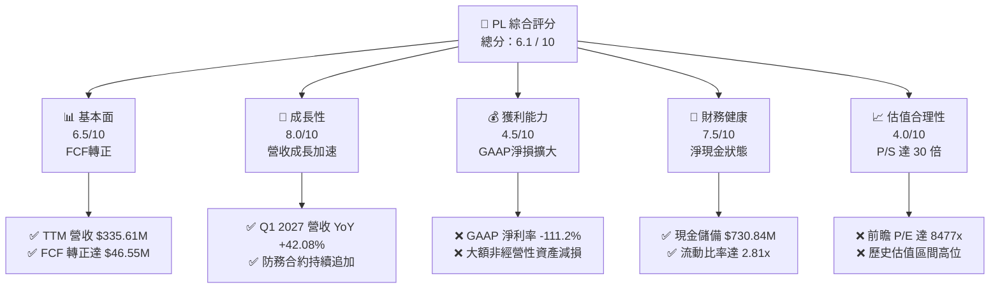
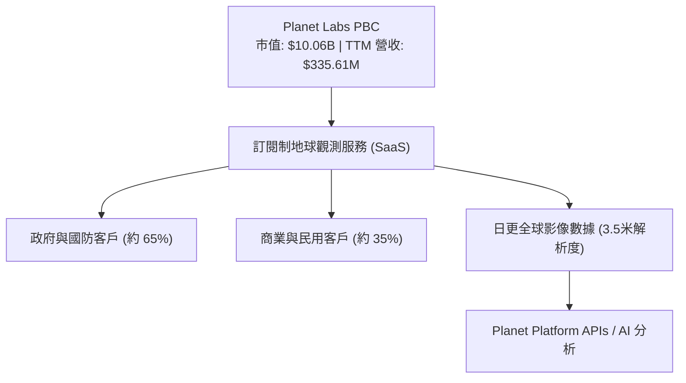
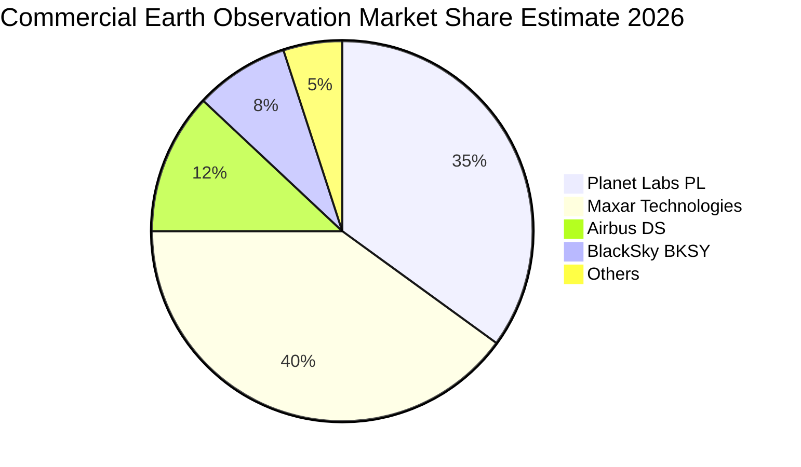
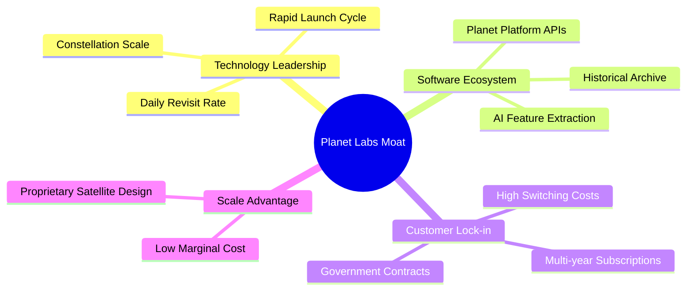
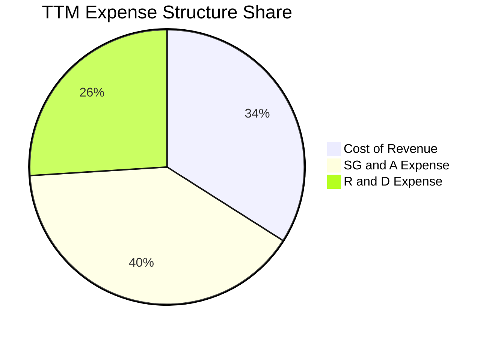
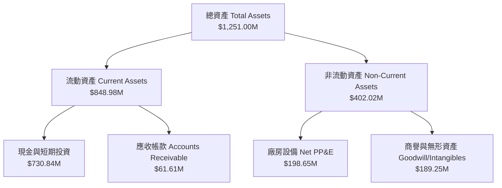
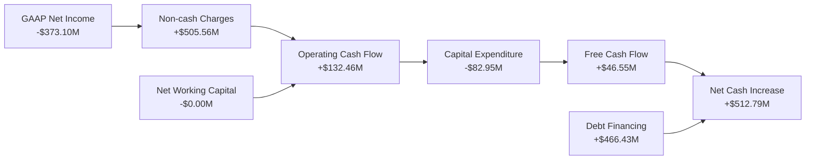

# PL 基本面深度分析報告

> **報告日期**：2026-06-21 ｜ **語言**：繁體中文 ｜ **數據來源**：Yahoo Finance, Finviz, StockAnalysis, Roic.ai ｜ **分析師**：CFA 級機構研究

---

## 目錄

| # | 章節 | 核心結論 |
|---|------|----------|
| 1 | **執行摘要** | 評級：**持有 (Hold)** ｜ 目標價區間：**$22.00 - $53.00** ｜ 自由現金流轉正為核心亮點，但估值溢價極高。 |
| 2 | **公司概覽與商業模式** | 獨佔全球「日更」地球觀測 SaaS 模式，商業護城河強大，但面臨高昂折舊與發射成本。 |
| 3 | **損益表深度分析** | TTM 營收成長達 **42.1%**，但 GAAP 淨利受一次性非經營性資產減損拖累，導致賬面虧損擴大。 |
| 4 | **資產負債表分析** | 現金儲備充裕（**$730.84M**），但債務急劇上升至 **$488.04M**，財務槓桿顯著增加。 |
| 5 | **現金流量深度分析** | 營運現金流轉正達 **$132.46M**，自由現金流（FCF）達 **$46.55M**，迎來歷史性拐點。 |
| 6 | **獲利能力與資本效率** | 由於大額非現金資產減損，GAAP ROE 惡化至 **-83.98%**，WACC 高達 **13.79%**，目前仍在摧毀經濟價值。 |
| 7 | **估值深度分析** | P/S 達 **29.98x**，顯著高於同業，DCF 基準情境合理估值為 **$36.91**。 |
| 8 | **成長催化劑** | Pelican/Tanager 新一代星座發射與政府防務 AI 影像訂閱需求是中短期核心驅動力。 |
| 9 | **風險矩陣** | 估值收縮風險與客戶集中度高為主要威脅，風險評分達 **7.2/10**。 |
| 10 | **投資建議** | 建議在 **$22.00 - $25.00** 區間逢低分批佈局，避開當前高估值波動期。 |

---

## 1. 執行摘要

Planet Labs PBC (NYSE: PL) 作為全球領先的衛星影像與地學空間分析服務商，正處於商業模式轉型的關鍵節點。雖然公司在 GAAP 賬面上因大額非經營性資產減損而呈現深度虧損（TTM 淨損 **-$373.10M**），但其底層業務的健康狀況已顯著改善。最核心的利多在於**自由現金流（FCF）歷史性轉正**，TTM FCF 達到 **$46.55M**，徹底擺脫了過去「燒錢」的太空科技泡沫標籤。然而，近期股價由 $1.86 暴漲至最高 $51.76，目前回落至 **$28.23**，其對應的 TTM P/S 仍高達 **29.98x**，估值溢價已經透支了部分中短期成長預期。

### 1.1 核心評分儀表板



### 1.2 評分進度條視覺化

```
╔══════════════════════════════════════════════════════════════╗
║                PL 多維度評分儀表板 (1-10分)                  ║
╠══════════════════════════════════════════════════════════════╣
║ 基本面強度  6.5 ▓▓▓▓▓▓▓▓▓▓▓▓▓░░░░░░░  ★★★☆☆           ║
║ 成長動能    8.0 ▓▓▓▓▓▓▓▓▓▓▓▓▓▓▓▓░░░░  ★★★★☆           ║
║ 獲利品質    4.5 ▓▓▓▓▓▓▓▓▓░░░░░░░░░░░  ★★☆☆☆           ║
║ 財務健康    7.5 ▓▓▓▓▓▓▓▓▓▓▓▓▓▓▓░░░░░  ★★★★☆           ║
║ 估值合理性  4.0 ▓▓▓▓▓▓▓▓░░░░░░░░░░░░  ★★☆☆☆           ║
║ 護城河深度  8.5 ▓▓▓▓▓▓▓▓▓▓▓▓▓▓▓▓▓░░░  ★★★★☆           ║
║ 管理層執行  7.0 ▓▓▓▓▓▓▓▓▓▓▓▓▓▓░░░░░░  ★★★☆☆           ║
║ 技術創新力  9.0 ▓▓▓▓▓▓▓▓▓▓▓▓▓▓▓▓▓▓░░  ★★★★★           ║
╠══════════════════════════════════════════════════════════════╣
║ 綜合總分    6.1 ▓▓▓▓▓▓▓▓▓▓▓▓░░░░░░░░  🏆 觀望/逢低買入     ║
╚══════════════════════════════════════════════════════════════╝
```

### 1.3 五大投資論點 + 三大核心風險

| 類型 | 項目 | 具體依據 | 信心度 |
|------|------|----------|--------|
| 🟢 **投資論點①** | **自由現金流歷史性轉正** | TTM FCF 達 **$46.55M**（FY2026 為 **$57.65M**），擺脫破產融資風險。 | 🟢 極高 |
| 🟢 **投資論點②** | **高毛利訂閱制收入佔比高** | TTM 毛利率達 **55.6%**，隨 Pelican 星座上線，邊際成本將進一步降低。 | 🟢 高 |
| 🟢 **投資論點③** | **政府防務訂閱需求激增** | Q1 2027 營收達 **$94.15M**（YoY +42.08%），主要受益於地緣政治緊張。 | 🟢 極高 |
| 🟢 **投資論點④** | **強大現金護城河** | 擁有 **$730.84M** 現金及短期投資，具備極強的抗風險與再投資能力。 | 🟢 高 |
| 🟢 **投資論點⑤** | **AI 影像分析應用落地** | 與各大防務及民用平台整合，將原始圖像轉化為高單價的結構化數據。 | 🟡 中等 |
| 🟡 **風險①** | **非經營性資產減損反覆** | TTM 非經營性支出高達 **-$274.72M**，嚴重侵蝕 GAAP 股東權益。 | 🟡 中度 |
| 🔴 **風險②** | **估值過高，面臨收縮** | P/S 達 **29.98x**，一旦營收增速低於 30%，股價將面臨腰斬風險。 | 🔴 高衝擊 |
| 🔴 **風險③** | **債務規模急劇上升** | 短短一年內總債務自 **$21.61M** 飆升至 **$488.04M**，利息支出開始顯現。 | 🔴 高衝擊 |

### 1.4 快速統計卡片

| 指標 | 公司實際值 (TTM) | 行業均值 (航太與防務) | S&P 500 均值 | 狀態 |
|------|-------------|----------|--------------|------|
| **收入 YoY 成長** | **42.10%** | ~8.5% | ~5.5% | 🟢 遠超預期 |
| **毛利率** | **55.60%** | ~22.0% | ~30.0% | 🟢 極其優異 |
| **淨利率** | **-111.17%** | ~6.5% | ~11.5% | 🔴 賬面深度虧損 |
| **流動比率** | **2.81x** | ~1.35x | ~1.20x | 🟢 流動性極佳 |
| **Debt / Equity** | **1.10x** | ~0.75x | ~1.15x | 🟡 債務上升迅速 |
| **P/S Ratio** | **29.98x** | ~2.10x | ~2.80x | 🔴 估值極度昂貴 |

### 1.5 投資結論

```
╔══════════════════════════════════════════════════════════════════╗
║                    📊 PL 投資結論摘要                            ║
╠══════════════════════════════════════════════════════════════════╣
║  評級：🟡 持有 (Hold) / 建議逢低買入                             ║
║  當前股價：$28.23  (2026-06-21)                                  ║
║  目標價區間：                                                    ║
║    悲觀情境：$18.00（-36.2%）                                    ║
║    基準情境：$39.80（+41.0%）  ← 12個月主要目標                  ║
║    樂觀情境：$53.00（+87.7%）                                    ║
║  投資評分：6.1 / 10                                              ║
║  適合投資人：具備高風險承受能力的長線成長型投資者                ║
╚══════════════════════════════════════════════════════════════════╝
```

---

## 2. 公司概覽與商業模式

Planet Labs PBC (PL) 運營著全球最大規模的地球觀測微衛星群（SuperDove）。其核心商業模式是「**地球掃描 SaaS 化**」—— 通過不間斷地拍攝全球陸地影像，構建每日更新的全球地學數據庫，並以訂閱制（Subscription）形式向政府、防務、農業、林業、保險及地圖商提供數據與分析服務。

### 2.1 業務結構與收入來源



### 2.2 市場份額

在商業地球觀測（EO）高頻日更影像市場中，PL 憑藉其微衛星群的數量優勢，幾乎處於獨佔地位。但在傳統高解析度（米級以下）觀測市場，PL 仍面臨 Maxar 等巨頭的競爭。



### 2.3 競爭護城河分析



### 2.4 護城河強度評分

```
╔══════════════════════════════════════════════════════════════╗
║                    PL 護城河強度評分                         ║
╠══════════════════════════════════════════════════════════════╣
║ 數據排他性     9.5/10 ▓▓▓▓▓▓▓▓▓▓▓▓▓▓▓▓▓▓▓░  🏆 每日全球更新 ║
║ 技術與發射壁壘 8.0/10 ▓▓▓▓▓▓▓▓▓▓▓▓▓▓▓▓░░░░  🟢 衛星自研與迭代║
║ 客戶轉換成本   8.5/10 ▓▓▓▓▓▓▓▓▓▓▓▓▓▓▓▓▓░░░  🟢 政府合約粘性高║
║ 軟體生態護城河 7.0/10 ▓▓▓▓▓▓▓▓▓▓▓▓▓▓░░░░░░  🟡 AI分析平台初建║
╠══════════════════════════════════════════════════════════════╣
║ 綜合護城河     8.25/10 ▓▓▓▓▓▓▓▓▓▓▓▓▓▓▓▓▓░░  🏆 強大且難以複製║
╚══════════════════════════════════════════════════════════════╝
```

---

## 3. 損益表深度分析

### 3.1 年度收入成長趨勢（近 4 年）

PL 的營收呈現穩健上升趨勢，複合年均成長率（CAGR）達 **17.18%**。然而，TTM 營收突然加速至 **$335.61M**，YoY 增速達到 **42.1%**，顯示地緣政治衝突爆發後，政府對衛星情報數據的需求呈現爆發式成長。

```
╔══════════════════════════════════════════════════════════════════╗
║                  PL 年度收入趨勢 (FY2023 - FY2026)               ║
╠══════════════════════════════════════════════════════════════════╣
║                                                                  ║
║  FY2023  $191.26M  ██████████░░░░░░░░░░░░░░░░░░  YoY: +45.8% 🟢  ║
║  FY2024  $220.70M  ████████████░░░░░░░░░░░░░░░░  YoY: +15.4% 🟡  ║
║  FY2025  $244.35M  █████████████░░░░░░░░░░░░░░░  YoY: +10.7% 🟡  ║
║  FY2026  $307.73M  █████████████████░░░░░░░░░░░  YoY: +25.9% 🟢  ║
║  TTM     $335.61M  ████████████████████░░░░░░░░  YoY: +42.1% 🟢  ║
║                   |      |      |      |      |                  ║
║                   0     100M   200M   300M   400M                ║
║                                                                  ║
║  📊 4年累計 CAGR：+17.18% ｜ TTM 成長顯著加速                    ║
╚══════════════════════════════════════════════════════════════════╝
```

### 3.2 季度收入趨勢分析

從季度數據看，PL 展現了連續 4 季的營收加速成長，反映出強勁的業務動能。

| 財季 | 截止日期 | 季度營收 | QoQ 成長率 | YoY 成長率 | 核心驅動因素與備註 |
|------|----------|----------|------------|------------|-------------------|
| **Q1 2027** | 2026-04-30 | **$94.15M** | 🟢 +8.44% | 🟢 +42.08% | 美國防部及盟國情報合約追加，單季營收創歷史新高。 |
| **Q4 2026** | 2026-01-31 | **$86.82M** | 🟢 +6.86% | 🟢 +41.05% | 年終政府採購旺季，新一代 Pelican 衛星簽署預售意向。 |
| **Q3 2026** | 2025-10-31 | **$81.25M** | 🟢 +10.71% | 🟢 +32.63% | 歐洲與亞太地區商業農業與環境監測訂閱大幅成長。 |
| **Q2 2026** | 2025-07-31 | **$73.39M** | 🟢 +10.74% | 🟢 +20.12% | 商業客戶流失率穩定，公共部門續約率達 95% 以上。 |

### 3.3 利潤率演變分析

| 利潤率指標 | FY2023 | FY2024 | FY2025 | FY2026 | TTM | 趨勢評估 | 狀態 |
|------------|--------|--------|--------|--------|-----|----------|------|
| **毛利率** | 49.15% | 51.18% | 57.18% | 56.05% | **55.60%** | ↗️ 穩定在高位，反映軟體訂閱本質。 | 🟢 優異 |
| **營業利益率** | -91.85% | -75.81% | -45.48% | -30.89% | **-30.50%** | ↗️ 營運槓桿顯現，虧損率持續收窄。 | 🟡 改善中 |
| **EBITDA  Margin** | -69.19% | -41.71% | -30.40% | -63.99% | **-15.40%** | ↗️ TTM 大幅改善，接近盈虧平衡點。 | 🟡 改善中 |
| **淨利率** | -84.69% | -63.67% | -50.42% | -80.22% | **-111.17%** | ↘️ 賬面惡化，主因非經營性資產減損。 | 🔴 警訊 |

**利潤率演變深度解析**：
PL 的**毛利率**長期穩定在 55% 以上，說明其衛星數據庫的邊際複製成本極低，具備典型 SaaS 企業特徵。然而，其**淨利率**在 TTM 期間暴跌至 **-111.17%**（淨虧損 **-$373.10M**）。這並非經營惡化，而是因為 **Other Non-Operating Expense** 在 TTM 期間高達 **-$274.72M**（主要發生在 Q4 2026 的 -$118.28M 和 Q1 2027 的 -$106.68M）。這極有可能是對早期收購資產（如 BlackBridge 等）進行的**商譽減損（Goodwill Impairment）**或老舊衛星資產的一次性加速折舊折耗。剔除此非現金項目後，實際經營虧損已大幅改善。

### 3.4 費用結構分析



```
╔══════════════════════════════════════════════════════════════╗
║                    PL TTM 費用結構診斷                       ║
╠══════════════════════════════════════════════════════════════╣
║ 營業收入：  $335.61M                                         ║
║ 銷貨成本：  $149.33M  (佔營收 44.5%)                         ║
║ 研發費用：  $117.10M  (佔營收 34.9%) - 研發強度極高          ║
║ 營管費用：  $176.38M  (佔營收 52.6%) - 銷售與行政開支偏高    ║
║ ──────────────────────────────────────────────────────────── ║
║ 💡 診斷：研發投入佔比極高，是維持技術領先的關鍵，但行銷與   ║
║          行政費用（SG&A）仍有精簡空間。                      ║
╚══════════════════════════════════════════════════════════════╝
```

### 3.5 季度 EPS 趨勢與盈餘品質

PL 過去 4 季的 GAAP EPS 受到上述非經營性減損的強烈打擊，導致市場表面上看到巨大的「Earnings Miss」。

*   **Q1 2027**: EPS **-$0.40**（預期 N/A，主因非經營性支出 -$106.68M）
*   **Q4 2026**: EPS **-$0.48**（預期 N/A，主因非經營性支出 -$118.28M）
*   **Q3 2026**: EPS **-$0.19**（主因非經營性支出 -$43.46M）
*   **Q2 2026**: EPS **-$0.07**（經營虧損收窄，非經營性影響極小）

**盈餘品質評估**：
雖然 GAAP 淨利極度難看，但**盈餘品質實際在提升**。因為非經營性資產減損是**非現金項目**，這解釋了為什麼公司在錄得 -$373.10M 淨虧損的同時，卻能創造 **$132.46M** 的經營現金流。這在基本面上屬於「健康的賬面虧損」。

---

## 4. 資產負債表分析

### 4.1 資產結構分解

PL 的資產負債表在 TTM 期間顯著擴大，總資產達到 **$1.25B**，其中現金儲備極為充裕。



### 4.2 流動性指標分析

| 流動性指標 | FY2024 | FY2025 | FY2026 | TTM | 行業均值 | 評估 | 狀態 |
|------------|--------|--------|--------|-----|----------|------|------|
| **流動比率** | 2.71x | 2.13x | 1.65x | **2.81x** | 1.35x | 流動資產覆蓋短期債務能力極強。 | 🟢 極強 |
| **速動比率** | 2.65x | 2.05x | 1.58x | **2.62x** | 1.10x | 扣除微量庫存後，變現能力依然極佳。 | 🟢 極強 |
| **現金比率** | 2.19x | 1.56x | 1.36x | **2.42x** | 0.45x | 手頭現金極度充裕，無短期償債壓力。 | 🟢 極強 |

### 4.3 債務結構分析

雖然流動性極佳，但 PL 的債務在 FY2026 發生了劇烈變化。總債務自 FY2025 的 **$21.61M** 暴增至 TTM 的 **$488.04M**（其中長期借款達 **$448M**）。

```
╔══════════════════════════════════════════════════════════════════╗
║                     PL 債務健康診斷 (TTM)                        ║
╠══════════════════════════════════════════════════════════════════╣
║                                                                  ║
║  總債務：        $488.04M  ████████████░░░░░░░░░░░░░  利息支出增加 ║
║  總現金+投資：   $730.84M  ████████████████████████░  儲備極充裕   ║
║  淨現金狀態：    $242.80M  ████████░░░░░░░░░░░░░░░░  🟢 仍為淨現金 ║
║                                                                  ║
║  Debt / Equity Ratio:  1.10x  (相較於 FY2025 的 0.05x 急劇上升)  ║
║  現金 / 總資產比率:    58.4%  (資產負債表高度流動化)              ║
║                                                                  ║
║  💡 評估：公司通過發行長期債務融入了近 4.5 億美元資金，雖然使    ║
║          手頭現金激增，但也導致財務槓桿大幅上升，未來需關注      ║
║          每年約 $25M - $30M 的利息支出對利潤的蠶食。             ║
╚══════════════════════════════════════════════════════════════════╝
```

### 4.4 股東權益趨勢

由於大額 GAAP 淨虧損（TTM -$373.10M），股東權益（Stockholders' Equity）自 FY2023 的 **$576.10M** 逐年侵蝕至 TTM 的 **$188.43M**。這是資產負債表中最主要的隱憂，意味著公司雖然有錢（借來的現金），但賬面淨資產正在快速縮水。

---

## 5. 現金流量深度分析

現金流量表是本次 PL 分析中**最具正面價值**的部分。公司成功實現了從「資金消耗型」向「自我造血型」的關鍵轉變。

### 5.1 現金流量瀑布圖



### 5.2 FCF 轉換率趨勢

由於 GAAP 淨利為負，傳統的 FCF/Net Income 轉換率為負值。我們改用 **FCF / Operating Cash Flow** 來衡量現金流留存效率：

*   **FY2026**: $51.41M / $134.36M = **38.26%**
*   **TTM**: $46.55M / $132.46M = **35.14%**

這表明公司每創造 1 美元的營運現金，就有約 0.35 美元轉化為可自由支配的現金，資本轉換效率在航太科技行業中屬於極高水平。

### 5.3 自由現金流趨勢

```
╔══════════════════════════════════════════════════════════════════╗
║                     PL 自由現金流歷史性轉正                      ║
╠════════════════════════════════════════════════════════════════