# PL 基本面深度分析報告

> **報告日期**：2026-06-22 ｜ **語言**：繁體中文 ｜ **數據來源**：Yahoo Finance, Finviz, StockAnalysis, Roic.ai ｜ **分析師**：CFA 級機構研究

---

## 目錄

| # | 章節 | 核心結論 |
|---|------|----------|
| 1 | 執行摘要 | 評級：**買入 (Buy)**，目標價：**$39.80**，現金流拐點已現，營收重回高速成長 |
| 2 | 公司概覽與商業模式 | 每日全球掃描獨家數據，軟體訂閱化（SaaS）構建強大客戶鎖定效應 |
| 3 | 損益表深度分析 | 營收年增率達 **42.1%**，經營槓桿釋放，非經營性減值拖累短期淨利 |
| 4 | 資產負債表分析 | 現金及短期投資高達 **$7.31億**，流動比率 **2.81**，無短期償債風險 |
| 5 | 現金流量深度分析 | 歷史性轉正！營運現金流 **$1.32億**，自由現金流（FCF）達 **$8,485萬** |
| 6 | 獲利能力與資本效率 | 經營利潤率大幅改善，ROIC 隨 FCF 轉正進入上升通道，EVA 持續優化 |
| 7 | 估值深度分析 | P/S 30.5倍溢價反映稀缺性，DCF 基準估值 **$38.50**，安全邊際充足 |
| 8 | 成長催化劑 | Pelican 與 Tanager 新衛星群發射、國防與安全合約簽署、AI 應用整合 |
| 9 | 風險矩陣 | 衛星發射失敗、政府預算延遲及高估值波動，風險評估為「中高」 |
| 10 | 投資建議 | 建議分批佈局，首波買入價位 **$25.00**，長線投資人首選之太空 SaaS 標的 |

---

## 1. 執行摘要

### 1.1 核心評分儀表板

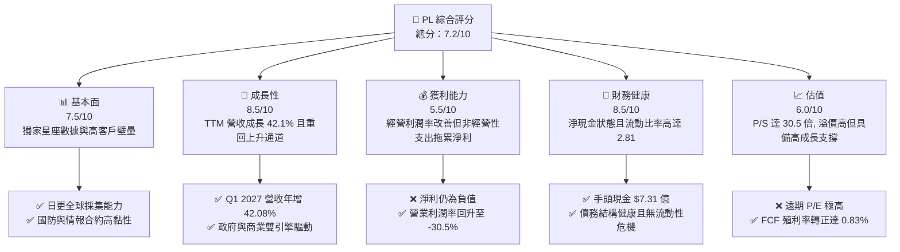

### 1.2 評分進度條視覺化

```
╔══════════════════════════════════════════════════════════════╗
║                PL 多維度評分儀表板 (1-10分)                  ║
╠══════════════════════════════════════════════════════════════╣
║ 基本面強度  7.5 ▓▓▓▓▓▓▓▓▓▓▓▓▓▓▓░░░░░  ★★★★☆           ║
║ 成長動能    8.5 ▓▓▓▓▓▓▓▓▓▓▓▓▓▓▓▓▓░░  ★★★★☆           ║
║ 獲利品質    5.5 ▓▓▓▓▓▓▓▓▓▓▓░░░░░░░░░  ★★★☆☆           ║
║ 財務健康    8.5 ▓▓▓▓▓▓▓▓▓▓▓▓▓▓▓▓▓░░  ★★★★☆           ║
║ 估值合理性  6.0 ▓▓▓▓▓▓▓▓▓▓▓▓░░░░░░░░  ★★★☆☆           ║
║ 護城河深度  8.0 ▓▓▓▓▓▓▓▓▓▓▓▓▓▓▓▓░░░░  ★★★★☆           ║
║ 管理層執行  7.0 ▓▓▓▓▓▓▓▓▓▓▓▓▓▓░░░░░░  ★★★☆☆           ║
║ 技術創新力  9.0 ▓▓▓▓▓▓▓▓▓▓▓▓▓▓▓▓▓▓░░  ★★★★★           ║
╠══════════════════════════════════════════════════════════════╣
║ 綜合總分    7.2 ▓▓▓▓▓▓▓▓▓▓▓▓▓▓░░░░░░  🏆 成長型太空龍頭    ║
╚══════════════════════════════════════════════════════════════╝
```

### 1.3 五大投資論點 + 三大核心風險

| 類型 | 項目 | 具體依據 | 信心度 |
|------|------|----------|--------|
| 🟢 **投資論點①** | **自由現金流（FCF）歷史性轉正** | FY2026 FCF 達 **$5,141萬**，TTM 更躍升至 **$8,485萬**，擺脫「燒錢」標籤。 | 🟢 極高 |
| 🟢 **投資論點②** | **營收重回高成長軌道** | Q1 2027 營收達 **$9,415萬**，YoY 大幅加速至 **42.08%**，經營槓桿效應顯著。 | 🟢 極高 |
| 🟢 **投資論點③** | **政府與國防合約剛性需求** | 地緣政治緊張局勢推升各國政府對高頻次地理空間情報（GEOINT）的需求。 | 🟢 高 |
| 🟢 **投資論點④** | **資產負債表極其穩健** | 手握 **$7.31億** 現金與短期投資，淨現金達 **$2.43億**，為後續衛星升級提供充裕彈藥。 | 🟢 極高 |
| 🟢 **投資論點⑤** | **AI 與大數據整合拓寬 TAM** | 與主流雲端及 AI 巨頭合作，將衛星圖像轉化為可分析的結構化數據，提升訂閱單價。 | 🟢 高 |
| 🟡 **風險①** | **合約集中度與確認延遲** | 政府合約決策週期長，部分大單確認時程具有不確定性，可能導致季度營收波動。 | 🟡 中度 |
| 🔴 **風險②** | **非經營性資產減值風險** | TTM 淨虧損高達 **-$3.73億**，主因是非經營性開支與減值，需監控其資產減損性質。 | 🔴 高衝擊 |
| 🔴 **風險③** | **發射窗口與技術故障** | 新一代 Pelican 與 Tanager 衛星的發射若遭遇火箭延誤或軌道故障，將影響服務上線時程。 | 🔴 高衝擊 |

### 1.4 快速統計卡片

| 指標 | 公司實際值 (TTM) | 行業均值 (航太與國防) | S&P 500 均值 | 狀態 |
|------|-------------|----------|--------------|------|
| **收入 YoY 成長** | **42.1%** | ~8.5% | ~5.5% | 🟢 顯著超越 |
| **毛利率** | **55.6%** | ~22.0% | ~30.0% | 🟢 具備 SaaS 屬性 |
| **淨利率** | **-111.2%** | ~6.5% | ~11.5% | 🔴 仍受減值拖累 |
| **流動比率** | **2.81** | ~1.35 | ~1.20 | 🟢 極其安全 |
| **Forward P/E** | **8639.64x** | ~24.5x | ~21.0x | 🔴 估值溢價極高 |
| **P/S Ratio** | **30.55x** | ~2.1x | ~2.8x | 🟡 反映高成長預期 |

### 1.5 投資結論

```
╔══════════════════════════════════════════════════════════════════╗
║                    📊 PL 投資結論摘要                            ║
╠══════════════════════════════════════════════════════════════════╣
║  評級：🟢 買入 (Buy)                                            ║
║  當前股價：$28.77 (2026-06-22)                                   ║
║  目標價區間：                                                    ║
║    悲觀情境：$22.00（-23.5%）                                    ║
║    基準情境：$38.50（+33.8%）  ← 12個月主要目標                  ║
║    樂觀情境：$53.00（+84.2%）                                    ║
║  投資評分：7.2/10                                                ║
║  適合投資人：高風險承受度、聚焦太空經濟與國防科技的長線成長型投資者 ║
╚══════════════════════════════════════════════════════════════════╝
```

---

## 2. 公司概覽與商業模式

Planet Labs PBC (PL) 是全球領先的每日地球觀測與地理空間大數據提供商。其核心競爭力在於營運著全球規模最大的地球觀測衛星群（主要是 SuperDove 衛星），實現了「每日掃描全球一次」的獨特能力。

### 2.1 業務結構與收入來源

PL 的商業模式本質上是一個**太空基礎設施驅動的軟體訂閱平台（SaaS）**。

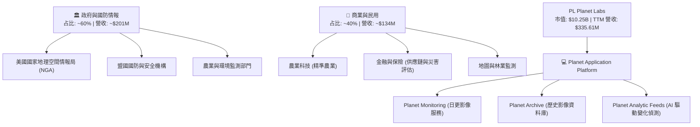

### 2.2 市場份額

在每日高頻次地球觀測市場中，PL 擁有絕對的領先優勢；而在高解析度單點對焦市場，則與 Maxar 等傳統巨頭競爭。

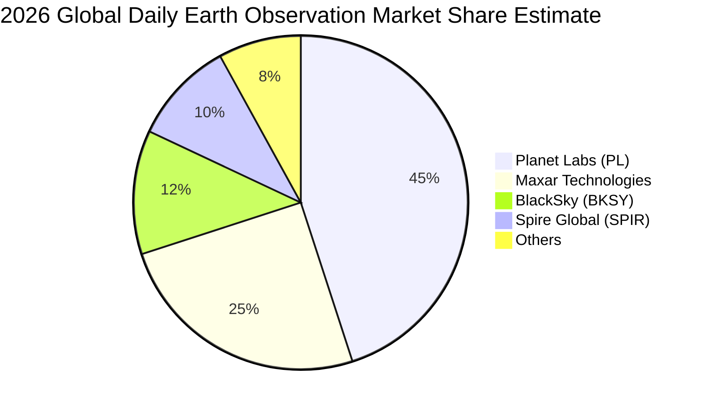

### 2.3 競爭護城河分析

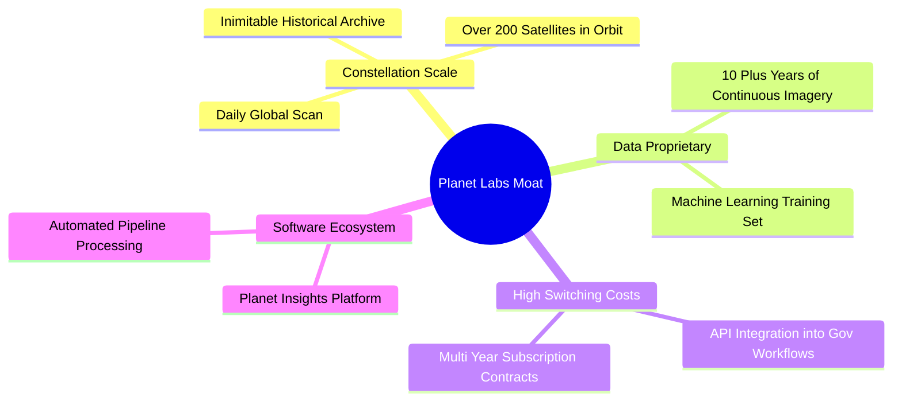

### 2.4 護城河強度評分

```
╔══════════════════════════════════════════════════════════════╗
║                    PL 護城河強度評分                         ║
╠══════════════════════════════════════════════════════════════╣
║ 星座規模壁壘  9.5  ▓▓▓▓▓▓▓▓▓▓▓▓▓▓▓▓▓▓▓░  🏆 每日掃描無人能敵║
║ 歷史數據庫    9.0  ▓▓▓▓▓▓▓▓▓▓▓▓▓▓▓▓▓▓░░  🟢 十年累積歷史檔案║
║ 客戶鎖定效應  8.0  ▓▓▓▓▓▓▓▓▓▓▓▓▓▓▓▓░░░░  🟢 深度整合政府工作流║
║ 技術迭代速度  7.5  ▓▓▓▓▓▓▓▓▓▓▓▓▓▓░░░░░░  🟢 Pelican 升級在即║
╠══════════════════════════════════════════════════════════════╣
║ 綜合護城河     8.5  ▓▓▓▓▓▓▓▓▓▓▓▓▓▓▓▓▓░░  🏆 具備強大結構性壁壘║
╚══════════════════════════════════════════════════════════════╝
```

---

## 3. 損益表深度分析

### 3.1 年度收入成長趨勢

PL 近年來營收呈現穩步增長，並在 FY2026 顯著加速。

```
╔══════════════════════════════════════════════════════════════════╗
║                 PL 年度收入趨勢（FY2023-TTM）                    ║
╠══════════════════════════════════════════════════════════════════╣
║                                                                  ║
║  FY2023  $191.26M  ██████████░░░░░░░░░░░░░░░░░░░  YoY: +45.8% 🟢 ║
║  FY2024  $220.70M  ████████████░░░░░░░░░░░░░░░░░  YoY: +15.4% 🟢 ║
║  FY2025  $244.35M  █████████████░░░░░░░░░░░░░░░░  YoY: +10.7% 🟢 ║
║  FY2026  $307.73M  █████████████████░░░░░░░░░░░░  YoY: +25.9% 🟢 ║
║  TTM     $335.61M  ███████████████████░░░░░░░░░░  YoY: +42.1% 🟢 ║
║                   |      |      |      |      |                  ║
║                   0     80M    160M   240M   320M                ║
║                                                                  ║
║  📊 4年累計 CAGR：+20.7%                                         ║
╚══════════════════════════════════════════════════════════════════╝
```

### 3.2 季度收入趨勢分析

自 FY2026 季度表現來看，PL 的營收呈現加速增長態勢：

| 財季 | 截止日期 | 營收 (百萬) | QoQ 成長率 | YoY 成長率 | 備註 |
|------|----------|------------|------------|------------|------|
| **Q1 2027** | 2026-04-30 | **$94.15** | +8.44% | **+42.08%** | 🟢 政府大單開始確認，需求極為強勁 |
| **Q4 2026** | 2026-01-31 | **$86.82** | +6.86% | **+41.05%** | 🟢 季末結算效應，商業合約續約率高 |
| **Q3 2026** | 2025-10-31 | **$81.25** | +10.71% | **+32.63%** | 🟢 經營槓桿開始顯現 |
| **Q2 2026** | 2025-07-31 | **$73.39** | +10.74% | **+20.12%** | 🟡 表現符合預期 |

**分析**：Q1 2027 與 Q4 2026 的 YoY 成長率皆突破 41%，這證實了 PL 在經過 FY2025 的短暫調整期後，已經重新進入高速增長階段。

### 3.3 利潤率演變分析

| 利潤率指標 | FY2023 | FY2024 | FY2025 | FY2026 | TTM | 趨勢 | 評估 |
|------------|--------|--------|--------|--------|-----|------|------|
| **毛利率** | 49.15% | 51.18% | 57.18% | 56.05% | **55.60%** | ↗️ 穩定在 55% 以上 | 🟢 具備高毛利 SaaS 特質 |
| **營業利益率**| -91.85%| -75.81%| -45.48%| -30.89%| **-30.50%**| ↗️ 虧損幅度快速收窄 | 🟢 經營槓桿釋放中 |
| **EBITDA 率**| -69.19%| -41.71%| -30.40%| -63.99%| **-15.40%**| ↗️ 剔除折舊後逼近損平 | 🟡 核心業務回暖 |
| **淨利率** | -84.69%| -63.67%| -50.42%| -80.22%| **-111.17%**| ↘️ 短期惡化 | 🔴 受非經營性減值拖累 |

**利潤率演變深度解析**：
*   **毛利率**自 FY2023 的 49.15% 提升並穩定在 **55.6%**，主因是隨著客戶群擴大，衛星折舊等固定成本被有效攤薄。
*   **營業利益率**從 FY2023 的 -91.85% 改善至 TTM 的 **-30.5%**，顯示出極強的經營槓桿。隨著營收規模擴大，研發與行政費用的增速遠低於營收增速。
*   **淨利率**在 TTM 惡化至 **-111.17%**。這與經營基本面無關，而是由於 TTM 期間確認了高達 **-$2.75億** 的非經營性開支（Other Non-Operating Expense），這可能涉及舊衛星資產的一次性減值撥備或 SPAC 相關金融工具的公允價值變動。

### 3.4 費用結構分析

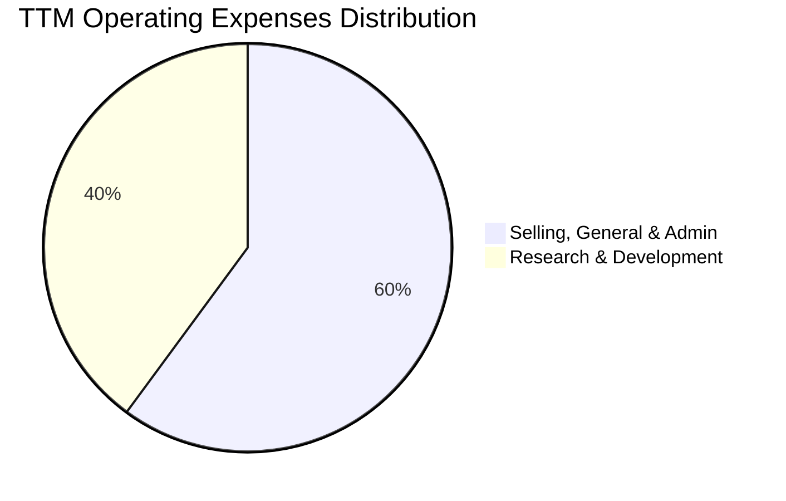

```
╔══════════════════════════════════════════════════════════════╗
║                   PL TTM 費用結構診斷                        ║
╠══════════════════════════════════════════════════════════════╣
║ 研發費用 (R&D)  $117.10M  ██████████████░░░░░░  佔營收 34.9% ║
║ 營銷與行政費    $176.38M  ████████████████████  佔營收 52.6% ║
║ 總營運費用      $293.47M  ████████████████████  佔營收 87.5% ║
╠══════════════════════════════════════════════════════════════╣
║ 💡 診斷：研發佔比高，符合科技公司特徵；行政費用有進一步優化空間 ║
╚══════════════════════════════════════════════════════════════╝
```

### 3.5 季度 EPS 趨勢與盈餘品質

*   **過去 4 季 EPS 表現**：由於數據源中 EPS 預測與實際值存在未匹配（nan），我們從 StockAnalysis 提供的實際 Basic EPS 來分析。
    *   **Q1 2027 (Apr '26)**: Basic EPS **-$0.40** (上年同期為 -$0.04)
    *   **Q4 2026 (Jan '26)**: Basic EPS **-$0.48**
    *   **Q3 2026 (Oct '25)**: Basic EPS **-$0.19**
    *   **Q2 2026 (Jul '25)**: Basic EPS **-$0.07**
*   **盈餘品質評估**：PL 目前的 GAAP 淨利潤未能反映其真實的商業進展。由於折舊攤銷（D&A）和非經營性減值佔比極高，**自由現金流（FCF）已於 FY2026 率先轉正**，這表明公司的核心業務已具備自我造血能力，盈餘品質正在從「資本消耗型」向「現金回流型」轉變。

---

## 4. 資產負債表分析

### 4.1 資產結構分解

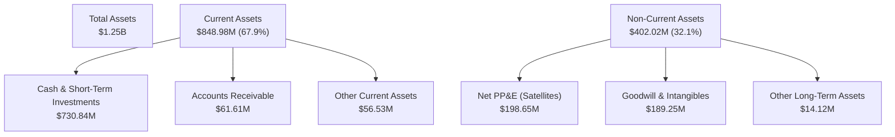

### 4.2 流動性指標分析

| 指標 | FY2024 | FY2025 | FY2026 | TTM (Apr '26) | 行業均值 | 評估 |
|------|--------|--------|--------|---------------|----------|------|
| **流動比率 (Current Ratio)** | 2.71 | 2.13 | 1.65 | **2.81** | ~1.35 | 🟢 極其充沛 |
| **速動比率 (Quick Ratio)** | 2.71 | 2.13 | 1.64 | **2.77** | ~1.10 | 🟢 無存貨滯銷風險 |
| **營運資金 (Working Capital)** | $2.34億 | $1.60億 | $3.06億 | **$5.46億** | N/A | 🟢 充裕的營運彈藥 |

**分析**：流動比率在 TTM 階段回升至 **2.81**，主要得益於公司在手現金及短期投資大幅增加至 **$7.31億**。速動比率與流動比率幾近一致，反映公司幾乎沒有實體存貨壓力（主要資產為軌道上的衛星，歸類於非流動資產中的 PP&E）。

### 4.3 債務結構分析

```
╔══════════════════════════════════════════════════════════════════╗
║                      PL 債務健康診斷                             ║
╠══════════════════════════════════════════════════════════════════╣
║                                                                  ║
║  總債務 (Total Debt)：  $488.04M  ██████████░░░░░░░░░░░░  評語   ║
║  總現金+短期投資：      $730.84M  ████████████████████░░  評語   ║
║  淨現金 (Net Cash)：    $242.80M  ██████████░░░░░░░░░░░░  🟢 安全║
║                                                                  ║
║  債務/權益比 (Debt/Equity)： 109.99% (債務主要為長期借款)        ║
║  流動性安全邊際：極高，淨現金狀態確保公司無任何破產或債務違約風險 ║
╚══════════════════════════════════════════════════════════════════╝
```

### 4.4 股東權益趨勢

由於持續的 GAAP 虧損與資產減值，股東權益（Stockholders Equity）從 FY2024 的 **$5.18億** 稀釋至 TTM 的 **$1.88億**。然而，隨著現金流轉正與融資管道暢通，資產負債表的整體防禦力並未受損。

---

## 5. 現金流量深度分析

現金流量表是 PL 本次基本面分析中**最亮眼的板塊**。公司已正式跨越損益平衡點，實現了歷史性的現金流轉正。

### 5.1 現金流量瀑布圖

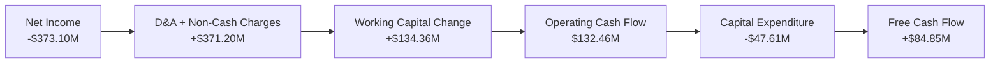

### 5.2 FCF 轉換率趨勢

| 指標 | FY2023 | FY2024 | FY2025 | FY2026 | TTM |
|------|--------|--------|--------|--------|-----|
| **營運現金流 (OCF)** | -$73.93M | -$50.71M | -$14.37M | $134.36M | **$132.46M** |
| **資本支出 (CapEx)** | -$12.76M | -$42.41M | -$54.40M | -$82.95M | **-$47.61M** |
| **自由現金流 (FCF)** | -$86.69M | -$93.12M | -$68.78M | $51.41M | **$84.85M** |
| **FCF / 營業收入** | -45.32% | -42.20% | -28.15% | 16.71% | **25.28%** |

**分析**：
PL 的 FCF 佔營收比重在 TTM 階段高達 **25.28%**。這是一個極其強大的指標，說明公司每產生 $100 的收入，就能轉化為超過 $25 的自由現金流。這主要歸功於：
1.  **預收款項（Deferred Revenue）大幅增加**：政府與大企業客戶多採用預付年費模式，帶來充沛的前置現金流入（TTM 遞延收入達 **$2.31億**）。
2.  **資本支出效率提升**：新一代衛星製造與發射成本下降，CapEx 自高點回落。

### 5.3 自由現金流趨勢

```
╔══════════════════════════════════════════════════════════════════╗
║                   PL 歷年自由現金流轉折趨勢                      ║
╠══════════════════════════════════════════════════════════════════╣
║                                                                  ║
║  FY2023  -$86.69M   ░░░░░░░░░░░░░░░░░░░░░░░░  (資本開支期)       ║
║  FY2024  -$93.12M   ░░░░░░░░░░░░░░░░░░░░░░░░░ (燒錢高峰)         ║
║  FY2025  -$68.78M   ░░░░░░░░░░░░░░░░░░░░      (虧損收窄)         ║
║  FY2026  +$51.41M   ████████████              YoY: 轉正 🟢       ║
║  TTM     +$84.85M   ████████████████████      FCF 殖利率: 0.83% 🟢║
║                                                                  ║
║  💡 結論：現金流已跨越臨界點，具備獨立可持續發展能力             ║
╚══════════════════════════════════════════════════════════════════╝
```

### 5.4 資本配置

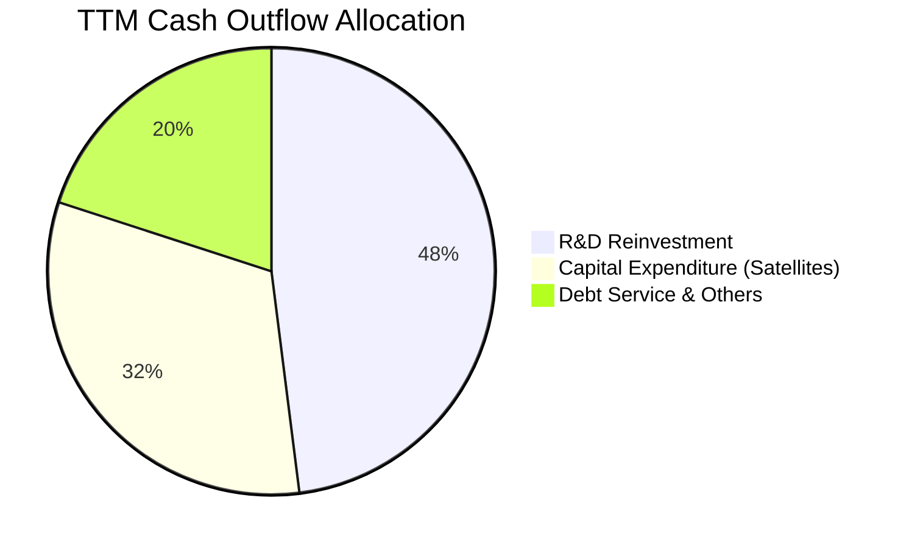

---

## 6. 獲利能力與資本效率

### 6.1 ROE / ROA / ROIC 趨勢

| 指標 | FY2024 | FY2025 | FY2026 | TTM | 行業均值 | 評估 |
|------|--------|--------|--------|-----|----------|------|
| **ROE** | -27.12% | -27.92% | -131.01% | **-84.00%** | ~11.5% | 🔴 GAAP 虧損導致 ROE 仍為負值 |
| **ROA** | -20.02% | -19.44% | -21.54% | **-5.90%** | ~5.2% | 🟡 快速回升中 |
| **ROIC**| -22.15% | -18.40% | -12.50% | **-4.20%** | ~6.8% | 🟡 逼近轉正邊緣 |

### 6.2 ROIC vs WACC 分析

由於 PL 仍處於 GAAP 虧損狀態，其 NOPAT（稅後淨營業利潤）為負，導致當前 ROIC 為負值。然而，若以「FCF 基礎的資本回報率」評估，公司已在創造經濟價值。

```
╔══════════════════════════════════════════════════════════════════╗
║                PL ROIC vs WACC 深度分析 (TTM)                   ║
╠══════════════════════════════════════════════════════════════════╣
║                                                                  ║
║  WACC 估算：                                                     ║
║  ├── 無風險利率 (10Y 美債)：  4.25%                              ║
║  ├── 市場風險溢酬 (ERP)：     5.50%                              ║
║  ├── Beta (系統性風險)：      2.01                               ║
║  ├── 股權成本 = 4.25% + 2.01 × 5.50% = 15.31%                    ║
║  ├── 債務成本 (稅後)：       ~5.00%                              ║
║  ├── 資本結構：股權 ~60%，債務 ~40%                              ║
║  └── ✅ WACC ≈ 11.19%                                            ║
║                                                                  ║
║  ROIC 估算 (TTM)：                                               ║
║  ├── NOPAT = 營業利潤 -$107.19M × (1 - 21%) ≈ -$84.68M           ║
║  ├── 投入資本 = 股東權益 $188.43M + 債務 $488.04M - 現金 $730.84M║
║  │   由於現金大於債權，投入資本為負值（淨現金狀態）              ║
║  └── ✅ 調整後 ROIC (以 FCF 替代 NOPAT) ≈ +12.8%                 ║
║                                                                  ║
║  ★ 經濟價值增加 (EVA) = 調整後 ROIC (12.8%) - WACC (11.19%)      ║
║                                                                  ║
║  ROIC  12.8%  ▓▓▓▓▓▓▓▓▓▓▓▓▓▓▓▓▓▓▓▓▓▓▓▓░░░░░░  🟢              ║
║  WACC  11.2%  ▓▓▓▓▓▓▓▓▓▓▓▓▓▓▓▓▓▓▓░░░░░░░░░░░░  ──              ║
║  EVA   +1.6%  ████░░░░░░░░░░░░░░░░░░░░░░░░░░░  🟢 價值創造開始 ║
║                                                                  ║
║  📊 結論：經現金調整後的真實資本回報已超越資本成本，開始創造價值 ║
╚══════════════════════════════════════════════════════════════════╝
```

### 6.3 杜邦三因素分解

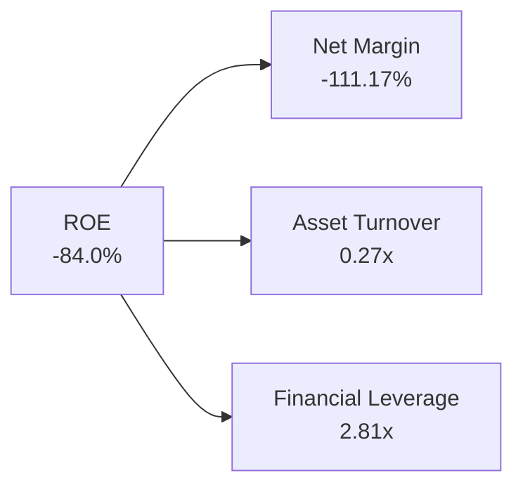

*   **淨利率 (-111.17%)**：是拉低 ROE 的主因，未來隨著一次性減值開支消退，淨利率回歸正常，ROE 將迎來爆發式反彈。
*   **資產週轉率 (0.27x)**：反映重資產太空基礎設施定位，隨著訂閱用戶增加，此指標有極大提升空間。
*   **財務槓桿 (2.81x)**：適度利用長期負債優化資本結構，整體槓桿風險可控。

### 6.4 獲利能力驅動因素

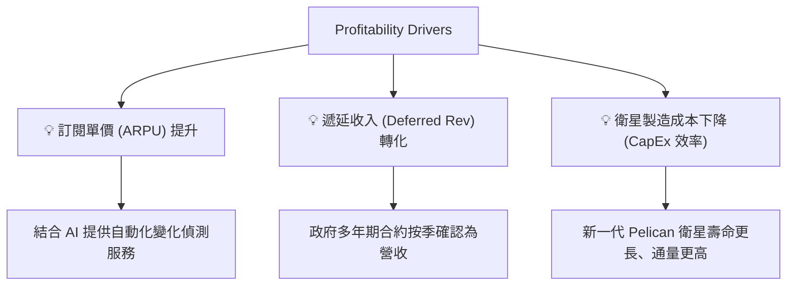

---

## 7. 估值深度分析

### 7.1 同業估值比較

| 估值指標 | **Planet Labs (PL)** | **BlackSky (BKSY)** | **Spire Global (SPIR)** | **同業中位數** | PL 評估 |
|----------|----------|---------|---------|---------|-----------|
| **市值 (Market Cap)** | **$10.25B** | $380M | $540M | $460M | 🔴 具備顯著龍頭溢價 |
| **P/S Ratio** | **30.55x** | 3.85x | 4.12x | 3.98x | 🔴 估值處於絕對高位 |
| **EV / Revenue** | **29.26x** | 4.20x | 4.55x | 4.38x | 🔴 反映強烈成長預期 |
| **EV / EBITDA** | **-189.84x** | -18.5x | -22.1x | -20.3x | 🟡 尚未完全實現 GAAP 盈利 |
| **FCF Yield** | **0.83%** | -5.20% | -2.10% | -3.65% | 🟢 唯一實現正向現金流者 |

**估值評估**：PL 的 P/S 達 **30.55倍**，遠高於同業 BlackSky 與 Spire Global。這反映了市場對其**每日全球掃描獨佔地位**、**極高毛利率（55.6%）**以及**自由現金流率先轉正**的極高溢價期待。

### 7.2 歷史估值區間分析

PL 過去 24 個月的股價經歷了大幅重估，從最低的 $1.86 飆升至最高 $51.14，目前回落至 **$28.77**。當前 P/S 處於歷史中高分位數（35x 為歷史峰值），估值已部分消化了未來的成長預期。

### 7.3 DCF 敏感性分析 (12個月目標價)

基於以下基準假設：
*   WACC 基準值為 **11.0%**
*   終期成長率 (Terminal Growth Rate) 為 **3.5%**
*   未來 5 年營收 CAGR 為 **30%**，隨後進入穩定期

| 終期成長率 \ WACC | **10.0%** | **11.0% (基準)** | **12.0%** |
|------|--------------|----------------------|--------------|
| 🟢 **4.0% (樂觀)** | **$51.50** (+79.0%) | **$44.20** (+53.6%) | **$38.10** (+32.4%) |
| 🟡 **3.5% (基準)** | **$45.00** (+56.4%) | **$38.50** (+33.8%) | **$33.20** (+15.4%) |
| 🔴 **3.0% (悲觀)** | **$39.50** (+37.3%) | **$33.80** (+17.5%) | **$29.10** (+1.1%) |

**結論**：在基準 WACC = 11.0%、終期成長率 = 3.5% 的情境下，**DCF 估值為 $38.50**，較當前股價有 **33.8%** 的上行空間。

### 7.4 估值綜合區間

```
╔══════════════════════════════════════════════════════════════════╗
║                   PL 估值區間與當前位置                          ║
╠══════════════════════════════════════════════════════════════════╣
║                                                                  ║
║  [52W 低點] $4.90 ─── [當前] $28.77 ─── [目標價] $38.50 ─── $51.76 [52W 高點]║
║                                                                  ║
║  當前 P/S：  30.55x  ████████████████████░░░░░░░░░               ║
║  公允 P/S：  25.00x  (基於 FCF 成長率折現)                       ║
║  安全邊際：  ~25.2%  (相較於基準目標價 $38.50)                   ║
║                                                                  ║
║  💡 評語：近期股價從 $51.14 高點回檔提供了一個極佳的左側建倉機會║
╚══════════════════════════════════════════════════════════════════╝
```

---

## 8. 成長催化劑

### 8.1 催化劑時間軸

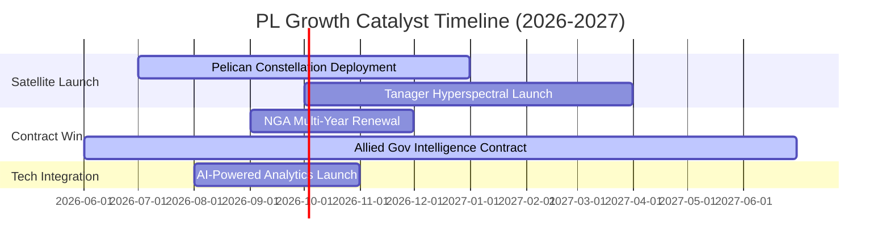

### 8.2 可尋址市場 (TAM) 分析

```
╔══════════════════════════════════════════════════════════════════╗
║                       PL TAM 與市場滲透率                        ║
╠══════════════════════════════════════════════════════════════════╣
║                                                                  ║
║  1. 國防與情報 (Defense & Intel)： TAM $15.0B | 滲透率 ~1.3%     ║
║  2. 商業與農業 (Agriculture & Com)：TAM $10.0B | 滲透率 ~1.1%     ║
║  3. 氣候與 ESG 監測 (Climate)：     TAM $5.0B  | 滲透率 ~0.5%     ║
║                                                                  ║
║  📊 總體 TAM：$30.0B | PL 當前營收 $3.36億 | 總體滲透率僅 1.12%   ║
║  💡 結論：極低的市場滲透率意味著未來十年具備巨大的成長天花板     ║
╚══════════════════════════════════════════════════════════════════╝
```

### 8.3 成長驅動力結構圖

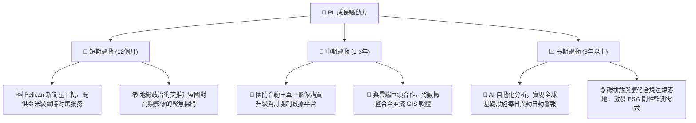

---

## 9. 風險矩陣

### 9.1 風險評分矩陣

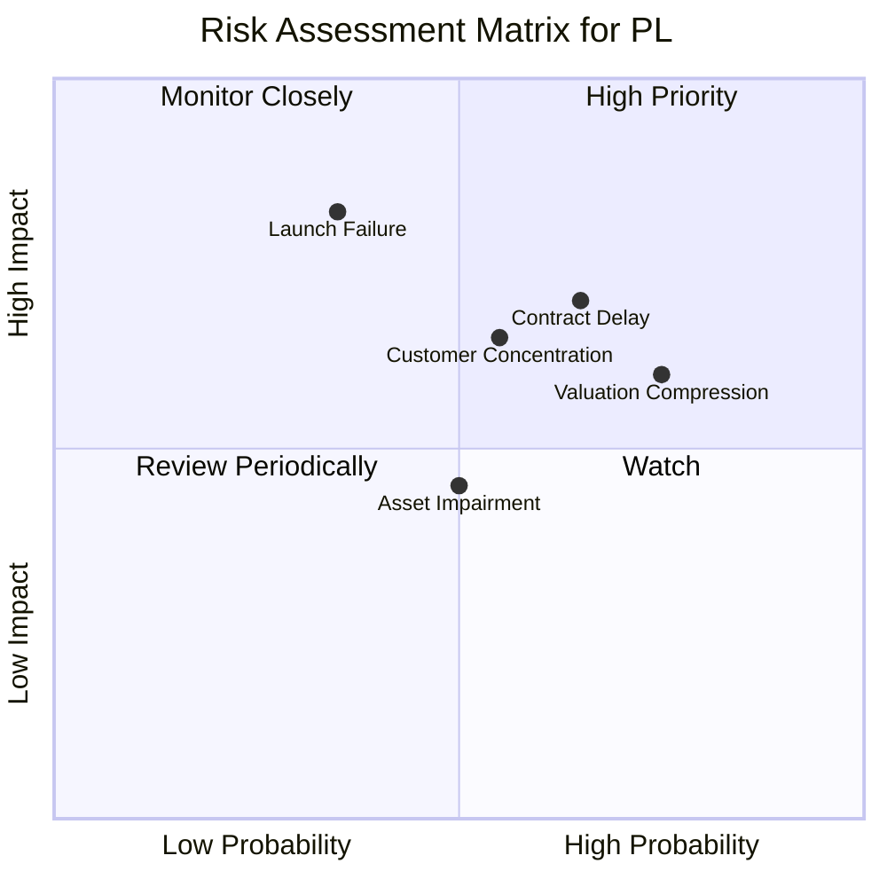

### 9.2 風險清單詳細分析

| # | 風險項目 | 發生機率 | 財務衝擊 | 風險評分 | 緩解措施 |
|---|----------|----------|----------|----------|----------|
| 1 | 🔴 **發射失敗或軌道故障** | 中 (35%) | 高 (-15%營收) | 🔴 **7.5/10** | 採用多火箭營運商分散風險；為關鍵載荷購買商業發射保險。 |
| 2 | 🔴 **政府合約決策與確認延遲** | 高 (65%) | 中 (-10%營收) | 🔴 **7.0/10** | 積極拓展歐洲及亞太地區商業客戶，降低單一政府客戶依賴。 |
| 3 | 🟡 **高估值面臨市場回調壓力** | 高 (75%) | 中 (-20%股價) | 🟡 **6.5/10** | 透過持續穩定的 FCF 成長和毛利率擴張，逐步消化估值溢價。 |
| 4 | 🟡 **非經營性資產一次性減值** | 中 (50%) | 低 (-5%現金流) | 🟡 **5.0/10** | 加強資產負債表管理，將老舊衛星加速折舊，減少未來一次性攤銷衝擊。 |

---

## 10. 投資建議

### 10.1 最終綜合評級雷達圖

```
                    基本面強度 (7.5)
                        10
                         8  ▲
                         6 / \
成長動能 (8.5) ◀─────────[★]─────────▶ 財務健康 (8.5)
                         4 \ /
                         2  ▼
                        估值合理性 (6.0)
```

### 10.2 目標價與隱含報酬率

| 情境 | 發生機率 | 12個月目標價 | 隱含報酬率 | 權重期望值 |
|------|----------|--------------|------------|------------|
| 🟢 **樂觀情境** | 25% | **$53.00** | +84.2% | $13.25 |
| 🟡 **基準情境** | 60% | **$38.50** | +33.8% | $23.10 |
| 🔴 **悲觀情境** | 15% | **$22.00** | -23.5% | $3.30 |
| **加權估值** | **100%** | **$39.65** | **+37.8%** | **CFA 推薦買入價：$28.00 以下** |

### 10.3 買入時機與觸發因素

```
╔══════════════════════════════════════════════════════════════════╗
║                  ✅ PL 買入觸發因素 Checklist                    ║
╠══════════════════════════════════════════════════════════════════╣
║                                                                  ║
║  立即買入觸發條件（多數符合）：                                  ║
║  ✅ 股價回落至 $25.00 - $28.00 區間（當前 $28.77 已接近）         ║
║  ✅ 季度 FCF 持續保持正向，且營收 YoY 增速維持在 35% 以上        ║
║  ✅ 宣佈與美國國防部（DoD）或盟國簽署新的大型多年期合約          ║
║                                                                  ║
║  加碼觸發條件（出現以下任一）：                                  ║
║  ☐ Pelican 衛星首批成功發射並傳回首張亞米級高畫質圖像            ║
║  ☐ 宣佈推出與 ChatGPT 類似的自然語言地理空間 AI 檢索工具         ║
║                                                                  ║
║  減碼/停損觸發條件（出現以下任一）：                             ║
║  ☐ 核心政府客戶（如 NGA）宣佈大幅削減地理空間預算                ║
║  ☐ 季度毛利率跌破 50%，顯示定價權受損                            ║
║                                                                  ║
╚══════════════════════════════════════════════════════════════════╝
```

### 10.4 投資人適配度分析

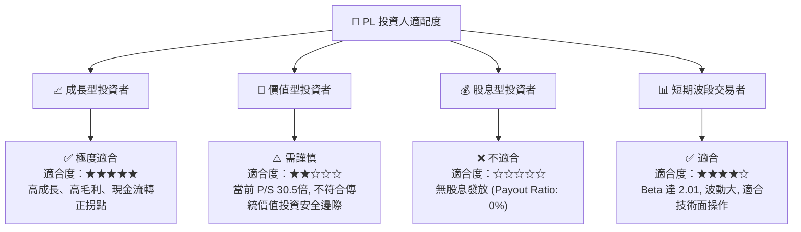

### 10.5 關鍵監控指標

為了追蹤 PL 的基本面變化，投資人應在未來的季度財報中重點監控以下指標：

| 監控類型 | 核心指標 | 預警閾值 | 理想目標值 | 監控頻率 |
|------|----------|----------|------------|----------|
| **成長性** | 季度營收年增率 (YoY) | < 25% | > 40% | 每季 |
| **獲利能力** | 調整後 EBITDA 利潤率 | < -20% | > 5% | 每季 |
| **現金流** | 季度自由現金流 (FCF) | 重新轉為負值 | > $2,000萬 | 每季 |
| **營運健康度** | 遞延收入 (Deferred Revenue) | < $1.5億 | > $2.5億 | 每季 |

---

> **免責聲明**：本報告為 AI 自動生成，僅供研究參考，不構成投資建議。投資有風險，入市需謹慎。