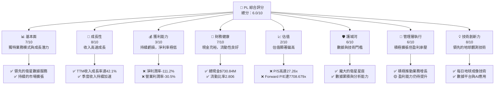
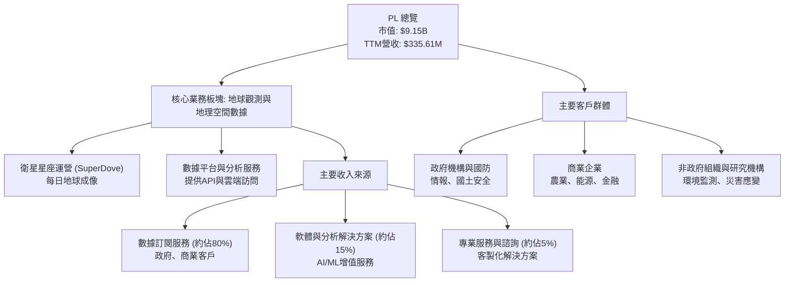
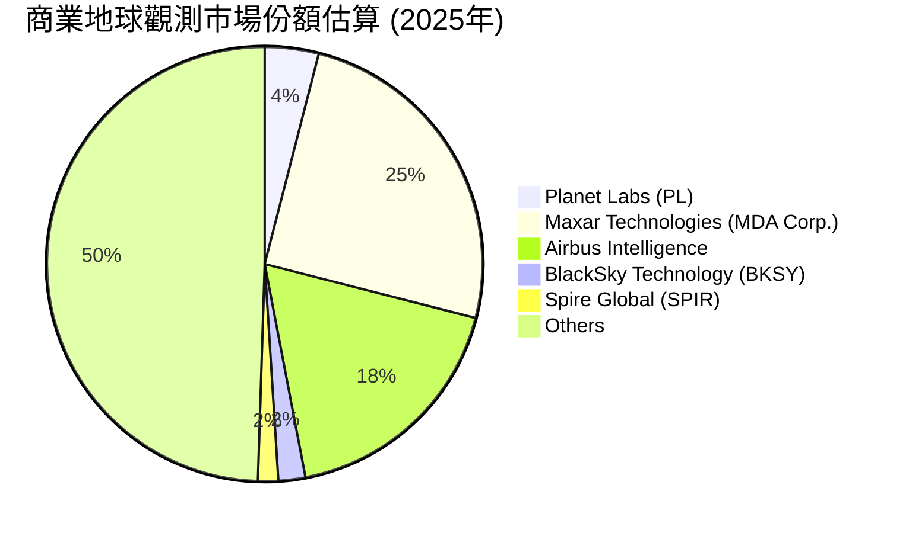
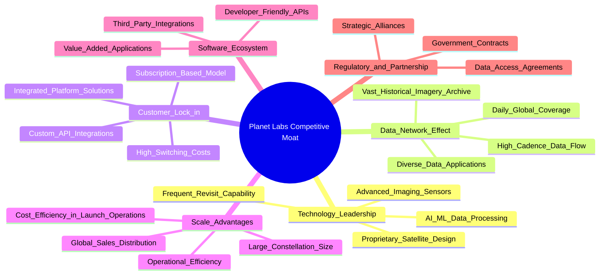
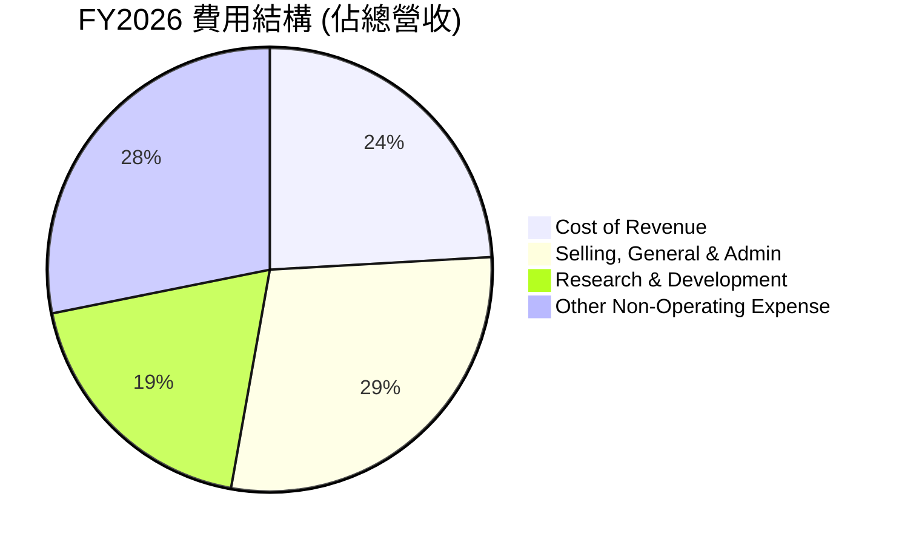
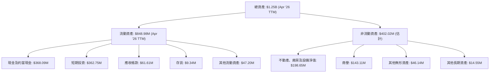
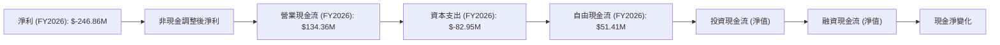

# PL 基本面深度分析報告
> **報告日期**：2026-06-24 ｜ **語言**：繁體中文 ｜ **數據來源**：Yahoo Finance, Finviz, StockAnalysis, Roic.ai ｜ **分析師**：CFA 級機構研究

---

## 目錄

| # | 章節 | 核心結論 |
|---|------------------------|--------------------------------------------------------------------------------------------------|
| 1 | 執行摘要 | 評級：觀望；目標價區間：$18.00 - $32.00 |
| 2 | 公司概覽與商業模式 | 護城河評估：中等，主要依賴技術與數據優勢 |
| 3 | 損益表深度分析 | 收入高速成長，但持續虧損，利潤率有改善但仍為負 |
| 4 | 資產負債表分析 | 流動性良好，現金充裕，但股東權益因虧損而減少 |
| 5 | 現金流量深度分析 | 營業現金流轉正，自由現金流首次實現正值，但仍需大量資本支出 |
| 6 | 獲利能力與資本效率 | 獲利能力指標皆為負值，ROIC遠低於WACC，目前正在摧毀股東價值 |
| 7 | 估值深度分析 | 相較同業估值顯著偏高，市場已充分反映高成長預期 |
| 8 | 成長催化劑 | 新產品、新技術、政府合作與國際擴張是主要成長動力 |
| 9 | 風險矩陣 | 估值過高、持續虧損、高資本開支和競爭加劇是主要風險 |
| 10 | 投資建議 | 觀望，等待估值回歸理性或獲利能力顯著改善 |

---

## 1. 執行摘要

### 1.1 核心評分儀表板



### 1.2 評分進度條視覺化

```
╔══════════════════════════════════════════════════════════════════╗
║              PL 多維度評分儀表板 (1-10分)                        ║
╠══════════════════════════════════════════════════════════════════╣
║ 基本面強度  7.0 ▓▓▓▓▓▓▓▓▓▓▓▓▓▓░░░░░░  ★★★★☆           ║
║ 成長動能    8.0 ▓▓▓▓▓▓▓▓▓▓▓▓▓▓▓▓░░░░  ★★★★☆           ║
║ 獲利品質    3.0 ▓▓▓▓▓▓░░░░░░░░░░░░░░  ★☆☆☆☆           ║
║ 財務健康    7.0 ▓▓▓▓▓▓▓▓▓▓▓▓▓▓░░░░░░  ★★★★☆           ║
║ 估值合理性  2.0 ▓▓▓▓░░░░░░░░░░░░░░░░  ☆☆☆☆☆           ║
║ 護城河深度  6.0 ▓▓▓▓▓▓▓▓▓▓▓▓░░░░░░░░  ★★★☆☆           ║
║ 管理層執行  6.0 ▓▓▓▓▓▓▓▓▓▓▓▓░░░░░░░░  ★★★☆☆           ║
║ 技術創新力  8.0 ▓▓▓▓▓▓▓▓▓▓▓▓▓▓▓▓░░░░  ★★★★☆           ║
╠══════════════════════════════════════════════════════════════════╣
║ 綜合總分    6.0 ▓▓▓▓▓▓▓▓▓▓▓▓░░░░░░░░  🏆 具備高成長潛力，但估值過高且盈利能力不足  ║
╚════════════════════════════════════════════════════════════════════════════════════╝
```

### 1.3 五大投資論點 + 三大核心風險

| 類型 | 項目 | 具體依據 | 信心度 |
|------|------|----------|--------|
| 🟢 **投資論點①** | **地球觀測數據市場領導者** | Planet Labs擁有龐大的衛星星座（SuperDove），實現每日地球成像，提供高頻次地理空間數據，是市場上少數能提供此類服務的公司之一。 | 🟢 極高 |
| 🟢 **投資論點②** | **收入高速成長且持續加速** | 公司TTM收入為$335.61M，YoY成長率達42.1%。最近一季（Q1 2027）收入$94.15M，YoY成長率達42.08%，顯示強勁的市場需求和執行力。 | 🟢 極高 |
| 🟢 **投資論點③** | **營業現金流轉正，自由現金流改善** | FY2026營業現金流達到$134.36M，較FY2025的$-14.37M顯著改善。TTM自由現金流為$84.85M，顯示公司在營運層面已能產生正向現金流。 | 🟢 高 |
| 🟢 **投資論點④** | **強大的技術創新與數據優勢** | 公司的衛星技術和數據分析平台具有高度專業性與技術門檻，透過AI/ML提供增值服務，提升客戶黏著度。 | 🟢 高 |
| 🟢 **投資論點⑤** | **分析師普遍看好，目標價有上行空間** | 10位分析師平均目標價為$39.80，較當前股價$25.67有約55%的潛在漲幅，分析師推薦評級為「買入」。 | 🟡 中等 |
| 🟡 **風險①** | **持續性虧損與盈利能力不確定性** | 公司TTM淨利潤率為-111.2%，FY2026淨虧損達$-246.86M。儘管收入成長，但尚未實現盈利，且未來盈利路徑仍不明確，對股東權益造成侵蝕。 | 🔴 高衝擊 |
| 🔴 **風險②** | **極高估值與市場預期過高** | PL的P/S比率高達27.26x，遠高於同業及產業平均。Forward P/E高達7708.679x（基於微薄的預期盈利），顯示市場對其未來成長和盈利能力抱持極高預期，一旦成長放緩或盈利不及預期，股價面臨巨大下行壓力。 | 🔴 高衝擊 |
| 🟡 **風險③** | **高資本開支與競爭加劇** | 衛星產業屬於資本密集型，需要持續投入進行衛星設計、建造和發射。同時，隨著更多參與者進入地球觀測領域，市場競爭將日益激烈，可能影響公司定價權和市場份額。 | 🟡 中度 |

### 1.4 快速統計卡片

| 指標 | 公司實際值 | 行業均值 (Aerospace & Defense) | S&P 500 均值 | 狀態 |
|-----------------|-------------|--------------------------------|--------------|------|
| 收入 YoY 成長 | **42.1%** | ~8-12% | ~8-10% | 🟢 |
| 毛利率 | **55.6%** | ~25-35% | ~35-45% | 🟢 |
| 淨利率 | **-111.2%** | ~5-10% | ~8-12% | 🔴 |
| ROE | **-84.0%** | ~10-15% | ~15-20% | 🔴 |
| Forward P/E | **7708.68x** | ~20-30x | ~20-25x | 🔴 |
| P/S Ratio | **27.26x** | ~1-3x | ~2-4x | 🔴 |
| Current Ratio | **2.81x** | ~1.5-2.0x | ~1.5-2.0x | 🟢 |
| Debt/Equity | **109.99%** | ~50-80% | ~70-100% | 🟡 |

*註：行業均值和S&P 500均值為分析師根據經驗估算，用於提供參考對比。*

### 1.5 投資結論

```
╔══════════════════════════════════════════════════════════════════╗
║                    📊 投資結論摘要                               ║
╠══════════════════════════════════════════════════════════════════╣
║  評級：🟡 觀望                                                    ║
║  當前股價：$25.67                                                ║
║  目標價區間：                                                    ║
║    悲觀情境：$18.00 （-29.8%）                                   ║
║    基準情境：$25.00 （-2.6%）  ← 12個月主要目標                  ║
║    樂觀情境：$32.00 （+24.7%）                                   ║
║  投資評分：6.0/10                                                ║
║  適合投資人：高風險承受能力、看好長期顛覆性技術的成長型投資者    ║
╚══════════════════════════════════════════════════════════════════╝
```

---

## 2. 公司概覽與商業模式

### 2.1 業務結構與收入來源

Planet Labs PBC (PL) 是一家專注於地球觀測和地理空間數據服務的公司，其核心業務是設計、建造和發射衛星星座，並透過線上平台向全球客戶提供高頻次的地理空間數據。公司以其獨特的SuperDove衛星星座而聞名，該星座旨在實現地球每日成像，提供高達3.5米地面採樣距離(GSD)的解析度。

PL的業務模式主要基於訂閱服務，客戶透過其線上平台獲取衛星圖像和相關分析服務。收入主要來自於政府、商業和非營利組織對其數據產品和解決方案的需求，應用領域廣泛，包括農業、林業、能源、政府情報、災害應變、地圖繪製和環境監測等。



### 2.2 市場份額

地球觀測和地理空間數據市場是一個快速成長但競爭激烈的市場。PL在商業衛星圖像領域佔據重要地位，尤其在高頻次、全球覆蓋的每日成像方面具有獨特優勢。儘管缺乏精確的市場份額數據，但根據其公開的收入規模與行業報告，可以粗略估計其在特定細分市場的份額。

假設全球商業地球觀測市場規模在2025年約為$5-7B，PL在2025財年的收入為$244.35M，約佔該市場的3.5%至5%。若考慮其高頻次成像的利基市場，其份額可能更高。



### 2.3 競爭護城河分析

Planet Labs的競爭護城河主要體現在以下幾個方面：



### 2.4 護城河強度評分

```
╔══════════════════════════════════════════════════════════════════╗
║                  Planet Labs 護城河強度評分                     ║
╠══════════════════════════════════════════════════════════════════╣
║ 技術領先       8/10  ▓▓▓▓▓▓▓▓▓▓▓▓▓▓▓▓░░░░  🏆 獨特的衛星設計和每日成像能力    ║
║ 數據網路效應   7/10  ▓▓▓▓▓▓▓▓▓▓▓▓▓▓░░░░░░  🟢 龐大的歷史數據和高頻次更新       ║
║ 客戶鎖定       6/10  ▓▓▓▓▓▓▓▓▓▓▓▓░░░░░░░░  🟡 訂閱模式和平台整合提高轉換成本   ║
║ 規模效應       6/10  ▓▓▓▓▓▓▓▓▓▓▓▓░░░░░░░░  🟡 大規模衛星部署和營運效率       ║
║ 軟體生態系統   5/10  ▓▓▓▓▓▓▓▓▓▓░░░░░░░░░░  🟡 雖有API，但生態系統仍在發展初期    ║
║ 生態夥伴       6/10  ▓▓▓▓▓▓▓▓▓▓▓▓░░░░░░░░  🟡 與政府和企業合作，但影響力有限    ║
╠══════════════════════════════════════════════════════════════════╣
║ 綜合護城河     6.3   ▓▓▓▓▓▓▓▓▓▓▓▓░░░░░░░░  🏆 中等強度，依賴技術和數據領先，但需持續投入以維持優勢 ║
╚════════════════════════════════════════════════════════════════════════════════════════════════════════╝
```

---

## 3. 損益表深度分析

### 3.1 年度收入成長趨勢（近4年）

Planet Labs在過去幾年展現出強勁的收入成長動能。從FY2023的$191.26M增長至FY2026的$307.73M，複合年均增長率(CAGR)達到17.88%。特別是最近一年，FY2026收入YoY成長率達到25.94%，顯示其業務擴張正在加速。根據TTM數據，收入更是達到$335.61M，YoY成長率高達42.1%。

```
╔══════════════════════════════════════════════════════════════════╗
║              Planet Labs 年度收入趨勢（FY2023-FY2026）           ║
╠══════════════════════════════════════════════════════════════════╣
║                                                                  ║
║  FY2023  $191.26M  ████████░░░░░░░░░░░░░░░░░░░  YoY: +15.94% 🟢   ║
║  FY2024  $220.70M  ███████████░░░░░░░░░░░░░░░░░  YoY: +15.39% 🟢   ║
║  FY2025  $244.35M  █████████████░░░░░░░░░░░░░░░  YoY: +10.72% 🟡   ║
║  FY2026  $307.73M  █████████████████░░░░░░░░░░░  YoY: +25.94% 🟢   ║
║  TTM     $335.61M  ████████████████████░░░░░░░  YoY: +42.10% 🟢   ║
║                   |      |      |      |      |                  ║
║                   0     100M   200M   300M   400M                 ║
║                                                                  ║
║  📊 4年累計 CAGR：+17.88% (FY23-FY26)                             ║
╚══════════════════════════════════════════════════════════════════╝
```
*註：FY2023-FY2026的YoY成長率計算基於StockAnalysis提供的年度收入數據。TTM YoY成長率來自市場數據。*

### 3.2 季度收入趨勢分析

近四季的收入表現持續強勁，並呈現加速增長態勢。Q1 2027的收入達到$94.15M，相比去年同期（Q1 2026的$66.27M）增長了42.08%。季度環比(QoQ)增長也保持在健康的水平，顯示出穩定的業務擴張。

| 季度 (Period Ending) | Total Revenue | QoQ 成長率 | YoY 成長率 | 備註 |
|----------------------|---------------|------------|------------|------|
| 2026-04-30 (Q1 2027) | $94.15M | +8.44% | +42.08% | 🟢 收入加速成長 |
| 2026-01-31 (Q4 2026) | $86.82M | +6.86% | +41.05% | 🟢 收入持續擴張 |
| 2025-10-31 (Q3 2026) | $81.25M | +10.71% | +32.63% | 🟢 收入穩定增長 |
| 2025-07-31 (Q2 2026) | $73.39M | +10.74% | +20.12% | 🟢 收入表現穩健 |

*備註：QoQ成長率計算為本季收入與上季收入的變化。YoY成長率計算為本季收入與去年同期收入的變化。*

### 3.3 利潤率演變分析

儘管收入高速成長，Planet Labs的利潤率表現仍是其主要弱點。毛利率在過去幾年有所波動，但總體維持在50%以上，顯示其數據服務本身具有較高的附加值。然而，由於高昂的營運費用（尤其是研發和銷售管理費用），營業利潤率和淨利潤率持續為負。

| 利潤率指標 | FY2023 | FY2024 | FY2025 | FY2026 | TTM | 趨勢 | 評估 |
|----------------|----------|----------|----------|----------|-----------|------------|------|
| **毛利率** | 49.15% | 51.18% | 57.18% | 56.05% | 55.6% | ↗️ 趨勢向好 | 🟢 |
| **營業利益率** | -91.85% | -75.81% | -45.48% | -30.89% | -30.5% | ↗️ 虧損收窄 | 🟡 |
| **淨利潤率** | -84.69% | -63.67% | -50.42% | -80.22% | -111.2% | ↘️ 虧損擴大 | 🔴 |

**利潤率演變深度解析**：
*   **毛利率**：從FY2023的49.15%提升至FY2025的57.18%，FY2026略有下降至56.05%，TTM為55.6%。這表明公司在提供其核心數據服務方面具有較強的定價能力和成本控制能力。毛利率的改善可能得益於規模經濟的初步顯現以及更高利潤率的數據產品組合。
*   **營業利益率**：雖然毛利率表現良好，但營業利益率持續為負，從FY2023的-91.85%顯著收窄至FY2026的-30.89%，TTM為-30.5%。這顯示公司在營運效率方面有所改善，但研發(R&D)和銷售、一般及管理(SG&A)費用依然高昂。例如，FY2026的R&D費用為$106.75M，SG&A費用為$160.81M，合計佔當年收入的約87.8%。這些投資對於維持技術領先和市場擴張至關重要，但也導致了營業層面的持續虧損。
*   **淨利潤率**：淨利潤率在FY2023至FY2025期間有所改善（虧損收窄），從-84.69%降至-50.42%。然而，FY2026卻急劇惡化至-80.22%，TTM更是達到-111.2%。這主要是由於「其他非營運收入（費用）」項下的巨額負值。例如，StockAnalysis數據顯示，TTM的「Other Non-Operating Income (Expense)」為$-274.72M，FY2026為$-158.03M。這可能包括一次性費用、資產減值或其他非核心業務的損失，嚴重拖累了淨利潤表現。投資者需要密切關注此類非經常性或非核心虧損的來源及其持續性。

### 3.4 費用結構分析

Planet Labs的費用結構反映了其作為一家高科技成長型公司的特點，即在研發和市場擴張方面投入巨大。


*註：此圖基於FY2026年收入$307.73M計算各費用佔比，其中其他非營運費用採用StockAnalysis FY2026的$-158.03M。*

```
╔══════════════════════════════════════════════════════════════════╗
║                Planet Labs 營運費用趨勢 (佔營收百分比)           ║
╠══════════════════════════════════════════════════════════════════╣
║                                                                  ║
║  研發費用佔比 (R&D/Revenue):                                     ║
║  FY2023  58.0%  ███████████████████████████████████████████████░  🔴 高投入  ║
║  FY2024  52.7%  █████████████████████████████████████████████░░░  🔴 高投入  ║
║  FY2025  41.3%  ██████████████████████████████████████░░░░░░░░░░  🟡 略有改善║
║  FY2026  34.7%  ██████████████████████████████░░░░░░░░░░░░░░░░░░  🟡 逐步優化║
║                                                                  ║
║  銷售、一般及管理費用佔比 (SG&A/Revenue):                        ║
║  FY2023  82.9%  █████████████████████████████████████████████████████████████  🔴 極高    ║
║  FY2024  75.4%  █████████████████████████████████████████████████░░░░░░░░░░░  🔴 極高    ║
║  FY2025  63.4%  ████████████████████████████████████████░░░░░░░░░░░░░░░░░░░  🔴 高      ║
║  FY2026  52.3%  ████████████████████████████████████░░░░░░░░░░░░░░░░░░░░░░░  🔴 高      ║
╚══════════════════════════════════════════════════════════════════╝
```
R&D費用佔比從FY2023的58.0%下降到FY2026的34.7%，顯示公司在收入規模擴大後，研發效率有所提升，或研發投入增長速度慢於收入。然而，SG&A費用佔比雖然也有所下降，但FY2026仍高達52.3%，這表明公司在銷售和管理方面的開支仍然非常龐大，是導致營業虧損的主要原因。對於一家成長型公司而言，高額的R&D和SG&A投入是為了搶佔市場和保持技術領先，但市場將密切關注這些投入何時能轉化為可持續的盈利。

### 3.5 季度 EPS 趨勢與盈餘品質

提供的財務數據中，近四季的EPS預期和實際值顯示為`nan`，因此無法進行EPS超預期/不及預期分析。然而，我們可以觀察公司的季度淨利潤趨勢來評估其盈餘品質。

| 季度 (Period Ending) | Net Income | 備註 |
|----------------------|------------|------|
| 2026-04-30 (Q1 2027) | $-138.87M | 🔴 淨虧損顯著擴大 |
| 2026-01-31 (Q4 2026) | $-152.46M | 🔴 淨虧損持續擴大 |
| 2025-10-31 (Q3 2026) | $-59.19M | 🔴 淨虧損依然存在 |
| 2025-07-31 (Q2 2026) | $-22.59M | 🔴 淨虧損持續存在 |

**盈餘品質評估**：
Planet Labs的盈餘品質目前較差，主要體現在以下幾點：
1.  **持續性虧損**：公司在過去所有季度均呈現淨虧損，這表明其核心業務尚未實現盈利。
2.  **虧損擴大趨勢**：儘管Q2 2026和Q3 2026的淨虧損相對較小，但在Q4 2026和Q1 2027，淨虧損分別達到$-152.46M和$-138.87M，呈現顯著擴大的趨勢。這與其TTM淨利潤率惡化至-111.2%相吻合。
3.  **非經常性或非核心項目影響**：如前所述，年度淨利潤率的惡化和季度虧損的顯著擴大，很可能與「其他非營運收入（費用）」中的巨額負值有關。這類項目通常波動較大，且不反映公司核心經營活動的真實盈利能力。投資者需警惕這種由非核心因素導致的盈餘波動。
4.  **盈利能力壓力**：即使收入高速成長，公司仍面臨巨大的盈利壓力。若無法有效控制營運費用並將高收入增長轉化為正向淨利潤，其長期可持續性將受到質疑。

總體而言，PL的盈餘品質目前處於低位，其持續且擴大的虧損是投資者需要高度關注的核心風險。

---

## 4. 資產負債表分析

### 4.1 資產結構分解

Planet Labs的資產結構反映了其業務特性，即對現金、短期投資和固定資產（衛星基礎設施）的需求。


*註：非流動資產為總資產減去流動資產估算所得。數據為TTM (Apr '26)。*

公司擁有大量的現金及短期投資，合計達$730.84M (TTM Apr '26)，佔總資產的約58.4%。這筆現金儲備對於支持其高資本開支和持續虧損至關重要。不動產、廠房及設備淨值(PPE)為$198.65M，代表其衛星和地面站等基礎設施投資。商譽和無形資產也佔據一定比例，可能與過去的收購活動有關。

### 4.2 流動性指標分析

Planet Labs的流動性狀況良好，擁有充足的流動資產來應對短期債務。

| 流動性指標 | FY2023 | FY2024 | FY2025 | FY2026 | TTM (Apr '26) | 行業均值 (Aerospace & Defense) | 評估 |
|-----------------|----------|----------|----------|----------|---------------|--------------------------------|------|
| **流動比率 (Current Ratio)** | 3.89x | 2.71x | 2.13x | 1.65x | 2.81x | ~1.5-2.0x | 🟢 |
| **速動比率 (Quick Ratio)** | 3.72x | 2.71x | 2.13x | 1.63x | 2.77x | ~1.0-1.5x | 🟢 |

*註：FY2026的流動比率和速動比率計算使用Jan '26數據：Current Assets $775.36M / Current Liabilities $469.45M = 1.65x；Quick Ratio = ($775.36M - $6.12M Inventory) / $469.45M = 1.63x。TTM (Apr '26) 數據來自Market Data/Finviz。*

儘管FY2026的流動比率和速動比率（基於Jan '26數據）相較前幾年有所下降，但TTM數據顯示其流動比率為2.81x，速動比率為2.77x，仍遠高於行業平均水平，表明公司擁有非常健康的短期償債能力。這主要得益於其龐大的現金及短期投資儲備。

### 4.3 債務結構分析

Planet Labs的債務總額相對其市值而言不高，但其債務權益比率較高，這與其持續虧損導致股東權益減少有關。

```
╔══════════════════════════════════════════════════════════════════╗
║                   Planet Labs 債務健康診斷                       ║
╠══════════════════════════════════════════════════════════════════╣
║                                                                  ║
║  總債務 (TTM):   $488.04M   ████░░░░░░░░░░░░░░░░░  評語: 適中，但需注意增長║
║  總現金+投資 (TTM): $730.84M   ████████████████████░  評語: 非常充裕        ║
║  淨現金（正）(TTM): $242.80M   ████████████████████░  🟢 強勁淨現金狀況    ║
║                                                                  ║
║  Debt/Equity (TTM):  109.99%  🟡 較高，因權益受虧損侵蝕           ║
║  Current Debt (TTM): $3.39M   🟢 極低                             ║
║  Long-Term Debt (TTM): $484.65M 🟡 主要為長期負債                 ║
╚══════════════════════════════════════════════════════════════════╝
```
*註：總債務為Market Data提供，淨現金為總現金減去總債務。Current Debt和Long-Term Debt根據StockAnalysis的Current Portion of Leases和Roic.ai的LT Borrowings推算。*

公司擁有$730.84M的總現金，遠高於$488.04M的總債務，因此淨現金為$242.80M，顯示其短期內沒有償債壓力。然而，其債務/權益比率高達109.991%，這並非因為債務絕對值過高，而是因為公司持續的淨虧損導致股東權益從FY2023的$576.10M大幅下降至FY2026的$188.43M。這使得相對債務負擔看起來較重。未來若能實現盈利，股東權益將會回升，此比率也會隨之改善。

### 4.4 股東權益趨勢

Planet Labs的股東權益在過去幾年呈現持續下降的趨勢，這直接反映了公司長期以來的經營虧損。

```
╔══════════════════════════════════════════════════════════════════╗
║                Planet Labs 股東權益趨勢 (FY2023-FY2026)           ║
╠══════════════════════════════════════════════════════════════════╣
║                                                                  ║
║  FY2023  $576.10M  █████████████████████████████████████████████░  🔴 初始規模較大║
║  FY2024  $518.02M  ██████████████████████████████████████████░░░  🔴 下降       ║
║  FY2025  $441.29M  ██████████████████████████████████████░░░░░░░  🔴 下降       ║
║  FY2026  $188.43M  ██████████████████░░░░░░░░░░░░░░░░░░░░░░░░░░░  🔴 大幅下降   ║
║                                                                  ║
║  📊 趨勢：持續下降，顯示公司長期累積虧損對股東價值的侵蝕。       ║
╚══════════════════════════════════════════════════════════════════╝
```
股東權益從FY2023的$576.10M下降至FY2026的$188.43M，降幅達67.3%。這主要是由於公司持續的淨虧損抵消了股本的增加。儘管公司透過發行股票等方式籌集資金，但若不能實現盈利，股東權益的侵蝕將持續存在，這對長期投資者而言是一個重要的風險信號。

---

## 5. 現金流量深度分析

### 5.1 現金流量瀑布圖

Planet Labs在現金流量方面展現了顯著的改善，尤其是在FY2026和TTM數據中實現了正向的營業現金流和自由現金流，這是一個重要的里程碑。


*註：此圖基於FY2026年度數據。*

**分析**：
*   **營業現金流 (OCF)**：從FY2023的$-73.93M、FY2024的$-50.71M、FY2025的$-14.37M，大幅改善並在FY2026轉正為$134.36M。TTM營業現金流更是高達$132.46M。這表明公司在經營層面已能產生正向現金流，是其盈利能力改善的初步跡象，也是其長期可持續發展的關鍵。
*   **資本支出 (Capex)**：FY2026資本支出為$-82.95M，較往年有所增加，這符合其擴大衛星星座和基礎設施建設的需求。
*   **自由現金流 (FCF)**：在OCF轉正的帶動下，PL在FY2026實現了$51.41M的正向自由現金流，TTM更是達到$84.85M。這是公司首次實現正向FCF，意義重大，表明公司已能透過自身營運產生足夠的現金來覆蓋其資本開支。

### 5.2 FCF 轉換率趨勢

由於公司長期處於淨虧