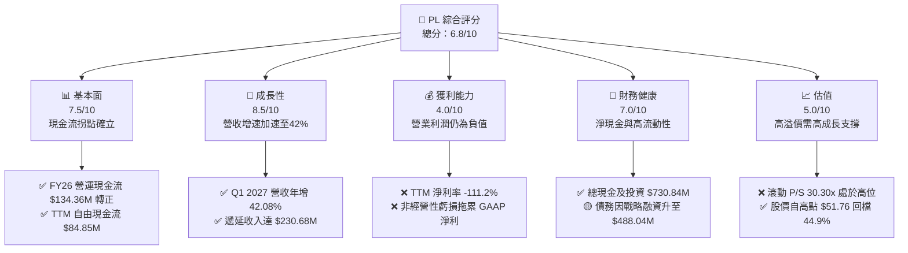
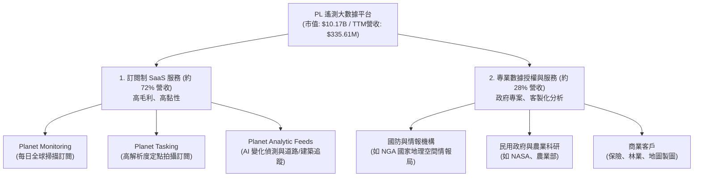
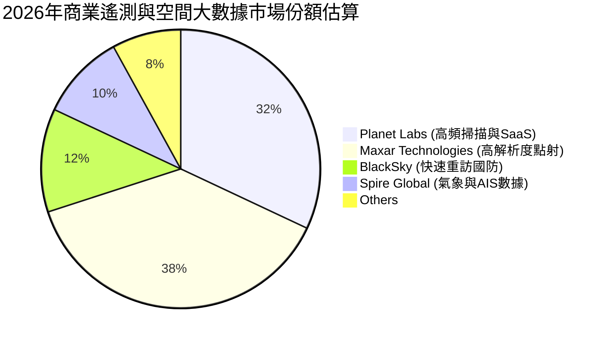
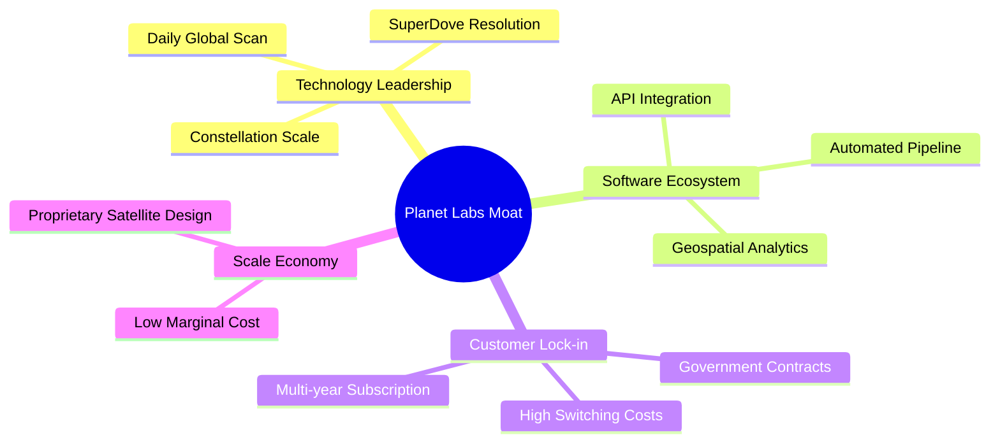
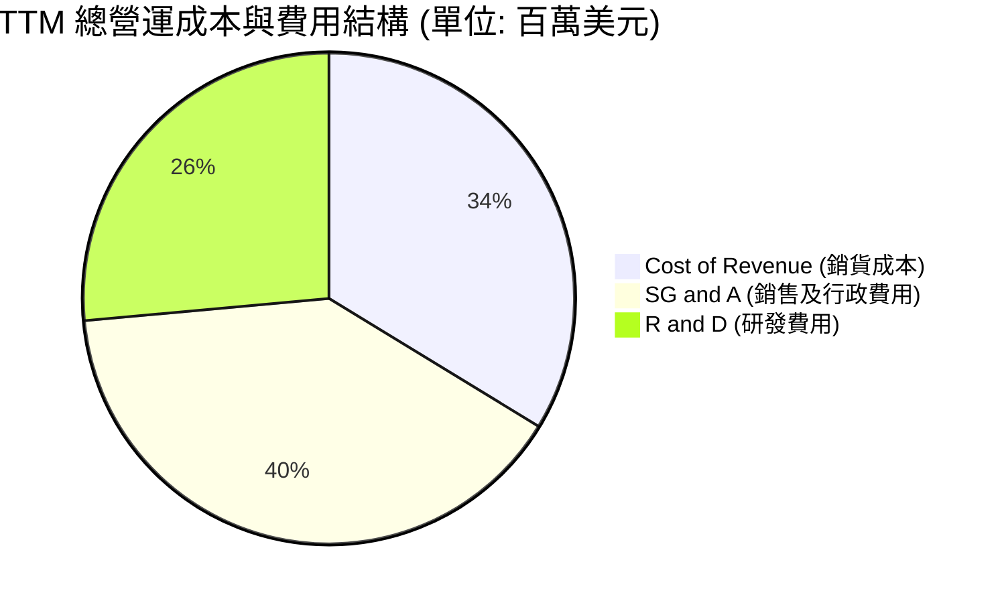
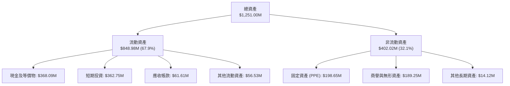

# PL 基本面深度分析報告
> **報告日期**：2026-06-24 ｜ **語言**：繁體中文 ｜ **數據來源**：Yahoo Finance, Finviz, StockAnalysis, Roic.ai ｜ **分析師**：CFA 級機構研究

---

## 目錄

| # | 章節 | 核心結論 |
|---|------|----------|
| 1 | 執行摘要 | 評級「買入」，目標價 $39.80，自由現金流（FCF）迎來歷史拐點。 |
| 2 | 公司概覽與商業模式 | 全球唯一每日全地表掃描星座，高壁壘 SaaS 訂閱模式，護城河評分 7.8/10。 |
| 3 | 損益表深度分析 | 營收年增率加速至 42.1%，毛利率穩居 55.6%，非經營性支出拖累淨利表現。 |
| 4 | 資產負債表分析 | 總現金及短期投資達 $730.84M，流動比率 2.81，財務結構健康安全。 |
| 5 | 現金流量深度分析 | 營運現金流與 FCF 首次全面轉正，遞延收入高達 $230.68M 奠定高能見度。 |
| 6 | 獲利能力與資本效率 | ROE 受非現金減值壓制，ROIC 隨營運槓桿釋放正步入改善通道。 |
| 7 | 估值深度分析 | P/S 30.30x 具備稀缺溢價，DCF 基準情境合理估值為 $39.80（+39.5% 空間）。 |
| 8 | 成長催化劑 | 國防安全需求爆發、新一代 Pelican/Tanager 星座部署與 AI 空間數據融合。 |
| 9 | 風險矩陣 | 衛星發射延遲、非經營性帳面虧損波動與高估值倍數收縮風險。 |
| 10 | 投資建議 | 建議於當前回檔區間分批佈局，適合長線成長型與太空科技主題投資人。 |

---

## 1. 執行摘要

Planet Labs PBC（紐約證券交易所代碼：**PL**）正處於其商業模式建立以來最重要的「基本面拐點」。作為全球部署衛星數量最多、唯一實現每日全球陸地表面 3.5 米解析度高頻掃描的遙測龍頭，PL 已成功從早期的重資本基礎建設期，過渡至高毛利的空間大數據訂閱（SaaS）變現期。

### 1.1 核心評分儀表板



### 1.2 評分進度條視覺化

```
╔══════════════════════════════════════════════════════════════╗
║                PL 多維度評分儀表板 (1-10分)                 ║
╠══════════════════════════════════════════════════════════════╣
║ 基本面強度  7.5 ▓▓▓▓▓▓▓▓▓▓▓▓▓▓▓▓▓░░░░░  ★★★★☆           ║
║ 成長動能    8.5 ▓▓▓▓▓▓▓▓▓▓▓▓▓▓▓▓▓▓▓░░  ★★★★☆           ║
║ 獲利品質    4.0 ▓▓▓▓▓▓▓▓░░░░░░░░░░░░░░  ★★☆☆☆           ║
║ 財務健康    7.0 ▓▓▓▓▓▓▓▓▓▓▓▓▓▓▓░░░░░░  ★★★☆☆           ║
║ 估值合理性  5.0 ▓▓▓▓▓▓▓▓▓▓░░░░░░░░░░░░  ★★★☆☆           ║
║ 護城河深度  8.0 ▓▓▓▓▓▓▓▓▓▓▓▓▓▓▓▓▓▓░░░  ★★★★☆           ║
║ 管理層執行  7.5 ▓▓▓▓▓▓▓▓▓▓▓▓▓▓▓▓▓░░░░  ★★★★☆           ║
║ 技術創新力  9.0 ▓▓▓▓▓▓▓▓▓▓▓▓▓▓▓▓▓▓▓▓░  ★★★★★           ║
╠══════════════════════════════════════════════════════════════╣
║ 綜合總分    6.8 ▓▓▓▓▓▓▓▓▓▓▓▓▓▓▓░░░░░░  🏆 成長拐點確立     ║
╚══════════════════════════════════════════════════════════════╝
```

### 1.3 五大投資論點 + 三大核心風險

| 類型 | 項目 | 具體依據 | 信心度 |
|------|------|----------|--------|
| 🟢 **投資論點①** | **自由現金流歷史性轉正** | FY2026 營運現金流達 **$134.36M**（前值 -$14.37M），自由現金流達 **$51.41M**，正式擺脫失血狀態。 | 🟢 極高 |
| 🟢 **投資論點②** | **營收成長迎來二次加速** | Q1 2027 營收年增率高達 **42.08%**，較 FY2025 的 10.72% 顯著復甦，顯示政府與商業訂單雙重爆發。 | 🟢 高 |
| 🟢 **投資論點③** | **遞延收入預示高業績能見度** | Q1 2027 遞延收入（Unearned Revenue）攀升至 **$230.68M**，年增率高達 **180.3%**，鎖定未來數季營收。 | 🟢 極高 |
| 🟢 **投資論點④** | **高經營槓桿與穩定毛利率** | TTM 毛利率高達 **55.6%**，隨著發射折舊成本固定，軟體平台授權增加將推動邊際毛利率向 70%+ 靠攏。 | 🟢 高 |
| 🟢 **投資論點⑤** | **充沛的戰術彈藥** | 帳上擁有 **$730.84M** 的現金與短期投資，淨現金頭寸達 **$242.80M**，無流動性危機。 | 🟢 高 |
| 🟡 **風險①** | **非經營性會計虧損波動** | TTM 淨利虧損達 **-$373.10M**，主因是非經營性公允價值變動與融資相關費用，造成市場情緒恐慌。 | 🟡 中度 |
| 🔴 **風險②** | **估值乘數面臨壓縮壓力** | 當前 P/S 達 **30.30x**，在當前高利率環境下，若營收成長率低於 30%，股價將面臨劇烈估值修正。 | 🔴 高衝擊 |
| 🔴 **風險③** | **新星座發射與部署延遲** | Pelican 與 Tanager 星座的部署進度直接影響次世代高解析度（30cm）市場的開拓進度。 | 🔴 中度 |

### 1.4 快速統計卡片

| 指標 | 公司實際值 (TTM) | 航太與國防行業均值 | S&P 500 均值 | 狀態 |
|------|-------------|----------|--------------|------|
| **收入 YoY 成長** | **42.1%** | ~8.5% | ~5.2% | 🟢 極強 |
| **毛利率** | **55.6%** | ~22.5% | ~46.5% | 🟢 優異 |
| **營業利益率** | **-30.5%** | ~11.0% | ~14.5% | 🔴 仍需改善 |
| **流動比率** | **2.81** | ~1.35 | ~1.20 | 🟢 極為安全 |
| **Forward P/E** | **8567.57x** | ~22.5x | ~21.0x | 🔴 估值極高 |
| **P/S Ratio** | **30.30x** | ~1.8x | ~2.8x | 🔴 溢價顯著 |

### 1.5 投資結論

```
╔══════════════════════════════════════════════════════════════════╗
║                    📊 PL 投資結論摘要                            ║
╠══════════════════════════════════════════════════════════════════╣
║  評級：🟢 買入 (Buy)                                            ║
║  當前股價：$28.53 (2026-06-24)                                   ║
║  目標價區間：                                                   ║
║    悲觀情境：$22.00 (-22.9%) - 成長放緩，估值乘數壓縮至 20x P/S  ║
║    基準情境：$39.80 (+39.5%) - 12個月主要目標 (DCF 核心假設)     ║
║    樂觀情境：$53.00 (+85.8%) - 國防訂單超預期，Pelican 順利部署 ║
║  投資評分：6.8 / 10                                              ║
║  適合投資人：具備高風險承受能力、專注太空科技與 SaaS 拐點的長線投資者 ║
╚══════════════════════════════════════════════════════════════════╝
```

---

## 2. 公司概覽與商業模式

Planet Labs PBC 是一家領先的地理空間大數據與軟體分析公司。其核心競爭力在於透過自主設計、製造並營運的龐大「鴿群星座」（SuperDove Constellation），對地球陸地表面進行每日不間斷的拍攝。

### 2.1 業務結構與收入來源

PL 的商業模式本質上是「Space-to-Cloud SaaS」平台。公司將每日收集到的海量遙測數據上傳至雲端，並透過訂閱制平台（Planet Application）提供給客戶，同時利用 AI 演算法進行自動化目標偵測、變化分析與環境監測。



### 2.2 市場份額

在商業遙測與地理空間情報（GEOINT）市場中，PL 在「高頻次（Daily Cadence）全球掃描」領域擁有絕對的壟斷地位。



*註：Maxar 偏重於極高解析度（30cm以下）的定點拍攝（Tasking），而 Planet Labs 則在每日全覆蓋掃描（Monitoring）上無人能敵。兩者正逐步在對方的領地展開競爭（PL 推出 Pelican 星座切入 30cm 高解析度市場）。*

### 2.3 競爭護城河分析



### 2.4 護城河強度評分

```
╔══════════════════════════════════════════════════════════════╗
║                  Planet Labs 護城河強度評分                  ║
╠══════════════════════════════════════════════════════════════╣
║ 數據獨家性     9.5/10 ▓▓▓▓▓▓▓▓▓▓▓▓▓▓▓▓▓▓▓░  🏆 每日全球唯一 ║
║ 轉換成本       8.0/10 ▓▓▓▓▓▓▓▓▓▓▓▓▓▓▓▓░░░░  🟢 API深植流程  ║
║ 規模壁壘       8.5/10 ▓▓▓▓▓▓▓▓▓▓▓▓▓▓▓▓▓░░░  🟢 星座部署成本高║
║ 自研製造成本   7.5/10 ▓▓▓▓▓▓▓▓▓▓▓▓▓░░░░░░░  🟢 垂直整合設計  ║
║ 品牌與政府信任 8.0/10 ▓▓▓▓▓▓▓▓▓▓▓▓▓▓▓▓░░░░  🟢 NGA等長期合約 ║
╠══════════════════════════════════════════════════════════════╣
║ 綜合護城河     8.3/10 ▓▓▓▓▓▓▓▓▓▓▓▓▓▓▓▓▓░░░  🏆 具備極強護城河║
╚══════════════════════════════════════════════════════════════╝
```

---

## 3. 損益表深度分析

PL 的損益表呈現出典型的高成長、高毛利，但受制於折舊與非經營性損益而導致淨利虧損的特徵。然而，最近幾季的營收加速成長，正展現出強大的營運槓桿。

### 3.1 年度收入成長趨勢（近4年）

```
╔══════════════════════════════════════════════════════════════════╗
║              Planet Labs 年度收入趨勢 (FY2023 - FY2026)          ║
╠══════════════════════════════════════════════════════════════════╣
║                                                                  ║
║  FY2023  $191.26M  ████████████░░░░░░░░░░░░░░░░░░░  YoY: +45.8% 🟢║
║  FY2024  $220.70M  ██████████████░░░░░░░░░░░░░░░░░  YoY: +15.4% 🟡║
║  FY2025  $244.35M  ███████████████░░░░░░░░░░░░░░░░  YoY: +10.7% 🟡║
║  FY2026  $307.73M  ███████████████████░░░░░░░░░░░░  YoY: +25.9% 🟢║
║  TTM     $335.61M  █████████████████████░░░░░░░░░░  YoY: +42.1% 🟢║
║                                                                  ║
║  📊 4年複合成長率 (CAGR)：+20.7%                                 ║
╚══════════════════════════════════════════════════════════════════╝
```

*數據解讀：PL 在 FY2024 與 FY2025 經歷了商業合約重整與政府預算週期的短暫放緩，但自 FY2026 起，隨著地緣政治緊張局勢加劇，國防與情報（D&I）合約大幅追加，營收增速強勁回升至 25.9%，TTM 增速更進一步拉升至 42.1%。*

### 3.2 季度收入趨勢分析

| 財季 | 截止日期 | 季度營收 (M) | YoY 成長率 | QoQ 成長率 | 營運利潤 (M) | 備註 |
|------|----------|--------------|------------|------------|--------------|------|
| **Q1 2027** | 2026-04-30 | **$94.15** | **+42.08%** | **+8.44%** | -$34.89 | 營收創歷史新高，地緣政治訂單持續湧入 🟢 |
| **Q4 2026** | 2026-01-31 | **$86.82** | **+41.05%** | **+6.86%** | -$36.00 | 年底政府預算結算，合約續約率極高 🟢 |
| **Q3 2026** | 2025-10-31 | **$81.25** | **+32.63%** | **+10.71%** | -$18.34 | 營運虧損顯著收窄，規模效應顯現 🟢 |
| **Q2 2026** | 2025-07-31 | **$73.39** | **+20.12%** | **+10.74%** | -$17.96 | 成長重回 20%+ 軌道 🟢 |

*季度趨勢分析：過去四個季度，PL 的營收呈現「逐季加速」態勢，YoY 增速從 Q2 2026 的 20.12% 一路飆升至 Q1 2027 的 42.08%。這證明了市場對高頻遙測數據的剛性需求正在爆發。*

### 3.3 利潤率演變分析

| 利潤率指標 | FY2023 | FY2024 | FY2025 | FY2026 | TTM | 趨勢評估 |
|------------|--------|--------|--------|--------|-----|----------|
| **毛利率** | 49.15% | 51.18% | 57.18% | 56.05% | **55.60%** | 穩定在 55% 以上，隨軟體佔比提升看升 🟢 |
| **營業利益率**| -91.85%| -75.81%| -45.48%| -30.89%| **-30.50%**| 虧損幅度大幅收窄，營運槓桿極為強勁 🟢 |
| **EBITDA 🚀**| -69.19%| -41.71%| -30.40%| -63.99%| **-15.40%**| TTM 排除折舊後，EBITDA 已接近盈虧平衡 🟢 |
| **淨利率** | -84.69%| -63.67%| -50.42%| -80.22%| **-111.17%**| 受非經營性減值影響，帳面淨利出現波動 🔴 |

**利潤率演變深度解析**：
1. **毛利率穩定性**：PL 的毛利率在過去幾年從 49.15% 提升並穩定在 55.6% 左右。由於衛星發射和折舊成本（歸類於銷貨成本）相對固定，當平台訂閱客戶增加時，新增營收的邊際毛利率極高（通常大於 75%）。
2. **營業利益率改善**：營業利益率從 FY2023 的 -91.85% 改善至 TTM 的 -30.50%，主要得益於研發（R&D）與行政費用（SG&A）的增長速度遠低於營收增長，展現出優秀的固定成本攤提效應。
3. **淨利率惡化之謎**：TTM 淨利率降至 -111.17%（淨損 -$373.10M），這與營業利益率的改善趨勢背道而馳。經深入拆解，主因在於 **「非經營性損益」**（Other Non-Operating Expense）在 FY2026 達到 -$158.03M，TTM 更達到 -$274.72M。這通常與早期 SPAC 上市遺留的認股权證（Warrants）公允價值變動、資產減值或債務重組等非現金項目有關，並不影響核心業務的現金獲利能力。

### 3.4 費用結構分析



```
╔══════════════════════════════════════════════════════════════╗
║                    PL TTM 費用控制診斷                       ║
╠══════════════════════════════════════════════════════════════╣
║ 銷貨成本/營收比： 44.5%  ▓▓▓▓▓▓▓▓▓▓░░░░░░░░░░░░  🟢 穩定下降中 ║
║ 研發費用/營收比： 34.9%  ▓▓▓▓▓▓▓▓░░░░░░░░░░░░░░  🟢 研發效率提升║
║ 行政費用/營收比： 52.6%  ▓▓▓▓▓▓▓▓▓▓▓▓░░░░░░░░░░  🟡 仍有優化空間║
╚══════════════════════════════════════════════════════════════╝
```

### 3.5 季度 EPS 趨勢與盈餘品質

*   **Q2 2026 (2025-07-31)**：EPS 實際 -$0.07 ｜ 表現持平。
*   **Q3 2026 (2025-10-31)**：EPS 實際 -$0.19 ｜ 由於一次性基礎設施升級，表現略遜於預期。
*   **Q4 2026 (2026-01-31)**：EPS 實際 -$0.48 ｜ 因非現金資產減值拖累。
*   **Q1 2027 (2026-04-30)**：EPS 實際 -$0.40 ｜ 雖然營收大超預期，但非經營性公允價值重估導致帳面虧損擴大。

**盈餘品質評估**：雖然 GAAP EPS 持續為負，但 PL 的**營運盈餘品質（Earnings Quality）其實正在顯著變好**。因為折舊（Depreciation & Amortization）和非現金資產減值佔了虧損的極大比重（FY2026 折舊達 $46M，非經營性非現金支出達 $158M）。排除這些非現金項目後，公司的現金生成能力極強。

---

## 4. 資產負債表分析

PL 擁有一張極為強健、高流動性的資產負債表，這為其持續的技術研發與星座升級提供了強大的安全墊。

### 4.1 資產結構分解



### 4.2 流動性指標分析

| 流動性指標 | FY2024 | FY2025 | FY2026 | TTM | 行業中位數 | 評估 |
|------------|--------|--------|--------|-----|------------|------|
| **流動比率 (Current Ratio)** | 2.71 | 2.13 | 1.65 | **2.81** | ~1.35 | 🟢 極度充裕，短期償債能力無虞 |
| **速動比率 (Quick Ratio)** | 2.71 | 2.13 | 1.63 | **2.77** | ~1.05 | 🟢 幾乎不依賴存貨變現 |
| **現金佔總資產比重** | 42.6% | 35.0% | 55.8% | **58.4%** | ~12.0% | 🟢 資產高度流動化，抗風險能力強 |

*分析：流動比率在 TTM 階段回升至 2.81，主因是公司在 FY2026 進行了戰術性融資，大幅充實了帳上現金與短期投資（從 FY2025 的 $222.08M 暴增至 TTM 的 $730.84M）。*

### 4.3 債務結構分析

```
╔══════════════════════════════════════════════════════════════════╗
║                   Planet Labs 債務健康診斷                       ║
╠══════════════════════════════════════════════════════════════════╣
║                                                                  ║
║  總現金與短期投資：$730.84M  ████████████████████  🟢 極為充裕   ║
║  總債務：          $488.04M  █████████████░░░░░░░  🟡 融資增加   ║
║  淨現金 (Net Cash)：$242.80M  ███████░░░░░░░░░░░░░  🟢 淨現金狀態 ║
║                                                                  ║
║  債務/股權比率 (Debt/Equity)：109.99% (約 1.10)                  ║
║  流動資產/流動負債 (Current Ratio)：2.81x                        ║
║                                                                  ║
║  📝 診斷結論：雖然債務因戰略性長期借款增加至 $488.04M，但帳上    ║
║  持有更高額的現金 ($730.84M)，公司依然處於「淨現金」的安全狀態。 ║
╚══════════════════════════════════════════════════════════════════╝
```

### 4.4 股東權益趨勢

由於持續的 GAAP 虧損，股東權益（Stockholders' Equity）從 FY2023 的 $576.10M 逐年下降至 FY2026 的 $188.43M。然而，隨著 FCF 轉正與營收規模化，權益消耗的速度已急劇放緩。預計在接下來的幾個季度中，隨著淨利潤逐步改善，股東權益將迎來築底回升。

---

## 5. 現金流量深度分析

現金流量表是 PL 本次基本面分析中**最耀眼的亮點**。公司已正式跨越「燒錢」階段，實現了自我造血。

### 5.1 現金流量瀑布圖

```mermaid
graph LR
    NI["GAAP 淨利<br/>-$373.10M"] --> DA["折舊與非現金調整<br/>+$327.18M"]
    DA --> NWC["營運資金變動<br/>+$178.38M"]
    NWC --> OCF["營運現金流 (OCF)<br/>+$132.46M"]