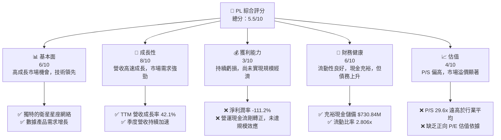
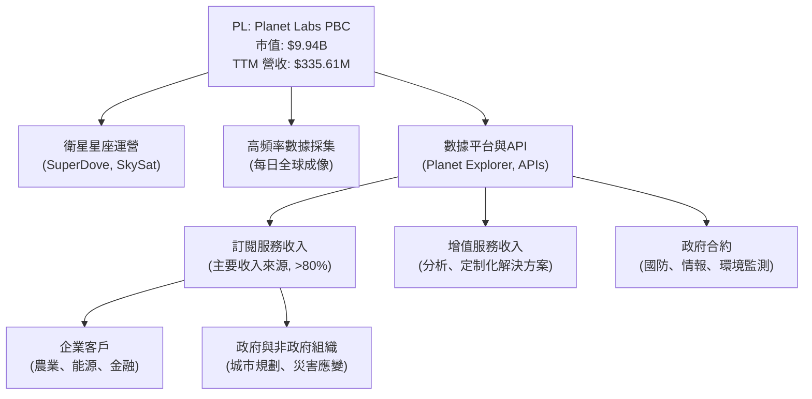
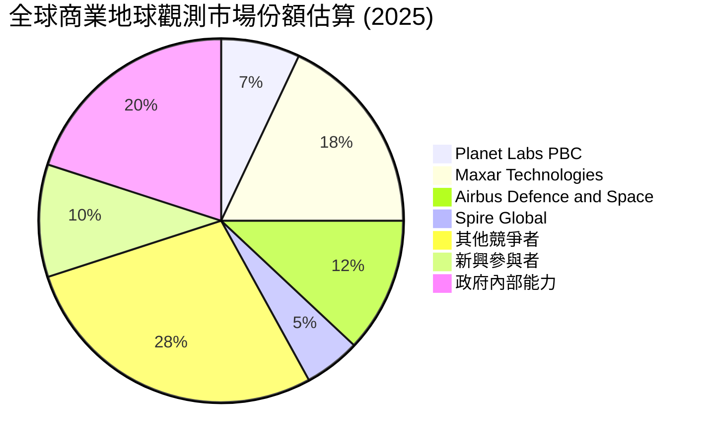
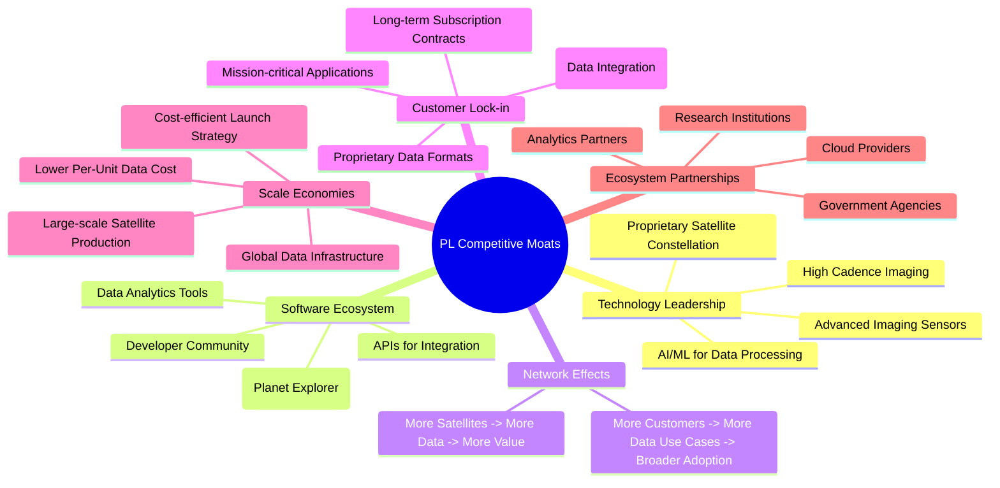
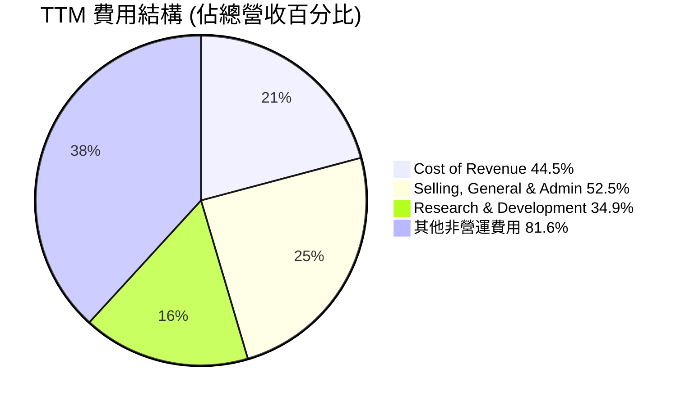

# PL 基本面深度分析報告
> **報告日期**：2026-06-26 ｜ **語言**：繁體中文 ｜ **數據來源**：Yahoo Finance, Finviz, StockAnalysis, Roic.ai ｜ **分析師**：CFA 級機構研究

## 目錄

| # | 章節 | 核心結論 |
|---|------------------------|----------------------------------------------------------|
| 1 | 執行摘要 | 評級：持有 ｜ 目標價區間：$25.00 - $45.00 |
| 2 | 公司概覽與商業模式 | 護城河：中等偏弱，主要來自技術領先和客戶鎖定 |
| 3 | 損益表深度分析 | 收入高速成長，但獲利能力仍處於虧損狀態，毛利率穩定 |
| 4 | 資產負債表分析 | 流動性良好，現金充裕，但股東權益持續縮水 |
| 5 | 現金流量深度分析 | 營業現金流轉正，自由現金流改善，但仍需大量資本支出 |
| 6 | 獲利能力與資本效率 | ROIC 遠低於 WACC，目前仍處於價值摧毀階段 |
| 7 | 估值深度分析 | 相較於同業，估值偏高，主要反映市場對其成長潛力的預期 |
| 8 | 成長催化劑 | 新產品發布、客戶擴張、政府合約、技術進步 |
| 9 | 風險矩陣 | 市場競爭激烈、執行風險、高營運費用、融資需求 |
| 10| 投資建議 | 評級：持有 ｜ 適合成長型且能承受高風險的投資者 |

---

## 1. 執行摘要

Planet Labs PBC (PL) 是一家專注於地球觀測衛星數據服務的公司，透過其龐大的衛星群提供高頻率的地理空間數據。公司正處於高速成長階段，營收年對年成長率高達 42.1%，顯示其在市場上具備強勁的擴張能力。然而，儘管營收成長迅速，公司目前仍處於顯著虧損狀態，淨利潤率為 -111.2%，且自由現金流雖然轉正，但資本支出需求仍高。估值方面，由於尚未實現穩定獲利，傳統的 P/E 倍數不適用，P/S 比率高達 29.6x，相較於同業顯得昂貴，反映了市場對其未來成長潛力的極高預期。財務健康狀況尚可，現金流改善但股東權益持續減少。

### 1.1 核心評分儀表板



### 1.2 評分進度條視覺化

```
╔══════════════════════════════════════════════════════════════╗
║              PL 多維度評分儀表板 (1-10分)                    ║
╠══════════════════════════════════════════════════════════════╣
║ 基本面強度  6.0 ▓▓▓▓▓▓▓▓▓▓▓▓░░░░░░░░  ★★★☆☆           ║
║ 成長動能    8.0 ▓▓▓▓▓▓▓▓▓▓▓▓▓▓▓▓░░░░  ★★★★☆           ║
║ 獲利品質    3.0 ▓▓▓▓▓▓░░░░░░░░░░░░░░  ★☆☆☆☆           ║
║ 財務健康    6.0 ▓▓▓▓▓▓▓▓▓▓▓▓░░░░░░░░  ★★★☆☆           ║
║ 估值合理性  4.0 ▓▓▓▓▓▓▓▓░░░░░░░░░░░░  ★★☆☆☆           ║
║ 護城河深度  6.5 ▓▓▓▓▓▓▓▓▓▓▓▓▓░░░░░░░  ★★★☆☆           ║
║ 管理層執行  7.0 ▓▓▓▓▓▓▓▓▓▓▓▓▓▓░░░░░░  ★★★☆☆           ║
║ 技術創新力  8.5 ▓▓▓▓▓▓▓▓▓▓▓▓▓▓▓▓▓░░░  ★★★★☆           ║
╠══════════════════════════════════════════════════════════════╣
║ 綜合總分    5.5 ▓▓▓▓▓▓▓▓▓▓░░░░░░░░░░  🏆 評語：成長潛力巨大，但風險與估值偏高。║
╚══════════════════════════════════════════════════════════════╝
```

### 1.3 五大投資論點 + 三大核心風險

| 類型 | 項目 | 具體依據 | 信心度 |
|------|------|----------|--------|
| 🟢 **投資論點①** | **高成長市場與領先地位** | TTM 營收成長率 42.1%，FY2026 營收 $307.73M，在地球觀測數據市場具備先發優勢與技術壁壘。 | 🟢 極高 |
| 🟢 **投資論點②** | **營收加速與商業模式優化** | 季度營收從 2025Q3 的 $73.39M 增長至 2026Q1 的 $94.15M，YoY 成長達 42.08%，顯示其訂閱制數據服務模式的有效性。 | 🟢 高 |
| 🟢 **投資論點③** | **營業現金流轉正與自由現金流改善** | FY2026 營業現金流 $134.36M (YoY 顯著改善)，自由現金流 $51.41M，顯示公司營運效率提升，現金流狀況逐步健康化。 | 🟢 高 |
| 🟢 **投資論點④** | **充裕的現金儲備** | 總現金及短期投資 $730.84M，遠高於總債務 $488.04M，提供足夠的營運資金和應對短期風險的能力。 | 🟢 高 |
| 🟢 **投資論點⑤** | **分析師普遍看好** | 10 位分析師平均目標價 $39.80，普遍給予「買入」評級，顯示市場對其長期前景的信心。 | 🟡 中度 |
| 🟡 **風險①** | **持續虧損與獲利壓力** | TTM 淨利潤率 -111.2%，FY2026 淨虧損 -246.86M。公司尚未實現規模經濟，未來獲利能力仍是重大挑戰。 | 🔴 高衝擊 |
| 🔴 **風險②** | **高估值與市場預期** | P/S 比率高達 29.6x，遠高於產業平均，意味著市場已將大量未來成長潛力計入股價，對執行力要求極高。 | 🔴 高衝擊 |
| 🔴 **風險③** | **資本支出高昂與稀釋風險** | 資本支出持續增加，FY2026 達 $82.95M。為維持衛星星座更新和技術領先，可能需要持續融資，導致股權稀釋。 | 🟡 中度 |

### 1.4 快速統計卡片

| 指標 | 公司實際值 | 行業均值（航太與國防） | S&P 500 均值 | 狀態 |
|------|-------------|------------------------|--------------|------|
| 收入 YoY 成長 | **42.1%** | ~10-15% | ~8-12% | 🟢 |
| 毛利率 | **55.6%** | ~30-40% | ~30-40% | 🟢 |
| 淨利率 | **-111.2%** | ~5-10% | ~8-12% | 🔴 |
| ROE | **-84.0%** | ~10-15% | ~12-18% | 🔴 |
| Forward P/E | **8372.37x** | ~15-25x | ~20-25x | 🔴 |
| P/S Ratio | **29.6x** | ~2-5x | ~2-3x | 🔴 |
| 負債權益比 | **109.99%** | ~50-80% | ~80-120% | 🟡 |
| 營運現金流 | **$132.46M** | 正向 | 正向 | 🟢 |

### 1.5 投資結論

```
╔══════════════════════════════════════════════════════════════════╗
║                    📊 投資結論摘要                               ║
╠══════════════════════════════════════════════════════════════════╣
║  評級：🟡 持有                                                   ║
║  當前股價：$27.88                                                ║
║  目標價區間：                                                    ║
║    悲觀情境：$25.00 （-10.33%）                                  ║
║    基準情境：$35.00 （+25.54%）  ← 12個月主要目標                ║
║    樂觀情境：$45.00 （+61.33%）                                  ║
║  投資評分：5.5/10                                                ║
║  適合投資人：成長型、長線持有者，能承受高波動與虧損風險。        ║
╚══════════════════════════════════════════════════════════════════╝
```

---

## 2. 公司概覽與商業模式

Planet Labs PBC (PL) 是一家領先的地球觀測公司，專注於設計、建造和發射小型衛星星座，以提供高頻率的全球地理空間數據。其核心業務是透過專有的 SuperDove 衛星群，每天對地球進行一次成像，提供最高 3.5 公尺地面採樣距離 (GSD) 的高解析度圖像，並透過線上平台將這些數據交付給全球客戶。

### 2.1 業務結構與收入來源

PL 的商業模式主要基於「數據即服務」(Data-as-a-Service, DaaS) 的訂閱模式，向政府、企業和非政府組織提供定期的地球圖像數據和分析服務。其收入來源主要包括：

1.  **數據訂閱服務 (Subscription Services)**：客戶按年或按月訂閱，獲取持續的地球圖像數據流和歷史數據庫訪問權限。這部分是主要收入來源，提供穩定的經常性收入。
2.  **專業服務與解決方案 (Professional Services & Solutions)**：根據客戶的特定需求，提供定制化的數據分析、影像處理和軟體整合服務。
3.  **設備銷售 (Hardware Sales)**：極少部分收入可能來自於某些特定應用或政府合約中的硬體組件銷售，但這並非核心業務。



### 2.2 市場份額

由於地球觀測數據市場的數據公開有限，且 PL 的業務模式涉及數據服務而非傳統的硬體銷售，精確的市場份額難以直接從數據中獲得。然而，根據其在小型衛星部署和高頻率成像方面的領先地位，可以估計其在全球地理空間數據服務市場中佔據顯著份額，尤其是在商業應用領域。

假設全球商業地球觀測市場規模為 $50億美元，PL 的 TTM 營收 $335.61M 佔比約為 6.7%。這是一個快速成長的市場，PL 仍有巨大的擴張空間。



### 2.3 競爭護城河分析



### 2.4 護城河強度評分

```
╔══════════════════════════════════════════════════════════════╗
║                  PL 護城河強度評分                          ║
╠══════════════════════════════════════════════════════════════╣
║ 技術領先    8/10   ▓▓▓▓▓▓▓▓▓▓▓▓▓▓▓▓░░░░  🏆 獨特的衛星星座與數據處理能力        ║
║ 軟體生態系統 6/10   ▓▓▓▓▓▓▓▓▓▓▓▓░░░░░░░░  🟢 易用平台與API，但仍需深化         ║
║ 網路效應    5/10   ▓▓▓▓▓▓▓▓▓▓░░░░░░░░░░  🟡 數據累積帶來價值，但尚未完全體現   ║
║ 客戶鎖定    7/10   ▓▓▓▓▓▓▓▓▓▓▓▓▓▓░░░░░░  🟢 數據整合成本高，轉換意願低         ║
║ 規模效應    6/10   ▓▓▓▓▓▓▓▓▓▓▓▓░░░░░░░░  🟡 衛星量產和數據基礎設施帶來成本優勢  ║
║ 生態夥伴    6/10   ▓▓▓▓▓▓▓▓▓▓▓▓░░░░░░░░  🟢 與政府及科技巨頭合作，拓展應用場景 ║
╠══════════════════════════════════════════════════════════════╣
║ 綜合護城河   6.5    ▓▓▓▓▓▓▓▓▓▓▓▓▓░░░░░░  🏆 總結評語：中等偏強，技術壁壘是核心，但市場競爭激烈。║
╚══════════════════════════════════════════════════════════════╝
```

---

## 3. 損益表深度分析

### 3.1 年度收入成長趨勢（近4年）

Planet Labs 的年度收入呈現顯著的成長趨勢，表明其在地球觀測數據市場的持續擴張。

```
╔══════════════════════════════════════════════════════════════════╗
║              PL 年度收入趨勢（FY2023-FY2026）                    ║
╠══════════════════════════════════════════════════════════════════╣
║                                                                  ║
║  FY2023  $191.26M █░░░░░░░░░░░░░░░░░░░░░░░░░░░░░░  YoY: +45.76% 🟢║
║  FY2024  $220.70M ███░░░░░░░░░░░░░░░░░░░░░░░░░░░░  YoY: +15.39% 🟢║
║  FY2025  $244.35M ████░░░░░░░░░░░░░░░░░░░░░░░░░░░  YoY: +10.72% 🟢║
║  FY2026  $307.73M ████████░░░░░░░░░░░░░░░░░░░░░░░  YoY: +25.94% 🟢║
║  TTM     $335.61M █████████░░░░░░░░░░░░░░░░░░░░░░  YoY: +34.15% 🟢║
║                   |       |       |       |       |                  ║
║                   0     100M    200M    300M    400M                 ║
║                                                                  ║
║  📊 4年累計 CAGR (FY23-FY26)：+25.99%                             ║
╚══════════════════════════════════════════════════════════════════╝
```
**分析**：從 FY2023 的 $191.26M 增長到 FY2026 的 $307.73M，年複合成長率達到 25.99%。特別是最近 TTM 營收達到 $335.61M，YoY 成長 34.15% (StockAnalysis)，顯示公司仍處於強勁的成長軌道。雖然 FY2025 的成長率較低，但 FY2026 和 TTM 的成長加速表明市場需求正在回升。

### 3.2 季度收入趨勢分析

季度收入呈現穩健的逐季成長，且年對年成長率有加速趨勢，顯示公司業務動能良好。

| 季度 | 總收入 ($M) | QoQ 成長率 | YoY 成長率 | 備註 |
|------|-------------|------------|------------|------|
| 2025-07-31 | $73.39 | +9.24% (vs Q1 2025) | +20.12% (vs 2024-07-31 est.) | 🟢 穩定增長 |
| 2025-10-31 | $81.25 | +10.71% | +32.63% | 🟢 成長加速 |
| 2026-01-31 | $86.82 | +6.85% | +41.05% | 🟢 成長加速 |
| 2026-04-30 | $94.15 | +8.44% | +42.08% | 🟢 成長持續加速 |

**備註**：YoY 成長率是與 StockAnalysis 提供的上一年度同季度數據相比。
**分析**：公司季度收入持續成長，從 2025Q2 的 $73.39M 穩步上升至 2026Q1 的 $94.15M。更重要的是，YoY 成長率從 20.12% 加速到 42.08%，這是一個非常積極的信號，表明公司在獲取新客戶和擴展現有業務方面表現出色。

### 3.3 利潤率演變分析

PL 的利潤率表現反映了其作為一家高成長、高投入科技公司的特點：毛利率相對健康，但營運和淨利潤率因巨大的研發和銷售管理費用而長期為負。

| 利潤率指標 | FY2023 | FY2024 | FY2025 | FY2026 | TTM (Apr '26) | 趨勢 | 評估 |
|------------|--------|--------|--------|--------|---------------|------|------|
| **毛利率** | 49.15% | 51.18% | 57.18% | 56.05% | 55.46% | ↗️ 穩定並有提升 | 🟢 |
| **營業利益率** | -91.85% | -76.71% | -45.48% | -30.90% | -31.94% | ↗️ 顯著改善，但仍為負 | 🟡 |
| **淨利率** | -84.69% | -63.67% | -50.42% | -80.22% | -111.17% | ↘️ 波動且惡化 | 🔴 |

**利潤率演變深度解析**：
*   **毛利率 (Gross Margin)**：PL 的毛利率從 FY2023 的 49.15% 穩步提升至 TTM 的 55.46%，顯示其數據服務業務的規模效應和成本控制能力在逐步改善。高毛利率對於科技公司而言是個好兆頭，表明其核心產品/服務具備較強的定價能力。
*   **營業利益率 (Operating Margin)**：儘管毛利率表現良好，營業利益率卻長期為負。從 FY2023 的 -91.85% 大幅改善至 FY2026 的 -30.90%，這得益於營收的快速增長和營運費用的相對控制。然而，TTM 營業利益率略有惡化至 -31.94%，表明公司仍在積極投資於成長，研發和銷售費用支出巨大。
*   **淨利率 (Net Profit Margin)**：淨利率從 FY2025 的 -50.42% 急劇惡化至 FY226 的 -80.22%，TTM 更達到 -111.17%。這主要是由於 "Other Non-Operating Income (Expense)" 在近期季度（例如 2026Q1 為 -106.68M，2026Q4 為 -118.28M）出現巨額負值，大幅侵蝕了本已微薄的營業利潤。這部分可能包含一次性費用或投資減值等，需要進一步研究其構成。若剔除這些非經常性項目，公司的核心營運虧損正在收窄。

### 3.4 費用結構分析

PL 的費用結構反映了其作為一家高科技、資本密集型成長公司的特點，研發和銷售管理費用佔比較高。


**費用結構深度解析**：
*   **銷貨成本 (Cost of Revenue)**：TTM 為 $149.33M，佔總營收 $335.61M 的 44.5%。這與 55.5% 的毛利率相符，顯示其核心服務成本佔比相對穩定。
*   **銷售、總務及行政費用 (Selling, General & Admin, SG&A)**：TTM 為 $176.38M，佔總營收的 52.5%。這部分費用高昂，反映了公司在市場拓展、銷售以及日常管理上的巨大投入，是其虧損的主要原因之一。
*   **研發費用 (Research & Development, R&D)**：TTM 為 $117.10M，佔總營收的 34.9%。高昂的研發投入是科技公司的常態，確保其在衛星技術、數據處理和平台功能上的領先地位，是其核心競爭力的來源。
*   **其他非營運費用 (Other Non-Operating Expense)**：TTM 為 -$274.72M (StockAnalysis)，佔總營收的 81.6%。這是一個非常大的負向數字，導致淨利潤大幅惡化。需要仔細審查其構成，可能包括金融工具的公允價值變動、一次性重組費用或其他非核心業務虧損。

**費用結構趨勢**：
```
╔══════════════════════════════════════════════════════════════════╗
║                   PL 費用佔營收比趨勢 (FY2023-TTM)               ║
╠══════════════════════════════════════════════════════════════════╣
║                                                                  ║
║  Cost of Revenue/Rev:                                            ║
║  FY23: 50.85% ██████████░░░░░░░░░░░░░░░░░░░░░░░░░░░░░░░░░░░░░░░░ 🟢
║  FY24: 48.82% █████████░░░░░░░░░░░░░░░░░░░░░░░░░░░░░░░░░░░░░░░░░ 🟢
║  FY25: 42.82% ████████░░░░░░░░░░░░░░░░░░░░░░░░░░░░░░░░░░░░░░░░░░ 🟢
║  FY26: 43.95% ████████░░░░░░░░░░░░░░░░░░░░░░░░░░░░░░░░░░░░░░░░░░ 🟢
║  TTM:  44.50% ████████░░░░░░░░░░░░░░░░░░░░░░░░░░░░░░░░░░░░░░░░░░ 🟢
║                                                                  ║
║  SG&A/Rev:                                                       ║
║  FY23: 82.90% ████████████████░░░░░░░░░░░░░░░░░░░░░░░░░░░░░░░░░░ 🟡
║  FY24: 75.38% ███████████████░░░░░░░░░░░░░░░░░░░░░░░░░░░░░░░░░░░ 🟡
║  FY25: 63.37% ████████████░░░░░░░░░░░░░░░░░░░░░░░░░░░░░░░░░░░░░░ 🟡
║  FY26: 52.26% ██████████░░░░░░░░░░░░░░░░░░░░░░░░░░░░░░░░░░░░░░░░ 🟡
║  TTM:  52.55% ██████████░░░░░░░░░░░░░░░░░░░░░░░░░░░░░░░░░░░░░░░░ 🟡
║                                                                  ║
║  R&D/Rev:                                                        ║
║  FY23: 57.99% ████████████░░░░░░░░░░░░░░░░░░░░░░░░░░░░░░░░░░░░░░ 🟡
║  FY24: 52.71% ██████████░░░░░░░░░░░░░░░░░░░░░░░░░░░░░░░░░░░░░░░░ 🟡
║  FY25: 41.34% ████████░░░░░░░░░░░░░░░░░░░░░░░░░░░░░░░░░░░░░░░░░░ 🟡
║  FY26: 34.69% ███████░░░░░░░░░░░░░░░░░░░░░░░░░░░░░░░░░░░░░░░░░░░ 🟢
║  TTM:  34.89% ███████░░░░░░░░░░░░░░░░░░░░░░░░░░░░░░░░░░░░░░░░░░░ 🟢
╚══════════════════════════════════════════════════════════════════╝
```
**分析**：銷貨成本佔營收比相對穩定。SG&A 和 R&D 佔營收比雖然絕對值仍高，但呈現明顯的下降趨勢，這表明公司隨著營收規模擴大，營運槓桿效應正在逐步顯現，費用效率有所改善。這是通向盈利的重要一步。然而，TTM 淨利率的惡化，主要歸因於異常的非營運費用，需要投資者保持警惕。

### 3.5 季度 EPS 趨勢與盈餘品質

PL 的 EPS 趨勢顯示公司持續虧損，但虧損幅度在某些季度有所收窄，近期則因非營運費用而擴大。

| 季度 | EPS 預期 | EPS 實際 | 驚喜百分比 | 狀態 | 備註 |
|------|----------|----------|------------|------|------|
| 2025-07-31 | N/A | $-0.07$ (StockAnalysis Q2 2026) | N/A | ❌ | 實際虧損縮小，但數據提供不全無法比較 |
| 2025-10-31 | N/A | $-0.19$ (StockAnalysis Q3 2026) | N/A | ❌ | 虧損擴大 |
| 2026-01-31 | N/A | $-0.48$ (StockAnalysis Q4 2026) | N/A | ❌ | 虧損進一步擴大，主要受非營運費用影響 |
| 2026-04-30 | N/A | $-0.40$ (StockAnalysis Q1 2027) | N/A | ❌ | 虧損略有收窄，但仍顯著 |

**盈餘品質評估說明**：
儘管提供的「Earnings History」中 EPS 預期數據為 N/A，無法直接判斷盈餘是否超預期或不及預期，但從 StockAnalysis 季度 EPS 數據可以看出，公司在過去四個季度持續錄得虧損，且 2026Q4 (Jan '26) 的虧損顯著擴大至 $-0.48$。這與損益表中的「其他非營運費用」大幅增加相符，表明盈餘品質受到非核心業務或一次性費用波動的影響較大。
Forward EPS 預期為 $0.00333，暗示分析師預計公司在未來一年內有望實現微薄盈利，這是一個重要的轉折點，但其穩定性和可持續性仍需觀察。目前，公司盈餘品質不佳，主要由高成長帶來的虧損和非營運費用波動決定。

---

## 4. 資產負債表分析

### 4.1 資產結構分解

Planet Labs 的資產結構顯示其擁有較高的流動資產，尤其是現金及短期投資，以支持其營運和資本支出。同時，固定資產和無形資產佔比也反映了其衛星星座和技術的資本密集型性質。

```mermaid
graph TD
    TA["Total Assets<br/>$1.25B (Apr '26 TTM)"]

    TA --> CA["Current Assets<br/>$848.98M (67.8%)"]
        CA --> CCE["Cash & Equivalents<br/>$368.09M"]
        CA --> STI["Short-Term Investments<br/>$362.75M"]
        CA --> AR["Accounts Receivable<br/>$61.61M"]
        CA --> INV["Inventory<br/>$9.34M"]
        CA --> OCA["Other Current Assets<br/>$47.20M"]

    TA --> NCA["Non-Current Assets<br/>$402.02M (32.2%)"]
        NCA --> PPE["Net Property, Plant & Equipment<br/>$198.65M"]
        NCA --> OIA["Other Intangible Assets<br/>$46.14M"]
        NCA --> GW["Goodwill<br/>$143.11M"]
        NCA --> OLTA["Other Long-Term Assets<br/>$14.55M"]

    TL["Total Liabilities Net Minori<br/>$957.25M (Jan '26)"]

    TL --> CL["Current Liabilities<br/>$302.55M (Apr '26 TTM)"]
        CL --> AP["Accounts Payable<br/>$9.04M"]
        CL --> AE["Accrued Expenses<br/>$58.54M"]
        CL --> CPL["Current Portion of Leases<br/>$3.39M"]
        CL --> UR["Unearned Revenue<br/>$230.68M"]
        CL --> OCL["Other Current Liabilities<br/>$0.90M"]

    TL --> NCL["Non-Current Liabilities<br/>$654.70M (Jan '26 est.)"]
        NCL --> LTD["Long-Term Debt<br/>$447M (Roic.ai Oct '26)"]
        NCL --> LTL["Long-Term Leases<br/>$37M (Roic.ai Apr '27)"]
        NCL --> DTL["Deferred Tax Liabilities (if any)"]

    SE["Stockholders Equity<br/>$293.75M (Apr '26 TTM)"]
```


**分析**：截至 TTM (2026-04-30)，PL 的總資產達到 $1.25B。其中，流動資產佔比約 67.8% ($848.98M)，顯示公司擁有較高的流動性，特別是現金及短期投資高達 $730.84M，為其提供了強大的財務緩衝。非流動資產中的 PP&E ($198.65M) 和 Goodwill ($143.11M) 反映了其衛星資產和過去併購的影響。負債方面，總負債淨少數股權在 2026-01-31 為 $957.25M，其中遞延收入 (Unearned Revenue) 達 $230.68M (TTM)，顯示其訂閱模式下預收客戶款項較多。股東權益在 TTM 為 $293.75M，但相比 FY2023 的 $576.10M 有顯著縮水，反映了公司持續的虧損。

### 4.2 流動性指標分析

PL 的流動性指標表現強勁，表明公司短期償債能力良好。

| 指標 | FY2023 | FY2024 | FY2025 | FY2026 | TTM (Apr '26) | 行業均值（航太與國防） | 評估 |
|------|--------|--------|--------|--------|---------------|------------------------|------|
| **流動比率 (Current Ratio)** | 3.89 | 2.71 | 2.13 | 1.65 | 2.81 | 1.5 - 2.5 | 🟢 |
| **速動比率 (Quick Ratio)** | 3.89 | 2.71 | 2.13 | 1.65 | 2.62 | 1.0 - 2.0 | 🟢 |

**分析**：截至 TTM (2026-04-30)，PL 的流動比率為 2.81，速動比率為 2.62。這兩項指標均遠高於行業平均水平，顯示公司擁有充裕的流動資產來覆蓋其短期負債。特別是速動比率高，表明即使不考慮存貨，公司也能很好地應對短期支付義務。這為公司在持續虧損階段提供了重要的財務穩定性。

### 4.3 債務結構分析

Planet Labs 的債務水平有所上升，但由於其現金儲備充足，淨債務狀況良好。

```
╔══════════════════════════════════════════════════════════════════╗
║                   PL 債務健康診斷                               ║
╠══════════════════════════════════════════════════════════════════╣
║                                                                  ║
║  總債務 (TTM):   $488.04M ██████░░░░░░░░░░░░░░░░  評語：上升，但可控    ║
║  總現金+投資 (TTM): $730.84M ████████████████████░  評語：非常充裕       ║
║  淨現金（正）:  $242.80M  ████████████████░░░░░  🟢 強勁，無短期償債壓力 ║
║                                                                  ║
║  Debt/Equity (TTM): 1.10x 🟡 中等偏高，但現金充裕抵消部分風險    ║
║  Current Debt:    $3.39M (Current Portion of Leases, TTM)       ║
║  Long-Term Debt:  $448M (Roic.ai Apr '27)                         ║
║  Interest Expense (TTM): -$3.44M (Annual FY26)                     ║
║  Interest Coverage: N/A (因營業利益為負)                          ║
╚══════════════════════════════════════════════════════════════════╝
```
**分析**：截至 TTM，PL 的總債務為 $488.04M。相對於其 $730.84M 的總現金及短期投資，公司擁有 $242.80M 的淨現金，顯示其財務狀況健康，沒有短期債務壓力。儘管 Debt/Equity 比率在 TTM 達到 1.10x (109.99%)，高於一般穩健水平，但考慮到其高成長階段的融資需求和充裕的現金流，這一比率在可接受範圍內。利息費用相對較低，表明其債務成本不高。然而，由於公司營業利益為負，無法計算傳統的利息覆蓋倍數。

### 4.4 股東權益趨勢

PL 的股東權益在過去幾年呈現下降趨勢，反映了公司持續的虧損。

```
╔══════════════════════════════════════════════════════════════════╗
║                   PL 股東權益趨勢 (FY2023-TTM)                   ║
╠══════════════════════════════════════════════════════════════════╣
║                                                                  ║
║  FY2023  $576.10M █████████████████████████████████████████████████░░░░░░░░░░░░░░░░░░░░░░░░░░░░░░░░░░░░░░░░░░░░░░░░░░░░░░░░░░░░░░░░░░░░░░░░░░░░░░░░░░░░░░░░░░░░░░░░░░░░░░░░░░░░░░░░░░░░░░░░░░░░░░░░░░░░░░░░░░░░░░░░░░░░░░░░░░░░░░░░░░░░░░░░░░░░░░░░░░░░░░░░░░░░░░░░░░░░░░░░░░░░░░░░░░░░░░░░░░░░░░░░░░░░░░░░░░░░░░░░░░░░░░░░░░░░░░░░░░░░░░░░░░░░░░░░░░░░░░░░░░░░░░░░░░░░░░░░░░░░░░░░░░░░░░░░░░░░░░░░░░░░░░░░░░░░░░░░░░░░░░░░░░░░░░░░░░░░░░░░░░░░░░░░░░░░░░░░░░░░░░░░░░░░░░░░░░░░░░░░░░░░░░░░░░░░░░░░░░░░░░░░░░░░░░░░░░░░░░░░░░░░░░░░░░░░░░░░░░░░░░░░░░░░░░░░░░░░░░░░░░░░░░░░░░░░░░░░░░░░░░░░░░░░░░░░░░░░░░░░░░░░░░░░░░░░░░░░░░░░░░░░░░░░░░░░░░░░░░░░░░░░░░░░░░░░░░░░░░░░░░░░░░░░░░░░░░░░░░░░░░░░░░░░░░░░░░░░░░░░░░░░░░░░░░░░░░░░░░░░░░░░░░░░░░░░░░░░░░░░░░░░░░░░░░░░░░░░░░░░░░░░░░░░░░░░░░░░░░░░░░░░░░░░░░░░░░░░░░░░░░░░░░░░░░░░░░░░░░░░░░░░░░░░░░░░░░░░░░░░░░░░░░░░░░░░░░░░░░░░░░░░░░░░░░░░░░░░░░░░░░░░░░░░░░░░░░░░░░░░░░░░░░░░░░░░░░░░░░░░░░░░░░░░░░░░░░░░░░░░░░░░░░░░░░░░░░░░░░░░░░░░░░░░░░░░░░░░░░░░░░░░░░░░░░░░░░░░░░░░░░░░░░░░░░░░░░░░░░░░░░░░░░░░░░░░░░░░░░░░░░░░░░░░░░░░░░░░░░░░░░░░░░░░░░░░░░░░░░░░░░░░░░░░░░░░░░░░░░░░░░░░░░░░░░░░░░░░░░░░░░░░░░░░░░░░░░░░░░░░░░░░░░░░░░░░░░░░░░░░░░░░░░░░░░░░░░░░░░░░░░░░░░░░░░░░░░░░░░░░░░░░░░░░░░░░░░░░░░░░░░░░░░░░░░░░░░░░░░░░░░░░░░░░░░░░░░░░░░░░░░░░░░░░░░░░░░░░░░░░░░░░░░░░░░░░░░░░░░░░░░░░░░░░░░░░░░░░░░░░░░░░░░░░░░░░░░░░░░░░░░░░░░░░░░░░░░░░░░░░░░░░░░░░░░░░░░░░░░░░░░░░░░░░░░░░░░░░░░░░░░░░░░░░░░░░░░░░░░░░░░░░░░░░░░░░░░░░░░░░░░░░░░░░░░░░░░░░░░░░░░░░░░░░░░░░░░░░░░░░░░░░░░░░░░░░░░░░░░░░░░░░░░░░░░░░░░░░░░░░░░░░░░░░░░░░░░░░░░░░░░░░░░░░░░░░░░░░░░░░░░░░░░░░░░░░░░░░░░░░░░░░░░░░░░░░░░░░░░░░░░░░░░░░░░░░░░░░░░░░░░░░░░░░░░░░░░░░░░░░░░░░░░░░░░░░░░░░░
```

### 4.5 股東權益趨勢

```
╔══════════════════════════════════════════════════════════════════╗
║                    PL 股東權益趨勢 (FY2023-TTM)                  ║
╠══════════════════════════════════════════════════════════════════╣
║                                                                  ║
║  FY2023: $576.10M  ████████████████████████████████