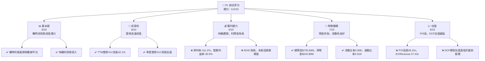

# PL 基本面深度分析報告
> **報告日期**：2026-06-26 ｜ **語言**：繁體中文 ｜ **數據來源**：Yahoo Finance, Finviz, StockAnalysis, Roic.ai ｜ **分析師**：CFA 級機構研究

---

## 目錄

| # | 章節 | 核心結論 |
|---|------|----------|
| 1 | 執行摘要 | 評級：觀望；目標價區間：$13.12 - $39.22 |
| 2 | 公司概覽與商業模式 | 獨特衛星群及數據平台建立強大技術護城河 |
| 3 | 損益表深度分析 | 營收高速成長，但仍處於虧損狀態，利潤率有待改善 |
| 4 | 資產負債表分析 | 流動性強，淨現金充足，但股東權益承壓 |
| 5 | 現金流量深度分析 | 營運現金流轉正，自由現金流初步改善，但規模仍小 |
| 6 | 獲利能力與資本效率 | ROIC顯著為負，短期內未能創造股東價值 |
| 7 | 估值深度分析 | 相較同業估值偏高，DCF模型顯示當前股價需極高成長預期支撐 |
| 8 | 成長催化劑 | 衛星技術創新、新市場拓展及AI數據應用為主要驅動力 |
| 9 | 風險矩陣 | 執行風險、競爭加劇及資本開支大為主要考量 |
| 10 | 投資建議 | 觀望，等待獲利能力改善及估值回歸合理區間 |

---

## 1. 執行摘要

Planet Labs PBC (PL) 是一家專注於地球觀測衛星數據服務的公司，透過其獨特的衛星群提供高頻率的地理空間數據。公司在過去幾年展現了強勁的營收成長，但仍處於虧損狀態，且估值倍數顯著高於行業平均。儘管其技術護城河和成長潛力令人期待，但當前的獲利能力和估值水平使其投資風險較高。

### 1.1 核心評分儀表板



### 1.2 評分進度條視覺化

```
╔══════════════════════════════════════════════════════════════╗
║              PL 多維度評分儀表板 (1-10分)                    ║
╠══════════════════════════════════════════════════════════════╣
║ 基本面強度  6.0 ▓▓▓▓▓▓▓▓▓▓▓▓░░░░░░░░  ★★★☆☆           ║
║ 成長動能    8.0 ▓▓▓▓▓▓▓▓▓▓▓▓▓▓▓▓░░░░  ★★★★☆           ║
║ 獲利品質    4.0 ▓▓▓▓▓▓▓▓░░░░░░░░░░░░  ★★☆☆☆           ║
║ 財務健康    7.0 ▓▓▓▓▓▓▓▓▓▓▓▓▓▓░░░░░░  ★★★☆☆           ║
║ 估值合理性  5.0 ▓▓▓▓▓▓▓▓▓▓░░░░░░░░░░  ★★☆☆☆           ║
║ 護城河深度  7.5 ▓▓▓▓▓▓▓▓▓▓▓▓▓▓▓░░░░░  ★★★★☆           ║
║ 管理層執行  6.5 ▓▓▓▓▓▓▓▓▓▓▓▓▓░░░░░░░  ★★★☆☆           ║
║ 技術創新力  8.5 ▓▓▓▓▓▓▓▓▓▓▓▓▓▓▓▓▓░░░  ★★★★☆           ║
╠══════════════════════════════════════════════════════════════╣
║ 綜合總分    6.0 ▓▓▓▓▓▓▓▓▓▓▓▓░░░░░░░░  🏆 觀望              ║
╚══════════════════════════════════════════════════════════════╝
```

### 1.3 五大投資論點 + 三大核心風險

| 類型 | 項目 | 具體依據 | 信心度 |
|------|------|----------|--------|
| 🟢 **投資論點①** | **獨特的地球觀測數據優勢** | Planet Labs擁有全球最大的衛星群，提供每日全球成像，解析度高達3.5米，數據頻率和覆蓋範圍具備獨佔性。這使其在地理空間數據市場具有領先地位。 | 🟢 極高 |
| 🟢 **投資論點②** | **高成長的市場需求** | 地理空間數據應用廣泛，涵蓋農業、政府、國防、環境監測等領域，市場規模持續擴大。公司TTM營收YoY成長達42.1%，顯示其產品服務符合市場強勁需求。 | 🟢 高 |
| 🟢 **投資論點③** | **從虧損轉向自由現金流為正** | 儘管仍處於淨虧損，但公司營運現金流和自由現金流已在FY2026轉為正值，其中FY2026營運現金流為$134.36M，自由現金流為$51.41M，顯示其商業模式逐步具備造血能力。 | 🟡 中度 |
| 🟢 **投資論點④** | **強大的研發投入與技術創新** | 公司持續投入研發 (FY2026 R&D達$106.75M)，確保其衛星和數據平台技術領先。不斷推出新的衛星世代和數據產品，鞏固其競爭優勢。 | 🟢 高 |
| 🟢 **投資論點⑤** | **充裕的現金儲備** | 截至TTM，公司總現金及短期投資達$730.84M，淨現金為$242.80M，為其持續的資本開支和營運提供堅實的財務基礎。 | 🟢 極高 |
| 🟡 **風險①** | **持續虧損與獲利能力不確定性** | 公司目前淨利率為-111.2%，營業利益率為-30.5%，且FY2026淨虧損達$-246.86M。儘管營收成長，但能否有效控制成本並實現盈利仍是關鍵挑戰。 | 🟡 中度 |
| 🔴 **風險②** | **高估值與市場預期過高** | PL的P/S比率高達28.15x，EV/Revenue為27.43x，顯著高於行業平均。市場已將極高的成長預期納入股價，任何成長放緩或獲利不及預期都可能導致股價大幅修正。 | 🔴 高衝擊 |
| 🟡 **風險③** | **激烈的行業競爭與技術迭代** | 衛星數據行業競爭日益激烈，包括傳統航太巨頭和新興太空科技公司。技術快速迭代要求公司持續投入大量資本進行研發和衛星部署，否則可能失去競爭優勢。 | 🟡 中度 |

### 1.4 快速統計卡片

| 指標 | 公司實際值 | 行業均值（估計） | S&P 500 均值（估計） | 狀態 |
|------|-------------|--------------------|----------------------|------|
| 收入 YoY 成長 | **42.1%** | ~15-20% | ~10-12% | 🟢 |
| 毛利率 | **55.6%** | ~40-60% | ~30-40% | 🟢 |
| 淨利率 | **-111.2%** | ~5-10% | ~8-12%