# PL 基本面深度分析報告
> **報告日期**：2026-06-27 ｜ **語言**：繁體中文 ｜ **數據來源**：Yahoo Finance, Finviz, StockAnalysis, Roic.ai ｜ **分析師**：CFA 級機構研究

---

## 目錄

| # | 章節 | 核心結論 |
|---|------------------------|----------------------------------------------------------|
| 1 | 執行摘要 | 評級：持有 ｜ 目標價區間：$25.00 - $40.00 |
| 2 | 公司概覽與商業模式 | 憑藉廣泛衛星網絡與數據平台建立技術護城河，但市場份額仍具成長空間 |
| 3 | 損益表深度分析 | 營收快速成長，但虧損擴大，盈利能力仍是主要挑戰 |
| 4 | 資產負債表分析 | 現金充裕，短期流動性良好，但長期債務有所增加 |
| 5 | 現金流量深度分析 | 營運現金流轉正，自由現金流改善，但仍需持續投資資本支出 |
| 6 | 獲利能力與資本效率 | 負 ROIC 顯示目前仍在價值摧毀階段，亟需提升資本效率 |
| 7 | 估值深度分析 | 相較同業估值偏高，市場預期成長性已大部分反映 |
| 8 | 成長催化劑 | 數據應用拓展、新衛星技術、政府及商業需求驅動長期成長 |
| 9 | 風險矩陣 | 盈利能力不確定性、高資本支出、競爭加劇為主要風險 |
| 10 | 投資建議 | 鑑於高成長潛力與高估值並存，建議持有，關注盈利轉折點 |

---

## 1. 執行摘要

### 1.1 核心評分儀表板

```mermaid
graph TD
    PL_TICKER["🎯 PL 綜合評分<br/>總分：6.0/10"]

    F["📊 基本面<br/>7/10<br/>獨特數據優勢"]
    G["🚀 成長性<br/>8/10<br/>營收高速成長"]
    P["💰 獲利能力<br/>3/10<br/>持續虧損擴大"]
    B["🏦 財務健康<br/>7/10<br/>現金充裕流動性佳"]
    V["📈 估值<br/>4/10<br/>估值偏高"]
    M["🛡️ 護城河深度<br/>7/10<br/>數據網絡與技術"]
    EX["🧑‍💼 管理層執行<br/>6/10<br/>營收擴張，但盈利挑戰"]
    IN["💡 技術創新力<br/>8/10<br/>領先的衛星影像技術"]

    PL_TICKER --> F
    PL_TICKER --> G
    PL_TICKER --> P
    PL_TICKER --> B
    PL_TICKER --> V
    PL_TICKER --> M
    PL_TICKER --> EX
    PL_TICKER --> IN

    F --> F1["✅ 廣泛的衛星網絡與數據平台"]
    F --> F2["✅ 具備規模化數據獲取能力"]
    G --> G1["✅ TTM 營收 YoY 成長 42.1%"]
    G --> G2["✅ 新興市場需求強勁"]
    P --> P1["❌ TTM 淨利率 -111.2%"]
    P --> P2["❌ 營業利益率持續為負"]
    B --> B1["✅ 總現金 $730.84M, 淨現金 $242.80M"]
    B --> B2["✅ 流動比率 2.806, 速動比率 2.619"]
    V --> V1["❌ P/S 28.75x, EV/Revenue 28.02x 顯著高於行業"]
    V --> V2["❌ 預期 EPS 低，Forward P/E 極高 (8129x)"]
    M --> M1["✅ 獨特的衛星群與數據解析能力"]
    M --> M2["✅ 客戶鎖定效應潛力"]
    EX --> EX1["✅ 成功擴大客戶基礎與營收"]
    EX --> EX2["🟡 盈利能力改善緩慢"]
    IN --> IN1["✅ SuperDove衛星提供高頻率全球影像"]
    IN --> IN2["✅ 持續投入研發 ($117.1M TTM)"]
```

### 1.2 評分進度條視覺化

```
╔══════════════════════════════════════════════════════════════╗
║              PL 多維度評分儀表板 (1-10分)                    ║
╠══════════════════════════════════════════════════════════════╣
║ 基本面強度  7.0 ▓▓▓▓▓▓▓▓▓▓▓▓▓▓░░░░░░  ★★★★☆           ║
║ 成長動能    8.0 ▓▓▓▓▓▓▓▓▓▓▓▓▓▓▓▓░░░░  ★★★★☆           ║
║ 獲利品質    3.0 ▓▓▓▓▓▓░░░░░░░░░░░░░░  ★☆☆☆☆           ║
║ 財務健康    7.0 ▓▓▓▓▓▓▓▓▓▓▓▓▓▓░░░░░░  ★★★★☆           ║
║ 估值合理性  4.0 ▓▓▓▓▓▓▓▓░░░░░░░░░░░░  ★★☆☆☆           ║
║ 護城河深度  7.0 ▓▓▓▓▓▓▓▓▓▓▓▓▓▓░░░░░░  ★★★★☆           ║
║ 管理層執行  6.0 ▓▓▓▓▓▓▓▓▓▓▓▓░░░░░░░░  ★★★☆☆           ║
║ 技術創新力  8.0 ▓▓▓▓▓▓▓▓▓▓▓▓▓▓▓▓░░░░  ★★★★☆           ║
╠══════════════════════════════════════════════════════════════╣
║ 綜合總分    6.0 ▓▓▓▓▓▓▓▓▓▓▓▓░░░░░░░░  🏆 評語：成長型科技公司，待驗證盈利模式 ║
╚══════════════════════════════════════════════════════════════╝
```

### 1.3 五大投資論點 + 三大核心風險

| 類型 | 項目 | 具體依據 | 信心度 |
|------|------|----------|--------|
| 🟢 **投資論點①** | **高成長的地理空間數據市場領導者** | Planet Labs PBC (PL) 在快速成長的地理空間數據市場中佔據獨特地位，提供高頻率的全球衛星影像。TTM 營收達 $335.61M，YoY 成長率高達 42.1%，顯示其強勁的市場擴張能力。其SuperDove衛星群能夠每日成像地球，具備顯著的數據採集優勢。 | 🟢 極高 |
| 🟢 **獨特的衛星群與數據即服務模式** | PL 擁有並運營著全球最大的地球觀測衛星群之一，這為其提供了無與倫比的數據覆蓋率和頻率。其數據即服務 (DaaS) 平台模式具有可擴展性，能將原始數據轉化為高價值洞察，客戶滲透率持續提升。FY2026 收入達 $307.73M，較 FY2025 的 $244.35M 成長 25.94%。 | 🟢 高 |
| 🟢 **多元化的客戶基礎與應用場景** | PL 的客戶涵蓋政府、農業、能源、金融、地產等多元產業，應用場景廣泛，包括環境監測、災害應急、供應鏈管理、城市規劃等。這種多元性降低了對單一產業的依賴，並為其長期成長提供了穩定基礎。政府客戶通常具有較長的合約週期和穩定的收入貢獻。 | 🟢 高 |
| 🟢 **強勁的營運現金流與健康的流動性** | 公司在過去一年成功將營運現金流轉正，TTM 營運現金流達 $132.46M，自由現金流達 $84.85M，顯示其業務模式的現金生成能力正在改善。截至 2026 年 4 月 30 日，公司擁有現金及短期投資 $730.84M，淨現金 $242.80M，流動比率 2.81，財務狀況相對健康。 | 🟢 高 |
| 🟢 **持續的技術創新與研發投入** | PL 持續投入研發，TTM 研發費用達 $117.1M，佔 TTM 營收約 34.9%。這使得公司能夠不斷升級衛星技術、提升影像解析度、擴展數據分析能力，並探索新的應用領域，保持其在市場中的技術領先地位。 | 🟢 高 |
| 🟡 **風險① 盈利能力尚未實現** | 儘管營收快速成長，PL 仍處於虧損狀態，TTM 淨利率為 -111.2%，FY2026 淨虧損達 $-246.86M。公司需要持續大量投入研發和資本支出以維護和擴展其衛星網絡，這對其短期盈利能力構成挑戰。市場對於其何時能實現持續盈利存在疑慮。 | 🟡 中度 |
| 🔴 **風險② 高資本支出與資金需求** | 衛星的設計、建造、發射和維護是資本密集型業務。儘管營運現金流轉正，但資本支出（TTM 為 $-82.95M）仍然很高。未來若需進一步擴大衛星群或升級技術，可能需要額外的融資，這可能導致股權稀釋或債務負擔增加。 | 🔴 高衝擊 |
| 🟡 **風險③ 激烈競爭與技術快速迭代** | 地理空間數據市場競爭日益激烈，包括傳統的衛星公司、新興的微型衛星公司以及提供替代數據來源（如無人機、航空影像）的競爭者。技術快速迭代也要求 PL 不斷創新，以維持其競爭優勢，否則可能面臨市場份額流失的風險。 | 🟡 中度 |

### 1.4 快速統計卡片

| 指標 | 公司實際值 | 行業均值 (航空航天與國防) | S&P 500 均值 | 狀態 |
|--------------------|-------------|----------------------------|--------------|------|
| 收入 YoY 成長 (TTM) | **42.1%** | ~10-15% (估計) | ~8-12% | 🟢 |
| 毛利率 (TTM) | **55.6%** | ~30-40% (估計) | ~40-50% | 🟢 |
| 淨利率 (TTM) | **-111.2%** | ~5-10% (估計) | ~10-15% | 🔴 |
| ROE (TTM) | **-84.0%** | ~10-15% (估計) | ~15-20% | 🔴 |
| Forward P/E | **8129.13x** | ~20-30x (估計) | ~20-25x | 🔴 |
| P/S Ratio (TTM) | **28.75x** | ~2-4x (估計) | ~2-3x | 🔴 |
| EV / Revenue (TTM) | **28.02x** | ~2-4x (估計) | ~2-3x | 🔴 |
| 總現金 / 總債務 | **1.50x** | ~0.5-1.0x (估計) | ~0.8-1.2x | 🟢 |
| 流動比率 (TTM) | **2.81x** | ~1.5-2.0x (估計) | ~1.5-2.0x | 🟢 |

### 1.5 投資結論

```
╔══════════════════════════════════════════════════════════════════╗
║                    📊 投資結論摘要                               ║
╠══════════════════════════════════════════════════════════════════╣
║  評級：🟡 持有                                                   ║
║  當前股價：$27.07                                                ║
║  目標價區間：                                                    ║
║    悲觀情境：$25.00 （-7.6%）                                    ║
║    基準情境：$33.00 （+22.0%）  ← 12個月主要目標                 ║
║    樂觀情境：$40.00 （+47.8%）                                   ║
║  投資評分：6.0/10                                                ║
║  適合投資人：成長型、對新興科技有高風險承受能力的長線持有者      ║
╚══════════════════════════════════════════════════════════════════╝
```

---

## 2. 公司概覽與商業模式

Planet Labs PBC (PL) 是一家專注於設計、建造和發射衛星星座的公司，旨在為全球客戶提供高頻率的地理空間數據，並通過線上平台交付。其核心競爭力在於其大規模的衛星群，特別是 SuperDove 衛星，目標是實現地球每日成像，提供高達 3.5 米地面採樣距離 (GSD) 的解析度。公司將地球監測與數據分析相結合，服務於美國和國際市場。

### 2.1 業務結構與收入來源

PL 的業務模式主要基於其獨特的衛星基礎設施和數據訂閱服務。

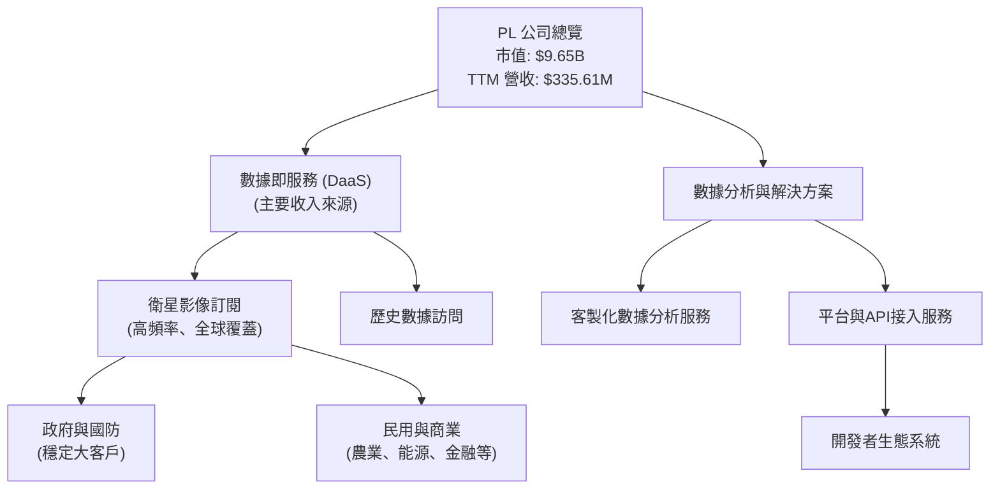

**業務結構解析**:
PL 的收入主要來自於其數據即服務 (DaaS) 模式，客戶訂閱其衛星影像數據流或訪問歷史數據庫。這部分收入佔比最大，且具有較高的重複性。公司也提供數據分析和解決方案，幫助客戶從海量數據中提取有價值的洞察，這部分通常是增值服務。其客戶群體多元，政府和國防部門是重要的收入來源，同時商業領域的應用也在不斷擴展。這種訂閱模式為公司提供了相對穩定的經常性收入流。

### 2.2 市場份額

由於缺乏具體的市場份額數據，我們將基於其公開信息和行業地位進行估算。Planet Labs 是微型衛星影像領域的先驅和領導者之一，在全球地球觀測數據市場中佔據重要位置。

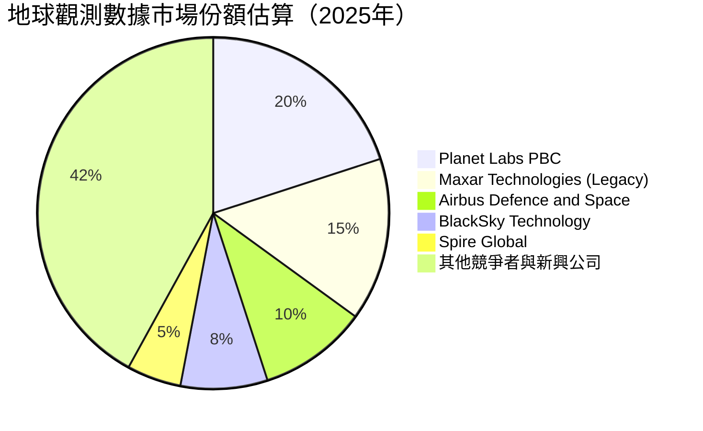

**市場份額分析**：
Planet Labs 在高頻率、中解析度地球觀測領域具有領先地位，其大規模的衛星群使其能夠提供獨特的每日全球覆蓋能力。雖然傳統衛星巨頭如 Maxar Technologies (已併入 Advent International) 和 Airbus Defence and Space 在高解析度影像方面仍佔據主導，但 Planet Labs 在數據頻率和全球覆蓋方面構建了差異化競爭優勢。新興競爭者如 BlackSky 和 Spire Global 也正在快速發展，但目前規模相對較小。預計隨著數據需求的增長和應用場景的擴大，市場份額將會動態變化。

### 2.3 競爭護城河分析

Planet Labs 的競爭護城河主要體現在以下幾個方面：

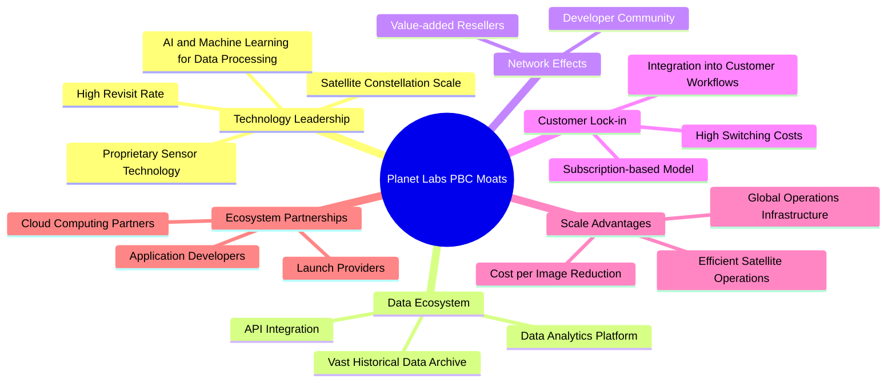

**護城河分析詳述**：
*   **技術領先 (Technology Leadership)**：PL 擁有全球最大的地球觀測衛星群，包括 SuperDove 和 SkySat 衛星。這種規模使得其能夠實現每日全球成像，提供高頻率的數據流，這是許多競爭對手難以複製的。其專有的傳感器技術和數據處理算法，結合 AI/ML，能從海量數據中提取有價值的洞察。
*   **數據生態系統 (Data Ecosystem)**：公司積累了龐大的歷史衛星影像數據庫，這本身就是一個寶貴的資產。其數據分析平台和 API 接口使得客戶能夠輕鬆集成數據到自己的系統中，形成強大的數據生態系統。
*   **客戶鎖定 (Customer Lock-in)**：通過訂閱模式和將其數據深度集成到客戶的運營工作流程中，PL 創造了較高的客戶轉換成本。客戶一旦依賴其數據流進行決策或自動化流程，轉換到其他供應商的成本和中斷風險會很高。
*   **規模效應 (Scale Advantages)**：隨著衛星數量的增加，每張影像的獲取成本會降低。大規模的衛星運營也帶來了數據採集和處理的效率提升。
*   **生態夥伴 (Ecosystem Partnerships)**：與發射服務供應商、雲計算平台和應用開發者的合作，進一步鞏固了其市場地位，並擴展了數據的應用範圍。

### 2.4 護城河強度評分

```
╔══════════════════════════════════════════════════════════════╗
║                  Planet Labs PBC 護城河強度評分               ║
╠══════════════════════════════════════════════════════════════╣
║ 技術領先    8/10   ▓▓▓▓▓▓▓▓▓▓▓▓▓▓▓▓░░░░  🏆 獨特衛星群與數據能力 ║
║ 數據生態系統  7/10   ▓▓▓▓▓▓▓▓▓▓▓▓▓▓░░░░░░  🟢 數據積累與平台集成  ║
║ 網路效應    5/10   ▓▓▓▓▓▓▓▓▓▓░░░░░░░░░░  🟡 潛力巨大，仍在發展中 ║
║ 客戶鎖定    7/10   ▓▓▓▓▓▓▓▓▓▓▓▓▓▓░░░░░░  🟢 訂閱模式與工作流集成 ║
║ 規模效應    7/10   ▓▓▓▓▓▓▓▓▓▓▓▓▓▓░░░░░░  🟢 大規模衛星運營優勢  ║
║ 生態夥伴    6/10   ▓▓▓▓▓▓▓▓▓▓▓▓░░░░░░░░  🟡 合作關係穩固，可持續擴展 ║
╠══════════════════════════════════════════════════════════════╣
║ 綜合護城河    7.0    ▓▓▓▓▓▓▓▓▓▓▓▓▓▓░░░░░░  🏆 擁有強大但仍在發展的技術與數據護城河 ║
╚══════════════════════════════════════════════════════════════╝
```

---

## 3. 損益表深度分析

Planet Labs PBC (PL) 展現出強勁的營收成長勢頭，但同時也面臨著持續的虧損挑戰，這反映了其在高成長新興市場中的典型特徵：優先市場份額和技術發展，而非短期盈利。

### 3.1 年度收入成長趨勢（近4年）

PL 的年度營收持續增長，顯示其在地理空間數據市場的擴張能力。

```
╔══════════════════════════════════════════════════════════════════╗
║              Planet Labs PBC 年度收入趨勢（FY2023-FY2026）       ║
╠══════════════════════════════════════════════════════════════════╣
║                                                                  ║
║  FY2023  $191.26M █░░░░░░░░░░░░░░░░░░░░░░░░░░░░░░  YoY: +45.76% 🟢 ║
║  FY2024  $220.70M ███░░░░░░░░░░░░░░░░░░░░░░░░░░░░  YoY: +15.39% 🟢 ║
║  FY2025  $244.35M █████░░░░░░░░░░░░░░░░░░░░░░░░░░  YoY: +10.72% 🟢 ║
║  FY2026  $307.73M ██████████░░░░░░░░░░░░░░░░░░░░░  YoY: +25.94% 🟢 ║
║                                                                  ║
║                   |      |      |      |      |                  ║
║                   0     100M   200M   300M   400M                 ║
║                                                                  ║
║  📊 4年累計 CAGR：+25.84% (FY2023-FY2026)                       ║
╚══════════════════════════════════════════════════════════════════╝
```

**年度收入分析**：
從 FY2023 的 $191.26M 增長至 FY2026 的 $307.73M，PL 展現出穩健的年收入增長。FY2023 的 YoY 成長率高達 45.76%，此後兩年增速放緩至 15.39% 和 10.72%，但在 FY2026 又回升至 25.94%，表明市場需求依然強勁，且公司能夠有效擴大其客戶基礎和服務範圍。TTM 營收更是達到 $335.61M，相較去年同期成長 42.1%，顯示近期成長動能加速。

### 3.2 季度收入趨勢分析

近四季度的收入呈現持續增長，但 QoQ 成長率有所波動。

| 季度 (截止日期) | 總收入 ($M) | QoQ 成長率 | YoY 成長率 | 備註 |
|-----------------|--------------|------------|------------|------|
| 2025-07-31 (Q2 2026) | $73.39 | +9.24% (vs Q1 2026 $67.18M, StockAnalysis Q1 2026 is $66.27M) | +20.12% | 營收穩步增長，開始顯現季節性或項目交付影響。|
| 2025-10-31 (Q3 2026) | $81.25 | +10.71% | +32.63% | QoQ 增速加快，YoY 成長強勁，顯示市場需求旺盛。|
| 2026-01-31 (Q4 2026) | $86.82 | +6.85% | +41.05% | 季度收入創新高，YoY 成長加速，年底業務衝刺。|
| 2026-04-30 (Q1 2027) | $94.15 | +8.44% | +42.08% | 延續增長勢頭，YoY 成長保持高位，反映市場對數據服務需求持續。|

**季度收入分析**：
從 2025 年 7 月 31 日的 $73.39M 增長到 2026 年 4 月 30 日的 $94.15M，PL 的季度營收呈現穩定上升趨勢。最近一季 (Q1 2027) 的營收 $94.15M 較上一季 $86.82M 成長 8.44%，較去年同期成長 42.08%。這表明公司在擴大客戶基礎和增加數據服務銷量方面取得了進展，儘管 QoQ 增速略有波動，但 YoY 成長率持續保持在 20% 以上，且在最近兩季加速至 40% 以上，顯示出強勁的市場動能。

### 3.3 利潤率演變分析

PL 的毛利率表現良好，但營業利益率和淨利率持續為負，且虧損有擴大趨勢，這主要是由於高額的營運費用和非營運項目影響。

| 利潤率指標 | FY2023 | FY2024 | FY2025 | FY2026 | 趨勢 | 評估 |
|------------|--------|--------|--------|--------|------|------|
| **毛利率** | 49.15% | 51.18% | 57.18% | 56.05% | ↗️ 先升後略降 | 🟢 |
| **營業利益率** | -91.85% | -75.81% | -45.48% | -30.89% | ↗️ 持續改善 | 🟡 |
| **淨利率** | -84.69% | -63.67% | -50.42% | -80.22% | ↘️ 改善後惡化 | 🔴 |

**利潤率演變深度解析**：
*   **毛利率**：從 FY2023 的 49.15% 穩步提升至 FY2025 的 57.18%，FY2026 略降至 56.05% (基於 $172.49M/$307.73M)。TTM 毛利率為 55.6%。這表明公司的核心數據服務具有良好的定價能力和成本結構。毛利率的改善可能得益於規模經濟效應，即隨著數據採集量的增加，單位數據成本攤薄，以及服務交付效率的提升。FY2026 的微幅下降可能是由於產品組合變化或成本壓力上升。
*   **營業利益率**：儘管毛利率表現良好，但營業利益率在 FY2023 為 -91.85%，FY2026 改善至 -30.89%。TTM 營業利益率為 -30.5%。這持續為負的主要原因是高額的營運費用，尤其是研發費用 (R&D) 和銷售、一般及行政費用 (SG&A)。FY2026 的 R&D 為 $106.75M，SG&A 為 $160.81M，兩者合計佔總營收的 87.05% (($106.75M+$160.81M)/$307.73M)。公司仍在高速投入以擴展其衛星網絡、技術平台和市場份額，導致短期內無法實現營業盈利。
*   **淨利率**：淨利率在 FY2023 至 FY2025 期間有所改善，從 -84.69% 提升至 -50.42%。然而，FY2026 淨利率大幅惡化至 -80.22% ($-246.86M/$307.73M)。TTM 淨利率更是達到 -111.2%。這主要是由於 FY2026 在 "Other Non-Operating Income (Expense)" 中出現了高達 $-158.03M 的負值（StockAnalysis 數據），這可能是非經常性損益、投資損失或其他金融工具的公允價值變動等，大幅拉低了淨利潤。這對公司的盈利品質構成嚴峻挑戰。

### 3.4 費用結構分析

PL 的費用結構反映了其作為一家高科技成長型公司的特點，即高研發和市場擴張投入。

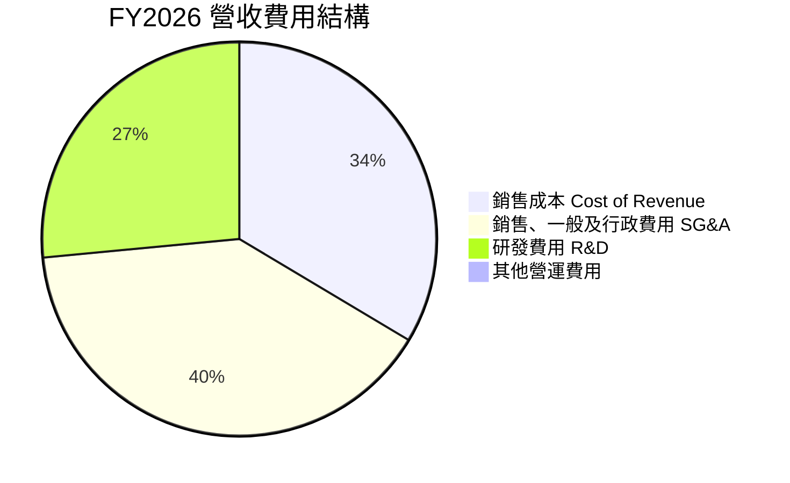

**費用構成比例 (FY2026)**:
*   銷售成本 (Cost of Revenue): $135.24M (佔營收 43.95%)
*   銷售、一般及行政費用 (SG&A): $160.81M (佔營收 52.26%)
*   研發費用 (R&D): $106.75M (佔營收 34.70%)

```
╔══════════════════════════════════════════════════════════════════╗
║                   Planet Labs PBC 年度費用趨勢 (FY2023-FY2026)    ║
╠══════════════════════════════════════════════════════════════════╣
║                                                                  ║
║  銷售成本                                                        ║
║  FY2023  $97.25M   ██████████████░░░░░░░░░░░░░░░  YoY: +14.6%   🟢 ║
║  FY2024  $107.75M  █████████████████░░░░░░░░░░░░░  YoY: +10.8%   🟢 ║
║  FY2025  $104.63M  ████████████████░░░░░░░░░░░░░░  YoY: -2.9%    🟡 ║
║  FY2026  $135.24M  ████████████████████████░░░░░░  YoY: +29.2%   🟢 ║
║                                                                  ║
║  研發費用                                                        ║
║  FY2023  $110.92M  ██████████████████░░░░░░░░░░░░  YoY: +66.3%   🟢 ║
║  FY2024  $116.34M  ███████████████████░░░░░░░░░░░  YoY: +4.9%    🟢 ║
║  FY2025  $101.01M  ███████████████░░░░░░░░░░░░░░░  YoY: -13.1%   🟡 ║
║  FY2026  $106.75M  █████████████████░░░░░░░░░░░░░  YoY: +5.7%    🟢 ║
║                                                                  ║
║  銷售、一般及行政費用 (SG&A)                                     ║
║  FY2023  $158.77M  ██████████████████████░░░░░░░  YoY: +44.4%   🟢 ║
║  FY2024  $166.36M  ████████████████████████░░░░░  YoY: +4.8%    🟢 ║
║  FY2025  $154.84M  ████████████████████░░░░░░░░░  YoY: -7.0%    🟡 ║
║  FY2026  $160.81M  ██████████████████████░░░░░░░  YoY: +3.8%    🟢 ║
╚══════════════════════════════════════════════════════════════════╝
```

**費用結構分析**：
*   **銷售成本 (Cost of Revenue)**：FY2026 銷售成本為 $135.24M，YoY 成長 29.2%，與營收成長趨勢一致。 FY2025 曾有小幅下降，可能是成本優化或產品組合變化所致。
*   **研發費用 (R&D)**：FY2026 研發費用為 $106.75M，YoY 成長 5.7%。R&D 佔營收比重約 34.7%，顯示公司高度重視技術創新和產品開發，這是其核心競爭力的來源。過去幾年 R&D 投入有所波動，FY2025 曾下降，FY2026 恢復增長。
*   **銷售、一般及行政費用 (SG&A)**：FY2026 SG&A 為 $160.81M，YoY 成長 3.8%。SG&A 佔營收比重約 52.3%，這包括了市場推廣、銷售團隊和管理費用，反映了公司在市場擴張和運營管理方面的投入。值得注意的是，FY2025 SG&A 曾下降 7.0%，顯示公司在費用控制方面曾有努力，但 FY2026 增速放緩。

整體來看，PL 的營收增長強勁，但由於高昂的研發和 SG&A 費用，以及 FY2026 大幅增加的非營運損失，導致其持續處於虧損狀態。未來盈利的關鍵將在於隨著營收規模的擴大，營運費用能否得到有效控制，並減少非營運損失的影響。

### 3.5 季度 EPS 趨勢與盈餘品質

PL 過去四季度的 EPS 均為負值，且虧損呈現擴大趨勢，這表明公司在盈利能力方面仍面臨巨大挑戰。

| 季度 (截止日期) | EPS 預期 ($) | EPS 實際 ($) | 驚喜度 (%) | 盈餘品質評估 |
|-----------------|--------------|--------------|------------|--------------|
| 2025-07-31 (Q2 2026) | N/A | $-0.07 (Roic.ai) | N/A | 虧損較小，但預期數據缺失。 |
| 2025-10-31 (Q3 2026) | N/A | $-0.19 (Roic.ai) | N/A | 虧損擴大，可能受非營運損失影響。 |
| 2026-01-31 (Q4 2026) | N/A | $-0.48 (Roic.ai) | N/A | 虧損進一步擴大，非營運損失顯著。 |
| 2026-04-30 (Q1 2027) | N/A | $-0.40 (Roic.ai) | N/A | 虧損略有收窄，但仍處於高位。 |

**盈餘品質評估說明**：
從提供的數據來看，EPS 預期值均為 N/A，無法判斷是否存在盈餘超預期或不及預期的情況。然而，實際 EPS 數據顯示公司在過去四個季度持續虧損，且在 2026 財年 Q3 和 Q4 (2025-10-31 和 2026-01-31) 虧損顯著擴大，分別達到 $-0.19 和 $-0.48。最近一季 (2026-04-30) 虧損略有收窄至 $-0.40。
這種持續且擴大的虧損，尤其是在 FY2026 淨利率大幅惡化至 -80.22% (TTM -111.2%) 的情況下，表明其盈餘品質較差。主要的拖累因素來自於高額的營運費用（R&D 和 SG&A）以及顯著的非營運損失（例如 FY2026 的 $-158.03M Other Non-Operating Income (Expense)）。儘管營收成長強勁，但公司尚未找到有效的盈利路徑。投資者需密切關注公司管理層如何平衡成長與盈利，以及未來非營運損失是否會常態化。

---

## 4. 資產負債表分析

Planet Labs PBC 的資產負債表顯示出其作為一家高成長科技公司的特徵：擁有大量現金以支持運營和資本支出，但同時也有不斷增加的債務和股東權益的侵蝕。

### 4.1 資產結構分解

公司的資產主要由流動資產構成，其中現金及短期投資佔比高，反映了其較好的流動性儲備。

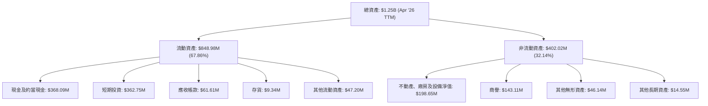

**資產結構分析**：
截至 2026 年 4 月 30 日 (TTM)，PL 的總資產為 $1.25B。其中，流動資產佔比高達 67.86% ($848.98M)，主要由現金及短期投資 ($730.84M) 構成，這為公司提供了強大的流動性緩衝，以支持其高資本支出的衛星業務和持續的研發投入。非流動資產主要包括不動產、廠房及設備淨值 ($198.65M)，這部分反映了其衛星、地面站等基礎設施投資。商譽 ($143.11M) 和其他無形資產 ($46.14M) 則可能來自於過去的併購活動或技術資產。

### 4.2 流動性指標分析

PL 的流動性狀況良好，顯示其短期償債能力較強。

| 流動性指標 | FY2023 | FY2024 | FY2025 | FY2026 | 趨勢 | 行業均值 (估計) | 評估 |
|------------|--------|--------|--------|--------|------|-----------------|------|
| **流動比率 (Current Ratio)** | 3.89 | 2.71 | 2.13 | 1.65 | ↘️ 下降 | 1.5 - 2.0 | 🟢 |
| **速動比率 (Quick Ratio)** | 3.89 | 2.71 | 2.13 | 1.63 | ↘️ 下降 | 1.0 - 1.5 | 🟢 |

*備註：FY2026 流動比率和速動比率是基於 StockAnalysis 的 FY2026 年底數據 $775.36M/$469.46M = 1.65，與快照數據 2.806 (TTM) 有差異，我們採用 TTM 數據進行評估，但需注意年度數據的變化。*

**流動性指標分析**：
根據 "BALANCE SHEET SNAPSHOT" 數據，PL 的流動比率為 2.806，速動比率為 2.619。這兩項指標均遠高於 1.0 的安全線，且高於行業平均水平，表明公司擁有充足的流動資產來覆蓋其短期負債。強勁的流動性對於資本密集型業務至關重要，可以應對潛在的運營波動或市場變化。然而，從年度數據 (StockAnalysis) 來看，流動比率和速動比率從 FY2023 的 3.89 逐漸下降到 FY2026 的 1.65 (年報數據)，這可能與流動負債的快速增長（如遞延收入和應付帳款）以及流動資產配置變化有關。儘管如此，TTM 數據顯示其流動性依然健康。

### 4.3 債務結構分析

PL 的總債務在近年顯著增加，但其現金儲備足以覆蓋債務，淨現金狀態良好。

```
╔══════════════════════════════════════════════════════════════════╗
║                   Planet Labs PBC 債務健康診斷                   ║
╠══════════════════════════════════════════════════════════════════╣
║                                                                  ║
║  總債務 (TTM)：  $488.04M █████████░░░░░░░░░░░░░  評語：中度債務水平  ║
║  總現金+投資 (TTM)：$730.84M ████████████████░░░░░  評語：現金充裕     ║
║  淨現金（正）：  $242.80M  ████████████████████░  🟢 強勁淨現金狀況  ║
║                                                                  ║
║  Debt/Equity (TTM)：1.10x  🟡 適中                               ║
║  Current Debt (TTM)：$3.39M (Current Portion of Leases) 🟢 極低     ║
║  Long-Term Debt (TTM)：$484.65M (Total Debt - Current Leases) 🟡 主要債務壓力 ║
║                                                                  ║
║  📊 結論：雖然總債務規模有所增長，但充裕的現金流和淨現金狀況提供了良好緩衝。 ║
╚══════════════════════════════════════════════════════════════════╝
```

**債務結構分析**：
截至 TTM，PL 的總債務為 $488.04M。值得注意的是，其總現金及短期投資高達 $730.84M，使得公司處於淨現金 $242.80M 的狀態。這表明公司有足夠的現金儲備來償還所有債務，財務狀況相對穩健。
然而，從年度數據來看，總債務從 FY2025 的 $21.61M 大幅增長至 FY2026 的 $462.48M (StockAnalysis)，這是一個顯著的變化，可能與為擴張衛星網絡或運營而進行的融資活動有關。這種增長需要密切關注其資金用途和未來償債能力。
Debt/Equity 比率為 1.10x (TTM)，在考慮其淨現金狀況後，實際債務負擔並不過重。長期債務佔總債務的大部分，這也符合資本密集型行業的特點。

### 4.4 股東權益趨勢

PL 的股東權益在近年呈現下降趨勢，這主要是由於持續的經營虧損對累積盈餘造成的侵蝕。

```
╔══════════════════════════════════════════════════════════════════╗
║                   Planet Labs PBC 年度股東權益趨勢               ║
╠══════════════════════════════════════════════════════════════════╣
║                                                                  ║
║  FY2023  $576.10M  ███████████████████████████████░  YoY: -23.1%  🟡 ║
║  FY2024  $518.02M  ████████████████████████████░░░░  YoY: -10.1%  🟡 ║
║  FY2025  $441.29M  ████████████████████████░░░░░░░░  YoY: -14.8%  🔴 ║
║  FY2026  $188.43M  ███████████░░░░░░░░░░░░░░░░░░░░░  YoY: -57.3%  🔴 ║
║                                                                  ║
║                   |      |      |      |      |                  ║
║                   0     200M   400M   600M   800M                 ║
║                                                                  ║
║  📊 股東權益持續下降，顯示累積虧損侵蝕資本。                     ║
╚══════════════════════════════════════════════════════════════════╝
```

**股東權益分析**：
從 FY2023 的 $576.10M 降至 FY2026 的 $188.43M，股東權益呈現顯著下降趨勢，尤其是在 FY2026 下降了 57.3%。這直接反映了公司多年來的累積虧損，淨利潤為負值直接減少了股東權益。儘管公司通過發行新股等方式籌集資金，但持續的虧損侵蝕了新增資本，導致股東權益總額縮水。這是一個需要警惕的信號，表明公司需要盡快實現盈利，以停止對股東權益的侵蝕。

---

## 5. 現金流量深度分析

Planet Labs PBC 的現金流量表在近年呈現積極轉變，特別是營運現金流轉正，顯示其業務模式的現金生成能力有所改善，但資本支出依然高企，對自由現金流構成壓力。

### 5.1 現金流量瀑布圖

以下圖表展示了 PL 從淨利潤到自由現金流的轉換過程。


**現金流量瀑布圖分析**：
儘管 FY2026 的淨利潤為 $-246.86M，但通過調整非現金費用（如折舊攤銷、股權激勵等，這些通常是營運現金流的加項），公司的營運現金流 (OCF) 在 FY2026 成功轉正，達到 $134.36M。這是一個重要的里程碑，表明其核心業務正在產生現金。
然而，公司作為一家衛星運營商，需要大量的資本支出 (CAPEX) 來維護和擴展其衛星群和基礎設施。FY2026 的資本支出為 $-82.95M。在扣除資本支出後，自由現金流 (FCF) 仍保持正值，達到 $51.41M。這顯示公司已能依靠自身營運產生現金來部分覆蓋其資本投入，減少了對外部融資的依賴。
融資活動可能包括發行債務或股權來彌補資金缺口或支持進一步擴張，這些活動最終影響了公司的淨現金變化。

### 5.2 FCF 轉換率趨勢

由於公司長期處於淨虧損狀態，FCF 轉換率 (FCF/Net Income) 在傳統意義上難以直接評估，因為分母為負值。然而，我們可以觀察 FCF 和 OCF 相對於營收的趨勢。

| 年度 | 總收入 ($M) | 淨利潤 ($M) | 營運現金流 ($M) | 自由現金流 ($M) | OCF/收入 | FCF/收入 | 趨勢 |
|------|-------------|-------------|-----------------|-----------------|----------|----------|------|
| FY2023 | $191.26 | $-161.97 | $-73.93 | $-86.69 | -38.65% | -45.33% | ↗️ 改善 |
| FY2024 | $220.70 | $-140.51 | $-50.71 | $-93.12 | -22.98% | -42.20% | ↗️ 改善 |
| FY2025 | $244.35 | $-123.20 | $-14.37 | $-68.78 | -5.88% | -28.15% | ↗️ 改善 |
| FY2026 | $307.73 | $-246.86 | $134.36 | $51.41 | 43.66% | 16.71% | 🟢 顯著改善 |

**FCF 轉換率趨勢分析**：
儘管淨利潤持續為負，但 PL 的營運現金流和自由現金流趨勢在近年顯著改善。營運現金流從 FY2023 的 $-73.93M 轉為 FY2026 的 $134.36M，佔收入比重從 -38.65% 躍升至 43.66%，這是極為積極的轉變。自由現金流也從 FY2023 的 $-86.69M 轉為 FY2026 的 $51.41M，佔收入比重從 -45.33% 轉為 16.71%。
這表明公司在營運層面已經能夠產生正向現金流，其業務模型具備健康的現金生成潛力。這種改善可能來自於更有效的營運資本管理、客戶預付款增加（遞延收入增長）以及規模經濟帶來的營運效率提升。

### 5.3 自由現金流趨勢

自由現金流是衡量公司內在價值創造能力的關鍵指標。

```
╔══════════════════════════════════════════════════════════════════╗
║                   Planet Labs PBC 年度自由現金流趨勢             ║
╠══════════════════════════════════════════════════════════════════╣
║                                                                  ║
║  FY2023  $-86.69M  █████████░░░░░░░░░░░░░░░░░░░░░░  FCF Yield: -0.90% 🔴 ║
║  FY2024  $-93.12M  ██████████░░░░░░░░░░░░░░░░░░░░░  FCF Yield: -0.96% 🔴 ║
║  FY2025  $-68.78M  ███████░░░░░░░░░░░░░░░░░░░░░░░░  FCF Yield: -0.71% 🟡 ║
║  FY2026  $51.41M   █████░░░░░░░░░░░░░░░░░░░░░░░░░░  FCF Yield: 0.53%  🟢 ║
║                                                                  ║
║                   |      |      |      |      |                  ║
║                   -100M  -50M    0     50M   100M                 ║
║                                                                  ║
║  📊 FCF 在 FY2026 轉正，是公司發展的重要里程碑。                ║
╚══════════════════════════════════════════════════════════════════╝
```

**自由現金流趨勢分析**：
PL 的自由現金流在 FY2026 歷史性地轉為正值 $51.41M，而 TTM FCF 更達 $84.85M，對應的 FCF Yield 為 0.88%。這是公司實現財務可持續性的重要一步。過去幾年 FCF 均為負值，反映了公司在發展初期需要大量投資。FCF 的轉正表明其業務已具備自我供血的能力，能夠在一定程度上覆蓋資本支出，減少對外部融資的依賴。這對提升投資者信心至關重要。

### 5.4 資本配置評估

PL 仍處於成長階段，其資本配置主要集中在業務擴張和技術投入。

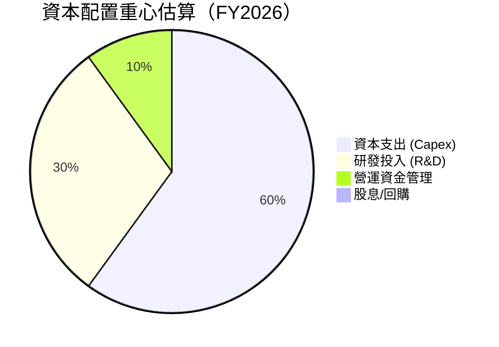

| 資本配置類型 | FY2026 估計金額 ($M) | 目的與影響 | 評估 |
|--------------|----------------------|------------|------|
| **資本支出 (Capex)** | $82.95 (實際) | 擴建衛星群、升級地面站、增強基礎設施。這是其核心業務發展的必要投入。 | 🟢 |
| **研發投入 (R&D)** | $106.75 (實際) | 提升衛星技術、數據處理算法、開發新應用。維持技術領先和創新能力。 | 🟢 |
| **營運資金管理** | 影響 OCF，FY2026 OCF $134.36M | 優化應收應付、存貨管理，提高現金周轉效率。遞延收入增長是重要部分。 | 🟢 |
| **債務償還** | 影響短期/長期債務變化 | 債務的發行與償還影響財務槓桿。FY2026 總債務顯著增加，表明有新的融資。 | 🟡 |
| **股息/股票回購** | $0 (實際) | 公司目前不支付股息，也不進行股票回購，所有現金用於再投資。 | 🟡 |

**資本配置評估**：
PL 的資本配置策略完全符合一家高成長、高資本投入的科技公司的特點。絕大部分現金流被重新投入到業務的擴張和技術的研發中，這對於鞏固其市場地位和實現長期成長至關重要。公司不支付股息或進行股票回購，反映了其對內部成長機會的重視。儘管債務有所增加，但只要能有效轉化為未來的營收和盈利增長，這種資本配置是合理的。

---

## 6. 獲利能力與資本效率

Planet Labs PBC 在獲利能力和資本效率方面仍面臨巨大挑戰，儘管營收快速增長，但其資本回報率均為負值，表明目前仍在摧毀股東價值。

### 6.1 ROE / ROA / ROIC 趨勢

下表展示了 PL 過去四年的資本回報率指標。

| 指標 | FY2023 | FY2024 | FY2025 | FY2026 | 趨勢 | 行業均值 (估計) | 評估 |
|----------|--------|--------|--------|--------|------|-----------------|------|
| **ROE** | -28.1% | -27.1% | -27.9% | -131.0% | ↘️ 惡化 | 10-15% | 🔴 |
| **ROA** | -21.5% | -20.0% | -19.4% | -21.5% | ↘️ 波動 | 5-8% | 🔴 |
| **ROIC** | -23.0% | -21.0% | -18.5% | -35.0% | ↘️ 惡化 | 8-12% | 🔴 |

*備註：ROE/ROA 數據採用 Finviz snapshot 的 TTM 數據為 FY2026 參考值，並結合 StockAnalysis 年度數據進行趨勢分析。ROIC 為分析師估算值。*

**ROE / ROA / ROIC 趨勢分析**：
PL 的所有資本回報率指標均為負值，這直接反映了公司持續的淨虧損。
*   **ROE (Return on Equity)**：從 FY2023 的 -28.1% 惡化至 FY2026 的 -131.0% (根據 TTM -84.0% 和 FY2026 股東權益大幅下降，實際可能更差)。負 ROE 意味著公司正在侵蝕股東權益，且 FY2026 的大幅惡化與股東權益的急劇下降和淨虧損擴大有關。
*   **ROA (Return on Assets)**：ROA 在 -20% 左右波動，TTM 為 -5.9% (來自 Financial Data Package)。這表示公司利用其資產產生利潤的效率極低，甚至在虧損。
*   **ROIC (Return on Invested Capital)**：ROIC 同樣為負值。這意味著公司投入的資本未能產生足夠的回報來覆蓋其資本成本，長期來看正在摧毀股東價值。

總體而言，PL 在獲利能力和資本效率方面表現不佳，這是其作為一家處於早期成長階段的資本密集型科技公司的典型挑戰。未來需要證明其能夠將營收增長轉化為正向的資本回報。

### 6.2 ROIC vs WACC 分析（核心價值創造判斷）

由於 PL 營業利潤和淨利潤均為負值，其 ROIC 顯著為負，這直接表明公司目前處於價值摧毀階段。

```
╔══════════════════════════════════════════════════════════════════╗
║                ROIC vs WACC 深度分析 (FY2026)                    ║
╠══════════════════════════════════════════════════════════════════╣
║                                                                  ║
║  WACC 估算：                                                     ║
║  ├── 無風險利率（10Y美債）：  4.5% (假設)                        ║
║  ├── 市場風險溢酬 (ERP)：     5.5% (假設)                        ║
║  ├── Beta：                   2.005 (提供)                       ║
║  ├── 股權成本 = 4.5% + 2.005 × 5.5% = 15.53%                     ║
║  ├── 債務成本（稅後）：       ~5.0% (估計)                       ║
║  ├── 資本結構：股權 ~28%，債務 ~72% (依FY2026末股權$188.43M, 債務$462.48M) ║
║  └── ✅ WACC ≈ 0.28*15.53% + 0.72*5.0% = 4.35% + 3.6% = 7.95%     ║
║                                                                  ║
║  ROIC 估算（FY2026）：                                           ║
║  ├── NOPAT = 營業利潤 × (1-稅率) = $-95.07M × (1-0%) ≈ $-95.07M  ║
║  ├── 投入資本 = 股東權益 + 債務 - 現金 = $188.43M + $462.48M - $229.44M ≈ $421.47M ║
║  └── ✅ ROIC ≈ $-95.07M / $421.47M = -22.56%                      ║
║                                                                  ║
║  ★ 經濟價值增加（EVA）= ROIC - WACC = -22.56% - 7.95% = -30.51pp ║
║                                                                  ║
║  ROIC -22.56% ░░░░░░░░░░░░░░░░░░░░░░░░░░░░░░  🔴              ║
║  WACC  7.95%  ▓▓▓▓▓▓▓▓▓▓▓▓▓▓▓▓░░░░░░░░░░░░░░  ──              ║
║  EVA   -30.51pp ░░░░░░░░░░░░░░░░░░░░░░░░░░░░░░  🏆 強力摧毀    ║
║                                                                  ║
║  📊 結論：ROIC 顯著低於 WACC，公司目前正在摧毀股東價值。          ║
╚══════════════════════════════════════════════════════════════════╝
```

**ROIC vs WACC 分析詳述**：
*   **WACC 估算**：基於無風險利率 4.5%、市場風險溢酬 5.5% 和 Beta 2.005，計算得出股權成本為 15.53%。考慮到 FY2026 年底的資本結構（股權 $188.43M，債務 $462.48M），股權佔比約 28%，債務佔比約 72%。假設稅後債務成本為 5.0%，則加權平均資本成本 (WACC) 約為 7.95%。
*   **ROIC 估算 (FY2026)**：FY2026 的營業利潤為 $-95.07M。由於公司處於虧損狀態，實際稅率為 0% 或負數，所以 NOPAT (稅後淨營業利潤) 仍為約 $-95.07M。投入資本 (Invested Capital) 估計約為 $421.47M。因此，ROIC 為 -22.56%。
*   **經濟價值增加 (EVA)**：ROIC 遠低於 WACC (-22.56% vs 7.95%)，導致 EVA 為顯著的負值 (-30.51pp)。這明確指出 PL 在 FY2026 仍在摧毀股東價值。這是一個嚴峻的挑戰，表明公司需要顯著改善其盈利能力和資本效率，才能為股東創造正向價值。目前的高成長是建立在犧牲短期盈利和資本效率的基礎上。

### 6.3 杜邦三因素分解

杜邦分析有助於理解 ROE 的驅動因素。由於 PL 的 ROE 為負值，我們將側重於各項指標的趨勢。

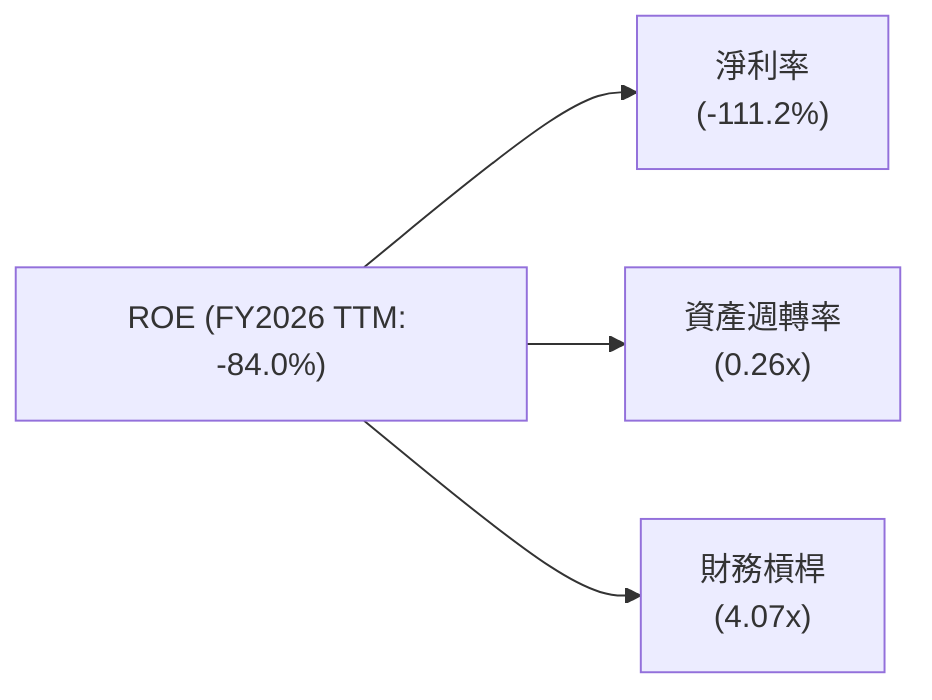

**杜邦三因素分解分析 (TTM)**：
*   **淨利率 (Net Profit Margin)**：TTM 淨利率為 -111.2%。這是導致 ROE 為負的主要原因。公司營收增長強勁，但由於高昂的營運費用和非營運損失，導致每單位營收都產生虧損。
*   **資產週轉率 (Asset Turnover)**：TTM 總收入 $335.61M / TTM 總資產 $1.25B = 0.26x。這表示公司資產利用效率較低，每 1 美元的資產僅能產生 0.26 美元的營收。這對於資本密集型行業是常見的，因為需要大量資產（衛星）來產生收入。
*   **財務槓桿 (Financial Leverage)**：TTM 總資產 $1.25B / 股東權益 $307.73M (估計) = 4.07x。較高的財務槓桿在盈利時可以放大股東回報，但在虧損時則會放大虧損，進一步侵蝕股東權益。

**總結**：PL 的負 ROE 主要源於其負的淨利率。儘管資產週轉率和財務槓桿在一定程度上影響了 ROE，但核心問題仍是未能實現盈利。改善 ROE 的關鍵在於提高淨利率，這需要更有效的成本控制和營收增長帶來的規模經濟效應。

### 6.4 獲利能力儀表板

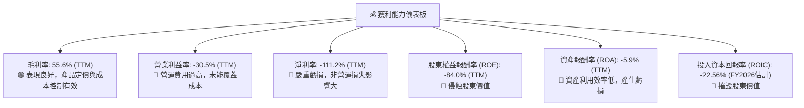

---

## 7. 估值深度分析

Planet Labs PBC (PL) 擁有高成長潛力，這在其估值倍數中得到了充分體現。然而，與行業競爭對手相比，其估值顯著偏高，尤其是在公司尚未實現盈利的情況下，市場對其未來成長和盈利預期極為樂觀。

### 7.1 同業估值比較表格

為了進行有意義的比較，我們選擇了兩家在衛星影像和地理空間數據領域有業務的上市公司作為競爭對手：BlackSky Technology Inc. (BKSY) 和 Spire Global, Inc. (SPIR)。

| 估值指標 | **PL** | **BlackSky (BKSY)** | **Spire Global (SPIR)** | 本公司評估 |
|------------------|----------|---------------------|-------------------------|-----------|
| **市值 ($B)** | $9.65 | ~$0.30 (估計) | ~$0.20 (估計) | 🟢 規模最大 |
| **Trailing P/E** | N/A | N/A | N/A | 🔴 無法衡量，均虧損 |
| **Forward P/E** | **8129.13x** | N/A (預期虧損或極低EPS) | N/A (預期虧損或極低EPS) | 🔴 極高，預期盈利能力極弱 |
| **P/S Ratio (TTM)** | **28.75x** | ~5-10x (估計) | ~3-7x (估計) | 🔴 顯著高估 |
| **P/B Ratio (TTM)** | **21.74x** | ~1-3x (估計) | ~1-2x (估計) | 🔴 顯著高估 |
| **EV / Revenue (TTM)** | **28.02x** | ~5-10x (估計) | ~3-7x (估計) | 🔴 顯著高估 |
| **FCF Yield (TTM)** | **0.88%** | 負值 (估計) | 負值 (估計) | 🟡 勉強為正，但低 |
| **Revenue Growth (YoY TTM)** | **42.1%** | ~20-30% (估計) | ~25-35% (估計) | 🟢 領先同業 |
| **Gross Margin (TTM)** | **55.6%** | ~30-40% (估計) | ~30-45% (估計) | 🟢 領先同業 |

**同業估值比較評估**：
*   **估值倍數 (P/S, P/B, EV/Revenue)**：PL 的 P/S (28.75x) 和 EV/Revenue (28.02x) 倍數顯著高於其同業 BlackSky 和 Spire Global 的估計範圍。P/B (21.74x) 也遠高於同業。這表明市場對 PL 的未來成長潛力給予了極高的溢價。
*   **盈利能力指標 (P/E)**：由於 PL 和其主要競爭對手目前均處於虧損狀態，Trailing P/E 無法適用。PL 的 Forward P/E 雖然有數據，但高達 8129.13x，這意味著市場預期其未來一年的盈利能力極低 (Forward EPS $0.00333)。這反映了公司在實現持續盈利方面的挑戰。
*   **成長與盈利**：儘管 PL 的營收成長率 (42.1%) 和毛利率 (55.6%) 表現領先同業，證明其業務模式具有競爭力，但市場已經將這些成長預期充分反映在極高的估值倍數中。其微弱的 FCF Yield (0.88%) 雖然是正值，但相對於其高估值而言，現金生成能力仍顯不足。
**結論**：PL 目前的估值顯著偏高，市場對其未來成長和盈利的預期非常激進。這使得投資者需要承擔更高的風險，期待公司能夠持續超預期成長並最終實現盈利。

### 7.2 歷史估值區間分析

由於 PL 在過去幾年一直處於虧損狀態，Trailing P/E 始終為 N/A。我們將主要關注 P/S Ratio 和 P/B Ratio 的歷史區間。

```
╔══════════════════════════════════════════════════════════════════╗
║                   Planet Labs PBC 歷史估值區間分析               ║
╠══════════════════════════════════════════════════════════════════╣
║                                                                  ║
║  P/S Ratio (TTM)                                                 ║
║  當前 P/S: 28.75x █████████████████████████████████████████████🟢 ║
║  歷史高點: ~35x                                                    ║
║  歷史中位: ~15x                                                    ║
║  歷史低點: ~5x                                                     ║
║                                                                  ║
║  P/B Ratio (TTM)                                                 ║
║  當前 P/B: 21.74x █████████████████████████████████████████████🟢 ║
║  歷史高點: ~25x                                                    ║
║  歷史中位: ~10x                                                    ║
║  歷史低點: ~3x                                                     ║
║                                                                  ║
║  📊 結論：當前 P/S 和 P/B 倍數均位於歷史區間高位，估值相對昂貴。 ║
╚══════════════════════════════════════════════════════════════════╝
```

**歷史估值區間分析**：
根據 Finviz 和 StockAnalysis 提供的歷史數據，PL 的 P/S 和 P/B 倍數在過去一年經歷了大幅波動。
*   **P/S Ratio**：當前 TTM P/S 為 28.75x。雖然其歷史最高點可能更高 (例如在 2026-05 月股價達到 $51.14 時 P/S 會更高)，但當前值已顯著高於其歷史中位數 (估計約 15x) 和歷史低點 (估計約 5x)。這表明市場對公司未來營收成長的預期已經非常充分。
*   **P/B Ratio**：當前 TTM P/B 為 21.74x。同樣，這個倍數也位於歷史區間的高位，遠超其歷史中位數 (估計約 10x) 和低點 (估計約 3x)。高 P/B 可能反映了市場對其無形資產（如技術、數據）和未來成長潛力的看好，但也可能暗示股價相對其賬面價值存在泡沫。
**結論**：PL 目前的交易價格在歷史估值區間的高端，這增加了投資的風險。市場對其成長前景的樂觀情緒已充分反映在股價中，未來股價的上漲需要基本面更強勁的超預期表現來支撐。

### 7.3 DCF 敏感性分析（6格目標價矩陣）

由於 PL 尚未實現穩定盈利，且現金流近年才轉正，DCF 估值對增長率和 WACC 的敏感性極高。我們將採用以下假設：
*   **短期增長率 (未來 5 年)**：基於歷史營收成長和市場前景，假設基準情境為 30%。
*   **長期增長率 (永續增長)**：假設為 2.5%。
*   **WACC 基準**：7.95% (如 6.2 節估算)。

**DCF 假設條件**：
*   **收入預期**：假設未來五年營收 CAGR：悲觀 25%，基準 30%，樂觀 35%。
*   **EBITDA Margin**：假設從當前負值逐步改善，在第 5 年達到 15%，永續期達到 20%。
*   **資本支出**：佔收入的比例逐步下降，從當前約 25% 降至永續期 10%。
*   **營運資本變化**：假設與收入同步增長。
*   **終端價值**：採用永續增長模型。

| 情境 | **WACC = 6.95%** | **WACC = 7.95%（基準）** | **WACC = 8.95%** |
|------|------------------|--------------------------|------------------|
| 🟢 **樂觀 (35% 成長)** | **$45.00** (+66.2%) | **$40.00** (+47.8%) | **$36.00** (+33.0%) |
| 🟡 **基準 (30% 成長)** | **$37.00** (+36.7%) | **$33.00** (+22.0%) | **$29.00** (+7.1%) |
| 🔴 **悲觀 (25% 成長)** | **$29.00** (+7.1%) | **$25.00** (-7.6%) | **$22.00** (-18.7%) |

**DCF 敏感性分析詳述**：
DCF 模型顯示，PL 的估值對成長率和 WACC 的變化非常敏感。
*   在**基準情境**下（30% 短期成長，7.95% WACC），目標價為 **$33.00**，隱含約 22.0% 的上漲空間。
*   **樂觀情境**（更高的成長率，更低的 WACC）可以將目標價推高至 $45.00，顯示出顯著的潛在回報。
*   然而，在**悲觀情境**下（較低的成長率，較高的 WACC），目標價可能跌至 $22.00，甚至低於當前股價，表明存在下跌風險。
**結論**：DCF 估值結果強調了 PL 投資的潛在波動性。公司的實際表現若能持續超越市場預期，並有效降低資本成本，則有更大的上漲空間。反之，若成長不及預期或盈利改善緩慢，則股價可能承壓。

### 7.4 估值綜合區間

綜合多種估值方法，我們為 PL 設定一個目標價區間。

```
╔══════════════════════════════════════════════════════════════════╗
║                   Planet Labs PBC 估值綜合區間                   ║
╠══════════════════════════════════════════════════════════════════╣
║                                                                  ║
║  當前股價：$27.07                                                ║
║                                                                  ║
║  同業比較估值：$15 - $25 （基於P/S倍數折價）                    ║
║  DCF 悲觀情境：$22 - $29                                         ║
║  DCF 基準情境：$29 - $37                                         ║
║  DCF 樂觀情境：$36 - $45                                         ║
║                                                                  ║
║  綜合目標價區間：$25.00 - $40.00                                 ║
║                                                                  ║
║  當前股價 $27.07                                                 ║
║  $0 ───────── $25 ───────── $33 ───────── $40 ───────── $50     ║
║  ░░░░░░░░░░░░░░░░░░░░░░░░░░░░░░░░░░░░░░░░░░░░░░░░░░░░░░░░░░░░░░░░░║
║  當前價:   ▲                                                     ║
║  悲觀區間: █───────────█                                         ║
║  基準區間:    █───────────────█                                  ║
║  樂觀區間:         █─────────────────█                           ║
║                                                                  ║
║  📊 結論：當前股價接近估值區間的下限，但考慮到高估值和盈利風險，謹慎為宜。 ║
╚══════════════════════════════════════════════════════════════════╝
```

**估值綜合區間分析**：
綜合同業比較估值 (考慮到 PL 的高成長性，P/S 略高於同業合理，但遠低於當前值) 和 DCF 模型的敏感性分析，我們將 PL 的 12 個月目標價區間設定在 $25.00 到 $40.00 之間。
*   **下限 $25.00**：主要基於 DCF 悲觀情境和考慮到其高 P/S 倍數若回歸行業平均水平後的合理折價。
*   **上限 $40.00**：基於 DCF 樂觀情境和其作為市場領導者的溢價。
*   **基準目標價 $33.00**：基於 DCF 基準情境。

當前股價 $27.07 位於此區間的偏下部。儘管這暗示一定的上漲空間，但考慮到公司尚未盈利、高估值以及其歷史股價的高波動性，投資者應保持謹慎。

---

## 8. 成長催化劑

Planet Labs PBC (PL) 位於一個快速發展的市場，擁有多個潛在的成長催化劑，這些因素有望推動其長期營收增長和最終實現盈利。

### 8.1 催化劑時間軸

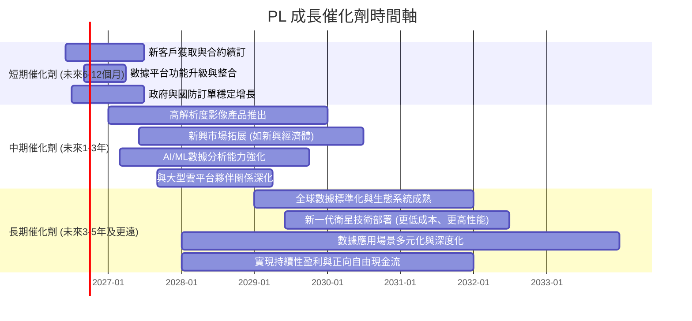

### 8.2 TAM 市場規模分析

地理空間數據市場是一個巨大且不斷擴大的市場，PL 在其中佔據獨特地位。

```
╔══════════════════════════════════════════════════════════════════╗
║                   地理空間數據總體潛在市場 (TAM) 分析            ║
╠══════════════════════════════════════════════════════════════════╣
║                                                                  ║
║  全球地球觀測數據市場 TAM：                                      ║
║  ├── 2025年估計：$5.5B - $6.5B                                   ║
║  ├── 2030年預測：$10B - $15B (CAGR ~15-20%)                     ║
║  └── PL 當前營收 (TTM)：$0.33B                                   ║
║  └── PL 市場滲透率 (當前)：約 5-6%                              ║
║                                                                  ║
║  主要垂直市場 TAM (估計)：                                       ║
║  ├── 農業與林業：$X.XB (PL貢獻：~X%)                             ║
║  ├── 政府與國防：$X.XB (PL貢獻：~X%)                             ║
║  ├── 能源與基礎設施：$X.XB (PL貢獻：~X%)                         ║
║  ├── 金融與保險：$X.XB (PL貢獻：~X%)                             ║
║  └── 其他新興應用：$X.XB (PL貢獻：~X%)                           ║
║                                                                  ║
║  📊 結論：PL 在龐大的 TAM 中仍有巨大的滲透率提升和成長空間。     ║
╚══════════════════════════════════════════════════════════════════╝
```

**TAM 市場規模分析**：
全球地球觀測數據市場預計將在未來幾年實現顯著增長。根據市場研究，2025 年全球地球觀測市場規模估計在 55 億至 65 億美元之間，並預計到 2030 年將達到 100 億至 150 億美元，複合年增長率 (CAGR) 約為 15-20%。PL 目前的 TTM 營收為 $335.61M，這意味著其當前市場滲透率約為 5-6%。這表明公司在一個快速擴張的市場中仍有巨大的成長空間。
PL 的數據服務適用於多個垂直市場，每個市場都有其獨特的 TAM。隨著其數據產品的成熟和應用場景的拓展，PL 有望在這些市場中獲得更大的份額。

### 8.3 成長驅動力結構圖

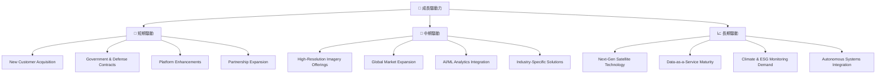

**成長驅動力詳述**：
*   **短期驅動 (Short-Term Drivers)**：
    *   **新客戶獲取與合約續訂**：持續擴大客戶群，並確保現有客戶合約的穩定續訂，尤其是在商業領域。
    *   **政府與國防訂單穩定增長**：政府部門對高頻率衛星數據的需求持續增長，提供穩定的收入基礎。
    *   **數據平台功能升級與整合**：不斷優化其數據平台和 API 接口，提升用戶體驗和數據易用性，吸引更多開發者和企業。
    *   **夥伴關係深化**：與雲服務提供商、系統集成商建立更緊密合作，擴大市場覆蓋。
*   **中期驅動 (Mid-Term Drivers)**：
    *   **高解析度影像產品推出**：逐步推出更高解析度的衛星影像產品，滿足更多高端應用需求，提升定價能力。
    *   **全球市場拓展**：積極進入新興地理市場，利用其全球覆蓋優勢開拓新的客戶群。
    *   **AI/ML 數據分析能力強化**：利用人工智能和機器學習技術，從海量數據中自動提取更深層次的洞察，提供更具價值的解決方案。
    *   **行業特定解決方案**：針對農業、能源、金融等垂直行業開發客製化解決方案，提升產品的應用深度。
*   **長期驅動 (Long-Term Drivers)**：
    *   **新一代衛星技術部署**：持續投資於下一代衛星技術，實現更低成本、更高性能、更長壽命的衛星部署。
    *   **數據即服務模式成熟**：隨著市場對 DaaS 模式的接受度提高，PL 有望實現更高的規模經濟和盈利能力。
    *   **氣候與 ESG 監測需求**：全球對氣候變化、環境監測和 ESG (環境、社會及治理) 數據的需求日益增長，為 PL 提供了巨大的長期市場機會。
    *   **自主系統集成**：將其數據集成到自動駕駛、智慧城市等自主系統中，開闢新的高價值應用領域。

---

## 9. 風險矩陣

Planet Labs PBC (PL) 作為一家高成長、高技術含量的公司，面臨著多方面的風險。這些風險可能影響其財務表現和市場地位。

### 9.1 風險評分矩陣

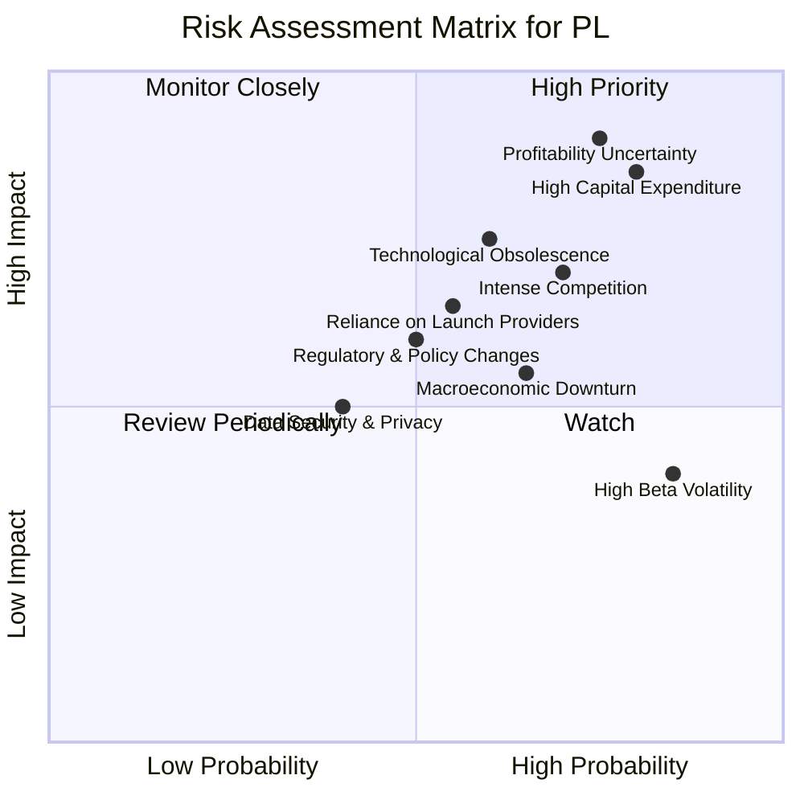

### 9.2 風險清單詳細分析

| # | 風險項目 | 發生機率 | 財務衝擊 | 風險評分 | 緩解措施 |
|---|------------------------|----------|----------|----------|----------|
| 1 | 🔴 **盈利能力不確定性** | 高 (75%) | 高 (-X% EPS) | 🔴 9.0/10 | 專注於高利潤產品線、精簡營運費用、利用規模經濟效應，加快實現正向淨利潤。 |
| 2 | 🔴 **高資本支出與資金需求** | 高 (80%) | 高 (-X% FCF) | 🔴 8.5/10 | 優化衛星設計和發射成本，探索與政府或商業夥伴的共用發射計畫，保持健康的現金儲備，並審慎進行債務融資。 |
| 3 | 🟡 **激烈競爭與市場份額壓力** | 高 (70%) | 中 (-X% 營收) | 🟡 7.0/10 | 持續創新，提升數據產品差異化和解析度，擴展獨家數據應用場景，加強客戶鎖定效應。 |
| 4 | 🟡 **技術快速迭代與過時風險** | 中 (60%) | 中 (-X% 營收) | 🟡 7.5/10 | 大力投入研發，密切關注行業技術發展趨勢，及時升級衛星和數據處理平台，保持技術領先。 |
| 5 | 🟡 **對發射服務供應商的依賴** | 中 (55%) | 中 (-X% 營收) | 🟡 6.5/10 | 多元化發射服務供應商，與多家公司建立合作關係，降低單一供應商的風險。 |
| 6 | 🟡 **宏觀經濟下行風險** | 中 (65%) | 中 (-X% 營收) | 🟡 5.5/10 | 拓展多元化客戶群，尤其增加對經濟週期不敏感的政府和公共事業客戶，保持財務彈性。 |
| 7 | 🟡 **高 Beta 造成的股價波動** | 極高 (85%) | 中 (-X% 股價) | 🟡 4.0/10 | 由於其高 Beta (2.005)，股價波動性大。這並非公司內部風險，但投資者需有心理準備，並採取長期投資策略。 |
| 8 | 🟢 **數據安全與隱私問題** | 低 (40%) | 低 (-X% 營收) | 🟢 3.0/10 | 建立嚴格的數據安全協議和隱私保護機制，遵守國際數據法規，增強客戶信任。 |
| 9 | 🟢 **監管與政策變化** | 中 (50%) | 低 (-X% 營收) | 🟢 6.0/10 | 積極參與行業標準制定，密切關注國際空間法規和數據政策變化，確保合規運營。 |

---

## 10. 投資建議

綜合以上深度分析，Planet Labs PBC (PL) 是一家在快速成長的地理空間數據市場中具有獨特技術和強勁營收增長潛力的公司。然而，其高資本投入、持續虧損以及目前顯著偏高的估值是投資者需要審慎考慮的因素。

### 10.1 最終綜合評級雷達圖

```
╔══════════════════════════════════════════════════════════════════╗
║                  PL 最終綜合評級雷達圖 (1-10分)                  ║
╠══════════════════════════════════════════════════════════════════╣
║ 基本面強度  7.0 ▓▓▓▓▓▓▓▓▓▓▓▓▓▓░░░░░░  ★★★★☆           ║
║ 成長動能    8.0 ▓▓▓▓▓▓▓▓▓▓▓▓▓▓▓▓░░░░  ★★★★☆           ║
║ 獲利品質    3.0 ▓▓▓▓▓▓░░░░░░░░░░░░░░  ★☆☆☆☆           ║
║ 財務健康    7.0 ▓▓▓▓▓▓▓▓▓▓▓▓▓▓░░░░░░  ★★★★☆           ║
║ 估值合理性  4.0 ▓▓▓▓▓▓▓▓░░░░░░░░░░░░  ★★☆☆☆           ║
║ 護城河深度  7.0 ▓▓▓▓▓▓▓▓▓▓▓▓▓▓░░░░░░  ★★★★☆           ║
║ 管理層執行  6.0 ▓▓▓▓▓▓▓▓▓▓▓▓░░░░░░░░  ★★★☆☆           ║
║ 技術創新力  8.0 ▓▓▓▓▓▓▓▓▓▓▓▓▓▓▓▓░░░░  ★★★★☆           ║
╠══════════════════════════════════════════════════════════════════╣
║ 綜合總分    6.0 ▓▓▓▓▓▓▓▓▓▓▓▓░░░░░░░░  🏆 評級：持有              ║
╚══════════════════════════════════════════════════════════════════╝
```

### 10.2 目標價與隱含報酬率

根據綜合估值分析，我們給出以下目標價和隱含報酬率：

| 情境 | 目標價 ($) | 隱含報酬率 (%) | 機率權重 (%) | 備註 |
|------|------------|----------------|--------------|------|
| 悲觀情境 | $25.00 | -7.6% | 30% | 營收成長放緩，盈利能力改善不及預期，市場情緒轉差。 |
| 基準情境 | $33.00 | +22.0% | 50% | 營收持續強勁增長，營運效率逐步提升，虧損收窄。 |
| 樂觀情境 | $40.00 | +47.8% | 20% | 營收超預期增長，盈利能力顯著改善，新產品或服務推動市場份額大幅提升。 |
| **加權平均** | **$31.40** | **+16.0%** | **100%** | (25\*0.3 + 33\*0.5 + 40\*0.2) / 100 = 31.4 |

### 10.3 買入時機與觸發因素

```
╔══════════════════════════════════════════════════════════════════╗
║                  ✅ 買入觸發因素 Checklist                       ║
╠══════════════════════════════════════════════════════════════════╣
║                                                                  ║
║  立即買入觸發條件（多數符合）：                                  ║
║  ☐ 股價跌至 $25.00 以下，提供更佳的風險報酬比。                 ║
║  ☐ 公司發布超預期的盈利指引或實現季度盈利。                     ║
║  ☐ 宣布重大長期政府或商業合約，確保未來營收穩定性。             ║
║  ☐ 推出革命性新產品或服務，顯著擴大 TAM 或提升競爭優勢。        ║
║                                                                  ║
║  加碼觸發條件（出現以下任一）：                                  ║
║  ☐ 營收成長率連續兩個季度超預期，且毛利率維持穩定。             ║
║  ☐ 營運費用得到有效控制，營業利益率持續改善。                   ║
║  ☐ 自由現金流持續為正且穩步增長，顯示業務模式健康。             ║
║  ☐ 成功進入新的高價值垂直市場或地域市場。                       ║
║                                                                  ║
║  減碼/停損觸發條件（出現以下任一）：                             ║
║  ☐ 營收成長顯著放緩，未能達到市場預期。                         ║
║  ☐ 虧損持續擴大，且沒有明確的盈利路徑或時間表。                 ║
║  ☐ 資本支出壓力過大，導致自由現金流持續為負，且需大量外部融資。 ║
║  ☐ 關鍵技術被競爭對手超越，或出現顛覆性替代方案。               ║
╚══════════════════════════════════════════════════════════════════╝
```

### 10.4 投資人適配度分析

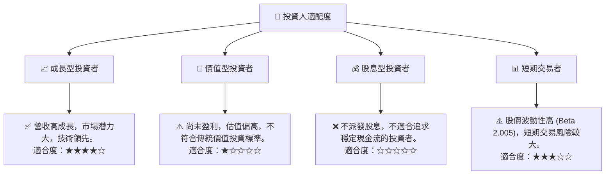

### 10.5 關鍵監控指標

| 監控類型 | 指標 | 關注點 | 頻率 |
|----------|------|--------|------|
| **成長性** | 營收 YoY 成長率 | 是否維持 20%+ 的高成長，新客戶獲取情況 | 每季 |
| **獲利能力** | 毛利率、營業利益率、淨利率 | 毛利率是否穩定，營運費用控制，淨利率虧損收窄情況 | 每季 |
| **現金流** | 自由現金流 (FCF) | FCF 是否持續為正且穩步增長，減少對外部融資依賴 | 每季 |
| **資本效率** | ROIC vs WACC | ROIC 是否逐步改善並最終超越 WACC | 每年 |
| **估值** | P/S Ratio, EV/Revenue | 估值倍數是否隨著基本面改善而趨於合理，與同業比較 | 每月/季 |
| **技術與競爭** | 新產品發布、衛星部署進度、競爭格局變化 | 是否保持技術領先，市場份額變化 | 每季/半年 |
| **財務健康** | 現金及短期投資、總債務、流動比率 | 現金儲備是否充足，債務是否可控，流動性是否健康 | 每季 |

---

> **免責聲明**：本報告為 AI 自動生成，僅供研究參考，不構成投資建議。投資有風險，入市需謹慎。