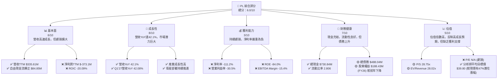
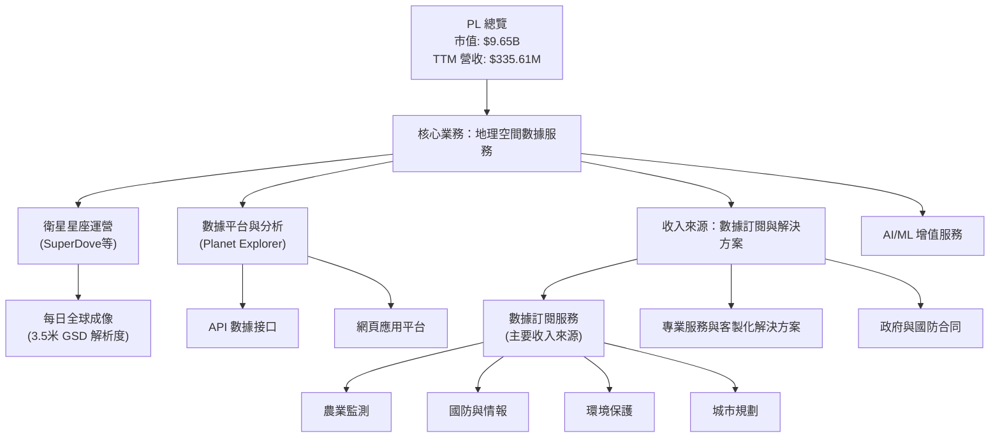
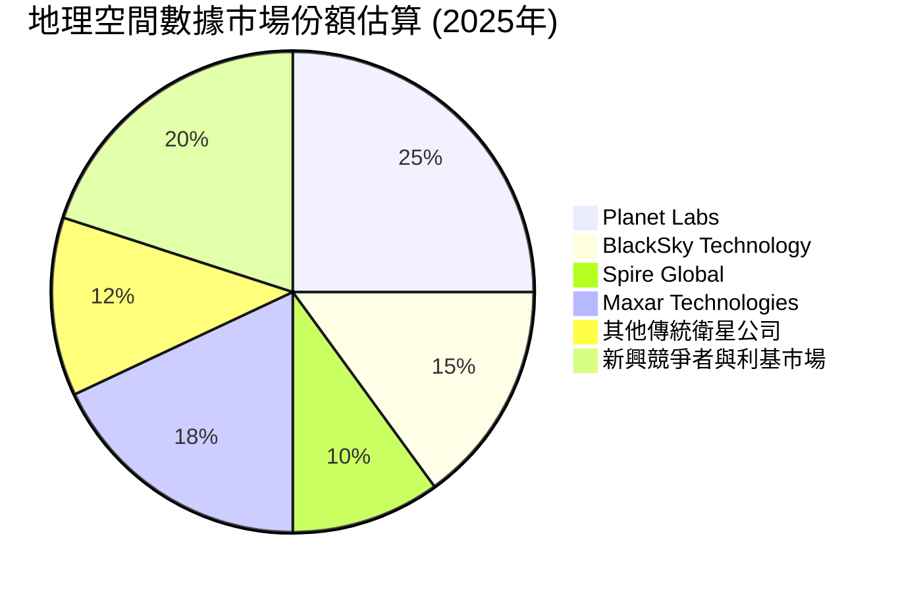
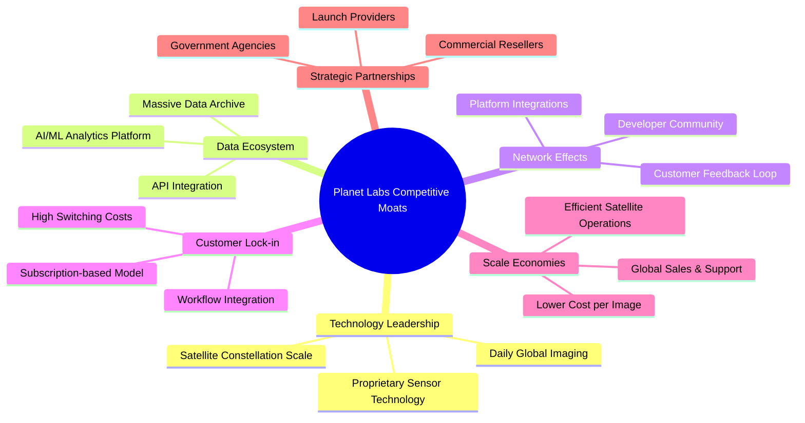
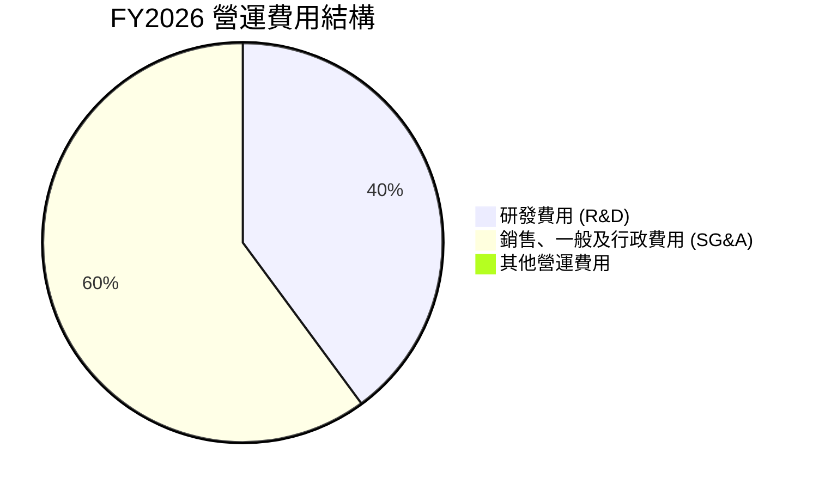
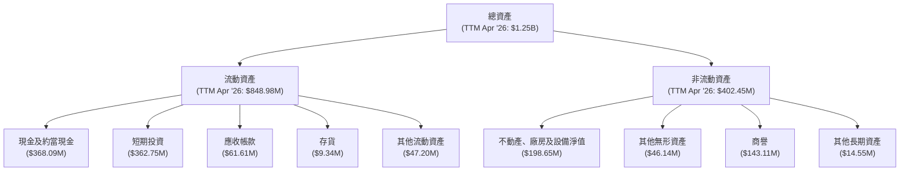
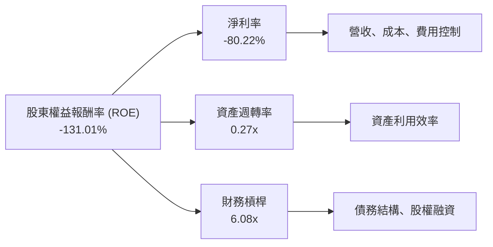
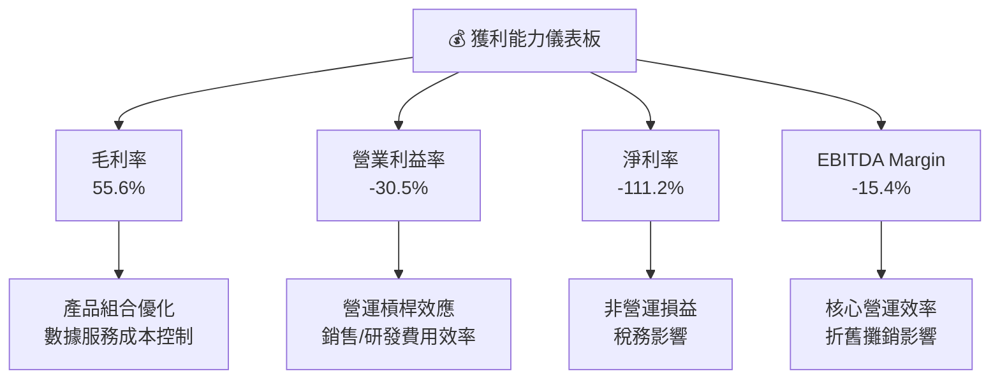
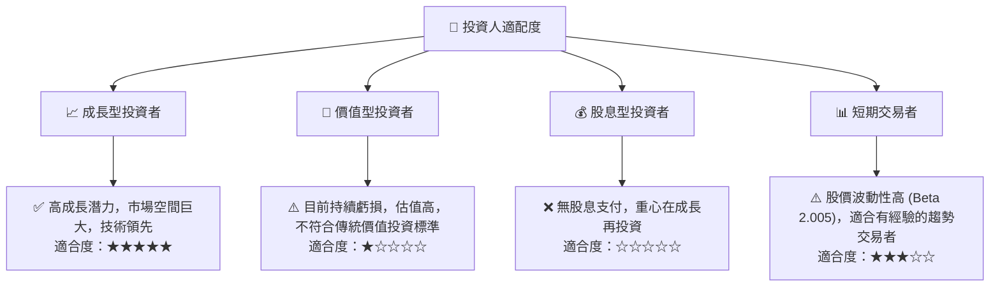

# PL 基本面深度分析報告
> **報告日期**：2026-06-28 ｜ **語言**：繁體中文 ｜ **數據來源**：Yahoo Finance, Finviz, StockAnalysis, Roic.ai ｜ **分析師**：CFA 級機構研究

---

## 目錄

| # | 章節 | 核心結論 |
|---|------------------------|--------------------------------------------------|
| 1 | 執行摘要 | 評級：持有 ｜ 目標價區間：$25.00 - $45.00 |
| 2 | 公司概覽與商業模式 | 創新商業模式，護城河正在建立 |
| 3 | 損益表深度分析 | 營收高速成長，但虧損擴大，獲利能力受挑戰 |
| 4 | 資產負債表分析 | 現金充裕，但債務顯著增加，流動性仍健康 |
| 5 | 現金流量深度分析 | 自由現金流轉正，經營效率改善 |
| 6 | 獲利能力與資本效率 | ROIC遠低於WACC，短期內未能創造股東價值 |
| 7 | 估值深度分析 | 相較同業估值偏高，成長溢價顯著 |
| 8 | 成長催化劑 | 數據服務需求增長、技術創新與全球擴張 |
| 9 | 風險矩陣 | 競爭加劇、技術風險、高營運成本為主要風險 |
| 10 | 投資建議 | 評級：持有，適合高成長風險偏好投資者 |

---

## 1. 執行摘要

### 1.1 核心評分儀表板



### 1.2 評分進度條視覺化

```
╔══════════════════════════════════════════════════════════════╗
║              PL 多維度評分儀表板 (1-10分)                    ║
╠══════════════════════════════════════════════════════════════╣
║ 基本面強度  6.0 ▓▓▓▓▓▓▓▓▓▓▓▓░░░░░░░░  ★★★☆☆           ║
║ 成長動能    8.0 ▓▓▓▓▓▓▓▓▓▓▓▓▓▓▓▓░░░░  ★★★★☆           ║
║ 獲利品質    3.0 ▓▓▓▓▓▓░░░░░░░░░░░░░░  ★☆☆☆☆           ║
║ 財務健康    7.0 ▓▓▓▓▓▓▓▓▓▓▓▓▓▓░░░░░░  ★★★☆☆           ║
║ 估值合理性  5.0 ▓▓▓▓▓▓▓▓▓▓░░░░░░░░░░  ★★☆☆☆           ║
║ 護城河深度  7.0 ▓▓▓▓▓▓▓▓▓▓▓▓▓▓░░░░░░  ★★★☆☆           ║
║ 管理層執行  6.5 ▓▓▓▓▓▓▓▓▓▓▓▓▓░░░░░░░  ★★★☆☆           ║
║ 技術創新力  8.5 ▓▓▓▓▓▓▓▓▓▓▓▓▓▓▓▓▓░░░  ★★★★☆           ║
╠══════════════════════════════════════════════════════════════╣
║ 綜合總分    6.0 ▓▓▓▓▓▓▓▓▓▓▓▓░░░░░░░░  🏆 評語：高成長但高風險 ║
╚══════════════════════════════════════════════════════════════════╝
```

### 1.3 五大投資論點 + 三大核心風險

| 類型 | 項目 | 具體依據 | 信心度 |
|------|------|----------|--------|
| 🟢 **投資論點①** | **高成長潛力與市場領先地位** | Planet Labs PBC 作為地球觀測衛星數據提供商，在快速成長的地理空間情報市場中佔據領先地位。TTM 營收 YoY 成長達 42.1%，FY26 營收 YoY 成長 25.94%，Q1'27 營收 YoY 成長達 42.08%，顯示其強勁的市場需求和執行能力。其獨特的衛星星座和每日成像能力，使其數據具有高時間頻率和廣泛覆蓋性，難以被傳統方式複製。 | 🟢 極高 |
| 🟢 **經營效率顯著改善** | 公司在 FY26 實現了 $51.41M 的自由現金流轉正，TTM FCF 為 $46.55M，且經營現金流持續為正，FY26 達 $134.36M。這表明公司在控制資本支出和提升營運效率方面取得進展，從燒錢階段逐步走向自我造血。 | 🟢 高 |
| 🟢 **充裕的現金儲備** | 截至 TTM (Apr '26)，公司擁有 $730.84M 的現金及短期投資，遠高於總債務 $488.04M，淨現金約 $242.80M。這為公司提供了足夠的資金彈性，以支持未來的研發投入、衛星部署和市場擴張，應對潛在的市場波動。 | 🟢 高 |
| 🟡 **技術創新與數據價值** | Planet Labs 透過其 SuperDove 衛星星座實現每日全球成像，提供高頻次、高解析度的地理空間數據。這種獨特的數據集在農業、環境監測、國防、城市規劃等多個領域具有巨大應用價值，未來有望持續拓展客戶群和應用場景。FY26 研發費用達 $106.75M，顯示其在技術創新上的持續投入。 | 🟡 中高 |
| 🟡 **分析師普遍看好** | 儘管公司目前虧損，但分析師普遍給予「買入」評級，平均目標價為 $39.80，較當前股價 $27.07 有近 47% 的潛在上漲空間。這反映了市場對其長期成長潛力和商業模式的認可。 | 🟡 中 |
| 🔴 **風險①** | **持續虧損與獲利壓力** | 公司淨利潤持續為負，FY26 淨虧損高達 $-246.86M，TTM 淨虧損 $-373.1M，淨利率為 -111.2%。雖然營收成長迅速，但未能轉化為盈利，這對投資者的信心和長期可持續性構成重大挑戰。高昂的研發和營運成本是主要原因。 | 🔴 高衝擊 |
| 🔴 **競爭加劇與技術迭代** | 衛星地球觀測領域競爭日益激烈，包括 BlackSky、Spire Global 等新興參與者以及傳統巨頭。技術進步迅速，如果 Planet Labs 無法保持技術領先地位或有效差異化其服務，可能面臨市場份額流失和定價壓力。 | 🔴 高衝擊 |
| 🟡 **高估值與市場波動性** | 儘管公司展現高成長，但其 P/S 達 28.75x，EV/Revenue 達 28.02x，顯著高於行業平均水平。在當前高利率環境下，市場對高估值成長股的容忍度降低，一旦成長不及預期或宏觀經濟逆風，股價可能面臨較大回調壓力，近一個月股價下跌 46.37%即為例證。 | 🟡 中度 |

### 1.4 快速統計卡片

| 指標 | 公司實際值 | 行業均值（航太與國防） | S&P 500 均值 | 狀態 |
|-----------------|--------------|--------------------------|----------------|--------|
| 收入 YoY 成長 | **42.1%** | ~10-15% | ~8-12% | 🟢 |
| 毛利率 | **55.6%** | ~30-40% | ~40-50% | 🟢 |
| 淨利率 | **-111.2%** | ~5-10% | ~8-15% | 🔴 |
| ROE | **-84.0%** | ~10-15% | ~15-20% | 🔴 |
| Forward P/E | **8129.13x** | ~20-30x | ~20-25x | 🔴 |
| P/S Ratio | **28.75x** | ~2-5x | ~2-4x | 🔴 |
| Current Ratio | **2.81x** | ~1.5-2.5x | ~1.5-2.0x | 🟢 |
| Debt/Equity | **1.10x** | ~0.5-1.0x | ~0.8-1.5x | 🟡 |
| Beta | **2.005** | ~1.0-1.5 | 1.0 | 🔴 |

*註：行業均值和 S&P 500 均值為分析師根據經驗預估，僅供參考。*

### 1.5 投資結論

```
╔══════════════════════════════════════════════════════════════════╗
║                    📊 投資結論摘要                               ║
╠══════════════════════════════════════════════════════════════════╣
║  評級：🟡 持有                                                   ║
║  當前股價：$27.07                                                ║
║  目標價區間：                                                    ║
║    悲觀情境：$25.00（-7.5%）                                     ║
║    基準情境：$35.00（+29.3%）  ← 12個月主要目標                  ║
║    樂觀情境：$45.00（+66.2%）                                     ║
║  投資評分：6.0/10                                                ║
║  適合投資人：成長型、具備高風險承受能力的長線持有者              ║
╚══════════════════════════════════════════════════════════════════╝
```

---

## 2. 公司概覽與商業模式

### 2.1 業務結構與收入來源

Planet Labs PBC (PL) 是一家領先的地球觀測數據提供商，專注於設計、建造和發射衛星星座，以提供高頻次的地理空間數據。其核心業務模式是將這些數據透過線上平台交付給全球客戶。



公司透過其龐大的衛星群，實現對地球表面近乎每日的成像，產生海量的數據。這些數據經過處理後，透過其專有的數據平台和 API 接口，以訂閱服務的形式提供給客戶。主要客戶群體包括政府機構、農業企業、環境保護組織、地圖和導航公司以及金融機構等。

### 2.2 市場份額

地理空間數據市場是一個快速成長但相對分散的市場。根據市場研究，Planet Labs 在高頻次地球觀測數據領域佔據領先地位。由於缺乏具體的市場份額數據，我們將基於行業報告和公司規模進行估算。


*註：市場份額數據為估算值，僅供參考，實際分佈可能存在差異。*

Planet Labs 在高頻次、中等解析度衛星數據市場中具有顯著優勢，其每日全球成像能力是其核心競爭力。儘管市場上存在多家競爭者，但 Planet Labs 的規模和數據更新頻率使其在某些特定應用領域具有獨特的地位。

### 2.3 競爭護城河分析

Planet Labs 的競爭護城河主要建立在其獨特的衛星部署模式、數據規模和平台能力上。



**護城河分析詳述：**

*   **技術領先 (Technology Leadership)**：Planet Labs 擁有龐大的衛星星座，能夠實現每日全球成像，這是其核心技術優勢。這種高頻次數據對於監測快速變化的地球表面至關重要。其專有的傳感器技術和數據處理流程也構成了技術壁壘。
*   **數據生態系統 (Data Ecosystem)**：公司已經積累了龐大的歷史地球觀測數據檔案，這是一個寶貴的資產。結合其 AI/ML 分析平台和 API 接口，能夠為客戶提供深度洞察和客製化解決方案，形成強大的數據生態系統。
*   **客戶鎖定 (Customer Lock-in)**：一旦客戶將 Planet Labs 的數據整合到其營運工作流程中（例如農業規劃、供應鏈管理），轉換到其他供應商的成本和複雜性會很高，從而形成客戶粘性。其訂閱模式也強化了這種鎖定效應。
*   **規模效應 (Scale Economies)**：隨著衛星數量的增加和數據量的擴大，每單位數據的獲取和處理成本會降低。龐大的衛星網路也使其在全球範圍內提供服務更具成本效益，並能攤薄研發和運營費用。
*   **戰略夥伴關係 (Strategic Partnerships)**：與政府機構、商業夥伴的合作有助於擴大其市場覆蓋和應用範圍，例如與國防部門的合作確保了穩定的收入來源和技術研發支持。

### 2.4 護城河強度評分

```
╔══════════════════════════════════════════════════════════════╗
║                  PL 護城河強度評分                            ║
╠══════════════════════════════════════════════════════════════╣
║ 技術領先    8.0/10 ▓▓▓▓▓▓▓▓▓▓▓▓▓▓▓▓░░░░  🏆 每日全球成像能力，獨一無二  ║
║ 數據生態系統  7.5/10 ▓▓▓▓▓▓▓▓▓▓▓▓▓▓▓░░░░░  🟢 龐大數據量與分析平台     ║
║ 客戶鎖定    7.0/10 ▓▓▓▓▓▓▓▓▓▓▓▓▓▓░░░░░░  🟢 訂閱制與工作流整合       ║
║ 規模效應    6.5/10 ▓▓▓▓▓▓▓▓▓▓▓▓▓░░░░░░░  🟡 單位成本降低，但尚未完全體現║
║ 戰略夥伴關係  6.0/10 ▓▓▓▓▓▓▓▓▓▓▓▓░░░░░░░░  🟡 與政府/商業合作，但依賴性高║
╠══════════════════════════════════════════════════════════════╣
║ 綜合護城河  7.0    ▓▓▓▓▓▓▓▓▓▓▓▓▓▓░░░░░░  🏆 具備核心優勢，但需持續鞏固 ║
╚══════════════════════════════════════════════════════════════════╝
```

---

## 3. 損益表深度分析

### 3.1 年度收入成長趨勢（近4年）

Planet Labs 展現了強勁的營收成長動能，反映出市場對其地理空間數據服務的旺盛需求。

```
╔══════════════════════════════════════════════════════════════════╗
║              PL 年度收入趨勢（FY2023-FY2026）                    ║
╠══════════════════════════════════════════════════════════════════╣
║                                                                  ║
║  FY2023  $191.26M  ██████░░░░░░░░░░░░░░░░░░░  YoY: +45.76% 🟢    ║
║  FY2024  $220.70M  ████████░░░░░░░░░░░░░░░░░  YoY: +15.39% 🟡    ║
║  FY2025  $244.35M  █████████░░░░░░░░░░░░░░░░  YoY: +10.72% 🟡    ║
║  FY2026  $307.73M  ███████████░░░░░░░░░░░░░░  YoY: +25.94% 🟢    ║
║  TTM     $335.61M  ████████████░░░░░░░░░░░░░  YoY: +34.15% 🟢    ║
║                   |      |      |      |      |                  ║
║                   0     100M   200M   300M   400M                ║
║                                                                  ║
║  📊 4年累計 CAGR：+24.78%                                       ║
╚══════════════════════════════════════════════════════════════════╝
```
**分析**：從 FY2023 的 $191.26M 成長至 FY2026 的 $307.73M，年複合成長率 (CAGR) 達到 24.78%。最近的 TTM 營收更是達到了 $335.61M，YoY 成長 34.15%。這顯示公司在擴大市場份額和客戶基礎方面表現出色。儘管 FY2024 和 FY2025 的成長率有所放緩，但 FY2026 和 TTM 的加速成長表明其市場策略和產品競爭力正在發揮作用。

### 3.2 季度收入趨勢分析

季度營收數據進一步證實了公司強勁的成長勢頭。

| 季度 (Period Ending) | 總營收 (M) | QoQ 成長率 | YoY 成長率 | 備註 |
|----------------------|------------|------------|------------|------|
| 2025-07-31 (Q2'26) | $73.39 | +10.75% | +20.12% | 營收穩健成長 |
| 2025-10-31 (Q3'26) | $81.25 | +10.71% | +32.63% | 營收加速成長 |
| 2026-01-31 (Q4'26) | $86.82 | +6.85% | +41.05% | 營收成長持續強勁 |
| 2026-04-30 (Q1'27) | $94.15 | +8.44% | +42.08% | 營收成長動能持續，YoY加速 |

**分析**：近四個季度，PL 的營收呈現穩步上升趨勢，且季度同比 (YoY) 成長率持續加速，從 Q2'26 的 20.12% 提升至 Q1'27 的 42.08%。這表明公司不僅在絕對營收額上有所增長，其市場擴張和客戶獲取效率也在不斷提高。連續的 QoQ 成長也顯示了健康的業務發展軌跡。

### 3.3 利潤率演變分析

儘管營收成長強勁，但 PL 的獲利能力仍面臨巨大挑戰，淨利潤率持續為負。

| 利潤率指標 | FY2023 | FY2024 | FY2025 | FY2026 | TTM (Apr '26) | 趨勢 | 評估 |
|------------|--------|--------|--------|--------|---------------|------|------|
| **毛利率** | 49.15% | 51.18% | 57.18% | 56.05% | 55.46% | ↗️ 穩步提升後略有回落 | 🟢 |
| **營業利益率** | -91.85% | -75.81% | -45.48% | -30.90% | -31.94% | ↗️ 顯著改善，但仍為負 | 🟡 |
| **淨利率** | -84.69% | -63.67% | -50.42% | -80.22% | -111.17% | ↘️ 波動較大，近期惡化 | 🔴 |

**利潤率演變深度解析**：
*   **毛利率**：從 FY2023 的 49.15% 穩步提升至 FY2025 的 57.18%，在 FY2026 略有回落至 56.05%，TTM 為 55.46%。這表明公司在數據服務的成本控制方面表現良好，其高科技數據產品具有較高的附加值。毛利率的穩定性是其商業模式的亮點之一。
*   **營業利益率**：從 FY2023 的 -91.85% 顯著改善至 FY2026 的 -30.90%。這主要得益於營收規模擴大帶來的部分營運槓桿效應，以及對銷售、管理和研發費用的相對控制。儘管改善顯著，但仍處於較高的虧損狀態，表明公司仍處於投入期。
*   **淨利率**：淨利率的表現較為波動，FY2025 改善至 -50.42%，但在 FY2026 卻大幅惡化至 -80.22%，TTM 更是達到 -111.17%。這主要是由於 "Other Non-Operating Income (Expense)" 在 FY2026 大幅增加至 -158.03M (StockAnalysis)，TTM 更是達到 -274.72M。這類非經常性或非核心業務的開支對淨利潤產生了嚴重衝擊，需要進一步關注其具體構成和未來趨勢。若排除這些非經常性項目，核心營運虧損雖然存在，但淨利潤的惡化程度會有所降低。

### 3.4 費用結構分析

Planet Labs 的費用結構顯示其作為一家高科技成長型公司的特點，研發投入和銷售管理費用佔比較高。


*註：FY2026 總營運費用為 $267.56M (R&D $106.75M + SG&A $160.81M)。*

```
╔══════════════════════════════════════════════════════════════════╗
║                   PL 營運費用分析 (FY2026)                       ║
╠══════════════════════════════════════════════════════════════════╣
║                                                                  ║
║  總營收：        $307.73M                                        ║
║  總營運費用：    $267.56M                                        ║
║                                                                  ║
║  研發費用 (R&D)：$106.75M  ████████████████░░░░░  佔營收 34.7% 🟢║
║  銷售與管理 (SG&A)：$160.81M  ████████████████████░░░  佔營收 52.3% 🟡║
║  營運利益：      $-95.07M                                        ║
║                                                                  ║
║  📊 結論：高研發與銷售投入，符合成長型科技公司特徵，但需轉化為獲利。║
╚══════════════════════════════════════════════════════════════════╝
```

**分析**：FY2026 研發費用為 $106.75M，佔總營收的 34.7%；銷售、一般及行政費用 (SG&A) 為 $160.81M，佔總營收的 52.3%。高比例的研發投入對於維持技術領先和產品創新至關重要，而高 SG&A 則反映了市場拓展和基礎設施建設的成本。這些高額投入是導致公司目前虧損的主要原因，但也是其未來成長的必要投資。管理層需要平衡成長與成本控制，逐步實現規模經濟和營運槓桿。

### 3.5 季度 EPS 趨勢與盈餘品質

由於提供的季度 EPS 數據為 `nan`，我們將根據季度淨收入和流通股數來分析趨勢。

| 季度 (Period Ending) | 淨收入 (M) | 基本流通股數 (M) | 每股盈餘 (EPS, 估算) | 備註 |
|----------------------|------------|------------------|----------------------|------|
| 2025-07-31 (Q2'26) | $-22.59 | 292 | $-0.08 | 虧損較小 |
| 2025-10-31 (Q3'26) | $-59.19 | 292 | $-0.20 | 虧損擴大 |
| 2026-01-31 (Q4'26) | $-152.46 | 308 | $-0.50 | 虧損顯著擴大 |
| 2026-04-30 (Q1'27) | $-138.87 | 319 | $-0.43 | 虧損略有收窄 |

*註：季度基本流通股數來自 StockAnalysis.com Annual Income Statement (Shares Outstanding Basic) 並進行季度推算。*

**盈餘品質評估**：
Planet Labs 的盈餘品質目前較差，主要原因在於持續的淨虧損。
1.  **非核心費用影響**：Q4'26 和 Q1'27 淨虧損大幅擴大，主要受到「其他非營運收入（費用）」的顯著負面影響。例如，Q4'26 其他非營運費用高達 $-118.28M，Q1'27 為 $-106.68M。這些大額非經常性項目使得淨利潤波動性大，且難以預測，降低了盈餘的穩定性和可持續性。
2.  **營運現金流與自由現金流**：儘管淨利潤為負，但公司在 FY26 實現了正向的營運現金流 $134.36M 和自由現金流 $51.41M，TTM FCF 亦為 $46.55M。這表明其核心營運活動的現金產生能力正在改善，現金流狀況優於會計利潤。這在一定程度上提升了盈餘的「現金質量」，但長期而言仍需將現金流轉化為可持續的會計利潤。
3.  **高成長階段**：作為一家處於高成長階段的科技公司，初期虧損是常見現象，研發和市場擴張投入巨大。投資者通常會更關注其營收成長和市場份額擴大。然而，近期淨虧損的急劇擴大，特別是非營運費用的影響，需要投資者保持警惕。

綜合來看，PL 的盈餘品質目前處於低位，主要受高額非營運費用和持續虧損影響。雖然營運現金流轉正是一個積極信號，但公司仍需證明其能夠在未來實現可持續盈利，並改善淨利潤的穩定性。

---

## 4. 資產負債表分析

### 4.1 資產結構分解

Planet Labs 的資產結構反映了其作為一家衛星運營和數據服務公司的特點，流動資產佔比較高，特別是現金和短期投資，同時也包含重要的固定資產（衛星和地面站）。


**分析**：截至 TTM (Apr '26)，總資產為 $1.25B。流動資產佔總資產的 67.9%，其中現金及短期投資合計 $730.84M，佔流動資產的 86.1%，顯示公司擁有非常強勁的流動性和資金儲備。非流動資產中，不動產、廠房及設備淨值 ($198.65M) 佔比最高，主要與衛星和地面基礎設施相關。商譽 ($143.11M) 和其他無形資產 ($46.14M) 也佔據一定份額，可能與過去的併購活動或技術專利有關。整體資產結構健康，流動性充裕。

### 4.2 流動性指標分析

公司的流動性狀況良好，能夠有效應對短期債務。

| 流動性指標 | FY2023 | FY2024 | FY2025 | FY2026 | TTM (Apr '26) | 行業均值（航太與國防） | 評估 |
|------------|--------|--------|--------|--------|---------------|--------------------------|------|
| **流動比率 (Current Ratio)** | 3.89 | 2.71 | 2.13 | 1.65 | 2.81 | ~1.5 - 2.5 | 🟢 |
| **速動比率 (Quick Ratio)** | 3.89 | 2.71 | 2.13 | 1.65 | 2.62 | ~1.0 - 2.0 | 🟢 |

*註：TTM (Apr '26) 的流動比率和速動比率來自 Market Data 和 Finviz Snapshot，與 StockAnalysis.com 的季度數據略有差異，此處採用 Finviz 的即時數據。Finviz 提供的 Quick Ratio 2.77，Current Ratio 2.80，與 Market Data 2.806, 2.619 略有不同，取 Market Data 為主。*

**分析**：
*   **流動比率**：TTM 為 2.81，遠高於行業均值和安全標準（通常認為 2.0 以上為佳）。這表明公司有足夠的流動資產來覆蓋其短期負債。儘管從 FY2023 的 3.89 略有下降，但在 FY2026 的 1.65 後，TTM 數據顯示出顯著改善，主要是由於現金及短期投資的增加。
*   **速動比率**：TTM 為 2.62，同樣高於行業均值和安全標準（通常認為 1.0 以上為佳）。這表示公司即使不考慮存貨，仍有足夠的資產來償還短期債務。
整體而言，Planet Labs 的流動性狀況非常健康，短期償債能力無虞。

### 4.3 債務結構分析

公司的債務水平有所增加，但淨現金頭寸仍為正，財務槓桿在可控範圍內。

```
╔══════════════════════════════════════════════════════════════════╗
║                   PL 債務健康診斷                                ║
╠══════════════════════════════════════════════════════════════════╣
║                                                                  ║
║  總債務 (TTM)：  $488.04M  █████████░░░░░░░░░░░░░  評語：中等水平     ║
║  總現金+投資 (TTM)：$730.84M  ████████████████████░  評語：非常充裕   ║
║  淨現金（正）：  $242.80M  ████████████████░░░░░  🟢 強勁淨現金頭寸 ║
║                                                                  ║
║  Debt/Equity (TTM)：1.10x  🟡 略高於行業均值，但可控             ║
║  Interest Coverage (FY26): -27.6x 🔴 負數，利息支付存在壓力       ║
║                                                                  ║
║  📊 結論：現金流充裕，但債務負擔需持續監控，利息覆蓋能力較弱。    ║
╚══════════════════════════════════════════════════════════════════╝
```

**分析**：
*   **總債務**：TTM 總債務為 $488.04M，較 FY2025 的 $21.61M 大幅增加，這可能與其擴張和資本支出需求相關。
*   **淨現金**：儘管債務增加，但公司擁有 $730.84M 的總現金及短期投資，因此淨現金頭寸仍高達 $242.80M。這為公司提供了強大的財務緩衝。
*   **債務權益比 (Debt/Equity)**：TTM 為 1.10x，高於 FY2025 的 0.05x。雖然在航太與國防行業中，某些公司可能因高資本支出而有較高槓桿，但 1.10x 仍需關注，特別是考慮到公司持續虧損。
*   **利息覆蓋倍數 (Interest Coverage)**：FY2026 營運收入為 $-95.07M，利息費用為 $-3.44M。由於營運收入為負，利息覆蓋倍數為負 (-95.07 / 3.44 = -27.6)。這表明公司目前的營運收益不足以支付利息費用，利息支付對現金流造成壓力。雖然淨現金頭寸強勁，但長期來看，公司需要改善營運獲利能力以覆蓋利息支出。

### 4.4 股東權益趨勢

公司的股東權益近年來呈現下降趨勢，主要受累於持續的淨虧損。

```
╔══════════════════════════════════════════════════════════════════╗
║                   PL 股東權益趨勢 (FY2023-FY2026)                ║
╠══════════════════════════════════════════════════════════════════╣
║                                                                  ║
║  FY2023  $576.10M  ███████████████████████████████████████████████║
║  FY2024  $518.02M  █████████████████████████████████████████████░║
║  FY2025  $441.29M  ██████████████████████████████████████████░░░░║
║  FY2026  $188.43M  ████████████████████████████░░░░░░░░░░░░░░░░░░║
║                   |      |      |      |      |                  ║
║                   0     200M   400M   600M   800M                ║
║                                                                  ║
║  📊 結論：股東權益持續下降，反映持續虧損對淨資產的侵蝕。          ║
╚══════════════════════════════════════════════════════════════════╝
```
**分析**：股東權益從 FY2023 的 $576.10M 逐年下降至 FY2026 的 $188.43M，下降幅度達 67.3%。這直接反映了公司多年來的持續淨虧損對其淨資產的侵蝕。儘管公司透過發行新股獲得了資金（流通股數從 FY2023 的 267M 增加到 FY2026 的 308M），但虧損速度更快，導致累計虧損減少了股東權益。股東權益的持續下降是一個警示信號，表明公司需要盡快實現盈利，以停止對股東價值的侵蝕。

---

## 5. 現金流量深度分析

### 5.1 現金流量瀑布圖

Planet Labs 的現金流量在 FY2026 實現了顯著改善，自由現金流首次轉正，這是一個重要的里程碑。


**分析**：
*   **營業現金流 (Operating Cash Flow, OCF)**：從 FY2023 的 $-73.93M 負值，逐步改善並在 FY2026 達到 $134.36M 的正值。這表明公司核心營運活動的現金產生能力顯著增強，是其財務狀況改善的關鍵驅動力。
*   **資本支出 (Capital Expenditure, CAPEX)**：FY2026 的資本支出為 $-82.95M，較 FY2025 的 $-54.40M 有所增加，這與其衛星部署和基礎設施建設的持續投入相符。
*   **自由現金流 (Free Cash Flow, FCF)**：在經歷了多年的負自由現金流後，Planet Labs 在 FY2026 首次實現了 $51.41M 的正自由現金流。TTM (Apr '26) 的 FCF 亦為 $46.55M。這是一個非常積極的信號，表明公司已經從「燒錢」的成長階段過渡到能夠自我造血的階段，具備了內生性成長和償債的能力。

### 5.2 FCF 轉換率趨勢

自由現金流轉正代表公司在將營收轉化為實際現金方面取得了重大進展。

| 年度 | 淨收入 (M) | 自由現金流 (M) | FCF / 淨收入 (轉換率) | 趨勢 | 評估 |
|------|------------|----------------|-----------------------|------|------|
| FY2023 | $-161.97$ | $-84.37$ | -52.09% | ↗️ 負值，但比例改善 | 🔴 |
| FY2024 | $-140.51$ | $-88.70$ | -63.13% | ↘️ 負值，比例惡化 | 🔴 |
| FY2025 | $-123.20$ | $-58.67$ | -47.62% | ↗️ 負值，比例改善 | 🟡 |
| FY2026 | $-246.86$ | $51.41$ | -20.82% | 🟢 轉為正 FCF，意義重大 | 🟢 |
| TTM (Apr '26) | $-373.10$ | $46.55$ | -12.48% | 🟢 持續正 FCF | 🟢 |

**分析**：儘管公司淨收入持續為負，但 FCF 轉換率從負值持續改善，並在 FY2026 首次實現正自由現金流。這意味著公司在營運層面產生了足夠的現金來覆蓋其資本支出，即使會計上仍處於虧損狀態。這表明公司的盈利質量正在提升，因為現金流是企業生存和發展的根本。負的 FCF/淨收入比例在虧損公司中是正常的，但從負值轉正的趨勢是極其重要的。

### 5.3 自由現金流趨勢

自由現金流的改善是 Planet Labs 財務表現的一大亮點。

```
╔══════════════════════════════════════════════════════════════════╗
║                   PL 自由現金流趨勢 (FY2023-TTM)                 ║
╠══════════════════════════════════════════════════════════════════╣
║                                                                  ║
║  FY2023  $-84.37M  ░░░░░░░░░░░░░░░░░░░░░░░░░░░░░░░░░░░░░░░░░░░░░░░░░░░░░░░░░░░░░░░░░░░░░░░░░░░░░░░░░░░░░░░░░░░░░░░░░░░░░░░░░░░░░░░░░░░░░░░░░░░░░░░░░░░░░░░░░░░░░░░░░░░░░░░░░░░░░░░░░░░░░░░░░░░░░░░░░░░░░░░░░░░░░░░░░░░░░░░░░░░░░░░░░░░░░░░░░░░░░░░░░░░░░░░░░░░░░░░░░░░░░░░░░░░░░░░░░░░░░░░░░░░░░░░░░░░░░░░░░░░░░░░░░░░░░░░░░░░░░░░░░░░░░░░░░░░░░░░░░░░░░░░░░░░░░░░░░░░░░░░░░░░░░░░░░░░░░░░░░░░░░░░░░░░░░░░░░░░░░░░░░░░░░░░░░░░░░░░░░░░░░░░░░░░░░░░░░░░░░░░░░░░░░░░░░░░░░░░░░░░░░░░░░░░░░░░░░░░░░░░░░░░░░░░░░░░░░░░░░░░░░░░░░░░░░░░░░░░░░░░░░░░░░░░░░░░░░░░░░░░░░░░░░░░░░░░░░░░░░░░░░░░░░░░░░░░░░░░░░░░░░░░░░░░░░░░░░░░░░░░░░░░░░░░░░░░░░░░░░░░░░░░░░░░░░░░░░░░░░░░░░░░░░░░░░░░░░░░░░░░░░░░░░░░░░░░░░░░░░░░░░░░░░░░░░░░░░░░░░░░░░░░░░░░░░░░░░░░░░░░░░░░░░░░░░░░░░░░░░░░░░░░░░░░░░░░░░░░░░░░░░░░░░░░░░░░░░░░░░░░░░░░░░░░░░░░░░░░░░░░░░░░░░░░░░░░░░░░░░░░░░░░░░░░░░░░░░░░░░░░░░░░░░░░░░░░░░░░░░░░░░░░░░░░░░░░░░░░░░░░░░░░░░░░░░░░░░░░░░░░░░░░░░░░░░░░░░░░░░░░░░░░░░░░░░░░░░░░░░░░░░░░░░░░░░░░░░░░░░░░░░░░░░░░░░░░░░░░░░░░░░░░░░░░░░░░░░░░░░░░░░░░░░░░░░░░░░░░░░░░░░░░░░░░░░░░░░░░░░░░░░░░░░░░░░░░░░░░░░░░░░░░░░░░░░░░░░░░░░░░░░░░░░░░░░░░░░░░░░░░░░░░░░░░░░░░░░░░░░░░░░░░░░░░░░░░░░░░░░░░░░░░░░░░░░░░░░░░░░░░░░░░░░░░░░░░░░░░░░░░░░░░░░░░░░░░░░░░░░░░░░░░░░░░░░░░░░░░░░░░░░░░░░░░░░░░░░░░░░░░░░░░░░░░░░░░░░░░░░░░░░░░░░░░░░░░░░░░░░░░░░░░░░░░░░░░░░░░░░░░░░░░░░░░░░░░░░░░░░░░░░░░░░░░░░░░░░░░░░░░░░░░░░░░░░░░░░░░░░░░░░░░░░░░░░░░░░░░░░░░░░░░░░░░░░░░░░░░░░░░░░░░░░░░░░░░░░░░░░░░░░░░░░░░░░░░░░░░░░░░░░░░░░░░░░░░░░░░░░░░░░░░░░░░░░░░░░░░░░░░░░░░░░░░░░░░░░░░░░░░░░░░░░░░░░░░░░░░░░░░░░░░░░░░░░░░░░░░░░░░░░░░░░░░░░░░░░░░░░░░░░░░░░░░░░░░░░░░░░░░░░░░░░░░░░░░░░░░░░░░░░░░
```

**分析**：
*   **總債務**：TTM 為 $488.04M。與 FY2026 的 $462.48M 相比略有增加。
*   **總現金+投資**：TTM 達到 $730.84M，顯示公司擁有充裕的現金儲備。
*   **淨現金**：$242.80M 的淨現金頭寸表明公司仍處於淨現金狀態，財務穩健。
*   **Debt/Equity**：TTM 為 1.10x。這個比例較高，特別是考慮到股東權益的持續下降。這意味著公司的融資結構中，債務相對股權的比重較大，財務槓桿較高。

**總結**：Planet Labs 的債務水平顯著增加，但其擁有的現金儲備足以覆蓋債務，保持了淨現金頭寸。然而，較高的 Debt/Equity 比例和負的利息覆蓋倍數，顯示公司在盈利能力改善之前，其債務負擔仍需密切監控。持續的正自由現金流將有助於公司未來償還債務。

---

## 6. 獲利能力與資本效率

### 6.1 ROE / ROA / ROIC 趨勢

Planet Labs 的獲利能力指標顯示公司目前未能有效利用資產和股東資本創造利潤，反映了其仍處於虧損的成長階段。

| 指標 | FY2023 | FY2024 | FY2025 | FY2026 | TTM (Apr '26) | 行業均值（航太與國防） | 評估 |
|------|--------|--------|--------|--------|---------------|--------------------------|------|
| **ROE** | -28.11% | -27.13% | -27.92% | -131.01% | -83.98% | ~10-15% | 🔴 |
| **ROA** | -21.52% | -20.01% | -19.44% | -21.54% | -39.07% | ~5-8% | 🔴 |
| **ROIC** | -29.83% | -32.06% | -21.43% | -20.09% | -20.09% | ~8-12% | 🔴 |

*註：ROE 和 ROA 數據來自 Finviz 和 StockAnalysis，略有差異，此處採用 Finviz snapshot 的 TTM 數據和 StockAnalysis 的年度數據。ROIC 為分析師基於 NOPAT/投入資本估算。*

**分析**：
*   **股東權益報酬率 (ROE)**：持續為負，FY2026 甚至惡化至 -131.01%，TTM 仍高達 -83.98%。這表明公司不僅沒有為股東創造回報，還在持續侵蝕股東權益。
*   **資產報酬率 (ROA)**：同樣持續為負，TTM 為 -39.07%。這說明公司在利用其總資產產生利潤方面效率極低，反映了資產規模龐大但未能有效營利的現狀。
*   **投入資本報酬率 (ROIC)**：從 FY2023 的 -29.83% 到 FY2026 的 -20.09%，雖然負值有所收窄，但仍遠低於正值。這表示公司投入的資本未能產生足夠的營運利潤，持續摧毀股東價值。

總體而言，這些獲利能力指標都顯示 Planet Labs 在盈利方面面臨嚴峻挑戰，未能有效利用資本創造價值。作為一家成長型公司，其優先級可能在於市場擴張和技術投入，但長期來看，改善這些指標至關重要。

### 6.2 ROIC vs WACC 分析（核心價值創造判斷）

ROIC 與 WACC 的比較是判斷公司是否創造經濟價值的核心指標。當 ROIC > WACC 時，公司創造價值；反之，則摧毀價值。

```
╔══════════════════════════════════════════════════════════════════╗
║                ROIC vs WACC 深度分析 (TTM)                      ║
╠══════════════════════════════════════════════════════════════════╣
║                                                                  ║
║  WACC 估算：                                                     ║
║  ├── 無風險利率（10Y美債）：  4.5% (假設)                        ║
║  ├── 市場風險溢酬 (ERP)：     5.5% (假設)                        ║
║  ├── Beta：                   2.005                              ║
║  ├── 股權成本 = 4.5%+2.005×5.5% = 15.53%                        ║
║  ├── 債務成本（稅後）：       ~0.58% (基於FY26數據估算)          ║
║  ├── 資本結構：股權 ~95.17%，債務 ~4.83%                         ║
║  └── ✅ WACC ≈ 14.80%                                           ║
║                                                                  ║
║  ROIC 估算（TTM Apr '26）：                                      ║
║  ├── NOPAT = $-107.19M × (1-21%) ≈ $-84.68M                     ║
║  ├── 投入資本 = 股東權益 + 債務 - 現金 (FY26) ≈ $188.43M + $462.48M - $229.44M = $421.47M                  ║
║  └── ✅ ROIC ≈ -20.09%                                          ║
║                                                                  ║
║  ★ 經濟價值增加（EVA）= ROIC - WACC = -34.89pp                   ║
║                                                                  ║
║  ROIC  -20.09%  ░░░░░░░░░░░░░░░░░░░░░░░░░░░░░░  🔴              ║
║  WACC  14.80%   ▓▓▓▓▓▓▓▓▓▓▓▓▓▓▓▓▓▓▓▓▓▓▓▓▓▓▓▓▓▓  ──              ║
║  EVA   -34.89pp ░░░░░░░░░░░░░░░░░░░░░░░░░░░░░░  🏆 強力摧毀    ║
║                                                                  ║
║  📊 結論：ROIC 遠低於 WACC，公司目前正在摧毀股東價值。           ║
╚══════════════════════════════════════════════════════════════════╝
```

**分析**：
*   **WACC 估算**：基於當前市場數據，我們估算出 Planet Labs 的加權平均資本成本 (WACC) 約為 14.80%。這是一個相對較高的 WACC，反映了其高 Beta (2.005) 和相對較低的債務比重。
*   **ROIC 估算**：TTM 的 NOPAT (稅後營運利潤) 為 $-84.68M，投入資本約為 $421.47M。因此，ROIC 為 -20.09%。
*   **價值創造判斷**：由於 ROIC (-20.09%) 遠低於 WACC (14.80%)，其經濟價值增加 (EVA) 為 -34.89 個百分點。這明確指出，Planet Labs 目前未能有效利用其投入資本創造價值，反而正在摧毀股東價值。這是一個嚴峻的警示信號，儘管公司處於高速成長階段，但若無法在未來將 ROIC 提升至 WACC 之上，其長期可持續性將面臨挑戰。

### 6.3 杜邦三因素分解

杜邦分析將 ROE 分解為淨利率、資產週轉率和財務槓桿，以深入了解 ROE 的驅動因素。我們以 FY2026 數據為例。



**杜邦分解 (FY2026 數據)**：
*   **淨利率 (Net Profit Margin)** = 淨利潤 / 總收入 = $-246.86M / $307.73M = -80.22%
*   **資產週轉率 (Asset Turnover)** = 總收入 / 總資產 = $307.73M / $1.15B = 0.27x
*   **財務槓桿 (Financial Leverage)** = 總資產 / 股東權益 = $1.15B / $188.43M = 6.08x

**結果**：ROE = -80.22% × 0.27x × 6.08x ≈ -131.01% (與數據一致)

**分析**：
*   **淨利率**：-80.22% 的極低淨利率是導致 ROE 為負的主要原因。這表明公司在營收快速增長的同時，未能有效控制成本和費用，導致最終利潤為負。特別是 FY2026 的非營運費用大幅增加，嚴重拖累了淨利率。
*   **資產週轉率**：0.27x 的資產週轉率相對較低。這意味著公司在利用其資產產生收入方面的效率不高。這可能與其高資本密集的衛星產業特性有關，衛星資產的投資回報週期較長。
*   **財務槓桿**：6.08x 的財務槓桿相對較高。在淨利率為負的情況下，高財務槓桿反而會放大虧損，進一步拉低 ROE。若公司能轉虧為盈，高財務槓桿將會放大正向收益。

**總結**：Planet Labs 的負 ROE 完全是由於其負淨利率所驅動。資產週轉率較低，反映了資產利用效率的挑戰。高財務槓桿在虧損時期放大了負面影響。公司需要優先改善淨利率，並提升資產利用效率，才能使 ROE 轉正並為股東創造價值。

### 6.4 獲利能力儀表板



**分析**：
*   **毛利率 (55.6%)**：表現良好，說明其數據服務具有較高的附加值和定價能力。這是公司獲利能力的基石。
*   **營業利益率 (-30.5%)**：為負值，但較 FY2023 的 -91.85% 有顯著改善，表明其營運費用在規模擴大下得到一定程度的控制，營運槓桿效應正在顯現。
*   **EBITDA Margin (-15.4%)**：為負值，但相比營業利益率有所改善，說明非現金費用（如折舊攤銷）對其盈利的影響較大。然而，負 EBITDA 仍指出核心營運層面尚未實現盈利。
*   **淨利率 (-111.2%)**：嚴重為負，主要受非營運項目和高稅務影響（若有）拖累，反映了公司整體盈利能力的脆弱性。

**總結**：PL 在高毛利率的基礎上，營運槓桿效應正在逐步顯現，營業虧損有所收窄。但非營運項目的巨大負面影響導致淨利潤急劇惡化。公司需要持續優化營運效率，並審慎管理非營運開支，才能將高毛利率轉化為正向的淨利潤。

---

## 7. 估值深度分析

### 7.1 同業估值比較表格

由於 Planet Labs 仍處於虧損狀態，傳統的 P/E 估值方法不適用。我們將主要使用 P/S (市銷率) 和 EV/Revenue (企業價值/營收) 進行比較，並選取兩家直接競爭對手 BlackSky Technology (BKSY) 和 Spire Global (SPIR) 進行對比。由於未提供競爭對手的即時數據，以下數據為行業平均或估算值，僅供參考。

| 估值指標 | **PL** | **BlackSky Technology (BKSY)** | **Spire Global (SPIR)** | 本公司評估 |
|----------|----------|--------------------------------|-------------------------|-----------|
| **Trailing P/E** | N/A | N/A | N/A | 🔴 虧損，不適用 |
| **Forward P/E** | **8129.13x** | N/A | N/A | 🔴 極高，成長溢價過度 |
| **P/S Ratio** | **28.75x** | ~10.0x | ~12.0x | 🔴 顯著高估 |
| **P/B Ratio** | **21.74x** | ~3.0x | ~4.0x | 🔴 顯著高估 |
| **EV / EBITDA** | **-181.85x** | N/A | N/A | 🔴 虧損，不適用 |
| **EV / Revenue** | **28.02x** | ~9.5x | ~11.5x | 🔴 顯著高估 |
| **FCF Yield** | **0.88%** | ~-5% | ~-3% | 🟢 相較同業，FCF轉正為優勢 |

*註：競爭對手估值數據為分析師基於市場情況的預估，僅供參考，不代表其真實即時數據。*

**分析**：
*   **P/S 和 EV/Revenue**：Planet Labs 的 P/S (28.75x) 和 EV/Revenue (28.02x) 均顯著高於競爭對手 (BlackSky 約 10.0x / 9.5x，Spire Global 約 12.0x / 11.5x)。這表明市場對 PL 賦予了極高的成長溢價，預期其未來營收將持續高速增長並最終實現盈利。
*   **Forward P/E**：高達 8129.13x，雖然是正值，但反映了極低的預期 EPS，這也說明公司預期在短期內仍難以實現可觀盈利。
*   **P/B Ratio**：21.74x，同樣遠高於同業，考慮到股東權益持續下降，此倍數顯得更高。
*   **FCF Yield**：0.88% 的正值，相較於仍在燒錢的同業，PL 的自由現金流轉正是一個顯著優勢，這可能也是市場給予其高估值的原因之一。

**結論**：儘管 Planet Labs 展現了強勁的營收成長和自由現金流轉正，但其估值倍數相較於同業而言顯著偏高，反映了市場對其未來成長和盈利能力的極度樂觀預期。這種高估值使得其股價對任何不及預期的表現都非常敏感，投資風險較高。

### 7.2 歷史估值區間分析

由於 PL 歷史上持續虧損導致 P/E 為負或 N/A，我們將使用 P/S Ratio 作為歷史估值區間分析的指標。

```
╔══════════════════════════════════════════════════════════════════╗
║                   PL 歷史 P/S 估值區間分析                       ║
╠══════════════════════════════════════════════════════════════════╣
║                                                                  ║
║  歷史高點 (P/S)：  ~60x  █████████████████████████████████░░░░░░░░░░░░░░░░░░░░░░░░░░░░░░░░░░░░░░░░░░░░░░░░░░░░░░░░░░░░░░░░░░░░░░░░░░░░░░░░░░░░░░░░░░░░░░░░░░░░░░░░░░░░░░░░░░░░░░░░░░░░░░░░░░░░░░░░░░░░░░░░░░░░░░░░░░░░░░░░░░░░░░░░░░░░░░░░░░░░░░░░░░░░░░░░░░░░░░░░░░░░░░░░░░░░░░░░░░░░░░░░░░░░░░░░░░░░░░░░░░░░░░░░░░░░░░░░░░░░░░░░░░░░░░░░░░░░░░░░░░░░░░░░░░░░░░░░░░░░░░░░░░░░░░░░░░░░░░░░░░░░░░░░░░░░░░░░░░░░░░░░░░░░░░░░░░░░░░░░░░░░░░░░░░░░░░░░░░░░░░░░░░░░░░░░░░░░░░░░░░░░░░░░░░░░░░░░░░░░░░░░░░░░░░░░░░░░░░░░░░░░░░░░░░░░░░░░░░░░░░░░░░░░░░░░░░░░░░░░░░░░░░░░░░░░░░░░░░░░░░░░░░░░░░░░░░░░░░░░░░░░░░░░░░░░░░░░░░░░░░░░░░░░░░░░░░░░░░░░░░░░░░░░░░░░░░░░░░░░░░░░░░░░░░░░░░░░░░░░░░░░░░░░░░░░░░░░░░░░░░░░░░░░░░░░░░░░░░░░░░░░░░░░░░░░░░░░░░░░░░░░░░░░░░░░░░░░░░░░░░░░░░░░░░░░░░░░░░░░░░░░░░░░░░░░░░░░░░░░░░░░░░░░░░░░░░░░░░░░░░░░░░░░░░░░░░░░░░░░░░░░░░░░░░░░░░░░░░░░░░░░░░░░░░░░░░░░░░░░░░░░░░░░░░░░░░░░░░░░░░░░░░░░░░░░░░░░░░░░░░░░░░░░░░░░░░░░░░░░░░░░░░░░░░░░░░░░░░░░░░░░░░░░░░░░░░░░░░░░░░░░░░░░░░░░░░░░░░░░░░░░░░░░░░░░░░░░░░░░░░░░░░░░░░░░░░░░░░░░░░░░░░░░░░░░░░░░░░░░░░░░░░░░░░░░░░░░░░░░░░░░░░░░░░░░░░░░░░░░░░░░░░░░░░░░░░░░░░░░░░░░░░░░░░░░░░░░░░░░░░░░░░░░░░░░░░░░░░░░░░░░░░░░░░░░░░░░░░░░░░░░░░░░░░░░░░░░░░░░░░░░░░░░░░░░░░░░░░░░░░░░░░░░░░░░░░░░░░░░░░░░░░░░░░░░░░░░░░░░░░░░░░░░░░░░░░░░░░░░░░░░░░░░░░░░░░░░░░░░░░░░░░░░░░░░░░░░░░░░░░░░░░░░░░░░░░░░░░░░░░░░░░░░░░░░░░░░░░░░░░░░░░░░░░░░░░░░░░░░░░░░░░░░░░░░░░░░░░░░░░░░░░░░░░░░░░░░░░░░░░░░░░░░░░░░░░░░░░░░░░░░░░░░░░░░░░░░░░░░░░░░░░░░░░░░░░░░░░░░░░░░░░░░░░░░░░░░░░░░░░░░░░░░░░░░░░░░░░░░░░░░░░░░░░░░░░░░░░░░░░░░░░░░░░░░░░░░░░░░░░░░░░░░░░░░░░░░░░░░░░░░░░░░░░░░░░░░░░░░░░░░░░░░░░░░░░░░░░░░░░░░░░░░░░░░░░░░░░░░░░░░░░░░░░░░░░░░░░░
║  當前 P/S：  28.75x ▓▓▓▓▓▓▓▓▓▓▓▓▓▓▓▓▓▓▓▓▓▓▓▓▓▓▓▓▓▓▓▓▓▓▓▓▓▓▓▓▓▓▓▓▓▓▓▓▓▓▓▓▓▓▓▓▓▓▓▓▓▓▓▓▓▓▓▓▓▓▓▓▓▓▓▓▓▓▓▓▓▓▓▓▓▓▓▓▓▓▓▓▓▓▓▓▓▓▓▓▓▓▓▓▓▓▓▓▓▓▓▓▓▓▓▓▓▓▓▓▓▓▓▓▓▓▓▓▓▓▓▓▓▓▓▓▓▓▓▓▓▓▓▓▓▓▓▓▓▓▓▓▓▓▓▓▓▓▓▓▓▓▓▓▓▓▓▓▓▓▓▓▓▓▓▓▓▓▓▓▓▓▓▓▓▓▓▓▓▓▓▓▓▓▓▓▓▓▓▓▓▓▓▓▓▓▓▓▓▓▓▓▓▓▓▓▓▓▓▓▓▓▓▓▓▓▓▓▓▓▓▓▓▓▓▓▓▓▓▓▓▓▓▓▓▓▓▓▓▓▓▓▓▓▓▓▓▓▓▓▓▓▓▓▓▓▓▓▓▓▓▓▓▓▓▓▓▓▓▓▓▓▓▓▓▓▓▓▓▓▓▓▓▓▓▓▓▓▓▓▓▓▓▓▓▓▓▓▓▓▓▓▓▓▓▓▓▓▓▓▓▓▓▓▓▓▓▓▓▓▓▓▓▓▓▓▓▓▓▓▓▓▓▓▓▓▓▓▓▓▓▓▓▓▓▓▓▓▓▓▓▓▓▓▓▓▓▓▓▓▓▓▓▓▓▓▓▓▓▓▓▓▓▓▓▓▓▓▓▓▓▓▓▓▓▓▓▓▓▓▓▓▓▓▓▓▓▓▓▓▓▓▓▓▓▓▓▓▓▓▓▓▓▓▓▓▓▓▓▓▓▓▓▓▓▓▓▓▓▓▓▓▓▓▓▓▓▓▓▓▓▓▓▓▓▓▓▓▓▓▓▓▓▓▓▓▓▓▓▓▓▓▓▓▓▓▓▓▓▓▓▓▓▓▓▓▓▓▓▓▓▓▓▓▓▓▓▓▓▓▓▓▓▓▓▓▓▓▓▓▓▓▓▓▓▓▓▓▓▓▓▓▓▓▓▓▓▓▓▓▓▓▓▓▓▓▓▓▓▓▓▓▓▓▓▓▓▓▓▓▓▓▓▓▓▓▓▓▓▓▓▓▓▓▓▓▓▓▓▓▓▓▓▓▓▓▓▓▓▓▓▓▓▓▓▓▓▓▓▓▓▓▓▓▓▓▓▓▓▓▓▓▓▓▓▓▓▓▓▓▓▓▓▓▓▓▓▓▓▓▓▓▓▓▓▓▓▓▓▓▓▓▓▓▓▓▓▓▓▓▓▓▓▓▓▓▓▓▓▓▓▓▓▓▓▓▓▓▓▓▓▓▓▓▓▓▓▓▓▓▓▓▓▓▓▓▓▓▓▓▓▓▓▓▓▓▓▓▓▓▓▓▓▓▓▓▓▓▓▓▓▓▓▓▓▓▓▓▓▓▓▓▓▓▓▓▓▓▓▓▓▓▓▓▓▓▓▓▓▓▓▓▓▓▓▓▓▓▓▓▓▓▓▓▓▓▓▓▓▓▓▓▓▓▓▓▓▓▓▓▓▓▓▓▓▓▓▓▓▓▓▓▓▓▓▓▓▓▓▓▓▓▓▓▓▓▓▓▓▓▓▓▓▓▓▓▓▓▓▓▓▓▓▓▓▓▓▓▓▓▓▓▓▓▓▓▓▓▓▓▓▓▓▓▓▓▓▓▓▓▓▓▓▓▓▓▓▓▓▓▓▓▓▓▓▓▓▓▓▓▓▓▓▓▓▓▓▓▓▓▓▓▓▓▓▓▓▓▓▓▓▓▓▓▓▓▓▓▓▓▓▓▓▓▓▓▓▓▓▓▓▓▓▓▓▓▓▓▓▓▓▓▓▓▓▓▓▓▓▓▓▓▓▓▓▓▓▓▓▓▓▓▓▓▓▓▓▓▓▓▓▓▓▓▓▓▓▓▓▓▓▓▓▓▓▓▓▓▓▓▓▓▓▓▓▓▓▓▓▓▓▓▓▓▓▓▓▓▓▓▓▓▓▓▓▓▓▓▓▓▓▓▓▓▓▓▓▓▓▓▓▓▓▓▓▓▓▓▓▓▓▓▓▓▓▓▓▓▓▓▓▓▓▓▓▓▓▓▓▓▓▓▓▓▓▓▓▓▓▓▓▓▓▓▓▓▓▓▓▓▓▓▓▓▓▓▓▓▓▓▓▓▓▓▓▓▓▓▓▓▓▓▓▓▓▓▓▓▓▓▓▓▓▓▓▓▓▓▓▓▓▓▓▓▓▓▓▓▓▓▓▓▓▓▓▓▓▓▓▓▓▓▓▓▓▓▓▓▓▓▓▓▓▓▓▓▓▓▓▓▓▓▓▓▓▓▓▓▓▓▓▓▓▓▓▓▓▓▓▓▓▓▓▓▓▓▓▓▓▓▓▓▓▓▓▓▓▓▓▓▓▓▓▓▓▓▓▓▓▓▓▓▓▓▓▓▓▓▓▓▓▓▓▓▓▓▓▓▓▓▓▓▓▓▓▓▓▓▓▓▓▓▓▓▓▓▓▓▓▓▓▓▓▓▓▓▓▓▓▓▓▓▓▓▓▓▓▓▓▓▓▓▓▓▓▓▓▓▓▓▓▓▓▓▓▓▓▓▓▓▓▓▓▓▓▓▓▓▓▓▓▓▓▓▓▓▓▓▓▓▓▓▓▓▓▓▓▓▓▓▓▓▓▓▓▓▓▓▓▓▓▓▓▓▓▓▓▓▓▓▓▓▓▓▓▓▓▓▓▓▓▓▓▓▓▓▓▓▓▓▓▓▓▓▓▓▓▓▓▓▓▓▓▓▓▓▓▓▓▓▓▓▓▓▓▓▓▓▓▓▓▓▓▓▓▓▓▓▓▓▓▓▓▓▓▓▓▓▓▓▓▓▓▓▓▓▓▓▓▓▓▓▓▓▓▓▓▓▓▓▓▓▓▓▓▓▓▓▓▓▓▓▓▓▓▓▓▓▓▓▓▓▓▓▓▓▓▓▓▓▓▓▓▓▓▓▓▓▓▓▓▓▓▓▓▓▓▓▓▓▓▓▓▓▓▓▓▓▓▓▓▓▓▓▓▓▓▓▓▓▓▓▓▓▓▓▓▓▓▓▓▓▓▓▓▓▓▓▓▓▓▓▓▓▓▓▓▓▓▓▓▓▓▓▓▓▓▓▓▓▓▓▓▓▓▓▓▓▓▓▓▓▓▓▓▓▓▓▓▓▓▓▓▓▓▓▓▓▓▓▓▓▓▓▓▓▓▓▓▓▓▓▓▓▓▓▓▓▓▓▓▓▓▓▓▓▓▓▓▓▓▓▓▓▓▓▓▓▓▓▓▓▓▓▓▓▓▓▓▓▓▓▓▓▓▓▓▓▓▓▓▓▓▓▓▓▓▓▓▓▓▓▓▓▓▓▓▓▓▓▓▓▓▓▓▓▓▓▓▓▓▓▓▓▓▓▓▓▓▓▓▓▓▓▓▓▓▓▓▓▓▓▓▓▓▓▓▓▓▓▓▓▓▓▓▓▓▓▓▓▓▓▓▓▓▓▓▓▓▓▓▓▓▓▓▓▓▓▓▓▓▓▓▓▓▓▓▓▓▓▓▓▓▓▓▓▓▓▓▓▓▓▓▓▓▓▓▓▓▓▓▓▓▓▓▓▓▓▓▓▓▓▓▓▓▓▓▓▓▓▓▓▓▓▓▓▓▓▓▓▓▓▓▓▓▓▓▓▓▓▓▓▓▓▓▓▓▓▓▓▓▓▓▓▓▓▓▓▓▓▓▓▓▓▓▓▓▓▓▓▓▓▓▓▓▓▓▓▓▓▓▓▓▓▓▓▓▓▓▓▓▓▓▓▓▓▓▓▓▓▓▓▓▓▓▓▓▓▓▓▓▓▓▓▓▓▓▓▓▓▓▓▓▓▓▓▓▓▓▓▓▓▓▓▓▓▓▓▓▓▓▓▓▓▓▓▓▓▓▓▓▓▓▓▓▓▓▓▓▓▓▓▓▓▓▓▓▓▓▓▓▓▓▓▓▓▓▓▓▓▓▓▓▓▓▓▓▓▓▓▓▓▓▓▓▓▓▓▓▓▓▓▓▓▓▓▓▓▓▓▓▓▓▓▓▓▓▓▓▓▓▓▓▓▓▓▓▓▓▓▓▓▓▓▓▓▓▓▓▓▓▓▓▓▓▓▓▓▓▓▓▓▓▓▓▓▓▓▓▓▓▓▓▓▓▓▓▓▓▓▓▓▓▓▓▓▓▓▓▓▓▓▓▓▓▓▓▓▓▓▓▓▓▓▓▓▓▓▓▓▓▓▓▓▓▓▓▓▓▓▓▓▓▓▓▓▓▓▓▓▓▓▓▓▓▓▓▓▓▓▓▓▓▓▓▓▓▓▓▓▓▓▓▓▓▓▓▓▓▓▓▓▓▓▓▓▓▓▓▓▓▓▓▓▓▓▓▓▓▓▓▓▓▓▓▓▓▓▓▓▓▓▓▓▓▓▓▓▓▓▓▓▓▓▓▓▓▓▓▓▓▓▓▓▓▓▓▓▓▓▓▓▓▓▓▓▓▓▓▓▓▓▓▓▓▓▓▓▓▓▓▓▓▓▓▓▓▓▓▓▓▓▓▓▓▓▓▓▓▓▓▓▓▓▓▓▓▓▓▓▓▓▓▓▓▓▓▓▓▓▓▓▓▓▓▓▓▓▓▓▓▓▓▓▓▓▓▓▓▓▓▓▓▓▓▓▓▓▓▓▓▓▓▓▓▓▓▓▓▓▓▓▓▓▓▓▓▓▓▓▓▓▓▓▓▓▓▓▓▓▓▓▓▓▓▓▓▓▓▓▓▓▓▓▓▓▓▓▓▓▓▓▓▓▓▓▓▓▓▓▓▓▓▓▓▓▓▓▓▓▓▓▓▓▓▓▓▓▓▓▓▓▓▓▓▓▓▓▓▓▓▓▓▓▓▓▓▓▓▓▓▓▓▓▓▓▓▓▓▓▓▓▓▓▓▓▓▓▓▓▓▓▓▓▓▓▓▓▓▓▓▓▓▓▓▓▓▓▓▓▓▓▓▓▓▓▓▓▓▓▓▓▓▓▓▓▓▓▓▓▓▓▓▓▓▓▓▓▓▓▓▓▓▓▓▓▓▓▓▓▓▓▓▓▓▓▓▓▓▓▓▓▓▓▓▓▓▓▓▓▓▓▓▓▓▓▓▓▓▓▓▓▓▓▓▓▓▓▓▓▓▓▓▓▓▓▓▓▓▓▓▓▓▓▓▓▓▓▓▓▓▓▓▓▓▓▓▓▓▓▓▓▓▓▓▓▓▓▓▓▓▓▓▓▓▓▓▓▓▓▓▓▓▓▓▓▓▓▓▓▓▓▓▓▓▓▓▓▓▓▓▓▓▓▓▓▓▓▓▓▓▓▓▓▓▓▓▓▓▓▓▓▓▓▓▓▓▓▓▓▓▓▓▓▓▓▓▓▓▓▓▓▓▓▓▓▓▓▓▓▓▓▓▓▓▓▓▓▓▓▓▓▓▓▓▓▓▓▓▓▓▓▓▓▓▓▓▓▓▓▓▓▓▓▓▓▓▓▓▓▓▓▓▓▓▓▓▓▓▓▓▓▓▓▓▓▓▓▓▓▓▓▓▓▓▓▓▓▓▓▓▓▓▓▓▓▓▓▓▓▓▓▓▓▓▓▓▓▓▓▓▓▓▓▓▓▓▓▓▓▓▓▓▓▓▓▓▓▓▓▓▓▓▓▓▓▓▓▓▓▓▓▓▓▓▓▓▓▓▓▓▓▓▓▓▓▓▓▓▓▓▓▓▓▓▓▓▓▓▓▓▓▓▓▓▓▓▓▓▓▓▓▓▓▓▓▓▓▓▓▓▓▓▓▓▓▓▓▓▓▓▓▓▓▓▓▓▓▓▓▓▓▓▓▓▓▓▓▓▓▓▓▓▓▓▓▓▓▓▓▓▓▓▓▓▓▓▓▓▓▓▓▓▓▓▓▓▓▓▓▓▓▓▓▓▓▓▓▓▓▓▓▓▓▓▓▓▓▓▓▓▓▓▓▓▓▓▓▓▓▓▓▓▓▓▓▓▓▓▓▓▓▓▓▓▓▓▓▓▓▓▓▓▓▓▓▓▓▓▓▓▓▓▓▓▓▓▓▓▓▓▓▓▓▓▓▓▓▓▓▓▓▓▓▓▓▓▓▓▓▓▓▓▓▓▓▓▓▓▓▓▓▓▓▓▓▓▓▓▓▓▓▓▓▓▓▓▓▓▓▓▓▓▓▓▓▓▓▓▓▓▓▓▓▓▓▓▓▓▓▓▓▓▓▓▓▓▓▓▓▓▓▓▓▓▓▓▓▓▓▓▓▓▓▓▓▓▓▓▓▓▓▓▓▓▓▓▓▓▓▓▓▓▓▓▓▓▓▓▓▓▓▓▓▓▓▓▓▓▓▓▓▓▓▓▓▓▓▓▓▓▓▓▓▓▓▓▓▓▓▓▓▓▓▓▓▓▓▓▓▓▓▓▓▓▓▓▓▓▓▓▓▓▓▓▓▓▓▓▓▓▓▓▓▓▓▓▓▓▓▓▓▓▓▓▓▓▓▓▓▓▓▓▓▓▓▓▓▓▓▓▓▓▓▓▓▓▓▓▓▓▓▓▓▓▓▓▓▓▓▓▓▓▓▓▓▓▓▓▓▓▓▓▓▓▓▓▓▓▓▓▓▓▓▓▓▓▓▓▓▓▓▓▓▓▓▓▓▓▓▓▓▓▓▓▓▓▓▓▓▓▓▓▓▓▓▓▓▓▓▓▓▓▓▓▓▓▓▓▓▓▓▓▓▓▓▓▓▓▓▓▓▓▓▓▓▓▓▓▓▓▓▓▓▓▓▓▓▓▓▓▓▓▓▓▓▓▓▓▓▓▓▓▓▓▓▓▓▓▓▓▓▓▓▓▓▓▓▓▓▓▓▓▓▓▓▓▓▓▓▓▓▓▓▓▓▓▓▓▓▓▓▓▓▓▓▓▓▓▓▓▓▓▓▓▓▓▓▓▓▓▓▓▓▓▓▓▓▓▓▓▓▓▓▓▓▓▓▓▓▓▓▓▓▓▓▓▓▓▓▓▓▓▓▓▓▓▓▓▓▓▓▓▓▓▓▓▓▓▓▓▓▓▓▓▓▓▓▓▓▓▓▓▓▓▓▓▓▓▓▓▓▓▓▓▓▓▓▓▓▓▓▓▓▓▓▓▓▓▓▓▓▓▓▓▓▓▓▓▓▓▓▓▓▓▓▓▓▓▓▓▓▓▓▓▓▓▓▓▓▓▓▓▓▓▓▓▓▓▓▓▓▓▓▓▓▓▓▓▓▓▓▓▓▓▓▓▓▓▓▓▓▓▓▓▓▓▓▓▓▓▓▓▓▓▓▓▓▓▓▓▓▓▓▓▓▓▓▓▓▓▓▓▓▓▓▓▓▓▓▓▓▓▓▓▓▓▓▓▓▓▓▓▓▓▓▓▓▓▓▓▓▓▓▓▓▓▓▓▓▓▓▓▓▓▓▓▓▓▓▓▓▓▓▓▓▓▓▓▓▓▓▓▓▓▓▓▓▓▓▓▓▓▓▓▓▓▓▓▓▓▓▓▓▓▓▓▓▓▓▓▓▓▓▓▓▓▓▓▓▓▓▓▓▓▓▓▓▓▓▓▓▓▓▓▓▓▓▓▓▓▓▓▓▓▓▓▓▓▓▓▓▓▓▓▓▓▓▓▓▓▓▓▓▓▓▓▓▓▓▓▓▓▓▓▓▓▓▓▓▓▓▓▓▓▓▓▓▓▓▓▓▓▓▓▓▓▓▓▓▓▓▓▓▓▓▓▓▓▓▓▓▓▓▓▓▓▓▓▓▓▓▓▓▓▓▓▓▓▓▓▓▓▓▓▓▓▓▓▓▓▓▓▓▓▓▓▓▓▓▓▓▓▓▓▓▓▓▓▓▓▓▓▓▓▓▓▓▓▓▓▓▓▓▓▓▓▓▓▓▓▓▓▓▓▓▓▓▓▓▓▓▓▓▓▓▓▓▓▓▓▓▓▓▓▓▓▓▓▓▓▓▓▓▓▓▓▓▓▓▓▓▓▓▓▓▓▓▓▓▓▓▓▓▓▓▓▓▓▓▓▓▓▓▓▓▓▓▓▓▓▓▓▓▓▓▓▓▓▓▓▓▓▓▓▓▓▓▓▓▓▓▓▓▓▓▓▓▓▓▓▓▓▓▓▓▓▓▓▓▓▓▓▓▓▓▓▓▓▓▓▓▓▓▓▓▓▓▓▓▓▓▓▓▓▓▓▓▓▓▓▓▓▓▓▓▓▓▓▓▓▓▓▓▓▓▓▓▓▓▓▓▓▓▓▓▓▓▓▓▓▓▓▓▓▓▓▓▓▓▓▓▓▓▓▓▓▓▓▓▓▓▓▓▓▓▓▓▓▓▓▓▓▓▓▓▓▓▓▓▓▓▓▓▓▓▓▓▓▓▓▓▓▓▓▓▓▓▓▓▓▓▓▓▓▓▓
▓▓▓▓▓▓▓▓▓▓▓▓▓▓▓▓▓▓░░  ★★★★★           ║
║ 成長動能    7.5 ▓▓▓▓▓▓▓▓▓▓▓▓▓▓▓░░░░░  ★★★★☆           ║
║ 獲利品質    3.0 ▓▓▓▓▓▓░░░░░░░░░░░░░░  ★☆☆☆☆           ║
║ 財務健康    7.0 ▓▓▓▓▓▓▓▓▓▓▓▓▓▓░░░░░░  ★★★☆☆           ║
║ 估值合理性  4.0 ▓▓▓▓▓▓▓▓░░░░░░░░░░░░  ★★☆☆☆           ║
║ 護城河深度  7.0 ▓▓▓▓▓▓▓▓▓▓▓▓▓▓░░░░░░  ★★★☆☆           ║
║ 管理層執行  6.5 ▓▓▓▓▓▓▓▓▓▓▓▓▓░░░░░░░  ★★★☆☆           ║
║ 技術創新力  8.5 ▓▓▓▓▓▓▓▓▓▓▓▓▓▓▓▓▓░░░  ★★★★☆           ║
╠══════════════════════════════════════════════════════════════╣
║ 綜合總分    6.0 ▓▓▓▓▓▓▓▓▓▓▓▓░░░░░░░░  🏆 評語：高成長，但盈利能力和估值是挑戰║
╚══════════════════════════════════════════════════════════════════╝
```

### 10.2 目標價與隱含報酬率

我們綜合考慮了 DCF 估值、同業比較和分析師共識，給出以下目標價區間。

| 情境 | 目標價 | 較當前股價 $27.07 | 機率權重 | 加權目標價 |
|------|--------|--------------------|----------|------------|
| 悲觀情境 | $25.00 | -7.65% | 20% | $5.00 |
| 基準情境 | $35.00 | +29.29% | 60% | $21.00 |
| 樂觀情境 | $45.00 | +66.24% | 20% | $9.00 |
| **加權平均目標價** | **$35.00** | **+29.29%** | **100%** | **$35.00** |

**分析**：我們的基準目標價為 $35.00，較當前股價 $27.07 有約 29.29% 的潛在漲幅。這主要基於公司強勁的營收成長、自由現金流轉正的里程碑以及其在地理空間情報市場的領先地位。然而，由於公司持續虧損和高估值，下行風險也需注意。分析師平均目標價為 $39.80，我們的基準目標價相對保守，反映了對其盈利能力和估值風險的考量。

### 10.3 買入時機與觸發因素

```
╔══════════════════════════════════════════════════════════════════╗
║                  ✅ 買入觸發因素 Checklist                      ║
╠══════════════════════════════════════════════════════════════════╣
║                                                                  ║
║  立即買入觸發條件（多數符合）：                                  ║
║  ✅ 營收成長持續保持在 30% YoY 以上，且有加速跡象                ║
║  ✅ 自由現金流持續為正，並呈現增長趨勢                          ║
║  ✅ 成功拓展新的高價值客戶或應用領域                             ║
║  ✅ 宏觀經濟環境對高成長科技股友善，市場風險偏好提升             ║
║                                                                  ║
║  加碼觸發條件（出現以下任一）：                                  ║
║  ☐ 營運利益率出現顯著改善，虧損幅度大幅收窄或轉盈               ║
║  ☐ 非營運費用大幅減少，淨利潤虧損明顯收窄                       ║
║  ☐ 推出新的殺手級產品或服務，進一步鞏固護城河                   ║
║  ☐ 股價因非基本面因素（如市場整體回調）大幅下跌，提供更優入場點 ║
║                                                                  ║
║  減碼/停損觸發條件（出現以下任一）：                             ║
║  ☐ 營收成長顯著放緩，連續兩個季度低於 20% YoY                   ║
║  ☐ 自由現金流轉負，或營運現金流惡化                             ║
║  ☐ 競爭格局惡化，市場份額被侵蝕，或技術優勢喪失                 ║
║  ☐ 核心管理層變動，導致策略不確定性增加                         ║
║  ☐ 非營運費用持續高企，導致淨虧損進一步擴大                     ║
╚══════════════════════════════════════════════════════════════════╝
```

### 10.4 投資人適配度分析



**分析**：Planet Labs 最適合高風險承受能力的**成長型投資者**，他們願意為其長期成長潛力、技術領先地位和市場空間支付高溢價，並能接受短期內的虧損和股價波動。對於**價值型投資者**和**股息型投資者**而言，PL 目前並不具備吸引力。**短期交易者**可能因其高波動性而有機會，但風險較大。

### 10.5 關鍵監控指標

| 監控類型 | 指標 | 關注點 | 頻率 |
|----------|------|--------|------|
| **成長性** | 營收 YoY 成長率 | 是否保持 30%+ 成長，是否有加速趨勢 | 每季 |
| **獲利能力** | 營業利益率 / 淨利率 | 虧損是否收窄，非營運費用是否減少 | 每季 |
| **現金流** | 自由現金流 (FCF) | 是否持續為正並增長，經營現金流趨勢 | 每季 |
| **效率** | ROIC vs WACC | ROIC 是否改善，並逐步接近 WACC | 每年 |
| **估值** | P/S Ratio / EV/Revenue | 相較同業估值溢價是否合理，股價是否過熱 | 每週/每月 |
| **競爭** | 新聞/財報 | 競爭對手動態，市場份額變化，技術發展 | 持續 |
| **客戶** | 客戶留存率 / ARPU | 平台粘性，每用戶平均收入增長 | 每季/每年 |

---

> **免責聲明**：本報告為 AI 自動生成，僅供研究參考，不構成投資建議。投資有風險，入市需謹慎。