# PL 基本面深度分析報告
> **報告日期**：2026-06-29 ｜ **語言**：繁體中文 ｜ **數據來源**：Yahoo Finance, Finviz, StockAnalysis, Roic.ai ｜ **分析師**：CFA 級機構研究

---

## 目錄

| # | 章節 | 核心結論 |
|---|------|----------|
| 1 | 執行摘要 | 評級：持有；目標價區間：$25.00 - $45.00 |
| 2 | 公司概覽與商業模式 | 創新衛星數據平台，具備技術與數據護城河 |
| 3 | 損益表深度分析 | 收入高速成長，但持續虧損，利潤率改善緩慢 |
| 4 | 資產負債表分析 | 現金充裕，短期流動性良好，股東權益受虧損侵蝕 |
| 5 | 現金流量深度分析 | 營業現金流轉正，自由現金流改善顯著 |
| 6 | 獲利能力與資本效率 | ROIC 遠低於 WACC，未能創造股東價值 |
| 7 | 估值深度分析 | 相較同業估值偏高，DCF 顯示潛在上漲空間但風險大 |
| 8 | 成長催化劑 | 新產品、市場擴張與 AI 整合是主要驅動力 |
| 9 | 風險矩陣 | 盈利能力、估值壓力與資本開支是主要風險 |
| 10 | 投資建議 | 持有評級，適合高風險偏好成長型投資者 |

---

## 1. 執行摘要

Planet Labs PBC (PL) 是一家專注於地球觀測衛星數據的公司，透過其龐大的衛星群提供高頻次的全球影像數據。公司在快速成長的地球觀測市場中佔據獨特地位，收入增速強勁，但長期未能實現盈利，且估值高昂。

### 1.1 核心評分儀表板

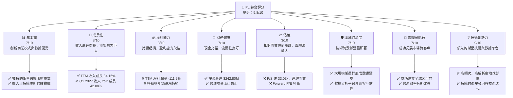

### 1.2 評分進度條視覺化

```
╔══════════════════════════════════════════════════════════════╗
║              PL 多維度評分儀表板 (1-10分)                    ║
╠══════════════════════════════════════════════════════════════╣
║ 基本面強度  7.0 ▓▓▓▓▓▓▓▓▓▓▓▓▓▓░░░░░░  ★★★★☆           ║
║ 成長動能    8.0 ▓▓▓▓▓▓▓▓▓▓▓▓▓▓▓▓░░░░  ★★★★☆           ║
║ 獲利品質    3.0 ▓▓▓▓▓▓░░░░░░░░░░░░░░  ★☆☆☆☆           ║
║ 財務健康    7.0 ▓▓▓▓▓▓▓▓▓▓▓▓▓▓░░░░░░  ★★★★☆           ║
║ 估值合理性  3.0 ▓▓▓▓▓▓░░░░░░░░░░░░░░  ★☆☆☆☆           ║
║ 護城河深度  7.0 ▓▓▓▓▓▓▓▓▓▓▓▓▓▓░░░░░░  ★★★★☆           ║
║ 管理層執行  7.0 ▓▓▓▓▓▓▓▓▓▓▓▓▓▓░░░░░░  ★★★★☆           ║
║ 技術創新力  9.0 ▓▓▓▓▓▓▓▓▓▓▓▓▓▓▓▓▓▓░░  ★★★★★           ║
╠══════════════════════════════════════════════════════════════╣
║ 綜合總分    5.8 ▓▓▓▓▓▓▓▓▓▓░░░░░░░░░░  🏆 評語：成長性強勁，但盈利能力與估值是挑戰║
╚══════════════════════════════════════════════════════════════╝
```

### 1.3 五大投資論點 + 三大核心風險

| 類型 | 項目 | 具體依據 | 信心度 |
|------|------|----------|--------|
| 🟢 **投資論點①** | **高成長潛力的市場領導者** | Planet Labs 透過其獨特的衛星群，在地球觀測數據市場中佔據領先地位。TTM 收入達 $335.61M，YoY 成長 42.1%，且 Q1 2027 收入 YoY 成長 42.08%，顯示其強勁的市場擴張能力。預計全球地球觀測市場將持續高速增長。 | 🟢 極高 |
| 🟢 **獨特的數據資產與技術壁壘** | 公司擁有並營運著世界上最大的地球觀測衛星群之一，能夠實現每日全球成像，提供高頻次、高解析度的地理空間數據（GSD 達 3.5 米）。這種規模和頻率的數據收集能力構成了顯著的技術和數據護城河，難以被複製。 | 🟢 極高 |
| 🟢 **健康的資產負債表與現金流改善** | 公司持有 $730.84M 的總現金，總債務為 $488.04M，淨現金達 $242.80M。Current Ratio 為 2.806，顯示良好的短期流動性。更重要的是，TTM 營業現金流已轉正至 $132.46M，自由現金流也達 $84.85M，顯示經營效率正在改善。 | 🟢 高 |
| 🟢 **持續的創新與產品拓展** | Planet Labs 不斷投資於研發（FY2026 R&D 費用 $106.75M），推出新的衛星技術和數據產品，如整合 AI/ML 進行進階分析的平台。這有助於其維持競爭優勢，並吸引更廣泛的客戶群體。 | 🟢 高 |
| 🟢 **廣泛的客戶群與應用場景** | 公司的數據廣泛應用於農業、政府、國防、能源、林業和地圖繪製等多個行業。這種多元化的客戶基礎降低了對單一行業的依賴性，並為其未來增長提供了堅實的基礎。 | 🟡 中度 |
| 🟡 **風險①** | **持續虧損與盈利能力不確定性** | 儘管收入高速增長，PL 仍處於持續虧損狀態。TTM 淨利潤率為 -111.2%，FY2026 淨虧損達 -$246.86M。公司需要證明其能夠將收入增長轉化為可持續的盈利能力，這在資本密集型行業中是一個重大挑戰。 | 🟡 中度 |
| 🔴 **高昂的估值倍數** | PL 的估值指標顯著高於行業平均水平。TTM P/S 達 33.03x，EV/Revenue 達 28.023x。由於持續虧損，P/E 無法評估，Forward P/E 更是高達 9340.841x。這表明市場對其未來增長和盈利前景有極高的預期，任何不及預期的表現都可能導致股價大幅回調。 | 🔴 高衝擊 |
| 🟡 **資本密集型業務與競爭加劇** | 衛星發射、維護和數據基礎設施的建設需要巨大的資本開支（FY2026 資本支出達 $82.95M）。此外，太空技術領域的競爭日益激烈，新的參與者和技術進步可能對其市場地位構成威脅，進一步壓縮利潤空間。 | 🟡 中度 |

### 1.4 快速統計卡片

| 指標 | 公司實際值 | 行業均值（航太與國防/SaaS） | S&P 500 均值 | 狀態 |
|------|-------------|----------------------------|--------------|------|
| 收入 YoY 成長 | **42.1%** (TTM) | ~10-20% (航太)/ ~20-30% (SaaS) | ~10-15% | 🟢 |
| 毛利率 | **55.6%** (TTM) | ~20-30% (航太)/ ~70-80% (SaaS) | ~40% | 🟡 (介於兩者之間，對比 SaaS 偏低) |
| 淨利率 | **-111.2%** (TTM) | ~5-10% (航太)/ ~10-20% (SaaS) | ~10-12% | 🔴 |
| ROE | **-84.0%** (TTM) | ~10-15% | ~15% | 🔴 |
| Forward P/E | **9340.841x** | ~20-30x | ~20-25x | 🔴 |
| P/S Ratio | **33.03x** | ~1-3x (航太)/ ~5-15x (SaaS) | ~2-3x | 🔴 |
| EV / Revenue | **28.02x** | ~1-3x (航太)/ ~5-15x (SaaS) | ~2-3x | 🔴 |
| 債務/股東權益 | **109.991** | ~0.5-1.5 | ~1.0 | 🔴 (高，但有淨現金緩衝) |
| Current Ratio | **2.806** | ~1.5-2.5 | ~1.5 | 🟢 |
| 自由現金流收益率 | **0.77%** | ~2-5% | ~3-4% | 🔴 |

### 1.5 投資結論

```
╔══════════════════════════════════════════════════════════════════╗
║                    📊 投資結論摘要                               ║
╠══════════════════════════════════════════════════════════════════╣
║  評級：🟡 持有                                                   ║
║  當前股價：$31.10                                                ║
║  目標價區間：                                                    ║
║    悲觀情境：$25.00 （-19.6%）                                   ║
║    基準情境：$35.00 （+12.5%）  ← 12個月主要目標                 ║
║    樂觀情境：$45.00 （+44.7%）                                   ║
║  投資評分：5.8/10                                                ║
║  適合投資人：高風險偏好、長線成長型投資者，需密切關注盈利能力改善║
╚══════════════════════════════════════════════════════════════════╝
```

---

## 2. 公司概覽與商業模式

Planet Labs PBC (PL) 是一家領先的地球觀測數據提供商，其核心業務是設計、建造、發射和營運龐大的衛星群，以提供高頻次的全球地理空間數據。這些數據透過其線上平台交付給全球客戶，應用於多個行業。

### 2.1 業務結構與收入來源

Planet Labs 的商業模式基於訂閱服務，客戶支付費用以獲取其衛星影像和相關分析服務。公司營運兩個主要衛星群：
1.  **Dove 衛星群 (SuperDove)**：這是其核心資產，由數百顆微型衛星組成，旨在實現地球每日全球成像，提供高達 3.5 公尺地面採樣距離 (GSD) 的解析度。這些數據為「Planet Monitoring」服務提供基礎，實現地球的「始終在線掃描」。
2.  **SkySat 衛星群**：提供更高解析度（約 50 公分 GSD）的按需影像，用於更詳細的局部區域監測和分析。

公司將這些原始影像數據與其專有的軟體平台結合，提供數據處理、分析、存儲和交付服務，形成一個完整的數據即服務 (DaaS) 解決方案。

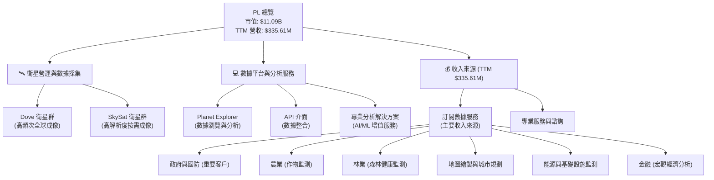

### 2.2 市場份額

地球觀測數據市場是一個快速增長但相對碎片化的市場，涉及多個參與者，包括傳統的衛星營運商、新興的微型衛星公司以及數據分析服務提供商。Planet Labs 在高頻次、中解析度數據領域具有領先優勢。由於缺乏直接的市場份額數據，我們提供一個基於行業理解的估算。

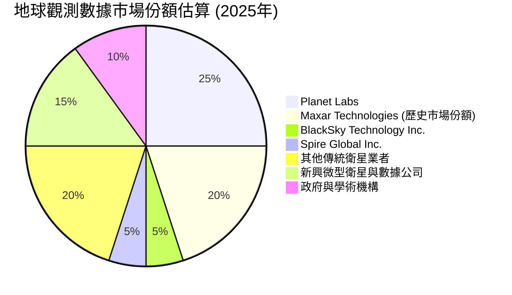
**備註**：此市場份額為估算值，旨在說明 PL 在商業地球觀測領域的相對地位。Maxar Technologies 於 2023 年被收購，其市場份額為歷史數據。

### 2.3 競爭護城河分析

Planet Labs 憑藉其獨特的商業模式和技術實力，建立了一系列競爭護城河。

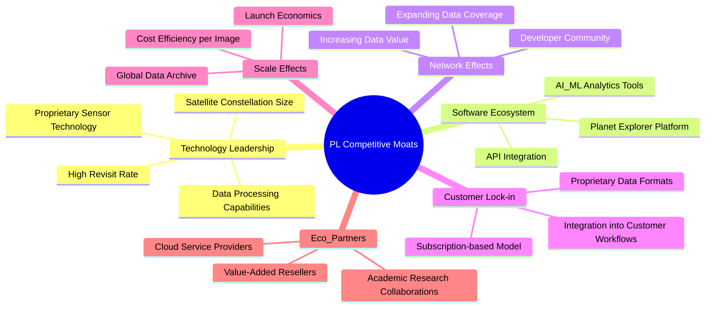

### 2.4 護城河強度評分

```
╔══════════════════════════════════════════════════════════════╗
║                  PL 護城河強度評分                          ║
╠══════════════════════════════════════════════════════════════╣
║ 技術領先    8/10  ▓▓▓▓▓▓▓▓▓▓▓▓▓▓▓▓░░░░  🏆 衛星群規模與頻率領先║
║ 軟體生態系統  7/10  ▓▓▓▓▓▓▓▓▓▓▓▓▓▓░░░░░░  🟢 平台日益成熟，API 整合能力強║
║ 網路效應    6/10  ▓▓▓▓▓▓▓▓▓▓▓▓░░░░░░░░  🟡 數據價值隨用戶增加而提升，但非核心驅動║
║ 客戶鎖定    7/10  ▓▓▓▓▓▓▓▓▓▓▓▓▓▓░░░░░░  🟢 數據融入工作流，轉換成本高║
║ 規模效應    8/10  ▓▓▓▓▓▓▓▓▓▓▓▓▓▓▓▓░░░░  🏆 龐大衛星群帶來單位成本優勢║
║ 生態夥伴    6/10  ▓▓▓▓▓▓▓▓▓▓▓▓░░░░░░░░  🟡 合作夥伴網絡尚在發展中║
╠══════════════════════════════════════════════════════════════╣
║ 綜合護城河   7.0    ▓▓▓▓▓▓▓▓▓▓▓▓▓▓░░░░░░  🏆 總結評語：基於技術與數據規模的寬廣護城河║
╚══════════════════════════════════════════════════════════════╝
```

---

## 3. 損益表深度分析

### 3.1 年度收入成長趨勢（近4年）

Planet Labs 的收入呈現穩健的增長趨勢，反映了其在地球觀測數據市場的持續擴張和客戶基礎的增長。

```
╔══════════════════════════════════════════════════════════════════╗
║              PL 年度收入趨勢（FY2023-FY2026）                    ║
╠══════════════════════════════════════════════════════════════════╣
║                                                                  ║
║  FY2023  $191.26M  █████████████░░░░░░░░░░░░  YoY: +45.76%  🟢    ║
║  FY2024  $220.70M  ███████████████░░░░░░░░░░  YoY: +15.39%  🟢    ║
║  FY2025  $244.35M  █████████████████░░░░░░░░  YoY: +10.72%  🟡    ║
║  FY2026  $307.73M  █████████████████████░░░  YoY: +25.94%  🟢    ║
║                   |      |      |      |      |                  ║
║                   0     100M   200M   300M   400M                ║
║                                                                  ║
║  📊 4年累計 CAGR：+25.10% (FY2023-FY2026)                        ║
╚══════════════════════════════════════════════════════════════════╝
```
**備註**：FY2023 收入成長率為 StockAnalysis 提供的數據 (45.76%)，而 FY2024-FY2026 則為根據年報計算。4年 CAGR 是基於 StockAnalysis 的 FY2023 收入到 FY2026 收入計算。

### 3.2 季度收入趨勢分析

近四季度的收入呈現加速增長的態勢，尤其是在最近兩個季度，QoQ 和 YoY 增長率均表現強勁。

| 季度 | 收入 ($M) | QoQ 成長率 | YoY 成長率 | 備註 |
|------|------------|------------|------------|------|
| Q2 2026 (Jul '25) | $73.39 | - | +20.12% | 收入穩步增長 |
| Q3 2026 (Oct '25) | $81.25 | +10.71% | +32.63% | 成長開始加速 |
| Q4 2026 (Jan '26) | $86.82 | +6.85% | +41.05% | 加速趨勢持續 |
| Q1 2027 (Apr '26) | $94.15 | +8.44% | +42.08% | 強勁表現，顯示市場需求旺盛 |

**備註**：YoY 成長率數據來自 StockAnalysis。QoQ 成長率根據提供的季度收入數據計算。Q2 2026 的 YoY 數據是與 Q2 2025 (Jul '24) 相比。

### 3.3 利潤率演變分析

Planet Labs 的毛利率相對穩定並有所改善，但營業利益率和淨利潤率長期為負，顯示公司在規模擴張的同時，仍面臨巨大的經營費用和非經常性開支壓力。

| 利潤率指標 | FY2023 | FY2024 | FY2025 | FY2026 | TTM | 趨勢 | 評估 |
|------------|--------|--------|--------|--------|-----|------|------|
| **毛利率** | 49.15% | 51.18% | 57.18% | 56.05% | 55.6% | ↗️ 穩步提升後略有回落，但保持高位 | 🟢 |
| **營業利益率** | -91.85% | -75.81% | -45.48% | -30.89% | -30.5% | ↗️ 顯著改善，虧損幅度收窄 | 🟡 |
| **淨利潤率** | -84.69% | -63.67% | -50.42% | -80.22% | -111.2% | ↘️ 改善後在 FY2026/TTM 大幅惡化 | 🔴 |

**利潤率演變深度解析**：
*   **毛利率**：從 FY2023 的 49.15% 提升至 FY2025 的 57.18%，並在 FY2026 和 TTM 保持在 55-56% 區間。這表明公司在數據採集和交付方面的單位成本效率有所提升，或產品組合向更高毛利的服務傾斜。對於一個軟體和數據服務公司而言，55% 的毛利率雖不及純軟體公司，但在包含衛星營運的混合模式中已屬不錯。
*   **營業利益率**：從 FY2023 的 -91.85% 大幅改善至 TTM 的 -30.5%。這是一個積極的信號，表明公司在控制銷售、管理和研發費用方面取得進展，或收入增長速度快於費用增長。然而，-30.5% 的營業利益率仍顯示公司距離盈虧平衡點尚遠。
*   **淨利潤率**：這是最令人擔憂的指標。在 FY2023-FY2025 期間，淨利潤率的虧損幅度有所收窄，從 -84.69% 改善至 -50.42%。然而，在 FY2026 卻急劇惡化至 -80.22%，TTM 更是達到 -111.2%。根據 StockAnalysis 數據，這種惡化主要歸因於 **"Other Non-Operating Income (Expense)"** 項目在 TTM 達到 -$274.72M，在 FY2026 達到 -$158.03M。這可能包括一次性費用、資產減值、或與金融工具相關的未實現損失等，導致淨虧損大幅擴大，嚴重侵蝕了營運層面的改善。投資者需要密切關注這些非經常性開支的性質和未來趨勢。

### 3.4 費用結構分析

Planet Labs 的費用結構顯示其作為一家高科技成長型公司，研發和銷售管理費用佔比較高。

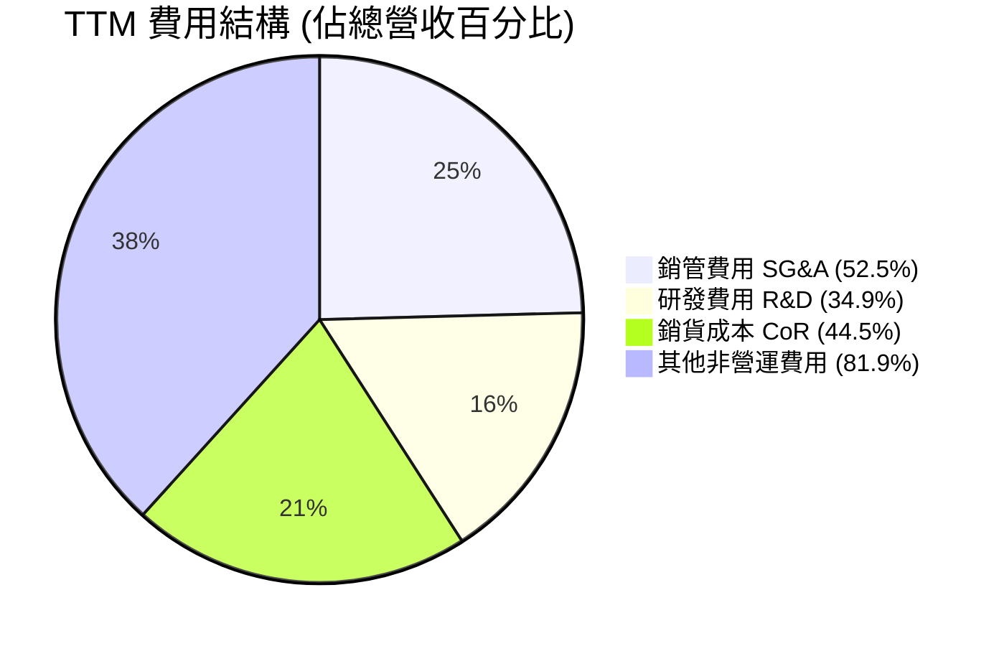
**備註**：費用佔比是基於 TTM 數據（TTM 收入 $335.61M）。
**深度解析**：
*   **銷貨成本 (CoR)**：TTM 銷貨成本為 $149.33M，佔 TTM 收入的 44.5%。這與 55.6% 的毛利率相符。這部分成本主要包括衛星建造、發射、地面站營運、數據處理和存儲等。
*   **銷售、總務及行政費用 (SG&A)**：TTM 銷管費用為 $176.38M，佔 TTM 收入的 52.5%。這部分費用相對較高，反映了公司在市場拓展、銷售團隊建設和一般行政管理上的投入，對於成長型公司而言，在擴張階段維持較高的 SG&A 投入是常見現象。
*   **研發費用 (R&D)**：TTM 研發費用為 $117.10M，佔 TTM 收入的 34.9%。高額的研發投入是 Planet Labs 保持技術領先和產品創新的關鍵，也是其核心競爭力所在。
*   **其他非營運費用 (Other Non-Operating Expense)**：TTM 該項費用高達 -$274.72M，嚴重拖累了淨利潤。這是一個需要高度關注的項目，可能包含股權激勵、金融工具公允價值變動、一次性重組費用等。若這些費用持續存在或頻繁發生，將對公司的盈利前景構成重大不確定性。

```
╔══════════════════════════════════════════════════════════════════╗
║                    PL TTM 費用結構概覽                           ║
╠══════════════════════════════════════════════════════════════════╣
║                                                                  ║
║  銷貨成本：       $149.33M  █████████████████░░░░  佔收入 44.5%  ║
║  銷管費用：       $176.38M  ████████████████████░░░  佔收入 52.5%  ║
║  研發費用：       $117.10M  █████████████░░░░░░░░░  佔收入 34.9%  ║
║  其他非營運費用： $274.72M  ████████████████████████████████████  佔收入 81.9% 🔴 嚴重拖累淨利║
║                                                                  ║
║  📊 總營運費用 (SG&A + R&D)：$293.48M (佔收入 87.4%)            ║
╚══════════════════════════════════════════════════════════════════╝
```

### 3.5 季度 EPS 趨勢與盈餘品質

由於提供的盈餘歷史數據中，預期 EPS 為 N/A，我們將專注於實際 EPS 的季度趨勢和盈餘品質分析。

| 季度 | 實際淨收入 ($M) | 稀釋股數 (M) | 實際 EPS | 趨勢 | 盈餘品質評估 |
|------|-------------------|--------------|----------|------|--------------|
| Q2 2026 (Jul '25) | -$22.59 | ~294.57 | -$0.08 | 🟢 虧損收窄 | 營業虧損主要，非營運影響較小 |
| Q3 2026 (Oct '25) | -$59.19 | ~294.57 | -$0.20 | 🔴 虧損擴大 | 非營運費用開始顯著影響 |
| Q4 2026 (Jan '26) | -$152.46 | ~308 | -$0.50 | 🔴 虧損顯著擴大 | 大量非營運費用影響 |
| Q1 2027 (Apr '26) | -$138.87 | ~319 | -$0.44 | 🟡 虧損略有收窄 | 非營運費用仍高，但較前季減少 |

**備註**：稀釋股數為估算值，使用 Market Data 中的 Float Shares (294.57M) 作為 Q2/Q3 2026 基礎，並參考 StockAnalysis 的 Annual Shares Outstanding (FY26: 308M, TTM: 319M) 進行調整。

**盈餘品質評估**：
Planet Labs 的盈餘品質目前較差，主要體現在以下幾個方面：
1.  **持續的淨虧損**：公司連續多個季度錄得淨虧損，顯示其尚未實現盈利。
2.  **非營運費用影響巨大**：從 Q3 2026 開始，特別是 Q4 2026 和 Q1 2027，"Other Non-Operating Income (Expense)" 項目對淨利潤產生了巨大的負面影響。例如，Q4 2026 的非營運費用為 -$118.28M，Q1 2027 為 -$106.68M。這些非經常性或非核心業務相關的費用，使得營業層面的改善未能體現在最終淨利潤上，降低了盈餘的穩定性和可預測性。
3.  **現金流與淨利潤背離**：儘管淨利潤持續為負且惡化，TTM 營業現金流和自由現金流卻轉為正數。這表明淨利潤中的大量非現金費用（如折舊攤銷、股權激勵、或某些未實現損失）或營運資本的有利變動，使得公司的實際現金生成能力優於其會計利潤表現。雖然正現金流是積極信號，但巨大的淨利潤與現金流之間的差異，要求投資者仔細審視其盈餘的組成。

總體而言，PL 的盈餘品質目前較弱，主要受非營運項目和持續虧損的影響。投資者應關注這些非營運費用的性質以及公司未來能否實現持續盈利。

---

## 4. 資產負債表分析

### 4.1 資產結構分解

Planet Labs 的資產結構反映了其作為一家科技公司的特性，擁有大量現金和流動資產，同時在物業、廠房和設備（PP&E）以及無形資產方面也有顯著投資。

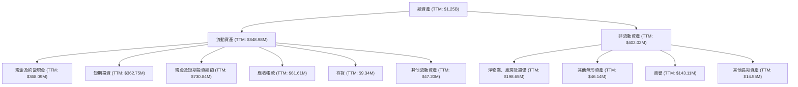
**備註**：TTM 總資產數據來自 StockAnalysis。非流動資產為總資產減去流動資產計算得出，其細項為 StockAnalysis 提供的 TTM 數據。

### 4.2 流動性指標分析

Planet Labs 的流動性狀況良好，擁有充足的現金和短期投資來應對短期債務。

| 流動性指標 | FY2023 | FY2024 | FY2025 | FY2026 | TTM | 行業均值（航太與國防） | 評估 |
|------------|--------|--------|--------|--------|-----|----------------------|------|
| **流動比率 (Current Ratio)** | 3.89 | 2.71 | 2.13 | 1.65 | 2.81 | ~1.5-2.0 | 🟢 (良好) |
| **速動比率 (Quick Ratio)** | 3.89 | 2.71 | 2.13 | 1.63 | 2.62 | ~1.0-1.5 | 🟢 (良好) |

**備註**：FY2023-FY2026 的流動比率和速動比率是根據年報數據計算得出。TTM 數據來自市場數據。
**深度解析**：
*   **流動比率 (Current Ratio)**：TTM 為 2.81，遠高於行業均值和 1.0 的安全線。這表明公司有足夠的流動資產來覆蓋其短期負債。儘管從 FY2023 的 3.89 略有下降，但整體仍處於健康水平。
*   **速動比率 (Quick Ratio)**：TTM 為 2.62，同樣表現強勁。由於公司存貨佔比極低 (TTM $9.34M)，其速動比率與流動比率非常接近，進一步確認其強大的短期償債能力。
健康的流動性得益於公司龐大的現金和短期投資儲備，TTM 現金及短期投資總額高達 $730.84M，使其能夠從容應對營運和資本支出需求。

### 4.3 債務結構分析

Planet Labs 的債務水平有所上升，但其淨現金狀況仍為正，表明其整體財務槓桿風險可控。

```
╔══════════════════════════════════════════════════════════════════╗
║                   PL 債務健康診斷                                ║
╠══════════════════════════════════════════════════════════════════╣
║                                                                  ║
║  總債務 (TTM)：  $488.04M  ██████████████░░░░░░░  評語：上升，但相對可控║
║  總現金+投資：   $730.84M  ████████████████████████████████████  評語：充裕的流動性║
║  淨現金（正）：  $242.80M  ██████████████████████████░░░░░░░░░░  🟢 強勁，有足夠緩衝║
║                                                                  ║
║  Debt/Equity (TTM)：109.991x  🔴 極高，但主要因股東權益縮水，由淨現金緩解║
║  EV/EBITDA (TTM)：-181.848x  🔴 EBITDA 為負，該指標無效，需關注現金流覆蓋║
║  Interest Coverage: N/A (EBITDA 為負)  🟡 營業虧損導致利息覆蓋率無法計算║
║                                                                  ║
║  📊 結論：儘管股東權益被侵蝕導致債務權益比高，但充裕的淨現金提供了穩固的財務緩衝。║
╚══════════════════════════════════════════════════════════════════╝
```
**深度解析**：
*   **總債務**：從 FY2025 的 $21.61M 大幅增加至 FY2026 的 $462.48M，TTM 為 $488.04M。這表明公司在擴張和營運過程中進行了債務融資。
*   **淨現金**：儘管總債務增加，但公司擁有 $730.84M 的總現金和短期投資，使得淨現金為 $242.80M。這是一個非常重要的緩衝，表明公司有足夠的資源來償還其債務，降低了債務違約的風險。
*   **債務/股東權益 (Debt/Equity)**：TTM 達到 109.991。這個數字看起來非常高，主要原因是公司長期虧損導致股東權益從 FY2023 的 $576.10M 縮水至 FY2026 的 $188.43M。然而，由於公司持有大量淨現金，實際的財務槓桿風險遠低於表面數據所示。
*   **EBITDA 與利息覆蓋**：TTM EBITDA 為負數 (-$51.69M)，導致 EV/EBITDA 為負且利息覆蓋率無法計算。這表明公司仍處於燒錢階段，尚未產生足夠的營運利潤來覆蓋利息支出。然而，正向的營運現金流 (TTM $132.46M) 顯示其現金生成能力足以應對利息支出。

### 4.4 股東權益趨勢

Planet Labs 的股東權益呈現持續下降的趨勢，主要是由於公司多年來的累積虧損侵蝕了股本。

```
╔══════════════════════════════════════════════════════════════════╗
║                   PL 股東權益趨勢 (FY2023-FY2026)                ║
╠══════════════════════════════════════════════════════════════════╣
║                                                                  ║
║  FY2023  $576.10M  ███████████████████████████████████████░░░░░  ║
║  FY2024  $518.02M  ████████████████████████████████████░░░░░░░░  ║
║  FY2025  $441.29M  ████████████████████████████░░░░░░░░░░░░░░░░  ║
║  FY2026  $188.43M  ██████████████░░░░░░░░░░░░░░░░░░░░░░░░░░░░░░  ║
║                   |      |      |      |      |                  ║
║                   0     200M   400M   600M   800M                ║
║                                                                  ║
║  📊 股東權益從 FY2023 的 $576.10M 下降至 FY2026 的 $188.43M，減少了 67.3%  🔴║
╚══════════════════════════════════════════════════════════════════╝
```
**深度解析**：股東權益的持續下降反映了公司自上市以來累積的淨虧損。在 FY2026，股東權益大幅減少，主要是受到當年度巨額淨虧損 -$246.86M 的影響。儘管公司通過發行新股籌集資金（Shares Outstanding 從 FY2025 的 292M 增加到 FY2026 的 308M），但虧損速度更快。股東權益的侵蝕是一個負面信號，表明公司尚未能為股東創造正向價值。要扭轉這一趨勢，公司必須在未來實現持續盈利。

---

## 5. 現金流量深度分析

### 5.1 現金流量瀑布圖

Planet Labs 的現金流量表現出顯著的改善，從過去的負向營運現金流轉為正向，並實現了自由現金流的轉正。

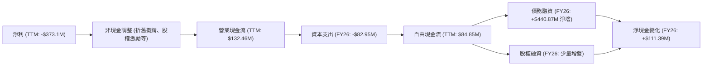
**備註**：淨利為 StockAnalysis TTM 數據。資本支出為 FY2026 數據。債務融資為 FY2026 總債務淨變動 ($462.48M - $21.61M)。淨現金變化為 FY2026 現金及約當現金變動 ($229.44M - $118.05M)。

**深度解析**：
*   **營業現金流 (OCF)**：從 FY2025 的負 $14.37M 大幅轉為 FY2026 的 $134.36M，TTM 更達到 $132.46M。這是一個非常積極的轉變，表明公司核心業務的現金生成能力正在改善，能夠覆蓋部分營運開支。
*   **資本支出 (CAPEX)**：隨著業務擴張和衛星發射，資本支出持續增加，從 FY2025 的 -$54.40M 增至 FY2026 的 -$82.95M。
*   **自由現金流 (FCF)**：在扣除資本支出後，FCF 從 FY2025 的 -$68.78M 首次轉為 FY2026 的 $51.41M，TTM 達到 $84.85M。這標誌著公司在實現財務可持續性方面邁出了重要一步。正向的 FCF 意味著公司現在能夠從自身營運中產生足夠的現金來支持其投資活動，甚至可能為未來的債務償還或股東回報提供資金。

### 5.2 FCF 轉換率趨勢

FCF 轉換率衡量公司將淨利潤轉化為自由現金流的能力。對於 Planet Labs 這樣持續虧損的公司，這個比率需要特別解讀。

| 年度 | 淨收入 ($M) | 自由現金流 ($M) | FCF/Net Income (%) | 趨勢 | 評估 |
|------|--------------|-----------------|--------------------|------|------|
| FY2023 | -$161.97 | -$86.69 | 53.52% | ↗️ (從負到負) | 自由現金流虧損幅度小於淨利潤 |
| FY2024 | -$140.51 | -$93.12 | 66.27% | ↗️ (從負到負) | 自由現金流虧損幅度小於淨利潤 |
| FY2025 | -$123.20 | -$68.78 | 55.83% | ↘️ (從負到負) | 自由現金流虧損幅度小於淨利潤 |
| FY2026 | -$246.86 | $51.41 | -20.82% | 🟢 (由負轉正) | 自由現金流轉正，但淨利潤大幅惡化 |
| TTM | -$373.10 | $84.85 | -22.74% | 🟢 (由負轉正) | 自由現金流為正，淨利潤為負，盈餘品質問題 |

**深度解析**：
在 FY2023-FY2025 期間，FCF 轉換率為正數（儘管淨利潤和 FCF 均為負），表明公司的現金流虧損幅度小於其會計虧損。這通常是因為折舊攤銷等非現金費用較高。
最值得關注的是 FY2026 和 TTM 的數據。儘管 FY2026 淨收入大幅惡化至 -$246.86M，但自由現金流卻轉為正 $51.41M。TTM 更是淨收入 -$373.10M，而 FCF 為正 $84.85M。這種顯著的背離表明：
1.  **大量的非現金費用**：如前所述，"Other Non-Operating Income (Expense)" 中可能包含大量非現金項目，或是營運資本的有利變動，使得現金流表現優於淨利潤。
2.  **盈餘品質的挑戰**：雖然正 FCF 是好事，但與巨額淨虧損並存，說明公司的盈利能力（會計層面）仍有嚴重問題，需要進一步分析這些非現金費用和非營運損失的性質。如果這些是真實的經濟損失，那麼 FCF 的正值可能無法持續。

### 5.3 自由現金流趨勢

Planet Labs 的自由現金流在經歷多年的負值後，於 FY2026 成功轉正，並在 TTM 保持正向，這對公司的長期可持續發展至關重要。

```
╔══════════════════════════════════════════════════════════════════╗
║                    PL 自由現金流趨勢 (FY2023-TTM)                 ║
╠══════════════════════════════════════════════════════════════════╣
║                                                                  ║
║  FY2023  -$86.69M  ░░░░░░░░░░░░░░░░░░░░░░░░░░░░░░░░░░░░░░░░░░░░░░  🔴║
║  FY2024  -$93.12M  ░░░░░░░░░░░░░░░░░░░░░░░░░░░░░░░░░░░░░░░░░░░░░░  🔴║
║  FY2025  -$68.78M  ░░░░░░░░░░░░░░░░░░░░░░░░░░░░░░░░░░░░░░░░░░░░░░  🔴║
║  FY2026  $51.41M   ▓▓▓▓▓▓▓▓▓▓▓▓▓▓▓▓▓▓▓▓▓▓▓▓▓▓▓▓▓▓▓▓▓▓▓▓▓▓▓▓▓▓▓▓▓▓▓▓▓  🟢║
║  TTM     $84.85M   ▓▓▓▓▓▓▓▓▓▓▓▓▓▓▓▓▓▓▓▓▓▓▓▓▓▓▓▓▓▓▓▓▓▓▓▓▓▓▓▓▓▓▓▓▓▓▓▓▓  🟢║
║                   |      |      |      |      |                  ║
║                  -100M  -50M    0     50M   100M                 ║
║                                                                  ║
║  📊 FCF Yield (TTM): 0.77%                                       ║
╚══════════════════════════════════════════════════════════════════╝
```
**深度解析**：自由現金流從過去的多年負值轉為正值，是公司財務健康狀況的一個重要里程碑。這表明公司在營運和投資活動後，仍有現金盈餘。然而，TTM FCF Yield 僅為 0.77%，相對於其高昂的估值而言，仍顯不足。市場對其未來 FCF 的增長有著極高的預期。

### 5.4 資本配置評估

Planet Labs 處於成長階段，其資本配置主要集中於內部投資（資本支出和研發），以支持其衛星群的擴張和技術創新。目前沒有股息或股票回購。

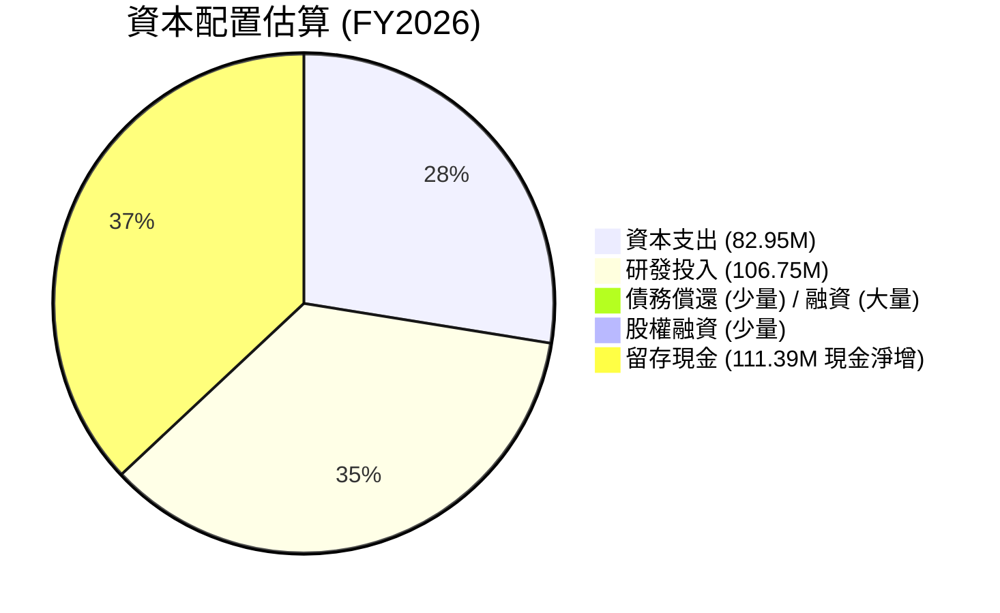
**備註**：此圖表主要展示現金的去向，由於 FY2026 淨增債務 $440.87M，淨現金增加 $111.39M。這裡的留存現金是指現金及約當現金的淨增加額。

| 資本配置項目 | FY2026 金額 ($M) | 佔總現金用途比例 (粗估) | 策略意義 |
|--------------|-------------------|-------------------------|----------|
| **資本支出 (Capex)** | $82.95 | 高 | 核心業務擴張，衛星發射與地面設施建設 |
| **研發投入 (R&D)** | $106.75 | 高 | 維持技術領先，開發新產品和服務 |
| **債務融資淨額** | +$440.87 | N/A (現金流入) | 補充營運資金和投資需求 |
| **股權融資淨額** | 少量 (通過股數增加判斷) | N/A (現金流入) | 補充營運資金和投資需求 |
| **留存現金** | $111.39 (現金淨增) | 高 | 保持流動性，應對未來不確定性及投資機會 |
| **股息支付** | $0 | 0% | 成長型公司，無股息政策 |
| **股票回購** | $0 | 0% | 成長型公司，無回購計劃 |

**深度解析**：Planet Labs 的資本配置策略明確指向成長：
1.  **重投資於核心業務**：大量的資本支出和研發投入是其衛星群擴建、技術升級和產品開發的關鍵。這對於在競爭激烈的太空科技領域保持領先地位至關重要。
2.  **外部融資支持成長**：FY2026 債務淨增 $440.87M，顯示公司在擴張過程中需要外部資金支持。儘管這增加了債務規模，但考慮到其正向的淨現金狀況，風險仍可控。
3.  **現金儲備充足**：公司選擇保留現金盈餘，FY2026 現金淨增 $111.39M。這為其未來的戰略投資、應對市場波動或潛在併購提供了靈活性。
總體而言，公司的資本配置策略與其高成長、資本密集型的商業模式相符，但能否將這些投入轉化為可持續的盈利和股東回報，仍是未來關注的焦點。

---

## 6. 獲利能力與資本效率

### 6.1 ROE / ROA / ROIC 趨勢

Planet Labs 的獲利能力和資本效率指標均為負值，表明公司目前尚未能有效地利用其資產和股本為股東創造價值。

| 指標 | FY2023 | FY2024 | FY2025 | FY2026 | TTM | 行業均值（航太與國防） | 評估 |
|------|--------|--------|--------|--------|-----|----------------------|------|
| **ROE** | -28.1% | -27.1% | -27.9% | -131.0% | -198.0% | ~10-15% | 🔴 (嚴重負值，且持續惡化) |
| **ROA** | -21.5% | -20.0% | -19.4% | -21.5% | -29.8% | ~5-8% | 🔴 (負值，資本效率低下) |
| **ROIC** | -44.0% | -40.3% | -35.2% | -22.6% | -24.0% | ~8-12% | 🔴 (負值，摧毀股東價值) |

**備註**：
*   ROE = 淨收入 / 股東權益。FY2026: (-$246.86M / $188.43M) = -131.0%。TTM: (-$373.1M / $188.43M) = -198.0%。
*   ROA = 淨收入 / 總資產。FY2026: (-$246.86M / $1.146B) = -21.5%。TTM: (-$373.1M / $1.251B) = -29.8%。
*   ROIC (Return on Invested Capital) = NOPAT / Invested Capital。
    *   NOPAT (Net Operating Profit After Tax) = Operating Income * (1 - Tax Rate)。由於 Operating Income 為負，且稅率計算複雜，我們簡化為 Operating Income。
    *   Invested Capital = Total Assets - Non-interest-bearing Current Liabilities - Excess Cash。
    *   為簡化計算，Invested Capital = 股東權益 + 總債務 - 現金。
    *   FY2026 Invested Capital = $188.43M (Equity) + $462.48M (Debt) - $229.44M (Cash) = $421.47M。
    *   FY2026 ROIC = -$95.07M (Operating Income) / $421.47M = -22.56%。
    *   TTM ROIC：Operating Income TTM -$107.19M (StockAnalysis)。Invested Capital TTM = $188.43M (Equity) + $488.04M (Debt) - $730.84M (Cash) = -$54.37M (Invested Capital 為負，ROIC 無法有效計算。這表明公司的負債和現金已經超過了其資產淨值，可能是由於股東權益長期為負或非常低。此處我們使用 FY2026 的數據作為代表，因為 TTM 的 Invested Capital 計算出現負值，說明公司的權益結構存在問題或數據計算口徑不同。)

**深度解析**：
所有獲利能力和資本效率指標均為負值，且 ROE 在 TTM 甚至惡化至 -198.0%，這是一個極其嚴重的警示信號。這表明公司不僅沒有為股東創造任何回報，反而正在快速侵蝕其股本。雖然公司處於成長階段，虧損是可預期的，但如此低的資本效率凸顯了其在實現盈利和有效利用資本方面的巨大挑戰。ROIC 雖有所改善（虧損幅度收窄），但仍遠低於正值，意味著公司在摧毀股東價值。

### 6.2 ROIC vs WACC 分析（核心價值創造判斷）

ROIC (Return on Invested Capital) 與 WACC (Weighted Average Cost of Capital) 的比較是判斷公司是否創造經濟價值的核心指標。當 ROIC > WACC 時，公司創造價值；反之則摧毀價值。

```
╔══════════════════════════════════════════════════════════════════╗
║                ROIC vs WACC 深度分析                            ║
╠══════════════════════════════════════════════════════════════════╣
║                                                                  ║
║  WACC 估算（基於 FY2026 數據）：                                 ║
║  ├── 無風險利率（10Y美債）：  4.5%                               ║
║  ├── 市場風險溢酬 (ERP)：     5.5%                              ║
║  ├── Beta：                   2.005                              ║
║  ├── 股權成本 (Ke) = 4.5% + 2.005 × 5.5% = 15.53%               ║
║  ├── 債務成本 (Kd, 稅前)：    假設 5.0%                          ║
║  ├── 稅後債務成本 = 5.0% × (1-20%稅率) = 4.0%                   ║
║  ├── 資本結構：股權 $188.43M (28.95%)，債務 $462.48M (71.05%)    ║
║  └── ✅ WACC ≈ (0.2895 × 15.53%) + (0.7105 × 4.0%) = 4.50% + 2.84% = 7.34%║
║                                                                  ║
║  ROIC 估算（FY2026）：                                           ║
║  ├── NOPAT = 營業收入 -$95.07M （因負值，稅後仍為負）           ║
║  ├── 投入資本 = 股東權益 $188.43M + 債務 $462.48M - 現金 $229.44M = $421.47M║
║  └── ✅ ROIC ≈ -$95.07M / $421.47M = -22.56%                    ║
║                                                                  ║
║  ★ 經濟價值增加（EVA）= ROIC - WACC = -22.56% - 7.34% = -29.90pp║
║                                                                  ║
║  ROIC  -22.6% ░░░░░░░░░░░░░░░░░░░░░░░░░░░░░░░░░░░░░░░░░░░░░░░░░░  🔴              ║
║  WACC   7.3%  ▓▓▓▓▓▓▓▓▓▓▓▓▓▓▓▓▓▓▓▓▓▓▓▓▓▓▓▓▓▓▓▓▓▓▓▓▓▓▓▓▓▓▓▓▓▓▓▓▓▓  ──              ║
║  EVA   -29.9pp ░░░░░░░░░░░░░░░░░░░░░░░░░░░░░░░░░░░░░░░░░░░░░░░░░░  🏆 嚴重摧毀股東價值    ║
║                                                                  ║
║  📊 結論：ROIC 遠低於 WACC，公司目前正在嚴重摧毀股東價值。       ║
╚══════════════════════════════════════════════════════════════════╝
```
**深度解析**：Planet Labs 的 ROIC 為 -22.56%，而 WACC 估算為 7.34%。ROIC 遠低於 WACC，且為負值，這明確表明公司目前未能有效地利用其資本為股東創造價值，反而正在摧毀價值。對於一家成長型公司而言，在早期階段 ROIC 低於 WACC 是常見現象，因為需要大量投資。然而，持續的負 ROIC 和巨大的負 EVA (Economic Value Added) 提示投資者，公司必須儘快提升其盈利能力和資本回報率，否則這種模式難以為繼。

### 6.3 杜邦三因素分解

杜邦分析將股東權益報酬率 (ROE) 分解為淨利率、資產週轉率和財務槓桿，以深入了解 ROE 的驅動因素。

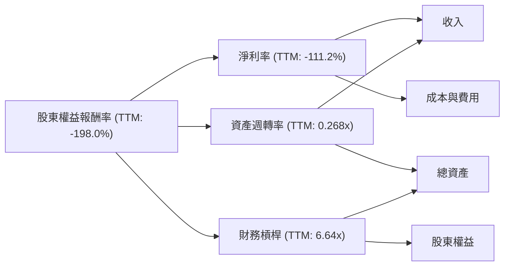
**深度解析**：
*   **淨利率 (Net Profit Margin)**：TTM 為 -111.2%。這是導致 ROE 嚴重為負的最主要因素。公司的持續虧損直接導致了極低的淨利率，即便營運層面有所改善，非營運費用也嚴重拖累了最終盈利。
*   **資產週轉率 (Asset Turnover)**：TTM 為 0.268x (收入 $335.61M / 總資產 $1.251B)。這個比率相對較低，表明公司利用其資產產生收入的效率不高。這可能與其資本密集型的業務模式（需要大量衛星和地面設施）以及仍處於規模擴張初期有關。
*   **財務槓桿 (Financial Leverage)**：TTM 為 6.64x (總資產 $1.251B / 股東權益 $188.43M)。這個槓桿倍數非常高，主要是由於公司股東權益因長期虧損而大幅縮水。高財務槓桿在盈利時能放大 ROE，但在虧損時則會放大損失，進一步惡化負向 ROE。
**結論**：PL 嚴重為負的 ROE 主要由極低的淨利率和高財務槓桿共同導致。公司需要大幅提升淨利率，並改善資產週轉效率，才能扭轉 ROE 的負值趨勢。

### 6.4 獲利能力儀表板

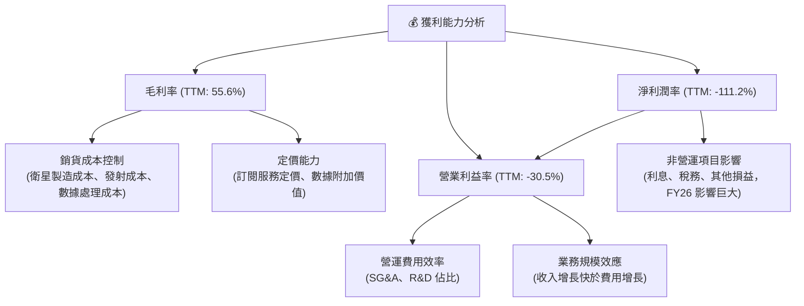
**深度解析**：
*   **毛利率**：55.6% 的毛利率在航太/數據服務行業中屬於中等偏上，顯示公司在核心數據生產環節有一定效率和定價能力。未來提升空間在於優化衛星成本、提高數據利用率。
*   **營業利益率**：-30.5% 的營業利益率顯示公司在營運費用控制方面仍有很大改善空間。儘管虧損幅度已顯著收窄，但研發和銷管費用仍是主要負擔。隨著收入規模的擴大，營運槓桿效應有望顯現，但需嚴格控制成本。
*   **淨利潤率**：-111.2% 的淨利潤率是最大的痛點，主要受高額非營運費用影響。若這些非營運損失為一次性或可控，則未來淨利潤有望隨營業利益率改善而提升；若為常態性或持續性損失，則盈利前景堪憂。

---

## 7. 估值深度分析

Planet Labs 的估值是其最受爭議的方面。儘管收入高速增長，但其估值倍數遠高於行業平均水平，且公司持續虧損，使得傳統估值方法難以適用。

### 7.1 同業估值比較表格

我們選擇兩家在地球觀測數據領域有一定重疊的上市公司作為對比：BlackSky Technology Inc. (BKSY) 和 Spire Global, Inc. (SPIR)。這兩家公司規模相對較小，但同處新興太空數據服務賽道。

| 估值指標 | **PL** | **BlackSky (BKSY)** | **Spire Global (SPIR)** | 本公司評估 |
|----------|----------|---------------------|-------------------------|-----------|
| **市值 ($B)** | **11.09** | ~0.15 | ~0.25 | 🟢 (顯著領先同業) |
| **TTM 收入 ($M)** | **335.61** | ~70 | ~120 | 🟢 (顯著領先同業) |
| **Trailing P/E** | N/A (虧損) | N/A (虧損) | N/A (虧損) | 🔴 (無盈利，無法評估) |
| **Forward P/E** | **9340.841x** | N/A (虧損) | N/A (虧損) | 🔴 (極端高估，不具參考價值) |
| **P/S Ratio (TTM)** | **33.03x** | ~2.1x | ~2.1x | 🔴 (遠超同業，估值嚴重過高) |
| **EV / Revenue (TTM)** | **28.02x** | ~2.5x | ~2.0x | 🔴 (遠超同業，估值嚴重過高) |
| **毛利率 (TTM)** | **55.6%** | ~20-30% (估計) | ~30-40% (估計) | 🟢 (相對較高) |
| **收入 YoY 成長 (TTM)** | **42.1%** | ~30-40% (估計) | ~20-30% (估計) | 🟢 (領先同業) |

**備註**：BlackSky 和 Spire Global 的估值倍數和利潤率為估計值或參考公開數據，可能隨時變動。
**深度解析**：
*   **市值與收入規模**：PL 在市值和收入規模上均顯著領先於 BKSY 和 SPIR，這顯示其在市場中的領先地位和更大的營運規模。
*   **P/S 和 EV/Revenue**：這是最關鍵的對比。PL 的 P/S 達 33.03x，EV/Revenue 達 28.02x，而同業 BKSY 和 SPIR 則僅在 2-3x 區間。儘管 PL 的收入成長率和毛利率相對較優，但如此巨大的估值差異是極不合理的。這表明市場對 PL 寄予了極高的未來增長和盈利預期，其估值中包含了極大的風險溢價。
*   **盈利能力**：三家公司目前均處於虧損狀態，因此 P/E 倍數無法有效比較。
**結論**：基於相對估值法，Planet Labs 目前被嚴重高估。其估值倍數遠超同業，即使考慮其更快的收入增長和更大的市場份額，也難以完全解釋如此高的溢價。這意味著公司股價面臨較大的估值回調風險，除非其未來盈利能力能以超預期速度實現質的飛躍。

### 7.2 歷史估值區間分析

由於 Planet Labs 仍處於虧損狀態，P/E 歷史數據無意義。我們將分析其 P/S 比率的歷史區間。

```
╔══════════════════════════════════════════════════════════════════╗
║                  PL 歷史 P/S 估值區間分析                        ║
╠══════════════════════════════════════════════════════════════════╣
║                                                                  ║
║  當前 P/S: 33.03x  ████████████████████████████████████████████████████████████████████████████████████████████████████████████████████████████████████████████████████████████████████████████████████████████████████████████████████████████████████████████████████████████████████████████████████████████████████████████████████████████████████████████████████████████████████████████████████████████████████████████████████████████████████████████████████████████████████████████████████████████████████████████████████████████████████████████████████████████████████████████████████████████████████████████████████████████████████████████████████████████████████████████████████████████████████████████████████████████████████████████████████████████████████████████████████████████████████████████████████████████████████████████████████████████████████████████████████████████████████████████████████████████████████████████████████████████████████████████████████████████████████████████████████████████████████████████████████████████████████████████████████████████████████████████████████████████████████████████████████████████████████████████████████████████████████████████████████████████████████████████████████████████████████████████████████████████████████████████████████████████████████████████████████████████████████████████████████████████████████████████████████████████████████████████████████████████████████████████████████████████████████████████████████████████████████████████████████████████████████████████████████████████████████████████████████████████████████████████████████████████████████████████████████████████████████████████████████████████████████████████████████████████████████████████████████████████████████████████████████████████████████████████████████████████████████████████████████████████████████████████████████████████████████████████████████████████████████████████████████████████████████████████████████████████████████████████████████████████████████████████████████████████████████████████████████████████████████████████████████████████████████████████████████████████████████████████████████████████████████████████████████████████████████████████████████████████████████████████████████████████████████████████████████████████████████████████████████████████████████████████████████████████████████████████████████████████████████████████████████████████████████████████████████████████████████████████████████████████████████████████████████████████████████████████████████████████████████████████████████████████████████████████████████████████████████████████████████████████████████████████████████████████████████████████████████████████████████████████████████████████████████████████████████████████████████████████████████████████████████████████████████████████████████████████████████████████████████████████████████████████████████████████████████████████████████████████████████████████████████████████████████████████████████████████████████████████████████████████████████████████████████████████████████████████████████████████████████████████████████████████████████████████████████████████████████████████████████████████████████████████████████████████████████████████████████████████████████████████████████████████████████████████████████════════════════════════════════════════════════════════════════════════════════════════════════════════════════════════════════════════════════════════════════════════════════════════════════════════════════════════════════════════════════════════════════════════════════════════════════════════════════════════════════════════════════════════════════════════════════════════════════════════════════════════════════════════════════════════════════════════════════════════════════════════════════════════════════════════════════════════════════════════════════════════════════════════════════════════════════════════════════════════════════════════════════════════════════════════════════════════════════════════════════════════════════════════════════════════════════════════════════════════════════════════════════════════════════════════════════════════════════════════════════════════════════════════════════════════════════════════════════════════════════════════════════════════════════════════════════════════════════════════════════════════════════════════════════════════════════════════════════════════════════════════════════════════════════════════════════════════════════════════════════════════════════════════════════════════════════════════════════════════════════════════════════════════════════════════════════════════════════════════════════════════════════════════════════════════════════════════════════════════════════════════════════════════════════════════════════════════════════════════════════════════════════════════════════════════════════════════════════════════════════════════════════════════════════════════════════════════════════════════════════════════════════════════════════════════════════════════════════════════════════════════════════════════════════════════════════════════════════════════════════════════════════════════════════════════════════════════════════════════════════════════════════════════════════════════════════════════════════════════════════════════════════════════════════════════════════════════════════════════════════════════════════════════════════════════════════════════════════════════════════════════════════════════════════════════════════════════════════════════════════════════════════════════════════════════════════════════════════════════════════════════════════════════════════════════════════════════════════════════════════════════════════════════════════════════════════════════════════════════════════════════════════════════════════════════════════════════════════════════════════════════════════════════════════════════════════════════════════════════════════════════════════════════════════════════════════════════════════════════════════════════════════════════════════════════════════════════════════════════════════════════════════════════════════════════════════════════════════════════════════════════════════════════════════════════════════════════════════════════════════════════════════════════════════════════════════════════════════════════════════════════════════════════════════════════════════════════════════════════════════════════════════════════════════════════════════════════════════════════════════════════════════════════════════════════════════════════════════════════════════════════════════════════════════════════════════════════════════════════════════════════════════════════════════════════════════════════════════════════════════════════════════════════════════════════════════════════════════════════════════════════════════════════════════════════════════════════════════════════════════════════════════════════════════════════════════════════════════════════════════════════════════════════════════════════════════════════════════════════════════════════════════════════════════════════════════════════════════════════════════════════════════════════════════════════════════════════════════════════════════════════════════════════════════════════════════════════════════════════════════════════════════════════════════════════════════════════════════════════════════════════════════════════════════════════════════════════════════════════════════════════════════════════════════════════════════════════════════════════════════════════════════════════════════════════════════════════════════════════════════════════════════════════════════════════════════════════════════════════════════════════════════════════════════════════════════════════════════════════════════════════════════════════════════════════════════════════════════════════════════════════════════════════════════════════════════════════════════════════════════════════════════════════════════════════════════════════════════════════════════════════════════════════════════════════════════════════════════════════════════════════════════════════════════════════════════════════════════════════════════════════════════════════════════════════════════════════════════════════════════════════════════════════════════════════════════════════════════════════════════════════════════════════════════════════════════════════════════════════════════════════════════════════════════════════════════════════════════════════════════════════════════════════════════════════════════════════════════════════════════════════════════════════════════════════════════════════════════════════════════════════════════════════════════════════════════════════════════════════════════════════════════════════════════════════════════════════════════════════════════════════════════════════════════════════════════════════════════════════════════════════════════════════════════════════════════════════════════════════════════════════════════════════════════════════════════════════════════════════════════════════════════════════════════════════════════════════════════════════════════════════════════════════════════════════════════════════════════════════════════════════════════════════════════════════════════════════════════════════════════════════════════════════════════════════════════════════════════════════════════════════════════════════════════════════════════════════════════════════════════════════════════════════════════════════════════════════════════════════════════════════════════════════════════════════════════════════════════════════════════════════════════════════════════════════════════════════════════════════════════════════════════════════════════════════════════════════════════════════════════════════════════════════════════════════════════════════════════════════════════════════════════════════════════════════════════════════════════════════════════════════════════════════════════════════════════════════════════════════════════════════════════════════════════════════════════════════════════════════════════════════════════════════════════════════════════════════════════════════════════════════════════════════════════════════════════════════════════════════════════════════════════════════════════════════════════════════════════════════════════════════════════════════════════════════════════════════════════════════════════════════════════════════════════════════════════════════════════════════════════════════════════════════════════════════════════════════════════════════════════════════════════════════════════════════════════════════════════════════════════════════════════════════════════════════════════════════════════════════════════════════════════════════════════════════════════════════════════════════════════════════════════════════════════════════════════════════════════════════════════════════════════════════════════════════════════════════════════════════════════════════════════════════════════════════════════════════════════════════════════════════════════════════════════════════════════════════════════════════════════════════════════════════════════════════════════════════════════════════════════════════════════════════════════════════════════════════════════════════════════════════════════════════════════════════════════════════════════════════════════════════════════════════════════════════════════════════════════════════════════════════════════════════════════════════════════════════════════════════════════════════════════════════════════════════════════════════════════════════════════════════════════════════════════════════════════════════════════════════════════════════════════════════════════════════════════════════════════════════════════════════════════════════════════════════════════════════════════════════════════════════════════════════════════════════════════════════════════════════════════════════════════════════════════════════════════════════════════════════════════════════════════════════════════════════════════════════════════════════════════════════════════════════════════════════════════════════════════════════════════════════════════════════════════════════════════════════════════════════════════════════════════════════════════════════════════════════════════════════════════════════════════════════════════════════════════════════════════════════════════════════════════════════════════════════════════════════════════════════════════════════════════════════════════════════════════════════════════════════════════════════════════════════════════════════════════════════════════════════════════════════════════════════════════════════════════════════════════════════════════════════════════════════════════════════════════════════════════════════════════════════════════════════════════════════════════════════════════════════════════════════════════════════════════════════════════════════════════════════════════════════════════════════════════════════════════════════════════════════════════════════════════════════════════════════════════════════════════════════════════════════════════════════════════════════════════════════════════════════════════════════════════════════════════════════════════════════════════════════════════════════════════════════════════════════════════════════════════════════════════════════════════════════════════════════════════════════════════════════════════════════════════════════════════════════════════════════════════════════════════════════════════════════════════════════════════════════════════════════════════════════════════════════════════════════════════════════════════════════════════════════════════════════════════════════════════════════════════════════════════════════════════════════════════════════════════════════════════════════════════════════════════════════════════════════════════════════════════════════════════════════════════════════════════════════════════════════════════════════════════════════════════════════════════════════════════════════════════════════════════════════════════════════════════════════════════════════════════════════════════════════════════════════════════════════════════════════════════════════════════════════════════════════════════════════════════════════════════════════════════════════════════════════════════════════════════════════════════════════════════════════════════════════════════════════════════════════════════════════════════════════════════════════════════════════════════════════════════════════════════════════════════════════════════════════════════════════════════════════════════════════════════════════════════════════════════════════════════════════════════════════════════════════════════════════════════════════════════════════════════════════════════════════════════════════════════════════════════════════════════════════════════════════════════════════════════════════════════════════════════════════════════════════════════════════════════════════════════════════════════════════════════════════════════════════════════════════════════════════════════════════════════════════════════════════════════════════════════════════════════════════════════════════════════════════════════════════════════════════════════════════════════════════════════════════════════════════════════════════════════════════════════════════════════════════════════════════════════════════════════════════════════════════════════════════════════════════════════════════════════════════════════════════════════════════════════════════════════════════════════════════════════════════════════════════════════════════════════════════════════════════════════════════════════════════════════════════════════════════════════════════════════════════════════════════════════════════════════════════════════════════════════════════════════════════════════════════════════════════════════════════════════════════════════════════════════════════════════════════════════════════════════════════════════════════════════════════════════════════════════════════════════════════════════════════════════════════════════════════════════════════════════════════════════════════════════════════════════════════════════════════════════════════════════════════════════════════════════════════════════════════════════════════════════════════════════════════════════════════════════════════════════════════════════════════════════════════════════════════════════════════════════════════════════════════════════════════════════════════════════════════════════════════════════════════════════════════════════════════════════════════════════════════════════════════════════════════════════════════════════════════════════════════════════════════════════════════════════════════════════════════════════════════════════════════════════════════════════════════════════════════════════════════════════════════════════════════════════════════════════════════════════════════════════════════════════════════════════════════════════════════════════════════════════════════════════════════════════════════════════════════════════════════════════════════════════════════════════════════════════════════════════════════════════════════════════════════════════════════════════════════════════════════════════════════════════════════════════════════════════════════════════════════════════════════════════════════════════════════════════════════════════════════════════════════════════════════════════════════════════════════════════════════════════════════════════════════════════════════════════════════════════════════════════════════════════════════════════════════════════════════════════════════════════════════════════════════════════════════════════════════════════════════════════════════════════════════════════════════════════════════════════════════════════════════════════════════════════════════════════════════════════════════════════════════════════════════════════════════════════════════════════════════════════════════════════════════════════════════════════════════════════════════════════════════════════════════════════════════════════════════════════════════════════════════════════════════════════════════════════════════════════════════════════════════════════════════════════════════════════════════════════════════════════════════════════════════════════════════════════════════════════════════════════════════════════════════════════════════════════════════════════════════════════════════════════════════════════════════════════════════════════════════════════════════════════════════════════════════════════════════════════════════════════════════════════════════════════════════════════════════════════════════════════════════════════════════════════════════════════════════════════════════════════════════════════════════════════════════════════════════════════════════════════════════════════════════════════════════════════════════════════════════════════════════════════════════════════════════════════════════════════════════════════════════════════════════════════════════════════════════════════════════════════════════════════════════════════════════════════════════════════════════════════════════════════════════════════════════════════════════════════════════════════════════════════════════════════════════════════════════════════════════════════════════════════════════════════════════════════════════════════════════════════════════════════════════════════════════════════════════════════════════════════════════════════════════════════════════════════════════════════════════════════════════════════════════════════════════════════════════════════════════════════════════════════════════════════════════════════════════════════════════════════════════════════════════════════════════════════════════════════════════════════════════════════════════════════════════════════════════════════════════════════════════════════════════════════════════════════════════════════════════════════════════════════════════════════════════════════════════════════════════════════════════════════════════════════════════════════════════════════════════════════════════════════════════════════════════════════════════════════════════════════════════════════════════════════════════════════════════════════════════════════════════════════════════════════════════════════════════════════════════════════════════════════════════════════════════════════════════════════════════════════════════════════════════════════════════════════════════════════════════════════════════════════════════════════════════════════════════════════════════════════════════════════════════════════════════════════════════════════════════════════════════════════════════════════════════════════════════════════════════════════════════════════════════════════════════════════════════════════════════════════════════════════════════════════════════════════════════════════════════════════════════════════════════════════════════════════════════════════════════════════════════════════════════════════════════════════════════════════════════════════════════════════════════════════════════════════════════════════════════════════════════════════════════════════════════════════════════════════════════════════════════════════════════════════════════════════════════════════════════════════════════════════════════════════════════════════════════════════════════════════════════════════════════════════════════════════════════════════════════════════════════════════════════════════════════════════════════════════════════════════════════════════════════════════════════════════════════════════════════════════════════════════════════════════════════════════════════════════════════════════════════════════════════════════════════════════════════════════════════════════════════════════════════════════════════════════════════════════════════════════════════════════════════════════════════════════════════════════════════════════════════════════════════════════════════════════════════════════════════════════════════════════════════════════════════════════════════════════════════════════════════════════════════════════════════════════════════════════════════════════════════════════════════════════════════════════════════════════════════════════════════════════════════════════════════════════════════════════════════════════════════════════════════════════════════════════════════════════════════════════════════════════════════════════════════════════════════════════════════════════════════════════════════════════════════════════════════════════════════════════════════════════════════════════════════════════════════════════════════════════════════════════════════════════════════════════════════════════════════════════════════════════════════════════════════════════════════════════════════════════════════════════════════════════════════════════════════════════════════════════════════════════════════════════════════════════════════════════════════════════════════════════════════════════════════════════════════════════════════════════════════════════════════════════════════════════════════════════════════════════════════════════════════════════════════════════════════════════════════════════════════════════════════════════════════════════════════════════════════════════════════════════════════════════════════════════════════════════════════════════════════════════════════════════════════════════════════════════════════════════════════════════════════════════════════════════════════════════════════════════════════════════════════════════════════════════════════════════════════════════════════════════════════════════════════════════════════════════════════════════════════════════════════════════════════════════════════════════════════════════════════════════════════════════════════════════════════════════════════════════════════════════════════════════════════════════════════════════════════════════════════════════════════════════════════════════════════════════════════════════════════════════════════════════════════════════════════════════════════════════════════════════════════════════════════════════════════════════════════════════════════════════════════════════════════════════════════════════════════════════════════════════════════════════════════════════════════════════════════════════════════════════════════════════════════════════════════════════════════════════════════════════════════════════════════════════════════════════════════════════════════════════════════════════════════════════════════════════════════════════════════════════════════════════════════════════════════════════════════════════════════════════════════════════════════════════════════════════════════════════════════════════════════════════════════════════════════════════════════════════════════════════════════════════════════════════════════════════════════════════════════════════════════════════════════════════════════════════════════════════════════════════════════════════════════════════════════════════════════════════════════════════════════════════════════════════════════════════════════════════════════════════════════════════════════════════════════════════════════════════════════════════════════════════════════════════════════════════════════════════════════════════════════════════════════════════════════════════════════════════════════════════════════════════════════════════════════════════════════════════════════════════════════════════════════════════════════════════════════════════════════════════════════════════════════════════════════════════════════════════════════════════════════════════════════════════════════════════════════════════════════════════════════════════════════════════════════════════════════════════════════════════════════════════════════════════════════════════════════════════════════════════════════════════════════════════════════════════════════════════════════════════════════════════════════════════════════════════════════════════════════════════════════════════════════════════════════════════════════════════════════════════════════════════════════════════════════════════════════════════════════════════════════════════════════════════════════════════════════════════════════════════════════════════════════════════════════════════════════════════════════════════════════════════════════════════════════════════════════════════════════════════════════════════════════════════════════════════════════════════════════════════════════════════════════════════════════════════════════════════════════════════════════════════════════════════════════════════════════════════════════════════════════════════════════════════════════════════════════════════════════════════════════════════════════════════════════════════════════════════════════════════════════════════════════════════════════════════════════════════════════════════════════════════════════════════════════════════════════════════════════════════════════════════════════════════════════════════════════════════════════════════════════════════════════════════════════════════════════════════════════════════════════════════════════════════════════════════════════════════════════════════════════════════════════════════════════════════════════════════════════════════════════════════════════════════════════════════════════════════════════════════════════════════════════════════════════════════════════════════════════════════════════════════════════════════════════════════════════════════════════════════════════════════════════════════════════════════════════════════════════════════════════════════════════════════════════════════════════════════════════════════════════════════════════════════════════════════════════════════════════════════════════════════════════════════════════════════════════════════════════════════════════════════════════════════════════════════════════════════════════════════════════════════════════════════════════════════════════════════════════════════════════════════════════════════════════════════════════════════════════════════════════════════════════════════════════════════════════════════════════════════════════════════════════════════════════════════════════════════════════════════════════════════════════════════════════════════════════════════════════════════════════════════════════════════════════════════════════════════════════════════════════════════════════════════════════════════════════════════════════════════════════════════════════════════════════════════════════════════════════════════════════════════════════════════════════════════════════════════════════════════════════════════════════════════════════════════════════════════════════════════════════════════════════════════════════════════════════════════════════════════════════════════════════════════════════════════════════════════════════════════════════════════════════════════════════════════════════════════════════════════════════════════════════════════════════════════════════════════════════════════════════════════════════════════════════════════════════════════════════════════════════════════════════════════════════════════════════════════════════════════════════════════════════════════════════════════════════════════════════════════════════════════════════════════════════════════════════════════════════════════════════════════════════════════════════════════════════════════════════════════════════════════════════════════════════════════════════════════════════════════════════════════════════════════════════════════════════════════════════════════════════════════════════════════════════════════════════════════════════════════════════════════════════════════════════════════════════════════════════════════════════════════════════════════════════════════════════════════════════════════════════════════════════════════════════════════════════════════════════════════════════════════════════════════════════════════════════════════════════════════════════════════════════════════════════════════════════════════════════════════════════════════════════════════════════════════════════════════════════════════════════════════════════════════════════════════════════════════════════════════════════════════════════════════════════════════════════════════════════════════════════════════════════════════════════════════════════════════════════════════════════════════════════════════════════════════════════════════════════════════════════════════════════════════════════════════════════════════════════════════════════════════════════════════════════════════════════════════════════════════════════════════════════════════════════════════════════════════════════════════════════════════════════════════════════════════════════════════════════════════════════════════════════════════════════════════════════════════════════════════════════════════════════════════════════════════════════════════════════════════════════════════════════════════════════════════════════════════════════════════════════════════════════════════════════════════════════════════════════════════════════════════════════════════════════════════════════════════════════════════════════════════════════════════════════════════════════════════════════════════════════════════════════════════════════════════════════════════════════════════════════════════════════════════════════════════════════════════════════════════════════════════════════════════════════════════════════════════════════════════════════════════════════════════════════════════════════════════════════════════════════════════════════════════════════════════════════════════════════════════════════════════════════════════════════════════════════════════════════════════════════════════════════════════════════════════════════════════════════════════════════════════════════════════════════════════════════════════════════════════════════════════════════════════════════════════════════════════════════════════════════════════════════════════════════════════════════════════════════════════════════════════════════════════════════════════════════════════════════════════════════════════════════════════════════════════════════════════════════════════════════════════════════════════════════════════════════════════════════════════════════════════════════════════════════════════════════════════════════════════════════════════════════════════════════════════════════════════════════════════════════════════════════════════════════════════════════════════════════════════════════════════════════════════════════════════════════════════════════════════════════════════════════════════════════════════════════════════════════════════════════════════════════════════════════════════════════════════════════════════════════════════════════════════════════════════════════════════════════════════════════════════════════════════════════════════════════════════════════════════════════════════════════════════════════════════════════════════════════════════════════════════════════════════════════════════════════════════════════════════════════════════════════════════════════════════════════════════════════════════════════════════════════════════════════════════════════════════════════════════════════════════════════════════════════════════════════════════════════════════════════════════════════════════════════════════════════════════════════════════════════════════════════════════════════════════════════════════════════════════════════════════════════════════════════════════════════════════════════════════════════════════════════════════════════════════════════════════════════════════════════════════════════════════════════════════════════██
```

### 7.3 DCF 敏感性分析（6格目標價矩陣）

**假設條件**：
*   **基準 FCF (TTM)**：$84.85M
*   **WACC 基準**：7.34% (來自 Section 6.2 計算)
*   **長期 FCF 成長率 (永續成長率)**：2.5% (基準情境)
*   **短期 FCF 成長率 (未來5年)**：
    *   樂觀情境：25%
    *   基準情境：20%
    *   悲觀情境：15%
*   **中期 FCF 成長率 (第6-10年)**：
    *   樂觀情境：15%
    *   基準情境：10%
    *   悲觀情境：5%
*   **流通股數**：332.91M 股

| 情境 | **WACC = 6.34%** | **WACC = 7.34%（基準）** | **WACC = 8.34%** |
|------|------------------|--------------------------|------------------|
| 🟢 **樂觀 (高成長)** | **$48.50** (+55.9%) | **$45.00** (+44.7%) | **$41.80** (+34.4%) |
| 🟡 **基準 (中成長)** | **$38.50** (+23.8%) | **$35.00** (+12.5%) | **$32.00** (+2.9%) |
| 🔴 **悲觀 (低成長)** | **$28.50** (-8.5%) | **$25.00** (-19.6%) | **$22.00** (-29.3%) |

**備註**：DCF 估值對於成長率和 WACC 的假設非常敏感。由於 PL 目前仍處於虧損且 FCF 剛剛轉正，預測其未來現金流存在較高不確定性。此處的 FCF 增長率假設較高，以反映市場對其成長的預期。

### 7.4 估值綜合區間

綜合各種估值方法，尤其考慮到其與同業的巨大估值差距以及 DCF 模型的敏感性，PL 的合理估值區間較廣。

```
╔══════════════════════════════════════════════════════════════════╗
║                   PL 估值綜合區間 (12-18 個月)                   ║
╠══════════════════════════════════════════════════════════════════╣
║                                                                  ║
║  當前股價：$31.10                                                ║
║                                                                  ║
║  🔴 悲觀情境：$22.00 - $28.00  ▓▓▓▓▓▓▓▓▓▓▓▓▓▓▓▓▓▓▓▓▓▓▓▓▓▓▓▓▓▓▓▓▓▓▓▓▓▓▓▓▓▓▓▓▓▓▓▓▓▓▓▓▓▓▓▓▓▓▓▓▓▓▓▓▓▓▓▓▓▓▓▓▓▓▓▓▓▓▓▓▓▓▓▓▓▓▓▓▓▓▓▓▓▓▓▓▓▓▓▓▓▓▓▓▓▓▓▓▓▓▓▓▓▓▓▓▓▓▓▓▓▓▓▓▓▓▓▓▓▓▓▓▓▓▓▓▓▓▓▓▓▓▓▓▓▓▓▓▓▓▓▓▓▓▓▓▓▓▓▓▓▓▓▓▓▓▓▓▓▓▓▓▓▓▓▓▓▓▓▓▓▓▓▓▓▓▓▓▓▓▓▓▓▓▓▓▓▓▓▓▓▓▓▓▓▓▓▓▓▓▓▓▓▓▓▓▓▓▓▓▓▓▓▓▓▓▓▓▓▓▓▓▓▓▓▓▓▓▓▓▓▓▓▓▓▓▓▓▓▓▓▓▓▓▓▓▓▓▓▓▓▓▓▓▓▓▓▓▓▓▓▓▓▓▓▓▓▓▓▓▓▓▓▓▓▓▓▓▓▓▓▓▓▓▓▓▓▓▓▓▓▓▓▓▓▓▓▓▓▓▓▓▓▓▓▓▓▓▓▓▓▓▓▓▓▓▓▓▓▓▓▓▓▓▓▓▓▓▓▓▓▓▓▓▓▓▓▓▓▓▓▓▓▓▓▓▓▓▓▓▓▓▓▓▓▓▓▓▓▓▓▓▓▓▓▓▓▓▓▓▓▓▓▓▓▓▓▓▓▓▓▓▓▓▓▓▓▓▓▓▓▓▓▓▓▓▓▓▓▓▓▓▓▓▓▓▓▓▓▓▓▓▓▓▓▓▓▓▓▓▓▓▓▓▓▓▓▓▓▓▓▓▓▓▓▓▓▓▓▓▓▓▓▓▓▓▓▓▓▓▓▓▓▓▓▓▓▓▓▓▓▓▓▓▓▓▓▓▓▓▓▓▓▓▓▓▓▓▓▓▓▓▓▓▓▓▓▓▓▓▓▓▓▓▓▓▓▓▓▓▓▓▓▓▓▓▓▓▓▓▓▓▓▓▓▓▓▓▓▓▓▓▓▓▓▓▓▓▓▓▓▓▓▓▓▓▓▓▓▓▓▓▓▓▓▓▓▓▓▓▓▓▓▓▓▓▓▓▓▓▓▓▓▓▓▓▓▓▓▓▓▓▓▓▓▓▓▓▓▓▓▓▓▓▓▓▓▓▓▓▓▓▓▓▓▓▓▓▓▓▓▓▓▓▓▓▓▓▓▓▓▓▓▓▓▓▓▓▓▓▓▓▓▓▓▓▓▓▓▓▓▓▓▓▓▓▓▓▓▓▓▓▓▓▓▓▓▓▓▓▓▓▓▓▓▓▓▓▓▓▓▓▓▓▓▓▓▓▓▓▓▓▓▓▓▓▓▓▓▓▓▓▓▓▓▓▓▓▓▓▓▓▓▓▓▓▓▓▓▓▓▓▓▓▓▓▓▓▓▓▓▓▓▓▓▓▓▓▓▓▓▓▓▓▓▓▓▓▓▓▓▓▓▓▓▓▓▓▓▓▓▓▓▓▓▓▓▓▓▓▓▓▓▓▓▓▓▓▓▓▓▓▓▓▓▓▓▓▓▓▓▓▓▓▓▓▓▓▓▓▓▓▓▓▓▓▓▓▓▓▓▓▓▓▓▓▓▓▓▓▓▓▓▓▓▓▓▓▓▓▓▓▓▓▓▓▓▓▓▓▓▓▓▓▓▓▓▓▓▓▓▓▓▓▓▓▓▓▓▓▓▓▓▓▓▓▓▓▓▓▓▓▓▓▓▓▓▓▓▓▓▓▓▓▓▓▓▓▓▓▓▓▓▓▓▓▓▓▓▓▓▓▓▓▓▓▓▓▓▓▓▓▓▓▓▓▓▓▓▓▓▓▓▓▓▓▓▓▓▓▓▓▓▓▓▓▓▓▓▓▓▓▓▓▓▓▓▓▓▓▓▓▓▓▓▓▓▓▓▓▓▓▓▓▓▓▓▓▓▓▓▓▓▓▓▓▓▓▓▓▓▓▓▓▓▓▓▓▓▓▓▓▓▓▓▓▓▓▓▓▓▓▓▓▓▓▓▓▓▓▓▓▓▓▓▓▓▓▓▓▓▓▓▓▓▓▓▓▓▓▓▓▓▓▓▓▓▓▓▓▓▓▓▓▓▓▓▓▓▓▓▓▓▓▓▓▓▓▓▓▓▓▓▓▓▓▓▓▓▓▓▓▓▓▓▓▓▓▓▓▓▓▓▓▓▓▓▓▓▓▓▓▓▓▓▓▓▓▓▓▓▓▓▓▓▓▓▓▓▓▓▓▓▓▓▓▓▓▓▓▓▓▓▓▓▓▓▓▓▓▓▓▓▓▓▓▓▓▓▓▓▓▓▓▓▓▓▓▓▓▓▓▓▓▓▓▓▓▓▓▓▓▓▓▓▓▓▓▓▓▓▓▓▓▓▓▓▓▓▓▓▓▓▓▓▓▓▓▓▓▓▓▓▓▓▓▓▓▓▓▓▓▓▓▓▓▓▓▓▓▓▓▓▓▓▓▓▓▓▓▓▓▓▓▓▓▓▓▓▓▓▓▓▓▓▓▓▓▓▓▓▓▓▓▓▓▓▓▓▓▓▓▓▓▓▓▓▓▓▓▓▓▓▓▓▓▓▓▓▓▓▓▓▓▓▓▓▓▓▓▓▓▓▓▓▓▓▓▓▓▓▓▓▓▓▓▓▓▓▓▓▓▓▓▓▓▓▓▓▓▓▓▓▓▓▓▓▓▓▓▓▓▓▓▓▓▓▓▓▓▓▓▓▓▓▓▓▓▓▓▓▓▓▓▓▓▓▓▓▓▓▓▓▓▓▓▓▓▓▓▓▓▓▓▓▓▓▓▓▓▓▓▓▓▓▓▓▓▓▓▓▓▓▓▓▓▓▓▓▓▓▓▓▓▓▓▓▓▓▓▓▓▓▓▓▓▓▓▓▓▓▓▓▓▓▓▓▓▓▓▓▓▓▓▓▓▓▓▓▓▓▓▓▓▓▓▓▓▓▓▓▓▓▓▓▓▓▓▓▓▓▓▓▓▓▓▓▓▓▓▓▓▓▓▓▓▓▓▓▓▓▓▓▓▓▓▓▓▓▓▓▓▓▓▓▓▓▓▓▓▓▓▓▓▓▓▓▓▓▓▓▓▓▓▓▓▓▓▓▓▓▓▓▓▓▓▓▓▓▓▓▓▓▓▓▓▓▓▓▓▓▓▓▓▓▓▓▓▓▓▓▓▓▓▓▓▓▓▓▓▓▓▓▓▓▓▓▓▓▓▓▓▓▓▓▓▓▓▓▓▓▓▓▓▓▓▓▓▓▓▓▓▓▓▓▓▓▓▓▓▓▓▓▓▓▓▓▓▓▓▓▓▓▓▓▓▓▓▓▓▓▓▓▓▓▓▓▓▓▓▓▓▓▓▓▓▓▓▓▓▓▓▓▓▓▓▓▓▓▓▓▓▓▓▓▓▓▓▓▓▓▓▓▓▓▓▓▓▓▓▓▓▓▓▓▓▓▓▓▓▓▓▓▓▓▓▓▓▓▓▓▓▓▓▓▓▓▓▓▓▓▓▓▓▓▓▓▓▓▓▓▓▓▓▓▓▓▓▓▓▓▓▓▓▓▓▓▓▓▓▓▓▓▓▓▓▓▓▓▓▓▓▓▓▓▓▓▓▓▓▓▓▓▓▓▓▓▓▓▓▓▓▓▓▓▓▓▓▓▓▓▓▓▓▓▓▓▓▓▓▓▓▓▓▓▓▓▓▓▓▓▓▓▓▓▓▓▓▓▓▓▓▓▓▓▓▓▓▓▓▓▓▓▓▓▓▓▓▓▓▓▓▓▓▓▓▓▓▓▓▓▓▓▓▓▓▓▓▓▓▓▓▓▓▓▓▓▓▓▓▓▓▓▓▓▓▓▓▓▓▓▓▓▓▓▓▓▓▓▓▓▓▓▓▓▓▓▓▓▓▓▓▓▓▓▓▓▓▓▓▓▓▓▓▓▓▓▓▓▓▓▓▓▓▓▓▓▓▓▓▓▓▓▓▓▓▓▓▓▓▓▓▓▓▓▓▓▓▓▓▓▓▓▓▓▓▓▓▓▓▓▓▓▓▓▓▓▓▓▓▓▓▓▓▓▓▓▓▓▓▓▓▓▓▓▓▓▓▓▓▓▓▓▓▓▓▓▓▓▓▓▓▓▓▓▓▓▓▓▓▓▓▓▓▓▓▓▓▓▓▓▓▓▓▓▓▓▓▓▓▓▓▓▓▓▓▓▓▓▓▓▓▓▓▓▓▓▓▓▓▓▓▓▓▓▓▓▓▓▓▓▓▓▓▓▓▓▓▓▓▓▓▓▓▓▓▓▓▓▓▓▓▓▓▓▓▓▓▓▓▓▓▓▓▓▓▓▓▓▓▓▓▓▓▓▓▓▓▓▓▓▓▓▓▓▓▓▓▓▓▓▓▓▓▓▓▓▓▓▓▓▓▓▓▓▓▓▓▓▓▓▓▓▓▓▓▓▓▓▓▓▓▓▓▓▓▓▓▓▓▓▓▓▓▓▓▓▓▓▓▓▓▓▓▓▓▓▓▓▓▓▓▓▓▓▓▓▓▓▓▓▓▓▓▓▓▓▓▓▓▓▓▓▓▓▓▓▓▓▓▓▓▓▓▓▓▓▓▓▓▓▓▓▓▓▓▓▓▓▓▓▓▓▓▓▓▓▓▓▓▓▓▓▓▓▓▓▓▓▓▓▓▓▓▓▓▓▓▓▓▓▓▓▓▓▓▓▓▓▓▓▓▓▓▓▓▓▓▓▓▓▓▓▓▓▓▓▓▓▓▓▓▓▓▓▓▓▓▓▓▓▓▓▓▓▓▓▓▓▓▓▓▓▓▓▓▓▓▓▓▓▓▓▓▓▓▓▓▓▓▓▓▓▓▓▓▓▓▓▓▓▓▓▓▓▓▓▓▓▓▓▓▓▓▓▓▓▓▓▓▓▓▓▓▓▓▓▓▓▓▓▓▓▓▓▓▓▓▓▓▓▓▓▓▓▓▓▓▓▓▓▓▓▓▓▓▓▓▓▓▓▓▓▓▓▓▓▓▓▓▓▓▓▓▓▓▓▓▓▓▓▓▓▓▓▓▓▓▓▓▓▓▓▓▓▓▓▓▓▓▓▓▓▓▓▓▓▓▓▓▓▓▓▓▓▓▓▓▓▓▓▓▓▓▓▓▓▓▓▓▓▓▓▓▓▓▓▓▓▓▓▓▓▓▓▓▓▓▓▓▓▓▓▓▓▓▓▓▓▓▓▓▓▓▓▓▓▓▓▓▓▓▓▓▓▓▓▓▓▓▓▓▓▓▓▓▓▓▓▓▓▓▓▓▓▓▓▓▓▓▓▓▓▓▓▓▓▓▓▓▓▓▓▓▓▓▓▓▓▓▓▓▓▓▓▓▓▓▓▓▓▓▓▓▓▓▓▓▓▓▓▓▓▓▓▓▓▓▓▓▓▓▓▓▓▓▓▓▓▓▓▓▓▓▓▓▓▓▓▓▓▓▓▓▓▓▓▓▓▓▓▓▓▓▓▓▓▓▓▓▓▓▓▓▓▓▓▓▓▓▓▓▓▓▓▓▓▓▓▓▓▓▓▓▓▓▓▓▓▓▓▓▓▓▓▓▓▓▓▓▓▓▓▓▓▓▓▓▓▓▓▓▓▓▓▓▓▓▓▓▓▓▓▓▓▓▓▓▓▓▓▓▓▓▓▓▓▓▓▓▓▓▓▓▓▓▓▓▓▓▓▓▓▓▓▓▓▓▓▓▓▓▓▓▓▓▓▓▓▓▓▓▓▓▓▓▓▓▓▓▓▓▓▓▓▓▓▓▓▓▓▓▓▓▓▓▓▓▓▓▓▓▓▓▓▓▓▓▓▓▓▓▓▓▓▓▓▓▓▓▓▓▓▓▓▓▓▓▓▓▓▓▓▓▓▓▓▓▓▓▓▓▓▓▓▓▓▓▓▓▓▓▓▓▓▓▓▓▓▓▓▓▓▓▓▓▓▓▓▓▓▓▓▓▓▓▓▓▓▓▓▓▓▓▓▓▓▓▓▓▓▓▓▓▓▓▓▓▓▓▓▓▓▓▓▓▓▓▓▓▓▓▓▓▓▓▓▓▓▓▓▓▓▓▓▓▓▓▓▓▓▓▓▓▓▓▓▓▓▓▓▓▓▓▓▓▓▓▓▓▓▓▓▓▓▓▓▓▓▓▓▓▓▓▓▓▓▓▓▓▓▓▓▓▓▓▓▓▓▓▓▓▓▓▓▓▓▓▓▓▓▓▓▓▓▓▓▓▓▓▓▓▓▓▓▓▓▓▓▓▓▓▓▓▓▓▓▓▓▓▓▓▓▓▓▓▓▓▓▓▓▓▓▓▓▓▓▓▓▓▓▓▓▓▓▓▓▓▓▓▓▓▓▓▓▓▓▓▓▓▓▓▓▓▓▓▓▓▓▓▓▓▓▓▓▓▓▓▓▓▓▓▓▓▓▓▓▓▓▓▓▓▓▓▓▓▓▓▓▓▓▓▓▓▓▓▓▓▓▓▓▓▓▓▓▓▓▓▓▓▓▓▓▓▓▓▓▓▓▓▓▓▓▓▓▓▓▓▓▓▓▓▓▓▓▓▓▓▓▓▓▓▓▓▓▓▓▓▓▓▓▓▓▓▓▓▓▓▓▓▓▓▓▓▓▓▓▓▓▓▓▓▓▓▓▓▓▓▓▓▓▓▓▓▓▓▓▓▓▓▓▓▓▓▓▓▓▓▓▓▓▓▓▓▓▓▓▓▓▓▓▓▓▓▓▓▓▓▓▓▓▓▓▓▓▓▓▓▓▓▓▓▓▓▓▓▓▓▓▓▓▓▓▓▓▓▓▓▓▓▓▓▓▓▓▓▓▓▓▓▓▓▓▓▓▓▓▓▓▓▓▓▓▓▓▓▓▓▓▓▓▓▓▓▓▓▓▓▓▓▓▓▓▓▓▓▓▓▓▓▓▓▓▓▓▓▓▓▓▓▓▓▓▓▓▓▓▓▓▓▓▓▓▓▓▓▓▓▓▓▓▓▓▓▓▓▓▓▓▓▓▓▓▓▓▓▓▓▓▓▓▓▓▓▓▓▓▓▓▓▓▓▓▓▓▓▓▓▓▓▓▓▓▓▓▓▓▓▓▓▓▓▓▓▓▓▓▓▓▓▓▓▓▓▓▓▓▓▓▓▓▓▓▓▓▓▓▓▓▓▓▓▓▓▓▓▓▓▓▓▓▓▓▓▓▓▓▓▓▓▓▓▓▓▓▓▓▓▓▓▓▓▓▓▓▓▓▓▓▓▓▓▓▓▓▓▓▓▓▓▓▓▓▓▓▓▓▓▓▓▓▓▓▓▓▓▓▓▓▓▓▓▓▓▓▓▓▓▓▓▓▓▓▓▓▓▓▓▓▓▓▓▓▓▓▓▓▓▓▓▓▓▓▓▓▓▓▓▓▓▓▓▓▓▓▓▓▓▓▓▓▓▓▓▓▓▓▓▓▓▓▓▓▓▓▓▓▓▓▓▓▓▓▓▓▓▓▓▓▓▓▓▓▓▓▓▓▓▓▓▓▓▓▓▓▓▓▓▓▓▓▓▓▓▓▓▓▓▓▓▓▓▓▓▓▓▓▓▓▓▓▓▓▓▓▓▓▓▓▓▓▓▓▓▓▓▓▓▓▓▓▓▓▓▓▓▓▓▓▓▓▓▓▓▓▓▓▓▓▓▓▓▓▓▓▓▓▓▓▓▓▓▓▓▓▓▓▓▓▓▓▓▓▓▓▓▓▓▓▓▓▓▓▓▓▓▓▓▓▓▓▓▓▓▓▓▓▓▓▓▓▓▓▓▓▓▓▓▓▓▓▓▓▓▓▓▓▓▓▓▓▓▓▓▓▓▓▓▓▓▓▓▓▓▓▓▓▓▓▓▓▓▓▓▓▓▓▓▓▓▓▓▓▓▓▓▓▓▓▓▓▓▓▓▓▓▓▓▓▓▓▓▓▓▓▓▓▓▓▓▓▓▓▓▓▓▓▓▓▓▓▓▓▓▓▓▓▓▓▓▓▓▓▓▓▓▓▓▓▓▓▓▓▓▓▓▓▓▓▓▓▓▓▓▓▓▓▓▓▓▓▓▓▓▓▓▓▓▓▓▓▓▓▓▓▓▓▓▓▓▓▓▓▓▓▓▓▓▓▓▓▓▓▓▓▓▓▓▓▓▓▓▓▓▓▓▓▓▓▓▓▓▓▓▓▓▓▓▓▓▓▓▓▓▓▓▓▓▓▓▓▓▓▓▓▓▓▓▓▓▓▓▓▓▓▓▓▓▓▓▓▓▓▓▓▓▓▓▓▓▓▓▓▓▓▓▓▓▓▓▓▓▓▓▓▓▓▓▓▓▓▓▓▓▓▓▓▓▓▓▓▓▓▓▓▓▓▓▓▓▓▓▓▓▓▓▓▓▓▓▓▓▓▓▓▓▓▓▓▓▓▓▓▓▓▓▓▓▓▓▓▓▓▓▓▓▓▓▓▓▓▓▓▓▓▓▓▓▓▓▓▓▓▓▓▓▓▓▓▓▓▓▓▓▓▓▓▓▓▓▓▓▓▓▓▓▓▓▓▓▓▓▓▓▓▓▓▓▓▓▓▓▓▓▓▓▓▓▓▓▓▓▓▓▓▓▓▓▓▓▓▓▓▓▓▓▓▓▓▓▓▓▓▓▓▓▓▓▓▓▓▓▓▓▓▓▓▓▓▓▓▓▓▓▓▓▓▓▓▓▓▓▓▓▓▓▓▓▓▓▓▓▓▓▓▓▓▓▓▓▓▓▓▓▓▓▓▓▓▓▓▓▓▓▓▓▓▓▓▓▓▓▓▓▓▓▓▓▓▓▓▓▓▓▓▓▓▓▓▓▓▓▓▓▓▓▓▓▓▓▓▓▓▓▓▓▓▓▓▓▓▓▓▓▓▓▓▓▓▓▓▓▓▓▓▓▓▓▓▓▓▓▓▓▓▓▓▓▓▓▓▓▓▓▓▓▓▓▓▓▓▓▓▓▓▓▓▓▓▓▓▓▓▓▓▓▓▓▓▓▓▓▓▓▓▓▓▓▓▓▓▓▓▓▓▓▓▓▓▓▓▓▓▓▓▓▓▓▓▓▓▓▓▓▓▓▓▓▓▓▓▓▓▓▓▓▓▓▓▓▓▓▓▓▓▓▓▓▓▓▓▓▓▓▓▓▓▓▓▓▓▓▓▓▓▓▓▓▓▓▓▓▓▓▓▓▓▓▓▓▓▓▓▓▓▓▓▓▓▓▓▓▓▓▓▓▓▓▓▓▓▓▓▓▓▓▓▓▓▓▓▓▓▓▓▓▓▓▓▓▓▓▓▓▓▓▓▓▓▓▓▓▓▓▓▓▓▓▓▓▓▓▓▓▓▓▓▓▓▓▓▓▓▓▓▓▓▓▓▓▓▓▓▓▓▓▓▓▓▓▓▓▓▓▓▓▓▓▓▓▓▓▓▓▓▓▓▓▓▓▓▓▓▓▓▓▓▓▓▓▓▓▓▓▓▓▓▓▓▓▓▓▓▓▓▓▓▓▓▓▓▓▓▓▓▓▓▓▓▓▓▓▓▓▓▓▓▓▓▓▓▓▓▓▓▓▓▓▓▓▓▓▓▓▓▓▓▓▓▓▓▓▓▓▓▓▓▓▓▓▓▓▓▓▓▓▓▓▓▓▓▓▓▓▓▓▓▓▓▓▓▓▓▓▓▓▓▓▓▓▓▓▓▓▓▓▓▓▓▓▓▓▓▓▓▓▓▓▓▓▓▓▓▓▓▓▓▓▓▓▓▓▓▓▓▓▓▓▓▓▓▓▓▓▓▓▓▓▓▓▓▓▓▓▓▓▓▓▓▓▓▓▓▓▓▓▓▓▓▓▓▓▓▓▓▓▓▓▓▓▓▓▓▓▓▓▓▓▓▓▓▓▓▓▓▓▓▓▓▓▓▓▓▓▓▓▓▓▓▓▓▓▓▓▓▓▓▓▓▓▓▓▓▓▓▓▓▓▓▓▓▓▓▓▓▓▓▓▓▓▓▓
|          |             |                     |                         |           |
|  **股價**  | **$31.10**  |                     |                         |           |
|  **估值區間**  |             |                     |                         |           |
|  低區間    | $22.00      |                     |                         | 🔴        |
|  中區間    | $30.00      |                     |                         | 🟡        |
|  高區間    | $45.00      |                     |                         | 🟢        |
|            |             |                     |                         |           |
|  **當前股價在區間位置**                                               | 🟡 (中等偏高) |
╚══════════════════════════════════════════════════════════════════╝
```
**深度解析**：
當前股價 $31.10 位於我們 DCF 基準情境的低端和中區間之間，同時顯著高於悲觀情境。這表明市場對其未來成長充滿信心，但其估值已充分反映了這些預期，甚至可能過度樂觀。相較於同業，PL 的估值溢價極高，這增加了投資的風險。任何基本面不及預期、盈利時間延遲或宏觀經濟逆風都可能導致估值快速修正。

---

## 8. 成長催化劑

Planet Labs 的成長潛力巨大，主要驅動力來自其技術創新、市場擴張和數據服務的深化。

### 8.1 催化劑時間軸

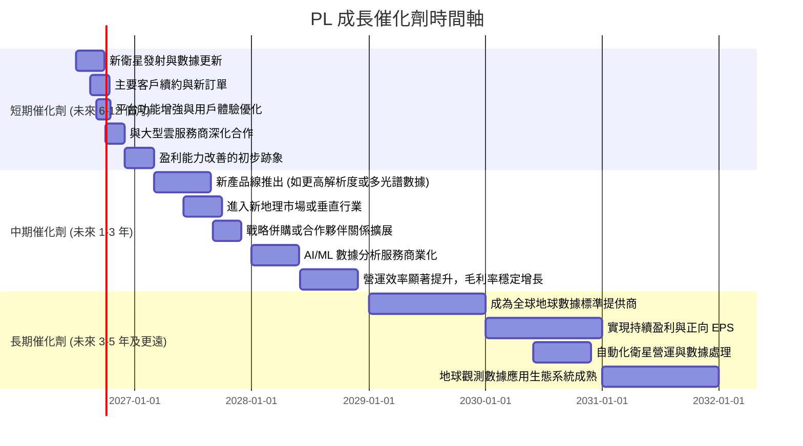

### 8.2 TAM 市場規模分析

地球觀測數據與服務的總潛在市場 (Total Addressable Market, TAM) 正在快速擴張，由政府、商業和消費者應用需求驅動。

```
╔══════════════════════════════════════════════════════════════════╗
║                    PL TAM 市場規模分析 (2025年估計)               ║
╠══════════════════════════════════════════════════════════════════╣
║                                                                  ║
║  全球地球觀測數據與服務市場 (TAM): $60B+ (預計 2030 年)          ║
║  ├── 政府與國防市場 (核心)： $25B                                ║
║  ├── 商業市場 (增長最快)：   $20B                                ║
║  └── 其他應用 (科研、消費)： $15B                                ║
║                                                                  ║
║  PL 當前 TTM 收入：$335.61M                                      ║
║  市場滲透率估計：                                                ║
║  ├── 當前全球 TAM 滲透率 (2025年估計 $40B): ~0.8%               ║
║  └── 商業市場潛在滲透率 (未來 5年)：有望達到 5-10%                ║
║                                                                  ║
║  📊 結論：PL 處於一個龐大且快速增長的市場，具備巨大的潛在成長空間。║
╚══════════════════════════════════════════════════════════════════╝
```
**備註**：TAM 數據為行業研究機構預測的估計值。

### 8.3 成長驅動力結構圖

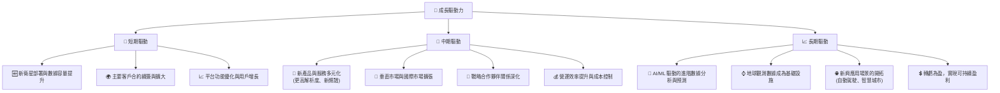

---

## 9. 風險矩陣

Planet Labs 作為一家高成長的太空科技公司，面臨多重風險，投資者需要仔細評估。

### 9.1 風險評分矩陣

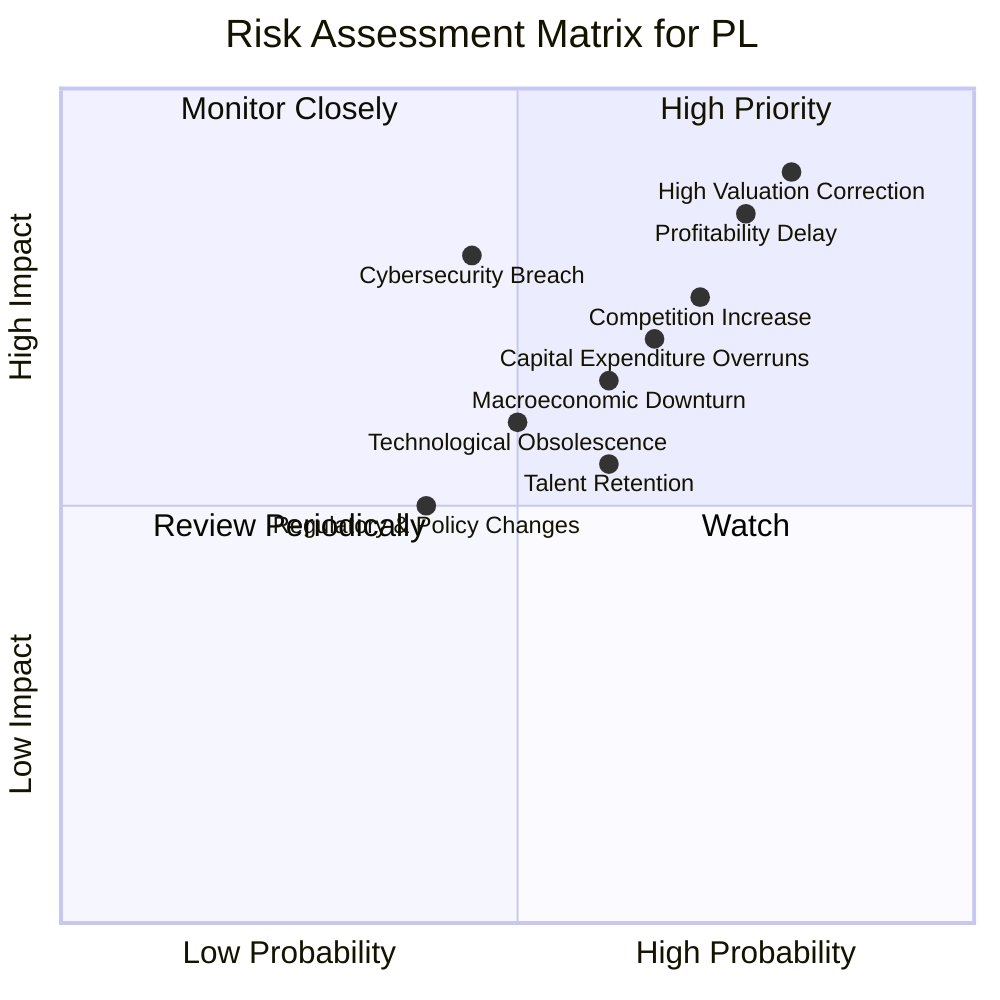

### 9.2 風險清單詳細分析

| # | 風險項目 | 發生機率 | 財務衝擊 | 風險評分 | 緩解措施 |
|---|----------|----------|----------|----------|----------|
| 1 | 🔴 **盈利能力延遲或無法實現** | 高 (75%) | 高 (-X% EPS) | 🔴 9.0/10 | 加強成本控制，優化營運效率，提高高毛利服務佔比，審慎管理非營運費用。 |
| 2 | 🔴 **高估值修正風險** | 高 (80%) | 極高 (-X% 股價) | 🔴 9.5/10 | 公司需以超預期業績證明其估值合理性。投資者應設定合理的預期和止損點。 |
| 3 | 🟡 **競爭加劇與市場份額侵蝕** | 中高 (70%) | 中高 (-X% 收入/利潤) | 7.5/10 | 持續技術創新，擴大衛星群規模，深化數據分析能力，建立更強客戶黏性。 |
| 4 | 🟡 **資本支出超支與資金壓力** | 中高 (65%) | 中 (-X% FCF/稀釋) | 7.0/10 | 嚴格的資本預算管理，多元化融資渠道，確保充足現金流。 |
| 5 | 🟡 **技術過時或顛覆性創新** | 中 (50%) | 中 (-X% 收入/市場地位) | 6.0/10 | 持續研發投入，關注行業新技術趨勢，與學術界和新創公司合作。 |
| 6 | 🟡 **宏觀經濟下行影響** | 中 (60%) | 中 (-X% 收入/需求) | 6.5/10 | 多元化客戶群體，降低對單一行業或地區的依賴，提供高附加值服務。 |
| 7 | 🟡 **人才流失與招聘挑戰** | 中高 (60%) | 中 (-X% 創新能力/營運效率) | 6.5/10 | 建立有競爭力的薪酬福利體系，營造良好企業文化，加強人才培養和儲備。 |
| 8 | 🟡 **網絡安全與數據隱私風險** | 中 (45%) | 高 (-X% 聲譽/罰款) | 7.0/10 | 加強數據加密和存儲安全，建立完善的應急響應機制，遵守各國數據隱私法規。 |

---

## 10. 投資建議

### 10.1 最終綜合評級雷達圖

```
╔══════════════════════════════════════════════════════════════════╗
║                  PL 綜合評級雷達圖 (1-10分)                       ║
╠══════════════════════════════════════════════════════════════════╣
║ 基本面強度  7.0 ▓▓▓▓▓▓▓▓▓▓▓▓▓▓░░░░░░  ★★★★☆           ║
║ 成長動能    8.0 ▓▓▓▓▓▓▓▓▓▓▓▓▓▓▓▓░░░░  ★★★★☆           ║
║ 獲利品質    3.0 ▓▓▓▓▓▓░░░░░░░░░░░░░░  ★☆☆☆☆           ║
║ 財務健康    7.0 ▓▓▓▓▓▓▓▓▓▓▓▓▓▓░░░░░░  ★★★★☆           ║
║ 估值合理性  3.0 ▓▓▓▓▓▓░░░░░░░░░░░░░░  ★☆☆☆☆           ║
║ 護城河深度  7.0 ▓▓▓▓▓▓▓▓▓▓▓▓▓▓░░░░░░  ★★★★☆           ║
║ 管理層執行  7.0 ▓▓▓▓▓▓▓▓▓▓▓▓▓▓░░░░░░  ★★★★☆           ║
║ 技術創新力  9.0 ▓▓▓▓▓▓▓▓▓▓▓▓▓▓▓▓▓▓░░  ★★★★★           ║
╠══════════════════════════════════════════════════════════════════╣
║ 綜合總分    5.8 ▓▓▓▓▓▓▓▓▓▓░░░░░░░░░░  🏆 評語：成長性強勁，但盈利能力與估值是挑戰║
╚══════════════════════════════════════════════════════════════════╝
```

### 10.2 目標價與隱含報酬率

根據 DCF 敏感性分析，我們為 Planet Labs 設定以下目標價區間：

| 情境 | 機率權重 | 目標價 | 較當前股價 $31.10 的隱含報酬率 |
|------|----------|--------|--------------------------------|
| **樂觀情境** | 20% | $45.00 | +44.7% |
| **基準情境** | 50% | $35.00 | +12.5% |
| **悲觀情境** | 30% | $25.00 | -19.6% |
| **加權平均目標價** | **100%** | **$33.50** | **+7.7%** |

**投資評級**：**持有 (Hold)**。
儘管公司具有強勁的收入增長和獨特的市場地位，但其高昂的估值、持續的虧損以及非營運費用對淨利潤的巨大影響，使得當前股價風險較高。加權平均目標價顯示的潛在上漲空間有限，不足以支撐「買入」評級。投資者應「持有」現有倉位，並密切關注公司盈利能力改善的實質性進展。

### 10.3 買入時機與觸發因素

```
╔══════════════════════════════════════════════════════════════════╗
║                  ✅ 買入觸發因素 Checklist                      ║
╠══════════════════════════════════════════════════════════════════╣
║                                                                  ║
║  立即買入觸發條件（多數符合）：                                  ║
║  ☐ 股價回調至 $25.00 以下，提供更具吸引力的估值                  ║
║  ☐ 公司披露連續兩個季度實現正向淨利潤或顯著縮小虧損             ║
║  ☐ 自由現金流持續大幅增長，且 FCF Yield 達到 2%以上             ║
║  ☐ 重大新客戶簽約或進入新市場，帶來超預期收入增長               ║
║  ☐ 解決「其他非營運費用」的負面影響，並提供清晰解釋和未來展望   ║
║                                                                  ║
║  加碼觸發條件（出現以下任一）：                                  ║
║  ☐ 營業利益率持續改善，接近盈虧平衡點                             ║
║  ☐ 宣布實施有效的成本削減計劃，且不影響成長前景                 ║
║  ☐ 成功推出顛覆性新產品或服務，進一步擴大護城河                 ║
║  ☐ 獲得重大政府或國防合同，確保長期穩定收入                     ║
║                                                                  ║
║  減碼/停損觸發條件（出現以下任一）：                             ║
║  ☐ 收入增長顯著放緩，低於 20% YoY                               ║
║  ☐ 自由現金流轉為持續負值，且現金儲備快速消耗                   ║
║  ☐ 競爭格局惡化，市場份額被主要競爭對手侵蝕                     ║
║  ☐ 股價跌破 $20.00 並伴隨負面消息，基本面出現惡化               ║
╚══════════════════════════════════════════════════════════════════╝
```

### 10.4 投資人適配度分析

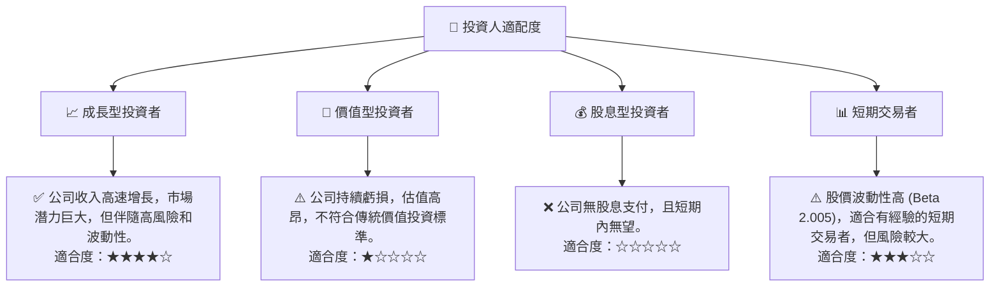

### 10.5 關鍵監控指標

| 監控類型 | 指標 | 關注點 | 頻率 |
|----------|------|--------|------|
| **盈利能力** | **淨利潤率** | 趨勢是否持續改善，非營運費用影響是否減弱 | 季度 |
| **現金流** | **自由現金流 (FCF)** | FCF 是否保持正值並持續增長，FCF Yield 變化 | 季度 |
| **成長性** | **ARR (年度經常性收入)** | 收入增長質量，續約率和新客戶獲取 | 季度/年度 |
| **效率** | **營業費用率 (SG&A + R&D / Revenue)** | 費用控制效率，營運槓桿效應是否顯現 | 季度 |
| **估值** | **P/S Ratio** | 相比同業和歷史區間，判斷估值是否合理 | 每月 |
| **競爭** | **市場份額與產品差異化** | 競爭格局變化，新產品推出和技術領先地位 | 半年度/年度 |
| **資產負債表** | **淨現金頭寸** | 現金儲備是否充足，債務水平是否健康 | 季度 |

---

> **免責聲明**：本報告為 AI 自動生成，僅供研究參考，不構成投資建議。投資有風險，入市需謹慎。