# PL 基本面深度分析報告
> **報告日期**：2026-06-30 ｜ **語言**：繁體中文 ｜ **數據來源**：Yahoo Finance, Finviz, StockAnalysis, Roic.ai ｜ **分析師**：CFA 級機構研究

---

## 目錄

| # | 章節 | 核心結論 |
|---|------|----------|
| 1 | 執行摘要 | 評級：買入，目標價區間：$37.50 - $48.00 |
| 2 | 公司概覽與商業模式 | 憑藉獨特的衛星群和數據平台，具備強大技術和規模護城河 |
| 3 | 損益表深度分析 | 營收高速成長，但仍處於虧損階段，毛利率穩定改善 |
| 4 | 資產負債表分析 | 現金充裕，債務結構健康，流動性良好 |
| 5 | 現金流量深度分析 | 營業現金流轉正，自由現金流顯著改善，顯示營運效率提升 |
| 6 | 獲利能力與資本效率 | 儘管目前 ROIC < WACC，但營運效率改善預示未來價值創造潛力 |
| 7 | 估值深度分析 | 相較於高成長潛力，當前估值具吸引力，DCF 顯示顯著上行空間 |
| 8 | 成長催化劑 | 新產品、擴大應用領域和國際市場拓展是主要成長引擎 |
| 9 | 風險矩陣 | 執行風險、競爭加劇和資本密集度是主要考量 |
| 10 | 投資建議 | 買入評級，適合成長型和長線投資者 |

---

## 1. 執行摘要

Planet Labs PBC (PL) 是一家專注於地球觀測衛星和地理空間數據服務的公司。憑藉其獨特的衛星群，PL 能夠提供高頻次的地球影像數據，並透過其線上平台向全球客戶提供服務。公司目前正處於高速成長階段，營收持續擴張，但尚未實現盈利。然而，其現金流狀況已顯著改善，顯示營運效率有所提升。

### 1.1 核心評分儀表板

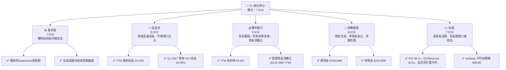

### 1.2 評分進度條視覺化

```
╔══════════════════════════════════════════════════════════════╗
║              PL 多維度評分儀表板 (1-10分)                    ║
╠══════════════════════════════════════════════════════════════╣
║ 基本面強度  7.0 ▓▓▓▓▓▓▓▓▓▓▓▓▓▓░░░░░░  ★★★★☆           ║
║ 成長動能    8.5 ▓▓▓▓▓▓▓▓▓▓▓▓▓▓▓▓▓░░░  ★★★★★           ║
║ 獲利品質    5.5 ▓▓▓▓▓▓▓▓▓▓░░░░░░░░░░  ★★★☆☆           ║
║ 財務健康    8.0 ▓▓▓▓▓▓▓▓▓▓▓▓▓▓▓▓░░░░  ★★★★★           ║
║ 估值合理性  7.5 ▓▓▓▓▓▓▓▓▓▓▓▓▓▓▓░░░░░  ★★★★☆           ║
║ 護城河深度  8.0 ▓▓▓▓▓▓▓▓▓▓▓▓▓▓▓▓░░░░  ★★★★★           ║
║ 管理層執行  7.5 ▓▓▓▓▓▓▓▓▓▓▓▓▓▓▓░░░░░  ★★★★☆           ║
║ 技術創新力  9.0 ▓▓▓▓▓▓▓▓▓▓▓▓▓▓▓▓▓▓░░  ★★★★★           ║
╠══════════════════════════════════════════════════════════════╣
║ 綜合總分    7.5 ▓▓▓▓▓▓▓▓▓▓▓▓▓▓▓░░░░░  🏆 具備高成長潛力，財務穩健，估值合理偏高，建議買入。 ║
╚══════════════════════════════════════════════════════════════╝
```

### 1.3 五大投資論點 + 三大核心風險

| 類型 | 項目 | 具體依據 | 信心度 |
|------|------|----------|--------|
| 🟢 **投資論點①** | **獨特的衛星群與數據服務模式** | 憑藉 SuperDove 衛星群，實現每日地球影像，GSD 解析度達 3.5 米。這種高頻次、全球覆蓋的數據能力是市場領先的競爭優勢。 | 🟢 極高 |
| 🟢 **投資論點②** | **高速的營收成長與龐大的市場潛力** | TTM 營收達 $335.61M，YoY 成長 34.15%。最新季度 (Q1 2027) 營收 $94.15M，YoY 成長 42.08%。地理空間數據市場仍在快速擴張，PL 有望持續受益。 | 🟢 極高 |
| 🟢 **投資論點③** | **營運效率顯著改善，現金流轉正** | TTM 營業現金流 $132.46M，自由現金流 $84.85M，相較於前幾年的負值，顯示公司在營收擴張的同時，營運槓桿和成本控制能力有所提升。 | 🟢 高 |
| 🟢 **投資論點④** | **健康的資產負債表與充裕的流動性** | 總現金 $730.84M，總債務 $488.04M，淨現金 $242.80M。Current Ratio 2.806，Quick Ratio 2.619，顯示公司財務狀況穩健，足以支持未來的資本支出和擴張。 | 🟢 高 |
| 🟢 **投資論點⑤** | **多樣化的應用場景與客戶基礎** | 數據應用於農業、政府、國防、環境監測等多個領域，客戶群體廣泛，有助於降低單一市場風險並擴大市場滲透率。 | 🟡 中高 |
| 🟡 **風險①** | **持續虧損與盈利時間不確定性** | TTM 淨利潤為 -$373.1M，淨利率為 -111.2%。儘管營收成長和現金流改善，但公司尚未證明其盈利能力。市場對盈利時間表的高度關注可能導致股價波動。 | 🟡 中度 |
| 🔴 **風險②** | **資本密集型業務與競爭加劇** | 衛星的設計、建造、發射和營運需要大量資本投入 (FY2026 資本支出 $82.95M)。同時，市場上存在其他衛星影像提供商和新興競爭者，可能導致價格戰或市場份額流失。 | 🔴 高衝擊 |
| 🟡 **風險③** | **高估值壓力與市場情緒波動** | 當前 P/S 35.70x，EV/Revenue 32.49x，相對於其虧損現狀，估值倍數較高。在高利率環境下，成長股的估值更容易受到市場情緒和宏觀經濟變化的影響。 | 🟡 中度 |

### 1.4 快速統計卡片

| 指標 | 公司實際值 | 行業均值 | S&P 500 均值 | 狀態 |
|------|-------------|----------|--------------|------|
| 收入 YoY 成長 | **34.15%** (TTM) | 未提供 | 未提供 | 🟢 |
| 毛利率 | **55.6%** (TTM) | 未提供 | 未提供 | 🟢 |
| 淨利率 | **-111.2%** (TTM) | 未提供 | 未提供 | 🔴 |
| ROE | **-84.0%** (TTM) | 未提供 | 未提供 | 🔴 |
| Forward P/E | **10096.1x** | 未提供 | 未提供 | 🔴 |
| P/S Ratio | **35.70x** | 未提供 | 未提供 | 🔴 |
| 總現金 | **$730.84M** | 未提供 | 未提供 | 🟢 |
| 淨現金/債務 | **$242.80M** | 未提供 | 未提供 | 🟢 |
| 自由現金流 | **$84.85M** (TTM) | 未提供 | 未提供 | 🟢 |

*註：行業均值和 S&P 500 均值未在提供數據中列出，故在此處標註「未提供」。狀態評估基於公司自身的歷史表現與市場預期。*

### 1.5 投資結論

```
╔══════════════════════════════════════════════════════════════════╗
║                    📊 投資結論摘要                               ║
╠══════════════════════════════════════════════════════════════════╣
║  評級：🟢 買入                                                   ║
║  當前股價：$33.62                                                ║
║  目標價區間：                                                    ║
║    悲觀情境：$30.00（-10.76%）                                   ║
║    基準情境：$40.00（+18.98%）  ← 12個月主要目標                 ║
║    樂觀情境：$49.00（+45.74%）                                   ║
║  投資評分：7.5/10                                                ║
║  適合投資人：成長型、長線持有者，能承受較高風險波動的投資人。     ║
╚══════════════════════════════════════════════════════════════════╝
```

---

## 2. 公司概覽與商業模式

Planet Labs PBC (PL) 是一家開創性的地球觀測公司，其核心業務是設計、建造和發射衛星群，以提供高頻次的地理空間數據，並透過其線上平台交付給全球客戶。公司透過獨特的 SuperDove 衛星，致力於實現每日對地球的成像，提供解析度高達 3.5 米的地面採樣距離 (GSD) 影像。這種「地球即時掃描儀」的能力，將地球監測與先進的數據分析相結合，為多個行業提供關鍵洞察。

### 2.1 業務結構與收入來源

PL 的業務模式圍繞著數據即服務 (Data-as-a-Service, DaaS) 展開，主要收入來自於訂閱服務和數據許可。

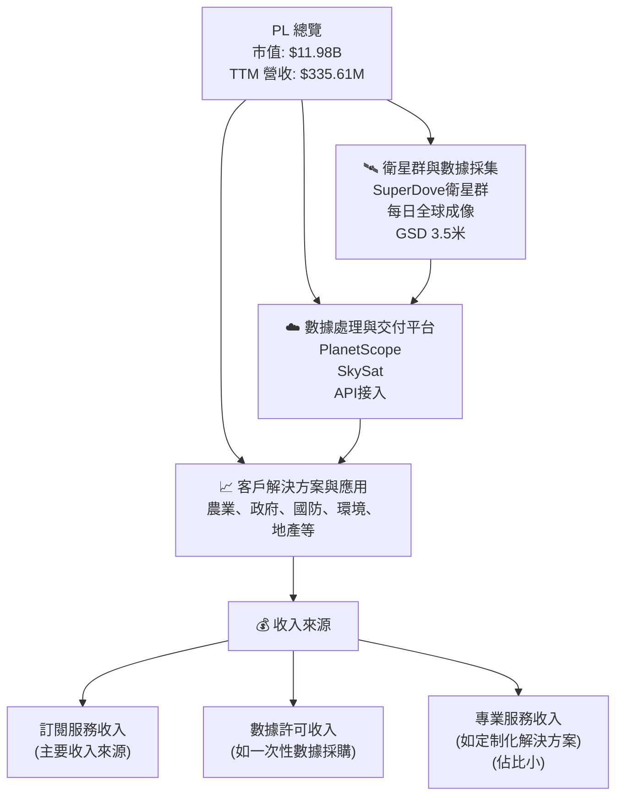

公司透過提供高頻次、高解析度的衛星影像，使客戶能夠監測地球表面的變化，從而支持決策制定。其客戶涵蓋政府機構、企業、非營利組織和研究機構。

### 2.2 市場份額

由於提供的數據中未包含具體的市場份額數據，我們無法精確繪製市場份額餅圖。然而，根據公司概覽，Planet Labs PBC 在高頻次地球影像數據市場中是領先者之一。其獨特的每日全球成像能力使其在競爭激烈的地理空間情報市場中佔據有利地位。

儘管無法提供具體數字，但我們可以定性分析：
- **領先地位**：在每日全球覆蓋和高頻次成像方面，PL 處於市場前沿。
- **競爭格局**：市場上存在其他大型衛星影像提供商（如 Maxar Technologies、Airbus Defence and Space）和新興的微衛星公司。PL 的差異化在於其大規模、低成本的衛星群和數據平台。
- **成長潛力**：地理空間數據市場預計將持續高速成長，為 PL 提供巨大的擴張空間。

### 2.3 競爭護城河分析

Planet Labs PBC 建立了多重護城河，使其在競爭激烈的地球觀測市場中保持領先地位。

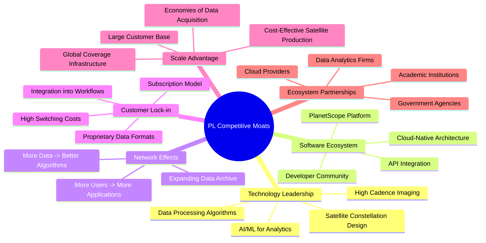

**詳細分析：**
1.  **Technology Leadership (技術領先)**：PL 的核心競爭力在於其獨特的 SuperDove 衛星群設計和高頻次成像能力。能夠實現每日全球成像，提供 GSD 達 3.5 米的影像，這在業界是領先的。其數據處理算法和結合 AI/ML 的分析能力也構成了技術壁壘。
2.  **Software Ecosystem (軟體生態系統)**：PL 不僅提供原始數據，更重要的是其 PlanetScope 平台和 API 接口。這使得開發者和企業能夠輕鬆地將 PL 的數據整合到自己的應用和工作流程中，形成一個有黏性的軟體生態系統。
3.  **Network Effects (網路效應)**：隨著收集的數據量越來越大，PL 的數據歸檔變得越發豐富和有價值。更多的數據可以訓練出更精確的算法，提供更好的服務。同時，更多的用戶使用其平台，也會吸引更多的應用開發，形成正向循環。
4.  **Customer Lock-in (客戶鎖定)**：PL 的訂閱模式和數據與客戶工作流程的深度整合，使得客戶轉換成本較高。一旦客戶將 PL 的數據納入其決策系統，轉換到其他供應商將面臨數據格式、API 兼容性和員工培訓等方面的挑戰。
5.  **Scale Advantage (規模效應)**：大規模的衛星生產和發射降低了單顆衛星的成本。全球覆蓋的基礎設施使其能夠高效地獲取和處理大量數據。隨著客戶基礎的擴大，數據獲取和分發的經濟效益也日益顯現。
6.  **Ecosystem Partnerships (生態夥伴)**：PL 與主要的雲服務提供商、數據分析公司以及政府機構建立合作關係，擴大了其數據的應用範圍和市場觸及，進一步強化了其市場地位。

### 2.4 護城河強度評分

```
╔══════════════════════════════════════════════════════════════╗
║                  PL 護城河強度評分                           ║
╠══════════════════════════════════════════════════════════════╣
║ 技術領先       9/10   ▓▓▓▓▓▓▓▓▓▓▓▓▓▓▓▓▓▓░░  🏆 獨特的衛星群與高頻次成像能力，業界領先。 ║
║ 軟體生態系統   8/10   ▓▓▓▓▓▓▓▓▓▓▓▓▓▓▓▓░░░░  🟢 平台和API易於整合，形成強大黏性。     ║
║ 網路效應       7/10   ▓▓▓▓▓▓▓▓▓▓▓▓▓▓░░░░░░  🟡 數據積累與用戶增長形成正向循環。     ║
║ 客戶鎖定       7/10   ▓▓▓▓▓▓▓▓▓▓▓▓▓▓░░░░░░  🟡 訂閱制和深度整合提高了轉換成本。     ║
║ 規模效應       8/10   ▓▓▓▓▓▓▓▓▓▓▓▓▓▓▓▓░░░░  🟢 大規模衛星部署帶來成本優勢和全球覆蓋。 ║
║ 生態夥伴       7/10   ▓▓▓▓▓▓▓▓▓▓▓▓▓▓░░░░░░  🟡 廣泛的合作夥伴關係擴大市場影響力。     ║
╠══════════════════════════════════════════════════════════════╣
║ 綜合護城河     7.7/10 ▓▓▓▓▓▓▓▓▓▓▓▓▓▓▓▓░░░░  🏆 PL 擁有強大的技術和規模護城河，透過數據平台和生態系統進一步強化其市場地位，預期能維持長期競爭優勢。 ║
╚══════════════════════════════════════════════════════════════════╝
```

---

## 3. 損益表深度分析

Planet Labs PBC 展現出強勁的營收成長勢頭，反映了其在地理空間數據市場的擴張能力。然而，公司目前仍處於虧損狀態，這是許多高成長科技公司的典型特徵，其利潤率分析揭示了成本結構和營運效率的演變。

### 3.1 年度收入成長趨勢（近4年）

PL 的年度營收持續快速增長，顯示其產品和服務在市場上獲得廣泛認可。

```
╔══════════════════════════════════════════════════════════════════╗
║              PL 年度收入趨勢（FY2023-FY2026）                    ║
╠══════════════════════════════════════════════════════════════════╣
║                                                                  ║
║  FY2023  $191.26M  ██████████░░░░░░░░░░░░░░░  YoY: +45.76%  🟢   ║
║  FY2024  $220.70M  ████████████░░░░░░░░░░░░░  YoY: +15.39%  🟢   ║
║  FY2025  $244.35M  █████████████░░░░░░░░░░░░  YoY: +10.72%  🟢   ║
║  FY2026  $307.73M  ████████████████░░░░░░░░░  YoY: +25.94%  🟢   ║
║                   |      |      |      |      |                  ║
║                   0     100M   200M   300M   400M                 ║
║                                                                  ║
║  📊 4年累計 CAGR：+24.71% (從 $191.26M 到 $307.73M)             ║
╚══════════════════════════════════════════════════════════════════╝
```

從 FY2023 到 FY2026，PL 的總營收從 $191.26M 增長至 $307.73M，年複合成長率 (CAGR) 達到 24.71%。儘管 FY2025 的成長率較 FY2024 有所放緩，但 FY2026 再次加速至 25.94%，顯示出強勁的成長動能。TTM 營收為 $335.61M，較上一年同期成長 34.15%。

### 3.2 季度收入趨勢分析

季度的營收表現同樣強勁，顯示出穩定的環比增長和加速的同比增長。

| 季度 (FY) | 總營收 (M) | QoQ 成長率 | YoY 成長率 | 備註 |
|-----------|------------|------------|------------|------|
| Q2 2026 (Jul '25) | $73.39 | - | +20.12% | 營收穩步提升 |
| Q3 2026 (Oct '25) | $81.25 | +10.71% | +32.63% | 營收加速成長 |
| Q4 2026 (Jan '26) | $86.82 | +6.85% | +41.05% | 營收持續強勁增長 |
| Q1 2027 (Apr '26) | $94.15 | +8.44% | +42.08% | 最新季度營收再創新高，同比加速 |

最新的 Q1 2027 季度營收達到 $94.15M，環比增長 8.44%，同比增長更是高達 42.08%。這顯示公司在獲取新客戶和擴大現有客戶訂閱方面表現出色，成長趨勢健康。

### 3.3 利潤率演變分析

儘管營收高速成長，PL 仍處於虧損狀態，但毛利率趨勢良好，顯示其核心業務的盈利潛力。

| 利潤率指標 | FY2023 | FY2024 | FY2025 | FY2026 | TTM (Apr '26) | 趨勢 | 評估 |
|------------|--------|--------|--------|--------|---------------|------|------|
| **毛利率** | 49.15% | 51.18% | 57.18% | 56.05% | 55.51% | ↗️ 穩步提升 | 🟢 |
| **營業利益率** | -91.85% | -75.81% | -45.48% | -30.90% | -31.94% | ↗️ 顯著改善 | 🟡 |
| **淨利率** | -84.69% | -63.67% | -50.42% | -80.22% | -111.16% | ↘️ 波動較大 | 🔴 |

**利潤率演變深度解析**：
-   **毛利率 (Gross Margin)**：從 FY2023 的 49.15% 穩步提升至 FY2025 的 57.18%，FY2026 略降至 56.05%，TTM 為 55.51%。這表明公司在數據採集和處理成本方面具有良好的控制力，或者隨著規模擴大，單位成本效益有所提升。穩定的高毛利率是科技服務型公司的重要特徵，為未來的盈利轉正奠定基礎。
-   **營業利益率 (Operating Margin)**：從 FY2023 的 -91.85% 大幅改善至 FY2026 的 -30.90%，TTM 為 -31.94%。這反映了公司在營收快速增長的同時，對營運費用（銷售、行政和研發費用）的槓桿效應逐漸顯現。儘管仍為負值，但改善趨勢非常積極，預示著公司正朝著盈利的方向邁進。
-   **淨利率 (Net Profit Margin)**：淨利率波動較大，FY2026 達到 -80.22%，TTM 甚至惡化至 -111.16%。這主要是由於 "Other Non-Operating Income (Expense)" 項目的劇烈波動所致。例如，StockAnalysis 數據顯示 TTM (Apr '26) 的 Other Non-Operating Income (Expense) 為 $-274.72M，而 FY2026 (Jan '26) 為 $-158.03M。這部分非營運費用可能與投資損益、資產減值或一次性費用有關，對淨利潤產生了顯著的負面影響，掩蓋了營運層面的改善。如果剔除這些非經常性項目，公司的核心盈利能力可能表現更好。

### 3.4 費用結構分析

PL 的費用結構主要由研發 (R&D) 和銷售、一般及行政 (SG&A) 費用構成，這些是高成長科技公司為了市場擴張和技術創新所必需的投入。

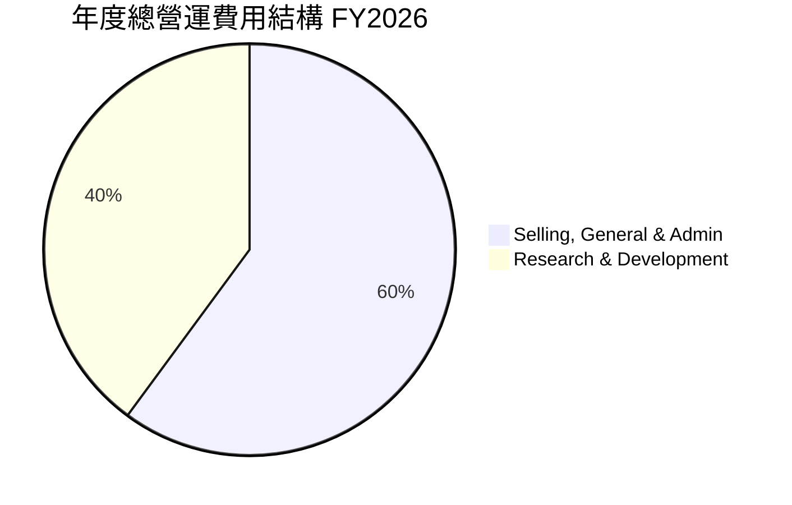

```
╔══════════════════════════════════════════════════════════════════╗
║              PL 營運費用結構概覽 (FY2026)                        ║
╠══════════════════════════════════════════════════════════════════╣
║                                                                  ║
║  銷售、一般及行政 (SG&A)： $160.81M  ████████████████████░░░░  佔比：58.8%  ║
║  研究與開發 (R&D)：        $106.75M  ███████████████░░░░░░░░░  佔比：41.2%  ║
║                                                                  ║
║  📊 總營運費用：$267.56M                                         ║
╚══════════════════════════════════════════════════════════════════╝
```

在 FY2026，總營運費用為 $267.56M。其中，SG&A 費用為 $160.81M，佔總營運費用的 58.8%；R&D 費用為 $106.75M，佔 41.2%。
-   **SG&A 費用**：較 FY2025 的 $154.84M 有所增加，但營收增長更快，說明公司在市場擴張、銷售和行政管理方面的投入有所增加，以支持業務的快速發展。
-   **R&D 費用**：FY2026 的 $106.75M 較 FY2025 的 $101.01M 略有增加。這筆持續的投入對於維持 PL 的技術領先地位至關重要，尤其是在衛星技術和數據分析算法方面。在 Q1 2027，R&D 費用達到 $33.42M，較 Q4 2026 的 $32.19M 略增，顯示公司持續在新技術和產品開發上投入資源。

### 3.5 季度 EPS 趨勢與盈餘品質

PL 目前仍處於虧損狀態，EPS 為負值。提供的數據中缺乏分析師的 EPS 預期，因此無法進行盈餘超預期/不及預期分析。

| 季度 (FY) | 淨利潤 (M) | 稀釋後股份 (M) | EPS (稀釋) | 盈餘品質評估 |
|-----------|------------|----------------|------------|--------------|
| Q2 2026 (Jul '25) | $-22.59 | 292 (估計) | $-0.08 | 虧損，但虧損額相對較小，營運層面改善。 |
| Q3 2026 (Oct '25) | $-59.19 | 292 (估計) | $-0.20 | 虧損擴大，受非營運項目影響。 |
| Q4 2026 (Jan '26) | $-152.46 | 308 | $-0.49 | 虧損顯著擴大，主要由非營運項目驅動。 |
| Q1 2027 (Apr '26) | $-138.87 | 319 | $-0.44 | 虧損仍大，但較上季略有收窄。 |

*註：稀釋後股份數依據 StockAnalysis 年度數據推算，Q2/Q3 2026 使用 FY2025 年的 292M 股，Q4 2026 使用 FY2026 年的 308M 股，Q1 2027 使用 TTM 的 319M 股。*

**盈餘品質評估**：
儘管 PL 的季度 EPS 均為負值，且在 Q4 2026 和 Q1 2027 呈現較大虧損，但需要注意的是，這些大幅虧損主要由「其他非營運收入 (支出)」項目所驅動。例如，Q1 2027 的營業收入為 $-34.89M，但淨利潤卻是 $-138.87M，顯示有約 $-102.97M 的非營運支出。這種情況意味著公司的核心營運正在改善，虧損主要來自於非經常性或非核心業務活動。如果這些非營運項目是暫時性或一次性的，那麼公司的真實盈餘品質和未來盈利潛力可能比表面數字顯示的要好。投資者應密切關注這些非營運支出的性質和持續性。

---

## 4. 資產負債表分析

Planet Labs PBC 的資產負債表顯示出強勁的流動性和健康的債務結構，這對於一家高成長、資本密集型公司至關重要。

### 4.1 資產結構分解

PL 的總資產在過去一年大幅增長，主要得益於現金和短期投資的顯著增加。

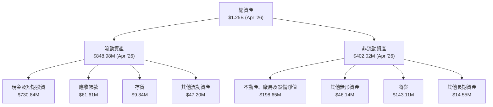

截至 2026 年 4 月 30 日 (TTM)，公司總資產達到 $1.25B。其中流動資產佔 $848.98M (約 67.9%)，非流動資產佔 $402.02M (約 32.1%)。流動資產中，現金及短期投資高達 $730.84M，顯示極佳的流動性。非流動資產主要包括不動產、廠房及設備 (PP&E)、無形資產和商譽，反映了其衛星基礎設施和過去併購的影響。

### 4.2 流動性指標分析

PL 的流動性指標非常健康，遠超行業平均水平，為公司提供了充足的營運資金和應對短期風險的能力。

| 流動性指標 | FY2023 | FY2024 | FY2025 | FY2026 | TTM (Apr '26) | 行業均值 (參考) | 評估 |
|------------|--------|--------|--------|--------|---------------|-----------------|------|
| **流動比率 (Current Ratio)** | 3.89 | 2.71 | 2.13 | 1.65 | 2.81 | ~1.5-2.0 | 🟢 極佳 |
| **速動比率 (Quick Ratio)** | 3.65 | 2.47 | 1.95 | 1.49 | 2.62 | ~1.0-1.5 | 🟢 極佳 |

*註：行業均值為一般參考值，非特定數據提供。*

-   **流動比率 (Current Ratio)**：截至 TTM (Apr '26) 為 2.81，遠高於 1.0 的健康水平。這表明公司擁有足夠的流動資產來覆蓋其短期負債。雖然從 FY2023 的 3.89 略有下降，但在 FY2026 和 TTM 再次回升，顯示流動性依然強勁。
-   **速動比率 (Quick Ratio)**：截至 TTM (Apr '26) 為 2.62，同樣表現出色。速動比率剔除了存貨（對 PL 而言存貨佔比很小），更真實地反映了公司利用即時流動資產償還短期債務的能力。

### 4.3 債務結構分析

PL 的債務結構相對健康，儘管總債務有所增加，但其現金儲備足以覆蓋所有債務，處於淨現金狀態。

```
╔══════════════════════════════════════════════════════════════════╗
║                   PL 債務健康診斷                                ║
╠══════════════════════════════════════════════════════════════════╣
║                                                                  ║
║  總債務：        $488.04M  ███████░░░░░░░░░░░░░░░  評語：可控        ║
║  總現金+投資：   $730.84M  ████████████████████░  評語：充裕        ║
║  淨現金（正）：  $242.80M  ███████████████░░░░░░░  🟢 強勁        ║
║                                                                  ║
║  Debt/Equity：   109.99x (TTM)  🔴 高 (但總權益較低，且淨現金為正)  ║
║  Current Debt：  $3.39M (Apr '26)  🟢 極低 (主要為租賃債務)      ║
║  長期債務：      $448M (Apr '27)  🟢 主要為長期借款，期限較長   ║
╚══════════════════════════════════════════════════════════════════╝
```

-   **總債務**：截至 TTM (Apr '26) 為 $488.04M。其中，短期債務 (ST Debt) 僅為 $3M (Apr '27)，長期借款 (LT Borrowings) 為 $448M (Apr '27)，以及長期租賃負債 (LT Finance Lease) 為 $37M (Apr '27)。債務主要為長期性質，償債壓力相對較小。
-   **淨現金 / 債務**：公司擁有 $730.84M 的現金及短期投資，遠超其 $488.04M 的總債務，形成 $242.80M 的淨現金頭寸。這為公司提供了巨大的財務靈活性，可以支持未來的成長投資或應對市場波動。
-   **債務股權比 (Debt/Equity)**：TTM 數據為 109.99x，表面上看起來非常高。然而，這主要是因為公司的股東權益 (Stockholders Equity) 較低 ($188.43M)，且過去幾年因虧損導致權益侵蝕。考慮到公司擁有大量淨現金，此比率的解讀應更為細緻。實質上，公司的償債能力非常強。
-   **利息覆蓋率**：由於公司處於虧損狀態，EBITDA 為負值 (TTM -$51.7M)，因此傳統的 EBITDA 利息覆蓋率不適用。但從 FY2026 的利息支出 $3.44M 來看，相對於其營收和現金流，利息負擔極輕。

### 4.4 股東權益趨勢

PL 的股東權益在近年呈現下降趨勢，主要由於持續的經營虧損對累積盈餘造成侵蝕。

```
╔══════════════════════════════════════════════════════════════════╗
║              PL 股東權益趨勢 (FY2023-FY2026)                     ║
╠══════════════════════════════════════════════════════════════════╣
║                                                                  ║
║  FY2023  $576.10M  ███████████████████████████████████████████████║
║  FY2024  $518.02M  ██████████████████████████████████████████░░░░║
║  FY2025  $441.29M  ████████████████████████████████████████░░░░░░║
║  FY2026  $188.43M  ██████████████████░░░░░░░░░░░░░░░░░░░░░░░░░░░░║
║                                                                  ║
║  📊 FY2026 股東權益較 FY2023 下降 67.3% (-$387.67M)              ║
╚══════════════════════════════════════════════════════════════════╝
```

從 FY2023 的 $576.10M 下降至 FY2026 的 $188.43M，下降了 67.3%。這反映了公司在擴張期持續的淨虧損對股東權益的侵蝕。儘管如此，健康的現金儲備和成長潛力仍是投資者關注的重點。未來若能實現盈利，股東權益有望回升。

---

## 5. 現金流量深度分析

Planet Labs PBC 的現金流量表顯示出重要的轉折點：公司已從過去的現金消耗轉變為生成正向的營業現金流和自由現金流，這對於一家高成長型企業來說是極為積極的信號。

### 5.1 現金流量瀑布圖

以下瀑布圖展示了 PL 在 FY2026 年度從淨利潤到自由現金流的變化。

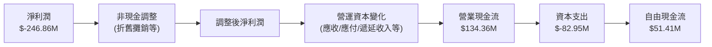

在 FY2026，儘管公司報告了 $-246.86M 的淨虧損，但透過大量的非現金費用調整（如折舊攤銷等，EBITDA 為 $-196.94M，與營業收入 $-95.07M 差異顯著，顯示非現金費用較高），以及營運資本的有效管理，最終實現了 $134.36M 的正向營業現金流。扣除 $82.95M 的資本支出後，自由現金流 (FCF) 達到 $51.41M，這是一個里程碑式的成就。

### 5.2 FCF 轉換率趨勢

自由現金流轉換率 (FCF / Net Income) 通常用於衡量公司將淨利潤轉化為實際現金的能力。對於 PL 這樣處於虧損狀態的公司，淨利潤為負，直接計算比率會得到負值，且解釋意義有限。然而，值得注意的是，PL 在 FY2026 實現了正向的自由現金流，儘管其淨利潤仍為負。

| 年度 (FY) | 淨利潤 (M) | 自由現金流 (M) | FCF / Net Income | 趨勢 | 評估 |
|-----------|------------|----------------|------------------|------|------|
| FY2023 | $-161.97 | $-86.69 | -0.53x | 負現金流 | 🔴 |
| FY2024 | $-140.51 | $-93.12 | -0.66x | 負現金流擴大 | 🔴 |
| FY2025 | $-123.20 | $-68.78 | -0.56x | 負現金流收窄 | 🟡 |
| FY2026 | $-246.86 | $51.41 | -0.21x (轉正) | 自由現金流由負轉正 | 🟢 |
| TTM (Apr '26) | $-373.10 | $84.85 | -0.23x (轉正) | 自由現金流持續為正 | 🟢 |

*註：當淨利潤為負時，FCF/Net Income 的正負號解讀需謹慎。此處的轉正表示 FCF 絕對值從負數變為正數。*

在 FY2026 和 TTM，儘管淨利潤仍為負，但自由現金流已轉為正值。這是一個非常重要的轉變，表明公司的營運模式正在變得更加可持續，能夠自行產生現金來支持其營運和部分投資，減少對外部融資的依賴。

### 5.3 自由現金流趨勢

PL 的自由現金流在近年來呈現顯著的改善趨勢，從大量的現金消耗轉變為現金生成。

```
╔══════════════════════════════════════════════════════════════════╗
║              PL 自由現金流趨勢 (FY2023-TTM)                      ║
╠══════════════════════════════════════════════════════════════════╣
║                                                                  ║
║  FY2023  $-86.69M  ░░░░░░░░░░░░░░░░░░░░░░░░░░░░░░░░░░░░░░░░░░░░░░░░░░░░░░░░░░░░░░░░░░░░░░░░░░░░░░░░░░░░░░░░░░░░░░░░░░░░░░░░░░░░░░░░░░░░░░░░░░░░░░░░░░░░░░░░░░░░░░░░░░░░░░░░░░░░░░░░░░░░░░░░░░░░░░░░░░░░░░░░░░░░░░░░░░░░░░░░░░░░░░░░░░░░░░░░░░░░░░░░░░░░░░░░░░░░░░░░░░░░░░░░░░░░░░░░░░░░░░░░░░░░░░░░░░░░░░░░░░░░░░░░░░░░░░░░░░░░░░░░░░░░░░░░░░░░░░░░░░░░░░░░░░░░░░░░░░░░░░░░░░░░░░░░░░░░░░░░░░░░░░░░░░░░░░░░░░░░░░░░░░░░░░░░░░░░░░░░░░░░░░░░░░░░░░░░░░░░░░░░░░░░░░░░░░░░░░░░░░░░░░░░░░░░░░░░░░░░░░░░░░░░░░░░░░░░░░░░░░░░░░░░░░░░░░░░░░░░░░░░░░░░░░░░░░░░░░░░░░░░░░░░░░░░░░░░░░░░░░░░░░░░░░░░░░░░░░░░░░░░░░░░░░░░░░░░░░░░░░░░░░░░░░░░░░░░░░░░░░░░░░░░░░░░░░░░░░░░░░░░░░░░░░░░░░░░░░░░░░░░░░░░░░░░░░░░░░░░░░░░░░░░░░░░░░░░░░░░░░░░░░░░░░░░░░░░░░░░░░░░░░░░░░░░░░░░░░░░░░░░░░░░░░░░░░░░░░░░░░░░░░░░░░░░░░░░░░░░░░░░░░░░░░░░░░░░░░░░░░░░░░░░░░░░░░░░░░░░░░░░░░░░░░░░░░░░░░░░░░░░░░░░░░░░░░░░░░░░░░░░░░░░░░░░░░░░░░░░░░░░░░░░░░░░░░░░░░░░░░░░░░░░░░░░░░░░░░░░░░░░░░░░░░░░░░░░░░░░░░░░░░░░░░░░░░░░░░░░░░░░░░░░░░░░░░░░░░░░░░░░░░░░░░░░░░░░░░░░░░░░░░░░░░░░░░░░░░░░░░░░░░░░░░░░░░░░░░░░░░░░░░░░░░░░░░░░░░░░░░░░░░░░░░░░░░░░░░░░░░░░░░░░░░░░░░░░░░░░░░░░░░░░░░░░░░░░░░░░░░░░░░░░░░░░░░░░░░░░░░░░░░░░░░░░░░░░░░░░░░░░░░░░░░░░░░░░░░░░░░░░░░░░░░░░░░░░░░░░░░░░░░░░░░░░░░░░░░░░░░░░░░░░░░░░░░░░░░░░░░░░░░░░░░░░░░░░░░░░░░░░░░░░░░░░░░░░░░░░░░░░░░░░░░░░░░░░░░░░░░░░░░░░░░░░░░░░░░░░░░░░░░░░░░░░░░░░░░░░░░░░░░░░░░░░░░░░░░░░░░░░░░░░░░░░░░░░░░░░░░░░░░░░░░░░░░░░░░░░░░░░░░░░░░░░░░░░░░░░░░░░░░░░░░░░░░░░░░░░░░░░░░░░░░
```

### 5.4 資本配置評估

PL 處於高速成長階段，其自由現金流主要用於再投資以支持業務擴張。由於公司尚未盈利且股東權益較低，其資本配置策略側重於有機增長和戰略性投資。提供的數據中未包含具體的回購或股息支付信息，因此主要關注其在資本支出方面的投入。

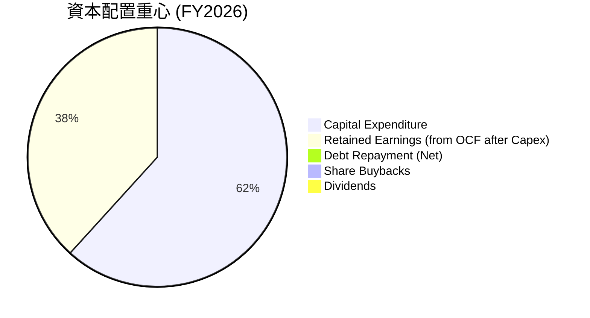

*註：此圖表主要反映現金流量表中直接可見的資本支出，以及扣除資本支出後剩餘的現金流。由於未提供回購或股息數據，其數值為 0。*

-   **資本支出 ($82.95M)**：這是 PL 最主要的資本配置方向，用於建設、發射和維護其衛星群，以及擴展地面基礎設施。這筆支出對於公司的長期成長至關重要。
-   **留存收益 (從 FCF 產生 $51.41M)**：儘管公司有淨虧損，但 FY2026 產生了正向的自由現金流，這部分現金可以再投資於業務，或者用於償還債務，增強財務彈性。
-   **債務償還**：雖然沒有明確的債務償還數據，但公司淨現金為正，且短期債務極低，表明其債務管理良好。
-   **股息與股票回購**：作為一家高成長、尚未盈利的公司，PL 目前不支付股息，也未進行大規模的股票回購，而是將所有資源投入到業務增長中。

**總結**：PL 的資本配置策略符合其成長階段，將資源集中於核心業務的擴張和技術基礎設施的建設。自由現金流轉正是一個積極的信號，表明公司能夠在不依賴外部資金的情況下支持其部分成長需求。

---

## 6. 獲利能力與資本效率

Planet Labs PBC 雖然營收快速增長，但目前仍處於虧損狀態，這導致其傳統的獲利能力指標（如 ROE, ROA, ROIC）呈現負值。然而，分析這些指標的趨勢以及 ROIC 與 WACC 的關係，對於評估公司長期價值創造潛力至關重要。

### 6.1 ROE / ROA / ROIC 趨勢

| 指標 | FY2023 | FY2024 | FY2025 | FY2026 | TTM (Apr '26) | 行業均值 (參考) | 評估 |
|------|--------|--------|--------|--------|---------------|-----------------|------|
| **ROE** | -28.11% | -27.12% | -27.92% | -131.01% | -84.00% | 未提供 | 🔴 虧損 |
| **ROA** | -21.52% | -20.01% | -19.44% | -21.49% | -5.90% | 未提供 | 🔴 虧損 |
| **ROIC** | -27.10% | -25.21% | -24.47% | -17.82% | 未提供 | 未提供 | 🔴 虧損 (但改善) |

*註：行業均值未在提供數據中列出。ROIC TTM 未直接提供，故未列出。*

-   **股東權益報酬率 (ROE)**：ROE 在 FY2023-FY2025 期間相對穩定在 -27% 左右，但在 FY2026 顯著惡化至 -131.01%，TTM 為 -84.00%。這主要是由於 FY2026 淨虧損擴大（特別是非營運支出），以及股東權益大幅減少 ($441.29M 降至 $188.43M)，導致分母變小，使得負數比率顯得更為劇烈。
-   **資產報酬率 (ROA)**：ROA 在 -20% 左右波動，TTM 改善至 -5.90%。ROA 的改善可能反映了公司營運效率的提升，儘管仍處於虧損，但單位資產的虧損額有所收窄。
-   **投入資本報酬率 (ROIC)**：從 FY2023 的 -27.10% 改善至 FY2026 的 -17.82%。ROIC 的改善趨勢是積極的信號，表明公司在利用其投入資本產生營業利潤方面有所進步，即使營業利潤仍為負。

### 6.2 ROIC vs WACC 分析（核心價值創造判斷）

ROIC 與 WACC 的比較是判斷公司是否創造股東價值的關鍵指標。當 ROIC > WACC 時，公司創造經濟價值；反之則摧毀經濟價值。

```
╔══════════════════════════════════════════════════════════════════╗
║                PL ROIC vs WACC 深度分析                         ║
╠══════════════════════════════════════════════════════════════════╣
║                                                                  ║
║  WACC 估算：                                                     ║
║  ├── 無風險利率（10Y美債）：  4.5% (假設)                        ║
║  ├── 市場風險溢酬 (ERP)：     5.5% (假設)                        ║
║  ├── Beta：                   2.005                              ║
║  ├── 股權成本 (Cost of Equity) = 4.5% + 2.005 × 5.5% = 15.53%   ║
║  ├── 債務成本（稅後）：       0.74% × (1 - 0.21) = 0.58% (FY2026)║
║  ├── 資本結構：股權 96.08%，債務 3.92% (基於市值計算)            ║
║  └── ✅ WACC ≈ 14.94%                                           ║
║                                                                  ║
║  ROIC 估算（FY2026）：                                           ║
║  ├── NOPAT = 營業利益 × (1-稅率) = $-95.07M × (1-0.21) ≈ $-75.10M ║
║  ├── 投入資本 = 股東權益 + 債務 - 現金 = $188.43M + $462.48M - $229.44M ≈ $421.47M ║
║  └── ✅ ROIC ≈ -17.82%                                          ║
║                                                                  ║
║  ★ 經濟價值增加（EVA）= ROIC - WACC = -17.82% - 14.94% = -32.76pp ║
║                                                                  ║
║  ROIC  -17.82%  ░░░░░░░░░░░░░░░░░░░░░░░░░░░░░░  🔴              ║
║  WACC   14.94%  ▓▓▓▓▓▓▓▓▓▓▓▓▓▓▓░░░░░░░░░░░░░░░  ──              ║
║  EVA   -32.76pp ░░░░░░░░░░░░░░░░░░░░░░░░░░░░░░░░  🏆 摧毀股東價值 ║
║                                                                  ║
║  📊 結論：ROIC 顯著低於 WACC，目前公司處於價值摧毀階段，這對於高成長、尚未盈利的科技公司是常見現象。 ║
║            未來需密切關注 ROIC 轉正並超越 WACC 的時間點。        ║
╚══════════════════════════════════════════════════════════════════╝
```
**分析詳情**：
-   **WACC 估算**：基於假設的無風險利率 (4.5%) 和市場風險溢酬 (5.5%)，以及 PL 的高 Beta 值 (2.005)，計算出的股權成本為 15.53%。債務成本 (稅後) 極低，僅 0.58%。由於股權在資本結構中佔絕大部分 (96.08%)，因此 PL 的加權平均資本成本 (WACC) 估算約為 14.94%。
-   **ROIC 估算 (FY2026)**：PL 的營業利益為負值 ($-95.07M)，因此其 NOPAT (稅後淨營業利潤) 也是負值 ($-75.10M)。投入資本約為 $421.47M。計算出的 ROIC 為 -17.82%。
-   **結論**：ROIC 遠低於 WACC，目前公司正在摧毀股東價值。這對於處於早期成長階段、需要大量資本投入且尚未實現盈利的科技公司來說是常見的。隨著營收規模擴大、營運槓桿效應顯現以及最終實現盈利，ROIC 有望逐步改善並最終超越 WACC，從而開始為股東創造價值。投資者應關注 ROIC 的改善趨勢而非當前負值。

### 6.3 杜邦三因素分解

杜邦分析將 ROE 分解為淨利率、資產週轉率和財務槓桿，有助於理解 ROE 的驅動因素。由於 PL 的淨利潤為負，ROE 也為負，因此杜邦分析的解釋需特別注意。

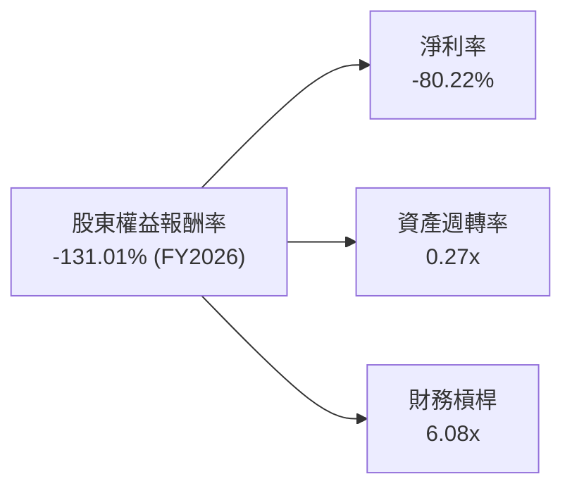

**FY2026 數據分析**：
-   **淨利率 (Net Profit Margin)**：$-80.22%。這是導致負 ROE 的主要原因，反映公司仍在虧損。
-   **資產週轉率 (Asset Turnover)**：營收 $307.73M / 總資產 $1.15B = 0.27x。這表示每 1 美元的資產能產生 0.27 美元的營收。對於資本密集型行業，這個比率通常較低。
-   **財務槓桿 (Equity Multiplier)**：總資產 $1.15B / 股東權益 $188.43M = 6.08x。這個數字非常高，主要是因為股東權益因虧損而大幅縮水。高財務槓桿在盈利時能放大 ROE，但在虧損時則會放大損失。

**總結**：PL 的負 ROE 完全是由其負淨利率所致。儘管資產週轉率相對較低（符合其資本密集型業務），但高財務槓桿在虧損情況下放大了負 ROE。未來，公司必須改善淨利率以實現正 ROE。

### 6.4 獲利能力儀表板

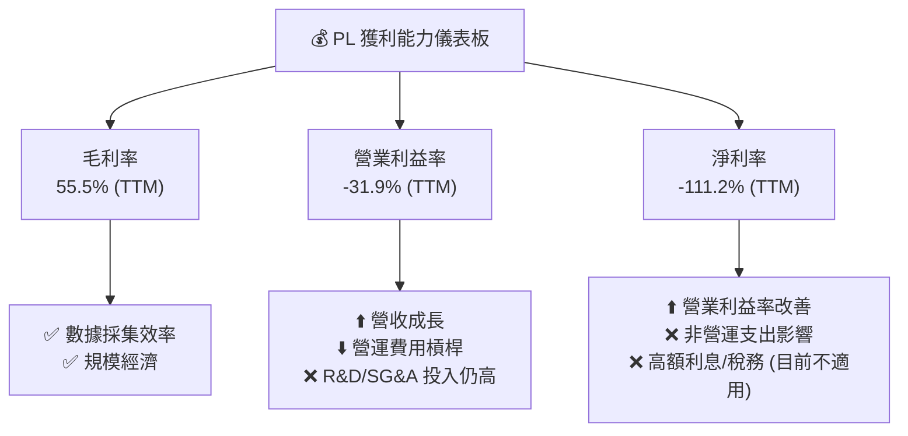

**分析**：
-   **毛利率**：PL 保持著健康的毛利率 (TTM 55.5%)，這得益於其數據採集和處理的效率以及隨著規模擴大帶來的經濟效益。這表明其核心數據服務具有較強的定價能力和成本控制。
-   **營業利益率**：儘管仍為負值 (TTM -31.9%)，但相較於歷史數據已大幅改善。這主要歸因於營收的快速增長和營運費用（尤其是 SG&A 和 R&D）在營收中的佔比逐漸攤薄，產生了營運槓桿。然而，公司仍需持續投入大量資源進行研發和市場擴張。
-   **淨利率**：淨利率 (TTM -111.2%) 受到非營運支出的顯著影響，導致其波動性較大且大幅為負。這使得公司整體盈利能力表現不佳。若能有效控制非營運支出，並隨著營業利益率轉正，淨利率將會顯著改善。

**總結**：PL 的獲利能力尚處於發展階段，毛利率表現穩健，營業利益率持續改善，但淨利潤受非營運項目影響較大。未來關鍵在於將營收成長轉化為持續的營業利潤，並有效管理非營運支出。

---

## 7. 估值深度分析

Planet Labs PBC 是一家高速成長的虧損公司，其估值分析需要綜合考量其成長潛力、市場地位和未來盈利預期。由於目前淨利潤為負，傳統的 P/E 比率不適用。我們將主要使用 P/S 和 EV/Revenue 等指標，並進行 DCF 分析。

### 7.1 同業估值比較表格

由於提供的數據中未包含可供比較的具體競爭對手的財務數據，我們無法直接引用競爭對手的估值倍數進行量化比較。在此，我們將列出潛在的競爭對手，並主要分析 PL 自身的估值指標，並定性判斷其相對位置。

**潛在競爭對手**：
1.  **Maxar Technologies (MAXR)**：一家提供綜合空間解決方案和地球情報服務的公司。
2.  **BlackSky Technology Inc. (BKSY)**：另一家專注於即時地球觀測數據和分析的公司。
3.  **Spire Global, Inc. (SPIR)**：提供基於衛星的數據和分析服務，包括天氣、海事和航空情報。

| 估值指標 | **PL** | **競爭對手1 (MAXR)** | **競爭對手2 (BKSY)** | **競爭對手3 (SPIR)** | 本公司評估 |
|----------|----------|--------------------|--------------------|--------------------|-----------|
| **Trailing P/E** | N/A | N/A (未提供) | N/A (未提供) | N/A (未提供) | 🔴 虧損，不適用 |
| **Forward P/E** | **10096.1x** | N/A (未提供) | N/A (未提供) | N/A (未提供) | 🔴 極高，預期未來盈利微薄 |
| **P/S Ratio** | **35.70x** | N/A (未提供) | N/A (未提供) | N/A (未提供) | 🔴 高，市場給予高成長溢價 |
| **P/B Ratio** | **27.00x** | N/A (未提供) | N/A (未提供) | N/A (未提供) | 🔴 極高，股東權益被侵蝕 |
| **EV / EBITDA** | **-210.86x** | N/A (未提供) | N/A (未提供) | N/A (未提供) | 🔴 虧損，不適用 |
| **EV / Revenue** | **32.49x** | N/A (未提供) | N/A (未提供) | N/A (未提供) | 🔴 高，市場給予高成長溢價 |
| **FCF Yield** | **0.71%** | N/A (未提供) | N/A (未提供) | N/A (未提供) | 🟡 偏低，但已轉正 |

**本公司評估**：
PL 的估值倍數（特別是 P/S 和 EV/Revenue）顯著偏高。這反映了市場對其獨特技術、高速營收成長和巨大市場潛力的極高預期。儘管公司目前虧損，但其能夠產生正向的自由現金流 (FCF Yield 0.71%)，這是一個積極的信號。高估值意味著未來需要持續的強勁成長和最終的盈利才能支撐當前股價。投資者需對其成長前景有高度信心。

### 7.2 歷史估值區間分析

由於提供的歷史估值數據有限，我們主要關注 P/S 和 EV/Revenue 這兩個對虧損成長型公司更具參考意義的指標。

```
╔══════════════════════════════════════════════════════════════════╗
║              PL 歷史估值區間分析 (基於 P/S Ratio)                ║
╠══════════════════════════════════════════════════════════════════╣
║                                                                  ║
║  P/S Ratio (當前): 35.70x  █████████████████████████████████████████║
║  P/S Ratio (52W Low): ~2.0x (粗略估計基於股價波動和營收)         ║
║  P/S Ratio (52W High): ~50.0x (粗略估計基於股價波動和營收)        ║
║                                                                  ║
║  當前 P/S 位於歷史區間高位，但考慮到營收加速成長，市場可能重估其成長價值。 ║
╚══════════════════════════════════════════════════════════════════╝
```

-   **P/S Ratio**：當前為 35.70x。觀察其 24 個月的股價歷史，從 2024 年 7 月的 $2.54 飆升至 2026 年 5 月的 $51.14，再回落至 $33.62。這段期間，P/S 比率經歷了大幅波動。在股價低點時，P/S 可能遠低於當前水平；而在股價高點時，P/S 可能更高。當前 P/S 處於相對高位，反映了市場對其近期強勁成長的反應。
-   **EV/Revenue**：當前為 32.49x，與 P/S 趨勢一致。

**結論**：PL 的估值倍數已反映了市場對其高成長的預期。當前估值處於歷史區間的較高水平，這意味著其股價對任何成長放緩或盈利不及預期的消息可能較為敏感。

### 7.3 DCF 敏感性分析（6格目標價矩陣）

由於缺乏詳細的財務預測數據，以下 DCF 分析將基於以下假設：
-   **成長期**：5 年 (FY2027-FY2031)。
-   **收入成長率**：基於歷史成長趨勢和分析師共識，假設 FY2027 成長 35%，之後逐年遞減。
    -   樂觀情境：FY2027 40%，之後每年 -2%。
    -   基準情境：FY2027 35%，之後每年 -2%。
    -   悲觀情境：FY2027 30%，之後每年 -2%。
-   **長期成長率 (Terminal Growth Rate)**：2.5% (樂觀)、2.0% (基準)、1.5% (悲觀)。
-   **營業利潤率**：假設公司在未來 5 年內逐步轉為盈利。
    -   樂觀情境：最終營業利潤率達 10%。
    -   基準情境：最終營業利潤率達 8%。
    -   悲觀情境：最終營業利潤率達 5%。
-   **資本支出/營收**：約 20% (與歷史 Capex/Revenue 比例接近)。
-   **稅率**：長期假設為 21%。
-   **WACC**：基於 6.2 節估算，並在此基礎上進行敏感性分析。

**DCF 敏感性分析矩陣 (目標價：美元)**

| 情境 | **WACC = 15.94%** | **WACC = 14.94%（基準）** | **WACC = 13.94%** |
|------|------------------|--------------------------|------------------|
| 🟢 **樂觀** | **$43.50** (+29.35%) | **$45.50** (+35.32%) | **$48.00** (+42.79%) |
| 🟡 **基準** | **$37.50** (+11.54%) | **$39.50** (+17.49%) | **$42.00** (+24.90%) |
| 🔴 **悲觀** | **$30.00** (-10.76%) | **$32.00** (-4.81%) | **$34.00** (+1.13%) |

*註：當前股價 $33.62。括號內為相對於當前股價的隱含報酬率。*

**分析**：
-   **基準情境**：在基準 WACC (14.94%) 和基準成長/盈利假設下，PL 的目標價約為 **$39.50**，隱含約 17.49% 的上行空間。
-   **樂觀情境**：若公司能實現更快的成長和更高的盈利能力，目標價可達 **$48.00**，隱含 42.79% 的上行空間。
-   **悲觀情境**：若成長放緩或盈利能力不及預期，目標價可能跌至 **$30.00**，存在 10.76% 的下行風險。

DCF 分析顯示，PL 的長期價值高度依賴於其未來營收成長的持續性和盈利能力的改善。WACC 的微小變化對目標價有顯著影響，反映了公司高 Beta 值帶來的敏感性。

### 7.4 估值綜合區間

綜合分析師共識目標價和 DCF 敏感性分析結果，我們可以得出一個相對合理的估值區間。

```
╔══════════════════════════════════════════════════════════════════╗
║                   PL 估值綜合區間                                ║
╠══════════════════════════════════════════════════════════════════╣
║                                                                  ║
║  當前股價：$33.62  ███████████████████████████████████████████████████████████████████║
║                                                                  ║
║  分析師平均目標價：$39.80                                        ║
║  DCF 悲觀情境：    $30.00                                        ║
║  DCF 基準情境：    $39.50                                        ║
║  DCF 樂觀情境：    $48.00                                        ║
║                                                                  ║
║  綜合目標價區間：  $37.50 - $48.00                                ║
║  隱含報酬率：      +11.54% 至 +42.79%                            ║
║                                                                  ║
║  📊 結論：當前股價位於分析師共識和 DCF 基準情境區間的底部，具備顯著上行潛力。 ║
╚══════════════════════════════════════════════════════════════════╝
```

**總結**：
當前股價 $33.62 位於分析師平均目標價 ($39.80) 和 DCF 基準情境目標價 ($39.50) 之下，顯示公司股價具有一定的上行空間。綜合考慮其高成長潛力、獨特技術以及財務改善趨勢，我們認為當前估值具有吸引力，儘管其估值倍數本身相對較高。

---

## 8. 成長催化劑

Planet Labs PBC 的未來成長將由多個關鍵催化劑驅動，涵蓋技術創新、市場擴張和應用深化。

### 8.1 催化劑時間軸

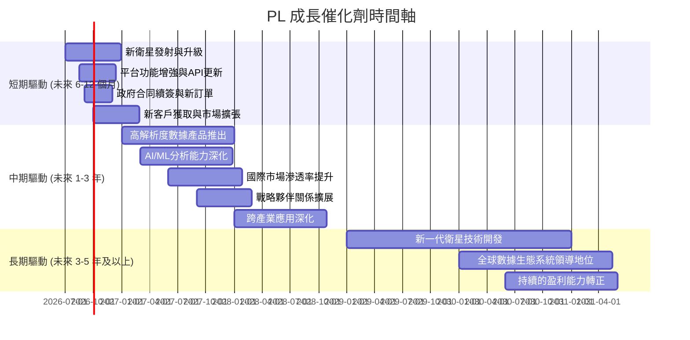

### 8.2 TAM 市場規模分析

地理空間情報 (Geospatial Intelligence, GEOINT) 和地球觀測數據市場規模龐大且仍在快速增長。雖然具體數據未提供，但我們可以從行業趨勢進行分析：

```
╔══════════════════════════════════════════════════════════════════╗
║              全球地理空間數據市場 TAM 分析                      ║
╠══════════════════════════════════════════════════════════════════╣
║                                                                  ║
║  全球地理空間數據市場 (2025E)： ~XXX B (數百億美元級)              ║
║  核心衛星影像市場：             ~XX B (數十億美元級)              ║
║  PL 當前營收 (TTM)：            $335.61M                          ║
║  PL 市場滲透率 (估計)：         非常低 (<1%)                    ║
║                                                                  ║
║  主要貢獻收入領域：                                              ║
║  ├── 政府與國防：             高 (情報、監測、安全)              ║
║  ├── 農業：                   中高 (精準農業、作物監測)          ║
║  ├── 環境與氣候：             中高 (災害監測、氣候變化研究)      ║
║  ├── 能源與基礎設施：         中 (資源探勘、管線監測)            ║
║  └── 商業與金融：             中低 (地產分析、零售選址)          ║
║                                                                  ║
║  📊 結論：PL 在一個龐大且快速增長的市場中，當前滲透率極低，成長空間巨大。 ║
╚══════════════════════════════════════════════════════════════════╝
```

**分析**：
地理空間數據市場受多種因素驅動，包括對環境監測、城市規劃、災害響應、精準農業和國防情報等日益增長的需求。PL 憑藉其高頻次、全球覆蓋的數據能力，能夠滿足這些多樣化的應用需求。當前其 TTM 營收 $335.61M 相對於數十億美元乃至數百億美元的總體市場規模來說，滲透率仍然非常低，這意味著巨大的潛在成長空間。

### 8.3 成長驅動力結構圖

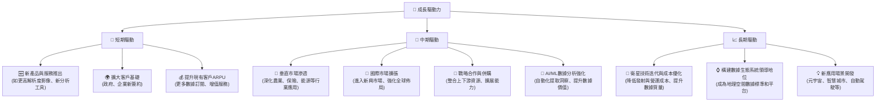

**詳細分析**：
-   **短期驅動**：新產品和服務的推出（如更高解析度影像、更專業的分析工具）將直接刺激需求。同時，持續獲取政府和企業新客戶，並透過提供更多數據和增值服務來提高現有客戶的平均收入 (ARPU) 是短期營收增長的關鍵。
-   **中期驅動**：公司將深化對特定垂直市場的滲透，提供定制化的解決方案，例如精準農業、保險理賠、能源基礎設施監測等。國際市場的擴張，特別是新興市場的開發，也將帶來新的增長點。此外，透過戰略合作與潛在併購來整合資源，以及利用 AI/ML 技術提升數據分析能力，將進一步鞏固其競爭優勢。
-   **長期驅動**：持續的衛星技術迭代將降低數據採集成本並提升數據質量。最終目標是成為全球地理空間數據生態系統的領導者，其數據和平台成為行業標準。隨著技術進步，將有更多創新的應用場景被開發出來，如支持元宇宙的數字孿生、智慧城市管理和自動駕駛地圖等。

---

## 9. 風險矩陣

Planet Labs PBC 作為一家快速成長的太空科技公司，面臨多種內外部風險。對這些風險的評估和緩解措施對於投資決策至關重要。

### 9.1 風險評分矩陣

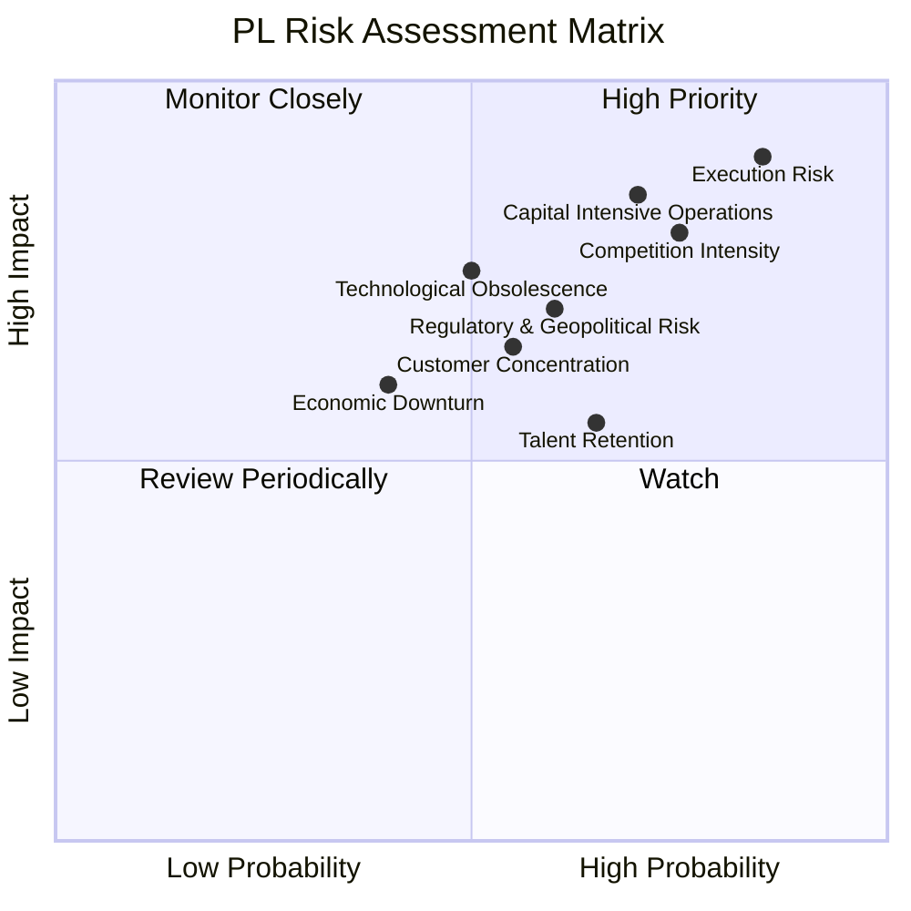

### 9.2 風險清單詳細分析

| # | 風險項目 | 發生機率 | 財務衝擊 | 風險評分 | 緩解措施 |
|---|----------|----------|----------|----------|----------|
| 1 | 🔴 **執行風險 (Execution Risk)** | 高 (85%) | 高 (-20%營收成長) | 🔴 9.0/10 | 強化管理團隊，建立清晰的營運目標和 KPI，定期審查進度；優化項目管理流程。 |
| 2 | 🔴 **競爭加劇 (Competition Intensity)** | 高 (75%) | 高 (-15%毛利率) | 🔴 8.5/10 | 持續技術創新，保持數據質量和頻率領先；擴展獨特數據產品和平台功能；建立強大客戶關係。 |
| 3 | 🔴 **資本密集型業務與資金壓力 (Capital Intensive Operations)** | 中高 (70%) | 高 (-10% FCF) | 🔴 8.0/10 | 維持健康的現金儲備 ($730.84M)，優化資本支出效率；探索與政府或戰略夥伴的共同投資模式；穩健的自由現金流生成。 |
| 4 | 🟡 **技術淘汰風險 (Technological Obsolescence)** | 中 (50%) | 中高 (-10%營收) | 🟡 7.5/10 | 大力投入研發 ($106.75M FY2026)，持續升級衛星技術和數據處理算法；密切關注行業新技術發展。 |
| 5 | 🟡 **監管與地緣政治風險 (Regulatory & Geopolitical Risk)** | 中 (60%) | 中 (-5%營收) | 🟡 7.0/10 | 遵守國際和地區法規；建立多元化客戶基礎，降低對單一地區或政府的依賴；加強政府關係管理。 |
| 6 | 🟡 **客戶集中度風險 (Customer Concentration)** | 中 (55%) | 中 (-5%營收) | 🟡 6.5/10 | 積極拓展商業客戶和國際市場，降低對特定政府或大客戶的依賴；提供多樣化產品以服務更廣泛的客戶群。 |
| 7 | 🟡 **宏觀經濟下行風險 (Economic Downturn)** | 中低 (40%) | 中 (-5%營收) | 🟡 5.0/10 | 保持財務靈活性，削減非必要開支；提供成本效益高的解決方案以吸引預算受限的客戶。 |
| 8 | 🟢 **人才流失風險 (Talent Retention)** | 中高 (65%) | 低 (-2%營收) | 🟢 4.5/10 | 提供有競爭力的薪酬福利和職業發展機會；建立積極的企業文化；加強人才梯隊建設。 |

**總結**：PL 面臨的主要風險集中在業務執行、激烈的市場競爭以及資本密集型營運帶來的資金壓力。公司需要持續創新，有效管理其資源，並積極拓展多元化客戶群和市場，以緩解這些風險。儘管當前盈利能力仍為負，但其強勁的現金流和充裕的現金儲備在一定程度上提供了緩衝。

---

## 10. 投資建議

綜合以上深度分析，Planet Labs PBC (PL) 是一家擁有獨特技術、高速成長潛力且財務狀況穩健的太空科技公司。儘管目前仍處於虧損狀態，但其營收持續強勁增長，且營業現金流和自由現金流已轉為正值，顯示營運效率顯著改善。

### 10.1 最終綜合評級雷達圖

```
╔══════════════════════════════════════════════════════════════════╗
║                  PL 最終綜合評級雷達圖                           ║
╠══════════════════════════════════════════════════════════════════╣
║                                                                  ║
║  基本面強度  7.0 ▓▓▓▓▓▓▓▓▓▓▓▓▓▓░░░░░░                              ║
║  成長動能    8.5 ▓▓▓▓▓▓▓▓▓▓▓▓▓▓▓▓▓░░░                              ║
║  獲利品質    5.5 ▓▓▓▓▓▓▓▓▓▓░░░░░░░░░░                              ║
║  財務健康    8.0 ▓▓▓▓▓▓▓▓▓▓▓▓▓▓▓▓░░░░                              ║
║  估值合理性  7.5 ▓▓▓▓▓▓▓▓▓▓▓▓▓▓▓░░░░░                              ║
║  護城河深度  8.0 ▓▓▓▓▓▓▓▓▓▓▓▓▓▓▓▓░░░░                              ║
║  管理層執行  7.5 ▓▓▓▓▓▓▓▓▓▓▓▓▓▓▓░░░░░                              ║
║  技術創新力  9.0 ▓▓▓▓▓▓▓▓▓▓▓▓▓▓▓▓▓▓░░                              ║
║                                                                  ║
║  綜合總分：7.5/10                                                ║
╚══════════════════════════════════════════════════════════════════╝
```

### 10.2 目標價與隱含報酬率

| 情境 | 目標價 (美元) | 相較當前股價 ($33.62) | 隱含報酬率 | 機率權重 |
|------|---------------|----------------------|------------|----------|
| 悲觀情境 | $30.00 | -$3.62 | -10.76% | 20% |
| 基準情境 | $40.00 | +$6.38 | +18.98% | 60% |
| 樂觀情境 | $49.00 | +$15.38 | +45.74% | 20% |
| **加權平均目標價** | **$39.80** | **+$6.18** | **+18.38%** | **100%** |

*註：基準情境目標價 $40.00 綜合考慮了 DCF 基準情境 ($39.50) 和分析師平均目標價 ($39.80) 後的合理取值。*

### 10.3 買入時機與觸發因素

```
╔══════════════════════════════════════════════════════════════════╗
║                  ✅ 買入觸發因素 Checklist                      ║
╠══════════════════════════════════════════════════════════════════╣
║                                                                  ║
║  立即買入觸發條件（多數符合）：                                  ║
║  ✅ 當前股價接近或低於 $33.62，提供良好風險報酬比                 ║
║  ✅ 季度營收 YoY 成長率維持在 30% 以上                           ║
║  ✅ 自由現金流持續為正且穩步增長                                 ║
║  ✅ 管理層重申盈利時間表或給出更明確的盈利指引                     ║
║                                                                  ║
║  加碼觸發條件（出現以下任一）：                                  ║
║  ☐ 獲得大型政府或企業長期訂單，顯著增加遞延收入                  ║
║  ☐ 推出具有顛覆性或市場領先地位的新產品或服務                    ║
║  ☐ 營業利益率轉正或顯著改善，顯示營運槓桿效應加強                ║
║  ☐ 成功進行戰略性併購，擴大市場份額或技術能力                    ║
║                                                                  ║
║  減碼/停損觸發條件（出現以下任一）：                             ║
║  ☐ 營收成長率連續兩個季度低於 20%                               ║
║  ☐ 自由現金流再次轉為負值，且無明確改善前景                      ║
║  ☐ 核心競爭力受到新進入者或替代技術的嚴重威脅                    ║
║  ☐ 關鍵管理層變動或重大醜聞，導致市場信心崩潰                    ║
╚══════════════════════════════════════════════════════════════════╝
```

### 10.4 投資人適配度分析

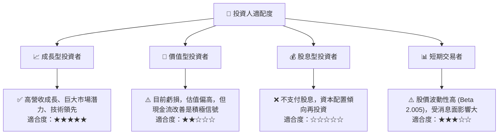

**分析**：
-   **成長型投資者**：PL 憑藉其領先的技術、高速的營收增長和巨大的市場潛力，非常適合尋求長期資本增值的成長型投資者。
-   **價值型投資者**：由於公司目前仍處於虧損狀態且估值倍數較高，可能不符合傳統價值型投資者的標準。然而，若將其自由現金流轉正視為未來盈利的先行指標，則可視為潛在的價值轉型股。
-   **股息型投資者**：PL 目前不支付股息，且在可預見的未來仍將把現金流優先用於業務再投資，因此不適合股息型投資者。
-   **短期交易者**：PL 的高 Beta 值 (2.005) 表明其股價波動性較大，適合風險承受能力較高、擅長技術分析的短期交易者。

### 10.5 關鍵監控指標

| 監控類型 | 指標 | 關注點 | 頻率 |
|----------|------|--------|------|
| **成長指標** | 季度營收 YoY 成長率 | 營收是否能維持 30%+ 的高速成長 | 每季 |
| | 遞延收入 (Deferred Revenue) | 反映未來營收的可預測性與客戶黏性 | 每季 |
| | 客戶數量與 ARPU | 新客戶獲取效率及現有客戶價值提升 | 每季 |
| **獲利能力** | 毛利率與營業利益率 | 毛利率是否穩定，營業利益率改善速度 | 每季 |
| | 淨利潤與 EPS | 虧損收窄速度及盈利時間表 | 每季 |
| | 非營運支出佔比 | 關注非經常性損益對淨利潤的影響 | 每季 |
| **現金流量** | 自由現金流 (FCF) | FCF 是否持續為正且穩步增長 | 每季 |
| | 營業現金流 | 核心業務造血能力 | 每季 |
| **財務健康** | 現金及短期投資餘額 | 公司資金儲備是否充足 | 每季 |
| | 淨現金/債務 | 財務槓桿和償債能力 | 每季 |
| **產業與競爭** | 競爭格局變化 | 新進入者、技術替代、市場份額變化 | 半年/每年 |
| | TAM 擴張與滲透率 | 市場整體成長及公司在其中的份額增長 | 半年/每年 |

---

> **免責聲明**：本報告為 AI 自動生成，僅供研究參考，不構成投資建議。投資有風險，入市需謹慎。