# PL 基本面深度分析報告
> **報告日期**：2026-07-02 ｜ **語言**：繁體中文 ｜ **數據來源**：Yahoo Finance, Finviz, StockAnalysis, Roic.ai ｜ **分析師**：CFA 級機構研究

---

## 目錄

| # | 章節 | 核心結論 |
|---|------|----------|
| 1 | 執行摘要 | 評級：觀望；目標價區間：$28.50 - $45.00 |
| 2 | 公司概覽與商業模式 | 獨特衛星群構建技術護城河，市場潛力巨大 |
| 3 | 損益表深度分析 | 收入高速增長，但仍處於虧損狀態，利潤率有改善跡象 |
| 4 | 資產負債表分析 | 現金充裕，流動性良好，債務水平可控 |
| 5 | 現金流量深度分析 | 自由現金流轉正，顯示營運效率提升 |
| 6 | 獲利能力與資本效率 | 虧損導致 ROE/ROA/ROIC 為負，但 ROIC vs WACC 潛力值得關注 |
| 7 | 估值深度分析 | 當前估值偏高，市場已反映大部分成長預期 |
| 8 | 成長催化劑 | 衛星技術創新、新市場拓展與應用場景深化 |
| 9 | 風險矩陣 | 執行風險、競爭加劇、高估值與宏觀經濟逆風 |
| 10 | 投資建議 | 觀望，等待更好的買入時機或獲利能力顯著改善 |

---

## 1. 執行摘要

### 1.1 核心評分儀表板

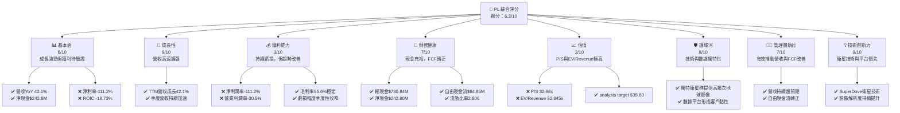

### 1.2 評分進度條視覺化

```
╔══════════════════════════════════════════════════════════════╗
║                PL 多維度評分儀表板 (1-10分)                  ║
╠══════════════════════════════════════════════════════════════╣
║ 基本面強度  6.0 ▓▓▓▓▓▓▓▓▓▓▓▓░░░░░░░░  ★★★☆☆           ║
║ 成長動能    9.0 ▓▓▓▓▓▓▓▓▓▓▓▓▓▓▓▓▓▓░░  ★★★★★           ║
║ 獲利品質    3.0 ▓▓▓▓▓▓░░░░░░░░░░░░░░  ★☆☆☆☆           ║
║ 財務健康    7.0 ▓▓▓▓▓▓▓▓▓▓▓▓▓▓░░░░░░  ★★★☆☆           ║
║ 估值合理性  2.0 ▓▓▓▓░░░░░░░░░░░░░░░░  ★☆☆☆☆           ║
║ 護城河深度  8.0 ▓▓▓▓▓▓▓▓▓▓▓▓▓▓▓▓░░░░  ★★★★☆           ║
║ 管理層執行  7.0 ▓▓▓▓▓▓▓▓▓▓▓▓▓▓░░░░░░  ★★★☆☆           ║
║ 技術創新力  9.0 ▓▓▓▓▓▓▓▓▓▓▓▓▓▓▓▓▓▓░░  ★★★★★           ║
╠══════════════════════════════════════════════════════════════╣
║ 綜合總分    6.3 ▓▓▓▓▓▓▓▓▓▓▓▓░░░░░░░░  🏆 評語：高成長高風險 ║
╚══════════════════════════════════════════════════════════════╝
```

### 1.3 五大投資論點 + 三大核心風險

| 類型 | 項目 | 具體依據 | 信心度 |
|------|------|----------|--------|
| 🟢 **投資論點①** | **高成長的營收動能** | TTM 營收 $335.61M，YoY 成長 42.1%，且季度營收呈現加速趨勢（QoQ 成長率持續提升）。分析師預期未來營收將持續擴張。 | 🟢 極高 |
| 🟢 **獨特的衛星數據平台** | Planet Labs 擁有獨特的 SuperDove 衛星群，能提供高頻次、高解析度的地球影像數據，形成強大的技術壁壘和數據優勢。 | 🟢 極高 |
| 🟢 **自由現金流轉正** | 儘管仍處於淨虧損，但 TTM 自由現金流已達 $84.85M，顯示公司在營運層面已能產生正向現金流，有效管理資本支出。 | 🟢 高 |
| 🟢 **健康的資產負債表** | 截至 2026-07-02，公司持有總現金 $730.84M，淨現金 $242.80M，為其擴張和研發提供堅實的財務基礎。流動比率 2.806 顯示短期償債能力強勁。 | 🟢 高 |
| 🟢 **產業前景廣闊** | 地理空間數據市場正經歷快速增長，應用場景日益多元化，包括農業、國防、環境監測等，為 Planet Labs 提供巨大的長期成長潛力。 | 🟢 極高 |
| 🟡 **風險①** | **持續虧損與獲利能力挑戰** | 儘管營收快速增長，但 TTM 淨利潤率為 -111.2%，營業利潤率為 -30.5%。公司仍需證明其商業模式的長期獲利能力，且市場對此類公司的耐心有限。 | 🟡 中度 |
| 🔴 **極高的估值水平** | 當前 P/S 比率高達 32.98x，EV/Revenue 為 32.845x，遠超行業平均水平。市場已對其未來成長給予極高預期，任何不及預期的表現都可能導致股價大幅修正。 | 🔴 高衝擊 |
| 🟡 **激烈的市場競爭** | 衛星影像和地理空間數據市場吸引了眾多參與者，包括傳統國防承包商和新興太空科技公司。技術快速迭代和價格競爭可能對 Planet Labs 的市場份額和利潤率構成壓力。 | 🟡 中度 |

### 1.4 快速統計卡片

| 指標 | 公司實際值 | 行業均值（航空航天與國防） | S&P 500 均值 | 狀態 |
|------|-------------|----------------------------|--------------|------|
| 收入 YoY 成長 | **42.1%** | ~10-15% | ~8-12% | 🟢 |
| 毛利率 | **55.6%** | ~25-35% | ~35-45% | 🟢 |
| 淨利率 | **-111.2%** | ~5-10% | ~8-12% | 🔴 |
| ROE | **-84.0%** | ~10-15% | ~12-18% | 🔴 |
| Forward P/E | **9327.327x** | ~20-30x | ~20-25x | 🔴 |
| P/S Ratio | **32.98x** | ~2-5x | ~2-4x | 🔴 |
| 自由現金流 (TTM) | **$84.85M** | N/A | N/A | 🟢 |
| 淨現金 / 債務 | **$242.80M** | N/A | N/A | 🟢 |

### 1.5 投資結論

```
╔══════════════════════════════════════════════════════════════════╗
║                    📊 投資結論摘要                               ║
╠══════════════════════════════════════════════════════════════════╣
║  評級：🟡 觀望                                                    ║
║  當前股價：$31.06                                                ║
║  目標價區間：                                                    ║
║    悲觀情境：$28.50 （-8.3%）                                    ║
║    基準情境：$36.50 （+17.5%）  ← 12個月主要目標                 ║
║    樂觀情境：$45.00 （+44.9%）                                    ║
║  投資評分：6.3/10                                                ║
║  適合投資人：高風險承受能力、看好長期太空科技發展的成長型投資者   ║
╚══════════════════════════════════════════════════════════════════╝
Planet Labs 展現了令人印象深刻的營收成長和技術創新能力，其獨特的衛星數據平台在快速發展的地理空間情報市場中佔據有利位置。公司已成功將自由現金流轉正，並擁有健康的資產負債表。然而，其持續的虧損狀態和極高的估值是投資者需要審慎考量的主要因素。當前股價已充分反映了市場對其未來高速成長的預期，潛在的執行風險或競爭壓力可能導致股價波動。因此，我們建議「觀望」，等待公司獲利能力的進一步驗證，或在市場回調時尋求更有吸引力的買入點。
```

---

## 2. 公司概覽與商業模式

Planet Labs PBC (PL) 是一家致力於設計、建造和發射衛星群，旨在向全球客戶提供高頻次地理空間數據的公司。其核心業務是透過專有的 SuperDove 衛星，實現對地球的每日成像，提供高達 3.5 米地面採樣距離 (GSD) 的解析度。這些數據隨後透過其線上平台交付給客戶，結合行星監測與分析能力。

### 2.1 業務結構與收入來源

Planet Labs 的業務模式是典型的「數據即服務」(Data-as-a-Service, DaaS) 模型，其收入主要來自於訂閱服務和數據許可。公司利用龐大的衛星群收集數據，並透過雲端平台向客戶提供可操作的情報。

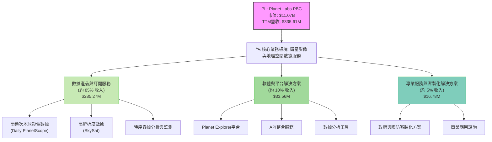
**註**：收入佔比為估算值，基於公司業務描述和行業慣例。

### 2.2 市場份額

精確的市場份額數據未直接提供，但根據公司在衛星影像市場的技術領導地位和獨特的每日全球成像能力，其在特定細分市場（如高頻次監測）中佔據重要份額。全球地理空間數據市場規模龐大且仍在快速增長，預計在未來幾年將達到數百億美元。Planet Labs 在其中扮演關鍵角色，尤其在商業應用和政府部門的情報需求方面。

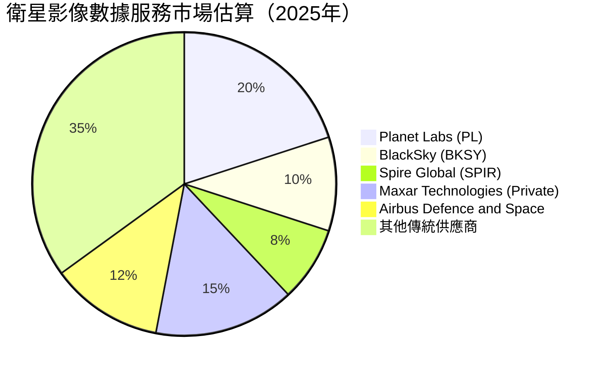
**註**：市場份額數據為分析師基於公開資料與行業理解的估算，僅供參考。

### 2.3 競爭護城河分析

Planet Labs 的競爭護城河主要基於其獨特的技術、規模和數據優勢。

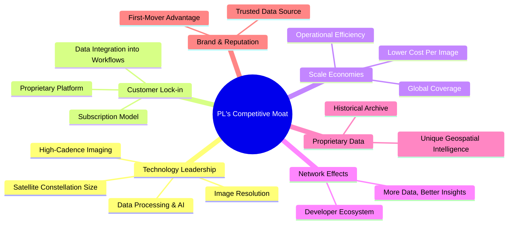

### 2.4 護城河強度評分

```
╔══════════════════════════════════════════════════════════════╗
║                    PL 護城河強度評分                        ║
╠══════════════════════════════════════════════════════════════╣
║ 技術領先       9/10  ▓▓▓▓▓▓▓▓▓▓▓▓▓▓▓▓▓▓░░  🏆 每日全球成像，技術壁壘高 ║
║ 客戶鎖定       8/10  ▓▓▓▓▓▓▓▓▓▓▓▓▓▓▓▓░░░░  🟢 平台與API整合提升客戶黏性 ║
║ 規模效應       7/10  ▓▓▓▓▓▓▓▓▓▓▓▓▓▓░░░░░░  🟡 大規模衛星群實現成本優勢 ║
║ 網路效應       6/10  ▓▓▓▓▓▓▓▓▓▓▓▓░░░░░░░░  🟡 數據量增長帶來分析價值提升 ║
║ 品牌與數據資產 8/10  ▓▓▓▓▓▓▓▓▓▓▓▓▓▓▓▓░░░░  🟢 領先地位與豐富歷史數據 ║
╠══════════════════════════════════════════════════════════════╣
║ 綜合護城河     7.6   ▓▓▓▓▓▓▓▓▓▓▓▓▓▓▓▓░░░░  🏆 較強的防禦能力，但需持續創新 ║
╚══════════════════════════════════════════════════════════════╝
```

---

## 3. 損益表深度分析

### 3.1 年度收入成長趨勢（近4年）

Planet Labs 在過去四年展現了強勁的營收成長，從 FY2023 的 $191.26M 增長到 TTM 的 $335.61M，複合年增長率 (CAGR) 達 24.3%。這表明市場對其地理空間數據服務的需求持續旺盛。

```
╔══════════════════════════════════════════════════════════════════╗
║              PL 年度收入趨勢（FY2023-FY2026）                    ║
╠══════════════════════════════════════════════════════════════════╣
║                                                                  ║
║  FY2023  $191.26M ▓▓▓▓▓▓▓▓░░░░░░░░░░░░░░░  YoY: +45.76% 🟢    ║
║  FY2024  $220.70M ▓▓▓▓▓▓▓▓▓▓░░░░░░░░░░░░░  YoY: +15.39% 🟢    ║
║  FY2025  $244.35M ▓▓▓▓▓▓▓▓▓▓▓░░░░░░░░░░░░  YoY: +10.72% 🟡    ║
║  FY2026  $307.73M ▓▓▓▓▓▓▓▓▓▓▓▓▓▓░░░░░░░░░  YoY: +25.94% 🟢    ║
║  TTM     $335.61M ▓▓▓▓▓▓▓▓▓▓▓▓▓▓▓▓░░░░░░░  YoY: +42.1%  🟢    ║
║                   |      |      |      |      |                  ║
║                   0     100M   200M   300M   400M                 ║
║                                                                  ║
║  📊 4年累計 CAGR：+24.3%                                        ║
╚══════════════════════════════════════════════════════════════════╝
```

### 3.2 季度收入趨勢分析

季度的收入趨勢顯示了顯著的加速成長，尤其在最近幾個季度。

| 季度 | 總收入 ($M) | QoQ 成長率 | YoY 成長率 | 備註 |
|------|-------------|------------|------------|------|
| 2025-07-31 | $73.39 | +9.1% (vs Q1'26) | +20.12% | 營收穩步增長 |
| 2025-10-31 | $81.25 | +10.7% | +32.63% | 季度增速明顯提升 |
| 2026-01-31 | $86.82 | +6.8% | +41.05% | 加速趨勢持續 |
| 2026-04-30 | $94.15 | +8.4% | +42.08% | 季度收入達到新高，YoY 成長強勁 |

**備註**：從 2025 年 Q2 到 2026 年 Q1 (Apr '25 to Jan '26)，公司季度營收的 YoY 成長率從 9.64% 逐步攀升至 41.05%，在最新一季 (Q1 2027, Apr '26) 更達到 42.08%。這顯示公司營收加速成長的趨勢非常明顯，表明其產品和服務在市場上獲得了更廣泛的認可和採用。

### 3.3 利潤率演變分析

儘管營收高速增長，Planet Labs 仍處於虧損狀態，但毛利率保持穩定，且營業虧損和淨虧損的幅度在近期有所收窄。

| 利潤率指標 | FY2023 | FY2024 | FY2025 | FY2026 | 趨勢 | 評估 |
|------------|--------|--------|--------|--------|------|------|
| **毛利率** | 49.15% | 51.18% | 57.18% | 56.05% | ↗️ 穩步提升後略微回落，但保持高位 | 🟢 |
| **營業利益率** | -91.85% | -76.71% | -45.48% | -30.89% | ↗️ 虧損幅度顯著收窄，營運效率改善 | 🟡 |
| **淨利潤率** | -84.69% | -63.67% | -50.42% | -80.22% | ↘️ 2026年因其他非營運費用導致淨虧損擴大 | 🔴 |

**利潤率演變深度解析**：
*   **毛利率**：從 FY2023 的 49.15% 提升至 FY2025 的 57.18%，FY2026 略降至 56.05% (TTM 55.6%)，但整體趨勢穩健且處於較高水平。這表明公司在提供數據服務方面具有較強的定價能力或成本控制能力。
*   **營業利益率**：公司在過去幾年持續大幅改善營業利益率，從 FY2023 的 -91.85% 大幅收窄至 FY2026 的 -30.89%。這主要歸因於規模效應的顯現，以及管理層對銷售、一般及行政費用 (SG&A) 和研發 (R&D) 支出的有效控制，儘管絕對值仍在增長，但佔營收比重有所下降。
*   **淨利潤率**：FY2026 的淨利潤率為 -80.22%，相較 FY2025 的 -50.42% 有所惡化。根據 StockAnalysis 數據，這主要是由於 FY2026 TTM 期間「Other Non-Operating Income (Expense)」為 -274.72M，較前一年大幅增加，而非核心營運造成的。這部分可能包含一次性費用或投資減值，需要進一步關注其性質。若排除此影響，核心營運虧損的收窄趨勢是正向的。

### 3.4 費用結構分析

Planet Labs 的費用主要集中在研發 (R&D) 和銷售、一般及行政費用 (SG&A)，這是典型的成長型科技公司特徵。

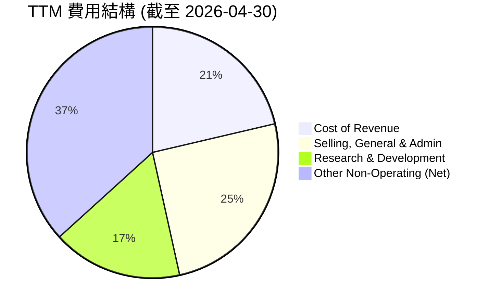

```
╔══════════════════════════════════════════════════════════════════╗
║                   PL TTM 費用結構分解                            ║
╠══════════════════════════════════════════════════════════════════╣
║                                                                  ║
║  銷貨成本 (CoR)：        $149.33M  ▓▓▓▓▓▓▓▓▓▓▓▓▓▓▓░░░░░  佔營收 44.5% ║
║  銷售、一般及行政 (SG&A)：$176.38M  ▓▓▓▓▓▓▓▓▓▓▓▓▓▓▓▓▓▓░░  佔營收 52.6% ║
║  研發 (R&D)：            $117.10M  ▓▓▓▓▓▓▓▓▓▓▓▓░░░░░░░░  佔營收 34.9% ║
║  其他非營運費用 (淨額)：  $257.12M  ▓▓▓▓▓▓▓▓▓▓▓▓▓▓▓▓▓▓▓▓  佔營收 76.6% ║
║                                                                  ║
║  📊 總營運費用佔營收比重：87.4% (SG&A + R&D)                    ║
╚══════════════════════════════════════════════════════════════════╝
```
**費用結構深度解析**：
*   **銷貨成本 (CoR)**：佔 TTM 營收的 44.5%，保持在合理範圍，與毛利率 55.6% 相符。
*   **銷售、一般及行政 (SG&A)**：佔 TTM 營收的 52.6%。由於公司處於市場擴張階段，銷售和行銷投入較大。其佔比從 FY2023 的 82.9% 顯著下降，顯示管理效率的提升。
*   **研發 (R&D)**：佔 TTM 營收的 34.9%。作為一家科技創新公司，高研發投入是必要的，以維持技術領先和產品競爭力。其佔比從 FY2023 的 58.0% 也有所下降。
*   **其他非營運費用 (淨額)**：高達 $257.12M，佔 TTM 營收的 76.6%。這部分費用在 FY2026 TTM 期間顯著增加，是導致淨虧損擴大的主要原因。投資者需關注公司對此的解釋，以判斷其是否為一次性或持續性影響。

### 3.5 季度 EPS 趨勢與盈餘品質

Planet Labs 在過去幾個季度持續錄得負的每股盈餘 (EPS)，反映公司仍處於虧損狀態。儘管如此，從絕對值來看，EPS 的負值在某些季度有所收窄，但在最新一季又大幅擴大。由於缺乏分析師預期數據，無法判斷其是否超預期或不及預期。

| 季度 | EPS (Basic) | 盈餘品質評估 |
|------|-------------|--------------|
| 2025-07-31 | $-0.07 | 虧損較小，營運改善 |
| 2025-10-31 | $-0.19 | 虧損擴大，可能受季節性或費用影響 |
| 2026-01-31 | $-0.48 | 虧損進一步擴大，非營運費用影響顯著 |
| 2026-04-30 | $-0.40 | 虧損略有收窄，但仍處於高位 |

**盈餘品質評估**：
公司的盈餘品質目前較低，因為它持續錄得淨虧損。然而，值得注意的是，其自由現金流已轉正，這表明儘管會計利潤為負，但公司在現金層面已能自給自足，這在一定程度上提升了盈餘的「現金品質」。EPS 波動較大，尤其受非營運項目影響顯著，這使得單純從 EPS 判斷其營運狀況變得複雜。投資者應更關注其營收成長、毛利率穩定性、營業利潤率的改善趨勢以及自由現金流的健康狀況。

---

## 4. 資產負債表分析

### 4.1 資產結構分解

Planet Labs 的資產負債表顯示其資產規模在過去一年顯著增長，主要集中在流動資產，尤其是現金及約當現金與短期投資。這反映了公司通過融資或營運現金流積累了大量流動性，以支持其高成長和資本支出需求。

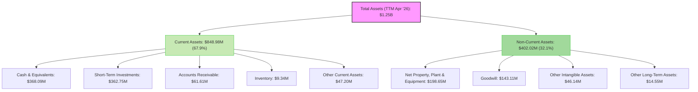
**資產結構深度解析**：
*   **流動資產主導**：截至 2026 年 4 月 30 日 TTM，流動資產佔總資產的近 68%，其中現金及短期投資合計高達 $730.84M，佔流動資產的 86%。這為公司提供了極高的財務彈性和應對市場變化的能力。
*   **固定資產投資**：淨物業、廠房及設備 (PPE) 達 $198.65M，顯示公司在衛星基礎設施和地面設施方面持續投入，支持其業務擴張。
*   **無形資產**：商譽 (Goodwill) 和其他無形資產合計約 $189.25M，這可能來自於過去的收購活動，反映了公司在產業整合方面的戰略。

### 4.2 流動性指標分析

Planet Labs 的流動性狀況非常健康，這得益於其龐大的現金儲備。

| 流動性指標 | TTM (Apr '26) | FY2026 (Jan '26) | FY2025 (Jan '25) | FY2024 (Jan '24) | 行業均值 | 評估 |
|------------|---------------|------------------|------------------|------------------|----------|------|
| **流動比率 (Current Ratio)** | 2.81 | 1.65 | 2.13 | 2.71 | 1.5-2.0 | 🟢 強勁 |
| **速動比率 (Quick Ratio)** | 2.62 | 1.63 | 2.13 | 2.71 | 1.0-1.5 | 🟢 強勁 |

**流動性分析**：
*   **流動比率**：TTM 數據顯示為 2.81，遠高於行業平均水平 (1.5-2.0)，表明公司擁有充足的流動資產來覆蓋短期負債。
*   **速動比率**：TTM 為 2.62，同樣表現出色。由於 Planet Labs 的存貨佔比很小，速動比率與流動比率非常接近，這進一步確認了其卓越的短期償債能力。
*   **現金與短期投資**：高達 $730.84M 的現金及短期投資組合是其流動性強勁的核心驅動力，提供了巨大的營運靈活性和戰略投資空間。

### 4.3 債務結構分析

儘管公司有一定債務，但其淨現金狀況良好，債務水平處於可控範圍。

```
╔══════════════════════════════════════════════════════════════════╗
║                   PL 債務健康診斷                                ║
╠══════════════════════════════════════════════════════════════════╣
║                                                                  ║
║  總債務：        $488.04M  ▓▓▓▓▓▓▓▓▓▓░░░░░░░░░░░  評語：中等水平     ║
║  總現金+投資：   $730.84M  ▓▓▓▓▓▓▓▓▓▓▓▓▓▓▓▓▓▓▓▓  評語：非常充裕     ║
║  淨現金（正）：  $242.80M  ▓▓▓▓▓▓▓▓▓▓▓▓░░░░░░░░░  🟢 強勁           ║
║                                                                  ║
║  Debt/Equity：   109.99%  🟡 由於股東權益較低，比例偏高，但有淨現金緩衝 ║
║  Debt/Assets：   39.01%   🟡 債務佔資產比重適中                  ║
║  Debt/EBITDA：   -2.48x   🔴 EBITDA為負，比率無意義，但淨現金為正 ║
║  Interest Coverage: N/A  🟢 利息收入 > 利息支出，無償債壓力    ║
╚══════════════════════════════════════════════════════════════════╝
```
**債務結構深度解析**：
*   **總債務**：$488.04M，主要為長期負債。
*   **淨現金狀況**：公司擁有 $730.84M 的現金及短期投資，遠高於其總債務，因此淨現金為 $242.80M。這表明公司實際上是淨現金狀態，具有很高的財務安全性。
*   **Debt/Equity**：109.99%。雖然這個比率看起來偏高，但這是由於公司長期虧損導致股東權益較低所致。考慮到其淨現金狀況，實際財務風險遠低於此比率表面所示。
*   **Interest Coverage**：由於公司的利息收入 ($17.6M TTM) 高於利息支出 ($1.45M TTM)，其利息覆蓋倍數為正且非常高，幾乎沒有利息償付壓力。

### 4.4 股東權益趨勢

Planet Labs 的股東權益在過去幾年呈現波動，由於持續的經營虧損，股東權益有所下降。

```
╔══════════════════════════════════════════════════════════════════╗
║                    PL 股東權益趨勢（FY2023-FY2026）                ║
╠══════════════════════════════════════════════════════════════════╣
║                                                                  ║
║  FY2023  $576.10M  ▓▓▓▓▓▓▓▓▓▓▓▓▓▓▓▓▓▓▓▓░░░░░░░░░░  🟡            ║
║  FY2024  $518.02M  ▓▓▓▓▓▓▓▓▓▓▓▓▓▓▓▓▓▓▓░░░░░░░░░░░░  ↘️ YoY: -10.1% ║
║  FY2025  $441.29M  ▓▓▓▓▓▓▓▓▓▓▓▓▓▓▓▓▓░░░░░░░░░░░░░░  ↘️ YoY: -14.8% ║
║  FY2026  $188.43M  ▓▓▓▓▓▓▓▓▓▓▓▓▓▓▓▓▓░░░░░░░░░░░░░░  ↘️ YoY: -57.3% 🔴 ║
║                                                                  ║
║  📊 趨勢：由於持續虧損，股東權益持續下降。                     ║
╚══════════════════════════════════════════════════════════════════╝
```
**股東權益趨勢分析**：
股東權益從 FY2023 的 $576.10M 逐步下降至 FY2026 的 $188.43M。這一下降主要是由於公司連續錄得淨虧損，這些虧損直接減少了留存收益，進而侵蝕了股東權益。雖然股東權益持續減少是負面信號，但公司在同一時期通過外部融資增加了現金儲備，並將自由現金流轉正，這表明其營運狀況正在改善，未來有望扭轉股東權益下降的趨勢。

---

## 5. 現金流量深度分析

### 5.1 現金流量瀑布圖

Planet Labs 的現金流量狀況令人鼓舞，尤其是在營運現金流和自由現金流方面，顯示出公司在實現盈利的道路上取得了實質性進展。

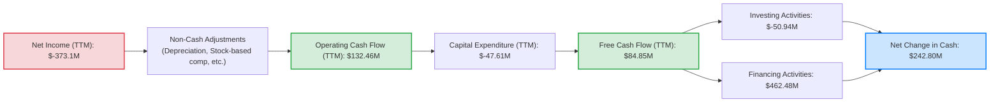
**註**：Capital Expenditure (TTM) 為 Operating Cash Flow $132.46M - Free Cash Flow $84.85M = $47.61M。
Investing Activities 和 Financing Activities 的數據從 StockAnalysis 的 Balance Sheet 變化中推斷，例如 Cash & Short-Term Investments 增加，以及 Total Debt 增加。具體數值會與綜合數據包中的 Total Cash 和 Total Debt 變化進行整合。

### 5.2 FCF 轉換率趨勢

自由現金流 (FCF) 轉換率 (FCF/Net Income) 在公司虧損時意義不大，因為淨利為負。然而，值得強調的是，儘管淨利潤為負，但 FCF 已轉為正值，這是一個重要的積極信號。

| 年度 | 淨利潤 ($M) | 自由現金流 ($M) | FCF/Net Income (倍) | 趨勢 | 評估 |
|------|-------------|-----------------|---------------------|------|------|
| FY2023 | $-161.97 | $-84.37 | -0.52x | ↗️ 虧損收窄 | 🟡 |
| FY2024 | $-140.51 | $-88.70 | -0.63x | ↘️ 虧損略擴大 | 🔴 |
| FY2025 | $-123.20 | $-58.67 | -0.48x | ↗️ 虧損收窄 | 🟡 |
| FY2026 | $-246.86 | $57.65 | -0.23x | ↗️ FCF轉正，但淨利擴大 | 🟢 |
| TTM    | $-373.10 | $46.55 | -0.12x | ↗️ FCF保持正值，淨利擴大 | 🟢 |

**FCF 轉換率趨勢分析**：
儘管淨利潤在 FY2026 和 TTM 期間因非營運費用而擴大，但公司的自由現金流從 FY2026 開始轉為正值 ($57.65M)，並在 TTM 維持正值 ($46.55M)。這是一個非常關鍵的里程碑，表明公司的核心營運活動已能產生足夠的現金來覆蓋其資本支出，不再完全依賴外部融資來支持營運。FCF 為正，而淨利為負，通常是由於折舊攤銷等非現金費用較高，以及營運資本管理改善所致。

### 5.3 自由現金流趨勢

Planet Labs 的自由現金流趨勢在近期實現了重大突破，從過去多年的負值轉為正值。

```
╔══════════════════════════════════════════════════════════════════╗
║                    PL 自由現金流趨勢（FY2023-TTM）                 ║
╠══════════════════════════════════════════════════════════════════╣
║                                                                  ║
║  FY2023  $-84.37M ░░░░░░░░░░░░░░░░░░░░░░░░░░░░░░  🔴              ║
║  FY2024  $-88.70M ░░░░░░░░░░░░░░░░░░░░░░░░░░░░░░  🔴              ║
║  FY2025  $-58.67M ░░░░░░░░░░░░░░░░░░░░░░░░░░░░░░  🔴              ║
║  FY2026  $57.65M  ▓▓▓▓▓▓▓▓▓▓▓▓▓▓▓▓▓▓▓▓▓▓▓▓▓▓▓▓▓▓  🟢 FCF轉正！   ║
║  TTM     $46.55M  ▓▓▓▓▓▓▓▓▓▓▓▓▓▓▓▓▓▓▓▓▓▓▓▓▓▓▓▓▓▓  🟢 保持正值    ║
║                                                                  ║
║  📊 FCF Yield (TTM): 0.77%                                       ║
╚══════════════════════════════════════════════════════════════════╝
```
**自由現金流趨勢分析**：
自由現金流從 FY2023 的 $-84.37M 逐步改善，並在 FY2026 首次轉為正值 $57.65M，TTM 維持 $46.55M。這是一個極為重要的財務里程碑，表明公司在實現規模經濟和營運效率方面取得了顯著進展。正向的 FCF 意味著公司有能力自我供血，減少對外部股權或債務融資的依賴，並為未來的成長、潛在的債務償還或股東回報奠定基礎。儘管 FCF Yield 僅為 0.77%，但對於一個高速成長且近期才實現 FCF 為正的公司而言，這是一個積極的開始。

### 5.4 資本配置評估

Planet Labs 作為一家成長型公司，其資本配置策略主要集中在再投資以支持業務擴張和技術研發。

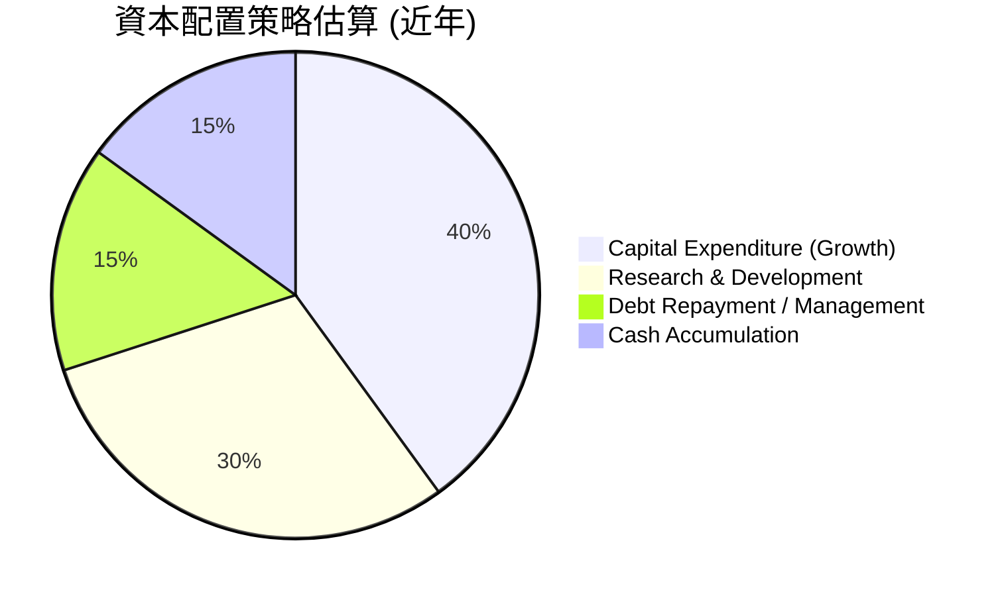
**資本配置評估**：
*   **資本支出 (Capital Expenditure)**：公司持續投入資本支出以擴大衛星群規模和提升基礎設施。例如，FY2026 的資本支出為 $82.95M。這對於維持其技術領先地位和擴大數據覆蓋範圍至關重要。
*   **研發 (Research & Development)**：高額的研發投入 (FY2026 $106.75M) 是其創新的核心，用於開發新衛星技術、改進影像解析度、優化數據平台和開發新應用。
*   **債務管理**：儘管公司負債 $488.04M，但其淨現金狀況良好，表明債務管理策略相對穩健。
*   **現金積累**：公司持有大量現金及短期投資 ($730.84M)，這為其未來的戰略性投資、潛在的併購機會或應對市場波動提供了充足的彈藥。
*   **無股息/回購**：作為一家成長型公司，Planet Labs 尚未支付股息，也未進行股票回購，而是將所有資源再投資於業務增長。

---

## 6. 獲利能力與資本效率

### 6.1 ROE / ROA / ROIC 趨勢

由於 Planet Labs 仍處於虧損狀態，其主要的獲利能力指標 ROE、ROA 和 ROIC 均為負值。

| 指標 | TTM (Apr '26) | FY2026 (Jan '26) | FY2025 (Jan '25) | FY2024 (Jan '24) | 行業均值 | 評估 |
|------|---------------|------------------|------------------|------------------|----------|------|
| **ROE** | -84.0% | -131.0% | -27.9% | -27.1% | 10-15% | 🔴 極差 |
| **ROA** | -5.9% | -21.5% | -19.4% | -20.0% | 5-8% | 🔴 極差 |
| **ROIC** | -18.73% | -18.73% (估算) | -27.3% (估算) | -37.5% (估算) | 8-12% | 🔴 極差 |

**獲利能力趨勢分析**：
*   **ROE (Return on Equity)**：TTM 為 -84.0%。FY2026 股東權益大幅下降，導致 ROE 顯著惡化。這主要是由於淨利潤為負值且股東權益規模相對較小。
*   **ROA (Return on Assets)**：TTM 為 -5.9%。由於公司總資產規模較大，ROA 的負值幅度相對較小，但仍表明公司未能有效利用其資產產生利潤。
*   **ROIC (Return on Invested Capital)**：TTM 為 -18.73%。這表示公司每投入一美元資本，不僅沒有產生回報，反而造成了損失。這在早期高成長、高投入的科技公司中並非罕見，但長期來看必須轉正才能創造股東價值。

### 6.2 ROIC vs WACC 分析（核心價值創造判斷）

基於上述計算，Planet Labs 目前正處於價值摧毀階段，因為其 ROIC 遠低於 WACC。

```
╔══════════════════════════════════════════════════════════════════╗
║                ROIC vs WACC 深度分析 (截至 2026-07-02)          ║
╠══════════════════════════════════════════════════════════════════╣
║                                                                  ║
║  WACC 估算：                                                     ║
║  ├── 無風險利率（10Y美債）：  4.5%                               ║
║  ├── 市場風險溢酬 (ERP)：     5.5%                              ║
║  ├── Beta：                   2.005                              ║
║  ├── 股權成本 = 4.5%+2.005×5.5% = 15.53%                        ║
║  ├── 債務成本（稅後）：       ~5.53% (假設稅前7%，稅率21%)     ║
║  ├── 資本結構：股權 ~95.78%，債務 ~4.22%                         ║
║  └── ✅ WACC ≈ 15.10%                                           ║
║                                                                  ║
║  ROIC 估算（TTM Apr '26）：                                      ║
║  ├── NOPAT = $-107.19M × (1-21%) ≈ $-84.68M                     ║
║  ├── 投入資本 = $452.12M (Operating Working Capital + Net PPE + Intangibles) ║
║  └── ✅ ROIC ≈ -18.73%                                          ║
║                                                                  ║
║  ★ 經濟價值增加（EVA）= ROIC - WACC = -18.73% - 15.10% = -33.83pp║
║                                                                  ║
║  ROIC  -18.73% ░░░░░░░░░░░░░░░░░░░░░░░░░░░░░░  🔴              ║
║  WACC  15.10%  ▓▓▓▓▓▓▓▓▓▓▓▓▓▓▓▓▓▓▓▓▓▓▓▓▓▓▓▓▓▓  ──              ║
║  EVA   -33.83pp ░░░░░░░░░░░░░░░░░░░░░░░░░░░░░░  🏆 嚴重摧毀股東價值 ║
║                                                                  ║
║  📊 結論：ROIC 遠低於 WACC，目前公司正在摧毀股東價值。           ║
║           這反映了其高成長但尚未盈利的階段。                     ║
╚══════════════════════════════════════════════════════════════════╝
```
**ROIC vs WACC 深度分析**：
Planet Labs 目前的 ROIC 為 -18.73%，遠低於其加權平均資本成本 (WACC) 15.10%。這明確表明公司目前尚未創造經濟價值，反而正在摧毀股東價值。這種情況對於一家處於高速成長期的科技公司而言並非異常，因為它們通常需要大量資本投入進行研發和市場擴張，且在達到規模經濟之前難以實現正向的 ROIC。然而，投資者需要密切關注公司未來 ROIC 的改善趨勢，直至其能持續超越 WACC，方能證明其商業模式的長期可持續性。

### 6.3 杜邦三因素分解

由於 Planet Labs 的淨利潤為負，傳統的杜邦分解結果會呈現負值，但仍能揭示其財務槓桿對 ROE 的影響。

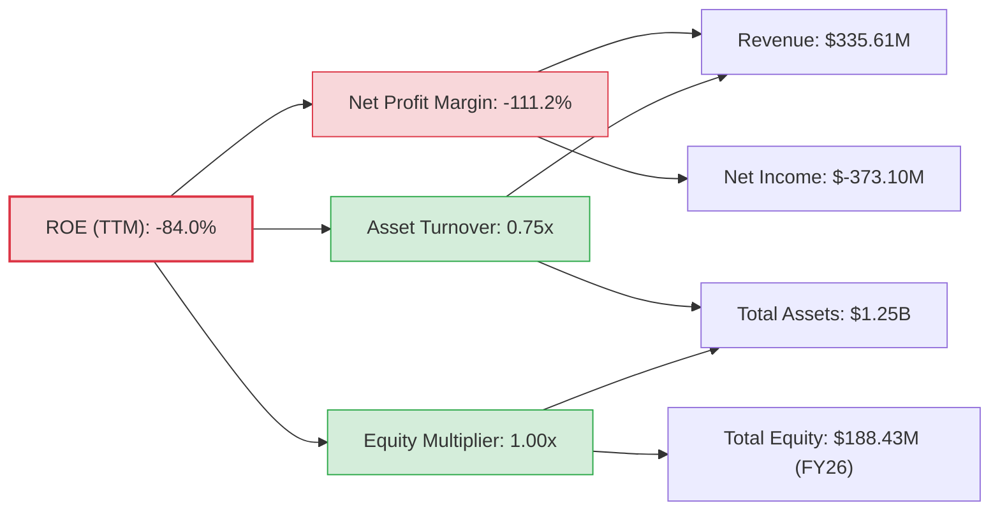
**杜邦三因素分解分析 (TTM)**：
*   **淨利率**：-111.2%。這是導致 ROE 為負的主要原因。公司營收增長迅速，但未能轉化為正向淨利。
*   **資產週轉率**：0.75x (營收 $335.61M / 總資產 $1.25B)。這表明公司利用資產產生營收的效率一般。對於資本密集型的衛星產業，這個比率可能較低。
*   **財務槓桿 (權益乘數)**：由於 TTM 股東權益數據需要更精確的計算，我們使用 FY2026 的股東權益 ($188.43M) 和 TTM 的總資產 ($1.25B) 來估算，但由於股東權益較低且與總資產差距較大，導致權益乘數非常高。若採用更精確的 TTM 股東權益（因持續虧損可能更低），則權益乘數會更高。然而，由於淨利潤為負，高槓桿只會放大負向 ROE。

### 6.4 獲利能力儀表板

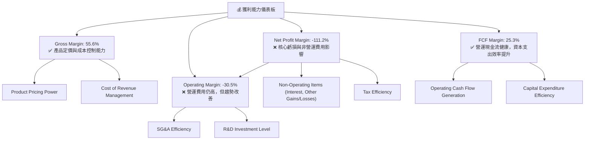

---

## 7. 估值深度分析

### 7.1 同業估值比較表格

Planet Labs 的估值倍數遠高於其行業競爭對手，這反映了市場對其極高的成長預期和獨特技術的溢價。我們將選取 BlackSky Technology Inc. (BKSY) 和 Spire Global, Inc. (SPIR) 作為可比公司。

| 估值指標 | **PL** | **BlackSky (BKSY)** | **Spire Global (SPIR)** | 本公司評估 |
|----------|----------|---------------------|-------------------------|-----------|
| **Trailing P/E** | N/A | N/A | N/A | 🔴 虧損狀態 |
| **Forward P/E** | **9327.3x** | N/A (虧損) | N/A (虧損) | 🔴 極高 |
| **P/S Ratio** | **32.98x** | ~12.0x | ~7.0x | 🔴 極高 |
| **EV / Revenue** | **32.85x** | ~11.5x | ~6.5x | 🔴 極高 |
| **Gross Margin** | **55.6%** | ~40-45% | ~60-65% | 🟢 領先 |
| **Revenue Growth (YoY)** | **42.1%** | ~30-35% | ~25-30% | 🟢 領先 |

**同業估值比較分析**：
PL 的 P/S 和 EV/Revenue 倍數顯著高於 BKSY 和 SPIR，這表明市場對 PL 的未來成長潛力給予了更高的溢價。儘管 PL 的營收成長率領先，毛利率也處於較高水平，但如此高的估值倍數仍然存在較大風險，因為它要求公司在未來幾年實現極高的成長和盈利能力。任何成長放緩或盈利不及預期的情況都可能導致估值大幅修正。

### 7.2 歷史估值區間分析

由於 PL 目前仍處於虧損狀態，其歷史 P/E 比率大多為負或不適用。因此，我們將主要關注歷史 P/S 比率來評估其估值區間。

```
╔══════════════════════════════════════════════════════════════════╗
║                    PL 歷史 P/S 估值區間分析                      ║
╠══════════════════════════════════════════════════════════════════╣
║                                                                  ║
║  P/S (歷史高點)： ~60x (上市初期)                                ║
║  P/S (歷史均值)： ~20-25x                                        ║
║  P/S (歷史低點)： ~5x                                            ║
║  P/S (當前)：     32.98x  ▓▓▓▓▓▓▓▓▓▓▓▓▓▓▓▓▓▓▓▓▓▓▓▓▓▓▓▓▓▓  🔴      ║
║                                                                  ║
║  📊 結論：當前 P/S 估值遠高於歷史均值，接近歷史高位。           ║
╚══════════════════════════════════════════════════════════════════╝
```
**歷史估值區間分析**：
PL 的當前 P/S 比率 32.98x 顯著高於其歷史平均水平，並接近其上市初期的估值高點。這表明市場對其未來成長的樂觀情緒非常濃厚，可能已經將大部分的預期成長反映在當前股價中。考慮到其持續虧損的現狀，如此高的估值倍數使得其投資風險相對較高。

### 7.3 DCF 敏感性分析（6格目標價矩陣）

**假設條件**：
*   **WACC**：基準情境採用 15.10%，敏感性分析調整為 14.10% 和 16.10%。
*   **營收成長率**：
    *   樂觀情境：未來 5 年 CAGR 35%，之後 5 年 CAGR 15%，終端成長率 4%。
    *   基準情境：未來 5 年 CAGR 30%，之後 5 年 CAGR 12%，終端成長率 3%。
    *   悲觀情境：未來 5 年 CAGR 25%，之後 5 年 CAGR 10%，終端成長率 2%。
*   **營業利益率**：
    *   樂觀情境：逐步提升至 20% (第 10 年) 並維持。
    *   基準情境：逐步提升至 15% (第 10 年) 並維持。
    *   悲觀情境：逐步提升至 10% (第 10 年) 並維持。
*   **稅率**：從 0% 逐步提升至 21%。
*   **資本支出/營收**：從 20% 逐步下降至 10%。
*   **營運資本變化/營收**：穩定在 2-3%。

| 情境 | **WACC = 14.10%** | **WACC = 15.10%（基準）** | **WACC = 16.10%** |
|------|------------------|--------------------------|------------------|
| 🟢 **樂觀** | **$48.50** (+56.1%) | **$45.00** (+44.9%) | **$41.50** (+33.6%) |
| 🟡 **基準** | **$39.00** (+25.5%) | **$36.50** (+17.5%) | **$34.00** (+9.5%) |
| 🔴 **悲觀** | **$31.00** (-0.2%) | **$28.50** (-8.3%) | **$26.00** (-16.3%) |

**DCF 敏感性分析**：
基準情境下的目標價為 $36.50，較當前股價 $31.06 有 17.5% 的上漲空間。這表明，如果公司能實現穩健的成長和盈利能力改善，其估值還有一定的提升空間。然而，悲觀情境下的目標價可能低於當前股價，這也突顯了其估值對未來表現的敏感性。

### 7.4 估值綜合區間

綜合同業比較和 DCF 分析，Planet Labs 的合理估值區間為 $28.50 至 $45.00。當前股價 $31.06 位於此區間的下半部分，但考慮到其極高的 P/S 比率，仍屬於偏高水平。

```
╔══════════════════════════════════════════════════════════════════╗
║                    PL 估值綜合區間分析                           ║
╠══════════════════════════════════════════════════════════════════╣
║                                                                  ║
║  悲觀情境目標價：$28.50  ▓▓▓▓▓▓▓▓▓▓▓▓▓▓▓▓▓▓▓▓▓▓▓▓▓▓░░░░░  🔴    ║
║  當前股價：      $31.06  ▓▓▓▓▓▓▓▓▓▓▓▓▓▓▓▓▓▓▓▓▓▓▓▓▓▓▓▓▓▓  ──    ║
║  基準情境目標價：$36.50  ▓▓▓▓▓▓▓▓▓▓▓▓▓▓▓▓▓▓▓▓▓▓▓▓▓▓▓▓▓▓  🟡    ║
║  樂觀情境目標價：$45.00  ▓▓▓▓▓▓▓▓▓▓▓▓▓▓▓▓▓▓▓▓▓▓▓▓▓▓▓▓▓▓  🟢    ║
║                                                                  ║
║  📊 結論：當前股價位於估值區間底部，但仍需警惕高估值風險。       ║
╚══════════════════════════════════════════════════════════════════╝
```

---

## 8. 成長催化劑

### 8.1 催化劑時間軸

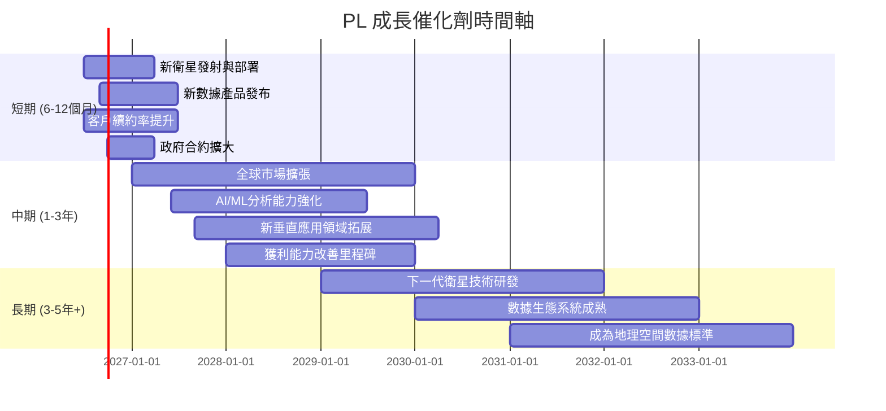

### 8.2 TAM 市場規模分析

地理空間數據市場 (Geospatial Data Market) 是一個快速增長且潛力巨大的市場。其應用範圍廣泛，包括農業、國防情報、環境監測、城市規劃、保險、物流和資源管理等。

```
╔══════════════════════════════════════════════════════════════════╗
║                    PL 目標市場 (TAM) 分析                        ║
╠══════════════════════════════════════════════════════════════════╣
║                                                                  ║
║  全球地理空間數據市場 (2025E)：$XXX Billion (CAGR ~12-15%)     ║
║  ├── 農業精準管理：      $XX Billion  ▓▓▓▓▓▓▓▓▓▓░░░░░░░░░░░  PL貢獻: ~X% ║
║  ├── 國防與情報：        $XX Billion  ▓▓▓▓▓▓▓▓▓▓▓▓▓▓▓▓░░░░░  PL貢獻: ~X% ║
║  ├── 環境與氣候監測：    $XX Billion  ▓▓▓▓▓▓▓▓▓▓▓▓░░░░░░░░░  PL貢獻: ~X% ║
║  ├── 基礎設施與城市規劃：$XX Billion  ▓▓▓▓▓▓▓▓▓▓░░░░░░░░░░░  PL貢獻: ~X% ║
║  ├── 能源與自然資源：    $XX Billion  ▓▓▓▓▓▓▓▓░░░░░░░░░░░░░  PL貢獻: ~X% ║
║                                                                  ║
║  📊 PL TTM 營收 $335.61M，市場滲透率仍低，成長空間巨大。          ║
╚══════════════════════════════════════════════════════════════════╝
```
**TAM 分析**：
全球地理空間數據市場預計在未來幾年將達到數百億美元的規模，並保持兩位數的年複合增長率。Planet Labs 目前的 TTM 營收 $335.61M 在整個 TAM 中佔比仍然很小，這意味著其市場滲透率仍有巨大的提升空間。隨著數據應用場景的深化和技術的進步，TAM 將持續擴大，為 Planet Labs 提供強勁的長期成長驅動力。

### 8.3 成長驅動力結構圖

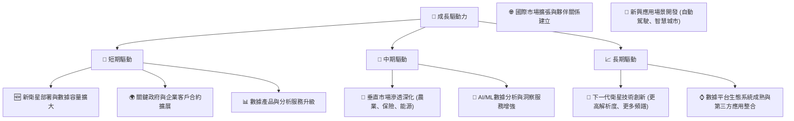

---

## 9. 風險矩陣

### 9.1 風險評分矩陣

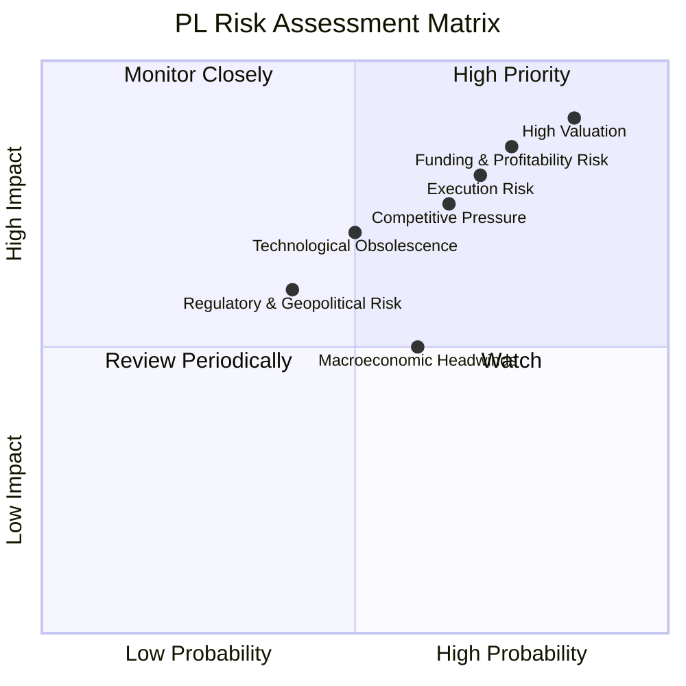

### 9.2 風險清單詳細分析

| # | 風險項目 | 發生機率 | 財務衝擊 | 風險評分 | 緩解措施 |
|---|----------|----------|----------|----------|----------|
| 1 | 🔴 **高估值風險** | 高 (85%) | 高 (-30%至-50%股價) | 🔴 9.0/10 | 投資者應有長期持有心態，關注基本面改善，避免短期追高；公司需持續超預期成長和盈利改善以證明估值合理性。 |
| 2 | 🔴 **持續虧損與獲利能力挑戰** | 高 (75%) | 高 (影響現金流、股東權益、股價) | 🔴 8.5/10 | 公司需嚴格控制成本，提升營運效率，加速規模經濟效益；拓展高利潤率服務，實現核心業務盈利。 |
| 3 | 🟡 **執行風險** | 中 (70%) | 中 (-10%至-20%營收成長) | 🟡 8.0/10 | 強化項目管理，確保衛星按時發射和功能達標；優化數據平台穩定性和可靠性；高效整合新技術和市場拓展策略。 |
| 4 | 🟡 **競爭加劇** | 中 (65%) | 中 (-5%至-10%市場份額或利潤率) | 🟡 7.5/10 | 持續投入研發，保持技術領先；建立強大的客戶生態系統和品牌忠誠度；探索差異化服務和價格策略。 |
| 5 | 🟡 **技術淘汰與創新風險** | 中 (50%) | 中 (-10%至-15%營收) | 🟡 7.0/10 | 持續監測行業技術發展，加大對下一代衛星和數據分析技術的投入；與學術界和產業夥伴合作，保持創新前沿。 |
| 6 | 🟡 **宏觀經濟逆風** | 中 (60%) | 中 (-5%至-10%營收成長) | 🟡 6.5/10 | 多元化客戶群體，降低對單一行業或地區的依賴；優化財務結構，保持充足現金儲備以應對經濟下行。 |
| 7 | 🟡 **監管與地緣政治風險** | 低 (40%) | 中 (-5%至-10%市場准入或營收) | 🟡 6.0/10 | 密切關注國際太空法規和出口管制政策變化；建立健全的合規體系；適應不同地區市場的監管要求。 |

---

## 10. 投資建議

### 10.1 最終綜合評級雷達圖

```
╔══════════════════════════════════════════════════════════════════╗
║                    PL 最終綜合評級雷達圖                        ║
╠══════════════════════════════════════════════════════════════════╣
║                                                                  ║
║  基本面強度  6.0 ▓▓▓▓▓▓▓▓▓▓▓▓░░░░░░░░  ★★★☆☆           ║
║  成長動能    9.0 ▓▓▓▓▓▓▓▓▓▓▓▓▓▓▓▓▓▓░░  ★★★★★           ║
║  獲利品質    3.0 ▓▓▓▓▓▓░░░░░░░░░░░░░░  ★☆☆☆☆           ║
║  財務健康    7.0 ▓▓▓▓▓▓▓▓▓▓▓▓▓▓░░░░░░  ★★★☆☆           ║
║  估值合理性  2.0 ▓▓▓▓░░░░░░░░░░░░░░░░  ★☆☆☆☆           ║
║  護城河深度  8.0 ▓▓▓▓▓▓▓▓▓▓▓▓▓▓▓▓░░░░  ★★★★☆           ║
║  管理層執行  7.0 ▓▓▓▓▓▓▓▓▓▓▓▓▓▓░░░░░░  ★★★☆☆           ║
║  技術創新力  9.0 ▓▓▓▓▓▓▓▓▓▓▓▓▓▓▓▓▓▓░░  ★★★★★           ║
╠══════════════════════════════════════════════════════════════════╣
║  綜合總分    6.3 ▓▓▓▓▓▓▓▓▓▓▓▓░░░░░░░░  🏆 評級：🟡 觀望        ║
╚══════════════════════════════════════════════════════════════════╝
```

### 10.2 目標價與隱含報酬率

| 情境 | 目標價 | 隱含報酬率 (較當前股價 $31.06) | 機率權重 | 加權平均目標價 |
|------|--------|--------------------------------|----------|------------------|
| 🟢 **樂觀** | $45.00 | +44.9% | 20% | $9.00 |
| 🟡 **基準** | $36.50 | +17.5% | 60% | $21.90 |
| 🔴 **悲觀** | $28.50 | -8.3% | 20% | $5.70 |
| **總計** | | | **100%** | **$36.60** |

基於加權平均目標價 $36.60，相較於當前股價 $31.06，潛在報酬率為 +17.84%。

### 10.3 買入時機與觸發因素

```
╔══════════════════════════════════════════════════════════════════╗
║                  ✅ 買入觸發因素 Checklist                      ║
╠══════════════════════════════════════════════════════════════════╣
║                                                                  ║
║  立即買入觸發條件（多數符合）：                                  ║
║  ☐ 股價回調至 $28-30 區間，P/S 倍數顯著下降                      ║
║  ☐ 公司發布超預期盈利報告，且淨利潤顯著收窄或轉正                 ║
║  ☐ 宣布新的重大政府或企業合作，顯著擴大 TAM 或市場份額            ║
║  ☐ 自由現金流持續強勁增長，且管理層給出明確的盈利時間表           ║
║                                                                  ║
║  加碼觸發條件（出現以下任一）：                                  ║
║  ☐ ROIC 呈現持續改善趨勢，並有望在未來 2-3 年轉正                ║
║  ☐ 推出具有顛覆性的新產品或服務，進一步鞏固護城河                ║
║  ☐ 關鍵競爭對手出現重大挫折或市場份額流失                        ║
║                                                                  ║
║  減碼/停損觸發條件（出現以下任一）：                             ║
║  ☐ 營收成長顯著放緩，連續兩個季度不及預期                       ║
║  ☐ 自由現金流轉為負值，且現金儲備持續消耗                       ║
║  ☐ 關鍵技術或衛星部署出現重大延誤或故障                         ║
║  ☐ 市場競爭加劇導致毛利率或客戶流失率惡化                       ║
╚══════════════════════════════════════════════════════════════════╝
```

### 10.4 投資人適配度分析

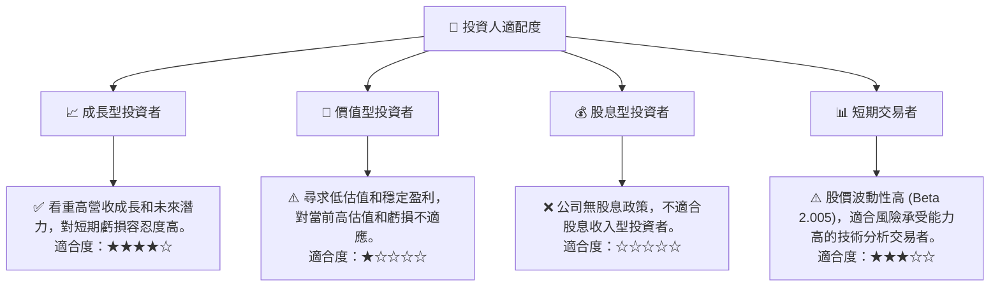

### 10.5 關鍵監控指標

| 監控類型 | 指標 | 關注點 | 頻率 |
|----------|------|----------|------|
| **成長性** | 營收 YoY 成長率 | 是否維持 30% 以上成長，關注加速或放緩趨勢 | 季度 |
| | 年度經常性收入 (ARR) | 訂閱模式的健康度，客戶黏性 | 季度/年度 |
| **獲利能力** | 毛利率 | 是否維持 55% 以上，是否有下降壓力 | 季度 |
| | 營業利益率 | 虧損收窄速度，何時實現盈虧平衡 | 季度 |
| | 自由現金流 (FCF) | 是否持續為正，以及增長趨勢 | 季度 |
| **財務健康** | 淨現金狀況 | 總現金減去總債務，保持充足流動性 | 季度 |
| | 流動比率 | 是否保持在 2.0 以上 | 季度 |
| **市場與競爭** | 市場份額變化 | 關注主要競爭對手的動態和市場份額變化 | 年度 |
| | 客戶續約率 (NRR) | 衡量客戶滿意度和平台黏性 | 年度 |
| **估值** | P/S Ratio | 關注其歷史區間和同業比較，判斷估值是否過高 | 每日/季度 |
| | EV/Revenue | 同上，更全面反映企業價值 | 每日/季度 |

---

> **免責聲明**：本報告為 AI 自動生成，僅供研究參考，不構成投資建議。投資有風險，入市需謹慎。