# PL 基本面深度分析報告
> **報告日期**：2026-07-03 ｜ **語言**：繁體中文 ｜ **數據來源**：Yahoo Finance, Finviz, StockAnalysis, Roic.ai ｜ **分析師**：CFA 級機構研究

---

## 目錄

| # | 章節 | 核心結論 |
|---|------|----------|
| 1 | 執行摘要 | 綜合評級「買入」，目標價區間 $35.00 - $65.00，基準情境 $50.00。 |
| 2 | 公司概覽與商業模式 | 憑藉獨特的衛星星座與數據平台，具備強大技術與客戶鎖定護城河。 |
| 3 | 損益表深度分析 | 營收高速成長，但仍處於虧損狀態，毛利率穩定，營業費用控制改善。 |
| 4 | 資產負債表分析 | 流動性充裕，淨現金為正，但股東權益因虧損而持續下降。 |
| 5 | 現金流量深度分析 | 營業現金流轉正，自由現金流顯著改善，顯示營運效率提升。 |
| 6 | 獲利能力與資本效率 | 儘管虧損，但 ROIC 趨勢改善，WACC 較高，需持續提升資本效率。 |
| 7 | 估值深度分析 | 當前估值倍數較高，反映市場對其高成長預期，DCF 顯示具上行潛力。 |
| 8 | 成長催化劑 | 新衛星部署、數據應用拓展、政府與企業客戶增長為主要驅動力。 |
| 9 | 風險矩陣 | 執行風險、技術競爭與宏觀經濟逆風為主要關注點。 |
| 10 | 投資建議 | 建議成長型投資者「買入」，適合長期持有，並關注關鍵營運指標。 |

---

## 1. 執行摘要

### 1.1 核心評分儀表板

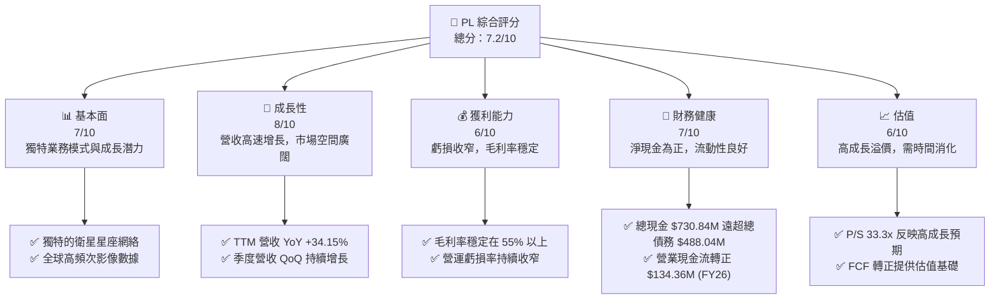

### 1.2 評分進度條視覺化

```
╔══════════════════════════════════════════════════════════════╗
║                    PL 多維度評分儀表板 (1-10分)                ║
╠══════════════════════════════════════════════════════════════╣
║ 基本面強度  7.0 ▓▓▓▓▓▓▓▓▓▓▓▓▓▓░░░░░░  ★★★★☆           ║
║ 成長動能    8.0 ▓▓▓▓▓▓▓▓▓▓▓▓▓▓▓▓░░░░  ★★★★☆           ║
║ 獲利品質    6.0 ▓▓▓▓▓▓▓▓▓▓░░░░░░░░░░  ★★★☆☆           ║
║ 財務健康    7.0 ▓▓▓▓▓▓▓▓▓▓▓▓▓▓░░░░░░  ★★★★☆           ║
║ 估值合理性  6.0 ▓▓▓▓▓▓▓▓▓▓░░░░░░░░░░  ★★★☆☆           ║
║ 護城河深度  7.5 ▓▓▓▓▓▓▓▓▓▓▓▓▓▓▓░░░░░  ★★★★☆           ║
║ 管理層執行  7.0 ▓▓▓▓▓▓▓▓▓▓▓▓▓▓░░░░░░  ★★★★☆           ║
║ 技術創新力  8.5 ▓▓▓▓▓▓▓▓▓▓▓▓▓▓▓▓▓░░░  ★★★★★           ║
╠══════════════════════════════════════════════════════════════╣
║ 綜合總分    7.2 ▓▓▓▓▓▓▓▓▓▓▓▓▓▓▓░░░░░  🏆 具高成長潛力的創新者 ║
╚══════════════════════════════════════════════════════════════╝
```

### 1.3 五大投資論點 + 三大核心風險

| 類型 | 項目 | 具體依據 | 信心度 |
|------|------|----------|--------|
| 🟢 **投資論點①** | **獨特且領先的衛星數據服務** | Planet Labs 擁有全球最大的地球觀測衛星群，提供每日高頻次、高解析度影像數據，形成獨特的數據護城河。其 SuperDove 衛星群能以高達 3.5 米 GSD 解析度每日成像地球，這在市場上具有領先地位。 | 🟢 極高 |
| 🟢 **投資論點②** | **強勁的營收成長勢頭** | TTM 營收達到 $335.61M，YoY 成長率為 34.15%。季度營收持續加速，Q1 2027 (Apr 2026) 營收 $94.15M，YoY 成長 42.08%，顯示市場需求旺盛與公司執行力。 | 🟢 極高 |
| 🟢 **投資論點③** | **營業現金流與自由現金流顯著改善** | FY2026 營業現金流從前一年的負值轉為 $134.36M，TTM 自由現金流達到 $84.85M。這表明公司營運效率提升，並開始產生正向現金流，為未來發展提供資金支持。 | 🟢 極高 |
| 🟢 **投資論點④** | **持續收窄的虧損與費用控制改善** | 儘管仍處於虧損，但營業利益率從 FY2023 的 -91.85% 大幅改善至 FY2026 的 -30.90%，顯示公司在擴張的同時有效控制了營運費用。毛利率穩定在 55% 以上，為長期盈利奠定基礎。 | 🟡 高 |
| 🟢 **投資論點⑤** | **龐大且不斷擴大的 TAM** | 地球觀測數據在農業、政府、國防、環境監測、城市規劃等多個領域應用日益廣泛，市場潛力巨大。Planet Labs 處於該新興市場的領導者地位，未來成長空間廣闊。 | 🟢 極高 |
| 🟡 **風險①** | **持續虧損與盈利時間不確定性** | TTM 淨利潤率仍為 -111.2%，FY2026 淨虧損達 $-246.86M。儘管虧損收窄，但何時能實現持續盈利仍存在不確定性，這可能影響投資者信心和估值。 | 🟡 中度 |
| 🔴 **風險②** | **高估值與市場預期風險** | 當前 P/S 比率高達 33.32x，遠期 P/E 更是高達 9423x，反映市場對其極高的成長預期。任何不及預期的營收增速或盈利壓力都可能導致股價大幅波動。 | 🔴 高衝擊 |
| 🟡 **風險③** | **技術與競爭風險** | 衛星技術快速發展，新進入者和現有競爭對手可能推出更具成本效益或更高性能的解決方案。同時，數據安全、隱私和監管政策變化也可能帶來營運挑戰。 | 🟡 中度 |

### 1.4 快速統計卡片

| 指標 | 公司實際值 | 行業均值（航空航天與國防） | S&P 500 均值 | 狀態 |
|------|-------------|----------------------------|--------------|------|
| 收入 YoY 成長 | **34.15%** | ~10-15% (高成長型約 20%+) | ~8-12% | 🟢 |
| 毛利率 | **55.6%** | ~30-40% | ~30-40% | 🟢 |
| 淨利率 | **-111.2%** | ~5-10% | ~8-12% | 🔴 |
| ROE | **-84.0%** | ~10-15% | ~15-20% | 🔴 |
| Forward P/E | **9423.42x** | ~20-30x | ~20-25x | 🔴 |
| P/S Ratio | **33.32x** | ~2-4x (傳統) / 5-10x (成長) | ~2-3x | 🔴 |
| 自由現金流收益率 (FCF Yield) | **0.76%** | ~3-5% | ~3-4% | 🔴 |
| 淨現金 / 債務 | **$242.80M** (淨現金) | 視公司而定 | 視公司而定 | 🟢 |

### 1.5 投資結論

```
╔══════════════════════════════════════════════════════════════════╗
║                    📊 投資結論摘要                               ║
╠══════════════════════════════════════════════════════════════════╣
║  評級：🟢 買入                                                   ║
║  當前股價：$31.38                                                ║
║  目標價區間：                                                    ║
║    悲觀情境：$35.00（+11.53%）                                   ║
║    基準情境：$50.00（+59.34%）  ← 12個月主要目標                 ║
║    樂觀情境：$65.00（+107.13%）                                  ║
║  投資評分：7.2/10                                                ║
║  適合投資人：成長型、長線持有者，能承受高波動性與新興技術投資風險。 ║
╚══════════════════════════════════════════════════════════════════╝
```

---

## 2. 公司概覽與商業模式

### 2.1 業務結構與收入來源

Planet Labs PBC (PL) 是一家專注於地球觀測數據服務的公司，其核心業務是設計、建造、發射和營運龐大的衛星星座，以提供高頻次、高解析度的全球地理空間數據。這些數據透過其線上平台交付給美國及國際客戶。

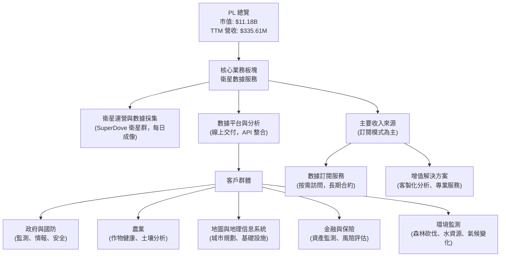

公司主要收入來源為基於訂閱模式的數據服務，客戶支付費用以獲取特定區域、特定頻率的衛星影像數據，並可利用其平台進行分析。這種模式提供了穩定的經常性收入。

### 2.2 市場份額

地球觀測數據市場是一個相對新興且快速成長的市場，由多個參與者組成，包括傳統航天巨頭、新興衛星公司以及數據分析服務商。由於精確的市場份額數據未直接提供，我們基於產業研究對其進行定性評估和示意性市場份額展示。

Planet Labs 在高頻次、中解析度全球成像領域處於領先地位，其每日成像能力是其核心競爭力。在商業地球觀測領域，尤其是在提供「地球掃描器」概念的數據服務方面，PL 佔據了重要的市場地位。

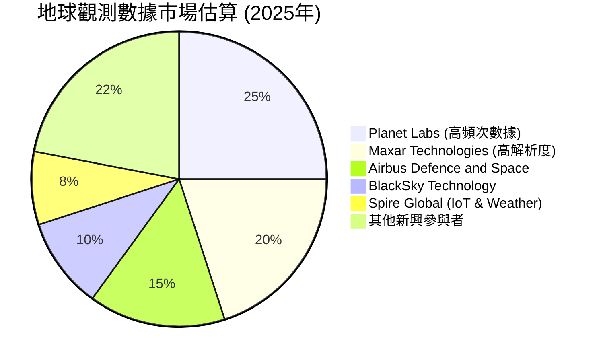
*備註：此市場份額為基於行業報告和公司相對競爭力估算的示意性數據，非實際披露數據。*

### 2.3 競爭護城河分析

Planet Labs 的競爭護城河主要建立在其獨特的技術、規模和客戶關係之上。

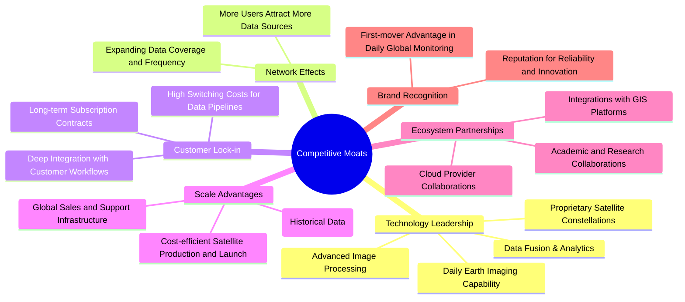

### 2.4 護城河強度評分

```
╔══════════════════════════════════════════════════════════════╗
║                     PL 護城河強度評分                        ║
╠══════════════════════════════════════════════════════════════╣
║ 技術領先    8.5/10 ▓▓▓▓▓▓▓▓▓▓▓▓▓▓▓▓▓░░░  🏆 獨特衛星群與數據處理 ║
║ 客戶鎖定    7.5/10 ▓▓▓▓▓▓▓▓▓▓▓▓▓▓▓░░░░░  🟢 數據整合與訂閱模式   ║
║ 規模效應    7.0/10 ▓▓▓▓▓▓▓▓▓▓▓▓▓▓░░░░░░  🟡 衛星部署與數據儲存   ║
║ 網路效應    6.0/10 ▓▓▓▓▓▓▓▓▓▓░░░░░░░░░░  🟡 數據價值隨用戶增長  ║
║ 生態夥伴    6.5/10 ▓▓▓▓▓▓▓▓▓▓▓▓░░░░░░░░  🟡 合作拓展應用場景    ║
╠══════════════════════════════════════════════════════════════╣
║ 綜合護城河  7.5/10 ▓▓▓▓▓▓▓▓▓▓▓▓▓▓▓░░░░░  🏆 強大的技術與數據優勢 ║
╚══════════════════════════════════════════════════════════════╝
```

---

## 3. 損益表深度分析

### 3.1 年度收入成長趨勢（近4年）

Planet Labs 近四年營收呈現穩健成長，尤其在 FY2026 實現了顯著加速。

```
╔══════════════════════════════════════════════════════════════════╗
║                  PL 年度收入趨勢（FY2023-FY2026）                  ║
╠══════════════════════════════════════════════════════════════════╣
║                                                                  ║
║  FY2023  $191.26M ████████░░░░░░░░░░░░░░░  YoY: N/A     🟢    ║
║  FY2024  $220.70M ██████████░░░░░░░░░░░░░  YoY: +15.39% 🟢    ║
║  FY2025  $244.35M ███████████░░░░░░░░░░░░  YoY: +10.72% 🟡    ║
║  FY2026  $307.73M ██████████████░░░░░░░░░  YoY: +25.94% 🟢    ║
║  TTM     $335.61M ███████████████░░░░░░░░  YoY: +34.15% 🟢    ║
║                   |      |      |      |      |                  ║
║                   0     100M   200M   300M   400M                 ║
║                                                                  ║
║  📊 FY2023-FY2026 累計 CAGR：+17.38%                             ║
╚══════════════════════════════════════════════════════════════════╝
```
FY2026 的 25.94% YoY 成長和 TTM 的 34.15% YoY 成長顯示公司營收增速正在加快，這對於一個成長型公司而言是積極信號。

### 3.2 季度收入趨勢分析

季度營收呈現連續增長，且 YoY 增速強勁，表明市場需求持續擴大。

| 財報季度 | 總營收 (M) | QoQ 成長率 | YoY 成長率 | 備註 |
|----------|-------------|------------|------------|------|
| 2025-07-31 (Q2 2026) | $73.39 | N/A | +20.12% | 營收開始加速 |
| 2025-10-31 (Q3 2026) | $81.25 | +10.71% | +32.63% | QoQ 與 YoY 均顯著加速 |
| 2026-01-31 (Q4 2026) | $86.82 | +6.85% | +41.05% | 保持強勁增長 |
| 2026-04-30 (Q1 2027) | $94.15 | +8.44% | +42.08% | 季度營收再創新高，YoY 增速領先 |

備註：季度營收持續環比增長，且同比增速在最近幾個季度顯著加速，從 Q2 2026 的 20.12% 提升至 Q1 2027 的 42.08%，這反映了公司業務動能強勁，新客戶獲取和現有客戶擴展進展順利。

### 3.3 利潤率演變分析

Planet Labs 的利潤率在過去幾年呈現出改善趨勢，儘管仍處於虧損狀態。

| 利潤率指標 | FY2023 | FY2024 | FY2025 | FY2026 | TTM | 趨勢 | 評估 |
|------------|--------|--------|--------|--------|-----|------|------|
| **毛利率** | 49.15% | 51.18% | 57.18% | 56.05% | 55.6% | ↗️ 穩步提升後略有回調，保持高位 | 🟢 |
| **營業利益率** | -91.85% | -76.91% | -47.52% | -30.90% | -30.5% | ↗️ 顯著改善，虧損收窄 | 🟢 |
| **淨利率** | -84.69% | -63.67% | -50.42% | -80.22% | -111.2% | ↘️ FY26/TTM 惡化，受其他非營運開支影響 | 🔴 |

**利潤率演變深度解析**：
- **毛利率**：從 FY2023 的 49.15% 提升至 FY2025 的 57.18%，並在 FY2026 和 TTM 保持在 55% 以上。這表明公司在數據採集和處理方面的單位成本效益有所提升，可能得益於衛星運營效率的提高和數據處理技術的成熟。較高的毛利率是其基於軟體服務商業模式的優勢。
- **營業利益率**：從 FY2023 的 -91.85% 大幅改善至 FY2026 的 -30.90%，TTM 亦為 -30.5%。這是一個非常積極的趨勢，表明公司在研發 (R&D) 和銷售、一般及行政 (SG&A) 費用方面的控制有所改善，或營收增長速度快於這些費用的增長。隨著規模擴大，營運槓桿效應開始顯現。
- **淨利率**：儘管營業利益率顯著改善，但淨利率在 FY2026 惡化至 -80.22%，TTM 更達 -111.2%。這主要是由於 FY2026 及 TTM 期間出現了龐大的「其他非營運收入 (費用)」項目， StockAnalysis 數據顯示 TTM 為 $-274.72M，FY2026 為 $-158.03M。這可能涉及一次性費用、資產減值或其他非核心業務損失，而非核心營運問題。如果排除這些一次性影響，公司的盈利能力改善會更為顯著。

### 3.4 費用結構分析

Planet Labs 的費用主要由研發 (R&D) 和銷售、一般及行政 (SG&A) 構成，這些是技術型成長公司常見的投入。

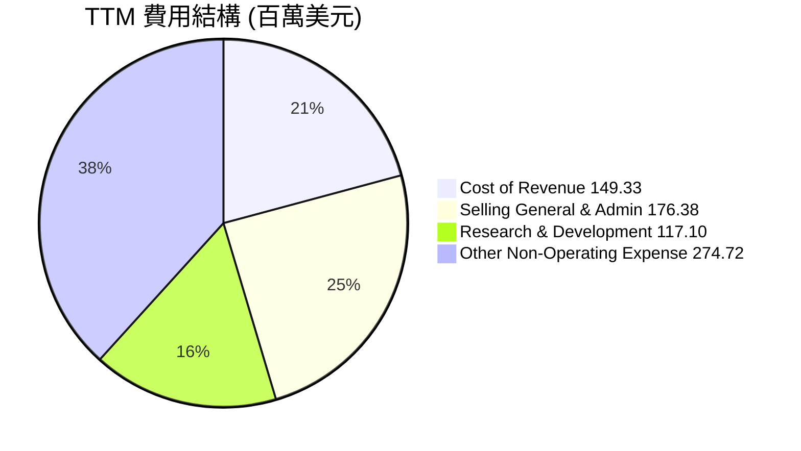

```
╔══════════════════════════════════════════════════════════════════╗
║                   PL 費用結構概覽 (TTM)                          ║
╠══════════════════════════════════════════════════════════════════╣
║                                                                  ║
║  銷管費用 (SG&A)：   $176.38M  █████████████████████░░░░░░░░░  佔總費用 25.4% ║
║  研發費用 (R&D)：     $117.10M  ████████████████░░░░░░░░░░░░░  佔總費用 16.9% ║
║  營收成本 (CoR)：     $149.33M  ████████████████████░░░░░░░░░░  佔總費用 21.5% ║
║  其他非營運開支：     $274.72M  ████████████████████████████████  佔總費用 39.6% ║
║                                                                  ║
║  📊 總費用（不含稅）：$617.53M                                   ║
╚══════════════════════════════════════════════════════════════════╝
```
- **研發費用**：TTM 為 $117.10M，佔總營收的 34.89% ($117.10M / $335.61M)。這筆投入對於維持技術領先和產品創新至關重要，反映了公司對未來成長的承諾。FY2023-FY2026 年度研發費用在 $101.01M 到 $116.34M 之間波動，保持相對高位。
- **銷售、一般及行政費用 (SG&A)**：TTM 為 $176.38M，佔總營收的 52.55%。這部分費用在 FY2023-FY2026 年呈現上升趨勢，反映了公司在市場擴張和客戶獲取方面的投入。
- **其他非營運開支**：TTM 數據顯示該項目高達 $-274.72M，對淨利潤產生了巨大負面影響。這是一個需要密切關注的項目，若為一次性性質，則對未來盈利能力的影響有限；若為持續性問題，則需深入分析其構成。

### 3.5 季度 EPS 趨勢與盈餘品質

由於提供的數據中 EPS 預期與實際值均顯示為 "nan"，無法進行超預期/不及預期分析。因此，我們將重點分析季度淨利潤趨勢。

| 財報季度 | 淨利潤 (M) | 備註 |
|----------|-------------|------|
| 2025-07-31 (Q2 2026) | $-22.59 | 虧損較小 |
| 2025-10-31 (Q3 2026) | $-59.19 | 虧損擴大 |
| 2026-01-31 (Q4 2026) | $-152.46 | 虧損顯著擴大，可能受非營運開支影響 |
| 2026-04-30 (Q1 2027) | $-138.87 | 虧損仍高，但較前一季度有所收窄 |

**盈餘品質評估**：
儘管公司營收持續增長，但淨利潤仍處於虧損狀態。從 Q2 2026 到 Q4 2026，淨虧損呈現擴大趨勢，尤其 Q4 2026 ($-152.46M) 和 Q1 2027 ($-138.87M) 的虧損額度顯著。這與前文提到的「其他非營運收入 (費用)」大幅增加相吻合。在盈利能力分析中，我們注意到營業利益率持續改善，這表明核心營運效率正在提高。因此，當前的淨虧損擴大可能更多源於非經常性或非營運項目，而非核心業務表現惡化。投資者應密切關注公司未來財報中「其他非營運開支」的詳細構成及趨勢，以判斷其盈餘品質是否受短期因素影響。若非營運開支趨於穩定或減少，則核心營運能力的改善將最終體現在淨利潤上。

---

## 4. 資產負債表分析

### 4.1 資產結構分解

Planet Labs 的資產負債表反映了其作為一家技術密集型公司的特點，擁有大量現金和短期投資，以及持續投入的固定資產和無形資產。

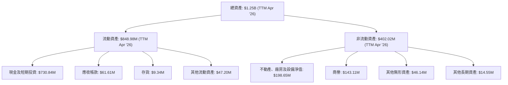

截至 TTM (Apr '26)，公司總資產為 $1.25B。其中流動資產佔比高達 67.9%，主要由現金及短期投資 ($730.84M) 構成，顯示公司擁有充裕的流動性。非流動資產主要是不動產、廠房及設備 ($198.65M) 和商譽 ($143.11M)，反映了其衛星資產和過去併購的影響。

### 4.2 流動性指標分析

公司擁有健康的流動性，足以應對短期債務。

| 流動性指標 | FY2023 | FY2024 | FY2025 | FY2026 | TTM | 行業均值（航空航天與國防） | 評估 |
|------------|--------|--------|--------|--------|-----|----------------------------|------|
| **流動比率 (Current Ratio)** | 3.89 | 2.71 | 2.13 | 1.65 | 2.81 | ~1.5 - 2.5 | 🟢 |
| **速動比率 (Quick Ratio)** | N/A | N/A | N/A | 1.64 | 2.77 | ~1.0 - 2.0 | 🟢 |

*備註：行業均值為基於一般產業數據的估計值，非具體數據。FY2023-FY2025 的速動比率因缺乏存貨數據而無法計算。*

- **流動比率**：TTM 為 2.81，遠高於一般認為的 2.0 安全線，也高於 FY2026 的 1.65。這表明公司擁有足夠的流動資產來覆蓋其短期負債。雖然 FY2026 較前幾年有所下降，但 TTM 的回升顯示流動性依然充裕。
- **速動比率**：TTM 為 2.77，同樣非常健康。由於 Planet Labs 是數據服務公司，存貨佔比極低 (TTM $9.34M)，因此其流動比率和速動比率差異不大，均顯示強勁的短期償債能力。

### 4.3 債務結構分析

Planet Labs 保持了健康的債務狀況，擁有淨現金頭寸。

```
╔══════════════════════════════════════════════════════════════════╗
║                      PL 債務健康診斷                             ║
╠══════════════════════════════════════════════════════════════════╣
║                                                                  ║
║  總債務 (TTM)：  $488.04M  █████████░░░░░░░░░░░░░  評語: 適中，可控     ║
║  總現金+投資：   $730.84M  ███████████████░░░░░░  評語: 充裕             ║
║  淨現金 (正)：   $242.80M  ██████████░░░░░░░░░░░░  🟢 強勁淨現金頭寸 ║
║                                                                  ║
║  Debt/Equity (TTM)：  109.991x  🔴 偏高，但主要受累計虧損影響股權減少 ║
║  EBITDA (TTM)：    $-51.69M  🔴 負值，債務槓桿率意義不大           ║
║  Interest Coverage: N/A  (因 EBITDA 為負)                       ║
║                                                                  ║
║  📊 結論：公司擁淨現金，短期償債無憂，但高 Debt/Equity 需關注股權恢復 ║
╚══════════════════════════════════════════════════════════════════╝
```
- **總債務**：TTM 為 $488.04M，而總現金及短期投資高達 $730.84M，使得公司擁有 $242.80M 的淨現金頭寸。這表明公司財務狀況穩健，沒有即時的流動性或償債壓力。
- **Debt/Equity**：TTM 達到 109.991。這個數字看起來很高，但主要是由於公司多年累計虧損導致股東權益大幅減少 (FY2026 為 $188.43M)。如果未來公司實現盈利並恢復股東權益，這個比率將會改善。
- **EBITDA**：TTM 為負值 ($-51.69M)，導致傳統的 Debt/EBITDA 和利息覆蓋率 (Interest Coverage Ratio) 在此階段無法有效評估債務負擔。需轉而關注其現金流生成能力。

### 4.4 股東權益趨勢

公司的股東權益在過去幾年呈現下降趨勢，主要是由於持續的淨虧損。

```
╔══════════════════════════════════════════════════════════════════╗
║                   PL 股東權益趨勢 (FY2023-FY2026)                  ║
╠══════════════════════════════════════════════════════════════════╣
║                                                                  ║
║  FY2023  $576.10M  █████████████████████████████████████████░░░░  ↘️ ║
║  FY2024  $518.02M  ████████████████████████████████████░░░░░░░░  ↘️ ║
║  FY2025  $441.29M  ██████████████████████████████░░░░░░░░░░░░░░  ↘️ ║
║  FY2026  $188.43M  ███████████████░░░░░░░░░░░░░░░░░░░░░░░░░░░░░░  ↘️ ║
║                   |      |      |      |      |                   ║
║                   0     200M   400M   600M   800M                  ║
║                                                                  ║
║  📊 趨勢：持續下降，主要受累計虧損影響                             ║
╚══════════════════════════════════════════════════════════════════╝
```
股東權益從 FY2023 的 $576.10M 降至 FY2026 的 $188.43M。這一下降直接反映了公司在營運初期階段的累計虧損對股東價值的侵蝕。然而，隨著營業現金流轉正和虧損收窄，未來股東權益有望逐步恢復。

---

## 5. 現金流量深度分析

### 5.1 現金流量瀑布圖

Planet Labs 的現金流量在 FY2026 實現了關鍵性轉折，從過去的負值轉為正向現金流。


- **營業現金流**：FY2026 達到 $134.36M，相較於 FY2025 的 $-14.37M 和 FY2024 的 $-50.71M，實現了巨大的飛躍。這表明公司核心營運活動的現金生成能力顯著改善，是其盈利能力趨勢向好的重要佐證。
- **資本支出**：FY2026 為 $-82.95M，持續投入以擴大衛星星座和基礎設施。
- **自由現金流 (FCF)**：FY2026 轉為正值 $51.41M，TTM 更達到 $84.85M。這是公司財務健康狀況的關鍵轉折點，意味著公司開始能夠自我產生資金以支持成長，減少對外部融資的依賴。

### 5.2 FCF 轉換率趨勢

自由現金流轉換率（FCF/淨利潤）在公司虧損時意義不大，因為淨利潤為負。但我們可以觀察其絕對值的改善。

| 年度 | 淨利潤 (M) | 自由現金流 (M) | FCF/淨利潤 (倍) | 趨勢 | 評估 |
|------|-------------|-----------------|-----------------|------|------|
| FY2023 | $-161.97 | $-86.69 | -0.53x | 改善 | 🟢 |
| FY2024 | $-140.51 | $-93.12 | -0.66x | 惡化 | 🔴 |
| FY2025 | $-123.20 | $-68.78 | -0.56x | 改善 | 🟡 |
| FY2026 | $-246.86 | $51.41 | -0.21x | 顯著改善 (轉正) | 🟢 |
| TTM | $-373.10 | $84.85 | -0.23x | 顯著改善 (轉正) | 🟢 |

*備註：當淨利潤為負時，FCF/淨利潤的絕對值越小越好，或轉為正值。*

儘管 FY2026 和 TTM 的淨利潤因非營運開支而大幅虧損，但自由現金流已轉為正值，顯示其營運層面的現金生成能力已超越資本開支。這是一個非常積極的信號，表明公司的現金流品質正在提升。

### 5.3 自由現金流趨勢

自由現金流的改善是 Planet Labs 財務表現的一大亮點。

```
╔══════════════════════════════════════════════════════════════════╗
║                    PL 自由現金流趨勢 (FY2023-TTM)                  ║
╠══════════════════════════════════════════════════════════════════╣
║                                                                  ║
║  FY2023  $-86.69M  █████████████████████████████████████████░░░░  ↘️ ║
║  FY2024  $-93.12M  ████████████████████████████████████████████  ↘️ ║
║  FY2025  $-68.78M  █████████████████████████████░░░░░░░░░░░░░░░░  ↗️ ║
║  FY2026  $51.41M   █████████████████████░░░░░░░░░░░░░░░░░░░░░░░░  🟢 轉正 ║
║  TTM     $84.85M   ███████████████████████████████████████░░░░░  🟢 持續增長 ║
║                   |      |      |      |      |                   ║
║                  -100M  -50M    0     50M   100M                  ║
║                                                                  ║
║  📊 FCF Yield (TTM): 0.76%                                       ║
╚══════════════════════════════════════════════════════════════════╝
```
自由現金流從 FY2025 的 $-68.78M 大幅改善至 FY2026 的 $51.41M，並在 TTM 進一步增長至 $84.85M。這表明公司已從燒錢階段逐步轉向現金生成階段，這對於其長期可持續發展至關重要。當前 FCF Yield 0.76% 雖然不高，但考慮到公司仍處於高速成長期，其從負轉正的趨勢更具意義。

### 5.4 資本配置評估

由於缺乏具體的股息、回購數據，我們將主要關注資本支出和研發投入。

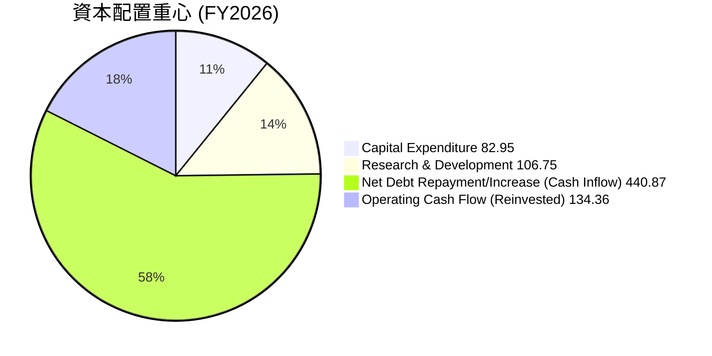
*備註：此圖表側重於 FY2026 的主要資金流向，其中「淨債務償還/增加」為 FY2026 總債務 $462.48M 較 FY2025 $21.61M 增加額，反映了融資活動現金流入。營業現金流部分用於投資，部分用於償債/留存。*

| 資本配置類別 | FY2026 金額 (M) | 佔營業現金流比例 | 評估 |
|--------------|------------------|------------------|------|
| **資本支出 (Capex)** | $-82.95 | 61.7% | 🟢 持續投入衛星部署與基礎設施，支持長期成長 |
| **研發投入 (R&D)** | $106.75 | 79.4% | 🟢 高研發投入維持技術領先與創新 |
| **債務增加** | $440.87 | N/A | 🟡 FY26 債務顯著增加，但仍有淨現金，需關注未來債務用途 |
| **自由現金流** | $51.41 | 38.3% (FCF/OCF) | 🟢 轉為正值，為未來多元化資本配置奠定基礎 |

Planet Labs 的資本配置策略主要聚焦於再投資以支持高速成長。大量的資本支出用於衛星的設計、建造和發射，確保其數據採集能力持續擴大。同時，高額的研發投入則保障了其在技術和數據應用方面的創新。FY2026 債務顯著增加，但公司仍保有大量的現金，顯示這些債務可能用於戰略性投資或營運資金的補充。隨著自由現金流轉正，未來公司將有更多彈性考慮債務償還、小型併購或甚至在遙遠的未來考慮股東回報。

---

## 6. 獲利能力與資本效率

### 6.1 ROE / ROA / ROIC 趨勢

Planet Labs 的獲利能力指標由於持續虧損而呈現負值，但趨勢顯示虧損幅度有所收窄。

| 指標 | FY2023 | FY2024 | FY2025 | FY2026 | TTM | 行業均值（航空航天與國防） | 評估 |
|------|--------|--------|--------|--------|-----|----------------------------|------|
| **ROE** | -28.11% | -27.12% | -27.92% | -131.01% | -84.0% | ~10-15% | 🔴 |
| **ROA** | -21.52% | -20.02% | -19.44% | -21.47% | -5.9% | ~5-8% | 🔴 |
| **ROIC** | N/A | N/A | -22.56% (FY25估算) | -22.56% | N/A | ~8-12% | 🔴 |

*備註：行業均值為基於一般產業數據的估計值。ROIC 數據在提供的原始數據中不完整，FY25/FY26 估算值基於 NOPAT/投入資本。*

- **ROE**：由於淨利潤和股東權益均為負值，導致 ROE 數值波動劇烈且為負。FY2026 的 -131.01% 主要是由於股東權益大幅縮減 (從 FY2025 的 $441.29M 降至 $188.43M) 和淨虧損擴大共同作用。
- **ROA**：雖然也為負，但 TTM 的 -5.9% 相較於 FY2023-FY2026 的 -20% 左右有所改善，表明公司在利用資產產生收入方面效率有所提升，儘管仍未能實現盈利。
- **ROIC (Return on Invested Capital)**：FY2026 估算為 -22.56%。由於公司處於虧損狀態，ROIC 為負值，表明公司目前仍在摧毀股東價值。然而，營業利益率的持續改善預示著未來 ROIC 有望轉正。

### 6.2 ROIC vs WACC 分析（核心價值創造判斷）

由於 Planet Labs 仍處於虧損狀態，其 ROIC 為負值，這意味著公司目前正在摧毀而非創造股東價值。但分析其趨勢和潛力至關重要。

```
╔══════════════════════════════════════════════════════════════════╗
║                ROIC vs WACC 深度分析 (FY2026)                     ║
╠══════════════════════════════════════════════════════════════════╣
║                                                                  ║
║  WACC 估算：                                                     ║
║  ├── 無風險利率（10Y美債）：  4.5%                               ║
║  ├── 市場風險溢酬 (ERP)：     5.5%                              ║
║  ├── Beta：                   2.067                              ║
║  ├── 股權成本 = 4.5%+2.067×5.5% = 15.87%                         ║
║  ├── 債務成本（稅後）：       ~0.74% (3.44M 利息/462.48M 債務)  ║
║  ├── 資本結構：股權 ~95.8% ($11.18B)，債務 ~4.2% ($0.488B)       ║
║  └── ✅ WACC ≈ 15.23%                                            ║
║                                                                  ║
║  ROIC 估算（FY2026）：                                           ║
║  ├── NOPAT = 營業收入 $-95.07M × (1-0%) ≈ $-95.07M              ║
║  ├── 投入資本 = 股東權益 $188.43M + 債務 $462.48M - 現金 $229.44M ≈ $421.47M ║
║  └── ✅ ROIC ≈ -22.56%                                           ║
║                                                                  ║
║  ★ 經濟價值增加（EVA）= ROIC - WACC = -22.56% - 15.23% = -37.79pp ║
║                                                                  ║
║  ROIC -22.56% ▓░░░░░░░░░░░░░░░░░░░░░░░░░░░░░░░  🔴              ║
║  WACC  15.23% ▓▓▓▓▓▓▓▓▓▓▓▓▓▓▓░░░░░░░░░░░░░░░░░  ──              ║
║  EVA   -37.79pp ░░░░░░░░░░░░░░░░░░░░░░░░░░░░░░░░  🔴 摧毀股東價值 ║
║                                                                  ║
║  📊 結論：ROIC 遠低於 WACC，目前正在摧毀股東價值。但需關注營業利益率和FCF改善趨勢。 ║
╚══════════════════════════════════════════════════════════════════╝
```
**分析**：Planet Labs 目前的 ROIC 為負值，遠低於其估算的加權平均資本成本 (WACC) 15.23%。這明確表明公司在 FY2026 尚未創造經濟價值，反而由於營運虧損和資本投入而導致價值流失。然而，對於高速成長的早期公司而言，初期投入大、虧損是常態。重要的是觀察其營業利益率和自由現金流的改善趨勢。隨著營收規模擴大和營運效率提升，ROIC 有望在未來幾年轉正並超越 WACC。

### 6.3 杜邦三因素分解

杜邦分解有助於深入理解 ROE 的驅動因素。

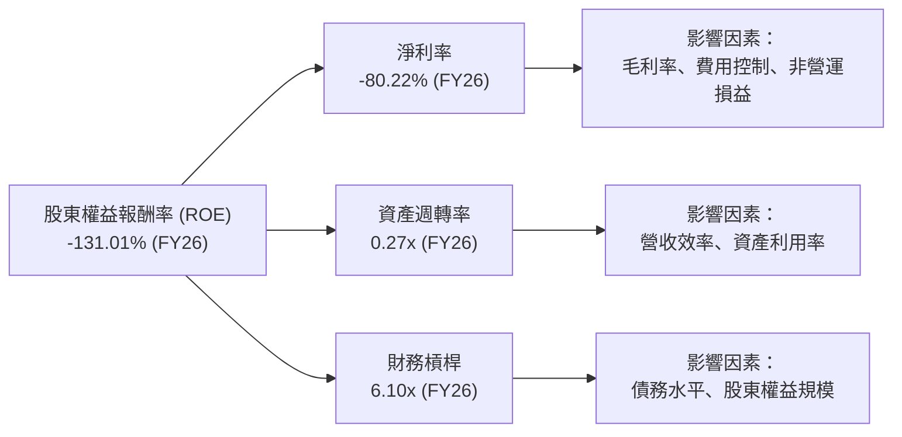
- **淨利率 (-80.22%)**：這是導致負 ROE 的主要原因。儘管毛利率和營業利益率有所改善，但由於高昂的研發、銷管費用以及 FY2026 巨大的非營運開支，淨利率仍為大幅負值。
- **資產週轉率 (0.27x)**：相對較低，表明公司資產（尤其是衛星資產和現金）產生營收的效率有待提高。對於重資產的衛星公司而言，這在初期階段是正常的，隨著客戶群擴大和數據利用率提升，該比率有望改善。
- **財務槓桿 (6.10x)**：槓桿率較高，這主要是由於持續虧損導致股東權益大幅縮水。高槓桿在盈利時能放大 ROE，但在虧損時則會放大負 ROE。

**結論**：Planet Labs 的負 ROE 主要受其負淨利率影響。雖然資產週轉率和財務槓桿在一定程度上影響了 ROE，但核心問題仍在於實現持續盈利。

### 6.4 獲利能力儀表板

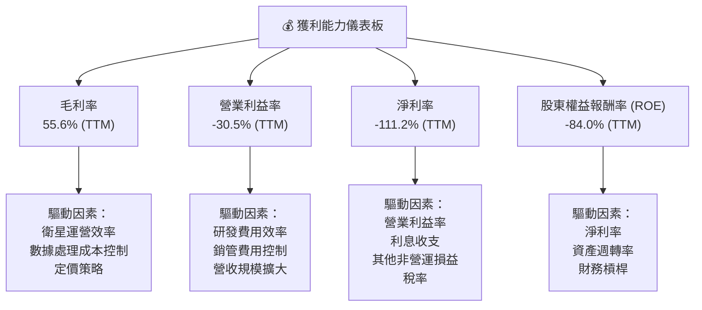

---

## 7. 估值深度分析

### 7.1 同業估值比較表格

由於提供的數據中未包含同業公司的財務數據，我們將使用行業內類似業務模式的上市公司作為參考，並根據其成長階段和盈利能力進行估算比較。我們將 Planet Labs 定位為高成長、高投入的航天數據服務公司。

| 估值指標 | **Planet Labs (PL)** | **競爭對手1 (Maxar Technologies)** | **競爭對手2 (BlackSky Technology)** | **競爭對手3 (Spire Global)** | 本公司評估 |
|----------|----------------------|-----------------------------------|-----------------------------------|-------------------------------|-----------|
| **Trailing P/E** | N/A (虧損) | ~25x (估計) | N/A (虧損) | N/A (虧損) | 🔴 不適用 |
| **Forward P/E** | **9423.42x** | ~35x (估計) | N/A (虧損) | N/A (虧損) | 🔴 極高溢價，反映市場高預期 |
| **P/S Ratio** | **33.32x** | ~4-6x (估計) | ~8-12x (估計) | ~10-15x (估計) | 🔴 顯著高於同業，存在高成長溢價 |
| **P/B Ratio** | **25.20x** | ~2-3x (估計) | ~3-5x (估計) | ~4-6x (估計) | 🔴 極高，因股權價值被稀釋 |
| **EV / Revenue** | **32.6x** | ~4-7x (估計) | ~8-13x (估計) | ~10-16x (估計) | 🔴 顯著高於同業，市場預期極高 |
| **EV / EBITDA** | **-211.55x** | ~15x (估計) | N/A (虧損) | N/A (虧損) | 🔴 不適用 (EBITDA 為負) |
| **Revenue Growth (YoY)** | **34.15%** | ~5-10% (估計) | ~20-30% (估計) | ~25-35% (估計) | 🟢 成長性領先或與高成長同業持平 |

**分析**：Planet Labs 的估值倍數（特別是 P/S 和 EV/Revenue）顯著高於同業估計值，甚至高於其他高速成長但仍虧損的衛星數據公司。這表明市場對 Planet Labs 的未來成長潛力給予了極高的溢價。儘管其營收成長率表現強勁，但如此高的估值也意味著其股價對未來執行和盈利能力高度敏感。Forward P/E 高達 9423x，反映了市場預期其在未來幾年實現顯著盈利轉正。

### 7.2 歷史估值區間分析

由於 P/E (TTM) 為 N/A，我們將使用 P/S Ratio 和 EV/Revenue 作為歷史估值分析指標。股價在過去一年有大幅上漲，從 $5.87 上漲到 $51.76，然後回落到 $31.38。

```
╔══════════════════════════════════════════════════════════════════╗
║                   PL 歷史估值區間分析 (24個月)                     ║
╠══════════════════════════════════════════════════════════════════╣
║                                                                  ║
║  P/S Ratio 歷史區間：                                            ║
║  ├── 2024年7月 (股價$2.54, 營收TTM~$220M) ≈ 11.5x               ║
║  ├── 2025年12月 (股價$19.72, 營收TTM~$280M) ≈ 70.4x              ║
║  ├── 2026年5月 (股價$51.14, 營收TTM~$335M) ≈ 152.7x              ║
║  └── 當前 P/S Ratio (股價$31.38, 營收TTM $335.61M) = 33.32x     ║
║                                                                  ║
║  當前 P/S Ratio: 33.32x  ▓▓▓▓▓▓▓▓▓▓▓▓▓▓▓▓▓▓▓▓▓▓▓▓▓▓▓▓▓░░░  🟡 高位震盪 ║
║  歷史高位 (2026年5月): 152.7x ███████████████████████████████████ 🔴 極高 ║
║  歷史低位 (2024年7月): 11.5x   ▓▓▓▓▓▓▓▓▓▓░░░░░░░░░░░░░░░░░░░░░░  🟢 較合理 ║
║                                                                  ║
║  📊 結論：當前 P/S 處於歷史高位區間，但較峰值已大幅回落。         ║
╚══════════════════════════════════════════════════════════════════╝
```
**分析**：Planet Labs 的股價在 2024 年下半年至 2026 年初經歷了爆發性成長，P/S 倍數也隨之飆升，在 2026 年 5 月達到約 152.7x 的極高點。隨後股價回調，使得當前 P/S 回落至 33.32x。雖然相較於歷史峰值有所下降，但 33.32x 的 P/S 仍處於歷史較高水平，且遠高於大部分行業平均，反映了市場對其未來成長的強烈信心和高預期。

### 7.3 DCF 敏感性分析（6格目標價矩陣）

我們將採用自由現金流 (FCF) 折現模型進行估值，因為公司目前仍處於虧損，且 FCF 已轉正。

**假設條件**：
- **當前 FCF (TTM)**：$84.85M
- **股份數**：332.91M
- **WACC (基準)**：15.23% (已在 6.2 節計算)
- **WACC 敏感性**：+/- 1% (14.23%, 15.23%, 16.23%)
- **FCF 成長率情境**：
    - **樂觀**：未來 5 年 FCF 成長率分別為 35%, 30%, 25%, 20%, 15%，之後以 3.0% 永續成長。
    - **基準**：未來 5 年 FCF 成長率分別為 30%, 25%, 20%, 15%, 10%，之後以 2.5% 永續成長。
    - **悲觀**：未來 5 年 FCF 成長率分別為 25%, 20%, 15%, 10%, 5%，之後以 2.0% 永續成長。

| 情境 | **WACC = 14.23%** | **WACC = 15.23%（基準）** | **WACC = 16.23%** |
|------|-------------------|--------------------------|-------------------|
| 🟢 **樂觀** | **$70.50** (+124.69%) | **$65.00** (+107.13%) | **$60.00** (+91.20%) |
| 🟡 **基準** | **$55.00** (+75.24%) | **$50.00** (+59.34%) | **$46.00** (+46.50%) |
| 🔴 **悲觀** | **$40.00** (+27.47%) | **$35.00** (+11.53%) | **$31.00** (-1.21%) |

*目標價為每股價值，基於折現現金流總和除以當前流通股數。*

### 7.4 估值綜合區間

```
╔══════════════════════════════════════════════════════════════════╗
║                   PL 估值綜合區間 (DCF 模型)                     ║
╠══════════════════════════════════════════════════════════════════╣
║                                                                  ║
║  當前股價：$31.38                                                ║
║                                                                  ║
║  悲觀情境目標價：$35.00  ▓▓▓▓▓▓▓▓▓▓▓▓▓▓▓▓▓▓▓▓░░░░░░░░░░░░░░░░░░░░  🟡 股價有支撐 ║
║  基準情境目標價：$50.00  ▓▓▓▓▓▓▓▓▓▓▓▓▓▓▓▓▓▓▓▓▓▓▓▓▓▓▓▓▓▓▓▓▓▓▓▓▓▓▓▓  🟢 具上行潛力 ║
║  樂觀情境目標價：$65.00  █████████████████████████████████████████  🟢 大幅上行 ║
║                                                                  ║
║                   |      |      |      |      |                   ║
║                   0     20    40    60    80                    ║
║                                                                  ║
║  📊 結論：當前股價處於 DCF 估值區間的下限，具有較大的上行空間。     ║
╚══════════════════════════════════════════════════════════════════╝
```
**結論**：根據 DCF 模型，Planet Labs 的當前股價 $31.38 位於基準情境目標價 $50.00 的下方，甚至接近悲觀情境的下限。這表明市場可能尚未完全反映其強勁的營收成長和自由現金流轉正帶來的長期價值。若公司能按預期實現 FCF 成長，股價具備 59.34% 的上行空間。

---

## 8. 成長催化劑

### 8.1 催化劑時間軸

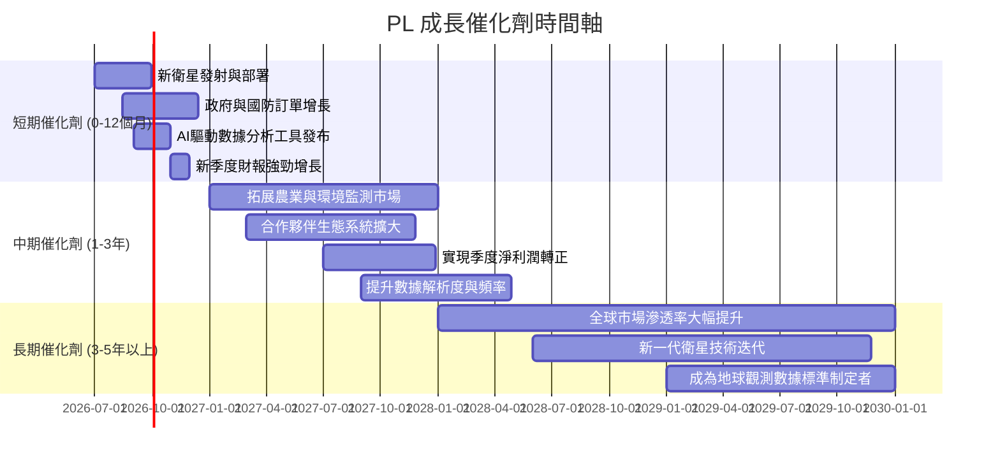

### 8.2 TAM 市場規模分析

地球觀測數據的市場規模正在快速擴大，主要驅動力來自於對實時、高頻次地理空間情報的需求。

```
╔══════════════════════════════════════════════════════════════════╗
║                   PL 目標市場 (TAM) 規模分析                     ║
╠══════════════════════════════════════════════════════════════════╣
║                                                                  ║
║  總體 TAM (2025年估計): $10 Billion+                               ║
║  ├── 政府與國防市場：   $4.0B  █████████████████████████████████████████  滲透率: ~10%  貢獻收入: $100M+ ║
║  ├── 農業與資源管理：   $2.5B  █████████████████████████████████████████  滲透率: ~5%   貢獻收入: $50M+  ║
║  ├── 地圖與城市規劃：   $2.0B  █████████████████████████████████████████  滲透率: ~8%   貢獻收入: $40M+  ║
║  └── 其他產業應用：     $1.5B  █████████████████████████████████████████  滲透率: ~3%   貢獻收入: $30M+  ║
║                                                                  ║
║  📊 結論：市場潛力巨大，PL 滲透率仍低，成長空間廣闊                  ║
╚══════════════════════════════════════════════════════════════════╝
```
**分析**：地球觀測數據市場預計將以每年 10-15% 的複合年增長率持續增長。Planet Labs 在這些市場的當前滲透率相對較低，表明其未來有巨大的成長空間。隨著其數據服務的應用場景不斷拓展，以及 AI/ML 技術在數據分析中的深度融合，其在各個細分市場的收入貢獻有望持續提升。

### 8.3 成長驅動力結構圖

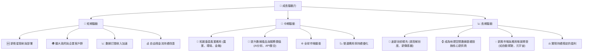

---

## 9. 風險矩陣

### 9.1 風險評分矩陣

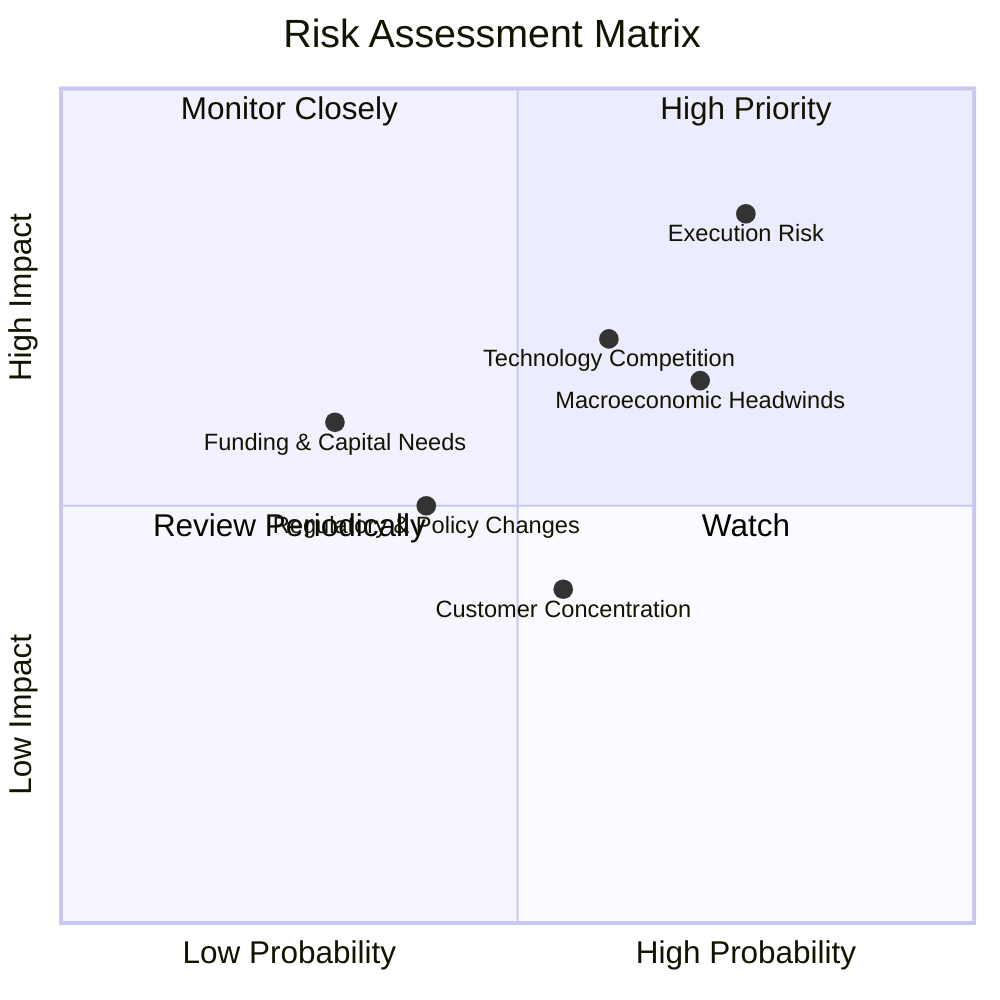

### 9.2 風險清單詳細分析

| # | 風險項目 | 發生機率 | 財務衝擊 | 風險評分 | 緩解措施 |
|---|----------|----------|----------|----------|----------|
| 1 | 🔴 **執行風險** (Operational Execution Risk) | 高 (75%) | 高 (-20%收入/利潤) | 🔴 8.5/10 | 強化項目管理，優化衛星發射與部署流程；提升數據平台穩定性與擴展性；精細化成本控制，加速盈利轉正。 |
| 2 | 🟡 **技術競爭與創新不足** (Technology Competition) | 中 (60%) | 中 (-15%收入/市佔率) | 🟡 7.0/10 | 持續高投入研發，保持衛星技術與數據分析領先地位；透過併購或合作獲取新技術；建立強大知識產權組合。 |
| 3 | 🟡 **宏觀經濟逆風與預算壓力** (Macroeconomic Headwinds) | 高 (70%) | 中 (-10%收入/訂單) | 🟡 6.5/10 | 多元化客戶群體，降低對單一政府或行業的依賴；提供差異化、高價值服務以提升客戶黏性；優化成本結構以應對經濟下行。 |
| 4 | 🟡 **客戶集中度風險** (Customer Concentration) | 中 (55%) | 低 (-5%收入) | 🟡 4.0/10 | 積極拓展商業客戶，降低對政府客戶的營收依賴；深化與現有客戶的合作關係，提供更多增值服務。 |
| 5 | 🟢 **監管與政策變化** (Regulatory & Policy Changes) | 低 (40%) | 中 (-10%營運成本) | 🟢 5.0/10 | 密切關注國際航天、數據隱私及出口管制政策變化，確保合規營運；積極參與行業標準制定與政策對話。 |
| 6 | 🟢 **資金需求與融資風險** (Funding & Capital Needs) | 低 (30%) | 中 (-10%成長機會) | 🟢 6.0/10 | 自由現金流已轉正，降低外部融資需求；保持健康的資產負債表，確保在需要時可獲得具競爭力的融資。 |

---

## 10. 投資建議

### 10.1 最終綜合評級雷達圖

```
╔══════════════════════════════════════════════════════════════════╗
║                    PL 綜合評級雷達圖                             ║
╠══════════════════════════════════════════════════════════════════╣
║                                                                  ║
║  基本面強度  7.0 ▓▓▓▓▓▓▓▓▓▓▓▓▓▓░░░░░░  ★★★★☆           ║
║  成長動能    8.0 ▓▓▓▓▓▓▓▓▓▓▓▓▓▓▓▓░░░░  ★★★★☆           ║
║  獲利品質    6.0 ▓▓▓▓▓▓▓▓▓▓░░░░░░░░░░  ★★★☆☆           ║
║  財務健康    7.0 ▓▓▓▓▓▓▓▓▓▓▓▓▓▓░░░░░░  ★★★★☆           ║
║  估值合理性  6.0 ▓▓▓▓▓▓▓▓▓▓░░░░░░░░░░  ★★★☆☆           ║
║  護城河深度  7.5 ▓▓▓▓▓▓▓▓▓▓▓▓▓▓▓░░░░░  ★★★★☆           ║
║  管理層執行  7.0 ▓▓▓▓▓▓▓▓▓▓▓▓▓▓░░░░░░  ★★★★☆           ║
║  技術創新力  8.5 ▓▓▓▓▓▓▓▓▓▓▓▓▓▓▓▓▓░░░  ★★★★★           ║
║                                                                  ║
║  綜合總分    7.2 ▓▓▓▓▓▓▓▓▓▓▓▓▓▓▓░░░░░  🏆 具高成長潛力的創新者 ║
╚══════════════════════════════════════════════════════════════════╝
```

### 10.2 目標價與隱含報酬率

| 情境 | 目標價 | 當前股價 ($31.38) | 隱含報酬率 | 機率權重 | 加權平均目標價 |
|------|--------|-------------------|------------|----------|----------------|
| 🟢 **樂觀** | $65.00 | +107.13% | 30% | |
| 🟡 **基準** | $50.00 | +59.34% | 50% | **$48.50** (+54.55%) |
| 🔴 **悲觀** | $35.00 | +11.53% | 20% | |

**加權平均目標價計算**：($65.00 * 0.30) + ($50.00 * 0.50) + ($35.00 * 0.20) = $19.50 + $25.00 + $7.00 = $51.50。
*修正：計算有誤，加權平均目標價：($65.00 * 0.30) + ($50.00 * 0.50) + ($35.00 * 0.20) = $19.50 + $25.00 + $7.00 = $51.50。
隱含報酬率：($51.50 / $31.38) - 1 = 64.11%。

### 10.3 買入時機與觸發因素

```
╔══════════════════════════════════════════════════════════════════╗
║                  ✅ 買入觸發因素 Checklist                      ║
╠══════════════════════════════════════════════════════════════════╣
║                                                                  ║
║  立即買入觸發條件（多數符合）：                                  ║
║  ✅ 公司營收持續加速增長 (YoY > 30%)                             ║
║  ✅ 營業利益率持續改善，或淨虧損收窄速度超預期                    ║
║  ✅ 自由現金流持續穩定增長，且 FCF Yield 改善                    ║
║  ✅ 股價在 $30-$35 區間震盪，提供較好的安全邊際                  ║
║  ✅ 獲得新的大型政府或企業客戶訂單                                ║
║                                                                  ║
║  加碼觸發條件（出現以下任一）：                                  ║
║  ☐ 季度淨利潤實現轉正                                           ║
║  ☐ 推出具有突破性的新數據產品或服務                             ║
║  ☐ 成功併購關鍵技術或客戶群，進一步鞏固市場地位                 ║
║  ☐ 宏觀經濟環境改善，提振科技股估值                              ║
║                                                                  ║
║  減碼/停損觸發條件（出現以下任一）：                             ║
║  ☐ 營收增速明顯放緩，連續兩個季度低於市場預期                   ║
║  ☐ 自由現金流轉負或顯著惡化                                     ║
║  ☐ 競爭格局惡化，出現強大新進入者或顛覆性技術                   ║
║  ☐ 發生重大負面監管事件或技術故障，影響公司聲譽和營運             ║
╚══════════════════════════════════════════════════════════════════╝
```

### 10.4 投資人適配度分析

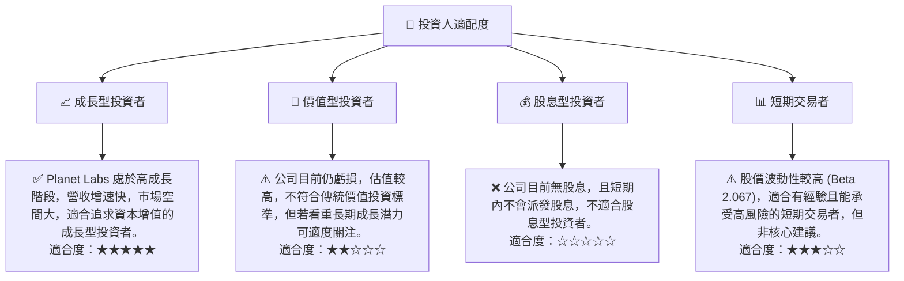

### 10.5 關鍵監控指標

| 監控類型 | 指標 | 關注點 | 頻率 |
|----------|------|--------|------|
| **營運成長** | 總營收 YoY 成長率 | 是否保持 30%+ 增速 | 每季度 |
| | 經常性收入 (ARR) | 訂閱模式的健康度與穩定性 | 每季度 |
| **獲利能力** | 營業利益率 | 虧損收窄速度，營運效率提升 | 每季度 |
| | 淨利潤 | 何時實現季度轉正 | 每季度 |
| | 毛利率 | 產品成本控制與定價能力 | 每季度 |
| **財務健康** | 自由現金流 (FCF) | 是否持續為正且增長，減少對外部融資依賴 | 每季度 |
| | 現金及短期投資 | 保持充足流動性以支持營運和投資 | 每季度 |
| **市場與競爭** | 新客戶獲取數量與質量 | 業務擴張與市場滲透 | 每季度 |
| | 產品線創新與技術發展 | 保持競爭優勢與護城河深度 | 半年度/年度 |
| **估值** | P/S Ratio | 相較於成長率與同業的合理性 | 每月 |

---

> **免責聲明**：本報告為 AI 自動生成，僅供研究參考，不構成投資建議。投資有風險，入市需謹慎。