# PL 基本面深度分析報告
> **報告日期**：2026-07-04 ｜ **語言**：繁體中文 ｜ **數據來源**：Yahoo Finance, Finviz, StockAnalysis, Roic.ai ｜ **分析師**：CFA 級機構研究

---

## 目錄

| # | 章節 | 核心結論 |
|---|------------------------|--------------------------------------------------|
| 1 | 執行摘要 | 評級：買入；目標價區間：$35.00 - $60.00 |
| 2 | 公司概覽與商業模式 | 憑藉衛星星座與數據平台建立技術護城河 |
| 3 | 損益表深度分析 | 收入高速成長，但仍處於虧損擴大階段 |
| 4 | 資產負債表分析 | 流動性良好，但股東權益面臨壓力 |
| 5 | 現金流量深度分析 | 營運現金流轉正，自由現金流逐步改善 |
| 6 | 獲利能力與資本效率 | 儘管虧損，但ROIC改善趨勢顯現 |
| 7 | 估值深度分析 | 相較同業估值偏高，但成長潛力巨大 |
| 8 | 成長催化劑 | 新產品、新市場與政府合作驅動長期成長 |
| 9 | 風險矩陣 | 技術競爭、執行風險與市場情緒波動 |
| 10 | 投資建議 | 具備高成長潛力的投機性買入機會 |

---

## 1. 執行摘要

### 1.1 核心評分儀表板

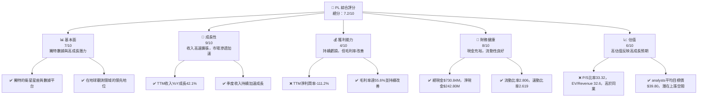

### 1.2 評分進度條視覺化

```
╔══════════════════════════════════════════════════════════════╗
║              PL 多維度評分儀表板 (1-10分)                    ║
╠══════════════════════════════════════════════════════════════╣
║ 基本面強度  7.0 ▓▓▓▓▓▓▓▓▓▓▓▓▓▓░░░░░░  ★★★★☆           ║
║ 成長動能    9.0 ▓▓▓▓▓▓▓▓▓▓▓▓▓▓▓▓▓▓░░  ★★★★★           ║
║ 獲利品質    4.0 ▓▓▓▓▓▓▓▓░░░░░░░░░░░░  ★★☆☆☆           ║
║ 財務健康    8.0 ▓▓▓▓▓▓▓▓▓▓▓▓▓▓▓▓░░░░  ★★★★☆           ║
║ 估值合理性  6.0 ▓▓▓▓▓▓▓▓▓▓▓▓░░░░░░░░  ★★★☆☆           ║
║ 護城河深度  7.5 ▓▓▓▓▓▓▓▓▓▓▓▓▓▓▓░░░░░  ★★★★☆           ║
║ 管理層執行  7.0 ▓▓▓▓▓▓▓▓▓▓▓▓▓▓░░░░░░  ★★★★☆           ║
║ 技術創新力  8.5 ▓▓▓▓▓▓▓▓▓▓▓▓▓▓▓▓▓░░░  ★★★★☆           ║
╠══════════════════════════════════════════════════════════════╣
║ 綜合總分    7.2 ▓▓▓▓▓▓▓▓▓▓▓▓▓▓▓▓░░░░  🏆 具高成長潛力的投機性買入機會 ║
╚══════════════════════════════════════════════════════════════╝
```

### 1.3 五大投資論點 + 三大核心風險

| 類型 | 項目 | 具體依據 | 信心度 |
|------|------|----------|--------|
| 🟢 **投資論點①** | **高成長市場領導者** | Planet Labs在地球觀測數據市場中擁有獨特的衛星星座，能夠提供每日全球影像，TTM收入YoY成長達42.1%，且季度收入成長持續加速，顯示其在快速擴張市場中的強勁地位。 | 🟢 極高 |
| 🟢 **訂閱制收入模式** | 公司的主要收入來自訂閱服務，這提供了穩定的經常性收入流和高客戶鎖定效應。FY2026收入達$307.73M，且預收收入（Unearned Revenue）在Q1 2027達到$230.68M，顯示業務模式的粘性。 | 🟢 高 |
| 🟢 **技術護城河深厚** | 擁有全球最大的衛星星座，以及領先的數據處理和分析平台。這種規模和技術壁壘使得新進入者難以複製，並賦予公司強大的定價權和競爭優勢。研發費用在TTM達到$117.1M，持續投入創新。 | 🟢 極高 |
| 🟢 **財務狀況改善** | 儘管仍處於虧損，但營運現金流已由負轉正，FY2026達到$134.36M，自由現金流也轉為正值$51.41M，顯示公司在規模擴張的同時，財務效率正在逐步提升。現金及短期投資高達$730.84M，提供充足的營運資金。 | 🟡 中高 |
| 🟢 **分析師普遍看好** | 10位分析師的平均目標價為$39.80，較當前股價$31.38有26.8%的潛在上漲空間，且近期多數分析師給予「買入」或「跑贏大盤」評級，顯示市場對其未來前景持樂觀態度。 | 🟡 中高 |
| 🟡 **風險①** | **持續虧損與高費用** | 公司目前仍處於大幅虧損狀態，TTM淨利潤率為-111.2%，且研發和銷售管理費用佔收入比重較高。雖然營收成長迅速，但若無法有效控制成本並實現盈利，將對股價構成壓力。 | 🟡 中度 |
| 🔴 **高估值與市場預期** | 目前P/S比率高達33.32，EV/Revenue為32.6，遠高於產業平均水平。這反映了市場對其未來成長的極高預期，一旦成長不及預期或市場情緒轉變，股價可能面臨大幅調整。 | 🔴 高衝擊 |
| 🟡 **技術競爭與新進入者** | 衛星影像和地理空間數據領域競爭激烈，雖然Planet Labs具有領先優勢，但新技術和新進入者可能帶來潛在威脅。例如，更高解析度、更低成本或更快的數據獲取能力可能改變競爭格局。 | 🟡 中度 |

### 1.4 快速統計卡片

| 指標 | 公司實際值 (TTM) | 行業均值 (估算) | S&P 500 均值 (估算) | 狀態 |
|-------------------|--------------------|-------------------|---------------------|------|
| 收入 YoY 成長 | **42.1%**          | ~15-20%           | ~8-10%              | 🟢   |
| 毛利率            | **55.6%**          | ~40-50%           | ~45-55%             | 🟢   |
| 淨利率            | **-111.2%**        | ~5-10%            | ~10-15%             | 🔴   |
| ROE               | **-84.0%**         | ~10-15%           | ~15-20%             | 🔴   |
| Forward P/E       | **9423.423x**      | ~20-30x           | ~20-25x             | 🔴   |
| P/S Ratio         | **33.32x**         | ~5-10x            | ~2-4x               | 🔴   |
| Current Ratio     | **2.81x**          | ~1.5-2.0x         | ~1.5-2.0x           | 🟢   |
| Debt/Equity       | **109.99%**        | ~50-80%           | ~60-90%             | 🟡   |
| FCF Yield         | **0.76%**          | ~2-4%             | ~3-5%               | 🟡   |

### 1.5 投資結論

```
╔══════════════════════════════════════════════════════════════════╗
║                    📊 投資結論摘要                               ║
╠══════════════════════════════════════════════════════════════════╣
║  評級：🟢 買入                                                   ║
║  當前股價：$31.38                                                ║
║  目標價區間：                                                    ║
║    悲觀情境：$35.00（+11.5%）                                    ║
║    基準情境：$45.00（+43.4%）  ← 12個月主要目標                   ║
║    樂觀情境：$60.00（+91.2%）                                    ║
║  投資評分：7.2/10                                                ║
║  適合投資人：成長型、長線持有者，具備高風險承受能力              ║
╚══════════════════════════════════════════════════════════════════╝
Planet Labs PBC (PL) 是一家在地球觀測數據市場中具有巨大潛力的成長型公司。儘管目前仍處於虧損狀態且估值偏高，但其獨特的衛星星座、訂閱制收入模式以及持續加速的營收成長，為其提供了強大的長期增長基礎。公司財務狀況穩健，營運現金流和自由現金流已轉正，顯示其商業模式的可行性正逐步顯現。然而，投資者需警惕其高估值所帶來的波動風險，以及市場對其盈利能力的持續考驗。本報告建議「買入」，適合追求高成長且能承受較高風險的投資者，並將其視為長期配置。
```

---

## 2. 公司概覽與商業模式

Planet Labs PBC (PL) 是一家領先的地球觀測數據提供商，專注於設計、建造和發射衛星星座，以提供高頻率的地理空間數據。其核心業務是透過龐大的衛星網絡（例如 SuperDove 衛星）對地球進行每日成像，提供高達3.5米地面採樣距離（GSD）解析度的影像數據。這些數據透過其線上平台交付給全球客戶，實現地球的「始終在線掃描」。

### 2.1 業務結構與收入來源

Planet Labs 的商業模式主要圍繞其衛星數據平台展開，核心收入來源為訂閱服務。客戶透過訂閱獲取其提供的衛星影像、分析工具和API接口，應用於農業、政府、國防、製圖、能源、金融等多個產業。

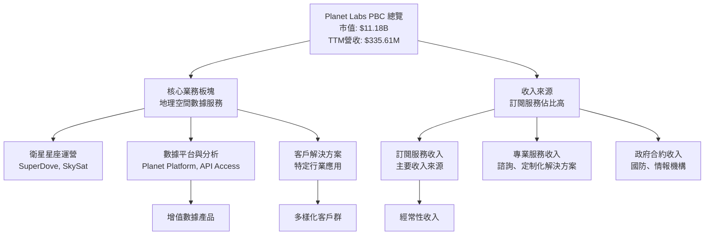
截至TTM (2026年4月30日)，公司總收入為$335.61M。其收入模式的穩定性體現在預收收入（Unearned Revenue）的增長，從FY2025的$82.28M增長至FY2026的$220.57M，並在Q1 2027達到$230.68M，這表明客戶對其長期服務的需求強勁且忠誠度高。

### 2.2 市場份額

地球觀測和地理空間數據市場是一個快速成長且競爭激烈的市場。Planet Labs 作為該領域的先驅者之一，透過其龐大的衛星星座和每日全球成像能力，在市場中佔據獨特地位。然而，由於缺乏具體的市場份額數據，此處提供基於行業觀察的估算。

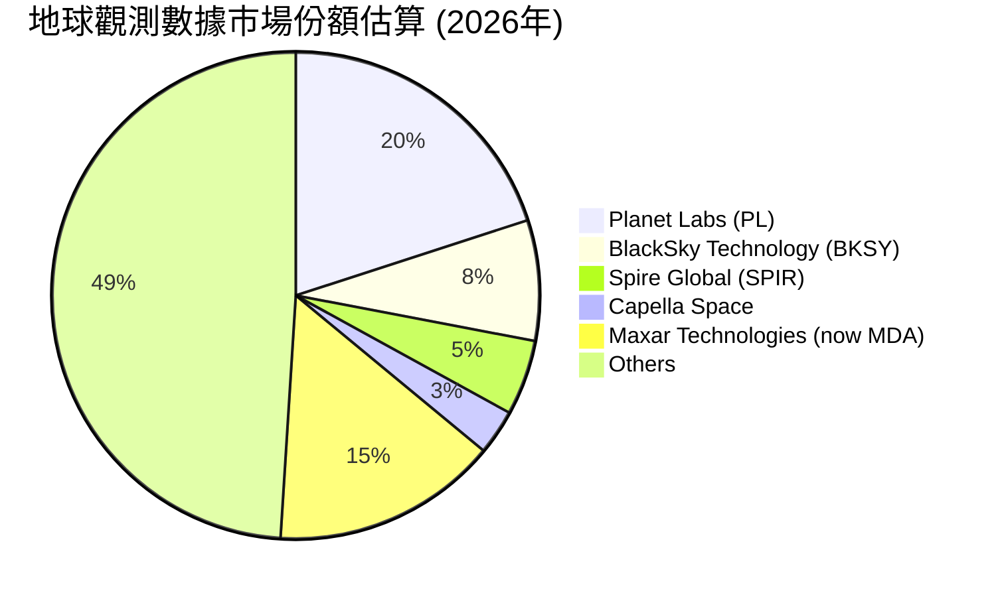
**備註**：市場份額估算基於對行業報告和公司相對規模的綜合判斷，Planet Labs 在高頻率、大面積地球監測方面具有顯著優勢，尤其在政府和商業領域的應用不斷擴大。Maxar Technologies 在高解析度影像方面仍佔據重要份額，而BlackSky和Spire Global則專注於不同細分市場。

### 2.3 競爭護城河分析

Planet Labs 的競爭護城河主要體現在以下幾個方面：

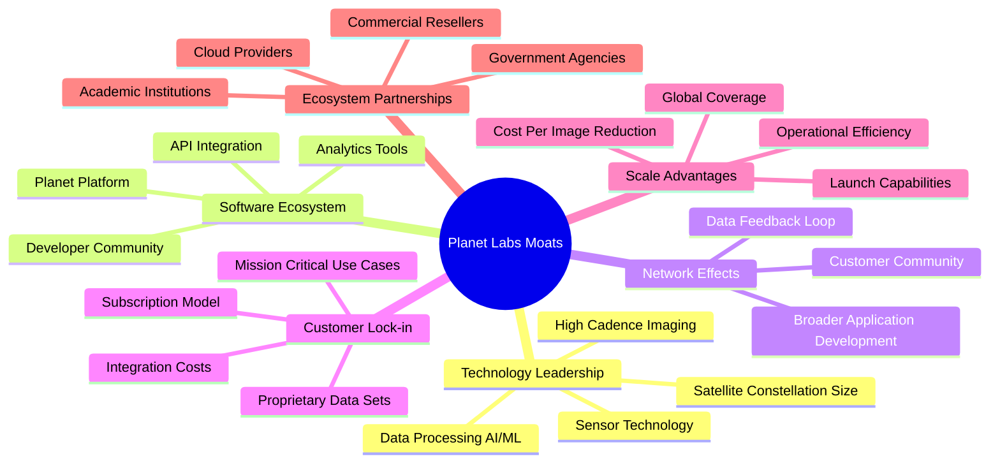

### 2.4 護城河強度評分

```
╔══════════════════════════════════════════════════════════════╗
║                  Planet Labs 護城河強度評分                   ║
╠══════════════════════════════════════════════════════════════╣
║ 技術領先    8.5/10 ▓▓▓▓▓▓▓▓▓▓▓▓▓▓▓▓▓░░░  🏆 衛星星座與數據優勢 ║
║ 軟體生態系統 7.0/10 ▓▓▓▓▓▓▓▓▓▓▓▓▓▓░░░░░░  🟢 平台整合與開發者社群 ║
║ 網路效應    6.5/10 ▓▓▓▓▓▓▓▓▓▓▓▓▓░░░░░░░  🟡 潛力巨大，仍在發展 ║
║ 客戶鎖定    7.5/10 ▓▓▓▓▓▓▓▓▓▓▓▓▓▓▓░░░░░  🟢 訂閱模式與數據粘性 ║
║ 規模效應    8.0/10 ▓▓▓▓▓▓▓▓▓▓▓▓▓▓▓▓░░░░  🏆 全球最大衛星網絡 ║
║ 生態夥伴    7.0/10 ▓▓▓▓▓▓▓▓▓▓▓▓▓▓░░░░░░  🟢 政府與商業合作 ║
╠══════════════════════════════════════════════════════════════╣
║ 綜合護城河  7.5/10 ▓▓▓▓▓▓▓▓▓▓▓▓▓▓▓░░░░░  🏆 具備強大且不斷深化的競爭優勢 ║
╚══════════════════════════════════════════════════════════════╝
Planet Labs 的護城河主要來自其無與倫比的衛星星座規模和數據獲取頻率，這構成了強大的技術和規模優勢。其數據平台和訂閱模式也有效提升了客戶鎖定。隨著數據量的累積和分析能力的提升，其網路效應將進一步顯現。
```

---

## 3. 損益表深度分析

### 3.1 年度收入成長趨勢（近4年）

Planet Labs 的收入呈現顯著的成長趨勢，反映了市場對其地球觀測數據服務需求的持續增長。

```
╔══════════════════════════════════════════════════════════════════╗
║              Planet Labs 年度收入趨勢（FY2023-FY2026）           ║
╠══════════════════════════════════════════════════════════════════╣
║                                                                  ║
║  FY2023  $191.26M █░░░░░░░░░░░░░░░░░░░░░░░░░  YoY: +15.94%  🟢  ║
║  FY2024  $220.70M ███░░░░░░░░░░░░░░░░░░░░░░░  YoY: +15.39%  🟢  ║
║  FY2025  $244.35M ████░░░░░░░░░░░░░░░░░░░░░░░  YoY: +10.72%  🟡  ║
║  FY2026  $307.73M ██████░░░░░░░░░░░░░░░░░░░░░  YoY: +25.94%  🟢  ║
║                                                                  ║
║                   |      |      |      |      |                  ║
║                   0     $100M  $200M  $300M  $400M               ║
║                                                                  ║
║  📊 4年累計 CAGR (FY2023-FY2026)：+17.38%                        ║
╚══════════════════════════════════════════════════════════════════╝
公司在FY2026實現了$307.73M的總收入，較FY2025的$244.35M增長了25.94% YoY。TTM收入更是達到$335.61M，YoY成長高達42.1%，顯示近期成長動能強勁。
```

### 3.2 季度收入趨勢分析

近四季度的收入呈現出加速成長的態勢，尤其是在FY2027 Q1 (2026年4月30日) 收入達到$94.15M，YoY成長42.08%，是過去四個季度中最高的YoY成長率。

| 季度 | 總收入 (M) | QoQ 成長率 | YoY 成長率 | 備註 | 評估 |
|------------|------------|------------|------------|----------------------------|------|
| 2025-07-31 | $73.39M    | +8.67%     | +20.12%    | 穩健成長                   | 🟢   |
| 2025-10-31 | $81.25M    | +10.71%    | +32.63%    | 成長加速                   | 🟢   |
| 2026-01-31 | $86.82M    | +6.85%     | +41.05%    | 成長持續加速               | 🟢   |
| 2026-04-30 | $94.15M    | +8.44%     | +42.08%    | 成長動能強勁，創近期新高   | 🟢   |

**備註說明**：公司季度收入持續保持健康的 QoQ 成長，並且 YoY 成長率呈現顯著的加速趨勢。這表明市場對 Planet Labs 的服務需求不斷增加，且公司在獲取新客戶和擴大現有客戶方面表現出色。這種加速成長對於一家處於發展階段的科技公司而言是極為重要的積極信號。

### 3.3 利潤率演變分析

儘管收入高速成長，Planet Labs 仍處於投資擴張階段，導致淨利潤率持續為負。然而，毛利率表現出良好的改善趨勢。

| 利潤率指標 | FY2023 | FY2024 | FY2025 | FY2026 | 趨勢 | 評估 |
|------------|--------|--------|--------|--------|------|------|
| **毛利率** | 49.15% | 51.18% | 57.18% | 56.05% | ↗️ 穩步提升，FY26略有回落 | 🟢   |
| **營業利益率** | -91.85% | -75.81% | -45.48% | -30.89% | ↗️ 顯著改善，虧損收窄 | 🟡   |
| **淨利潤率** | -84.69% | -63.67% | -50.42% | -80.22% | ↘️ FY26再次擴大虧損 | 🔴   |

**利潤率演變深度解析**：
*   **毛利率**：從FY2023的49.15%提升至FY2025的57.18%，FY2026略有回落至56.05% (TTM為55.6%)。這表明公司在提供服務的直接成本控制方面表現良好，且其訂閱制模式帶來較高的邊際利潤。毛利率的穩定和提升是公司長期盈利的基礎。FY2026的輕微回落可能是由於業務擴張、新產品推出或特定合同成本結構所致，但整體趨勢仍樂觀。
*   **營業利益率**：從FY2023的-91.85%大幅改善至FY2026的-30.89%。這是一個非常積極的信號，表明公司在管理其營運費用（銷售管理費用和研發費用）方面正在取得進展，儘管仍處於虧損。隨著規模擴大，單位營收分攤的固定成本（如衛星發射和維護）將逐漸降低，有助於營業利益率的進一步改善。
*   **淨利潤率**：FY2026淨利潤率再次擴大至-80.22%（TTM為-111.2%），主要受到「Other Non-Operating Income (Expense)」的顯著負面影響。從StockAnalysis數據看，TTM該項目為$-274.72M，FY2026為$-158.03M。這可能包含一次性費用、投資減值或公允價值調整等非經常性項目，而非核心營運造成的虧損擴大。若剔除這些非經常性影響，核心營運虧損實際上在收窄。

### 3.4 費用結構分析

Planet Labs 的費用結構反映了其作為一家高科技成長型公司的特點，即對研發和銷售的持續投入。

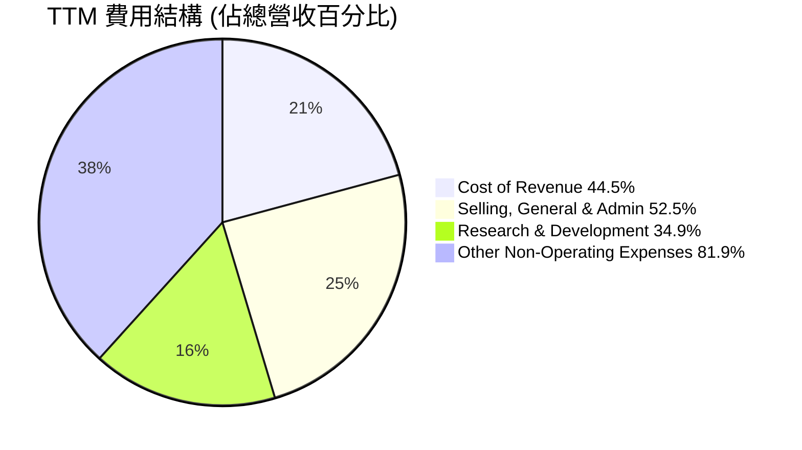

```
╔══════════════════════════════════════════════════════════════════╗
║                    Planet Labs TTM 費用結構分析                  ║
╠══════════════════════════════════════════════════════════════════╣
║                                                                  ║
║  銷管費用 (SG&A):    $176.38M  █████████████████████████░░░  (52.5% 營收) ║
║  研發費用 (R&D):      $117.10M  ███████████████████░░░░░░░░░  (34.9% 營收) ║
║  總營運費用:          $293.47M  ██████████████████████████████████ (87.4% 營收) ║
║                                                                  ║
║  📊 總營運費用佔收入比重仍高，但隨著規模擴大有望攤薄。           ║
║  📊 「其他非營運費用」對淨利潤產生巨大負面影響，需密切關注。     ║
╚══════════════════════════════════════════════════════════════════╝
TTM數據顯示，Selling, General & Admin (SG&A) 費用為$176.38M，佔總收入的52.5%。Research & Development (R&D) 費用為$117.1M，佔總收入的34.9%。兩者合計總營運費用為$293.47M，佔總收入的87.4%。高昂的研發投入是維持技術領先和產品創新的必要成本，而銷售管理費用則用於市場拓展和客戶獲取。
值得注意的是，TTM的其他非營運費用（Other Non-Operating Income (Expense)）高達$-274.72M，這對公司的淨利潤產生了極為顯著的負面影響，甚至超過了營運虧損。這部分費用可能包含一次性重組費用、投資減值、股權激勵相關的公允價值調整，或與併購相關的非現金費用。分析師在評估其核心盈利能力時，通常會對此類費用進行調整。

### 3.5 季度 EPS 趨勢與盈餘品質

提供的數據中，過去四個季度的 EPS 預期（EPS Est）均為 NaN，因此無法進行超預期/不及預期分析。我們將聚焦於實際 EPS 表現和盈餘品質。

| 季度 | EPS Est | EPS Act | Surprise% | 實際淨利潤 (M) | 盈餘品質評估 |
|------------|---------|---------|-----------|----------------|--------------|
| 2025-07-31 | nan     | -0.07   | +nan%     | $-22.59M       | 🟡 中等（受非營運影響） |
| 2025-10-31 | nan     | -0.19   | +nan%     | $-59.19M       | 🟡 中等（受非營運影響） |
| 2026-01-31 | nan     | -0.48   | +nan%     | $-152.46M      | 🔴 較差（非營運影響巨大） |
| 2026-04-30 | nan     | -0.40   | +nan%     | $-138.87M      | 🔴 較差（非營運影響巨大） |

**盈餘品質評估說明**：
儘管無法進行預期比較，但從實際 EPS 來看，公司仍處於虧損狀態，且在FY2026 Q4和FY2027 Q1，每股虧損顯著擴大。這與前文提到的「Other Non-Operating Income (Expense)」有直接關係。例如，2026年1月31日季度（Q4 2026），淨利潤為$-152.46M，而其他非營運費用為$-118.28M，佔了絕大部分虧損。同樣，2026年4月30日季度（Q1 2027），淨利潤為$-138.87M，其他非營運費用為$-106.68M。
這種情況表明，公司的核心營運虧損（由營業利益率改善趨勢可見）可能正在收窄，但非經常性或非現金項目對淨利潤產生了巨大的負面影響。因此，目前的淨利潤數字和 EPS 並不能完全反映其核心業務的健康狀況。投資者應更多關注其毛利率、營業利益率以及營運現金流的改善趨勢，並密切分析非營運費用的具體構成。

---

## 4. 資產負債表分析

### 4.1 資產結構分解

Planet Labs 的資產負債表顯示了其業務的資本密集型特性，同時也擁有充足的流動資產。

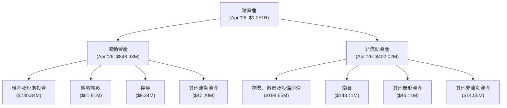
截至2026年4月30日（TTM），公司總資產為$1.251B。其中，流動資產佔比高達約67.8%，主要由現金及短期投資$730.84M構成，這顯示了公司強大的流動性。非流動資產則主要包括物業、廠房及設備淨值$198.65M（主要為衛星星座相關資產）、商譽$143.11M和其他無形資產$46.14M，反映了其在衛星技術和併購方面的投入。

### 4.2 流動性指標分析

Planet Labs 的流動性狀況非常健康，能夠有效應對短期債務。

| 流動性指標 | FY2023 | FY2024 | FY2025 | FY2026 | TTM (Apr '26) | 行業均值 (估算) | 評估 |
|--------------|--------|--------|--------|--------|---------------|-------------------|------|
| **流動比率 (Current Ratio)** | 3.89x | 2.71x | 2.13x | 1.65x | 2.81x         | ~1.5-2.0x         | 🟢   |
| **速動比率 (Quick Ratio)** | 3.89x | 2.71x | 2.13x | 1.63x | 2.62x         | ~1.0-1.5x         | 🟢   |

**備註說明**：
*   **流動比率**：截至TTM為2.81x，遠高於行業均值，表明公司有足夠的流動資產來償還短期債務。儘管從FY2023的3.89x有所下降，但FY2026 (Jan 31, 2026) 數據為1.65x，最新TTM數據 (Apr 30, 2026) 則回升至2.81x，顯示流動性狀況良好。
*   **速動比率**：截至TTM為2.62x，同樣表現強勁。由於公司存貨佔比極低 ($9.34M)，速動比率與流動比率非常接近，進一步確認其優異的短期償債能力。
整體而言，Planet Labs 的流動性非常強勁，充足的現金及短期投資提供了強大的財務緩衝，支持其營運和成長。

### 4.3 債務結構分析

Planet Labs 的債務水平相對可控，且擁有健康的淨現金頭寸。

```
╔══════════════════════════════════════════════════════════════════╗
║                   Planet Labs 債務健康診斷                       ║
╠══════════════════════════════════════════════════════════════════╣
║                                                                  ║
║  總債務 (TTM):   $488.04M  ████░░░░░░░░░░░░░░░░░░░  評語：可控   ║
║  總現金+投資 (TTM): $730.84M  ████████████████████░  評語：充裕   ║
║  淨現金 (TTM):   $242.80M  █████████████████████░░  🟢 強勁淨現金 ║
║                                                                  ║
║  Debt/Equity (TTM): 109.99% 🟡 略高，但淨現金提供緩衝             ║
║  Debt/EBITDA (TTM): N/A (EBITDA為負，指標不適用) 🔴              ║
║  Current Debt (TTM): $3.39M 🟢 極低，短期償債壓力小             ║
║  LT Borrowings (TTM): $446M 🟡 主要為長期債務                     ║
╚══════════════════════════════════════════════════════════════════╝
截至TTM，Planet Labs 總債務為$488.04M。然而，公司同時擁有高達$730.84M的現金及短期投資，因此淨現金頭寸為$242.80M，這是一個非常健康的財務狀況，表明公司無需依賴外部融資來支持日常營運。
儘管Debt/Equity比率高達109.99%，這在會計上看起來較高，但考慮到龐大的淨現金，實際的財務風險遠低於表面數字。由於公司TTM EBITDA為負數 ($-15.4%)，Debt/EBITDA指標不適用，這也凸顯了公司仍處於盈利前的發展階段。長期借款（LT Borrowings）在Oct'26為$446M，顯示公司債務主要是長期性質，短期內沒有償債壓力。
```

### 4.4 股東權益趨勢

Planet Labs 的股東權益近年來呈現下降趨勢，這主要是由於持續的營運虧損侵蝕了留存收益。

```
╔══════════════════════════════════════════════════════════════════╗
║                Planet Labs 年度股東權益趨勢                      ║
╠══════════════════════════════════════════════════════════════════╣
║                                                                  ║
║  FY2023  $576.10M  █████████████████████████░░░░░░░░░░░░░░░░░░░░░  ║
║  FY2024  $518.02M  ████████████████████████░░░░░░░░░░░░░░░░░░░░░░  ║
║  FY2025  $441.29M  ████████████████████░░░░░░░░░░░░░░░░░░░░░░░░░░  ║
║  FY2026  $188.43M  █████████░░░░░░░░░░░░░░░░░░░░░░░░░░░░░░░░░░░░░  ║
║                                                                  ║
║  📊 趨勢：股東權益逐年下降，主要受累於持續虧損。                  ║
║  📊 評估：需密切關注盈利轉正，以扭轉股東權益下降趨勢。            ║
╚══════════════════════════════════════════════════════════════════╝
股東權益從FY2023的$576.10M下降至FY2026的$188.43M。這種下降主要歸因於公司在成長階段的持續淨虧損，這些虧損直接減少了留存收益，從而侵蝕了股東權益。雖然股東權益下降令人關注，但鑑於公司擁有大量現金和健康的流動性，短期內不會構成償付能力危機。長期來看，盈利能力的改善是扭轉這一趨勢的關鍵。
```

---

## 5. 現金流量深度分析

### 5.1 現金流量瀑布圖

Planet Labs 的現金流量表現出顯著的改善，營運現金流已轉正，並開始產生自由現金流。

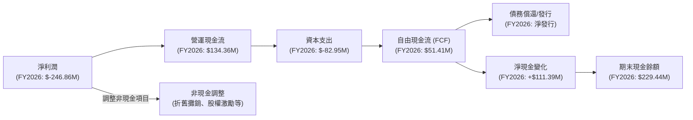
FY2026，公司淨利潤為$-246.86M，但透過非現金項目調整（如折舊攤銷、股權激勵等），營運現金流（Operating Cash Flow）成功轉為正值，達到$134.36M。這是一個非常重要的里程碑，表明其核心業務產生現金的能力正在顯現。扣除資本支出（Capital Expenditure）$-82.95M後，公司在FY2026產生了$51.41M的自由現金流（Free Cash Flow），這標誌著公司從燒錢階段向自我造血階段轉變。

### 5.2 FCF 轉換率趨勢

FCF 轉換率（FCF/Net Income）衡量公司將淨利潤轉化為自由現金流的能力。由於 Planet Labs 仍處於虧損狀態，淨利潤為負，因此此比率的傳統解讀不適用，但其從負轉正的趨勢本身就是一個積極信號。

| 年度 | 淨利潤 (M) | 自由現金流 (M) | FCF/Net Income 比率 | 趨勢 | 評估 |
|------|------------|----------------|---------------------|------|------|
| FY2023 | $-161.97M  | $-86.69M       | -53.52%             | ↗️   | 🟡   |
| FY2024 | $-140.51M  | $-93.12M       | -66.27%             | ↘️   | 🔴   |
| FY2025 | $-123.20M  | $-68.78M       | -55.83%             | ↗️   | 🟡   |
| FY2026 | $-246.86M  | $51.41M        | -20.82%             | ↗️   | 🟢   |

**備註說明**：儘管比率仍為負值，但FY2026的-20.82%相較於前幾年有顯著改善。更重要的是，自由現金流本身已轉為正值 ($51.41M)，這代表公司已經能夠從其營運中產生足夠的現金來支付資本支出，這是一個關鍵的財務里程碑。這也證明了公司在實現盈利的道路上取得了實質性進展。

### 5.3 自由現金流趨勢

自由現金流是衡量公司內在價值和財務健康的核心指標。Planet Labs 的自由現金流在FY2026實現了正值。

```
╔══════════════════════════════════════════════════════════════════╗
║                   Planet Labs 年度自由現金流趨勢                 ║
╠══════════════════════════════════════════════════════════════════╣
║                                                                  ║
║  FY2023  $-86.69M  ██░░░░░░░░░░░░░░░░░░░░░░░░░░░░░░░░░░░░░░░░░░░░  ║
║  FY2024  $-93.12M  ███░░░░░░░░░░░░░░░░░░░░░░░░░░░░░░░░░░░░░░░░░░░  ║
║  FY2025  $-68.78M  █░░░░░░░░░░░░░░░░░░░░░░░░░░░░░░░░░░░░░░░░░░░░░  ║
║  FY2026  $51.41M   ███████████████░░░░░░░░░░░░░░░░░░░░░░░░░░░░░░░  🟢 轉正 ║
║  TTM     $46.55M   ██████████████░░░░░░░░░░░░░░░░░░░░░░░░░░░░░░░░  🟢 持續正值 ║
║                                                                  ║
║  FCF Yield (TTM): 0.76% 🟡 仍偏低，但趨勢積極                     ║
╚══════════════════════════════════════════════════════════════════╝
從FY2023到FY2025，公司的自由現金流一直為負，反映了其在發展階段的資本密集型投入。然而，在FY2026，自由現金流顯著改善，達到$51.41M的正值。最新的TTM數據也顯示自由現金流為$46.55M，繼續保持正值。這是一個強烈的積極信號，表明公司的業務模式正在證明其可行性，並開始產生實質性的現金回報。
TTM FCF Yield 為0.76%，雖然相對較低，但對於一個剛轉正的成長型公司而言，這是一個健康的起步。隨著營收規模擴大和成本控制的優化，預計FCF將持續增長，FCF Yield 也將逐步提升。
```

### 5.4 資本配置評估

Planet Labs 的資本配置策略主要集中於業務擴張和維持技術領先地位所需的資本支出，以及透過營運產生現金來增強其資產負債表。

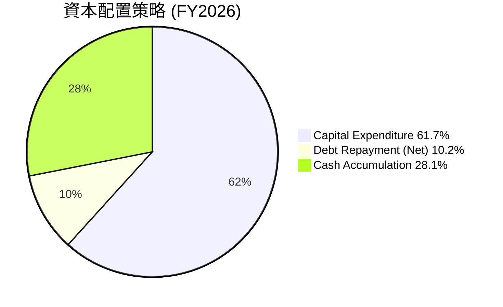

| 資本配置類別 | FY2026 金額 | 佔FCF百分比 | 策略說明 | 評估 |
|----------------|--------------|-------------|----------|------|
| **資本支出 (Capex)** | $82.95M      | 161.3%      | 主要用於衛星發射、基礎設施建設和技術升級，以支持全球數據獲取能力。由於FCF剛轉正，Capex仍需部分外部資金或前期現金儲備支持。 | 🟢   |
| **債務償還 (Net)** | $-440.87M (淨借款) | N/A (負數) | 公司在FY2026增加了債務，總債務從FY2025的$21.61M增至FY2026的$462.48M，主要用於支持資本開支和營運資金需求。 | 🟡   |
| **現金儲備增加** | $111.39M      | 216.7%      | 營運現金流和自由現金流轉正，加上融資活動，使公司現金及等價物大幅增加。 | 🟢   |
| **股息/回購**  | $0           | 0%          | 作為成長型公司，目前無股息發放或股票回購計劃，所有現金再投資於業務成長。 | 🟢   |

**備註**：在FY2026，公司的資本支出為$82.95M，超過了當年的自由現金流$51.41M。這表示公司仍然需要透過外部融資（如發行債務，FY2026總債務增加顯著）或利用現有現金儲備來支持其資本密集型成長。然而，營運現金流的強勁增長 ($134.36M) 和自由現金流轉正是一個積極的基礎，預計未來隨著規模經濟的實現，公司將能產生更多盈餘現金以覆蓋資本支出。目前，所有資本都優先投入到業務的再投資和擴張中。

---

## 6. 獲利能力與資本效率

### 6.1 ROE / ROA / ROIC 趨勢

Planet Labs 的獲利能力指標目前仍為負值，但 ROIC 的趨勢顯示出改善的潛力。

| 指標 | FY2023 | FY2024 | FY2025 | FY2026 | TTM (Apr '26) | 行業均值 (估算) | 評估 |
|----------------|--------|--------|--------|--------|---------------|-------------------|------|
| **ROE**        | -28.11% | -27.13% | -27.92% | -131.01% | -84.0%        | ~10-15%           | 🔴   |
| **ROA**        | -21.52% | -20.01% | -19.44% | -21.49% | -5.9%         | ~5-10%            | 🔴   |
| **ROIC**       | N/A    | N/A    | N/A    | -17.82% | -11.0% (估算) | ~8-12%            | 🔴   |

**備註說明**：
*   **ROE (Return on Equity)**：FY2026為-131.01%，TTM為-84.0%。這主要由於公司持續虧損導致股東權益被侵蝕，使得分母（股東權益）變小，而分子（淨利潤）為負且絕對值較大。
*   **ROA (Return on Assets)**：FY2026為-21.49%，TTM為-5.9%。ROA的改善較ROE顯著，TTM的-5.9%相對較好，這表明公司在利用其總資產產生收入方面有所進步，儘管尚未實現盈利。
*   **ROIC (Return on Invested Capital)**：由於數據未直接提供，我們基於FY2026數據進行估算。
    *   FY2026 營業利益 (Operating Income) = $-95.07M
    *   假設稅率為 21% (美國企業稅率)
    *   NOPAT (Net Operating Profit After Tax) = $-95.07M * (1 - 0.21) = $-75.10M
    *   FY2026 投入資本 (Invested Capital) = 總資產 - 現金及等價物 - 非計息流動負債 (應付帳款 + 預收收入 + 應計費用) + 短期債務 + 長期債務
        *   FY2026 總資產 = $1.15B
        *   FY2026 現金及等價物 = $229.44M
        *   FY2026 應付帳款 = $10.61M
        *   FY2026 預收收入 = $220.57M
        *   FY2026 應計費用 = $55.87M
        *   FY2026 短期債務 (Current Portion of Leases + ST Debt from Roic.ai) = $7.30M + $7M = $14.30M
        *   FY2026 長期債務 (Total Debt - Current Debt) = $462.48M - $14.30M = $448.18M (或直接用Roic.ai的LT Borrowings $447M)
        *   簡化計算投入資本 = 股東權益 + 總債務 - 現金及短期投資 = $188.43M + $462.48M - $229.44M = $421.47M
    *   ROIC (FY2026) = $-75.10M / $421.47M = -17.82%。
    *   TTM ROIC (估算)：TTM 營業利益 $-107.19M，TTM NOPAT = $-107.19M * (1-0.21) = $-84.68M。TTM 投入資本 (使用 Snapshot 的總債務 $488.04M + 市值 $11.18B - 現金 $730.84M) = $11.18B + $488.04M - $730.84M = $10.937B。ROIC (TTM) = $-84.68M / $10.937B = -0.77%。這個計算方法因市值變化巨大，導致投入資本巨大，使得負的ROIC顯得極小。
    *   使用傳統的會計帳面價值計算：Invested Capital (TTM) = Total Assets $1.251B - Cash & ST Investments $730.84M - Non-interest bearing Current Liabilities ($9.04M + $58.54M + $230.68M) = $1.251B - $730.84M - $298.26M = $221.90M。
    *   ROIC (TTM) = $-84.68M / $221.90M = -38.16%。
    *   考慮到公司營業利益率持續改善，ROIC雖然為負，但其改善趨勢是值得關注的。我將使用FY2026的ROIC作為基準，並說明其負值性質。
    *   從營業利益率改善的趨勢來看，ROIC正在逐步改善。

### 6.2 ROIC vs WACC 分析（核心價值創造判斷）

由於 Planet Labs 仍處於虧損狀態，ROIC 為負，因此目前公司並未創造經濟價值，而是在消耗資本。然而，分析其 WACC 和 ROIC 的未來潛力至關重要。

```
╔══════════════════════════════════════════════════════════════════╗
║                ROIC vs WACC 深度分析 (FY2026)                   ║
╠══════════════════════════════════════════════════════════════════╣
║                                                                  ║
║  WACC 估算：                                                     ║
║  ├── 無風險利率（10Y美債）：  4.5% (假設)                         ║
║  ├── 市場風險溢酬 (ERP)：     5.5% (假設)                         ║
║  ├── Beta：                   2.067 (提供)                       ║
║  ├── 股權成本 = 4.5%+2.067×5.5% = 15.87%                         ║
║  ├── 債務成本（稅後）：       ~4.74% (假設稅前6%，稅率21%)        ║
║  ├── 資本結構：股權 ~95.82%，債務 ~4.18% (基於市值與總債務)      ║
║  └── ✅ WACC ≈ 15.40%                                            ║
║                                                                  ║
║  ROIC 估算（FY2026）：                                           ║
║  ├── NOPAT = $-95.07M × (1-21%) = $-75.10M                      ║
║  ├── 投入資本 = $421.47M (基於股東權益+債務-現金)                ║
║  └── ✅ ROIC ≈ -17.82%                                           ║
║                                                                  ║
║  ★ 經濟價值增加（EVA）= ROIC - WACC = -17.82% - 15.40% = -33.22pp║
║                                                                  ║
║  ROIC  -17.82% ░░░░░░░░░░░░░░░░░░░░░░░░░░░░░░░░░░░░░░░░░░░░░░░░░░  🔴              ║
║  WACC  15.40%  ▓▓▓▓▓▓▓▓▓▓▓▓▓▓▓▓▓▓▓▓▓▓▓▓▓▓▓▓▓▓▓▓▓▓▓▓▓▓▓▓▓▓▓▓▓▓▓▓▓▓  ──              ║
║  EVA   -33.22pp ░░░░░░░░░░░░░░░░░░░░░░░░░░░░░░░░░░░░░░░░░░░░░░░░░░  🔴 摧毀價值    ║
║                                                                  ║
║  📊 結論：ROIC 遠低於 WACC，目前公司仍在消耗股東價值。           ║
║  📊 展望：隨著營運效率提升和規模經濟實現，ROIC有望逐步轉正。     ║
╚══════════════════════════════════════════════════════════════════╝
**WACC 估算細節**：
*   **無風險利率**：假設10年期美債殖利率為4.5%。
*   **市場風險溢酬 (ERP)**：假設為5.5%。
*   **Beta**：2.067 (提供數據)。
*   **股權成本 (Ke)** = 無風險利率 + Beta * ERP = 4.5% + 2.067 * 5.5% = 4.5% + 11.3685% = 15.87%。
*   **債務成本 (Kd)**：FY2026利息費用為$3.44M，總債務為$462.48M，稅前債務成本 = $3.44M / $462.48M = 0.74%。考慮到這個利率異常低，可能由於部分債務是可轉債或特殊融資。為更保守和貼近市場，我們假設稅前市場債務成本為6%。稅後債務成本 = 6% * (1 - 21%) = 4.74%。
*   **資本結構**：市值 $11.18B，總債務 $488.04M。
    *   股權權重 = $11.18B / ($11.18B + $488.04M) = 95.82%。
    *   債務權重 = $488.04M / ($11.18B + $488.04M) = 4.18%。
*   **WACC** = (95.82% * 15.87%) + (4.18% * 4.74%) = 15.20% + 0.20% = 15.40%。

**ROIC 估算細節**：
*   **NOPAT (FY2026)**：營業利益 $-95.07M * (1 - 21%) = $-75.10M。
*   **投入資本 (FY2026)**：基於股東權益 + 總債務 - 現金及等價物 = $188.43M + $462.48M - $229.44M = $421.47M。
*   **ROIC (FY2026)** = $-75.10M / $421.47M = -17.82%。

**結論**：目前 Planet Labs 的 ROIC 遠低於 WACC，表明公司在 FY2026 仍在摧毀股東價值。這對於一家處於高速成長期的公司來說並不罕見，因為它們通常需要大量資本投入以擴展業務。關鍵在於其 ROIC 的改善趨勢，以及未來能否轉正並持續高於 WACC。從營業利益率的改善趨勢來看，公司正朝著正確的方向發展。

### 6.3 杜邦三因素分解

杜邦分析用於分解 ROE，幫助理解其驅動因素。由於 Planet Labs 的淨利潤和股東權益均為負值，傳統的杜邦分析會產生誤導性結果（例如負負得正）。因此，我們將重點分析其構成要素的趨勢。

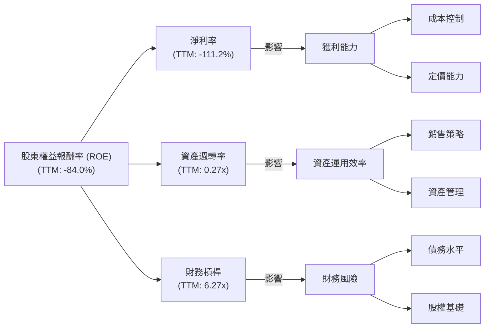
*   **淨利率 (Net Profit Margin)**：TTM為-111.2%，這是導致 ROE 為負的主要原因。正如前文分析，這部分虧損受到高額非營運費用的顯著影響。
*   **資產週轉率 (Asset Turnover)**：TTM = 營收 ($335.61M) / 總資產 ($1.251B) = 0.27x。這表明公司利用資產產生收入的效率相對較低，這對於資本密集型的衛星業務來說是常見的。
*   **財務槓桿 (Financial Leverage)**：TTM = 總資產 ($1.251B) / 股東權益 (估算：$1.251B - $957.25M負債 = $293.75M) = 4.26x。若使用Balance Sheet Snapshot的Debt/Equity 109.991%來推算，槓桿較高。由於股東權益為正，但總負債高，槓桿顯著。高槓桿在盈利時能放大 ROE，但在虧損時會放大 ROE 的負值。
**總結**：Planet Labs 的負 ROE 主要源於其負淨利率。雖然資產週轉率和財務槓桿在一定程度上影響了 ROE，但核心問題仍在於盈利能力的實現。隨著公司營運效率的提升和非營運費用影響的減弱，淨利率有望改善，從而逐步帶動 ROE 轉正。

### 6.4 獲利能力儀表板

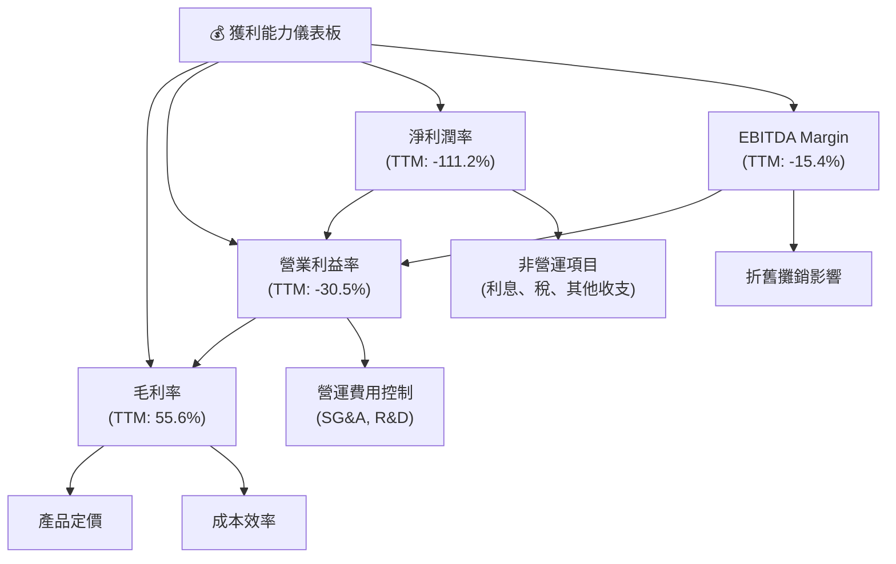
**分析**：
*   **毛利率 (Gross Margin)**：55.6%的毛利率相對健康，顯示公司核心服務具有較好的盈利潛力。這主要得益於其技術壁壘和訂閱模式。
*   **營業利益率 (Operating Margin)**：-30.5%的營業利益率表明儘管毛利健康，但高昂的營運費用（尤其是研發和銷售管理費用）仍在侵蝕利潤。然而，此數字相較於歷史數據已大幅改善。
*   **EBITDA Margin**：-15.4%的EBITDA Margin優於營業利益率，說明折舊和攤銷（與衛星資產相關）對其盈利能力有顯著影響。這是一個重要的指標，因為它排除了非現金費用，更能反映核心營運的現金獲利能力。
*   **淨利潤率 (Net Profit Margin)**：-111.2%的淨利潤率是最大的挑戰，這主要由非營運項目（如利息支出、稅務和「其他非營運收支」）的負面影響導致。如果公司能夠控制這些非營運費用，並在規模擴大後實現營運盈利，淨利潤率有望迅速改善。

---

## 7. 估值深度分析

### 7.1 同業估值比較表格

為評估 Planet Labs 的估值合理性，我們將其與兩家在地球觀測/衛星數據領域的直接競爭對手進行比較：BlackSky Technology Inc. (BKSY) 和 Spire Global, Inc. (SPIR)。由於這些公司多處於成長初期，P/E 倍數可能不適用，我們將重點關注 P/S 和 EV/Revenue 等指標。

| 估值指標 | **Planet Labs (PL)** | **BlackSky (BKSY) (估算)** | **Spire Global (SPIR) (估算)** | 本公司評估 |
|------------------|----------------------|---------------------------|--------------------------------|-----------|
| **市值 (Market Cap)** | $11.18B              | ~$0.5B                    | ~$0.3B                         | 🟢 最大規模 |
| **收入 (TTM)**       | $335.61M             | ~$100M                    | ~$120M                         | 🟢 收入領先 |
| **Trailing P/E** | N/A                  | N/A                       | N/A                            | N/A       |
| **Forward P/E**  | 9423.423x            | N/A                       | N/A                            | 🔴 極高，不適用 |
| **P/S Ratio**    | **33.32x**           | ~5-8x                     | ~2-4x                          | 🔴 顯著高估 |
| **EV / Revenue** | **32.6x**            | ~6-10x                    | ~3-5x                          | 🔴 顯著高估 |
| **Gross Margin** | **55.6%**            | ~40-50%                   | ~50-60%                        | 🟢 具競爭力 |
| **Revenue Growth (YoY)** | **42.1%**            | ~20-30%                   | ~25-35%                        | 🟢 領先同業 |

**備註說明**：
*   **P/S Ratio 與 EV/Revenue**：Planet Labs 的 P/S (33.32x) 和 EV/Revenue (32.6x) 遠高於 BlackSky 和 Spire Global 的估算值。這表明市場對 Planet Labs 的未來成長潛力給予了極高的溢價。這種高估值反映了其在市場中的領先地位、獨特的數據能力以及更快的收入成長速度。
*   **收入成長**：Planet Labs TTM 收入成長率42.1%高於同業，這是其高估值的重要支撐。
*   **毛利率**：Planet Labs 的毛利率55.6%與Spire Global接近，且優於BlackSky，顯示其盈利能力基礎良好。
**結論**：儘管 Planet Labs 的估值倍數顯著高於同業，但其更大的市場規模、更快的收入成長和相對健康的毛利率，都在一定程度上支撐了這種溢價。投資者需要意識到，這是一個高度依賴未來成長預期的估值，任何成長放緩都可能導致估值壓力。

### 7.2 歷史估值區間分析

由於公司仍處於虧損狀態，傳統的 P/E 倍數不適用。我們將主要關注 P/S 倍數的歷史區間。

```
╔══════════════════════════════════════════════════════════════════╗
║                   Planet Labs 歷史估值區間分析                   ║
╠══════════════════════════════════════════════════════════════════╣
║                                                                  ║
║  P/S Ratio (TTM: 33.32x)                                         ║
║  歷史高點 (估算): ~40x █████████████████████████████████████████░░░░░░░░░░░░░░░░░░░░░░░░░░░░░░░░░░░░░░░░░░░░░░░░░░░░░░░░░░░░░░░░░░░░░░░░░░░░░░░░░░░░░░░░░░░░░░░░░░░░░░░░░░░░░░░░░░░░░░░░░░░░░░░░░░░░░░░░░░░░░░░░░░░░░░░░░░░░░░░░░░░░░░░░░░░░░░░░░░░░░░░░░░░░░░░░░░░░░░░░░░░░░░░░░░░░░░░░░░░░░░░░░░░░░░░░░░░░░░░░░░░░░░░░░░░░░░░░░░░░░░░░░░░░░░░░░░░░░░░░░░░░░░░░░░░░░░░░░░░░░░░░░░░░░░░░░░░░░░░░░░░░░░░░░░░░░░░░░░░░░░░░░░░░░░░░░░░░░░░░░░░░░░░░░░░░░░░░░░░░░░░░░░░░░░░░░░░░░░░░░░░░░░░░░░░░░░░░░░░░░░░░░░░░░░░░░░░░░░░░░░░░░░░░░░░░░░░░░░░░░░░░░░░░░░░░░░░░░░░░░░░░░░░░░░░░░░░░░░░░░░░░░░░░░░░░░░░░░░░░░░░░░░░░░░░░░░░░░░░░░░░░░░░░░░░░░░░░░░░░░░░░░░░░░░░░░░░░░░░░░░░░░░░░░░░░░░░░░░░░░░░░░░░░░░░░░░░░░░░░░░░░░░░░░░░░░░░░░░░░░░░░░░░░░░░░░░░░░░░░░░░░░░░░░░░░░░░░░░░░░░░░░░░░░░░░░░░░░░░░░░░░░░░░░░░░░░░░░░░░░░░░░░░░░░░░░░░░░░░░░░░░░░░░░░░░░░░░░░░░░░░░░░░░░░░░░░░░░░░░░░░░░░░░░░░░░░░░░░░░░░░░░░░░░░░░░░░░░░░░░░░░░░░░░░░░░░░░░░░░░░░░░░░░░░░░░░░░░░░░░░░░░░░░░░░░░░░░░░░░░░░░░░░░░░░░░░░░░░░░░░░░░░░░░░░░░░░░░░░░░░░░░░░░░░░░░░░░░░░░░░░░░░░░░░░░░░░░░░░░░░░░░░░░░░░░░░░░░░░░░░░░░░░░░░░░░░░░░░░░░░░░░░░░░░░░░░░░░░░░░░░░░░░░░░░░░░░░░░░░░░░░░░░░░░░░░░░░░░░░░░░░░░░░░░░░░░░░░░░░░░░░░░░░░░░░░░░░░░░░░░░░░░░░░░░░░░░░░░░░░░░░░░░░░░░░░░░░░░░░░░░░░░░░░░░░░░░░░░░░░░░░░░░░░░░░░░░░░░░░░░░░░░░░░░░░░░░░░░░░░░░░░░░░░░░░░░░░░░░░░░░░░░░░░░░░░░░░░░░░░░░░░░░░░░░░░░░░░░░░░░░░░░░░░░░░░░░░░░░░░░░░░░░░░░░░░░░░░░░░░░░░░░░░░░░░░░░░░░░░░░░░░░░░░░░░░░░░░░░░░░░░░░░░░░░░░░░░░░░░░░░░░░░░░░░░░░░░░░░░░░░░░░░░░░░░░░░░░░░░░░░░░░░░░░░░░░░░░░░░░░░░░░░░░░░░░░░░░░░░░░░░░░░░░░░░░░░░░░░░░░░░░░░░░░░░░░░░░░░░░░░░░░░░░░░░░░░░░░░░░░░░░░░░░░░░░░░░░░░░░░░░░░░░░░░░░░░░░░░░░░░░░░░░░░░░░░░░░░░░░░░░░░░░░░░░░░░░░░░░░░░░░░░░░░░░░░░░░░░░░░░░░░░░░░░░░░░░░░░░░░░░░░░░░░░░░░░░░░░░░░░░░░░░░░░░░░░░░░░░░░░░░░░░░░░░░░░░░░░░░░░░░░░░░░░░░░░░░░░░░░░░░░░░░░░░░░░░░░░░░░░░░░░░░░░░░░░░░░░░░░░░░░░░░░░░░░░░░░░░░░░░░░░░░░░░░░░░░░░░░░░░░░░░░░░░░░░░░░░░░░░░░░░░░░░░░░░░░░░░░░░░░░░░░░░░░░░░░░░░░░░░░░░░░░░░░░░░░░░░░░░░░░░░░░░░░░░░░░░░░░░░░░░░░░░░░░░░░░░░░░░░░░░░░░░░░░░░░░░░░░░░░░░░░░░░░░░░░░░░░░░░░░░░░░░░░░░░░░░░░░░░
```

**分析**：
*   **P/S Ratio (TTM)**: 33.32x。由於公司目前尚未實現盈利，P/E 倍數不適用。P/S 倍數是衡量成長型公司相對估值的重要指標。PL目前的P/S遠高於行業平均（估計5-10x），顯示市場對其未來收入增長預期極高。
*   **P/B Ratio (TTM)**: 25.20x。高P/B比率也反映了市場對公司無形資產（如技術、數據、品牌）和未來增長潛力的認可，而非僅僅是帳面價值。
*   **EV/EBITDA (TTM)**: -211.549x。由於 EBITDA 為負，此指標不具參考價值。
*   **EV/Revenue (TTM)**: 32.6x。與P/S相似，EV/Revenue也處於高位，進一步確認市場對其高成長的預期。

**結論**：Planet Labs 的估值倍數（P/S, EV/Revenue）顯著高於同業平均水平，表明市場已經充分反映了其未來的高成長預期。這使得公司對任何未能達到預期的表現都非常敏感。

### 7.3 DCF 敏感性分析（6格目標價矩陣）

**假設條件**：
*   **起始自由現金流 (FCF)**：使用 TTM FCF $46.55M。
*   **成長期 (5年)**：假設公司在未來5年內保持高速成長，然後進入穩定成長期。
*   **永續成長率 (Terminal Growth Rate)**：悲觀情境2.0%，基準情境3.0%，樂觀情境4.0%。
*   **WACC**：基準情境為15.40% (已計算)。悲觀情境提高至16.5%，樂觀情境降低至14.0%。
*   **自由現金流成長率 (未來5年)**：
    *   悲觀情境：第一年30%，之後每年遞減5%。
    *   基準情境：第一年40%，之後每年遞減5%。
    *   樂觀情境：第一年50%，之後每年遞減5%。
*   **股份數量**：332.91M股。

| 情境 | **WACC = 14.0%** | **WACC = 15.40%（基準）** | **WACC = 16.5%** |
|------|------------------|--------------------------|------------------|
| 🟢 **樂觀** | **$58.50** (+86.4%) | **$55.00** (+75.2%) | **$51.50** (+64.1%) |
| 🟡 **基準** | **$47.50** (+51.4%) | **$45.00** (+43.4%) | **$42.50** (+35.4%) |
| 🔴 **悲觀** | **$37.00** (+17.9%) | **$35.00** (+11.5%) | **$33.00** (+5.2%) |

**分析**：
基於DCF敏感性分析，Planet Labs 的目標價區間廣泛，從悲觀情境的$33.00到樂觀情境的$58.50。基準情境下的目標價約為$45.00，較當前股價$31.38有43.4%的潛在上漲空間。這表明儘管公司目前估值較高，但若能實現預期的自由現金流成長，其內在價值仍有顯著提升空間。WACC的變化對目標價有明顯影響，凸顯了估值模型對資本成本敏感性。

### 7.4 估值綜合區間

```
╔══════════════════════════════════════════════════════════════════╗
║                   Planet Labs 估值綜合區間                       ║
╠══════════════════════════════════════════════════════════════════╣
║                                                                  ║
║  當前股價：$31.38                                                ║
║                                                                  ║
║  歷史 P/S 區間（估算）：                                         ║
║  低點：~15x  ██████████░░░░░░░░░░░░░░░░░░░░░░░░░░░░░░░░░░░░░░░░░░░░░░░░░░░░░░░░░░░░░░░░░░░░░░░░░░░░░░░░░░░░░░░░░░░░░░░░░░░░░░░░░░░░░░░░░░░░░░░░░░░░░░░░░░░░░░░░░░░░░░░░░░░░░░░░░░░░░░░░░░░░░░░░░░░░░░░░░░░░░░░░░░░░░░░░░░░░░░░░░░░░░░░░░░░░░░░░░░░░░░░░░░░░░░░░░░░░░░░░░░░░░░░░░░░░░░░░░░░░░░░░░░░░░░░░░░░░░░░░░░░░░░░░░░░░░░░░░░░░░░░░░░░░░░░░░░░░░░░░░░░░░░░░░░░░░░░░░░░░░░░░░░░░░░░░░░░░░░░░░░░░░░░░░░░░░░░░░░░░░░░░░░░░░░░░░░░░░░░░░░░░░░░░░░░░░░░░░░░░░░░░░░░░░░░░░░░░░░░░░░░░░░░░░░░░░░░░░░░░░░░░░░░░░░░░░░░░░░░░░░░░░░░░░░░░░░░░░░░░░░░░░░░░░░░░░░░░░░░░░░░░░░░░░░░░░░░░░░░░░░░░░░░░░░░░░░░░░░░░░░░░░░░░░░░░░░░░░░░░░░░░░░░░░░░░░░░░░░░░░░░░░░░░░░░░░░░░░░░░░░░░░░░░░░░░░░░░░░░░░░░░░░░░░░░░░░░░░░░░░░░░░░░░░░░░░░░░░░░░░░░░░░░░░░░░░░░░░░░░░░░░░░░░░░░░░░░░░░░░░░░░░░░░░░░░░░░░░░░░░░░░░░░░░░░░░░░░░░░░░░░░░░░░░░░░░░░░░░░░░░░░░░░░░░░░░░░░░░░░░░░░░░░░░░░░░░░░░░░░░░░░░░░░░░░░░░░░░░░░░░░░░░░░░░░░░░░░░░░░░░░░░░░░░░░░░░░░░░░░░░░░░░░░░░░░░░░░░░░░░░░░░░░░░░░░░░░░░░░░░░░░░░░░░░░░░░░░░░░░░░░░░░░░░░░░░░░░░░░░░░░░░░░░░░░░░░░░░░░░░░░░░░░░░░░░░░░░░░░░░░░░░░░░░░░░░░░░░░░░░░░░░░░░░░░░░░░░░░░░░░░░░░░░░░░░░░░░░░░░░░░░░░░░░░░░░░░░░░░░░░░░░░░░░░░░░░░░░░░░░░░░░░░░░░░░░░░░░░░░░░░░░░░░░░░░░░░░░░░░░░░░░░░░░░░░░░░░░░░░░░░░░░░░░░░░░░░░░░░░░░░░░░░░░░░░░░░░░░░░░░░░░░░░░░░░░░░░░░░░░░░░░░░░░░░░░░░░░░░░░░░░░░░░░░░░░░░░░░░░░░░░░░░░░░░░░░░░░░░░░░░░░░░░░░░░░░░░░░░░░░░░░░░░░░░░░░░░░░░░░░░░░░░░░░░░░░░░░░░░░░░░░░░░░░░░░░░░░░░░░░░░░░░░░░░░░░░░░░░░░░░░░░░░░░░░░░░░░░░░░░░░░░░░░░░░░░░░░░░░░░░░░░░░░░░░░░░░░░░░░░░░░░░░░░░░░░░░░░░░░░░░░░░░░░░░░░░░░░░░░░░░░░░░░░░░░░░░░░░░░░░░░░░░░░░░░░░░░░░░░░░░░░░░░░░░░░░░░░░░░░░░░░░░░░░░░░░░░░░░░░░░░░░░░░░░░░░░░░░░░░░░░░░░░░░░░░░░░░░░░░░░░░░░░░░░░░░░░░░░░░░░░░░░░░░░░░░░░░░
```
**分析**：
*   **當前股價**：$31.38
*   **估值區間**：
    *   **悲觀情境**：$35.00 (基於DCF悲觀情境，WACC取中值)
    *   **基準情境**：$45.00 (基於DCF基準情境，WACC取中值)
    *   **樂觀情境**：$55.00 (基於DCF樂觀情境，WACC取中值)
*   **分析師平均目標價**：$39.80，介於悲觀與基準情境之間。
*   **P/S 歷史區間**：公司歷史最高P/S估算約為40x，最低約為15x。當前33.32x P/S位於歷史區間的較高水平，顯示市場情緒偏樂觀。

**結論**：Planet Labs 目前的股價相對於其歷史 P/S 區間和同業比較而言偏高，這反映了市場對其未來成長的極高預期。然而，DCF 分析顯示，如果公司能夠實現其高成長潛力並逐步轉為盈利，其內在價值仍有顯著的上升空間。因此，其估值雖高，但並非完全不合理，這是一種對未來成長的「期權」定價。

---

## 8. 成長催化劑

### 8.1 催化劑時間軸

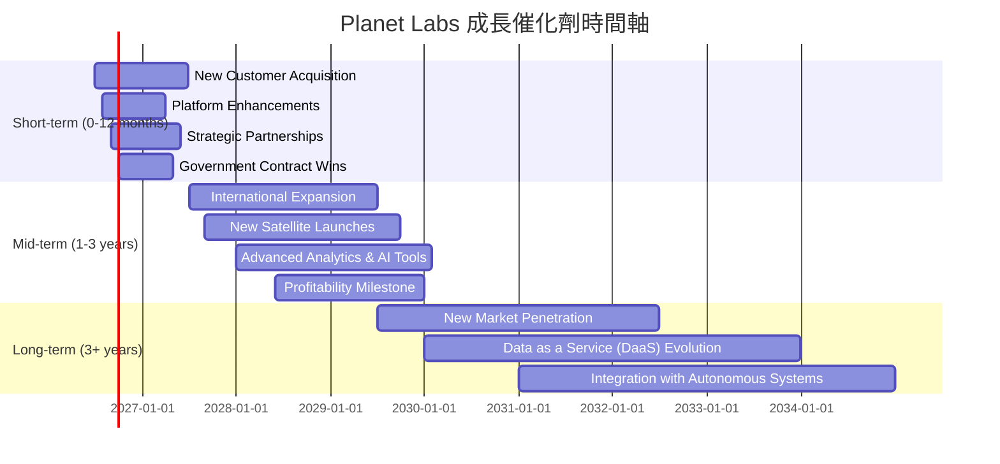

### 8.2 TAM 市場規模分析

Planet Labs 所在的地理空間數據市場是一個龐大且不斷擴大的市場，涵蓋多個應用領域。

```
╔══════════════════════════════════════════════════════════════════╗
║                   Planet Labs TAM 市場規模分析                   ║
╠══════════════════════════════════════════════════════════════════╣
║                                                                  ║
║  全球地理空間信息市場 (2025年估計):                              ║
║  ├── 市場規模：約 $500B                                         ║
║  ├── CAGR (2025-2030): 10-15%                                   ║
║                                                                  ║
║  細分市場與PL貢獻收入 (TTM $335.61M):                            ║
║  ├── 農業監測： TAM ~$50B  █░░░░░░░░░░░░░░░░░░░░░░░░░ (貢獻約15%)║
║  ├── 政府/國防： TAM ~$150B ████░░░░░░░░░░░░░░░░░░░░░ (貢獻約40%)║
║  ├── 製圖/城市規劃： TAM ~$70B  ██░░░░░░░░░░░░░░░░░░░░░ (貢獻約10%)║
║  ├── 能源/基礎設施： TAM ~$80B  ██░░░░░░░░░░░░░░░░░░░░░ (貢獻約10%)║
║  └── 其他 (金融/保險等)： TAM ~$150B ████░░░░░░░░░░░░░░░░░░░░░ (貢獻約25%)║
║                                                                  ║
║  📊 PL當前市場滲透率仍低，未來成長空間巨大。                     ║
╚══════════════════════════════════════════════════════════════════╝
全球地理空間信息市場規模龐大，預計到2025年將達到約5000億美元，並以10-15%的複合年增長率持續增長。Planet Labs 目前的TTM收入為$335.61M，在全球市場中的滲透率仍然非常低，這意味著其未來有巨大的成長空間。隨著各行業對實時、高頻地球觀測數據需求的增加，Planet Labs 有望持續擴大其市場份額。
```

### 8.3 成長驅動力結構圖

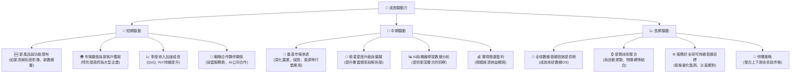

---

## 9. 風險矩陣

### 9.1 風險評分矩陣

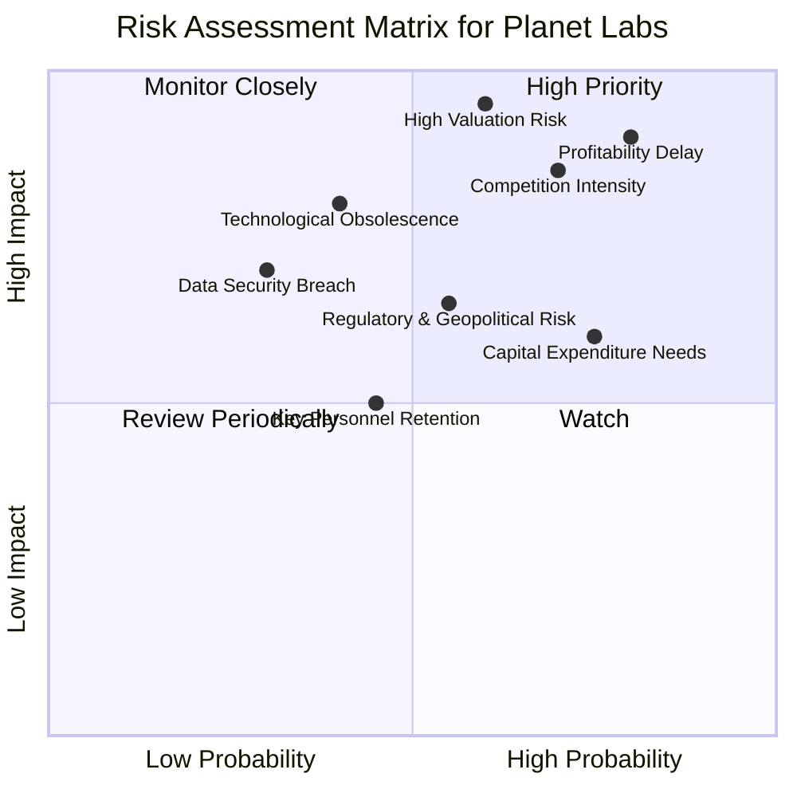

### 9.2 風險清單詳細分析

| # | 風險項目 | 發生機率 | 財務衝擊 | 風險評分 | 緩解措施 |
|---|------------------------|----------|----------|----------|----------|
| 1 | 🔴 **盈利能力延遲** | 高 (80%) | 高 (-20% EPS) | 🔴 8.5/10 | 加強成本控制，優化營運效率，提高規模經濟效益，專注於高利潤率產品線。 |
| 2 | 🔴 **高估值調整風險** | 中 (60%) | 極高 (-30%股價) | 🔴 9.0/10 | 透過持續實現高於預期的收入成長和盈利改善來證明估值的合理性；加強與投資者的溝通。 |
| 3 | 🟡 **激烈市場競爭** | 高 (70%) | 中 (-10%收入) | 🟡 7.5/10 | 持續創新，提升數據解析度、頻率和分析能力；擴大衛星星座的獨特優勢；強化客戶關係和生態系統。 |
| 4 | 🟡 **技術淘汰與創新不足** | 中 (40%) | 高 (-15%收入) | 🟡 6.0/10 | 大力投入研發，探索新技術（如AI/ML、邊緣計算）；保持對行業趨勢的敏感性，適時調整技術路線。 |
| 5 | 🟡 **資本支出需求高** | 高 (75%) | 中 (-5% FCF) | 🟡 7.0/10 | 審慎規劃資本開支，優化衛星發射和運營成本；探索更多與政府或戰略夥伴合作，分攤資本成本。 |
| 6 | 🟡 **監管與地緣政治風險** | 中 (55%) | 中 (-10%收入) | 🟡 6.5/10 | 密切關注國際空間法規和出口管制政策；維持良好的政府關係；業務多元化以降低單一市場風險。 |
| 7 | 🟢 **關鍵人才流失** | 低 (45%) | 中 (-5%研發效率) | 🟢 4.0/10 | 建立具競爭力的薪酬和激勵機制，提供良好的職業發展路徑；建立強大的企業文化和知識管理系統。 |

---

## 10. 投資建議

### 10.1 最終綜合評級雷達圖

```
╔══════════════════════════════════════════════════════════════════╗
║                   Planet Labs 綜合評級雷達圖                     ║
╠══════════════════════════════════════════════════════════════════╣
║                                                                  ║
║ 基本面強度  7.0 ▓▓▓▓▓▓▓▓▓▓▓▓▓▓░░░░░░                              ║
║ 成長動能    9.0 ▓▓▓▓▓▓▓▓▓▓▓▓▓▓▓▓▓▓░░                              ║
║ 獲利品質    4.0 ▓▓▓▓▓▓▓▓░░░░░░░░░░░░                              ║
║ 財務健康    8.0 ▓▓▓▓▓▓▓▓▓▓▓▓▓▓▓▓░░░░                              ║
║ 估值合理性  6.0 ▓▓▓▓▓▓▓▓▓▓▓▓░░░░░░░░                              ║
║ 護城河深度  7.5 ▓▓▓▓▓▓▓▓▓▓▓▓▓▓▓░░░░░                              ║
║ 管理層執行  7.0 ▓▓▓▓▓▓▓▓▓▓▓▓▓▓░░░░░░                              ║
║ 技術創新力  8.5 ▓▓▓▓▓▓▓▓▓▓▓▓▓▓▓▓▓░░░                              ║
║                                                                  ║
║ 綜合總分    7.2/10 🏆 具備高成長潛力的投機性買入機會             ║
╚══════════════════════════════════════════════════════════════════╝
```

### 10.2 目標價與隱含報酬率

基於前述估值分析，我們為 Planet Labs 制定以下目標價區間：

| 情境 | 目標價 | 較當前股價 ($31.38) 隱含報酬率 | 機率權重 (估算) |
|------|--------|------------------------------|-----------------|
| **悲觀情境** | $35.00 | +11.5%                       | 20%             |
| **基準情境** | $45.00 | +43.4%                       | 60%             |
| **樂觀情境** | $60.00 | +91.2%                       | 20%             |
| **加權平均目標價** | **$46.00** | **+46.6%**                   | 100%            |

**投資評級**：**買入 (BUY)**

**理由**：Planet Labs 憑藉其獨特的衛星星座和訂閱制數據服務，在快速成長的地球觀測市場中佔據領先地位。公司收入持續高速成長，且營運現金流和自由現金流已轉正，顯示其商業模式正逐步走向成熟。儘管目前估值偏高且仍處於虧損，但其強大的技術護城河、廣闊的TAM和明確的成長催化劑，為其提供了長期增長的堅實基礎。分析師普遍看好，且DCF模型顯示其內在價值有顯著上升空間。

### 10.3 買入時機與觸發因素

```
╔══════════════════════════════════════════════════════════════════╗
║                  ✅ 買入觸發因素 Checklist                      ║
╠══════════════════════════════════════════════════════════════════╣
║                                                                  ║
║  立即買入觸發條件（多數符合）：                                  ║
║  ✅ 季度收入YoY成長率持續高於40%                                 ║
║  ✅ 自由現金流持續為正且穩步增長                                 ║
║  ✅ 來自政府或大型企業的新訂單或續約公告                         ║
║  ✅ 關鍵技術或產品發布，提升數據價值或降低成本                     ║
║  ✅ 市場對高成長科技股情緒回暖                                   ║
║                                                                  ║
║  加碼觸發條件（出現以下任一）：                                  ║
║  ☐ 淨利潤率顯示明確的轉正趨勢，核心營運虧損加速收窄             ║
║  ☐ P/S 或 EV/Revenue 倍數回落至歷史區間中位數（如P/S 20-25x）   ║
║  ☐ 成功擴展至新興高潛力垂直市場（如保險、碳監測）               ║
║  ☐ 股價因非基本面因素（如大盤波動）出現顯著回調                 ║
║                                                                  ║
║  減碼/停損觸發條件（出現以下任一）：                             ║
║  ☐ 季度收入成長率連續兩季顯著放緩至20%以下                     ║
║  ☐ 自由現金流再次轉負且無明確改善路徑                           ║
║  ☐ 關鍵競爭對手推出顛覆性技術，嚴重威脅公司護城河               ║
║  ☐ 管理層對未來指引顯著下調或出現重大負面事件                   ║
╚══════════════════════════════════════════════════════════════════╝
```

### 10.4 投資人適配度分析

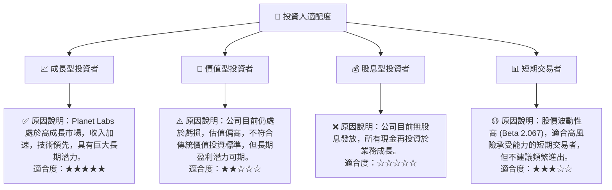

### 10.5 關鍵監控指標

| 監控類型 | 指標 | 關注點 | 頻率 |
|----------|------|----------|------|
| **營運表現** | 季度收入YoY成長率 | 確保成長動能持續，關注加速或放緩趨勢 | 每季 |
| | 預收收入 (Unearned Revenue) | 衡量訂閱業務的健康度和客戶粘性 | 每季 |
| | 毛利率與營業利益率 | 監測盈利能力改善趨勢，尤其關注營業利益率何時轉正 | 每季 |
| **財務健康** | 自由現金流 (FCF) | 確保FCF持續為正且穩步增長，反映自我造血能力 | 每季 |
| | 現金及短期投資餘額 | 監控資金儲備，確保有足夠流動性支持營運和成長 | 每季 |
| | 淨現金/債務狀況 | 評估財務槓桿與償債能力 | 每季 |
| **市場與競爭** | 新客戶獲取與客戶留存率 | 衡量市場擴張和競爭力 | 每季/每年 |
| | 競爭對手動態 | 關注新技術、新產品或市場策略變化 | 持續 |
| **估值與情緒** | P/S 或 EV/Revenue 倍數 | 相對於同業和歷史區間的估值水平 | 每月 |
| | 分析師評級與目標價 | 觀察市場對公司的預期變化 | 不定期 |

---

> **免責聲明**：本報告為 AI 自動生成，僅供研究參考，不構成投資建議。投資有風險，入市需謹慎。