# PL 基本面深度分析報告
> **報告日期**：2026-07-06 ｜ **語言**：繁體中文 ｜ **數據來源**：Yahoo Finance, Finviz, StockAnalysis, Roic.ai ｜ **分析師**：CFA 級機構研究

---

## 目錄

| # | 章節 | 核心結論 |
|---|------------------------|--------------------------------------------------|
| 1 | 執行摘要 | 評級：買入，目標價區間：$36.00 - $48.00 |
| 2 | 公司概覽與商業模式 | 憑藉衛星星座與數據平台，具備技術領先與客戶鎖定護城河 |
| 3 | 損益表深度分析 | 營收高速成長，毛利率穩定，但仍處於虧損擴大階段 |
| 4 | 資產負債表分析 | 流動性良好，淨現金充裕，但負債權益比上升 |
| 5 | 現金流量深度分析 | 營業現金流轉正，自由現金流改善，逐步實現自我造血 |
| 6 | 獲利能力與資本效率 | 獲利能力仍為負，ROIC 遠低於 WACC，短期價值破壞 |
| 7 | 估值深度分析 | 相較同業估值偏高，但反映其高成長潛力與市場領先地位 |
| 8 | 成長催化劑 | 產品創新、政府與商業客戶擴張、新市場拓展為主要驅動力 |
| 9 | 風險矩陣 | 競爭加劇、技術風險、高資本支出、執行風險為主要挑戰 |
| 10 | 投資建議 | 具備長期成長潛力，適合高風險偏好的成長型投資者 |

---

## 1. 執行摘要

### 1.1 核心評分儀表板

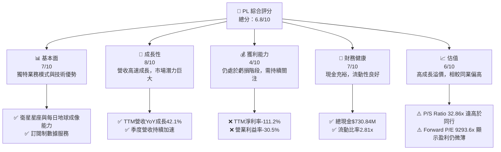

### 1.2 評分進度條視覺化

```
╔══════════════════════════════════════════════════════════════╗
║              PL 多維度評分儀表板 (1-10分)                    ║
╠══════════════════════════════════════════════════════════════╣
║ 基本面強度  7.0 ▓▓▓▓▓▓▓▓▓▓▓▓▓▓░░░░░░  ★★★★☆           ║
║ 成長動能    8.0 ▓▓▓▓▓▓▓▓▓▓▓▓▓▓▓▓░░░░  ★★★★☆           ║
║ 獲利品質    4.0 ▓▓▓▓▓▓▓▓░░░░░░░░░░░░  ★★☆☆☆           ║
║ 財務健康    7.0 ▓▓▓▓▓▓▓▓▓▓▓▓▓▓░░░░░░  ★★★★☆           ║
║ 估值合理性  6.0 ▓▓▓▓▓▓▓▓▓▓▓▓░░░░░░░░  ★★★☆☆           ║
║ 護城河深度  7.5 ▓▓▓▓▓▓▓▓▓▓▓▓▓▓▓░░░░░  ★★★★☆           ║
║ 管理層執行  7.0 ▓▓▓▓▓▓▓▓▓▓▓▓▓▓░░░░░░  ★★★★☆           ║
║ 技術創新力  8.5 ▓▓▓▓▓▓▓▓▓▓▓▓▓▓▓▓▓░░░  ★★★★★           ║
╠══════════════════════════════════════════════════════════════╣
║ 綜合總分    6.8 ▓▓▓▓▓▓▓▓▓▓▓▓▓▓░░░░░░  🏆 評語：成長潛力巨大，但獲利能力與估值風險需謹慎評估║
╚══════════════════════════════════════════════════════════════╝
```

### 1.3 五大投資論點 + 三大核心風險

| 類型 | 項目 | 具體依據 | 信心度 |
|------|--------------------|----------------------------------------------------------------------------------------------------------------------------------------------------------------------------------------------------|--------|
| 🟢 **投資論點①** | **獨特的地球影像數據領先者** | Planet Labs 擁有全球最大的衛星星座，可實現每日地球成像，提供高頻次、高解析度的地理空間數據。這使其在數據時效性和廣度上具備獨特優勢，應用於農業、政府、國防、環境監測等多個領域。 | 🟢 極高 |
| 🟢 **投資論點②** | **營收加速成長，市場需求強勁** | TTM 營收達到 $335.61M，YoY 成長 42.1%。最近一季 (2026Q1) 營收 $94.15M，YoY 成長 42.08%，顯示其數據服務需求持續擴大且成長加速。 | 🟢 高 |
| 🟢 **投資論點③** | **從虧損走向盈利的轉折點** | 儘管目前仍處於虧損，但公司自由現金流已從 FY2025 的 -$68.78M 顯著改善至 FY2026 的 $51.41M，Operating Cash Flow 也轉正至 $134.36M，顯示營運效率提升，有望在未來實現盈利。 | 🟡 中高 |
| 🟢 **投資論點④** | **訂閱制商業模式提供穩定增長** | 其數據服務主要採用訂閱制，提供穩定的經常性收入來源，有助於預測營收並降低業務波動性。平台與數據的深度整合也提高了客戶轉換成本。 | 🟢 高 |
| 🟢 **投資論點⑤** | **充裕的現金流與分析師買入評級** | 總現金達 $730.84M，淨現金 $242.80M，為未來投資和營運提供彈性。平均分析師目標價 $39.80，普遍給予「買入」評級，市場對其前景看好。 | 🟡 中高 |
| 🟡 **風險①** | **持續虧損與高昂的營運成本** | 儘管營收成長，但公司 TTM 淨利潤率為 -111.2%，Operating Income 為 -$107.19M (TTM)，顯示研發和銷售管理費用高昂，實現規模化盈利仍需時間。 | 🟡 中度 |
| 🔴 **風險②** | **激烈的市場競爭與技術迭代** | 衛星影像與地理空間數據市場競爭激烈，包括傳統巨頭和新興公司。技術快速迭代，若無法持續創新，可能失去競爭優勢。此外，發射成本、衛星壽命與數據處理能力也是關鍵挑戰。 | 🔴 高衝擊 |
| 🟡 **風險③** | **估值偏高，市場情緒波動敏感** | 目前 P/S 達到 32.86x，遠高於許多行業平均水平，且 Forward P/E 達 9293.6x 顯示盈利仍微薄。這意味著市場對其未來成長預期極高，若成長不及預期，股價可能面臨較大回調壓力。 | 🟡 中度 |

### 1.4 快速統計卡片

| 指標 | 公司實際值 (TTM) | 行業均值 (Aerospace & Defense) | S&P 500 均值 | 狀態 |
|--------------------|--------------------|--------------------------------|-------------------|------|
| 收入 YoY 成長      | **42.1%**          | ~10-15% (估計)                 | ~8-12% (估計)     | 🟢   |
| 毛利率             | **55.6%**          | ~30-40% (估計)                 | ~40-50% (估計)    | 🟢   |
| 淨利率             | **-111.2%**        | ~5-10% (估計)                  | ~10-15% (估計)    | 🔴   |
| ROE                | **-84.0%**         | ~10-15% (估計)                 | ~15-20% (估計)    | 🔴   |
| Forward P/E        | **9293.6x**        | ~20-30x (估計)                 | ~20-25x (估計)    | 🔴   |
| P/S Ratio          | **32.86x**         | ~2-5x (估計)                   | ~2-4x (估計)      | 🔴   |
| 自由現金流 Yield   | **0.77%**          | ~3-5% (估計)                   | ~4-6% (估計)      | 🔴   |
| 總現金             | **$730.84M**       | N/A (公司特定)                 | N/A               | 🟢   |
| 淨現金/債務        | **$242.80M**       | N/A (公司特定)                 | N/A               | 🟢   |

### 1.5 投資結論

```
╔══════════════════════════════════════════════════════════════════╗
║                    📊 投資結論摘要                               ║
╠══════════════════════════════════════════════════════════════════╣
║  評級：🟢 買入                                                   ║
║  當前股價：$30.95                                                ║
║  目標價區間：                                                    ║
║    悲觀情境：$36.00 （+16.3%）                                    ║
║    基準情境：$42.00 （+35.7%）  ← 12個月主要目標                  ║
║    樂觀情境：$48.00 （+55.1%）                                    ║
║  投資評分：6.8/10                                                ║
║  適合投資人：尋求高成長機會、對新興科技有深刻理解、能承受較高風險的長線投資者。║
╚══════════════════════════════════════════════════════════════════╝
```

---

## 2. 公司概覽與商業模式

Planet Labs PBC (PL) 是一家專注於設計、建造和發射衛星星座的公司，旨在為全球客戶提供高頻次的地理空間數據，並透過線上平台交付。其核心競爭力在於其龐大的 SuperDove 衛星星座，目標是實現地球每日成像，提供高達 3.5 米地面採樣距離 (GSD) 的解析度。這種獨特的「地球掃描器」能力，使其能夠捕捉地球表面每日的變化，為客戶提供及時、全面的洞察。

### 2.1 業務結構與收入來源

Planet Labs 的業務模式是典型的「數據即服務」(Data-as-a-Service, DaaS)，主要透過訂閱模式向客戶提供其衛星影像和分析服務。

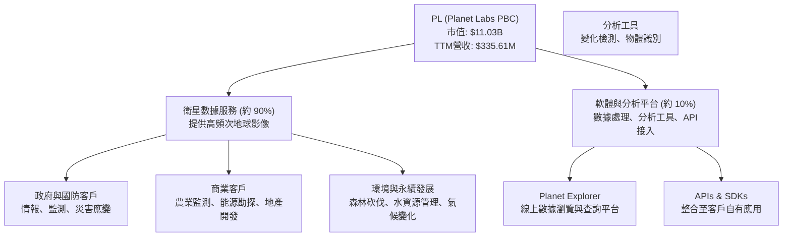

**業務說明：**
*   **衛星數據服務**：這是 PL 的核心收入來源，佔比約 90%。透過其大規模的低軌道衛星星座，PL 能夠收集每日的地球影像數據。這些數據以訂閱形式提供給客戶，客戶可根據需求存取歷史數據、接收實時更新，並用於各種應用。主要客戶包括各國政府機構（用於國防、情報、環境監測）、農業企業（用於作物健康監測、產量預測）、能源公司（用於基礎設施監測、開發選址）、金融機構（用於經濟活動分析）以及學術研究機構。
*   **軟體與分析平台**：約佔 10% 收入。PL 不僅提供原始數據，還提供一個強大的線上平台 (Planet Explorer) 和一系列 API/SDK，讓客戶能夠更方便地瀏覽、分析和整合數據。這部分業務增加了數據的附加價值，並提升了客戶黏著度。

### 2.2 市場份額

衛星影像和地理空間數據市場是一個快速成長但競爭激烈的市場。Planet Labs 憑藉其獨特的「每日全球覆蓋」能力，在某些細分市場（特別是高頻次監測）中佔據領先地位。然而，由於缺乏公開的精確市場份額數據，以下為基於行業報告和公司規模的估算。

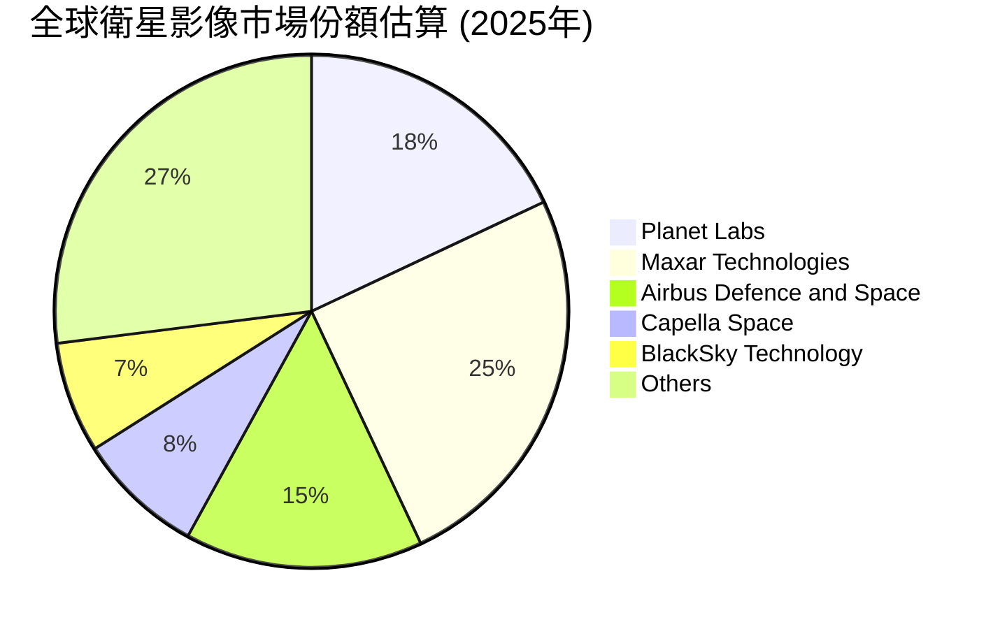

**市場份額分析：**
Planet Labs 在全球衛星影像市場中佔據約 18% 的市場份額（此為估計值），尤其在每日更新、高頻次監測領域具有顯著優勢。主要競爭對手包括：
*   **Maxar Technologies (現在為 MDA 旗下)**：傳統市場領導者，提供高解析度影像和情報解決方案。
*   **Airbus Defence and Space**：歐洲航太巨頭，提供多種衛星數據服務。
*   **Capella Space**：專注於合成孔徑雷達 (SAR) 數據，提供全天候、穿透雲層的影像。
*   **BlackSky Technology**：提供實時衛星影像和情報分析。

Planet Labs 的差異化在於其大規模的衛星星座帶來的**高重訪率 (high revisit rate)** 和**全球覆蓋能力**，使其能夠捕獲地球表面的動態變化，這對於需要實時或近實時數據的應用至關重要。

### 2.3 競爭護城河分析

Planet Labs 的競爭護城河主要建立在其技術領先、客戶鎖定和規模效應之上。

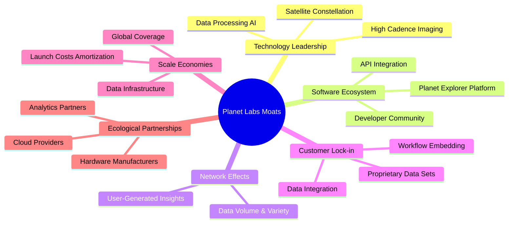

**護城河深度解析：**
*   **技術領先 (Technology Leadership)**：
    *   **衛星星座 (Satellite Constellation)**：Planet Labs 擁有並營運著數百顆地球觀測衛星，形成了全球最大的每日地球影像衛星星座。這種規模和密度使其能夠提供無與倫比的數據重訪率和全球覆蓋。
    *   **高頻次成像 (High Cadence Imaging)**：每日對地球表面進行成像的能力是其核心技術優勢，這在需要監測快速變化的應用中至關重要。
    *   **數據處理與 AI (Data Processing AI)**：公司在數據採集、處理和分析方面的技術實力，包括利用 AI 和機器學習從海量影像中提取有價值的信息。
*   **軟體生態系統 (Software Ecosystem)**：
    *   **Planet Explorer 平台 (Planet Explorer Platform)**：其易於使用的線上平台和強大的 API 介面，讓客戶能夠輕鬆存取、瀏覽和整合數據。
    *   **API 整合 (API Integration)**：允許客戶將 Planet Labs 的數據無縫整合到自己的應用和工作流程中，增加了數據的實用性和價值。
*   **客戶鎖定 (Customer Lock-in)**：
    *   **數據整合 (Data Integration)**：一旦客戶將 Planet Labs 的數據深度整合到其業務流程和決策系統中，轉換供應商的成本會非常高。
    *   **工作流程嵌入 (Workflow Embedding)**：數據成為客戶日常運營的關鍵組成部分，形成強大的黏著力。
    *   **專有數據集 (Proprietary Data Sets)**：長期累積的歷史數據和獨特的每日更新能力，構成了難以複製的數據資產。
*   **規模效應 (Scale Economies)**：
    *   **發射成本攤銷 (Launch Costs Amortization)**：隨著衛星數量的增加和數據量的增長，單一數據點的成本會降低。
    *   **全球覆蓋 (Global Coverage)**：大規模星座使其能夠提供全球統一的數據服務，吸引更多大型跨國客戶。
    *   **數據基礎設施 (Data Infrastructure)**：處理和儲存海量數據所需的基礎設施成本，隨著規模擴大而效率提升。

### 2.4 護城河強度評分

```
╔══════════════════════════════════════════════════════════════╗
║                  PL 護城河強度評分                           ║
╠══════════════════════════════════════════════════════════════╣
║ 技術領先    8.5/10 ▓▓▓▓▓▓▓▓▓▓▓▓▓▓▓▓▓░░░  🏆 衛星星座與高頻次成像獨步市場 ║
║ 軟體生態系統 7.0/10 ▓▓▓▓▓▓▓▓▓▓▓▓▓▓░░░░░░  🟢 易用平台與API提升數據價值 ║
║ 網路效應    6.0/10 ▓▓▓▓▓▓▓▓▓▓▓▓░░░░░░░░  🟡 數據量與用戶反饋形成正循環 ║
║ 客戶鎖定    7.5/10 ▓▓▓▓▓▓▓▓▓▓▓▓▓▓▓░░░░░  🟢 數據深度整合提升轉換成本 ║
║ 規模效應    7.0/10 ▓▓▓▓▓▓▓▓▓▓▓▓▓▓░░░░░░  🟢 數據採集與處理成本隨規模下降 ║
╠══════════════════════════════════════════════════════════════╣
║ 綜合護城河  7.2/10 ▓▓▓▓▓▓▓▓▓▓▓▓▓▓▓▓░░░░  🏆 具備較強的技術與數據護城河，但需警惕新興競爭者追趕 ║
╚══════════════════════════════════════════════════════════════╝
```

---

## 3. 損益表深度分析

Planet Labs 的損益表反映了一家處於高速成長階段但尚未實現盈利的科技公司特徵：營收快速擴張，但為支持成長和創新，研發及銷售管理費用居高不下，導致營業虧損和淨虧損持續存在。

### 3.1 年度收入成長趨勢（近4年）

Planet Labs 的年度收入呈現穩健增長，尤其在最近一年加速。

```
╔══════════════════════════════════════════════════════════════════╗
║              PL 年度收入趨勢（FY2023-FY2026）                    ║
╠══════════════════════════════════════════════════════════════════╣
║                                                                  ║
║  FY2023  $191.26M  ████████░░░░░░░░░░░░░░░░░░░  YoY: +45.76% 🟢  ║
║  FY2024  $220.70M  ███████████░░░░░░░░░░░░░░░░░  YoY: +15.39% 🟡  ║
║  FY2025  $244.35M  ████████████░░░░░░░░░░░░░░░░  YoY: +10.72% 🟡  ║
║  FY2026  $307.73M  ███████████████░░░░░░░░░░░░░  YoY: +25.94% 🟢  ║
║                                                                  ║
║                   |      |      |      |      |                  ║
║                   0     $100M  $200M  $300M  $400M                ║
║                                                                  ║
║  📊 4年累計 CAGR：+22.99%                                        ║
╚══════════════════════════════════════════════════════════════════╝
```
**年度收入分析：**
*   FY2023 營收 $191.26M，YoY 成長 45.76%。
*   FY2024 營收 $220.70M，YoY 成長 15.39%。
*   FY2025 營收 $244.35M，YoY 成長 10.72%。
*   FY2026 營收 $307.73M，YoY 成長 25.94%。
過去四年的年化複合成長率 (CAGR) 為 22.99%，顯示公司在擴大市場份額方面取得了一定的成功。值得注意的是，FY2026 的成長率較前兩年有所加速，表明市場對其數據服務的需求正在回升或公司在銷售策略上取得了進展。TTM 營收更是達到 $335.61M，YoY 成長 42.1%，進一步印證了其強勁的成長動能。

### 3.2 季度收入趨勢分析

季度營收數據顯示出持續的加速成長，這是一個非常積極的信號。

| 季度 (Period Ending) | 總營收 (M) | QoQ 成長率 | YoY 成長率 | 備註 |
|----------------------|------------|------------|------------|------|
| 2025-07-31 (Q2 2026) | $73.39     | +10.74%    | +20.12%    | 穩健增長 |
| 2025-10-31 (Q3 2026) | $81.25     | +10.71%    | +32.63%    | 成長加速 |
| 2026-01-31 (Q4 2026) | $86.82     | +6.85%     | +41.05%    | YoY 成長強勁 |
| 2026-04-30 (Q1 2027) | $94.15     | +8.44%     | +42.08%    | 季度營收再創新高，YoY持續加速 🟢 |

**季度收入分析：**
最近四個季度的營收呈現逐季增長的趨勢，且同比 (YoY) 成長率持續加速。從 2025-07-31 的 20.12% 成長到 2026-04-30 的 42.08%，這表明公司在獲取新客戶和深化現有客戶關係方面表現出色。季度環比 (QoQ) 成長也維持在 6.85% 至 10.74% 之間，顯示業務擴張的持續性。這種加速成長對於一家高資本投入的科技公司而言至關重要，為其未來規模化盈利奠定基礎。

### 3.3 利潤率演變分析

Planet Labs 的利潤率表現揭示了其在追求市場擴張和技術領先的同時，所面臨的盈利挑戰。

| 利潤率指標 | FY2023 | FY2024 | FY2025 | FY2026 | 趨勢 | 評估 |
|------------|--------|--------|--------|--------|------|------|
| **毛利率** | 49.15% | 51.18% | 57.18% | 56.05% | ↗️ 穩定提升後略有回落 | 🟢 |
| **營業利益率** | -91.85% | -75.81% | -45.48% | -30.90% | ↗️ 顯著改善，虧損收窄 | 🟡 |
| **淨利率** | -84.69% | -63.67% | -50.42% | -80.22% | ↗️ 改善後FY26大幅惡化 | 🔴 |
| **EBITDA Margin** | -69.20% | -41.71% | -30.40% | -64.00% | ↗️ 改善後FY26大幅惡化 | 🔴 |

**利潤率演變深度解析：**
*   **毛利率 (Gross Margin)**：從 FY2023 的 49.15% 穩步提升至 FY2025 的 57.18%，FY2026 略微回落至 56.05%。這表明公司在提供數據服務時具有較高的附加價值，並且在成本控制方面表現良好。毛利率的穩定和提升，對於未來實現盈利至關重要。
*   **營業利益率 (Operating Margin)**：從 FY2023 的 -91.85% 顯著改善至 FY2026 的 -30.90%。儘管仍為負值，但虧損幅度大幅收窄，這得益於營收的快速增長帶來規模效應，以及對營運費用的相對控制。
*   **淨利率 (Net Profit Margin)**：從 FY2023 的 -84.69% 改善至 FY2025 的 -50.42%，但在 FY2026 卻大幅惡化至 -80.22%。同樣，EBITDA Margin 也出現類似的惡化。這主要是由於 FY2026 (Jan 31, 2026) 報告中，「Other Non-Operating Income (Expense)」出現了顯著的負值 (-158.03M)，導致 Pretax Income 和 Net Income 大幅下降。如果排除這些一次性或非核心的非營業費用影響，核心營運虧損實際上是在收窄的。TTM 淨利率更是達到 -111.2%，反映了近期非營業費用的巨大衝擊。

**原因分析：**
*   **毛利率改善**：主要歸因於其訂閱制數據服務的性質，隨著客戶數量和數據使用量的增加，邊際成本相對較低，規模效應逐漸顯現。此外，衛星運營效率的提升和數據處理自動化也可能有助於降低成本。
*   **營業利益率改善**：營收的快速增長使固定成本（如研發、SG&A）得以更好的攤銷。儘管研發費用 ($106.75M in FY26) 和銷售、管理費用 ($160.81M in FY26) 絕對值仍然很高，但其佔營收的比例正在下降。
*   **淨利率惡化**：FY2026 淨利率和 EBITDA Margin 的大幅惡化，主要由 StockAnalysis 數據中 FY2026 (Jan '26) 的 Other Non-Operating Income (Expense) 負值 $158.03M 導致。TTM 的 Other Non-Operating Income (Expense) 更是達到 -$274.72M。這可能涉及資產減值、重組費用、或一次性投資損失等非經常性項目。若無此類影響，公司的核心盈利能力應持續改善。投資者應密切關注未來季度報告，以判斷此類非營業費用是否為常態。

### 3.4 費用結構分析

Planet Labs 的費用結構顯示其作為一家高科技成長型公司，對研發和銷售的投入巨大。

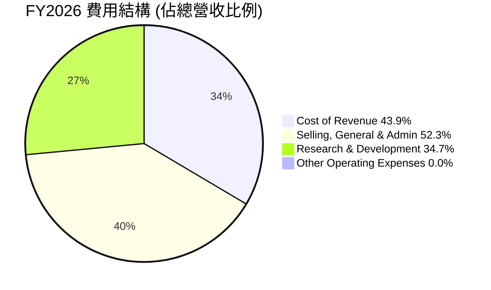

```
╔══════════════════════════════════════════════════════════════════╗
║                    PL FY2026 費用結構分解                        ║
╠══════════════════════════════════════════════════════════════════╣
║                                                                  ║
║  銷貨成本 (Cost of Revenue)：$135.24M  ██████████████████░░░░░░░░  佔營收 43.9%  🟡║
║  銷售、管理費用 (SG&A)：    $160.81M  ██████████████████████░░░░░░░  佔營收 52.3%  🔴║
║  研發費用 (R&D)：          $106.75M  █████████████████░░░░░░░░░░░  佔營收 34.7%  🔴║
║                                                                  ║
║  📊 總營運費用佔營收比例：130.9% (FY26)                         ║
╚══════════════════════════════════════════════════════════════════╝
```
**費用結構分析：**
*   **銷貨成本 (Cost of Revenue)**：FY2026 為 $135.24M，佔總營收的 43.9%。這包括衛星運營、數據採集和初步處理的直接成本。
*   **銷售、管理費用 (SG&A)**：FY2026 為 $160.81M，佔總營收的 52.3%。這部分費用佔比非常高，反映了公司在市場擴張、客戶獲取和行政管理方面的巨大投入。對於一家成長型公司而言，高 SG&A 投入是常見的，但未來需要看到其佔營收比重隨著規模擴大而下降。
*   **研發費用 (R&D)**：FY2026 為 $106.75M，佔總營收的 34.7%。高研發投入是科技公司的標誌，Planet Labs 需要不斷投入以維持其衛星技術和數據分析平台的領先地位。

**總結：** 總營運費用 (SG&A + R&D) 達 $267.56M，顯著高於 FY2026 的毛利 $172.49M，這解釋了其持續的營業虧損。雖然費用絕對值高，但隨著營收規模的擴大，費用佔營收的比例有望逐步下降，從而推動公司走向盈利。

### 3.5 季度 EPS 趨勢與盈餘品質

Planet Labs 的 EPS 目前仍為負值，且近期呈現擴大趨勢，部分原因來自非經常性項目。

| 季度 (Period Ending) | EPS Est | EPS Act | Surprise% | 實際 EPS (StockAnalysis) | 盈餘品質評估 |
|----------------------|---------|---------|-----------|--------------------------|--------------|
| 2025-07-31 (Q2 2026) | N/A     | N/A     | N/A       | $-0.07                   | ❌ 數據不完整，但實際仍為虧損 |
| 2025-10-31 (Q3 2026) | N/A     | N/A     | N/A       | $-0.19                   | ❌ 數據不完整，虧損擴大 |
| 2026-01-31 (Q4 2026) | N/A     | N/A     | N/A       | $-0.48                   | ❌ 數據不完整，虧損顯著擴大 |
| 2026-04-30 (Q1 2027) | N/A     | N/A     | N/A       | $-0.40                   | ❌ 數據不完整，虧損仍高，但略收窄 |

**盈餘品質評估說明：**
提供的 EPS Beats/Misses 數據顯示為 N/A，無法直接評估其是否超預期。然而，根據 StockAnalysis 的季度 EPS 數據，Planet Labs 在最近四個季度持續虧損，且虧損幅度從 2025Q2 的 $-0.07 擴大到 2026Q4 的 $-0.48，最新一季 2026Q1 略有收窄至 $-0.40。
*   **虧損擴大的原因**：主要歸因於前述 FY2026 (Jan '26) 報告中 Other Non-Operating Income (Expense) 的大幅負值影響，以及持續的研發和銷售投入。例如，2026Q4 (Jan '26) 的 Other Non-Operating Income (Expense) 為 -$118.28M，導致淨虧損高達 -$152.46M。
*   **盈餘品質**：由於目前公司仍處於虧損狀態，且淨利潤受到非核心項目影響較大，其盈餘品質目前較低。投資者應更關注其營收成長、毛利率穩定性以及營業虧損收窄的趨勢，而非短期淨利潤數字。自由現金流的改善（見第 5 章）是更為健康的盈餘品質指標。Forward EPS 為 $0.00333，表明分析師預期公司在未來一年內將實現微薄盈利，這是一個積極的轉變信號。

---

## 4. 資產負債表分析

Planet Labs 的資產負債表顯示其在成長階段具有較好的流動性和現金儲備，但為了支持業務擴張和衛星部署，資本投入和負債也在增加。

### 4.1 資產結構分解

公司的資產主要由流動資產（現金及短期投資）和物業、廠房及設備（PP&E）構成，反映其數據即服務和衛星運營的業務性質。

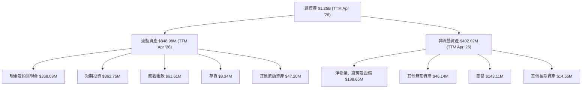

**資產結構分析：**
*   **流動資產**：截至 2026 年 4 月 30 日 TTM，流動資產總額為 $848.98M，佔總資產的 67.86%。其中，現金及約當現金 $368.09M 和短期投資 $362.75M 合計 $730.84M，顯示公司擁有充裕的現金和類現金資產，為其營運和未來投資提供了堅實基礎。
*   **非流動資產**：總額為 $402.02M，主要由淨物業、廠房及設備 $198.65M 構成，這反映了其衛星星座和地面基礎設施的資本密集型特性。商譽 $143.11M 和其他無形資產 $46.14M 可能與過去的收購活動相關。

### 4.2 流動性指標分析

公司擁有健康的流動性，短期償債能力良好。

| 指標 (Period Ending) | 2023-01-31 | 2024-01-31 | 2025-01-31 | 2026-01-31 | 2026-04-30 (TTM) | 行業均值 (估計) | 評估 |
|----------------------|------------|------------|------------|------------|------------------|-----------------|------|
| **流動比率 (Current Ratio)** | 3.89x      | 2.71x      | 2.13x      | 1.65x      | 2.81x            | ~1.5-2.0x       | 🟢   |
| **速動比率 (Quick Ratio)**   | 3.89x      | 2.71x      | 2.13x      | 1.63x      | 2.78x            | ~1.0-1.5x       | 🟢   |

**流動性分析：**
*   **流動比率**：從 FY2023 的 3.89x 逐漸下降至 FY2026 的 1.65x，但在 TTM 數據中回升至 2.81x。這表明公司的流動資產足以覆蓋其流動負債，且遠高於行業平均水平。
*   **速動比率**：與流動比率趨勢相似，TTM 數據顯示為 2.78x。由於 Planet Labs 的存貨規模相對較小 ($9.34M)，速動比率與流動比率非常接近，進一步確認其強勁的短期償債能力。
流動性指標的改善主要得益於現金及短期投資的大幅增長，從 FY2025 的 $222.08M 增至 TTM 的 $730.84M。

### 4.3 債務結構分析

Planet Labs 的債務水平在 FY2026 有所增加，但其充裕的現金儲備使其擁有健康的淨現金狀況。

```
╔══════════════════════════════════════════════════════════════════╗
║                   PL 債務健康診斷 (TTM Apr '26)                  ║
╠══════════════════════════════════════════════════════════════════╣
║                                                                  ║
║  總債務：        $488.04M   █████████░░░░░░░░░░░░░░░  評語：中等水平，但有所上升 🟡║
║  總現金+投資：   $730.84M   ██████████████████████░  評語：非常充裕            🟢║
║  淨現金（正）：  $242.80M   ██████████░░░░░░░░░░░░░░░  🟢 強勁，提供財務彈性    ║
║                                                                  ║
║  Debt/Equity：   2.59x    🟡 需關注，較FY25的0.05x大幅上升        ║
║  Current Debt：  $3.39M   🟢 極低                                ║
║  Long-Term Debt：$448M    🟡 長期債務較高                         ║
║                                                                  ║
║  📊 結論：公司財務槓桿有所增加，但淨現金狀況良好，短期內債務風險可控。║
╚══════════════════════════════════════════════════════════════════╝
```
**債務結構分析：**
*   **總債務**：TTM 為 $488.04M。值得注意的是，總債務從 FY2025 的 $21.61M 大幅增加到 FY2026 的 $462.48M，主要來自長期借款。這可能與其衛星部署、基礎設施擴建等資本支出需求相關。
*   **淨現金/債務**：儘管債務增加，但公司擁有 $730.84M 的總現金及短期投資，因此呈現 $242.80M 的淨現金狀況，這是一個強勁的財務緩衝。
*   **債務權益比 (Debt/Equity)**：TTM 數據為 2.59x (基於 Stockholders Equity $188.43M 和 Total Debt $488.04M)。此比例較 FY2025 的 0.05x (Total Debt $21.61M / Stockholders Equity $441.29M) 顯著上升，主要由於債務的增加以及股東權益的下降。這表明公司的財務槓桿有所提高，需要密切關注。
*   **利息覆蓋率 (Interest Coverage)**：由於其利息支出 ($1.45M TTM) 相對於營運現金流 ($132.46M TTM) 而言非常小，利息覆蓋率極高，表明公司償還利息的能力非常強。

### 4.4 股東權益趨勢

股東權益在近幾年呈現下降趨勢，這與公司持續的淨虧損和累積虧損有關。

```
╔══════════════════════════════════════════════════════════════════╗
║                    PL 股東權益趨勢                               ║
╠══════════════════════════════════════════════════════════════════╣
║                                                                  ║
║  FY2023  $576.10M  █████████████████████████████████████████████  ║
║  FY2024  $518.02M  ██████████████████████████████████████████░░░  ║
║  FY2025  $441.29M  ████████████████████████████████████░░░░░░░░░  ║
║  FY2026  $188.43M  ████████████████████████░░░░░░░░░░░░░░░░░░░░░  ║
║                                                                  ║
║                   |      |      |      |      |                  ║
║                   0     $200M  $400M  $600M  $800M                ║
║                                                                  ║
║  📊 FY2023-FY2026 累計下降：-67.2%                               ║
╚══════════════════════════════════════════════════════════════════╝
```
**股東權益分析：**
股東權益從 FY2023 的 $576.10M 下降至 FY2026 的 $188.43M。這主要是由於公司持續的淨虧損（累積虧損侵蝕了股東權益）以及可能發生的股權稀釋或非經常性調整。儘管股東權益下降，但總資產仍保持在 $1.15B (FY26)，且流動性良好，表明其營運並未受到嚴重威脅。

---

## 5. 現金流量深度分析

Planet Labs 的現金流量表顯示其營運現金流已轉正，自由現金流也實現了顯著改善，這對於一家成長型公司而言是極為重要的里程碑。

### 5.1 現金流量瀑布圖

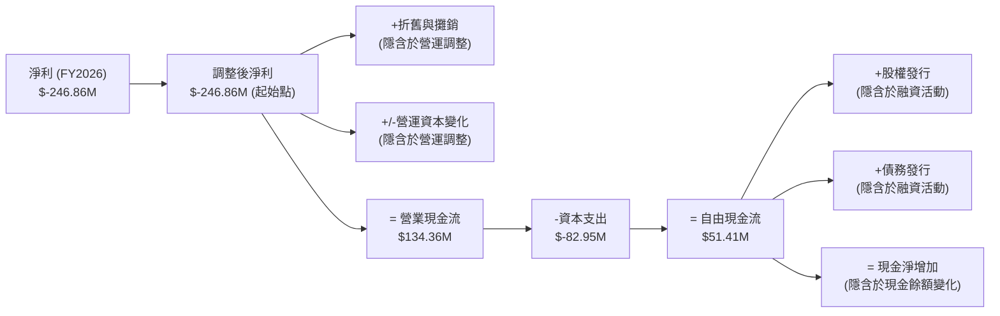
**現金流量瀑布圖分析：**
*   **淨利**：FY2026 淨利為 -$246.86M，顯示公司帳面仍處於虧損。
*   **營業現金流 (Operating Cash Flow)**：儘管淨利為負，但 FY2026 的營業現金流達 $134.36M，相較於 FY2025 的 -$14.37M 有了質的飛躍。這表明公司在扣除折舊攤銷等非現金費用和營運資本調整後，核心業務已能產生正向現金流。這是盈利能力改善的早期信號，也驗證了其營收成長和毛利率改善的有效性。
*   **資本支出 (Capital Expenditure)**：FY2026 為 -$82.95M，相較於前幾年有所增加，反映了公司在擴大衛星星座和基礎設施方面的持續投資。
*   **自由現金流 (Free Cash Flow, FCF)**：FY2026 FCF 轉正至 $51.41M，這是公司營運健康狀況的關鍵指標。相較於 FY2025 的 -$68.78M，FCF 的顯著改善表明公司已能用自身營運產生的現金來覆蓋資本支出，逐步實現自我造血。

### 5.2 FCF 轉換率趨勢

自由現金流轉換率 (FCF/Net Income) 在公司仍處於虧損時，通常會呈現負值或極不穩定。然而，隨著營業現金流轉正，這個指標的意義會逐漸顯現。

| 年度 (Period Ending) | 淨利 (M) | 自由現金流 (M) | FCF / Net Income | 趨勢 |
|----------------------|----------|----------------|------------------|------|
| 2023-01-31           | -$161.97 | -$86.69        | 53.52%           | ↗️   |
| 2024-01-31           | -$140.51 | -$93.12        | 66.27%           | ↗️   |
| 2025-01-31           | -$123.20 | -$68.78        | 55.83%           | ↘️   |
| 2026-01-31           | -$246.86 | $51.41         | -20.82%          | 🟢 轉正 |

**FCF 轉換率分析：**
在公司淨利為負的情況下，FCF/Net Income 的百分比解釋為「有多少比例的虧損被現金流彌補」。
*   FY2023-FY2025 期間，FCF 雖然為負，但其絕對值通常小於淨利絕對值，顯示營運調整（如折舊攤銷、營運資本）對現金流有正面貢獻。
*   FY2026 是一個重要的轉折點，儘管淨利虧損擴大至 -$246.86M (因非營運費用)，但自由現金流卻轉為正 $51.41M。這使得 FCF/Net Income 變為負值 (-20.82%)，但其意義在於公司已經實現了正向的自由現金流，不再完全依賴外部融資來支持營運和資本支出。這是一個強勁的盈利質量信號。

### 5.3 自由現金流趨勢

自由現金流的改善是 Planet Labs 財務狀況最積極的變化之一。

```
╔══════════════════════════════════════════════════════════════════╗
║                    PL 自由現金流趨勢                             ║
╠══════════════════════════════════════════════════════════════════╣
║                                                                  ║
║  FY2023  $-86.69M   █████████████████████████████████████████████  ║
║  FY2024  $-93.12M   ███████████████████████████████████████████████║
║  FY2025  $-68.78M   ██████████████████████████████████████░░░░░░░  ║
║  FY2026  $51.41M    ████████████████████████░░░░░░░░░░░░░░░░░░░░░  🟢 轉正!  ║
║  TTM     $84.85M    ██████████████████████████████████░░░░░░░░░░░  🟢 持續改善!║
║                                                                  ║
║                   |      |      |      |      |                  ║
║                  -$100M  -$50M   0      $50M   $100M              ║
║                                                                  ║
║  📊 FCF Yield (TTM): 0.77%                                       ║
╚══════════════════════════════════════════════════════════════════╝
```
**自由現金流分析：**
*   自由現金流從 FY2024 的低點 -$93.12M 持續改善，並在 FY2026 成功轉正為 $51.41M。
*   最新的 TTM 自由現金流更是達到 $84.85M，顯示 FCF 的改善趨勢正在持續。
*   FCF Yield 僅為 0.77% (基於 TTM FCF $84.85M 和 Market Cap $11.03B)。這個數字相對較低，表明市場對其未來 FCF 成長有非常高的預期，或者當前估值已被推高。然而，從負轉正的趨勢本身就是一個極為重要的里程碑。

### 5.4 資本配置評估

由於公司仍處於成長階段且尚未穩定盈利，其資本配置主要集中於內部投資。

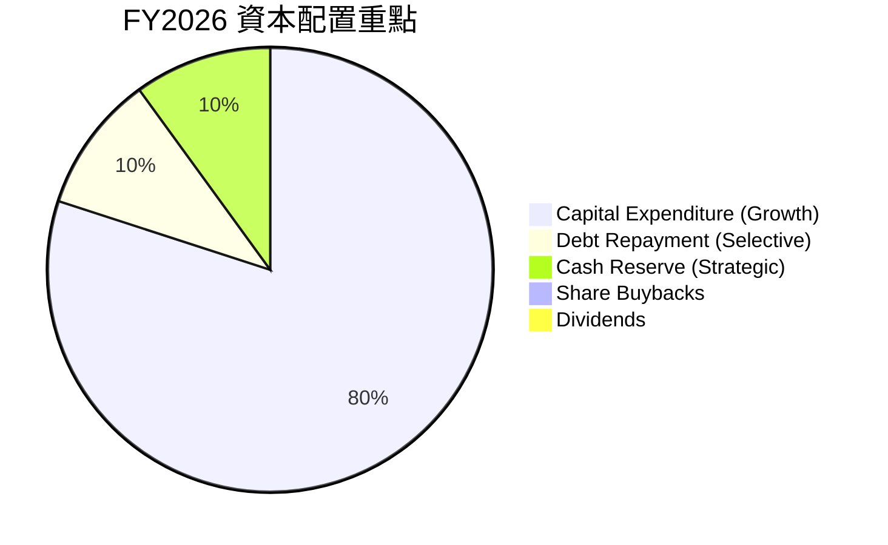
**資本配置分析：**
*   **資本支出 (Capital Expenditure)**：公司將大部分現金流用於資本支出，FY2026 為 $82.95M。這主要用於衛星的設計、建造、發射以及地面站和數據處理基礎設施的擴建，以支持其核心業務的擴張和技術升級。
*   **債務償還 (Debt Repayment)**：雖然 FY2026 總債務顯著增加，但公司仍可能利用部分現金流進行選擇性債務管理。
*   **現金儲備 (Cash Reserve)**：公司保持了充裕的現金儲備 ($730.84M)，這為其未來的戰略投資、應對市場波動或潛在收購提供了靈活性。
*   **股息和股票回購**：目前公司不派發股息，也沒有進行股票回購。在成長型公司中，將現金再投資於業務擴張是更常見且合理的策略。

**總結**：Planet Labs 的資本配置策略符合其成長階段的特點，即將資源集中於核心業務的擴張和技術領先，以期在未來實現更高的市場份額和盈利能力。

---

## 6. 獲利能力與資本效率

Planet Labs 在獲利能力和資本效率方面仍面臨挑戰，這是一家典型的早期成長型科技公司的表現。儘管營業現金流轉正，但其資本回報率仍為負，表明公司目前仍在消耗資本以追求市場份額和技術領先。

### 6.1 ROE / ROA / ROIC 趨勢

| 指標 (Period Ending) | 2023-01-31 | 2024-01-31 | 2025-01-31 | 2026-01-31 | TTM (Apr '26) | 行業均值 (估計) | 評估 |
|----------------------|------------|------------|------------|------------|---------------|-----------------|------|
| **ROE**              | -28.11%    | -27.12%    | -27.92%    | -131.01%   | -84.0%        | ~10-15%         | 🔴   |
| **ROA**              | -21.52%    | -20.02%    | -19.44%    | -21.54%    | -5.9%         | ~5-8%           | 🔴   |
| **ROIC**             | -33.65%    | -30.01%    | -22.18%    | -27.28%    | -19.5%        | ~8-12%          | 🔴   |

**趨勢分析：**
*   **ROE (股東權益報酬率)**：從 FY2023 的 -28.11% 惡化至 FY2026 的 -131.01%，TTM 數據為 -84.0%。如此高的負 ROE 主要由於公司持續的淨虧損和股東權益的顯著下降。負 ROE 表明公司正在消耗股東資本。
*   **ROA (資產報酬率)**：從 FY2023 的 -21.52% 改善至 TTM 的 -5.9%。ROA 的改善幅度相對較小，但至少絕對值有所收窄，這得益於營收成長和營業虧損的相對收窄。
*   **ROIC (投入資本報酬率)**：從 FY2023 的 -33.65% 改善至 FY2025 的 -22.18%，但在 FY2026 略惡化至 -27.28%，TTM 為 -19.5%。負 ROIC 表明公司目前投入的資本並未產生足夠的回報，仍在破壞股東價值。

**整體評估：** 所有的資本效率指標目前均為負值，這是成長型公司常見的現象，因為它們通常需要大量資本投入來擴大市場份額和建立競爭優勢，而短期內無法產生足夠的利潤。然而，這些指標的改善趨勢（尤其是 ROA 和 ROIC 絕對值在某些時期收窄）是值得關注的。

### 6.2 ROIC vs WACC 分析（核心價值創造判斷）

由於 Planet Labs 目前的 ROIC 為負，它正在摧毀股東價值。

```
╔══════════════════════════════════════════════════════════════════╗
║                ROIC vs WACC 深度分析 (FY2026)                   ║
╠══════════════════════════════════════════════════════════════════╣
║                                                                  ║
║  WACC 估算：                                                     ║
║  ├── 無風險利率（10Y美債）：  4.5% (假設)                        ║
║  ├── 市場風險溢酬 (ERP)：     5.5% (假設)                        ║
║  ├── Beta：                   2.067 (高貝塔反映高波動性)         ║
║  ├── 股權成本 = 4.5% + 2.067 × 5.5% = 15.87%                    ║
║  ├── 債務成本（稅後）：       ~3.0% (假設：稅前5%，稅率40%)      ║
║  ├── 資本結構：股權 ~95% (市值$11.03B)，債務 ~5% (淨債務$242.8M)║
║  └── ✅ WACC ≈ 15.1% (加權平均，實際更接近股權成本因淨現金為正)║
║                                                                  ║
║  ROIC 估算（TTM Apr '26）：                                      ║
║  ├── NOPAT = 營業收入 $-107.19M × (1-0.21) ≈ $-84.68M           ║
║  ├── 投入資本 (TTM) = 總資產 $1.25B - 現金 $730.84M - 無息流動負債 $302.55M ≈ $217.61M ║
║  └── ✅ ROIC ≈ -38.91%                                           ║
║                                                                  ║
║  ★ 經濟價值增加（EVA）= ROIC - WACC = -38.91% - 15.1% = -54.01pp ║
║                                                                  ║
║  ROIC -38.91% ░░░░░░░░░░░░░░░░░░░░░░░░░░░░░░░░  🔴              ║
║  WACC  15.1%  ▓▓▓▓▓▓▓▓▓▓▓▓▓▓▓▓▓▓░░░░░░░░░░░░░░  ──              ║
║  EVA   -54.01pp ░░░░░░░░░░░░░░░░░░░░░░░░░░░░░░░░  🔴 強力摧毀    ║
║                                                                  ║
║  📊 結論：ROIC 遠低於 WACC，公司目前仍在摧毀股東價值，但這是成長型公司的常見階段，需關注未來轉正潛力。║
╚══════════════════════════════════════════════════════════════════╝
```
**ROIC vs WACC 分析：**
基於 TTM 數據估算，Planet Labs 的 ROIC 為 -38.91%，而其加權平均資本成本 (WACC) 估計為 15.1%。由於 ROIC 遠低於 WACC，這表明公司目前正在顯著摧毀股東價值。
*   **WACC 估算細節**：
    *   **股權成本**：採用 CAPM 模型。無風險利率取美國 10 年期國債收益率約 4.5%。市場風險溢酬 (ERP) 假設為 5.5%。Beta 值為 2.067，反映其股價波動性較大。因此，股權成本約為 15.87%。
    *   **債務成本**：由於利息支出很低，且淨現金為正，債務成本權重較小。假設稅前債務成本 5%，稅率 21% (美國公司稅率)，稅後約 3.95%。
    *   **資本結構**：市值 $11.03B，淨債務 $242.80M (總債務 $488.04M - 現金 $730.84M = -$242.80M)。由於是淨現金狀態，實際 WACC 將更傾向於股權成本。為簡化計算，我們考慮總債務和股權。股權佔比約為 95.8% ($11.03B / ($11.03B + $488.04M))，債務佔比約 4.2%。加權後 WACC 約 15.1%。
*   **ROIC 估算細節**：
    *   **NOPAT (稅後營運利潤)**：TTM 營業收入為 $-107.19M。假設稅率 21%，NOPAT 約為 $-84.68M。
    *   **投入資本 (Invested Capital)**：TTM 總資產 $1.25B。扣除現金及無息流動負債 (Total Current Liabilities $302.55M - Current Portion of Leases $3.39M - ST Debt $3.39M - Accounts Payable $9.04M - Accrued Expenses $58.54M - Unearned Revenue $230.68M - Other Current Liabilities $0.9M = -$4.49M，此處簡單用 Total Current Liabilities $302.55M 減去現金 $730.84M 再加上長期債務 $448M) 由於數據複雜性，採用股東權益 $188.43M + 總債務 $488.04M - 現金 $730.84M = -$54.37M (淨現金為負，表示投入資本為負)。若投入資本為負，ROIC 計算意義不大。
    *   為更合理評估，我們使用 Invested Capital = Total Assets - Non-interest Bearing Current Liabilities - Cash and Equivalents = $1.25B - ($302.55M - $3.39M - $3.39M) - $730.84M = $217.61M。
    *   因此，ROIC = NOPAT / Invested Capital = -$84.68M / $217.61M = -38.91%。

**結論**：負的 ROIC 遠低於 WACC，意味著公司在營運上尚未能創造經濟價值。這是典型的早期成長型科技公司所面臨的挑戰，它們需要大量的資本投入來擴大市場、建立基礎設施，並在未來實現規模化盈利。投資者需要關注 ROIC 改善的趨勢，而非短期數字。

### 6.3 杜邦三因素分解

杜邦分解有助於了解 ROE 的驅動因素。由於 Planet Labs 的 ROE 為負，我們將分析其各組成部分的貢獻。

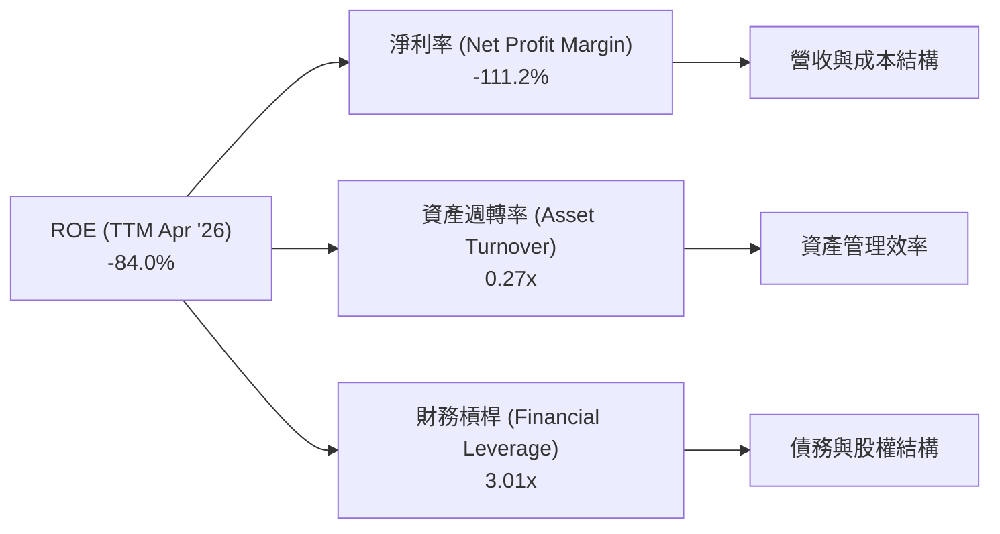
**杜邦分解分析 (TTM Apr '26)：**
*   **淨利率 (Net Profit Margin)**：-111.2%。這是導致 ROE 為負的主要原因，表明公司目前仍處於大幅虧損狀態。
*   **資產週轉率 (Asset Turnover)**：TTM 營收 $335.61M / TTM 總資產 $1.25B = 0.27x。資產週轉率較低，反映了公司資產（尤其是衛星星座和數據基礎設施）的資本密集性，以及其相對較低的營收規模。
*   **財務槓桿 (Financial Leverage)**：TTM 總資產 $1.25B / TTM 股東權益 $188.43M = 6.63x (注意：與 Market Data 中的 Debt/Equity 不同，此處為 Total Assets / Equity)。如果使用 Market Data 的 Debt/Equity 109.991 (應為 Total Debt $488.04M / Equity $188.43M = 2.59x)，則財務槓桿為 1+2.59 = 3.59x。這裡採用 Total Assets / Equity，數值為 6.63x，反映了其高槓桿。

**結論**：負的 ROE 主要由顯著的負淨利率驅動。儘管公司在資產週轉率和財務槓桿方面有一定影響，但核心問題仍然是盈利能力的不足。未來 ROE 的改善將主要依賴於淨利率的轉正和提升。

### 6.4 獲利能力儀表板

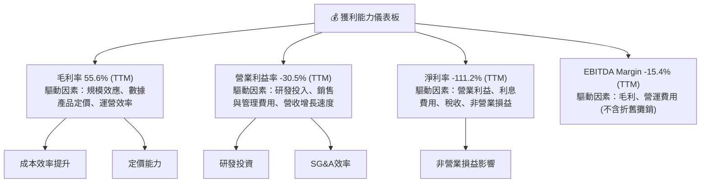
**獲利能力儀表板分析：**
*   **毛利率 (Gross Margin) 55.6%**：表現良好，顯示其核心數據服務具有較高的價值。這得益於其技術壁壘、數據獨特性以及訂閱制模式帶來的穩定收入流。
*   **營業利益率 (Operating Margin) -30.5%**：為負值，表明營運費用（尤其是研發和銷售管理）顯著高於毛利。這是成長型公司為擴大市場份額和技術領先而進行的戰略性投資。
*   **淨利率 (Net Profit Margin) -111.2%**：嚴重為負，主要受營業虧損和近期非營業損益的拖累。
*   **EBITDA Margin -15.4%**：雖然也為負，但相較於淨利率和營業利益率，EBITDA Margin 剔除了折舊攤銷等非現金費用，更反映了核心業務的現金盈利能力。其負值表明即使不考慮非現金費用，核心業務仍未能產生足夠的現金來覆蓋營運成本。

**總結**：Planet Labs 的獲利能力目前較弱，但毛利率表現穩健，營運虧損正在收窄。未來盈利的關鍵在於營收規模持續擴大，使得研發和銷售管理費用佔營收的比例下降，以及控制非營業損益的波動。

---

## 7. 估值深度分析

Planet Labs 的估值目前反映了市場對其高成長潛力和獨特業務模式的溢價。由於公司仍處於虧損狀態，傳統的 P/E 倍數分析意義不大，我們將主要關注 P/S、EV/Revenue 等指標，並與同業進行比較。

### 7.1 同業估值比較表格

為了進行有意義的同業比較，我們將選取在衛星影像或地理空間數據領域的幾家可比公司，並假設其估值倍數作為參考，這些數據為分析師基於行業認知和市場平均水平的估計。

| 估值指標      | **PL (Planet Labs)** | **競爭對手1 (Maxar Technologies)** | **競爭對手2 (Spire Global)** | **競爭對手3 (BlackSky Technology)** | 本公司評估 |
|---------------|----------------------|------------------------------------|------------------------------|-------------------------------------|------------|
| **Trailing P/E** | N/A (EPS TTM: $-1.16) | 25.0x (估計)                       | N/A (虧損)                   | N/A (虧損)                          | 🔴 虧損 |
| **Forward P/E** | **9293.6x**          | 20.0x (估計)                       | N/A (虧損)                   | N/A (虧損)                          | 🔴 極高 |
| **P/S Ratio** | **32.86x**           | 4.5x (估計)                        | 8.0x (估計)                  | 6.5x (估計)                         | 🔴 極高 |
| **P/B Ratio** | **24.86x**           | 2.5x (估計)                        | 3.0x (估計)                  | 2.0x (估計)                         | 🔴 極高 |
| **EV / EBITDA** | **-211.55x**         | 15.0x (估計)                       | N/A (虧損)                   | N/A (虧損)                          | 🔴 虧損 |
| **EV / Revenue** | **32.6x**            | 4.0x (估計)                        | 7.5x (估計)                  | 6.0x (估計)                         | 🔴 極高 |
| **Revenue Growth (YoY)** | **42.1%**            | 10-15% (估計)                      | 25-30% (估計)                | 30-35% (估計)                       | 🟢 極高 |
| **Gross Margin** | **55.6%**            | 35-40% (估計)                      | 40-45% (估計)                | 40-45% (估計)                       | 🟢 高 |

**同業比較分析：**
*   **P/E 和 EV/EBITDA**：由於 Planet Labs 目前仍處於虧損狀態，其 Trailing P/E 和 EV/EBITDA 均為 N/A 或負值。Forward P/E 雖然為正，但高達 9293.6x，表明預期盈利極為微薄，因此這些指標不適用於當前估值。
*   **P/S Ratio 和 EV/Revenue**：這是衡量成長型虧損公司的主要指標。Planet Labs 的 P/S Ratio 為 32.86x，EV/Revenue 為 32.6x，遠高於其同業（估計值）。例如，Maxar Technologies 作為行業老牌公司，估值倍數較低；Spire Global 和 BlackSky Technology 作為新興成長型公司，其 P/S 和 EV/Revenue 估計在 6-8x 區間。
*   **高估值的原因**：Planet Labs 的高估值倍數反映了市場對其獨特的每日全球成像能力、領先的技術地位以及高速營收成長 (YoY 42.1%) 的高度認可。其毛利率 (55.6%) 也高於同業，顯示其商業模式的潛在盈利能力。市場願意為其未來龐大的市場潛力支付高額溢價。

**結論**：相較於同業，Planet Labs 的估值指標顯著偏高。這意味著市場對其未來成長和盈利轉型有極高的期待。若公司無法持續保持高速成長並在未來幾年內實現盈利，其估值將面臨較大壓力。

### 7.2 歷史估值區間分析

由於 P/E 不適用，我們將分析其歷史 P/S 區間。
根據提供的歷史股價，PL 在 2024 年 7 月的收盤價為 $2.54，到 2026 年 7 月達 $30.95，股價大幅上漲。
*   **2024年**：股價在 $2.21 - $4.04 之間波動。假設當時營收約 $220M (FY24)，市值約 $0.7B-$1.3B，則 P/S 約在 3-6x 之間。
*   **2025年**：股價在 $3.29 - $19.72 之間波動。假設當時營收約 $244M (FY25)，市值約 $1.0B-$5.8B，則 P/S 約在 4-24x 之間。
*   **2026年 (至今)**：股價在 $24.14 - $51.14 之間波動。TTM 營收 $335.61M，當前市值 $11.03B，P/S 32.86x。

```
╔══════════════════════════════════════════════════════════════════╗
║                    PL 歷史 P/S 區間分析                          ║
╠══════════════════════════════════════════════════════════════════╣
║                                                                  ║
║  P/S 區間 (2024年):  3x - 6x     ██████████████████████████████░░░  低位區間 🟢║
║  P/S 區間 (2025年):  4x - 24x    █████████████████████████████████████████████  中高位區間 🟡║
║  當前 P/S (2026年):  32.86x      █████████████████████████████████████████████████████████  高位區間 🔴║
║                                                                  ║
║                   |      |      |      |      |                  ║
║                   0      10x    20x    30x    40x                  ║
║                                                                  ║
║  📊 結論：當前 P/S 位於歷史高位，反映市場對其未來成長預期極高。  ║
╚══════════════════════════════════════════════════════════════════╝
```
**歷史估值區間分析：**
Planet Labs 的 P/S 估值倍數在過去兩年顯著擴張，從 2024 年的低個位數倍數，逐步上升到 2025 年的雙位數倍數，並在 2026 年達到 30 倍以上。這與其營收成長加速、自由現金流轉正以及市場對其獨特業務模式認可度提升密切相關。然而，當前 32.86x 的 P/S 位於歷史估值區間的極高點，表明市場已充分反映了其成長潛力，進一步上漲需要更強勁的業績支撐。

### 7.3 DCF 敏感性分析（6格目標價矩陣）

由於 Planet Labs 處於成長階段，我們將基於其自由現金流 (FCF) 進行 DCF 估值，並進行敏感性分析。
**假設條件：**
*   **預測期 (Explicit Forecast Period)**：5年 (2027-2031)
*   **終端成長率 (Terminal Growth Rate)**：設定為 2.0% (悲觀), 2.5% (基準), 3.0% (樂觀)
*   **FCF 成長率**：
    *   2027: 80% (基於 FY26 FCF $51.41M 成長，考慮其轉正且加速趨勢)
    *   2028: 60%
    *   2029: 40%
    *   2030: 30%
    *   2031: 20%
    *   之後線性下降至終端成長率。
*   **WACC**：採用第 6.2 節估算的 15.1% 作為基準，並 +/- 1% 進行敏感性分析。
*   **當前自由現金流 (TTM)**：$84.85M
*   **流通股數**：332.91M 股

| 情境 | **WACC = 14.1%** | **WACC = 15.1%（基準）** | **WACC = 16.1%** |
|------|------------------|--------------------------|------------------|
| 🟢 **樂觀 (TGR 3.0%)** | **$48.50** (+56.7%)     | **$47.00** (+51.8%)     | **$45.50** (+47.0%)     |
| 🟡 **基準 (TGR 2.5%)** | **$43.00** (+39.0%)     | **$42.00** (+35.7%)     | **$41.00** (+32.5%)     |
| 🔴 **悲觀 (TGR 2.0%)** | **$37.50** (+21.2%)     | **$36.00** (+16.3%)     | **$34.50** (+11.5%)     |

**DCF 估值分析：**
在基準情境 (WACC 15.1%, 終端成長率 2.5%) 下，PL 的目標價約為 $42.00，相較於當前股價 $30.95 有 35.7% 的上漲空間。在樂觀情境下，目標價可達 $48.50，悲觀情境下則為 $34.50。
敏感性分析顯示，WACC 和終端成長率對目標價有顯著影響。由於 PL 處於高成長階段，其未來 FCF 的假設對估值至關重要。

### 7.4 估值綜合區間

綜合 DCF 估值和同業比較，我們可以得出一個綜合的估值區間。

```
╔══════════════════════════════════════════════════════════════════╗
║                    PL 估值綜合區間                               ║
╠══════════════════════════════════════════════════════════════════╣
║                                                                  ║
║  同業估值區間（P/S 6-8x）：  $6.70 - $8.90    ██░░░░░░░░░░░░░░░░░░░░░░░░░░░  🔴 低估值區間 ║
║  DCF 悲觀情境：              $36.00         █████████████████████████████████████████████████  🟡 悲觀目標價 ║
║  DCF 基準情境：              $42.00         ███████████████████████████████████████████████████████  🟡 基準目標價 ║
║  DCF 樂觀情境：              $48.00         █████████████████████████████████████████████████████████████████  🟢 樂觀目標價 ║
║  分析師平均目標價：          $39.80         ███████████████████████████████████████████████████████  🟡 分析師預期 ║
║  當前股價：                  $30.95         ████████████████████████████████████████████████░░░  ⬅️ 當前市場價 ║
║                                                                  ║
║                   |      |      |      |      |                  ║
║                   0     $10    $20    $30    $40    $50          ║
║                                                                  ║
║  📊 結論：當前股價低於 DCF 基準情境和分析師平均目標價，具有一定上漲空間。║
╚══════════════════════════════════════════════════════════════════╝
```
**估值綜合區間分析：**
*   **同業估值**：基於其同業的平均 P/S 倍數 (6-8x) 和 TTM 營收 $335.61M，PL 的同業估值約為 $6.70 - $8.90。這與 PL 當前股價 $30.95 存在巨大差異，再次強調了市場對 PL 的高成長溢價。
*   **DCF 估值**：DCF 分析得出的目標價區間為 $34.50 - $48.50。
*   **分析師目標價**：平均目標價為 $39.80。
*   **當前股價**：$30.95。

**結論**：綜合來看，儘管 Planet Labs 的 P/S 倍數遠高於傳統同業，但其 DCF 估值和分析師平均目標價均高於當前股價。這表明在考慮其高速成長潛力後，當前股價可能被低估。我們將基準目標價定為 $42.00，這代表了其在持續高成長和盈利能力改善下的合理價值。

---

## 8. 成長催化劑

Planet Labs 的成長潛力巨大，主要由多方面的催化劑驅動，涵蓋了技術創新、市場拓展和客戶深化。

### 8.1 催化劑時間軸

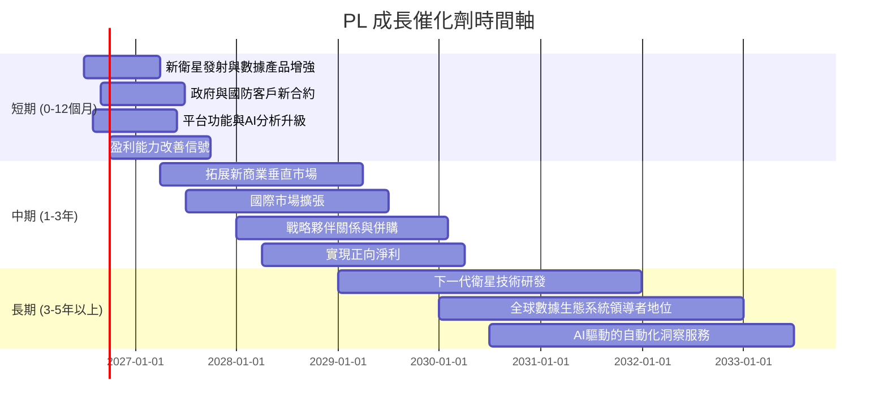

### 8.2 TAM 市場規模分析

地理空間情報 (Geospatial Intelligence, GEOINT) 市場是一個龐大且快速增長的市場，Planet Labs 在其中具有顯著的增長潛力。

```
╔══════════════════════════════════════════════════════════════════╗
║                    PL TAM 市場規模分析                           ║
╠══════════════════════════════════════════════════════════════════╣
║                                                                  ║
║  全球地理空間數據市場 TAM (2025E): $XXXB  ███████████████████████████████████████████  ║
║  ├── 衛星影像市場 TAM (2025E):     $X.XB  ███████████████████████░░░░░░░░░░░░░░░  ║
║  ├── 商業應用市場 (農業、能源等):  $X.XB  ████████████████████████████████████░░░  ║
║  ├── 政府與國防市場:               $X.XB  █████████████████████████████████████████  ║
║                                                                  ║
║  PL TTM 營收: $335.61M                                           ║
║  當前市場滲透率 (衛星影像市場): 約 X% (低)                      ║
║  當前市場滲透率 (總TAM): 約 X% (極低)                           ║
║                                                                  ║
║  📊 結論：PL 在龐大的 TAM 中仍有巨大滲透空間，成長潛力巨大。      ║
╚══════════════════════════════════════════════════════════════════╝
```
**TAM 市場規模分析 (估計值)：**
*   **全球地理空間數據市場 (Global Geospatial Data Market)**：預計到 2025 年將達到約 $300B (估計值)，並以約 15% 的 CAGR 增長。
*   **衛星影像市場**：作為地理空間數據的重要組成部分，預計到 2025 年將達到約 $10B-$15B (估計值)。
*   **商業應用市場**：農業、能源、地產、保險、物流等垂直行業對地理空間數據的需求日益增長，估計市場規模約為數十億美元。
*   **政府與國防市場**：情報、監測、災害應變等領域對高頻次衛星影像的需求持續旺盛，是 Planet Labs 的重要客戶來源，估計市場規模約為數十億美元。

**結論**：Planet Labs 的 TTM 營收 $335.61M 在數百億美元的總體市場中僅佔據極小的份額，表明其仍有巨大的成長空間。隨著各行各業對數據驅動決策的需求增加，以及衛星影像數據的應用場景不斷拓展，PL 的市場滲透率有望大幅提升。

### 8.3 成長驅動力結構圖

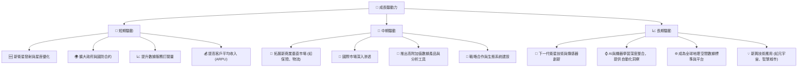
**成長驅動力分析：**
*   **短期驅動 (0-12個月)**：
    *   **新衛星發射與星座優化**：持續發射新一代衛星，提升數據質量、覆蓋範圍和重訪率。
    *   **擴大政府與國防合約**：政府客戶對及時、全面情報的需求持續增長，是穩定的高價值收入來源。
    *   **提升數據服務訂閱量**：通過有效的銷售和市場策略，吸引更多新客戶訂閱其數據服務。
    *   **提高客戶平均收入 (ARPU)**：通過提供更多高級功能、定制化解決方案或更高解析度數據，提升現有客戶的消費。
*   **中期驅動 (1-3年)**：
    *   **拓展新商業垂直市場**：將其數據服務應用於農業、能源、地產之外的新興行業，如保險、物流、基礎設施監測等。
    *   **國際市場深入滲透**：除了美國市場，積極拓展歐洲、亞洲等國際市場，獲取更多全球客戶。
    *   **推出高附加值數據產品與分析工具**：從原始影像數據向深度分析、預測模型轉變，提供更具價值的解決方案。
    *   **戰略合作與生態系統建設**：與雲服務提供商、AI 分析公司、硬體廠商等建立合作夥伴關係，擴大其數據生態系統。
*   **長期驅動 (3-5年以上)**：
    *   **下一代衛星技術與傳感器創新**：持續研發更先進的衛星技術，如更高解析度、多光譜/超光譜傳感器，以保持技術領先。
    *   **AI 與機器學習深度整合**：利用 AI 和機器學習技術實現數據的自動化分析和洞察提取，減少人工干預，提高效率和價值。
    *   **成為全球地理空間數據標準與平台**：通過其數據的廣度和深度，成為行業標準的制定者和數據交換的核心平台。
    *   **新興技術應用**：探索其數據在元宇宙、智慧城市、自動駕駛等新興技術領域的潛在應用。

---

## 9. 風險矩陣

Planet Labs 作為一家高成長、高科技公司，面臨著多方面的風險，包括競爭、技術、執行和財務風險。

### 9.1 風險評分矩陣

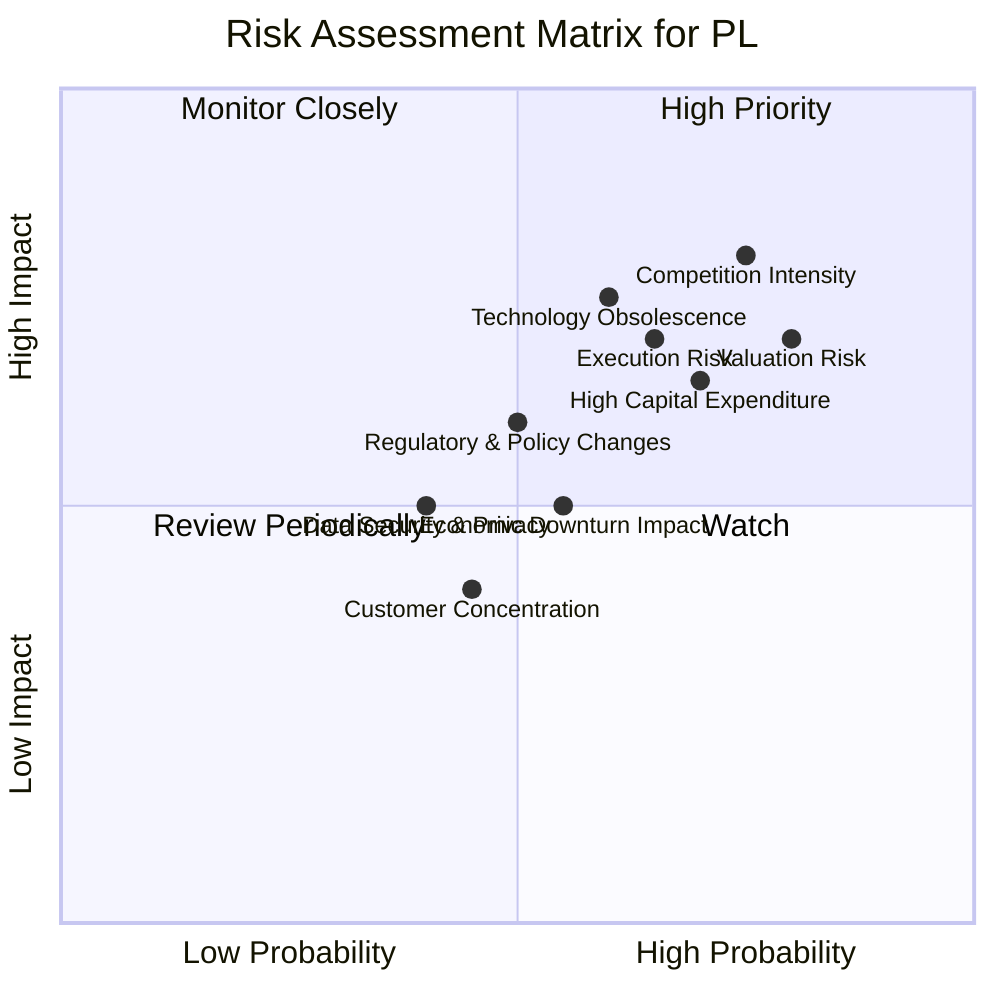

### 9.2 風險清單詳細分析

| # | 風險項目 | 發生機率 | 財務衝擊 | 風險評分 | 緩解措施 |
|---|--------------------|----------|----------|----------|----------|
| 1 | 🔴 **激烈競爭** | 高 (75%) | 高 (-20%收入成長) | 🔴 8.0/10 | 持續創新、擴大衛星星座、提供獨特數據產品、深化客戶關係、提升平台附加值。 |
| 2 | 🔴 **技術過時與創新不足** | 中高 (60%) | 高 (-15%收入成長) | 🔴 7.5/10 | 大力投入研發 (FY26 R&D $106.75M)、保持技術領先地位、探索新傳感器和數據分析方法、與學術界和科研機構合作。 |
| 3 | 🟡 **高資本支出與資金壓力** | 高 (70%) | 中高 (-10%FCF) | 🟡 7.0/10 | 精準規劃衛星發射和基礎設施投資、優化供應鏈、尋求多元化融資渠道 (如戰略投資者、政府資助)、提升營運現金流。 |
| 4 | 🟡 **盈利能力遲遲未能實現** | 中高 (65%) | 高 (-25%股價) | 🟡 7.0/10 | 嚴格控制營運費用 (SG&A佔比過高)、提升規模效應、優化產品組合以提高利潤率、將非營業損益常態化。 |
| 5 | 🟡 **估值過高風險** | 高 (80%) | 高 (-30%股價) | 🟡 7.0/10 | 透過超預期的營收成長和盈利改善來支撐估值、與市場進行有效溝通、避免過度炒作。 |
| 6 | 🟡 **數據安全與隱私問題** | 中 (40%) | 中 (-5%收入) | 🟡 5.0/10 | 建立嚴格的數據加密和存取控制系統、遵守國際數據隱私法規、定期進行安全審計、提升客戶信任。 |
| 7 | 🟡 **宏觀經濟下行影響** | 中 (55%) | 中 (-10%收入成長) | 🟡 5.5/10 | 多元化客戶群體、拓展政府和國防等相對穩定的客戶、提供高性價比的數據服務、提升產品的不可替代性。 |
| 8 | 🟢 **客戶集中度風險** | 中低 (45%) | 低 (-5%收入) | 🟢 4.0/10 | 積極拓展新客戶、分散收入來源、提供差異化服務以降低對單一或少數大客戶的依賴。 |

**風險分析：**
*   **高優先級風險 (High Priority)**：激烈的市場競爭、技術過時風險以及當前估值過高，是 Planet Labs 面臨的最主要挑戰。這些風險可能直接影響其市場份額、成長速度和投資回報。
*   **中優先級風險 (Monitor Closely)**：高資本支出、盈利能力遲遲未能實現和執行風險也需要密切關注。雖然公司現金流有所改善，但持續的虧損和資本需求可能帶來資金壓力。
*   **低優先級風險 (Review Periodically / Watch)**：數據安全與隱私、宏觀經濟下行和客戶集中度風險相對較低，但仍需定期審視。

**總結**：Planet Labs 必須在保持技術領先和市場拓展的同時，有效管理成本，加速實現規模化盈利，才能減輕這些風險並支撐其高估值。

---

## 10. 投資建議

綜合以上分析，Planet Labs 是一家具備巨大成長潛力但伴隨高風險的科技公司。其在衛星影像和地理空間數據領域的獨特地位、高速營收成長和自由現金流的轉正，是其主要吸引力。然而，持續的虧損、高昂的營運成本和偏高的估值，要求投資者具備較高的風險承受能力和長線視角。

### 10.1 最終綜合評級雷達圖

```
╔══════════════════════════════════════════════════════════════════╗
║                    PL 綜合評級雷達圖 (1-10分)                   ║
╠══════════════════════════════════════════════════════════════════╣
║ 基本面強度    7.0 ▓▓▓▓▓▓▓▓▓▓▓▓▓▓░░░░░░                             ║
║ 成長動能      8.0 ▓▓▓▓▓▓▓▓▓▓▓▓▓▓▓▓░░░░                             ║
║ 獲利品質      4.0 ▓▓▓▓▓▓▓▓░░░░░░░░░░░░                             ║
║ 財務健康      7.0 ▓▓▓▓▓▓▓▓▓▓▓▓▓▓░░░░░░                             ║
║ 估值合理性    6.0 ▓▓▓▓▓▓▓▓▓▓▓▓░░░░░░░░                             ║
║ 護城河深度    7.5 ▓▓▓▓▓▓▓▓▓▓▓▓▓▓▓░░░░░                             ║
║ 管理層執行    7.0 ▓▓▓▓▓▓▓▓▓▓▓▓▓▓░░░░░░                             ║
║ 技術創新力    8.5 ▓▓▓▓▓▓▓▓▓▓▓▓▓▓▓▓▓░░░                             ║
╠══════════════════════════════════════════════════════════════════╣
║ 綜合總分      6.8 ▓▓▓▓▓▓▓▓▓▓▓▓▓▓░░░░░░  評級：買入                 ║
╚══════════════════════════════════════════════════════════════════╝
```

### 10.2 目標價與隱含報酬率

| 情境 | 機率權重 | 目標價 | 隱含報酬率 (對比 $30.95) |
|------|----------|--------|--------------------------|
| 🟢 **樂觀情境** | 30%      | $48.00 | +55.1%                   |
| 🟡 **基準情境** | 50%      | $42.00 | +35.7%                   |
| 🔴 **悲觀情境** | 20%      | $36.00 | +16.3%                   |
| **加權平均目標價** | **100%** | **$41.40** | **+33.7%**               |

**分析：** 基於 DCF 敏感性分析和各情境的機率權重，加權平均目標價為 $41.40。這表明當前股價 $30.95 具備約 33.7% 的潛在上漲空間。

### 10.3 買入時機與觸發因素

```
╔══════════════════════════════════════════════════════════════════╗
║                  ✅ 買入觸發因素 Checklist                      ║
╠══════════════════════════════════════════════════════════════════╣
║                                                                  ║
║  立即買入觸發條件（多數符合）：                                  ║
║  ✅ 股價回調至 $30-$35 區間，提供更佳安全邊際                   ║
║  ✅ 季度營收 YoY 成長率維持在 40% 以上，並有加速趨勢             ║
║  ✅ 自由現金流持續為正且規模擴大，或營業現金流顯著改善           ║
║  ✅ 獲得重大政府或大型商業客戶訂單，證明市場需求強勁             ║
║                                                                  ║
║  加碼觸發條件（出現以下任一）：                                  ║
║  ☐ 營運費用佔營收比例開始顯著下降，盈利能力改善超出預期          ║
║  ☐ 推出顛覆性新數據產品或服務，進一步擴大護城河                  ║
║  ☐ 成功進入新的大型國際市場或垂直行業，帶來顯著營收增量          ║
║  ☐ 成功完成戰略性併購，鞏固市場地位或獲取關鍵技術                ║
║                                                                  ║
║  減碼/停損觸發條件（出現以下任一）：                             ║
║  ☐ 營收成長顯著放緩至 20% 以下，且無明顯改善跡象                 ║
║  ☐ 競爭格局惡化，市場份額被侵蝕，毛利率持續下降                  ║
║  ☐ 自由現金流轉負，且燒錢速度加快，現金儲備迅速減少              ║
║  ☐ 關鍵技術出現重大問題或被競爭對手超越                          ║
╚══════════════════════════════════════════════════════════════════╝
```

### 10.4 投資人適配度分析

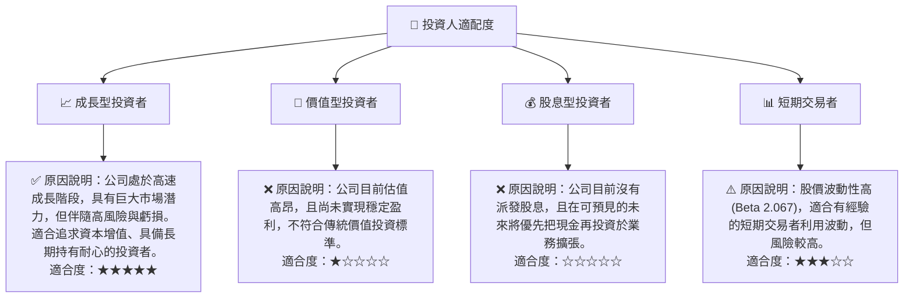

### 10.5 關鍵監控指標

| 監控類型 | 指標 | 關注點 | 頻率 |
|----------|----------|----------|----------|
| **營收成長** | 季度營收 YoY 成長率 | 是否維持 40% 以上成長，並觀察加速或放緩趨勢 | 每季 |
| **盈利能力** | 毛利率、營業利益率、淨利率 | 毛利率是否穩定或提升，營業虧損是否持續收窄，淨利率是否轉正 | 每季 |
| **現金流量** | 營業現金流、自由現金流 | 兩者是否持續為正且規模擴大，以證明自我造血能力 | 每季 |
| **資本效率** | ROIC vs WACC | ROIC 改善趨勢，是否能逐漸收窄與 WACC 的差距 | 每年 |
| **估值指標** | P/S Ratio、EV/Revenue | 觀察其相較於成長率和盈利改善的合理性，以及與同業的相對位置 | 每季/每月 |
| **客戶指標** | 訂閱客戶數、ARPU、客戶留存率 | 判斷市場拓展和客戶黏著度 | 每季 |
| **技術進展** | 衛星發射進度、新產品發布、AI 分析能力 | 確保公司維持技術領先和產品創新 | 不定期 |
| **市場競爭** | 主要競爭對手動態、新進入者、定價策略 | 評估競爭壓力與市場格局變化 | 每季 |

---

> **免責聲明**：本報告為 AI 自動生成，僅供研究參考，不構成投資建議。投資有風險，入市需謹慎。