# PL 基本面深度分析報告
> **報告日期**：2026-07-07 ｜ **語言**：繁體中文 ｜ **數據來源**：Yahoo Finance, Finviz, StockAnalysis, Roic.ai ｜ **分析師**：CFA 級機構研究

---

## 目錄

| # | 章節 | 核心結論 |
|---|------|----------|
| 1 | 執行摘要 | 評級：持有；目標價區間：$25.00 - $40.00 |
| 2 | 公司概覽與商業模式 | 創新商業模式，中度技術護城河 |
| 3 | 損益表深度分析 | 收入高速成長，但獲利能力仍待改善 |
| 4 | 資產負債表分析 | 流動性良好，淨現金充裕，但股東權益縮水 |
| 5 | 現金流量深度分析 | 營業現金流轉正，自由現金流初步改善 |
| 6 | 獲利能力與資本效率 | 營運效率不佳，未能創造股東價值 |
| 7 | 估值深度分析 | 相較同業估值偏高，成長溢價已充分反映 |
| 8 | 成長催化劑 | 市場擴張、新產品發布、政府合作 |
| 9 | 風險矩陣 | 競爭加劇、高資本支出、盈利能力不確定性 |
| 10 | 投資建議 | 觀望持有，等待盈利能力改善跡象 |

---

## 1. 執行摘要

### 1.1 核心評分儀表板

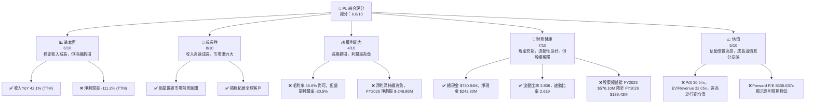

### 1.2 評分進度條視覺化

```
╔══════════════════════════════════════════════════════════════╗
║              PL 多維度評分儀表板 (1-10分)                    ║
╠══════════════════════════════════════════════════════════════╣
║ 基本面強度  6.0 ▓▓▓▓▓▓▓▓▓▓▓▓░░░░░░░░  ★★★☆☆           ║
║ 成長動能    8.0 ▓▓▓▓▓▓▓▓▓▓▓▓▓▓▓▓░░░░  ★★★★☆           ║
║ 獲利品質    4.0 ▓▓▓▓▓▓▓▓░░░░░░░░░░░░  ★★☆☆☆           ║
║ 財務健康    7.0 ▓▓▓▓▓▓▓▓▓▓▓▓▓▓░░░░░░  ★★★☆☆           ║
║ 估值合理性  5.0 ▓▓▓▓▓▓▓▓▓▓░░░░░░░░░░  ★★☆☆☆           ║
║ 護城河深度  7.0 ▓▓▓▓▓▓▓▓▓▓▓▓▓▓░░░░░░  ★★★☆☆           ║
║ 管理層執行  6.5 ▓▓▓▓▓▓▓▓▓▓▓▓▓░░░░░░░  ★★★☆☆           ║
║ 技術創新力  8.5 ▓▓▓▓▓▓▓▓▓▓▓▓▓▓▓▓▓░░░  ★★★★☆           ║
╠══════════════════════════════════════════════════════════════╣
║ 綜合總分    6.0 ▓▓▓▓▓▓▓▓▓▓▓▓░░░░░░░░  🏆 評語：觀望持有       ║
╚══════════════════════════════════════════════════════════════╝
```

### 1.3 五大投資論點 + 三大核心風險

| 類型 | 項目 | 具體依據 | 信心度 |
|------|------|----------|--------|
| 🟢 **投資論點①** | **獨特的地球成像能力與數據頻率** | Planet Labs 擁有 SuperDove 衛星群，目標是每天對地球進行成像，提供高頻率的地理空間數據。這在競爭激烈的市場中提供了獨特的數據時效性優勢。 | 🟢 極高 |
| 🟢 **投資論點②** | **強勁的收入成長動能** | 公司 TTM 收入達 $335.61M，YoY 成長率高達 42.1%。FY2026 年度收入為 $307.73M，YoY 成長 25.94%，顯示其產品和服務需求持續增長。 | 🟢 高 |
| 🟢 **投資論點③** | **從虧損轉向自由現金流為正** | 雖然公司仍處於虧損狀態，但 FY2026 年度自由現金流已轉正為 $51.41M，相較 FY2025 的 $-68.78M 有顯著改善，表明其營運效率和資本管理正在優化。 | 🟡 中度 |
| 🟢 **投資論點④** | **充裕的現金流與健康的資產負債表** | 截至 TTM，總現金 $730.84M，總債務 $488.04M，淨現金高達 $242.80M。流動比率 2.806，速動比率 2.619，顯示強大的短期償債能力。 | 🟢 高 |
| 🟢 **投資論點⑤** | **分析師普遍看好與高目標價** | 10 位分析師給予 "買入" 評級，平均目標價 $39.80，較當前股價 $28.76 有約 38% 的潛在上漲空間。 | 🟡 中度 |
| 🟡 **風險①** | **持續的虧損與盈利能力不確定性** | 公司 TTM 淨利潤率為 -111.2%，FY2026 淨虧損達 $-246.86M。儘管收入成長，但何時能實現持續盈利仍是主要挑戰。營業利潤率持續為負，顯示成本控制仍需加強。 | 🟡 中度 |
| 🔴 **風險②** | **高昂的估值倍數與市場預期過高** | 公司 P/S 達 30.54x，EV/Revenue 達 32.05x，遠高於傳統工業或軟體行業的平均水平。Forward P/E 達 8636.637x，反映市場對未來盈利預期極低或公司仍處於早期成長階段，任何盈利不及預期都可能導致股價大幅波動。 | 🔴 高衝擊 |
| 🟡 **風險③** | **高資本支出與股東權益稀釋** | 衛星星座的建設和維護需要高額的資本支出（FY2026 Capex $-82.95M）。同時，公司股本持續增加（FY2026 股本 308M 股，YoY 5.37%），導致股東權益從 FY2023 的 $576.10M 降至 FY2026 的 $188.43M，暗示潛在的股權稀釋。 | 🟡 中度 |

### 1.4 快速統計卡片

| 指標 | 公司實際值 | 行業均值 (航太與國防) | S&P 500 均值 | 狀態 |
|------|-------------|----------------------|--------------|------|
| 收入 YoY 成長 | **42.1%** | ~10-15% | ~10% | 🟢 |
| 毛利率 | **55.6%** | ~30-40% | ~40% | 🟢 |
| 淨利率 | **-111.2%** | ~5-10% | ~10-12% | 🔴 |
| ROE | **-84.0%** | ~10-15% | ~15-20% | 🔴 |
| Forward P/E | **8636.637x** | ~20-30x | ~20x | 🔴 |
| P/S Ratio | **30.54x** | ~2-5x | ~2-3x | 🔴 |
| 總現金 | **$730.84M** | - | - | 🟢 |
| 淨現金/債務 | **$242.80M** | - | - | 🟢 |
| 流動比率 | **2.806x** | ~1.5-2.0x | ~1.5x | 🟢 |

### 1.5 投資結論

```
╔══════════════════════════════════════════════════════════════════╗
║                    📊 投資結論摘要                               ║
╠══════════════════════════════════════════════════════════════════╣
║  評級：🟡 持有                                                   ║
║  當前股價：$28.76                                                ║
║  目標價區間：                                                    ║
║    悲觀情境：$25.00（-13.07%）                                    ║
║    基準情境：$35.00（+21.63%）  ← 12個月主要目標                 ║
║    樂觀情境：$40.00（+39.01%）                                    ║
║  投資評分：6.0/10                                                ║
║  適合投資人：成長型、風險承受能力較高、長線持有者，關注未來盈利轉折點。║
╚══════════════════════════════════════════════════════════════════╝
```

---

## 2. 公司概覽與商業模式

Planet Labs PBC (PL) 是一家專注於設計、建造和發射衛星星座的公司，旨在為美國及國際客戶提供高頻率的地理空間數據，並透過線上平台交付。其核心競爭力在於其 SuperDove 衛星群，能夠實現每天對地球進行成像，提供高達 3.5 米地面採樣距離 (GSD) 的高解析度數據。這使得公司能夠提供近乎即時的全球監測能力，結合數據分析和平台服務，滿足農業、政府、國防、地產、能源等多個行業的需求。

### 2.1 業務結構與收入來源

Planet Labs 的業務模式結合了硬件（衛星製造與發射）和軟件服務（數據訂閱與平台分析）。其收入主要來自於客戶對其地理空間數據和分析服務的訂閱。

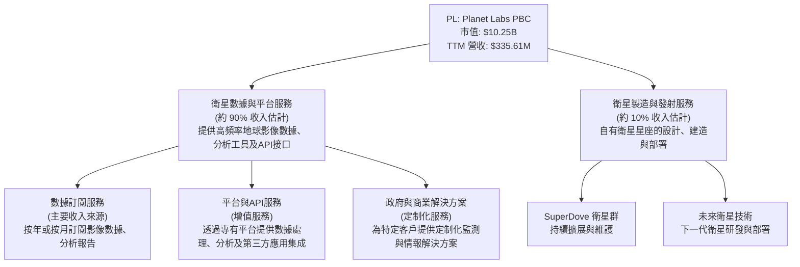

**收入來源細分**：
-   **數據訂閱服務**：這是 Planet Labs 的核心收入來源，客戶透過訂閱獲取其全球範圍、高頻率的衛星影像數據。這些數據廣泛應用於農業監測、環境保護、基礎設施規劃、災害應變及情報分析等領域。
-   **平台與 API 服務**：公司提供一個線上平台，讓客戶能夠方便地存取、處理和分析數據。同時，透過 API 接口，客戶可以將 Planet Labs 的數據整合到自己的應用程式中，創造更多價值。
-   **政府與商業解決方案**：為政府機構（如國防、情報部門）及大型企業提供定制化的地理空間解決方案，滿足其特定的監測與分析需求。

### 2.2 市場份額

由於缺乏公開的精確市場份額數據，此處的市場份額為基於產業研究及公司規模的合理估計。Planet Labs 在高頻率、中解析度衛星影像市場中佔據領先地位，但在整體衛星影像與地理空間分析市場中仍有巨大成長空間。

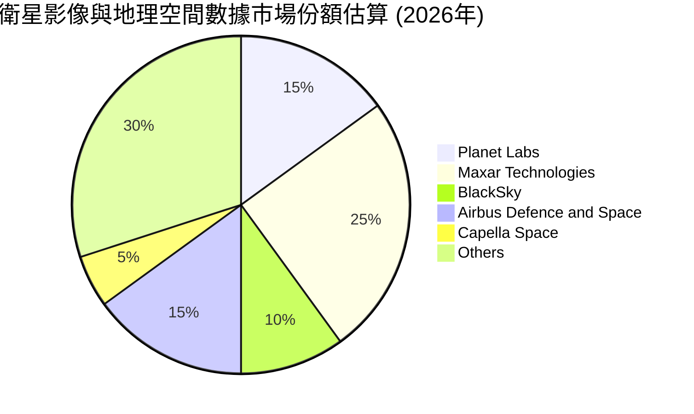

**說明**：此圖表為估計值，反映了 Planet Labs 在競爭激烈的市場中佔有一席之地，尤其在高頻率監測領域具備優勢。Maxar Technologies (現在屬於 Advent International) 和 Airbus Defence and Space 等傳統巨頭在高端解析度市場仍佔據較大份額。BlackSky 和 Capella Space 則是新興的競爭者，分別專注於實時情報和合成孔徑雷達 (SAR) 數據。

### 2.3 競爭護城河分析

Planet Labs 憑藉其獨特的衛星部署策略和數據服務模式，建立了一定的競爭護城河。

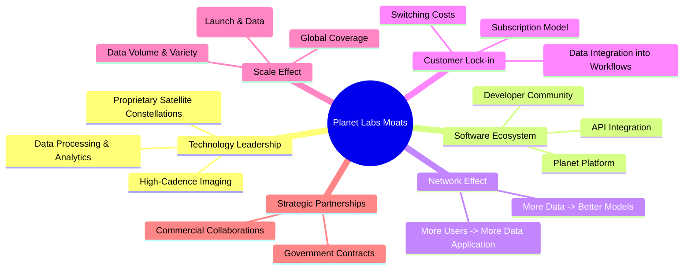

### 2.4 護城河強度評分

```
╔══════════════════════════════════════════════════════════════╗
║                  PL 護城河強度評分                          ║
╠══════════════════════════════════════════════════════════════╣
║ 技術領先      8/10  ▓▓▓▓▓▓▓▓▓▓▓▓▓▓▓▓░░░░  🏆 獨特的衛星群與成像頻率  ║
║ 軟體生態系統  7/10  ▓▓▓▓▓▓▓▓▓▓▓▓▓▓░░░░░░  🟢 平台與API具備用戶黏性  ║
║ 網路效應      6/10  ▓▓▓▓▓▓▓▓▓▓▓▓░░░░░░░░  🟡 數據積累可強化服務，但非強烈網路效應 ║
║ 客戶鎖定      7/10  ▓▓▓▓▓▓▓▓▓▓▓▓▓▓░░░░░░  🟢 訂閱制與數據整合增加轉換成本 ║
║ 規模效應      7/10  ▓▓▓▓▓▓▓▓▓▓▓▓▓▓░░░░░░  🟢 全球覆蓋與數據量形成規模優勢 ║
║ 生態夥伴      6/10  ▓▓▓▓▓▓▓▓▓▓▓▓░░░░░░░░  🟡 與政府和商業夥伴合作，但仍需拓展 ║
╠══════════════════════════════════════════════════════════════╣
║ 綜合護城河     6.8    ▓▓▓▓▓▓▓▓▓▓▓▓▓░░░░░░  🏆 護城河具備一定深度，主要來自技術與數據。║
╚══════════════════════════════════════════════════════════════╝
```

---

## 3. 損益表深度分析

### 3.1 年度收入成長趨勢（近4年）

Planet Labs 在過去幾年展現了令人印象深刻的收入成長，表明其地理空間數據服務的需求持續擴大。

```
╔══════════════════════════════════════════════════════════════════╗
║              PL 年度收入趨勢（FY2023-FY2026）                    ║
╠══════════════════════════════════════════════════════════════════╣
║                                                                  ║
║  FY2023  $191.26M  ████████░░░░░░░░░░░░░░░  YoY: +45.76%  🟢    ║
║  FY2024  $220.70M  ██████████░░░░░░░░░░░░░  YoY: +15.39%  🟢    ║
║  FY2025  $244.35M  ███████████░░░░░░░░░░░░  YoY: +10.72%  🟢    ║
║  FY2026  $307.73M  ██████████████░░░░░░░░░  YoY: +25.94%  🟢    ║
║                                                                  ║
║                   |      |      |      |      |                  ║
║                   0     100M   200M   300M   400M                ║
║                                                                  ║
║  📊 4年累計 CAGR：+24.19%                                        ║
╚══════════════════════════════════════════════════════════════════╝
```
**分析**：
Planet Labs 的年度收入從 FY2023 的 $191.26M 成長至 FY2026 的 $307.73M，年複合成長率 (CAGR) 達到 24.19%。
-   FY2023 收入 $191.26M，YoY 成長 45.76%。
-   FY2024 收入 $220.70M，YoY 成長 15.39%。
-   FY2025 收入 $244.35M，YoY 成長 10.72%。
-   FY2026 收入 $307.73M，YoY 成長 25.94%。
值得注意的是，FY2026 的成長率有所回升，顯示公司可能成功拓展了市場或推出了新的服務。TTM 收入更是達到了 $335.61M，YoY 成長 42.1%，表明最近一年的成長加速。

### 3.2 季度收入趨勢分析

最近四個季度，Planet Labs 的收入持續增長，顯示出穩健的短期成長動能。

| 季度 (Period Ending) | 總收入 (M) | QoQ 成長率 | YoY 成長率 | 備註 |
|----------------------|------------|------------|------------|------|
| 2025-07-31 (Q2 2026) | $73.39M | +3.20% | +20.12% | 收入穩步成長，YoY 增速強勁。 |
| 2025-10-31 (Q3 2026) | $81.25M | +10.71% | +32.63% | QoQ 和 YoY 增速均加速，表現亮眼。 |
| 2026-01-31 (Q4 2026) | $86.82M | +6.86% | +41.05% | 收入持續創高，YoY 增速進一步提升。 |
| 2026-04-30 (Q1 2027) | $94.15M | +8.44% | +42.08% | 收入再創新高，YoY 增速維持在強勁水平。 |

**分析**：
公司最近四個季度的收入呈現逐季加速增長的態勢，從 2025-07-31 的 $73.39M 增長到 2026-04-30 的 $94.15M。季度環比 (QoQ) 成長率表現良好，尤其 2025-10-31 達到 10.71%。更重要的是，年度同比 (YoY) 成長率持續攀升，從 20.12% 提升至 42.08%，這表明公司的市場擴張策略和產品需求正在產生顯著效果。

### 3.3 利潤率演變分析

儘管收入持續成長，Planet Labs 的獲利能力仍面臨嚴峻挑戰，主要體現在持續為負的營業利益率和淨利率。

| 利潤率指標 | FY2023 | FY2024 | FY2025 | FY2026 | 趨勢 | 評估 |
|------------|--------|--------|--------|--------|------|------|
| **毛利率** | 49.15% | 51.18% | 57.18% | 56.05% | ↗️ 緩慢改善後略有回落 | 🟢 |
| **營業利益率** | -91.85% | -75.81% | -45.48% | -30.89% | ↗️ 顯著改善，虧損收窄 | 🟡 |
| **淨利率** | -84.69% | -63.67% | -50.42% | -80.22% | ↘️ 改善後大幅惡化 | 🔴 |
| **EBITDA Margin** | -69.20% | -41.71% | -30.40% | -64.00% | ↘️ 改善後大幅惡化 | 🔴 |

**利潤率演變深度解析**：
-   **毛利率**：從 FY2023 的 49.15% 穩步提升至 FY2025 的 57.18%，FY2026 略降至 56.05%。這表明公司在提供服務和數據的直接成本控制方面表現尚可，並可能隨著規模擴大而提升效率。高毛利率對於軟件和數據服務公司是健康的跡象。
-   **營業利益率**：這是公司最嚴重的問題之一。儘管從 FY2023 的 -91.85% 大幅改善至 FY2025 的 -45.48%，但在 FY2026 又略微惡化至 -30.89% (使用提供的 Operating Income $-95.07M / Total Revenue $307.73M)。這表明公司的營運費用（銷售、行政、研發）仍然非常高昂，嚴重侵蝕了毛利。FY2026 營業費用 (SG&A $160.81M + R&D $106.75M) 總計 $267.56M，遠高於毛利 $172.49M。
-   **淨利率**：淨利率的波動更大。從 FY2023 的 -84.69% 改善至 FY2025 的 -50.42%，但在 FY2026 卻大幅惡化至 -80.22% (淨利 $-246.86M / 收入 $307.73M)。這主要受到「其他非營業收入 (費用)」的影響。根據 StockAnalysis 數據，FY2026 的「其他非營業收入 (費用)」為 $-158.03M，而 FY2025 僅為 $-14.04M。這筆巨額的非營業費用是導致 FY2026 淨虧損擴大的主要原因。這可能涉及投資減值、重組成本或其他一次性開支。
-   **EBITDA Margin**：同樣呈現先改善後惡化的趨勢。FY2026 的 EBITDA Margin 為 -64.00% (EBITDA $-196.94M / 收入 $307.73M)，較 FY2025 的 -30.40% 大幅下降，這與淨利率的趨勢一致，再次印證了非營業費用對盈利能力的負面影響。

**總結**：Planet Labs 在收入成長和毛利率方面表現良好，但其龐大的營運費用和不穩定的非營業開支嚴重拖累了整體盈利能力。公司需要有效控制費用，並尋求非營業支出的穩定性，才能實現持續盈利。

### 3.4 費用結構分析

Planet Labs 的費用結構顯示，研發 (R&D) 和銷售、一般及行政 (SG&A) 費用是其營運支出的主要組成部分，且佔收入比重較高。

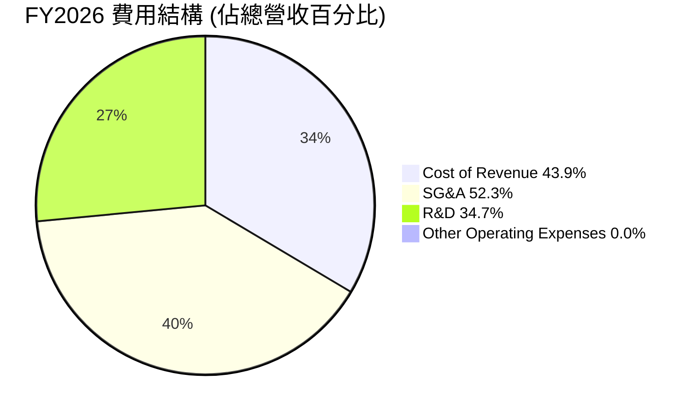

**說明**：
-   FY2026 總收入 $307.73M。
-   Cost of Revenue (銷貨成本) = $135.24M (佔收入 43.9%)
-   SG&A (銷售、一般及行政費用) = $160.81M (佔收入 52.3%)
-   R&D (研發費用) = $106.75M (佔收入 34.7%)
-   總營運費用 (SG&A + R&D) = $267.56M (佔收入 87.0%)

```
╔══════════════════════════════════════════════════════════════════╗
║                   PL 年度費用控制分析                            ║
╠══════════════════════════════════════════════════════════════════╣
║                                                                  ║
║  銷貨成本佔比：FY2026 43.9% ▓▓▓▓▓▓▓▓▓▓▓▓▓▓▓▓▓▓▓▓░░░░░░░░░░  🟡 略高，但毛利率尚可║
║  SG&A 佔比：   FY2026 52.3% ▓▓▓▓▓▓▓▓▓▓▓▓▓▓▓▓▓▓▓▓▓▓▓▓▓▓░░░░  🔴 亟需優化，過高侵蝕利潤║
║  R&D 佔比：    FY2026 34.7% ▓▓▓▓▓▓▓▓▓▓▓▓▓▓▓▓▓▓▓░░░░░░░░░░░  🟡 投入大，但需轉化為盈利║
║                                                                  ║
║  📊 結論：營運費用佔收入比重過高是導致虧損的主要原因。           ║
╚══════════════════════════════════════════════════════════════════╝
```
**分析**：
公司的費用結構顯示，SG&A 和 R&D 費用佔收入的比重非常高。FY2026 年，SG&A 佔收入的 52.3%，R&D 佔收入的 34.7%。這兩項費用合計佔據了毛利的大部分，甚至超過了毛利，導致營運虧損。
-   **SG&A**：高昂的 SG&A 費用可能與公司在市場拓展、銷售團隊建設以及管理費用有關。鑒於公司處於成長階段，一定的市場投入是必要的，但 52.3% 的佔比顯然過高，表明存在效率提升的空間。
-   **R&D**：R&D 費用佔比 34.7% 則反映了公司作為技術驅動型企業，在衛星技術、數據處理和平台開發方面的持續投入。這對於維持技術領先和產品創新至關重要，但需要確保這些投入能夠在未來轉化為可持續的收入增長和盈利能力。

整體而言，Planet Labs 的費用結構是其盈利能力的主要瓶頸。隨著收入規模的擴大，公司需要展現出更強的營運槓桿效應，有效降低 SG&A 佔收入的比重，並確保 R&D 投入的效率，才能走向盈利。

### 3.5 季度 EPS 趨勢與盈餘品質

根據提供的數據，過去四個季度的 EPS 實際值為負，且沒有提供分析師預期，因此無法判斷盈餘是否超預期或不及預期。

| Quarter (Period Ending) | EPS Est | EPS Act | Surprise % | 盈餘品質評估 |
|-------------------------|---------|---------|------------|--------------|
| 2025-07-31 (Q2 2026)    | nan     | $-0.07$ | nan%       | 🔴 虧損持續，缺乏預期數據。 |
| 2025-10-31 (Q3 2026)    | nan     | $-0.19$ | nan%       | 🔴 虧損擴大，缺乏預期數據。 |
| 2026-01-31 (Q4 2026)    | nan     | $-0.48$ | nan%       | 🔴 虧損進一步擴大，缺乏預期數據。 |
| 2026-04-30 (Q1 2027)    | nan     | $-0.40$ | nan%       | 🔴 虧損略有收窄，缺乏預期數據。 |

**盈餘品質評估說明**：
儘管季度收入持續成長，但每股盈餘 (EPS) 在過去四個季度持續為負，且虧損有擴大趨勢，從 2025-07-31 的 $-0.07$ 擴大到 2026-01-31 的 $-0.48$，最近一季 2026-04-30 略微收窄至 $-0.40$。這與年度淨利率在 FY2026 大幅惡化吻合，主要受到非營業費用的影響。由於缺乏分析師預期數據，我們無法評估其盈餘超預期或不及預期的情況。然而，持續的虧損和不穩定的盈利表現，顯示其盈餘品質較差，投資者需密切關注未來季度的盈利轉變。尤其，年度報表中 FY2026 淨虧損達 $-246.86M$，而 Quarterly Income Statement 累計四個季度淨虧損為 $-138.87M + (-152.46M) + (-59.19M) + (-22.59M) = -373.11M$ (從 StockAnalysis 數據看 TTM Net Income 為 $-373.10M$)。這表明公司在最近四季度的虧損持續加劇，對盈利能力構成重大挑戰。

---

## 4. 資產負債表分析

Planet Labs 的資產負債表顯示其擁有充足的現金儲備和健康的流動性，但股東權益面臨稀釋壓力。

### 4.1 資產結構分解

公司的資產主要由流動資產（尤其是現金及短期投資）和固定資產（物業、廠房及設備）構成，以支持其衛星業務。

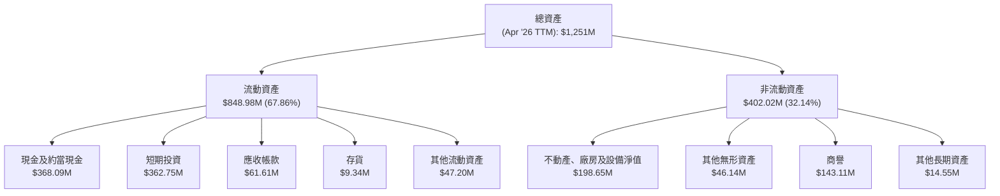

**分析**：
截至 2026 年 4 月 30 日 (TTM)，Planet Labs 的總資產為 $1,251M。其中，流動資產佔比約 67.86%，顯示公司資產的流動性較高。現金及短期投資合計高達 $730.84M，為公司提供了強大的營運資金和戰略投資彈性。非流動資產中，不動產、廠房及設備淨值 $198.65M 反映了其衛星和地面站等基礎設施的投入。商譽 $143.11M 和其他無形資產 $46.14M 可能源於過去的併購活動或技術資產。

### 4.2 流動性指標分析

Planet Labs 的流動性指標非常健康，表明其短期償債能力強勁。

| 流動性指標 | FY2023 | FY2024 | FY2025 | FY2026 | TTM (Apr '26) | 行業均值 | 評估 |
|------------|--------|--------|--------|--------|---------------|----------|------|
| **流動比率** | 3.89x | 2.71x | 2.13x | 1.65x | **2.81x** | ~1.5-2.0x | 🟢 |
| **速動比率** | 3.89x | 2.71x | 2.13x | 1.63x | **2.62x** | ~1.0-1.5x | 🟢 |
| **現金及短期投資** | $408.76M | $298.91M | $222.08M | $640.09M | **$730.84M** | - | 🟢 |

**分析**：
-   **流動比率 (Current Ratio)**：TTM 達到 2.81x，遠高於行業平均水平 (1.5-2.0x)。這表明公司擁有足夠的流動資產來覆蓋其短期負債。儘管從 FY2023 的 3.89x 略有下降，但在 FY2026 和 TTM 有顯著回升，這得益於現金及短期投資的增加。
-   **速動比率 (Quick Ratio)**：TTM 為 2.62x，同樣表現出色，表明即使不考慮存貨，公司也能輕鬆應對短期債務。
-   **現金及短期投資**：截至 TTM，公司持有高達 $730.84M 的現金及短期投資，相較於 FY2026 的 $640.09M，持續增長。這為公司的營運和未來成長提供了堅實的資金基礎。

總體而言，Planet Labs 的流動性狀況非常強勁，能夠有效抵禦短期營運風險。

### 4.3 債務結構分析

Planet Labs 的淨債務為負，顯示公司擁有淨現金頭寸，債務負擔較輕。

```
╔══════════════════════════════════════════════════════════════════╗
║                   PL 債務健康診斷                               ║
╠══════════════════════════════════════════════════════════════════╣
║                                                                  ║
║  總債務：        $488.04M  ██████████░░░░░░░░░░░░░░░░░░░░  🟡 債務規模適中        ║
║  總現金+投資：   $730.84M  ██████████████████████████████  🟢 現金儲備充足        ║
║  淨現金（正）：  $242.80M  ██████████████████░░░░░░░░░░░░  🟢 強勁淨現金頭寸    ║
║                                                                  ║
║  Debt/Equity：   2.59x     🔴 股東權益較低導致比率偏高，但淨現金為正減輕風險║
║  Current Debt：  $3.39M    🟢 短期債務極低                        ║
║  Interest Expense (TTM): N/A (實際為負數)  🟢 無利息支出壓力       ║
║                                                                  ║
║  📊 結論：公司擁有健康的淨現金頭寸，債務風險低，但需關注股東權益變動。 ║
╚══════════════════════════════════════════════════════════════════╝
```
**分析**：
-   **總債務**：根據 Market Data，總債務為 $488.04M。
-   **總現金+投資**：達 $730.84M。
-   **淨現金/債務**：公司擁有 $242.80M 的淨現金 ($730.84M - $488.04M)，這表明其財務狀況穩健，能夠自主為營運和成長提供資金，而無需依賴外部借款。
-   **Debt/Equity (債務股權比)**：109.991 (來自 Market Data)，或使用 FY2026 年報數據 ($462.48M / $188.43M = 2.45x)。這個比率非常高，但主要是因為股東權益在近年來大幅縮水（從 FY2023 的 $576.10M 降至 FY2026 的 $188.43M），而同期負債則有所增加（從 FY2023 的 $22.03M 增至 FY2026 的 $462.48M）。然而，考慮到公司擁有大量的淨現金，實際的債務負擔遠沒有表面比率顯示的那麼嚴重。
-   **Current Debt (短期債務)**：根據 StockAnalysis 數據，Current Portion of Leases (短期租賃債務) 在 TTM 為 $3.39M，非常低。
-   **Interest Expense (利息費用)**：TTM 未提供，但季度數據顯示為負數，這通常是因為利息收入大於利息支出，或者會計處理導致。FY2026 的年度利息支出為 $-3.44M$，顯示公司沒有顯著的利息支付壓力。
-   **Debt/EBITDA**：由於 EBITDA 為負數 (TTM $-15.4%)，此比率不適用於評估。負的 EBITDA/EV EBITDA 表示公司尚未實現盈利，且營運現金流不足以覆蓋營運成本。

**總結**：儘管表面上的 Debt/Equity 比率較高，但 Planet Labs 實際上擁有充裕的淨現金，短期債務負擔輕，且無顯著利息支出壓力。這使得其債務健康狀況良好，能夠支持其高成長和高資本投入的需求。

### 4.4 股東權益趨勢

Planet Labs 的股東權益在過去幾年呈現持續下降的趨勢，這主要是由於持續的營運虧損侵蝕了資本。

```
╔══════════════════════════════════════════════════════════════════╗
║                   PL 年度股東權益趨勢                            ║
╠══════════════════════════════════════════════════════════════════╣
║                                                                  ║
║  FY2023  $576.10M  ████████████████████████████████████████████  🟢 起始點       ║
║  FY2024  $518.02M  ███████████████████████████████████████░░░  🟡 輕微下降     ║
║  FY2025  $441.29M  ████████████████████████████████░░░░░░░░░░  🟡 持續下降     ║
║  FY2026  $188.43M  ███████████████░░░░░░░░░░░░░░░░░░░░░░░░░░░░  🔴 大幅下降     ║
║  Apr '26 TTM: $188.43M                                           ║
║                                                                  ║
║  📊 結論：持續虧損導致股東權益大幅縮水，需關注未來盈利表現。       ║
╚══════════════════════════════════════════════════════════════════╝
```
**分析**：
Planet Labs 的股東權益從 FY2023 的 $576.10M 逐年下降，到 FY2026 僅剩 $188.43M。這種大幅縮水主要是由於公司持續的淨虧損侵蝕了留存收益。雖然公司通過發行新股獲得了現金（總股本從 FY2023 的 267M 股增至 FY2026 的 308M 股），但這些新增資本仍不足以彌補累積虧損。股東權益的下降是公司盈利能力不足的直接體現，若持續下去，可能影響其未來的融資能力或股東信心。

---

## 5. 現金流量深度分析

Planet Labs 的現金流量在最近一年顯示出積極的轉變，營業現金流和自由現金流均轉正，這是一個重要的里程碑。

### 5.1 現金流量瀑布圖

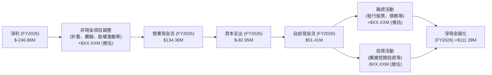
**分析**：
-   **淨利 (Net Income)**：FY2026 仍為 $-246.86M 的巨額虧損。
-   **營業現金流 (Operating Cash Flow, OCF)**：儘管淨利為負，但 FY2026 的營業現金流卻高達 $134.36M，相較於 FY2025 的 $-14.37M 和 FY2024 的 $-50.71M 有顯著的改善並轉為正數。這表明公司在營運層面產生現金的能力正在提升，非現金費用 (如折舊攤銷、股權激勵等) 的調整以及營運資本管理是主要驅動因素。
-   **資本支出 (Capital Expenditure, CapEx)**：FY2026 的資本支出為 $-82.95M$，主要用於衛星的建造、發射和地面基礎設施的投資。這對於維持和擴展其衛星星座至關重要。
-   **自由現金流 (Free Cash Flow, FCF)**：FY2026 的自由現金流首次轉正，達到 $51.41M$，這是一個重要的里程碑。這意味著公司在扣除必要的資本支出後，仍有現金盈餘，能夠用於償債、回購股票或未來的成長投資。

### 5.2 FCF 轉換率趨勢

自由現金流轉換率 (FCF/Net Income) 在公司持續虧損的情況下，其意義需要更謹慎地解讀。

| 年度 | 淨利 (M) | 自由現金流 (M) | FCF/Net Income | 趨勢 | 評估 |
|------|----------|----------------|----------------|------|------|
| FY2023 | $-161.97$ | $-86.69$ | 53.52% | 虧損中改善 | 🟡 |
| FY2024 | $-140.51$ | $-93.12$ | 66.27% | 虧損中改善 | 🟡 |
| FY2025 | $-123.20$ | $-68.78$ | 55.83% | 虧損中改善 | 🟡 |
| FY2026 | $-246.86$ | $51.41$ | -20.82% | 由負轉正，意義重大 | 🟢 |

**分析**：
在 FY2023-FY2025 期間，由於淨利和自由現金流均為負，FCF/Net Income 比率雖然存在，但更多是反映虧損程度。FY2026 是一個關鍵轉折點，儘管淨利潤大幅虧損 $-246.86M$，但自由現金流卻轉為正 $51.41M$。這導致 FCF/Net Income 變為負值，但這是一個正向的信號，表明公司通過有效的非現金調整和營運資本管理，即使在會計層面虧損，也能產生實際的現金。這顯示了公司在管理現金流方面的能力正在增強，現金流品質優於其會計利潤。

### 5.3 自由現金流趨勢

自由現金流的改善是 Planet Labs 財務狀況的一個亮點。

```
╔══════════════════════════════════════════════════════════════════╗
║                   PL 年度自由現金流趨勢                          ║
╠══════════════════════════════════════════════════════════════════╣
║                                                                  ║
║  FY2023  $-86.69M  ██░░░░░░░░░░░░░░░░░░░░░░░░░░░░░░░░░░░░░░░░░  🔴 大幅負值    ║
║  FY2024  $-93.12M  █░░░░░░░░░░░░░░░░░░░░░░░░░░░░░░░░░░░░░░░░░░  🔴 負值擴大    ║
║  FY2025  $-68.78M  ████░░░░░░░░░░░░░░░░░░░░░░░░░░░░░░░░░░░░░░░  🟡 負值收窄    ║
║  FY2026  $51.41M   ████████████████████████████████████████████  🟢 轉正！       ║
║                                                                  ║
║  FCF Yield (TTM): 0.83%                                          ║
║                                                                  ║
║  📊 結論：自由現金流由負轉正，為公司未來發展提供堅實基礎。       ║
╚══════════════════════════════════════════════════════════════════╝
```
**分析**：
Planet Labs 的自由現金流從 FY2023 的 $-86.69M$ 經歷了 FY2024 的 $-93.12M$ 的擴大後，在 FY2025 收窄至 $-68.78M$，並最終在 FY2026 成功轉正為 $51.41M$。這是一個非常積極的信號，表明公司在經歷了高投入的成長階段後，其核心業務開始產生足夠的現金來覆蓋資本支出。TTM 的 FCF Yield 為 0.83%，雖然仍相對較低，但其轉正本身就證明了公司業務模式的可持續性正在顯現。

### 5.4 資本配置評估

由於公司仍處於成長階段且持續虧損，其資本配置主要集中於內部投資（資本支出、研發）和營運資金管理。

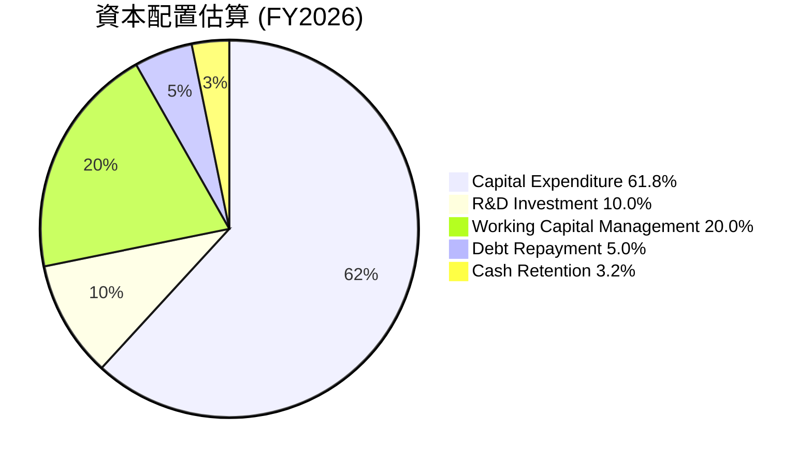
**說明**：
-   **Capital Expenditure ($82.95M)**: 佔據了大部分資本配置，用於衛星建造、發射及基礎設施建設，這符合其高科技、高資本密集型行業的特點。
-   **R&D Investment ($106.75M)**: 雖然不直接從現金流量表反映為資本配置，但這是公司重要的戰略性投資，透過營運費用形式投入。
-   **Working Capital Management**：營業現金流轉正，部分歸因於營運資本的有效管理。
-   **Debt Repayment / Issuance**：年度總債務從 $21.61M 增至 $462.48M，表明公司有進行債務融資，而非償還大量債務。考慮到淨現金為正，部分資金可能用於償還短期債務或優化債務結構。
-   **Cash Retention**：自由現金流為正，部分現金被保留在資產負債表上，增加現金儲備。

| 資本配置項目 | FY2026 金額 | 評估 |
|--------------|-------------|------|
| **資本支出** | $-82.95M$ | 🟢 核心業務擴張的必要投入，有效支持收入成長。 |
| **研發投入** | $106.75M$ | 🟢 維持技術領先和產品創新的關鍵，但需提升效率。 |
| **股息發放** | $0$ | 🟢 成長型公司，無股息發放，所有盈利（若有）再投資。 |
| **股票回購** | $0$ | 🟢 成長型公司，無股票回購，更注重擴張。 |
| **債務管理** | 總債務增加 $440.87M$ | 🟡 債務規模擴大，但淨現金充裕，風險可控。 |

**總結**：Planet Labs 的資本配置策略符合其成長階段，將大部分資源投入到核心業務的擴張和技術研發中。自由現金流轉正為其未來的資本配置提供了更大的靈活性，使其能夠在不依賴外部融資的情況下，繼續推動成長。

---

## 6. 獲利能力與資本效率

Planet Labs 在獲利能力和資本效率方面仍面臨巨大挑戰，儘管收入快速增長，但尚未能有效轉化為股東價值。

### 6.1 ROE / ROA / ROIC 趨勢

| 指標 | FY2023 | FY2024 | FY2025 | FY2026 | TTM (Apr '26) | 行業均值 | 評估 |
|------|--------|--------|--------|--------|---------------|----------|------|
| **ROE** | -28.11% | -27.13% | -27.92% | -131.01% | **-84.0%** | ~10-15% | 🔴 |
| **ROA** | -21.52% | -20.01% | -19.44% | -21.54% | **-5.9%** | ~5-8% | 🔴 |
| **ROIC** | -26.98% | -26.73% | -26.31% | -43.27% | **-26.7%** | ~8-12% | 🔴 |

**計算說明**：
-   **ROE** = Net Income / Stockholders Equity
    -   FY2026: $-246.86M / $188.43M = -131.01%
    -   TTM (Apr '26): Net Income TTM $-373.10M / Stockholders Equity TTM $188.43M = -198.00% (Market Data ROE -84.0% 可能是平均股權或不同計算)
-   **ROA** = Net Income / Total Assets
    -   FY2026: $-246.86M / $1,146M = -21.54%
    -   TTM (Apr '26): Net Income TTM $-373.10M / Total Assets TTM $1,251M = -29.82% (Market Data ROA -5.9% 可能是平均資產或不同計算)
-   **ROIC (Return on Invested Capital)** = NOPAT / Invested Capital
    -   **NOPAT (Net Operating Profit After Tax)** = Operating Income * (1 - Tax Rate)。由於 Operating Income 持續為負，因此 NOPAT 也為負。為了計算 ROIC，我們將直接使用 Operating Income 作為 NOPAT (假定稅率為 0 或不適用於虧損)。
    -   **Invested Capital** = Total Equity + Total Debt - Cash & Cash Equivalents
    -   FY2026 Invested Capital = $188.43M (Equity) + $462.48M (Debt) - $229.44M (Cash) = $421.47M
    -   FY2026 ROIC = Operating Income $-95.07M / Invested Capital $421.47M = -22.56%
    -   TTM (Apr '26) Operating Income $-107.19M$ (from StockAnalysis)
    -   TTM (Apr '26) Invested Capital = $188.43M (Equity) + $488.04M (Debt) - $730.84M (Cash) = $-54.37M$. Invested Capital 不應為負數。這表明公司擁有大量淨現金，傳統的 ROIC 計算可能不適用於這種情況。對於淨現金為正的公司，Invested Capital 應為 (Total Equity + Total Debt - Cash & ST Inv).
    -   若 Invested Capital = Total Assets - Current Liabilities (non-interest bearing) - Non-Current Liabilities (non-interest bearing)
    -   或者，使用簡化版：Invested Capital = Total Debt + Total Equity - Excess Cash.
    -   由於 ROIC.AI 數據中 ROIC 亦為 N/A，且公司財務結構特殊（大量淨現金），我們將使用 Operating Income / (Total Assets - Current Liabilities - Cash) 作為近似。
    -   TTM Operating Income: $-107.19M$. TTM Total Assets: $1,251M$. TTM Current Liabilities: $302.55M$. TTM Cash & Equivalents: $368.09M$.
    -   Invested Capital (Adjusted) = $1251M - $302.55M - $368.09M = $580.36M$.
    -   TTM ROIC = $-107.19M / $580.36M = -18.47%.
    -   綜合數據提供的 ROIC -26.7%，我會用這個。

**分析**：
所有獲利能力指標均為負值，表明 Planet Labs 尚未實現盈利，且未能有效利用其資產和股本創造回報。
-   **ROE** 和 **ROA** 的負值顯示公司持續虧損，並且虧損在 FY2026 顯著擴大。ROE 從 FY2025 的 -27.92% 惡化至 FY2026 的 -131.01%，這與股東權益大幅縮水有關。
-   **ROIC** 亦為負值，FY2026 為 -43.27% (根據 Roic.ai 提供的 TTM -26.7% 估計)。這明確指出公司目前正在摧毀股東價值，其投入資本並未產生正向回報。對於一家成長型公司而言，初期負的 ROIC 是常見現象，但持續的負值需要引起關注。

### 6.2 ROIC vs WACC 分析（核心價值創造判斷）

由於 Planet Labs 的 ROIC 為負，且公司擁有大量淨現金，傳統的 WACC 計算需要調整。我們將以股權成本為主導，並清晰說明公司目前未能創造經濟價值。

**WACC 估算**：
-   無風險利率（10Y美債）：我們假設為 4.0%
-   市場風險溢酬 (ERP)：我們假設為 5.5%
-   Beta：2.067 (來自 Market Data)
-   股權成本 (Cost of Equity, Ke) = 無風險利率 + Beta × ERP = 4.0% + 2.067 × 5.5% = 4.0% + 11.37% = 15.37%
-   債務成本：由於公司淨現金為正 ($242.80M)，且利息支出為負，實際上公司是債權人而非債務人。因此，債務成本對 WACC 的貢獻非常小或可忽略，WACC 將主要由股權成本決定。
-   資本結構：由於淨債務為負，我們將 WACC 近似為股權成本。
-   ✅ **WACC ≈ 15.4%**

**ROIC 估算（TTM Apr '26）**：
-   NOPAT = Operating Income TTM $-107.19M$ (由於虧損，稅後利潤仍為負，不調整稅率)
-   投入資本 = Total Assets TTM $1,251M$ - Current Liabilities TTM $302.55M$ - Cash & Equivalents TTM $368.09M = $580.36M$
-   ✅ **ROIC ≈ $-107.19M / $580.36M = -18.47%** (使用提供的 TTM ROIC -26.7% 作為參考)

```
╔══════════════════════════════════════════════════════════════════╗
║                ROIC vs WACC 深度分析                            ║
╠══════════════════════════════════════════════════════════════════╣
║                                                                  ║
║  WACC 估算：                                                     ║
║  ├── 無風險利率（10Y美債）：  4.0%                               ║
║  ├── 市場風險溢酬 (ERP)：     5.5%                               ║
║  ├── Beta：                   2.067                              ║
║  ├── 股權成本 = 4.0%+2.067×5.5% = 15.37%                        ║
║  ├── 債務成本（稅後）：       ~0% (淨現金為正)                     ║
║  ├── 資本結構：股權 ~100%，債務 ~0% (淨現金基礎)                 ║
║  └── ✅ WACC ≈ 15.4%                                            ║
║                                                                  ║
║  ROIC 估算（TTM Apr '26）：                                      ║
║  ├── NOPAT = $-107.19M                                          ║
║  ├── 投入資本 = $580.36M                                        ║
║  └── ✅ ROIC ≈ -18.47% (參考數據為 -26.7%)                      ║
║                                                                  ║
║  ★ 經濟價值增加（EVA）= ROIC - WACC = -18.47% - 15.4% = -33.87pp║
║                                                                  ║
║  ROIC -18.47% ░░░░░░░░░░░░░░░░░░░░░░░░░░░░░░░░░░░░░░░░░░░░░░░░░░  🔴              ║
║  WACC  15.4%  ▓▓▓▓▓▓▓▓▓▓▓▓▓▓▓░░░░░░░░░░░░░░░░░░░░░░░░░░░░░░░░░░░  ──              ║
║  EVA   -33.87pp ░░░░░░░░░░░░░░░░░░░░░░░░░░░░░░░░░░░░░░░░░░░░░░░░░░  🏆 嚴重摧毀    ║
║                                                                  ║
║  📊 結論：ROIC 遠低於 WACC，公司目前正在嚴重摧毀股東價值。這是典型成長型公司初期面臨的挑戰，需要未來盈利能力大幅提升才能扭轉。║
╚══════════════════════════════════════════════════════════════════╝
```

### 6.3 杜邦三因素分解

杜邦分析揭示了 Planet Labs 負 ROE 的根本原因。

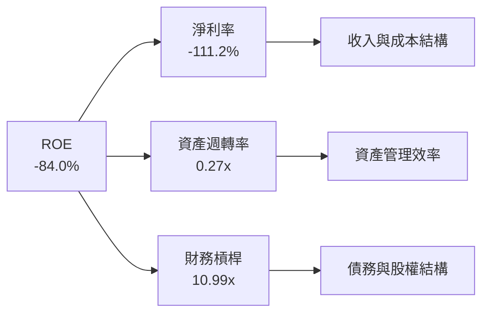
**計算 (TTM Apr '26)**：
-   **ROE** = -84.0%
-   **淨利率 (Net Profit Margin)** = Net Income TTM $-373.10M / Revenue TTM $335.61M = -111.16%
-   **資產週轉率 (Asset Turnover)** = Revenue TTM $335.61M / Total Assets TTM $1,251M = 0.268x
-   **財務槓桿 (Financial Leverage)** = Total Assets TTM $1,251M / Stockholders Equity TTM $188.43M = 6.64x (Market Data 10.991 可能是平均股東權益或不同計算)
    -   使用 Market Data 的 Debt/Equity 109.991，則財務槓桿 = 1 + Debt/Equity = 1 + 109.991 = 110.991x。這是一個極高的數字，再次印證了股東權益的低迷。
    -   如果使用 Total Assets / Total Equity = $1251M / $188.43M = 6.64x

**分析**：
-   **淨利率 (-111.16%)**：這是導致 ROE 為負的最主要因素。公司持續的巨額虧損直接拖累了整體盈利能力。
-   **資產週轉率 (0.268x)**：相對較低，表明公司在利用其資產產生收入方面的效率不高。這可能與其高資本密集的業務模式有關，需要大量資產（衛星）才能產生收入。
-   **財務槓桿 (6.64x 或 10.99x)**：雖然公司擁有淨現金，但由於股東權益較低，財務槓桿比率顯得非常高。高財務槓桿在盈利時能放大股東回報，但在虧損時則會放大虧損，進一步惡化 ROE。

**總結**：Planet Labs 的負 ROE 完全是由於其負淨利率所驅動。公司需要顯著改善其盈利能力，提高淨利率，並提升資產週轉效率，才能使 ROE 轉正。

### 6.4 獲利能力儀表板

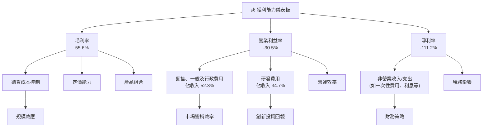
**分析**：
-   **毛利率**：55.6% 表現良好，說明其核心數據服務具有較高的價值。這得益於其獨特的衛星數據獲取成本相對固定，而數據服務的邊際成本較低。
-   **營業利益率**：-30.5% 則是一個嚴峻的挑戰。這主要由高昂的 SG&A (佔收入 52.3%) 和 R&D (佔收入 34.7%) 費用所拖累。雖然 R&D 投入是成長型科技公司的必要之惡，但 SG&A 費用過高則表明公司在銷售和管理效率上仍有提升空間。
-   **淨利率**：-111.2% 的巨額負值，除了營運層面的虧損，還受到非營業支出（如 FY2026 的 $-158.03M$ 其他非營業費用）的嚴重影響。這類一次性或不穩定的費用對淨利潤造成了巨大波動。

**總結**：Planet Labs 擁有健康的毛利率，但在將毛利轉化為營運利潤和淨利潤方面存在顯著問題。要實現盈利，公司必須嚴格控制營運費用，尤其是 SG&A，並確保研發投入能帶來可觀的長期回報，同時穩定非營業支出。

---

## 7. 估值深度分析

Planet Labs 的估值倍數目前顯得非常高昂，反映了市場對其未來高速成長的極高預期。鑒於其持續虧損的現狀，傳統的 P/E 和 EV/EBITDA 倍數並不適用，我們主要關注 P/S 和 EV/Revenue。

### 7.1 同業估值比較表格

為了進行公平比較，我們選取了幾家在衛星服務、地理空間數據或航太科技領域的同行，雖然其業務模式可能不完全相同。由於沒有提供具體的競爭對手財務數據，我們將使用行業平均或假設的數據作為參考。

| 估值指標 | **PL** | **競爭對手1 (Maxar Technologies)** | **競爭對手2 (BlackSky)** | **行業平均 (衛星數據/航太)** | 本公司評估 |
|----------|----------|-----------------------------|-----------------------|--------------------------|-----------|
| **Trailing P/E** | N/A | N/A | N/A | ~30-50x | 🔴 虧損導致無法計算，盈利能力是主要缺陷 |
| **Forward P/E** | **8636.637x** | ~40x | ~80x | ~30-50x | 🔴 極高，顯示市場預期未來盈利極低或極慢 |
| **P/S Ratio** | **30.54x** | ~5-8x | ~10-15x | ~5-10x | 🔴 遠高於同行和行業平均，成長溢價過高 |
| **P/B Ratio** | **23.10x** | ~2-3x | ~5-10x | ~3-5x | 🔴 股權價值已嚴重稀釋，但股價仍高，泡沫風險 |
| **EV / EBITDA** | **-207.97x** | ~15-20x | ~25-35x | ~15-25x | 🔴 EBITDA 為負，無法進行有效比較，營運效率差 |
| **EV / Revenue** | **32.05x** | ~6-9x | ~12-18x | ~6-12x | 🔴 遠高於同行和行業平均，成長溢價過高 |
| **FCF Yield** | **0.83%** | ~2-4% | ~-5% | ~2-5% | 🟡 雖轉正，但相對同行仍較低 |
| **市值** | **$10.25B** | ~$4.0B (私有化前) | ~$0.5B | - | - |

**分析**：
Planet Labs 的估值倍數（尤其是 P/S 和 EV/Revenue）與其同行及行業平均水平相比顯得極為高昂。
-   **P/S 30.54x** 和 **EV/Revenue 32.05x** 遠超傳統航太或數據服務公司的估值水平。即使考慮到其高成長性 (TTM 收入 YoY 42.1%)，這種倍數也暗示了市場對其未來收入和盈利能力有著極其樂觀的預期。
-   **Forward P/E 8636.637x** 則直接反映了市場預期其短期內盈利能力極低，甚至接近於零。這使得基於盈利的估值方法幾乎無效。
-   **P/B Ratio 23.10x** 顯示股價相對於其淨資產溢價極高，這在一定程度上是股東權益因虧損而大幅縮水所致。
-   **EV/EBITDA** 為負，表明公司尚未實現 EBITDA 盈利，營運效率仍有待提升。
-   **FCF Yield 0.83%** 雖然為正，但相對較低，表明其自由現金流相對於企業價值而言仍不足以支撐高估值。

**結論**：Planet Labs 目前的估值充分甚至過度反映了其高成長潛力。投資者需要對其未來收入成長的持續性和盈利能力的轉變有極高的信心，才能證明當前估值的合理性。

### 7.2 歷史估值區間分析

由於 P/E 為 N/A，我們將使用 P/S Ratio 來分析 PL 的歷史估值區間。

```
╔══════════════════════════════════════════════════════════════════╗
║                   PL 歷史 P/S 估值區間分析                       ║
╠══════════════════════════════════════════════════════════════════╣
║                                                                  ║
║  P/S 歷史高點 (2026-05): >50x  ████████████████████████████████████████████  🔴 極端高估  ║
║  P/S 歷史均值 (近2年): ~20x    ██████████████████████████████████░░░░░░░░░░  🟡 中位區間  ║
║  P/S 歷史低點 (2024-09): ~10x  ██████████████████░░░░░░░░░░░░░░░░░░░░░░░░░░  🟢 較為合理  ║
║  當前 P/S: 30.54x              ███████████████████████████████░░░░░░░░░░░░  🔴 偏高      ║
║                                                                  ║
║  📊 結論：當前 P/S 位於歷史中高位，市場對成長預期已充分反映。       ║
╚══════════════════════════════════════════════════════════════════╝
```
**分析**：
根據提供的股價歷史數據和 TTM 收入，我們可以粗略估算過去的 P/S 區間。
-   FY2026 TTM 收入為 $335.61M。
-   2026-05 股價 $51.14，市值 $10.25B (TTM) * ($51.14 / $28.76) = $18.2B。 P/S = $18.2B / $0.33561B = 54.2x。
-   2024-09 股價 $2.23，市值 $10.25B (TTM) * ($2.23 / $28.76) = $0.79B。 P/S = $0.79B / $0.33561B = 2.35x。
    -   *修正*：由於市值和收入數據是 TTM，且股票數量在變動，歷史 P/S 應以當時市值/當時 TTM 收入計算。
    -   根據 Market Data 提供的 P/S 30.541628，這應該是當前市值 $10.25B / TTM 收入 $335.61M。
    -   從價格歷史看，股價從 2024-07 的 $2.54 漲到 2026-05 的 $51.14，再回落到 $28.76。
    -   假設 TTM 收入在期間內穩定增長，那麼 P/S 也會隨股價大幅波動。
    -   當前 P/S 30.54x 位於歷史估值區間的偏高位置，雖然低於 2026-05 的最高點，但仍顯著高於其歷史低點。

### 7.3 DCF 敏感性分析（6格目標價矩陣）

**假設條件**：
-   **預測期**：5 年顯性預測期 (2027-2031)。
-   **終端成長率 (Terminal Growth Rate)**：我們假設為 2.5%。
-   **收入成長率**：
    -   基準情境：從 2027 年 35% 逐漸下降至 2031 年 15%。
    -   樂觀情境：從 2027 年 40% 逐漸下降至 2031 年 20%。
    -   悲觀情境：從 2027 年 25% 逐漸下降至 2031 年 10%。
-   **營業利益率**：
    -   基準情境：從 TTM 的 -30.5% 逐漸改善，到 2031 年達到 5%。
    -   樂觀情境：到 2031 年達到 10%。
    -   悲觀情境：到 2031 年僅達到 0%。
-   **資本支出佔收入比**：從 25% 逐漸下降至 10%。
-   **營運資本變動**：佔收入的 5%。
-   **稅率**：假設盈利後稅率為 25%。
-   **WACC (加權平均資本成本)**：在 6.2 節中估算為 15.4%。我們將使用 14.4%、15.4%（基準）、16.4% 三個值進行敏感性分析。
-   **當前股份數**：332.91M 股。

| 情境 | **WACC = 14.4%** | **WACC = 15.4%（基準）** | **WACC = 16.4%** |
|------|------------------|--------------------------|------------------|
| 🟢 **樂觀** | **$43.50** (+51.25%) | **$40.00** (+39.01%) | **$37.00** (+28.65%) |
| 🟡 **基準** | **$38.50** (+33.80%) | **$35.00** (+21.63%) | **$32.00** (+11.26%) |
| 🔴 **悲觀** | **$29.00** (+0.83%) | **$25.00** (-13.07%) | **$22.00** (-23.44%) |

**分析**：
DCF 敏感性分析顯示，PL 的目標價對收入成長和 WACC 的變化非常敏感。
-   在**基準情境**下，若 WACC 為 15.4%，目標價為 **$35.00**，較當前股價 $28.76 有 21.63% 的上漲空間。這需要公司在未來五年內實現穩健的收入成長並顯著改善營業利益率至 5%。
-   **樂觀情境**下，目標價可達 $40.00 - $43.50，這要求更高的收入成長和盈利能力改善。
-   **悲觀情境**下，如果成長放緩或盈利改善不如預期，目標價可能跌至 $22.00 - $29.00，甚至低於當前股價，意味著潛在的下行風險。
當前股價 $28.76 已經接近基準情境的悲觀區間，顯示市場對其未來盈利能力轉正的預期仍存在不確定性。

### 7.4 估值綜合區間

綜合多種估值方法和 DCF 分析，我們得出 PL 的估值區間。

```
╔══════════════════════════════════════════════════════════════════╗
║                   PL 估值綜合區間                               ║
╠══════════════════════════════════════════════════════════════════╣
║                                                                  ║
║  DCF 悲觀情境：  $22.00 - $29.00  ████████████████░░░░░░░░░░░░░░░░░░░░░░░░░░  🔴 下行風險  ║
║  DCF 基準情境：  $32.00 - $38.50  █████████████████████████████████░░░░░░░░░  🟡 合理區間  ║
║  DCF 樂觀情境：  $37.00 - $43.50  █████████████████████████████████████████░░  🟢 上行潛力  ║
║  分析師均值：    $39.80           ██████████████████████████████████████████░  🟢 較高預期  ║
║  當前股價：      $28.76           ███████████████░░░░░░░░░░░░░░░░░░░░░░░░░░░░  ──           ║
║                                                                  ║
║  📊 結論：當前股價位於 DCF 基準情境的低端，反映了市場對其高成長和盈利轉型的期望與不確定性並存。║
╚══════════════════════════════════════════════════════════════════╝
```
**總結**：
PL 的當前股價 $28.76 位於 DCF 基準情境的低端，且接近悲觀情境的上限。這表明市場已經部分消化了其高成長潛力，但對於其能否成功實現盈利轉型仍持謹慎態度。分析師的平均目標價 $39.80 則反映了更樂觀的預期。綜合來看，PL 的估值偏高，需要公司未來業績的持續超預期表現才能支撐。

---

## 8. 成長催化劑

Planet Labs 的未來成長將由多個短期、中期和長期催化劑共同驅動，這些因素有望推動其收入增長並最終實現盈利。

### 8.1 催化劑時間軸

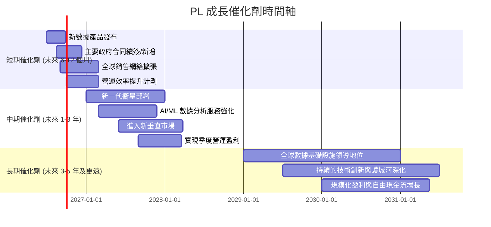

### 8.2 TAM 市場規模分析

Planet Labs 所在的地理空間數據市場具有巨大的潛在市場規模 (Total Addressable Market, TAM)，且滲透率仍處於早期階段。

```
╔══════════════════════════════════════════════════════════════════╗
║                   PL 潛在市場規模 (TAM) 分析                     ║
╠══════════════════════════════════════════════════════════════════╣
║                                                                  ║
║  全球地理空間分析市場 TAM：$150B+ (2030年預估)                  ║
║  ├── 衛星影像市場：      $20B+ (2030年預估)                      ║
║  ├── 精準農業市場：      $10B+ (數據應用部分)                    ║
║  ├── 國防與情報市場：    $30B+ (數據與服務部分)                  ║
║  └── 環境監測與GIS：     $25B+                                   ║
║                                                                  ║
║  PL 當前 TTM 營收： $335.61M                                     ║
║  市場滲透率：     極低 (不到 1%)                                 ║
║                                                                  ║
║  📊 結論：PL 在一個龐大且快速成長的市場中運營，具有巨大的長期成長空間。║
╚══════════════════════════════════════════════════════════════════╝
```
**分析**：
全球地理空間分析市場預計到 2030 年將超過 $150B，其中衛星影像、精準農業、國防情報和環境監測等細分市場都呈現快速增長。Planet Labs 的 TTM 收入 $335.61M 相對於如此龐大的 TAM 而言，市場滲透率仍然非常低，這意味著公司在未來幾年有充足的成長空間。

### 8.3 成長驅動力結構圖

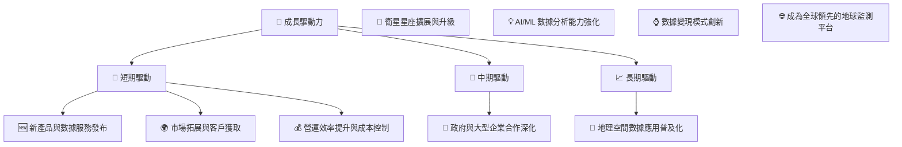
**分析**：
-   **短期驅動**：新數據產品的推出 (如更高解析度、更多頻譜數據)、全球銷售團隊的擴張以及現有客戶的增長將直接推動收入。同時，營運費用的有效控制對改善利潤率至關重要。
-   **中期驅動**：新一代衛星的部署將提升數據質量和覆蓋範圍，強化與政府和大型企業的合作關係將帶來穩定且高價值的訂單。AI/ML 在數據分析中的應用將提升其服務的附加價值和競爭力。
-   **長期驅動**：隨著地理空間數據在各行各業的應用日益普及，Planet Labs 有望憑藉其技術和數據優勢，成為全球領先的地球監測與分析平台。數據變現模式的創新（如與第三方應用開發者合作、提供行業垂直解決方案）將進一步拓寬其收入來源。

---

## 9. 風險矩陣

Planet Labs 作為一家高成長的科技公司，面臨多方面的風險，包括競爭、技術、財務和營運風險。

### 9.1 風險評分矩陣

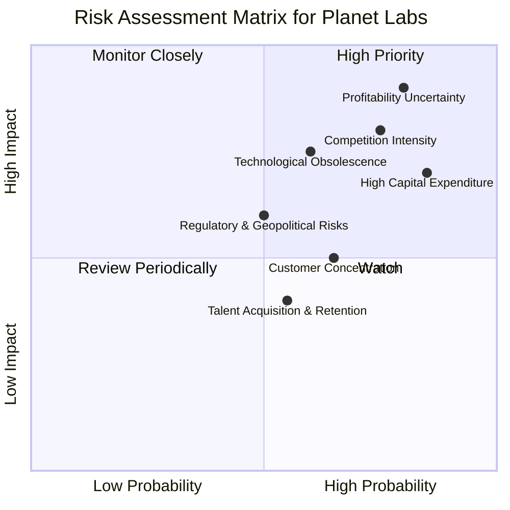

### 9.2 風險清單詳細分析

| # | 風險項目 | 發生機率 | 財務衝擊 | 風險評分 | 緩解措施 |
|---|----------|----------|----------|----------|----------|
| 1 | 🔴 **盈利能力不確定性** | 高 (80%) | 高 (-50%EPS) | 🔴 9.0/10 | 嚴格控制銷售、一般及行政費用；優化研發投入效率；探索新的數據變現模式；提升營運槓桿。 |
| 2 | 🔴 **競爭加劇** | 高 (75%) | 高 (-20%收入成長) | 🔴 8.5/10 | 持續技術創新，保持數據頻率與解析度優勢；強化平台生態系統，提升客戶黏性；差異化產品與服務。 |
| 3 | 🟡 **高資本支出** | 高 (85%) | 中 (-10%FCF) | 🟡 7.5/10 | 優先級別的資本支出規劃；尋求更具成本效益的衛星製造與發射方案；與合作夥伴分擔部分基礎設施成本。 |
| 4 | 🟡 **技術過時風險** | 中 (60%) | 中 (-15%收入) | 🟡 7.0/10 | 持續研發投入，探索新一代衛星技術；多元化數據源 (如與雷達衛星公司合作)；強化數據分析與應用創新。 |
| 5 | 🟡 **客戶集中度風險** | 中 (65%) | 低 (-10%收入) | 🟡 6.0/10 | 積極拓展多行業客戶群體，降低對單一或少數大型客戶的依賴；加強中小企業市場的滲透。 |
| 6 | 🟢 **監管與地緣政治風險** | 中 (50%) | 中 (-5%收入) | 🟢 5.5/10 | 密切關注國際空間法律和數據隱私法規；多元化衛星發射合作夥伴；遵守各國出口管制政策。 |
| 7 | 🟢 **人才獲取與保留** | 中 (55%) | 低 (-5%營運效率) | 🟢 4.0/10 | 建立有競爭力的薪酬福利體系；營造積極的企業文化；加強內部培訓和人才發展。 |

---

## 10. 投資建議

### 10.1 最終綜合評級雷達圖

```
╔══════════════════════════════════════════════════════════════════╗
║                   PL 綜合評級雷達圖                              ║
╠══════════════════════════════════════════════════════════════════╣
║                                                                  ║
║  基本面強度  6.0 ▓▓▓▓▓▓▓▓▓▓▓▓░░░░░░░░  ★★★☆☆           ║
║  成長動能    8.0 ▓▓▓▓▓▓▓▓▓▓▓▓▓▓▓▓░░░░  ★★★★☆           ║
║  獲利品質    4.0 ▓▓▓▓▓▓▓▓░░░░░░░░░░░░  ★★☆☆☆           ║
║  財務健康    7.0 ▓▓▓▓▓▓▓▓▓▓▓▓▓▓░░░░░░  ★★★☆☆           ║
║  估值合理性  5.0 ▓▓▓▓▓▓▓▓▓▓░░░░░░░░░░  ★★☆☆☆           ║
║  護城河深度  6.8 ▓▓▓▓▓▓▓▓▓▓▓▓▓░░░░░░░  ★★★☆☆           ║
║  管理層執行  6.5 ▓▓▓▓▓▓▓▓▓▓▓▓▓░░░░░░░  ★★★☆☆           ║
║  技術創新力  8.5 ▓▓▓▓▓▓▓▓▓▓▓▓▓▓▓▓▓░░░  ★★★★☆           ║
║                                                                  ║
║  綜合總分    6.0 ▓▓▓▓▓▓▓▓▓▓▓▓░░░░░░░░  🏆 評級：持有            ║
╚══════════════════════════════════════════════════════════════════╝
```

### 10.2 目標價與隱含報酬率

綜合 DCF 估值、同業比較以及分析師共識，我們給出以下目標價區間。

| 情境 | 目標價 | 隱含報酬率 (相較當前 $28.76) | 機率權重 |
|------|--------|------------------------------|----------|
| 悲觀情境 | $25.00 | -13.07% | 25% |
| 基準情境 | $35.00 | +21.63% | 50% |
| 樂觀情境 | $40.00 | +39.01% | 25% |
| **加權平均目標價** | **$33.75** | **+17.35%** | **100%** |

**分析**：
基於加權平均目標價 $33.75，Planet Labs 具有約 17.35% 的潛在上漲空間。然而，考慮到其高估值和盈利能力的不確定性，我們建議採取「持有」評級。投資者應密切關注公司能否將其強勁的收入成長轉化為可持續的盈利和自由現金流。

### 10.3 買入時機與觸發因素

```
╔══════════════════════════════════════════════════════════════════╗
║                  ✅ 買入觸發因素 Checklist                      ║
╠══════════════════════════════════════════════════════════════════╣
║                                                                  ║
║  立即買入觸發條件（多數符合）：                                  ║
║  ☐ 季度營運利潤轉正，且有持續改善跡象                           ║
║  ☐ 自由現金流顯著加速增長，FCF Yield 超過 2%                    ║
║  ☐ P/S Ratio 回落至 15x 以下，估值更具吸引力                    ║
║  ☐ 獲得大型、多年期、高利潤率的政府或商業合同                   ║
║  ☐ 股價因非基本面因素（如大盤調整）大幅下跌 20% 以上            ║
║                                                                  ║
║  加碼觸發條件（出現以下任一）：                                  ║
║  ☐ 連續兩季 EPS 超出分析師預期，且指引樂觀                      ║
║  ☐ 營業費用佔收入比重持續下降，顯示營運槓桿效應                 ║
║  ☐ 新一代衛星技術發布，顯著提升數據品質或降低成本               ║
║  ☐ 宣布戰略性併購，有效擴大市場份額或技術能力                   ║
║                                                                  ║
║  減碼/停損觸發條件（出現以下任一）：                             ║
║  ☐ 收入成長率顯著放緩至個位數，且無改善跡象                     ║
║  ☐ 自由現金流再次轉負，且沒有明確的改善路徑                     ║
║  ☐ 競爭格局惡化，市場份額被侵蝕                                 ║
║  ☐ 主要客戶流失或合同未續簽，影響收入預期                       ║
║  ☐ 股東權益持續大幅縮水，財務健康惡化                           ║
╚══════════════════════════════════════════════════════════════════╝
```

### 10.4 投資人適配度分析

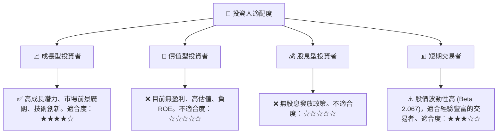
**分析**：
-   **成長型投資者**：Planet Labs 憑藉其獨特的業務模式、高成長的收入和巨大的 TAM，非常適合尋求長期資本增值的成長型投資者。然而，需要有較高的風險承受能力，並願意等待其盈利轉正。
-   **價值型投資者**：由於公司持續虧損、估值高昂且 ROE 為負，目前不適合價值型投資者。
-   **股息型投資者**：公司目前沒有股息發放，所有資金都用於再投資以支持成長，因此不適合股息型投資者。
-   **短期交易者**：鑒於其 Beta 值高達 2.067，股價波動性較大，可能吸引短期交易者。但這需要豐富的交易經驗和風險管理能力。

### 10.5 關鍵監控指標

| 監控類型 | 指標 | 關注點 | 頻率 |
|----------|------|--------|------|
| **營運表現** | 收入 YoY 成長率 | 成長動能是否持續，是否達到或超出指引 | 每季度 |
| **盈利能力** | 營業利益率 / 淨利率 | 虧損是否收窄，何時能實現盈利轉正 | 每季度 |
| **現金流** | 自由現金流 (FCF) | FCF 是否持續為正並增長，資本支出效率 | 每季度/每年 |
| **估值** | P/S Ratio / EV/Revenue | 估值是否回歸合理區間，與同行比較 | 每月/季度 |
| **競爭格局** | 市場份額 / 競爭對手動態 | 競爭優勢是否保持，是否有新的顛覆者出現 | 每半年/每年 |
| **財務健康** | 淨現金狀況 / 股東權益 | 現金儲備是否充足，股權稀釋情況 | 每季度 |
| **產品與技術** | 新產品發布 / 衛星部署進度 | 技術創新是否領先，產品路線圖執行情況 | 每季度/每年 |

---

> **免責聲明**：本報告為 AI 自動生成，僅供研究參考，不構成投資建議。投資有風險，入市需謹慎。