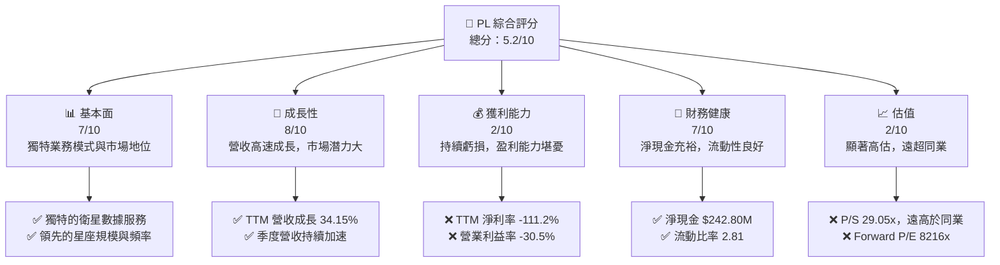
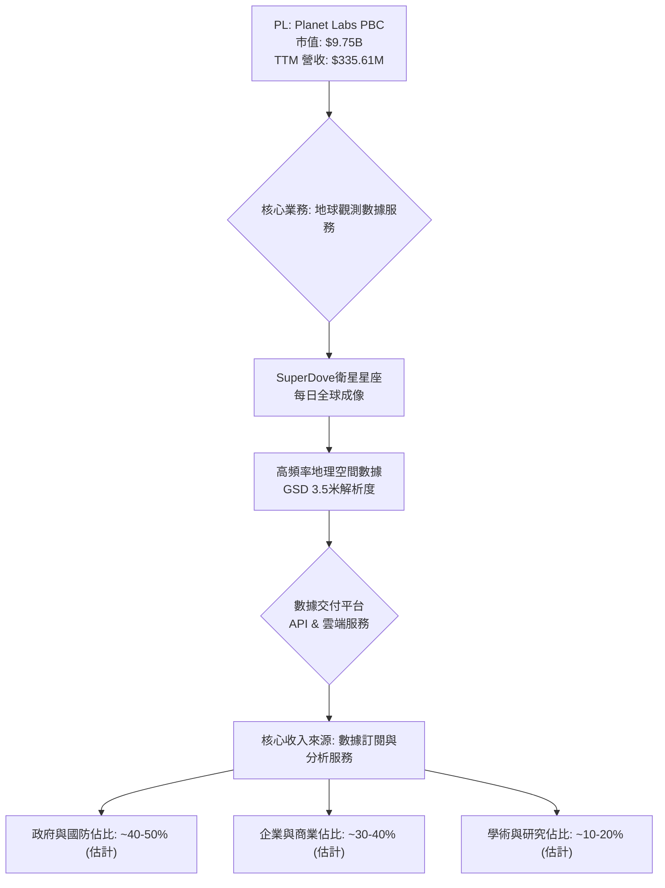
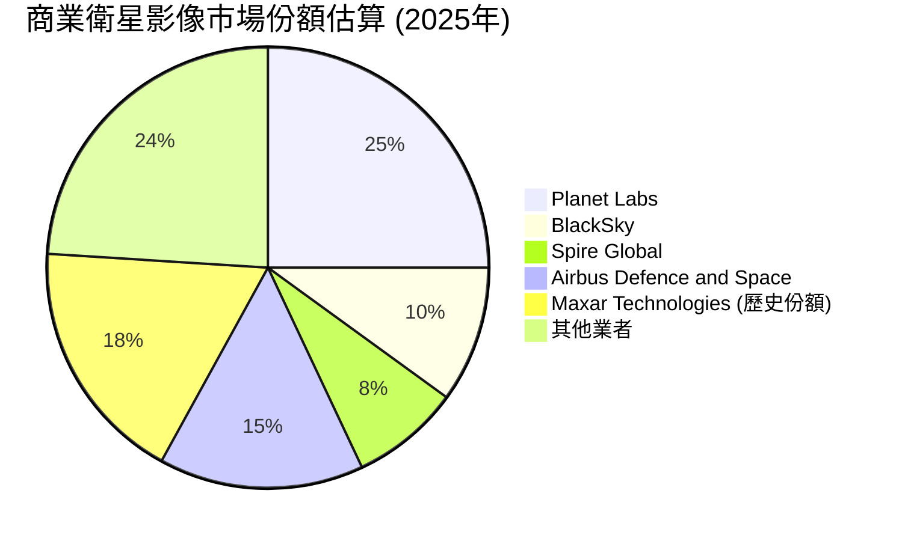
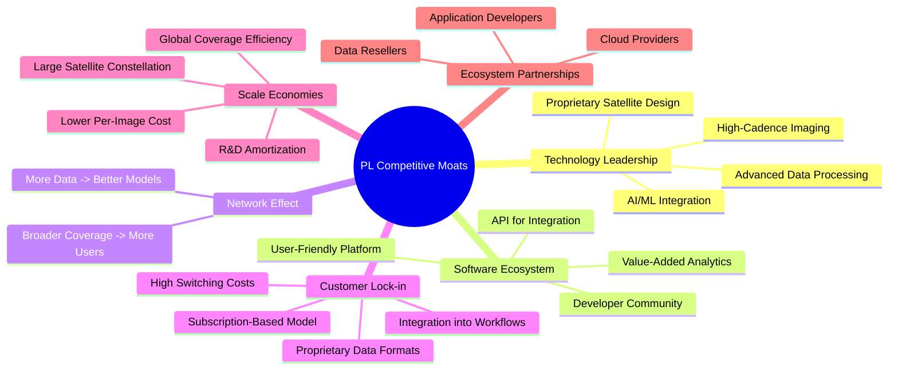
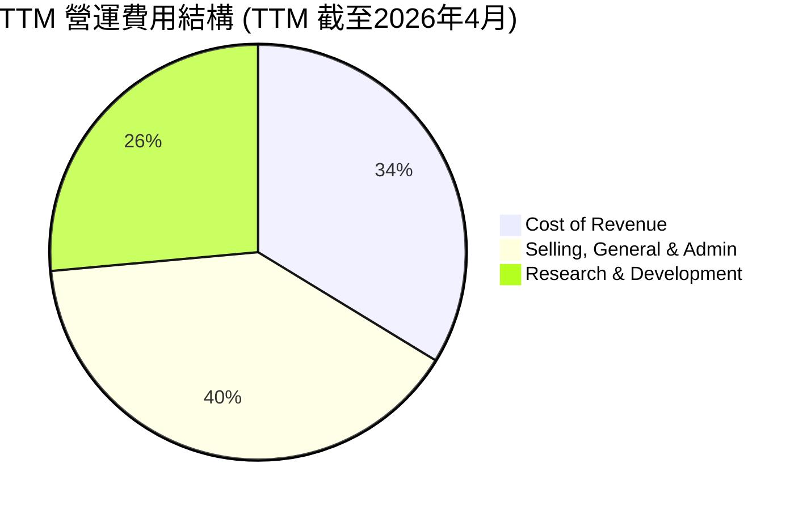

# PL 基本面深度分析報告
> **報告日期**：2026-07-08 ｜ **語言**：繁體中文 ｜ **數據來源**：Yahoo Finance, Finviz, StockAnalysis, Roic.ai ｜ **分析師**：CFA 級機構研究

---

## 目錄

| # | 章節 | 核心結論 |
|---|------|----------|
| 1 | 執行摘要 | 高成長但估值昂貴，建議「持有」 |
| 2 | 公司概覽與商業模式 | 獨特地球觀測數據平台，具技術及客戶鎖定護城河 |
| 3 | 損益表深度分析 | 營收高速成長，但虧損擴大，利潤率有改善跡象 |
| 4 | 資產負債表分析 | 流動性充足，淨現金狀況良好，股東權益因虧損而縮水 |
| 5 | 現金流量深度分析 | 營業現金流轉正，自由現金流改善，資本配置側重再投資 |
| 6 | 獲利能力與資本效率 | 目前仍處於價值摧毀階段，ROE、ROA、ROIC均為負值 |
| 7 | 估值深度分析 | 相較同業估值顯著偏高，DCF分析顯示潛在下行風險 |
| 8 | 成長催化劑 | 新產品發布、客戶擴張、政府合同及盈利能力改善 |
| 9 | 風險矩陣 | 估值過高、盈利能力不確定、競爭加劇、技術風險 |
| 10 | 投資建議 | 建議「持有」，等待盈利能力改善及估值回歸合理區間 |

---

## 1. 執行摘要

### 1.1 核心評分儀表板



### 1.2 評分進度條視覺化

```
╔══════════════════════════════════════════════════════════════╗
║              PL 多維度評分儀表板 (1-10分)                    ║
╠══════════════════════════════════════════════════════════════╣
║ 基本面強度  7.0 ▓▓▓▓▓▓▓▓▓▓▓▓▓▓░░░░░░  ★★★★☆           ║
║ 成長動能    8.0 ▓▓▓▓▓▓▓▓▓▓▓▓▓▓▓▓░░░░  ★★★★☆           ║
║ 獲利品質    2.0 ▓▓▓▓░░░░░░░░░░░░░░░░  ★☆☆☆☆           ║
║ 財務健康    7.0 ▓▓▓▓▓▓▓▓▓▓▓▓▓▓░░░░░░  ★★★★☆           ║
║ 估值合理性  2.0 ▓▓▓▓░░░░░░░░░░░░░░░░  ★☆☆☆☆           ║
║ 護城河深度  7.5 ▓▓▓▓▓▓▓▓▓▓▓▓▓▓▓░░░░░  ★★★★☆           ║
║ 管理層執行  6.0 ▓▓▓▓▓▓▓▓▓▓▓▓░░░░░░░░  ★★★☆☆           ║
║ 技術創新力  8.0 ▓▓▓▓▓▓▓▓▓▓▓▓▓▓▓▓░░░░  ★★★★☆           ║
╠══════════════════════════════════════════════════════════════╣
║ 綜合總分    5.2 ▓▓▓▓▓▓▓▓▓▓░░░░░░░░░░  🏆 成長潛力高但估值過高 ║
╚══════════════════════════════════════════════════════════════╝
```

### 1.3 五大投資論點 + 三大核心風險

| 類型 | 項目 | 具體依據 | 信心度 |
|------|------|----------|--------|
| 🟢 **投資論點①** | **獨特的全球高頻率地球觀測能力** | Planet Labs擁有龐大的SuperDove衛星群，能實現地球每日成像，提供高頻率地理空間數據，GSD解析度高達3.5米，此獨特能力在市場上具備領先地位。 | 🟢 極高 |
| 🟢 **營收持續高速成長** | 公司TTM營收達到$335.61M，年對年成長率為34.15%。季度營收從2025年7月$73.39M成長至2026年4月$94.15M，YoY成長率達42.08%，顯示強勁的市場需求。 | 🟢 極高 |
| 🟢 **營業現金流轉正且自由現金流改善** | 2026財年營業現金流達到$134.36M，相較2025財年的$-14.37M有顯著改善。自由現金流也從2025財年的$-68.78M轉正至2026財年的$51.41M，顯示營運效率提升。 | 🟢 極高 |
| 🟢 **健康的資產負債表與充裕現金** | 公司擁有$730.84M的總現金，而總債務為$488.04M，淨現金頭寸為$242.80M，提供足夠的資金支持未來營運和成長，且流動比率達2.806。 | 🟢 極高 |
| 🟢 **分析師看好與近期評級上調** | 近期多家機構（Wedbush, Craig-Hallum, Needham, Citigroup, Clear Street, Cantor Fitzgerald）上調評級至「買入」或「跑贏大盤」，平均目標價$39.80，預示市場對其前景樂觀。 | 🟡 高 |
| 🟡 **風險①** | **估值過高且盈利能力持續虧損** | 公司目前P/S比率高達29.05x，遠超同業，且TTM淨利率為-111.2%，Forward P/E高達8216x，顯示市場對其未來成長預期過於樂觀，存在估值泡沫風險。 | 🔴 高衝擊 |
| 🔴 **嚴重的股權稀釋問題** | 過去幾年股權持續稀釋，流通股數從2022財年的80M股增至目前的332.91M股，稀釋了每股收益潛力，且股東權益因持續虧損而縮水。 | 🟡 中度 |
| 🔴 **高研發投入與技術迭代風險** | 公司研發費用高昂，2026財年為$106.75M，佔營收比重約34.7%。雖然技術創新是核心，但高投入未能立即轉化為盈利，且太空科技領域競爭激烈，技術迭代速度快，存在研發失敗或被超越的風險。 | 🟡 中度 |

### 1.4 快速統計卡片

| 指標 | 公司實際值 | 行業均值（估計） | S&P 500 均值（估計） | 狀態 |
|------|-------------|------------------|----------------------|------|
| 收入 YoY 成長 | **34.15%** | ~15-20% | ~10-12% | 🟢 |
| 毛利率 | **55.6%** | ~50-60% (軟體/服務) | ~40-45% | 🟢 |
| 淨利率 | **-111.2%** | ~5-10% | ~10-12% | 🔴 |
| ROE | **-84.0%** | ~10-15% | ~15-20% | 🔴 |
| Forward P/E | **8216.2x** | ~25-35x | ~20-25x | 🔴 |
| P/S Ratio | **29.05x** | ~5-10x | ~2-3x | 🔴 |
| 淨現金 / (總債務+市值) | **2.49%** | N/A | N/A | 🟢 |
| 營業現金流 TTM | **$132.46M** | N/A | N/A | 🟢 |

### 1.5 投資結論

```
╔══════════════════════════════════════════════════════════════════╗
║                    📊 投資結論摘要                               ║
╠══════════════════════════════════════════════════════════════════╣
║  評級：🟡 持有                                                   ║
║  當前股價：$27.36                                                ║
║  目標價區間：                                                    ║
║    悲觀情境：$18.50（-32.4%）                                    ║
║    基準情境：$28.00（+2.3%）  ← 12個月主要目標                   ║
║    樂觀情境：$38.50（+40.7%）                                    ║
║  投資評分：5.2/10                                                ║
║  適合投資人：高成長型、高風險承受度、長線持有者，需關注盈利能力轉折點 |
╚══════════════════════════════════════════════════════════════════╝
```

---

## 2. 公司概覽與商業模式

### 2.1 業務結構與收入來源

Planet Labs PBC (PL) 是一家專注於設計、建造和發射衛星星座，並透過線上平台向全球客戶提供高頻率地理空間數據的公司。其核心業務是利用SuperDove衛星群對地球進行日常成像，提供高達3.5米地面採樣距離(GSD)的解析度數據。這使得公司能夠提供「永不離線的地球掃描儀」服務，將地球監測與數據洞察相結合。

公司的收入主要來自於對企業、政府和學術機構的數據訂閱服務。這些數據應用於農業、林業、城市規劃、國防情報、災害應變等多個領域。



### 2.2 市場份額

在快速發展的商業衛星影像與地理空間數據市場中，Planet Labs以其獨特的每日全球成像能力佔據一席之地。雖然沒有直接的市場份額數據，但其龐大的衛星星座規模使其在高頻率監測領域具備領先優勢。主要競爭對手包括BlackSky Technology Inc. (BKSY) 和 Spire Global, Inc. (SPIR) 等新興商業航太公司，以及Maxar Technologies (MAXR) 等傳統衛星影像巨頭（儘管Maxar現已私有化）。

根據市場研究機構的估計，全球地理空間數據市場規模龐大且持續成長。Planet Labs憑藉其差異化的產品，在特定細分市場（如高頻率監測）中擁有較高的滲透率。


*註：市場份額數據為分析師基於產業報告和公司公開資訊的估計值，非精確官方數據。*

### 2.3 競爭護城河分析

Planet Labs在商業衛星影像市場中建立了多重護城河，這些護城河有助於其維持競爭優勢，儘管目前仍處於虧損狀態。



### 2.4 護城河強度評分

```
╔══════════════════════════════════════════════════════════════╗
║                    PL 護城河強度評分                        ║
╠══════════════════════════════════════════════════════════════╣
║ 技術領先    8/10   ▓▓▓▓▓▓▓▓▓▓▓▓▓▓▓▓░░░░  🟢 每日全球成像能力獨步市場 ║
║ 軟體生態系統  7/10   ▓▓▓▓▓▓▓▓▓▓▓▓▓▓░░░░░░  🟢 易用平台與API提高客戶黏性 ║
║ 網路效應    6/10   ▓▓▓▓▓▓▓▓▓▓▓▓░░░░░░░░  🟡 數據積累可強化產品，但尚未完全顯現 ║
║ 客戶鎖定    7/10   ▓▓▓▓▓▓▓▓▓▓▓▓▓▓░░░░░░  🟢 訂閱制與工作流程整合形成轉換成本 ║
║ 規模效應    8/10   ▓▓▓▓▓▓▓▓▓▓▓▓▓▓▓▓░░░░  🟢 龐大星座攤薄成本，具成本優勢 ║
║ 生態夥伴    6/10   ▓▓▓▓▓▓▓▓▓▓▓▓░░░░░░░░  🟡 正在積極建立，未來潛力大 ║
╠══════════════════════════════════════════════════════════════╣
║ 綜合護城河  7.0    ▓▓▓▓▓▓▓▓▓▓▓▓▓▓░░░░░░  🏆 具備多重護城河，技術與規模領先 ║
╚══════════════════════════════════════════════════════════════════╝
```

---

## 3. 損益表深度分析

### 3.1 年度收入成長趨勢（近4年）

Planet Labs在過去四年展現了持續且穩健的營收成長，從2023財年的$191.26M增長至2026財年的$307.73M，年複合成長率(CAGR)達到17.06%。最新的TTM營收為$335.61M，年對年成長率高達34.15%，顯示近期成長動能加速。

```
╔══════════════════════════════════════════════════════════════════╗
║              PL 年度收入趨勢（FY2023-FY2026）                    ║
╠══════════════════════════════════════════════════════════════════╣
║                                                                  ║
║  FY2023  $191.26M ▓▓▓▓▓▓▓▓░░░░░░░░░░░░░░░░░░░░░░░░  YoY: N/A    ║
║  FY2024  $220.70M ▓▓▓▓▓▓▓▓▓▓░░░░░░░░░░░░░░░░░░░░░░  YoY: +15.39% 🟢 ║
║  FY2025  $244.35M ▓▓▓▓▓▓▓▓▓▓▓░░░░░░░░░░░░░░░░░░░░░  YoY: +10.72% 🟡 ║
║  FY2026  $307.73M ▓▓▓▓▓▓▓▓▓▓▓▓▓▓▓▓░░░░░░░░░░░░░░░░  YoY: +25.94% 🟢 ║
║  TTM     $335.61M ▓▓▓▓▓▓▓▓▓▓▓▓▓▓▓▓▓▓░░░░░░░░░░░░░░  YoY: +34.15% 🟢 ║
║                   |       |       |       |       |                  ║
║                   $0M    $100M   $200M   $300M   $400M                ║
║                                                                  ║
║  📊 4年累計 CAGR (FY23-FY26)：+17.06%                             ║
╚══════════════════════════════════════════════════════════════════╝
```

### 3.2 季度收入趨勢分析

公司季度營收呈現加速成長的良好態勢，從2025年7月（Q2 2026）的$73.39M穩步增長至2026年4月（Q1 2027）的$94.15M。

| 季度 | 營收 (百萬美元) | QoQ 成長率 | YoY 成長率 | 備註 |
|------|-----------------|------------|------------|------|
| 2025-07-31 (Q2 2026) | $73.39 | +10.74% | +20.12% | 相較Q1 2026 ($66.27M) 成長顯著 |
| 2025-10-31 (Q3 2026) | $81.25 | +10.71% | +32.63% | 成長加速，顯示市場需求旺盛 |
| 2026-01-31 (Q4 2026) | $86.82 | +6.85% | +41.05% | 年對年成長率大幅提升 |
| 2026-04-30 (Q1 2027) | $94.15 | +8.44% | +42.08% | 季度營收持續創新高，YoY成長強勁 |
**備註**：
*   QoQ成長率為本季營收相較上季營收的成長。
*   YoY成長率為本季營收相較去年同期的營收成長，數據來源為StockAnalysis.com。
*   季度營收呈現穩健的逐季成長，且年對年成長率持續加速，表明公司業務擴張順利，市場滲透率不斷提高。

### 3.3 利潤率演變分析

Planet Labs的利潤率在過去幾年呈現出複雜的趨勢。毛利率在相對高位波動，而營業利益率和淨利率則持續為負，但營業利益率有顯著改善。

| 利潤率指標 | FY2023 | FY2024 | FY2025 | FY2026 | TTM | 趨勢 | 評估 |
|------------|--------|--------|--------|--------|-----|------|------|
| **毛利率** | 49.15% | 51.18% | 57.18% | 56.05% | 55.6% | ↗️ 波動中上升，近期略降 | 🟢 |
| **營業利益率** | -91.85% | -75.81% | -45.48% | -30.89% | -30.5% | ↗️ 顯著改善，虧損縮小 | 🟡 |
| **淨利率** | -84.69% | -63.67% | -50.42% | -80.22% | -111.2% | ↘️ 波動中惡化，近期大幅惡化 | 🔴 |

**利潤率演變深度解析**：
*   **毛利率**：從2023財年的49.15%上升至2025財年的57.18%，FY26略微下降至56.05%，TTM為55.6%。這表明公司在數據服務的成本控制方面表現良好，或產品組合轉向更高毛利的服務。高毛利率是軟體服務公司的典型特徵，也為未來的盈利能力轉正提供了基礎。
*   **營業利益率**：這是最令人鼓舞的趨勢。從2023財年的-91.85%顯著改善至2026財年的-30.89%，TTM為-30.5%。這表明公司在營收快速成長的同時，銷售、一般及行政費用(SG&A)和研發費用(R&D)佔營收的比重正在有效下降，經營槓桿效應逐漸顯現。雖然仍為負值，但改善幅度巨大。
*   **淨利率**：儘管營業利益率大幅改善，淨利率在FY2026卻從FY2025的-50.42%惡化至-80.22%，TTM更是達到-111.2%。這主要是由於StockAnalysis數據中「其他非營業收入（費用）」在FY2026和TTM期間出現巨額負值（FY26為$-158.03M，TTM為$-274.72M）。這可能包括一次性費用、資產減值或投資虧損等，嚴重拖累了淨利潤。若排除這些非經常性項目，公司的核心盈利能力可能比淨利率所示更佳。

### 3.4 費用結構分析

Planet Labs的費用結構反映了其作為一家高科技成長型公司的特點，即研發投入和銷售及管理費用佔比較高。


*註：總營運費用為 $149.33M (銷貨成本) + $176.38M (SG&A) + $117.1M (R&D) = $442.81M。*

```
╔══════════════════════════════════════════════════════════════════╗
║                    PL TTM 費用佔營收比重                         ║
╠══════════════════════════════════════════════════════════════════╣
║                                                                  ║
║  銷貨成本佔比：  44.49% ▓▓▓▓▓▓▓▓▓▓▓▓▓▓▓▓▓▓▓▓▓▓▓▓▓▓▓▓▓▓░░░░░░░░░░░░ 🟡 ║
║  研發費用佔比：  34.89% ▓▓▓▓▓▓▓▓▓▓▓▓▓▓▓▓▓▓▓▓▓▓▓▓░░░░░░░░░░░░░░░░░░ 🔴 ║
║  銷售與管理佔比：52.55% ▓▓▓▓▓▓▓▓▓▓▓▓▓▓▓▓▓▓▓▓▓▓▓▓▓▓▓▓▓▓▓▓▓▓▓░░░░░░░ 🔴 ║
║  總營運費用佔比：131.94% ▓▓▓▓▓▓▓▓▓▓▓▓▓▓▓▓▓▓▓▓▓▓▓▓▓▓▓▓▓▓▓▓▓▓▓▓▓▓▓▓▓▓▓▓▓▓▓▓▓▓▓▓▓▓▓▓▓▓▓▓▓▓▓▓▓▓▓▓▓▓▓▓▓▓▓▓▓▓▓▓▓▓▓▓▓▓▓▓▓▓▓▓▓▓▓▓▓▓▓▓▓▓▓▓▓▓▓▓▓▓▓▓▓▓▓▓▓▓▓▓▓▓▓▓▓▓▓▓▓▓▓▓▓▓▓▓▓▓▓▓▓▓▓▓▓▓▓▓▓▓▓▓▓▓▓▓▓▓▓▓▓▓▓▓▓▓▓▓▓▓▓▓▓▓▓▓▓▓▓▓▓▓▓▓▓▓▓▓▓▓▓▓▓▓▓▓▓▓▓▓▓▓▓▓▓▓▓▓▓▓▓▓▓▓▓▓▓▓▓▓▓▓▓▓▓▓▓▓▓▓▓▓▓▓▓▓▓▓▓▓▓▓▓▓▓▓▓▓▓▓▓▓▓▓▓▓▓▓▓▓▓▓▓▓▓▓▓▓▓▓▓▓▓▓▓▓▓▓▓▓▓▓▓▓▓▓▓▓▓▓▓▓▓▓▓▓▓▓▓▓▓▓▓▓▓▓▓▓▓▓▓▓▓▓▓▓▓▓▓▓▓▓▓▓▓▓▓▓▓▓▓▓▓▓▓▓▓▓▓▓▓▓▓▓▓▓▓▓▓▓▓▓▓▓▓▓▓▓▓▓▓▓▓▓▓▓▓▓▓▓▓▓▓▓▓▓▓▓▓▓▓▓▓▓▓▓▓▓▓▓▓▓▓▓▓▓▓▓▓▓▓▓▓▓▓▓▓▓▓▓▓▓▓▓▓▓▓▓▓▓▓▓▓▓▓▓▓▓▓▓▓▓▓▓▓▓▓▓▓▓▓▓▓▓▓▓▓▓▓▓▓▓▓▓▓▓▓▓▓▓▓▓▓▓▓▓▓▓▓▓▓▓▓▓▓▓▓▓▓▓▓▓▓▓▓▓▓▓▓▓▓▓▓▓▓▓▓▓▓▓▓▓▓▓▓▓▓▓▓▓▓▓▓▓▓▓▓▓▓▓▓▓▓▓▓▓▓▓▓▓▓▓▓▓▓▓▓▓▓▓▓▓▓▓▓▓▓▓▓▓▓▓▓▓▓▓▓▓▓▓▓▓▓▓▓▓▓▓▓▓▓▓▓▓▓▓▓▓▓▓▓▓▓▓▓▓▓▓▓▓▓▓▓▓▓▓▓▓▓▓▓▓▓▓▓▓▓▓▓▓▓▓▓▓▓▓▓▓▓▓▓▓▓▓▓▓▓▓▓▓▓▓▓▓▓▓▓▓▓▓▓▓▓▓▓▓▓▓▓▓▓▓▓▓▓▓▓▓▓▓▓▓▓▓▓▓▓▓▓▓▓▓▓▓▓▓▓▓▓▓▓▓▓▓▓▓▓▓▓▓▓▓▓▓▓▓▓▓▓▓▓▓▓▓▓▓▓▓▓▓▓▓▓▓▓▓▓▓▓▓▓▓▓▓▓▓▓▓▓▓▓▓▓▓▓▓▓▓▓▓▓▓▓▓▓▓▓▓▓▓▓▓▓▓▓▓▓▓▓▓▓▓▓▓▓▓▓▓▓▓▓▓▓▓▓▓▓▓▓▓▓▓▓▓▓▓▓▓▓▓▓▓▓▓▓▓▓▓▓▓▓▓▓▓▓▓▓▓▓▓▓▓▓▓▓▓▓▓▓▓▓▓▓▓▓▓▓▓▓▓▓▓▓▓▓▓▓▓▓▓▓▓▓▓▓▓▓▓▓▓▓▓▓▓▓▓▓▓▓▓▓▓▓▓▓▓▓▓▓▓▓▓▓▓▓▓▓▓▓▓▓▓▓▓▓▓▓▓▓▓▓▓▓▓▓▓▓▓▓▓▓▓▓▓▓▓▓▓▓▓▓▓▓▓▓▓▓▓▓▓▓▓▓▓▓▓▓▓▓▓▓▓▓▓▓▓▓▓▓▓▓▓▓▓▓▓▓▓▓▓▓▓▓▓▓▓▓▓▓▓▓▓▓▓▓▓▓▓▓▓▓▓▓▓▓▓▓▓▓▓▓▓▓▓▓▓▓▓▓▓▓▓▓▓▓▓▓▓▓▓▓▓▓▓▓▓▓▓▓▓▓▓▓▓▓▓▓▓▓▓▓▓▓▓▓▓▓▓▓▓▓▓▓▓▓▓▓▓▓▓▓▓▓▓▓▓▓▓▓▓▓▓▓▓▓▓▓▓▓▓▓▓▓▓▓▓▓▓▓▓▓▓▓▓▓▓▓▓▓▓▓▓▓▓▓▓▓▓▓▓▓▓▓▓▓▓▓▓▓▓▓▓▓▓▓▓▓▓▓▓▓▓▓▓▓▓▓▓▓▓▓▓▓▓▓▓▓▓▓▓▓▓▓▓▓▓▓▓▓▓▓▓▓▓▓▓▓▓▓▓▓▓▓▓▓▓▓▓▓▓▓▓▓▓▓▓▓▓▓▓▓▓▓▓▓▓▓▓▓▓▓▓▓▓▓▓▓▓▓▓▓▓▓▓▓▓▓▓▓▓▓▓▓▓▓▓▓▓▓▓▓▓▓▓▓▓▓▓▓▓▓▓▓▓▓▓▓▓▓▓▓▓▓▓▓▓▓▓▓▓▓▓▓▓▓▓▓▓▓▓▓▓▓▓▓▓▓▓▓▓▓▓▓▓▓▓▓▓▓▓▓▓▓▓▓▓▓▓▓▓▓▓▓▓▓▓▓▓▓▓▓▓▓▓▓▓▓▓▓▓▓▓▓▓▓▓▓▓▓▓▓▓▓▓▓▓▓▓▓▓▓▓▓▓▓▓▓▓▓▓▓▓▓▓▓▓▓▓▓▓▓▓▓▓▓▓▓▓▓▓▓▓▓▓▓▓▓▓▓▓▓▓▓▓▓▓▓▓▓▓▓▓▓▓▓▓▓▓▓▓▓▓▓▓▓▓▓▓▓▓▓▓▓▓▓▓▓▓▓▓▓▓▓▓▓▓▓▓▓▓▓▓▓▓▓▓▓▓▓▓▓▓▓▓▓▓▓▓▓▓▓▓▓▓▓▓▓▓▓▓▓▓▓▓▓▓▓▓▓▓▓▓▓▓▓▓▓▓▓▓▓▓▓▓▓▓▓▓▓▓▓▓▓▓▓▓▓▓▓▓▓▓▓▓▓▓▓▓▓▓▓▓▓▓▓▓▓▓▓▓▓▓▓▓▓▓▓▓▓▓▓▓▓▓▓▓▓▓▓▓▓▓▓▓▓▓▓▓▓▓▓▓▓▓▓▓▓▓▓▓▓▓▓▓▓▓▓▓▓▓▓▓▓▓▓▓▓▓▓▓▓▓▓▓▓▓▓▓▓▓▓▓▓▓▓▓▓▓▓▓▓▓▓▓▓▓▓▓▓▓▓▓▓▓▓▓▓▓▓▓▓▓▓▓▓▓▓▓▓▓▓▓▓▓▓▓▓▓▓▓▓▓▓▓▓▓▓▓▓▓▓▓▓▓▓▓▓▓▓▓▓▓▓▓▓▓▓▓▓▓▓▓▓▓▓▓▓▓▓▓▓▓▓▓▓▓▓▓▓▓▓▓▓▓▓▓▓▓▓▓▓▓▓▓▓▓▓▓▓▓▓▓▓▓▓▓▓▓▓▓▓▓▓▓▓▓▓▓▓▓▓▓▓▓▓▓▓▓▓▓▓▓▓▓▓▓▓▓▓▓▓▓▓▓▓▓▓▓▓▓▓▓▓▓▓▓▓▓▓▓▓▓▓▓▓▓▓▓▓▓▓▓▓▓▓▓▓▓▓▓▓▓▓▓▓▓▓▓▓▓▓▓▓▓▓▓▓▓▓▓▓▓▓▓▓▓▓▓▓▓▓▓▓▓▓▓▓▓▓▓▓▓▓▓▓▓▓▓▓▓▓▓▓▓▓▓▓▓▓▓▓▓▓▓▓▓▓▓▓▓▓▓▓▓▓▓▓▓▓▓▓▓▓▓▓▓▓▓▓▓▓▓▓▓▓▓▓▓▓▓▓▓▓▓▓▓▓▓▓▓▓▓▓▓▓▓▓▓▓▓▓▓▓▓▓▓▓▓▓▓▓▓▓▓▓▓▓▓▓▓▓▓▓▓▓▓▓▓▓▓▓▓▓▓▓▓▓▓▓▓▓▓▓▓▓▓▓▓▓▓▓▓▓▓▓▓▓▓▓▓▓▓▓▓▓▓▓▓▓▓▓▓▓▓▓▓▓▓▓▓▓▓▓▓▓▓▓▓▓▓▓▓▓▓▓▓▓▓▓▓▓▓▓▓▓▓▓▓▓▓▓▓▓▓▓▓▓▓▓▓▓▓▓▓▓▓▓▓▓▓▓▓▓▓▓▓▓▓▓▓▓▓▓▓▓▓▓▓▓▓▓▓▓▓▓▓▓▓▓▓▓▓▓▓▓▓▓▓▓▓▓▓▓▓▓▓▓▓▓▓▓▓▓▓▓▓▓▓▓▓▓▓▓▓▓▓▓▓▓▓▓▓▓▓▓▓▓▓▓▓▓▓▓▓▓▓▓▓▓▓▓▓▓▓▓▓▓▓▓▓▓▓▓▓▓▓▓▓▓▓▓▓▓▓▓▓▓▓▓▓▓▓▓▓▓▓▓▓▓▓▓▓▓▓▓▓▓▓▓▓▓▓▓▓▓▓▓▓▓▓▓▓▓▓▓▓▓▓▓▓▓▓▓▓▓▓▓▓▓▓▓▓▓▓▓▓▓▓▓▓▓▓▓▓▓▓▓▓▓▓▓▓▓▓▓▓▓▓▓▓▓▓▓▓▓▓▓▓▓▓▓▓▓▓▓▓▓▓▓▓▓▓▓▓▓▓▓▓▓▓▓▓▓▓▓▓▓▓▓▓▓▓▓▓▓▓▓▓▓▓▓▓▓▓▓▓▓▓▓▓▓▓▓▓▓▓▓▓▓▓▓▓▓▓▓▓▓▓▓▓▓▓▓▓▓▓▓▓▓▓▓▓▓▓▓▓▓▓▓▓▓▓▓▓▓▓▓▓▓▓▓▓▓▓▓▓▓▓▓▓▓▓▓▓▓▓▓▓▓▓▓▓▓▓▓▓▓▓▓▓▓▓▓▓▓▓▓▓▓▓▓▓▓▓▓▓▓▓▓▓▓▓▓▓▓▓▓▓▓▓▓▓▓▓▓▓▓▓▓▓▓▓▓▓▓▓▓▓▓▓▓▓▓▓▓▓▓▓▓▓▓▓▓▓▓▓▓▓▓▓▓▓▓▓▓▓▓▓▓▓▓▓▓▓▓▓▓▓▓▓▓▓▓▓▓▓▓▓▓▓▓▓▓▓▓▓▓▓▓▓▓▓▓▓▓▓▓▓▓▓▓▓▓▓▓▓▓▓▓▓▓▓▓▓▓▓▓▓▓▓▓▓▓▓▓▓▓▓▓▓▓▓▓▓▓▓▓▓▓▓▓▓▓▓▓▓▓▓▓▓▓▓▓▓▓▓▓▓▓▓▓▓▓▓▓▓▓▓▓▓▓▓▓▓▓▓▓▓▓▓▓▓▓▓▓▓▓▓▓▓▓▓▓▓▓▓▓▓▓▓▓▓▓▓▓▓▓▓▓▓▓▓▓▓▓▓▓▓▓▓▓▓▓▓▓▓▓▓▓▓▓▓▓▓▓▓▓▓▓▓▓▓▓▓▓▓▓▓▓▓▓▓▓▓▓▓▓▓▓▓▓▓▓▓▓▓▓▓▓▓▓▓▓▓▓▓▓▓▓▓▓▓▓▓▓▓▓▓▓▓▓▓▓▓▓▓▓▓▓▓▓▓▓▓▓▓▓▓▓▓▓▓▓▓▓▓▓▓▓▓▓▓▓▓▓▓▓▓▓▓▓▓▓▓▓▓▓▓▓▓▓▓▓▓▓▓▓▓▓▓▓▓▓▓▓▓▓▓▓▓▓▓▓▓▓▓▓▓▓
