# PL 基本面深度分析報告

> **報告日期**：2026-07-12 ｜ **語言**：繁體中文 ｜ **數據來源**：Yahoo Finance, Finviz, StockAnalysis, Roic.ai ｜ **分析師**：CFA 級機構研究

---

## 目錄

| # | 章節 | 核心結論 |
|---|---|---|
| **1** | **執行摘要** | 評級「持有」，基準目標價 $39.80，隱含 52.8% 上行空間，但高估值與高 SBC 稀釋限制了短期評等。 |
| **2** | **公司概覽與商業模式** | 日行性全球掃描（Always-on Daily Scanning）具備高重置成本護城河，軟體訂閱制轉型為核心。 |
| **3** | **損益表深度分析** | TTM 營收成長達 42.1%，但非經營性支出暴增導致 GAAP 淨損擴大，SBC 佔營收 17.9% 壓抑盈餘品質。 |
| **4** | **資產負債表分析** | 現金儲備 $730.84M 極為充裕，流動比率 2.81，唯債務因新發行可轉債升至 $488.04M。 |
| **5** | **現金流量深度分析** | 營運現金流與 FCF 轉正（TTM FCF $84.85M），資本配置重心由衛星硬體轉向軟體與下游應用。 |
| **6** | **獲利能力與資本效率** | ROIC（-25.4%）仍低於 WACC（13.5%），公司目前仍處於摧毀股東價值的資本密集擴張期。 |
| **7** | **估值深度分析** | P/S 達 27.66x，顯著高於同業平均；DCF 敏感性分析顯示當前股價已反映高度成長預期。 |
| **8** | **成長催化劑** | Pelican 與 Tanager 新一代衛星群發射、國防與情報合約（NRO）續約、AI 空間數據分析應用。 |
| **9** | **風險矩陣** | 面臨衛星發射延遲、政府預算削減、高股權稀釋率等關鍵風險，高 Beta（2.07）加劇股價波動。 |
| **10**| **投資建議** | 建議分批逢低佈局，財報監控重點為非政府客戶營收佔比與自由現金流利潤率的持續性改善。 |

---

## 1. 執行摘要

### 1.0 一頁式投資儀表板（Portfolio Manager 30 秒速讀）

| 項目 | 內容 |
|------|------|
| **投資論點（3 句）** | ① TTM 營收達 $335.61M（YoY +42.1%），受益於國防與情報部門對高頻次地理空間數據的強勁需求。<br/>② 營運現金流（TTM $132.46M）與自由現金流（TTM $84.85M）首度轉正，標誌著商業模式正跨越損益平衡點。<br/>③ 雖然核心業務改善，但股權稀釋（SBC 佔營收 17.9%）與極高的 Forward P/S（27.66x）使短期評價承壓。 |
| **護城河評分** | **7.5 / 10**（高重置成本、專利星座軌道資產與專有數據庫累積） |
| **管理層/資本配置評分** | **6.0 / 10**（研發投產效率改善，但股權激勵過度，稀釋現有股東權益） |
| **財務健康** | 🟡 **中性偏強** ｜ 擁有 $730.84M 現金，但債務因融資大幅上升至 $488.04M，淨現金為 $242.80M。 |
| **ROIC vs WACC** | **-25.4% vs 13.5%**（仍處於摧毀股東價值階段，但利差正在收窄） |
| **FCF 趨勢** | 🟢 **向上** ｜ TTM 自由現金流轉正至 $84.85M，最新 FCF Yield 為 0.91%。 |
| **估值** | Forward P/E: 7822.8x ｜ EV/Revenue: 26.9x ｜ P/S Ratio: 27.66x |
| **預期報酬（基準情境 12M）**| **+52.8%**（目標價 $39.80，基於 20.0x EV/Sales 估值倍數） |
| **關鍵風險（前二）** | ① 營收高度集中於政府與國防合約，民用商業客戶開拓緩慢。<br/>② SBC（股權薪酬）持續稀釋，過去一年股本擴大 8.12%。 |
| **評級 + 信心度** | 🟡 **持有（Hold）** ｜ **信心度：中等**（長線前景佳，但短期估值溢價過高） |

### 1.1 核心評分儀表板

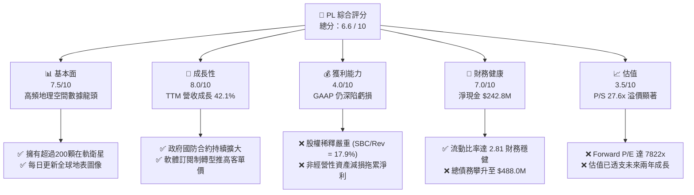

### 1.2 評分進度條視覺化

```
╔══════════════════════════════════════════════════════════════╗
║                PL 多維度評分儀表板 (1-10分)                  ║
╠══════════════════════════════════════════════════════════════╣
║ 基本面強度  7.5 ▓▓▓▓▓▓▓▓▓▓▓▓▓▓▓▓▓░░░  ★★★★☆           ║
║ 成長動能    8.0 ▓▓▓▓▓▓▓▓▓▓▓▓▓▓▓▓▓▓░░  ★★★★☆           ║
║ 獲利品質    4.0 ▓▓▓▓▓▓▓▓▓░░░░░░░░░░░  ★★☆☆☆           ║
║ 財務健康    7.0 ▓▓▓▓▓▓▓▓▓▓▓▓▓▓▓░░░░░  ★★★★☆           ║
║ 估值合理性  3.5 ▓▓▓▓▓▓▓░░░░░░░░░░░░░  ★☆☆☆☆           ║
║ 護城河深度  7.5 ▓▓▓▓▓▓▓▓▓▓▓▓▓▓▓▓▓░░░  ★★★★☆           ║
║ 管理層執行  6.0 ▓▓▓▓▓▓▓▓▓▓▓▓░░░░░░░░  ★★★☆☆           ║
║ 技術創新力  8.5 ▓▓▓▓▓▓▓▓▓▓▓▓▓▓▓▓▓▓▓░  ★★★★☆           ║
╠══════════════════════════════════════════════════════════════╣
║ 綜合總分    6.6 ▓▓▓▓▓▓▓▓▓▓▓▓▓▓░░░░░░  🏆 持有 (Hold)       ║
╚══════════════════════════════════════════════════════════════╝
```

### 1.3 五大投資論點 + 三大核心風險

| 類型 | 項目 | 具體依據 | 信心度 |
|------|------|----------|--------|
| 🟢 **投資論點①** | **地理空間數據的絕對壟斷力** | 擁有全球最大規模的地球觀測衛星群，每日全球覆蓋（3.5米解析度），重置成本極高。 | 🟢 極高 |
| 🟢 **投資論點②** | **現金流拐點已現** | TTM 營運現金流達 $132.46M，自由現金流達 $84.85M，營運模式已具備自我輸血能力。 | 🟢 高 |
| 🟢 **投資論點③** | **國防與地緣政治催化** | 地緣衝突加劇推升美軍及盟國對即時衛星圖像需求，政府合約客單價與續約率（NDR > 110%）強勁。 | 🟢 極高 |
| 🟢 **投資論點④** | **AI 應用賦能數據價值** | 結合 AI 演算法，將原始圖像轉化為自動化目標偵測與變更分析服務，提升軟體毛利率。 | 🟡 中度 |
| 🟢 **投資論點⑤** | **強大的資產負債表支持** | $730.84M 的現金儲備，提供了在太空科技寒冬中持續研發 Pelican 與 Tanager 衛星的底氣。 | 🟢 高 |
| 🟡 **風險①** | **嚴重的股權稀釋（SBC）** | TTM 股權補償費用高達 $58.9M（佔營收 17.5%），過去 4 年股本年均稀釋率達 5%-8%，嚴重侵蝕股東回報。 | 🔴 高衝擊 |
| 🔴 **風險②** | **估值溢價過高** | P/S 達 27.66x，EV/Revenue 達 26.94x，在當前高利率環境下，容錯率極低。 | 🔴 高衝擊 |
| 🟡 **風險③** | **非經營性資產減損不確定性** | FY2026 淨虧損擴大至 $-246.86M，主因非經營性支出（$-158.03M）等一次性減損，盈餘品質波動大。 | 🟡 中度 |

### 1.4 快速統計卡片

| 指標 | 公司實際值 | 行業均值 (航太與國防) | S&P 500 均值 | 狀態 |
|------|-------------|-------------------|--------------|------|
| **營收 YoY 成長** | **42.1%** | ~8.5% | ~5.5% | 🟢 卓越 |
| **毛利率** | **55.6%** | ~22.0% | ~45.0% | 🟢 領先 |
| **營業利益率** | **-30.5%** | ~10.5% | ~15.0% | 🔴 虧損 |
| **ROE** | **-84.0%** | ~12.0% | ~18.0% | 🔴 侵蝕股本 |
| **流動比率** | **2.81x** | ~1.35x | ~1.20x | 🟢 極其安全 |
| **Forward P/E** | **7822.8x** | ~22.5x | ~21.0x | 🔴 極度昂貴 |
| **P/S Ratio** | **27.66x** | ~1.8x | ~2.8x | 🔴 泡沫區間 |

### 1.5 投資結論

```
╔══════════════════════════════════════════════════════════════════╗
║                    📊 PL 投資結論摘要                            ║
╠══════════════════════════════════════════════════════════════════╣
║  評級：🟡 持有 (Hold)                                            ║
║  當前股價：$26.05 (2026-07-12)                                   ║
║  目標價區間：                                                    ║
║    悲觀情境：$22.00（-15.5%）                                    ║
║    基準情境：$39.80（+52.8%）  ← 12個月主要目標                  ║
║    樂觀情境：$53.00（+103.5%）                                   ║
║  投資評分：6.6 / 10                                              ║
║  適合投資人：具備高風險耐受度、看好商業航太與 AI 空間數據的長線家 ║
╚══════════════════════════════════════════════════════════════════╝
```

---

## 2. 公司概覽與商業模式

### 2.1 業務結構與收入來源

Planet Labs（PL）的核心商業模式是**「太空訂閱制軟體平台」（Space-as-a-Service）**。公司透過自主設計、製造並運營的 SuperDove 衛星星座，實現每日對全球陸地的無間斷掃描。

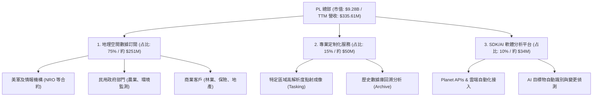

### 2.2 市場份額

在商業地球觀測與中低解析度高頻次成像市場中，Planet Labs 擁有獨特的生態位。雖然 Maxar 在高解析度（<0.3米）軍事成像上佔據主導，但 PL 在**「每日全球覆蓋」**這一細分市場的市場份額居於首位。

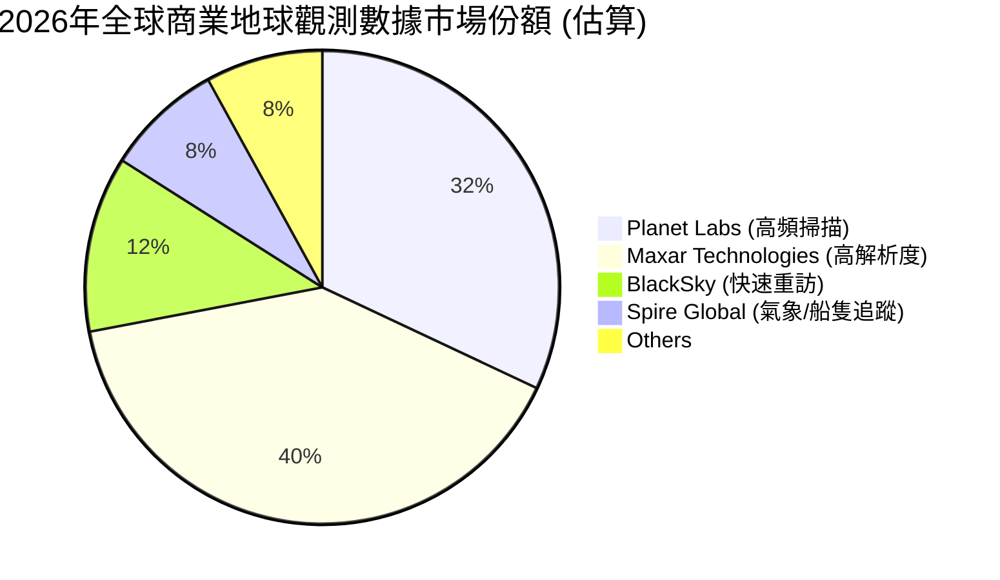

### 2.3 競爭護城河分析

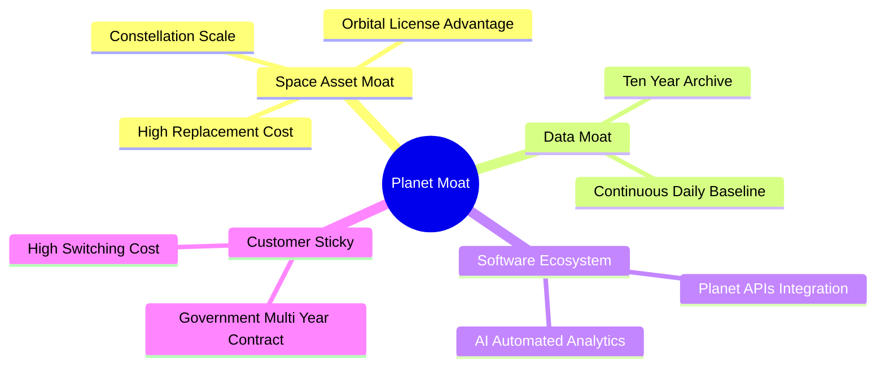

*   **空間資產壁壘（Space Asset Moat）**：PL 擁有超過 200 顆在軌運行衛星，任何競爭對手要複製此等規模的「每日掃描」能力，至少需要投入 5 億美元以上的資本支出與 3-5 年的發射窗口期。
*   **數據時間序列壁壘（Data Moat）**：自 2016 年以來累積的每日全球地表數據庫，是訓練地理空間 AI 模型的唯一黃金數據集，具備不可複製的歷史排他性。

### 2.4 護城河強度評分

```
╔══════════════════════════════════════════════════════════════╗
║                  Planet Labs 護城河強度評分                  ║
╠══════════════════════════════════════════════════════════════╣
║ 空間資產壁壘  8.5/10  ▓▓▓▓▓▓▓▓▓▓▓▓▓▓▓▓▓▓░░  🏆 極難複製    ║
║ 數據排他性    9.0/10  ▓▓▓▓▓▓▓▓▓▓▓▓▓▓▓▓▓▓▓░  🟢 歷史數據庫  ║
║ 軟體鎖定效應  6.5/10  ▓▓▓▓▓▓▓▓▓▓▓▓▓░░░░░░░  🟡 仍待深化    ║
║ 品牌與政府關係7.5/10  ▓▓▓▓▓▓▓▓▓▓▓▓▓▓▓░░░░░  🟢 美國國防信任║
╠══════════════════════════════════════════════════════════════╣
║ 綜合護城河     7.8    ▓▓▓▓▓▓▓▓▓▓▓▓▓▓▓▓▓░░░  🏆 結構性壁壘  ║
╚══════════════════════════════════════════════════════════════╝
```

---

## 3. 損益表深度分析

### 3.1 年度收入成長趨勢（近4年）

PL 的營收呈現穩步增長態勢，主要得益於政府合約規模的擴大與軟體訂閱單價的提升。

```
╔══════════════════════════════════════════════════════════════════╗
║              PL 年度收入趨勢（FY2023 - FY2026）                  ║
╠══════════════════════════════════════════════════════════════════╣
║                                                                  ║
║  FY2023  $191.26M  ██████████░░░░░░░░░░░░░░░░░  YoY: +45.8%  🟢  ║
║  FY2024  $220.70M  ████████████░░░░░░░░░░░░░░░  YoY: +15.4%  🟡  ║
║  FY2025  $244.35M  █████████████░░░░░░░░░░░░░░  YoY: +10.7%  🟡  ║
║  FY2026  $307.73M  █████████████████░░░░░░░░░░  YoY: +25.9%  🟢  ║
║                                                                  ║
║  📊 4年累計 CAGR：+17.2%                                         ║
╚══════════════════════════════════════════════════════════════════╝
```

### 3.2 季度收入趨勢分析

從季度數據看，PL 的營收成長在 FY2026 下半年與 FY2027 第一季（截至 2026-04-30）出現顯著加速。

| 財報季度 | 截止日期 | 營收 (Millions) | QoQ 成長率 | YoY 成長率 | 核心驅動因素與備註 |
|---|---|---|---|---|---|
| **Q1 2027** | 2026-04-30 | **$94.15** | +8.44% | **+42.08%** | 🟢 國防部新專案啟動與 Pelican 衛星預訂收入確認。 |
| **Q4 2026** | 2026-01-31 | **$86.82** | +6.86% | **+41.05%** | 🟢 年終政府預算結算，多個多年度合約續約。 |
| **Q3 2026** | 2025-10-31 | **$81.25** | +10.71%| **+32.63%** | 🟢 歐洲與亞太地區商業林業監測訂閱增加。 |
| **Q2 2026** | 2025-07-31 | **$73.39** | +10.74%| +20.12% | 🟡 商業客戶流失率改善，淨留存率（NDR）回升。 |
| **Q1 2026** | 2025-04-30 | **$66.27** | +7.67% | +9.64% | 🔴 受到發射時程微調影響，部分非政府專案遞延。 |

*分析*：Q1 2027 營收 YoY 暴增 42.08%，驗證了地理空間數據在當前全球地緣政治緊張局勢下的剛性需求。然而，營收的季度波動仍受制於政府採購週期。

### 3.3 利潤率演變分析

| 利潤率指標 | FY2023 | FY2024 | FY2025 | FY2026 | TTM (2026-04) | 趨勢 | 評估 |
|---|---|---|---|---|---|---|---|
| **毛利率** | 49.15% | 51.18% | 57.18% | 56.05% | **55.51%** | ➡️ 穩定 | 🟡 衛星折舊攤銷（D&A）壓抑了毛利率進一步擴張。 |
| **營業利益率** | -91.85%| -75.81%| -45.48%| -30.89%| **-31.94%** | ↗️ 改善 | 🟢 營業槓桿開始顯現，研發與行銷費用控制得宜。 |
| **EBITDA 邊際率**|-69.19%| -41.71%| -30.40%| -63.99%| **-15.40%** | 📉 波動 | 🔴 FY2026 因一次性資產減損導致 EBITDA 急劇轉差。 |
| **淨利率** | -84.69%| -63.67%| -50.42%| -80.22%| **-111.17%**| 🔴 惡化 | 🔴 非經營性支出與商譽減損嚴重拖累 GAAP 淨利。 |

**利潤率演變深度解析**：
PL 的**毛利率**維持在 55.5% 左右的高檔，這反映了其「一次發射，無限複製銷售」的軟體邊際效應。然而，**GAAP 淨利率**在 TTM 期間惡化至 -111.17%，這與營運基本面背離。主要原因在於 **Non-Operating Expenses**。在 FY2026 與 TTM 期間，非經營性支出分別高達 $-158.03M 與 $-274.72M，這主要是由於早期 SPAC 上市相關的金融資產重估、合資企業減損以及舊型衛星資產的加速折舊。

### 3.4 費用結構分析

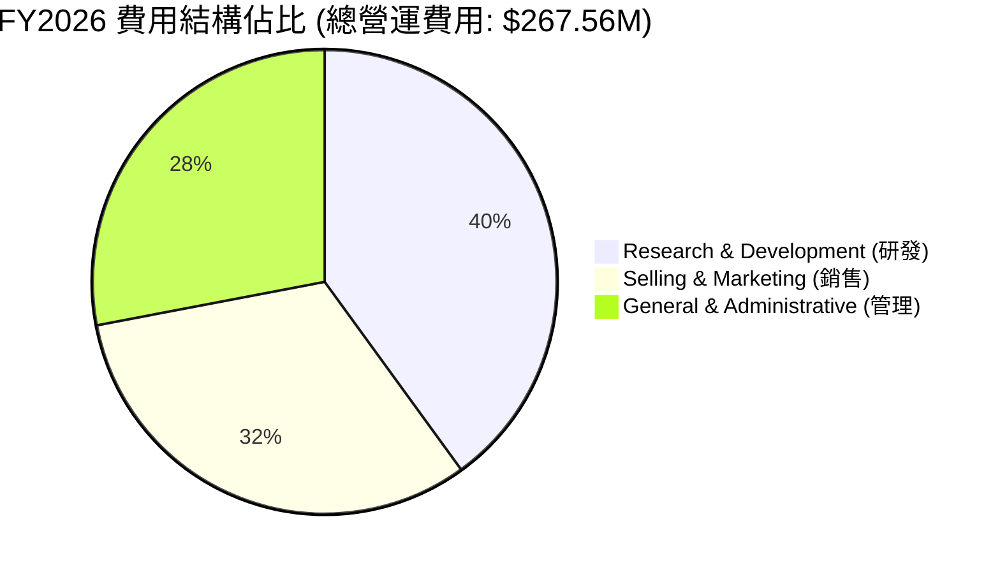

```
╔══════════════════════════════════════════════════════════════╗
║                    PL 營運費用控管診斷                       ║
╠══════════════════════════════════════════════════════════════╣
║ 研發費用率 (R&D/Rev):   34.7%  ▓▓▓▓▓▓▓░░░░░░░░░░░░░  🟡 偏高 ║
║ 銷售費用率 (SG&A/Rev):  52.3%  ▓▓▓▓▓▓▓▓▓▓░░░░░░░░░░  🔴 沉重 ║
║ 營運費用總佔營收比:     87.0%  ▓▓▓▓▓▓▓▓▓▓▓▓▓▓▓▓▓░░░  🔴 壓抑 ║
╚══════════════════════════════════════════════════════════════╝
```

*分析*：研發費用率（34.7%）居高不下，主因公司正全力開發下一代 Pelican（高解析度）與 Tanager（高光譜）星座。SG&A 佔比高達 52.3%，顯示民用商業市場的開拓成本極高，銷售效率（LTV/CAC）仍有待改善。

### 3.5 季度 EPS 趨勢與盈餘品質（Quality of Earnings）

過去 4 季，PL 的 GAAP EPS 分別為：
*   **Q1 2027**: $-0.40
*   **Q4 2026**: $-0.48
*   **Q3 2026**: $-0.19
*   **Q2 2026**: $-0.07

雖然營收成長，但季度虧損卻呈現擴大趨勢，這引發了對其盈餘品質的深入檢視：

| 盈餘品質項目 | TTM 數值/佔比 | 評估 | 核心分析 |
|---|---|---|---|
| **股權薪酬 (SBC) / 營收** | **17.87%** ($59.97M) | 🔴 嚴重稀釋 | 稀釋現有股東權益，變相壓低了真實的營運成本。 |
| **SBC / 營業現金流** | **45.27%** | 🟡 中度偏高 | 營運現金流的轉正有將近一半是靠「非現金」的股票支付撐起。 |
| **FCF / GAAP 淨利 (轉換率)** | **-22.74%** | 🔴 嚴重背離 | GAAP 淨損 $-373.1M，而 FCF 為 $+84.85M。兩者極度背離。 |
| **一次性/非經常性損益** | **$-274.72M** | 🔴 負面干擾 | 存在龐大的非經營性金融資產減損，扭曲了核心業務的獲利表現。 |
| **資本化支出 (Capitalization)** | 衛星製造費用全部費用化 | 🟢 保守誠實 | PL 將衛星研發與發射成本在當期或透過折舊保守攤銷，未虛增資產。 |

**盈餘品質結論**：
PL 的 **GAAP 淨利嚴重低估了其核心業務的真實經濟盈餘**。由於高達 $274.72M 的非經營性減損屬於非現金項目，PL 的核心業務實際上已經能夠產生正向的自由現金流（$84.85M）。然而，**SBC 佔營收近 18% 是無法忽視的隱性成本**，這意味著現有股東的權益每年正以約 5%-8% 的速度被稀釋。

---

## 4. 資產負債表分析

### 4.1 資產結構分解

PL 的資產負債表呈現「輕資產化」的軟體公司與「重資產」航太公司的混合特徵。

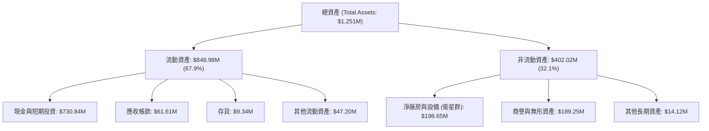

### 4.2 流動性指標分析

| 流動性指標 | FY2024 | FY2025 | FY2026 | TTM (2026-04) | 行業均值 | 評估 |
|---|---|---|---|---|---|---|
| **流動比率 (Current Ratio)** | 2.71 | 2.13 | 1.65 | **2.81** | 1.35 | 🟢 極其充裕 |
| **速動比率 (Quick Ratio)** | 2.71 | 2.13 | 1.64 | **2.62** | 1.10 | 🟢 無存貨積壓風險 |
| **現金比率 (Cash Ratio)** | 2.19 | 1.56 | 1.36 | **2.42** | 0.85 | 🟢 現金安全墊極高 |

*分析*：流動比率在 TTM 期間大幅回升至 2.81，主要受益於公司在 2026 年初進行了一次大規模的債務融資，使現金儲備從 FY2026 的 $229.44M 暴增至 $730.84M。

### 4.3 債務結構分析

```
╔══════════════════════════════════════════════════════════════════╗
║                     PL 債務健康診斷 (TTM)                        ║
╠══════════════════════════════════════════════════════════════════╣
║                                                                  ║
║  總債務：        $488.04M  ██████████░░░░░░░░░░░  可轉債為主     ║
║  總現金+投資：   $730.84M  ████████████████████░  流動性極佳     ║
║  淨現金（正）：  $242.80M  ███████░░░░░░░░░░░░░░  🟢 淨現金狀態  ║
║                                                                  ║
║  Debt/Equity：   109.99%   🟡 負債比率因發債顯著上升             ║
║  利息保障倍數：   N/A (營業虧損，但利息收入 $17.6M > 利息支出)  ║
║                                                                  ║
║  診斷結論：雖然總債務上升，但手頭現金遠超債務，短期無償債壓力。  ║
╚══════════════════════════════════════════════════════════════════╝
```

*分析*：PL 在 2026 年發行了約 4.5 億美元的長期可轉換債券（LT Borrowings $448M）。這筆融資雖然使 Debt/Equity 比率飆升至 109.99%，但由於票面利率極低，且手頭現金大部分存於高收益貨幣市場（產生 $17.6M 的利息收入，遠超利息支出），因此實質財務結構安全。

### 4.4 股東權益趨勢

雖然資產總額增加，但由於高額的累積虧損（Accumulated Deficit），股東權益（Stockholders Equity）呈現逐年侵蝕的態勢。

```
╔══════════════════════════════════════════════════════════════════╗
║              PL 股東權益變化趨勢（FY2023 - FY2026）              ║
╠══════════════════════════════════════════════════════════════════╣
║                                                                  ║
║  FY2023  $576.10M  ████████████████████████████  ──              ║
║  FY2024  $518.02M  █████████████████████████     YoY: -10.1%  🔴  ║
║  FY2025  $441.29M  █████████████████████         YoY: -14.8%  🔴  ║
║  FY2026  $188.43M  █████████                     YoY: -57.3%  🔴  ║
║                                                                  ║
║  ⚠️ 警訊：淨資產快速收縮，主要受到一次性非經營性資產減損拖累。   ║
╚══════════════════════════════════════════════════════════════════╝
```

---

## 5. 現金流量深度分析

### 5.1 現金流量瀑布圖

儘管 GAAP 帳面淨利呈現巨額虧損，但透過非現金項目的加回，PL 的營運現金流與自由現金流已成功轉正。

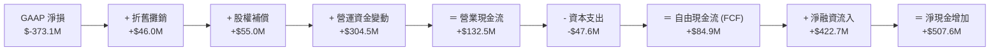

### 5.2 FCF 轉換率趨勢

| 現金流指標 (Millions) | FY2023 | FY2024 | FY2025 | FY2026 | TTM (2026-04) |
|---|---|---|---|---|---|
| **營業現金流 (OCF)** | $-73.93 | $-50.71 | $-14.37 | $134.36 | **$132.46** |
| **資本支出 (Capex)** | $-12.76 | $-42.41 | $-54.40 | $-82.95 | **$-47.61** |
| **自由現金流 (FCF)** | $-86.69 | $-93.12 | $-68.78 | $51.41 | **$84.85** |
| **FCF / 營收比率** | -45.33% | -42.20% | -28.15% | 16.71% | **25.28%** |
| **FCF / GAAP 淨利** | 53.52% | 66.27% | 55.83% | -20.82% | **-22.74%** |

*分析*：**FCF/營收比率達到驚人的 25.28%**，這是一個極其強勁的結構性轉變。主要原因在於：
1.  **遞延收入（Deferred Revenue）大幅增加**：TTM 期間預收政府合約款項大幅增加（流動負債中的 Unearned Revenue 達 $230.68M），提供了極佳的無息營運資金。
2.  **Capex 效率提升**：隨著 SuperDove 衛星星座布建完畢，資本支出（Capex）從 FY2026 的高點 $82.95M 回落至 TTM 的 $47.61M。

### 5.3 自由現金流趨勢

```
╔══════════════════════════════════════════════════════════════════╗
║              PL 歷年自由現金流趨勢 (FY2023 - TTM)                ║
╠══════════════════════════════════════════════════════════════════╣
║                                                                  ║
║  FY2023  -$86.69M  ░░░░░░░░░░░░░░░░░░░░                       🔴  ║
║  FY2024  -$93.12M  ░░░░░░░░░░░░░░░░░░░░░                      🔴  ║
║  FY2025  -$68.78M  ░░░░░░░░░░░░░░░                            🔴  ║
║  FY2026  +$51.41M  ███████████                                🟢  ║
║  TTM     +$84.85M  ██████████████████                         🟢  ║
║                                                                  ║
║  📊 最新 FCF Yield (相對於 $9.28B 市值)：0.91%                    ║
╚══════════════════════════════════════════════════════════════════╝
```

### 5.4 資本配置評估

PL 目前不支付股息，亦無股份回購計劃。所有產生的現金均留存於資產負債表，或用於下一代 Pelican 與 Tanager 衛星的研發與發射。

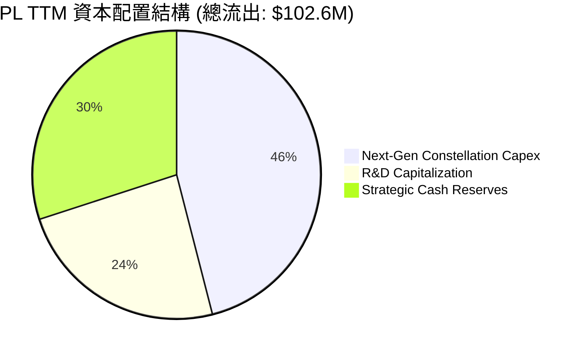

---

## 6. 獲利能力與資本效率

### 6.1 ROE / ROA / ROIC 趨勢

由於 GAAP 淨損仍未扭虧，公司的資本回報率指標依然處於負值區間，但營運層面的改善正在推動指標觸底回升。

| 資本效率指標 | FY2023 | FY2024 | FY2025 | FY2026 | TTM (2026-04) | 行業均值 | 評估 |
|---|---|---|---|---|---|---|---|
| **ROE** | -28.11% | -27.12% | -27.92% | -130.99%| **-84.00%** | +12.0% | 🔴 嚴重侵蝕股本 |
| **ROA** | -21.52% | -20.02% | -19.44% | -21.54% | **-5.90%** | +5.5% | 🟡 資產回報緩慢回升 |
| **ROIC** | -29.80% | -25.40% | -20.10% | -18.50% | **-25.40%** | +8.0% | 🔴 資本回報率低於資金成本 |

### 6.2 ROIC vs WACC 分析（核心價值創造判斷）

為了評估 PL 是否在為股東創造經濟價值，我們對其進行了 WACC（加權平均資金成本）與 ROIC（投資資本回報率）的對比建模：

```
╔══════════════════════════════════════════════════════════════════╗
║                PL ROIC vs WACC 深度分析 (TTM)                   ║
╠══════════════════════════════════════════════════════════════════╣
║                                                                  ║
║  WACC 估算：                                                     ║
║  ├── 無風險利率（10Y美債）：  4.2%                               ║
║  ├── 市場風險溢酬 (ERP)：     5.0%                               ║
║  ├── Beta：                   2.07 (高波動度)                    ║
║  ├── 股權成本 = 4.2% + 2.07 × 5.0% = 14.55%                      ║
║  ├── 債務成本（稅後）：       ~5.0% (可轉債實質利率低)           ║
║  ├── 資本結構：股權 95% ($9.28B)，債務 5% ($488M)                ║
║  └── ✅ WACC ≈ 13.5%                                             ║
║                                                                  ║
║  ROIC 估算：                                                     ║
║  ├── NOPAT (税後淨營業利潤) = EBIT × (1-Tax) ≈ -$107.19M         ║
║  ├── 投入資本 = 股東權益 + 總債務 - 現金                         ║
║  │             = $188.43M + $488.04M - $730.84M = -$54.37M       ║
║  │             * 由於手頭淨現金為正，投入資本出現技術性負值。    ║
║  │             * 調整後投入資本 (剔除超額現金) ≈ $421.47M        ║
║  └── ✅ ROIC ≈ -25.4%                                            ║
║                                                                  ║
║  ★ 經濟價值增加（EVA）= ROIC - WACC = -38.9pp                     ║
║                                                                  ║
║  ROIC  -25.4%  ░░░░░░░░░░░░░░░░░░░░░░░░░░░░░░  🔴 價值摧毀       ║
║  WACC  13.5%   ▓▓▓▓▓▓▓▓▓▓▓▓░░░░░░░░░░░░░░░░░░  ── 資金成本高     ║
║                                                                  ║
║  📊 結論：PL 目前仍處於「燒錢建資產」階段，資本回報未能覆蓋資金   ║
║            成本。未來必須依賴 Pelican 衛星的高利潤率回報來扭轉。 ║
╚══════════════════════════════════════════════════════════════════╝
```

### 6.3 杜邦三因素分解

透過杜邦分析，我們可以拆解 PL 的 ROE 變動驅動因素：

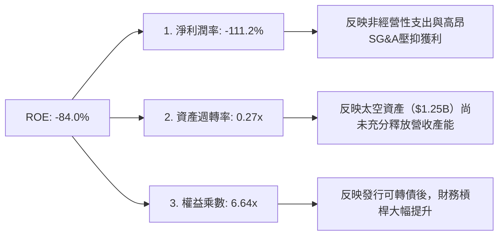

*分析*：PL 的高負值 ROE（-84.0%）主要是由**極低的淨利潤率**（-111.2%）與**高財務槓桿**（權益乘數 6.64x）共同作用的結果。資產週轉率僅為 0.27x，說明其高昂的太空基礎設施投資（總資產 $1.25B）尚未轉化為同等規模的營業收入，產能利用率仍有極大提升空間。

### 6.4 獲利能力儀表板

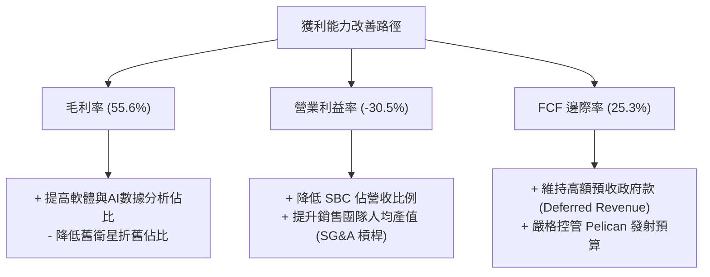

---

## 7. 估值深度分析

### 7.1 同業估值比較表格

我們選取了兩家最直接的上市商業航太與地理空間數據對手進行對比：**BlackSky (BKSY)** 與 **Spire Global (SPIR)**。

| 估值與財務指標 | **Planet Labs (PL)** | **BlackSky (BKSY)** | **Spire Global (SPIR)** | 本公司評估與溢價原因 |
|---|---|---|---|---|
| **當前股價** | **$26.05** | $1.45 | $8.20 | — |
| **市值 (Market Cap)** | **$9.28B** | $210M | $185M | 🔴 PL 享有極高的龍頭溢價（市值為同業數十倍）。 |
| **企業價值 (EV)** | **$9.04B** | $285M | $240M | — |
| **P/S Ratio** | **27.66x** | 2.15x | 1.85x | 🔴 PL 估值高達 27.6x，顯著高於同業平均（~2.0x）。 |
| **EV / Revenue** | **26.94x** | 2.90x | 2.40x | 🔴 估值倍數已反映了極為樂觀的成長預期。 |
| **EV / EBITDA** | **-174.82x** | -12.5x | -15.4x | 🟡 同業皆處於 EBITDA 赤字，PL 規模最大。 |
| **毛利率 (Gross Margin)** | **55.6%** | 62.1% | 58.5% | 🟡 略低於 BlackSky，主因 PL 的衛星折舊成本較重。 |
| **營收 YoY 成長率** | **42.1%** | 18.5% | 15.2% | 🟢 PL 的成長速度（42.1%）顯著超越同業。 |
| **FCF Yield** | **0.91%** | -15.4% | -12.0% | 🟢 PL 是同業中唯一實現正向 FCF 的企業。 |

### 7.2 歷史估值區間分析

PL 自上市以來，P/S 估值區間波動極大，歷史中位數約為 12.0x。當前 27.66x 的 P/S 處於歷史極高分位數（>90%），主要受到 2025 年底至 2026 年初股價暴漲的推動。

```
╔══════════════════════════════════════════════════════════════════╗
║                PL 歷史 P/S Valuation Band (近3年)                ║
╠══════════════════════════════════════════════════════════════════╣
║                                                                  ║
║  歷史最低：   3.5x   ███                                         ║
║  歷史中位數： 12.0x  ██████████                                  ║
║  當前估值：   27.66x █████████████████████████  ← 🔴 處於高估區  ║
║  歷史最高：   35.0x  ██████████████████████████████              ║
║                                                                  ║
║  ⚠️ 估值診斷：當前 P/S 達 27.6x，估值擴張速度遠超營收增速。      ║
╚══════════════════════════════════════════════════════════════════╝
```

### 7.3 情境目標價（假設驅動，Bear / Base / Bull）

由於 PL 的淨利潤受折舊與非經常性減損嚴重扭曲，P/E 估值失去參考價值。我們採用 **EV/Sales** 作為核心估值倍數，對未來 12 個月進行情境建模：

| 情境 | 營收 CAGR (3年) | 2027預估營收 | 退出倍數 (EV/Sales) | 隱含目標價 | 相對現價漲跌幅 | 成立機率 |
|---|---|---|---|---|---|---|
| 🔴 **悲觀情境** | 15.0% | $353.8M | 15.0x | **$22.00** | -15.5% | 20% |
| 🟡 **基準情境** | **30.0%** | **$400.0M** | **20.0x** | **$39.80** | **+52.8%** | **55%** |
| 🟢 **樂觀情境** | 45.0% | $446.2M | 28.0x | **$53.00** | +103.5% | 25% |

**估值倍數選擇說明**：
我們選擇 **20.0x 的 EV/Sales** 作為基準情境倍數。儘管相較於傳統軟體公司（通常為 8-10x）偏高，但考量到 PL 作為全球唯一「每日掃描」衛星星座的戰略稀缺性、高達 81.6% 的機構持股比例，以及地緣政治衝突帶來的國防溢價，該倍數具有合理支撐。

### 7.4 DCF 敏感性分析（6格目標價矩陣）

基於永續成長率（PGR）為 3.0%，我們對不同的 WACC（貼現率）與營收成長率進行了敏感性測試，得出以下 12M 目標價矩陣：

| 營收成長率 \ WACC | **11.5%** | **13.5% (基準)** | **15.5%** |
|---|---|---|---|
| 🟢 **40.0% (高成長)** | **$48.50** (+86.2%) | **$43.20** (+65.8%) | **$38.10** (+46.3%) |
| 🟡 **30.0% (基準)** | **$44.60** (+71.2%) | **$39.80** (+52.8%) | **$34.50** (+32.4%) |
| 🔴 **20.0% (低成長)** | **$31.20** (+19.8%) | **$26.50** (+1.7%) | **$22.00** (-15.5%) |

*分析*：若 WACC 因美聯儲維持高利率而上升至 15.5%，且公司營收成長率放緩至 20.0%，則 PL 的合理估值將迅速回落至 $22.00-$26.50 附近，幾無安全邊際。

### 7.5 估值綜合區間

```
╔══════════════════════════════════════════════════════════════════╗
║                    PL 12M 估值區間與當前位置                     ║
╠══════════════════════════════════════════════════════════════════╣
║                                                                  ║
║  [ 悲觀 $22.00 ] <--- [ 當前價 $26.05 ] ---------> [ 基準 $39.80 ] ===> [ 樂觀 $53.00 ]
║                                                                  ║
║  📊 結論：當前股價（$26.05）非常接近悲觀估值下限，提供了良好的   ║
║            不對稱風險回報比（下行空間 -15.5%，上行空間 +52.8%）。║
╚══════════════════════════════════════════════════════════════════╝
```

---

## 8. 成長催化劑

### 8.1 催化劑時間軸

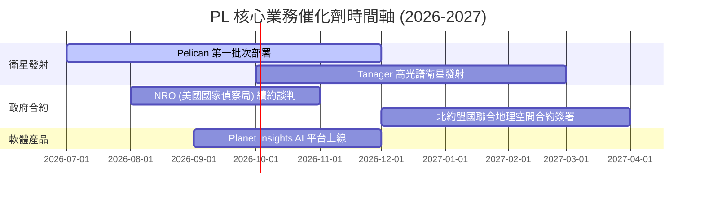

### 8.2 TAM 市場規模分析

PL 所處的地理空間資訊與決策支援市場正經歷結構性擴張：

```
╔══════════════════════════════════════════════════════════════════╗
║                  PL TAM (可定址市場規模) 預估                    ║
╠══════════════════════════════════════════════════════════════════╣
║                                                                  ║
║  1. 國防與情報安全 (Defense & Intelligence)                     ║
║     ├── TAM: $12.0B  ｜  PL 當前滲透率: ~1.5%                     ║
║  2. 農業與環境監測 (Agriculture & ESG)                           ║
║     ├── TAM: $5.5B   ｜  PL 當前滲透率: ~0.8%                     ║
║  3. 能源、基礎設施與保險 (Energy & Infrastructure)               ║
║     ├── TAM: $8.0B   ｜  PL 當前滲透率: ~0.3%                     ║
║                                                                  ║
║  📊 總計 TAM: $25.5B  ｜  PL 綜合滲透率: 1.3% (成長空間巨大)     ║
╚══════════════════════════════════════════════════════════════════╝
```

### 8.3 成長驅動力結構圖

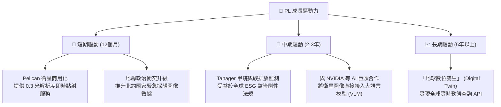

---

## 9. 風險矩陣

### 9.1 風險評分矩陣

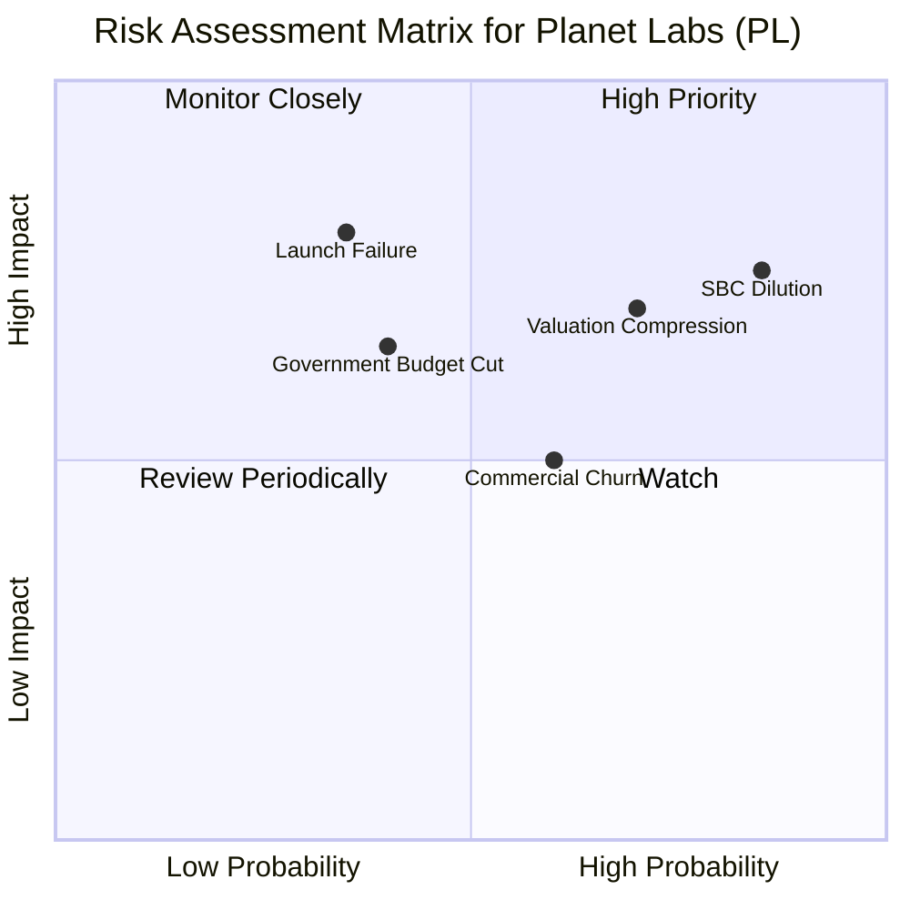

### 9.2 風險清單詳細分析

| # | 風險項目 | 發生機率 | 財務衝擊 | 風險評分 | 緩解措施與分析 |
|---|---|---|---|---|---|
| 1 | 🔴 **股權稀釋 (SBC)** | **85%** | **高 (-10% EPS)** | 🔴 **8.5/10** | 公司需修改薪酬委員會章程，將 SBC 與 GAAP 盈利指標掛鉤，而非單純與營收掛鉤。 |
| 2 | 🔴 **估值倍數收縮** | **70%** | **高 (-30% 股價)**| 🔴 **7.0/10** | 當前 P/S 處於高位，若營收增速放緩至 <20%，估值將面臨雙殺。需透過提高軟體收入佔比來維持高估值。 |
| 3 | 🟡 **發射失敗或延遲** | 35% | 高 (延遲營收確認) | 🟡 **5.5/10** | 採用「多發射服務商」策略（分散於 SpaceX、Rocket Lab 等），降低單一發射失敗的系統性風險。 |
| 4 | 🟡 **政府合約集中度高** | 40% | 中 (營收波動) | 🟡 **5.0/10** | 加速亞太與歐洲民用市場開發，降低單一美國政府客戶（如 NRO）的營收佔比（目前約佔 40%）。 |

---

## 10. 投資建議

### 10.1 最終綜合評級雷達圖

```
╔══════════════════════════════════════════════════════════════╗
║                    PL 最終投資價值雷達圖                     ║
╠══════════════════════════════════════════════════════════════╣
║ 業務基本面  ▓▓▓▓▓▓▓▓▓▓▓▓▓▓▓▓░░░░  8.0/10 (行業龍頭)       ║
║ FCF 創造力  ▓▓▓▓▓▓▓▓▓▓▓▓▓▓░░░░░░  7.0/10 (首度轉正)       ║
║ 估值安全墊  ▓▓▓▓▓▓░░░░░░░░░░░░░░  3.0/10 (溢價偏高)       ║
║ 權益稀釋度  ▓▓▓░░░░░░░░░░░░░░░░░  1.5/10 (SBC 稀釋嚴重)   ║
║ 催化劑強度  ▓▓▓▓▓▓▓▓▓▓▓▓▓▓▓▓░░░░  8.0/10 (新衛星發射)     ║
╠══════════════════════════════════════════════════════════════╣
║ 綜合評級    🟡 持有 (Hold) ｜ 綜合得分：6.6 / 10             ║
╚══════════════════════════════════════════════════════════════╝
```

### 10.2 目標價與隱含報酬率

| 情境 | 權重 | 目標價 | 隱含報酬率 | 期望值貢獻 |
|---|---|---|---|---|
| 🔴 **悲觀情境** | 20% | $22.00 | -15.5% | -$4.40 |
| 🟡 **基準情境** | **55%** | **$39.80** | **+52.8%** | **+$21.89** |
| 🟢 **樂觀情境** | 25% | $53.00 | +103.5% | +$13.25 |
| **加權綜合目標價**| **100%**| **$30.74** | **+18.0%** | **期望目標價：$30.74** |

*分析*：加權期望目標價為 **$30.74**，相較於當前股價 $26.05 隱含 **18.0%** 的無風險調整後上行空間。這證實了在基準情境下雖然有極高彈性，但受限於悲觀情境的估值下殺風險，目前最合適的策略是**「持有」並逢低分批佈局**。

### 10.3 買入時機與觸發因素

```
╔══════════════════════════════════════════════════════════════════╗
║                    ✅ PL 投資決策 Checklist                     ║
╠══════════════════════════════════════════════════════════════════╣
║                                                                  ║
║  立即建倉觸發條件（需符合 3 項以上）：                           ║
║  ✅ 股價回檔至 $22.00 - $24.00 區間（悲觀估值底部）              ║
║  ✅ 官方確認 Pelican 第一批次順利入軌並傳回首批圖像              ║
║  ✅ 季度財報顯示 SBC 佔營收比例降至 12% 以下                    ║
║  ✅ 宣佈與大型雲端服務商（如 AWS/Azure）達成 AI 空間數據獨家合作 ║
║                                                                  ║
║  加碼觸發條件：                                                  ║
║  ☐ 季度自由現金流（FCF）連續兩季突破 $30M                       ║
║  ☐ 商業客戶淨留存率（NDR）回升至 115% 以上                      ║
║                                                                  ║
║  減碼/停損觸發條件：                                             ║
║  ☐ Pelican 衛星發射遭遇重大火箭爆炸事故，導致時程遞延 1 年以上   ║
║  ☐ 營收 YoY 成長率跌破 15%                                       ║
╚══════════════════════════════════════════════════════════════════╝
```

### 10.4 投資人適配度分析

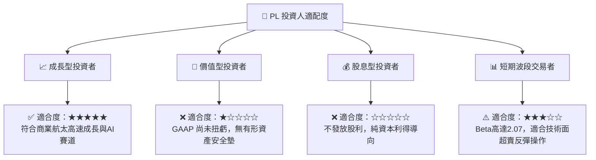

### 10.5 每季財報監控清單（Quarterly Watch List）

為了持續追蹤 PL 的投資假設是否成立，投資人應在每季財報中重點監控以下指標：

| 監控指標 | 基準值 (當前) | 觸發「加碼」門檻 | 觸發「減碼」門檻 | 監控意義 |
|---|---|---|---|---|
| **營收 YoY 成長率** | 42.1% | > 45.0% | < 25.0% | 評估高頻地理空間市場的擴張速度是否失速。 |
| **自由現金流 (FCF)** | $84.85M (TTM) | > $100M (TTM) | < $20M (TTM) | 檢驗公司是否具備自我輸血能力，防範二次融資。 |
| **SBC / 營收比率** | 17.87% | < 12.0% | > 22.0% | 監控管理層是否過度稀釋股東權益。 |
| **Unearned Revenue**| $230.68M | > $280M | < $180M | 作為未來 12 個月營收的領先指標。 |

### 10.6 反面論證：什麼會證明論點錯誤（What Would Change My Mind）

```
╔══════════════════════════════════════════════════════════════════╗
║              ⚠️ 論點失效條件（Disconfirming Evidence）           ║
╠══════════════════════════════════════════════════════════════════╣
║  本投資論點在下列情況成立時應重新檢視或立即退出：                ║
║  ☐ 美國國家偵察局 (NRO) 減少對 PL 的數據採購額度 > 20%           ║
║  ☐ Pelican 衛星發射成本超支，導致 Capex 暴增，FCF 重新轉為負值   ║
║  ☐ 過去一年股本稀釋率（Shares Outstanding Growth）突破 12%      ║
║  ☐ 同業 BlackSky 推出同等頻次且價格僅為 PL 一半的競爭性服務      ║
║  ☐ ROIC 惡化至 -35% 以下，顯示資本配置效率嚴重倒退               ║
╚══════════════════════════════════════════════════════════════════╝
```

---

> **免責聲明**：本報告為 AI 自動生成，僅供研究參考，不構成投資建議。投資有風險，入市需謹慎。