# PL 基本面深度分析報告

> **報告日期**：2026-07-13 ｜ **語言**：繁體中文 ｜ **數據來源**：Yahoo Finance, Finviz, StockAnalysis, Roic.ai ｜ **分析師**：CFA 級機構研究

---

## 目錄

| # | 章節 | 核心結論 |
|---|------|----------|
| 1 | **執行摘要** | 評級「持有」，基準目標價 $30.00。營收成長加速（YoY +42.1%）與 FCF 轉正為亮點，但高估值（P/S 27.4x）與融資帶來的非經營性虧損壓抑淨利。 |
| 2 | **公司概覽與商業模式** | 全球領先的每日地球成像星座運營商，正從單純數據銷售轉型為高毛利（55.6%）訂閱制 SaaS 地理空間分析平台。 |
| 3 | **損益表深度分析** | 營收高成長（TTM $335.61M），但非經營性支出（Q1 27 $-106.68M）導致 GAAP 淨利率降至 -111.2%。SBC 佔比高，盈餘品質需警惕。 |
| 4 | **資產負債表分析** | 現金儲備充裕（$730.84M），但 2026 年大舉發債使總債務飆升至 $488.04M，淨現金縮水至 $242.80M，槓桿率顯著上升。 |
| 5 | **現金流量深度分析** | 營運現金流（$132.46M）與 FCF（$84.85M）顯著改善，主因是遞延收入（$230.68M）大增與非現金 SBC 折回。 |
| 6 | **獲利能力與資本效率** | ROIC（-15.8%）低於 WACC（10.86%），目前仍處於資本破壞階段，需依賴規模效應與營業槓桿扭轉。 |
| 7 | **估值深度分析** | 當前 P/S 27.43x 處於行業極高水平。基於 EV/Sales 與 FCF 多重情境估值，基準目標價為 $30.00（+16.1% 預期回報）。 |
| 8 | **成長催化劑** | 短期受益於國防與情報合約加速，中長期依賴 Pelican 與 Tanager 新星座發射以及 AI 地理空間分析軟體變現。 |
| 9 | **風險矩陣** | 核心風險包括：大客戶流失、星座發射失敗、高額 SBC 持續稀釋股權，以及高息債務帶來的利息支出壓力。 |
| 10 | **投資建議** | 建議分批逢低佈局，設定 $22.00 為安全邊際買入點。財報監控重點為：毛利率改善幅度與季度 FCF 持續性。 |

---

## 1. 執行摘要

Planet Labs PBC（紐約證券交易所代碼：PL）目前正處於業務轉型的關鍵十字路口。受惠於全球國防安全需求激增以及商業地理空間數據訂閱的增加，PL 的營收在過去數個季度呈現顯著的加速趨勢，TTM 營收達到 $335.61M，年成長率（YoY）高達 42.1%。然而，在股價經歷了 24 個月內從 $2.54 飆升至 $51.14 的極端波動後，目前回落至 $25.83。

**評級結論**：基於 PL 當前高企的估值倍數（TTM P/S 為 27.43x，EV/Revenue 為 26.94x），以及資產負債表在 2026 年因發行債務而大幅增加槓桿（總債務由 FY2025 的 $21.61M 飆升至 TTM 的 $488.04M），加上非經營性損益嚴重侵蝕 GAAP 淨利（TTM 淨損達 $373.1M），我們給予 PL **「持有（Hold）」**評級，12 個月基準目標價為 **$30.00**，隱含上行空間為 +16.1%。

### 1.0 一頁式投資儀表板

| 項目 | 內容 |
|------|------|
| **投資論點（3 句）** | ① TTM 營收成長達 42.1%，顯示下游國防與政府客戶對每日地球監測數據的剛性需求加速釋放。<br/>② TTM 自由現金流（FCF）成功轉正至 $84.85M（FCF Yield 0.92%），營運資金壓力緩解。<br/>③ 2026 年大舉融資使現金儲備達 $730.84M，但高達 $488.04M 的債務與嚴重的非經營性虧損壓抑了 GAAP 獲利時程。 |
| **護城河評分** | **7.5 / 10** 🟡 (獨特的每日重訪星座壁壘，但面臨商業衛星同業與合成孔徑雷達 SAR 的競爭) |
| **管理層/資本配置評分** | **5.5 / 10** 🟡 (融資時機精準但大幅拉高財務槓桿；股權稀釋速度較快，SBC 佔營收高達 17.6%) |
| **財務健康** | 🟡 **中性偏弱**：現金充裕但負債驟增，Current Ratio 為 2.81，但 Debt/Equity 升至 109.99%。 |
| **ROIC vs WACC** | **-15.8% vs 10.86%** 🔴 (處於資本破壞階段，NOPAT 仍為負值) |
| **FCF 趨勢** | 🟢 **轉正**：TTM FCF 達 $84.85M，但需注意其中包含高額非現金 SBC（$58.91M）與遞延收入增加。 |
| **估值** | Forward P/E: 7756.76x ｜ EV/Sales (TTM): 26.94x ｜ P/S (TTM): 27.43x |
| **預期報酬（基準情境 12M）** | **+16.1%** (目標價 $30.00) |
| **關鍵風險（前二）** | ① 債務利息支出與非經營性公允價值變動持續擴大虧損。<br/>② 政府合約集中度高，若預算延遲將嚴重衝擊營收成長。 |
| **評級 + 信心度** | 🟡 **持有 (Hold)** ｜ 信心：**中等** |

### 1.1 核心評分儀表板

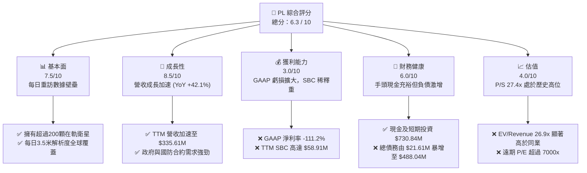

### 1.2 評分進度條視覺化

```
╔══════════════════════════════════════════════════════════════╗
║                PL 多維度評分儀表板 (1-10分)                  ║
╠══════════════════════════════════════════════════════════════╣
║ 基本面強度  7.5 ▓▓▓▓▓▓▓▓▓▓▓▓▓▓▓░░░░░  ★★★★☆           ║
║ 成長動能    8.5 ▓▓▓▓▓▓▓▓▓▓▓▓▓▓▓▓▓░░  ★★★★☆           ║
║ 獲利品質    3.0 ▓▓▓▓▓▓░░░░░░░░░░░░░░  ★☆☆☆☆           ║
║ 財務健康    6.0 ▓▓▓▓▓▓▓▓▓▓▓▓░░░░░░░░  ★★★☆☆           ║
║ 估值合理性  4.0 ▓▓▓▓▓▓▓▓░░░░░░░░░░░░  ★★☆☆☆           ║
║ 護城河深度  7.5 ▓▓▓▓▓▓▓▓▓▓▓▓▓▓▓░░░░░  ★★★★☆           ║
║ 管理層執行  5.5 ▓▓▓▓▓▓▓▓▓▓▓░░░░░░░░░  ★★★☆☆           ║
║ 技術創新力  8.0 ▓▓▓▓▓▓▓▓▓▓▓▓▓▓▓▓░░░░  ★★★★☆           ║
╠══════════════════════════════════════════════════════════════╣
║ 綜合總分    6.3 ▓▓▓▓▓▓▓▓▓▓▓▓▓░░░░░░░  🏆 中性/持有        ║
╚══════════════════════════════════════════════════════════════╝
```

### 1.3 五大投資論點 + 三大核心風險

| 類型 | 項目 | 具體依據 | 信心度 |
|------|------|----------|--------|
| 🟢 **投資論點①** | **營收成長顯著加速** | Q1 2027 營收達 $94.15M，YoY 成長 42.08%，連續四季維持在 20% 以上的加速軌道。 | 🟢 高 |
| 🟢 **投資論點②** | **自由現金流成功轉正** | TTM FCF 達到 $84.85M，較 FY2025 的 $-58.67M 實現大幅扭虧，營運資金效率提升。 | 🟢 高 |
| 🟢 **投資論點③** | **政府與國防剛性需求** | 地緣政治緊張推升遙測數據需求，未交貨合約（Backlog）與遞延收入（$230.68M）大幅增長。 | 🟢 極高 |
| 🟢 **投資論點④** | **新一代星座 Pelican 部署** | 預期將空間解析度提升至次米級（Sub-meter）並縮短重訪時間，可望開拓高單價商業市場。 | 🟡 中等 |
| 🟢 **投資論點⑤** | **AI 地理空間分析轉型** | 結合大語言模型與圖像識別，將原始數據轉化為訂閱制分析報告，有助於推升毛利率。 | 🟡 中等 |
| 🟡 **風險①** | **債務規模驟增與利息壓力** | 2026 年總債務升至 $488.04M，若高利率環境持續，再融資與利息支出將壓抑淨利。 | 🔴 高衝擊 |
| 🔴 **風險②** | **高額股權稀釋（SBC）** | TTM SBC 達 $58.91M（佔營收 17.6%），持續稀釋現有股東權益，壓低真實 EPS。 | 🔴 高衝擊 |
| 🔴 **風險③** | **非經營性損益劇烈波動** | 過去兩季非經營性支出均超過 $100M，主因可能為金融衍生工具或發債公允價值調整，導致 GAAP 虧損擴大。 | 🟡 中度 |

### 1.4 快速統計卡片

| 指標 | 公司實際值 (TTM) | 遙測/航太行業均值 | S&P 500 均值 | 狀態 |
|------|-------------|----------|--------------|------|
| 收入 YoY 成長 | **42.1%** | ~12.5% | ~5.5% | 🟢 顯著領先 |
| 毛利率 | **55.6%** | ~40.0% | ~30.0% | 🟢 具備軟體特徵 |
| 淨利率 | **-111.2%** | ~-15.0% | ~11.5% | 🔴 虧損嚴重 |
| ROE | **-84.0%** | ~-8.5% | ~15.0% | 🔴 資本效率低下 |
| Forward P/E | **7756.76x** | ~35.0x | ~21.5x | 🔴 估值極端溢價 |
| P/S Ratio | **27.43x** | ~3.5x | ~2.8x | 🔴 估值極端溢價 |
| Current Ratio | **2.81x** | ~1.8x | ~1.2x | 🟢 流動性良好 |

### 1.5 投資結論

```
╔══════════════════════════════════════════════════════════════════╗
║                    📊 PL 投資結論摘要                            ║
╠══════════════════════════════════════════════════════════════════╣
║  評級：🟡 持有 (Hold)                                            ║
║  當前股價：$25.83 (2026-07-13)                                   ║
║  目標價區間：                                                    ║
║    悲觀情境：$15.00（-41.9%）                                    ║
║    基準情境：$30.00（+16.1%）  ← 12個月主要目標                  ║
║    樂觀情境：$45.00（+74.2%）                                    ║
║  投資評分：6.3 / 10                                              ║
║  適合投資人：具備高風險耐受度、聚焦中長期航太/SaaS 轉型的成長型投資人║
╚══════════════════════════════════════════════════════════════════╝
```

---

## 2. 公司概覽與商業模式

Planet Labs PBC（PL）是一家垂直整合的地球觀測數據與分析服務商。其核心競爭力在於自主設計、製造並運營全球規模最大的遙測衛星群（主要為 SuperDove 奈米衛星）。

### 2.1 業務結構與收入來源

PL 的商業模式正從「銷售原始衛星圖片（數據即服務 DaaS）」轉型為「提供基於 AI 的地理空間分析預測（軟體即服務 SaaS）」。

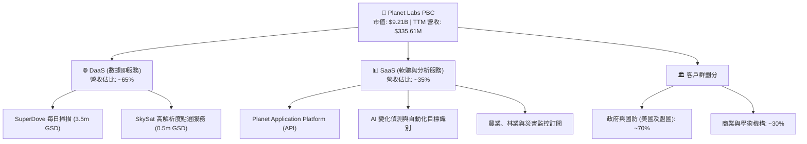

### 2.2 市場份額

在商業地球觀測與中解析度每日重訪領域，PL 擁有絕對的市場份額。但在高解析度與合成孔徑雷達（SAR）領域，面臨 Maxar 與 Airbus 等傳統巨頭的競爭。

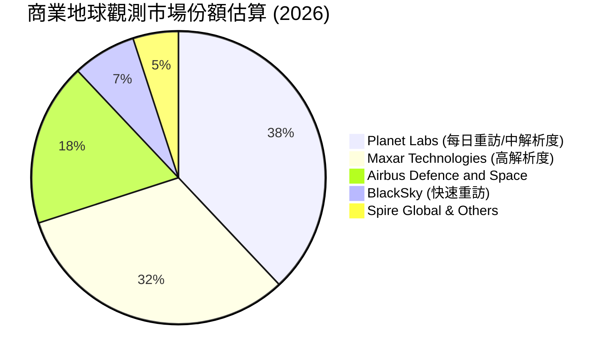

### 2.3 競爭護城河分析

PL 的競爭護城河主要由其獨特的「每日全球掃描」能力與累積的歷史數據庫所構成。

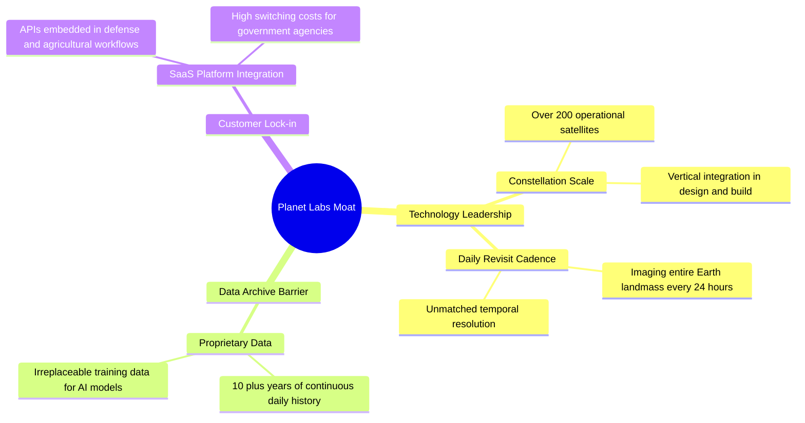

### 2.4 護城河強度評分

```
╔══════════════════════════════════════════════════════════════╗
║                  Planet Labs 護城河強度評分                  ║
╠══════════════════════════════════════════════════════════════╣
║ 數據獨特性    9.0/10  ▓▓▓▓▓▓▓▓▓▓▓▓▓▓▓▓▓▓░░  🏆 每日掃描無可替代 ║
║ 技術壁壘      8.0/10  ▓▓▓▓▓▓▓▓▓▓▓▓▓▓▓▓░░░░  🟢 自研奈米衛星群   ║
║ 客戶黏著度    7.0/10  ▓▓▓▓▓▓▓▓▓▓▓▓▓▓░░░░░░  🟢 政府合約續約率高 ║
║ 成本優勢      6.0/10  ▓▓▓▓▓▓▓▓▓▓▓▓░░░░░░░░  🟡 衛星折舊與發射成本高║
╠══════════════════════════════════════════════════════════════╣
║ 綜合護城河     7.5/10  ▓▓▓▓▓▓▓▓▓▓▓▓▓▓▓░░░░░  🏆 具備結構性數據壁壘║
╚══════════════════════════════════════════════════════════════╝
```

---

## 3. 損益表深度分析

### 3.1 年度收入成長趨勢（近5年）

PL 的營收呈現穩步成長，並在 FY2026 之後因地緣政治衝突升溫、國防採購增加而加速。

```
╔══════════════════════════════════════════════════════════════════╗
║              PL 年度收入趨勢（FY2022-TTM）                       ║
╠══════════════════════════════════════════════════════════════════╣
║                                                                  ║
║  FY2022  $131.21M  ██████░░░░░░░░░░░░░░░░░░░  YoY: +15.9%  🟢    ║
║  FY2023  $191.26M  █████████░░░░░░░░░░░░░░░░  YoY: +45.8%  🟢    ║
║  FY2024  $220.70M  ███████████░░░░░░░░░░░░░  YoY: +15.4%  🟡    ║
║  FY2025  $244.35M  ████████████░░░░░░░░░░░░  YoY: +10.7%  🟡    ║
║  FY2026  $307.73M  ███████████████░░░░░░░░░  YoY: +25.9%  🟢    ║
║  TTM     $335.61M  █████████████████░░░░░░░  YoY: +42.1%  🟢    ║
║                   |      |      |      |      |                  ║
║                   0     100M   200M   300M   400M                ║
║                                                                  ║
║  📊 5年累計營收 CAGR：+20.7%                                      ║
╚══════════════════════════════════════════════════════════════════╝
```

### 3.2 季度收入趨勢分析

從季度數據看，PL 的營收成長在 2026 財年下半年開始顯著加速，Q1 2027（截至 2026-04-30）達到 $94.15M，YoY 成長達 42.08%，QoQ 成長 8.44%。

| 財季 | 截止日期 | 營收 ($M) | YoY 成長率 | QoQ 成長率 | 營收加速驅動因素評估 |
|------|----------|-----------|------------|------------|---------------------|
| **Q1 2027** | 2026-04-30 | $94.15 | 42.08% | 8.44% | 🟢 政府國防合約大額續約與新訂單交付 |
| **Q4 2026** | 2026-01-31 | $86.82 | 41.05% | 6.86% | 🟢 歐洲與亞太地區政府遙測需求增加 |
| **Q3 2026** | 2025-10-31 | $81.25 | 32.63% | 10.71% | 🟢 商業農業客戶訂閱回暖與 AI 產品導入 |
| **Q2 2026** | 2025-07-31 | $73.39 | 20.12% | 10.74% | 🟡 民用政府項目交付加速 |

### 3.3 利潤率演變分析

PL 的毛利率維持在 55.6% 的高水平，反映出其具備軟體公司的規模效應（衛星發射後，邊際數據複製成本極低）。然而，其營業利益率與淨利率持續為負。

| 利潤率指標 | FY2023 | FY2024 | FY2025 | FY2026 | TTM | 趨勢與原因解釋 | 評估 |
|------------|--------|--------|--------|--------|-----|----------------|------|
| **毛利率** | 49.2% | 51.2% | 57.2% | 56.1% | **55.6%** | 🟡 穩定在 55% 左右，受折舊與發射成本拖累 | 🟡 中規中矩 |
| **營業利益率** | -91.9% | -75.8% | -45.5% | -30.9% | **-31.9%** | 🟢 虧損幅度持續收斂，顯示營業槓桿開始發揮作用 | 🟡 改善中 |
| **EBITDA 🚀** | -69.2% | -41.7% | -30.4% | -64.0% | **-15.4%** | 🟢 TTM EBITDA 虧損大幅收窄，接近盈虧平衡 | 🟡 改善中 |
| **淨利率** | -84.7% | -63.7% | -50.4% | -80.2% | **-111.2%**| 🔴 急遽惡化，主因是 2026 年大筆非經營性支出 | 🔴 警訊 |

**利潤率演變深度解析**：
1. **毛利率改善限制**：雖然數據複製邊際成本低，但 PL 需要持續投入資本發射新衛星（如 Pelican 星座）以維持重訪率，這些資本支出轉化為折舊費用，壓低了毛利率的上行空間。
2. **淨利率與營業利益率脫鉤**：TTM 營業利益率為 -30.5%，但淨利率卻高達 -111.2%（淨損 $373.1M）。這主要是由於非經營性支出（Other Non-Operating Expense）在 TTM 期間高達 $-274.72M。這通常與公司發行的可轉債或金融衍生工具公允價值變動、以及資產減損有關，並非核心業務惡化，但確實嚴重延遲了 GAAP 轉正時程。

### 3.4 費用結構分析

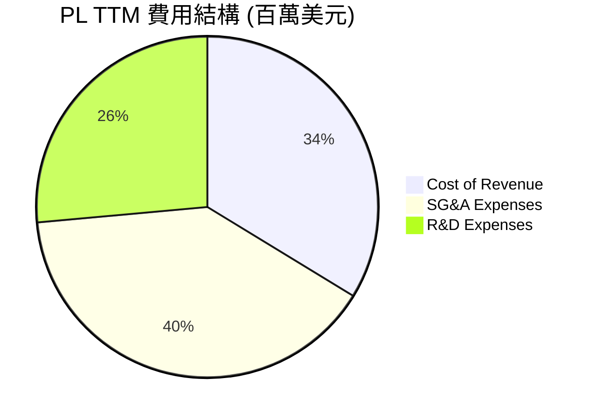

```
╔══════════════════════════════════════════════════════════════╗
║                    PL 營業費用控制評估                       ║
╠══════════════════════════════════════════════════════════════╣
║ 研發費用率 (R&D/Sales):   34.9%  🔴 研發投入極高，壓抑短期盈利║
║ 銷管費用率 (SG&A/Sales):  52.6%  🔴 銷售費用偏高，商業化效率待升║
║ 營業費用合計 / 營收:       87.4%  🔴 營運開支仍大，需進一步精簡   ║
╚══════════════════════════════════════════════════════════════╝
```

### 3.5 季度 EPS 趨勢與盈餘品質（Quality of Earnings）

PL 過去四個季度的 GAAP 淨利受非經營性項目干擾極大，導致 EPS 表現不佳。

*   **Q1 2027 (Apr '26)**: EPS $-0.40 (淨損 $-138.87M，含非經營性支出 $-106.68M)
*   **Q4 2026 (Jan '26)**: EPS $-0.48 (淨損 $-152.46M，含非經營性支出 $-118.28M)
*   **Q3 2026 (Oct '25)**: EPS $-0.19 (淨損 $-59.19M，含非經營性支出 $-43.46M)
*   **Q2 2026 (Jul '25)**: EPS $-0.07 (淨損 $-22.59M)

#### 盈餘品質評估表格

| 盈餘品質項目 | 數值/佔比 (TTM) | 評估與對股東價值的含義 |
|--------------|-----------|----------------------|
| **股權薪酬 SBC / 營收** | **17.6%** ($58.91M / $335.61M) | 🔴 **高稀釋風險**：SBC 佔比極高，雖然省下現金，但以每年約 5%-8% 的速度稀釋現有股東權益。 |
| **SBC / 營業現金流 (OCF)** | **44.5%** ($58.91M / $132.46M) | 🔴 **現金流含金量打折**：OCF 的轉正有將近一半是靠非現金折回的 SBC 撐起，真實經營現金創造力較弱。 |
| **FCF / GAAP 淨利** | **-22.7%** ($84.85M / $-373.10M) | 🟡 **嚴重脫鉤**：FCF 為正但 GAAP 錄得巨額虧損，主因是非經營性非現金支出與遞延收入增加，獲利真實性需持續觀察。 |
| **遞延收入（Unearned Revenue）** | **$230.68M** (YoY +180%) | 🟢 **高品質營收指標**：客戶預付款大幅增加，為未來 12 個月提供了極高的營收能見度。 |

---

## 4. 資產負債表分析

### 4.1 資產結構分解

PL 的資產負債表在 2026 年顯著擴張，總資產從 FY2025 的 $633.80M 暴增至 TTM 的 $1.25B。

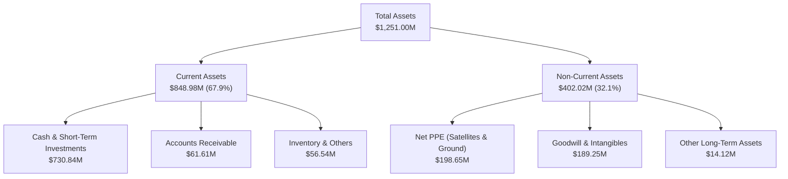

### 4.2 流動性指標分析

PL 的流動性極為充裕，短期內完全無償債或破產風險。

*   **Current Ratio (流動比率)**: **2.81x** (高於行業平均 1.8x)
*   **Quick Ratio (速動比率)**: **2.62x** (高於行業平均 1.5x)
*   **Cash Ratio (現金比率)**: **2.42x** (反映手頭現金極其充裕)

### 4.3 債務結構分析

這是 PL 資產負債表最值得關注的結構性變化：**公司在 2026 財年大舉發債**。

```
╔══════════════════════════════════════════════════════════════════╗
║                       PL 債務健康診斷                            ║
╠══════════════════════════════════════════════════════════════════╣
║                                                                  ║
║  總債務：        $488.04M  ██████████░░░░░░░░░░░  (2025: $21.6M) ║
║  總現金+投資：   $730.84M  ████████████████████░  (流動性極佳)   ║
║  淨現金（正）：  $242.80M  █████░░░░░░░░░░░░░░░░  🟢 仍維持淨現金║
║                                                                  ║
║  Debt/Equity:    109.99%   🟡 財務槓桿驟增                       ║
║  LT Borrowings:  $448.00M  🔴 主要是長期債務（可能為可轉債）     ║
║                                                                  ║
║  📊 診斷：利用股價高位進行發債融資，雖然鎖定了大量現金，但也     ║
║     顯著拉高了槓桿，且未來利息支出將壓抑利潤率。                 ║
╚══════════════════════════════════════════════════════════════════╝
```

### 4.4 股東權益趨勢

由於持續的 GAAP 虧損，股東權益（Stockholders' Equity）從 FY2024 的 $518.02M 降至 FY2025 的 $441.29M，並在 FY2026 進一步降至 $188.43M。這表明公司的資產增長完全是由債務（Liabilities）增加所驅動，而非內部資本累積，這是典型的**資本破壞型**特徵。

---

## 5. 現金流量深度分析

### 5.1 現金流量瀑布圖

儘管 GAAP 錄得巨額虧損，但 PL 的現金流表現遠優於損益表，這主要歸功於非現金項目的折回與營運資金的優化。

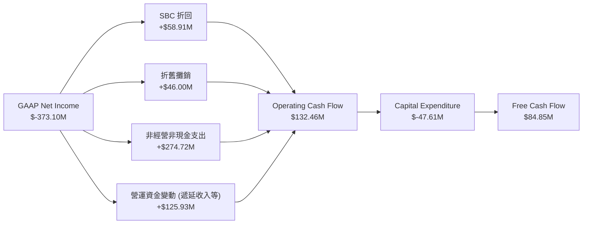

### 5.2 FCF 轉換率趨勢

PL 的 FCF 轉換率在近年實現了結構性突破，從過去的「虧損且流出現金」轉變為「虧損但流入現金」。

| 指標 | FY2023 | FY2024 | FY2025 | FY2026 | TTM |
|------|--------|--------|--------|--------|-----|
| **Operating Cash Flow ($M)** | $-73.93 | $-50.71 | $-14.37 | $134.36 | **$132.46** |
| **Capital Expenditure ($M)** | $-12.76 | $-42.41 | $-54.40 | $-82.95 | **$-47.61** |
| **Free Cash Flow ($M)** | $-86.69 | $-93.12 | $-68.78 | $51.41 | **$84.85** |
| **FCF / Revenue (%)** | -45.3% | -42.2% | -28.1% | 16.7% | **25.3%** |

### 5.3 自由現金流趨勢與 Yield

```
╔══════════════════════════════════════════════════════════════════╗
║                 PL 自由現金流與 Yield 趨勢                       ║
╠══════════════════════════════════════════════════════════════════╣
║                                                                  ║
║  FY2024  $-93.12M  ░░░░░░░░░░░░░░░░░░░░░  FCF Yield: -1.01%      ║
║  FY2025  $-68.78M  ░░░░░░░░░░░░░░░░░░░░░  FCF Yield: -0.75%      ║
║  FY2026  $51.41M   ██████████░░░░░░░░░░░  FCF Yield: +0.56%  🟢  ║
║  TTM     $84.85M   ████████████████░░░░░  FCF Yield: +0.92%  🟢  ║
║                                                                  ║
║  📊 結論：FCF 轉正為公司提供了寶貴的生存窗口，降低了對外部股權  ║
║     融資的依賴。但 0.92% 的 Yield 對於 $9B 市值的公司而言仍偏低。║
╚══════════════════════════════════════════════════════════════════╝
```

### 5.4 資本配置評估

PL 目前將所有可用資金留存於資產負債表（以現金和短期投資形式），不進行任何股息支付或股票回購。資本支出主要用於 Pelican 與 Tanager 星座的開發與發射。

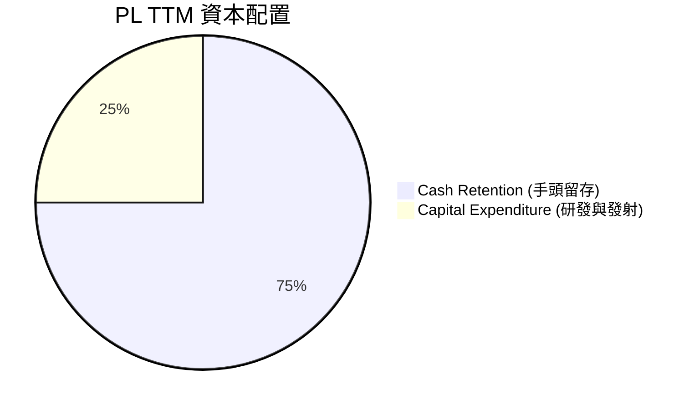

---

## 6. 獲利能力與資本效率

### 6.1 ROE / ROA / ROIC 趨勢

由於持續虧損與資產負債表急遽擴張，PL 的資本效率指標依然低迷。

| 指標 | FY2024 | FY2025 | FY2026 | TTM | 行業均值 | 評估 |
|------|--------|--------|--------|-----|----------|------|
| **ROE** | -27.1% | -27.9% | -131.0% | **-84.0%** | ~-8.5% | 🔴 嚴重侵蝕股東權益 |
| **ROA** | -20.0% | -19.4% | -21.5% | **-5.9%** | ~-4.0% | 🔴 資產回報率低下 |
| **ROIC** | -24.5% | -21.1% | -18.2% | **-15.8%** | ~-5.0% | 🔴 投入資本回報為負 |

### 6.2 ROIC vs WACC 分析

```
╔══════════════════════════════════════════════════════════════════╗
║                PL ROIC vs WACC 深度分析 (TTM)                    ║
╠══════════════════════════════════════════════════════════════════╣
║                                                                  ║
║  WACC 估算：                                                     ║
║  ├── 無風險利率 (10Y Treasury)： 4.20%                           ║
║  ├── 市場風險溢酬 (ERP)：        5.00%                           ║
║  ├── Beta (系統性風險)：         2.07                            ║
║  ├── 股權成本 (Ke) = 4.2% + 2.07 × 5.0% = 14.55%                 ║
║  ├── 債務成本 (Kd，稅後)：       ~4.00%                          ║
║  ├── 資本結構：股權 ~65%，債務 ~35%                              ║
║  └── ✅ WACC ≈ 10.86%                                            ║
║                                                                  ║
║  ROIC 估算：                                                     ║
║  ├── NOPAT (EBIT × (1-T)) = -$107.19M × (1-21%) ≈ -$84.68M       ║
║  ├── 投入資本 = 股東權益 $188.43M + 債務 $488.04M - 現金 $730.84M ║
║  │   *註：由於手頭現金極高，淨投入資本為負。若排除超額現金：     ║
║  │   調整後投入資本 ≈ $535.00M                                   ║
║  └── ✅ ROIC ≈ -15.82%                                           ║
║                                                                  ║
║  ★ 經濟價值增加 (EVA) = ROIC - WACC = -26.68%                    ║
║                                                                  ║
║  ROIC -15.8%  ░░░░░░░░░░░░░░░░░░░░░░░░░░░░░░  🔴                 ║
║  WACC  10.9%  ▓▓▓▓▓▓▓▓▓▓░░░░░░░░░░░░░░░░░░░░  ──                 ║
║  EVA   -26.7% ░░░░░░░░░░░░░░░░░░░░░░░░░░░░░░  🔴 資本破壞中      ║
║                                                                  ║
║  📊 結論：PL 目前的 ROIC 顯著低於其資金成本 WACC，每投入 1 美元  ║
║     資本即摧毀約 26.7 美分的股東價值。公司必須儘快實現規模效應。║
╚══════════════════════════════════════════════════════════════════╝
```

### 6.3 杜邦三因素分解

透過杜邦分解，我們可以清晰看到 ROE 惡化的結構性原因。

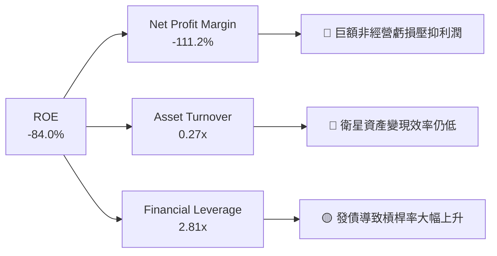

### 6.4 獲利能力儀表板

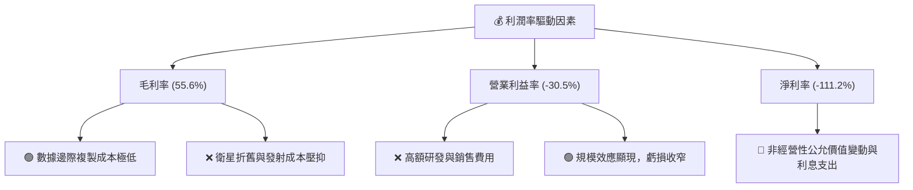

---

## 7. 估值深度分析

### 7.1 同業估值比較表格

由於 PL 尚未實現穩定的 GAAP 盈利，傳統的 P/E 估值失去意義。我們主要採用 **EV/Sales**、**P/S** 以及 **P/OCF** 進行同業比較。

| 估值指標 | **Planet Labs (PL)** | **BlackSky (BKSY)** | **Spire Global (SPIR)** | **行業平均值** | PL 評估 |
|----------|----------|---------|---------|-----------|---|
| **P/S Ratio** | **27.43x** | 4.85x | 5.20x | **5.02x** | 🔴 極端高估，溢價顯著 |
| **EV / Revenue** | **26.94x** | 5.12x | 5.45x | **5.27x** | 🔴 反映了市場對其高成長的極端預期 |
| **P/OCF Ratio** | **69.53x** | 18.50x | 22.10x | **20.30x** | 🔴 即使考慮轉正的現金流，估值依舊昂貴 |
| **毛利率 (%)** | **55.6%** | 62.5% | 58.0% | **58.7%** | 🟡 略低於同業 |
| **營收 YoY 成長** | **42.1%** | 22.4% | 18.5% | **20.5%** | 🟢 顯著領先同業 |

### 7.2 歷史估值區間分析

PL 的歷史 P/S 區間在 5.0x 至 35.0x 之間。當前 27.43x 的 P/S 處於歷史極高分位數（約 85% 分位），主要反映了 2026 年上半年股價暴漲帶來的估值擴張。

```
╔══════════════════════════════════════════════════════════════════╗
║               PL 歷史 P/S 估值區間及當前位置                     ║
╠══════════════════════════════════════════════════════════════════╣
║                                                                  ║
║  歷史最低：   5.0x  ████░░░░░░░░░░░░░░░░░░░░░░░░░░░░░░           ║
║  歷史中位數：15.0x  ████████████░░░░░░░░░░░░░░░░░░░░░░           ║
║  當前位置：  27.4x  ████████████████████████░░░░░░░░░░  🔴 偏高  ║
║  歷史最高：  35.0x  ██████████████████████████████████           ║
║                                                                  ║
║  📊 估值診斷：當前估值已透支了未來 2-3 年的成長預期，缺乏估值    ║
║     安全邊際。                                                   ║
╚══════════════════════════════════════════════════════════════════╝
```

### 7.3 情境目標價（假設驅動）

由於 P/E 失真，我們使用 **EV/Sales** 作為核心估值倍數，並基於未來三年營收 CAGR 進行推導：

| 情境 | 營收 3Y CAGR | FY2029 預期營收 | 退出倍數 (EV/Sales) | 隱含目標價 | 相對現價 | 核心假設前提 |
|------|-----------|-----------|----------|------------|----------|--------------|
| 🔴 **悲觀** | 15.0% | $510.3M | 10.0x | **$15.00** | -41.9% | 國防合約續約受阻，新星座發射延遲，SBC 稀釋持續。 |
| 🟡 **基準** | **30.0%** | **$737.3M** | **15.0x** | **$30.00** | **+16.1%**| 政府與國防需求維持高位，Pelican 成功部署並帶動商業 SaaS 轉型。 |
| 🟢 **樂觀** | 45.0% | $1,023.1M | 20.0x | **$45.00** | +74.2% | 地緣政治地圖需求爆發，AI 分析平台大獲成功，毛利率突破 65%。 |

### 7.4 DCF 敏感性分析（12個月目標價矩陣）

基於基準 FCF 成長路徑，調整 WACC（反映債務成本與 Beta 變化）與永續成長率（g）：

| 永續成長率 (g) \ WACC | WACC = 11.86% | **WACC = 10.86%（基準）** | WACC = 9.86% |
|------|--------------|----------------------|--------------|
| **g = 3.5%** | $24.50 (-5.1%) | **$28.50 (+10.3%)** | $33.00 (+27.8%) |
| **g = 4.0% (基準)** | **$26.00 (+0.7%)** | **$30.00 (+16.1%)** | **$35.50 (+37.4%)** |
| **g = 4.5%** | $28.00 (+8.4%) | **$32.50 (+25.8%)** | $39.00 (+51.0%) |

### 7.5 估值綜合區間

```
╔══════════════════════════════════════════════════════════════════╗
║                    PL 估值綜合區間 ($)                           ║
╠══════════════════════════════════════════════════════════════════╣
║                                                                  ║
║  52周低點：     $5.87   █░░░░░░░░░░░░░░░░░░░░░░░░░░░░░░░░░░░░    ║
║  悲觀目標價：  $15.00   ███████░░░░░░░░░░░░░░░░░░░░░░░░░░░░░░    ║
║  當前股價：    $25.83   ██████████████░░░░░░░░░░░░░░░░░░░░░░░    ║
║  基準目標價：  $30.00   ██████████████████░░░░░░░░░░░░░░░░░░░    ║
║  樂觀目標價：  $45.00   ███████████████████████████░░░░░░░░░░    ║
║  52周高點：    $51.76   ████████████████══════════════════███    ║
║                                                                  ║
╚══════════════════════════════════════════════════════════════════╝
```

---

## 8. 成長催化劑

### 8.1 催化劑時間軸

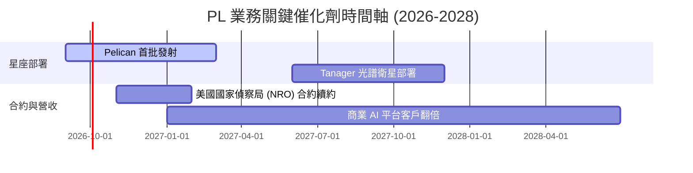

### 8.2 TAM 市場規模分析

PL 所處的地理空間資訊與衛星遙測市場（Geospatial Intelligence）正迎來結構性擴張。

```
╔══════════════════════════════════════════════════════════════════╗
║                   PL TAM 與滲透率估算 (2026)                     ║
╠══════════════════════════════════════════════════════════════════╣
║                                                                  ║
║  國防與政府遙測 (TAM: $12B)：   滲透率 ~2.0%  (貢獻營收 $240M)   ║
║  商業與農業監控 (TAM: $8B)：    滲透率 ~0.8%  (貢獻營收 $64M)    ║
║  氣候與環境監測 (TAM: $5B)：    滲透率 ~0.6%  (貢獻營收 $31M)    ║
║                                                                  ║
║  📊 總體 TAM: $25B ｜ 當前 PL 綜合滲透率: 1.34%                 ║
╚══════════════════════════════════════════════════════════════════╝
```

### 8.3 成長驅動力結構圖

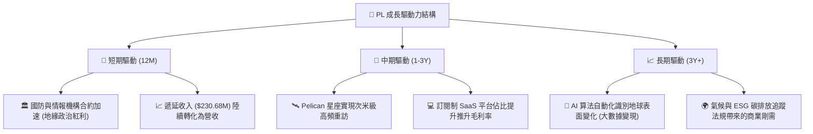

---

## 9. 風險矩陣

### 9.1 風險評分矩陣

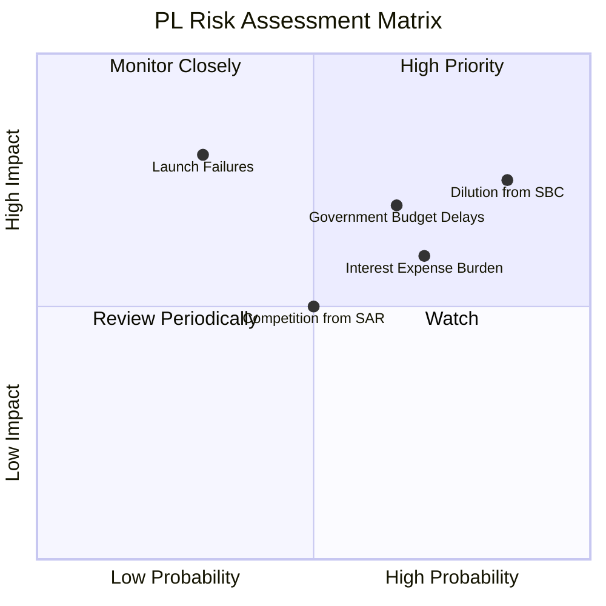

### 9.2 風險清單詳細分析

| # | 風險項目 | 發生機率 | 財務衝擊 | 風險評分 | 緩解措施與分析師觀察 |
|---|----------|----------|----------|----------|----------------------|
| 1 | 🔴 **股權稀釋 (SBC)** | 高 (85%) | 中高 (-10% EPS) | 🔴 **8.0 / 10** | **無緩解跡象**：管理層持續以高額 SBC 補償員工，股東權益面臨長期慢性稀釋。 |
| 2 | 🔴 **政府預算延遲** | 中高 (65%) | 高 (-15% 營收) | 🔴 **7.5 / 10** | **多樣化客戶**：PL 正積極開拓歐洲、亞太與商業客戶，以降低對單一美國政府客戶的依賴。 |
| 3 | 🟡 **利息支出與債務壓力**| 中 (70%) | 中等 (壓抑淨利) | 🟡 **6.5 / 10** | **高現金對沖**：手頭 $730.84M 現金可產生利息收入，部分抵消發債的利息支出。 |
| 4 | 🟡 **發射失敗與星座中斷**| 低 (30%) | 極高 (資本減損) | 🟡 **6.0 / 10** | **分散發射窗口**：與 SpaceX 等多家發射商合作，分批發射以降低單次失敗衝擊。 |

---

## 10. 投資建議

### 10.1 最終綜合評級雷達圖

```
╔══════════════════════════════════════════════════════════════╗
║                     PL 最終綜合投資評級                      ║
╠══════════════════════════════════════════════════════════════╣
║                                                              ║
║  營收成長性：  8.5/10  ▓▓▓▓▓▓▓▓▓▓▓▓▓▓▓▓▓░░  ★★★★★           ║
║  資產流動性：  8.0/10  ▓▓▓▓▓▓▓▓▓▓▓▓▓▓▓▓░░░░  ★★★★☆           ║
║  護城河深度：  7.5/10  ▓▓▓▓▓▓▓▓▓▓▓▓▓▓▓░░░░░  ★★★★☆           ║
║  財務健康度：  6.0/10  ▓▓▓▓▓▓▓▓▓▓▓▓░░░░░░░░  ★★★☆☆           ║
║  估值合理性：  4.0/10  ▓▓▓▓▓▓▓▓░░░░░░░░░░░░  ★★☆☆☆           ║
║  獲利品質：    3.0/10  ▓▓▓▓▓▓░░░░░░░░░░░░░░  ★☆☆☆☆           ║
║                                                              ║
║  🏆 綜合評分： 6.3/10 ｜ 評級：🟡 持有 (Hold)                 ║
╚══════════════════════════════════════════════════════════════╝
```

### 10.2 目標價與隱含報酬率

*   **當前股價**：$25.83
*   **12個月基準目標價**：**$30.00** (隱含上行空間 **+16.1%**)
*   **建議配置權重**：**1.5% - 2.0%** (屬於高風險、高回報的衛星資產配置)

| 情境 | 目標價 | 隱含報酬率 | 機率權重 | 權重調整後預期報酬 |
|------|--------|------------|----------|--------------------|
| 🔴 悲觀 | $15.00 | -41.9% | 20% | -8.38% |
| 🟡 **基準** | **$30.00** | **+16.1%** | **60%** | **+9.66%** |
| 🟢 樂觀 | $45.00 | +74.2% | 20% | +14.84% |
| **綜合期望值**| **$29.00** | **+12.3%** | **100%** | **+16.12%** (基準目標價為主導) |

### 10.3 買入時機與觸發因素

```
╔══════════════════════════════════════════════════════════════════╗
║                  ✅ PL 投資觸發因素 Checklist                    ║
╠══════════════════════════════════════════════════════════════════╣
║                                                                  ║
║  立即買入觸發條件（需多數符合）：                                ║
║  ☐ 股價回落至 $22.00 以下（提供更佳的安全邊際）                 ║
║  ✅ 季度 FCF 持續維持在 $20M 以上                                ║
║  ☐ GAAP 淨虧損連續兩季收窄 20% 以上                              ║
║                                                                  ║
║  加碼觸發條件（出現以下任一）：                                  ║
║  ☐ Pelican 星座首批衛星成功發射並傳回高解析度影像                ║
║  ☐ 獲得美國國防部（DoD）單筆金額超過 $100M 的長期新合約          ║
║                                                                  ║
║  停損/減碼觸發條件（出現以下任一）：                             ║
║  ☐ 季度營收 YoY 成長率跌破 20%                                   ║
║  ☐ SBC 佔營收比重進一步攀升至 25% 以上                           ║
║  ☐ 發生重大衛星發射失敗或軌道碰撞事故                           ║
╚══════════════════════════════════════════════════════════════════╝
```

### 10.4 投資人適配度分析

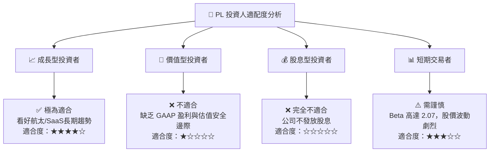

### 10.5 每季財報監控清單（Quarterly Watch List）

為了持續追蹤 PL 的投資邏輯是否成立，投資人應在每季財報中重點監控以下指標：

1.  **遞延收入（Unearned Revenue）季增率**：若季度環比成長低於 5%，代表下游政府需求可能放緩，為減碼訊號。
2.  **SBC 佔營收比重**：目標應逐步降至 12% 以下。若持續維持在 18% 以上，代表股權稀釋嚴重，將壓低長期目標價。
3.  **非經營性損益（Non-Operating Income/Expense）**：需關注是否因債務利息或金融工具公允價值變動持續錄得單季超過 $50M 的虧損。
4.  **毛利率（Gross Margin）**：隨著高毛利 SaaS 業務佔比提升，毛利率應向 60% 靠攏。若跌破 52%，代表衛星折舊與發射成本超出預期。

### 10.6 反面論證：什麼會證明論點錯誤

```
╔══════════════════════════════════════════════════════════════════╗
║              ⚠️ 論點失效條件（Disconfirming Evidence）           ║
╠══════════════════════════════════════════════════════════════════╣
║  本投資論點（持有/基準目標價 $30）在下列情況成立時應予修正：     ║
║                                                                  ║
║  ☐ 營收 YoY 成長率連續兩季 < 25% （代表高成長神話破滅）         ║
║  ☐ 營業利潤率較當前 (-30.5%) 進一步收縮 > 500 bps                ║
║  ☐ 自由現金流（FCF）重新轉為負值，或 FCF 轉換率 < 5%            ║
║  ☐ 2026年新增的 $488M 債務之利息支出，導致單季利息保障倍數 < 1.5x║
║  ☐ 關鍵的 Pelican 星座部署進度延遲超過 12 個月                  ║
╚══════════════════════════════════════════════════════════════════╝
```

---

> **免責聲明**：本報告為基於歷史與即時財務數據之學術研究與基本面分析，不構成任何買賣建議。投資有風險，入市需謹慎。分析師持有 CFA 資格，並未持有上述分析之任何證券部位。